# 17. 自动操作

我们人类的创造能力与勤奋精神常常令我感叹不已，但人类的本性却是相当懒惰的。举个简单而又常见的例子，我们总是不情愿工作，我们对工作的反感是如此的强烈—当然人类也很聪明—以至于情愿花费大量的时间去设计并制造一些设备，哪怕这些设备只能将工作时间缩减几分钟。悠闲地躺在吊床上，看着自己刚发明的新奇工具自动修剪草坪，没有什么事情能比这更让我们快乐的神经为之一动了。

当然，随着机器变得越来越精密，其复杂程度也越来越高，因此对其构造的某些部分理解起来比较困难。因此如果你略去了某些复杂的细节，这也是在情理之中，没有人会为此责怪你。但是请保持耐心，在本章的末尾我们将会设计出一种机器，我们可以称它为计算机(Computer)。

## 8位加法器问题

回忆我们曾在第14章讨论过的一个加法器，这个版本的加法器包括一个8位的锁存器，用于对8个开关的输入数据进行迭代求和，下面是其结构图。

使用这个设备时，首先需要按下清零开关使锁存器中的内容全部都变为0，然后通过开关输入第一个数，加法器只是简单地将这个数字和锁存器输出的0进行求和，因此相加的结果与原先输入的数字是一样的，按下相加开关可以把这个数保存在锁存器中，最后会点亮某些灯泡以显示它。现在通过开关输入第二个数，加法器把它与已经存放在锁存器中的第一个数相加，再次按下相加开关，就可以把相加的结果存入锁存器中，并通过灯泡显示这个结果。通过这种方式，可以把一批数据相加并显示运行结果。显然，这种设计方案存在一个缺陷：8个灯泡无法显示大于255的数。


对于第14章所介绍的这种电路，只用到了一种锁存器，它是电平触发(level triggered)的。在电平触发的锁存器中，为了保存数据必须将时钟输入端首先置1，然后回置为0。当时钟输入端为1时，锁存器的数据输入端变化将会影响到数据输出。在第14章的后半部分还介绍了边沿触发(edge-triggered)的锁存器，这种锁存器在时钟输入从0跳变为1的瞬间保存数据。边沿触发器在很多方面更加易于使用，因此假定本章用到的所有触发器都是边沿触发的。

用来累加多个数的锁存器称做累加器(accumulator)。

很显然，上面的加法器存在着一个很大的缺陷：假如要把100个8位二进制数加起来，你必须端坐于加法器前，并且耐心地输入所有的数并累加起来，但是当你终于完成时，却发现其中有两个数输错了，而你只能重复一遍所有的工作。

## RAM存储多个8位二进制

在前一章我们使用了大约500万个继电器构造了一个64 KB的RAM阵列，除此之外，我们还把一个控制面板连接到电路帮助我们工作，闭合它的控制（Takeover，有些书中也称“接管”）端开关后，就可以使用其他开关来控制RAM阵列的读写，下面是64 KB RAM阵列结构图。

如果把这100个8位二进制数输入到RAM阵列中而不是直接输入到加法器中，一旦需要修改一些数据，我们的工作将会变得容易得多。


因此我们所现在面临的挑战就是如何把RAM阵列和加法器连接起来。很显然，RAM阵列的输出信号可以替代加法器的开关，而且用一个16位的计数器（比如我们在14章构造的那种）就可以控制RAM阵列的地址信号。在这个电路中，RAM阵列的数据输入信号和写操作端信号可以省去，修改后的电路结构如下图所示。


当然，这并不是迄今发明的最易于使用的计算设备。要使用它，首先要闭合清零开关，这样做的目的是，清除锁存器中的内容并把16位计数器的输出置为0000h，然后闭合RAM控制面板的控制端开关（闭合控制端开关，目的是将这100个8位二进制数通过开关输入到RAM阵列中）。

现在你可以从地址0000h开始输入一组你想要相加的8位数，如果有100个数，那么它们将被存放在0000h～0063h的地址空间中（也应该把RAM阵列中未使用的单元设置为00h（对于该RAM来说一个单元有8位））。然后断开RAM控制面板的控制端开关（这样控制面板就不再控制RAM阵列了），同时断开清零开关。做完了这些，我们可以静静地坐下来，观察灯泡显示运算结果。

> 在程序真正跑起来之前，我们需要完成下面的事情：
>
> 1. 第一步往RAM中写入一批8位二进制数据，此时振荡器是没有启动的。
> 2. 往RAM中写入数据时一个连续的操作，这个操作分为两步，第一步是选择地址，第二步是填入值。
> 3. 将100个8位二进制数据全部添加到RAM中，这就算完成了。

让我们来看一下它是怎样工作的：当清零开关第一次断开时，RAM阵列的地址输入是0000h，RAM阵列的该地址中存放的8位数值是加法器的输入数据，加法器的另一个输入数据为00h，因为此时锁存器也已经清零了。当时钟信号由0跳变为1时，将有两件事同时发生：锁存器保存加法器的计算结果，同时16位计数器增1，指向RAM阵列的下一个地址单元。时钟信号第一次从0跳变为1时，锁存器就将第一个数值保存下来，同时计数器增加为0001h；当时钟发生第二次跳变时，锁存器保存之前两个数的求和结果，同时计数器增加为0002h；按这种方式往复操作。（时钟信号触发计数器，计数器触发地址移动）

要注意的是，这里首先做了一些假设，最主要的一点就是，振荡器要足够慢以使电路的其他部分可以工作，每次时钟振荡的过程中，在加法器输出有效的结果之前，一些继电器必须去触发其他继电器。

## 自动加法器的缺陷

这个电路存在的一个缺陷是：我们没有办法使它停下来。在某一个时刻，所有灯泡的发光组合将不再改变，因为RAM阵列的剩余部分存放的数都是00h，这时你可以读取二进制的运算结果。但是当计数器达到FFFFh时，它会重新回滚(roll over)到0000h（这就好像汽车的里程表一样），这时自动加法器会再一次把所有的数累加到已经计算出来的结果中去。

这个加法器还存在另一个问题：它只能做加法运算，并且只能做8位数的加法。在这个RAM阵列中，不但每一个数要小于255，而且任意个数相加的结果也要小于255，此外，该加法器也不能处理减法运算。要处理更大的数（例如，16位数）的话，一个简单的方法是：把RAM阵列、加法器、锁存器的位宽全都加倍，同时增加8个灯泡，但这些投资在我们看来是不合算的。

当然，这里提到这些问题的原因是最终我们要解决它们，但首先来关注另一个问题：如果你不需要把100个数加在一起呢？如果你想做的是用自动加法器把50对数分别相加，得出50个不同的结果呢？或者你需要方便地对两个数，10个数甚至100个数求和，并且所有的计算结果都可以很方便地使用。（这个问题可能来的很突然，没错，但不用担心，咱们先继续往下看）

先前提到的自动加法器都是用连接在锁存器上的灯泡来显示运行结果的，但是如果你想对50对数分别求和的时候，这就不是一个好的方法了。**你可能想到把运算结果存回到RAM阵列中去，这样的话，就可以在适当的时候用RAM阵列的控制面板来检查运算结果，没错，就是这个思路。**

这意味着我们可以去掉与锁存器连接的灯泡，取而代之的是把锁存器的输出端连接到RAM阵列的数据输入端，这样就可以把计算结果写回到RAM阵列中去，如下图所示。


上图中略去了自动加法器的其他部分，其中包括振荡器和清零开关，这是因为我们不再需要特别关注计数器和锁存器的清零及时钟输入。此外，既然我们现在已经开始利用RAM的数据输入，因此需要一种用来控制RAM写入信号的方法。

## 三个数求和

假设我们先要对三个数进行求和，然后对两个数进行求和，最后再对三个数进行求和。想象一下，我们可以把这些数保存在RAM阵列中以0000h开始的一组空间中，这些数存储在RAM阵列中的具体形式如下图所示。


本书中将用这样的形式表示一小段存储器，方格表示的是存储器的内容，存储器的每一个字节写在一个方格里。地址标记在方格的左边，并不是每一个地址都需要标记，因为地址是线性的，所以总是可以通过计算确定某个方格对应的地址。方格右边是关于该存储单元内容的注释，这些标记的单元就是我们想要自动加法器保存三个计算结果的位置（尽管这些方格画出来是空的，但是存储单元内并不是空的，它们总是保存着一些东西，此时存放的是一些没有用的数）。

或许大家都有一种冲动，想亲自去做十六进制计算，并把结果填到那些小格子中去，但这并不是实验的目的，我们想要自动加法器为我们做这些加法。

我们并不希望自动加法器成为单任务系统——在它的第一个版本中，只是把RAM地址中的内容加到称为累加器的8位锁存器中——实际上我们希望它能做四件事：进行加法操作，首先它要把一个字节从存储器中传送到累加器中，这个操作称为加载(Load)。第二个操作把存储器中的一个字节加(Add)到累加器的内容中去。第三个操作把累加器中的计算结果取出并存放到存储器中。另外我们需要用一个方法令自动加法器停(Halt)下来。

我们借助具体的例子详细介绍这一过程。

```
(1)把0000h地址处的内容加载到累加器。
(2)把0001h地址处的内容加到累加器中。
(3)把0002h地址处的内容加到累加器中。
(4)把累加器中的内容存储到0003h地址处。
(5)把0004h地址处的内容加载到累加器。
(6)把0005h地址处的内容加到累加器。
(7)把累加器中的内容存储到0006h地址处。
(8)把0007h地址处的内容加载到累加器。
(9)把0008h地址处的内容加到累加器。
(10)把0009h地址处的内容加到累加器。
(11)把累加器中的内容存储到000Ah地址处。
(12)令自动加法器停止工作。
```

这里要注意，同最初的自动加法器一样，存储器中的地址仍然是以0000h为起点线性排列的。最初的加法器只是简单地把存储器指定地址的内容和累加器中的内容相加，在某些情况下需要这样做。但是有时我们需要把存储器中的某个值直接加载到累加器，或者把累加器中的值直接保存到存储器。我们还希望自动加法器能方便地停下来，以便于查看RAM阵列中存放的值。

该如何来完成这些工作呢？能不能仅仅简单地向RAM阵列中输入一组数，然后期待自动加法器正确地完成所有工作呢？答案是否定的。**对于RAM阵列中的每一个数，我们还需要用一些数字代码来标识加法器要做的每一项工作：加载、相加、保存和终止。**（这里用数字代码来标识加法器要做的工作，就是，当加法器看到这些数字代码就知道如何控制众多的信号以此来完成任务）

也许存放这些代码的最简单的方法（但肯定不是代价最小的）是把它们存放在一个独立的RAM阵列中，这个RAM应该和第一个RAM同时被访问。**但是这个RAM中存放的是不需要求和的数，而是一些数字代码，用来标记自动加法器对第一个RAM中指定地址要做的一种操作。这两个RAM可以分别被标记为“数据”（第一个RAM阵列）和“代码”（第二个RAM阵列）**，其结构如下图所示。


我们已经清楚地认识到新的自动加法器能够把数据求和的结果写入到第一个RAM阵列（标记为“数据”），而新的RAM阵列（标记为“代码”）则只能通过控制面板写入数字代码。

我们需要四个代码来标记新的自动加法器需要做的四个操作，这些代码可以任意指定，如下所示的是一种方案。


为了使上面讨论的三组加法得以正常执行，你需要通过控制面板把如下值存入代码RAM阵列。

比较一下该RAM阵列与存放累加数据的RAM阵列中的内容，你会发现，代码RAM阵列中存放的每一个代码都对应着数据RAM中要被加载或者加到累加器中的数，或者对应需要存回到数据RAM中的某个数。**以这种方式使用的数字代码常常被称为指令码(instruction code)或操作码(operation code, opcode)，它们指示电路要执行的某种操作。**


如前所述，上述的自动加法器的8位锁存器的输出要作为数据RAM阵列的输入，这就是Save指令的功能。还需要做另一个改变：以前8位加法器的输出是8位锁存器的输入，但现在为了执行Load指令，数据RAM阵列的输出有时也要作为8位锁存器的输入，这种新的变化需要一个2-1选择器来实现，改进后的自动加法器如下图所示。

图中略去了一些组件，但是仍然清晰地描述了各个组件之间的8位数据通路，16位的计数器为两个RAM阵列提供地址输入。通常，数据RAM阵列的输出传入到8位加法器执行加操作；8位锁存器的输入可以是数据RAM阵列的输出（当执行Load指令时），也可以是加法器的输出（当执行Add指令时），这种情况下就需要2-1选择器。通常，锁存器电路的输出又流回到加法器中，但是当执行Save指令时，它就成为了数据RAM阵列的输入数据。


## 控制信号与减法

**上图缺少的是控制所有这些组件的信号，它们统称为控制信号，**包括16位计数器的“时钟”输入和“清零”输入，8位锁存器的“时钟”输入和“清零”输入，数据RAM阵列的“写”(W)输入，2-1选择器的“选择”(S)输入。**其中的一些信号很明显是基于代码RAM阵列的输出**，例如，如果代码RAM阵列输出是Load指令，那么2-1选择器的“选择”输入必须是0（即选择数据RAM的输出），只有当操作码是指令Store时，数据RAM阵列的“写”(W)输入必须是1。**这些控制信号可以通过逻辑门的各种组合来实现。**

利用最少的附加硬件和一些新增的操作码，可以让这个电路从累加器中减去一个数，第1步是向操作码表增加一些代码。


对于Add和Subtract的代码，其区别仅在于最低有效位，我们称该位为$C_0$。如果操作码为21h，除了数据RAM阵列的数据传入加法器之前要取反，并且加法器进位输入置1之外，电路所做的操作与执行Add指令所做的操作相同。在这个增加了一个反相器的改进电路中，$C_0$信号可以完成这两项任务，改进后的电路结构图如下。


假设现在要把56h和2Ah相加，然后再从中减去38h，可以按照下图中两个RAM阵列中的代码（操作码）和数据（操作数）完成该运算。


Load操作完成之后，累加器中的值更新为56h，加法操作完成后累加器中的值为56h与2Ah的和，即80h。Subtract操作使得$C_0$信号置为1，数据RAM阵列的下一个值(38h)按位取反，得到C7h，并使得加法器的进位输入置1，然后使其与80h相加：


最后的结果是48h。（这里并没有计算完，还需减一个值）

## 16位加 / 减法

还有一个一直没有找到合适的解决办法的问题：加法器及连接到它的所有设备的宽度只有8位，以前提出过的一个解决办法是把两个8位加法器（其他的大部分设备也用两个）连在一起，构成一个16位的设备。

但还有代价更小的解决办法，假如你想把两个16位的数相加，比如：


这种16位的加法先单独处理最右边的字节（通常称之为低字节）：


然后再计算最左边的字节，即高字节的和：


得到相同的结果99D7h。因此，如果我们把两个16位的数用这种方式保存在存储器中，就像下面这样：


运算结果D7h将被保存到地址0002h，而结果99h将被保存到地址0005h。

当然并非所有的情况都是这样处理，只是上面的例子中用到了这种方法。如果要把76ABh和236Ch这两个16位的数相加该怎么做呢？在这个例子中，对两个数的低字节求和时将会产生一个进位：


产生的这个进位必须与两个数的高字节的和再相加：


最后的计算结果为9A17h。

我们能够改进自动加法器的电路，使它可以正确地进行16位数的加法操作吗？答案是肯定的，我们需要做的仅仅是在第一步运算时保存低字节数运算的进位输出，并把它作为下一步高字节数运算的进位输入。**如何保存1位呢？1位锁存器就是最好的选择了，该锁存器应该被称为进位锁存器(Carry latch)。**

为了使用进位锁存器，还需要另一个操作码，我们称之为“进位加法”(Add with Carry)。当进行8位数加法时，使用的是常规的Add指令，加法器的进位输入是0，它的进位输出将会保存到进位锁存器（尽管它根本不会被用到）。

**如果要对两个16位的数进行加法运算，我们仍然使用常规的Add指令对两个低字节数进行加法运算，加法器的进位输入是0，而其进位输出被锁存到进位锁存器中。当把两个高字节数相加时，要使用新的Add with Carry指令，在这种情况下，两个数相加时要用进位锁存器的输出作为加法器的进位输入。**因此，如果第一步低字节数的加法运算有进位，则该进位将用于第二步高字节数的加法运算；如果没有进位，则进位锁存器的输出是0。

如果要进行16位数的减法运算，则还需要一个新的指令，称为“借位减法”(Subtract and Borrow)。通常，Subtract指令需要将减数取反并且把加法器的进位输入置1，进位输出正常为1。对16位数进行减法运算时，进位输出应该保存在进位锁存器中，在进行第二步的高字节减法运算时，锁存器保存的结果应该作为加法器的进位输入。（不要被“借位减法”这个名字误导了，现在减法都是用加法实现的，哪儿还要考虑什么借位？）

在加入了Add with Carry和Subtract and Borrow之后，目前我们已经有了7个操作码，如下表所示。


在执行减法或借位减法运算时，送入加法器中的操作数需要进行取反预处理。

无论何时，执行加法、减法、进位加法或借位减法中的任一种运算，进位锁存器都是同步的。

当执行减法运算，或进位锁存器的数据输入为1且正在执行进位加法或者借位减法运算时，8位加法器的进位输入都是置1的。

需要记住的是，只有当前一次的加法或者进位加法操作使加法器产生进位输出时，Add with Carry指令才会使8位加法器的进位输入置1。但是只要进行多字节数加法运算，不管实际是否需要，都应该使用Add with Carry指令，所以前面提到16位加法可用如下方法。


增加了两个新的操作码之后，我们已经极大地扩展了加法器的功能，它不再局限于8位数的加法运算。通过执行进位加法操作，可以对16位数、24位数、32位数、40位数，甚至更多位的数进行加法运算。假如要进行两个32位数7A892BCDh和65A872FFh的加法运算，我们仅需要1条Add指令和3条Add with Carry指令，如下图所示。


## 指令系统的背景

把这些数依次输入存储器并不是最好的做法，因为你不但要使用开关来输入这些数，而且保存这些数的存储单元的地址也不是连续的。例如，7A892BCDh从最低字节开始，每个字节依次保存在0000h, 0003h, 0006h, 0009h中。而为了得到最后的结果，还需要检查0002h, 0005h, 0008h, 000Bh这几个地址中的数。

除此之外，当前设计的自动加法器不允许在随后的计算中重复使用前面的计算结果。假设我们要对三个8位数求和，然后再从中减去一个8位数并保存结果。这可能需要一条Load指令，两条Add指令，一条Subtract指令以及一条Store指令。但如果想从原来的求和结果（3个8位数的和）中减去另一个数该怎么做呢？这个求和结果已经不能被访问了，每次我们使用它的时候都必须重新计算。

**产生上述情况的原因就在于我们构造的自动加法器具有如下的特性**：它的代码存储器和数据存储器是同步的、顺序的，并且都从0000h开始寻址。代码存储器中的每一条指令对应数据存储器中相同地址的存储单元，一旦执行了一条Store指令，相应的，就会有一个数被保存到数据存储器中，而这个数将不能重新加载到累加器。

要解决这个难题，需要对自动加法器的设计做一个根本性的且程度极大的修改。这个想法实现起来似乎非常困难，但是很快你就会发现改进后的加法器具有更高的灵活性。

现在让我们立刻开始吧，目前已经有了7个操作码，如下所示。


每一个操作码在存储器中占1个字节，现在除了Halt操作码外，我希望每一个指令在存储器中仅占据3个字节的空间，其中第一个字节为代码本身，另外的两个字节用来存放1个16位存储器单元地址（相当于把数据RAM和代码RAM合二为一了）。

对于Load指令来说，后两个字节保存的地址用来指明数据RAM阵列的一个存储单元，该单元存放的是需要被加载到累加器中的字节（也就是数据xxh）。对于Add,Subtract, Add with Carry, Subtract with Borrow指令来说，该地址指明的存储单元所保存的是要从累加器中加上或减去的字节（也就是数据xxh）。对于Store指令来说，该地址指明的是累加器中的内容将要保存到的存储单元地址。

例如，当前加法器所能进行的最简单的运算就是对两个数求和，为了执行这个操作，需要按下面的方式设置代码RAM阵列和数据RAM阵列。


在改进的自动加法器中，每条指令（除了Halt指令）需要3个字节。


每一条指令的代码（除了Halt指令）后跟两个字节，用来指明数据RAM阵列中16位的存储地址，这三个地址恰巧是0000h, 0001h和0002h，但它们可以是任何其他可用的地址。（指令=代码(指令码、操作码)+地址）

前面讲到了如何用Add或Add with Carry指令来对两个16位数—比如76ABh和232Ch求和，必须把两个数的低字节保存到存储器的0000h和0001h地址，把其高字节保存到0003h和0004h地址，运算的结果分别保存在0002h和0005h。

通过这种变化，我们可以用一种更合理的方式来保存这两个操作数及其运算结果，可能会把它们保存到我们从未用到过的存储区域。


这6个存储单元不必像上图中这样全都连在一起，它们可以分散在整个64 KB数据RAM阵列的任意位置。为了把这些地址中的数相加，代码RAM阵列中的指令必须用以下方式设置。


可以看到，保存在地址4001h和4003h处的两个低字节数先执行加法，其结果保存在4005h地址处。两个高字节数（分别保存在4000h和4002h处）通过Add with Carry指令（代码为22h，图片笔误为21h）相加，其结果保存在地址4004h处。如果去掉Halt指令并向代码RAM中加入更多指令，随后的计算可以通过引用地址很方便地使用原来的那些操作数及其结果。

实现该设计的关键是把代码RAM阵列的数据输出到3个8位锁存器中，每个锁存器保存该3字节指令的一个字节。第一个锁存器保存指令代码本身，第二个锁存器保存地址的高字节，第三个锁存器保存地址的低字节，第二个和第三个锁存器的输出构成了数据RAM阵列的16位地址。


从存储器中取出指令的过程称为取指令(instruction fetch)，在我们设计的加法器中，每一条指令的长度是3个字节，因为每次只能从存储器取回一个字节，所以取每条指令需要的时间为3个时钟周期。一个完整的指令周期需要4个时钟周期（第四个时钟周期是用于执行指令，在计算机中，指令周期通常包括取指(Fetch)和执行(Execute)两个阶段）。

**机器响应指令做一系列操作的过程称为执行(execute)指令，但这并不能表明机器是一种有生命的东西，因为它不能自行分析指令并决定该做什么，每一种指令用其唯一的方式触发多种控制信号，从而引发机器执行各种操作。**

注意，为了让上面的加法器更加有用，我们牺牲了运算速度，使用同样的振荡器，它的运算速度只有本章提到的第一个加法器的1/4。这验证了一个称为TANSTAAFL的工程准则，它的意思是“天下没有免费的午餐”，通常上帝总是很公平的，你改进了机器的某个方面，则其他方面就会受到损失，有得就有失。

### 合并两个RAM

前面介绍了两种RAM阵列，一个用来存放指令，另一个用来存放数据——这种设计使得自动加法器的结构非常清晰和易于使用。但现在我们使用3字节长的指令格式，第二个和第三个字节用来指明操作数的存储地址，因此就没有必要再使用两个独立的RAM阵列，指令和数据可以存放在同一个RAM阵列。

为了实现这个设计，我们需要一个2-1选择器来确定如何对RAM阵列寻址。和前面的方式相同，我们用一个16位的计数器来计算地址，数据RAM阵列的输出仍然连接到3个锁存器，分别用来保存指令代码及其对应操作数的16位地址，**其16位的地址输出是2-1选择器的第二种输入，地址被锁存后可以通过选择器将其作为RAM阵列的地址输入。**

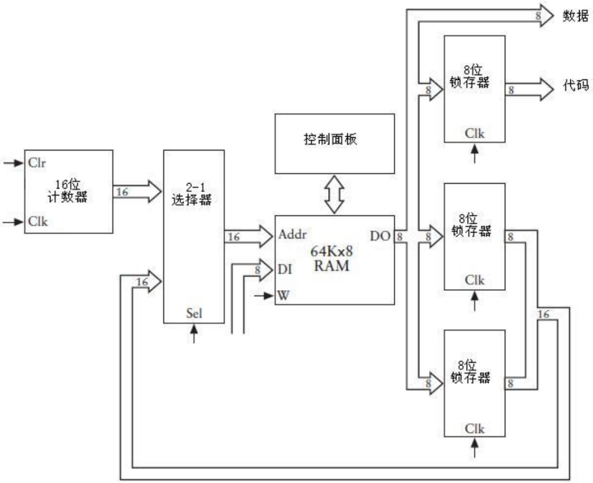

我们已经对原电路做了不少改进，现在可以把指令和数据保存在同一个RAM阵列中，例如，下图演示了如何把两个8位数相加，然后从结果中再减去一个8位数。

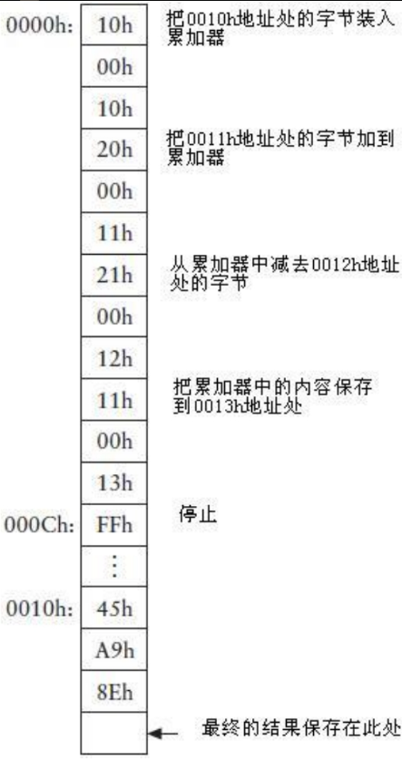

通常，指令从0000h开始存放，这是因为当计数器复位后从该位置访问RAM阵列，最后的Halt指令存放在000Ch地址。我们可以把这3个操作数及它们的运算结果保存在RAM阵列的任何地址（当然这不包括最开始的13个字节，因为它们已经用来存放指令），所以我们选择在从0010h地址开始保存数据。

## Jump指令

**假设现在你发现需要在原来的结果中再加两个数**，你可以向存储器中输入一些新的指令以替换原来所有的指令，但是你可能不愿意这么做，或许你更倾向于在原指令的地址后增加一些新的指令。第一步要做的就是把000Ch地址处的Halt指令替换为一个Load指令，你还需要增加两条Add指令，一条Store指令，以及一条新的Halt指令。唯一的问题是，现在0010h地址已经保存了一些数据，因此需要把这些数据转移到较高的地址空间中，然后还需要修改那些指向这些地址空间的指令。

把指令和数据存放在同一个RAM阵列并不是一个急于解决的问题，但可以肯定的是，这是一个迟早要解决的问题，不如现在就找一个解决办法吧。在当前的例子中，也许你更愿意从0020h地址开始存放新的指令，并从0030h处开始存放新的数据。

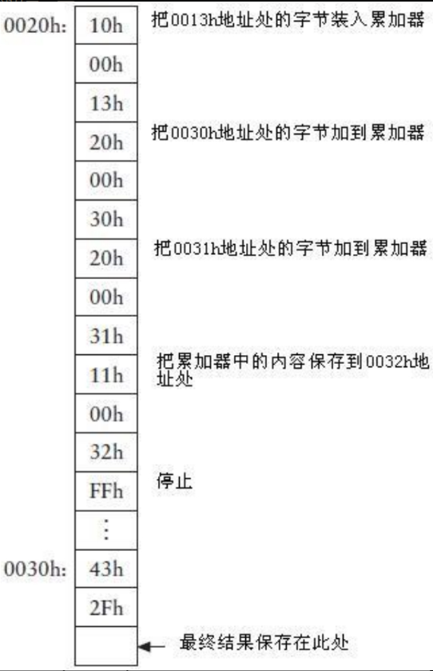

注意，第一条Load指令所指向的地址为0013h，这个位置保存着第一次运算的结果。

**现在，两部分指令的位置分别起始于地址0000h和0020h，而两部分操作数据的地址分别起始于0010h和0030h。我们希望自动加法器从0000h开始执行所有指令完成计算任务。**

我们必须移除000Ch处的Halt指令，这里的移除是指用其他代码替换它，但仅仅如此是不够的，问题在于不论我们用什么来替换Halt指令，保存在地址000Ch的字节都会被当做指令代码，更糟糕的是，从这个位置开始，存储器中每隔3个字节的地址：000Fh,0012h, 0015h, 0018h, 001Bh以及001Eh，这些地址保存的字节也会被当做指令代码来处理。

如果其中的一个字节恰好为11h（这是Store指令的代码）将会发生什么？如果Store指令后面的2个字节的地址所指向的位置刚好为0023h，那又会发生什么呢？它导致的结果是，加法器将累加器中的内容写入这个地址，而这个地址中已经保存了重要的数据。即使这些情况都没有发生，加法器从存储器的001Eh地址之后取到的下一条指令的位置将是0021h，不是0020h，而事实上0020h才是下一条指令的存储地址。

我们能寻求到更好的解决办法吗？

我们可以用一个称为Jump（跳转）的新指令来替换Halt指令，现在把它加入到指令表。

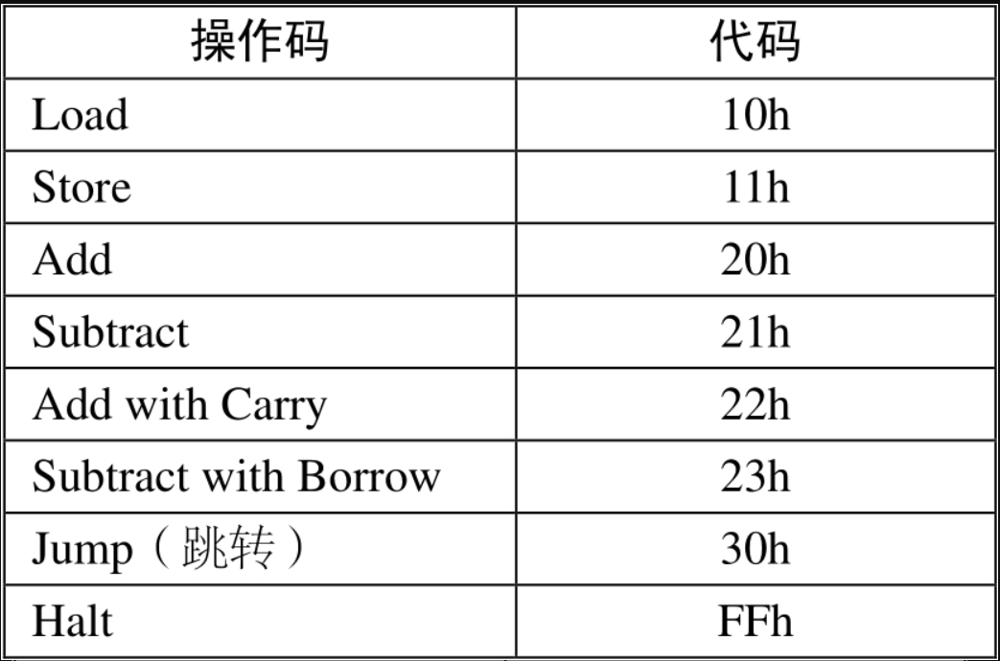

通常情况下自动加法器是以顺序方式对RAM阵列寻址的，Jump指令改变了机器的这种寻址方式，取而代之的是从某个指定的地址开始寻址，这种指令有时也被称作分支(branch)指令或者Goto指令，即“转到另一个位置”。

在上面的例子中，我们可以用一个Jump指令来替换000Ch地址处的Halt指令。


30h即Jump指令的代码，其后的两个字节中存放的16位地址就是自动加法器要执行的下一条指令的地址。

因此在上面的例子中，自动加法器仍然从0000h地址开始，依次执行一条Load指令，一条Add指令，一条Subtract指令和一条Store指令，之后执行一条Jump指令，跳转至地址0020h继续依次执行一条Load指令，两条Add指令，一条Store指令，最后执行一条Halt指令。

**Jump指令通过作用于16位计数器实现其功能，无论何时，只要自动加法器遇到Jump指令，计数器就会被强制输出该Jump指令后的16位地址**，这可以通过16位计数器的D型边沿触发器的预置(Pre)和清零(Clr)输入来实现：

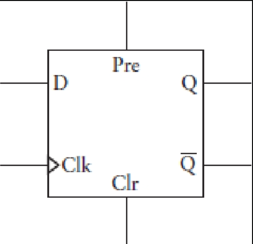

这里要再次声明，在正常的操作下，Pre和Clr端的输入都应该是0。当Pre=1,Q=1；当Clr=1，则Q=0。如果你希望向一个触发器加载一个新的值（用A表示，代表地址），可以像下图所示这样连接。

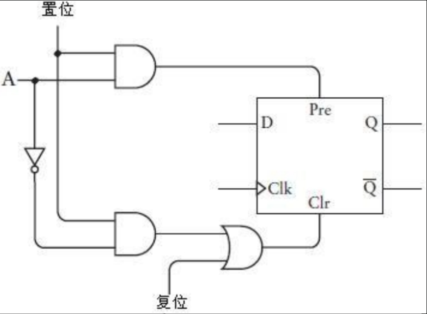

当置位信号为1时，如果A为1，则清零输入为0，预置输入为1；这就意味着Q端将被设置为与A端相同的值。

我们需要为16位计数器的每一位设置一个这样的触发器，一旦加载了某个特定的值，计数器就会从该值开始计数。

这对电路的改动并不是很大，从RAM阵列锁存得到的16位地址既可以作为2-1选择器（它允许该地址作为RAM阵列的地址输入）的输入，也可以作为16位计数器置位信号的输入。

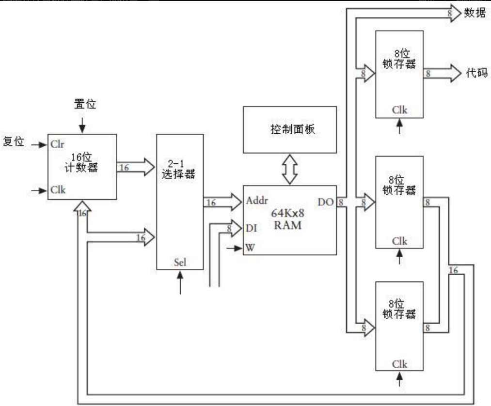

显然，只有当指令代码为30h并且其后的16位地址被锁存时，我们才必须确保置位信号为1。

## 条件Jump

毋庸置疑，Jump指令的确很有用，但与之相比，一个在我们想要的情况下跳转的指令更加有用，这种指令称做条件跳转(Conditional Jump)，也许说明该命令重要性的最好方法是这样一个问题：怎样让自动加法器进行两个8位数的乘法运算？例如，我们如何利用自动加法器得到像A7h与1Ch相乘这种简单运算的结果呢？

这其实很简单，两个8位数相乘得到一个16位数，为了方便起见，把该乘法运算中涉及的3个数均表示为16位数。第一步确定要把乘数和乘积保存到什么位置。

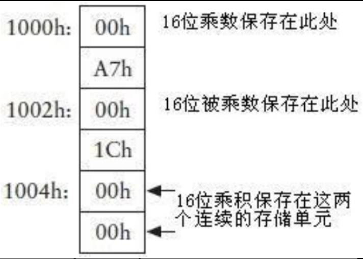

大家都知道 A7h(十进制167) 和 1Ch(十进制28) 相乘的结果和把28个A7h累加的结果相同，因此保存在地址1004h和1005h的字节实际上是累加的结果，下图演示了如何把 A7h 加到该地址。

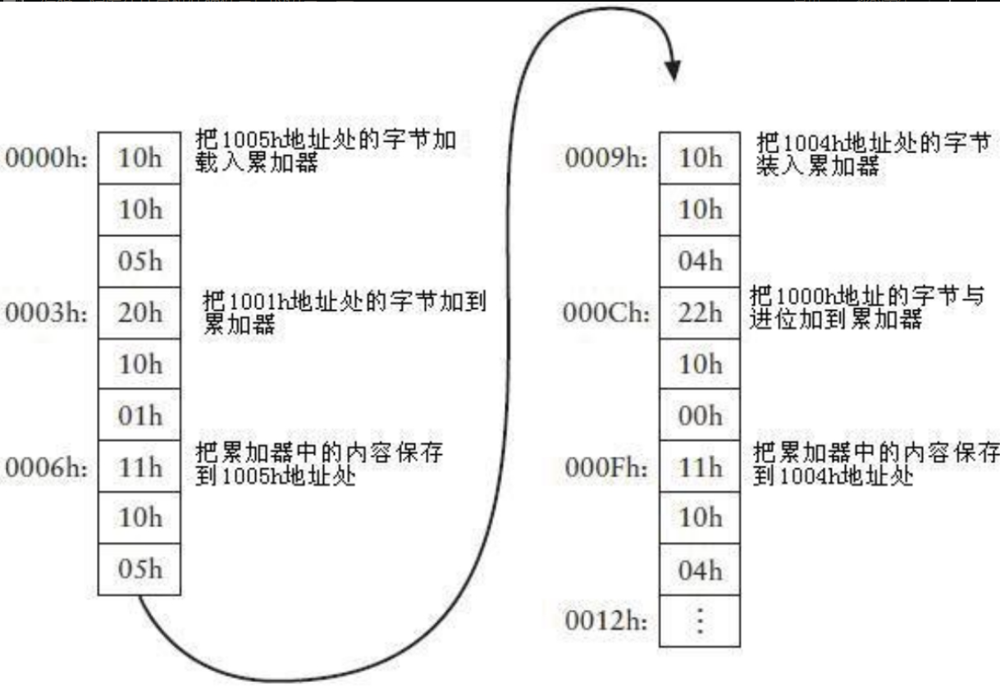

当这6条指令执行完毕之后，存储器1004h和1005h地址保存的16位数与A7h乘以1的结果相同。因此，为了使存放于该地址的值等于A7h与1Ch相乘的结果，要把这6条指令再反复执行27次。为了达到这个目的，可以在0012h地址开始把这6条指令连续输入27次；也可以在0012h处保存一个Halt指令，然后将复位键连续按28次得到最终结果（这里的复位键应该是指16位计数器的 clr 键，一键复位归零，这样程序就又开始从0000h执行了）。

当然，这两种方式都不是很理想，它们都要求你做重复做许多遍烦琐的事情：输入一系列指令或者反复按复位键，而重复的次数就等于乘数，你当然是不会愿意用这种方式来进行16位数乘法运算的。

但如果在地址0012h处放置一条Jump指令会怎样呢？这个指令使得计数器再次从0000h处开始计数。

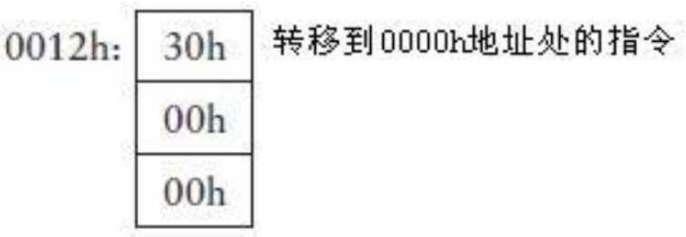

这的确是一个巧妙的方法，第一次执行完指令之后，位于存储器的1004h和1005h地址的16位数等于A7h乘1，然后Jump指令使下一条指令从存储器顶部开始执行，第二次执行指令后，该16位数等于A7h乘2，最后其结果可以等于A7h乘1Ch。但是，这个过程不会停止下来，它会一直反复执行下去。

**我们需要的是这样一种Jump指令，它只让这个过程重复执行所需要的次数，这种指令就是条件跳转指令，它并不难实现。要实现它，要做的第一步是增加一个与进位锁存器类似的1位锁存器，该锁存器被称为零锁存器(Zero latch)，这是因为只有当8位加法器的输出全部为0时，它锁存的值才是1。**


使或非门的输出为1的唯一方法是其所有的输入全为0。**与进位锁存器一样，只有当Add、Subtract、Add with Carry、Subtract with Borrow这些指令执行时，零锁存器才锁存1个数，该数称做零标志位(Zero flag)。**注意，它是以一种似乎是相反的方式工作的：当加法器的输出全为0时，零标志位等于1；当加法器的输出不全为0时，零标志位等于0。

有了零锁存器以后，我们可以为指令表新增4条指令：

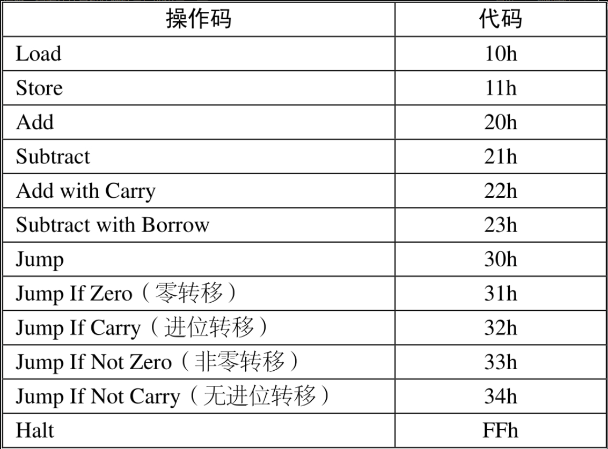

例如，非零转移指令(Jump If Not Zero)只有在零锁存器的输出为0时才会跳转到指定的地址，换言之，如果上一步的加法、减法、进位加法、或者借位减法等运算的结果为0时，将不会发生跳转。**为了实现这个设计，只需要在常规跳转命令的控制信号之上再加一个控制信号：如果指令是Jump If Not Zero，那么只有当零标志位是0时，16位计数器才被触发。**

下图中0012h地址之后的指令即两个数相乘所用到的上表中的所有指令。

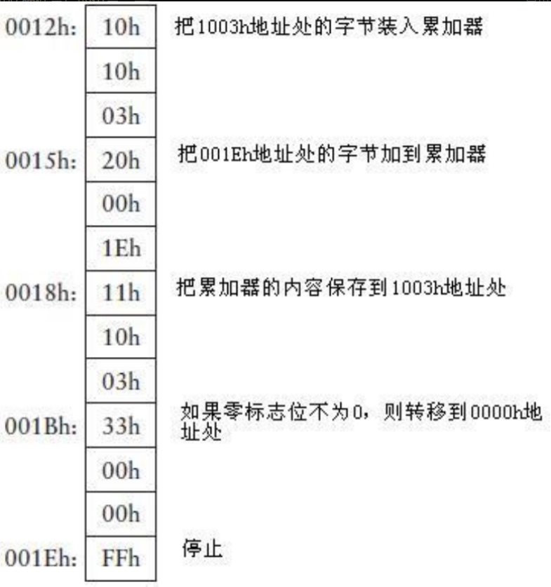

第一次循环之后，位于地址1004h和1005h处的16位数等于A7h与1的乘积，这和我们的设计相符。在上图中，地址1003h处的字节通过Load指令载入到累加器，该字节是1Ch，把这个数和001Eh地址的字节相加（解释：这时的FFh不再是一个指令了，而是一个确定的数字）。FFh与1Ch相加的结果 (结果为11Bh) 与从1Ch中减去1的结果相同，都是1Bh，因为这个数不等于0，所以零标志位是0，1Bh这个结果会存回到1003h地址。下一条要执行的指令是Jump If Not Zero，零标志位没有置为1，因此发生跳转，接下来要执行的一条指令位于0000h地址。

需要记住的是，Store指令不会影响零标志位的值，只有Add、Subtract、Add with Carry、Subtract with Borrow这些指令才能影响零标志位的值。

经过两次循环后，1004h和1005h地址所保存的16位数等于A7h与2的乘积，1Bh与FFh的和等于1Ah，不为0，因此仍然返回到顶部执行。

当执行到第28次循环时，1004h和1005h地址保存的16位数等于A7h和1Ch的乘积，1003h地址保存的值是1，它和FFh相加的结果是0，因此零标志位被置位！Jump If Not Zero指令不会再跳转到0000h地址，下一条要执行的指令即Halt指令，这样，我们就完成了全部的工作。

## 计算机组成

现在可以断言，我们一直不断完善的这组硬件构成的机器确实可以被称为计算机(computer)。当然，它还很原始，但毕竟是一台真正的计算机。**条件跳转指令将它与我们以往设计的加法器区别开来，能否控制重复操作或者循环(looping)是计算机(computer)和计算器(calculator)的区别。**

这里演示了该机器如何用条件跳转实现两个数的乘法运算，用类似的方法还可以进行两个数的除法运算，而且，这不仅仅局限于8位数，它可以对16位、24位、32位，甚至更高位的数进行加、减、乘、除运算。既然它能完成这些运算，那么对于开平方根、取对数、三角函数等运算也完全可以胜任。

既然我们已经装配了一台计算机，因此可以使用计算机相关词汇了。

我们装配的计算机属于数字计算机(digital computer)，因为它只处理离散数据。曾经还有一种模拟信号计算机(analog computer)，但现在已经非常少见了。（数字数据就是离散数据，即这些数据是一些确定的离散值；模拟数据是连续的，并且在整个取值区间变化。）

**一台数字计算机主要由4部分构成：处理器(processor)、存储器(memory)，至少一个输入(input)设备和一个输出(output)设备。**我们装配的计算机中，存储器是64 KB的RAM阵列，输入和输出设备分别是RAM阵列控制面板上的开关和灯泡，这些开关和灯泡可以让我们向存储器中输入数据，并可以检查运算结果。

除了上述3种设备之外的其他设备都归类于处理器，处理器也被称作中央处理单元(central processing unit)或者CPU。更通俗的说法是将其称作计算机的大脑，但本文将避免使用这样的词，因为我们所设计的处理器称不上是大脑。

我们设计的处理器为8位处理器，累加器的宽度为8位，数据通路都是8位的宽度，唯一的16位数据通路是RAM阵列的地址通路，如果该通路也采用8位宽度的话，存储器容量最多就只有256字节，而不再是65536字节，这样处理器的功能会受到很大的限制。

处理器包括若干组件，毫无疑问累加器就是其中一个，它只是一个简单锁存器，用来保存处理器内部的部分数据。**在我们所设计的计算机中，8位反相器和8位加法器一起构成了算术逻辑单元(Arithmetic Logic Unit)，即ALU，该ALU只能进行算术运算，最主要的是加法和减法运算。**在更加复杂的计算机中（我们会在后面的章节看到），ALU还可以进行逻辑运算，比如“与”(AND)，“或”(OR)，“异或”(XOR)等，**16位的计数器被称做程序计数器(PC, Program Counter)**。

我们的计算机是由继电器、电线、开关，以及灯泡构造而成的，这些东西都叫做硬件(hardware)，与之对应，输入到存储器中的指令和数据被称做软件(software)，之所以把“硬”改成了“软”，是因为相对于硬件而言，指令和数据更容易修改。

当我们在计算机领域进行讨论时，“软件”这个词几乎与“计算机程序”(computer program)，或“程序”(program)等术语是同义的，编写软件也称为计算机程序设计(computer programming)。我们确定用一些指令让计算机实现两个数相乘的过程就是在进行计算机程序设计。

**通常，在计算机程序中，我们能够把代码（即指令本身）和数据（即代码要处理的数）区别开。但有时它们之间的界限也不是很明显，比如Halt指令(FFh)就可以有两种功能，除了作为代码时表示停止执行外还能代表 数值-1。**

计算机程序设计有时也被称做编写代码(writing code)，或编码(coding)，也许你经常会听到：“我整个假期都在编码”，“我一直干到今天早上，敲出了很多行代码”。计算机程序设计人员有时也被称做编码员(coders)，尽管有些人可能认为这是一个贬义词，程序员更喜欢被别人称做“软件工程师”(software engineers)。

### 助记符

**能够被处理器响应的操作码（比如Load指令和Store指令的代码10h和11h），称做机器码(machine codes)，或机器语言(machine language)**。计算机能够理解和响应机器码，其原理和人类能够读写语言是类似的，因此这里使用了“语言”来描述它。

一直以来，我们都在使用很长的短语来引用机器所执行的指令，比如Add with Carry指令。通常而言，机器码都分配了对应的简短助记符，这些助记符都用大写字母表示，包括2个或3个字符，下面是一系列上述计算机大致能够识别的机器码的助记符。（下图的NC应该改为JNZ）

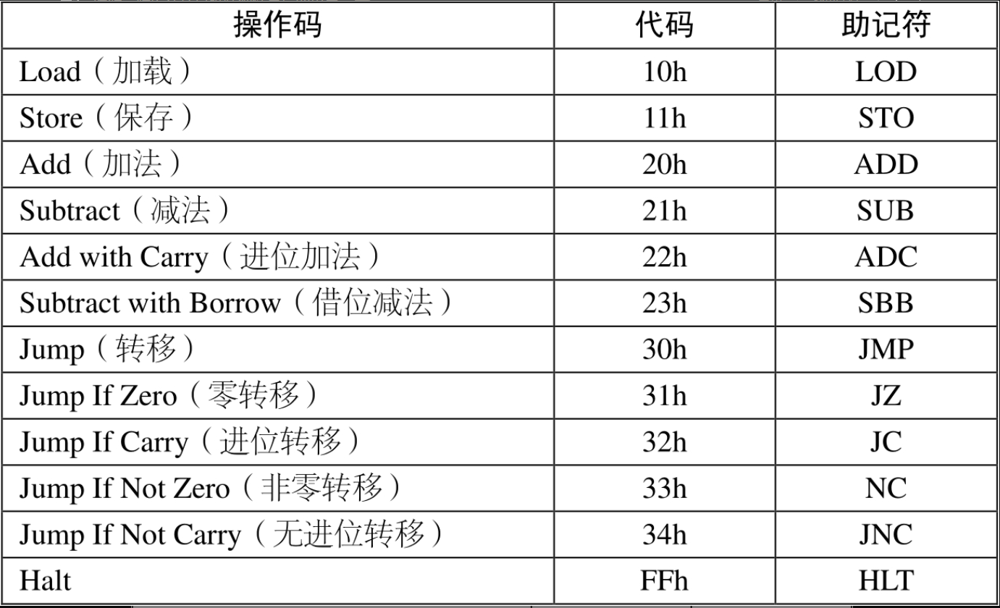

当这些助记符与另外一对短语结合使用时，其作用更加突出。例如，对于这样一条长语句“把1003h地址处的字节加载到累加器”，我们可以用如下简洁的句子替代：（心得：这就是汇编语言，当我们写了汇编程序之后，需要通过汇编器将助记符翻译为对应的代码，将A翻译为累加器。）


位于助记符右侧的 A 和 [1003h] 称为参数(argument)，它们是这个Load指令的操作对象，参数由两部分组成，左边的操作数称为目标(destination)操作数（A代表累加器），右边的操作数称为源(source)操作数。方括号“[]”表明要加载到累加器的不是1003h这个数值，而是位于存储器地址1003h的数值。

类似的，指令“把001Eh地址的字节加到累加器”，可以简写为（图片有误）：


指令“把累加器中的内容保存到1003h地址”，可简写为：


注意，在上面的语句中，目标操作数（Store指令在存储器中的位置）仍然在左边，源操作数在右边，这就决定了累加器中的内容必须要保存到存储器的1003h地址。“如果零标志位不是1则跳转到0000h地址处”这个冗长的语句可以简明地表示为：


注意，这里没有使用方括号，这是因为跳转指令要转移到的地址是0000h，而不是保存于0000h地址的值，即0000h地址就是跳转指令的操作数。

用助记符的形式表示指令是很方便的，因为在这种形式下指令以可读的方式顺序列出而不必画出存储器的空间分配情况。通过在一个十六进制地址后面加一个冒号，可以表示某个指令保存在某个特定地址空间，例如：


下面的语句表示了数据在特定地址空间的存储情况。

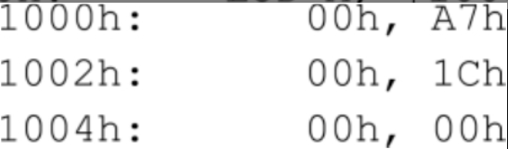

你可能已经注意到了，上面的两个字节都是以逗号分开的，它表示第一个字节保存在左侧的地址空间中，第二个字节保存在该地址后的下一个地址空间中。上面的三条语句等价于下面的这条语句：

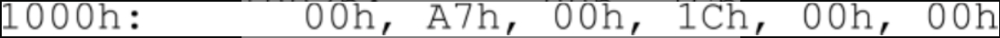

### 汇编语言

因此上面讨论的乘法程序可以用如下一系列语句来表示：

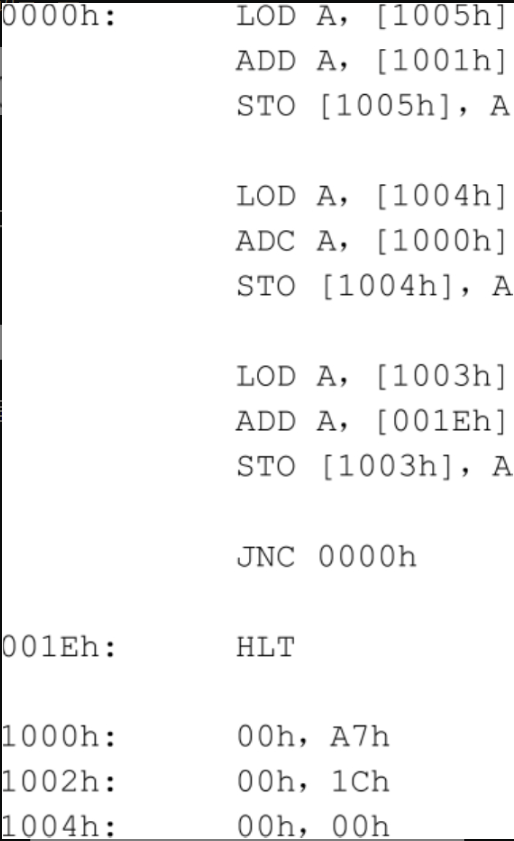

使用空格和空行的目的仅仅是为了人们更方便地阅读程序。（上图的JNC应改为JNZ）

在编码时最好不要使用实际的数字地址。用标号(label)来指代存储器中的地址空间是个较好的办法，这些标号是一些简单的单词，或是类似单词的字符串，上面的代码可以改写为：

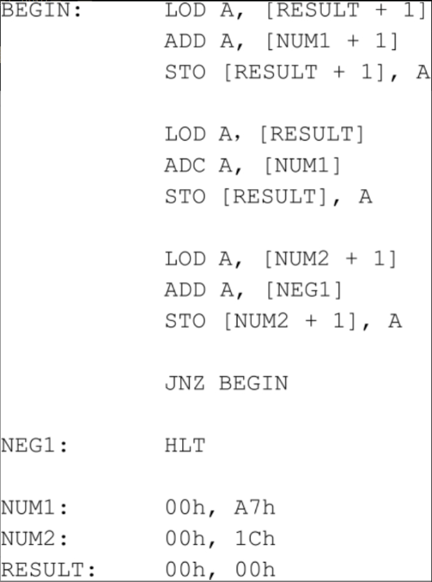

注意，NUM1, NUM2, RESULT这些标号都是指存储器中保存两个字节的地址单元。在这些语句中，NUM1+1, NUM2+1和RESULT+1分别指标号NUM1, NUM2, RESULT后的第二个字节。注意，NEG1(negative one)用来标记HLT指令。

最后，如果你可能忘记这些语句所表示的意思，那么可以在该语句后面加注释(comment)，这些注释可以用我们人类的自然语言表述，然后通过分号与程序语句分隔开。

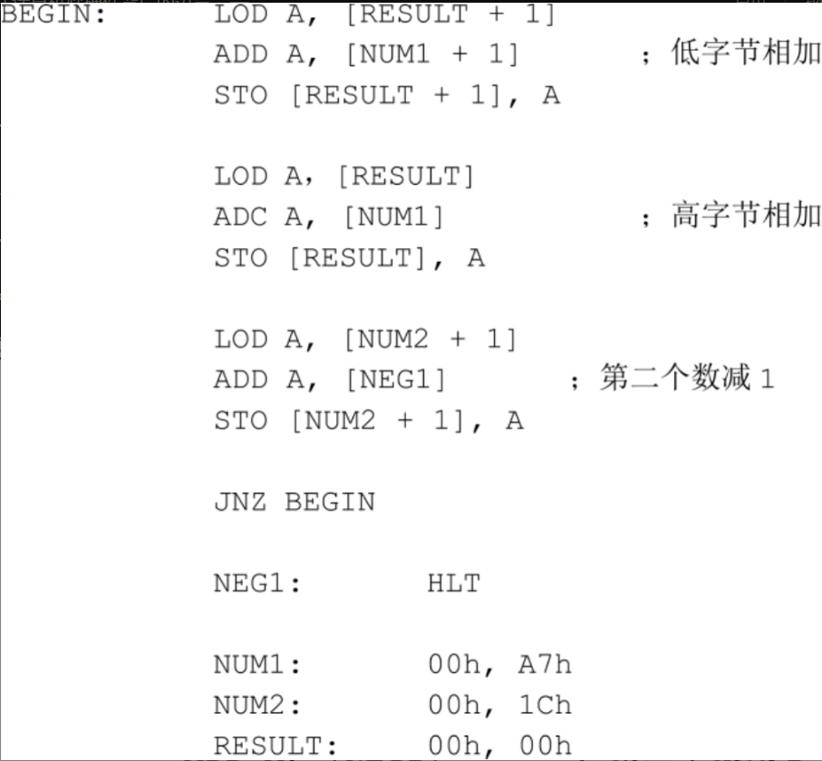

这里给出的是一种计算机程序设计语言，称为汇编语言(assembly language)，它用标号表示存储器地址。人们有时候会混淆机器语言和汇编语言，这是因为它们是对同一种事物的不同描述方式。

如果你想为本章所设计的计算机编写程序，那么可能首先想到的是用汇编语言来编写（在纸上），在你确定程序无误并准备验证其运行结果的时候，你需要手工对其汇编：这就意味着要把每一条汇编语句转换成与之对应的机器语言，这仍然要在纸上操作，完成之后，你需要通过开关把这些机器码输入到RAM阵列中并运行该程序，也就是让计算机执行这些指令。

（当然，上面这段描述是非常非常原始的做法。汇编程序写好之后，可通过编译和链接自动转换为机器语言，然后被装载到内存进行执行。可以看到这就引出了计算机中另一个非常重要的方向——编译和链接，当然也设计到了操作系统。）

对于学习计算机程序设计的人来说，应该尽早了解“错误”(bug)这个术语。当你编写代码时—特别是采用机器语言—是非常容易出错的，输入一个错误的操作数已经很不妙了，如果输错的是一个指令代码的话，情况会怎样呢？当你准备输入10h（Load指令）的时候，却输入了11h（Store指令），造成的后果是：期望的数据不会被机器加载，而该地址的数据还会被累加器中的内容替换掉。

前面不止一次强调过，这些硬件部件早在100年前就发明出来了，但是，本章所设计的计算机在当时却并没有被创造出来。当继电器计算机在20世纪30年代中期被设计出来的时候，很多包含在其中的概念还并不为人所知，直到1945年左右世人才开始慢慢了解它们。例如，在当时，人们仍然尝试在计算机中使用十进制数而不是二进制数；而且计算机程序也不是完全存储在存储器中的，有时候它们会被保存在纸带上。特别是在早期的计算机中，存储器非常昂贵并且体积庞大，不论在100年前还是在今天，用500万个电报继电器构建一个64 KB的RAM阵列都是令人感到荒唐的事。

当回顾完计算器和计算机这一段历史，让我们展望一下未来，或许有一天我们会发现：没有必要建造一个如此复杂的继电器计算机。正像在第12章所讨论过的那样，继电器最终会被真空管和晶体管这类电子器件所替代。或许我们还会发现，已经有人创造出一种全新的设备，它的处理器及存储器的能力与我们所设计出的不相上下，但是，这种机器精致小巧，甚至可以放在我们的掌心。

# 18. 从算盘到芯片

## 简短的计算机历史

下面按时间顺序进行介绍，**第一台继电式计算机由康拉德·楚泽(Conrad Zuse, 1910—1995)制造，1935年还是工科学生的他在其父母位于柏林的家中制造了这台机器。**这台机器中使用了二进制数，但其早期的版本中使用的是机械存储器而非继电器，楚泽使用老式35毫米电影胶片进行穿孔，然后在上面编制程序。

1937年，贝尔电话实验室(Bell Telephone Laboratories)的乔治·史提必兹(George Stibitz, 1904—1995)将一对电话继电器带回了家中，并在他厨房的桌子上连接了一个1位加法器，后来他妻子将其称之为K机器（K是厨房“kitchen”的头一个字母），这个实验促使1939年贝尔实验室中复数计算机的诞生。

同一时期，哈佛大学研究生霍华德·艾肯(Howard Aiken, 1900—1973)要寻找做大量的重复计算的方法，而正是他的这一需求促使哈佛大学与IBM合作，并最终在1943年创造出一台自动连续可控计算机(Automated Sequence Controlled Calculator, ASCC)，也就是闻名于世的Harvard Mark I。这是第一台可以打印表格的数字计算机，它最终将查尔斯·巴贝奇的梦想付诸于现实。**Mark II是最大的继电式计算机，使用了13,000个继电器。哈佛大学计算机实验室当时的主任是艾肯，也正是他讲授了计算机科学的第一次课。**

## 从继电器到真空管

对于构造计算机来说，继电器不是最完美的设备，因为它们是机械性的，利用金属片的弯曲和伸直状态进行工作，而频繁的工作可能导致其断裂，另外如果接触点之间有污垢或者卡住纸屑，也会导致继电器失效。1947年发生了一件著名的事故，人们从Mark II计算机的一个继电器中发现了一只飞蛾。格蕾丝·莫瑞·赫柏(Grace Murray Hopper,1906—1992)于1944加入了艾肯的团队，日后成为了计算机编程语言领域非常著名的人物。她将上面提到的那只飞蛾用带子绑在计算机日志(logbook)上，并在其边上注明“第一个被发现的有生命的bug”。

真空管(vacuum tube)是一种可以替代继电器的元件，它是由约翰·安布罗斯·弗莱明(John Ambrose Fleming, 1849—1945)和李·德·福雷斯特(Lee de Forest, 1873—1961)在进行无线电通信连接研究时开发出来的。到20世纪40年代，真空管已经被广泛应用于放大电话信号，实际上，那时几乎每一个家庭都拥有一台带有发光二极管可控收音机，它们能放大无线信号，并且把它们变成还原为人们能听见的声音。**真空管同样可以通过连接成与门、或门、与非门，以及与或门这一点很像继电器。**

究竟是由继电器还是由真空管组成这些逻辑门并不重要，重要的是这些逻辑门可以被装配组合成加法器、选择器、解码器、触发器，以及计数器。不论真空管何时取代继电器，前面章节中讲述的关于基于继电器部件的一切同样是有效的。

真空管同样存在自身的问题，比如，价格昂贵、耗电量大，以及产生的热量太多。可是，其最大的问题是真空管最终会被烧坏，如同人活一世一样，是无法改变的事实。那时，拥有真空管收音机的人们习惯于定期更换真空管，而电话系统设计时有很多冗余的真空管，所以一个真空管的报废有时并不是什么大事。可是在计算机中，当一个真空管烧坏时并不可能立刻被检测到，此外，一台计算机拥有数量巨大的真空管，按统计学来分析，每隔几分钟就会烧坏一个。

**用真空管取代继电器的最大好处在于真空管的状态可以在百万分之一秒(μs)内发生转变。**真空管状态转变（开关的打开与关闭）的速度比继电器要快1000倍，继电器在其最好状态下状态的转变也需要1ms，即千分之一秒。十分有趣的是在计算机的早期发展中，计算速度并不是主要考虑的问题，而这个时期的计算速度与从纸张或者电影胶片中读取程序的速度有关。由于当时的计算机都按照这种方式构建，因此采用真空管比继电器到底计算速度提升了多少，并不重要。

但是在20世纪40年代初期，新设计的计算机中真空管开始取代继电器。到1945年，真空管已经完全取代了继电器。**虽然继电器计算机被称为电动机械计算机，但真空管是第一台电子计算机的基础。**

在英国，巨像(Colossus)计算机（1943年首次投入使用）用来破译德国名为“Enigma”代码生成器产生的代码，艾伦·M·图灵(Alan M.Turing, 1912—1954)为这个项目（以及英国后来几个的计算机项目）做出了巨大贡献，图灵撰写了两篇非常有影响的论文，这使他如今成为计算机领域的鼎鼎大名的人物。第一篇论文发表于1937年，首次提出了“可计算性”(computability)这个概念，用来分析哪些事情计算机可以做到，哪些做不到。他为计算机构想了一个抽象模型，这就是现在为人所熟知的图灵机(Turing Machine)。图灵第二篇非常有名的论文是关于人工智能的，在这篇论文中他介绍了一种测试机器智能的方法，即现在为人熟知的图灵测试法(Turing Test)。

在摩尔电子工程学院（宾夕法尼亚大学），J·普利斯普·埃克特(J.Presper Eckert,1919—1995)和约翰·莫克利(John Mauchly, 1907—1980)**设计了ENIAC（Electronic Numerical Integrator and Computer，电子数字积分计算机），使用了18,000个真空管并最终在1945年底完成。按全部吨位算（大约30吨），ENIAC是曾经（或许以后也是）制造出来的最大的计算机。**到1977年，人们可以在Radio Shack买到速度更快的计算机。

## 冯诺依曼结构

ENIAC吸引了数学家约翰·冯·诺依曼(John von Neumann, 1903—1957)的眼球。从1930年开始，出生在匈牙利的冯·诺依曼就定居美国。作为一名令公众瞩目的人物，因其仅凭自己的大脑就能进行复杂的数学计算而闻名，冯·诺依曼当时是普林斯顿高级研究院的一名数学教授，研究范围很广，从量子力学到游戏应用，甚至到经济理论。


约翰·冯·诺依曼协助设计了ENIAC的后续产品EDVAC(Electronic Discrete Variable Automatic Computer)。特别是在1946年与亚瑟·W·伯克斯(Arthur W.Burks)和荷曼·哥斯廷(Herman H.Goldstine)共同执笔的题为“电子计算器件逻辑设计的初步分析及讨论(Preliminary Discussion of the Logical Design of an Electronic Computing Instrument)”的论文中，他描述了几个EDVAC比ENIAC更加先进的特点。EDVAC的设计者们感觉到计算机内部中应当使用二进制数，而ENIAC使用的是十进制数。**同时他们认为计算机中应当拥有尽可能大容量的存储器，这些存储器应该用来存储程序代码和程序执行中产生的数据**（再说明一下，这些在ENIAC中都是不能实现的，对于ENIAC来说，编程不过是扳动开关和插拔电线的事情）。**这些指令在存储器中是顺序存放的，而且可以由程序计数器进行寻址，但允许条件跳转。这就是著名的“存储程序概念”(stored-program concept)。**

这些设计上的决策是计算机历史中非常重要的一个进化阶段，现在我们称之为“冯·诺依曼结构”。上一章中设计的计算机就是一个经典冯·诺依曼计算机。**但是伴随着冯·诺依曼结构，又出现冯·诺依曼瓶颈(von Neumann bottleneck)。在冯·诺依曼计算机中，为了执行指令通常需要花费大量的时间先将这些指令从存储器中取出来。**我们仔细回忆一下，第17章中最后设计的计算机需要花费3/4的时间用来取指令。

直到20世纪50年代中期人们才开发出了“磁芯存储器”(magnetic core memory)，众多的被磁化的小金属环由电线串起来组成了磁芯存储器，每一个小金属环可以存储1位信息。磁芯存储器沿用了很长一段时间才被别的技术取代，所以常常会听见老一辈程序员们把存储器的访问过程叫做“访问磁芯”。

20世纪40年代，对计算机本质进行概念化设想的并非只有约翰·冯·诺依曼一人。

。。。跳过后面的内容。。。

克劳德·香农（Claude Shannon，生于1916年）是另外一个非常有影响力的思想家。在第11章中讨论了他1938年的硕士论文，正是这篇文章确定了开关、继电器以及布尔代数之间的关系。在1948年为贝尔电话实验室工作期间，香农在Bell System Technical Journal上发表了一片题为“通信过程中的代数理论”(A Mathematical Theory of Communication)的文章，在这篇文章中他不仅将“位”的概念介绍给了世界，更开创了一个新的研究领域，即著名的“信息论”(information theory)。信息论研究的是数字信息在有噪声（这些噪声通常阻止信息的通过）的情况下传输，以及如何弥补因噪声产生的损失。1949年，他撰写了第一篇关于如何编程可以让计算机下棋的文章，1952年他设计了一个通过继电器控制的机械鼠，它可以在一个迷宫中记住路径。骑单车、变戏法这些耍宝也使得香农在贝尔实验室声名鹊起。

诺博尔特·韦纳(Norbert Wiener, 1894—1964)从哈佛大学获得数学博士学位时只有18岁，其撰写的Cybernetics, or Control and Communication in the Animal and Machine（1948年）一书使他闻名于世。他使用新创词汇“控制论”（cybernetics：源于希腊语舵手）表示人类和动物的生物过程同计算机和机器人的机械原理之间的关系。大众文化中，人们普遍使用cyber作为前缀表示与计算机相关的一切，最著名的一个词，数百万台计算机通过因特网相连被称做“cyberspace”（网络空间），这个词源于计算机科幻小说作家威廉·吉布森(William Gibson)在1984年发表的小说Neuromancer中“cyberpunk”一词。

1948年，埃克特与莫奇利(Eckert-Mauchly)计算机公司（后来成为雷明顿兰德公司一部分）开始开发第一台商用计算机—通用自动计算机，或者称为UNIVAC。这台机器于1951年完成，此后就被送到了人口普查局。UNIVAC在网络应用方面的首次亮相在哥伦比亚广播公司，它被用来预测1952年的总统选举结果。沃尔特·克朗凯特(Walter Cronkite)将UNIVAC称做“electronic brain”（电脑）。同样是在1952年，IBM发布了其第一个商用计算机系统，代号701。