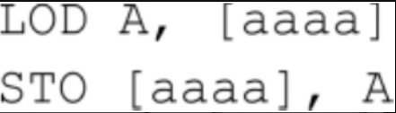
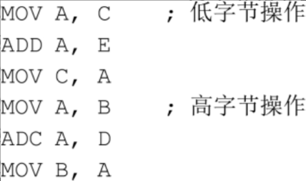

# 19. 两种典型的微处理器

## 微处理器历史

微处理器——正是它，将计算机中央处理器的所有构成组件整合在一起，集成在一个硅芯片上——诞生于1971年。它的诞生有着很好的开端：**第一个微处理器，即Intel 4004系列，包括了2300个晶体管。**到现在，大约三十年过去了，家用计算机的微处理器中的晶体管数量也逐步逼近10,000,000个。

从本质上说，微处理器实际上所做的工作一直没有变。在现在的芯片上，新增的几百万个晶体管所做的很多事情令我们眼前一亮，但我们正处于微处理器探索的初期，过多的关心这些当代的芯片并不合适，因为它们只会分散我们的注意力而无法帮助我们去学习与理解它。为了更清晰地认识微处理器是如何工作的，让我们首先来看一下最原始的微处理器。

我们要讨论的微处理器出现于1974年。在这一年，英特尔公司在4月推出了8080处理器，摩托罗拉公司——从20世纪50年代生产半导体和晶体管——在8月推出了6800处理器。不仅如此，当年还有其他的一些微处理器面世。同年，德克萨斯仪器设备公司(Texas Instruments)推出了4位的处理器TMS 1000，它用于多种计算器、玩具和设备；国家半导体公司(National Semiconductor)推出了PACE—首个16位微处理器。但当我们回顾历史的时候就会发现，8080和6800是两个最具有重大历史意义的芯片。

英特尔为8080最初定的价格为360美元，这个价格对IBM的System/360来说是极大的讽刺。System/360是大型机处理系统，用户大都是一些大公司，售价动辄几百万美元（今天，你用1.95美元就可以买到一块8080芯片）。这并不是说8080可以与System/360相提并论，但在几年之内，IBM自己也关注起这些非常小的计算机。

**8080是一个8位的微处理器，它包括6000个晶体管，运行的时钟频率为2 MHz，寻址空间为64 KB。**摩托罗拉的6800（今天的售价也是1.95美元）包括4000个晶体管，其寻址空间也是64 KB。第一个版本的6800的运行速度为1 MHz，但摩托罗拉于1977年推出了运行速度分别为1.5 MHz和2 MHz的版本。

这些芯片被称为“单芯片微处理器”(single-chip microprocessors)，不太准确的说法是“单芯片的计算机”。处理器只是计算机的一部分。除了处理器之外，计算机还需要其他一些设备，至少要包括一些随机访问的存储器(RAM)，一些方便用户把信息输入计算机的设备（输入设备），一些使用户能够把信息从计算机中读取出来的设备（输出设备），以及其他一些能把所有构件连接在一块的芯片。本书会在第21章详细介绍这些构件。

## 微处理器结构

现在，让我们来仔细研究一下微处理器本身。当描述微处理器的时候，我们总是习惯用一些框图来阐明其内部的构件及其连接情况。然而，在第17章我们已经使用了数不清的框图来描述它，现在我们将观察微处理器和外部设备的交互过程，以此来认识其内部的结构和工作原理。换句话说，为了弄清微处理器的工作原理，我们把它视做一个不需要详细研究其内部操作的黑盒。**取而代之的方法是通过观测芯片的输入、输出信号，特别是芯片的指令集来理解微处理器的工作原理。**

8080和6800都是40个管脚的集成电路。这些芯片最常见的IC封装大约为2英寸长，1/2英寸宽，1/8英寸厚。


当然，你所看到的只是外部的封装。其内部的硅晶片是非常小的，例如在早期的8位微处理器中，硅晶片还不到1/4平方英寸。外包装可以保护内部的硅晶片，并且通过管脚提供了处理器的输入和输出访问接入点。下面给出了8080的40个管脚的功能说明图。


本书中我们所创建的所有电气或电子设备都需要某种电源来供电。8080的一个特殊的地方就是它需要三种电源电压：管脚20必须接到5V的电压；管脚11需要接到-5V的电压；管脚28需接12V的电压；管脚2接地。（英特尔在1976年发布了8085芯片，目的就是简化对这些电源的要求）

其他的管脚都标有箭头。从芯片引出的箭头表明这是一个输出(output)信号，这种信号由微处理器控制，计算机的其他芯片对该信号响应。指向芯片的箭头表明该信号是一个输入(input)信号，该信号由其他芯片发出，并由8080芯片对其响应。还一些管脚既是输入又是输出。

**第17章所设计的处理器需要一个振荡器来使其工作。8080需要两个不同的同步时钟输入，它们的频率都是2 MHz，分别标记为$$\phi_1$$和$$\phi_2$$，位于管脚22和15上。这些信号可以很方便地由英特尔生产的8224时钟信号发生器产生。为8224连接一个18 MHz的石英晶体后，它基本上就可以完成其余工作了。**

**一个微处理器通常有多个用来寻址存储器的输出信号。用于寻址的输出信号的数目与微处理器的可寻址空间大小直接相关。8080有16个用于寻址的输出信号，标记为$$A_0～A_{15}$$，因此它的可寻址空间大小为$2^{16}$，即65,536字节。**

**8080是一个8位的微处理器，可以一次从存储器读取或向存储器写入8位数据。**该芯片还包括标记为$D_0$～$D_7$的8个信号，这些信号是芯片仅有的几个既可以用做输入又可以用做输出的信号。当微处理器从存储器中读取一个字节时，这些管脚的功能是输入；当微处理器向存储器写入一个字节时，其功能又变成了输出。

芯片的其余10个管脚是控制信号(control signals)。例如，RESET（复位）输入用于控制微处理器的复位。输出信号$\overline{WR}$的功能是指明微处理器需要向RAM中写入数据（$\overline{WR}$信号对应于RAM阵列的写输入）。此外，当芯片读取指令时，在某些时刻一些控制信号会出现在$D_0$～$D_7$管脚处。**使用8080芯片构建的计算机系统通常使用8228系统控制芯片来锁存附加的控制信号。**本章在后面将会讲述一些控制信号。但8080的控制信号是极其复杂的，因此，除非你准备用该芯片搭建一台计算机，否则最好不要在这些控制信号上过多花费时间。

## 指令

假设8080微处理器连接了一个64KB的存储器。

8080芯片复位后，它把锁存在存储器0000h地址处的字节读入微处理器，通过在地址信号端$A_0$～$A_{15}$输出16个0实现该过程。

在第17章设计的计算机中，所有的指令（除了HLT指令）都是3个字节长，包括1字节的操作码和2字节的地址。**在8080中，指令的长度可以是1字节、2字节，或者3字节。**有些指令使8080从存储器的一个特定地址读取字节到微处理器，有些指令使8080将一个字节从微处理器写入存储器的特定地址；还有些指令使8080在其内部执行而不需要访问RAM。8080执行完第一条指令后，接着从存储器读取第二条指令，并依此类推。这些指令组合在一起构成了计算机程序，可以用来做一些很有趣的事情。

当8080以最高速度2 MHz运行时，每个时钟周期是500ns(1÷2,000,000=0.000 000 500s)。

**也许了解某个特定微处理器的功能的最好办法就是全面地测试其完整的指令集。**

第17章最后完成的计算机仅包括12条指令。一个8位处理器的指令数很容易达到256，每一条指令包含1字节的操作码（如果某些指令包含2字节的操作码，其指令集会更大）。8080虽然没有这么多指令，但是其指令数也已经达到了244。这看起来似乎是很多，但从总体上说，其功能并不比第17章的计算机强大。

### Load和Store

在第17章曾经讲到过，为了方便地引用指令，我们为处理器的每一条指令的操作码都指派了一个特殊的助记符，而且其中的一些助记符是可以带有参数的。这种助记符只是在我们使用操作码时提供方便，它对于处理器是没有帮助的，处理器只能读取字节，对于助记符组成的文本的含义一无所知。

第17章设计的计算机的指令集包括两条非常重要的指令，我们称之为加载(Load)和保存(Store)。每条指令占3个字节。在Load指令中，第一个字节是操作码，其后的两个字节是要加载的操作数的16位地址。当处理器执行加载指令时，会把该指定地址中的字节加载到累加器。与之相似，当Store指令被执行时，累加器中的内容被保存到该指令指定的地址中。

我们可以用助记符把上述代码简写为以下形式：



这里的A表示累加器（它既是Load指令的目的操作数也是Store指令的源操作数），aaaa表示16位的存储器地址，通常用4个16进制的数来表示一个地址。

同第17章的累加器一样，8080的8位累加器也记做A。8080也有与第17章的计算机的Load指令和Store指令功能相同的两条指令，它们也称做加载(Load)和保存(Store)。在8080中，加载指令和保存指令的操作码分别是32h和3Ah，每个操作后面也同样跟着一个16位的地址。在8080中，它们的助记符分别是STA（Store Accumulator）和LDA（Load Accumulator）：


### 寄存器

8080芯片的微处理器的内部除累加器外还设置了6个寄存器(register)，每个寄存器可以存放一个8位的数。这些寄存器和累加器非常相似，事实上累加器被视为一种特殊的寄存器。这6个寄存器和累加器一样，本质上都是锁存器。当然，其他的寄存器没有累加器所具有的丰富的功能，例如，当把两个8位数相加时，其结果总是保存到累加器而不会保存到其他寄存器。

在8080中用B, C, D, E, H和L来表示新增的6个寄存器。人们通常会问以下两个问题：“为什么不使用F和G来表示？”，以及“I, J和K用来代表什么？”答案是，**使用H和L来命名寄存器是因为它们具有特殊的含义，H可以代表高(High)而L可以代表低(Low)。通常把两个8位的寄存器H和L合起来构成一个16位的寄存器对(register pair)，称做HL, H用来保存高字节而L用来保存低字节。这个16位的值通常用来对存储器寻址**，我们将在下面看到它是怎样以简单的方式工作的。

寄存器是计算机必不可少的部件吗？为什么在第17章搭建的计算机中并没有寄存器的踪迹？从理论上讲，这些寄存器不是必需的，在第17章也没有用到它们，但在实际应用中使用它们将带来很大的方便。很多计算机程序都同时用到多个数据，将这些数据存放在寄存器比存放在存储器更便于访问，因为程序访问内存的次数越少其执行速度就越快。

### MOV

在8080中有一条指令至少用到了63个操作码，这条指令就是MOV，即Move的缩写。**其实该指令是一条单字节指令，它主要用来把一个寄存器中的内容转移到另一个寄存器（也可能就是原来的寄存器）。**因为8080微处理器设计了7个寄存器（包括累加器在内），因此应用中使用大量的MOV指令是很正常的。（为什么MOV指令是单字节指令呢？明明它有目标操作数和源操作数，因为MOV指令是用来进行寄存器之间数据转移的，并不涉及寻址操作）

下面列出了前32条MOV指令。再一次提醒你，两个参数中左侧的是目标操作数，右侧的是源操作数。


这些指令使用起来非常方便。利用上面的指令可以方便地把一个寄存器存放的数据转移到另一个寄存器。下面让我们研究一下以 `HL寄存器` 对作为操作数的4条指令。


前面讲过LDA指令，它可以把单字节的操作数从存储器转移到累加器，LDA操作码后面就有该操作数的16位地址。在上面列出的指令中，MOV指令把字节从存储器转移到B寄存器，但该字节的16位地址却存放在 `HL寄存器对` 中。HL是怎样得到16位存储器地址的呢？这并不难解决，有很多方法可以做到，比如通过某种计算实现。

总而言之，对于下面这两条指令：


**它们的功能都是把一个字节从内存读入微处理器，但它们寻址存储器的方式并不相同。第一种方式称做直接寻址(direct addressing)；第二种方式称做间接寻址(indexed addressing)。**

下面列出了其余32条MOV指令，我们看到HL保存的16位存储器地址也可以作为目标操作数。


其中的一些指令如：


并不会执行有意义的操作。而指令：


是不存在的~~，事实上，与之对应的指令是HLT(Halt)即停止指令，也就是说该指令的意义是停止~~。

研究MOV操作码的位模式能更好地了解它，MOV操作码由8位组成：


其中ddd这3位是目标操作数的代码，sss这3位是源操作数的代码。它们所表示的意义如下：


例如，指令


对应的操作码为：01 101 011，用十六进制数可表示为6Bh，这与前面列出的表格是一致的。

寄存器B和C也可以组合成16位的`寄存器对BC`，同样我们还可以用D和E组成`寄存器对DE`。如果这些`寄存器对`也包含要读取或保存的字节的存储器地址，则可以用下面的指令实现：


另一种类型的传送(Move)指令称做传送立即数(Move Immediate)，它的助记符写做MVI。传送立即数指令是一个双字节指令，第一个字节为操作码，第二个是数据。这个单字节数据从存储器转移到某个寄存器，或者转移到存储器中的某个存储单元，该存储单元由`HL寄存器对`寻址。


例如，当指令：


执行后，寄存器E存放的字节是37h。这就是我们要介绍的第三种寻址方式—立即数寻址(immediate addressing)。其实立即数寻址也就是不需要寻址，指令需要的数据就在指令中。其实不管怎么样，**寻址方式就三种：数据在指令中、数据在寄存器中、数据在内存单元中。数据在指令中就是立即数寻址了，数据在寄存器中就通过指定寄存器号就可以了，数据在内存中就需要偏移地址。**

### 算术运算

下面将列出一个操作码集，包括32个操作码，它们能完成4种基本的算术运算，这些运算在第17章设计处理器时我们已经熟悉了，它们是加法(ADD)、进位加法(ADC)、减法(SUB)和借位减法(SBB)。可以看到，在所有的例子中，累加器始终用于存放其中的一个操作数，同时用来保存计算结果，这些指令如下。


如果累加器A中的值为35h，寄存器H和L中的值分别是10h和7Ch，而存储器地址107Ch处的字节为4Ah，指令：


把累加器中的值(35h)与`寄存器对HL`寻址(107Ch)存储器得到的数值(4Ah)相加，并把计算结果(7Fh)保存到累加器。

在8080中，使用ADC指令和SBB指令可以对16位数、24位数、32位数甚至更高位的数进行加法、减法运算。例如，假设现在`寄存器对`BC和DE各自保存了一个16位的数，我们要把这两个数相加，并且把结果保存在寄存器对BC中。具体做法如下：



在上面的计算中，用ADD指令对低字节相加，用ADC指令对高字节相加，低字节相加产生的进位会进入高字节的运算中。在这段简短的代码中，我们用到了4个MOV指令，这是因为在8080中只能利用累加器进行加法运算，操作数在累加器和寄存器之间来回地传送，因此在8080的代码中会大量使用MOV指令。

### 标志位

现在我们来讨论8080的标志位(flag)。第17章设计的处理器已经有了CF（进位标志位）和ZF（零标志位）两个标志位，在8080中又新增了3个标志位，包括符号标志位SF，奇偶标志位PF和辅助进位标志位AF。**在8080中，用一个专门的8位寄存器来存放所有标志位，该寄存器称做程序状态字(Program Status Word, PSW)。**不同的指令对标志位有不同的影响，LDA、STA或MOV指令始终都不会影响标志位，而ADD、SUB、ADC以及SBB指令会影响标志位的状态，具体情况如下。

- 如果运算结果的最高位是1，那么符号标志位SF标志位置1，表示该计算结果是负数。

- 如果运算结果为0，则零标志位ZF置1。

- 如果运算结果中“1”的位数是偶数，即具有偶数性(even parity)，则奇偶标志位PF置1；反之，如果“1”的位数是奇数，即运算结果具有奇数性(odd parity)，则PF置0。由于PF的这个特点，有时会被用来进行简单的错误检查。PF在8080程序中并不常用。

- 进位标志位CF的情况和第17章描述的稍有不同，当ADD和ADC运算产生进位或者SUB和SBB运算不发生借位时，CF都置1。

- 辅助进位标志位AF只有在运算结果的低4位向高4位有进位时才置1。它只用于DAA（Decimal Adjust Accumulator，十进制调整累加器）指令中。


下面的两条指令会直接影响进位标志位CF。


### 逻辑运算

第17章设计的计算机可以执行ADD、ADC、SUB和SBB指令（虽然缺乏灵活性），而8080功能更为强大，它还可以执行AND（与）、OR（或）、XOR（异或）等逻辑运算。不论是算术运算还是逻辑运算，都是由8080处理器的算术逻辑单元(ALU)来完成的。

以下是8080的算术运算和逻辑运算指令。


AND、XOR和OR都是按位运算(bitwise operations)指令，也就是说对于这些逻辑运算指令，其操作数的每一个对应位都是独立运算的，例如：


保存到累加器的结果将会是05h。假如我们把第3条指令换作OR，则最终的结果将会是5Fh；如果换作XOR，则结果又变成了5Ah。

### CMP

**CMP（Compare，比较）指令同SUB指令类似，也是把两个数相减，不同之处在于它并不在累加器中保存计算结果，计算的目的是为了设置标志位。**这个标志位的值可以告诉我们两个操作数之间的大小关系。例如，我们考虑下面的指令：

```
MVI　B, 25h
CMP　A, B
```

指令执行后累加器A中的值并没有变化，改变的是标志位的值，如果A中的值等于25h，则零标志位ZF置1；如果A中的值小于25h，则进位标志位CF置1。

同样的，也可以对立即数进行这8种算术逻辑操作。


例如，可以用下面的这条指令来替代上面列出的两条指令：`CPI　A, 25h`

### DMA与DAA

下面是两种特别的8080指令。


CMA是Complement Accumulator的简写，它对累加器中的数按位取反，即把0变为1，1变为0。例如，累加器中的数如果是01100101，使用CMA命令后，累加器中的数按位取反，得到10011010。我们还可以使用如下指令对累加器中的数取反：`XRI　A, FFh`

前面提到过，DAA是Decimal Adjust Accumulator的缩写，即十进制调整累加器，它可能是8080中最复杂的一条指令。在8080微处理器中专门设计了一个完整的小部件用来执行该指令。（后面关于DAA指令的解释先暂时跳过。。。）

DAA指令提供了一种用二进制码表示十进制数的方法，称为BCD码(binary-coded decimal)，程序员可以在该指令的帮助下实现十进制数的算术运算。BCD码采用的表示方式为，每4位为一段，每段所能表示数的范围是：0000～1001，对应十进制数的0～9。因为1字节有8位故可分割为2个段，因此在BCD码格式下，一个字节可以表示两位十进制数。

假设累加器A存放的是BCD码表示的27h，显然它就对应十进制数的27（通常，十六进制的27h对应的十进制数是39）。同时假设寄存器B中存放着BCD码表示的94h。假如执行如下指令：

```
MVI　A, 27h
MVI　B, 94h
ADD　A, B
```

累加器中存放的最终结果是BBh，当然，这肯定不是BCD码。因为BCD码中每4位组成的段所能表示的十进制数不会超过9。然而，当我们执行指令：DAA

那么累加器最后所保存的值是21h，而且进位标志位CF置1。因为十进制的27与94相加的结果为121。由此可以看到，使用BCD码进行十进制的算术运算是很方便的。

### INR与DCR

在8080程序中，经常会对一个数进行加1或减1运算。在第17章的乘法程序中，为了实现对一个数减1，我们把该数与FFh相加，它是-1的补码。8080提供了专门的指令用来对寄存器或存储器中的数进行加1（称作增量）或减1（称作减量）操作。


INR和DCR都是单字节指令，它们可以影响除CF(Carry Flag)之外的所有标志位。

### 循环移位

8080还包括4个循环移位(Rotate)指令，这些指令可以把累加器中的内容向左或向右移动1位，它们的具体功能如下。


这些指令只对进位标志位CF有影响。

假设累加器中存放的数是A7h，即二进制的1010 0111。RLC指令使其每一位都向左移一位，最终的结果是，最低位（左端为低位，右端为高位）移出顶端移至尾部成为最高位，这条指令也会影响CF的状态。在这个例子中CF置1，最后的结果为0100 1111。RRC指令以同样的方式进行右移位操作，如果移位之前的数是1010 0111，执行RRC之后将变为1101 0011，同时CF置1。

较之RLC和RRC，RAL和RAR指令的工作方式稍有不同。执行RAL指令时，累加器中的数仍然按位左移，把CF中原来的值移至累加器中数值的最后一位，同时把累加器中数据的原最高位移至CF。例如，假设累加器中移位之前的数是10100111且CF为0，执行RAL指令后，累加器中的数变为01001110而CF变为1。类似的，如果执行的是RAR指令，累加器中的数变为01010011而CF变为1。

当我们在程序中需要对某个数进行乘2（左移）或除2（右移）运算时，使用移位操作会使运算变得非常简单。

## 堆栈

我们通常把微处理器可以寻址访问的存储器称为随机访问存储器(random access memory, RAM)，主要的原因是：只要提供了存储器地址（有多种方式），微处理器可以用非常简便的方式访问存储器的任意存储单元。

显然，随机访问存储器是非常好的一种寻址方式，对于经常访问存储器的微处理器来说更是如此。然而，在某些情况下使用不同的寻址方式访问存储器也是有好处的。。。

这种形式的存储器称作堆栈(stack)。使用堆栈时，最先保存到堆栈中的数据最后被取出，而最后保存的数据则被最先取出。通常把将数据存入堆栈的过程称作压入(push)，把从堆栈取出数据的过程称作弹出(pop)。

假设你正在编写一个汇编语言程序，需要用到寄存器A、B、C来存储数据。为了保存寄存器A、B、C原先存放的数据，可以简单地把这些数据保存到存储器中不同的地址中，需要进行的计算完成之后，再把这些数据从存储器转移到寄存器。但这种方式需要记录数据存放的地址。有了堆栈的概念之后，我们可以用一种更清晰的方式来处理这个问题，即把这些寄存器中的数据依次存放到堆栈中。

```
第一步：PUSH　　A
第二步：PUSH　　B
第三步：PUSH　　C
```

稍后将具体解释这些指令实际的意义，现在需要知道的是，这些指令以某种方式把寄存器中的内容保存到先进后出存储器。这些指令执行之后，寄存器中原有的数据将妥善地保存下来，你就可以放心地使用这些寄存器进行别的工作了。为了取回原来的数据，可以使用POP指令把它们从堆栈中弹出，当然弹出的顺序和原来压入的顺序是相反的。相应的POP指令如下所示。

```
第一步：POP　　　C
第二步：POP　　　B
第三步：POP　　　A
```

