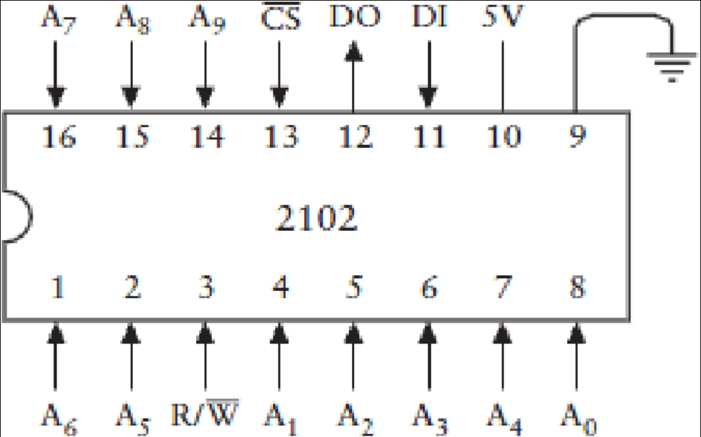
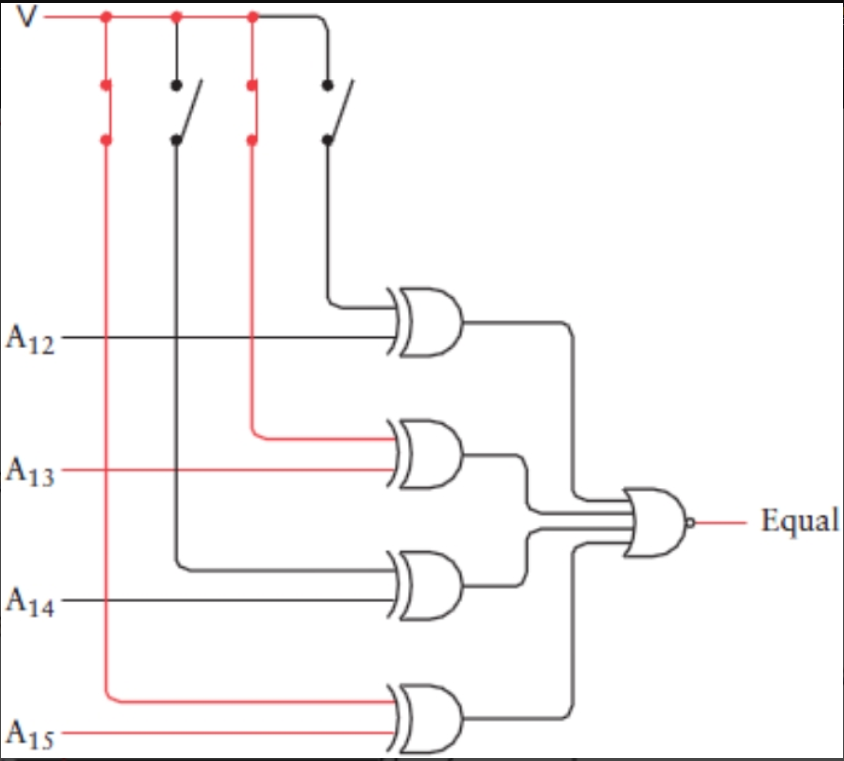
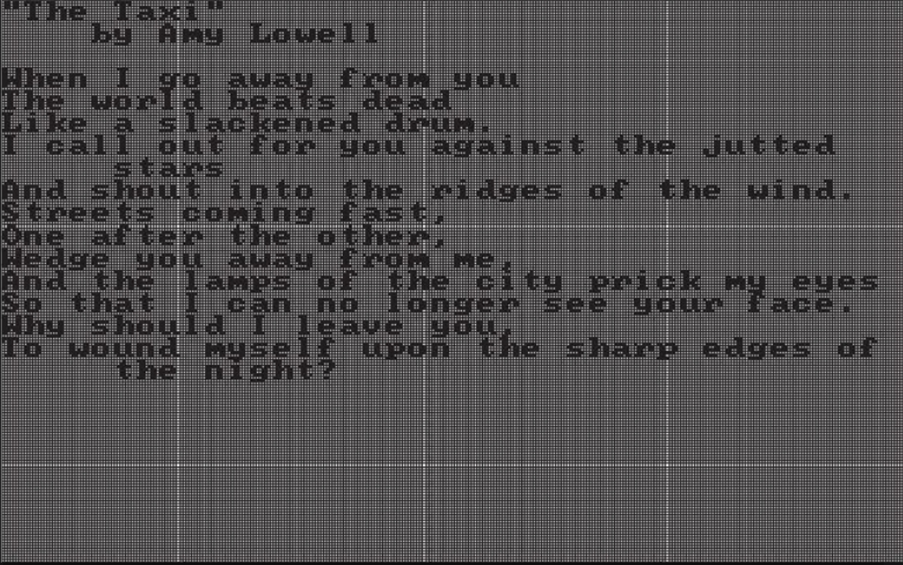

# 21. 总线

## 总线的概念

在一台计算机中，中央处理器无疑是最重要的部件，但它并不是唯一的部件。随机访问存储器(Random Access Memory, RAM)也是计算机不可或缺的部件，它存放着处理器要执行的指令和数据。通过怎样的方法才能把指令加载到RAM中？或许你一下子就想到了输入设备(Input Device)和输出设备(Output Device)。回想一下前面讲过的内容，RAM是易失性存储器——换言之，当掉电的时候其中的内容就会丢失。所以，长期存储设备也是一台计算机必不可少的部件，只有这样，指令和数据才能够被永久保存，不会因为掉电而丢失重要的数据。

搭建一台完整的计算机还需要很多集成电路，这些集成电路都必须挂载(mounted)到电路板上。在一些小型的机器中，一块电路板足以容纳所有的集成电路，但这种情况并不常见。我们通常所看到的是另一种情况：**计算机中各部件按照功能被分别安装在两个或更多的电路板上。这些电路板之间通过总线(bus)通信。如果对总线做一个简单的概括，可以认为总线就是数字信号的集合，而这些信号被提供给计算机上的每块电路板。通常把这些信号划分为如下四类。**

- 地址信号。这些信号是由微处理器产生，通常用来对RAM进行寻址操作，当然也可以用来对连接到计算机的其他设备进行寻址操作。

- 数据输出信号。这些信号也是由微处理器产生的，用来把数据写入到RAM或其他设备。这里特别要注意区分术语输入(input)和输出(output)，来自微处理器的数据输出信号会变成RAM和其他设备的数据输入信号。

- 数据输入信号。这些信号是由计算机的其他部分提供的，并由微处理器读取。通常情况下，数据输入信号由RAM输出，这就解释了微处理器是怎样从内存中读取内容的。其实，其他部件也可以给微处理器提供数据输入信号。

- 控制信号。这些信号是多种多样的，通常与计算机内所用的特定的微处理器相对应。控制信号可以产生于微处理器，也可以由与微处理器通信的其他设备产生。比如，当微处理器要把一些数据写入到特定内存单元时，它所使用的信号就是控制信号。


还有一点需要说明：总线还可以为计算机上不同电路板供电。

## 总线发展历史

> http://www.s100computers.com/History.htm
>
> https://en.wikipedia.org/wiki/Edge_connector
>
> http://www.s100computers.com/My%20System%20Pages/S100%20Motherboard/S100%20Motherboard.htm#12_Slot_Motherboard

### 边缘连接器

**边缘连接器**是[印刷电路板](https://en.wikipedia.org/wiki/Printed_circuit_board)(PCB) 的一部分，由通向电路板边缘的[走线](https://en.wikipedia.org/wiki/Signal_trace)组成，用于插入匹配的[插座](https://en.wikipedia.org/wiki/Jack_(connector))。边缘连接器是一种省钱的设备，因为它只需要一个独立的[母连接器](https://en.wikipedia.org/wiki/Female_connector)（公连接器由 PCB 边缘形成），而且它们也往往相当坚固耐用。它们通常在计算机中用作外围卡的[扩展插槽](https://en.wikipedia.org/wiki/Expansion_slot)，例如[PCI](https://en.wikipedia.org/wiki/Peripheral_Component_Interconnect) 、 [PCI Express](https://en.wikipedia.org/wiki/PCI_Express)和[AGP](https://en.wikipedia.org/wiki/Accelerated_Graphics_Port)卡。


<center><i><font size="2">两个 44 针边缘连接器插座（蓝色物体）和匹配的电路板</font></i></center>


<center><i><font size="2">具有两个 32 位 PCI 插槽和两种尺寸的 PCI Express 插槽的主板</font></i></center>

### S-100总线

> http://www.s100computers.com/History.htm
>
> http://www.s100computers.com/My%20System%20Pages/8080%20CPU%20Board/8080%20CPU%20Board.htm
>
> http://www.s100computers.com/Hardware%20Folder/MITS/8080%20CPU/8080CPU.htm

S-100 总线诞生于**1974 年**，当时埃德•罗伯茨（Ed Roberts）开始着手为电子爱好者设计一种家用“微型计算机”套件，他开始利用 Intel 8080 CPU 设计现在著名的[Altair 8800](http://www.s100computers.com/Popups/PU-Altair Box.htm) 。显然，他无法及时制造出合适的总线主板来配合他为**1975 年**1 月出版的[《大众电子》](http://www.s100computers.com/Popups/PU-Popular Electronics.htm)杂志撰写的一篇文章，他四处寻找一些合适的可以串在一起的边缘连接器。他发现了廉价的 100 针边缘连接器供应，并决定一次在拥有 4 个连接器的短板上使用这些连接器，后来他将多个板连接在一起形成总线。微型计算机套件起飞了。他将这套总线称为“Altair Bus”，它一炮而红。几乎立即，微型仪器和遥测系统公司（Micro Instrumentation and Telemetry Systems, Inc. (MITS)）成立并起飞了。


Ed Roberts 因设计第一台成功的家用电脑 Altair 8800 并聘请比尔·盖茨和保罗·艾伦为其编写软件而闻名。（遗憾的是， Ed 于 2010 年 4 月上旬去世)。

回顾一下总线的发展历程。在家用计算机领域，早期比较流行的就是S-100总线，1975年第一台家用计算机MITS Altair就率先采用了这种总线。尽管一开始，S-100总线只是基于8080微处理器的，后来经过改进，也开始适用于其他处理器，例如6800。一块S-100电路板的规格是5.3×10英寸，其中有一边是要插到一个插槽上的，这个插槽有100个连接器（或者说有100针，这就是名为S-100的原因）。


**上图板的独特之处在于它是有史以来设计的第一块 S-100 板，电路板的布局及其来自 8080 CPU 的引脚排列基本上定义了 S-100 总线引脚的功能。**

每台S-100计算机都有一块很大的被称为母板（motherboard或mainboard）的电路板，它有若干相互连接的S-100总线插槽（可能有12个）。有时候，这些插槽也被称为扩展插槽(expansion slots)，S-100电路板（也称为扩展板，expansion boards）就插在这些插槽中。8080微处理器及支持芯片分布在一块S-100电路板上，而RAM分布在一块或多块其他电路板上。


下图是第一个为S-100总线设计的RAM板：


下图就是将不同功能的S100板插入到母板中，共同构成了计算机系统：


## 总线规范

S-100总线是专门为8080芯片而设计的，有16个地址信号，8个数据输入信号及8个数据输出信号（仔细回忆一下，8080本身并不区分数据输入和输出信号，这项工作是由电路板上的其他支持芯片完成的）。总线上也含有8个中断信号，其他设备需要CPU立即做出响应时，便会产生这些信号。

下面我们看一个例子（本章的后面也要讲到），当某个按键按下时，键盘可能就会产生一个中断信号。接下来8080会执行一段小程序，检测出是什么按键被按下，并做出响应。通常，在安装了8080的电路板上有一个被称为Intel 8214优先级中断控制单元的芯片，就是专门用来处理中断的。当中断发生时，这个芯片会产生一个中断信号并送给8080，8080识别出这个中断后，此芯片就会提供一个RST（Restart，重启）指令，在这条指令的作用下，微处理器会把当前程序计数器的值保存下来，并依据中断类型，跳转到地址0000h、0008h、0010h、0018h、0020h、0028h、0030h或0038h处执行。

如果你在设计一个新的计算机系统，而这个系统中采用新的总线类型，你可以选择把总线规范公布于众或者使其保密，决定权在于你。

一旦把某总线的规范公布开来，其他制造商——称为第三方(third-party)制造商——就可以设计并销售采用了这种总线的扩展板了。这些额外扩展板不仅加强了计算机的实用性，还使其更加满足实际需求。计算机的销售情况越好，扩展板的市场前景也就越好。正是由于这个原因，设计者在设计多数小型计算机系统时，都会坚持开放体系结构(Open Architecture)的原则，这样一来，更多的制造商就可以生产计算机的外设，从而使计算机功能更加强大，反过来这将使计算机销量更好。最终会有一条总线成为工业标准，在今天，“标准”已经成为个人计算机产业的一个重要组成部分。

1981年秋，最著名的开放体系结构个人计算机——IBM的PC问世。IBM公布了PC的技术参考资料(technical reference)，里面包含了整台计算机的全部电路图，IBM为其制造的扩展板的资料也在其中。这个手册可是很重要的资料，它的出现使得很多制造商可以生产自己的PC扩展板，实际上，这创造出了整个PC的克隆体——其实与IBM的PC几乎完全相同，运行的软件也一样。（这就是著名的**PC兼容机**）

在如今的桌面计算机领域，从起初的IBM的PC发展而来的计算机数量庞大，占据约90%的市场份额。尽管IBM本身只占很小一部分，但事实上，如果起初的PC采用的是封闭体系结构(closed architecture)且设计是私有化(proprietary)的，其所占的市场份额会更少。苹果公司的麦金托什(Macintosh)起初采用的是封闭体系结构，尽管也曾部分考虑过开放的问题，这也就解释了为什么Macintosh在如今的桌面计算机市场上只占有不到10%的份额。（请记住这一点：一个计算机系统可以是在开放体系结构下设计的，也可以是在封闭体系结构下设计的，无论是哪种情况，其他公司都可以为其设计软件。但也有例外的情况，某些视频游戏的开发商会限制其他公司开发其专用系统上的软件）。

最初的IBM PC采用的是**Intel 8088微处理器**（8088内部数据总线为16位，这使得它能够高效地处理16位数据；具有20位的地址总线，这使得寻址空间达到了$2^{20}$字节，即1MB。8088外部数据总线为8位，虽然内部可以高效地处理16位数据，但是在与外部设备进行数据传输时，每次只能传输8位数据，这一特性使得8088更容易与当时的8位外部设备兼容），**工业标准体系结构(Industry Standard Architecture, ISA)总线，是IBM为最初的PC设计的**，扩展板上有62针的连接插头。有20个地址信号，8个复用的数据输入/输出信号，6个中断请求信号及3个**直接存储器访问(Direct Memory Access, DMA)请求信号**。DMA可以使存储设备（本章最后我们会讲到）快速地执行存储操作，这比采用其他方法快得多，通常情况下，所有读/写内存的操作都是由微处理器来完成的，但采用了DMA后，其他设备可以不通过微处理器而获得总线的控制权，进而直接对内存进行读写。

在S-100系统中，所有的部件都安放在扩展板上。就拿IBM PC来说，微处理器、支持芯片及一些RAM都安装在一块系统板上，系统板(system board)是IBM的“内部称呼”，但它常常也被称为母板或主板。

1984年，IBM推出了个人计算机AT，采用的是16位的Intel 80286微处理器，这个微处理器可以寻址16 MB的存储单元。IBM保留了原有的总线，但添加了一个36针的插槽，这个插槽包括7个地址信号（其实只需4个）、8个数据输入/输出信号、5个中断请求信号以及4个DMA请求信号，这些信号都是新增的。

微处理器所使用的数据宽度（从8位到16位再到32位）和输出的地址信号的数目在不断增长，当这些超出总线的承受能力时，总线就需要升级换代了。如果微处理器的处理速度很快时，也会出现这种情况。早期的总线是为当时的微处理器而设计的，它们的时钟频率一般是几兆赫兹而不是几百兆赫兹。如果设计出来的总线不适合高速传输的话，就会出现射频干扰(RFI)，这会使附近的收音机和电视机产生静电或其他噪声。

1987年，IBM推出了**微通道体系结构(Micro Channel Architecture, MCA)总线**。这种总线的某些部分已经成为IBM的专利，如果其他公司使用这种总线，IBM就会从中收取授权费用。也许就正是由于这个原因，MCA才没能成为一种工业标准。然而就在1988年，9家公司（并不包括IBM）联合推出的**32位EISA(Extended Industry Standard Architecture)总线**取代了MAC，成为了工业标准。近几年，Intel公司设计的**外围部件互连(PCI)总线**已普遍使用在PC兼容机上。

## 存储器

计算机上的各种不同的部件是如何工作的呢？为了能更好地理解，让我们再次回到20世纪70年代中期去看一看。想象一下，我们正在为Altair设计电路板，或者是在为自己设计的8080或6800计算机做这样的事情。我们不仅要考虑为计算机设计一些存储器，用键盘作为输入，用电视机作为输出；还要考虑关上计算机时，如何把存储器中的内容保存下来。如何把这些部件添加到计算机中呢？下面就来看看能实现这个功能的各种接口(Interface)。

现在回想一下第16章所讲的内容，RAM阵列有地址输入、数据输入，以及数据输出信号，另外还有一个用来把数据写入存储器的控制信号。RAM阵列的存储单位数是和地址输入信号的个数有关的，它们之间有着如下的关系：

$$RAM阵列的存储单位数=2^{地址输入端的个数}$$

讲到这里你可能会问，数据输入、输出信号又有怎样的作用呢？其实它们决定着存储单位的大小（位数）。

20世纪70年代中期，2102是用于家用计算机的一款流行的存储器芯片。其管脚分布如下图所示：



它也是MOS(metal-oxide semiconductor)家族中的一员，与8080和6800微处理器所采用的技术相同。MOS半导体管很容易与TTL芯片连接起来；通常情况下，其内部晶体管的密度要比TTL高，但速度却不如TTL快。

这个芯片存储容量可以达到1024位，这个数值可以根据地址信号(A0～A9)、数据输出(DO)和数据输入(DI)信号的数目计算出来。你所使用2102芯片型号不同，访问时间（read access time，指从芯片接收到地址信息到输出有效数据所需的时间）也是各有差异，从350 ns～1000 ns不等。当需要从存储器中读取数据时，$R/\overline{W}$（读/写）信号置1；当向芯片中写入数据的时候，这个信号要置0，而且至少要持续170～550 ns的时间，也是由所使用的2102芯片的型号决定的。

这里我们不得不提到的一个信号就是$\overline{CS}$信号，也称片选信号。该信号置1时，芯片不被选中，意思就是说，不会响应$R/\overline{W}$信号。其实，$\overline{CS}$信号的作用不止这些，对芯片还有其他重要的作用，下面我们将简单描述一下。

想想看，若让你为8位的微处理器组织存储器的话，你会怎么做呢？是选择按8位存储形式，还是1位存储形式？你肯定会选择前者。如果想存储整个字节，则至少需要8个这样的2102芯片。具体的做法就是，把8个芯片对应的地址信号、$R/\overline{W}$及$\overline{CS}$信号连接起来，如下图所示：


实际上，这是一个1024×8位的RAM阵列，或者说是容量为1 KB的RAM。

把存储器芯片安装在一块电路板上，这是很符合实际的做法。那么，到底一块电路板上能安装多少块这样的芯片呢？如果是紧紧排列在一起的话，**一块S-100板就能容纳64个**，这样一来，就提供了一个8 KB的存储空间。一般我们不这样做，更合适的方法是，用32个芯片组成一个4 KB的存储器。为了存储完整的字节，而连接在一起的芯片的集合，称为存储体(bank)。例如，一个4 KB大小的存储器板就由4个存储体组成，而每个存储体又包含8个芯片。

8位微处理器，例如8080、6800，有16位地址，可用来寻址64 KB的存储空间。如果你制作了一个包含4个存储体、大小为4 KB的存储器板，则存储器板上的16位地址信号就有如下所示的功能。


下面详细解释一下这16位地址信号。A0～A9直接与RAM芯片相连接；A10和A11用来选择4个存储体中要被寻址的那一个；A12～A15确定选择哪个存储器板。微处理器整个存储空间的大小是64 KB，被划分成16个不同的区域，每个区域的大小是4 KB，我们设计的4KB存储器板占用了其中一个区域。这16个区域划分情况如下。

```
0000h～0FFFh
1000h～1FFFh
2000h～2FFFh
……
F000h～FFFFh
```

举例说明，假定4 KB存储器板使用了A000h～AFFFh地址区域。这就意味着，第一个存储体占用了地址A000h～A3FFh，第二个占用了地址A400h～A700h，第三个占用了地址A800h～ABFFh，剩下的AC00h～AFFFh地址空间分给了第四个存储体。

======下面详细说明了由16个存储器板（每个4KB）组成64KB内存的原理，可跳过======

你完全可以制作一块4 KB存储器板，在用到它的时候再灵活确定其地址范围。要获得这样的灵活性，可以使用一种名为双列直插式封装(dual inline package, DIP)开关的器件。在DIP中，有一系列极小的开关（从2到12个不等）。DIP是可以插在标准的IC插槽中的，如下图所示。


在一种称为比较器(comparator)的电路中，你可以把这个开关和总线上地址信号的高4位连接起来，就像下面这样。


回想一下前面讲过的内容，异或(XOR)门电路在两个输入端中只有一个是高电平时，输出才为高电平；当两个输入端同时为低电平或高电平时，输出是低电平。

例如，如果把A13和A15对应的开关闭合，就意味着让存储器板能响应存储器空间A000h～AFFFh。若总线上的地址信号A12、A13、A14和A15与开关上设置的值相同的话，四个异或(XOR)门的输出都是0，或非(NOR)门的输出为1，如下图所示。



接下来我们把Equal信号和一个2-4译码器联合起来使用，就能为四个存储体中的每一个都产生一个$\overline{CS}$信号，便于对存储体进行选择。具体连接图如下图所示。


例如，若想选择第三个存储体，把A10、A11分别置0和1就可以了。

现在回想一下在第16章中阐述过的如何组织RAM阵列，这一过程的细节是十分繁琐的，你可能会认为我们还需要8个4-1选择器，用来从4个存储体中选择正确的数据输出信号。但我们并没有这么做，下面来讨论下原因。

通常情况下，TTL兼容集成电路的输出信号要么大于2.2V（逻辑1）要么小于0.4V（逻辑0）。试想一下，如果把输出信号连接起来会发生什么呢？一个集成电路的输出为1，另一个集成电路的输出为0，若把这两个输出连接在一起，结果又是什么呢？恐怕谁也无法回答。就是由于这种不确定性，一般不会把集成电路的输出信号连接在一起。

======end======

2102芯片的数据输出信号是三态(tri-state)的，也就是说，除了逻辑0和逻辑1之外，数据输出信号还有第三种状态。我们必须清楚地认识这种状态——它其实是一种“真空”态，就像芯片的引脚上什么也没连一样。当片选信号($\overline{CS}$)为1的时，2102芯片的数据输出信号就会进入这种状态，并且可以把8个输出复用作为总线的8个数据输入信号。

之所以强调三态输出的概念，是因为它对总线的操作是至关重要的。几乎所有连接在总线上的器件都使用由总线传递而来的数据输入信号。**但不管何时，连接在总线上的电路板中只有一个能确定总线数据输入信号的类型，其他电路板处于三种状态中的无效状态。**

或许大家听说过，2102是一款静态随机访问存储器芯片(Static Random Access Memory, SRAM)，它与动态访问存储器(Dynamic Random Access Memory, DRAM)是不同的。通常对于每1位存储空间，SRAM需要用4个晶体管（在第16章中讲过将触发器作为存储器用，其用到的晶体管更多），而DRAM只需要1个晶体管，但DRAM需要较复杂的外围支持电路，这正是它的缺点。

SRAM芯片，例如2102，在电源持续供电的情况下，其内容就能保留下来；一旦掉电，其内容就会丢失。在这方面，DRAM和SRAM很类似。但不同的是，DRAM芯片在使用时需要定期访问其存储器中的内容，尽管有时并不需要这些内容。这一过程称之为更新(refresh)周期，每秒钟都必须进行几百次。这种做法就好像为不让某人入睡而每隔一段时间就用手肘轻推他一样。

尽管业界在使用DRAM上有些争论，但近年来，DRAM芯片的容量日益增加，使得DRAM最终成为标准。1975年，英特尔公司推出了一款DRAM芯片，容量为16,384位。其实，DRAM芯片在容量上基本每三年翻两番，符合摩尔定律。如今，计算机主板上一般都配备内存插槽，这些内存插槽可以容纳几块小存储器板，分为单列直插内存模块(single inline memory modules, SIMM)和双列直插内存模块(dual inline memory module, DIMM)两种，里面包含好几个DRAM芯片。如今，花费不到300美元就可以买到128MB的DIMM了。

既然已经知道如何制作存储器板了，应该没有人会把微处理器的整个存储空间都分配给存储器，必须留些空间给输出设备。

## 显卡

电子射线管(cathode-ray tube, CRT)——20世纪上半个世纪，在家庭中常见的物件，它从外观上看就像电视机一样——已经成为最常见的计算机输出设备了。我们称连接到计算机上的CRT为视频显示器(video display)或监视器(monitor)，而称可以为视频显示器提供信号的电子元件为**视频适配器(video display adapter)**。通常在计算机中，视频适配器是独立存在的，它们拥有自己的电路板，也就是我们常说的**显卡(video board)**。

表面上看来，视频显示器或电视机的二维图像很复杂，但实际上它是由一束连续的光束射线迅速扫描屏幕而形成的。射线从屏幕左上角开始，从左到右进行扫描，到达屏幕边缘后又折回向左，进行第二行扫描。我们称`每一个水平行`为`扫描行(scan line)`，称射线回到每个扫描行的开始位置为`水平回归(horizontal retrace)`。当完成了对最后一行的扫描时，射线不会停下来，它会从屏幕的右下角返回到屏幕的左上角（垂直回归，vertical retrace），并重复上一过程。就拿美国的电视信号来说，`每秒钟要进行60次（称为场频，field rate）`这样的扫描。由于扫描的速度很快，所以不会看到图像出现闪烁的现象。

电视机采用的是隔行(interlaced)扫描技术，情况要复杂些。我们先来看一下帧(frame)的概念，帧是一个完整的静态视频图像，两个场(field)才能形成一个单独的帧。整个帧的扫描线分由两个场来完成——偶数扫描线属于第一个场，奇数扫描线属于第二个场。这里要说明一下水平扫描频率(horizontal scan rate)的概念，即扫描每个水平行的速率，例如15,750 Hz。把这个数除以60 Hz，结果是262.5行，这正是每个场所包含的扫描线的数目，整个帧的扫描线的数目是场的两倍，也即525行。

======跳过======

不管隔行扫描技术是怎样实现的，组成视频图像的连续射线都是由一个连续的信号所控制。虽然一套电视节目的声音和图像部分是一起播出的，但若想把它们广播出去或者通过有线电视系统传送出去，就不得不分开进行。这里所说的视频信号其实与VCR、录像机、摄像机及一些电视机上的视频输入或输出信号是一样的。

黑白电视机的视频信号十分简单且易于理解（彩色电视机要稍微复杂些）。每秒钟扫描60次，扫描信号包含一个垂直同步脉冲(vertical sync pulse)，用来指示一个场的开始。这个脉冲为0 V，宽度约为400 ms。相比较而言，水平同步脉冲(horizontal sync pulse)则用来指示每个扫描行的开始：视频信号为0 V，宽度为5ms，每秒钟出现15,750次。在两个水平同步脉冲之间，信号的电压是在0.5～2.0 V范围内变化的，其中0.5 V表示黑色，2.0V表示是白色，处于两者之间的电压则表示一定的灰度。

正是由于上述原因，电视才会出现部分是数字图像、部分却是模拟图像的情况。虽然在垂直方向上，图像被分为525行，但每个扫描行的电压却是连续变化的——用来模拟图像的可视强度。这并不等于说，电压可以随意地变化。事实上，电视机能响应的信号变化频率是有上限的，我们称这一上限为电视机带宽(bandwidth)。

在通信领域中，带宽是极其重要的概念，某个特定的传输媒介能够传输的信息量都是受带宽限制的。以电视机为例，带宽限制了视频信号从黑到白然后又回到黑这一变化的速率。对于美国的广播电视来说，带宽大约为4.2 MHz。

一旦我们把视频显示器连接到计算机上，就不该把它作为模拟和数字的混合设备来对待，把它看做是完完全全的数字设备更合适一些。从计算机的角度来说，我们可以很方便地把视频图像想象成由离散点组成的矩形网格，这些离散点称为像素（这一术语来自picture element）。

水平扫描行上像素的个数是受带宽严格限制的。在这里，我把带宽定义为视频信号从黑到白然后又回到黑的变化速率。如果电视机的带宽为4.2 MHz，它就允许2个像素每秒420万次的变化，或者——用2×4,200,000除以水平扫描速率15,750——每个水平扫描行有533个像素。但并不是所有的像素都可用，约1/3的像素被隐藏了起来——处于图像的远端或射线的水平回归中。这样算来，水平扫描行上可用的像素约为320个。

与水平方向类似，垂直方向上525个像素也不是都可用。原因是，像素在屏幕的顶部、底部以及垂直回归期间都会有所损失。当计算机采用电视机作为显示器时，就不依赖于隔行扫描技术了，垂直方向上有着合理的像素数目200。

因此我们可以说，早期普通电视机上的视频适配器的分辨率为320×200，即水平方向上有320个像素、垂直方向上有200个像素。


如何确定上面网格中像素的总数呢？你可以去数一下，也可以简单地用320乘以200得出结果64,000。每个像素可以是黑色或白色，或者为某一特定的颜色，这要取决于视频适配器的配置。

现在我们想在显示器上显示出一些文本字符，那么到底能显示出多少呢？很明显，这取决于每个字符所用的像素数。下面是一种可行的方法，每个字符使用8×8的网格（64个像素）。


上图中显示出的字符对应的ASCII码在20h～7Fh区间（在00h～1Fh的ASCII码字符都是无法显示的字符）。

每个字符都被定义为一个7位的ASCII码，但每个字符也与64比特（位）相关，这64比特决定了字符会显示为什么样子。当然，你也可以把这64位信息当做代码看待。

上面我们对字符进行了定义，使用这些定义，分辨率为320×200视频显示器的每一屏就能显示25行、每行40个字符，足够把艾米·洛威尔(Amy Lowell, 1874—1925)的一首短诗显示出来，看看下面的图。



======end======

视频适配器中必须配置一些RAM，用以存储所显示的内容；微处理器也必须能够向此RAM中写入数据以改变显示器上显示的内容。更方便的是，这个RAM也是微处理器存储空间的一部分。那么，上面描述的显示适配器需要多大的RAM呢？

这个问题并不太好回答！我们只能说，结果可能处于1 KB～192KB之间。

我们从最简单的情况去考虑。怎样减少显示适配器的内存需求呢？一种方法是限制适配器的功能，让其只显示文本。我们已经明确地知道，视频显示器的每屏幕能显示25行、每行40个字符，也可以说，总共能显示1000个字符。这样一来，视频卡上的RAM只需存储这1000个字符的7位ASCII码。1000×7bit，大小约为1024字节，即1 KB。

字符生成器(character generator)也是视频适配器板上的一部分，包含了所有ASCII码字符的像素图，这点前面已经讲过。通常，它是只读存储器(read-only memory)，即ROM。它是一种集成电路，在生产时里面已经填入了数据，固定的地址输出的数据是不变的。ROM中并没有数据输入信号，这点与RAM不同。

你可以把ROM看成是可以进行代码转换的电路。每片ROM都有7个地址信号（用来表示ASCII码）及64个数据输出信号，里面存储了128个ASCII码字符的8×8像素图。因此，ROM可以实现7位ASCII码到64位码（定义了字符显示的外观）的转换。但是你有没有想过，64个数据输出信号会使芯片变得很大。更合适的做法是，用10个地址信号和8个输出信号。其中7个地址信号是用来确定ASCII码字符的（这7个地址位来自视频板上RAM的数据输出）。其他三个地址信号则用来表示行。举个例子来说，最高行用000表示，最低行用111表示。8个输出位就是每行的8个像素。

# 22. 操作系统

一直以来，有一种想法在我们脑子里涌动：亲手去组装——在想象中进行虚拟组装也可以——一台近似完整的计算机。一块微处理器、一些随机访问存储器、一款键盘、一台视频显示器和一个磁盘驱动器是这台计算机所拥有的部件。当所有的硬件各就各位，我们激动地盯着计算机的开关，伸出手来给它上电，将这台计算机从沉睡中唤醒。或许上面描述的这一切会在你的脑海中产生一副维克多·弗兰肯斯坦组装怪物时的场景，甚至你或许还会想起老木偶匠盖比特(Geppetto)正在雕刻木偶匹诺曹(Pinocchio)的情形。

但我们还是漏了一些东西，既不是雷霆万钧的威力，也不是对着流星许下的纯洁愿望。让我们继续投入到工作中：运行这台新组装的计算机，请告诉我你眼前出现了什么？

当阴极射线管加热之后，一串排列整齐——而又完全随机的——ASCII码字符阵列出现在屏幕上。不出我们所料，掉电的时候，半导体存储器中的内容就会被全部清零；而首次给它上电的时候，它将处于随机且不可预测的状态。同样，我们用来构建微处理器的所有RAM都包含随机的字节。如果可能，开机后微处理器会将这些随机字节解释为机器代码并执行。不用担心会因此发生什么糟糕的事情——计算机不会因此而坏掉——但是，计算机也无法完成任何有意义的工作。

这里我们漏掉的就是软件。当一个微处理器首次上电或复位时，它会从特定的内存地址开始执行机器代码。在英特尔的8080系统中，这个地址就是0000h。在一台设计精良的计算机中，通过上电启动，将会有一条机器代码指令被载入到该内存地址中（一般情况下是一段程序的第一条指令）。

机器代码指令是怎么加载到那个内存地址中的呢？把软件安装到一台新设计的计算机的过程，可能是整个过程中最令人困惑的部分了，怎样理解它呢？让我们先从第16章所讲的一个控制面板入手吧，这个控制面板的功能是把字节写入随机访问存储器，之后还可将其读出。


与前面介绍过的有所不同，这个控制面板上设计了一个复位开关。复位开关与微处理器的复位输入相连接。一旦复位开关闭合（置1），微处理器就会停止工作；当此开关断开后（置0），微处理器就开始执行机器代码。

使用此控制面板的方法是：闭合复位开关，微处理器复位并停止执行机器代码；闭合控制开关，就会接收总线上的地址信号和数据信号。在该状态下，你可以通过开关A0～A15来指定一个16位的存储器地址；通过灯泡D0～D7的明灭组合来显示该存储器地址中的8位数据。那么怎样把一个新的字节写入到此地址中呢？首先通过开关D0～D7来设置想要写入的字节，然后把写入开关先打开再关闭。当你已经完成向存储器中插入字节的工作后，关上控制及复位开关，微处理器就会执行程序。

上面这个过程展示了向这台我们刚刚打造出来的计算机输入第一条机器代码的步骤。不言而喻，这是一个耗时耗力的过程，在这个过程中一些小错误是在所难免的。看看你的手指，或许已经磨出了水泡，你的大脑也感觉一片混乱，而这一切都是工作的代价。

## 显示输出

但当你开始用视频显示器显示程序运行的结果时，到底是什么使这一切都变得简单、方便呢？上一章中我们讲到只显示字符的视频显示器，它有一个1 KB的随机访问存储器，可以存储25行、每行40个字符的ASCII码。程序将要显示的内容写入到此存储器中，其方法与向计算机中其他存储器中写入数据的方法一样。

尽管把程序的输出结果显示在视频显示器上看似简单，实则不然。例如，你编写了一个程序用来完成某个计算任务，如果计算结果是4Bh，不能将这个值直接写入到视频显示器的内存中。如果犯了这样的错误，屏幕上显示的将是字母K，因为此字母的对应ASCII码的值正是4Bh。4Bh由两个字符组成，其中4对应的ASCII码是34h，B对应的ASCII码是42h，应该将这两个ASCII码写到视频显示器存储器上，才能在显示器上看到期望的数值。这里再强调一下，8位二进制数可以表示两位十六进制数字，因此必须将每一位十六进制数字对应的ASCII码，写入到视频显示器的存储器中才能显示这个数。

这种转换可以通过编写小的程序来实现。下面是一段8080汇编程序，功能是把存储在累加器中的十六进制数（假设这个数介于00h与0Fh之间）的每一位转换成对应的ASCII码：


通过两次调用NibbleToAscii，下面的程序实现了把累加器A中的一个字节转换成两个ASCII码对应的数字，分别存放在寄存器B和C中。


通过这些程序，可以把一个用十六进制表示的字节显示在视频显示器上。

记住，到此为止实际上你还没有将汇编语言程序写入到内存，你需要把汇编语言写到纸上，将它们转换成机器代码后才写入到内存中，直到第24章我们一直都会采用这种“手工汇编”的方式。

控制面板的确不需要很多硬件支持，但它不便于使用，因为它有着最糟糕的输入/输出形式。我们甚至可以从头开始独立建造一台计算机，但仍然无法改变这样糟糕的输入/输出方式—通过按键输入0和1—这的确让人尴尬。如何把控制面板去掉是要解决的首要问题。


## 微处理器复位

微处理器的复位操作是一种硬件或软件触发的过程，它将微处理器内部的各种寄存器、状态标志等恢复到一个预先定义的初始状态。这就好比将一个复杂的机器设备的所有开关和设置都恢复到开机时的默认状态，以便从一个稳定、已知的起点开始运行。

复位操作可以通过多种方式触发。一种常见的方式是硬件复位，例如通过按下计算机主机箱上的复位按钮，这个按钮会产生一个复位信号发送给微处理器。另外，在一些系统中，也可以通过软件指令来触发复位操作，不过这种软件复位通常也是基于硬件提供的相应功能来实现的。

**复位操作后的状态变化**：

- 程序计数器（PC）复位：程序计数器是微处理器中一个关键的寄存器，它指向当前要执行的指令地址。在复位操作后，程序计数器会被设置为一个特定的初始值，这个地址存放着系统启动时首先要执行的指令，例如初始化代码的起始地址。
- 状态寄存器复位：状态寄存器包含了各种标志位，用于表示微处理器当前的工作状态，如进位标志、零标志等。复位操作会将这些标志位清零或者设置为默认值，以清除之前运算或操作留下的状态信息。
- 其他寄存器复位：除了程序计数器和状态寄存器外，微处理器还有许多其他用于存储数据、地址或控制信息的寄存器，如通用寄存器等。这些寄存器在复位后也会被设置为默认值，通常是全零或者一些特定的初始值，这取决于微处理器的设计。

**与初始化代码的关联**：

- 初始化代码的启动：复位操作后，微处理器会从预设的起始地址开始执行指令，这个起始地址通常指向初始化代码。初始化代码是一段专门为系统启动和初始化各种硬件、软件环境而编写的程序。
- 堆栈指针设置的重要性：在初始化代码中，设置堆栈指针是非常关键的一步。堆栈是一种数据结构，在微处理器的程序运行过程中用于存储临时数据和函数调用的返回地址等重要信息。


## 键盘输入

实现按键来控制输入的不二之选就是键盘。前面我们已经搭建了一个计算机键盘，每次有按键按下的时候，就会产生一个中断信号送至微处理器。计算机内有中断控制芯片，通过执行一条RST(Restart)指令使得微处理器响应这次中断，例如RST 1，微处理器执行这条指令，把当前程序计数器的值压入到堆栈中，然后跳转到地址0008h处，可以直接在这片地址空间上输入一些代码（使用控制面板），这些代码称为**键盘处理程序(keyboard handler)**。

为了使复位后微处理器能正常工作，微处理器在复位的时侯需要执行一些代码，称为**初始化代码(initialization code)**。堆栈指针在运行初始化代码的时候会被设置，以保证堆栈处在内存的有效区域内。为了不让屏幕上显示随机字符，初始化代码还把视频显示器内存中的每个字节设置成十六进制数20h，在ASCII码中这是一个空格符。此外，初始化代码还要把光标定位在第一行第一列的位置—OUT(Output)指令可以完成这一操作：光标在视频显示器上是以下画线的形式出现的—它可以显示出下一个要输入字符的位置。为了使微处理器能响应键盘中断，必须设置EI指令开中断，而HLT指令可以使微处理器停止工作。

上面讲述的就是初始化代码的作用。执行了HLT指令后，计算机则处于停机状态。为了把计算机从停机状态唤醒，只能通过控制面板的复位信号或者键盘的中断信号来实现。

键盘处理程序的规模要远大于初始化代码，这个程序才是真正响应键盘事件的代码段。

任何时候，只要键盘上的一个按键被按下，微处理器就会响应本次中断，并从初始化代码末尾的HLT语句跳转到键盘处理程序。键盘处理程序利用IN(Input)指令用来检查是哪个按键被按下，并根据这个按键执行相关的操作（就是说，键盘处理程序对每个按键进行相应的处理），然后执行RET(Return)指令以返回HLT语句，等待另一个键盘中断。

当你按下字母、数字或者是标点符号键的时候，键盘扫描程序就会启用键盘扫描码，并根据Shift键是按下与否确定相应的ASCII码。接下来我们要做的，就是要把这个ASCII码写到视频显示器的内存中，当然这不是随意的，而是要写在光标所在的位置。这样的一个过程，我们可以很形象地称之为按键到显示器的回显(echoing)。光标会随着字符的写入而移动，换言之，它总会出现在刚显示的字符后面的空格处。通过键盘，可以输入一串字符，然后把它们在屏幕上显示出来。

当按下回退键（相应的ASCII码值是08h）时，最后写入视频显示器内存中的字符会被键盘处理程序删除（其实并不复杂—我们只要把空格符对应的ASCII码—20h写入到那个内存位置处就行了）。在这个过程中，光标会移回一格。

通常我们在输入一行字符时，错误是难免的，这时就需要用退格键来改正错误，然后按下回车键。回车键并不难找到，键盘上标有“Enter”字样的按键就是。打字员在电动打字机上按下“Return”键表示已经完成一行文字的输入，同时也表明他们已经做好了输入下一行的准备，光标会指向下一行的开始。同样，在计算机中“Enter”键用来实现相同的功能，结束一行的输入并转到下一行。

当键盘处理程序对“Return”或“Enter”键（对应的ASCII码是0Dh）进行处理时，它把视频显示器内存中的这一行文本解释为计算机的一条命令(command)，换言之，键盘处理程序的任务是执行此命令。实际上，在键盘处理程序内含有一个命令处理程序(command processor)，它可以解释如下三条命令：W命令、D命令和R命令。下面我们来深入地理解一下它们。

首先是W命令。它是以W开头的文本行，此命令用来把若干字节写入(Write)到内存中。例如输入到屏幕上的一行内容如下所示：


运行这条命令，命令处理程序会从内存地址1020h处开始，把35、4F等十六进制表示的字节写入内存中。要完成这项工作，键盘处理程序需要把ASCII码转换成字节—前面讲过把字节转换成ASCII码，这里其实就是它的逆变换。

接下来是D命令。它是以D开头的文本行，此命令用来把内存中的一些字节显示(Display)出来。例如输入到屏幕上的一行内容如下所示：D　1030

接收到命令后，命令处理程序会把从地址1030h开始的11个字节的内容显示出来（这里之所以说是11个字节，是因为在一个每行可以容纳40个字符的显示器上，除去显示命令与地址标识，后面能显示的也只有这么多了）。有了这条命令，就可以很方便地查看内存中的内容了。

最后是R命令。它是以R开头的文本行，表示运行(Run)。该命令的形式如下：R　1000

执行此命令意味着“处理器会运行从地址1000h开始的一段程序”。首先命令处理程序把1000h存储在寄存器对HL中，接着执行指令PCHL，这条指令的功能是，把HL所存储的值加载到程序计数器中，然后跳转到程序计数器指向的地址并运行程序。

键盘处理程序及命令处理程序简化了很多工作，可以说是计算机发展的一个里程碑。一旦使用了它，就无须理会那个令人难以忍受的控制面板了。我们不得不承认，使用键盘输入更简单、更快、更好，这是其他方法无法媲美的。

但是，你仍然没有摆脱之前的老问题，一旦关掉电源，你辛辛苦苦所输入的数据会全部消失。当然，你可以把所有新代码存到只读存储器(ROM)中。还记得上一章中，我们讲到的那个ROM芯片吗？它就包含了把ASCII码字符显示到视频显示器上所需的全部点阵模式。这里假定，这些数据在厂家制造芯片时已经配置好了，当然你也可以对ROM芯片进行编程。可编程只读存储器(Programmable Read-Only Memory, PROM)只能编程一次；而可擦除可编程只读存储器(Erasable Programmable Read-Only Memory,EPROM)可重复擦除和写入，该芯片的正面开有一个玻璃窗口，让紫外线透过这个孔照射内部芯片就可以擦除其中的内容了。

回忆前面曾讲过的内容，你一定会想起，RAM板与一个DIP开关相连，有了这个开关就可以设定RAM板的起始地址了。8080系统在初始化时，其中一个RAM板的起始地址被设置为0000h。但是如果有ROM的话，这个地址就会被其占用，而RAM板则转到更高的地址。

命令处理程序的使用极大地推动了计算机的发展，通过它不仅可以更快地向存储器输入数据，更重要的是，计算机变得可交互(interactive)了。当你通过键盘输入一些内容，计算机会立即做出响应，把你所输入的内容显示出来。

将命令处理程序存储到ROM后，就可以执行操作了：把内存中的数据写入到磁盘驱动器（可能是按照与磁盘的扇区大小一致的块的形式），然后再把数据读回到内存中。因为掉电的时候，RAM中的内容会丢失，所以与RAM相比，把程序和数据存储到磁盘中会更安全（它们不会因为突然断电而丢失数据），就灵活性来说，也比存储到ROM中要好。

仅仅有上面的命令还是不够的，还需要向命令处理程序中添加新命令。例如，S命令表示存储(Store)：


运行这条命令后，在磁盘的第2面、第15道、第3扇区中将存放起始地址为2080h的内存块数据（被存放内存块的大小是由磁盘扇区的大小决定的）。类似地，还可以通过加载(Load)命令，把磁盘上相应扇区的内容写回到内存中，如下所示：


当然，还要把存储的位置记录下来，这是必须要做的。你可以用手头上的纸和笔来完成。需要注意的是：你不能把位于某个地址处的代码又加载到内存的另外一个地址中，如果这样的话，程序将不能正常运行。具体来说，程序代码在内存中改变位置后，其跳转(Jump)和调用(Call)指令标识的依然是原来的地址，所以运行时会报错。也存在这样的情况，程序比磁盘的扇区大，这时就需要多个扇区来存放程序。而磁盘上某些扇区已被其他程序或数据占用了，而另外一些扇区是空闲的，可能在磁盘上找不到一块足够大的、连续的扇区来存放程序。

最后，所有的东西存储在磁盘的什么位置，都需要你手工地记录下来，这个工作挺多，也挺麻烦。出于这个原因，文件系统(file system)应运而生。

文件系统是磁盘存储的一种方法，就是把数据组织成文件(file)。简单地说，文件是相关数据的集合，占用磁盘上一个或多个扇区。更重要的是，你可以为每个文件命名，这有助于记下文件里存放的内容。想象一下，磁盘是不是类似于一个文件柜，每个文件都有个小标签，标签上有文件的名称。

操作系统(operating system)是许多软件构成的庞大程序集合，文件系统就是其中的一部分。前面讲到的键盘处理程序和命令处理程序最终也能经过拓展，演变成为操作系统。那么操作系统到底能够做些什么、又是如何工作的呢？这里撇开操作系统漫长的发展演化过程，把重点放在刚才提出的问题上，目的就是试图让大家了解操作系统的工作机制。

如果你对操作系统的发展史有一定了解的话，你就会知道CP/M(Control Program for Micros)是最重要的8位微处理器操作系统，它是20世纪70年代中期由加里·基尔代尔（Gary Kildall，生于1942年）专门为Intel 8080微处理器而开发的，加里后来成了DRI(Digital Research Incorporated)公司的创始人。

CP/M操作系统是存放在磁盘上的。单面、8英寸的磁盘是早期的CP/M最常用的存储介质，它有77个磁道，每个磁道有26个扇区，每个扇区的大小是128个字节（总共算下来共有256,256个字节），CP/M系统存放在磁盘最开始的两个磁道。在启动计算机时，需要把CP/M从磁盘调入到计算机的内存中，下面将介绍这一过程是如何进行的。

上面我们讲过，存放CP/M本身只占用2个磁道，那么剩下的75个磁道用来存储文件。CP/M的文件系统固然简单，但两个最基本的要求还是可以满足的。首先，每个文件在磁盘中都有属于自己的名字，便于识别，这个名字也是存放在磁盘中的；实际上，文件以及读取这些文件需要的所有信息也是一起存储在磁盘中的。其次，文件存储在磁盘中不一定要占据连续的扇区空间，可以想象，由于大小不同的文件会被经常地创建和删除，磁盘上的可用空间就会很零碎。那么如何将文件存储在零碎的空间里呢？这主要得益于文件系统具有很强大的管理功能，它可以把一个大文件分散存储在不连续的磁盘上。

上面曾提到过剩下的75个磁道中的扇区用来存放文件，这些扇区按分配块(allocation blocks)进行分组。每个分配块中有8个扇区，总计1024个字节（每个扇区大小是128字节）。可以计算，在磁盘上共有243个分配块，编号为0～242。

目录(directory)区占用最开始的两个分配块（编号为0和1，总共2048字节）中。目录区是磁盘中的一个非常重要的区域，磁盘文件中每个文件的名字和其他一些重要信息都存储在该区域，根据目录就能够很方便、高效地查找文件。存放目录也需要占用空间，磁盘上每个文件对应的目录项(directory entry)大小均为32字节，由于目录区大小为2048字节，所以这个磁盘上最多可以存放64(2048/32)个文件。

为了能够根据目录找到相应的文件，每一个32字节的目录项包含以下信息。


在目录项中，第一个字节用来设置文件的共享属性，只有文件系统被两个或更多人同时共享时才设置此字节为1。在CP/M中，这个字节跟第13、14字节一样，通常设置为0。

CP/M中每个文件的文件名由两部分构成，第一部分称为文件名(filename)，文件名最多由8个字符构成，目录项的第1～8字节用来存储文件名。第二部分称为文件类型(file type)，最多由3个字符表示，这些字符存储在目录项的第9～11字节中。我们会经常遇到一些常见的标准文件类型，例如：TXT表示文本文件（此文件只包含ASCII码）；COM（command的简写）表示这个文件中存放的是8080机器码指令，或者说是一段程序。当命名一个文件时，通过一个点来隔开这两部分，如下所示：

```
MYLETTER.TXT
CALC.COM
```

人们习惯形象地称这种文件命名方式为8.3，就是说在点号隔开的前半部分最多有8个字母，后半部分最多有3个字母。

接下来介绍一下如何利用目录项查找文件。目录项中的第16～31字节是磁盘存储表，它能够标明文件所存放的分配块。假设磁盘存储表的前4项分别为14h、15h、07h、23h，其余项全为0，这表明文件占用了4个分配块的空间，大小为4 KB，而实际上文件可能并没有用完4 KB空间，因为最后一个分配块往往只有部分扇区被使用。目录项的第15字节表明最后一个分配块到底用到了多少个128字节的扇区。

磁盘存储表的长度为16字节，最多可以容纳16,384字节(16 KB)的文件，如果文件的长度超过16 KB，就需要用多个目录项来表示，这种方法称为扩展(extents)。如果一个大文件使用目录项扩展来，则将第一个目录项的第12字节设置为0，第二个目录项的第12字节则设置为1，依此类推。

文本文件对我们并不陌生，通常也称之为ASCII文件(ASCII file)、纯文本文件(text-only file)或纯ASCII文件(pure-ASCII file)，当然还有其他一些类似的名称。ASCII码（包括换行符和回车符）是文本文件中唯一包含的字符，文本文件通俗易懂，便于浏览。除了文本文件外，其余的文件称为二进制文件(binary file)，在CM/P中，COM文件存放的是二进制的8080机器码，它是二进制文件。

假设一个小文件中包含三个16位数，如：5A48h、78BFh和F510h。如果此文件是二进制文件，只要6字节就可以了。


这是采用Intel格式来存储的，放在前面的是低位，放在后面的是高位。并不是所有的数据都是按照这种格式来存储的，例如为Motorola处理器编写的程序更倾向于按以下的方式来组织文件：


假如上面的三个16位数用ASCII文本文件来存放，则文件中保存的数据如下所示：


上面的这些字节是数字和字母的ASCII码表示形式，用回车符(0Dh)和换行符(0Ah)来表示每一个数的结束。因为文本文件可以不通过解释相应的ASCII字节串来显示字符，而是将字符本身直接显示，所以显得更加方便，如下所示：


也可以用如下的形式来表示包含这三个数的ASCII文本文件：


这是用十进制数的ASCII码形式来表示上述三个数，这两种表示形式是等价的，如下所示：


显然，文本文件更易于人们阅读，同样，与十六进制相比，十进制更符合人们的习惯，没理由使用十六进制而拒绝十进制。

前面曾提到过，磁盘最开始的两个磁道存储CP/M系统本身，而CP/M在磁盘上是无法运行的，必须将其加载到内存里。只读存储器(ROM)在CP/M计算机中使用得并不多，只需要用它来存放一小段称为引导程序（bootstrap loader，操作系统的其余部分可以通这段代码的自举操作被高效地引导）的代码即可。开机启动时，磁盘上最开始的128字节的扇区内容，会首先由引导程序加载到内存并运行，这个扇区包含有特定的代码，可以把CP/M中的其余部分加载到内存中，整个过程称为操作系统的引导(booting)。

操作系统的引导过程完成后，随机存储器(RAM)的最高地址区域用来存放CP/M，加载完CP/M后，整个内存空间的组织结构如下所示。


该图仅仅粗略地表示出了内存各构成部分，没有按比例刻画各部分所占内存的大小。控制台命令处理程序(Console Command Processor, CCP)、基本磁盘操作系统(Basic Disk Operating System, BDOS)和基本输入/输出系统(Basic Input/Output System,BIOS)是CP/M的三个组成部分，这三个部分只占用了6 KB大小的内存空间。在拥有64KB内存空间的计算机中，大约58 KB被临时程序区(Transient Program Area, TPA)占用，但是这58 KB空间一开始时是空的。

控制台命令处理程序的功能和以前讨论过的命令处理程序是一样的。在这里，键盘和显示器组成了控制台(console)。控制台命令处理程序显示如下所示的命令提示符(prompt)：


在命令提示符后面可以输入一些信息。大多数计算机可能有不止一个磁盘驱动器，第一个磁盘驱动器标为A, CP/M被装载到该驱动器中。在命令提示符后面敲入命令并按回车(Enter)键，控制台命令处理程序会执行该命令，然后将执行的结果显示到屏幕上。执行完命令后，命令提示符又会显示在屏幕上，等待下一次输入。

控制台命令处理程序只能识别一部分命令，其中最重要的命令是：


该命令用于显示磁盘的目录信息，换句话说，它列出了存储在磁盘上的所有文件。然而有时候需要查看具有特定名字和类型的文件，这时候就可以在命令中使用像“？”和“*”这样的特殊字符来限定。如果想显示当前目录下所有的文本文件，可以使用如下指令：


而


则显示所有文件名由5个字符构成，其中第一个字符是A，最后一个字符是B的文件。

如果想删除磁盘中的文件，要用到命令ERA，它是Erase的缩写，例如：


用来删除名为MYLETTER.TXT的文件，而运行下面的命令：


则所有的文本文件都被删除。一旦删除文件，此文件的目录项及其所占用的磁盘空间都将被释放。

REN也是一个常用命令，它是Rename的缩写，此命令可以改变文件名。如果想显示文本文件的内容，可以使用TYPE命令，这条命令的功能还不仅如此，要知道文本文件中仅包含ASCII码，所以屏幕上文件的内容也可以通过这条命令来浏览，例如：


表示查看MYLETER.TXT文件的内容。SAVE命令用来保存文件，它可把临时存储区域中的一个或多个256字节的内存块保存到磁盘中，并且给这个内存块指定一个名字。

当然，上述所介绍的都是CP/M可识别的命令，如果你输入一个不能被CP/M识别的命令，CP/M就会默认为输入的是保存在磁盘上的一个程序名。而程序通常是以文件形式存储的，其文件类型为COM，代表着命令。控制台命令处理程序负责在磁盘上查找此文件，如果找到，此文件会被CP/M从磁盘加载到临时程序区域，该区域的地址从0100h开始，一旦文件被调入内存即可运行。上面从流程的角度介绍了磁盘中的文件是如何被运行的，下面举个例子来说明。假如在CP/M命令提示符后面输入：


如果在磁盘中存在名为CALC.COM的文件，则该文件会被控制台命令处理程序调入到以地址0100h开始的内存中，接着控制台命令处理程序会转到该地址并执行这段程序。

前面介绍了如何将机器码指令插入到内存空间的任意位置并执行。但是存储在磁盘上的CP/M程序并不能被随意存放到内存中的任意位置，它必须被加载到指定的位置，在这里是以0100h开始的内存空间。

CP/M由一些实用的程序组成，如PIP(Peripheral Interchange Program)，即外设交换程序，通过它可以复制文件。ED是文本编辑器，可以创建和修改文本文件。在CP/M系统中，有很多像PIP和ED一样的程序，它们很小但可以完成简单的事务处理，这类程序称为实用(utility)程序。仅仅有这些小的简单程序是远远不够的，还有一些大的商业化应用程序(application)，比如字处理软件或计算机电子报表软件等，在CP/M系统中，这些软件的使用会给你的工作带来很大方便。当然，如果你是一个程序开发高手，也可以自己动手编写这些软件，这些程序的存储类型都是COM文件类型。

在CP/M（跟许多操作系统一样）中，我们了解了很多内容，比如如何利用命令和实用程序对文件进行基本操作，如何将程序加载到内存中并运行等。操作系统的功能远不止如此，下面将介绍它的第三个重要功能。

前面提到过，把输出信息写到视频显示器上，或者从键盘读取输入的内容，或者读/写磁盘中的文件，这些都是运行在CP/M下的程序常常要做的操作。这就需要CP/M程序能够直接向视频显示器的内存写入输出内容，也需要CP/M程序能够访问键盘硬件来捕获所输入的内容，还需要CP/M程序能够访问磁盘驱动器来读/写磁盘扇区，然而在通常情况下程序本身是很难直接做到的。

那么有没有别的方法来实现上述的要求呢？答案是肯定的，这些常用事务由CP/M中的子程序集来完成，在CP/M下运行的程序通过调用这些子程序即可完成相应的操作。这些子程序都是专门设计的，计算机中的所有硬件都可以很容易地通过它们来访问，如视频显示器、键盘、磁盘驱动器等，而程序员无须关心这些外设实际是如何连接的。更重要的是，像磁道、扇区这类信息，程序没有必要知道，这些工作都是由CP/M来完成的，它可以负责读/写磁盘上的文件。

操作系统提供的第三个主要功能是让程序能够方便地访问计算机的硬件，操作系统提供的这种访问操作称为API(Application Programming Interface)，即应用程序接口。

那么如何设置和使用API呢？在CP/M下运行的程序，可以通过将寄存器C设置为特定的值（称为功能值），并且运行如下指令：


来使用API。例如，你从键盘上按下了一个键，程序会通过执行下面的指令来获取此键对应的ASCII码：


并且将这个键的ASCII码值保存在累加器A中。类似的，运行这条命令：


在视频显示器上当前的光标位置将显示累加器A中的ASCII码字符，然后光标移到下一个位置。

如果程序要新建一个文件，它首先将文件名所在区域的地址保存在寄存器对DE中，接着执行如下代码：


执行此命令，CP/M会在磁盘上新建一个空文件。程序可以利用CP/M提供的其他功能来向空文件中写入内容，最后关闭(close)文件，关闭文件意味着文件使用完毕，不需要在对该文件执行任何操作了。当然，该文件可以再次被此程序和其他程序打开(open)并读取内容。

CALL 5指令到底如何工作呢？CP/M在内存中地址为0005h处设置了一条JMP(Jump)指令，它跳转到CP/M基本磁盘操作系统(Basic Disk Operating System, BDOS)中的某个位置。这个区域包含许多小程序，CP/M的每一项功能都可由它们完成。BDOS，顾名思义，它的主要功能是维护磁盘上的文件系统。文件系统经常要与终端设备打交道，所以BDOS经常要调用CP/M基本输入/输出系统(Basic Input And Output System, BIOS)中的一些子程序。这里顺便提一下，BIOS可以对硬件进行访问，比如键盘、视频显示器和磁盘驱动器等。实际上，BIOS是CP/M中唯一需要了解计算机中硬件的程序，其他一些对硬件的操作都可通过调用BIOS中的子程序来实现。控制台命令处理程序通过调用BDOS的子程序来实现自己所有的功能，而在CP/M中运行的程序也是这样。

对于计算机硬件来说，API是一个与设备无关(device-independent)的接口。换言之，对于特定的机器上键盘的工作机制、视频显示器的工作机制以及磁盘扇区的读/写机制，在CP/M下编写的程序不需要知道也没有必要知道。程序使用CP/M提供的功能便可完成对键盘、视频显示器和磁盘驱动器操作，简言之，API屏蔽了硬件之间的差异。有了API，尽管不同计算机硬件差别很大，其访问外设的方式也不尽相同，但CP/M程序都可以在上面运行，从而实现了CP/M程序的跨平台（这里要求所有CP/M程序必须运行在Intel 8080微处理器上，或者运行在能执行Intel 8080指令的处理器上，例如Intel 8085或Zilog Z-80处理器）。所以，在使用CP/M系统的计算机中，程序对硬件访问是通过CP/M来实现的。如果没有标准的API，程序必须根据不同型号的计算机进行相应的修改后，才能访问硬件。

CP/M是8080中非常流行的操作系统，曾经辉煌一时，至今仍有重要的历史意义。16位操作系统QDOS(Quick and Dirty Operating System)的开发在很多方面都借鉴了CP/M的思想。QDOS当初是专为英特尔公司的16位8086和8088芯片而设计的，它出自西雅图计算机产品公司(Seattle computer product)的提姆·帕特森之手。QDOS系统被微软公司注册后更名为86-DOS。1981年，随着IBM第一代PC诞生，微软公司也将86-DOS更名为MS-DOS(Microsoft Disk Operating System)，并以此名授权给IBM公司用作第一代个人计算机的操作系统。这就是著名的MS-DOS系统，在现在的计算机中也会经常看到它的身影。虽然16位版本的CP/M（称为CP/M-86）也可用于IBM PC，但由于MS-DOS的影响力更大，其很快成为了标准。其他生产IBM PC兼容机的厂商也被授权使用MS-DOS（在IBM计算机上称为PC-DOS）系统。

CP/M的文件系统在MS-DOS没有被继续使用，在MS-DOS中，文件系统是以文件分配表（FAT, File Allocation Table的简写）的形式来组织的，Microsoft公司早在1977年就开始使用FAT了。FAT的基本思想是：将磁盘空间分成簇(cluster)—簇的大小由磁盘空间的大小来决定—从512字节到16 K字节不等，每个文件占用若干簇。文件的目录项只记录文件起始(starting)簇的位置，而磁盘上每一簇的下一簇的位置由FAT来记录。

每个目录项在MS-DOS磁盘上占用32字节，其命名形式跟CP/M上的8.3形式一样，只是使用的术语有些区别：最后的三个字符称做文件扩展名，而非CP/M中的文件类型。MS-DOS目录项中没有包含分配块列表，它主要包含如下所示的有用信息：文件的最后修改的日期、时间和文件的大小等。

实际上，MS-DOS的早期版本与CP/M在结构上很类似，只是IBM PC本身在ROM中已经包含了一套完整的BIOS了，所以在MS-DOS中不再需要BIOS。在MS-DOS中，命令处理器是一个命名为COMMAND.COM的文件。MS-DOS有两种运行程序：一是以COM为扩展名的文件，其大小不能超过64 KB，二是更大一些的程序，以EXE（意思是可以被执行）为文件的扩展名，表明文件本身是可执行的。

尽管MS-DOS起初支持API函数的CALL 5接口，但不久Microsoft为新的程序重新设计了一款新的接口。这个新的接口使用了8086的一个称为软件中断(software interrupt)的功能，说起软件中断，它与子程序调用很类似，只不过程序不必知道它所调用的子程序的确切地址。通过执行INT 21h这条指令，程序可以调用MS-DOS的API功能。

从理论上讲，应用程序并不能直接访问计算机的硬件，如果它要访问计算机的硬件，可以通过操作系统提供的接口来进行。然而实际上，在20世纪70年代末和80年代初，由于计算机上运行的都是小型操作系统，许多应用程序往往都绕过它们，这种情况在处理有关视频显示器任务的时候显得特别明显。为什么会这样呢？因为如果程序把字节直接写入视频显示存储器，它的执行速度要远快于不直接写入视频显示存储器。事实上，对于一些程序—比如要将图形显示在视频显示器上—操作系统就显得“心有余而力不足”，这就需要在操作系统之外另作处理。也许正是因为MS-DOS系统卓越的“反传统性”，使得大多数程序员都很热衷于它，它可以让程序员编写的程序最大限度地达到硬件的最快速度，更加充分地发挥硬件的性能。

恰恰是这个原因，运行在IBM PC上的流行软件通常依赖于IBM PC这个硬件平台，换句话说，就是这些软件是根据IBM PC的硬件特点编制的。为了和IBM PC竞争，其他机器制造商不得不沿袭这些特点。如果不这样做的话，再流行的软件也将流行不起来，因为它不能在这些机器上运行。所以在软件的显著位置往往会出现“与IBM PC百分之百兼容”的字样，这同时体现了软件对硬件的要求。

微软于1983年3月发布了MS-DOS 2.0版本，与最开始的版本相比，它加强了对硬盘驱动器的管理。虽然当时的硬盘容量很小（按今天的标准），但是发展很快，没经过多久，硬盘的容量变得越来越大。这带来了不少问题，硬盘容量越大存储的文件也就越多，存储的文件越多，当然，查找某个指定的文件或组织文件也就越困难。

为了解决上述问题，MS-DOS 2.0引入了层次文件系统(hierarchical file system)，它只是在原有MS-DOS的文件系统上做了一些小的改动。前面介绍过，目录存储在磁盘中特定区域，它是一个文件列表，包含了文件存储在磁盘位置的信息。在层次文件系统中，有些文件其本身可能就是目录，也就是说这些文件包含其他文件，其中的一些可能还是目录。在磁盘中，目录的称法也是有讲究的，常规的目录称为根目录(root directory)，子目录(subdirectories)是包含在其他目录里的目录。有了目录（有时称文件夹，folder），就可以很方便地对相关文件进行分组，所以目录在磁盘文件的管理中起着非常重要的作用。

讲到操作系统，我们不能不提到著名的UNIX系统，它在操作系统的发展史上有着举足轻重的地位。实际上，层次文件系统和MS-DOS 2.0的其他很多功能都是从UNIX操作系统借鉴而来的。UNIX操作系统是20世纪70年代初在贝尔实验室开发的，肯·汤普森（Ken Thompson，生于1943年）和丹尼斯·里奇（Dennis Ritchie，生于1941年）是此系统的主要开发者。UNIX系统（包括名字本身）的发展历程在这里要提一下，UNIX系统来源于早期的Multics（Multiplex Information and Computing Services，表示多路复用信息和计算业务），Multics是贝尔实验室和MIT（麻省理工大学）和GE（通用电气公司）合作开发的一个项目，开发初期由于Multics没能达到预定的目的而且进度缓慢，加之昂贵的开发代价，1969年贝尔实验室退出了该项目，但肯·汤普森和丹尼斯·里奇继续对此进行了开发，为了区别于Multics，取名为UNIX。

对于计算机核心程序开发的精英们来说，UNIX无疑是最受欢迎的操作系统。以前大部分操作系统是针对特定的计算机硬件平台开发的，但UNIX打破了常规，它不针对具体的计算机硬件平台，具有很好的可移植性(portable)，也就意味着它在各种机器上都可以运行。

在开发UNIX的时候，贝尔实验室是电信业巨头AT&T（American Telephone &Telegraph，美国电话电报公司）旗下的一员，为了限制AT&T在电话业务的垄断地位，法院裁定禁止AT&T销售UNIX系统，AT&T被迫将它授权给别人。因此从1973年初，很多大学、公司和政府机构被授权使用和研究UNIX，这在一定程度上促进了UNIX的发展。1983年，AT&T获准重返计算机业务并发布了它自己的UNIX版本。

由于UNIX的广泛授权导致了许多不同版本共存的情况，它们使用着不同的名字，运行在不同的计算机上，并由不同的经销商销售。由于UNIX的影响力和开源性，使得很多人将精力投入到UNIX中并推动着它的不断发展。当人们向UNIX中添加新的组件时，无形之中流行着一种不成文的“UNIX思想”。在这种思想的指导下，人们都使用文本文件作为公用文件形式。许多UNIX实用程序读取文本文件，利用它提供的一些功能做些处理，然后将其写入另一个文本文件。因此可以用链的形式来组织UNIX实用程序，然后对这些文本文件做相应的处理。

在20世纪60—70年代，计算机不仅体积庞大而且价格昂贵，仅仅为一个人服务显然不太现实，为了能够让多个人同时使用计算机，必须有相应操作系统来支持，这也就是开发UNIX系统的最初目的。使用UNIX系统的计算机通过时分复用(time sharing)技术—这种技术允许多个用户同时与计算机进行交互—来达到这个目的。计算机连接多个配备了显示器和键盘的终端(terminals)，每个用户通过这些终端访问计算机。通过在所有终端间的快速切换，使用户感觉这台计算机似乎只为自己工作，而其实计算机同时在为多个用户服务。

如果在一个操作系统上可以同时运行多个程序，则称此系统为多任务(multitasking)操作系统。显然，与CP/M和MS-DOS这样的单任务的系统相比，这种操作系统要复杂得多。正是由于支持多任务这种功能，文件系统变得很复杂，因为同一个文件可能被多个用户同时访问。程序的运行需要占用内存空间，多任务系统就要考虑内存的分配问题，也就是说需要进行内存管理(memory management)。也许你会有疑问，多道程序并行运行需要占用大量内存，如果内存不够怎么办？为此，操作系统引入了虚拟内存(virtual memory)技术。虚拟内存是指，在磁盘上划出部分空间用做保存临时文件，程序把暂时不需要用的内存块放到临时文件里，待需要时再把它调入内存。

UNIX能够存在并发展到现在是无数人共同努力的结晶，如今FSF（Free Software Foundation，自由软件基金会）和GNU项目为推动UNIX的发展注入了新的活力，它们都是由理查德·斯塔门(Richard Stallman)创建的。GNU意味着：“GNU与UNIX，既要划清界限又相辅相成”。GNU项目的宗旨是：创建一个与UNIX系统兼容，但不受私有权限制的操作系统和开发环境。在这个项目的推动下，涌现出了许多和UNIX兼容的实用程序和工具，其中最著名的要算Linux系统。Linux系统的内核（Core与Kernel都可以表示内核的意思）和UNIX的是完全兼容的，它的大部分程序是由芬兰的李纳斯·托沃兹(Linus Torvalds)完成的。由于Linux系统的开源性，近年来已成为非常流行的操作系统。

从20世纪80年代中期开始，开发大型的、复杂度更高的系统成为了操作系统发展的一大趋势，例如苹果公司的Macintosh系统和微软的Windows系统，它们融合了图形和高级可视化视频显示技术，使应用程序变得更易于使用。关于图形和可视化方面的发展趋势，我们将在本书的最后一章进一步介绍。