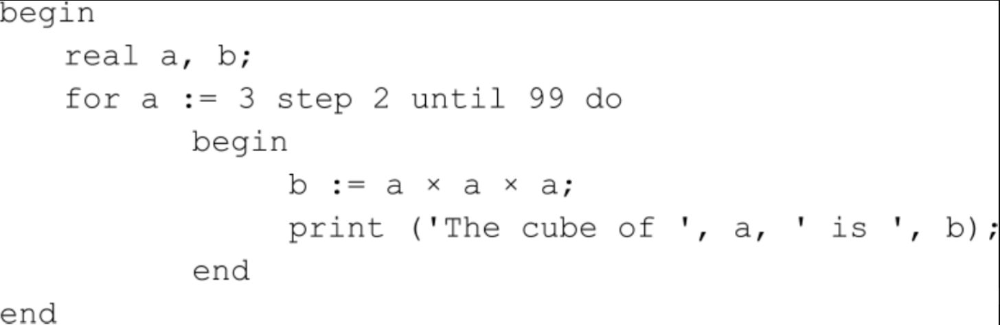
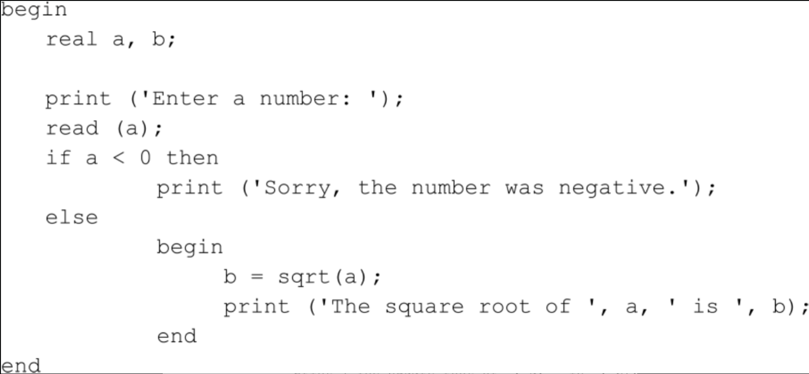
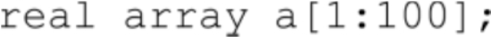

# 24. 高级语言与低级语言

使用机器码编写程序就如同用牙签吃东西，伸出手臂使出较大的力气刺向食物，但每次都只获取到小小的一块，这个过程是辛苦且漫长的。同样的，每个机器码字节所能完成的工作，是你能想象到的最微小且最简单的工作—从内存获取一个数，之后加载到处理器，再把它与另一个数相加，最终将运算结果保存到内存等—正因如此，很难想象如何使用这些机器码构成一个完整的程序。

目前为止，至少对于在第22章讨论的原始模型阶段来说，我们已经取得了一定的进步，在那个阶段，我们使用过控制面板上的开关将二进制数据输入到存储器。在第22章中，介绍了如何编写一段简单的程序，让我们可以利用键盘将十六进制机器码输入计算机，以及通过视频显示设备来检查这些代码。这种改进固然可取，但仍不是我们的终极目标。

前面的章节介绍过，可以使用某些较短的助记符来关联机器码字节，这些助记符包括MOV, ADD, CALL, HLT等，通过这些类似英语的符号我们可以较方便地引用机器码。通常这些助记符的后面会跟着操作数，这可以进一步指明它所关联的机器码指令的功能。例如8080机器码字节46h，它的功能是令处理器将存储在内存特定地址的字节转移至寄存器B，而该地址由寄存器对HL中的16位数寻址。这个操作可以简单地写做：

显然，使用汇编语言编写程序要比使用机器语言简单得多，但微处理器并不能解释汇编语言。在前面的章节中我们已经学习了如何在纸上编写汇编程序，但只有当你确实准备在微处理器上运行汇编程序，才会手工对其汇编，这样就可以将汇编语言程序的语句转换成了机器语言代码，并把它们输入内存。

当然，我们希望最好由计算机能独自完成语言转换的工作。如果你的8080计算机正在运行CP/M操作系统，而且你已经拥有了所有必需的工具，那就再好不过了，因为下面我们将介绍其工作原理。

第一步，建立一个文本文件，并将汇编语言程序输入到该文本文件中。这项工作可以使用CP/M的应用程序ED.COM来完成。该程序是一个可以用来创建、修改文本文件的编辑器。假设你把该文本文件命名为PROGRAM1.ASM，其中ASM是文件类型，用来指明该文本文件的内容是由汇编语言程序组成。这个文件的内容如下：

这个文件中有两条语句我们从未接触过。第一条语句是ORG(origin)，它不与任何8080指令对应，其功能是用来指明下面语句的地址从0100h地址处开始。如前所述，该地址是CP/M将程序装入内存的起始地址。

第二条语句是LXI(Load Extended Immediate)指令，其功能是将一个16位数加载到寄存器对DE。在本例中，该16位数是由标记Text提供的。该标记在程序底端的附近，位于DB(Data Byte)语句之前。DB语句我们也是第一次遇到，其后可以跟着一些字节，这些字节以逗号分隔或者用单引号括起来（如本例）。

MVI(Move Immediate)语句将数值9转移到寄存器C。CALL 5语句实现CP/M的函数调用功能。函数5的作用是：显示以寄存器对DE给出的地址为起始处的字符串，直到遇到\$结束（可以看到，在程序的结尾处使用了美元符号$作为文本的结束标志，这种方式看起来很奇怪，但CP/M就是采取的这种方式）。最后的RET语句用来结束程序，并把控制权交还给CP/M（实际上，这只是结束CP/M程序的方法之一）。END语句用来指明汇编语言文件已经结束。

现在我们已经有了一个包含7行语句的文本文件，下一步要做的就是对其进行汇编，即将其转换成机器语言代码。以前这项工作是通过手工完成的，但现在我们的机器运行的是CP/M系统，可以利用CP/M中一个叫做ASM.COM的模块来完成这项工作。该模块是CP/M的汇编器(assembler)。可以在CP/M的命令行中使用下面的语句运行ASM.COM文件：ASM PROGRAM1.ASM

ASM对PROGRAM1.ASM文件进行汇编，产生一个名为PROGRAM1.COM的新文件，PROGRAM1.COM包含了与我们编写的汇编程序相对应的机器码（实际上，该过程还包含另一个步骤，但在该操作中并不重要）。现在就可以使用CP/M的命令行来运行PROGRAM1.COM文件，程序运行的结果是显示字符串“Hello!”然后结束。

PROGRAM1.COM文件包含以下16个字节：

开始的3个字节是LXI指令，其后的两个字节是MVI指令，接下来的三个字节是CALL指令，紧随其后的一个字节是RET指令，最后的7个字节是ASCII码，包括5个字母“Hello”，感叹号“！”以及美元符号“$”。

像ASM.COM这样的汇编器程序所做的工作是：读取一个汇编语言文件（source-code，通常称做源代码文件），将其转换得到一个包含机器码的文件—可执行文件(executable file)。从宏观的角度来看，汇编器是非常简单的，因为构成汇编语言的助记符和机器码之间是一一对应的。汇编器拥有一张包括所有可能助记符及其参数的表，它逐行读取汇编语言程序，把每一行都分解成为助记符和参数，然后把这些短小的单词和字符与表中的内容匹配。通过这种匹配的过程，每一个语句都会找到与其对应的机器码指令。

注意，汇编器如何知道LXI指令必须将寄存器DE的值设置为地址0109h（Text的地址）。如果LXI指令本身被存放在地址0100h处（CP/M将程序加载至内存开始运行时的起始地址），而0109h则是Text字符串的起始地址。一般来说，程序员在使用汇编器时有很多方便之处，其中一点就是不需要关心汇编程序各部分在内存中的存放地址。

第一个编写汇编器的人需要手工对程序汇编。如果要为机器写一个新的汇编器（或者对其修改），则可以使用汇编语言编写该程序，然后使用原有的汇编器对其汇编。一旦新的汇编器通过了汇编，则它也就可以对自身进行汇编。

每当一种新的微处理器面世，就需要为其编写新的汇编器。然而，新的汇编器可以在已有的计算机上编写，并利用其汇编器进行汇编。这种方式称为交叉汇编(cross-assembler)，即利用计算机A的汇编器对运行在计算机B上的程序汇编。

虽然汇编器的引入消除了汇编语言编程中重复性的劳动部分（即手动汇编部分），但汇编语言仍然存在两个主要问题。第一个问题（也许你已经意识到了），使用汇编语言编程非常乏味，因为这是在微处理器芯片级的编程，因此不得不考虑每一个微小的细节。

汇编语言存在的第二个问题是不可“移植”(portable)。如果你为Intel 8080写了一个汇编语言程序，则该程序不能在Motorola 6800上运行，你必须在6800上重写一个相同功能的汇编语言程序。编写类似程序的过程也许没有编写第一个程序那么困难，因为你应经解决了程序的组织和算法问题，但仍然还有很多工作要做。

上一章介绍了现代微处理器集成浮点运算机器码指令的原理。不可否认，这已经为我们带来了很大的便利，但仍不能令人特别满意。一种更好的方式是：完全放弃那些实现每个基本操作的机器码指令，这些指令与处理器相关，因而导致程序缺乏移植性。我们采用的替代策略是使用一些经典的数学表达式来描述复杂的数学运算。下面是一个表达式的例子：

上式中的A, B, C代表数字，而PI=3.14159。

这看起来不错，为什么不动手尝试一下呢？假设在某个文本文件中有这样一个表达式，那么我们可以尝试编写一个汇编语言程序来读取该文本文件，并将其中的数学表达式转换为机器码。

如果只需要计算一次该表达式，那么可以手工计算或借助计算器来完成。如果需要对A、B、C取不同的值多次计算该表达式，那么你可能要考虑使用计算机来完成这些计算。因此，代数表达式不会孤立地出现，必须考虑其前后的语句，这些语句使表达式对不同的值进行运算。

现在你所创建的东西已经触及所谓的高级程序设计语言(high-level programming language)。我们一直在介绍的汇编语言称做低级语言(low-level programming language)，因为它与计算机硬件的关系相当紧密。尽管除了汇编语言以外的其他程序设计语言都可以称为“高级语言”，但它们之间还是有高低之分的，一些语言通常被认为比别的语言更高级。如果你是一家公司的总裁，坐在计算机前输入这些命令（也可能做得更轻松：口头发布这个命令），“计算出本年度的收益和损耗，生成年度报表，最后打印出2000份送至每个股东”，你所使用的才真正是一种非常高级的语言！但在实际工作中，程序设计语言还达不到这种理想化的水平。

人类语言通常都是经历了千百年复杂的互相影响、偶然演变以及不断吐故纳新才形成的，就算一些人工语言如世界语(Esperanto)，也处处显露出与现实语言的渊源。但高级程序设计语言是经过深思熟虑的设计的，更加概念化的语言。设计程序设计语言所面临的一大挑战就是：如何让语言更具吸引力。因为语言定义了人们向计算机传送指令的方式，只有更易用的方式才能让人们对语言产生兴趣。据1993年的一项估算，从1950年到1993年大约有1000多种高级程序设计语言被发明出来并被应用。

然而，仅仅定义(define)高级语言，包括定义语言的语法(syntax)来表达该语言可以描述的一切事物，还远远不够；我们还需要为其编写一个编译器(compiler)，编译器可以将高级语言的程序语句转换成机器码指令。同汇编器类似，编译器也是逐字逐句地读取源文件并将其分解成为短语、符号和数字的，但实现过程要比汇编器更加复杂。从某些方面来看，汇编器相对简单，因为汇编语言的语句和机器码是一一对应的。而一般的高级语言却不具备这种对应关系，编译器通常必须把一条语句转换多个机器码指令。编译器的编写非常复杂，许多书都是用全部的篇幅来讲解如何设计和构造编译器。

当然，任何事物都是具有两面性的，高级语言也不例外，它有很多优势但也存在不少缺陷。高级语言最基本的优点在于它比汇编语言易于学习并且更容易编写程序，用高级语言编写的程序通常更加清晰简明—与汇编语言不同，高级语言通常不依赖于特定的处理器，因此它们通常具有良好的可移植性。因为这种特点，使用高级语言的程序员不再需要关心最终运行程序的计算机的底层结构。当然，如果要在不同类型的处理器上运行程序，则需要用处理器对应的编译器将程序转换成对应的机器码。因此，最后生成的可执行文件仍然只适用于特定的处理器。

另一方面，有一种普遍现象：一个优秀的汇编程序员所编写的程序比编译器所产生的代码更加有效率。也就是说，从高级语言程序生成的可执行程序比相同功能的汇编语言程序更大，并且运行速度更慢（但从近年的发展来看，这种差别已变得不再明显，因为微处理器变得更加复杂，而且编译器在优化代码方面也更加成熟）。

此外，虽然高级语言提高了处理器的易用性，但并没有让其变得更强大。微处理器的任何一个功能都可以通过汇编语言实现，因此汇编语言可以高度利用处理器的功能。因为高级语言必须转化成机器码，所以它只会降低微处理器的能力。事实上，如果某种高级语言具有真正意义的可移植性，那么它将不能使用某些处理器的特有功能。

例如，许多微处理器都有移位指令。如前所述，这些指令能将累加器中的字节的每一位向左或向右移动。但事实上，几乎没有哪一种高级语言包含这种操作。如果在程序中需要进行移位操作，则必须通过乘2或除2来模拟该过程（这并不是什么坏事：事实上，许多现代编译器都是利用处理器的移位指令来实现乘以或除以2的幂的）。除此之外，许多高级语言也不包括按位逻辑运算。

在早期的家用计算机中，大部分应用程序都是用汇编语言写的，而现在除了一些特殊的应用场合之外，汇编语言已经很少使用了。而今处理器引入了一些新的硬件，可以实现流水线技术—同时有若干个指令码渐次执行—这使得汇编语言变得更加复杂且不易处理。与此同时，编译器却变得更加成熟，越来越多的程序开始使用高级语言来编写。现代计算机大容量的存储器也作为一个重要的角色，推动了这种趋势：程序员不再局限于编写运行在小内存和小磁盘上的程序。

早期的计算机设计者都曾尝试用数学符号来描述问题，但公认的第一个真正可以工作的编译器是A-0，它是为UNIVAC开发的编译器，于1952年由雷明顿兰德公司(Remington-Rand)的格瑞斯·穆雷·霍珀(Grace Murray Hopper, 1906—1992)开发完成。霍珀博士的早期计算机研究工作始于1944年，那时她效力于霍华德·艾肯(Howard Aiken)，主要研究MarkⅠ。在她八十多岁的时候，仍然孜孜不倦地在计算机界工作，当时她在DEC(Digital Equipment Corporation)公司从事公关事务。

FORTRAN语言是目前仍在使用的最古老的高级语言（虽然这些年来人们对其进行了大量修改）。你可能注意到了，很多计算机语言都是以大写字母命名的，这是因为它们的名字大都是由几个单词的首字母组成。FORTRAN这个名字来源于FORmula的前三个字母和TRANslation的前四个字母的组合，它由IBM在20世纪50年代中期开发，主要应用于704系列计算机。自其发布的几十年来，FORTRAN一直被认为是科学和工程应用程序开发的首选语言。它广泛地支持浮点运算，甚至支持非常复杂的数的运算（即我们上一章讲到的由实数和虚数构成的复数）。

任何一种计算机程序设计语言都有其支持者和批评者，而且人们通常只对自己喜欢的语言有热情。本书尽量以一种客观的态度来讨论某种语言，这里选取了一种语言作为原型，通过它来解释那些几乎已经销声匿迹的程序设计概念。我们的选择是ALGOL（即ALGOrithmic的缩写，有趣的是，ALGOL也是仙女座第二亮的恒星的名字）。ALGOL作为过去40年中许多曾经流行一时的通用高级语言的直接鼻祖，也非常适合用来研究高级程序设计语言的本质，该语言可看做是一粒种子，它的成长最终形成了高级语言这棵大树。直到今天，人们仍然在使用“类ALGOL”程序设计语言的概念。

ALGOL语言的原版由某国际委员会在1957至1958年间设计，它被称做ALGOL 58。两年后，也就是在1960年，ALGOL 58的改进版ALGOL 60面世，其最终版本是ALGOL 68。本章所采用的版本在Revised Report on the Algorithmic Language ALGOL 60说明文档中有具体描述，该文档于1962年完成并在1963年首次发行。

让我们开始写第一个ALGOL程序。假设我们使用的操作系统平台是CP/M或MS-DOS，并且安装了一个名为ALGOL.COM的编译器。该程序是一个文本文件，命名为FIRST.ALG。注意，文件类型名是ALG。

ALGOL程序以begin开始，以end作为结尾，程序的主要内容被包括在这两个语句之间。下面的程序用来显示一行文本：

通过在命令行运行ALGOL编译器对FIRST.ALG文件进行编译，其格式如下：

ALGOL编译器对这条命令很可能做出这种响应，在显示设备上给出以下提示信息：

ALGOL编译器对拼写的检查非常严格，它在这一点上比传统的语文教师更甚。因为输入程序时，误把“end”拼写做“ende”，所以编译器通过提示信息告诉我们程序中有语法错误(syntax error)。当编译器检查到“ende”时，它期待能遇到一个可识别的关键字(keyword)，但由于上述错误，编译不能通过。

将程序中的错误改正之后，可以再次执行编译命令。由于系统平台和编译器版本的不同，有时编译器会直接生成一个可执行文件（CP/M平台下此文件名为FIRST.COM, MS-DOS平台下名为FIRST.EXE）；有时还需要再执行一个步骤才可以完成。不论是哪种情况，最后你都可以在命令行执行FIRST程序：

FIRST程序会对此响应，并显示以下内容：

注意，这里还有一个拼写错误：first被误做fist！编译器没有检查出这个错误，因此它被称为运行时错误(run-time error)—程序被执行时才出现的错误。

很明显，我们的第一个ALGOL程序中，print语句的功能是把一些信息显示到屏幕上，在本程序中是显示一行文本（从功能的角度来看，该程序与本章开始所给出的汇编程序是等价的）。ALGOL语言的正式规范中并不包括print语句，但我们假设所使用的特定ALGOL编译器包括这个便利的工具，它有时候也被称做内部函数(built-in function)。除了begin和end之外的大部分ALGOL语句都要以分号结尾。你可能注意到了print语句使用了向右缩进的格式，这并不是必要的，其作用只是为了让程序的结构更加清晰。

假设现在要编写一个用于两个数相乘的程序。每一种程序设计语言都包括变量(variable)的概念。程序中的变量可以是一个字母、一个短的字母序列，也可以是一个单词，由程序员自己决定。变量名实际上对应内存的一个存储单元，但在程序中是通过名字来访问该存储单元的，而不是直接使用存储单元的地址值。下面的程序定义了三个变量，分别命名为a, b, c:

real语句称为声明(declaration)语句，用来指明程序中要定义的变量。在该程序中，变量a, b, c被定义为实数(real)类型或浮点数类型（同时，ALGOL语言也支持使用integer关键字来定义整数型变量）。程序设计语言中的变量名通常以字母开头，变量名也可以包括数字，但前提是第一个字符必须是字母。变量名不能含有空格，也不能包含除字母和数字以外的其他大部分字符。通常编译器会规定变量名的最大长度，本章用到的变量一律以单个字母命名。

假如我们使用的特定ALGOL编译器支持IEEE浮点数标准，则本程序中所定义的三个变量每一个需要4个字节的存储空间（采用单精度格式）或8个字节的存储空间（采用双精度格式）。

声明语句之后的三个语句是赋值(assignment)语句。在ALGOL语言中，赋值语句很容易被识别，因为它的格式很固定，总是在冒号后面跟着一个等号（在大多数计算机语言中，赋值语句通常只包括等号）。赋值语句的冒号左边是一个变量，而等号右边是一个表达式，表达式的计算结果将被赋值给左边的变量。前两条赋值语句指明，变量a, b将分别被赋予一个特定的值；第三条赋值语句指明，将a和b的乘积赋值给变量c。

时至今日，我们所熟悉的乘法符号“×”已经不允许出现在程序设计语言中了，因为它没有被包括在ASCII和EBDCIC字符集中。大多数程序设计语言使用星号(*)来替代它作为程序中的乘号标记。尽管ALGOL使用了普遍使用的斜杠(/)作为除法标记，但在该语言仍然可以使用除法标记(÷)，该标记用于整数除法，用来指明被除数与除数的倍数关系。ALGOL还使用了另一个非ASCII字符“↑”，该箭头符号用来做乘方运算。

最后的print语句用来显示所有变量的值。它包含文本和变量，并以逗号分隔。print语句的主要工作并不是用来显示ASCII码值的，但本程序中却做了更多的工作：将浮点数也转换成了ASCII码并显示：

接着会执行end语句，程序终止并将控制权交还给操作系统。

如果要将另外两个数相乘，则需要做以下工作：修改程序，改变变量的值，重新编译并重新运行程序，这将是一件非常烦琐的工作。为了避免这些重复工作，我们可以借助于另一个内部函数read。修改后的程序如下：

read语句的功能是读取从键盘键入的ASCII码值，并将其转换成浮点数。

循环(loop)是高级语言的重要组成部分。循环使得程序可以对同一个变量的不同取值反复执行相同的操作。假设我们要写一段程序用来计算3, 5, 7, 9各自的平方，可以这样编写程序：

for语句将变量a的值第一次设为3，然后执行do关键字后面的语句。如果do后面要执行的语句不止一条（如本例），则必须将它们置于begin和end之间，这两个关键字定义了一个语句块(block)。第一次循环之后，for语句会一次为a赋值5, 7, 9并执行相同的语句块。

下面的程序中采用了for语句的另一种使用方式，这段程序用来计算3～99之间所有奇数的立方。

for语句将变量a初始化为3，并执行for后面的语句块。第一次循环结束后，变量a与step关键字后面的增量相加，这里是2。新得到的a的值是5，它将用于第二次执行语句块。变量a继续增加2并用于下一次循环，直到a的值超过99，这时for循环结束。

一般而言，程序设计语言对语法都有着非常严格的要求。在ALGOL 60中，就关键字for而言，其语法格式是：for的后面只能跟一个变量名。而英语中的这种限制宽松的多，单词for的后面可以跟所有类型的单词，例如“for example”，“for can”等。尽管编译器是非常复杂的程序，但其所能解释的语言显然要比人类的语言简单得多。

大部分程序设计语言的另一个重要特征体现在条件(conditional)语句的使用。条件语句的特点是，只有当某个条件成立时才会执行另一条对应的语句。在下面的例子中，我们使用ALGOL的内部函数sqrt来计算一些数的平方根。sqrt函数的参数不能是负数，因此要在程序中通过条件测试避免这种情况。

左尖括号(<)是小于号。如果程序的使用者输入的是一个小于0的数，if语句中的判断语句为真，因此第一个print语句将会被执行。反之，如果该数大于或等于0，则else关键字后面的语句块则会被执行。

本章目前所用到的变量都是一个变量对应一个值，我们也可以用一个变量对应多个值，数组(array)就是一个很好的选择。在ALGOL程序中可以这样声明一个数组：

该语句定义一个数组变量a，它可以用来存放100个不同的浮点数，这些数被称做数组元素。可以使用数组名加标号的方式来引用数组元素，例如，第一个数组元素是a[1]，第二个是a[2]，最后一个是a[100]。方括号中的数字称做数组下标(index)。

下面的程序用来计算1～100所有数的平方根，将结果保存在一个数组中，然后再通过循环将这些结果显示出来。代码如下：

程序中还定义了一个整型变量i（由于它是integer的首字母，经常被程序员用做整型变量名）。第一个for循环的执行过程中，每个数组元素被赋值为其下标的平方根；第二个for循环执行过程中，数组中的每一个元素被显示出来。

变量的类型有很多，除了我们已经介绍过的实型和整型之外，变量还可以被声明为布尔型（Boolean，该名称是为了纪念第10章提到的乔治·布尔）。布尔变量的取值只可能有两种，即true和false。在本章的最后将介绍一个用到布尔数组的例子（这个例子也将用到目前所介绍的大部分内容），来实现一个寻找素数的著名算法—爱拉托逊斯筛法(Sieve of Eratosthenes)。爱拉托逊斯（约公元前276–196年）传说是亚历山大图书馆的管理员，他因准确计算出地球的周长而永载史册。

素数是只能被1及其本身整除的一类整数。第一个素数是2（也是唯一的偶数素数），其他的素数还包括3, 5, 7, 11, 13, 17，等等。

爱拉托逊斯方法以2开始的整数表开始，因为2是素数，因此所有可以被2整除的数都被排除掉（即除了2之外的全部偶数）。接下来是3，因为3是素数，因此所有能被3整除的数也被排除掉。因为4在第一个步骤中已经被排除掉，所以下一个要考虑的数是5，即排除所有5的倍数。按这种方式不断循环，最后剩下的都是素数。

下面的ALGOL程序用来筛选2～10,000之间的所有素数，程序中定义了一个布尔数组，用来对所有的数进行标识。该程序如下：

第一个for循环将数组a的每一个元素的初始值设置为布尔值true。这里的true表示该位置的数是素数，因此现在程序默认所有的数都是素数。第二个for循环的范围是1～100（100刚好是10000的平方根）。在第二个for循环中，如果判断条件成立，该数为素数，即a[i]为true，则第三个for循环则会把该数的所有小于或等于10000的倍数（除了其本身）设置为false，因为这些数都不是素数。最后的for循环用来输出所有的素数，这里的判断条件是：若a[i]为true，则i为素数。

程序设计到底是一门科学还是一门艺术呢？这的确是一个有趣的问题，一些人甚至还为此争论不休：一方面，你或许在大学里系统地学习了计算机科学(Computer Science)课程；另一方面，你又读过如唐纳德·克努斯(Donald Knuth)的名著《计算机编程艺术系列》(The Art of Computer Programming series)等著作。然而物理学家理查德·费叶曼(Richard Feynman)曾这样写道：“从某种程度上看计算机科学像是一种工程，它的工作范畴是利用一些事物去实现其他事物。”

# 25. 图形化革命

对于《生活》(life)杂志的读者而言，1945年9月10日这一天的杂志像以往一样，有很多习以为常的文章和照片：第二次世界大战结束的相关新闻；讲述舞蹈家瓦斯拉夫·尼金斯基(Vaslav Nijinsky)在维也纳生活的点点滴滴；主题为美国汽车工人的图片新闻。但同时，在这一期的杂志中还有些不寻常的内容：万尼瓦尔·布什(Vannevar Bush 1890—1974)发表了一篇关于未来科学大胆猜想的文章。万·布什（人们常这样称呼他）的发明与贡献对计算机历史产生了深远的影响—其中最著名的就是他设计开发具有划时代意义的模拟计算机—微分分析器(The Differential Analyzer)—1927～1931年，当时万·布什在担任麻省理工学院（以下简称为MIT）工程学教授期间发明了这个机器。这篇文章在杂志上发表的时候，也就是1945年，布什所担任的职位是科学研究及开发办公室(Office of Scientific Research and Development, OSRD)的主任，负责美国战时科研活动的协调工作，其中就包括了曼哈顿计划(Manhattan Project)。

万·布什将自己两个月前在《大西洋月刊》(The Atlantic Monthly)上发表的一篇文章，通过浓缩精简，重新发表在《生活》杂志上，并将这篇文章最终取名为《思维之际》(As We May Think)，文中描述了一种未来的发明，这项发明可以帮助科学家和研究人员更轻松地处理日益增多的技术期刊及文章。布什提出可以利用微缩胶片作为解决方案，同时他构想出了一种叫做麦克斯储存器（Memex，又名记忆扩展器）的设备，它可以对书籍、文章、录音和图片进行保存。麦克斯储存器还有一项重要的功能，那就是它可以让用户根据某个主题在所有的素材之间建立起关联，这些关联的基本来源就是我们人类的思维。他还大胆预言一种新的职业群体，他们的工作就是在繁杂的信息载体之间提炼并建立起可靠的关联。

在20世纪的那个年代，讲述辉煌未来的文章屡见不鲜，但《思维之际》这篇文章却异常耀眼。它所讲述的不是可以替代我们去做家务劳动的设备，也不是关于未来运输方式或智能机器人的故事，这个故事的主角是信息(Information)，故事的主线是如何利用新技术成功的处理信息。

回顾历史，从第一台继电器计算器出现到现在为止，65年过去了，计算机的体积越来越小，处理速度越来越快，价格也越来越便宜。这一趋势极大地改变了计算的原始属性。当计算机价格变得很便宜，可以实现人手一台；当计算机体积越小、处理速度越快，软件就能发挥更大的作用，而机器就可以承担越来越多的工作。

要充分利用日益增长的运算和处理能力，较好的一种方法就是不断改进计算机系统中的关键部位，最典型的就是用户界面(User Interface)—它可以看作人机交互的轴心。人与计算机是两种完全不同形式的“客观存在”，只可惜在人机交互的这个过程中，与其让计算机去适应人类的特性，远不如劝服人们进行调整以适应计算机的特性来得容易。

在计算机发展早期，交互式这个概念并没有它的实际意义。人们编程时更多使用的是开关和电缆，有一部分人使用的是打孔纸带或胶片。到了20世纪50到60年代（有些观点认为这一时间可以延续到70年代），计算机已经可以使用批处理(batch processing)进行编程：程序和数据被“分布”在打孔卡上，然后一次性录入到计算机内存。这些工作完成之后，再由程序对数据进行分析，得出结论，最后将结果打印在纸上。

最早的交互式计算机运用的是电传打字机。我们回忆一下前面讲过的达特茅斯(Dartmouth)时分操作系统（原型出现于20世纪60年代早期），这种系统支持多个电传打字机同时工作，而且互不影响。此类系统中，用户在打字机上输入一行，计算机会相应地输出一行或多行。通常，打字机和计算机之间的信息交流是由一串ASCII码（也有可能是其他字符集）来完成的，这些ASCII码大多由字符编码组成，当然还包括像回车、换行等一系列简单的控制字符编码。随着机器的运行，相应的事务也随着打印纸的旋转逐步推进。

阴极射线管（cathode-ray tube, CRT，这是20世纪70年代随处可见的设备）并不受这类限制。使用软件来协调整个屏幕显得更加灵活方便—这可以算得上是一种二维的信息平台。但是为了尽量保持操作系统显示输出的逻辑一致性，早期那些为小型计算机编写的软件都把CRT显示器看做“玻璃屏幕电传打字机”—所有内容都是一行一地显示的，当字符排到底端，屏幕被填满时，屏幕上的内容要整体向上翻滚。除了CP/M（微处理机操作系统）中的所有工具软件之外，大部分MS-DOS下的工具软件都采用这种方法—它们都仿照电传打字机的工作方式来使用视频显示器。使用电传打字机这种工作原理的操作系统有很多，或许UNIX才算是最典型的原型操作系统之一，它还一直保留着这种“传统工艺”。

不巧的是，ASCII码字符集不完全适用于阴极射线管的工作方式。在最原始的ASCII码设计中，编码1Bh被标识为Escape，它的主要作用是帮助字符集进行扩充。在1979年，美国国家标准协会(American National Standards Institute, ANSI)发布了一项题为“ASCII码使用的附加控制(Additional Controls for Use with American National Standard Code for Information Interchange)”的标准。该标准发布的初衷是为了“适应二维字符-图像设备输入/输出控制中迫在眉睫的相关需求，其中包括阴极射线管和打印机之间的交互终端……”

其实Escape的编码1Bh只占据一个字节，且它的含义是唯一的。Escape如果作为一串序列的前缀字符，那么这串字符序列的含义也随之改变。比如下面这串序列：

可以看出Escape编码随后紧跟的是字符“[”“2”“J”的ASCII码，现在这一串字符的含义为“清屏”然后移动光标至左上角。这种定义在电传打字机上是不可能出现的。下面这串序列：

即Escape编码随后紧跟的是字符“[”、“5”、“；”、“2”、“9”、“H”，这串字符的作用是把光标移到第5行的第29列。

键盘和CRT一起对远程计算机传输来的ASCII码（可能还包括Escape字符序列）做出响应，这种设备我们称之为哑终端(dumb terminal)。哑终端相对于电传打字机速度要更快，从某种程度来讲也更灵活，但从速度的提高程度上来讲，并不足以引领用户界面的革新。真正的革新出现在20世纪70年代小型计算机中—它类似于第21章我们构建的假想计算机，配备了“视频显示存储器”，并作为微处理器地址空间的组成部分。

第一个预示着家用计算机将与它的孪生兄弟—体积庞大、价格昂贵的大型机划分界限的标志性的事件是VisiCalc的使用。VisiCalc由丹·布莱克林（Dan Bricklin，生于1951年）和鲍勃·弗兰克斯顿（Bob Frankston，生于1949年）设计并编程实现，而这套系统于1979年引入苹果II型电脑(Apple II)中。VisiCalc通过屏幕将一个二维电子数据表呈现给用户。在VisiCalc出现之前，数据表就是一张划分好了行、列的纸，主要用于一系列计算。VisiCalc用视频显示器将纸质材料取而代之，通过这种方式，用户可以在数据表中随处游走，在相应位置输入数据、公式，并在修改后对结果进行重新计算，为用户提供了更多的自由。

令我们惊讶与无奈的是，VisiCalc这款应用程序无法在大型机上运行。因为像VisiCalc这类程序需要以较快的速度不断更新屏幕，所以，它们直接将数据写入Apple II视频显示器所配备的RAM中。该RAM是微处理器地址空间的一部分。大型时分计算机以及哑终端之间的接口速度过慢，以至于电子报表程序无法使用。

计算机对键盘的响应速度越快，对视频显示器的更新速度越快，则人机交互就越频繁。在IBM PC刚刚推出的10年里（即20世纪80年代），几乎搭配的所有软件都是直接将输出的数据写入视频显示存储器的。当时IBM建立了一套硬件标准，其他硬件制造商参照这些标准去生产，这样软件制造商就可以绕过操作系统直接操控硬件，统一化的硬件标准确保了程序的正确运行（同时也杜绝了不能运行的情况）。如果所有同构的PC都拥有异构的视频显示器硬件接口，这种做法无异于将软件厂商推到了火坑里，因为做软件的同时还要关注硬件设计细节是不现实的。

IBM早期PC配备的应用程序通常只有字符输出，很少有图形输出。使用文本输出大大加快了应用程序的运行速度。假设PC上配备一台第21章所描述的视频显示器，那么程序所要做的就是把字符相应的ASCII码写入内存，然后屏幕上就会显示出该字符。但是如果使用的是图形视频显示设备，那么相应的程序需要将8个或更多的字节写入到内存中，这样做的目的就是画出字符的外观并以图形的方式显示。

在计算机的发展史上，从字符显示到图形显示是一次伟大的变革，计算机在这次变革中迈出了重要的一步。然而，相对于显示文本和数字所采用的软硬件，图形化计算机的软硬件发展十分缓慢。早在1945年，约翰·冯·诺伊曼(John von Neumann)就预见了一种类似示波器的显示器，它的最大特点是可以显示图像化信息。但直到20世纪50年代早期，MIT（当时得到了IBM资助）建立了林肯实验室，实验室的主要任务就是帮助美国空军开发一种适用于防空系统的计算机，这次项目使计算机的图形化成为现实。该项目被称为半自动地面防空系统，简称SAGE(Semi-Automatic Ground Environment)，项目的内容包括构建一个显示图形的屏幕，以此来帮助操作员分析海量数据。

早期的视频显示器，比如SAGE中使用的这一种显示器，与我们今天所使用的PC配套显示器不尽相同。我们日常所用的PC配套的纯平显示器属于光栅(raster)显示器。它的原理就像电视机，每一幅图像背后都是一行行的光栅线，这些光栅是电子枪(electron gun)发出光束迅速来回移动覆盖整个屏幕而形成的。我们可以把屏幕想象成一个巨大的矩形阵列，阵列的每个元素都是一个点，这些点称为像素(pixels)。在计算机内部，有一块专门供视频显示器使用的内存区域，屏幕上的每一个像素点由1个或多个比特表示。这些二进制数值不仅决定了像素点的亮度，还决定了它的颜色。

举例来讲，当今大多数计算机显示器的水平分辨率至少为640个像素值，垂直分辨率至少为480个像素，像素总和即两数之乘积：307,200。如果为每个像素赋予1比特内存空间，这时每个像素点只能有两种颜色，通常设置为黑、白两种颜色，比如可以设置让0代表黑色，1代表白色。这种视频显示器需要占据307,200比特的内存，换算过来就是38,400字节。

由于要用到的颜色数目逐渐增加，为了表示这些颜色，每个像素所需要的比特越来越多，显示适配器需要配备的存储器容量也越来越大。比如我们想使像素点具备不同的灰度，那么可以提供一个字节的存储空间。在这种处理方式下，字节00h代表着黑色，FFh代表着白色，两者之间的值代表着不同的灰度。

CRT上的色彩空间由三个电子枪产生，每一个电子枪分别产生三原色中的一种，包括红色、绿色、蓝色（用放大镜来观察电视机或彩色计算机屏幕，你可以清楚地看到，每一幅图像都是利用许许多多不同的三原色组合显示出来的），红绿组合出黄色，红蓝组合出品红色，蓝绿组合是青色，三原色组合出白色。

在最简单的彩色显示适配器中，表示每个像素点需要3个比特。最直观的编码方式就是每一种原色对应编码中的1位。

这种方案可能只适合简单的类似卡通画的图像。真实世界出现的几乎所有颜色都是由红、绿、蓝三原色的不同色阶(levels)组合而成的。如果为每个像素赋予2个字节的存储空间，这样一来，可以给每一个原色分配5位（1位保留）存储空间，这种方法可以表示出红、绿、蓝三种颜色且每种颜色具备32种不同的色阶，这样算下来总共有32,768种不同的颜色。这种模式通常称做高彩色(high color)或数千种颜色(thousands of colors)。

我们下面尝试一下用3个字节来表示一个像素，三原色中的每一种各占一个字节。这种编码模式使红、绿、蓝各自呈现出256种不同的色阶，这样算下来共有16,777,216种不同的颜色，这种方案通常叫做全彩色(full color)或百万种颜色(millions of colors)。如果视频显示器的分辨率为640×480，即水平640像素，垂直480像素，将像素点的数量乘以表示每个像素点需要的字节数可以得到，共需要921,600字节的存储容量，即将近1MB。

每个像素所赋予的比特数有时也称做色深(color depth)或色彩分辨率(color resolution)。颜色数与单个像素被赋予的比特数的关系如下：

$颜色数=2^{每个像素所赋予的比特数}$

如果视频适配卡配备的存储器容量有限，那么它的最大色深或色彩分辨率自然而然也受到约束。假设有一个配备了1 MB存储器的视频适配卡，在每个像素被赋予3个字节的情况下分辨率可以达到640×480。如果想把分辨率提高到800×600，存储器就不足以为每个像素赋予3个字节，必须缩减到用2个字节来表示一个像素。

虽然现在来看在显示器上使用光栅技术似乎是很自然的事情，但是在早期，这种做法并不可行，因为在当时看来，这种技术需要的存储器空间太大。在这种情况下SAGE视频显示器应运而生，它是一种矢量(vector)显示器，相比电视机，它更像一种示波器。电子枪可以通过电驱动定位到显示器任何一个像素点上，之后可以直接画出直线或曲线。由于屏幕上的图像具有持久性，不会立即消失，这样就可以利用直线和曲线形成最基本的画面。

支持光笔(light pen)是SAGE计算机的一大特色，操作者使用光笔可以改变显示器上的图像。光笔这种设备很特殊，从外观上来看是一端连有电线的笔。如果使用与之配套的软件，计算机能够感知到光笔所指的屏幕位置，随即根据光笔的位移相应地改变图像。

光笔的工作原理是什么呢？如果是第一次看到它，即使是相关领域的技术专家，也会感到困惑。理解它的关键在于光笔并不发射(emit)光—它所做的是检测(detect)光。对于CRT（无论采用的是光栅还是向量显示技术），电子枪移动控制电路有两个最重要的功能，第一个功能是光笔一旦感知到电子枪射出的光，系统需要立即做出反应；第二个功能是系统在对其做出反应的过程中，需要确定出光笔指向的屏幕位置。

伊凡·苏泽兰（Van Sutherland，生于1938年）是最早预见到了计算机发展的一个全新领域，即交互式计算的人之一。在1963年，他演示了为SAGE计算机专门开发的名为“画板”(sketchpad)的程序。画板不仅可以将图像信息存放在存储器中，还可以把图像在屏幕上显示出来。你还可以使用光笔在显示器上画出图像并进行修改，与此同时，计算机会对光笔的轨迹一直进行跟踪。

还有一位早期交互式计算的预言家，那就是道格拉斯·恩格尔巴特（Douglas Engelbart，生于1925年）。他曾阅读过1945年万·布什发表的文章《思维之际》，巧合的是，五年之后他开始致力于研究计算机界面显示的新方法，并为之奉献毕生精力。20世纪60年代中期，当恩格尔巴特在斯坦福研究所(Stanford Research Institute)工作时，他重新思考并设计了输入设备，提出了用五股(five-pronged)键盘作为指令输入设备（这个设备并未普及），另外还提出了一种配备轮子和按钮的设备，它的名字就是鼠标(mouse)。鼠标现在已经在全世界被广泛接受，它可以用来移动屏幕内的指针，还可以选择屏幕上出现的对象。

许多在早期热衷于交互式图形计算的科学家（但这里并不包括恩格尔巴特），他们不约而同地聚集在了施乐(Xerox)公司，幸运的是，此时的光栅显示器已经变得经济实用。施乐公司在1970年建立了帕洛阿尔托研究中心(Palo Alto Research Center, PARC)，中心的主要任务之一就是协助产品开发，以此来加快公司迈入计算机产业的步伐。PARC中最著名的预言家应该算是阿伦·凯（Alan Kay，生于1940年），14岁那年，阿伦·凯在一篇罗伯特·海因莱因(Robert Heinlein)撰写的故事中，读到了万·布什提出的微缩胶片图书馆，阿伦·凯因此而深受启发，不久他构想了一种名为“Dynabook”的便携式计算机。

PARC着手的第一个大的工程是阿尔托(Alto)，它的设计和制造完成于1972—1973年。从那个年代的标准去看，它是一个令人眼前一亮的产品。它采用落地式系统单元，配备16位处理器、2个3 MB的磁盘驱动器、128 KB的内存（最多可扩充到512 KB），还包括一个三按钮的鼠标。在Alto开发的时候，16位单芯片微处理器还未面世，所以它的处理器由将近200个集成电路组成。

Alto有许多与众不同的地方，视频显示器是其中一个方面。屏幕的大小和形状就像一张纸—8英寸宽，10英寸高。它采用光栅成像技术，水平像素值为606，垂直像素值为808，算下来共有489,648个像素。其中每个像素占据1位存储空间，即每个像素取值只有两种：黑色或白色。视频显示的专用存储器容量为64 KB，占用处理器的地址空间。

通过直接对视频显示存储器进行写操作，软件可以在屏幕上绘图或将不同字体、不同大小的文本显示在屏幕上。用户可以通过移动鼠标，在屏幕上对指针进行定位，还可以与屏幕上的对象进行交互。视频显示器与电传打字机在很多方面不尽相同，电传打字机顺序响应用户输入并按行将程序输出，而视频显示器的屏幕可以看做二维空间上的高密度的信息阵列，它还可以作为直接的用户输入源。

20世纪70年代晚期，Alto所搭配的程序逐渐凸显出很多新奇有趣的特点。比如窗口中可以容纳多个程序并同时显示在屏幕上。Alto的视频图像功能使得软件从文本的束缚中摆脱出来，使其可以更加真实地反映用户的想法。图形对象（Graphical objects，比如按钮、菜单，以及被称做图标的小图片）成为用户接口的一员。鼠标可以在多个窗口中进行选择、触发图形对象来执行程序功能。

软件的内涵就在于此，它的意义远不止仅有的用户接口，还包括与用户的亲密耦合。软件使得计算机所涵盖的应用领域变得更广，而不仅仅局限于简单的数字变换。软件之所以被设计出来，其最终目的是—引用道格拉斯·恩格尔巴特在1963发表的一篇著名论文的标题—《为了扩展人类的智慧》(For the Augmentation of Man's Intellect)。

PARC在Alto这个项目的开发成果预示着图形用户界面(Graphic User Interface, GUI)登上了历史的舞台。施乐公司并没有将Alto推向市场（价格定位3万美元以上绰绰有余）。从10年之后的今天来看，当时的Alto应该被包装成一种成功的消费产品并推向市场。

1979年，斯蒂夫·乔布斯(Steve Jobs)带领苹果公司代表团对PARC进行了访问，在那里的所见所闻给他们留下了深刻的印象。而他们却花费了三年多的时间才推出具有图形界面的计算机，这就是在1983年1月推出的苹果莉萨(Apple Lisa)，可惜这套系统在当时并不被看好。而一年以后推出的麦金托什机(Macintosh)却大获成功。

最原始的Macintosh机配备有Motorola 68000微处理器、64 KB的只读存储器、128 KB的随机访问存储器、一个3.5英寸的磁盘驱动器（存储容量为400 KB）、一个键盘、一个鼠标和一个视频显示器，显示器水平像素为512，垂直像素为342（仅为9英寸的CRT对角线长度），像素总量为175,104个。每个像素赋予1位内存，只能显示黑白两色，这种配置约占22 KB的视频显示存储器。

最原始Macintosh机硬件方面很精巧，但是可更新能力很差。1984年Macintosh操作系统的诞生对于Mac（即Macintosh机）意义非凡，它的出现使得Mac变得与众不同，当时我们把这样一个操作系统称为系统软件(System Software)，它就是现在著名的苹果操作系统(Mac OS)。

基于文本的单用户操作系统，如CP/M或MS-DOS，体积很小但是不支持扩展的应用程序接口(API)。关于这点在第22章进行过解释，在这些基于文本的操作系统中，没有为访问文件系统的应用程序提供一种渠道。Mac OS这种图形化操作系统所占的空间比前面提到的这两种要大得多，其中包含了上百个API函数，每一个函数都用其功能来命名。

MS-DOS操作系统是基于文本的，如果要在屏幕上以电传打字机方式将文本显示出来，使用几个简单的API函数即可，但对于Mac OS这种基于图形的操作系统，必须提供一种在屏幕上显示图像的途径，程序通过这条途径对图像进行显示。从理论上来讲，一个API函数完全可以胜任这项任务，函数的功能就是设置某个水平和垂直坐标下的像素的颜色。但在实际应用中，这种方法效率较低以至于严重影响到了图像显示的速度。

在这种需求下，如果操作系统可以提供一整套图形编程系统，那么其意义是重大的，这样的操作系统必须包含如下API函数：画线、画矩形、画椭圆（包括圆）以及画出文本。其中，线条可以是实线，可以是虚线，还可以是点线；矩形和椭圆可以具备不同的填充模式；字符可以具备不同字体和大小，还可以具备不同特效，如加粗和下画线等。图形编程系统负责规划如何将各式各样的图形对象以点阵集合的形式表示在显示器上。

如果程序在图形操作系统下运行，那么它们在显示器或打印机上画图这一过程中，使用的是一套完全相同的API。正因为如此，字处理程序在屏幕上显示出的文档，与打印出来而得到的纸质文档，看上去非常相似。这种特点称为“所见即所得”（简写为WYSIWYG）。这是喜剧演员弗雷普·威尔森(Flip Wilson)在扮演杰拉尔丁(Geraldine)角色中的一句话，这句话也成了计算机领域的一个经典口号。

图形用户界面对用户而言是极具吸引力的，其中一个重要原因就是不同的应用程序使用着大致相同的工作原理，并且影响着用户的使用经验。这样一来操作系统就承担起了支持API函数的重任，而应用程序就可以利用这些API函数去实现用户界面的不同组件，如按钮和菜单等。GUI不仅是一种看上去简洁友好的用户环境，对于程序员而言，它还是一种重要的开发环境。程序员在开发新一代用户界面的时候可以不用从底层开始重新编写。

其实早在Macintosh问世之前，一些公司已经开始着手为IBM PC及其兼容机创建图形操作系统。这两种工作有一个显著的不同：苹果公司的硬件和软件都是由苹果公司自己设计的，因此开发人员的工作更加轻松。Macintosh系统软件只支持一种类型的磁盘驱动器、一种视频显示器，以及两种型号的打印机。而IBM PC的图形操作系统开发人员所面对的是许多不同的硬件，操作系统与不同的硬件之间需要同时兼容。

还有一点，虽然IBM PC问世的时间（1981年）较早，但MS-DOS应用程序已经在多数人心中根深蒂固，人们不愿意放弃它们。因此PC的图形操作系统必须具备一个重要的特性，那就是新的操作系统应该可以直接兼容MS-DOS应用程序，就好像MS-DOS应用程序是为新的操作系统专门设计的（Macintosh不兼容Apple II系列软件，因为它们的微处理器型号不同）。

在1985年，迪吉多科研公司（Digital Research, CP/M的后续公司）推出了图形环境管理器(Graphical Environment Manager, GEM)；VisiCorp（推出Visilalc软件的公司）推出了VisiOn；与此同时微软公司发布了Windows 1.0版本，作为一匹黑马，当时它也被很多人认为将会成为“视窗争夺战”的胜利者。然而直到1990年3月Windows 3.0发布，Windows才真正受到大众瞩目。星星之火从那时开始燎原。在本书出版的2000年，约90%的小型计算机上使用的都是Windows操作系统。除了外观上的不同，Macintosh和Windows这两种操作系统所包含的API也有着天壤之别。

从原理上来分析，除了图形显示器，图形操作系统与文本操作系统相比，对硬件支持的要求并没有太多不同。从理论上来讲甚至硬盘驱动器都可以算是多余的：比如最初的Macintosh没有配备，Windows 1.0也不需要。虽然大家都认为使用鼠标操作会更加方便，但其实Windows 1.0可以不需要鼠标。

