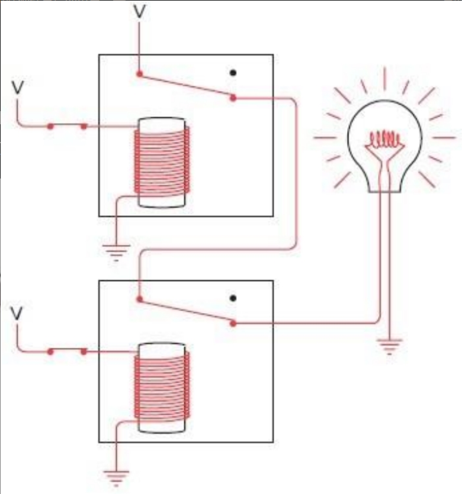
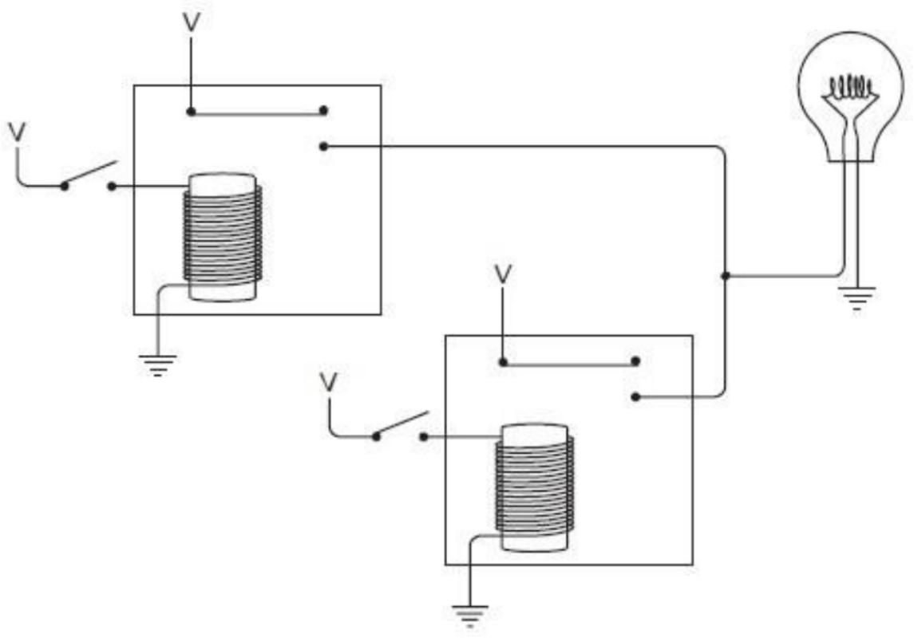
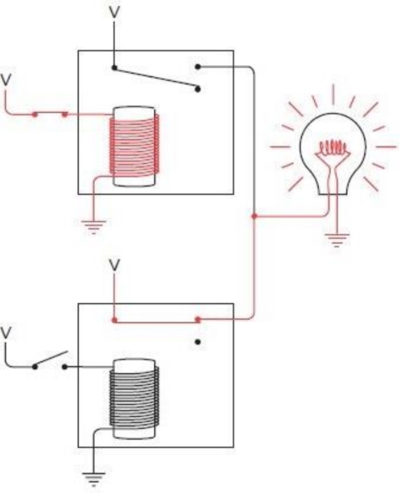

# 1. 莫尔斯电码

手电筒能用来交谈吗？这当然值得一试。我们在一年级的时候学习怎样在纸上写字母和单词，因此，把同样的方法运用到手电筒上似乎也是有道理的。只需要站在窗户边，用光来画出字母。对于字母“O”，打开手电筒，在空气中划一个圈，然后关掉手电筒。对于字母“I”，竖着划一下。但是，你很快就会发现，这个方法也不太行得通。当你看着朋友的手电筒在空中圈圈点点时，会发现很难在头脑中组合出那么多复杂的笔画。这些旋转和倾斜的光线都太不准确了。

或许大家都曾经在电影里看到这样的情节，两个水手在海上通过灯的亮灭来互相发送信号。或许那正是解决问题的办法。如此一来，你就可以发明一种简单的技术。在这个方案里，字符表里的每个字符对应一连串的手电筒闪烁。“A”是闪一次，“B”是闪两次，“C”是闪三次，依此类推，“Z”就是闪26次。单词BAD可以用闪2次，闪1次，闪4次这样的一个组合来表示，而且在字符之间设置的小停顿使这个单词不至于被误认为是闪7次的字母“G”。另外，单词之间停顿可以稍长些。

这似乎很有希望，采用这种方案的好处是你不必在空中比划手电筒了，只要对准方向和按开关就行了。但是这种方案也有一个不足，那就是如果你想发送的第一个消息是“How are you？”，那么你将总计需要让手电筒闪131次！而且，这还是忽略了标点符号的，你还没有设计闪多少次来对应一个问号。

但是这已经离答案更近一些了。我们能够肯定的是，在此之前一定有人也遇到过类似的问题，而你解决这个问题的思路也是非常正确的。等到了白天，跑一趟图书馆，查查资料，你发现了一个被称为莫尔斯电码(Morse Code)的伟大发明。这正是你想找的，尽管你现在必须重新学习如何去“写”字母表里的字母。

它们的不同之处在于：在你发明的系统里，字母表里的每个字母就是用一定数目的闪光表示的，闪1下为“A”，闪26下为“Z”。而在莫尔斯电码里，则有两种闪烁——短闪和长闪。当然这使得莫尔斯电码更加复杂，但是在实际应用里它被证明是更为有效的。句子“How are you?”现在只要闪32下（包含一些短闪和一些长闪），而不再是131下，而且这其中还包括了一个代表问号的编码。

当问及莫尔斯电码是如何工作的时候，人们并不会谈论“短闪”与“长闪”。相反，他们使用“点(dot)”和“划(dash)”，因为这是在打印纸上显示编码的一个便利方法。在莫尔斯电码里，字母表里的每个字母都与一个点划序列相对应，正如下表所示。


虽然莫尔斯电码和计算机毫无关系，但是，熟悉编码的本质对于深入理解计算机软硬件内部结构以及隐匿在其后的语言将大有裨益。

前面所列的莫尔斯编码表，其本身就是一种类型的编码。在这个表中，每个字母由一系列的“点”和“划”来表示。然而实际上我们不能发送“点”和“划”，相反，我们发送与“点”和“划”对应的闪烁光。

当使用手电筒发送莫尔斯编码时，迅速地打开和关闭开关代表一个“点”（快闪），让闪光时间保持得相对长一些代表“划”（慢速闪光）。例如在发送字母A时，首先以非常快的速度打开并关闭手电，然后再以稍慢的速度进行一次。在发送下一个字符前，需要暂停一会。在此约定，一个“划”的时长是“点”的3倍。例如，如果一个“点”的时长是1秒钟，那么一个“划”的时长就应当是3秒钟。（在现实中，莫尔斯编码的传输速度远比这要快得多）。接收者看到一个短促的闪烁和一个拖长的闪光后，就知道这是一个A了。

在莫尔斯编码中，“点”和“划”之间的停顿是至关重要的。例如，当发送一个字母A时，在发送的“点”和“划”之间，手电筒要关闭一段时间，这相当于一个点的闪烁时长（如果“点”的时长是1秒钟，那么“点”和“划”之间的停顿也应该是1秒钟）。对于同一个单词中的字母，则通过较长的停顿来分隔，这大约相当于一个“划”的时长（或者说是3秒钟，如果一个“划”的时长就是3秒钟的话）。

单词之间则通过相当于两个“划”的时长来分隔（如果一个“划”的时长为3秒钟，那么这个停顿就应当为6秒钟）。

几乎每个人都知道一点儿莫尔斯编码。三个点、三个划，再加三个点就表示SOS，即国际求救信号。

莫尔斯编码的一个缺点是，它没有区分大写字母和小写字母。但是除了可以代表字母外，莫尔斯编码还使用一组由点和划组成的五元序列来表示数字，如下所示。


这些编码至少比字母编码更有规律一些。大部分标点符号由5个、6个或者7个“点”和“划”的组合序列来表示，如下所示。


# 6. 电报机与继电器

## 电报机

**“电报”（telegraph，字面意思就是“远距离书写”）**这个想法在19世纪早期就出现了，而且在萨缪尔·莫尔斯1832 年开始实验之前，其他的发明家就已经开始研究它了。**理论上说来，电报机的原理是很简单的：在线路的这一端采取一些措施，使线路的另一端发生某种变化。**这恰好与我们用手电筒远距离发送信息所用到的方法很一致。不过呢，莫尔斯先生不会用灯泡作为他的信号发生装置了，因为最早的可使用的电灯泡到1879年才被发明出来。作为替代手段，莫尔斯利用了电磁(electromagnetism)现象。

如果你手头有一根铁棒，那么在上面用细导线绕几百圈，然后在导线上接通电流，铁棒就变成了一块磁铁。现在它可以吸引其他的铁块。断开电流，铁棒将丧失磁性。


**电磁铁是电报机的基础。在线路的一端闭合或断开开关，可以使线路另一端的电磁铁有所动作。**

尽管萨缪尔·莫尔斯在1836年通知过专利局，他成功发明了电报机，但是直到1843年，他才说服美国国会，为其创建了一个公共基金。1844年5月24日，这是历史性的一天，当华盛顿特区和马里兰州巴尔迪摩市之间的电报线路架设完成时，一条信息被成功地传递，内容是圣经中的句子：“What hath God wrought!”

传统电报机中用来发送信息的电键，其外形如下图所示。


它虽然外表奇特，其实只是一个被设计成有“最大开闭速度”的开关而已。如果需要长时间使用电键，最舒适的方法是，用拇指，食指和中指握住手柄，轻击它使其上下移动。保持电键的按下状态一小段时间，就会产生一个“点”的莫尔斯码。按下状态保持的时间更长一些就会产生一个“划”的莫尔斯码。

线路的另一端是一个接收器，它主要是由一块电磁铁拉动一根金属杆构成的。最初，电磁铁控制的是一只钢笔，与电磁铁连接着的钢笔就会在弹起或落下时，在纸上画出点和划。能读懂莫尔斯电码的人员就可以把这些“点”和“划”译成字母和单词了。

当然，我们人类是个懒惰的物种，电报操作员们很快发现，他们可以很容易地通过听钢笔弹起和落下的声音来翻译电码。在传统电报机中的“发声器”的帮助下，钢笔最终被废弃，整个装置看起来如下图所示。


当电报机的电键被按下时，发声器中的电磁铁拉动上面的活动横杠下降，它会发出“滴”的声音。当松开电键的时候，横杠弹回到原来的位置，发出“嗒”的声音。一次快速的“滴—嗒”声代表点；一次慢速的“滴—嗒”声则代表划。

电键、发声器、电池，还有一些导线连接到一起，电报机的电路示意图与前面章节中的手电筒电路图很相似。


正如我们以前所发现的那样，不必非得用两根导线来连接两个电报站。如果地球能为我们提供电路的另一半的话，一根导线就足够了。

就像我们在上一章所做的那样，我们可以把接地的电池用大写“V”表示。因此完整的单向系统如下图所示。


**电报机的发明标志着现代通信的开始。**人们第一次能够在视线或者听力之外的距离范围进行实时交流了，而且信息传递的速度比骏马疾驰还要快。

## 继电器

莫尔斯的电报机在某种程度上要胜过其他的设计，因为它对线路没有苛刻的要求。当你连好电键和发声器之间的线路后，它们一般都可以正常工作。而其他的电报系统对线路的要求就没这么简单了。但是这种电报机最大的问题就是长导线所带来的电阻。尽管一些电报线路使用高达300伏的电压，而使有效距离能够超过300英里，但是线路还是不能无限延长。

显然，设置一个中继系统是解决该问题的一个方案。每隔200英里左右，为一个工作人员装配好发声器和电键，他就可以接收信息，然后再把它转发出去。

现在，想象你已经被电报公司聘用，成为中继系统的一部分。他们把你扔在纽约和加利福尼亚之间的一个无名之地，让你在一个只有一桌一椅的小屋里工作。一条导线从东面的窗户伸进来，连接到发声器上。而你的电报机电键连到电池上，最后线路从西窗伸出去。你的职责就是接收从纽约发来的信息，然后转发它们，最终使它们到达加利福尼亚。

开始时，你喜欢接收完一条完整的信息后再把它转发。首先，根据发声器发出的滴答声，将字母记下来；当信息接收完毕时，再开始用你的电键来发送。最后，你终于掌握了诀窍，在听到滴答声的同时就可以发送信息，不需要再把信息记录下来了。这节约了不少时间。

有一天，当你正在转发信息时，瞄了瞄发声器上那根上蹿下跳的横杠，又看了看在电键上上下翻飞的手指。然后你就这样来来回回地瞅来瞅去，恍然发现发声器上下跳跃的节奏与电键是一致的。因此你就去外面找了根小木棍，然后用木棍和一些细绳把发声器和电键连接到了一起，如下图所示。


现在，设备可以自己工作了，而下午剩余的时间嘛，你就可以去休个假，钓个鱼。

这真是个有趣的想法，但是事实上，萨缪尔·莫尔斯在早些时候就已经领会了这个设备的概念。刚刚我们发明的这个设备称做“继电器”。继电器与发声器很像，传进来的电流驱动电磁铁拉动金属杠，**金属杠同时又作为一个开关的组成部分，而这个开关连接着电池和输出线路**。通过这种方法，输入的比较弱的电流就被“放大”成了较强的输出电流。

继电器的示意图如下。


当输入的电流触发了电磁铁，电磁铁把一个弹性金属条吸附下来，就像闭合了开关一样，使电流可以从接口输出。


因此，把一个电报机电键、一个继电器，还有一个发声器连接好，差不多就是下图的这个样子。


**继电器是一个意义非凡的设备。当然，它是一个开关，但是这个开关的闭合和断开并不是由人来操纵的，而是由电流控制的。你可以通过它来完成一些不可思议的事情。实际上，使用它，你甚至可以装配好一台近乎完整的计算机来！**

# 10. 逻辑与开关

乔治·布尔于1815年出生于英格兰，降临到了这个对于他来说充满不公的世界。乔治的父亲是个鞋匠，母亲曾经做过女佣，因此，按常理在当时英国森严的等级制度下，他基本上不会做出什么有别于父辈们的事业。但是他凭借着勇于探究的精神以及父亲的帮助（乔治的父亲对科学、数学和文学都有浓厚的兴趣），乔治在年少的时候就接受了良好的教育，而这本应是上流社会中的男孩子们才能享有的特权。他学习了拉丁语、希腊语和数学。1849年，布尔凭借着他早期在数学研究上的论文成为了爱尔兰利克市皇后书院的数学系首席教授。

## 传统代数

布尔发明了一种代数，这种代数看上去与传统代数非常相似，而且运算规则也非常类似。在传统的代数中，操作数（通常为字母）代表数字，算子（通常为“+”和“×”）则用来指示这些数字之间如何运算。通常，我们应用传统代数来解决可能像这样的问题：安雅有3磅豆腐。贝蒂的豆腐是安雅的2倍。卡门的豆腐比贝蒂多5磅。迪尔得丽的豆腐是卡门的3倍。试问迪尔得丽有多少豆腐？

在解决这个问题时，我们首先要将文字叙述转化为数学语言，下面用四个字母分别表示每个人所拥有的豆腐有多少磅：


将以上4个表达式带入同一式子中合并，最终可以得到一个加法和乘法混合运算的式子：


当进行传统代数运算的时候，我们会遵循一定的规则。这些规则在实际中可能非常根深蒂固，以至于我们不再认为它们是规则，甚至可能忘记它们的名字，但规则确实是任何形式数学运算的基础。

首先是加法和乘法的交换律(commutative)。意思就是，在运算符两边的操作数可以任意调换：

```
A+B=B+A
A×B=B×A
```

相反，减法和除法则是无法应用交换律的。加法和乘法也遵循结合律(associative)，如下：

```
A+(B+C)=(A+B)+C
A×(B×C)=(A×B)×C
```

最后，乘法遵循加法分配率(distributive)：

```
A×(B+C)=(A×B)+(A×C)
```

传统代数的另一个特点就是，它是处理数字的，例如，豆腐的重量、鸭子的数量、火车行驶的距离或家庭成员的年龄。**布尔的天才之处就在于他把代数从数的概念中抽离出来而使其更加抽象。在布尔代数（Boole's algebra，现在也这样叫）中，操作数不是数字而是类(class)。简单说，一个类就是一个事物的群体，它后来也被称为集合(set)。**

## 布尔代数引入

以猫为例。猫可以分为公猫与母猫。为了简便，用字母 M 代表公猫，字母 F 代表母猫。记住，这两个符号代表的不是数字。公猫与母猫的数量会随着小猫的出生和老猫的死去而发生变化。这两个字母分别表示两类猫——有特定特征的猫的群体。当我们提到公猫的时候，就可以使用 M。

我们也可以用别的字母代表猫的颜色，例如：T 可以代表褐色的猫，B 可以代表黑猫，W 代表白猫，O 代表不在 T、B或 W 集合中的其他颜色的猫。

仍以此为例，猫还可以分为已被绝育的和未被绝育的。我们用字母 N 来表示已被绝育的猫，字母 U 表示未被绝育的猫。

在传统的（数字的）代数中，符号“+”和“×”用来表示加法和乘法。然而，在布尔代数中，并没有实际意义上的加或乘。所以符号“+”和“×”表示的是完全不同的意义。

**在布尔代数中，符号“+”表示两个集合的并集。**两个集合的并集的意思就是指第一个集合中的所有元素与第二个类中所有元素的集合。例如，B+W 表示的就是所有黑猫和白猫的集合。

**在布尔代数中，符号“×”表示两个集合的交集。**两个集合的交集就是指既在第一个集合中又在第二个集合中的所有元素的集合。例如，F×T 代表的是所有褐色母猫的集合。像传统代数一样，我们可以将F×T写为F·T，或者简写为FT（布尔代数中的首选形式）。可以将两个字母想象成两个形容词串联在一起：褐色的母猫。

**为了避免在传统代数与布尔代数间混淆，有时用符号“∪”和“∩”来代替“+”和“×”。**布尔对数学方面的革命性影响是让人们熟知的符号更加抽象，因此，我决定坚持他的做法，而不是引入新的符号到他的代数中。

**交换律、结合律和分配律都在布尔代数中同样成立。而且在布尔代数中，加法还可以来分配乘法，但在传统的代数中，这是不成立的：**

```
W+(B×F)=(W+B)×(W+F)
```

布尔代数中还有另外两个符号是非常重要的。这两个符号看起来像数字，但是它们并不是真正意义上的数字，相对于数字而言，它们有不同的意义。**在布尔代数中，符号1表示“全集”——也就是我们所提到的所有事物。在前面的例子中，符号1表示的就是“所有猫的集合”。**因此：

```
M+F=1
```

也就是说，公猫与母猫的并集是所有猫。同样的，褐色的猫、黑猫、白猫与其他颜色猫的并集也是所有猫的集合：

```
T+B+W+O=1
```

通过以下方法也可以得到所有猫的集合：

```
N+U=1
```

**符号1与减号连用可以表示在全集中排除一些事物，**例如，

```
1-M
```

意思就是除去公猫的所有猫的集合。这个集合与母猫的集合是相等的：

```
1-M=F
```

**另一个要用到的符号就是0，在布尔代数中，符号0表示空集——不包含任何元素的集合。**空集往往是两个互斥集合的交集，例如，母猫与公猫的交集：

```
F×M=0
```


注意，在布尔代数中，1和0有时也同在传统代数中的应用一样。例如，所有猫与母猫的交集是母猫的集合：

```
1×F=F
```

空集与母猫的交集还是空集：

```
0×F=0
```

空集与母猫的并集则是母猫：

```
0+F=F
```

但是有时也会出现与传统代数相悖的结果。例如，所有猫与母猫的并集是所有猫的集合：

```
1+F=1
```

这个式子在传统代数中就是没有意义的。

由于F是母猫的集合，(1-F)是所有非母猫的猫的集合，因此这两个集合的并集是1：

```
F+(1-F)=1
```

而这两个集合的交集为0：

```
F×(1-F)=0
```

在历史上，这个公式代表了逻辑学上的一个重要概念：这一概念被称为矛盾律。矛盾律指出事物不可能既是它本身，同时又是它的对立面。

布尔代数中与传统代数形式上最大区别之处就是这样一个表达式：

```
F×F=F
```

这个表达式很明确地表达了布尔代数的意义：母猫和母猫的交集依然是母猫。但是如果F代表的是数字，这个表达式就不会成立。布尔认为式子：

```
X^2=X
```

就是将其代数同传统代数区别开的一条语句。另一个在传统代数中看起来比较有趣的式子是：

```
F+F=F
```

母猫和母猫的并集依然是母猫。

## 布尔代数的应用

**布尔代数可以用来确定某种事物是否遵循特定的标准。**或许某天你走进了一家宠物商店，对店员说：“我想要一只公猫，已绝育的，白色或褐色都可以，或者一只母猫，也要是已绝育的，除了白色任何颜色都可以；或者，只要是黑猫就可以。”店员会对你说：“你想要的猫是在以下这样的集合里：

```
(M×N×(W+T))+(F×N×(1-W))+B
```

对么？”你会说：“是的！正是！”

为了确定店员是正确的，你大概会去抛弃并集和交集的概念，并用OR和AND取而代之。这里将字母大写是因为，它们表示的不仅是字面意义，而表示布尔代数中的运算。做并集的时候，可以看做：第一个集合OR第二个集合。做交集的时候，可以看做：第一个集合AND第二个集合。除此之外，NOT可以看做在1后面加一个减号。总的来说：

符号“+”（之前作为并集的符号）现在可以用OR来表示。

符号“×”（之前作为交集的符号）现在可以用AND来表示。

符号“1-”（之前意思是从全集中去掉某些元素）现在用NOT来表示。因此，原表达式可以写为：

```
(M AND N AND (W OR T)) OR (F AND N AND (NOT W)) OR B
```

这样就非常接近你所说的话了。注意，这里是如何用括号表述清楚你的意图的。你想要的猫来自以下三个集合中的一个：

```
(M AND N AND (W OR T))
OR
(F AND N AND (NOT W))
OR
B
```

有了这个公式，店员就可以做一个布尔测试了。这里，字母可以用数字来赋值。我们只用数字0和1。数字1代表YES, True，即这只猫是符合这样的标准的。数字0表示NO, False，即这只猫不符合这种特定标准。

首先，店员拿出了一只未绝育的褐色公猫。以下是我期望得到的猫的表达式：

```
(M×N×(W+T))+(F×N×(1-W))+B
```

以下是用0和1替换之后的式子：

```
(1×0×(0+1))+(0×0×(1-0))+0
```

注意，只有M和T的值为1，因为这只猫是褐色的公猫。

现在我们要做的就是化简这个表达式。如果简化结果为1，则这只猫就符合你的标准；如果简化结果为0，那么这只猫就不符合。在化简的时候要切记，我们并不是真的在进行加和乘的运算。

当符号“×”代表AND时，有以下几种可能的结果：

```
0×0=0
0×1=0
1×0=0
1×1=1
```

也就是说，只有当运算符AND左右两端都为1的时候，结果才为1。该规则可以总结为如下这样一个表格。


当符号“+”表示OR的时候，有以下几种可能的结果：

```
0+0=0
0+1=1
1+0=0
1+1=1
```

如果运算符OR左右两端有一个操作数为1，则其运算结果就为1。运算符OR可以概括为如下这样一个表格。


我们应用这两个表格来计算一下原表达式的结果：

```
(1×0×1)+(0×0×1)+0=0+0+0=0
```

结果为0，意味着NO, False，这只小猫不符合标准。

接着，店员拿出了一只已绝育的白色母猫。原始表达式是：

```
(M×N×(W+T))+(F×N×(1-W))+B
```

将0和1带入得：

```
(0×1×(1+0))+(1×1×(1-1))+0
化简结果为：
(0×1×1)+(1×1×0)+0=0+0+0=0
```

因此，第二只小猫也不符合标准。

然后，店员拿出了一只已绝育的灰色母猫（灰色属于其他颜色——非白色、黑色或褐色）。表达式如下：

```
(0×1×(0+0))+(1×1×(1-0))+0
化简结果为：
(0×1×0)+(1×1×1)+0=0+1+0=1
```

最后结果为1，意味着Yes, True，这个只小猫可以带回家（而且还是只漂亮的小猫！）。

## 布尔代数总结

布尔代数是一种特殊的代数系统，专门用于处理逻辑运算。它的创始人是英国数学家 乔治·布尔（George Boole），因此得名。布尔代数中的变量只能取两个值：真（True） 和 假（False），通常用 1 和 0 表示。

布尔代数的基本概念：

- **变量**：布尔变量只能取两个值，即 0 或 1（或 True/False）。

- **运算符**：布尔代数中的基本运算符有三个：

  - **与（AND, ∧）**：只有当两个输入都为 1 时，结果才为 1。
  - **或（OR, ∨）**：只要有一个输入为 1，结果就为 1。
  - **非（NOT, ¬）**：将输入的值取反，0 变 1，1 变 0。

  此外，还有其他复合运算符，如 **异或（XOR, ⊕）** 等。

- **表达式**：布尔表达式是由布尔变量和运算符组成的逻辑公式，例如 A∧(B∨C)*A*∧(*B*∨*C*)。


## 开关

当晚，在小猫蜷缩在你的腿上睡觉的时候，你突发奇想是否可以通过连通开关和灯泡的方法来确定某类猫咪是否符合你的标准（是的，你就是个奇怪的孩子）。**你根本没发现，你将做出一个重要的概念上的突破。你要做的这些实验将布尔代数与电路相融合，并且可以设计和制造利用二进制进行计算的计算机。但是，不要让这些吓倒你。**

在实验的开始，将灯泡和电池正常连接起来，但是，你用了两个开关，而不是一个，如下图所示。


像这样一个接着一个首尾相连的接线方式称做串联(series)。如果你闭合左端的开关，什么都不会发生。


如果让左边的开关保持断开，而闭合右边的开关，同样什么都不会发生。只有当左右两个开关都闭合时灯泡才会亮，如下图所示。


这里的关键词是“与”。当左右两个开关必须都是闭合的时候电流才流过回路。

这个电路是一个简单的逻辑演示。实际上，灯泡是在回答“两个开关是否都闭合？”这样一个问题。这个电路的运转情况，我们可以总结为如下表格。


一个开关有两个状态，因此可以代表二进制数。我们可以说0代表“开关断开”，1代表“开关闭合”。一个灯泡有两种状态，因此，它也可以用二进制数来表示。我们可以说0代表“灯泡不亮”，1代表“灯泡亮”。根据以上表述，我们可以将表格简化为如下形式。


所以，上面的表也可以写为和AND表或OR表类似的形式。


的确，这与AND表是一样的。


这个简单的电路演示了布尔代数中的AND运算。

接下来，稍微改变一下开关连接方式，如下图所示。


这种连接方式叫做并联(parallel)。这种连接与上一种连接的不同之处就在于，闭合上面的开关，灯泡就会亮。


或者闭合下面的开关，灯泡也会亮。


或者闭合所有的开关，灯泡还是会亮。


如果上面的开关闭合或者下面的开关闭合或者都闭合，灯泡都会亮。这里的关键词为“或”。

电路又一次做了一个逻辑上的演示。灯泡回答了“是否有开关闭合？”的问题。下表总结了这样一个电路的工作原理。


同样用0来表示开关断开或者灯泡不亮，用1表示开关闭合或灯泡亮，这个表可以写为如下形式。


因此上表也可以写为如下形式。


你可能已经猜到了，这与布尔代数中的OR是一样的。


这就是说，两个开关并联相当于布尔代数中的OR运算。

最初当你走进宠物商店的时候，告诉店员：“我想要一只公猫，已绝育的，白色或褐色都可以；或者一只母猫，已绝育的，除了白色任何颜色都可以；或者一只黑猫。”店员会得出以下表达式：

```
(M×N×(W+T))+(F×N×(1-W))+B
```

既然你知道两个开关串联表示逻辑AND（用符号“×”表示）；两个开关并联表示逻辑OR（用符号“+”表示），因此你可以将8个开关做如下连接。


此电路中的每个开关都用一个字母来标记——与在布尔表达式中所用的字母一样（ $$\overline{W}$$ 表示NOT W，它是1-W的另一种表示方式）。如果按照从左到右、从上到下的顺序遍历电路图，你就会以同样次序遇到出现在表达式中的字母。在表达式中每个符号“×”对应电路中的两个开关（或者两组开关）串联的点。在表达式中每个符号“+”对应电路中两个开关（或两组开关）并联的位置。

与之前一样，店员首先拿出了一只未绝育的褐色公猫。闭合相应的开关，如下图所示。


尽管开关M、T和W闭合了，但是没有成功地点亮灯泡。接着，店员又拿出了一只已绝育的白色母猫。


相应的开关闭合后依然没有点亮灯泡。但是，最后店员拿出了一只已绝育的灰色母猫。


这次，灯泡被成功点亮了，表明这只猫符合你的全部要求。

乔治·布尔并没有连接这样一个电路。他没有兴趣去观察布尔表达式在开关、线路和灯泡中如何实现。当然，这其中存在的一个障碍就是，布尔死后15年人类才发明了白炽灯。

**在19世纪，没有人将布尔代数中的AND和OR同线路中的开关串联及并联关联到一起。没有这样的数学家，没有这样的电学家，没有这样的电报员，没有这样的人。甚至计算机革命的偶像式人物查尔斯·巴贝奇(1792—1871)也没有，他与布尔处在同一时代并且了解布尔的工作，巴贝奇奋斗了一生，他最先设计了差分机(Difference Engine)和分析引擎(Analytic Engine)，这些在一个世纪之后都被看做是现代计算机的前身。**


# 11. 门

**在逻辑学中，逻辑门的工作方式非常简单——让电流通过或阻止电流通过。**

## 香农的贡献

在上一章中，你走进了一家宠物店，并且说：“我想要一只公猫，已绝育的，白色或褐色都可以；或者一只母猫，已绝育的，除了白色任何颜色都可以；或者，只要是一只黑猫就行。” 这句话被总结为如下布尔表达式：

```
(M×N×(W+T))+(F×N×(1-W))+B
```

同样也可以用这样一个由开关和灯泡组成的电路来表示，如下图所示。


**尽管这个电路中的所有元件早在19世纪就都已经被发明出来了，但在那个时代，没有人意识到布尔表达式可以在电路中实现。这个等价关系直到20世纪30年代才被发现。主要贡献人是克洛德·艾尔伍德·香农（生于1916）。**1938年，香农在麻省理工学院完成了那篇题为《继电器和开关电路的符号分析》(A Symbolic Analysis of Relay and Switching Circuits)的著名硕士论文，在文中阐述了这个问题（10年之后，他又发表了论文“通信的数学原理”，即The Mathematical Theory of Communication，这是第一篇使用“bit”这个词来表示二进制数字的文章）。

1938年以前，人们已经知道，当两个开关串联的时候，要同时闭合它们，电流才能通过；当两个开关并联的时候，闭合其中任何一个都可以使电路连通。**但是没有人像香农那样能清晰严谨地阐述：电子工程师可以运用布尔代数去设计开关电路。此外，如果你简化了一个布尔表达式，那么你也可以简化相应的电路。**

### 简化布尔表达式

例如，你想要的猫可以用下列表达式描述：

```
(M×N×(W+T))+(F×N×(1-W))+B
```

利用交换律可以重新排列由AND(×)连接的变量，并将表达式写为如下形式：

```
(N×M×(W+T))+(N×F×(1-W))+B
```

为了讲清楚这里是如何变换的，我将定义两个新的符号，X和Y：

```
X=M×(W+T)
Y=F×(1-W)
```

现在，描述你想要的小猫的表达式可以写为：

```
(N×X)+(N×Y)+B
```

化简后，我们可以将X和Y表达式代回去。

注意，变量N在表达式中出现了两次。利用分配律，表达式可以写为只有一个N的形式：

```
(N×(X+Y))+B
```

现在将X和Y的表达式带入：

```
(N×((M×(W+T))+(F×(1-W))))+B
```

由于括号太多，这个表达式看起来并不简单。但是这个表达式中少了一个变量，也就意味着在网络中少了一个开关。以下就是简化后的电路图。


确实，证明修改前后的两个电路功能等价要比去证明两个表达式功能相同简单许多。

### 只有4个开关的控制面板

事实上，网络中仍然有三个开关是多余的。理论上讲，你只需要四个开关来定义你心目中的猫咪即可。这是为什么呢？每个开关都是一个二进制数。你可以设定一个开关代表猫的性别（开关断开表示是公的，而闭合表示是母的），另一个开关闭合表示猫是否有生育能力（开关断开表示未绝育，而闭合则表示已绝育）。另两个开关用来表示猫的颜色。这里有四种可能出现的颜色（白色、黑色、褐色和其他颜色），而我们知道，四种选择可以用两个二进制位来定义，于是你需要的就是两个颜色开关。例如，两个开关同时断开表示白色，一个闭合表示黑色，另一个闭合表示褐色，同时闭合表示其他颜色。

现在让我们制作一个用来选猫咪的控制面板。这个控制面板上只有四个开关（与你家墙上控制灯开闭的开关很相似），此外面板上还安装了一个灯泡，如下图所示。


开关打到上面是指开关闭合，反之是指开关断开。或许用来表示猫咪颜色的两个开关标记有点难于理解，这是为了将面板做得简洁而不得已导致的一个小缺憾。在表示颜色的两个开关中，左边的叫做B，意思是说只要它闭合（如上图所示）就表示黑色。两个开关中右边的那个叫做T，意思是说只要它闭合的时候就表示褐色。如果两个开关都闭合则表示其他颜色，这个选择叫做O。两个开关都断开的时候表示白色，用W表示，字母写在下部。

在计算机术语中，开关是一种输入设备(input device)，输入是控制电路如何工作的信息。在本例中，输入开关对应于4个二进制数信息，这些信息用来描述一只猫。输出设备(output device)就是灯泡。如果开关描述了一只符合标准的猫，灯泡就会亮。比如上面控制面板所示的开关就表示了一只未绝育的黑色母猫。这只猫符合你的标准，因此灯泡是亮的。

现在我们要做的就是设计一个电路来控制这个面板工作。

## 继电器与逻辑门

前面提到，香农的论文题目是《继电器与开关电路的符号分析》。这里的继电器与之前我们在第6章提到的电报系统中的继电器很类似。然而在香农发表论文的时候，继电器已经被广泛地用于其他领域，特别是在庞大的电话系统网络中。

**继电器像开关一样，可以串联或并联在电路中执行简单的逻辑任务，这种继电器的组合叫做逻辑门(logic gates)。**这里提到的逻辑门执行“简单”逻辑任务是指逻辑门只完成最基本的功能。**继电器优于开关之处就在于，继电器可以被其他继电器所控制，而不必由人工控制。**这就意味着，这些简单的逻辑门组合起来可以实现更复杂的功能，例如一些简单的算术操作。事实上，下一章中，我们就将介绍如何利用电线、开关、灯泡、电池和继电器来制作一个加法器（尽管它只能用于二进制数计算）。

前面提到过，继电器对于电报系统的工作而言是至关重要的。在长距离情况下，连接电报站的电线具有很高的电阻。这就需要采取一些措施来接收微弱信号并把它增强后再发射出去。继电器就是通过电磁铁控制开关来实现这一目的的。实际上，继电器是通过放大微弱信号来生成强信号的。

**就我们的目的而言，我们对于继电器放大微弱信号的功能并不感兴趣。我们真正感兴趣的是继电器可以作为一个电流控制而非人工控制的开关。**我们可以将继电器、开关、灯泡和两节电池按照下图连接。


注意，左边的开关是断开的，灯泡没有发光。当闭合开关的时候，左端电池产生电流流过缠在铁芯上的圆线圈。于是铁芯产生了磁性，将上面的弹性金属簧片拉下，使回路接通，灯泡发光。


当电磁铁将金属簧片拉下来时，我们称继电器被“触发”(triggered)。当左边的开关断开的时候，铁芯的磁性消失，金属簧片回到原位。

在这一章中，我们将多次运用继电器，因此就需要将上面那幅电路图简化。我们可以利用接地的方式减少一些电线。


这看起来并不像简化的结果，但到现在我们还没有完成。注意两节电池的负极都是接地的，因此，我们可以看到这样的符号。


可以用大写字母V（代表电压）来代替上图中的电池。这样，继电器看上去就如下图所示。


开关闭合，电流从V端流出，经过电磁铁芯流到大地上。产生磁效应吸合金属簧片，从而连通了V、灯泡和地之间的电路，使灯泡发光。


上面的图显示了两个电源和两个接地端。**但是在这一章的所有电路中，所有电源，即“V”是可以彼此互连的，接地端也如此。在本章和下一章的电路中，所有继电器网络和逻辑门只需要一节电池，尽管可能是一节很大容量的电池。**例如，上述电路图可以画为如下只用一节电池的方式。


但是，这个电路图中没有清楚地表明，为什么我们要使用继电器。可以先不看回路，单单看继电器，从输出和输入开始。


当电流流经输入时（例如，用一个开关把输入连到“V”端），电磁铁就会被触发，输出就得到一个电压。

## 常见的逻辑门

继电器的输入不一定只能是开关，其输出也未必只限于灯泡。一个继电器的输出可以连到另一个继电器的输入，例如下面这个电路：


当开关闭合，第一个继电器被触发，提供电压给第二个继电器。于是第二个继电器被触发，使灯泡发光。


连接继电器是建立逻辑门的关键。

实际上，灯泡可以采用两种方式连接到继电器上。注意，弹性金属簧片是被电磁铁拉下来的。平时，金属簧片与上端触点相接触，当电磁铁拉动它时，它就会与下端触点相接触。我们之前一直把金属簧片与下方触点接触作为继电器的输出，而其实也可以把它与上方触点相接触作为输出。当我们这样使用的时候，继电器的输出恰好相反，当输入开关断开的时候，灯泡发光。


当输入开关闭合时，灯泡熄灭。


用开关术语来说，这种继电器叫做双掷继电器。它拥有两个输出，但是这两个输出在电的极性上是对立的 —— 当一端有电压时，另一端就没有。

### 与门

前面提到，两个开关可以串联，同样地，两个继电器也可以串联。


上面继电器的输出为下面继电器提供电压。如上图所示，当两个开关都断开的时候，灯泡不发光。我们先闭合上面的开关。


灯泡仍然不亮，因为下面的开关一直是断开的，这个继电器没有被触发。我们现在断开上面的开关，并闭合下面的开关。


灯泡仍然不亮。由于上面的继电器没有被触发，电流无法流过灯泡。只有两个开关都闭合的时候灯泡才会被点亮。



这时，两个继电器都被触发，电流从V流经灯泡后流入到地中。

就像两个开关串联一样，这两个继电器也执行了逻辑操作。只有当两个继电器都被触发的时候灯泡才会亮。这样两个继电器的串联被称为一个“与门”。为了避免复杂的图示，电气工程师用如下专门的符号表示一个与门。


这是四个基本逻辑门中的一个。

有两个继电器、两个开关和一个灯泡的原始电路图如下所示。


使用“与门”符号，上图可以画为如下所示的图。


**注意，与门的符号不仅仅代替了两个串联的继电器，而且还暗示着上面的继电器与电源相连，两个继电器都接地。只有当上面的开关与下面的开关都闭合的时候，灯泡才会发光。这就是称它为“与门”的原因。**

与门的输入未必一定要和开关相连，而且输出也不一定只能与灯泡相连。例如，一个与门的输出可以作为另一个与门的输入，如下所示。


只有当三个开关全部闭合的时候，灯泡才会亮。只有当上面两个开关全闭合的时候，第一个与门的输出才会触发第二个与门中的第一个继电器。而最下面的开关闭合会触发第二个与门中的第二个触发器。

如果我们将低电平视为0，将高电平视为1，那么与门的输入和输出之间的关系如下所示。


像两个开关串联一样，与门的输入与输出之间的关系同样可用下表来描述。


同样可以让与门有多个输入端。例如，将三个继电器串联，如下图所示。


只有当三个开关全部闭合时灯泡才会发光。这个结构可以用如下符号来表示。


它被称为三输入端与门。

### 或门

以下逻辑门是由两个继电器并联而成。



注意两个继电器的输出是接在一起的，这个连在一起的输出为灯泡提供了电源。任何一个继电器都能点亮灯泡。例如，如果闭合上面的开关，灯泡会亮。这时，灯泡从左边的继电器得到了电源供应。


同样的，如果我们将上面的开关断开，并闭合下面的开关，灯泡也会发光。


如果两个开关都闭合，灯泡也会亮。


显而易见，当上面的开关或下面的开关闭合，灯泡都会发光，这里的关键词是“或”，因此这样的门被称为“或门”。电气工程师用如下符号表示或门。


它和与门的符号稍微有点相似，但是输入端的一边是弧线，像英文单词“OR”中字母“O”一样（这样可以帮你分清它们）。

或门的两个输入中，只要有一个加上电压，输出就是高电平。如果将低电平看做0，高电平看做1，那么或门也有四种可能的组合状态。


像总结与门一样，我们可以将或门的输入和输出关系总结为一个表，如下所示。


或门也可以有多个输入端（只要任一个输入端为1，其输出端就为1，只有所有的输入端都为0时，输出端才为0）。

### 反向器

**前面解释了为什么我们所用的继电器叫双掷继电器，这是因为其输出有两种不同的连接方式。**通常在开关断开的时候，灯泡不会亮。


当开关闭合时，灯泡发光。也可以用另外一种连接方式，使开关断开时灯泡被点亮。


**这样的话，开关闭合，灯泡就会熄灭。以这种方式连接的继电器叫做反向器(inverter)。**反向器不是逻辑门（一个逻辑门通常有两个或多个输入），尽管如此，它的用处还是很广。反向器可以用如下的专门符号来表示。


由于它能将0（低电平）转换为1（高电平），因此被称为反向器。仔细想想，为什么开关断开反向器可以输出电流，因为反向器就是继电器，而继电器上方是有V输入的，记住这点很重要！！！


## 控制面板信号输入

利用反向器、与门和或门，我们就可以着手去设计一个自动选择理想猫咪的控制面板了。首先从开关开始，第一个开关闭合表示母猫，断开表示公猫。因此，我们可以得到两个信号，把它们分别叫做F和M，如下图所示。


当F为1时，M为0，反之亦然。同样，第二个开关闭合表示这只猫已绝育，断开则表示这只猫未绝育。


下面两个开关更加复杂。两个开关的不同组合分别表示四种不同的颜色。以下为两个接有电源的开关。


当两个开关都断开时（如上图所示），表示白色。以下就是如何运用两个反向器和一个与门来得到W信号的方式。如果你选择一只白猫，W就为高电平(1)；否则，就为低电平(0)。


当两个开关断开时，两个反向器的输入均为0，两个反向器的输出（也就是与门的输入）都为1。这就意味着与门的输出为1。如果有一个开关闭合，与门的输出就为0。

要想用闭合第一个开关表示一只黑猫，可以利用一个反向器和一个与门实现。


只有当第一个开关闭合而第二个开关断开的时候，与门输出才为1。同样，如果第二个开关闭合而第一个开关断开，与门的输出也为1，我们用此来表示褐色的猫。


如果两个开关同时闭合则表示其他颜色的猫。


现在，我们将四个小电路合并成一个大电路（按照惯例，黑实心点表示交叉线之间是连接的，没有黑实心点的交叉线则表示仅仅是穿过，没有连接）。


这个电路看起来非常复杂，但是如果你仔细地沿着线路走，看清每个与门的输入是从哪来的，电路的工作原理就会一目了然。如果两个开关都断开，输出信号W就为1，其他都为0。如果第一个开关闭合，则输出信号B为1，其他为0，依此类推。

**这个由4个与门和2个反向器连接成的电路叫做“2-4译码器”。输入为2个二进制位，各种组合共表示4个不同的值。输出是4个信号，任何时刻只能有一个是1，至于哪一个是1取决于两个输入。利用同样的原理，我们可以构造出3-8译码器或者4-16译码器，等等**。

简化过的选择猫咪的表达式为：

```
(N×((M×(W+T))+(F×(1-W))))+B
```

在这个表达式中，每个加号(+)，必定对应电路中的一个或门。对于每一个乘号(×)，则对应一个与门，电路图如下所示。


电路图左侧的字母由上到下的顺序与它们表达式中出现的顺序一样。这些信号来源于上面介绍的开关和2-4译码器的输出。请注意用来表示表达式中(1-W)部分的反向器的用法。

这时，你可能会说：“这一堆继电器太多了！”，是的，确实如此。每个与门和或门中有两个继电器，一个反向器中有一个继电器。但是我在这里要说的就是你必须习惯它。之后的章节中我们还会用到更多的继电器。还好你不用真的买来并在家中自己连接它们。

## 或非门

下面要介绍另外两种本章要用到的逻辑门。这两个门都会用到这样一个继电器，该继电器在未被触发时，其输出为高电平。例如，在下面这种配置中，第一个继电器的输出为第二个继电器提供电源。当两个继电器全都断开时，灯泡发光。


如果上面的开关闭合，灯泡就会熄灭。


灯泡熄灭是由于第二个继电器没有电源供应。同样的，如果下面的开关闭合，灯泡也会熄灭。


如果两个开关全部闭合，灯泡也不亮。


这些结果恰恰与或门相反，这个门称为“或非门”，简称NOR，用以下符号表示。


除去输出部分的小圆圈，这个符号与或门非常相像。小圆圈表示“反向”，所以或非门也可用下面的符号表示。


或非门的输出如下表所示。


这个表所显示的结果与或门正好相反，在或门中，两个输入中有一个为1输出就为1，只有两个输入都为0，输出才为0。

## 与非门

下面是另一种连接两个继电器的方法。


在这种情况下，两个输出连接在一起，与或门的布局类似，但是却采用了另一种输出接法。灯泡在两个开关全断开时被点亮。

当上面的开关闭合时，灯泡依然是亮的。



同样，当只有下面的开关闭合时，灯泡也依然是亮的。


只有当两个开关全闭合的时候，灯泡才会熄灭。


这一结果和与门恰恰相反。这种逻辑门被称为与非门，或简称NAND。与非门的符号和与门类似，但在输出部位多了一个小圆圈，意思是输出和与门正好相反。


与非门的输出如下表所示。


注意与非门的输出是和与门完全相反的。与门只有当输入全为1的时候输出才为1，否则输出就为0。

到此为止，我们已经看到可以用四种不同的方式来连接有两个输入、一个输出的继电器，每一种方式的行为功能都不一样。我们将它们通称为逻辑门，并用电气工程师们所使用的专门符号来表示它们。特定逻辑门的输出取决于它的输入，输出与输入的关系可总结为以下几个表格。


现在，我们已经有四个逻辑门和一个反向器。把这些工具组合到一起其实就是原始的继电器，如下图所示。


## 缓冲器

这叫做缓冲器(buffer)，可用如下符号表示。


这个符号与反向器是很相似的。很明显，缓冲器“没有什么作用”，它的输入与输出是相同的。


但是在输入信号很微弱的时候，缓冲器就可以派上用场。之前提到过，这也就是很多年前在电报机中使用继电器的原因。另外，缓冲器还可以用于延迟一个信号。这是因为继电器需要一点时间—几分之一秒—才会被触发。

**本书从这里开始，继电器将会极少出现了。取而代之地，以后的电路会由缓冲器、反向器、四种基本逻辑门和其他由逻辑门组成的复杂电路（如2-4译码器）组成。当然，所有这些器件也是由继电器构成的，但我们用不着直接使用它了。**

## 摩根定律

前面在建立2-4译码器的时候，曾出现过这样一个小电路。


两个输入信号经过反向器后作为与门的输入。这样的组合有时可以去掉反向器而画成如下的形式。


注意与门输入端的小圆圈。这些小圆圈表示信号在那一点被反转—将0（低电平）转换为1（高电平），反之亦然。

实际上，带有两个反向输入的与门和或非门是等价的。


只有当输入都为0的时候，其输出才为1。类似的，带有两个反向输入的或门和与非门也是等价的。


只有当输入全为1时，输出才为0。

这两组等价关系就是摩根定律在电路中的实现。摩根是维多利亚女王时代的另一位数学家，比布尔大9岁，于1847年发表《形式逻辑》(Formal Logic)一书，与布尔的《逻辑的数学分析》(The Mathematical Analysis of Logic)恰好同一天出版（据说是同一天）。实际上，布尔研究逻辑的灵感正源于一场公开的争论，这个争论就发生在摩根和另一个指责他剽窃的英国数学家之间（历史最后证实摩根是清白的）。摩根很早就发现了布尔的洞察力。他无私地鼓励布尔，并帮助他开展研究，而今天除了他的这个著名定律之外，他几乎已被人们所遗忘。

摩根定律可以简单地表示为如下形式：


A和B是两个布尔操作数。在第一个表达式中，两个操作数先被取反，再进行与运算。这与两个操作数进行或运算后再取反（即或非）的结果是一样的。在第二个表达式中，两个操作数先取反，再进行或运算，这和两个操作数先做与运算后再取反（即与非）的结果是等价的。

摩根定律是简化布尔表达式的一种重要手段，因此也可以用来简化电路。从历史的角度来说，这正是香农的论文带给电气工程师们的真正意义。但在本书中简化电路不是重点，我们关注的是让一切有效地运转而不是以最简的形式运转。我们下面要做的就是一台加法器。