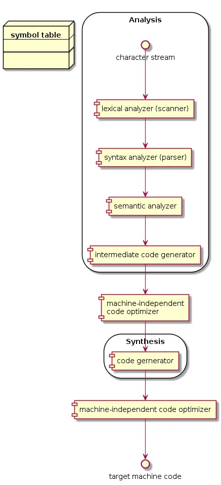
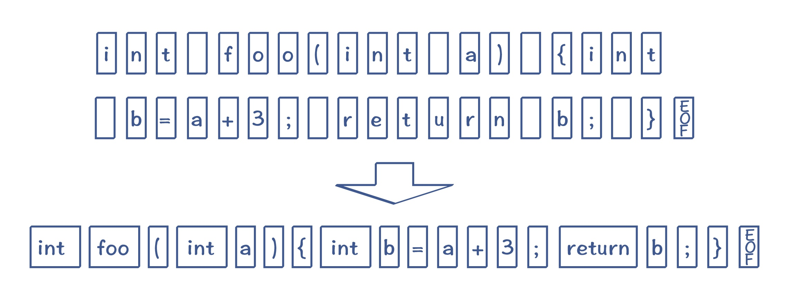
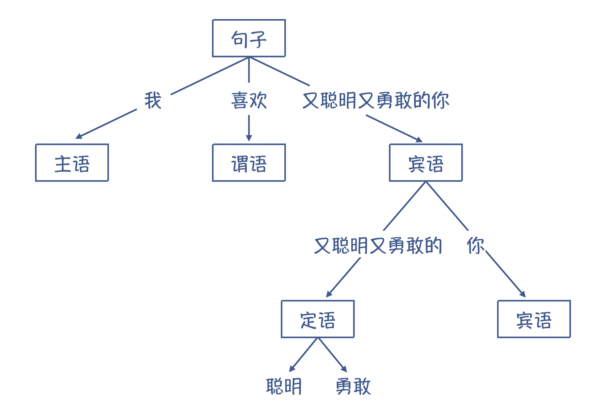
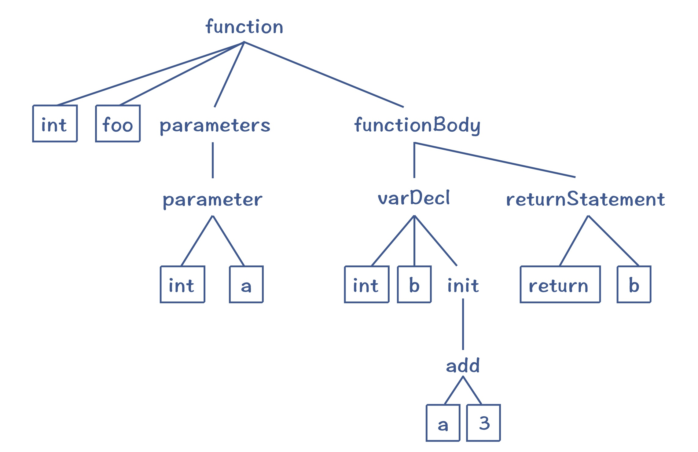
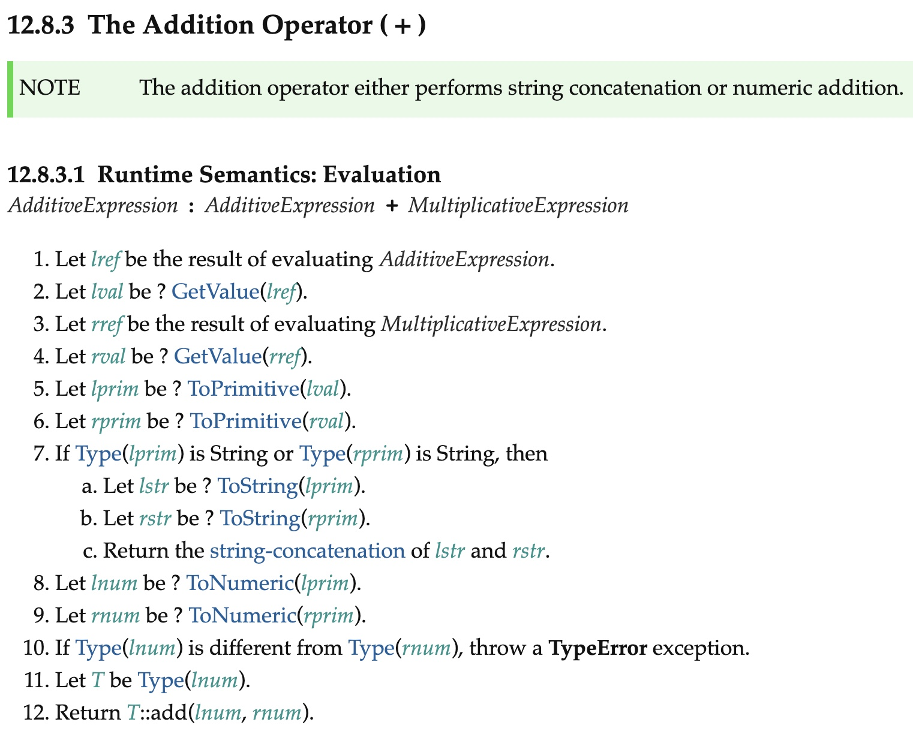
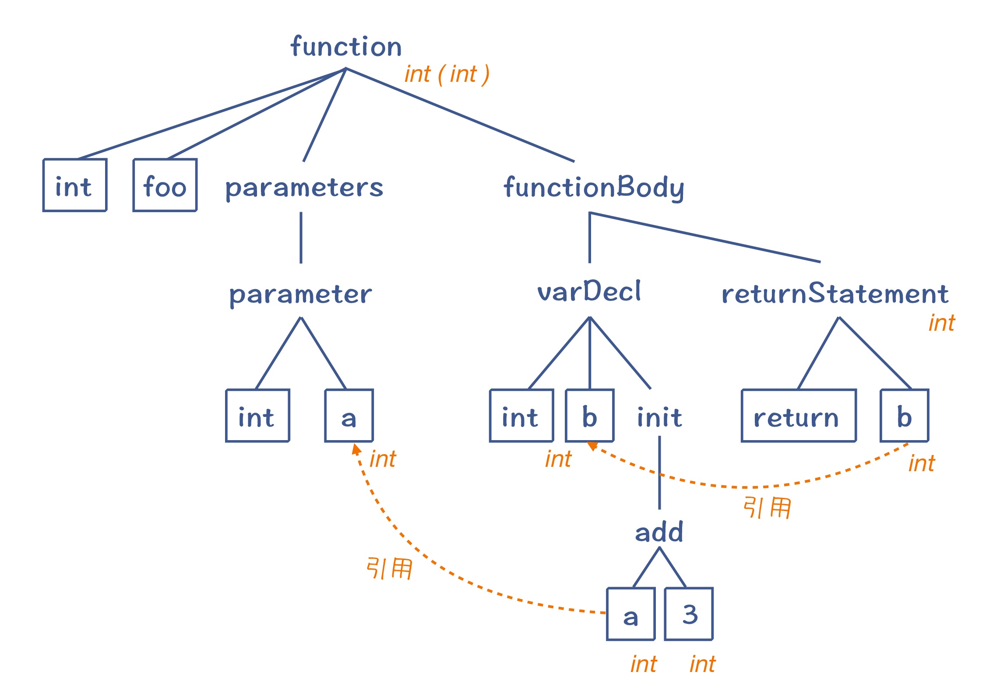
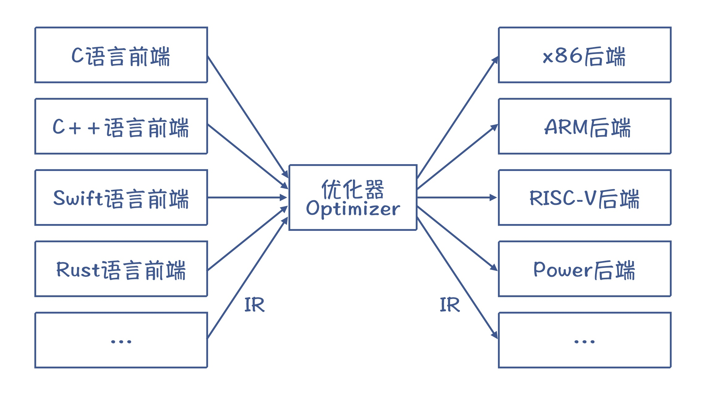
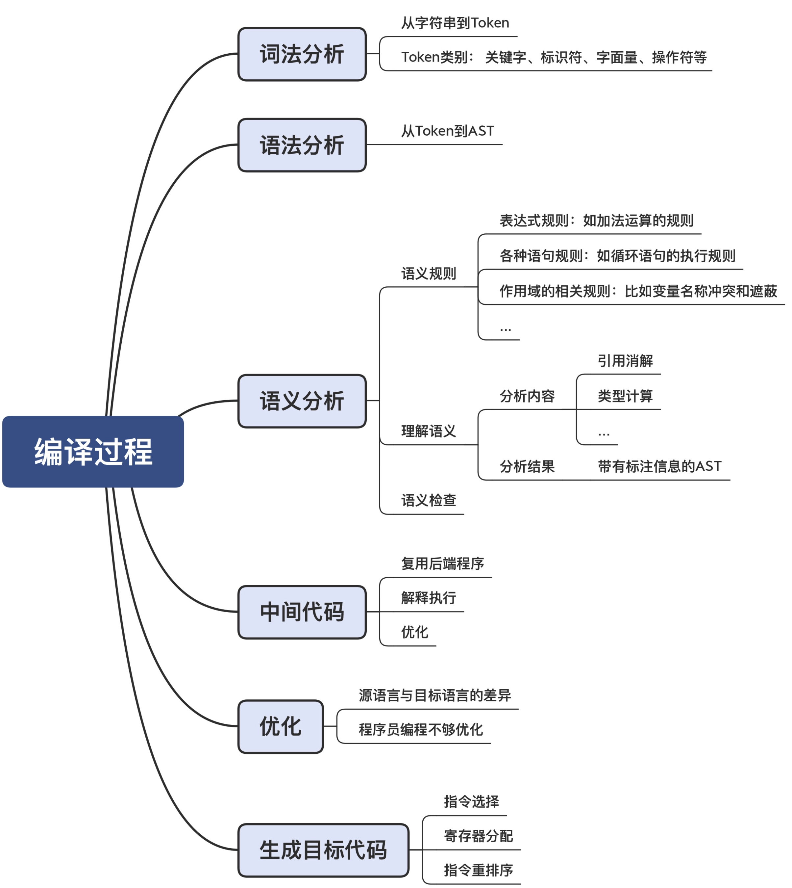

参考资料

> https://sketchk.xyz/posts/what-is-compilation-system-and-compilation-pipeline


# 编译系统组成

编译系统通常由以下四个主要部分组成：

1. 预处理器(Preprocessor)： 预处理器的主要任务是文本替换和文件包含。它处理源代码文件中的预处理指令，比如`#include`、`#define`等。`#include`指令告诉预处理器将指定头文件的内容插入到源代码中的当前位置。预处理器还会处理条件编译指令，如`#ifdef`、`#ifndef`、`#if`、`#else`和`#endif`等。
2. 编译器(Compiler)： 编译器将经过预处理的源代码转换为汇编语言。这个过程包括词法分析、语法分析、语义分析和代码生成等步骤。编译器会优化生成的汇编代码以提高程序的性能。
3. 汇编器(Assembler)： 汇编器将汇编语言转换为机器码，通常是以目标文件（Object File）的形式存在。目标文件包含了程序的机器码，但是还没有解决外部符号的引用。
4. 链接器(Linker)： 链接器的任务是将一个或多个目标文件合并成一个单独的可执行文件。在这个过程中，它会解析和连接外部符号引用，这可能包括库函数或其他模块中的函数和变量。链接器也处理了地址和内存布局的分配。

# 编译器的组成

按照[龙书](https://book.douban.com/subject/1134994//)里的说法，我们可以将编译器里做的事情分为两个阶段：

1. 分析（Analysis）: 又称为 Compiler 的前端处理（front-end），分析与解构原始代码，并将其整理成中间代码（intermediate representation）与符号表（symbol table）并传给下一个阶段，当中如果发现任何问题就会提示报错
2. 生成（Synthesis）：又称为 compiler 的后端处理（back-end），根据符号表与中间代码产出目标代码

为了理解编译器的作用，我举一个很简单的例子。这里有一段 C 语言的程序，我们一起来看看它的编译过程。

```c
int foo(int a){
  int b = a + 3;
  return b;
}
```

其实，编译和把英语翻译成汉语的大逻辑是一样的。前提是你要懂这两门语言，这样你看到一篇英语文章，在脑子里理解以后，就可以把它翻译成汉语。编译器也是一样，你首先需要让编译器理解源代码的意思，然后再把它翻译成另一种语言。

表面上看，好像从英语到汉语，一下子就能翻译过去。但实际上，大脑一瞬间做了很多个步骤的处理，包括识别一个个单词，理解语法结构，然后弄明白它的意思。同样，编译器翻译源代码，也需要经过多个处理步骤。

所以，我们将编译器的两个工作环节进行更细致的划分

- 分析 (analysis):
  - 词法分析器 (lexical analyzer)，也称 scanner，建立 symbol table
  - 语法分析器 (syntax analyzer)，也称 parser
  - 语义分析器 (semantic analyzer)
  - 生成中间码 (intermediate code generator)
  - 中间码最佳化 (code optimizer) (optional & machine-independent)
- 生成 (synthesis):
  - 目标代码生成器 (code generator)
  - 目标代码最佳化 (machine-independent code optimizer) (optional & machine-independent)

流程图如下：



## 词法分析

首先，编译器要读入源代码。

在编译之前，源代码只是一长串字符而已，这显然不利于编译器理解程序的含义。所以，编译的第一步，就是要像读文章一样，先把里面的单词和标点符号识别出来。程序里面的单词叫做 Token，它可以分成关键字、标识符、字面量、操作符号等多个种类。把字符串转换为 Token 的这个过程，就叫做词法分析。



把字符串转换为 Token（注意：其中的空白字符，代表空格、tab、回车和换行符，EOF 是文件结束符）

## 语法分析

识别出 Token 以后，离编译器明白源代码的含义仍然有很长一段距离。下一步，我们需要让编译器像理解自然语言一样，理解它的语法结构。这就是第二步，语法分析。

上语文课的时候，老师都会让你给一个句子划分语法结构。比如说：“我喜欢又聪明又勇敢的你”，它的语法结构可以表示成下面这样的树状结构。



那么在编译器里，语法分析阶段也会把 Token 串，转换成一个体现语法规则的、树状的数据结构，这个数据结构叫做抽象语法树（AST，Abstract Syntax Tree）。我们前面的示例程序转换为 AST 以后，大概是下面这个样子：



这样的一棵 AST 反映了示例程序的语法结构。比如说，我们知道一个函数的定义包括了返回值类型、函数名称、0 到多个参数和函数体等。这棵抽象语法树的顶部就是一个函数节点，它包含了四个子节点，刚好反映了函数的语法。

再进一步，函数体里面还可以包含多个语句，如变量声明语句、返回语句，它们构成了函数体的子节点。然后，每个语句又可以进一步分解，直到叶子节点，就不可再分解了。而叶子节点，就是词法分析阶段生成的 Token（图中带边框的节点）。对这棵 AST 做深度优先的遍历，你就能依次得到原来的 Token。

## 语义分析

生成 AST 以后，程序的语法结构就很清晰了，编译工作往前迈进了一大步。但这棵树到底代表了什么意思，我们目前仍然不能完全确定。

比如说，表达式“a+3”在计算机程序里的完整含义是：“获取变量 a 的值，把它跟字面量 3 的值相加，得到最终结果。”但我们目前只得到了这么一棵树，完全没有上面这么丰富的含义。


这就好比西方的儿童，很小的时候就能够给大人读报纸。因为他们懂得发音规则，能念出单词来（词法分析），也基本理解语法结构（他们不见得懂主谓宾这样的术语，但是凭经验已经知道句子有不同的组成部分），可以读得抑扬顿挫（语法分析），但是他们不懂报纸里说的是什么，也就是不懂语义。这就是编译器解读源代码的下一步工作，语义分析。

### 那么，怎样理解源代码的语义呢

实际上，语言的设计者在定义类似“a+3”中加号这个操作符的时候，是给它规定了一些语义的，就是要把加号两边的数字相加。你在阅读某门语言的标准时，也会看到其中有很多篇幅是在做语义规定。在 ECMAScript（也就是 JavaScript）标准 2020 版中，Semantic 这个词出现了 657 次。下图是其中加法操作的语义规则，它对于如何计算左节点、右节点的值，如何进行类型转换等，都有规定。



所以，我们可以在每个 AST 节点上附加一些语义规则，让它能反映语言设计者的本意。

- add 节点：把两个子节点的值相加，作为自己的值；
- 变量节点（在等号右边的话）：取出变量的值；
- 数字字面量节点：返回这个字面量代表的值。

这样的话，如果你深度遍历 AST，并执行每个节点附带的语义规则，就可以得到 a+3 的值。这意味着，我们正确地理解了这个表达式的含义。运用相同的方法，我们也就能够理解一个句子的含义、一个函数的含义，乃至整段源代码的含义。

这也就是说，AST 加上这些语义规则，就能完整地反映源代码的含义。这个时候，你就可以做很多事情了。比如，你可以深度优先地遍历 AST，并且一边遍历，一边执行语法规则。那么这个遍历过程，就是解释执行代码的过程。你相当于写了一个基于 AST 的解释器。

不过在此之前，编译器还要做点语义分析工作。那么这里的语义分析是要解决什么问题呢？

给你举个例子，如果我把示例程序稍微变换一下，加一个全局变量的声明，这个全局变量也叫 a。那你觉得“a+3”中的变量 a 指的是哪个变量？

```c
int a = 10;       //全局变量
int foo(int a){   //参数里有另一个变量a
  int b = a + 3;  //这里的a指的是哪一个？
  return b;
}
```

我们知道，编译程序要根据 C 语言在作用域方面的语义规则，识别出“a+3”中的 a，所以这里指的其实是函数参数中的 a，而不是全局变量的 a。这样的话，我们在计算“a+3”的时候才能取到正确的值。

而把“a+3”中的 a，跟正确的变量定义关联的过程，就叫做引用消解（Resolve）。这个时候，变量 a 的语义才算是清晰了。

变量有点像自然语言里的代词，比如说，“我喜欢又聪明又勇敢的你”中的“我”和“你”，指的是谁呢？如果这句话前面有两句话，“我是春娇，你是志明”，那这句话的意思就比较清楚了，是“春娇喜欢又聪明又勇敢的志明”。

引用消解需要在上下文中查找某个标识符的定义与引用的关系，所以我们现在可以回答前面的问题了，语义分析的重要特点，就是做上下文相关的分析。

在语义分析阶段，编译器还会识别出数据的类型。比如，在计算“a+3”的时候，我们必须知道 a 和 3 的类型是什么。因为即使同样是加法运算，对于整型和浮点型数据，其计算方法也是不一样的。

语义分析获得的一些信息（引用消解信息、类型信息等），会附加到 AST 上。这样的 AST 叫做带有标注信息的 AST（Annotated AST/Decorated AST），用于更全面地反映源代码的含义。



好了，前面我所说的，都是如何让编译器更好地理解程序的语义。不过在语义分析阶段，编译器还要做很多语义方面的检查工作。

在自然语言里，我们可以很容易写出一个句子，它在语法上是正确的，但语义上是错误的。比如，“小猫喝水”这句话，它在语法和语义上都是对的；而“水喝小猫”这句话，语法是对的，语义上则是不对的。

计算机程序也会存在很多类似的语义错误的情况。比如说，对于“int b = a+3”的这个语句，语义规则要求，等号右边的表达式必须返回一个整型的数据（或者能够自动转换成整型的数据），否则就跟变量 b 的类型不兼容。如果右边的表达式“a+3”的计算结果是浮点型的，就违背了语义规则，就要报错。

总结起来，在语义分析阶段，编译器会做语义理解和语义检查这两方面的工作。词法分析、语法分析和语义分析，统称编译器的前端，它完成的是对源代码的理解工作。

### 做完语义分析以后，接下来编译器要做什么呢

本质上，编译器这时可以直接生成目标代码，因为编译器已经完全理解了程序的含义，并把它表示成了带有语义信息的 AST、符号表等数据结构。

生成目标代码的工作，叫做后端工作。做这项工作有一个前提，就是编译器需要懂得目标语言，也就是懂得目标语言的词法、语法和语义，这样才能保证翻译的准确性。这是显而易见的，只懂英语，不懂汉语，是不可能做英译汉的。通常来说，目标代码指的是汇编代码，它是汇编器（Assembler）所能理解的语言，跟机器码有直接的对应关系。汇编器能够将汇编代码转换成机器码。

熟练掌握汇编代码对于初学者来说会有一定的难度。但更麻烦的是，对于不同架构的 CPU，还需要生成不同的汇编代码，这使得我们的工作量更大。所以，我们通常要在这个时候增加一个环节：先翻译成中间代码（Intermediate Representation，IR）。

## 中间代码

中间代码（IR），是处于源代码和目标代码之间的一种表示形式。

我们倾向于使用 IR 有两个原因。

第一个原因，是很多解释型的语言，可以直接执行 IR，比如 Python 和 Java。这样的话，编译器生成 IR 以后就完成任务了，没有必要生成最终的汇编代码。

第二个原因更加重要。我们生成代码的时候，需要做大量的优化工作。而很多优化工作没有必要基于汇编代码来做，而是可以基于 IR，用统一的算法来完成。

## 优化

那为什么需要做优化工作呢？这里又有两大类的原因。

第一个原因，是源语言和目标语言有差异。源语言的设计目的是方便人类表达和理解，而目标语言是为了让机器理解。在源语言里很复杂的一件事情，到了目标语言里，有可能很简单地就表达出来了。

比如“I want to hold your hand and with you I will grow old.” 这句话挺长的吧？用了 13 个单词，但它实际上是诗经里的“执子之手，与子偕老”对应的英文。这样看来，还是中国文言文承载信息的效率更高。

同样的情况在编程语言里也有。以 Java 为例，我们经常为某个类定义属性，然后再定义获取或修改这些属性的方法：

```java
Class Person{
  private String name;
  public String getName(){
    return name;
  }
  public void setName(String newName){
    this.name = newName
  }
}
```

如果你在程序里用“person.getName()”来获取 Person 的 name 字段，会是一个开销很大的操作，因为它涉及函数调用。在汇编代码里，实现一次函数调用会做下面这一大堆事情：

```shell
#调用者的代码
保存寄存器1   #保存现有寄存器的值到内存
保存寄存器2
...
保存寄存器n

把返回地址入栈
把person对象的地址写入寄存器，作为参数
跳转到getName函数的入口

#_getName 程序
在person对象的地址基础上，添加一个偏移量，得到name字段的地址
从该地址获取值，放到一个用于保存返回值的寄存器
跳转到返回地
```

你看了这段伪代码，就会发现，简单的一个 getName() 方法，开销真的很大。保存和恢复寄存器的值、保存和读取返回地址，等等，这些操作会涉及好几次读写内存的操作，要花费大量的时钟周期。但这个逻辑其实是可以简化的。

怎样简化呢？就是跳过方法的调用。我们直接根据对象的地址计算出 name 属性的地址，然后直接从内存取值就行。这样优化之后，性能会提高好多倍。

这种优化方法就叫做内联（inlining），也就是把原来程序中的函数调用去掉，把函数内的逻辑直接嵌入函数调用者的代码中。在 Java 语言里，这种属性读写的代码非常多。所以，Java 的 JIT 编译器（把字节码编译成本地代码）很重要的工作就是实现内联优化，这会让整体系统的性能提高很大的一个百分比！

总结起来，我们在把源代码翻译成目标代码的过程中，没有必要“直译”，而是可以“意译”。这样我们完成相同的工作，对资源的消耗会更少。

第二个需要优化工作的原因，是程序员写的代码不是最优的，而编译器会帮你做纠正。比如下面这段代码中的 bar() 函数，里面就有多个地方可以优化。甚至，整个对 bar() 函数的调用，也可以省略，因为 bar() 的值一定是 101。这些优化工作都可以在编译期间完成。

```c
int bar(){
    int a = 10*10;  //这里在编译时可以直接计算出100这个值，这叫做“常数折叠”
    int b = 20;     //这个变量没有用到，可以在代码中删除，这叫做“死代码删除”


    if (a>0){       //因为a一定大于0，所以判断条件和else语句都可以去掉
        return a+1; //这里可以在编译器就计算出是101
    }
    else{
        return a-1;
    }
}
int a = bar();      //这里可以直接换成 a=101
```

综上所述，在生成目标代码之前，需要做的优化工作可以有很多，这通常也是编译器在运行时，花费时间最长的一个部分。



而采用中间代码来编写优化算法的好处，是可以把大部分的优化算法，写成与具体 CPU 架构无关的形式，从而大大降低编译器适配不同 CPU 的工作量。并且，如果采用像 LLVM 这样的工具，我们还可以让多种语言的前端生成相同的中间代码，这样就可以复用中端和后端的程序了。

## 生成目标代码

编译器最后一个阶段的工作，是生成高效率的目标代码，也就是汇编代码。这个阶段，编译器也有几个重要的工作。

第一，是要选择合适的指令，生成性能最高的代码。

第二，是要优化寄存器的分配，让频繁访问的变量（比如循环变量）放到寄存器里，因为访问寄存器要比访问内存快 100 倍左右。

第三，是在不改变运行结果的情况下，对指令做重新排序，从而充分运用 CPU 内部的多个功能部件的并行计算能力。

目标代码生成以后，整个编译过程就完成了。

# 编译器流程总结

