# 第一部分 诞生

## 从电灯泡到半导体

### 真空管的发现

1879年12月，爱迪生，新泽西州，在官员和新闻记者的见证下打开了 290 盏白炽灯；

遗留问题：灯泡使用一段时间后，内表面变黑，导致灯光暗淡； 本质是碳纤维灯丝释放的碳微粒。

尝试解决：**爱迪生**，在灯泡中加入铜片，在铜片上施加电压，发现铜片上有单向电流流动（真空二级管的原型）。这是1882年，后来这一现象被称为“爱迪生效应”。

19世纪80年代，爱迪生的伦敦分公司的 **约翰.弗莱明**，在铜片上施加了交流电，也观察到单向导电性，但无法解释；1897年，剑桥大学，**约瑟夫.约翰.汤姆逊**，在玻璃管的两端分别装上电极，通电后一些带电微粒从阴极电极飞向了另一端的阳极。就这样，汤姆逊第一次劈开了阴极金属中的原子，剥离出带负电荷的电子，**人类首次发现了电子，为真空管的发明打开了大门。**

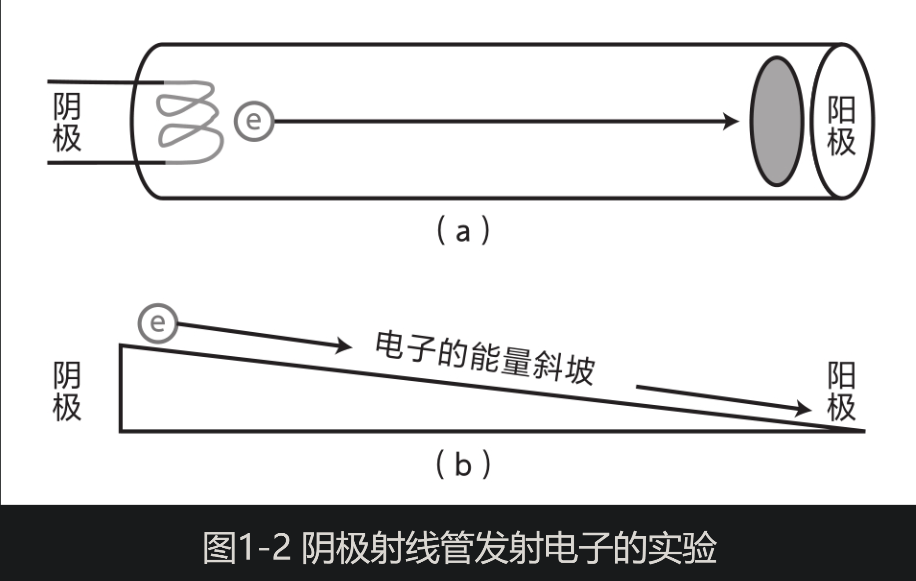

汤姆逊的这一发现，使弗莱明恍然大悟：原来灯丝通电受热后，灯丝原子中的电子逃逸出去，飞向了铜片，从而产生了单向电流！正如河水总是从高处流向低处，电子也是从能量高的地方沿着“能量斜坡”流向能量低的地方。只是电子的流动或飞行不需要河床或者导体，它在真空中就能完成这一过程。

无线电先驱 **伽利尔摩.马可尼**，需要研发跨越大西洋的无线电通信，需要将接收到的信号进行整流。在接收到这种上下快速舞动的无线电波后，要先去掉负半部分，只保留正半部分，这叫作整流，之后才能将信号中的信息提取出来。

1904年，在该公司入职的 **约翰.弗莱明**，从20多年前的“爱迪生效应”以及它那奇特的单向电流中获得灵感，设计了圆形玻璃罩的真空器件，以灯丝为阴极，以铜为阳极，叫做**真空二极管**。

1906年，**德福雷斯特**对真空二极管的结构做了适当的改造。他在灯丝和金属片之间插入了一根形如木栅栏的铜丝（称为栅极）。当他给铜丝栅极施加负电压时，阴极和阳极之间的电流减少了；反之，当他在铜丝栅极上施加一个正电压时，电流就增加了。接着，他在铜丝栅极上施加了一个微小的交替变化的电压，结果竟在阴极和阳极之间得到了一个变化幅度更大的交变电流：信号放大了！

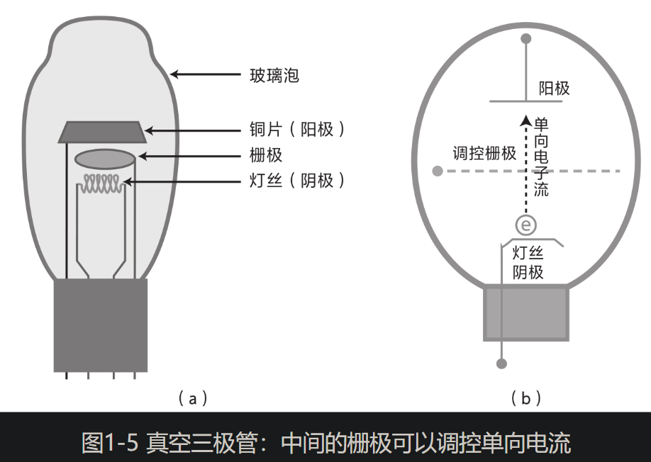

靠着误打误撞插入一根铜丝做的栅极，德福雷斯特使真空管放大了信号，于是真空二极管变成了**真空三极管**，这个发明带来的荣誉伴随了他一生。不过德福雷斯特不擅长理论知识，他无法解释为什么信号会放大。

1912年，美国电话电报公司出价5万美元买下了真空三极管的专利，应用于长途电话系统。德福雷斯特不知道，他的这一小小改动即将引发一场巨大的变革。

1914年，美国电话电报公司定下了在该年世博会上，打通从东海岸的纽约到西海岸的旧金山的长途电话的目标。需要在中继站上将信号放大，真空二极管只能分拣信号，无法放大信号。1915年，在世博会延期一年后，公司利用真空三极管实现了目标。

1946年，美国宾夕法尼亚大学用真空管研制出第一台电子数字积分式计算机（简称ENIAC），它使用了 17468 多个真空管，占地 170 多平方米，每秒能做 5000 次计算。**这里的真空管不是用来放大信号，而是作为一个开关**。如果在铜丝栅极上施加一个很大的负电压，就能使电流中断。只需把开通和中断当作 0 和 1 两种状态，那么它就能表示二进制，从而帮助一台电子计算机进行计算。

这时真空管的应用可谓如日中天，从收音机、电视机、无线电报、音响再到电子计算机，都离不开真空管的身影，一代又一代的工程师仍在不断地提升其性能。

在美国电话电报公司下属的贝尔实验室，一位名叫默文·**凯利**(Mervin Kelly)的工程师负责十几种真空管的开发与生产，并积累了丰富的经验。但随着时间的推移，他越来越觉得真空管技术逼近了极限。

首先，真空管发热严重，导致故障频发。其次，真空管个头不小，无法继续“缩身”。人们急需一种新的电子开关：可靠、小巧和快速，而这需要科学家在基础物理上取得进一步的突破。

### 量子物理学萌芽

**爱迪生**发明灯泡，遗留问题：白炽灯的发光效率低下，致使大量电能变成热量白白地消耗掉了。热量来自白炽灯发出的看不见的红外光，它占据了电灯泡发出的光的大部分，只有很小一部分能量转化为用于照明的可见光。

爱迪生电灯公司在想方设法提高电灯的发光效率，德国最大的灯泡公司西门子也迫切希望解决这一问题。

工业界的急迫需求传到了学术界，引起了科学家的关注。事实上，普朗克十分了解西门子公司的需求。他知道，电灯发出的光是一种电磁波辐射，当白炽灯丝升高到 2000 K 以上时就开始向外辐射电磁波，到 3000 K 时发出黄光，到 6000 K 时发出明亮的白光。温度越高，可见光的比例越大，效率越高。为了彻底解决这一问题，普朗克开始研究背后的辐射机制。

但经过 6 年的探索之后，普朗克仍然一无所获。他像一头笼中困兽，写下了这样的断言：“我非常清楚，经典物理学是不能为这一难题提供答案的。”这一年普朗克已经42岁了，而他一生中最重要的发现尚未眷顾他。

不得已，**普朗克于1900年的秋天采取了一次“绝望的行动”。**在推导数学公式时，他不再将辐射当作连续的，而是分成一份一份的“量子”。这样一来，理论公式奇迹般地与实验相符了。**普朗克虽然没有解决电灯泡的发光效率的问题，但无意中带来了量子物理学的萌芽。**

普朗克内心是多么希望经典物理学能延续下去，而他却在无意中为埋葬经典物理学铲起了第一锹土。为此，他陷入了深深的痛苦之中。

1929年，在全球经济大萧条开始之前，量子物理学的“大厦”基本竣工。而在全球经济大萧条开始之后，量子物理学将揭开半导体内部导电的秘密。

### 半导体的导电机制

1931年初，莱比锡大学的理论物理研究所来了一位25岁的英国小伙**艾伦·赫里斯·威尔逊(Alan Herries Wilson)**，他跟随海森堡学习固体物理学，研究半导体的性质。

半导体最大的特性就是它的导电能力，远远小于导体（如铜线），又远远大于绝缘体（如橡胶）。这种特殊的性质引起了科学家的好奇。此外，很多半导体都是晶体，内部有着规则的原子点阵。但麻烦的是，原子的间距很小，无法直接用显微镜观察到晶体内部的原子点阵结构。

在威尔逊到来之前，这里的一位博士生**布洛赫(Bloch)**正在对晶体展开研究。得益于德国物理学家马克斯·劳厄(Max Laue)和英国物理学家布拉格父子发明的用 X 射线衍射研究晶体的方法，布洛赫间接窥视到晶体里漂亮规整的结构，并将其带入薛定谔方程，从而初步揭开了半导体晶体的性质。

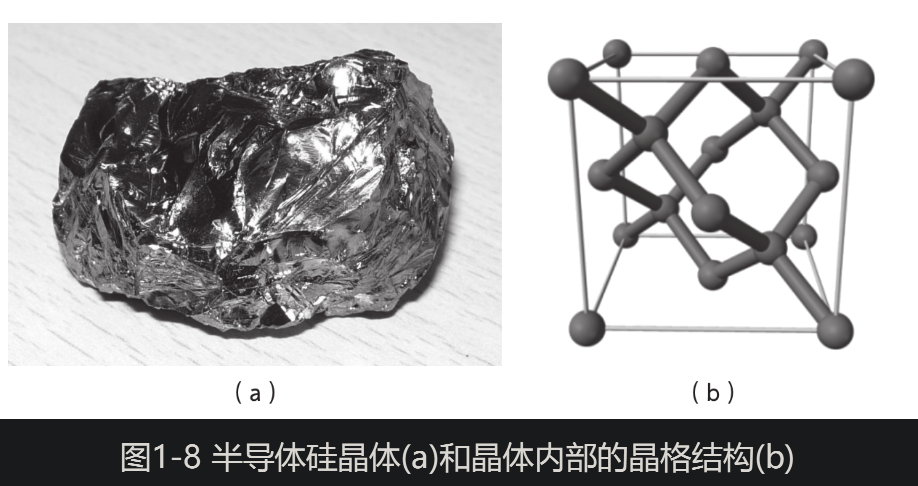

那么，半导体内部是如何导电的呢？以前人们尝试用经典物理学来解释，但都失败了。**进入20世纪30年代初，威尔逊等人以量子物理学为工具，对半导体的导电机制展开了一番新的研究。**

一般人可能会认为，电子越多，越容易导电，电流也越大。但真的如此吗？威尔逊心里打了个问号。如果把半导体中的电流比作公路上的车流，车少时车流量很小，那么车越多，车流量就越大吗？恰恰相反，车流量会因为车多拥堵而下降到零。

威尔逊发现，半导体里的电子都堵在了一条叫作“价带”的路上，无法自由移动并形成电流。他领悟到了关键的结论：并不是电子越多就越容易导电，而是要有足够多的空位，才便于电子移动和导电。

只有一种情况能让半导体导电，那就是让堵在价带中的电子跃迁上叫作“导带”的高架桥，因为那里畅通无阻。可是，这比让平底锅里的爆米花蹦到10层楼高还要困难。

不过，在量子物理学起作用的微观世界里，这却是可能的。电子的不确定性又一次发挥了作用。尽管电子跃迁上导带的概率非常低，但仍有可能性，而且电子的总体数目非常庞大，总是有一些电子可以成功跃迁上“导带”这座高架桥，从而使半导体内产生电流！（另一方面，“价带”上一部分电子跃迁走后，也有了空位，所以“价带”的电子(确切说是空位)也因此可以移动起来从而形成电流。）

海森堡听了威尔逊的理论后兴奋不已，马上叫来布洛赫一起讨论。但布洛赫却连连摇头，说“大错特错”。但经过一个多星期的思考，布洛赫还是理解并接受了威尔逊的理论。

有了威尔逊提出的“能带理论”，人们就能理解为什么半导体最适合做开关。因为绝缘体的“高架桥”太高了，使得电子跃上去的概率大大减小，所以无法导电；而金属里的“高架桥”又太低，电子很容易就能跃迁上去，轻松导电，但无法让电子停下来，所以很难阻断；**只有半导体的“高架桥”不高不低，当外部电压发生变化，半导体内部轻盈的电荷就会跟着发生变化，电荷瞬间重新分布，半导体就能迅速地切换到关断状态（变成绝缘体）或者开通状态（变成导体）**，如图1-9所示。

**跟其他开关比起来，半导体的开关速度极快。如果用手按下墙上的开关，每秒最多按 3～4 次。而继电器每秒可以切换100 次，真空管可以达到每秒数百万次，半导体器件更是可以达到每秒数千亿次。因此，半导体适合做高速开关，实现芯片中的 0 和 1 的逻辑运算。**

1933年，德国纳粹上台。在德国国会纵火案之后，爱因斯坦等一众科学家不得不“跃迁”到大西洋彼岸。这种单向的人才流动给美国这个新兴国家带来了宝贵的智力资源，也使欧洲的半导体研究此后长时间停滞不前。

在20世纪20年代，美国物理学家约翰·斯莱特(John Slater)访问欧洲的剑桥大学和哥本哈根，跟玻尔、海森堡和泡利等人一起工作。之后，**斯莱特**回到美国的麻省理工学院，这也意味着他将量子物理学的研究火种带到了美国。斯莱特于1932年在麻省理工学院招到了一位年轻的博士生威廉·肖克利(William Shockley)。

接下来，半导体研究会朝哪个方向发展？**肖克利**又会将半导体的研究带往何方？

### 本章要点

要想发明芯片和晶体管，先要有半导体技术；要想有半导体技术，先要有量子物理学。基础学科是技术突破的深厚土壤。

要想了解量子物理学，先要从一只电灯泡开始讲起。

1882年，爱迪生观察到灯泡内壁被熏黑，从而偶然发现了真空灯泡中存在着单向电流。直到1897年，汤姆逊发现了原子中的粒子“电子”后，人们才理解了这种真空中的单向电流。在此基础上，1904年，弗莱明利用真空灯泡中的单向电流效应发明了真空二极管。1906年，德福雷斯特在二极管的阴极和阳极之间插入了栅极，发明了真空三极管，它既能放大信号，又能做开关，在收音机、长途电话乃至电子计算机上得到了广泛应用。

但是真空管具有速度慢、发热严重、故障率高、体积大等弊端，无法适应信息时代的要求，而解决这些难题需要一种全新的物质——半导体。

**对半导体导电特性的理解离不开对微观粒子基本规律的认识，尤其是对原子中电子的特性的认识，而经典物理学无法解释一些现象，其中包括困扰爱迪生的灯泡发光效率低下的问题。由此，普朗克研究了背后的黑体辐射问题，并于1900年提出将辐射能量当作一份一份的“量子”，从而催生了量子物理学。**

此后，爱因斯坦、玻尔等进一步丰富了量子概念，直到海森堡提出了“不确定性原理”和薛定谔提出了“波动方程”，人们才对原子和电子有了深入的认识。**在此基础上，威尔逊于1931年提出了“能带理论”，解释了半导体中电子的不确定性，以及由此产生的电流，从而为半导体二极管和晶体管的发明奠定了基础。**

## 晶体管诞生

### 雷达在警戒，半导体研究加速

第二次世界大战一打响，英国东部的海岸线就装配了雷达站，形成了一条防御链，侦测来犯的德国轰炸机。

跟马可尼的无线电报接收器一样，雷达接收器上也需要有一个单向整流器件。但是雷达波的频率比无线电报的频率高很多，而真空二极管受到电子从阴极到阳极所耗费的时间的限制，频率无法继续提高，分辨率低下。那时，从法国西海岸起飞的德军飞机不到半个小时就能飞到英国上空，留给英国人的时间已经所剩无几。于是，英国研究者迅速将目光转到了高频性能更好的半导体上，并尝试攻破半导体整流器的难点。

说到半导体整流，**早在1874年，德国物理学家布劳恩就发现了一种方铅矿石半导体能整流。如果用细金属丝触碰矿石表面，偶尔还会在某个点上得到单向电流，这被称为“猫须”整流器。**但这样成功的概率很低，稳定性很差，要反复尝试。至于方铅矿石为什么会有整流效果，布劳恩还无法做出解释。

1939年，英国布里斯托尔大学的物理学家内维尔·弗朗西斯·莫特(Nevill Francis Mott)想通了“猫须”整流中产生单向电流的原理（见图2-1）。**正如弗莱明的真空管中的能量斜坡使得电子只能单向流动，在金属和半导体界面上也存在着一个能量斜坡。**

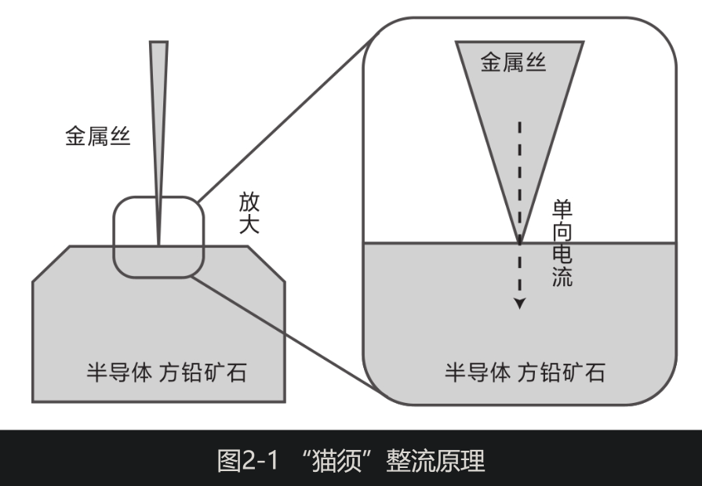

**莫特用量子物理学完整地解释了半导体和金属界面上的单向整流效应**（同一年，德国的沃尔特·肖特基(Walter Schottky)以及苏联的鲍里斯·达维多夫(Boris Davydov)也各自得出了类似的结论，这种金属-半导体二极管被称作肖特基二极管。后来莫特招收了一位中国留学生 **黄昆**，后者于1956年在北京大学建立了中国第一个半导体物理专业）。这样一来，人们就不用盲目地用金属丝在矿石表面上碰运气了，而是能在理论指导下做出金属-半导体点接触整流器，不仅工作频率高，而且更稳定。

之后，英国人又尝试了用硅做整流器，发现稳定性很好，便马上将其运用到了雷达上。美中不足的是，当时硅的提纯技术较差，导致硅晶体中有较多杂质，整流效果差强人意。

为了尽快取得军事技术的突破，英国首相丘吉尔批准了一支科学家代表团于1940年9月秘密访问美国，并向美国寻求技术支持。贝尔实验室也积极地参与了进来，研究部主管凯利加强了实验室在雷达中的磁控管和硅半导体整流器方面的研究。

**凯利**1917年就加入了贝尔实验室，在真空管研究方面有着丰富的经验。但凯利已预感到，真空管技术即将走到尽头，未来将属于半导体固态器件。

**1936年，经历了大萧条之后的经济重新复苏，贝尔实验室开始重新招纳应届毕业生，凯利也在这一年被任命为研究部主管。**同年3月，他来到了位于波士顿的麻省理工学院，看中了一位脸型方正的年轻博士威廉·肖克利，肖克利曾跟随从欧洲访学回来的斯莱特研究固体物理学。

凯利十分看重肖克利的固体物理学背景，因为这是贝尔实验室无法培养的。于是，他代表贝尔实验室向肖克利抛出了橄榄枝，并强调还有机会跟物理学大师戴维森一起工作。果然，这一点让肖克利心动了。

不久，肖克利在实验室内部成立了一个学习小组，并邀请了沃尔特·布拉顿(Walter Brattain)、詹姆斯·费斯克(James Fisk)、查尔斯·汤斯(Charles Townes)等人参加（詹姆斯·费斯克后来成了贝尔实验室的总裁，而查尔斯·汤斯后来因发明激光而获得诺贝尔物理学奖）。每周四下班后，学习小组的活动便开始了。他们一边享用餐厅提供的茶水和点心，一边轮流讲解自己的学习心得，大家对固体物理，尤其是晶体内部的电子运动很感兴趣。活动结束后，一行人就会去布拉顿的公寓里喝点小酒。

**布拉顿** 是个精干的高个子，头发总是整齐地梳在脑后，眼睛里闪烁着亮光。他出生于中国厦门，幼年跟随父母回到美国，1929年获得明尼苏达州立大学的物理学博士学位。在参加贝尔实验室的面试时，主管说自己需要一位不怕与其辩论的伙伴。布拉顿回答说：“请放心，必要时我一定会顶嘴的。”

**1939年的一天，肖克利来找布拉顿，想请这位实验物理学家设计一个实验来验证自己的一个想法。原来，肖克利读到了莫特和肖特基等人当年发表的关于金属和半导体界面上的单向电流的文章，他立刻想到了德福雷斯特在30年前的一个实验——仅仅在真空管中的单向电流通道中间插入了一个栅极，就实现了信号的放大和控制。**

肖克利觉得可以如法炮制，在氧化铜半导体和铜金属界面上增加一个栅极（见图2-2），就像调节水库闸门一样去调节电流，这样就能达到放大信号的效果。那时，他就可以大呼一声“尤里卡”（希腊语，意为“我发现了”）！

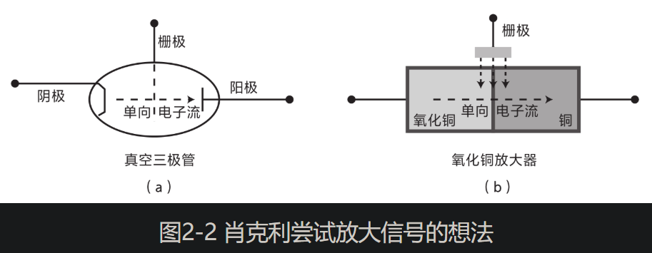

注：在真空三极管的阴极和阳极之间增加一个栅极，用栅极调控真空三极管的单向电流(a)；在氧化铜半导体和铜金属界面上增加一个栅极，用栅极调控氧化铜的单向电流(b)

**1939年12月29日，肖克利在一张纸上写下了一句话：“我今天忽然想到，使用半导体材料而不是真空管来制造放大器，原则上是可行的。” 然后，他把这张纸贴在了实验室记录本上。后来肖克利将这一天视为通向晶体管之路的第一个里程碑。**

听完肖克利的打算后，布拉顿笑了，他说自己也读过莫特的文章，但他认为肖克利的想法不会成功。因为氧化铜和铜的交界面只有一微米宽，没有多余的空间去放置第三个电极。

不过，布拉顿还是答应尝试一下，他想了各种方法做实验，但“尤里卡”时刻一直没有到来。

这时，英国人用硅做出了效果不错的整流器，于是贝尔实验室也马不停蹄地转向硅的研究。

1940年3月6日，布拉顿正在做实验，突然接到凯利的电话，让他立刻赶到另一间实验室。一位名叫拉塞尔·奥尔(Russel Ohl)的研究人员在做实验时有了惊人的发现，他是一名冶金专家。

奥尔用手电筒对准桌上的一根黑色的硅棒并按动了开关，手电筒照亮硅棒的一瞬间，电压计的指针突然发生了偏转！布拉顿瞬时惊呆了，简直不敢相信自己的眼睛。不管奥尔如何改变光照角度，硅棒都只在一个方向上有电流。

**单向电流又现身了！曾经，它出现在爱迪生的灯泡里、弗莱明的真空管中，还出现在布劳恩的“猫须”整流器里，以及布拉顿和肖克利研究的氧化铜上。后者属于金属和半导体界面，但在奥尔的硅棒里并没有金属，只有半导体。这是一个新发现：人们首次在半导体的内部，而不是界面上发现了单向整流现象。**

不过，布拉顿觉得这很反常，因为纯净的硅是电中性的，并不存在能量斜坡。可是，半导体里的单向电流来自哪里呢？

在凯利和奥尔的注视下，布拉顿陷入了沉思。接着，他问奥尔，这些硅原料是从哪里来的？奥尔说是从一家冶金公司订购的，纯度为99.8%。看来是因为这批硅的纯度不够，布拉顿猜测，这根硅棒里的反常现象一定与杂质有关。

布拉顿又问奥尔，这些硅棒是怎么做出来的？奥尔说是将其放入炉中融化，冷却后切下一小段，也就是现在手头的这根硅棒。

**布拉顿推断，一定是杂质中混有一些正电荷，使得一侧的能量升高；另外一些杂质混有负电荷，使得另一侧能量降低，从而形成了能量斜坡。**

果然，这个想法后来得到了两位冶金专家的证实。由于硅加热融化，两种杂质因为密度不同而自然地分开了，重的下沉，轻的上浮，各自占据了硅棒的两端。带正电荷的这一端叫作P(Positive)型硅，带负电荷的另一端叫作N(Negative)型硅。

**而奥尔手头的这根硅棒恰好位于P型硅和N型硅的分界线上，由此形成了所谓的PN结(PN junction)，产生了一个天然的从正电荷到负电荷的能量斜坡，迫使电流单向流动**（见图2-3）。

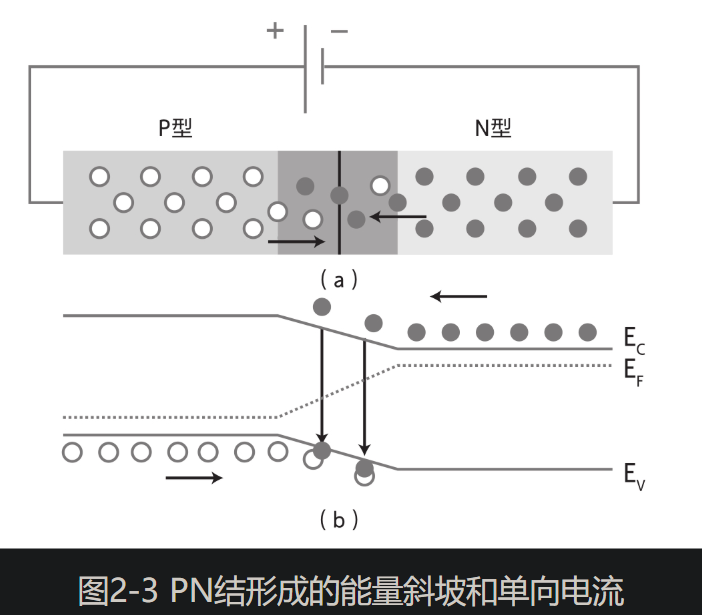

**这真是需要非常好的运气，才能得到这样一根天然的带有两种杂质的硅，而且恰好一种杂质带正电荷，另一种杂质带负电荷，才有可能形成PN结。就是这样一次机缘巧合，贝尔实验室发现了通往半导体放大器之路上最关键的PN结。**

那么，为什么只有光照时才产生电流呢？布拉顿猜测，可能是能量斜坡被一个闸门阻挡住了，而光照的能量足以触发并打开闸门，从而让电子越过斜坡，形成单向电流。实际上除了光照之外，用电压也能控制闸门。

接下来，一切就顺理成章了。就像德福雷斯特那样，在硅棒的PN结处插入一个电极，用电压控制单向电流的闸门，这样就可能实现信号的放大或闸门的开关。

然而，一个突发事件打断了他们的计划。

1941年12月7日，日本偷袭美国珍珠港，美国正式对日、德宣战，整个国家都陷入了战争状态，贝尔实验室每个人的研究计划也随之被打乱了。紧急的军事研究课题纷至沓来，基础研究被迫暂停，包括半导体放大器的研究。肖克利被派去了美国海军部的一个研究所。

当时，英国雷达中的整流二极管接收高反向电压时经常损坏。贝尔实验室与普渡大学的卡尔·拉克-霍罗威茨(Karl Lark-Horowitz)教授研究小组建立了合作关系。**教授的博士生西摩·本泽(Seymour Benzer)发现，只要在锗中掺杂适量的锡，就能经受100伏特以上电压，从而做出耐高压的锗整流器。**

虽然第二次世界大战将肖克利的半导体放大器的研究打断了，但研究小组转向了硅和锗的研究，发现了PN结和耐高压的锗。等到战争停火，这些关键技术就可用于新的发明。

### 协作的产物，巴丁和布拉顿发明点接触晶体管

1945年，第二次世界大战终于落下帷幕。这年秋天，贝尔实验室的科学家结束了在军事研究所的工作，回到了各自的研究岗位。

**被战争中断的半导体固态放大器的研究也重新被凯利提上日程。经历了第二次世界大战，凯利更加深刻地认识到了半导体的重要作用。于是，他重新组建了固体物理研究小组，并任命肖克利为组长。**

凯利计划打造一支跨学科的团队来攻关半导体研究，其中既有物理学家、化学家，又有材料学家、电子工程师，从而将理论研究与工程实践紧密地结合起来。**凯利在贝尔实验室工作了28年，他清楚地知道，贝尔实验室做的既不是大学里的基础研究，也不是公司里的产品开发，而是两者的结合。**

小组还缺少一位理论物理学家，肖克利便向凯利推荐了**约翰·巴丁(John Barteen)**。肖克利在读博期间去普林斯顿大学交流时，认识了当时在攻读量子物理学博士学位的巴丁。

肖克利指引着小组的研究方向，他又想起了第二次世界大战前用氧化铜实现放大器的主意，现在他想把这个思路运用到硅上，看看能否让它“起死回生”。**简单来说，就是在一片硅内部创造一个能量斜坡和单向电流，然后在硅上方施加一个电压，用它产生的电场来调控硅中的单向电流，从而实现放大，这叫作“场效放大”**（见图2-4）。

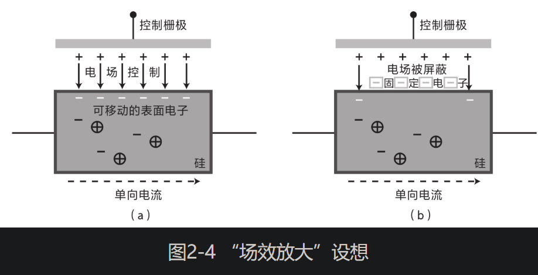

注：肖克利设想用电场调制硅里的单向电流实现放大(a)；巴丁认为固定电子屏蔽了电场(b)。

原理虽然不复杂，但是肖克利试验了许多次，无法实现放大，电场的调控作用似乎被硅表面的一种看不见的东西给屏蔽了。肖克利一时还弄不清硅的表面发生了什么。1945年10月22日，他把这个难题交给了刚刚入职一个星期的“理论大脑”巴丁。

巴丁思考后认为，可能是硅表面的自由电子被固定在原处而动弹不得，从而屏蔽了从上方流动来的电场，这有点像电梯金属外壳上的电荷屏蔽了手机信号。接下来的一年多时间里，布拉顿用光照实验证明了巴丁的猜想。

看来，只有搬走硅表面这恼人的固定电子，才能实现放大。不过，巴丁和布拉顿尝试了一年，一无所获。

**肖克利的场效的思路行不通，巴丁和布拉顿在两年后又回到了思考的起点。**

时间来到了1947年秋天。巴丁想起了小时候喜欢玩的自制收音机，别的孩子都用真空管，而他偏偏用“猫须”半导体整流器。只需用一根铜丝反复触碰炭黑色的方铅矿石，如果刚好在金属和半导体矿石的界面上产生单向电流，耳机里就能传来电台的声音。用这种方法，他甚至捕捉到了芝加哥的电台。用一根铜丝触碰方铅矿石，这个方法一定给少年巴丁留下了深刻的印象，**以至于39岁的巴丁在贝尔实验室想到了一个类似的点子：用一根钨丝触碰硅片。**

不过，钨丝和硅片上只有两个电极，而为了放大信号，还需要一个额外的电极来调控从钨丝到硅片的单向电流。此时，巴丁突然冒出了一个想法：用水滴作为第三个电极（见图2-5）。

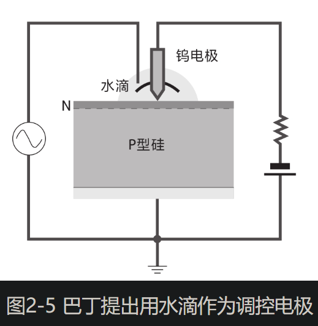

将水滴当作电极？巴丁的脑子该不会是“进水”了吧？谁都知道水会造成短路。不过，巴丁自有道理。他想起几天前布拉顿的硅片不小心被低温箱里的水汽给沾湿了，却意外地得到了放大效果。小组里的化学家R.吉布尼(R. Gibney)提出了一个解释：水分子激活并释放了硅表面被束缚的电子，从而带走了放大信号的障碍——固定电子。这个说法令大家信服。

布拉顿立刻用钨丝尖端包裹着蜡刺在硅片上，并在接触点处滴上一滴水，电流信号果然放大了！布拉顿真心佩服巴丁的艺高人胆大，他逢人就说：“今天（11月21日）我参与了自己一生中最重要的实验。”晚上，他俩打电话把这个好消息告诉了肖克利。

只是，放大倍数还有点小，只有10%。12月8日午餐时，肖克利建议再反向施加一个高电压来提高放大倍数。巴丁则想起了普渡大学的本泽早先发现掺了锡的锗晶更耐高压，他提议用锗片来代替硅片。当天下午，布拉顿搜寻到了一片耐高压锗片，他将电压放大了2倍，而功率竟然放大了330倍。**这一从硅到锗的转变非常及时，否则晶体管不会这么快问世**。

现在，他们只剩下最后一道难关——锗晶表面的水滴。毕竟，真正的器件是不能有水滴的。如果他们能用一个金电极替代水滴，就能真正地实现凯利十余年前提出的固态放大器。

布拉顿在制作好的电极上施加高电压后，锗晶体表面竟然长出了一层绿色的薄膜。他傻眼了，不知道自己做错了什么。化学家吉布尼再一次救场，他指出这层膜是锗的氧化物，并建议就在这层绝缘膜上做出一个金电极以替代水滴（见图2-6）。

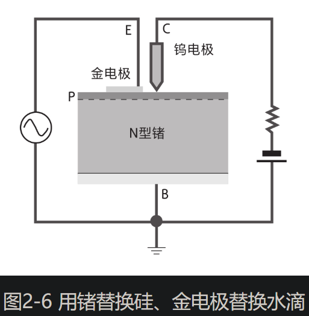

12月12日，布拉顿满心期待地准备测试，却发现薄膜不翼而飞了。原来他习惯在试验前清洗锗晶，但没想到锗的氧化物居然是溶于水的。

布拉顿痛恨自己的失误，本想丢弃这片锗晶，但转念一想，还是测试一下吧。可让人意想不到的是，输出的电压竟得到了放大。这下，不用水滴也能放大电压了，这让大家重新振奋了起来。

现在，只剩下临门一脚——只要将功率也同时放大，就大功告成了。**布拉顿觉得，应该让锗晶表面上的钨丝电极和新做出来的金电极尽量靠近（这两个电极分别是发射极和集电极，而锗晶底部可作为调节放大的基极）。但是要靠得多近呢？**

巴丁拿起笔算起来：两个电极之间至多间隔0.05毫米，多一点都不行，这一点对于放大功率至关重要。可这仅有一根头发丝的宽度！

布拉顿急中生智想到了一个临时对策。他让一位技师削出一块塑胶三角劈，并用一片金箔仔细地包裹住三角劈的两侧边缘。接着，他摸出一片剃须刀片，像外科手术医生一样捏着它，并小心翼翼地将三角劈顶端的金箔划开了一条窄缝，作为两个微微分开的电极。

最后，他就做出了一个奇形怪状的电子器件：三角劈割开的窄缝朝下，压在一块N型锗晶上，而一根弹簧又把三角劈固定在塑料框架上（见图2-7）。

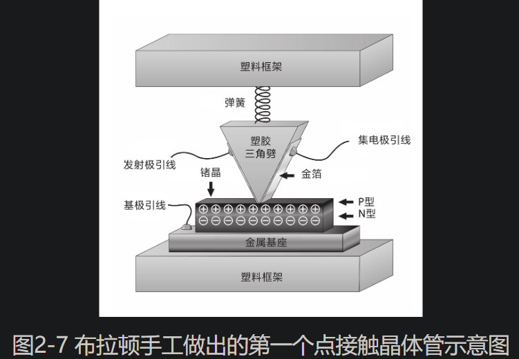

在巴丁的注视下，布拉顿将一个小信号送入了金箔一侧的电极，在另一侧的输出电极上，布拉顿测量到电压放大了4倍、功率放大了4.5倍，同时实现了两者的放大。

**这天是1947年的12月16日，星期二。布拉顿欣慰地一遍一遍地重复着这个实验，直到下班时还在不停地摆弄它。这个下午是布拉顿一生中最接近他敬仰的戴维森的时刻。**早在十年前，戴维森因为验证了电子的波动性而获得诺贝尔物理学奖时，大批记者拥进实验室，布拉顿惊讶得张大了嘴巴，他身边的戴维森点燃了一支雪茄，转过头轻声对他说：“不用担心，布拉顿，有一天你也会迎来这一时刻的。”

**巴丁表现得相当平静，晚上他回到家推开门，只是对妻子说了一句：“今天我们有了一些重要的发现。”这个三角劈两侧的金箔相当于用两根金属丝刺到锗晶体上，比巴丁少年时玩过的“猫须”矿石收音机多了一个电极，而这多出来的一个电极创造了历史。这看似简单的一步却走了20多年。**如果没有扎实的物理基础、高超的实验技巧和明确的目标指引，是不可能跨出这一步的。

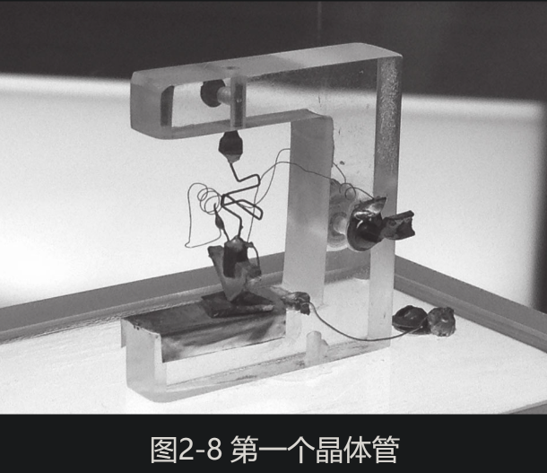

### 反戈一击，肖克利发明结型晶体管

那时，肖克利那双锐利的眼睛正变得黯淡。他非但高兴不起来，甚至感到有些苦涩正暗暗涌上心头。因为提出这个新发明的不是他本人，而是他的下属巴丁和布拉顿。肖克利隐约觉得自己在其中所做的工作被忽略了，这让他感到难言的不快。

一想到布拉顿制作的那只简陋的“点接触晶体管”，肖克利心中的妒意就越来越强。肖克利清楚，这样的玩意儿称得上是发明，但是这种器件很不可靠，更没法大批量生产，离凯利跟他提出的实用可靠的固态晶体管还差着十万八千里呢！不过，有一点是肯定的，这个点接触晶体管绝不是他一开始提出的“场效晶体管”……

肖克利回顾着过去几个月的思考，之前的想法突然有了升华。他迅速拿起笔在纸上画下一种有三层结构的晶体管，一层是N型半导体，中间一层是P型半导体，再一层是N型半导体，就像三明治——两片面包中间夹一层火腿（见图2-9）。

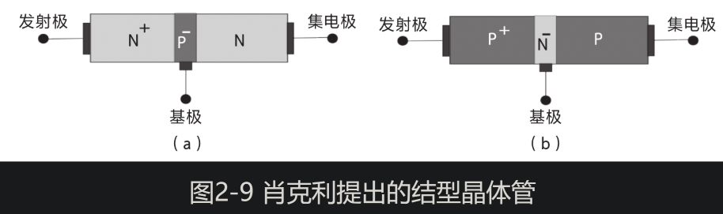

注：图2-9(a)为NPN结型晶体管，图2-9(b)为PNP结型晶体管。

这个结型晶体管背后的原理依然是通过调控单向电流来实现放大，跟水库闸门调节水流是一个道理。**肖克利设想电流从左到右单向通过三层半导体。第一层N型半导体负责提供大量电子，就像水库中蓄了大量水，能扩散、蔓延到器件中部。第二层P型半导体就像水闸，可以控制和引导这些电子。而第三层N型半导体负责把这些电子全部收集起来，就像水闸下方的水潭与河道。**

肖克利认为，只需向中间这一层注入微小的电流，就能在输出层得到较大的电流，从而实现放大，这有点像股市庄家注入一部分资金来搅动大盘。

**这种晶体管从左到右共有三层半导体、两个PN结，所以肖克利将其命名为结型晶体管。**这三层紧密贴合，而不是只通过一个点来接触，也无需固定框架，比点接触晶体管更稳定、更可靠。

肖克利在纸上不停地写着、算着，一直忙碌到深夜。第二天是1948年元旦，天还没亮，肖克利就起床了，他坐在桌前奋笔疾书，写满了13页稿纸。

**这一次，肖克利彻底抛弃了以前的“执念”——用外部电场来控制单向电流，而改为用晶体管内部中间的那一层来控制电流，这样就避开了半导体表面容易惹出麻烦的固定电子，这一点比巴丁的点接触晶体管更高明。**

如果说巴丁和布莱顿的点接触晶体管撞开了晶体管世界大门的一道缝，那么肖克利的“三明治”结构晶体管则彻底打开了这扇大门，因为“三明治”这种稳定结构的晶体管才适合大规模制造。

随后，肖克利将自己提出的结型晶体管想法梳理总结，并于当年6月正式申请专利，上面只署了他一个人的名字！

### “我们也发明了晶体管”，发明之争

到了1948年夏天，贝尔实验室准备发布点接触晶体管。

发布会前，实验室需要为这个新器件命名，于是发起了征集，备选的名字有“半导体三极管”(semiconductor triode)、“表面态三极管”、“晶体三极管”、“固态三极管”以及“晶体管”(transistor)。

最后一个名字是电子工程师J.皮尔斯(J. Pierce)想到的，他喜欢在业余时间创作科幻小说，虽然总是被拒稿，但他仍乐此不疲。新发明的固态放大器将一个小输入电流转变为一个大输出电流，相当于改变(trans)了端口的电阻(resistor)大小，合起来就是“transistor”。经过投票，这个名字赢得了多数人的赞同。

巴丁和布拉顿起草了一篇只有一页半的论文《晶体管——一种半导体三极管》，投给了《物理学评论》(Physics Review)。距离发布会还有5天时，这篇文章发表了。在文章结尾，他们俩感谢肖克利“发起并指导了这项研究任务”。

实验室还为肖克利、巴丁和布拉顿拍摄了官方照片。肖克利端坐在布拉顿一手操办建立的实验台旁，像模像样地操作显微镜观察着巴丁构想出来的点接触晶体管，而巴丁和布拉顿则像学生一样恭恭敬敬地站在旁边，观摩正在“做实验”的肖克利（见图2-10）。

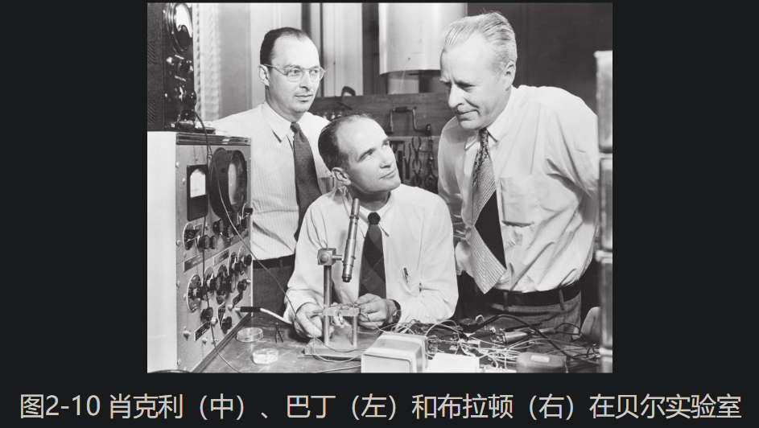

“好家伙，”巴丁后来回忆道，“沃尔特（布拉顿）肯定恨死这张照片了。”在另外一幅照片里，巴丁站在肖克利旁边，在一个本子上记着什么，仿佛一个听命于肖克利的记录员。在所有官方照片里，肖克利都居中而坐。

1956年11月1日早上，巴丁正在厨房煎蛋做早餐，突然从收音机里听到一则爆炸性消息，手中的煎锅失手掉在地上。原来，他跟肖克利、布拉顿因为“对半导体的研究和对晶体管效应的发现”获得了诺贝尔物理学奖。

随后，三人前往瑞典，受到了众星捧月般的欢迎，他们坐在一起痛饮美酒，试图将过去的不快忘记。然而，一切都是徒劳。早在发明点接触晶体管时，肖克利与其他两人的关系就有了微妙的变化，一道裂痕已经刻在三人心里，他们的分歧不断扩大，直到有一天再也无法逆转。

### 本章要点

需求是发明之母，这一点在战时表现得更为突出。

第二次世界大战时期，为了改进雷达的接收性能，半导体整流器的研究开始加速，同时带动了硅和锗等半导体的研究。

半导体整流器的研究可以追溯到1874年布劳恩发现了金属半导体界面上的单向整流。直到1939年，莫特等人在理论上取得突破，才用量子物理学解释了背后的机制。

进一步，贝尔实验室的奥尔在1940年偶然间发现了硅中的PN结，能够作为单向整流器，为发明半导体放大器打下基础。

第二次世界大战后，贝尔实验室成立了由肖克利、巴丁和布拉顿组成的半导体晶体管攻关小组。肖克利提出了场效晶体管的概念，但因遇到技术困难没能实现。巴丁和布拉顿转而用两根金属尖触碰半导体，于1947年发明了第一个点接触晶体管。肖克利不甘认输，于第二年发明了“三明治”结构的结型晶体管，使之成为广泛应用的晶体管。

晶体管的成功发明靠的并不是几个人的单打独斗，这其中既有许多偶然的因素（奥尔发现PN结、布拉顿不小心清洗掉锗晶表面的氧化物），也有科学家的智慧引导（巴丁的表面态理论、布拉顿的巧手和肖克利的半导体少数载流子理论）。当然也与贝尔实验室将不同学科的科学家和工程师凝聚在一起密切相关，正是他们彼此激发互助，才共同攻关完成了这一壮举。

## 硅在扩散

### “肖克利真是愚蠢之至”，蹒跚学步的晶体管

1948年下半年，凯利将固体物理研究小组改组为半导体研究小组，并任命了一位行事果断、富有制造经验的工程师杰克·莫顿(Jack Morton)为组长。一些从事晶体管开发工作的工程师也被他招至麾下。

12月的一天，工程师戈登·蒂尔(Gordon Teal)来找莫顿，他需要一笔资金用于制作纯净锗晶体的拉晶机，以便使锗的原材料中生长出均匀一致的大块单晶体。

蒂尔是物理化学博士，他对散发着光泽的锗晶体很感兴趣。他认为大块单晶对于晶体管性能至关重要。**“猫须”整流器之所以需要不停地尝试，就是因为方铅矿石表面只有极个别区域才有很小块单晶。**如果使其变成一整块单晶体，晶体管的性能将大大提高。

蒂尔与机械工程师J.里特尔(J. Little)两人讨论出一种新的拉晶机模型。使用了一种拉晶法（即“柴可拉斯基法”），它是1917年波兰的一位科学家J.柴可拉斯基(J. Czochralski)提出来的，这有点像中学化学实验中将漂亮的蓝色硫酸铜晶体从溶液中析出。将一颗种子晶体放置在高温熔化的液体中，并将其缓慢地拉出，在此过程中，种子的尾部会逐渐积累生长更多的晶体，这样就能拉出一条非常完美的单晶。拉出的晶体冷却后，将其切割成一片片的晶圆，就能在上面制作晶体管了（见图3-1）。

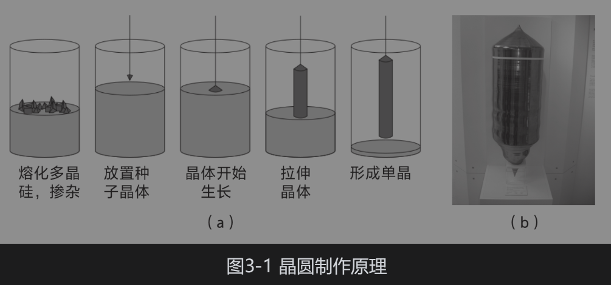

蒂尔先找到肖克利，请求他给予资金支持，但被拒绝了。肖克利觉得只要随便从锗锭上切割下一块就能用，无须专门拉出高纯度的晶体。蒂尔对此抱怨道：“肖克利在这个问题上真是愚蠢之至！”

但莫顿知道半导体晶体纯度对于制造晶体管的重要性，于是批准了蒂尔的请求。

1949年3月，蒂尔成功地拉出了第一根锗单晶棒，它的少数载流子寿命比以前直接从锗锭上切割下来的长10倍以上。肖克利承认自己之前判断失误，他给蒂尔分配了实验室，成立了生长单晶体的研究小组。

1950年4月，摩根·斯帕克斯(Morgan Sparks)和蒂尔用拉晶法制作出了肖克利期待已久的NPN结型锗晶体管。一边缓慢拉晶，一边添加杂质元素，使得锗晶的不同层转变为N型或P型，最终形成NPN晶体管。1951年1月，他们做出的晶体管频率超过了10MHz，达到了调幅（简称AM）广播的频率。

1951年7月4日，时隔三年，贝尔实验室又一次召开新闻发布会，发布了结型晶体管，这一次发布会的主角是肖克利。结型晶体管的各项指标均超过了点接触晶体管。实际上，点接触晶体管由于成本和稳定性等原因并没有投入大规模生产。毫无疑问，未来属于肖克利发明的结型晶体管。

就在肖克利成为大赢家的时候，他的一位同事却陷入了巨大的痛苦之中。在发布会前的一个多月，贝尔实验室副总裁凯利收到了巴丁的辞职信。

原来，发明晶体管后，研究小组的工作重点从基础研究转向了应用研究，而巴丁仍钟爱基础理论探索，不愿去做具体开发。肖克利对情况非常了解，却仍然安排巴丁去做他不喜欢的应用研究，巴丁很不情愿，数次抗争，但终究没能改变肖克利的决定，“这是他的既定方针……我对此事是不满的”。

巴丁去意已决，他已经联系好了伊利诺伊大学，决意不为任何改变而动。实验室上下都为失去一位顶尖的物理学家而感到惋惜，也纷纷抱怨肖克利对组员的横加干涉。

顺便说一句，巴丁在伊利诺伊大学的超导研究证明了他仍有东山再起的能力。1972年，巴丁因为这项研究再一次获得诺贝尔物理学奖，**成为迄今唯一两次获得诺贝尔物理学奖的人**。除了物理，巴丁还有一个爱好是高尔夫球，曾创造了个人生涯的最佳成绩：一杆进洞。后来有人问他“一杆进洞”和诺贝尔物理学奖相比，哪“也许个更重要？巴丁若无其事地说：两个诺贝尔物理学奖加起来才比“一杆进洞”重要。

### 热油中的音乐播放器，硅晶体管登场

20世纪50年代初，一些美国国会议员认为美国电话电报公司违反了反垄断法，提出将其拆分成几个小公司。为了显示自己并非垄断者和技术创新的阻碍者，美国电话电报公司要求贝尔实验室开放晶体管技术。

1952年4月，贝尔实验室召开了第二次研讨会。

在研讨会上，蒂尔演示了如何用拉晶机制作锗晶体，这引起了德州仪器公司的研发主管马克·谢泼德(Mark Shepherd)的强烈兴趣。一年后，蒂尔注意到德州仪器公司的招聘广告，他想回到家乡得克萨斯州，于是联系了谢泼德，并于1952年底加入了德州仪器公司。

蒂尔的加盟正逢其时，他是晶体生长领域数一数二的领军人物，德州仪器公司围绕着蒂尔建立了半导体研发部门。

**贝尔实验室发布了结型晶体管后，下一步便是推进批量生产。结型晶体管虽然比点接触晶体管的结构更稳定，但仍有几个问题阻碍着它的大规模生产。**

第一个问题是，用拉晶法制造结型晶体管效率很低，需要一边拉晶，一边添加杂质，使得半导体变成P型或N型，这种操作一次只能做出少量的几个晶体管，无法实现大批量生产。

第二个问题很诡异，本来已经做好的带负电荷的N型锗晶圆，不知何故在加热炉里就变成了带正电荷的P型锗晶圆。

对于第二个问题，没人能给出合理的解释。1952年，半导体研究小组的一位材料科学家卡尔文·富勒(Calvin Fuller)对这个问题产生了兴趣。

**富勒**注意到了一个被所有人忽略的细节：操作员进入实验室时握了门把手。富勒盯着门把手陷入了沉思，它是铜做的，泛着褐黄的光泽。他立刻用铜做实验，故意把铜原子沾到锗晶表面，放到高温下加热到500℃，结果N型半导体变成了P型半导体。富勒恍然大悟，果然是门把手上的铜原子扩散到晶体内部，产生了带正电荷的空穴，从而使得N型锗晶圆变为P型。

富勒反过来一想，既然原子这么容易就扩散到半导体内部，并使其从N型变成了P型，那么能否采用这个方法将普通的半导体轻松地制作成P型半导体或N型半导体呢？

富勒想到，如果把包含多余电子的元素“故意沾到”晶体表面，这些元素就能扩散到晶体中，使得电子数目过剩，从而形成N型半导体。反之，将包含多余空穴的元素扩散到晶体中，就可形成P型半导体。除了“沾到”晶体表面之外，还可以用高温气体将特定的元素喷到晶圆表面，这样效率更高。

由此，**富勒发明了半导体扩散法**（见图3-3）。这有点像喷墨打印机把墨汁喷到纸面上一样简单，**效率远高于拉晶法**。这样一来，连同上面提到的第一个问题——晶体管制造效率的问题也一起解决了。

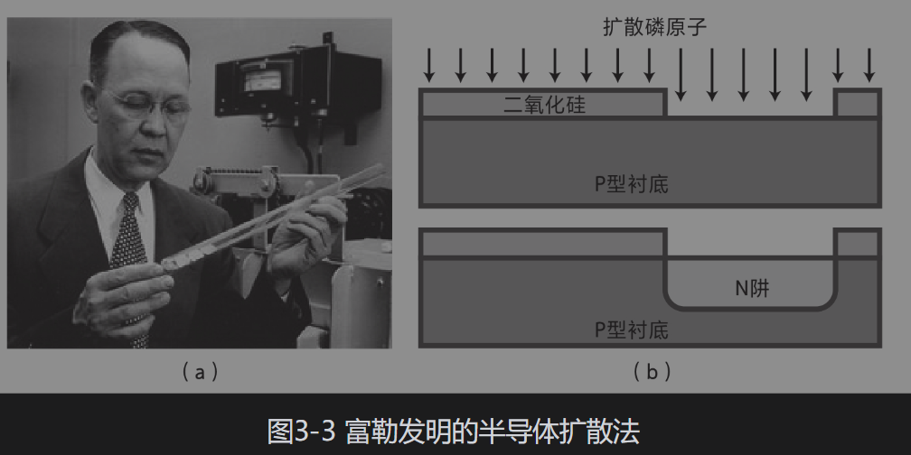

肖克利听到了这个消息后敏锐地意识到，只要在一片半导体上多次“喷墨打印”，依次扩散出N层和P层，就能做出PNP或NPN结型晶体管。

1954年，肖克利建议同事查尔斯·李(Charles Lee)等人用富勒的半导体扩散法来制作结型晶体管。**当年年底，第一个扩散锗晶体管诞生。**

**有了大规模制造锗晶体管的技术，贝尔实验室下一步的目标就是制造硅晶体管。**因为硅在地壳中的储量丰富，成本低廉。而且，硅晶体管的漏电流远小于锗晶体管，功耗很低。

与此同时，德州仪器公司也对研究硅晶体管很感兴趣。那时的晶体管基本上都是锗晶体管，但当温度超过75℃，锗晶体管就没法正常工作了。这对于军事、航天等领域的应用而言是一个极大的缺陷。

蒂尔是一名拉晶专家，进入德州仪器公司后就一直致力于研究用拉晶法制造硅晶体管。然而，硅的熔点高达1410℃，远高于锗，不易提纯和加工，这使得在将近一年的时间内，他们都没有取得什么重大进展。

1954年5月10日，蒂尔参加了美国无线电工程师协会的学术会议，他被安排在上午做最后一个发言。前面的发言者历数了制作硅晶体管的困难，并断言业界在近期内制造出硅晶体管的希望渺茫。

轮到蒂尔登台时，听众已经无精打采，但他镇定自若地说：“与你们刚刚听到的对硅晶体管持悲观的态度刚好相反，我的口袋里恰好装了几只硅晶体管。”听众立马从昏睡的状态中兴奋起来，后排的一位听众不敢相信蒂尔的话，大声地质问道：“你是说你们真的做出了硅晶体管？”

蒂尔首先拿出一个音乐播放器，它正在播放音乐。蒂尔将播放器的锗晶体管单独浸泡在装有热油的烧杯中，音乐戛然而止，因为锗晶体管无法在高温下工作。接着，他用一只硅晶体管替代了那只锗晶体管，并再一次浸泡到热油中，但这一次音乐声如常响起。现场的观众顿时睡意全消，兴奋地目睹了硅晶体管的神奇效果。

其实早在几个月前，贝尔实验室的莫里斯·塔嫩鲍姆(Morris Tanenbaum)就用生长法制作出了硅晶体管。不过他们认为用这种方法效率低下，于是没有发布消息，没料想却被德州仪器公司抢了头功。塔嫩鲍姆转而计划用更高效的扩散法来制作硅晶体管，不过不太顺利。

1955年3月17日晚上，塔嫩鲍姆下班回到家中，心里却始终放不下实验，于是又重新驾车回到了实验室。他盯着实验台上一支作废的硅晶体管，心情变得烦躁起来。从3月初以来，塔嫩鲍姆虽然用扩散法做出了“三明治”形状的硅晶体管，但还剩最后一个问题没有解决：中间的基极（“火腿”）很薄，无法引出电极线。

“让导线穿过上层的硅进入晶体管内部会怎么样？”这天晚上，塔嫩鲍姆对自己说。这就像用一根牙签直接从三明治的顶部刺进去，一直扎到中间的火腿。稍有电学常识的人都知道，这将在发射极（“上层面包”）和基极（“火腿”）之间引起短路。

但塔嫩鲍姆没管那么多，他决定先试一把再说。他把一根铝线接触到表面的发射极，并通上较大的电流，使得铝线熔化，粘到晶体管上并穿透进去。神奇的是，晶体管竟然没有短路。

他后来分析，焊接在硅晶圆表面的铝线在N型硅和铝合金之间形成了一个PN结，从而避免了短路。塔嫩鲍姆的同事测量了这个扩散硅晶体管，工作频率超过了100 MHz，是锗晶体管的10倍。

就在同一个月，贝尔实验室的亨利·特里尤尔(Henry Theuerer)在普凡的分区提纯技术基础上做了改进，发明了硅晶体的浮法分区提纯，它能像锗晶那样大幅度地提高硅晶体的纯度。这样一来，**扩散法制作硅晶体管加上浮法分区提纯硅，为大规模地制造硅晶体管迈出了关键的一步。**

这种硅晶体管能够应用于100℃以上的高温环境和100 MHz以上的高频领域。它还有机会被应用在高温的沙漠、热带雨林，或者调频收音机、甚高频（简称VHF）电视机、导弹制导、移动通信、高速计算机等领域。一个充满了无限可能的未来即将被硅晶体管这把“钥匙”打开。

正是这种扩散硅晶体管，促使肖克利下定了决心——离开贝尔实验室。

### 感觉“在跟上帝通话”，落地硅谷

1955年，肖克利45岁了，他在4年前就已经成为美国科学院院士，可谓功成名就。

不过，他在贝尔实验室也感到越来越压抑。最近几年，肖克利的头衔一直是半导体物理组的负责人，而跟他同时入职的费斯克在1951年便成了他的上司，三年后又升任实验室副总裁。而肖克利像是被钉在了中层，晋升通道被堵死了。实际上，贝尔实验室的高层意识到肖克利只擅长科学研究，而不擅长管理团队，这也从巴丁的离去和基层员工的抱怨中得到了印证。

1955年3月，用扩散法制造硅晶体管的消息传来，肖克利马上意识到大规模制造硅晶体管的时机到来了。肖克利想，凭借他在业界积累的人脉以及掌握的贝尔实验室的内部消息，他可以立刻把这些尚处于研发阶段的技术变成实用的技术，从而使自己成为百万富翁。

肖克利头脑中的“拼图”渐渐地完善起来，**有了浮法分区提纯硅晶、扩散法制造硅晶体管，以及用光阻剂（相当于今天的光刻胶）在硅晶上形成图案的方法，就能大规模地制造扩散硅晶体管。**肖克利准备大干一场，他决定立刻离开贝尔实验室，自己出去创业。

1955年8月，肖克利想起来，年初他曾参加了洛杉矶商会组织的一次聚会，认识了副会长阿诺德·贝克曼(Arnold Beckman)。为什么不给他打个电话，讲讲自己要成立一家公司来生产扩散硅晶体管的计划呢？

贝克曼邀请肖克利前往加州面谈详细计划，顺道考察当地的环境。肖克利觉得，去加州创业是个不错的主意，他从小在加州长大，而且母亲至今仍住在那里。郊外到处是种满了杏树、李子树、樱桃树的果园，被称为“心悦之谷”。

肖克利起劲地向贝克曼介绍了扩散硅晶体管在美国国防军事领域具有的广阔前景和可能带来的丰厚利润，贝克曼动心了，决定与肖克利一起合作。肖克利负责组建研发团队，并在贝克曼仪器公司(Beckman Instruments)工作两年，批量生产扩散硅晶体管，而贝克曼负责提供开办公司所需的资金，第一年为30万美元。

接下来，肖克利要招聘员工，他一个接一个地打电话给贝尔实验室那些富有经验的工程师——斯帕克斯、约翰·皮尔斯(John Pierce)、塔嫩鲍姆等人，劝说他们加入。但这些接到邀请的人深知肖克利的为人和管理方式，都找各种理由谢绝了。于是，肖克利只好退而求其次，从刚毕业的博士生或者刚刚进入半导体行业的年轻人中物色合适的人选。

1956年1月19日，一位年轻博士**罗伯特·诺伊斯**接到了一通电话，问他是否有兴趣加入一家半导体公司。诺伊斯得知打来电话的是肖克利后，感觉自己“在跟上帝通话”。当时，肖克利可谓半导体行业最亮的一颗星，他于1952年出版的《半导体中的电子与空穴》是业界人士学习半导体的必读之书。

肖克利邀请诺伊斯到位于加州的新公司面试并顺便考察一下，诺伊斯爽快地答应了。面试进行得很顺利，结束后肖克利叮嘱他参加一个智商和心理测试。肖克利对诺伊斯的智商测试结果很满意，同时对诺伊斯在管理能力上的不佳表现暗自开心，他可不希望年轻人有很强的管理能力，以免将来跟自己争权。

讽刺的是，诺伊斯后来创立了英特尔公司，并成功地带领这家有数万名员工的企业问鼎行业第一的宝座，他自己也当选为全美半导体产业协会的会长。

一天傍晚，**摩尔**在家中接到了那通重要的电话。一个似曾相识的声音从听筒里传来，“我是肖克利”。摩尔顿时想起了他在华盛顿的宇宙俱乐部听讲座时，那位向观众抛洒晶体管的物理学家。

当肖克利打来电话时，摩尔一开始觉得有点奇怪，为什么肖克利需要他这位化学家？肖克利告诉他，制作晶体管中不少工艺过程都需要化学家参与。这样一来，摩尔觉得从事晶体管研究对未来社会的价值更大，自己应当加入这个新兴的产业。

在通过了肖克利一连串专业问题的面试后，摩尔也按照肖克利的要求参加了智商和心理测试，凭借较高的智商和“平庸”的管理才能，他也顺利地进入了肖克利的初创公司。

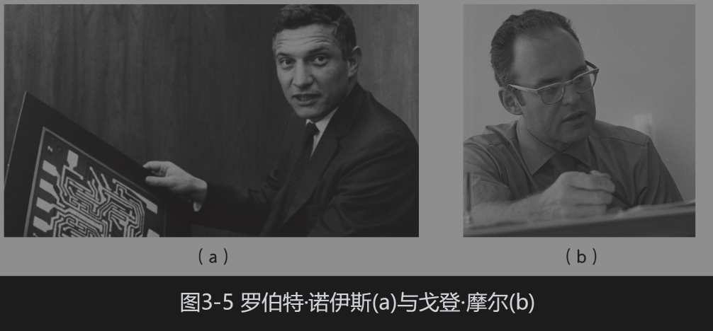

**1956年2月，肖克利晶体管实验室在加州正式成立**。肖克利着力于打造一支半导体的“梦之队”。新员工中有杰·拉斯特、尤金·克莱纳(Eugene Kleiner)、谢尔顿·罗伯茨(Sheldon Roberts)、让·霍尼(Jean Hoerni)等人，大多数人都拥有博士学位，分别是半导体、材料、化学和机械等专业。他们中只有肖克利和罗伯茨有半导体方面的工作经验，其余的都是新手。

每天早上6点，摩尔、拉斯特和维克多·琼斯(Victor Jones)等人就来到公司，自学半导体物理。有时候肖克利会亲自指导，就一个细节讲上几个小时。此外，肖克利还派诺伊斯、摩尔等人去贝尔实验室学习第一手的经验。

诺伊斯后来回忆说：“肖克利有一种神奇的化繁为简、直抵问题本质的能力。他的思维流动是如此之快，以至于你不得不快马加鞭地赶上他的节奏。而你的学习效率也变得出奇地高，因为你在非常努力地从他那里汲取知识。”

肖克利信心十足，想要用扩散法做出硅晶体管。但是他忽略了一点，这里不是贝尔实验室，缺少配套的技师和熟练工人，这些博士不得不亲自泡在生产线上，随时要面对不知从哪里冒出来的棘手问题。在贝尔实验室很容易解决的问题，到了这里就变得困难重重。

1956年11月初的一天，肖克利收到了获得诺贝尔物理学奖的消息，这使他瞬间成了闻名世界的大人物。第二天早上，肖克利请公司的核心成员一起到**利克饭店**吃早餐。

不幸的是，肖克利领奖后紧随着公司的衰落。距离公司成立将近一年了，当初贝克曼的投资已所剩无几，但公司仍然没有研发出一个能盈利的产品。

肖克利从瑞典回来后，摩尔给肖克利写了一份言辞激烈的备忘录，**主张先放下PNPN二极管，集中人力去攻关硅晶体管。只有这样，才能拿到订单，从而先让公司存活下来。**但肖克利对此置若罔闻。在所有的年轻人中，诺伊斯技术全面，擅长打交道，而且深得肖克利的信任。大家推举诺伊斯去跟肖克利沟通，但他也铩羽而归，没能说服这位顽固的老板。

本来满怀希望的员工们顿时陷入了进退两难的境地。他们已经摊牌，却处于极度被动的局面，无路可退。诺伊斯在写给父母的信中透露：“公司恐怕要有很大的变动，也许我们都要卷铺盖走人了。”

### 八叛徒，出走“仙童”

这段时间，摩尔、拉斯特、罗伯茨等7个年轻人经常下班后聚在一起商讨未来之路。他们一致认为大家应该同进同退，找到一家愿意同时雇用他们几个的公司，成立一支单独的团队，毕竟他们合作了这么久，彼此之间都非常熟悉。

克莱纳想到了一家投资公司海登斯通(Hayden Stone & Co.)，便写了一封毛遂自荐的信。他在信中说：“我们这个团队富有经验，团队成员精通物理学、电子学、工程学、冶金学和化学，并有能力在三个月内开展半导体业务。”

信件几经辗转，最后到达了投资人阿瑟·洛克(Arthur Rock)手上。听完他们想找一家能同时雇用他们的公司的打算后，洛克反问道：“你们为什么不找人投资，成立一家自己的公司呢？”这句话让他们如梦初醒，是啊，为什么没有想到这个选项呢？

但这7位年轻人马上又有了新的担忧：他们都是从事研发工作的，不知道如何销售产品、寻找客户，更不用说运营一家公司了。洛克问：“能不能从现在的公司里再找一个合适的人选？”他们思索了一番，回答说：“合适的人倒是有一个，只是不知道他是否肯加入我们。”此人就是诺伊斯。显然，诺伊斯具有最为丰富的半导体研发经验，而且善于跟人打交道。

接下来，洛克火速地赶回纽约，寻觅合适的投资公司。但大部分公司都婉拒了，只有一家**仙童摄影器材公司**的老板谢尔曼·费尔柴尔德(Sherman Fairchild)表现出浓厚的兴趣。费尔柴尔德的父亲曾是IBM公司最大的个人股东，后来把股票转移给了儿子。费尔柴尔德充满活力，很有想象力，对半导体器件很感兴趣。之前他的公司调研了制造半导体元件的可能性，但一直找不到合适的团队，而此时诺伊斯一行8个人正好找上门来，于是他们一拍即合。

之后，所有人前往利克饭店，高举香槟庆祝。**不到一年前，这群年轻人在同一家饭店庆祝了肖克利获得诺贝尔物理学奖，现在则是庆祝自己刚创办的仙童半导体公司。**

1957年9月18日，肖克利在自己的日记本上写下了简短的一句话：“团队辞职。”那天上午，诺伊斯、摩尔等8人集体递交了辞职信。

肖克利感召了一批年轻有为的人才来到加州，并将硅技术带到了这里，后来他被称为**“硅谷的摩西”**。这些年轻人创立了仙童半导体公司，开辟了创业和风投的先河，后来再由仙童半导体公司分化出一批又一批的“小仙童们”，逐渐形成了硅谷地区的高科技企业群。

再后来，肖克利去了斯坦福大学任教，不愿再提起当年的往事。一次，肖克利在一场工业界的午餐会上碰到了诺伊斯，只说了一句“你好，鲍勃”，就转身走了。

## 芯片的发明

