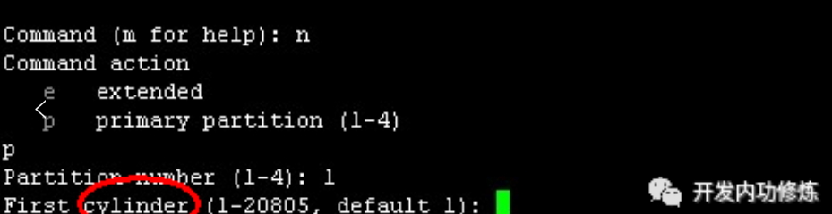
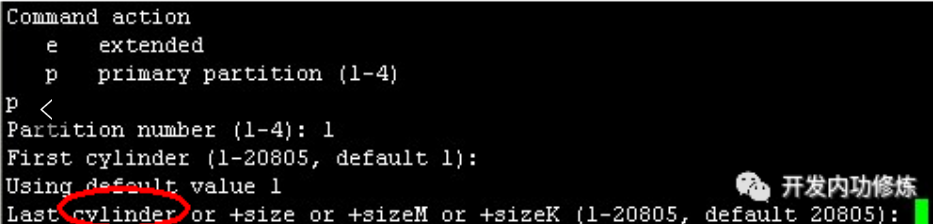

# 磁盘结构

为了方便讨论，我们还是先从最基本的磁盘物理结构说起吧，对于常见的机械磁盘，分磁盘面、磁道、柱面和扇区。（注意本文只讨论机械磁盘，SSD先放一放再说）。 机械硬盘拆开以后，结构如下：


我们再用一个逻辑图看一下


可见有以下概念 ：

1. 磁盘面：磁盘是由一叠磁盘面叠加组合构成，每个磁盘面上都会有一个磁头负责读写。

2. 磁道(Track)：每个盘面会围绕圆心划分出多个同心圆圈，每个圆圈叫做一个磁道。

3. 柱面(Cylinders)：所有盘片上的同一位置的磁道组成的立体叫做一个柱面。

4. 扇区(Sector)：以磁道为单位管理磁盘仍然太大，所以计算机前辈们又把每个磁道划分出了多个扇区。

所以，磁盘存储的最小组成单位就是扇区。 

单柱面的存储容量 = 每个扇区的字节数 * 每柱面扇区数 * 磁盘面数 

整体磁盘的容量 = 单柱面容量 * 总的柱面数字。

> 扇区与扇区之间其实不是紧挨着的，而是在每个扇区结尾其实还有一个存储纠错码的位置。假设某一个扇区读取时发生了错误，这样在扇区结尾的纠错码就能发现。磁头就会在磁盘下一圈转过来的时候再读取一遍。

# 动手实际查看

Linux相比较windows操作系统，一个优点就是对开发非常友好和透明。只要你愿意，你总能扒到你想要的信息。Linux上可以通过fdisk命令，来查看当前系统使用的磁盘的这些物理信息。

首先我们查看服务器上安装的硬盘数量以及大小，这需要借助`lsblk`这命令。

```shell
# lsblk
NAME                     MAJ:MIN RM   SIZE RO TYPE MOUNTPOINT
sdb                        8:16   0    20T  0 disk
`-sdb1                     8:17   0    20T  0 part /search
sda                        8:0    0 278.5G  0 disk
|-sda1                     8:1    0   200M  0 part /boot
`-sda2                     8:2    0 278.3G  0 part
  |-vgroot-lvroot (dm-0) 253:0    0    10G  0 lvm  /
  |-vgroot-lvswap (dm-1) 253:1    0     8G  0 lvm  [SWAP]
  |-vgroot-lvvar (dm-2)  253:2    0    15G  0 lvm  /var
  |-vgroot-lvusr (dm-3)  253:3    0    10G  0 lvm  /usr
  `-vgroot-lvopt (dm-4)  253:4    0 136.7G  0 lvm  /opt
```

通过上面命令我们可以看到，笔者的服务器上装了两块硬盘，分别是sda(278.5G)和sdb(20T)。接下来我们再通过`fdisk`这个命令来查看硬盘更详细的信息：

```shell
#fdisk -l /dev/sda
Disk /dev/sda: 299.0 GB, 298999349248 bytes
255 heads, 63 sectors/track, 36351 cylinders
Units = cylinders of 16065 * 512 = 8225280 bytes
Sector size (logical/physical): 512 bytes / 4096 bytes
I/O size (minimum/optimal): 4096 bytes / 4096 bytes
Disk identifier: 0x00053169

   Device Boot      Start         End      Blocks   Id  System
/dev/sda1   *           1          26      204800   83  Linux
Partition 1 does not end on cylinder boundary.
/dev/sda2              26       36352   291785728   8e  Linux LVM
```

可以看出sda这块磁盘：

1. 有255个heads(磁头)，也就是说共有255个盘面。

2. 36351个cylinders，也就是说每个盘面上都有36351个磁道，

3. 63sectors/track说的是每个磁道上共有63个扇区。

4. 逻辑扇区大小是512 bytes

上面的Units说的是每个磁道的存储容量大小，8225280 bytes（=255盘面 * 63扇区 * 逻辑扇区大小512字节）。 那么该磁盘的总大小=36351 cylinders * Units(8225280 bytes)=299GB。

## 自己测试

这是在centos7的虚拟机上面命令输出，和飞哥的输出有些不同，让GPT4给解释一下

```shell
[root@localhost ~]# fdisk -l /dev/sda

Disk /dev/sda: 21.5 GB, 21474836480 bytes, 41943040 sectors
Units = sectors of 1 * 512 = 512 bytes
Sector size (logical/physical): 512 bytes / 512 bytes
I/O size (minimum/optimal): 512 bytes / 512 bytes
Disk label type: dos
Disk identifier: 0x000cab73

   Device Boot      Start         End      Blocks   Id  System
/dev/sda1   *        2048     2099199     1048576   83  Linux
/dev/sda2         2099200    41943039    19921920   8e  Linux LVM

```

这个 `fdisk -l /dev/sda` 命令的输出显示了 `/dev/sda` 磁盘的分区表信息。下面是逐行解释：

```text
Disk /dev/sda: 21.5 GB, 21474836480 bytes, 41943040 sectors
```
- `/dev/sda` 是指第一个 SCSI 硬盘驱动器（通常也代表第一个 SATA 硬盘）。
- `21.5 GB` 是磁盘的总存储容量。
- `21474836480 bytes` 是磁盘总字节数（与 GB 相符）。
- `41943040 sectors` 指的是磁盘的扇区总数。

```text
Units = sectors of 1 * 512 = 512 bytes
```
- 磁盘的扇区单位大小为 512 字节，这是许多磁盘的典型扇区大小。

```text
Sector size (logical/physical): 512 bytes / 512 bytes
```
- 逻辑扇区大小和物理扇区大小都是 512 字节。

```text
I/O size (minimum/optimal): 512 bytes / 512 bytes
```
- 对这个磁盘进行 I/O 操作时的推荐单位和最小单位也是 512 字节。

```text
Disk label type: dos
```
- 磁盘使用的分区表类型是 DOS MBR（Master Boot Record）风格。

```text
Disk identifier: 0x000cab73
```
- 磁盘识别码是 `0x000cab73`，这是一个十六进制数，用于唯一标识这个磁盘。

分区表具体信息：

```text
   Device Boot      Start         End      Blocks   Id  System
/dev/sda1   *        2048     2099199     1048576   83  Linux
/dev/sda2         2099200    41943039    19921920   8e  Linux LVM
```

- `/dev/sda1` 是第一个分区。
  - `*` 表明这个分区是可启动的（含有引导记录）。
  - `Start` 和 `End` 列表示该分区所占的起始和结束扇区。（2048 至 2099199）
  - `Blocks` 是该分区总的块数，一个块通常为 512 字节。（1048576 块）
  - `Id` 是分区类型标识符，83 是 Linux 文件系统类型。
  - `System` 描述了分区类型，这里是标准的 Linux 分区。

- `/dev/sda2` 是第二个分区。
  - 没有 `*`，表明此分区不是启动分区。
  - `Start` 和 `End` 列表示此分区所占的起始和结束扇区。（2099200 至 41943039）
  - `Blocks` 是该分区总的块数。（19921920 块）
  - `Id` 是分区类型标识符，8e 表示 Linux LVM（逻辑卷管理）。
  - `System` 显示这是一个用于 LVM 的分区。

综上，这个磁盘被分成了两个主分区，一个用于 Linux 系统，另一个设置了 LVM，可能用于灵活管理多个逻辑卷。

## 块

"Blocks" 这个术语用于表示分区的大小，但这个大小是以一定数量的扇区为单位计算的。这里的 "块" 是一个简化的计量单位，以帮助用户更容易地理解分区的大小。

扇区是磁盘存储的最小物理单位，在大多数现代硬盘上，扇区的大小是 512 字节或者在更高容量的磁盘上是 4096(4K) 字节。磁盘上所有的数据读写都是以扇区为单位进行的。

块通常是文件系统级别的概念，是文件系统进行数据读写的基本单位，它由多个扇区组成。在 `fdisk` 输出中的 "Blocks"，这个词实际上是指磁盘上相应分区的存储容量，它通常以 512 字节的计量单位表示（即一个块等于一个扇区）。

在你的 `fdisk` 输出中，"Blocks" 列显示的数字实际上是告诉你每个分区包含了多少个 512 字节的块（或扇区）。这是一个帮助用户理解分区大小的简化表示。但是，正如我之前解释的，这个词在不同上下文中可能有不同的定义。例如，在文件系统级别，一个块可能代表一个或多个扇区，这取决于文件系统的块大小配置。

# 关于fdisk结果中的几个疑问

**问题1：**每一个units的可存储的数据都是一样的，都是8225280字节？

按理说，磁道是一组同心圆，越是外圈的磁道周长会越长，存储的数据应该越多才对。这个问题的答案其实应该按时间来看：

在老式的磁盘里，确实是每个磁道数据都是一样的。这样越是内圈磁道的存储密度越大。目的就是为了访问方便，通过一个CHS地址：柱面地址（Cylinders）、磁头地址（Heads）、扇区地址（Sectors）直接定位到存储数据所在的扇区。但是这产生的问题就是外圈磁道的数据密度没有充分发挥出来，造成磁盘存储容量很难提升。

现代的磁盘人们改用等密度结构生产硬盘，也就是说，外圈磁道的扇区比内圈磁道多。这种磁盘里扇区是线性编号的，即从0到某个最大值方式排列，并连成一条线。这种寻址模式叫做LBA，全称为Logic Block Address（即扇区的逻辑块地址）。磁盘内部是自己会通过磁盘控制器来完成CHS到LBA的转换，进而定位到具体的物理扇区

**问题2：**在fdisk命令的结果里，存在的physical Sector size是什么？

现代科技进步了，磁盘底层的最小组成单位并不是扇区512字节，而是 physical Sector size 4KB。但这时存在一个问题是扇区大小为512字节的假设已经贯穿于整个软件链，比如BIOS，启动加载器，操作系统内核，文件系统代码，以及磁盘工具，等等。直接切换到4096 byte兼容性问题太大了，所以每个新的磁盘控制器将4096字节的物理扇区对应成了8个512字节的逻辑扇区，兼容各种老软件。

除了`fdisk -l`命令外,如下方式也可以查看物理/逻辑扇区大小。

```shell
#cat /sys/block/sda/queue/physical_block_size
#cat /sys/block/sda/queue/logical_block_size
```

**问题3**：磁头真的有255个？ 

我们先来看一张从磁盘上拆下来的磁头的真实照片


上面的图片里只有几个磁头，如果硬盘里真的装下255个这样的磁头的话，很难想象磁盘得有多厚。而且磁头多了以后硬盘的可靠性就越差，因为多磁头出故障的几率总会比单磁头要高一些。所以`fdisk -l`里看到的255 heads其实和扇区一样，也是虚拟出来的。 另外cylinders也一样，也是虚拟出来的。

# 磁盘分区

分区是操作系统对磁盘进行管理的第一步，这也是我们任何一个计算机使用者都非常熟悉的概念。例如Windows下的C、D、E、F盘。那么请思考一下，如果你是操作系统的设计者，让你把整块磁盘分成C、D等分区，你会怎么分呢？

为了方便讨论，我们这里假设你要分的硬盘是有50个盘面，3000个柱面。我们给出两种方案

- 方案一：50个盘面，C盘是0-10盘面， D盘是10-20个盘面,……
- 方案二：3263个柱面，C盘0-1000个柱面，D盘1001-20001个柱面,……

接下来我们来讨论下那种方案更优秀，这得从磁盘的读写延时角度说起。读写原理说起来也简单，就是磁头要找到指定的磁道，指定的扇区，进而把数据读取出来或者写入进去的过程。这个过程分成如下三步：

- 第一步，首先是磁头径向移动来寻找数据所在的磁道。这部分时间叫寻道时间。寻道时间，现代磁盘大概在3-15ms，其中寻道时间大小主要受磁头当前所在位置和目标磁道所在位置相对距离的影响
- 第二步，找到目标磁道后通过盘面旋转，将目标扇区移动到磁头的正下方，这部分时间叫旋转延迟。现在主流服务器上经常使用的是1W转/分钟的磁盘，每旋转一周所需的时间为60*1000/10000=6ms，故其旋转延迟为（0-6ms）
- 第三步，向目标扇区读取或者写入数据，这部分时间叫存取时间。这个是电磁操作，所以一般耗时较短，为零点几ms。

到此为止，单次磁盘IO时间 = 寻道时间 + 旋转延迟 + 存取时间

分区上采用哪一种方案，最主要看的是那种方式性能更快。在磁盘分区的使用中，存在一个基本事实，那就是同一分区下的数据经常会一起读取。两种方案的对于旋转延迟、和存取时间上表现的性能是一样的，主要区别是在寻道时间的表现上：

假如采用第一种，那么这样磁头就需要在3000多个磁道间不停地跳来跳去，这样磁盘的寻道时间就降不下来。而对于方案二，假如对于磁盘C，只需要在磁头在1-1000个磁道间移动就可以了，大大降低了寻道时间。

所以所有的操作系统采用的都是方案二，没有用方案一的。如果你在Linux下使用过fdisk进行过分区的话可以注意到以下信息。





分区的过程就是你输入起始柱面号和截至柱面号的过程。不过在实际中，分区并不能从0号柱面开始的，因为磁盘的第一个磁道对应的柱面会被用来安装引导加载程序以及磁盘分区表。

所以，操作系统通过按磁道对应的柱面划分分区，来降低磁盘IO所花费的的寻道时间 ，最终提高磁盘的读写性能。


