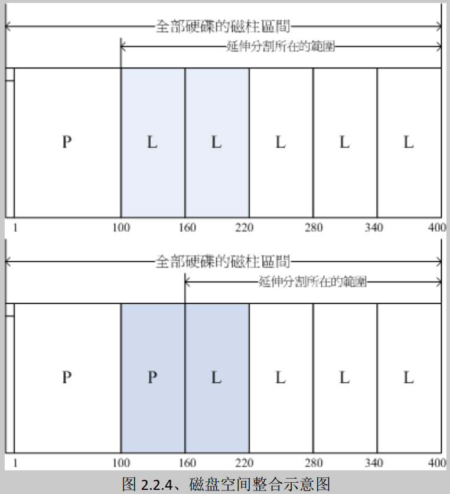

参考资料

> https://mp.weixin.qq.com/mp/appmsgalbum?__biz=MjM5Njg5NDgwNA==&action=getalbum&album_id=1371808335259090944#wechat_redirect
>
> 鸟哥的私房菜

# 磁盘结构

为了方便讨论，我们还是先从最基本的磁盘物理结构说起吧，对于常见的机械磁盘，分磁盘面、磁道、柱面和扇区。（注意本文只讨论机械磁盘，SSD先放一放再说）。 机械硬盘拆开以后，结构如下：


我们再用一个逻辑图看一下


可见有以下概念 ：

1. 磁盘面：磁盘是由一叠磁盘面叠加组合构成，每个磁盘面上都会有一个磁头负责读写。

2. 磁道(Track)：每个盘面会围绕圆心划分出多个同心圆圈，每个圆圈叫做一个磁道。

3. 柱面(Cylinders)：所有盘片上的同一位置的磁道组成的立体叫做一个柱面。

4. 扇区(Sector)：以磁道为单位管理磁盘仍然太大，所以计算机前辈们又把每个磁道划分出了多个扇区。

所以，磁盘存储的最小组成单位就是扇区。 

单柱面的存储容量 = 每个扇区的字节数 * 每柱面扇区数 * 磁盘面数 

整体磁盘的容量 = 单柱面容量 * 总的柱面数字。

> 扇区与扇区之间其实不是紧挨着的，而是在每个扇区结尾其实还有一个存储纠错码的位置。假设某一个扇区读取时发生了错误，这样在扇区结尾的纠错码就能发现。磁头就会在磁盘下一圈转过来的时候再读取一遍。

# 动手实际查看

Linux相比较windows操作系统，一个优点就是对开发非常友好和透明。只要你愿意，你总能扒到你想要的信息。Linux上可以通过fdisk命令，来查看当前系统使用的磁盘的这些物理信息。

首先我们查看服务器上安装的硬盘数量以及大小，这需要借助`lsblk`这命令。

```shell
# lsblk
NAME                     MAJ:MIN RM   SIZE RO TYPE MOUNTPOINT
sdb                        8:16   0    20T  0 disk
`-sdb1                     8:17   0    20T  0 part /search
sda                        8:0    0 278.5G  0 disk
|-sda1                     8:1    0   200M  0 part /boot
`-sda2                     8:2    0 278.3G  0 part
  |-vgroot-lvroot (dm-0) 253:0    0    10G  0 lvm  /
  |-vgroot-lvswap (dm-1) 253:1    0     8G  0 lvm  [SWAP]
  |-vgroot-lvvar (dm-2)  253:2    0    15G  0 lvm  /var
  |-vgroot-lvusr (dm-3)  253:3    0    10G  0 lvm  /usr
  `-vgroot-lvopt (dm-4)  253:4    0 136.7G  0 lvm  /opt
```

通过上面命令我们可以看到，笔者的服务器上装了两块硬盘，分别是sda(278.5G)和sdb(20T)。接下来我们再通过`fdisk`这个命令来查看硬盘更详细的信息：

```shell
#fdisk -l /dev/sda
Disk /dev/sda: 299.0 GB, 298999349248 bytes
255 heads, 63 sectors/track, 36351 cylinders
Units = cylinders of 16065 * 512 = 8225280 bytes
Sector size (logical/physical): 512 bytes / 4096 bytes
I/O size (minimum/optimal): 4096 bytes / 4096 bytes
Disk identifier: 0x00053169

   Device Boot      Start         End      Blocks   Id  System
/dev/sda1   *           1          26      204800   83  Linux
Partition 1 does not end on cylinder boundary.
/dev/sda2              26       36352   291785728   8e  Linux LVM
```

可以看出sda这块磁盘：

1. 有255个heads(磁头)，也就是说共有255个盘面。

2. 36351个cylinders，也就是说每个盘面上都有36351个磁道，

3. 63sectors/track说的是每个磁道上共有63个扇区。

4. 逻辑扇区大小是512 bytes

上面的Units说的是每个磁道的存储容量大小，8225280 bytes（=255盘面 * 63扇区 * 逻辑扇区大小512字节）。 那么该磁盘的总大小=36351 cylinders * Units(8225280 bytes)=299GB。

## 自己测试

这是在centos7的虚拟机上面命令输出，和飞哥的输出有些不同，让GPT4给解释一下

```shell
[root@localhost ~]# fdisk -l /dev/sda

Disk /dev/sda: 21.5 GB, 21474836480 bytes, 41943040 sectors
Units = sectors of 1 * 512 = 512 bytes
Sector size (logical/physical): 512 bytes / 512 bytes
I/O size (minimum/optimal): 512 bytes / 512 bytes
Disk label type: dos
Disk identifier: 0x000cab73

   Device Boot      Start         End      Blocks   Id  System
/dev/sda1   *        2048     2099199     1048576   83  Linux
/dev/sda2         2099200    41943039    19921920   8e  Linux LVM

```

这个 `fdisk -l /dev/sda` 命令的输出显示了 `/dev/sda` 磁盘的分区表信息。下面是逐行解释：

```text
Disk /dev/sda: 21.5 GB, 21474836480 bytes, 41943040 sectors
```
- `/dev/sda` 是指第一个 SCSI 硬盘驱动器（通常也代表第一个 SATA 硬盘）。
- `21.5 GB` 是磁盘的总存储容量。
- `21474836480 bytes` 是磁盘总字节数（与 GB 相符）。
- `41943040 sectors` 指的是磁盘的扇区总数。

```text
Units = sectors of 1 * 512 = 512 bytes
```
- 磁盘的扇区单位大小为 512 字节，这是许多磁盘的典型扇区大小。

```text
Sector size (logical/physical): 512 bytes / 512 bytes
```
- 逻辑扇区大小和物理扇区大小都是 512 字节。

```text
I/O size (minimum/optimal): 512 bytes / 512 bytes
```
- 对这个磁盘进行 I/O 操作时的推荐单位和最小单位也是 512 字节。

```text
Disk label type: dos
```
- 磁盘使用的分区表类型是 DOS MBR（Master Boot Record）风格。

```text
Disk identifier: 0x000cab73
```
- 磁盘识别码是 `0x000cab73`，这是一个十六进制数，用于唯一标识这个磁盘。

分区表具体信息：

```text
   Device Boot      Start         End      Blocks   Id  System
/dev/sda1   *        2048     2099199     1048576   83  Linux
/dev/sda2         2099200    41943039    19921920   8e  Linux LVM
```

- `/dev/sda1` 是第一个分区。
  - `*` 表明这个分区是可启动的（含有引导记录）。
  - `Start` 和 `End` 列表示该分区所占的起始和结束扇区。（2048 至 2099199）
  - `Blocks` 是该分区总的块数，一个块通常为 512 字节。（1048576 块）
  - `Id` 是分区类型标识符，83 是 Linux 文件系统类型。
  - `System` 描述了分区类型，这里是标准的 Linux 分区。

- `/dev/sda2` 是第二个分区。
  - 没有 `*`，表明此分区不是启动分区。
  - `Start` 和 `End` 列表示此分区所占的起始和结束扇区。（2099200 至 41943039）
  - `Blocks` 是该分区总的块数。（19921920 块）
  - `Id` 是分区类型标识符，8e 表示 Linux LVM（逻辑卷管理）。
  - `System` 显示这是一个用于 LVM 的分区。

综上，这个磁盘被分成了两个主分区，一个用于 Linux 系统，另一个设置了 LVM，可能用于灵活管理多个逻辑卷。

## 块

"Blocks" 这个术语用于表示分区的大小，但这个大小是以一定数量的扇区为单位计算的。这里的 "块" 是一个简化的计量单位，以帮助用户更容易地理解分区的大小。

扇区是磁盘存储的最小物理单位，在大多数现代硬盘上，扇区的大小是 512 字节或者在更高容量的磁盘上是 4096(4K) 字节。磁盘上所有的数据读写都是以扇区为单位进行的。

块通常是文件系统级别的概念，是文件系统进行数据读写的基本单位，它由多个扇区组成。在 `fdisk` 输出中的 "Blocks"，这个词实际上是指磁盘上相应分区的存储容量，它通常以 512 字节的计量单位表示（即一个块等于一个扇区）。

在你的 `fdisk` 输出中，"Blocks" 列显示的数字实际上是告诉你每个分区包含了多少个 512 字节的块（或扇区）。这是一个帮助用户理解分区大小的简化表示。但是，正如我之前解释的，这个词在不同上下文中可能有不同的定义。例如，在文件系统级别，一个块可能代表一个或多个扇区，这取决于文件系统的块大小配置。

# 关于fdisk结果中的几个疑问

**问题1：**每一个units的可存储的数据都是一样的，都是8225280字节？

按理说，磁道是一组同心圆，越是外圈的磁道周长会越长，存储的数据应该越多才对。这个问题的答案其实应该按时间来看：

在老式的磁盘里，确实是每个磁道数据都是一样的。这样越是内圈磁道的存储密度越大。目的就是为了访问方便，通过一个CHS地址：柱面地址（Cylinders）、磁头地址（Heads）、扇区地址（Sectors）直接定位到存储数据所在的扇区。但是这产生的问题就是外圈磁道的数据密度没有充分发挥出来，造成磁盘存储容量很难提升。

现代的磁盘人们改用等密度结构生产硬盘，也就是说，外圈磁道的扇区比内圈磁道多。这种磁盘里扇区是线性编号的，即从0到某个最大值方式排列，并连成一条线。这种寻址模式叫做LBA，全称为Logic Block Address（即扇区的逻辑块地址）。磁盘内部是自己会通过磁盘控制器来完成CHS到LBA的转换，进而定位到具体的物理扇区

**问题2：**在fdisk命令的结果里，存在的physical Sector size是什么？

现代科技进步了，磁盘底层的最小组成单位并不是扇区512字节，而是 physical Sector size 4KB。但这时存在一个问题是扇区大小为512字节的假设已经贯穿于整个软件链，比如BIOS，启动加载器，操作系统内核，文件系统代码，以及磁盘工具，等等。直接切换到4096 byte兼容性问题太大了，所以每个新的磁盘控制器将4096字节的物理扇区对应成了8个512字节的逻辑扇区，兼容各种老软件。

除了`fdisk -l`命令外,如下方式也可以查看物理/逻辑扇区大小。

```shell
#cat /sys/block/sda/queue/physical_block_size
#cat /sys/block/sda/queue/logical_block_size
```

**问题3**：磁头真的有255个？ 

我们先来看一张从磁盘上拆下来的磁头的真实照片


上面的图片里只有几个磁头，如果硬盘里真的装下255个这样的磁头的话，很难想象磁盘得有多厚。而且磁头多了以后硬盘的可靠性就越差，因为多磁头出故障的几率总会比单磁头要高一些。所以`fdisk -l`里看到的255 heads其实和扇区一样，也是虚拟出来的。 另外cylinders也一样，也是虚拟出来的。

# 磁盘分区一

分区是操作系统对磁盘进行管理的第一步，这也是我们任何一个计算机使用者都非常熟悉的概念。例如Windows下的C、D、E、F盘。那么请思考一下，如果你是操作系统的设计者，让你把整块磁盘分成C、D等分区，你会怎么分呢？

为了方便讨论，我们这里假设你要分的硬盘是有50个盘面，3000个柱面。我们给出两种方案

- 方案一：50个盘面，C盘是0-10盘面， D盘是10-20个盘面,……
- 方案二：3263个柱面，C盘0-1000个柱面，D盘1001-20001个柱面,……

接下来我们来讨论下那种方案更优秀，这得从磁盘的读写延时角度说起。读写原理说起来也简单，就是磁头要找到指定的磁道，指定的扇区，进而把数据读取出来或者写入进去的过程。这个过程分成如下三步：

- 第一步，首先是磁头径向移动来寻找数据所在的磁道。这部分时间叫寻道时间。寻道时间，现代磁盘大概在3-15ms，其中寻道时间大小主要受磁头当前所在位置和目标磁道所在位置相对距离的影响
- 第二步，找到目标磁道后通过盘面旋转，将目标扇区移动到磁头的正下方，这部分时间叫旋转延迟。现在主流服务器上经常使用的是1W转/分钟的磁盘，每旋转一周所需的时间为60*1000/10000=6ms，故其旋转延迟为（0-6ms）
- 第三步，向目标扇区读取或者写入数据，这部分时间叫存取时间。这个是电磁操作，所以一般耗时较短，为零点几ms。

到此为止，单次磁盘IO时间 = 寻道时间 + 旋转延迟 + 存取时间

分区上采用哪一种方案，最主要看的是那种方式性能更快。在磁盘分区的使用中，存在一个基本事实，那就是同一分区下的数据经常会一起读取。两种方案的对于旋转延迟、和存取时间上表现的性能是一样的，主要区别是在寻道时间的表现上：

假如采用第一种，那么这样磁头就需要在3000多个磁道间不停地跳来跳去，这样磁盘的寻道时间就降不下来。而对于方案二，假如对于磁盘C，只需要在磁头在1-1000个磁道间移动就可以了，大大降低了寻道时间。

所以所有的操作系统采用的都是方案二，没有用方案一的。如果你在Linux下使用过fdisk进行过分区的话可以注意到以下信息。


分区的过程就是你输入起始柱面号和截至柱面号的过程。不过在实际中，分区并不能从0号柱面开始的，因为磁盘的第一个磁道对应的柱面会被用来安装引导加载程序以及磁盘分区表。

所以，操作系统通过按磁道对应的柱面划分分区，来降低磁盘IO所花费的的寻道时间 ，最终提高磁盘的读写性能。


# 磁盘分区二

盘片上面又可细分出扇区（Sector）与磁道（Track）两种单位， 其中扇区的物理量设计有两种大小，分别是 512Bytes 与 4KBytes。假设磁盘只有一个盘片，那么盘片有点像下面这样：


那么是否每个扇区都一样重要呢？其实整颗磁盘的第一个扇区特别的重要，因为他记录了整颗磁盘的重要信息！ 早期磁盘第一个扇区里面含有的重要信息我们称为MBR （Master Boot Record） 格式，但是由于近年来磁盘的容量不断扩大，后来又多了一个新的磁盘分区格式，称为 GPT （GUID partition table），这两种分区格式与限制不太相同。

那么分区又是啥？其实你刚刚拿到的整颗硬盘就像一根原木，你必须要在这根原木上面切割出你想要的区段， 这个区段才能够再制作成为你想要的家具！如果没有进行切割，那么原木就不能被有效的使用。 同样的道理，你必须要针对你的硬盘进行分区，这样硬盘才可以被你使用的！

## MSDOS（MBR） 与 GPT 磁盘分区表（partition table）

但是硬盘总不能真的拿锯子来切切割割吧？那硬盘还真的是会坏掉去！那怎办？在前一小节的图示中， 我们有看到“开始与结束磁道”吧？而通常磁盘可能有多个盘片，所有盘片的同一个磁道我们称为柱面 （Cylinder）， 通常那是文件系统的最小单位，也就是分区的最小单位啦！为什么说“通常”呢？因为近来有 GPT 这个可达到 64bit 纪录功能的分区表， 现在我们甚至可以使用扇区 （sector） 号码来作为分区单位哩！厉害了！ 所以说，我们就是利用参考对照柱面或扇区号码的方式来处理啦！

也就是说，分区表其实目前有两种格式喔！我们就依序来谈谈这两种分区表格式吧。

- MSDOS （MBR） 分区表格式与限制

早期的 Linux 系统为了相容于 Windows 的磁盘，因此使用的是支持 Windows 的 MBR（Master Boot Record, 主要开机纪录区） 的方式来处理开机管理程序与分区表！而开机管理程序纪录区与分区表则通通放在磁盘的第一个扇区， 这个扇区通常是 512Bytes 的大小 （旧的磁盘扇区都是 512Bytes 喔！），所以说，第一个扇区 512Bytes 会有这两个数据：

- 主要开机记录区（Master Boot Record, MBR）：可以安装开机管理程序的地方，有446 Bytes
- 分区表（partition table）：记录整颗硬盘分区的状态，有64 Bytes

由于分区表所在区块仅有64 Bytes容量，因此最多仅能有四组记录区，每组记录区记录了该区段的启始与结束的柱面号码。 若将硬盘以长条形来看，然后将柱面以直条图来看，那么那64 Bytes的记录区段有点像下面的图示：


假设上面的硬盘设备文件名为/dev/sda时，那么这四个分区在Linux系统中的设备文件名如下所示， 重点在于文件名后面会再接一个数字，这个数字与该分区所在的位置有关喔！

- P1:/dev/sda1
- P2:/dev/sda2
- P3:/dev/sda3
- P4:/dev/sda4

上图中我们假设硬盘只有400个柱面，共分区成为四个分区，第四个分区所在为第301到400号柱面的范围。 当你的操作系统为Windows时，那么第一到第四个分区的代号应该就是C, D, E, F。当你有数据要写入F盘时， 你的数据会被写入这颗磁盘的301~400号柱面之间的意思。

由于分区表就只有64 Bytes而已，最多只能容纳四笔分区的记录， 这四个分区的记录被称为主要（Primary）或延伸（Extended）分区。 根据上面的图示与说明，我们可以得到几个重点信息：

- 其实所谓的“分区”只是针对那个64 Bytes的分区表进行设置而已！
- 硬盘默认的分区表仅能写入四组分区信息
- 这四组分区信息我们称为主要（Primary）或延伸（Extended）分区
- 分区的最小单位“通常”为柱面（cylinder）
- 当系统要写入磁盘时，一定会参考磁盘分区表，才能针对某个分区进行数据的处理

咦！你会不会突然想到，为啥要分区啊？基本上你可以这样思考分区的角度：

1. 数据的安全性： 因为每个分区的数据是分开的！所以，当你需要将某个分区的数据重整时，例如你要将计算机中Windows的C 盘重新安装一次系统时， 可以将其他重要数据移动到其他分区，例如将邮件、桌面数据移动到D 盘去，那么C 盘重灌系统并不会影响到D 盘！ 所以善用分区，可以让你的数据更安全。
2. 系统的性能考虑： 由于分区将数据集中在某个柱面的区段，例如上图当中第一个分区位于柱面号码1~100号，如此一来当有数据要读取自该分区时， 磁盘只会搜寻前面1~100的柱面范围，由于数据集中了，将有助于数据读取的速度与性能！所以说，分区是很重要的！

既然分区表只有记录四组数据的空间，那么是否代表我一颗硬盘最多只能分区出四个分区？当然不是啦！有经验的朋友都知道， 你可以将一颗硬盘分区成十个以上的分区的！那又是如何达到的呢？在Windows/Linux系统中， 我们是通过刚刚谈到的延伸分区（Extended）的方式来处理的啦！延伸分区的想法是： 既然第一个扇区所在的分区表只能记录四笔数据， 那我可否利用额外的扇区来记录更多的分区信息？实际上图示有点像下面这样：


在上图当中，我们知道硬盘的四个分区记录区仅使用到两个，P1为主要分区，而P2则为延伸分区。请注意， 延伸分区的目的是使用额外的扇区来记录分区信息，延伸分区本身并不能被拿来格式化。 然后我们可以通过延伸分区所指向的那个区块继续作分区的记录。

如上图右下方那个区块有继续分区出五个分区， 这五个由延伸分区继续切出来的分区，就被称为逻辑分区（logical partition）。 同时注意一下，由于逻辑分区是由延伸分区继续分区出来的，所以他可以使用的柱面范围就是延伸分区所设置的范围喔！ 也就是图中的101~400啦！

同样的，上述的分区在Linux系统中的设备文件名分别如下：

- P1:/dev/sda1
- P2:/dev/sda2
- L1:/dev/sda5
- L2:/dev/sda6
- L3:/dev/sda7
- L4:/dev/sda8
- L5:/dev/sda9

仔细看看，怎么设备文件名没有/dev/sda3与/dev/sda4呢？因为前面四个号码都是保留给Primary或Extended用的嘛！ 所以逻辑分区的设备名称号码就由5号开始了！这在 MBR 方式的分区表中是个很重要的特性，不能忘记喔！

MBR 主要分区、延伸分区与逻辑分区的特性我们作个简单的定义啰：

- 主要分区与延伸分区最多可以有四笔（硬盘的限制）
- 延伸分区最多只能有一个（操作系统的限制）
- 逻辑分区是由延伸分区持续切割出来的分区；
- 能够被格式化后，作为数据存取的分区为主要分区与逻辑分区。延伸分区无法格式化；
- 逻辑分区的数量依操作系统而不同，在Linux系统中SATA硬盘已经可以突破63个以上的分区限制；

事实上，分区是个很麻烦的东西，因为他是以柱面为单位的“连续”磁盘空间， 且延伸分区又是个类似独立的磁盘空间，所以在分区的时候得要特别注意。我们举下面的例子来解释一下好了：



答：

- 上图可以整合：因为上图的D与E同属于延伸分区内的逻辑分区，因此只要将两个分区删除，然后再重新创建一个新的分区， 就能够在不影响其他分区的情况下，将两个分区的容量整合成为一个。
- 下图不可整合：因为D与E分属主分区与逻辑分区，两者不能够整合在一起。除非将延伸分区破坏掉后再重新分区。 但如此一来会影响到所有的逻辑分区，要注意的是：如果延伸分区被破坏，所有逻辑分区将会被删除。 因为逻辑分区的信息都记录在延伸分区里面嘛！


MBR 分区表除了上述的主分区、延伸分区、逻辑分区需要注意之外，由于每组分区表仅有 16Bytes 而已，因此可纪录的信息真的是相当有限的！ 所以，在过去 MBR 分区表的限制中经常可以发现如下的问题：

- 操作系统无法抓取到 2.2T 以上的磁盘容量！
- MBR 仅有一个区块，若被破坏后，经常无法或很难救援。
- MBR 内的存放开机管理程序的区块仅 446Bytes，无法容纳较多的程序码。

这个 2.2TB 限制的现象在早期并不会很严重。但是，近年来硬盘厂商动不对推出的磁盘容量就高达好几个 TB 的容量！目前 （2015） 单一磁盘最大容量甚至高达 8TB 了！ 如果使用磁盘阵列的系统，像鸟哥的一组系统中，用了 24 颗 4TB 磁盘搭建出磁盘阵列，那在 Linux 下面就会看到有一颗 70TB 左右的磁盘！ 如果使用 MBR 的话...那得要 2TB/2TB 的割下去，虽然 Linux kernel 现在已经可以通过某些机制让磁盘分区高过 63 个以上，但是这样就得要割出将近 40 个分区～ 真要命... 为了解决这个问题，所以后来就有 GPT 这个磁盘分区的格式出现了！


