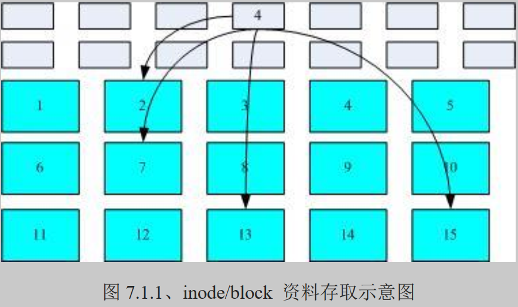
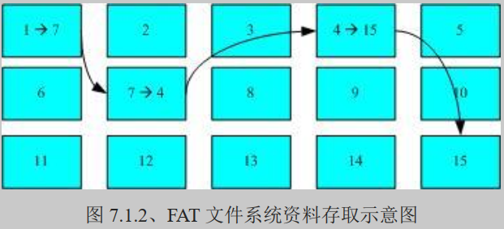
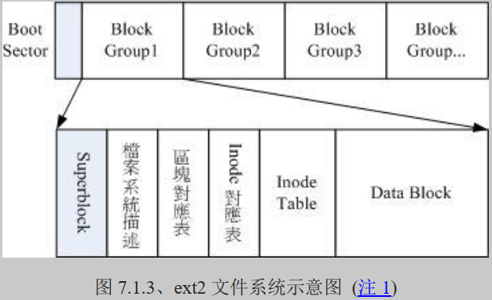
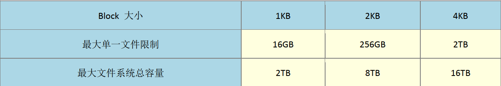
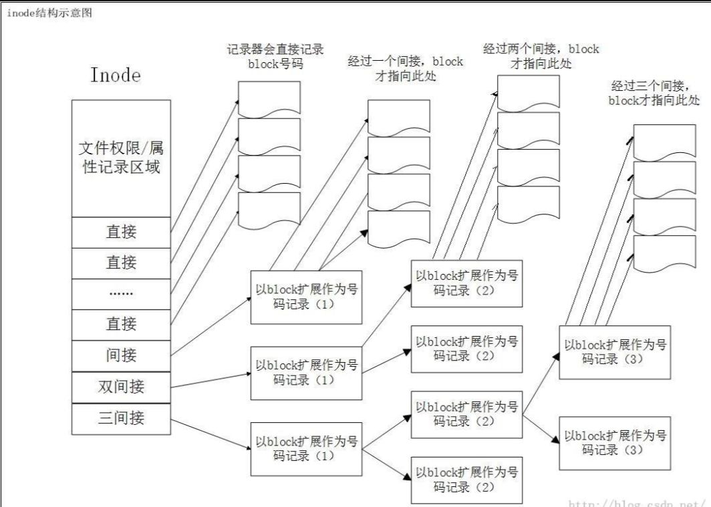
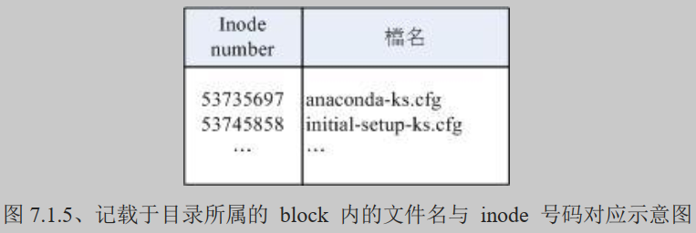
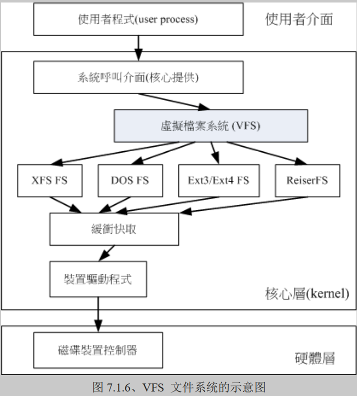

# 文件系统特性

我们都知道磁盘分区完毕后还需要进行格式化（format），之后操作系统才能够使用这个文件系统。 为什么需要进行“格式化”呢？这是因为每种操作系统所设置的文件属性/权限并不相同， 为了存放这些文件所需的数据，因此就需要将分区进行格式化，以成为操作系统能够利用的“文件系统格式（filesystem）”。

由此我们也能够知道，每种操作系统能够使用的文件系统并不相同。 举例来说，windows 98 以前的微软操作系统主要利用的文件系统是 FAT （或 FAT16），windows 2000 以后的版本有所谓的 NTFS 文件系统，至于 Linux 的正统文件系统则为 Ext2 （Linux second extended file system, ext2fs）这一个。此外，在默认的情况下，windows 操作系统是不会认识 Linux 的 Ext2 的。

## 基本概念

传统的磁盘与文件系统之应用中，一个分区就只能被格式化成为一个文件系统，所以我们可以说一个 filesystem 就是一个 partition。但是由于新技术的利用，例如我们常听到的LVM与软件磁盘阵列（software raid）， 这些技术可以将一个分区格式化为多个文件系统（例如LVM），也能够将多个分区合成一个文件系统（LVM, RAID）！ 所以说，目前我们在格式化时已经不再说成针对 partition 来格式化了， 通常我们称呼一个可挂载的数据实体为一个文件系统而不是一个分区喔！

你总结得非常好，这里再补充一些相关的详细信息，以便更全面了解文件系统、分区、LVM 和软件 RAID 的关系。

**传统分区和文件系统**

在传统的磁盘管理中，一个分区通常对应一个文件系统。磁盘被划分成多个分区，每个分区可以被格式化为不同的文件系统类型，比如 ext4、NTFS、FAT32 等。每个格式化过的分区就成为一个文件系统，可以被挂载到系统中的某个目录下。

**LVM（Logical Volume Manager）**

LVM 提供了一种比传统分区更灵活的磁盘管理方式。它抽象了物理存储设备，使得管理存储空间更加灵活和动态。LVM 的主要概念包括：

1. 物理卷（PV，Physical Volume）：指的是实际的磁盘分区或设备。
2. 卷组（VG，Volume Group）：由一个或多个物理卷组成的存储池。
3. 逻辑卷（LV，Logical Volume）：从卷组中分配出来的存储空间，可以被格式化为文件系统。

LVM 的优点包括：
- 可以方便地扩展和缩减卷组和逻辑卷的大小。
- 可以在不影响数据的情况下重新配置存储。
- 支持创建快照，便于备份和恢复。

**软件 RAID**

软件 RAID 使用操作系统的软件能力来实现 RAID（独立磁盘冗余阵列），并不依赖于硬件 RAID 控制器。常见的软件 RAID 类型包括 RAID 0、RAID 1、RAID 5、RAID 6 等。每种类型提供不同的性能和冗余特性。

- RAID 0：条带化，提供较高的性能，但没有冗余。
- RAID 1：镜像，提供冗余但性能有所损失。
- RAID 5 和 RAID 6：条带化加奇偶校验，提供冗余和性能的平衡。

软件 RAID 可以将多个物理分区组合成一个逻辑的文件系统，在设备失效时提供冗余保护。

**文件系统的抽象**

由于 LVM 和软件 RAID 技术的引入，我们现在通常将文件系统视为一种挂载的数据实体，而不再将其严格限定为单个分区。这种抽象使得磁盘空间管理更加灵活和高效。具体来说：

- 多个分区合成一个文件系统：如在软件 RAID 中，多个物理分区可以被组合成一个单一的逻辑文件系统。
- 一个分区多个文件系统：如在 LVM 中，一个物理分区被当作多个逻辑卷的一部分，每个逻辑卷可以被格式化为不同的文件系统。

**结论**

现代的存储管理技术（如 LVM 和软件 RAID）已经大大扩展了传统分区和文件系统的概念，使得文件系统可以更加灵活地管理底层存储资源。这种灵活性不仅提高了存储的利用率，还增加了系统的可靠性和可扩展性。你总结得非常到位，确实，现在我们更多地关注文件系统本身，而不再只是关注其底层的物理分区。


## 文件系统运行

那么文件系统是如何运行的呢？较新的操作系统的文件数据除了文件实际内容外， 通常含有非常多的属性，例如 Linux 操作系统的文件权限（rwx）与文件属性（拥有者、群组、时间参数等）。 文件系统通常会将这两部份的数据分别存放在不同的区块，权限与属性放置到 inode 中，至于实际数据则放置到 data block 区块中。 另外，还有一个超级区块 （superblock） 会记录整个文件系统的整体信息，包括 inode 与 block 的总量、使用量、剩余量等。

每个 inode 与 block 都有编号，至于这三个数据的意义可以简略说明如下：

- superblock：记录此 filesystem 的整体信息，包括inode/block的总量、使用量、剩余量， 以及文件系统的格式与相关信息等；
- inode：记录文件的属性，一个文件占用一个inode，同时记录此文件的数据所在的 block 号码；
- block：实际记录文件的内容，若文件太大时，会占用多个 block 。

由于每个 inode 与 block 都有编号，而每个文件都会占用一个 inode ，inode 内则有文件数据放置的 block 号码。 因此，我们可以知道的是，如果能够找到文件的 inode 的话，那么自然就会知道这个文件所放置数据的 block 号码， 当然也就能够读出该文件的实际数据了。

我们将 inode 与 block 区块用图解来说明一下，如下图所示，文件系统先格式化出 inode 与 block 的区块，假设某一个文件的属性与权限数据是放置到 inode 4 号（下图较小方格内），而这个 inode 记录了文件数据的实际放置点为 2, 7, 13, 15 这四个 block 号码，此时我们的操作系统就能够据此来排列磁盘的读取顺序，可以一口气将四个 block 内容读出来！ 那么数据的读取就如同下图中的箭头所指定的模样了。



## 文件系统的数据块（Block）

"Blocks" 这个术语用于表示分区的大小，但这个大小是以一定数量的扇区为单位计算的。这里的 "块" 是一个简化的计量单位，以帮助用户更容易地理解分区的大小。

扇区是磁盘存储的最小物理单位，在大多数现代硬盘上，扇区的大小是 512 字节或者在更高容量的磁盘上是 4096(4K) 字节。磁盘上所有的数据读写都是以扇区为单位进行的。

块通常是文件系统级别的概念，是文件系统进行数据读写的基本单位，它由多个扇区组成。在 `fdisk` 输出中的 "Blocks"，这个词实际上是指磁盘上相应分区的存储容量，它通常以 512 字节的计量单位表示（即一个块等于一个扇区）。

**特性：**

- 数据块的大小是由文件系统决定的，常见的大小有1KB、2KB、4KB等。
- 数据块是文件系统级别的概念，不同的文件系统可以有不同的块大小。
- 数据块可能包含多个物理磁盘的扇区。

**关联性**

- **映射关系**：文件系统中的数据块是由多个物理磁盘的扇区组成的。例如，如果文件系统的块大小为4KB，而磁盘的扇区大小为512字节，那么一个数据块将包含8个物理扇区（4KB/512B=8）。
- **读写操作**：当文件系统请求读取或写入一个数据块时，磁盘驱动器会负责将这个请求转换为相应的物理扇区读写操作。也就是说，文件系统处理的是数据块，而磁盘驱动器处理的是扇区。
- **优化**：文件系统的设计通常会考虑磁盘的物理特性，以提高效率。例如，数据块的大小选择通常会考虑到磁盘的性能特点，以减少磁盘的读写次数。


这种数据存取的方法我们称为索引式文件系统（indexed allocation）。那有没有其他的惯用文件系统可以比较一下啊？ 有的，那就是我们惯用的U盘（闪存），U盘使用的文件系统一般为 FAT 格式。FAT 这种格式的文件系统并没有 inode 存在，所以 FAT 没有办法将这个文件的所有 block 在一开始就读取出来。每个 block 号码都记录在前一个 block 当中， 他的读取方式有点像下面这样：



上图中我们假设文件的数据依序写入1->7->4->15号这四个 block 号码中， 但这个文件系统没有办法一口气就知道四个 block 的号码，他得要一个一个的将 block 读出后，才会知道下一个 block 在何处。 如果同一个文件数据写入的 block 分散的太过厉害时，则我们的磁头将无法在磁盘转一圈就读到所有的数据， 因此磁盘就会多转好几圈才能完整的读取到这个文件的内容！

常常会听到所谓的“磁盘重组”吧？ 需要磁盘重组的原因就是文件写入的 block 太过于离散了，此时文件读取的性能将会变的很差所致。 这个时候可以通过磁盘重组将同一个文件所属的 blocks 汇整在一起，这样数据的读取会比较容易啊！ 想当然尔，FAT 的文件系统需要三不五时的磁盘重组一下，那么 Ext2 是否需要磁盘重整呢？

由于 Ext2 是索引式文件系统，基本上不太需要常常进行磁盘重组的。但是如果文件系统使用太久， 常常删除/编辑/新增文件时，那么还是可能会造成文件数据太过于离散的问题，此时或许会需要进行重整一下的。 不过，老实说，鸟哥倒是没有在 Linux 操作系统上面进行过 Ext2/Ext3 文件系统的磁盘重组说！似乎不太需要啦！^_^

# Linux 的 EXT2 文件系统（inode）

我们介绍过 Linux 的文件除了原有的数据内容外，还含有非常多的权限与属性，这些权限与属性是为了保护每个使用者所拥有数据的隐密性。 而前一小节我们知道 filesystem 里面可能含有的 inode/block/superblock 等。为什么要谈这个呢？因为标准的 Linux 文件系统 Ext2 就是使用这种 inode 为基础的文件系统啦！

而如同前一小节所说的，inode 的内容在记录文件的权限与相关属性，至于 block 区块则是在记录文件的实际内容。 而且文件系统一开始就将 inode 与 block 规划好了，除非重新格式化（或者利用 resize2fs 等指令变更文件系统大小），否则 inode 与 block 固定后就不再变动。但是如果仔细考虑一下，如果我的文件系统高达数百GB时， 那么将所有的 inode 与 block 通通放置在一起将是很不智的决定，因为 inode 与 block 的数量太庞大，不容易管理。

为此之故，因此 Ext2 文件系统在格式化的时候基本上是区分为多个区块群组 （block group） 的，每个区块群组都有独立的 inode/block/superblock 系统。整个来说，Ext2 格式化后有点像下面这样：



在整体的规划当中，文件系统最前面有一个开机扇区（boot sector），这个开机扇区可以安装开机管理程序， 这是个非常重要的设计，因为如此一来我们就能够将不同的开机管理程序安装到个别的文件系统最前端，而不用覆盖整颗磁盘唯一的 MBR， 这样也才能够制作出多重开机的环境啊！至于每一个区块群组（block group）的六个主要内容说明如后：

## data block (数据区块)

data block 是用来放置文件内容数据地方，在 Ext2 文件系统中所支持的 block 大小有 1K, 2K 及 4K 三种而已。在格式化时 block 的大小就固定了，且每个 block 都有编号，以方便 inode 的记录啦。 不过要注意的是，由于 block 大小的差异，会导致该文件系统能够支持的最大磁盘容量与最大单一文件大小并不相同。 因为 block 大小而产生的 Ext2 文件系统限制如下：



你需要注意的是，虽然 Ext2 已经能够支持大于 2GB 以上的单一文件大小，不过某些应用程序依然使用旧的限制， 也就是说，某些程序只能够捉到小于 2GB 以下的文件而已，这就跟文件系统无关了！ 举例来说，鸟哥在环工方面的应用中有一套秀图软件称为PAVE[[3\]](https://wizardforcel.gitbooks.io/vbird-linux-basic-4e/content/59.html#ps3)， 这套软件就无法捉到鸟哥在数值模式仿真后产生的大于 2GB 以上的文件！所以后来只能找更新的软件来取代它了！

除此之外 Ext2 文件系统的 block 还有什么限制呢？有的！基本限制如下：

- 原则上，block 的大小与数量在格式化完就不能够再改变了（除非重新格式化）；
- 每个 block 内最多只能够放置一个文件的数据；
- 承上，如果文件大于 block 的大小，则一个文件会占用多个 block 数量；
- 承上，若文件小于 block ，则该 block 的剩余容量就不能够再被使用了（磁盘空间会浪费）。

如上第四点所说，由于每个 block 仅能容纳一个文件的数据而已，因此如果你的文件都非常小，但是你的 block 在格式化时却选用最大的 4K 时，可能会产生一些容量的浪费喔！

什么情况会产生上述的状况呢？例如 BBS 网站的数据啦！如果 BBS 上面的数据使用的是纯文本来记载每篇留言， 而留言内容如果都写上“如题”时，想一想，是否就会产生很多小文件了呢？

好，既然大的 block 可能会产生较严重的磁盘容量浪费，那么我们是否就将 block 大小订为 1K 即可？ 这也不妥，因为如果 block 较小的话，那么大型文件将会占用数量更多的 block ，而 inode 也要记录更多的 block 号码，此时将可能导致文件系统不良的读写性能。

所以我们可以说，在您进行文件系统的格式化之前，请先想好该文件系统预计使用的情况。 以鸟哥来说，我的数值模式仿真平台随便一个文件都好几百 MB，那么 block 容量当然选择较大的！至少文件系统就不必记录太多的 block 号码，读写起来也比较方便啊！

## inode table (inode 表格)

再来讨论一下 inode 这个玩意儿吧！如前所述 inode 的内容在记录文件的属性以及该文件实际数据是放置在哪几号 block 内！ 基本上，inode 记录的文件数据至少有下面这些：

- 该文件的存取模式（read/write/excute）；
- 该文件的拥有者与群组（owner/group）；
- 该文件的容量；
- 该文件创建或状态改变的时间（ctime）；
- 最近一次的读取时间（atime）；
- 最近修改的时间（mtime）；
- 定义文件特性的旗标（flag），如 SetUID...；
- 该文件真正内容的指向 （pointer）；

inode 的数量与大小也是在格式化时就已经固定了，除此之外 inode 还有些什么特色呢？

- 每个 inode 大小均固定为 128 Bytes （新的 ext4 与 xfs 可设置到 256 Bytes）；
- 每个文件都仅会占用一个 inode 而已；
- 承上，因此文件系统能够创建的文件数量与 inode 的数量有关；
- 系统读取文件时需要先找到 inode，并分析 inode 所记录的权限与使用者是否符合，若符合才能够开始实际读取 block 的内容。

我们约略来分析一下 EXT2 的 inode / block 与文件大小的关系好了。inode 要记录的数据非常多，但偏偏又只有 128Bytes 而已， 而 inode 记录一个 block 号码要花掉 4Byte ，假设我一个文件有 400MB 且每个 block 为 4K 时， 那么至少也要十万笔 block 号码的记录呢！inode 哪有这么多可记录的信息？为此我们的系统很聪明的将 inode 记录 block 号码的区域定义为12个直接，一个间接, 一个双间接与一个三间接记录区。这是啥？我们将 inode 的结构画一下好了。



上图最左边为 inode 本身 （128 Bytes），里面有 12 个直接指向 block 号码的对照，这 12 笔记录就能够直接取得 block 号码啦！ 至于所谓的间接就是再拿一个 block 来当作记录 block 号码的记录区，如果文件太大时， 就会使用间接的 block 来记录号码。如上图中间接只是拿一个 block 来记录额外的号码而已。 同理，如果文件持续长大，那么就会利用所谓的双间接，第一个 block 仅再指出下一个记录号码的 block 在哪里， 实际记录的在第二个 block 当中。依此类推，三间接就是利用第三层 block 来记录号码啦！

这样子 inode 能够指定多少个 block 呢？我们以较小的 1K block 来说明好了，可以指定的情况如下：

- 12 个直接指向： `12*1K=12K` 由于是直接指向，所以总共可记录 12 笔记录，因此总额大小为如上所示；
- 间接： `256*1K=256K` 每笔 block 号码的记录会花去 4Bytes，因此 1K 的大小能够记录 256 笔记录，因此一个间接可以记录的文件大小如上；
- 双间接： `256*256*1K=2562K` 第一层 block 会指定 256 个第二层，每个第二层可以指定 256 个号码，因此总额大小如上；
- 三间接： `256*256*256*1K=2563K` 第一层 block 会指定 256 个第二层，每个第二层可以指定 256 个第三层，每个第三层可以指定 256 个号码，因此总额大小如上；
- 总额：将直接、间接、双间接、三间接加总，得到 `12 + 256 + 256*256 + 256*256*256 （K） = 16GB`

此时我们知道当文件系统将 block 格式化为 1K 大小时，能够容纳的最大文件为 16GB，比较一下[文件系统限制表](https://wizardforcel.gitbooks.io/vbird-linux-basic-4e/Text/index.html#filesystem_limit)的结果可发现是一致的！但这个方法不能用在 2K 及 4K block 大小的计算中， 因为大于 2K 的 block 将会受到 Ext2 文件系统本身的限制，所以计算的结果会不太符合之故。

**Tips** 如果你的 Linux 依旧使用 Ext2/Ext3/Ext4 文件系统的话，例如鸟哥之前的 CentOS 6.x 系统，那么默认还是使用 Ext4 的文件系统喔！ Ext4 文件系统的 inode 容量已经可以扩大到 256Bytes 了，更大的 inode 容量，可以纪录更多的文件系统信息，包括新的 ACL 以及 SELinux 类型等， 当然，可以纪录的单一文件大小达 16TB 且单一文件系统总容量可达 1EB 哩！


## superblock (超级区块)

Superblock 是记录整个 filesystem 相关信息的地方， 没有 Superblock ，就没有这个 filesystem 了。他记录的信息主要有：

- block 与 inode 的总量；
- 未使用与已使用的 inode / block 数量；
- block 与 inode 的大小 （block 为 1, 2, 4K，inode 为 128Bytes 或 256Bytes）；
- filesystem 的挂载时间、最近一次写入数据的时间、最近一次检验磁盘 （fsck） 的时间等文件系统的相关信息；
- 一个 valid bit 数值，若此文件系统已被挂载，则 valid bit 为 0 ，若未被挂载，则 valid bit 为 1 。

Superblock 是非常重要的，因为我们这个文件系统的基本信息都写在这里，因此，如果 superblock 死掉了， 你的文件系统可能就需要花费很多时间去挽救啦！一般来说， superblock 的大小为 1024Bytes。相关的 superblock 讯息我们等一下会以 [dumpe2fs](https://wizardforcel.gitbooks.io/vbird-linux-basic-4e/Text/index.html#dumpe2fs) 指令来调用出来观察喔！

此外，每个 block group 都可能含有 superblock 喔！但是我们也说一个文件系统应该仅有一个 superblock 而已，那是怎么回事啊？ 事实上除了第一个 block group 内会含有 superblock 之外，后续的 block group 不一定含有 superblock ， 而若含有 superblock 则该 superblock 主要是做为第一个 block group 内 superblock 的备份咯，这样可以进行 superblock 的救援呢！


## Group Desc. （块组描述符）

这个区段可以描述块组信息


## block bitmap （区块对照表）

如果你想要新增文件时总会用到 block 吧！那你要使用哪个 block 来记录呢？当然是选择“空的 block ”来记录新文件的数据啰。 那你怎么知道哪个 block 是空的？这就得要通过 block bitmap 的辅助了。从 block bitmap 当中可以知道哪些 block 是空的，因此我们的系统就能够很快速的找到可使用的空间来处置文件啰。

同样的，如果你删除某些文件时，那么那些文件原本占用的 block 号码就得要释放出来， 此时在 block bitmap 当中相对应到该 block 号码的标志就得要修改成为“未使用中”啰！这就是 bitmap 的功能。


## inode bitmap （inode 对照表）

这个其实与 block bitmap 是类似的功能，只是 block bitmap 记录的是使用与未使用的 block 号码， 至于 inode bitmap 则是记录使用与未使用的 inode 号码啰！


## dumpe2fs： 查询 Ext 家族 superblock 信息的指令

了解了文件系统的概念之后，再来当然是观察这个文件系统啰！刚刚谈到的各部分数据都与 block 号码有关！ 每个区段与 superblock 的信息都可以使用 dumpe2fs 这个指令来查询的！不过很可惜的是，我们的 CentOS 7 现在是以 xfs 为默认文件系统， 所以目前你的系统应该无法使用 dumpe2fs 去查询任何文件系统的。没关系，鸟哥先找自己的一部机器来跟大家介绍， 你可以在后续的格式化内容讲完之后，自己切出一个 ext4 的文件系统去查询看看即可。鸟哥这块文件系统是 1GB 的容量，使用默认方式来进行格式化的， 观察的内容如下：

```shell
[root@study ~]# dumpe2fs [-bh] 设备文件名
选项与参数：
-b ：列出保留为坏轨的部分（一般用不到吧！？）
-h ：仅列出 superblock 的数据，不会列出其他的区段内容！

范例：鸟哥的一块 1GB ext4 文件系统内容
[root@study ~]# blkid   <==这个指令可以叫出目前系统有被格式化的设备
/dev/vda1: LABEL="myboot" UUID="ce4dbf1b-2b3d-4973-8234-73768e8fd659" TYPE="xfs"
/dev/vda2: LABEL="myroot" UUID="21ad8b9a-aaad-443c-b732-4e2522e95e23" TYPE="xfs"
/dev/vda3: UUID="12y99K-bv2A-y7RY-jhEW-rIWf-PcH5-SaiApN" TYPE="LVM2_member"
/dev/vda5: UUID="e20d65d9-20d4-472f-9f91-cdcfb30219d6" TYPE="ext4"  <==看到 ext4 了！

[root@study ~]# dumpe2fs /dev/vda5
dumpe2fs 1.42.9 （28-Dec-2013）
Filesystem volume name:   <none>           # 文件系统的名称（不一定会有）
Last mounted on:          <not available>  # 上一次挂载的目录位置
Filesystem UUID:          e20d65d9-20d4-472f-9f91-cdcfb30219d6
Filesystem magic number:  0xEF53           # 上方的 UUID 为 Linux 对设备的定义码
Filesystem revision #:    1 （dynamic）      # 下方的 features 为文件系统的特征数据
Filesystem features:      has_journal ext_attr resize_inode dir_index filetype extent 64bit 
 flex_bg sparse_super large_file huge_file uninit_bg dir_nlink extra_isize
Filesystem flags:         signed_directory_hash
Default mount options:    user_xattr acl   # 默认在挂载时会主动加上的挂载参数
Filesystem state:         clean            # 这块文件系统的状态为何，clean 是没问题
Errors behavior:          Continue
Filesystem OS type:       Linux
Inode count:              65536            # inode 的总数
Block count:              262144           # block 的总数
Reserved block count:     13107            # 保留的 block 总数
Free blocks:              249189           # 还有多少的 block 可用数量
Free inodes:              65525            # 还有多少的 inode 可用数量
First block:              0
Block size:               4096             # 单个 block 的容量大小
Fragment size:            4096
Group descriptor size:    64
....（中间省略）....
Inode size:               256              # inode 的容量大小！已经是 256 了喔！
....（中间省略）....
Journal inode:            8
Default directory hash:   half_md4
Directory Hash Seed:      3c2568b4-1a7e-44cf-95a2-c8867fb19fbc
Journal backup:           inode blocks
Journal features:         （none）
Journal size:             32M              # Journal 日志式数据的可供纪录总容量
Journal length:           8192
Journal sequence:         0x00000001
Journal start:            0

Group 0: （Blocks 0-32767）                  # 第一块 block group 位置
  Checksum 0x13be, unused inodes 8181
  Primary superblock at 0, Group descriptors at 1-1   # 主要 superblock 的所在喔！
  Reserved GDT blocks at 2-128
  Block bitmap at 129 （+129）, Inode bitmap at 145 （+145）
  Inode table at 161-672 （+161）                       # inode table 的所在喔！
  28521 free blocks, 8181 free inodes, 2 directories, 8181 unused inodes
  Free blocks: 142-144, 153-160, 4258-32767           # 下面两行说明剩余的容量有多少
  Free inodes: 12-8192
Group 1: （Blocks 32768-65535） [INODE_UNINIT]          # 后续为更多其他的 block group 喔！
....（下面省略）....
# 由于数据量非常的庞大，因此鸟哥将一些信息省略输出了！上表与你的屏幕会有点差异。
# 前半部在秀出 supberblock 的内容，包括标头名称（Label）以及inode/block的相关信息
# 后面则是每个 block group 的个别信息了！您可以看到各区段数据所在的号码！
# 也就是说，基本上所有的数据还是与 block 的号码有关就是了！很重要！
```

如上所示，利用 dumpe2fs 可以查询到非常多的信息，不过内容主要可以分为上半部是 superblock 内容， 下半部则是每个 block group 的信息。从上面的表格中我们可以观察到鸟哥这个 /dev/vda5 规划的 block 为 4K， 第一个 block 号码为 0 号，且 block group 内的所有信息都以 block 的号码来表示的。 然后在 superblock 中还有谈到目前这个文件系统的可用 block 与 inode 数量。

# 与目录树的关系

由前一小节的介绍我们知道在 Linux 系统下，每个文件（不管是一般文件还是目录文件）都会占用一个 inode ， 且可依据文件内容的大小来分配多个 block 给该文件使用。而我们知道目录的内容在记录文件名， 一般文件才是实际记录数据内容的地方。那么目录与文件在文件系统当中是如何记录数据的呢？基本上可以这样说：

## 目录

当我们在 Linux 下的文件系统创建一个目录时，文件系统会分配一个 inode 与至少一块 block 给该目录。其中，inode 记录该目录的相关权限与属性，并记录分配到的那块 block 号码； 而 block 则是记录在这个目录下的文件名与该文件名占用的 inode 号码数据。也就是说目录所占用的 block 内容在记录如下的信息：



如果想要实际观察 root 主文件夹内的文件所占用的 inode 号码时，可以使用 ls -i 这个选项来处理：

```shell
[root@study ~]# ls -li
total 8
53735697 -rw-------. 1 root root 1816 May  4 17:57 anaconda-ks.cfg
53745858 -rw-r--r--. 1 root root 1864 May  4 18:01 initial-setup-ks.cfg
```

上表的左边所列出的 inode 仅是鸟哥的系统所显示的结果而已！当你使用“ ll / ”时，出现的目录几乎都是 1024 的倍数，为什么呢？因为每个 block 的数量都是 1K, 2K, 4K 嘛！ 看一下鸟哥的环境：

```shell
[root@study ~]# ll -d / /boot /usr/sbin /proc /sys
dr-xr-xr-x.  17 root root  4096 May  4 17:56 /         <== 1 个 4K block
dr-xr-xr-x.   4 root root  4096 May  4 17:59 /boot     <== 1 个 4K block
dr-xr-xr-x. 155 root root     0 Jun 15 15:43 /proc     <== 这两个为内存内数据，不占磁盘容量
dr-xr-xr-x.  13 root root     0 Jun 15 23:43 /sys
dr-xr-xr-x.   2 root root 16384 May  4 17:55 /usr/sbin <== 4 个 4K block
```

由于鸟哥使用的 block 大小为 4K ，因此每个目录几乎都是 4K 的倍数。 其中由于 /usr/sbin 的内容比较复杂因此占用了 4 个 block ！至于奇怪的 /proc 我们在[第五章](https://wizardforcel.gitbooks.io/vbird-linux-basic-4e/Text/index.html#dir)就讲过该目录不占磁盘容量， 所以当然耗用的 block 就是 0 啰！

**Tips** 由上面的结果我们知道目录并不只会占用一个 block 而已，也就是说： 在目录下面的文件数如果太多而导致一个 block 无法容纳的下所有的文件名与 inode 对照表时，Linux 会给予该目录多一个 block 来继续记录相关的数据；


## 文件

当我们在 Linux 下的 ext2 创建一个一般文件时， ext2 会分配一个 inode 与相对于该文件大小的 block 数量给该文件。例如：假设我的一个 block 为 4 KBytes ，而我要创建一个 100 KBytes 的文件，那么 linux 将分配一个 inode 与 25 个 block 来储存该文件！ 但同时请注意，由于 inode 仅有 12 个直接指向，因此还要多一个 block 来作为区块号码的记录喔！


## 目录树读取

好了，经过上面的说明你也应该要很清楚的知道 inode 本身并不记录文件名，文件名的记录是在目录的 block 当中。 因此在[第五章文件与目录的权限](https://wizardforcel.gitbooks.io/vbird-linux-basic-4e/Text/index.html#filepermission_dir)说明中， 我们才会提到“新增/删除/更名文件名与目录的 w 权限有关”的特色！那么因为文件名是记录在目录的 block 当中， 因此当我们要读取某个文件时，就务必会经过目录的 inode 与 block ，然后才能够找到那个待读取文件的 inode 号码， 最终才会读到正确的文件的 block 内的数据。

由于目录树是由根目录开始读起，因此系统通过挂载的信息可以找到挂载点的 inode 号码，此时就能够得到根目录的 inode 内容，并依据该 inode 读取根目录的 block 内的文件名数据，再一层一层的往下读到正确的文件名。举例来说，如果我想要读取 /etc/passwd 这个文件时，系统是如何读取的呢？

```shell
[root@study ~]# ll -di / /etc /etc/passwd
 128 dr-xr-xr-x.  17 root root 4096 May  4 17:56 /
33595521 drwxr-xr-x. 131 root root 8192 Jun 17 00:20 /etc
36628004 -rw-r--r--.   1 root root 2092 Jun 17 00:20 /etc/passwd
```

在鸟哥的系统上面与 /etc/passwd 有关的目录与文件数据如上表所示，该文件的读取流程为（假设读取者身份为 dmtsai 这个一般身份使用者）：

1. / 的 inode： 通过挂载点的信息找到 inode 号码为 128 的根目录 inode，且 inode 规范的权限让我们可以读取该 block 的内容（有 r 与 x） ；

2. / 的 block： 经过上个步骤取得 block 的号码，并找到该内容有 etc/ 目录的 inode 号码 （33595521）；

3. etc/ 的 inode： 读取 33595521 号 inode 得知 dmtsai 具有 r 与 x 的权限，因此可以读取 etc/ 的 block 内容；

4. etc/ 的 block： 经过上个步骤取得 block 号码，并找到该内容有 passwd 文件的 inode 号码 （36628004）；

5. passwd 的 inode： 读取 36628004 号 inode 得知 dmtsai 具有 r 的权限，因此可以读取 passwd 的 block 内容；

6. passwd 的 block： 最后将该 block 内容的数据读出来。


## filesystem 大小与磁盘读取性能

另外，关于文件系统的使用效率上，当你的一个文件系统规划的很大时，例如 100GB 这么大时， 由于磁盘上面的数据总是来来去去的，所以，整个文件系统上面的文件通常无法连续写在一起（block 号码不会连续的意思）， 而是填入式的将数据填入没有被使用的 block 当中。如果文件写入的 block 真的分的很散， 此时就会有所谓的文件数据离散的问题发生了。

如前所述，虽然我们的 ext2 在 inode 处已经将该文件所记录的 block 号码都记上了， 所以数据可以一次性读取，但是如果文件真的太过离散，确实还是会发生读取效率低落的问题。 因为磁头还是得要在整个文件系统中来来去去的频繁读取！ 果真如此，那么可以将整个 filesystme 内的数据全部复制出来，将该 filesystem 重新格式化， 再将数据给他复制回去即可解决这个问题。

此外，如果 filesystem 真的太大了，那么当一个文件分别记录在这个文件系统的最前面与最后面的 block 号码中， 此时会造成磁盘的机械手臂移动幅度过大，也会造成数据读取性能的低落。而且磁头在搜寻整个 filesystem 时， 也会花费比较多的时间去搜寻！因此， partition 的规划并不是越大越好， 而是真的要针对您的主机用途来进行规划才行！^_^

# Linux 文件系统的运行

我们现在知道了目录树与文件系统的关系了，但是我们也知道， 所有的数据都得要载入到内存后 CPU 才能够对该数据进行处理。想一想，如果你常常编辑一个好大的文件， 在编辑的过程中又频繁的要系统来写入到磁盘中，由于磁盘写入的速度要比内存慢很多， 因此你会常常耗在等待磁盘的写入/读取上。真没效率！

为了解决这个效率的问题，因此我们的 Linux 使用的方式是通过一个称为非同步处理 （asynchronously） 的方式。所谓的非同步处理是这样的：

当系统载入一个文件到内存后，如果该文件没有被更动过，则在内存区段的文件数据会被设置为干净（clean）的。 但如果内存中的文件数据被更改过了（例如你用 nano 去编辑过这个文件），此时该内存中的数据会被设置为脏的 （Dirty）。此时所有的动作都还在内存中执行，并没有写入到磁盘中！ 系统会不定时的将内存中设置为“Dirty”的数据写回磁盘，以保持磁盘与内存数据的一致性。 你也可以利用[第四章谈到的 sync](https://wizardforcel.gitbooks.io/vbird-linux-basic-4e/Text/index.html#sync)指令来手动强迫写入磁盘。

我们知道内存的速度要比磁盘快的多，因此如果能够将常用的文件放置到内存当中，这不就会增加系统性能吗？ 没错！是有这样的想法！因此我们 Linux 系统上面文件系统与内存有非常大的关系喔：

- 系统会将常用的文件数据放置到内存的缓冲区，以加速文件系统的读/写；
- 承上，因此 Linux 的实体内存最后都会被用光！这是正常的情况！可加速系统性能；
- 你可以手动使用 sync 来强迫内存中设置为 Dirty 的文件回写到磁盘中；
- 若正常关机时，关机指令会主动调用 sync 来将内存的数据回写入磁盘内；
- 但若不正常关机（如跳电、死机或其他不明原因），由于数据尚未回写到磁盘内， 因此重新开机后可能会花很多时间在进行磁盘检验，甚至可能导致文件系统的损毁（非磁盘损毁）。


# 挂载点的意义 (mount point)

每个 filesystem 都有独立的 inode / block / superblock 等信息，这个文件系统要能够链接到目录树才能被我们使用。 将文件系统与目录树结合的动作我们称为“挂载”。 关于挂载的一些特性我们在[第二章](https://wizardforcel.gitbooks.io/vbird-linux-basic-4e/Text/index.html#partition_install)稍微提过， 重点是：挂载点一定是目录，该目录为进入该文件系统的入口。 因此并不是任何文件系统都能使用，必须要“挂载”到目录树的某个目录后，才能够使用该文件系统。

在 Linux 文件系统中，不同的文件系统（例如 XFS、ext4 等）可以通过挂载点挂载到操作系统的文件树上。

通常，在安装 CentOS 7.x 系统时，会设置以下三个主要挂载点：分别是 /, /boot, /home 三个。 那如果观察这三个目录的 inode 号码时，我们可以发现如下的情况：

```shell
[root@study ~]# ls -lid / /boot /home
128 dr-xr-xr-x. 17 root root 4096 May  4 17:56 /
128 dr-xr-xr-x.  4 root root 4096 May  4 17:59 /boot
128 drwxr-xr-x.  5 root root   41 Jun 17 00:20 /home

# 为什么 inode 号相同？
# 因为这些目录挂载在不同的文件系统上。尽管 inode 号相同，但它们属于不同的文件系统，因此实际上它们是不同的 inode。

# 输出中的17，4，5是什么意思？表示链接数
# 对于目录，这个数字表示该目录包含的子目录（包括 . 和 ..）的数量。
# 对于文件，这个数字表示指向该文件的硬链接数量。
```

看到了吧！由于 XFS filesystem 最顶层的目录之 inode 一般为 128 号，因此可以发现 /, /boot, /home 为三个不同的 filesystem 啰！ 

我们曾经提到根目录下的 . 与 .. 是相同的东西， 因为权限是一模一样嘛！如果使用文件系统的观点来看，同一个 filesystem 的某个 inode 只会对应到一个文件内容而已（因为一个文件占用一个 inode 之故）， 因此我们可以通过判断 inode 号码来确认不同文件名是否为相同的文件喔！所以可以这样看：

```shell
[root@study ~]# ls -ild /  /.  /..
128 dr-xr-xr-x. 17 root root 4096 May  4 17:56 /
128 dr-xr-xr-x. 17 root root 4096 May  4 17:56 /.
128 dr-xr-xr-x. 17 root root 4096 May  4 17:56 /..
```

上面的信息中由于挂载点均为 / ，因此三个文件 （/, /., /..） 均在同一个 filesystem 内，而这三个文件的 inode 号码均为 128 号，因此这三个文件名都指向同一个 inode 号码，当然这三个文件的内容也就完全一模一样了！ 也就是说，根目录的上层 （/..） 就是他自己！这么说，看的懂了吗？ ^_^

# 其他 Linux 支持的文件系统与 VFS

虽然 Linux 的标准文件系统是 ext2 ，且还有增加了日志功能的 ext3/ext4 ，事实上，Linux 还有支持很多文件系统格式的， 尤其是最近这几年推出了好几种速度很快的日志式文件系统，包括 SGI 的 XFS 文件系统， 可以适用更小型文件的 Reiserfs 文件系统，以及 Windows 的 FAT 文件系统等等， 都能够被 Linux 所支持喔！常见支持的文件系统有：

- 传统文件系统：ext2 / minix / MS-DOS / FAT （用 vfat 模块） / iso9660 （光盘）等等；
- 日志式文件系统： ext3 /ext4 / ReiserFS / Windows' NTFS / IBM's JFS / SGI's XFS / ZFS
- 网络文件系统： NFS / SMBFS

想要知道你的 Linux 支持的文件系统有哪些，可以查看下面这个目录：

```shell
[root@study ~]# ls -l /lib/modules/$(uname -r)/kernel/fs
```

系统目前已载入到内存中支持的文件系统则有：

```shell
[root@study ~]# cat /proc/filesystems
```

## Linux VFS (Virtual Filesystem Switch)

了解了文件系统之后，再来则是要提到，那么 Linux 的核心又是如何管理这些认识的文件系统呢？ 其实，整个 Linux 的系统都是通过一个名为 Virtual Filesystem Switch 的核心功能去读取 filesystem 的。 也就是说，整个 Linux 认识的 filesystem 其实都是 VFS 在进行管理，我们使用者并不需要知道每个 partition 上头的 filesystem 是什么～ VFS 会主动的帮我们做好读取的动作呢～

假设你的 / 使用的是 /dev/hda1 ，用 ext3 ；而 /home 使用 /dev/hda2 ，用 reiserfs 。那么你取用 /home/dmtsai/.bashrc 时，有特别指定要用的什么文件系统的模块来读取吗？ 应该是没有吧！这个就是 VFS 的功能啦！通过这个 VFS 的功能来管理所有的 filesystem， 省去我们需要自行设置读取文件系统的定义啊～方便很多！整个 VFS 可以约略用下图来说明：




# 文件系统的简单操作

## 磁盘与目录的容量

现在我们知道磁盘的整体数据是在 superblock 区块中， 但是每个各别文件的容量则在 inode当中记载的。 那在命令行下面该如何叫出这几个数据呢？ 下面就让我们来谈一谈这两个指令：  

- df： 列出文件系统的整体磁盘使用量；
- du：评估文件系统的磁盘使用量（常用在推估目录所占容量）  

### df

```shell
[root@study ~]# df [-ahikHTm] [目录或文件名]
选项与参数：
-a ： 列出所有的文件系统， 包括系统特有的 /proc 等文件系统；
-k ： 以 KBytes 的容量显示各文件系统；
-m ： 以 MBytes 的容量显示各文件系统；
-h ： 以人们较易阅读的 GBytes, MBytes, KBytes 等格式自行显示；
-H ： 以 M=1000K 取代 M=1024K 的进位方式；
-T ： 连同该 partition 的 filesystem 名称 （ 例如 xfs） 也列出；
-i ： 不用磁盘容量， 而以 inode 的数量来显示
范例一： 将系统内所有的 filesystem 列出来！
[root@localhost ~]# df -aT
Filesystem              Type        1K-blocks    Used Available Use% Mounted on
sysfs                   sysfs               0       0         0    - /sys
proc                    proc                0       0         0    - /proc
devtmpfs                devtmpfs       919620       0    919620   0% /dev
securityfs              securityfs          0       0         0    - /sys/kernel/security
tmpfs                   tmpfs          931508       0    931508   0% /dev/shm
devpts                  devpts              0       0         0    - /dev/pts
tmpfs                   tmpfs          931508    9776    921732   2% /run
tmpfs                   tmpfs          931508       0    931508   0% /sys/fs/cgroup
cgroup                  cgroup              0       0         0    - /sys/fs/cgroup/systemd
pstore                  pstore              0       0         0    - /sys/fs/pstore
cgroup                  cgroup              0       0         0    - /sys/fs/cgroup/cpuset
cgroup                  cgroup              0       0         0    - /sys/fs/cgroup/net_cls,net_prio
cgroup                  cgroup              0       0         0    - /sys/fs/cgroup/cpu,cpuacct
cgroup                  cgroup              0       0         0    - /sys/fs/cgroup/freezer
cgroup                  cgroup              0       0         0    - /sys/fs/cgroup/blkio
cgroup                  cgroup              0       0         0    - /sys/fs/cgroup/perf_event
cgroup                  cgroup              0       0         0    - /sys/fs/cgroup/pids
cgroup                  cgroup              0       0         0    - /sys/fs/cgroup/devices
cgroup                  cgroup              0       0         0    - /sys/fs/cgroup/memory
cgroup                  cgroup              0       0         0    - /sys/fs/cgroup/hugetlb
configfs                configfs            0       0         0    - /sys/kernel/config
/dev/mapper/centos-root xfs          17811456 2685608  15125848  16% /
systemd-1               -                   -       -         -    - /proc/sys/fs/binfmt_misc
debugfs                 debugfs             0       0         0    - /sys/kernel/debug
mqueue                  mqueue              0       0         0    - /dev/mqueue
hugetlbfs               hugetlbfs           0       0         0    - /dev/hugepages
fusectl                 fusectl             0       0         0    - /sys/fs/fuse/connections
/dev/sda1               xfs           1038336  193528    844808  19% /boot
tmpfs                   tmpfs          186304       0    186304   0% /run/user/0
binfmt_misc             binfmt_misc         0       0         0    - /proc/sys/fs/binfmt_misc

# 在 Linux 下面如果 df 没有加任何选项， 那么默认会将系统内所有的
# （ 不含特殊内存内的文件系统与 swap） 都以 1 KBytes 的容量来列出来！
# 至于那个 /dev/shm 是与内存有关的挂载， 先不要理他！

[root@localhost ~]# lsblk
NAME            MAJ:MIN RM  SIZE RO TYPE MOUNTPOINT
sda               8:0    0   20G  0 disk
├─sda1            8:1    0    1G  0 part /boot
└─sda2            8:2    0   19G  0 part
  ├─centos-root 253:0    0   17G  0 lvm  /
  └─centos-swap 253:1    0    2G  0 lvm  [SWAP]
sr0              11:0    1  4.3G  0 rom
```

先来说明一下范例一所输出的结果信息为：

- Filesystem： 代表文件系统的名称或挂载点。
- 1k-blocks： 文件系统的总大小，以 1K 块为单位， 可利用 -h 或 -m 来改变容量。
- Used： 已使用的空间，以 1K 块为单位。
- Available： 可用的空间，以 1K 块为单位。
- Use%： 已使用空间的百分比。
- Mounted on： 文件系统挂载点的路径。

```shell
范例二： 将容量结果以易读的容量格式显示出来
[root@localhost ~]# df -h
Filesystem               Size  Used Avail Use% Mounted on
devtmpfs                 899M     0  899M   0% /dev
tmpfs                    910M     0  910M   0% /dev/shm
tmpfs                    910M  9.6M  901M   2% /run
tmpfs                    910M     0  910M   0% /sys/fs/cgroup
/dev/mapper/centos-root   17G  2.6G   15G  16% /
/dev/sda1               1014M  189M  826M  19% /boot
tmpfs                    182M     0  182M   0% /run/user/0

# 不同于范例一， 这里会以 G/M 等容量格式显示出来， 比较容易看啦！
范例三： 将系统内的所有特殊文件格式及名称都列出来
[root@study ~]# df -aT
......见上面的输出
# 系统里面其实还有很多特殊的文件系统存在的。 那些比较特殊的文件系统几乎
# 都是在内存当中， 例如 /proc 这个挂载点。 因此， 这些特殊的文件系统
# 都不会占据磁盘空间喔！ ^_^


范例四： 将 /etc 下面的可用的磁盘容量以易读的容量格式显示
[root@localhost ~]# df -h /etc
Filesystem               Size  Used Avail Use% Mounted on
/dev/mapper/centos-root   17G  2.6G   15G  16% /
# 这个范例比较有趣一点啦， 在 df 后面加上目录或者是文件时， df
# 会自动的分析该目录或文件所在的 partition ， 并将该 partition 的容量显示出来，
# 所以， 您就可以知道某个目录下面还有多少容量可以使用了！ ^_^


范例五： 将目前各个 partition 当中可用的 inode 数量列出
[root@localhost ~]# df -ih
Filesystem              Inodes IUsed IFree IUse% Mounted on
devtmpfs                  225K   405  225K    1% /dev
tmpfs                     228K     1  228K    1% /dev/shm
tmpfs                     228K   762  227K    1% /run
tmpfs                     228K    16  228K    1% /sys/fs/cgroup
/dev/mapper/centos-root   8.5M   44K  8.5M    1% /
/dev/sda1                 512K   335  512K    1% /boot
tmpfs                     228K     1  228K    1% /run/user/0
# 这个范例则主要列出可用的 inode 剩余量与总容量。 分析一下与范例一的关系，
# 你可以清楚的发现到， 通常 inode 的数量剩余都比 block 还要多呢
```

由于 df 主要读取的数据几乎都是针对一整个文件系统， 因此读取的范围主要是在 Superblock内的信息， 所以这个指令显示结果的速度非常的快速！ 在显示的结果中你需要特别留意的是那个根目录的剩余容量！ 因为我们所有的数据都是由根目录衍生出来的， 因此当根目录的剩余容量剩下 0 时， 那你的 Linux 可能就问题很大了。  

### du

```shell
[root@study ~]# du [-ahskm] 文件或目录名称
选项与参数：
-a ： 列出所有的文件与目录容量， 因为默认仅统计目录下面的容量而已。
-h ： 以人们较易读的容量格式 （ G/M） 显示；
-s ： 列出总容量；
-S ： 列出所有子目录下的容量。
-k ： 以 KBytes 列出容量显示，这是默认值；
-m ： 以 MBytes 列出容量显示；

范例一： 列出目前目录下的所有目录大小，输出的数值数据为 1K 大小的容量单位
[root@localhost ~]# ls -la
total 48576
dr-xr-x---.  6 root root      236 Aug 25 04:17 .
dr-xr-xr-x. 19 root root      250 Aug 25  2022 ..
-rw-------.  1 root root     1260 Nov 17  2021 anaconda-ks.cfg
-rw-------.  1 root root     6917 Oct 14  2023 .bash_history
-rw-r--r--.  1 root root       18 Dec 28  2013 .bash_logout
-rw-r--r--.  1 root root      176 Dec 28  2013 .bash_profile
-rw-r--r--.  1 root root      176 Dec 28  2013 .bashrc
-rw-r--r--.  1 root root      100 Dec 28  2013 .cshrc
drwxr-xr-x   2 root root        6 Mar  6  2023 dockerfileDir
-rw-r--r--   1 root root     1282 Feb 20  2024 iptables-backup-file
-rw-r--r--   1 root root 49704960 Feb 19  2024 kubectl
drwxr-----.  3 root root       19 Nov 18  2021 .pki
-rw-r--r--.  1 root root      129 Dec 28  2013 .tcshrc
drwxr-xr-x   2 root root       32 Aug 25 04:14 test
drwxr-xr-x   2 root root       20 Aug 25 04:17 test2
[root@localhost ~]# du
0       ./.pki/nssdb
0       ./.pki
0       ./dockerfileDir
8       ./test
4       ./test2
48588   .

# 直接输入 du 没有加任何选项时， 则 du 会分析“目前所在目录”
# 的文件与目录所占用的磁盘空间。 但是， 实际显示时， 仅会显示目录容量（ 不含文件） ，
# 因此 . 目录有很多文件没有被列出来， 所以全部的目录相加不会等于 . 的容量喔！
# 此外， 输出的数值数据为 1K 大小的容量单位。


范例二： 同范例一， 但是将文件的容量也列出来
[root@localhost ~]# du -a
4       ./.bash_logout
4       ./.bash_profile
4       ./.bashrc
4       ./.cshrc
4       ./.tcshrc
4       ./anaconda-ks.cfg
8       ./.bash_history
0       ./.pki/nssdb
0       ./.pki
0       ./dockerfileDir
48540   ./kubectl
4       ./iptables-backup-file
4       ./test/a.txt
4       ./test/b.txt
8       ./test
4       ./test2/a2.txt
4       ./test2
48588   .


范例三： 查看当前目录总容量
[root@localhost ~]# du -sh
48M     .
# 查看当前目录下所有目录的容量
[root@localhost ~]# du -Sh
0       ./.pki/nssdb
0       ./.pki
0       ./dockerfileDir
8.0K    ./test
4.0K    ./test2
48M     .

```

 在默认的情况下， 容量的输出是以 KB 来设计的， 如果你想要知道目录占了多少 MB ， 那么就使用 -m 这个参数即可啰！ 而如果你只想要知道该目录占了多少容量的话， 使用 -s 就可以啦！

#### ls -la和du输出容量疑问

```shell
[root@localhost ~]# ls -la
total 48576 # total 48576: 当前目录中文件和目录的总大小（以1K块为单位）。
dr-xr-x---.  4 root root      211 Feb 20  2024 .
dr-xr-xr-x. 19 root root      250 Aug 25  2022 ..
-rw-------.  1 root root     1260 Nov 17  2021 anaconda-ks.cfg
-rw-------.  1 root root     6917 Oct 14  2023 .bash_history
-rw-r--r--.  1 root root       18 Dec 28  2013 .bash_logout
-rw-r--r--.  1 root root      176 Dec 28  2013 .bash_profile
-rw-r--r--.  1 root root      176 Dec 28  2013 .bashrc
-rw-r--r--.  1 root root      100 Dec 28  2013 .cshrc
drwxr-xr-x   2 root root        6 Mar  6  2023 dockerfileDir # 文件或目录大小，以字节为单位。
-rw-r--r--   1 root root     1282 Feb 20  2024 iptables-backup-file
-rw-r--r--   1 root root 49704960 Feb 19  2024 kubectl
drwxr-----.  3 root root       19 Nov 18  2021 .pki
-rw-r--r--.  1 root root      129 Dec 28  2013 .tcshrc
[root@localhost ~]#
[root@localhost ~]# du
0       ./.pki/nssdb
0       ./.pki
0       ./dockerfileDir
48576   . # total 48576: 当前目录中文件和目录的总大小（以1K块为单位）。

```

为什么dockerfileDir目录在两个输出中大小不一样呢？

 `ls -la`显示的是目录本身的元数据大小，即存储目录项（文件名、inode 号码等）的空间。对于 XFS 文件系统，这个大小可能会比较小，因为 XFS 使用了更高效的存储结构。这里显示的 `6` 字节是表示存储目录元数据所需的空间。这并不反映目录内文件的总大小。这里即使目录为空，也包含`.`（当前目录）和 `..`（父目录）两个隐含的目录条目。

`du` 显示的是目录及其包含的所有文件和子目录的实际磁盘使用量。如果目录是空的，`du` 会显示为 0。你的 `dockerfileDir` 目录是空的，因此 `du` 显示为 0。


## 实体链接与符号链接：ln

### 实体链接

在前一小节当中， 我们知道几件重要的信息， 包括：

- 每个文件都会占用一个 inode ， 文件内容由 inode 的记录来指向；
- 想要读取该文件， 必须要经过目录记录的文件名来指向到正确的 inode 号码才能读取。

也就是说， 其实文件名只与目录有关， 但是文件内容则与 inode 有关。 那么想一想， 有没有可能有多个文件名对应到同一个 inode 号码呢？ 有的！ 那就是 hard link 的由来。 所以简单的说： hard link 只是在某个目录下新增一笔文件名链接到某 inode 号码的关连记录而已。举个例子来说， 假设我系统有个 /root/crontab 他是 /etc/crontab 的实体链接， 也就是说这两个文件名链接到同一个 inode ， 自然这两个文件名的所有相关信息都会一模一样（ 除了文件名之外） 。 实际的情况可以如下所示：  

```shell
[root@study ~]# ll -i /etc/crontab
34474855 -rw-r--r--. 1 root root 451 Jun 10 2014 /etc/crontab
[root@study ~]# ln /etc/crontab . <==创建实体链接的指令
[root@study ~]# ll -i /etc/crontab crontab
34474855 -rw-r--r--. 2 root root 451 Jun 10 2014 crontab
34474855 -rw-r--r--. 2 root root 451 Jun 10 2014 /etc/crontab
```

你可以发现两个文件名都链接到 34474855 这个 inode 号码， 所以您瞧瞧， 是否文件的权限/属性完全一样呢？ 因为这两个“文件名”其实是一模一样的“文件”啦！ 而且你也会发现第二个字段由原本的 1 变成 2 了！ 那个字段称为“链接”， 这个字段的意义为： “有多少个文件名链接到这个 inode 号码”的意思。 

一般来说， 使用 hard link 设置链接文件时， 磁盘的空间与 inode 的数目都不会改变！ hard link 只是在某个目录下的 block 多写入一个关连数据而已， 既不会增加 inode 也不会耗用 block 数量哩！  


### 符号链接

相对于 hard link ， Symbolic link 可就好理解多了， 基本上， Symbolic link 就是在创建一个独立的文件， 而这个文件会让数据的读取指向他 link 的那个文件的文件名！ 由于只是利用文件来做为指向的动作， 所以， 当来源文件被删除之后， symbolic link 的文件会“开不了”， 会一直说“无法打开某文件！ ”。 实际上就是找不到原始“文件名”而已啦！

举例来说， 我们先创建一个符号链接文件链接到 /etc/crontab 去看看：  

```shell
[root@study ~]# ln -s /etc/crontab crontab2
[root@study ~]# ll -i /etc/crontab /root/crontab2
34474855 -rw-r--r--. 2 root root 451 Jun 10 2014 /etc/crontab
53745909 lrwxrwxrwx. 1 root root 12 Jun 23 22:31 /root/crontab2 -> /etc/crontab
```

由上表的结果我们可以知道两个文件指向不同的 inode 号码， 当然就是两个独立的文件存在！ 而且链接文件的重要内容就是他会写上目标文件的“文件名”， 你可以发现为什么上表中链接文件的大小为 12 Bytes 呢？ 因为箭头（ -->） 右边的文件名“/etc/crontab”总共有 12 个英文， 每个英文占用 1 个 Bytes ， 所以文件大小就是 12Bytes了！

这里还是得特别留意， 这个 Symbolic Link 与 Windows 的捷径可以给他划上等号， 由Symbolic link 所创建的文件为一个独立的新的文件， 所以会占用掉 inode 与 block 喔！  

不过由于 Hard Link 的限制太多了， 包括无法做“目录”的 link ， 所以在用途上面是比较受限的！ 反而是 Symbolic Link 的使用方面较广喔！ 好了， 说的天花乱坠， 看你也差不多快要昏倒了！ 没关系， 实作一下就知道怎么回事了！ 要制作链接文件就必须要使用 ln 这个指令呢！  

```shell
[root@study ~]# ln [-sf] 来源文件 目标文件
选项与参数：
-s ： 如果不加任何参数就进行链接， 那就是hard link， 至于 -s 就是symbolic link
-f ： 如果 目标文件 存在时， 就主动的将目标文件直接移除后再创建！

```


### 关于目录的link数量

或许您已经发现了， 那就是， 当我们以 hard link 进行“文件的链接”时， 可以发现， 在 ls -l 所显示的第二字段会增加一才对， 那么请教， 如果创建目录时， 他默认的 link 数量会是多少？让我们来想一想， 一个“空目录”里面至少会存在些什么？ 呵呵！ 就是存在 . 与 .. 这两个目录啊！ 那么， 当我们创建一个新目录名称为 /tmp/testing 时， 基本上会有三个东西， 那就是： 

- /tmp/testing
- /tmp/testing/.
- /tmp/testing/..  

而其中 /tmp/testing 与 /tmp/testing/. 其实是一样的！ 都代表该目录啊～而 /tmp/testing/.. 则代表 /tmp 这个目录， 所以说， 当我们创建一个新的目录时， “新的目录的 link 数为 2 ， 而上层目录的 link 数则会增加 1 ” 不信的话， 我们来作个测试看看： 

```shell
[root@study ~]# ls -ld /tmp
drwxrwxrwt. 14 root root 4096 Jun 23 22:42 /tmp
[root@study ~]# mkdir /tmp/testing1
[root@study ~]# ls -ld /tmp
drwxrwxrwt. 15 root root 4096 Jun 23 22:45 /tmp # 这里的 link 数量加 1 了！
[root@study ~]# ls -ld /tmp/testing1
drwxr-xr-x. 2 root root 6 Jun 23 22:45 /tmp/testing1/
```

瞧！ 原本的所谓上层目录 /tmp 的 link 数量由 14 增加为 15 ， 至于新目录 /tmp/testing 则为 2
， 这样可以理解目录的 link 数量的意义了吗？ ^_^  

# 磁盘的分区、格式化、检验与挂载

对于一个系统管理者（ root ） 而言， 磁盘的的管理是相当重要的一环， 尤其近来磁盘已经渐渐的被当成是消耗品了 ..... 如果我们想要在系统里面新增一颗磁盘时， 应该有哪些动作需要做的呢：

1. 对磁盘进行分区， 以创建可用的 partition ；
2. 对该 partition 进行格式化 （ format） ， 以创建系统可用的 filesystem；
3. 若想要仔细一点， 则可对刚刚创建好的 filesystem 进行检验；
4. 在 Linux 系统上， 需要创建挂载点 （ 亦即是目录） ， 并将他挂载上来；

当然啰， 在上述的过程当中， 还有很多需要考虑的， 例如磁盘分区 （ partition） 需要定多大？ 是否需要加入 journal 的功能？ inode 与 block 的数量应该如何规划等等的问题。 但是这些问题的决定， 都需要与你的主机用途来加以考虑的～所以， 在这个小节里面， 鸟哥仅会介绍几个动作而已， 更详细的设置值， 则需要以你未来的经验来参考啰！  

## 观察磁盘分区状态


## 磁盘分区： gdisk/fdisk

接下来我们想要进行磁盘分区啰！ 要注意的是： “MBR 分区表请使用 fdisk 分区， GPT 分区表请使用 gdisk 分区！ ” 这个不要搞错～否则会分区失败的！ 另外， 这两个工具软件的操作很类似， 执行了该软件后， 可以通过该软件内部的说明数据来操作， 因此不需要硬背！ 只要知道方法即可。 刚刚从上面 parted 的输出结果， 我们也知道鸟哥这个测试机使用的是 GPT 分区， 因此下面通通得要使用 gdisk 来分区才行！  

### gdisk


### fdisk


## 磁盘格式化（ 创建文件系统）

分区完毕后自然就是要进行文件系统的格式化啰！ 格式化的指令非常的简单， 那就是“makefilesystem, mkfs” 这个指令啦！ 这个指令其实是个综合的指令， 他会去调用正确的文件系统格式化工具软件！ 因为 CentOS 7 使用 xfs 作为默认文件系统， 下面我们会先介绍 mkfs.xfs ，之后介绍新一代的 EXT 家族成员 mkfs.ext4， 最后再聊一聊 mkfs 这个综合指令吧！  


## 文件系统检验


## 文件系统挂载与卸载

我们在本章一开始时的挂载点的意义当中提过挂载点是目录， 而这个目录是进入磁盘分区（ 其实是文件系统啦！ ） 的入口就是了。 不过要进行挂载前， 你最好先确定几件事：  

- 单一文件系统不应该被重复挂载在不同的挂载点（ 目录） 中；  
- 单一目录不应该重复挂载多个文件系统；  
- 要作为挂载点的目录， 理论上应该都是空目录才是。  

尤其是上述的后两点！ 如果你要用来挂载的目录里面并不是空的， 那么挂载了文件系统之后， 原目录下的东西就会暂时的消失。 举个例子来说， 假设你的 /home 原本与根目录 （ /）在同一个文件系统中， 下面原本就有 /home/test 与 /home/vbird 两个目录。 然后你想要加入新的磁盘， 并且直接挂载 /home 下面， 那么当你挂载上新的分区时， 则 /home 目录显示的是新分区内的数据， 至于原先的 test 与 vbird 这两个目录就会暂时的被隐藏掉了！ 注意喔！ 并不
是被覆盖掉， 而是暂时的隐藏了起来， 等到新分区被卸载之后， 则 /home 原本的内容就会再次的跑出来啦！

而要将文件系统挂载到我们的 Linux 系统上， 就要使用 mount 这个指令啦！ 不过， 这个指令
真的是博大精深～粉难啦！ 我们学简单一点啊～ ^_^  


