> 《计算机组成原理》第三版 唐朔飞

# 第1章 计算机系统概论

## 计算机的基本组成

1945 年，数学家冯·诺依曼 (von Neumann) 在研究 EDVAC 机时提出了“存储程序”的概念。以此概念为基础的各类计算机通称为冯·诺依曼机，它的特点可归结如下：

- 计算机由运算器、控制器、存储器、输入设备和输出设备五大部件组成。
- 指令和数据以同等地位存放于存储器内，并可按地址寻访。
- 指令和数据均用二进制数表示。
- 指令由操作码和地址码组成，操作码用来表示操作的性质，地址码用来表示操作数在存储器中的位置。
- 指令在存储器内按顺序存放。通常，指令是顺序执行的，在特定条件下，可根据运算结果或根据设定的条件改变执行顺序。
- 机器以运算器为中心，输入输出设备与存储器间的数据传送通过运算器完成。

典型的冯·诺依曼计算机是以运算器为中心的，如图 1.7 所示。现代的计算机已转化为以存储器为中心，如图 1.8 所示。  

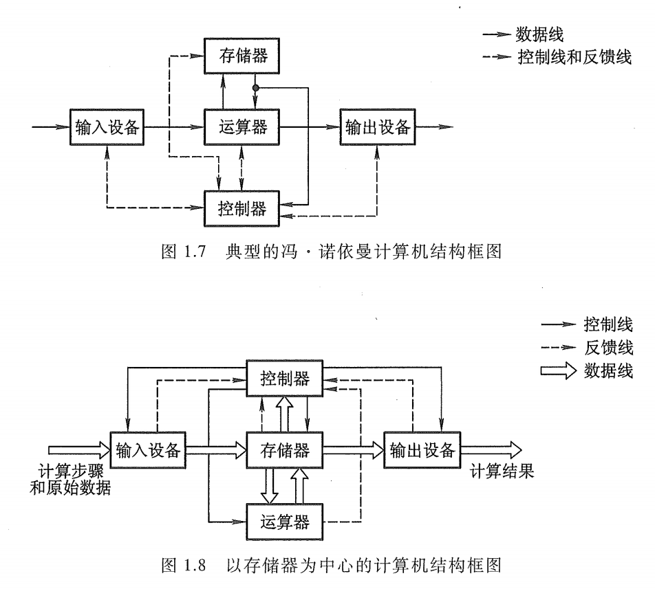

图中各部件的功能如下：

- 运算器用来完成算术运算和逻辑运算，并将运算的中间结果暂存在运算器内。
- 存储器用来存放数据和程序。
- 控制器用来控制、指挥程序和数据的输入、运行以及处理运算结果。
- 输入设备用来将人们熟悉的信息形式转换为机器能识别的信息形式，常见的有键盘、鼠标等。
- 输出设备可将机器运算结果转换为人们熟悉的信息形式，如打印机输出、显示器输出等。

计算机的五大部件（又称五大子系统）在控制器的统一指挥下，有条不紊地自动工作。

由于运算器和控制器在逻辑关系和电路结构上联系十分紧密，尤其在大规模集成电路制作工艺出现后，这两大部件往往集成在同一芯片上，因此，通常将它们合起来统称为中央处理器(Central Processing Unit, CPU) ，把输入设备与输出设备简称为 I/O 设备 (Input/Output Equipment) 。

这样，现代计算机可认为由三大部分组成：CPU、I/O 设备及主存储器 (Main Memory, MM)，如图 1.9 所示。 CPU 与主存储器合起来又可称为主机，I/O 设备又可称为外部设备。  

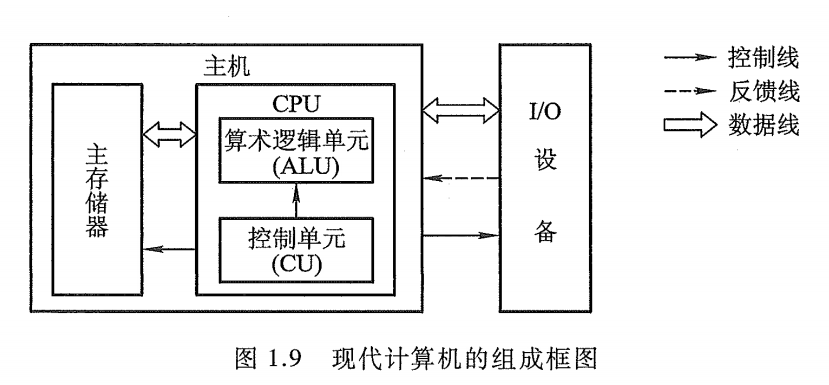

图 1.9 中的主存储器是存储器子系统中的一类，用来存放程序和数据，可以直接与 CPU 交换信息。另一类称为辅助存储器，简称辅存，又称外存，其功能参阅 4.4 节。

算术逻辑单元 (Arithmetic Logic Unit, ALU) 简称算逻部件，用来完成算术逻辑运算。控制单元 (Control Unit, CU) 用来解释存储器中的指令，并发出各种操作命令来执行指令。 ALU 和 CU是 CPU 的核心部件。

I/O 设备也受 CU 控制，用来完成相应的输入、输出操作。可见，计算机有条不紊地自动工作都是在控制器统一指挥下完成的。  

## 计算机的工作过程

为了比较形象地了解计算机的工作过程，首先分析一个比图 1.9 更细化的计算机组成框图，如图 1.11 所示。

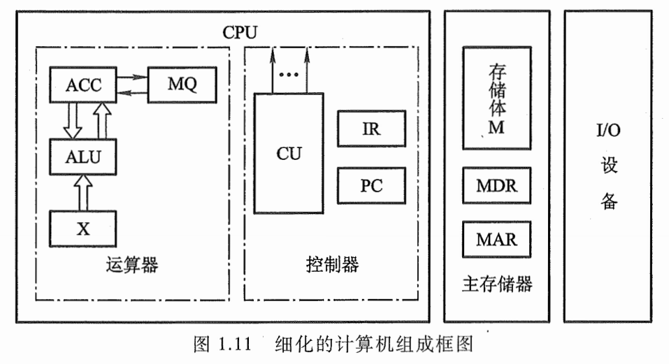

(1) 主存储器

主存储器（简称主存或内存）包括存储体 M 、各种逻辑部件及控制电路等。存储体由许多存储单元组成，每个存储单元又包含若干个存储元件（或称存储基元、存储元），每个存储元件能寄存一位二进制代码 “0” 或 “1” 。可见，一个存储单元可存储一串二进制代码，称这串二进制代码为一个存储字，这串二进制代码的位数称为存储字长。存储字长可以是 8 位、 16 位或 32 位等。一个存储字可代表一个二进制数，也可代表一串字符，如存储字为 0011 0110 0111 1101 ，既可表示为由十六进制字符组成的 367DH ，又可代表 16 位的二进制数，此值对应十进制数为 13 949 。一个存储字还可代表一条指令。

如果把一个存储体看作一幢大楼，那么每个存储单元可看作大楼中的每个房间，每个存储元可看作每个房间中的一张床位，床位有人相当于 “1” ，无人相当于 “0” 。床位数相当于存储字长。显然，每个房间都需要有一个房间编号，同样可以赋予每个存储单元一个编号，称为存储单元的地址号。

主存的工作方式就是按存储单元的地址号来实现对存储字各位的存（写入）、取（读出）。这种存取方式称为按地址存取方式，即按地址访问存储器（简称访存）。存储器的这种工作性质对计算机的组成和操作是十分有利的。例如，人们只要事先将编好的程序按顺序存入主存各单元，当运行程序时，先给出该程序在主存的首地址，然后采用程序计数器加 1 的方法，自动形成下一条指令所在存储单元的地址，机器便可自动完成整个程序的操作。又如，由于数据和指令都存放在存储体内各自所占用的不同单元中，因此，当需要反复使用某个数据或某条指令时，只要指出其相应的单元地址号即可，而不必占用更多的存储单元重复存放同一个数据或同一条指令，大大提高了存储空间的利用率。此外，由于指令和数据都由存储单元地址号来反映，因此，取一条指令和取一个数据的操作完全可视为是相同的，这样就可使用一套控制线路来完成两种截然不同的操作。  

为了能实现按地址访问的方式，主存中还必须配置两个寄存器 MAR 和 MDR 。 **MAR(Memory Address Register)** 是存储器地址寄存器，用来存放欲访问的存储单元的地址，其位数对应存储单元的个数（如 MAR 为 10 位，则有 $2^{10}$ = 1 024 个存储单元，记为 1 K) 。 **MDR(Memory Data Register)** 是存储器数据寄存器，用来存放从存储体某单元取出的代码或者准备往某存储单元存入的代码，其位数与存储字长相等。当然，要想完整地完成一个取或存操作， CPU 还得给主存加以各种控制信号，如读命令、写命令和地址译码驱动信号等。随着硬件技术的发展，主存都制成大规模集成电路的芯片，而将 MAR 和 MDR 集成在 CPU 芯片中。

早期计算机的存储字长一般和机器的指令字长与数据字长相等，故访问一次主存便可取一条指令或一个数据。随着计算机应用范围的不断扩大，解题精度的不断提高，往往要求指令字长是可变的，数据字长也要求可变。为了适应指令和数据字长的可变性，其长度不由存储字长来确定，而由字节的个数来表示。 1 个字节 (Byte) 被定义为由 8 位 (bit) 二进制代码组成。例如， 4 字节数据就是 32 位二进制代码； 2 字节构成的指令字长是 16 位二进制代码。**当然，此时存储字长、指令字长、数据字长三者可各不相同，但它们必须是字节的整数倍。**

(2) 运算器

运算器最少包括 3 个寄存器（现代计算机内部往往设有通用寄存器组）和一个算术逻辑单元 (ALU) 。其中 ACC (Accumulator) 为累加器， MQ (Multiplier-Quotient Register) 为乘商寄存器， X为操作数寄存器。这 3 个寄存器在完成不同运算时，所存放的操作数类别也各不相同。表 1.3列出了寄存器存放不同类别操作数的情况。

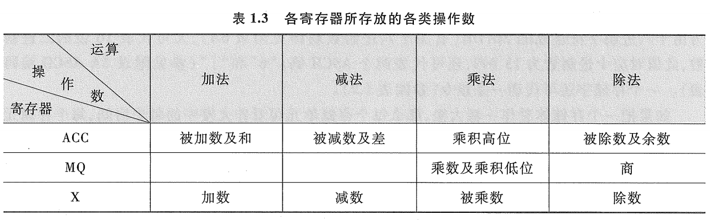

不同机器的运算器结构是不同的。图 1.11 所示的运算器可将运算结果从 ACC 送至存储器中的 MDR ；而存储器的操作数也可从 MDR 送至运算器中的 ACC 、 MQ 或 X 。有的机器用 MDR 取代 X 寄存器。

下面简要地分析一下这种结构的运算器加、减、乘、除四则运算的操作过程。

设： M 表示存储器的任一地址号，［ M ］表示对应 M 地址号单元中的内容； X 表示 X 寄存器，[X] 表示 X 寄存器中的内容； ACC 表示累加器，［ ACC] 表示累加器中的内容； MQ 表示乘商寄存器，［ MQ] 表示乘商寄存器中的内容。

假设 ACC 中已存有前一时刻的运算结果，并作为下述运算中的一个操作数，则

(3) 控制器

控制器是计算机的神经中枢，由它指挥各部件自动、协调地工作。具体而言，它首先要命令存储器读出一条指令，称为取指过程（也称取指阶段）。接着，它要对这条指令进行分析，指出该指令要完成什么样的操作，并按寻址特征指明操作数的地址，称为分析过程（也称分析阶段）。最后根据操作数所在的地址以及指令的操作码完成某种操作，称为执行过程（也称执行阶段）。 以上就是通常所说的完成一条指令操作的取指、分析和执行 3 个阶段。  

控制器由程序计数器 (Program Counter, PC) 、指令寄存器 (Instruction Register, IR) 以及控制单元 (CU) 组成。 PC 用来存放当前欲执行指令的地址，它与主存的 MAR 之间有一条直接通路，且具有自动加 1 的功能，即可自动形成下一条指令的地址。 IR 用来存放当前的指令， IR 的内容来自主存的 MDR 。 IR 中的操作码 (OP (IR) ）送至 CU ，记作 OP (IR)-+CU ，用来分析指令；其地址码 (Ad(IR) ）作为操作数的地址送至存储器的 MAR ，记作 Ad (IR) -+MAR 。 CU 用来分析当前指令所需完成的操作，并发出各种微操作命令序列，用以控制所有被控对象。

(4) I/O

I/0 子系统包括各种 I/0 设备及其相应的接口。每一种 I/0 设备都由 I/0 接口与主机联系，它接收 CU 发出的各种控制命令，并完成相应的操作。例如，键盘（输入设备）由键盘接口电路与主机联系；打印机（输出设备）由打印机接口电路与主机联系。

下面结合图 1.11 进一步深入领会计算机工作的全过程。

首先按表 1.2 所列的有序指令和数据，通过键盘输入到主存第 0 号至第 12 号单元中，并置PC 的初值为 0 （令程序的首地址为 0) 。启动机器后，计算机便自动按存储器中所存放的指令顺序有序地逐条完成取指令、分析指令和执行指令，直至执行到程序的最后一条指令为止。

例如，启动机器后，控制器立即将 PC 的内容送至主存的 MAR （记作 PC-+MAR) ，并命令存储器做读操作，此刻主存 “0” 号单元的内容 “0000010000001000" （表 1.2 所列程序的第一条指令）便被送入 MDR 内。然后由 MDR 送至控制器的 IR （记作 MDR-+IR) ，完成了一条指令的取指过程。经 CU 分析（记作 OP (IR)-+CU) ，操作码 “000001” 为取数指令，于是 CU 又将 IR 中的地址码 “0000001000“ 送至 MAR （记作 Ad(IR)-+MAR) ，并命令存储器做读操作，将该地址单元中的操作数 x 送至 MDR ，再由 MDR 送至运算器的 ACC （记作 MDR-+ACC) ，完成此指令的执行过程。此刻，也即完成了第一条取数指令的全过程，即将操作数 x 送至运算器 ACC 中。与此同时，PC 完成自动加 1 的操作，形成下一条指令的地址 ”1” 号。同上所述，由 PC 将第二条指令的地址送至 MAR ，命令存储器做读操作，将 “0001000000001001“ 送入 MDR ，又由 MDR 送至 IR 。接着CU 分析操作码 “000100" 为乘法指令，故 CU 向存储器发出读命令，取出对应地址为"0000001001“ 单元中的操作数 a ，经 MDR 送至运算器 MQ,CU 再向运算器发送乘法操作命令，完成 ax 的运算，并把运算结果 ax 存放在 ACC 中。同时 PC 又完成一次 (PC)+l-+PC ，形成下一条指令的地址 “2” 号。依次类推，逐条取指、分析、执行，直至打印出结果。最后执行完停机指令后，机器便自动停机。

## 本书结构

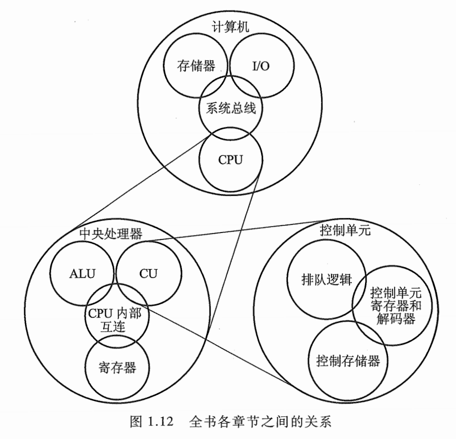

计算机硬件系统由中央处理器、存储器、 I/O 系统以及连接它们的系统总线组成。本篇介绍系统总线、存储器和I/O系统三部分，中央处理器将在第 3 篇单独讲述。

# 第3章 系统总线

## 3.1 总线的基本概念

计算机系统的五大部件之间的互连方式有两种，一种是各部件之间使用单独的连线，称为分散连接；另一种是将各部件连到一组公共信息传输线上，称为总线连接。

早期的计算机大多数用分散连接方式，如图 1.7 所示。它是以运算器为中心的结构，其内部连线十分复杂，尤其是当I/O 与存储器交换信息时，都需经过运算器，致使运算器停止运算，严重影响了 CPU 的工作效率。后来，虽然改进为以存储器为中心的如图 1.8 所示的分散连接结构， I/O 与主存交换信息可以不经过运算器，又采用了中断、 DMA 等技术，使 CPU 工作效率得到很大的提高，但是仍无法解决 I/O 设备与主机之间连接的灵活性。随着计算机应用领域的不断扩大，I/O 设备的种类和数量也越来越多，人们希望随时增添或减撤设备，用分散连接方式简直是一筹莫展，由此出现了总线连接方式。

总线是连接多个部件的信息传输线，是各部件共享的传输介质。当多个部件与总线相连时，如果出现两个或两个以上部件同时向总线发送信息，势必导致信号冲突，传输无效。因此，在某一时刻，只允许有一个部件向总线发送信息，而多个部件可以同时从总线上接收相同的信息。  

总线实际上是由许多传输线或通路组成，每条线可一位一位地传输二进制代码，一串二进制代码可在一段时间内逐一传输完成。若干条传输线可以同时传输若干位二进制代码，例如， 16条传输线组成的总线可同时传输 16 位二进制代码。

采用总线连接的计算机结构，如图 3.1 所示，它是以 CPU 为中心的双总线结构。

其中一组总线连接 CPU 和主存，称为存储总线 (M 总线）；另一组用来建立 CPU 和各 1/0 设备之间交换信息的通道，称为输入输出总线 (1/0 总线）。各种 1/0 设备通过 1/0 接口挂到 1/0总线上，更便千增删设备。这种结构在 1/0 设备与主存交换信息时仍然要占用 CPU ，因此还会影响 CPU 的工作效率。

倘若将 CPU 、主存和 1/0 设备（通过 1/0 接口）都挂到一组总线上，便形成单总线结构的计算机，如图 3.2 所示。

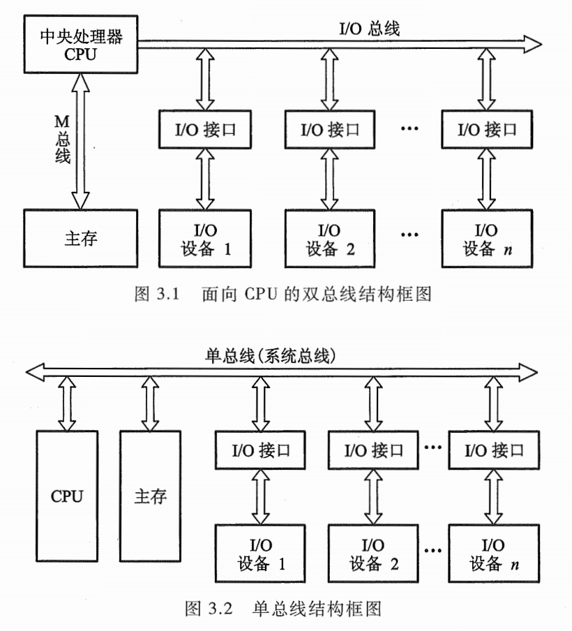

图 3.2 与图 3.1 相比，最明显的特点是当 1/0 设备与主存交换信息时，原则上不影响 CPU 的工作， CPU 仍可继续处理不访问主存或 1/0 设备的操作，这就使 CPU 工作效率有所提高。但是，因只有一组总线，当某一时刻各部件都要占用总线时，就会发生冲突。为此，必须设置总线判优逻辑，让各部件按优先级高低来占用总线，这也会影响整机的工作速度。 PDP-11 和国产 DJS183机均采用这种结构。

还有一种以存储器为中心的双总线结构，如图 3.3 所示。

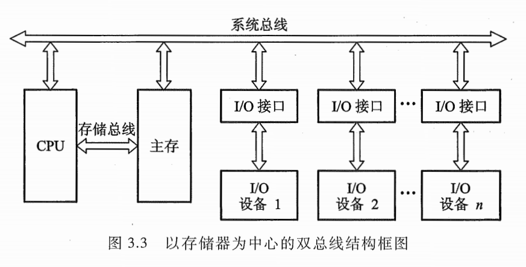

它是在单总线基础上又开辟出的一条 CPU 与主存之间的总线，称为存储总线。这组总线速度高，只供主存与 CPU 之间传输信息。这样既提高了传输效率，又减轻了系统总线的负担，还保留了 I/0 设备与存储器交换信息时不经过 CPU 的特点。国产 DJS184 机采用这种结构。

现代计算机大多数采用各类总线结构。

## 3.2 总线的分类

下面按连接部件不同，介绍三类总线。

### 片内总线

片内总线是指芯片内部的总线，如在 CPU 芯片内部，寄存器与寄存器之间、寄存器与算逻单元 ALU 之间都由片内总线连接。  

### 系统总线

系统总线是指 CPU 、主存、 1/0 设备（通过 1/0 接口）各大部件之间的信息传输线。由千这些部件通常都安放在主板或各个插件板（插卡）上，故又称板级总线（在一块电路板上各芯片间的连线）或板间总线。

按系统总线传输信息的不同，又可分为三类：数据总线、地址总线和控制总线。

1. 数据总线

数据总线用来传输各功能部件之间的数据信息，它是双向传输总线，其位数与机器字长、存储字长有关，一般为 8 位、 16 位或 32 位。数据总线的位数称为数据总线宽度，它是衡量系统性能的一个重要参数。如果数据总线的宽度为 8 位，指令字长为 16 位，那么， CPU 在取指阶段必须两次访问主存。

2. 地址总线

地址总线主要用来指出数据总线上的源数据或目的数据在主存单元的地址或 1/0 设备的地址。例如，欲从存储器读出一个数据，则 CPU 要将此数据所在存储单元的地址送到地址线上。又如，欲将某数据经 1/0 设备输出，则 CPU 除了需将数据送到数据总线外，还需将该输出设备的地址（通常都经 1/0 接口）送到地址总线上。可见，地址总线上的代码是用来指明 CPU 欲访问的存储单元或 1/0 端口的地址，由 CPU 输出，单向传输。地址线的位数与存储单元的个数有关，如地址线为 20 根，则对应的存储单元个数为 $2^{20}$。

3. 控制总线

由千数据总线、地址总线都是被挂在总线上的所有部件共享的，如何使各部件能在不同时刻占有总线使用权，需依靠控制总线来完成，因此控制总线是用来发出各种控制信号的传输线。通常对任一控制线而言，它的传输是单向的。例如，存储器读／写命令或 I/0 设备读／写命令都是由CPU 发出的。但对于控制总线总体来说，又可认为是双向的。例如，当某设备准备就绪时，便向CPU 发中断请求；当某部件（如 DMA 接口）需获得总线使用权时，也向 CPU 发出总线请求。此外，控制总线还起到监视各部件状态的作用。例如，查询该设备是处于＂忙”还是＂闲＂，是否出错等。因此对 CPU 而言，控制信号既有输出，又有输入。

常见的控制信号如下：

- 时钟：用来同步各种操作。
- 复位：初始化所有部件。
- 总线请求：表示某部件需获得总线使用权。
- 总线允许：表示需要获得总线使用权的部件已获得了控制权。
- 中断请求：表示某部件提出中断请求。
- 中断响应：表示中断请求已被接收。
- 存储器写：将数据总线上的数据写至存储器的指定地址单元内。
- 存储器读：将指定存储单元中的数据读到数据总线上。
- I/0 读：从指定的 I/0 端口将数据读到数据总线上。
- I/0 写：将数据总线上的数据输出到指定的 I/0 端口内。
- 传输响应：表示数据已被接收，或已将数据送至数据总线上。  

## 3.3 总线特性及性能指标

### 总线特性

从物理角度来看，总线由许多导线直接印制在电路板上，延伸到各个部件。图 3.4 形象地表示了各个部件与总线之间的物理摆放位置。

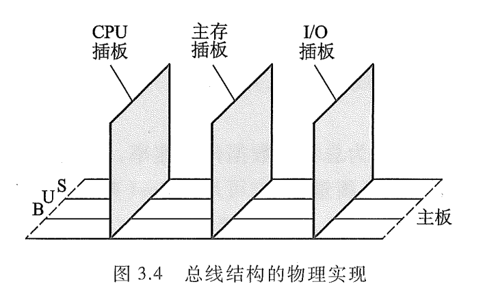

图中 CPU 、主存、 I/0 这些插板（又称插卡）通过插头与水平方向总线插槽（按总线标准用印刷电路板或一束电缆连接而成的多头插座）连接。为了保证机械上的可靠连接，必须规定其机械特性；为了确保电气上正确连接，必须规定其电气特性；为保证正确地连接不同部件，还需规定其功能特性和时间特性。随着计算机的发展， Pentium ill 以上的微型计算机已将 CPU 芯片直接安置在主板上，而且很多插卡己做成专用芯片，减少了插槽，使其结构更合理。

总线特性包括以下几项。
(1) 机械特性
机械特性是指总线在机械连接方式上的一些性能，如插头与插座使用的标准，它们的几何尺寸、形状、引脚的个数以及排列的顺序，接头处的可靠接触等。

(2) 电气特性
电气特性是指总线的每一根传输线上信号的传递方向和有效的电平范围。通常规定由CPU 发出的信号称为输出信号，送入 CPU 的信号称为输入信号。例如，地址总线属于单向输出线，数据总线属于双向传输线，它们都定义为高电平为 “1" ，低电平为 “0" 。控制总线的每一根都是单向的，但从整体看，有输入，也有输出。有的定义为高电平有效，也有的定义为低电平有效，必须注意不同的规格。大多数总线的电平定义与 TTL 是相符的，也有例外，如 RS-232C （串行总线接口标准），其电气特性规定低电平表示逻辑 “1" ，并要求电平低于－ 3 V ；用高电平表示逻辑"0" ，还要求高电平需高于＋ 3V ，额定信号电平为－ 10 V 和＋ 10 V 左右。

(3) 功能特性
功能特性是指总线中每根传输线的功能，例如，地址总线用来指出地址码；数据总线用来传递数据；控制总线发出控制信号，既有从 CPU 发出的，如存储器读／写、 1/0 设备读／写，也有 1/0设备向 CPU 发来的，如中断请求、 DMA 请求等。由此可见，各条线的功能不同。

(4) 时间特性
时间特性是指总线中的任一根线在什么时间内有效。每条总线上的各种信号互相存在一种有效时序的关系，因此，时间特性一般可用信号时序图来描述。

### 总线性能指标

总线性能指标如下：

1. 总线宽度：通常是指数据总线的根数，用 bit （位）表示，如 8 位、 16 位、 32 位、 64 位（即 8根、 16 根、 32 根、 64 根）。
2. 总线带宽：总线带宽可理解为总线的数据传输速率，即单位时间内总线上传输数据的位数，通常用每秒传输信息的字节数来衡量，单位可用 MBps （兆字节每秒）表示。例如，总线工作频率为 33 MHz ，总线宽度为 32 位 (4 B) ，则总线带宽为 33x(32+8)= 132 MBps 。
3. 时钟同步／异步：总线上的数据与时钟同步工作的总线称为同步总线，与时钟不同步工作的总线称为异步总线。
4. 总线复用：一条信号线上分时传送两种信号。例如，通常地址总线与数据总线在物理上是分开的两种总线，地址总线传输地址码，数据总线传输数据信息。为了提高总线的利用率，优化设计，特将地址总线和数据总线共用一组物理线路，在这组物理线路上分时传输地址信号和数据信号，即为总线的多路复用。
5. 信号线数：地址总线、数据总线和控制总线三种总线数的总和。
6. 总线控制方式：包括突发工作、自动配置、仲裁方式、逻辑方式、计数方式等。
7. 其他指标：如负载能力、电源电压（是采用 5V 还是 3.3 V) 、总线宽度能否扩展等。

总线的负载能力即驱动能力，是指当总线接上负载后，总线输入输出的逻辑电平是否能保持在正常的额定范围内。例如， PC 总线的输出信号为低电平时，要吸入电流，这时的负载能力即指当它吸收电流时，仍能保持额定的逻辑低电平。总线输出为高电平时，要输出电流，这时的负载能力是指当它向负载输出电流时，仍能保持额定的逻辑高电平。由千不同的电路对总线的负载是不同的，即使同一电路板在不同的工作频率下，总线的负载也是不同的，因此，总线负载能力的指标不是太严格的。通常用可连接扩增电路板数来反映总线的负载能力。

表 3.1 列出了几种流行的微机总线性能，可供参考。

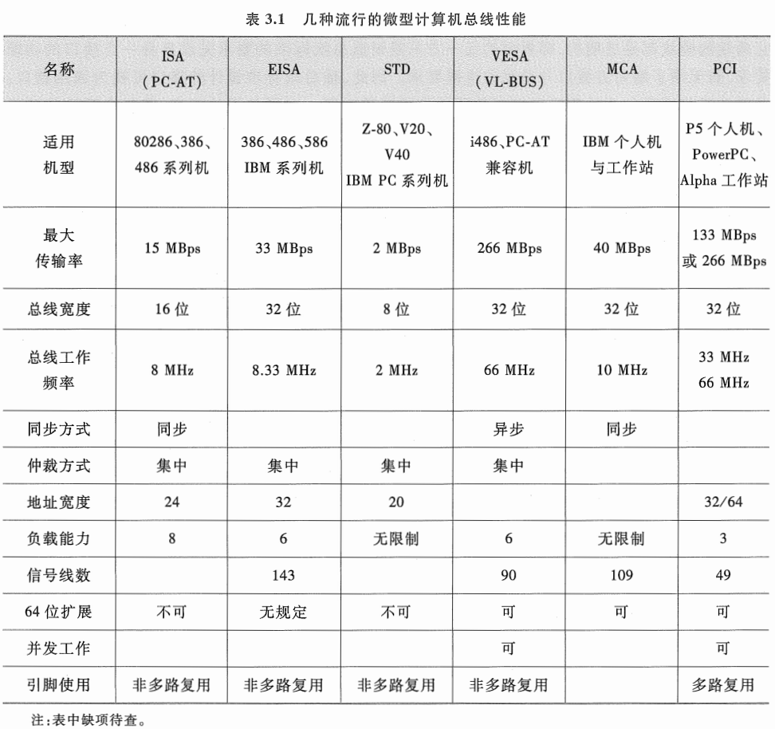

### 总线标准

总线是在计算机系统模块化的发展过程中产生的，随着计算机应用领域的不断扩大，计算机系统中各类模块（特别是 I/0 设备所带的各类接口模块）品种极其繁杂，往往一种模块要配一种总线，很难在总线上更换、组合各类模块或设备。 20 世纪 70 年代末，为了使系统设计简化，模块生产批量化，确保其性能稳定、质量可靠，实现可移化，便千维护等，人们开始研究如何使总线建立标准，在总线的统一标准下，完成系统设计、模块制作。这样，系统、模块、设备与总线之间不适应、不通用及不匹配的问题就迎刃而解了。  

所谓总线标准，可视为系统与各模块、模块与模块之间的一个互连的标准界面。这个界面对它两端的模块都是透明的，即界面的任一方只需根据总线标准的要求完成自身一方接口的功能要求，而无须了解对方接口与总线的连接要求。因此，按总线标准设计的接口可视为通用接口。采用总线标准可以为计算机接口的软硬件设计提供方便。对硬件设计而言，使各个模块的接口芯片设计相对独立；对软件设计而言，更有利于接口软件的模块化设计。  

目前流行的总线标准有以下几种。
1. ISA 总线
ISA (Industrial Standard Architecture) 总线是 IBM 为了采用全 16 位的 CPU 而推出的，又称
AT 总线，它使用独立于 CPU 的总线时钟，因此 CPU 可以采用比总线频率更高的时钟，有利于
CPU 性能的提高。由于 ISA 总线没有支持总线仲裁的硬件逻辑，因此它不能支持多台主设备
（不支持多台具有申请总线控制权的设备）系统，而且 ISA 上的所有数据的传送必须通过 CPU 或
DMA （直接存储器存取）接口来管理，因此使 CPU 花费了大量时间来控制与外部设备交换数据。
ISA 总线时钟频率为 8 MHz ，最大传输率为 16 MBps ，数据线为 16 位，地址线为 24 位。
2. EISA 总线
EISA (Extended Industrial Standard Architecture) 是一种在 ISA 基础上扩充开放的总线标准，与 ISA 可以完全兼容，从 CPU 中分离出了总线控制权，是一种具有智能化的总线，能支持多个总线主控器和突发方式（总线上可进行成块的数据传送）的传输。 EISA 总线的时钟频率为 8 MHz,最大传输率可达 33 MBps ，数据总线为 32 位，地址总线为 32 位，扩充 DMA 访问范围达 2气
3. VESA(VL-BUS) 总线
VESA 总线是由 VESA (Video Electronic Standard Association ，视频电子标准协会）提出的局部总线标准，又称为 VL-BUS(Local BUS) 总线。所谓局部总线，是指在系统外为两个以上模块提供的高速传输信息通道。 VL-BUS 是由 CPU 总线演化而来的，采用 CPU 的时钟频率达 33 MHz 、数据线为 32 位，可通过扩展槽扩展到 64 位，配有局部控制器，最大传输率达 133 MBps 。通过局部总线控制器，将高速 I/0 设备直接挂在 CPU 上，实现 CPU 与高速 I/0 设备之间的高速数据交换（参见图 3.12) 。
4. PCI 总线
随着图形用户界面 (Graphical User Inte1face, GUI) 和多媒体技术在 PC 系统中的广泛应用，
ISA 总线和 EISA 总线由于受带宽的限制，已不能适应系统工作的要求，成为整个系统的主要瓶
颈。因此对总线提出了更高的性能要求，促使总线技术进一步发展。
1991 年下半年， Intel 公司首先提出 PCI (Peripheral Component Interconnect ，外围部件互连）
总线的概念，并联合 IBM 、 Compaq 、 Apple 、 DEC 、 AST 、 HP 等计算机业界大户，成立了 PCI 集团
PCISIG (PCI Special Interest Group, PCI 专门权益组织），千 1992 年 6 月 22 日推出了 PCI 1.0 版，
1995 年和 1999 年又先后推出了 2.1 版和 2.2 版， PCI 总线已成为现代计算机中最常用的总线之
一，它的主要特点如下所述。

## 3.4 总线结构

总线结构通常可分为单总线结构和多总线结构两种。

### 单总线结构

图 3.2 是单总线结构的示意，它是将 CPU 、主存、 I/0 设备（通过 I/0 接口）都挂在一组总线上，允许 I/0 设备之间、 I/0 设备与 CPU 之间或 I/0 设备与主存之间直接交换信息。这种结构简单，也便于扩充，但所有的传送都通过这组共享总线，因此极易形成计算机系统的瓶颈。它也不允许两个以上的部件在同一时刻向总线传输信息，这就必然会影响系统工作效率的提高。这类总线多数被小型计算机或微型计算机所采用。

随着计算机应用范围不断扩大，其外部设备的种类和数量越来越多，它们对数据传输数量和传输速度的要求也就越来越高。倘若仍然采用单总线结构，那么，当 I/0 设备量很大时，总线发出的控制信号从一端逐个顺序地传递到第 n 个设备，其传播的延迟时间就会严重地影响系统的工作效率。在数据传输需求量和传输速度要求不太高的情况下，为克服总线瓶颈问题，尽可能采用增加总线宽度和提高传输速率来解决；但当总线上的设备，如高速视频显示器、网络传输接口等，其数据量很大和传输速度要求相当高的时候，单总线结构则不能满足系统工作的需要。因此，为了根本解决数据传输速率，解决 CPU 、主存与 I/0 设备之间传输速率的不匹配，实现 CPU与其他设备相对同步，不得不采用多总线结构。  

### 多总线结构

图 3.7 是双总线结构的示意图。

双总线结构的特点是将速度较低的 I/0 设备从单总线上分离出来，形成主存总线与 I/0 总线分开的结构。图中通道是一个具有特殊功能的处理器， CPU 将一部分功能下放给通道，使其对 I/0 设备具有统一管理的功能，以完成外部设备与主存储器之间的数据传送，其系统的吞吐能力可以相当大。这种结构大多用于大、中型计算机系统。  

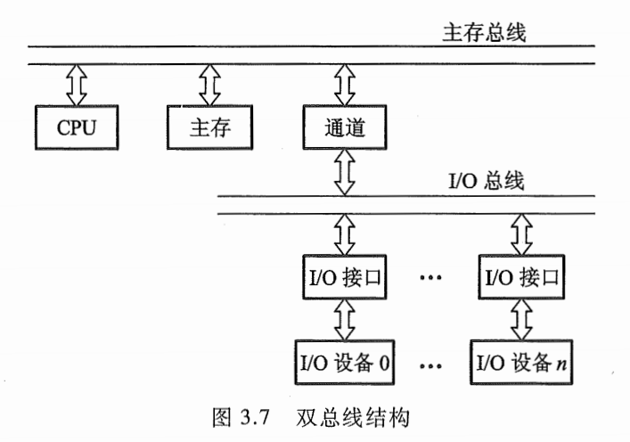

如果将速率不同的 I/0 设备进行分类，然后将它们连接在不同的通道上，那么计算机系统的工作效率将会更高，由此发展成多总线结构。

图 3.8 是三总线结构的示意图。  

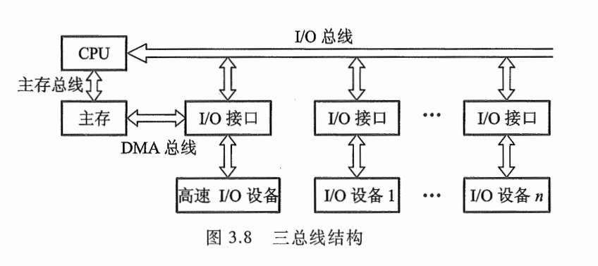

图 3.8 中主存总线用于 CPU 与主存之间的传输； I/0 总线供 CPU 与各类 I/0 设备之间传递信息； DMA 总线用千高速 I/0 设备（磁盘、磁带等）与主存之间直接交换信息。在三总线结构中，任一时刻只能使用一种总线。主存总线与 DMA 总线不能同时对主存进行存取， I/0 总线只有在CPU 执行 I/0 指令时才能用到。

图 3.9 是另一种三总线结构的示意图。
由图可见，处理器与 Cache （详见 4.3 节）之间有一条局部总线，它将 CPU 与 Cache 或与更多的局部设备连接。 Cache 的控制机构不仅将 Cache 连到局部总线上，而且还直接连到系统总线上，这样 Cache 就可通过系统总线与主存传输信息，而且 I/0 设备与主存之间的传输也不必通过CPU 。还有一条扩展总线，它将局域网、小型计算机接口 (SCSI) 、调制解调器 (Modem) 以及串行接口等都连接起来，并且通过这些接口又可与各类 I/0 设备相连，因此它可支持相当多的 I/0 设备。与此同时，扩展总线又通过扩展总线接口与系统总线相连，由此便可实现这两种总线之间的
信息传递，可见其系统的工作效率明显提高。  

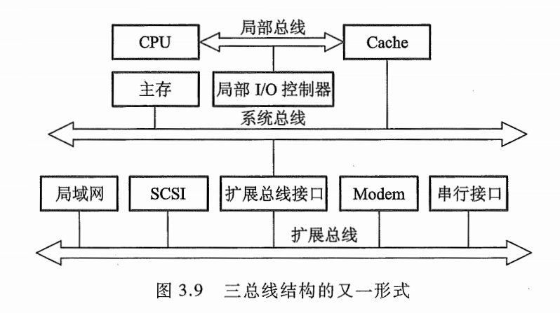

为了进一步提高 I/0 设备的性能，使其更快地响应命令，又出现了四总线结构，如图3. 10 所示。

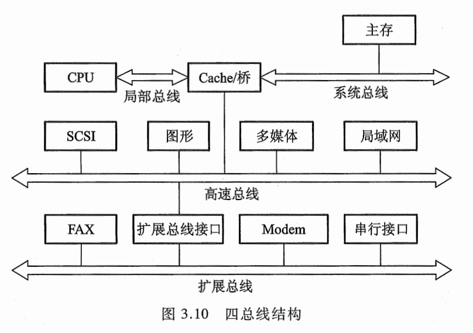

在这里又增加了一条与计算机系统紧密相连的高速总线。在高速总线上挂接了一些高速I/0 设备，如高速局域网、图形工作站、多媒体、 SCSI 等。它们通过 Cache 控制机构中的高速总线桥或高速缓冲器与系统总线和局部总线相连，使得这些高速设备与 CPU 更密切。而一些较低速的设备如图文传真 FAX 、调制解调器及串行接口仍然挂在扩展总线上，并由扩展总线接口与高速总线相连。

这种结构对高速设备而言，其自身的工作可以很少依赖 CPU ，同时它们又比扩展总线上的设备更贴近 CPU ，可见对于高性能设备与 CPU 来说，各自的效率将获得更大的提高。在这种结构中， CPU 、高速总线的速度以及各自信号线的定义完全可以不同，以至各自改变其结构也不会影响高速总线的正常工作，反之亦然。

### 总线结构举例

图 3.11 是传统微型计算机的总线结构示意图。

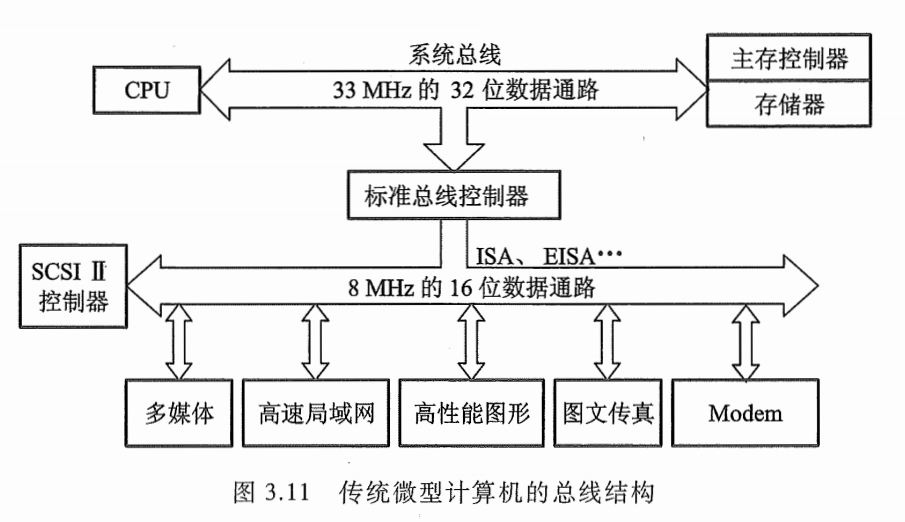

由图 3.11 中可见，不论高速局域网、高性能图形还是低速的 FAX 、 Modem 都挂接在 ISA 或EISA 总线上，并通过 ISA 或 EISA 总线控制器与系统总线相连，这样势必出现总线数据传输的瓶颈。只有将高速、高性能的外设，如高速局域网卡、高性能图形卡等尽量靠近 CPU 本身的总线，并与 CPU 同步或准同步，才可能消除瓶颈问题。这就要求改变总线结构来提高数据传送速率，为此，出现了图 3.12 的 VL-BUS 局部总线结构。

由图 3.12 中可见，将原先挂在 ISA 总线上的高速局域网卡、多媒体卡、高性能图形卡等从ISA 总线卸下来，挂到局部总线 VL-BUS 上，再与系统总线相连。而将打印机、 FAX 、 Modem 等低速设备仍挂在 ISA 总线上。局部总线 VL-BUS 就相当千在 CPU 与高速 1/0 设备之间架上了高速通道，使 CPU 与高性能外设得到充分发挥，满足了图形界面软件的要求。

由于 VL-BUS 是从 CPU 总线演化而来的，与 CPU 的关系太紧密（实际上这种总线与 486 配合最佳），以致很难支持功能更强的 CPU ，因此出现了 PCI 总线。

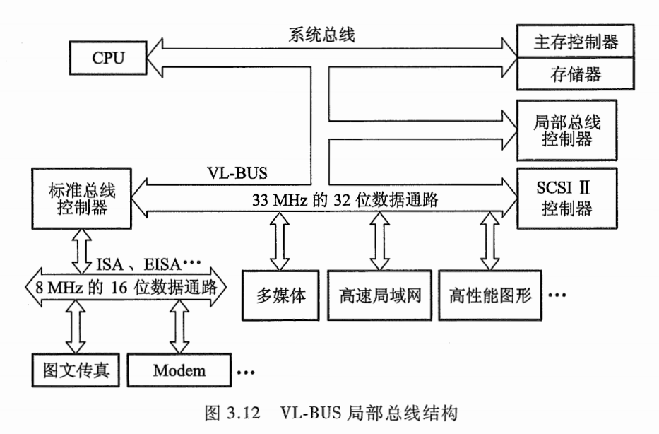

图 3.13 是 PCI 总线结构的示意图。

由图 3.13 可见， PCI 总线是通过 PCI 桥路（包括 PCI 控制器和 PCI 加速器）与 CPU 总线相连。这种结构使 CPU 总线与 PCI 总线互相隔离，具有更高的灵活性，可以支持更多的高速运行设备，而且具有即插即用的特性。当然，挂在 PCI 总线上的设备都要求数据传输速率高的设备，如多媒体卡、高速局域网适配器、高性能图形卡等，与高速 CPU 总线是相匹配的。至于低速的FAX 、 Modem 、打印机仍然挂在 ISA 、 EISA 总线上。

PCI 总线驱动能力不足时，可采用多层结构，如图 3.14 所示。

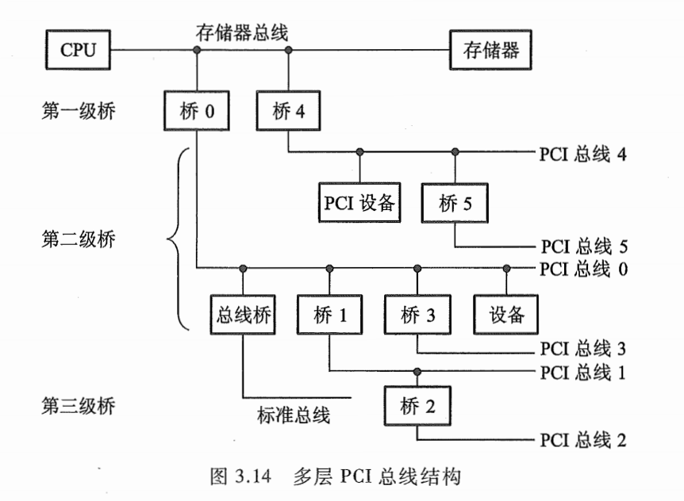

## 3.5 总线控制

由于总线上连接着多个部件，什么时候由哪个部件发送信息，如何给信息传送定时，如何防止信息丢失，如何避免多个部件同时发送，如何规定接收信息的部件等一系列问题都需要由总线控制器统一管理。它主要包括判优控制（或称仲裁逻辑）和通信控制。

### 总线判优控制

总线上所连接的各类设备，按其对总线有无控制功能可分为主设备（模块）和从设备（模块）两种。主设备对总线有控制权，从设备只能响应从主设备发来的总线命令，对总线没有控制权。总线上信息的传送是由主设备启动的，如某个主设备欲与另一个设备（从设备）进行通信时，首先由主设备发出总线请求信号，若多个主设备同时要使用总线时，就由总线控制器的判优、仲裁逻辑按一定的优先等级顺序确定哪个主设备能使用总线。只有获得总线使用权的主设备才能开始传送数据。

总线判优控制可分集中式和分布式两种，前者将控制逻辑集中在一处（如在 CPU 中），后者将控制逻辑分散在与总线连接的各个部件或设备上。

常见的集中控制优先权仲裁方式有以下三种。

(1) 链式查询
链式查询方式如图 3.15(a) 所示。图中控制总线中有 3 根线用千总线控制 (BS 总线忙、 BR 总线请求、 BG 总线同意），其中总线同意信号 BG 是串行地从一个 I/0 接口送到下一个 I/0 接口。如果 BG 到达的接口有总线请求， BG 信号就不再往下传，意味着该接口获得了总线使用权，并建立总线忙 BS 信号，表示它占用了总线。可见在链式查询中，离总线控制部件最近的设备具有最高的优先级。这种方式的特点是：只需很少几根线就能按一定优先次序实现总线控制，并且很容易扩充设备，但对电路故障很敏感，且优先级别低的设备可能很难获得请求。

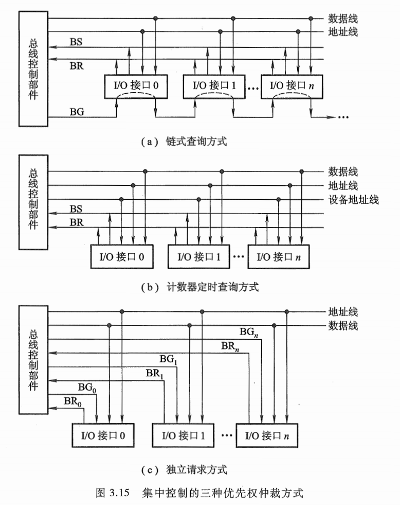

(2) 计数器定时查询

计数器定时查询方式如图 3.15 (b) 所示。与图 3.15 (a) 相比，多了一组设备地址线，少了一
根总线同意线 BG。总线控制部件接到由 BR 送来的总线请求信号后，在总线未被使用 (BS= 0)  的情况下，总线控制部件中的计数器开始计数，并通过设备地址线，向各设备发出一组地址信号。当某个请求占用总线的设备地址与计数值一致时，便获得总线使用权，此时终止计数查询。这种方式的特点是：计数可以从 “0“ 开始，此时一旦设备的优先次序被固定，设备的优先级就按0, 1, …， n 的顺序降序排列，而且固定不变；计数也可以从上一次计数的终止点开始，即是一种循环方法，此时设备使用总线的优先级相等；计数器的初始值还可由程序设置，故优先次序可以改变。这种方式对电路故障不如链式查询方式敏感，但增加了控制线（设备地址）数，控制也较复杂。

  (3) 独立请求方式

独立请求方式如图 3.15(c) 所示。由图中可见，每一台设备均有一对总线请求线 BR; 和总线同意线 BGi 。当设备要求使用总线时，便发出该设备的请求信号。总线控制部件中有一排队电路，可根据优先次序确定响应哪一台设备的请求。这种方式的特点是：响应速度快，优先次序控制灵活（通过程序改变），但控制线数量多，总线控制更复杂。链式查询中仅用两根线确定总线使用权属千哪个设备，在计数器查询中大致用 log2n 根线，其中 n 是允许接纳的最大设备数，而独立请求方式需采用 2n 根线。

### 总线通信控制

众多部件共享总线，在争夺总线使用权时，应按各部件的优先等级来解决。在通信时间上，则应按分时方式来处理，即以获得总线使用权的先后顺序分时占用总线，即哪一个部件获得使用权，此刻就由它传送，下一部件获得使用权，接着下一时刻传送。这样一个接一个轮流交替传送。

通常将完成一次总线操作的时间称为总线周期，可分为以下 4 个阶段：

1. 申请分配阶段：由需要使用总线的主模块（或主设备）提出申请，经总线仲裁机构决定下
   一传输周期的总线使用权授于某一申请者。
2. 寻址阶段：取得了使用权的主模块通过总线发出本次要访问的从模块（或从设备）的地址
   及有关命令，启动参与本次传输的从模块。
3. 传数阶段：主模块和从模块进行数据交换，数据由源模块发出，经数据总线流入目
   的模块。
4. 结束阶段：主模块的有关信息均从系统总线上撤除，让出总线使用权。

对于仅有一个主模块的简单系统，无须申请、分配和撤除，总线使用权始终归它占有。对千包含中断、 DMA 控制或多处理器的系统，还需要有其他管理机构来参与。

总线通信控制主要解决通信双方如何获知传输开始和传输结束，以及通信双方如何协调如何配合。通常用四种方式：同步通信、异步通信、半同步通信和分离式通信。

1、同步通信

通信双方由统一时标控制数据传送称为同步通信。时标通常由 CPU 的总线控制部件发出，送到总线上的所有部件；也可以由每个部件各自的时序发生器发出，但必须由总线控制部件发出的时钟信号对它们进行同步。

图 3.16 表示某个输入设备向 CPU 传输数据的同步通信过程。

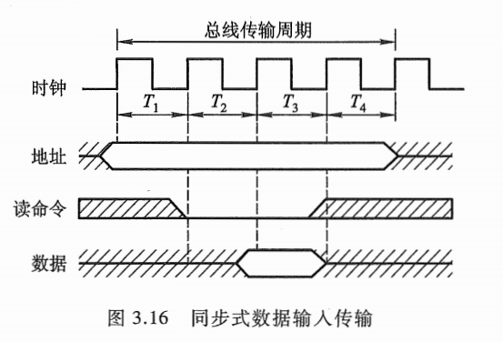

# 第4章 存储器

## 存储器的层次结构

存储器有 3 个主要性能指标：速度、容量和每位价格（简称位价）。一般来说，速度越高，位价就越高；容量越大，位价就越低，而且容量越大，速度必越低。人们追求大容量、高速度、低位价的存储器，可惜这是很难达到的。图 4.2 形象地反映了上述三者的关系。图中由上至下，位价越来越低，速度越来越慢，容量越来越大， CPU 访问的频度也越来越少。最上层的寄存器通常都制作在 CPU 芯片内。寄存器中的数直接在 CPU 内部参与运算， CPU 内可以有十几个、几十个寄存器，它们的速度最快，位价最高，容量最小。主存用来存放将要参与运行的程序和数据，其速度与 CPU 速度差距较大，为了使它们之间速度更好地匹配，在主存与 CPU之间插入了一种比主存速度更快、容量更小的高速缓冲存储器 Cache ，显然其位价要高千主存。以上三类存储器都是由速度不同、位价不等的半导体存储材料制成的，它们都设在主机内。现代计算机将 Cache 也制作在 CPU 内。磁盘、磁带属于辅助存储器，其容量比主存大得多，大都用来存放暂时未用到的程序和数据文件。  CPU 不能直接访问辅存，辅存只能与主存交换信息，因此辅存的速度可以 图 4.2 存储器速度、容量和比主存慢得多。

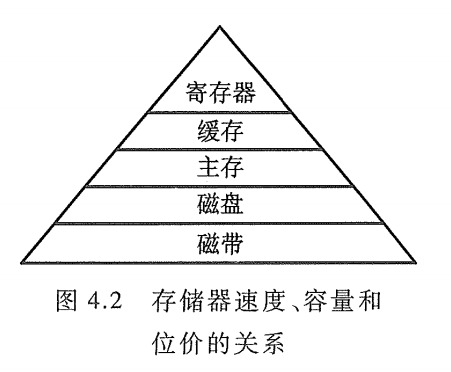

实际上，存储系统层次结构主要体现在缓存－主存和主存－辅存这两个存储层次上，如图 4.3 所示。显然， CPU 和缓存、主存都能直接交换信息；缓存能直接和 CPU 、主存交换信息；主存可以和 CPU 、缓存、辅存交换信息。

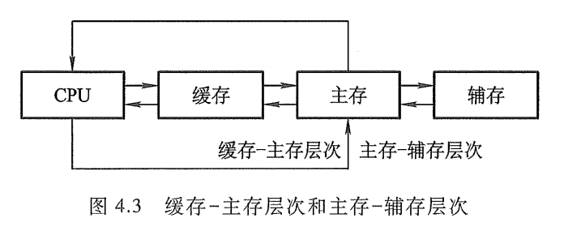

缓存－主存层次主要解决 CPU 和主存速度不匹配的间题。由千缓存的速度比主存的速度高，只要将 CPU 近期要用的信息调入缓存， CPU 便可以直接从缓存中获取信息，从而提高访存速度。但由千缓存的容量小，因此需不断地将主存的内容调入缓存，使缓存中原来的信息被替换掉。主存和缓存之间的数据调动是由硬件自动完成的，对程序员是透明的。

主存－辅存层次主要解决存储系统的容量问题。辅存的速度比主存的速度低，而且不能和CPU 直接交换信息，但它的容量比主存大得多，可以存放大量暂时未用到的信息。当 CPU 需要用到这些信息时，再将辅存的内容调入主存，供 CPU 直接访问。主存和辅存之间的数据调动是由硬件和操作系统共同完成的。

从 CPU 角度来看，缓存－主存这一层次的速度接近于缓存，高于主存；其容量和位价却接近千主存，这就从速度和成本的矛盾中获得了理想的解决办法。主存－辅存这一层次，从整体分析，其速度接近于主存，容量接近千辅存，平均位价也接近千低速、廉价的辅存位价，这又解决了速度、容量、成本这三者的矛盾。现代的计算机系统几乎都具有这两个存储层次，构成了缓存、主存、辅存三级存储系统。

在主存－辅存这一层次的不断发展中，逐渐形成了虚拟存储系统。在这个系统中，程序员编程的地址范围与虚拟存储器的地址空间相对应。例如，机器指令地址码为 24 位，则虚拟存储器存储单元的个数可达 16 M 。可是这个数与主存的实际存储单元的个数相比要大得多，称这类指令地址码为虚地址（虚存地址、虚拟地址）或逻辑地址，而把主存的实际地址称为物理地址或实地址。物理地址是程序在执行过程中能够真正访问的地址，也是实实在在的主存地址。对具有虚拟存储器的计算机系统而言，程序员编程时，可用的地址空间远远大于主存空间，使程序员以为自己占有一个容量极大的主存，其实这个主存并不存在，这就是将其称为虚拟存储器的原因。对虚拟存储器而言，其逻辑地址变换为物理地址的工作是由计算机系统的硬件和操作系统自动完成的，对程序员是透明的。当虚地址的内容在主存时，机器便可立即使用；若虚地址的内容不在主存，则必须先将此虚地址的内容传递到主存的合适单元后再为机器所用。有关这些方面的内容，读者可在”计算机体系结构”和“操作系统”课程中学到。  

## 主存储器

### 概述

主存储器（简称主存）的基本结构已在第 1 章介绍过，如图 1. 11 所示。实际上，根据MAR 中的地址访问某个存储单元时，还需经过地址译码、驱动等电路，才能找到所需访问的单元。读出时，需经过读出放大器，才能将被选中单元的存储字送到 MDR 。写入时，MDR 中的数据也必须经过写入电路才能真正写入被选中的单元中。可见，主存的实际结构如图 4.4 所示。  

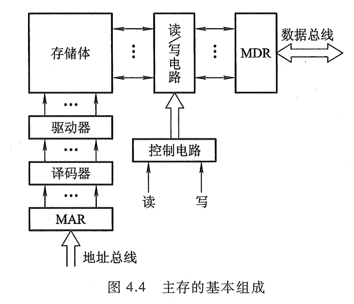

现代计算机的主存都由半导体集成电路构成，图中的驱动器、译码器和读写电路均制作在存储芯片中，而 MAR 和 MDR 制作在 CPU 芯片内。存储芯片和 CPU 芯片可通过总线连接，如图 4.5 所示。

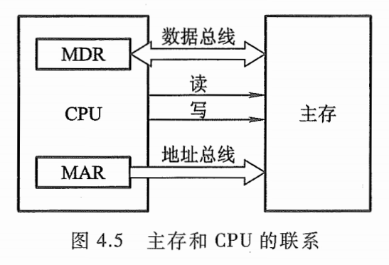

当要从存储器读出某一信息字时，首先由 CPU 将该字的地址送到 MAR ，经地址总线送至主存，然后发出读命令。主存接到读命令后，得知需将该地址单元的内容读出，便完成读操作，将该单元的内容读至数据总线上，至于该信息由 MDR 送至什么地方，这已不是主存的任务，而是由 CPU 决定的。若要向主存存入一个信息字时，首先 CPU 将该字所在主存单元的地址经 MAR 送到地址总线，并将信息字送入 MDR ，然后向主存发出写命令，主存接到写命令后，便将数据线上的信息写入对应地址线指出的主存单元中。

l ．主存中存储单元地址的分配
主存各存储单元的空间位置是由单元地址号来表示的，而地址总线是用来指出存储单元地址号的，根据该地址可读出或写入一个存储字。不同的机器存储字长也不同，为了满足字符处理的需要，常用 8 位二进制数表示一个字节，因此存储字长都取 8 的倍数。通常计算机系统既可按字寻址，也可按字节寻址。例如 IBM 370 机的字长为 32 位，它可按字节寻址，即它的每一个存储字包含 4 个可独立寻址的字节，其地址分配如图 4.6(a) 所示。字地址是用该字高位字节的地址来表示，故其字地址是 4 的整数倍，正好用地址码的末两位来区分同一字的 4 个字节的位置。但对 PDP-11 机而言，其字长为 16 位，字地址是 2 的整数倍，它用低位字节的地址来表示字地址，如图 4.6(b) 所示。

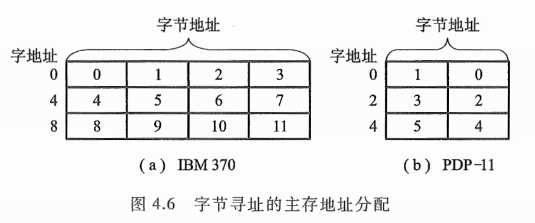

由图 4.6(a) 所示，对 24 位地址线的主存而言，按字节寻址的范围是 16 M ，按字寻址的范围为 4M 。由图 4.6(b) 所示，对 24 位地址线而言，按字节寻址的范围仍为 16 M ，但按字寻址的范围为 8M 。

### 半导体存储芯片简介

l ．半导体存储芯片的基本结构
半导体存储芯片采用超大规模集成电路制造工艺，在一个芯片内集成具有记忆功能的存储
矩阵、译码驱动电路和读／写电路等，如图 4.7 所示。
译码驱动能把地址总线送来的地址信号翻译成对应存储单元的选择信号，该信号在读／写电
路的配合下完成对被选中单元的读／写操作。
读／写电路包括读出放大器和写入电路，用来完成读／写操作。
存储芯片通过地址总线、数据总线和控制总线与外部连接。  

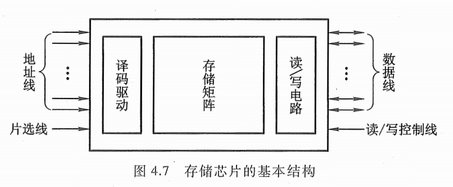

地址线是单向输入的，其位数与芯片容量有关。

数据线是双向的（有的芯片可用成对出现的数据线分别作为输入或输出），其位数与芯片可
读出或写入的数据位数有关。数据线的位数与芯片容量有关。

地址线和数据线的位数共同反映存储芯片的容量。例如，地址线为 10 根，数据线为 4 根，则
芯片容量为 210x4=4 K 位；又如地址线为 14 根，数据线为 1 根，则其容量为 16 K 位。

控制线主要有读／写控制线与片选线两种。不同存储芯片的读／写控制线和片选线可以不同。有的芯片的读／写控制线共用 1 根（如 2114) ，有的分用两根（如 6264) ；有的芯片的片选线用 1 根（如 2114) ，有的用 2 根（如 6264) 。读／写控制线决定芯片进行读／写操作，片选线用来选择存储芯片。由千半导体存储器是由许多芯片组成的，为此需用片选信号来确定哪个芯片被选中。例如，一个 64 Kx8 位的存储器可由 32 片 16 Kxl 位的存储芯片组成，如图 4.8 所示。但每次读出一个存储字时，只需选中 8 片。

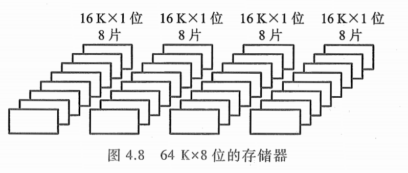

\2. 半导体存储芯片的译码驱动方式
半导体存储芯片的译码驱动方式有两种：线选法和重合法，如图 4.9 和图 4.10 所示。

图 4.9 是一个 16X 1 字节线选法存储芯片的结构示意图。它的特点是用一根字选择线（字线），直接选中一个存储单元的各位（如一个字节）。这种方式结构较简单，但只适千容量不大的存储芯片。如当地址线 A3A2A1A。为 1111 时，则第 15 根字线被选中，对应图 4.9 中的最后一行 8位代码便可直接读出或写入。

图 4.10 是一个 1 Kxl 位重合法结构示意图。显然，只要用 64 根选择线 (X 、 Y 两个方向各 32 根），便可选择 32X32 矩阵中的任一位。例如，当地址线为全 0 时，译码输出 X。和凡有效，矩阵中第 0 行、第 0 列共同选中的那位即被选中。由千被选单元是由 X 、 Y 两个方向的地址决定的，故称为重合法。当欲构成 1 Kx 1 字节的存储器时，只需用 8片如图 4.10 所示的芯片即可。

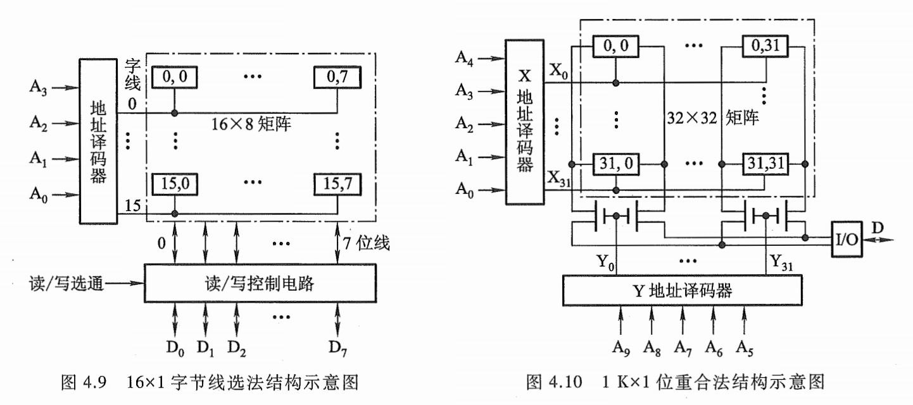

### 存储器与CPU的连接

1. 存储容量的扩展
由于单片存储芯片的容量总是有限的，很难满足实际的需要，因此，必须将若干存储芯片连在一起才能组成足够容量的存储器，称为存储容量的扩展，通常有位扩展和字扩展。

(1) 位扩展
位扩展是指增加存储字长，例如， 2 片 1 Kx4 位的芯片可组成 1 Kx8 位的存储器，如图 4.32所示。图中 2 片 2114 的地址线 A9 ~A。 (5 、《E 都分别连在一起，其中一片的数据线作为高 4位 D1 ~D4 ，另一片的数据线作为低 4 位 D3 ~D。。这样，便构成了一个 1 Kx8 位的存储器。

又如，将 8 片 16 Kxl 位的存储芯片连接，可组成一个 16 Kx8 位的存储器，如图 4.33 所示。

(2) 字扩展
字扩展是指增加存储器字的数量。例如，用 2 片 1 Kx8 位的存储芯片可组成一个 2 Kx8 位的存储器，即存储字增加了一倍，如图 4.34 所示。

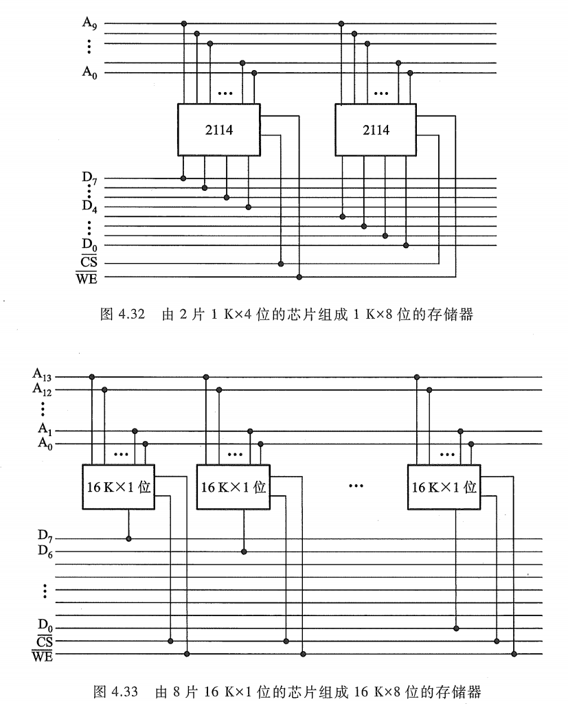

在此，将 A10用作片选信号。由于存储芯片的片选输入端要求低电平有效，故当 A10 为低电平时，石；。有效，选中左边的 1 Kx 8 位芯片；当 A10 为高电平时，反相后正~1 有效，选中右边的 1 Kx8 位芯片。

(3) 字、位扩展

字、位扩展是指既增加存储字的数量，又增加存储字长。图 4.35 示意用 8 片 1 Kx4 位的芯片组成 4 Kx8 位的存储器。

由图中可见，每 2 片构成一组 1 Kx8 位的存储器， 4 组便构成 4 Kx8 位的存储器。地址线All 、丛经片选译码器得到 4 个片选信号 CS 。、 cs1 、 cs2 、 CS3 ，分别选择其中 1 Kx8 位的存储芯片。吓为读／写控制信号。

2. 存储器与 CPU 的连接

存储芯片与 CPU 芯片相连时，特别要注意片与片之间的地址线、数据线和控制线的连接。

(1) 地址线的连接

存储芯片的容量不同，其地址线数也不同， CPU 的地址线数往往比存储芯片的地址线数多。通常总是将 CPU 地址线的低位与存储芯片的地址线相连。 CPU 地址线的高位或在存储芯片扩充时用，或做其他用途，如片选信号等。例如，设 CPU 地址线为 16 位 Al5 ~A。 ,1 Kx4 位的存储芯片仅有 10 根地址线 A9~A。，此时，可将 CPU 的低位地址 A9 ~A。与存储芯片地址线 A9 ~A。相连。又如，当用 16 Kx 1 位存储芯片时，则其地址线有 14 根 A13~A。，此时，可将 CPU 的低位地址A13~A。与存储芯片地址线 A13~A。相连。

(2) 数据线的连接

同样， CPU 的数据线数与存储芯片的数据线数也不一定相等。此时，必须对存储芯片扩位，使其数据位数与 CPU 的数据线数相等。

(3) 读／写命令线的连接

CPU 读／写命令线一般可直接与存储芯片的读／写控制端相连，通常高电平为读，低电平为写。有些 CPU 的读／写命令线是分开的，此时 CPU 的读命令线应与存储芯片的允许读控制端相连，而 CPU 的写命令线则应与存储芯片的允许写控制端相连。  

(4) 片选线的连接

片选线的连接是 CPU 与存储芯片正确工作的关键。存储器由许多存储芯片组成，哪一片被选中完全取决千该存储芯片的片选控制端正汀邑否能接收到来自 CPU 的片选有效信号。片选有效信号与 CPU 的访存控制信号 MREQ （低电平有效）有关，因为只有当 CPU 要求访存时，才需选择存储芯片。若 CPU 访问 I/0 ，则 MREQ 为高电平，表示不要求存储器工作。此外，片选有效信号还和地址有关，因为 CPU 的地址线往往多千存储芯片的地址线，故那些未与存储芯片连上的高位地址必须和访存控制信号共同产生存储芯片的片选信号。通常需用到一些逻辑电路，如译码器及其他各种门电路，来产生片选有效信号。

(5) 合理选择存储芯片

合理选择存储芯片主要是指存储芯片类型 (RAM 或 ROM) 和数量的选择。通常选用 ROM存放系统程序、标准子程序和各类常数等。 RAM 则是为用户编程而设置的。此外，在考虑芯片数量时，要尽量使连线简单方便。

在实际应用 CPU 与存储芯片时，还会遇到两者时序的配合、速度、负载匹配等问题，下面用一个实例来剖析 CPU 与存储芯片的连接方式。 

## 高速缓存存储器

### 概述

\1. 问题的提出

在多体并行存储系统中，由于 I/0 设备向主存请求的级别高于 CPU 访存，这就出现了 CPU等待 I/0 设备访存的现象，致使 CPU 空等一段时间，甚至可能等待几个主存周期，从而降低了CPU 的工作效率。为了避免 CPU 与 I/0 设备争抢访存，可在 CPU 与主存之间加一级缓存（参见图 4.3) ，这样，主存可将 CPU 要取的信息提前送至缓存，一旦主存在与 I/0 设备交换时， CPU 可直接从缓存中读取所需信息，不必空等而影响效率。

从另一角度来看，主存速度的提高始终跟不上 CPU 的发展。据统计， CPU 的速度平均每年改进 60% ，而组成主存的动态 RAM 速度平均每年只改进 7% ，结果是 CPU 和动态 RAM 之间的速度间隙平均每年增大 50% 。例如， 100 MHz 的 Pentium 处理器平均每 10 ns 就执行一条指令，而动态 RAM 的典型访问时间为 60 ~ 120 ns 。这也希望由高速缓存 Cache 来解决主存与 CPU 速度的不匹配问题。

Cache 的出现使 CPU 可以不直接访问主存，而与高速 Cache 交换信息。那么，这是否可能呢？通过大量典型程序的分析，发现 CPU 从主存取指令或取数据，在一定时间内，只是对主存局部地址区域的访问。这是由于指令和数据在主存内都是连续存放的，并且有些指令和数据往往会被多次调用（如子程序、循环程序和一些常数），即指令和数据在主存的地址分布不是随机的，而是相对的簇聚，使得 CPU 在执行程序时，访存具有相对的局部性，这就称为程序访问的局部性原理。根据这一原理，很容易设想，只要将 CPU 近期要用到的程序和数据提前从主存送到Cache ，那么就可以做到 CPU 在一定时间内只访问 Cache 。一般 Cache 采用高速的 SRAM 制作，其价格比主存贵，但因其容量远小于主存，因此能很好地解决速度和成本的矛盾。

2. Cache 的工作原理

图 4.49 是 Cache－主存存储空间的基本结构示意图。

主存由 2n 个可编址的字组成，每个字有唯一的 n 位地址。为了与 Cache 映射，将主存与缓存都分成若干块，每块内又包含若干个字，并使它们的块大小相同（即块内的字数相同）。这就将主存的地址分成两段：高 m 位表示主存的块地址，低 b 位表示块内地址，则 2m =M 表示主存的块数。同样，缓存的地址也分为两段：高 c 位表示缓存的块号，低 b 位表示块内地址，则 2c = C 表示缓存块数，且 C 远小千 M。主存与缓存地址中都用 b 位表示其块内字数，即 B=2b 反映了块的大小，称 B 为块长。

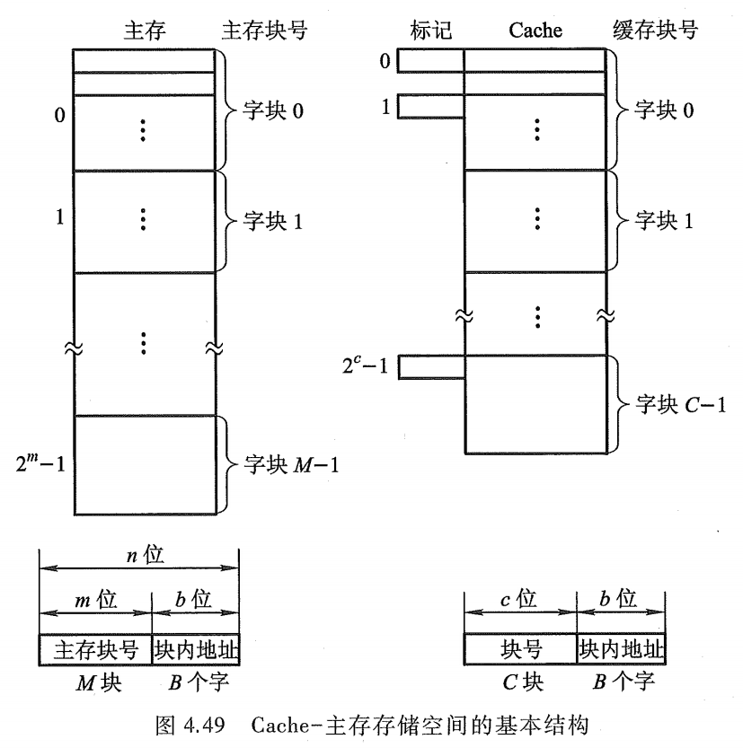

任何时刻都有一些主存块处在缓存块中。 CPU 欲读取主存某字时，有两种可能：一种是所需要的字巳在缓存中，即可直接访问 Cache(CPU 与 Cache 之间通常一次传送一个字） ；另种是所需的字不在 Cache 内，此时需将该字所在的主存整个字块一次调入 Cache 中 (Cache 与主存之间是字块传送）。如果主存块已凋入缓存块，则称该主存块与缓存块建立了对应关系。

上述第一种情况为 CPU 访问 Cache 命中，第二种情况为 CPU 访问 Cache 不命中。由于缓存的块数 C 远小于主存的块数 M ，因此，一个缓存块不能唯一地、永久地只对应一个主存块，故每个缓存块需设一个标记（参见图 4.49) ，用来表示当前存放的是哪一个主存块，该标记的内容相当于主存块的编号。 CPU 读信息时，要将主存地址的高 m 位（或 m 位中的一部分）与缓存块的标记进行比较，以判断所读的信息是否已在缓存中（参见图 4.54) 。

Cache 的容量与块长是影响 Cache 效率的重要因素，通常用”命中率”来衡量 Cache 的效率。命中率是指 CPU 要访问的信息已在 Cache 内的比率。

在一个程序执行期间，设 NC 为访问 Cache 的总命中次数，凡为访问主存的总次数，则命中率 h 为
$$
h = \frac{N_c}{N_c + N_m}
$$
设 $t_c$ 为命中时的 Cache 访问时间， $t_m$ 为未命中时的主存访问时间， 1-h 表示未命中率，则Cache －主存系统的平均访问时间 $t_a$ 为
$$
t_a = h t_c + (1 - h) t_m
$$
当然，以较小的硬件代价使 Cache－主存系统的平均访问时间 $t_a$ 越接近于 $t_c$ 越好。用 $e$ 表示访问效率，则有
$$
e = \frac{t_c}{t_a} \times 100\% = \frac{t_c}{h t_c + (1 - h) t_m} \times 100\%
$$
可见，为提高访问效率，命中率 h 越接近 1 越好。

### Cache-主存地址映射

由主存地址映射到 Cache 地址称为地址映射。地址映射方式很多，有直接映射（固定的映射关系）、全相联映射（灵活性大的映射关系）、组相联映射（上述两种映射的折中）。

\1. 直接映射
图 4.54 示出了直接映射方式主存与缓存中字块的对应关系。

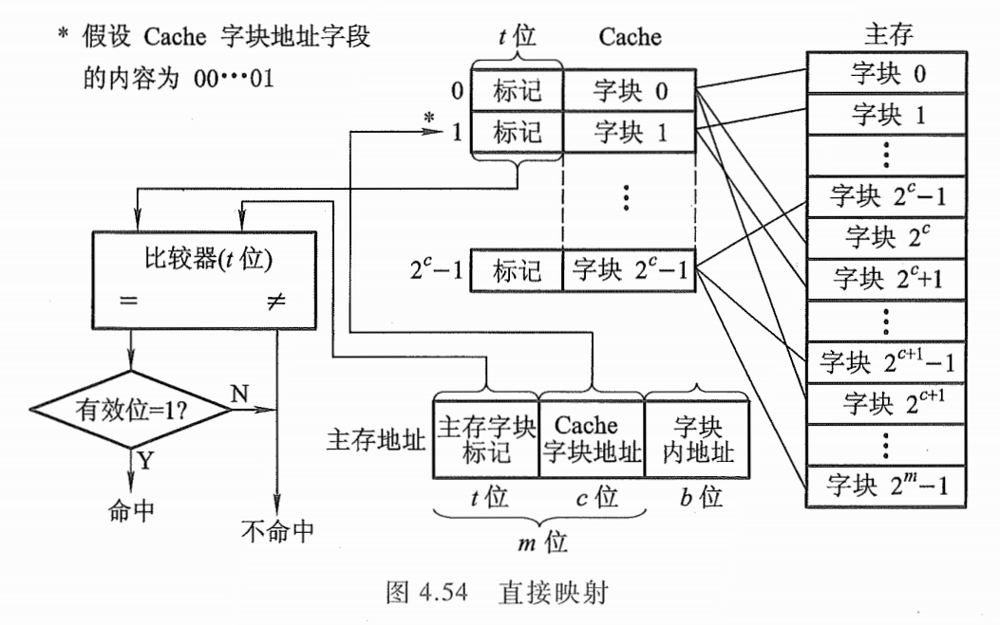

图中每个主存块只与一个缓存块相对应，映射关系式为
$$
i = j \mod C \quad \text{或} \quad i = j \mod 2^C
$$
其中， i 为缓存块号，j 为主存块号， C 为缓存块数。映射结果表明每个缓存块对应若干个主存块，如表 4.4 所示。

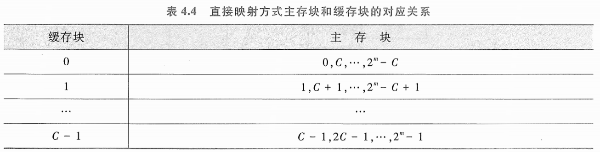

这种方式的优点是实现简单，只需利用主存地址的某些位直接判断，即可确定所需字块是否在缓存中。由图 4.54 可见，主存地址高 m 位被分成两部分：低 c 位是指 Cache 的字块地址，高 t位 (t = m-c) 是指主存字块标记，它被记录在建立了对应关系的缓存块的”标记”位中。当缓存接到 CPU 送来的主存地址后，只需根据中间 c 位字段（假设为 00 … 01) 找到 Cache 字块 1 ，然后根据字块 l 的”标记”是否与主存地址的高 t 位相符来判断，若符合且有效位为 “1” （有效位用来识别 Cache 存储块中的数据是否有效，因为有时 Cache 中的数据是无效的，例如，在初始时刻 Cache应该是“空”的，其中的内容是无意义的），表示该 Cache 块巳和主存的某块建立了对应关系（即己命中），则可根据 b 位地址从 Cache 中取得信息；若不符合，或有效位为 “0" （即不命中），则从主存读入新的字块来替代旧的字块，同时将信息送往 CPU ，并修改 Cache” 标记＂。如果原来有效位为 “0” ，还得将有效位置成 “1” 。

直接映射方式的缺点是不够灵活，因每个主存块只能固定地对应某个缓存块，即使缓存内还空着许多位置也不能占用，使缓存的存储空间得不到充分的利用。此外，如果程序恰好要重复访间对应同一缓存位置的不同主存块，就要不停地进行替换，从而降低命中率。

\2. 全相联映射

全相联映射允许主存中每一字块映射到 Cache 中的任何一块位置上，如图 4.55 所示。这种映射方式可以从已被占满的 Cache 中替换出任一旧字块。显然，这种方式灵活，命中率也更高，缩小了块冲突率。与直接映射相比，它的主存字块标记从 t 位增加到 t+c 位，这就使 Cache” 标记＂的位数增多，而且访问 Cache 时主存字块标记需要和 Cache 的全部“标记”位进行比较，才能判断出所访问主存地址的内容是否已在 Cache 内。这种比较通常采用”按内容寻址”的相联存储器（见附录 4A) 来完成。

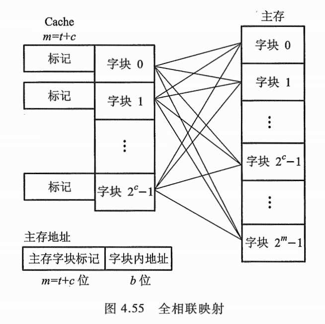

总之，这种方式所需的逻辑电路甚多，成本较高，实际的 Cache 还要采用各种措施来减少地址的比较次数。

3. 组相联映射

组相联映射是对直接映射和全相联映射的一种折中。它把 Cache 分为 Q 组，每组有 R 块，并有以下关系：
$$
i = j \mod Q
$$
其中， i 为缓存的组号， j 为主存的块号。某一主存块按模 Q 将其映射到缓存的第 i 组内，如图4.56所示。

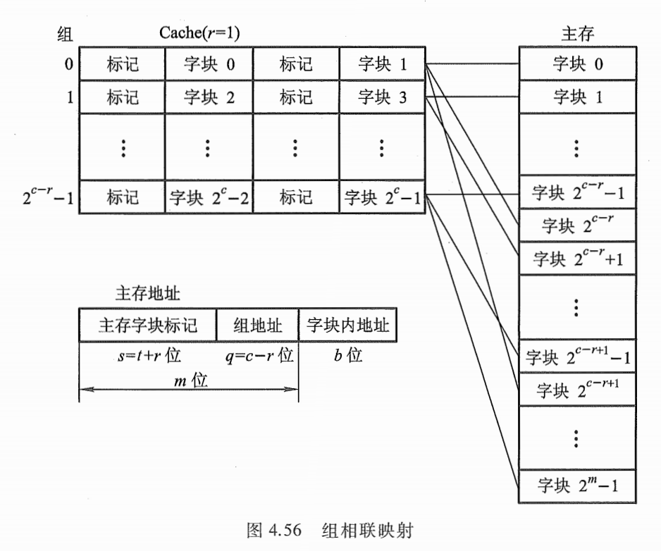

组相联映射的主存地址各段与直接映射（参见图 4.54) 相比，还是有区别的。图 4.54 中Cache 字块地址字段由 c 位变为组地址字段 q 位，且 q=c-r ，其中 2c 表示 Cache 的总块数， 2q 表示Cache 的分组个数， 2r 表示组内包含的块数。主存字块标记字段由 t 位变为 s = t+r 位。为了便于理解，假设 c=5,q=4 ，则 r=c-q=l 。其实际含义为： Cache 共有 2c = 32 个字块，共分为 2q = 16 组，每组内包含 2r = 2 块。组内 2 块的组相联映射又称为二路组相联。

根据上述假设条件，组相联映射的含义是：主存的某一字块可以按模 16 映射到 Cache 某组的任一字块中。即主存的第 0,16,32 …字块可以映射到 Cache 第 0 组 2 个字块中的任一字块；主存的第 15,31,47 …字块可以映射到 Cache 第 15 组中的任一字块。显然，主存的第 j 块会映射到Cache 的第 i 组内，两者之间一一对应，属直接映射关系；另一方面，主存的第 j 块可以映射到Cache 的第 i 组内中的任一块，这又体现出全相联映射关系。可见，组相联映射的性能及其复杂性介千直接映射和全相联映射两者之间，当 r = 0 时是直接映射方式，当 r=c 时是全相联映射方式。

