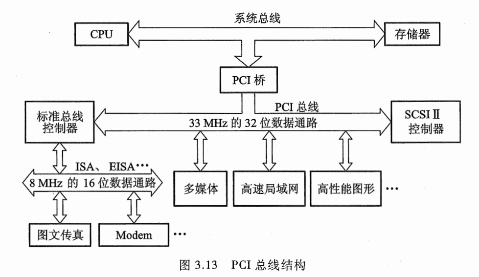
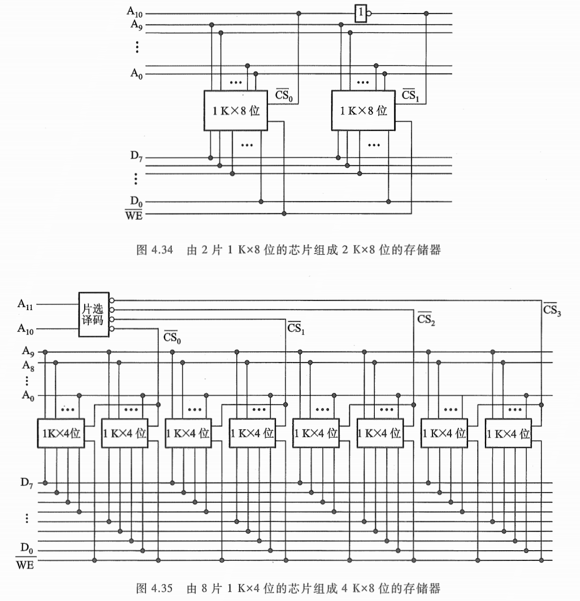
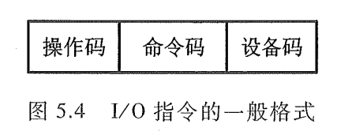
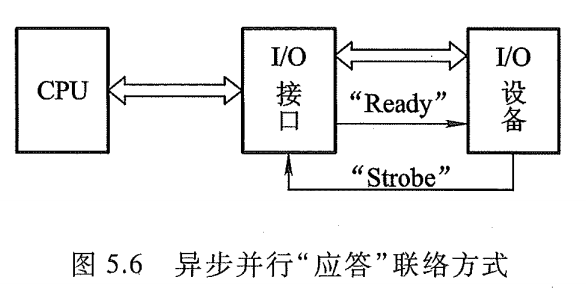
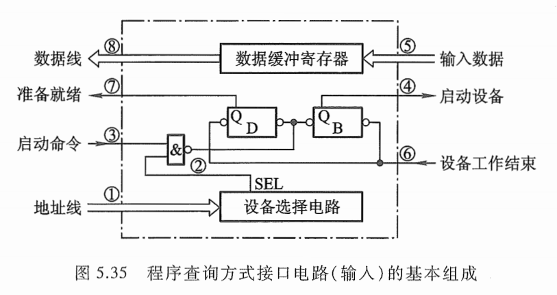
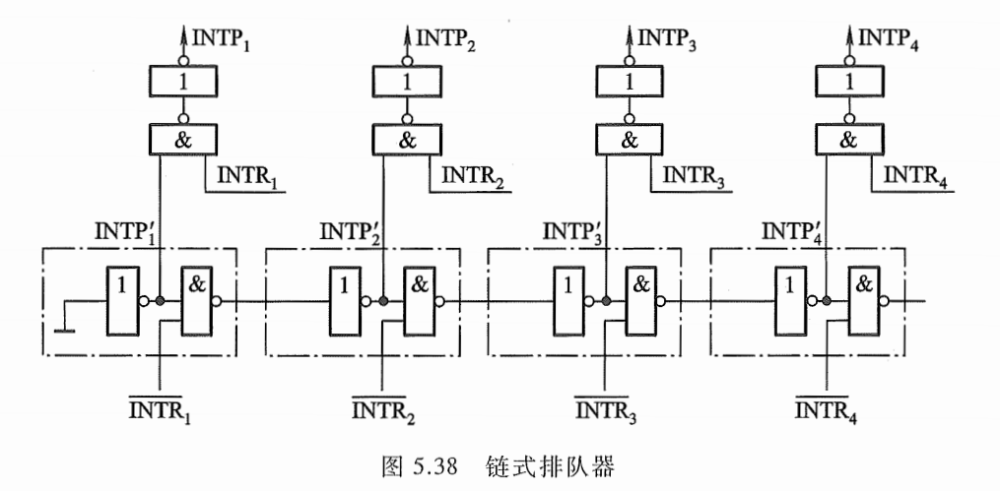

> 《计算机组成原理》第三版 唐朔飞

# 第1章 计算机系统概论

## 计算机的基本组成

1945 年，数学家冯·诺依曼 (von Neumann) 在研究 EDVAC 机时提出了“存储程序”的概念。以此概念为基础的各类计算机通称为冯·诺依曼机，它的特点可归结如下：

- 计算机由运算器、控制器、存储器、输入设备和输出设备五大部件组成。
- 指令和数据以同等地位存放于存储器内，并可按地址寻访。
- 指令和数据均用二进制数表示。
- 指令由操作码和地址码组成，操作码用来表示操作的性质，地址码用来表示操作数在存储器中的位置。
- 指令在存储器内按顺序存放。通常，指令是顺序执行的，在特定条件下，可根据运算结果或根据设定的条件改变执行顺序。
- 机器以运算器为中心，输入输出设备与存储器间的数据传送通过运算器完成。

典型的冯·诺依曼计算机是以运算器为中心的，如图 1.7 所示。现代的计算机已转化为以存储器为中心，如图 1.8 所示。  


图中各部件的功能如下：

- 运算器用来完成算术运算和逻辑运算，并将运算的中间结果暂存在运算器内。
- 存储器用来存放数据和程序。
- 控制器用来控制、指挥程序和数据的输入、运行以及处理运算结果。
- 输入设备用来将人们熟悉的信息形式转换为机器能识别的信息形式，常见的有键盘、鼠标等。
- 输出设备可将机器运算结果转换为人们熟悉的信息形式，如打印机输出、显示器输出等。

计算机的五大部件（又称五大子系统）在控制器的统一指挥下，有条不紊地自动工作。

由于运算器和控制器在逻辑关系和电路结构上联系十分紧密，尤其在大规模集成电路制作工艺出现后，这两大部件往往集成在同一芯片上，因此，通常将它们合起来统称为中央处理器(Central Processing Unit, CPU) ，把输入设备与输出设备简称为 I/O 设备 (Input/Output Equipment) 。

这样，现代计算机可认为由三大部分组成：CPU、I/O 设备及主存储器 (Main Memory, MM)，如图 1.9 所示。 CPU 与主存储器合起来又可称为主机，I/O 设备又可称为外部设备。  


图 1.9 中的主存储器是存储器子系统中的一类，用来存放程序和数据，可以直接与 CPU 交换信息。另一类称为辅助存储器，简称辅存，又称外存，其功能参阅 4.4 节。

算术逻辑单元 (Arithmetic Logic Unit, ALU) 简称算逻部件，用来完成算术逻辑运算。控制单元 (Control Unit, CU) 用来解释存储器中的指令，并发出各种操作命令来执行指令。 ALU 和 CU是 CPU 的核心部件。

I/O 设备也受 CU 控制，用来完成相应的输入、输出操作。可见，计算机有条不紊地自动工作都是在控制器统一指挥下完成的。  

## 计算机的工作过程

为了比较形象地了解计算机的工作过程，首先分析一个比图 1.9 更细化的计算机组成框图，如图 1.11 所示。


(1) 主存储器

主存储器（简称主存或内存）包括存储体 M 、各种逻辑部件及控制电路等。存储体由许多存储单元组成，每个存储单元又包含若干个存储元件（或称存储基元、存储元），每个存储元件能寄存一位二进制代码 “0” 或 “1” 。可见，一个存储单元可存储一串二进制代码，称这串二进制代码为一个**存储字**，这串二进制代码的位数称为**存储字长**。存储字长可以是 8 位、 16 位或 32 位等。可以赋予每个存储单元一个编号，称为存储单元的地址号。

主存的工作方式就是按存储单元的地址号来实现对存储字各位的存（写入）、取（读出）。这种存取方式称为按地址存取方式，即按地址访问存储器（简称访存）。存储器的这种工作性质对计算机的组成和操作是十分有利的。例如，人们只要事先将编好的程序按顺序存入主存各单元，当运行程序时，先给出该程序在主存的首地址，然后采用程序计数器加 1 的方法，自动形成下一条指令所在存储单元的地址，机器便可自动完成整个程序的操作。又如，由于数据和指令都存放在存储体内各自所占用的不同单元中，因此，当需要反复使用某个数据或某条指令时，只要指出其相应的单元地址号即可，而不必占用更多的存储单元重复存放同一个数据或同一条指令，大大提高了存储空间的利用率。此外，由于指令和数据都由存储单元地址号来反映，因此，取一条指令和取一个数据的操作完全可视为是相同的，这样就可使用一套控制线路来完成两种截然不同的操作。  

为了能实现按地址访问的方式，主存中还必须配置两个寄存器 MAR 和 MDR 。 **MAR(Memory Address Register)** 是存储器地址寄存器，用来存放欲访问的存储单元的地址，其位数对应存储单元的个数（如 MAR 为 10 位，则有 $2^{10}$ = 1 024 个存储单元，记为 1 K) 。 **MDR(Memory Data Register)** 是存储器数据寄存器，用来存放从存储体某单元取出的代码或者准备往某存储单元存入的代码，其位数与存储字长相等。当然，要想完整地完成一个取或存操作， CPU 还得给主存加以各种控制信号，如读命令、写命令和地址译码驱动信号等。**随着硬件技术的发展，主存都制成大规模集成电路的芯片，而将 MAR 和 MDR 集成在 CPU 芯片中。**

**早期计算机的存储字长一般和机器的指令字长与数据字长相等，故访问一次主存便可取一条指令或一个数据。**随着计算机应用范围的不断扩大，解题精度的不断提高，往往要求指令字长是可变的，数据字长也要求可变。为了适应指令和数据字长的可变性，其长度不由存储字长来确定，而由字节的个数来表示。 1 个字节 (Byte) 被定义为由 8 位 (bit) 二进制代码组成。例如， 4 字节数据就是 32 位二进制代码； 2 字节构成的指令字长是 16 位二进制代码。**当然，此时存储字长、指令字长、数据字长三者可各不相同，但它们必须是字节的整数倍。**

(2) 运算器

运算器最少包括 3 个寄存器（现代计算机内部往往设有通用寄存器组）和一个算术逻辑单元 (ALU) 。其中 ACC (Accumulator) 为累加器， MQ (Multiplier-Quotient Register) 为乘商寄存器， X为操作数寄存器。这 3 个寄存器在完成不同运算时，所存放的操作数类别也各不相同。表 1.3 列出了寄存器存放不同类别操作数的情况。


不同机器的运算器结构是不同的。图 1.11 所示的运算器可将运算结果从 ACC 送至存储器中的 MDR ；而存储器的操作数也可从 MDR 送至运算器中的 ACC 、 MQ 或 X 。

(3) 控制器

控制器是计算机的神经中枢，由它指挥各部件自动、协调地工作。具体而言，它首先要命令存储器读出一条指令，称为取指过程（也称取指阶段）。接着，它要对这条指令进行分析，指出该指令要完成什么样的操作，并按寻址特征指明操作数的地址，称为分析过程（也称分析阶段）。最后根据操作数所在的地址以及指令的操作码完成某种操作，称为执行过程（也称执行阶段）。 以上就是通常所说的完成一条指令操作的取指、分析和执行 3 个阶段。  

控制器由程序计数器 (Program Counter, PC) 、指令寄存器 (Instruction Register, IR) 以及控制单元 (CU) 组成。 PC 用来存放当前欲执行指令的地址，它与主存的 MAR 之间有一条直接通路，且具有自动加 1 的功能，即可自动形成下一条指令的地址。 IR 用来存放当前的指令， IR 的内容来自主存的 MDR 。 IR 中的操作码 (OP(IR)) 送至 CU ，记作 OP(IR) → CU ，用来分析指令；其地址码 (Ad(IR)) 作为操作数的地址送至存储器的 MAR ，记作 Ad(IR) → MAR 。CU 用来分析当前指令所需完成的操作，并发出各种微操作命令序列，用以控制所有被控对象。

(4) I/O

I/O 子系统包括各种 I/O 设备及其相应的接口。**每一种 I/O 设备都由 I/O 接口与主机联系，它接收 CU 发出的各种控制命令，并完成相应的操作。**例如，键盘（输入设备）由键盘接口电路与主机联系；打印机（输出设备）由打印机接口电路与主机联系。

## 本书结构


计算机硬件系统由中央处理器、存储器、 I/O 系统以及连接它们的系统总线组成。本篇介绍系统总线、存储器和I/O系统三部分，中央处理器将在第 3 篇单独讲述。

# 第3章 系统总线

## 3.1 总线的基本概念

计算机系统的五大部件之间的互连方式有两种，一种是各部件之间使用单独的连线，称为分散连接；另一种是将各部件连到一组公共信息传输线上，称为总线连接。

早期的计算机大多数用分散连接方式，如图 1.7 所示。它是以运算器为中心的结构，其内部连线十分复杂，尤其是当I/O 与存储器交换信息时，都需经过运算器，致使运算器停止运算，严重影响了 CPU 的工作效率。后来，虽然改进为以存储器为中心的如图 1.8 所示的分散连接结构， I/O 与主存交换信息可以不经过运算器，又采用了中断、 DMA 等技术，使 CPU 工作效率得到很大的提高，但是仍无法解决 I/O 设备与主机之间连接的灵活性。随着计算机应用领域的不断扩大，I/O 设备的种类和数量也越来越多，人们希望随时增添或减撤设备，用分散连接方式简直是一筹莫展，由此出现了总线连接方式。

总线是连接多个部件的信息传输线，是各部件共享的传输介质。当多个部件与总线相连时，如果出现两个或两个以上部件同时向总线发送信息，势必导致信号冲突，传输无效。**因此，在某一时刻，只允许有一个部件向总线发送信息，而多个部件可以同时从总线上接收相同的信息。**  

总线实际上是由许多传输线或通路组成，每条线可一位一位地传输二进制代码，一串二进制代码可在一段时间内逐一传输完成。若干条传输线可以同时传输若干位二进制代码，例如， 16 条传输线组成的总线可同时传输 16 位二进制代码。

采用总线连接的计算机结构，如图 3.1 所示，它是以 CPU 为中心的双总线结构。

其中一组总线连接 CPU 和主存，称为存储总线 (M 总线）；另一组用来建立 CPU 和各 I/O 设备之间交换信息的通道，称为输入输出总线 (I/O 总线）。各种 I/O 设备通过 I/O 接口挂到 I/O 总线上，更便于增删设备。这种结构在 I/O 设备与主存交换信息时仍然要占用 CPU ，因此还会影响 CPU 的工作效率。

倘若将 CPU 、主存和 I/O 设备（通过 I/O 接口）都挂到一组总线上，便形成单总线结构的计算机，如图 3.2 所示。


图 3.2 与图 3.1 相比，最明显的特点是当 I/O 设备与主存交换信息时，原则上不影响 CPU 的工作， CPU 仍可继续处理不访问主存或 I/O 设备的操作，这就使 CPU 工作效率有所提高。但是，因只有一组总线，当某一时刻各部件都要占用总线时，就会发生冲突。为此，必须设置总线判优逻辑，让各部件按优先级高低来占用总线，这也会影响整机的工作速度。 PDP-11 和国产 DJS183 机均采用这种结构。

还有一种以存储器为中心的双总线结构，如图 3.3 所示。


它是在单总线基础上又开辟出的一条 CPU 与主存之间的总线，称为存储总线。这组总线速度高，只供主存与 CPU 之间传输信息。这样既提高了传输效率，又减轻了系统总线的负担，还保留了 I/O 设备与存储器交换信息时不经过 CPU 的特点。国产 DJS184 机采用这种结构。

现代计算机大多数采用各类总线结构。

## 3.2 总线的分类

下面按连接部件不同，介绍三类总线。

### 片内总线

片内总线是指芯片内部的总线，如在 CPU 芯片内部，寄存器与寄存器之间、寄存器与算逻单元 ALU 之间都由片内总线连接。  

### 系统总线

系统总线是指 CPU 、主存、 I/O 设备（通过 I/O 接口）各大部件之间的信息传输线。由于这些部件通常都安放在主板或各个插件板（插卡）上，故又称板级总线（在一块电路板上各芯片间的连线）或板间总线。

按系统总线传输信息的不同，又可分为三类：数据总线、地址总线和控制总线。

1. 数据总线

数据总线用来传输各功能部件之间的数据信息，**它是双向传输总线**，其位数与机器字长、存储字长有关，一般为 8 位、 16 位或 32 位。**数据总线的位数称为数据总线宽度，它是衡量系统性能的一个重要参数**。如果数据总线的宽度为 8 位，指令字长为 16 位，那么，CPU 在取指阶段必须两次访问主存。

2. 地址总线

**地址总线主要用来指出数据总线上的源数据或目的数据在主存单元的地址或 I/O 设备的地址。**例如，欲从存储器读出一个数据，则 CPU 要将此数据所在存储单元的地址送到地址线上。又如，欲将某数据经 I/O 设备输出，则 CPU 除了需将数据送到数据总线外，还需将该输出设备的地址（通常都经 I/O 接口）送到地址总线上。可见，地址总线上的代码是用来指明 CPU 欲访问的存储单元或 I/O 端口的地址，**由 CPU 输出，单向传输**。地址线的位数与存储单元的个数有关，如地址线为 20 根，则对应的存储单元个数为 $2^{20}$。

3. 控制总线

由于数据总线、地址总线都是被挂在总线上的所有部件共享的，如何使各部件能在不同时刻占有总线使用权，需依靠控制总线来完成，因此控制总线是用来发出各种控制信号的传输线。**通常对任一控制线而言，它的传输是单向的**。例如，存储器读／写命令或 I/O 设备读／写命令都是由 CPU 发出的。**但对于控制总线总体来说，又可认为是双向的**。例如，当某设备准备就绪时，便向 CPU 发中断请求；当某部件（如 DMA 接口）需获得总线使用权时，也向 CPU 发出总线请求。此外，控制总线还起到监视各部件状态的作用。例如，查询该设备是处于 "忙" 还是 "闲" ，是否出错等。**因此对 CPU 而言，控制信号既有输出，又有输入。**

常见的控制信号如下：

- 时钟：用来同步各种操作。CPU生成时钟信号并广播到所有总线设备，用于同步操作时序。
- 复位：初始化所有部件。外部电路通过复位信号强制初始化CPU和其他部件，使其回到初始状态。
- 总线请求：表示某部件需获得总线使用权。设备向CPU（或总线仲裁器）请求占用总线，暂停CPU对总线的控制。发出设备：需要总线的设备（如DMA控制器、协处理器）
- 总线允许：表示需要获得总线使用权的部件已获得了控制权。CPU（或总线仲裁器）批准总线请求，允许其他设备接管总线控制权（如DMA传输）。
- 中断请求：表示某部件提出中断请求。设备通过中断请求线通知CPU需要处理紧急任务（如数据就绪）。
- 中断响应：表示中断请求已被接收。CPU确认接收中断请求，并跳转到中断处理程序。
- 存储器写：将数据总线上的数据写至存储器的指定地址单元内。
- 存储器读：将指定存储单元中的数据读到数据总线上。
- I/O 读：从指定的 I/O 端口将数据读到数据总线上。
- I/O 写：将数据总线上的数据输出到指定的 I/O 端口内。

## 3.3 总线特性及性能指标

### 总线特性

从物理角度来看，总线由许多导线直接印制在电路板上，延伸到各个部件。图 3.4 形象地表示了各个部件与总线之间的物理摆放位置。


图中 CPU 、主存、 I/O 这些插板（又称插卡）通过插头与水平方向总线插槽（按总线标准用印刷电路板或一束电缆连接而成的多头插座）连接。为了保证机械上的可靠连接，必须规定其机械特性；为了确保电气上正确连接，必须规定其电气特性；为保证正确地连接不同部件，还需规定其功能特性和时间特性。随着计算机的发展， Pentium Ill 以上的微型计算机已将 CPU 芯片直接安置在主板上，而且很多插卡已做成专用芯片，减少了插槽，使其结构更合理。

总线特性包括以下几项：

(1) 机械特性
机械特性是指总线在机械连接方式上的一些性能，如插头与插座使用的标准，它们的几何尺寸、形状、引脚的个数以及排列的顺序，接头处的可靠接触等。

(2) 电气特性
**电气特性是指总线的每一根传输线上信号的传递方向和有效的电平范围**。通常规定由 CPU 发出的信号称为输出信号，送入 CPU 的信号称为输入信号。例如，地址总线属于单向输出线，数据总线属于双向传输线，它们都定义为高电平为 "1" ，低电平为 "0" 。控制总线的每一根都是单向的，但从整体看，有输入，也有输出。有的定义为高电平有效，也有的定义为低电平有效，必须注意不同的规格。大多数总线的电平定义与 TTL 是相符的，也有例外，如 RS-232C （串行总线接口标准），其电气特性规定低电平表示逻辑 "1" ，并要求电平低于 -3 V ；用高电平表示逻辑 "0" ，还要求高电平需高于+3V ，额定信号电平为 -10 V 和+10 V 左右。

(3) 功能特性
功能特性是指总线中每根传输线的功能，例如，地址总线用来指出地址码；数据总线用来传递数据；控制总线发出控制信号，既有从 CPU 发出的，如存储器读／写、 I/O 设备读／写，也有 I/O 设备向 CPU 发来的，如中断请求、DMA 请求等。由此可见，各条线的功能不同。

(4) 时间特性
时间特性是指总线中的任一根线在什么时间内有效。每条总线上的各种信号互相存在一种有效时序的关系，因此，时间特性一般可用信号时序图来描述。


### 总线性能指标

总线性能指标如下：

1. 总线宽度：通常是指数据总线的根数，用 bit（位）表示，如 8 位、16 位、32 位、64 位（即 8根、16 根、 32 根、64 根）。
2. 总线带宽：总线带宽可理解为总线的数据传输速率，即单位时间内总线上传输数据的位数，通常用每秒传输信息的字节数来衡量，单位可用 MBps （兆字节每秒）表示。例如，总线工作频率为 33 MHz ，总线宽度为 32 位 (4 B) ，则总线带宽为 33x(32÷8)= 132 MBps 。
3. 时钟同步／异步：总线上的数据与时钟同步工作的总线称为同步总线，与时钟不同步工作的总线称为异步总线。
4. 总线复用：一条信号线上分时传送两种信号。例如，通常地址总线与数据总线在物理上是分开的两种总线，地址总线传输地址码，数据总线传输数据信息。为了提高总线的利用率，优化设计，特将地址总线和数据总线共用一组物理线路，在这组物理线路上分时传输地址信号和数据信号，即为总线的多路复用。
5. 信号线数：地址总线、数据总线和控制总线三种总线数的总和。
6. 总线控制方式：包括突发工作、自动配置、仲裁方式、逻辑方式、计数方式等。
7. 其他指标：如负载能力、电源电压（是采用 5V 还是 3.3V) 、总线宽度能否扩展等。

```
1Mbps  =  1000Kbps   =  1000/8 KBps(原因：1B=8b，注意：1Bps=8bps， 1KBps = 8Kbps)
 
我们常说的宽带速率，百兆宽带(百兆带宽)也就是100Mbps
 
100Mbps = 100/8MBps = 12.5MB
 
这也就是如果带宽为百兆，但是我们计算机最大传输下载速率不会超过12.5MB每秒的原因。
```

表 3.1 列出了几种流行的微机总线性能，可供参考。


### 总线标准

总线是在计算机系统模块化的发展过程中产生的，随着计算机应用领域的不断扩大，计算机系统中各类模块（特别是 I/O 设备所带的各类接口模块）品种极其繁杂，往往一种模块要配一种总线，很难在总线上更换、组合各类模块或设备。 20 世纪 70 年代末，为了使系统设计简化，模块生产批量化，确保其性能稳定、质量可靠，实现可移化，便于维护等，人们开始研究如何使总线建立标准，在总线的统一标准下，完成系统设计、模块制作。这样，系统、模块、设备与总线之间不适应、不通用及不匹配的问题就迎刃而解了。  

所谓总线标准，可视为系统与各模块、模块与模块之间的一个互连的标准界面。这个界面对它两端的模块都是透明的，即界面的任一方只需根据总线标准的要求完成自身一方接口的功能要求，而无须了解对方接口与总线的连接要求。因此，按总线标准设计的接口可视为通用接口。采用总线标准可以为计算机接口的软硬件设计提供方便。对硬件设计而言，使各个模块的接口芯片设计相对独立；对软件设计而言，更有利于接口软件的模块化设计。  

目前流行的总线标准有以下几种：
1. ISA 总线
ISA (Industrial Standard Architecture) 总线是 IBM 为了采用全 16 位的 CPU 而推出的，又称 AT 总线，它使用独立于 CPU 的总线时钟，因此 CPU 可以采用比总线频率更高的时钟，有利于CPU 性能的提高。由于 ISA 总线没有支持总线仲裁的硬件逻辑，**因此它不能支持多台主设备（不支持多台具有申请总线控制权的设备）系统**，而且 ISA 上的所有数据的传送必须通过 CPU 或 DMA （直接存储器存取）接口来管理，因此使 CPU 花费了大量时间来控制与外部设备交换数据。ISA 总线时钟频率为 8 MHz ，最大传输率为 16 MBps ，数据线为 16 位，地址线为 24 位。
2. EISA 总线
EISA (Extended Industrial Standard Architecture) 是一种在 ISA 基础上扩充开放的总线标准，与 ISA 可以完全兼容，从 CPU 中分离出了总线控制权，是一种具有智能化的总线，能支持多个总线主控器和突发方式（总线上可进行成块的数据传送）的传输。 EISA 总线的时钟频率为 8 MHz，最大传输率可达 33 MBps ，数据总线为 32 位，地址总线为 32 位，扩充 DMA 访问范围达 $2^{32}$。
3. VESA(VL-BUS) 总线
VESA 总线是由 VESA (Video Electronic Standard Association ，视频电子标准协会）提出的局部总线标准，又称为 VL-BUS(Local BUS) 总线。所谓局部总线，是指在系统外为两个以上模块提供的高速传输信息通道。VL-BUS 是由 CPU 总线演化而来的，采用 CPU 的时钟频率达 33 MHz 、数据线为 32 位，可通过扩展槽扩展到 64 位，配有局部控制器，最大传输率达 133 MBps 。通过局部总线控制器，将高速 I/O 设备直接挂在 CPU 上，实现 CPU 与高速 I/O 设备之间的高速数据交换（参见图 3.12) 。
4. PCI 总线
随着图形用户界面 (Graphical User Interface, GUI) 和多媒体技术在 PC 系统中的广泛应用，ISA 总线和 EISA 总线由于受带宽的限制，已不能适应系统工作的要求，成为整个系统的主要瓶颈。因此对总线提出了更高的性能要求，促使总线技术进一步发展。1991 年下半年， Intel 公司首先提出 PCI (Peripheral Component Interconnect ，外围部件互连）总线的概念，并联合 IBM、 Compaq、 Apple、 DEC、 AST、 HP 等计算机业界大户，成立了 PCI 集团PCISIG (PCI Special Interest Group, PCI 专门权益组织），于 1992 年 6 月 22 日推出了 PCI 1.0 版，1995 年和 1999 年又先后推出了 2.1 版和 2.2 版， PCI 总线已成为现代计算机中最常用的总线之一，它的主要特点如下所述。


## 3.4 总线结构

总线结构通常可分为单总线结构和多总线结构两种。

### 单总线结构

图 3.2 是单总线结构的示意，它是将 CPU 、主存、 I/O 设备（通过 I/O 接口）都挂在一组总线上，允许 I/O 设备之间、 I/O 设备与 CPU 之间或 I/O 设备与主存之间直接交换信息。这种结构简单，也便于扩充，但所有的传送都通过这组共享总线，因此极易形成计算机系统的瓶颈。它也不允许两个以上的部件在同一时刻向总线传输信息，这就必然会影响系统工作效率的提高。这类总线多数被小型计算机或微型计算机所采用。

随着计算机应用范围不断扩大，其外部设备的种类和数量越来越多，它们对数据传输数量和传输速度的要求也就越来越高。倘若仍然采用单总线结构，那么，当 I/O 设备量很大时，总线发出的控制信号从一端逐个顺序地传递到第 n 个设备，其传播的延迟时间就会严重地影响系统的工作效率。在数据传输需求量和传输速度要求不太高的情况下，为克服总线瓶颈问题，尽可能采用增加总线宽度和提高传输速率来解决；但当总线上的设备，如高速视频显示器、网络传输接口等，其数据量很大和传输速度要求相当高的时候，单总线结构则不能满足系统工作的需要。因此，为了根本解决数据传输速率，解决 CPU 、主存与 I/O 设备之间传输速率的不匹配，实现 CPU 与其他设备相对同步，不得不采用多总线结构。  

### 多总线结构

图 3.7 是双总线结构的示意图。双总线结构的特点是将速度较低的 I/O 设备从单总线上分离出来，形成主存总线与 I/O 总线分开的结构。**图中通道是一个具有特殊功能的处理器， CPU 将一部分功能下放给通道，使其对 I/O 设备具有统一管理的功能，以完成外部设备与主存储器之间的数据传送，其系统的吞吐能力可以相当大**。这种结构大多用于大、中型计算机系统。  


如果将速率不同的 I/O 设备进行分类，然后将它们连接在不同的通道上，那么计算机系统的工作效率将会更高，由此发展成多总线结构。

图 3.8 是三总线结构的示意图。  


图 3.8 中主存总线用于 CPU 与主存之间的传输； I/O 总线供 CPU 与各类 I/O 设备之间传递信息；DMA 总线用于高速 I/O 设备（磁盘、磁带等）与主存之间直接交换信息。在三总线结构中，任一时刻只能使用一种总线。主存总线与 DMA 总线不能同时对主存进行存取，I/O 总线只有在CPU 执行 I/O 指令时才能用到。

图 3.9 是另一种三总线结构的示意图。由图可见，处理器与 Cache 之间有一条局部总线，它将 CPU 与 Cache 或与更多的局部设备连接。 **Cache 的控制机构不仅将 Cache 连到局部总线上，而且还直接连到系统总线上，这样 Cache 就可通过系统总线与主存传输信息**，而且 I/O 设备与主存之间的传输也不必通过CPU 。还有一条扩展总线，它将局域网、小型计算机接口 (SCSI) 、调制解调器 (Modem) 以及串行接口等都连接起来。与此同时，扩展总线又通过扩展总线接口与系统总线相连，由此便可实现这两种总线之间的信息传递，可见其系统的工作效率明显提高。  


为了进一步提高 I/O 设备的性能，使其更快地响应命令，又出现了四总线结构，如图 3.10 所示。


在这里又增加了一条与计算机系统紧密相连的高速总线。在高速总线上挂接了一些高速 I/O 设备，如高速局域网、图形工作站、多媒体、 SCSI 等。它们通过 Cache 控制机构中的高速总线桥或高速缓冲器与系统总线和局部总线相连，使得这些高速设备与 CPU 更密切。而一些较低速的设备如图文传真 FAX 、调制解调器及串行接口仍然挂在扩展总线上，并由扩展总线接口与高速总线相连。

这种结构对高速设备而言，其自身的工作可以很少依赖 CPU ，同时它们又比扩展总线上的设备更贴近 CPU ，可见对于高性能设备与 CPU 来说，各自的效率将获得更大的提高。

### 总线结构举例

图 3.11 是传统微型计算机的总线结构示意图：


由图 3.11 中可见，不论高速局域网、高性能图形还是低速的 FAX 、 Modem 都挂接在 ISA 或 EISA 总线上，并通过 ISA 或 EISA 总线控制器与系统总线相连，这样势必出现总线数据传输的瓶颈。只有将高速、高性能的外设，如高速局域网卡、高性能图形卡等尽量靠近 CPU 本身的总线，并与 CPU 同步或准同步，才可能消除瓶颈问题。这就要求改变总线结构来提高数据传送速率，为此，出现了图 3.12 的 VL-BUS 局部总线结构。

由图 3.12 中可见，将原先挂在 ISA 总线上的高速局域网卡、多媒体卡、高性能图形卡等从ISA 总线卸下来，挂到局部总线 VL-BUS 上，再与系统总线相连。而将打印机、 FAX 、 Modem 等低速设备仍挂在 ISA 总线上。局部总线 VL-BUS 就相当于在 CPU 与高速 I/O 设备之间架上了高速通道，使 CPU 与高性能外设得到充分发挥，满足了图形界面软件的要求。

由于 VL-BUS 是从 CPU 总线演化而来的，与 CPU 的关系太紧密（实际上这种总线与 486 配合最佳），以致很难支持功能更强的 CPU ，因此出现了 PCI 总线。


图 3.13 是 PCI 总线结构的示意图：



由图 3.13 可见， PCI 总线是通过 PCI 桥路（包括 PCI 控制器和 PCI 加速器）与 CPU 总线相连。这种结构使 CPU 总线与 PCI 总线互相隔离，具有更高的灵活性，可以支持更多的高速运行设备，而且具有即插即用的特性。当然，挂在 PCI 总线上的设备都要求数据传输速率高的设备，如多媒体卡、高速局域网适配器、高性能图形卡等，与高速 CPU 总线是相匹配的。至于低速的FAX、Modem、打印机仍然挂在 ISA、EISA 总线上。

PCI 总线驱动能力不足时，可采用多层结构，如图 3.14 所示：


## 3.5 总线控制

由于总线上连接着多个部件，什么时候由哪个部件发送信息，如何给信息传送定时，如何防止信息丢失，如何避免多个部件同时发送，如何规定接收信息的部件等一系列问题都需要由总线控制器统一管理。它主要包括判优控制（或称仲裁逻辑）和通信控制。

### 总线判优控制

**总线上所连接的各类设备，按其对总线有无控制功能可分为主设备（模块）和从设备（模块）两种。主设备对总线有控制权，从设备只能响应从主设备发来的总线命令，对总线没有控制权。**总线上信息的传送是由主设备启动的，如某个主设备欲与另一个设备（从设备）进行通信时，首先由主设备发出总线请求信号，若多个主设备同时要使用总线时，就由总线控制器的判优、仲裁逻辑按一定的优先等级顺序确定哪个主设备能使用总线。只有获得总线使用权的主设备才能开始传送数据。

总线判优控制可分集中式和分布式两种，前者将控制逻辑集中在一处（如在 CPU 中），后者将控制逻辑分散在与总线连接的各个部件或设备上。

常见的集中控制优先权仲裁方式有以下三种：

(1) 链式查询

链式查询方式如图 3.15(a) 所示。图中控制总线中有 3 根线用于总线控制 (BS 总线忙、 BR 总线请求、 BG 总线同意），其中总线同意信号 BG 是串行地从一个 I/O 接口送到下一个 I/O 接口。如果 BG 到达的接口有总线请求， BG 信号就不再往下传，意味着该接口获得了总线使用权，并建立总线忙 BS 信号，表示它占用了总线。可见在链式查询中，离总线控制部件最近的设备具有最高的优先级。这种方式的特点是：只需很少几根线就能按一定优先次序实现总线控制，并且很容易扩充设备，但对电路故障很敏感，且优先级别低的设备可能很难获得请求。


(2) 计数器定时查询

计数器定时查询方式如图 3.15 (b) 所示。与图 3.15 (a) 相比，多了**一组设备地址线**，少了一根总线同意线 BG。总线控制部件接到由 BR 送来的总线请求信号后，在总线未被使用 (BS = 0) 的情况下，总线控制部件中的计数器开始计数，并通过设备地址线，向各设备发出一组地址信号。当某个请求占用总线的设备地址与计数值一致时，便获得总线使用权，此时终止计数查询。这种方式的特点是：计数可以从 "0" 开始，此时一旦设备的次序被固定，设备的优先级就按0, 1, …, n 的顺序降序排列，而且固定不变；**计数也可以从上一次计数的终止点开始，即是一种循环方法，此时设备使用总线的优先级相等；计数器的初始值还可由程序设置，故优先次序可以改变。**这种方式对电路故障不如链式查询方式敏感，但增加了控制线（设备地址）数，控制也较复杂。

(3) 独立请求方式

独立请求方式如图 3.15(c) 所示。由图中可见，每一台设备均有一对总线请求线 $BR_i$ 和总线同意线 $BG_i$。当设备要求使用总线时，便发出该设备的请求信号。**总线控制部件中有一排队电路**，可根据优先次序确定响应哪一台设备的请求。这种方式的特点是：响应速度快，优先次序控制灵活（通过程序改变），但控制线数量多，总线控制更复杂。链式查询中仅用两根线确定总线使用权属于哪个设备，在计数器查询中大致用 $log_2n$ 根线，其中 n 是允许接纳的最大设备数，而独立请求方式需采用 $2n$ 根线。

### 总线通信控制

众多部件共享总线，在争夺总线使用权时，应按各部件的优先等级来解决。**在通信时间上，则应按分时方式来处理，即以获得总线使用权的先后顺序分时占用总线**，即哪一个部件获得使用权，此刻就由它传送，下一部件获得使用权，接着下一时刻传送。这样一个接一个轮流交替传送。

通常将完成一次总线操作的时间称为总线周期，可分为以下 4 个阶段：

1. 申请分配阶段：由需要使用总线的主模块（或主设备）提出申请，经总线仲裁机构决定下一传输周期的总线使用权授于某一申请者。
2. 寻址阶段：取得了使用权的主模块通过总线发出本次要访问的从模块（或从设备）的地址及有关命令，启动参与本次传输的从模块。
3. 传数阶段：主模块和从模块进行数据交换，数据由源模块发出，经数据总线流入目的模块。
4. 结束阶段：主模块的有关信息均从系统总线上撤除，让出总线使用权。

对于仅有一个主模块的简单系统，无须申请、分配和撤除，总线使用权始终归它占有。对于包含中断、DMA 控制或多处理器的系统，还需要有其他管理机构来参与。

总线通信控制主要解决通信双方如何获知传输开始和传输结束，以及通信双方如何协调如何配合。通常用四种方式：同步通信、异步通信、半同步通信和分离式通信。

1、同步通信

通信双方由统一时标控制数据传送称为同步通信。时标通常由 CPU 的总线控制部件发出，送到总线上的所有部件；也可以由每个部件各自的时序发生器发出，但必须由总线控制部件发出的时钟信号对它们进行同步。

图 3.16 表示某个输入设备向 CPU 传输数据的同步通信过程。


图中总线传输周期是连接在总线上的两个部件完成一次完整且可靠的信息传输时间，它包含 4 个时钟周期 $T_1$、 $T_2$、$T_3$、$T_4$。

CPU 在$T_1$上升沿发出地址信息；在$T_2$的上升沿发出读命令；与地址信号相符合的输入设备按命令进行一系列内部操作，且必须在$T_3$的上升沿到来之前将 CPU 所需的数据送到数据总线上；CPU 在$T_3$时钟周期内，将数据线上的信息送到其内部寄存器中；CPU 在$T_4$的上升沿撤销读命令，输入设备不再向数据总线上传送数据，撤销它对数据总线的驱动。如果总线采用三态驱动电路，则从$T_4$起，数据总线呈浮空状态。

同步通信在系统总线设计时，对 $T_1$、 $T_2$、 $T_3$、$T_4$都有明确、唯一的规定。

对于读命令，其传输周期如下：
$T_1$ 主模块发地址。
$T_2$ 主模块发读命令。
$T_3$ 从模块提供数据。
$T_4$ 主模块撤销读命令，从模块撤销数据。

对于写命令，其传输周期如下：
$T_1$ 主模块发地址。
$T_{1.5}$ 主模块提供数据。
$T_2$ 主模块发出写命令，从模块接收到命令后，必须在规定时间内将数据总线上的数据写到地址总线所指明的单元中。
$T_4$ 主模块撤销写命令和数据等信号。

写命令传输周期的时序如图 3.17 所示：


这种通信的优点是规定明确、统一，模块间的配合简单一致。其缺点是主、从模块时间配合属于强制性 "同步"，必须在限定时间内完成规定的要求。并且对所有从模块都用同一限时，这就势必造成，对各不相同速度的部件而言，必须按最慢速度的部件来设计公共时钟，严重影响总线的工作效率，也给设计带来了局限性，缺乏灵活性。

同步通信一般用于总线长度较短、各部件存取时间比较一致的场合。在同步通信的总线系统中，总线传输周期越短，数据线的位数越多，直接影响总线的数据传输率。

2、异步通信

异步通信克服了同步通信的缺点，允许各模块速度的不一致性，给设计者充分的灵活性和选择余地。它没有公共的时钟标准，不要求所有部件严格的统一操作时间，而是采用应答方式（又称握手方式），即当主模块发出请求 (Request) 信号时，一直等待从模块反馈回来 "响应" (Acknowledge) 信号后才开始通信。当然，这就要求主、从模块之间增加两条应答线（握手交互信号线 Handshaking) 。

异步通信的应答方式又可分为不互锁、半互锁和全互锁三种类型，如图 3.18 所示。

(1) 不互锁方式
主模块发出请求信号后，不必等待接到从模块的回答信号，而是经过一段时间，确认从模块已收到请求信号后，便撤销其请求信号；从模块接到请求信号后，在条件允许时发出回答信号，并且经过一段时间（这段时间的设置对不同设备而言是不同的）确认主模块已收到回答信号后，自动撤销回答信号。可见通信双方并无互锁关系。例如，CPU 向主存写信息，CPU 要先后给出地址信号、写命令以及写入数据，即采用此种方式。


(2) 半互锁方式
主模块发出请求信号，必须待接到从模块的回答信号后再撤销其请求信号，有互锁关系；而从模块在接到请求信号后发出回答信号，但不必等待获知主模块的请求信号已经撤销，而是隔一段时间后自动撤销其回答信号，无互锁关系。由于一方存在互锁关系，一方不存在互锁关系，故称半互锁方式。例如，在多机系统中，某个 CPU 需访问共享存储器（供所有 CPU 访问的存储器）时，该 CPU 发出访存命令后，必须收到存储器未被占用的回答信号，才能真正进行访存操作。

(3) 全互锁方式
主模块发出请求信号，必须待从模块回答后再撤销其请求信号；从模块发出回答信号，必须待获知主模块请求信号已撤销后，再撤销其回答信号。双方存在互锁关系，故称为全互锁方式。例如，在网络通信中，通信双方采用的就是全互锁方式。  

3、半同步通信

半同步通信既保留了同步通信的基本特点，如所有的地址、命令、数据信号的发出时间，都严格参照系统时钟的某个前沿开始，而接收方都采用系统时钟后沿时刻来进行判断识别；同时又像异步通信那样，允许不同速度的模块和谐地工作。为此增设了一条" 等待 "($\overline{WAIT}$) 响应信号线，采用插入时钟（等待）周期的措施来协调通信双方的配合问题。

仍以输入为例，在同步通信中，主模块在$T_1$发出地址，在$T_2$发出命令，在$T_3$传输数据，在$T_4$结束传输。倘若从模块工作速度较慢，无法在$T_3$时刻提供数据，则必须在$T_3$到来前通知主模块，给出 $\overline{WAIT}$ （低电平）信号。若主模块在$T_3$到来时刻测得 $\overline{WAIT}$ 为低电平，就插入一个等待周期$T_W$（其宽度与时钟周期一致），不立即从数据线上取数。若主模块在下一个时钟周期到来时刻又测得 $\overline{WAIT}$ 为低，就再插入一个$T_W$等待，这样一个时钟周期、一个时钟周期地等待，直到主模块测得 $\overline{WAIT}$ 为高电平时，主模块即把此刻的下一个时钟周期当作正常周期$T_3$ ，即时获取数据，$T_4$结束传输。

插入等待周期的半同步通信数据输入过程如图 3.22 所示。由图中可见，半同步通信时序可为以下形式：

$T_1$ 主模块发出地址信息。
$T_2$ 主模块发出命令。
$T_w$ 当 $\overline{WAIT}$ 为低电平时，进入等待，$T_w$的宽度与 $T$ 的宽度一致。
...
$T_3$ 从模块提供数据。
$T_4$ 主模块撤销读命令，从模块撤销数据。

半同步通信适用于系统工作速度不高但又包含了由许多工作速度差异较大的各类设备组成的简单系统。半同步通信控制方式比异步通信简单，在全系统内各模块又在统一的系统时钟控制下同步工作，可靠性较高，同步结构较方便。其缺点是对系统时钟频率不能要求太高，故从整体上来看，系统工作的速度还不是很高。


4、分离式通信

以上三种通信方式都是从主模块发出地址和读写命令开始，直到数据传输结束。在整个传输周期中，系统总线的使用权完全由占有使用权的主模块和由它选中的从模块占据。进一步分析读命令传输周期，发现除了申请总线这一阶段外，其余时间主要花费在如下 3 个方面：

1. 主模块通过传输总线向从模块发送地址和命令。
2. 从模块按照命令进行读数据的必要准备。
3. 从模块经数据总线向主模块提供数据。

**由 2 可见，对系统总线而言，从模块内部读数据过程并无实质性的信息传输，总线纯属空闲等待。**为了克服和利用这种消极等待，尤其在大型计算机系统中，总线的负载已处于饱和状态，充分挖掘系统总线每瞬间的潜力，对提高系统性能起到极大作用。

为此人们又提出了 “分离式” 的通信方式，其基本思想是将一个传输周期（或总线周期）分解为两个子周期。在第一个子周期中，主模块 A 在获得总线使用权后将命令、地址以及其他有关信息，包括该主模块编号（当有多个主模块时，此编号尤为重要）发到系统总线上，经总线传输后，由有关的从模块 B 接收下来。主模块 A 向系统总线发布这些信息只占用总线很短的时间，一旦发送完，立即放弃总线使用权，以便其他模块使用。在第二个子周期中，当 B 模块收到 A 模块发来的有关命令信号后，经选择、译码、读取等一系列内部操作，将 A 模块所需的数据准备好，便由 B 模块申请总线使用权，一旦获准， B 模块便将 A 模块的编号、 B 模块的地址、 A 模块所需的数据等一系列信息送到总线上，供 A 模块接收。**很明显，上述两个传输子周期都只有单方向的信息流，每个模块都变成了主模块。**

这种通信方式的特点如下：

1. 各模块欲占用总线使用权都必须提出申请。
2. 在得到总线使用权后，主模块在限定的时间内向对方传送信息，采用同步方式传送，不再等待对方的回答信号。
3. 各模块在准备数据的过程中都不占用总线，使总线可接受其他模块的请求。
4. 总线被占用时都在做有效工作，或者通过它发送命令，或者通过它传送数据，不存在空闲等待时间，充分地利用了总线的有效占用，从而实现了总线在多个主、从模块间进行信息交叉重叠并行式传送，这对大型计算机系统是极为重要的。

当然，这种方式控制比较复杂，一般在普通微型计算机系统很少采用。

# 第4章 存储器

## 4.1 概述

### 存储器分类

存储器是计算机系统中的记忆设备，用来存放程序和数据。随着计算机发展，存储器在系统中的地位越来越重要。由于超大规模集成电路的制作技术，使 CPU 的速度变得惊人的高，而存储器的取数和存数的速度与它很难适配，这使计算机系统的运行速度在很大程度上受存储器速度的制约。此外，由于 I/O 设备不断增多，如果它们与存储器交换信息都通过 CPU 来实现，这将大大降低 CPU 的工作效率。为此，出现了 I/O 与存储器的直接存取方式 (DMA) ，这也使存储器的地位更为突出。尤其在多处理机的系统中，各处理机在互相通信也都需共享存放在存储器中的数据。因此，存储器的地位就更为显要。可见，从某种意义而言，存储器的性能已成为计算机系统的核心。

当今，存储器的种类繁多，从不同的角度对存储器可作不同的分类。

1、按存储介质分类

存储介质是指能寄存 "0"  "1" 两种代码并能区别两种状态的物质或元器件。存储介质主要有半导体器件、磁性材料和光盘等。

(1) 半导体存储器
存储元件由半导体器件组成的存储器称为半导体存储器。现代半导体存储器都用超大规模集成电路工艺制成芯片，其优点是体积小、功耗低、存取时间短。其缺点是当电源消失时，所存信息也随即丢失，它是一种易失性存储器。近年来已研制出用非挥发性材料制成的半导体存储器，克服了信息易失的弊病。

**半导体存储器又可按其材料的不同，分为双极型 (TTL) 半导体存储器和 MOS 半导体存储器两种**。前者具有高速的特点；后者具有高集成度的特点，并且制造简单，成本低廉，功耗小，故 MOS 半导体存储器被广泛应用。

相机存储卡、U盘、SSD 都基于**MOS半导体存储器**，并且采用**非易失性材料**（如Flash存储器）制造，克服了传统半导体存储器易失性的问题。它们的特点是高集成度、低功耗、数据持久性好，广泛应用于现代电子设备中。

(2) 磁表面存储器
磁表面存储器是在金属或塑料基体的表面上涂一层磁性材料作为记录介质，工作时磁层随载磁体高速运转，用磁头在磁层上进行读／写操作，故称为磁表面存储器。按载磁体形状的不同，可分为磁盘、磁带和磁鼓。现代计算机已很少采用磁鼓。由于用具有矩形磁滞回线特性的材料作磁表面物质，它们按其剩磁状态的不同而区分 “0” 或 “1” ，而且剩磁状态不会轻易丢失，故这类存储器具有非易失性的特点。

(3) 磁芯存储器
20 世纪 70 年代后，逐渐被半导体存储器取代，目前几乎已不被采用。

(4) 光盘存储器
光盘存储器是应用激光在记录介质（磁光材料）上进行读／写的存储器，具有非易失性的特点。由于光盘记录密度高、耐用性好、可靠性高和可互换性强等特点，光盘存储器越来越被用于计算机系统。

2、按存取方式分类

按存取方式可把存储器分为随机存储器、只读存储器、顺序存取存储器和直接存取存储器。

(1) 随机存储器 (Random Access Memory, RAM)
RAM 是一种可读／写存储器，其特点是存储器的任何一个存储单元的内容都可以随机存取，而且存取时间与存储单元的物理位置无关。计算机系统中的主存都采用这种随机存储器。**由于存储信息原理的不同， RAM 又分为静态 RAM （以触发器原理寄存信息，多晶体管结构，无需刷新，速度快，成本高）和动态 RAM （以电容充放电原理寄存信息，单晶体管加电容，需要周期性刷新，速度较慢，成本低）。**

(2) 只读存储器 (Read Only Memory, ROM)
只读存储器是能对其存储的内容读出，而不能对其重新写入的存储器。这种存储器一旦存入了原始信息后，在程序执行过程中，只能将内部信息读出，而不能随意重新写入新的信息去改变原始信息。因此，通常用它存放固定不变的程序、常数和汉字字库，甚至用于操作系统的固化。它与随机存储器可共同作为主存的一部分，统一构成主存的地址域。

早期只读存储器的存储内容根据用户要求，厂家采用掩模工艺，把原始信息记录在芯片中，一旦制成后无法更改，称为掩模型只读存储器 (Masked ROM, MROM) 。随着半导体技术的发展和用户需求的变化，只读存储器先后派生出可编程只读存储器 (Programmable ROM, PROM) 、可擦除可编程只读存储器 (Erasable Programmable ROM, EPROM) 以及电擦除可编程只读存储器(Electrically - Erasable Programmable ROM, EEPROM) 。近年来还出现了闪速存储器 Flash Memory ，它具有 EEPROM 的特点，而速度比 EEPROM 快得多。

(3) 串行访问存储器
如果对存储单元进行读／写操作时，需按其物理位置的先后顺序寻找地址，则这种存储器称为串行访问存储器。显然这种存储器由于信息所在位置不同，使得读／写时间均不相同。例如，磁带存储器，不论信息处在哪个位置，读／写时必须从其介质的始端开始按顺序寻找，故这类串行访间的存储器又称为顺序存取存储器。还有一种属于部分串行访问的存储器，如磁盘。在对磁盘读／写时，首先直接指出该存储器中的某个小区域（磁道），然后再顺序寻访，直至找到位置。故其前段是直接访间，后段是串行访问，称为直接存取存储器。

3、按在计算机中的作用分类

按在计算机系统中的作用不同，存储器主要分为主存储器、辅助存储器、缓冲存储器。

主存储器（简称主存）的主要特点是它可以和 CPU 直接交换信息。辅助存储器（简称辅存）是主存储器的后援存储器，用来存放当前暂时不用的程序和数据，它不能与 CPU 直接交换信息。两者相比，主存速度快、容量小、每位价格高；辅存速度慢、容量大、每位价格低。缓冲存储器（简称缓存）用在两个速度不同的部件之中，例如， CPU 与主存之间可设置一个快速缓存（有关内容将在 4.3 节中讲述），起到缓冲作用。

综上所述，存储器分类如图 4.1 所示：


### 存储器的层次结构

存储器有 3 个主要性能指标：速度、容量和每位价格（简称位价）。一般来说，速度越高，位价就越高；容量越大，位价就越低，而且容量越大，速度必越低。人们追求大容量、高速度、低位价的存储器，可惜这是很难达到的。图 4.2 形象地反映了上述三者的关系。图中由上至下，位价越来越低，速度越来越慢，容量越来越大， CPU 访问的频度也越来越少。最上层的寄存器通常都制作在 CPU 芯片内。**寄存器中的数直接在 CPU 内部参与运算，CPU 内可以有十几个、几十个寄存器，它们的速度最快，位价最高，容量最小。**主存用来存放将要参与运行的程序和数据，其速度与 CPU 速度差距较大，为了使它们之间速度更好地匹配，在主存与 CPU之间插入了一种比主存速度更快、容量更小的高速缓冲存储器 Cache ，显然其位价要高于主存。以上三类存储器都是由速度不同、位价不等的半导体存储材料制成的，它们都设在主机内。**现代计算机将 Cache 也制作在 CPU 内。**磁盘、磁带属于辅助存储器，其容量比主存大得多，大都用来存放暂时未用到的程序和数据文件。 **CPU 不能直接访问辅存，辅存只能与主存交换信息，因此辅存的速度可以比主存慢得多。**


实际上，存储系统层次结构主要体现在缓存－主存和主存－辅存这两个存储层次上，如图 4.3 所示。显然， CPU 和缓存、主存都能直接交换信息；缓存能直接和 CPU 、主存交换信息；主存可以和 CPU 、缓存、辅存交换信息。


缓存－主存层次主要解决 CPU 和主存速度不匹配的间题。由于缓存的速度比主存的速度高，只要将 CPU 近期要用的信息调入缓存， CPU 便可以直接从缓存中获取信息，从而提高访存速度。但由于缓存的容量小，因此需不断地将主存的内容调入缓存，使缓存中原来的信息被替换掉。主存和缓存之间的数据调动是由硬件自动完成的，对程序员是透明的。

主存－辅存层次主要解决存储系统的容量问题。辅存的速度比主存的速度低，而且不能和CPU 直接交换信息，但它的容量比主存大得多，可以存放大量暂时未用到的信息。当 CPU 需要用到这些信息时，再将辅存的内容调入主存，供 CPU 直接访问。主存和辅存之间的数据调动是由硬件和操作系统共同完成的。

从 CPU 角度来看，缓存－主存这一层次的速度接近于缓存，高于主存；其容量和位价却接近于主存，这就从速度和成本的矛盾中获得了理想的解决办法。主存－辅存这一层次，从整体分析，其速度接近于主存，容量接近于辅存，平均位价也接近于低速、廉价的辅存位价，这又解决了速度、容量、成本这三者的矛盾。现代的计算机系统几乎都具有这两个存储层次，构成了缓存、主存、辅存三级存储系统。

**在主存－辅存这一层次的不断发展中，逐渐形成了虚拟存储系统。在这个系统中，程序员编程的地址范围与虚拟存储器的地址空间相对应。**例如，机器指令地址码为 24 位，则虚拟存储器存储单元的个数可达 16 M 。可是这个数与主存的实际存储单元的个数相比要大得多，称这类指令地址码为虚地址（虚存地址、虚拟地址）或逻辑地址，而把主存的实际地址称为物理地址或实地址。**物理地址是程序在执行过程中能够真正访问的地址，也是实实在在的主存地址。**对具有虚拟存储器的计算机系统而言，程序员编程时，可用的地址空间远远大于主存空间，使程序员以为自己占有一个容量极大的主存，其实这个主存并不存在，这就是将其称为虚拟存储器的原因。对虚拟存储器而言，其逻辑地址变换为物理地址的工作是由计算机系统的硬件和操作系统自动完成的，对程序员是透明的。**当虚地址的内容在主存时，机器便可立即使用；若虚地址的内容不在主存，则必须先将此虚地址的内容传递到主存的合适单元后再为机器所用。**有关这些方面的内容，读者可在”计算机体系结构”和“操作系统”课程中学到。  


## 4.2 主存储器

### 概述

主存储器（简称主存）的基本结构已在第 1 章介绍过，如图 1. 11 所示。实际上，根据 MAR 中的地址访问某个存储单元时，还需经过地址译码、驱动等电路，才能找到所需访问的单元。读出时，需经过读出放大器，才能将被选中单元的存储字送到 MDR 。写入时，MDR 中的数据也必须经过写入电路才能真正写入被选中的单元中。可见，主存的实际结构如图 4.4 所示。  


**现代计算机的主存都由半导体集成电路构成，图中的驱动器、译码器和读写电路均制作在存储芯片中，而 MAR 和 MDR 制作在 CPU 芯片内。**存储芯片和 CPU 芯片可通过总线连接，如图 4.5 所示。


当要从存储器读出某一信息字时，首先由 CPU 将该字的地址送到 MAR ，经地址总线送至主存，然后发出读命令。主存接到读命令后，得知需将该地址单元的内容读出，便完成读操作，将该单元的内容读至数据总线上，至于该信息由 MDR 送至什么地方，这已不是主存的任务，而是由 CPU 决定的。若要向主存存入一个信息字时，首先 CPU 将该字所在主存单元的地址经 MAR 送到地址总线，并将信息字送入 MDR ，然后向主存发出写命令，主存接到写命令后，便将数据线上的信息写入对应地址线指出的主存单元中。

1、主存中存储单元地址的分配

主存各存储单元的空间位置是由单元地址号来表示的，而地址总线是用来指出存储单元地址号的，根据该地址可读出或写入一个存储字。不同的机器存储字长也不同，为了满足字符处理的需要，常用 8 位二进制数表示一个字节，因此存储字长都取 8 的倍数。**通常计算机系统既可按字寻址，也可按字节寻址。**~~例如 IBM 370 机的字长为 32 位，它可按字节寻址，即它的每一个存储字包含 4 个可独立寻址的字节，其地址分配如图 4.6(a) 所示。字地址是用该字高位字节的地址来表示，故其字地址是 4 的整数倍，正好用地址码的末两位来区分同一字的 4 个字节的位置。但对 PDP-11 机而言，其字长为 16 位，字地址是 2 的整数倍，它用低位字节的地址来表示字地址，如图 4.6(b) 所示。~~


~~由图 4.6(a) 所示，对 24 位地址线的主存而言，按字节寻址的范围是 16 M ，按字寻址的范围为 4M 。由图 4.6(b) 所示，对 24 位地址线而言，按字节寻址的范围仍为 16 M ，但按字寻址的范围为 8M 。~~


2、主存的技术指标

主存的主要技术指标是存储容量和存储速度。

(1) 存储容量
存储容量是指主存能存放二进制代码的总位数，即：
							存储容量＝存储单元个数 X 存储字长
它的容量也可用字节总数来表示，即：
							存储容量＝存储单元个数 X 存储字长／8
目前的计算机存储容量大多以字节数来表示，例如，某机主存的存储容量为 256 MB ，则按字节寻址的地址线位数应对应 28 位。

(2) 存储速度
存储速度是由存取时间和存取周期来表示的。

存取时间又称为存储器的访问时间 (Memory Access Time) ，是指启动一次存储器操作（读或写）到完成该操作所需的全部时间。存取时间分读出时间和写入时间两种。读出时间是从存储器接收到有效地址开始，到产生有效输出所需的全部时间。写入时间是从存储器接收到有效地址开始，到数据写入被选中单元为止所需的全部时间。

**存取周期 (Memory Cycle Time) 是指存储器进行连续两次独立的存储器操作（如连续两次读操作）所需的最小间隔时间，通常存取周期大于存取时间。**现代 MOS 型存储器的存取周期可达100 ns ；双极型 TTL 存储器的存取周期接近于 10 ns 。

(3) 存储器带宽
**与存取周期密切相关的指标为存储器带宽，它表示单位时间内存储器存取的信息量，单位可用字／秒或字节／秒或位／秒表示。**如存取周期为 500 ns ，每个存取周期可访问 16 位，则它的带宽为 32 M 位／秒。带宽是衡量数据传输率的重要技术指标。

存储器的带宽决定了以存储器为中心的机器获得信息的速度，它是改善机器瓶颈的一个关键因素。为了提高存储器的带宽，可以采用以下措施：

1. 缩短存取周期。
2. 增加存储字长，使每个存取周期可读／写更多的二进制位数。
3. 增加存储体（详见 4.2.7 节）。


### 半导体存储芯片简介

1、半导体存储芯片的基本结构

半导体存储芯片采用超大规模集成电路制造工艺，在一个芯片内集成具有记忆功能的存储矩阵、译码驱动电路和读／写电路等，如图 4.7 所示。

译码驱动能把地址总线送来的地址信号翻译成对应存储单元的选择信号，该信号在读／写电路的配合下完成对被选中单元的读／写操作。读／写电路包括读出放大器和写入电路，用来完成读／写操作。

存储芯片通过地址总线、数据总线和控制总线与外部连接。  


地址线是单向输入的，其位数与芯片容量有关。

数据线是双向的（有的芯片可用成对出现的数据线分别作为输入或输出），其位数与芯片可读出或写入的数据位数有关。数据线的位数与芯片容量有关。

地址线和数据线的位数共同反映存储芯片的容量。例如，地址线为 10 根，数据线为 4 根，则芯片容量为 $2^{10}$ x 4 = 4 K 位；又如地址线为 14 根，数据线为 1 根，则其容量为 16 K 位。

控制线主要有读／写控制线与片选线两种。不同存储芯片的读／写控制线和片选线可以不同。有的芯片的读／写控制线共用 1 根（如 2114) ，有的分用两根（如 6264) ；有的芯片的片选线用 1 根（如 2114) ，有的用 2 根（如 6264) 。读／写控制线决定芯片进行读／写操作，片选线用来选择存储芯片。**由于半导体存储器是由许多芯片组成的，为此需用片选信号来确定哪个芯片被选中。例如，一个 64 K x 8 位的存储器可由 32 片 16 K x 1 位的存储芯片组成，如图所示，但每次读出一个存储字时，只需选中 8 片。**


~~2、半导体存储芯片的译码驱动方式~~


### 存储器与CPU的连接

1、存储容量的扩展

由于单片存储芯片的容量总是有限的，很难满足实际的需要，因此，必须将若干存储芯片连在一起才能组成足够容量的存储器，称为存储容量的扩展，通常有位扩展和字扩展。

(1) 位扩展
**位扩展是指增加存储字长**，例如， 2 片 1 K x 4 位的芯片可组成 1 K x 8 位的存储器，如图 4.32 所示。图中 2 片 2114 的地址线 $A_9$ ~ $A_0$ 、$\overline{CS}$、$\overline{WE}$ 都分别连在一起，其中一片的数据线作为高 4位 $D_7$ ~ $D_4$ ，另一片的数据线作为低 4 位 $D_3$ ~ $D_0$。这样，便构成了一个 1 K x 8 位的存储器。

又如，将 8 片 16 K x 1 位的存储芯片连接，可组成一个 16 K x 8 位的存储器，如图 4.33 所示。


(2) 字扩展
**字扩展是指增加存储器字的数量。**例如，用 2 片 1 K x 8 位的存储芯片可组成一个 2 K x 8 位的存储器，即存储字增加了一倍，如图 4.34 所示。

在此，将 $A_{10}$ 用作片选信号。由于存储芯片的片选输入端要求低电平有效，故当 $A_{10}$ 为低电平时，$\overline{CS_0}$有效，选中左边的 1 K x 8 位芯片；当 $A_{10}$ 为高电平时，反相后$\overline{CS_1}$有效，选中右边的 1 K x 8 位芯片。

(3) 字、位扩展
字、位扩展是指既增加存储字的数量，又增加存储字长。图 4.35 示意用 8 片 1 K x 4 位的芯片组成 4 K x 8 位的存储器。



由图中可见，每 2 片构成一组 1 K x 8 位的存储器， 4 组便构成 4 K x 8 位的存储器。地址线$A_{11}$、$A_{10}$经片选译码器得到 4 个片选信号 $\overline{CS_0}$、 $\overline{CS_1}$、 $\overline{CS_2}$、 $\overline{CS_3}$，分别选择其中 1 K x 8 位的存储芯片。$\overline{WE}$ 为读／写控制信号。

2、存储器与 CPU 的连接

存储芯片与 CPU 芯片相连时，特别要注意片与片之间的地址线、数据线和控制线的连接。

(1) 地址线的连接

**存储芯片的容量不同，其地址线数也不同，CPU 的地址线数往往比存储芯片的地址线数多。通常总是将 CPU 地址线的低位与存储芯片的地址线相连。CPU 地址线的高位或在存储芯片扩充时用，或做其他用途，如片选信号等。**例如，设 CPU 地址线为 16 位 $A_{15}$ ~ $A_{0}$ ，1 K x 4 位的存储芯片仅有 10 根地址线 $A_{9}$ ~ $A_{0}$，此时，可将 CPU 的低位地址 $A_{9}$ ~ $A_{0}$ 与存储芯片地址线 $A_{9}$ ~ $A_{0}$ 相连。又如，当用 16 K x 1 位存储芯片时，则其地址线有 14 根 $A_{13}$ ~ $A_{0}$，此时，可将 CPU 的低位地址 $A_{13}$ ~ $A_{0}$ 与存储芯片地址线 $A_{13}$ ~ $A_{0}$ 相连。

(2) 数据线的连接

同样， CPU 的数据线数与存储芯片的数据线数也不一定相等。此时，必须对存储芯片扩位，使其数据位数与 CPU 的数据线数相等。

(3) 读／写命令线的连接

CPU 读／写命令线一般可直接与存储芯片的读／写控制端相连，通常高电平为读，低电平为写。有些 CPU 的读／写命令线是分开的，此时 CPU 的读命令线应与存储芯片的允许读控制端相连，而 CPU 的写命令线则应与存储芯片的允许写控制端相连。  

(4) 片选线的连接

片选线的连接是 CPU 与存储芯片正确工作的关键。存储器由许多存储芯片组成，哪一片被选中完全取决于该存储芯片的片选控制端 $\overline{CS}$ 是否能接收到来自 CPU 的片选有效信号。

片选有效信号与 CPU 的访存控制信号 $\overline{MREQ}$ （低电平有效）有关，因为只有当 CPU 要求访存时，才需选择存储芯片。若 CPU 访问 I/O ，则 $\overline{MREQ}$ 为高电平，表示不要求存储器工作。**此外，片选有效信号还和地址有关，因为 CPU 的地址线往往多于存储芯片的地址线，故那些未与存储芯片连上的高位地址必须和访存控制信号共同产生存储芯片的片选信号。通常需用到一些逻辑电路，如译码器及其他各种门电路，来产生片选有效信号。**

(5) 合理选择存储芯片

合理选择存储芯片主要是指存储芯片类型 (RAM 或 ROM) 和数量的选择。通常选用 ROM 存放系统程序、标准子程序和各类常数等。 RAM 则是为用户编程而设置的。此外，在考虑芯片数量时，要尽量使连线简单方便。

在实际应用 CPU 与存储芯片时，还会遇到两者时序的配合、速度、负载匹配等问题。 


## 4.3 高速缓存存储器

### 概述

1、问题的提出

主存速度的提高始终跟不上 CPU 的发展。据统计，CPU 的速度平均每年改进 60% ，而组成主存的动态 RAM 速度平均每年只改进 7% ，结果是 CPU 和动态 RAM 之间的速度间隙平均每年增大 50% 。例如，100 MHz 的 Pentium 处理器平均每 10 ns 就执行一条指令，而动态 RAM 的典型访问时间为 60 ~ 120 ns 。这希望由高速缓存 Cache 来解决主存与 CPU 速度的不匹配问题。

Cache 的出现使 CPU 可以不直接访问主存，而与高速 Cache 交换信息。那么，这是否可能呢？**通过大量典型程序的分析，发现 CPU 从主存取指令或取数据，在一定时间内，只是对主存局部地址区域的访问。**这是由于指令和数据在主存内都是连续存放的，并且有些指令和数据往往会被多次调用（如子程序、循环程序和一些常数），即指令和数据在主存的地址分布不是随机的，而是相对的簇聚，使得 CPU 在执行程序时，访存具有相对的局部性，这就称为程序访问的局部性原理。根据这一原理，很容易设想，只要将 CPU 近期要用到的程序和数据提前从主存送到Cache ，那么就可以做到 CPU 在一定时间内只访问 Cache 。一般 Cache 采用高速的 SRAM (静态RAM) 制作，其价格比主存贵，但因其容量远小于主存，因此能很好地解决速度和成本的矛盾。

2、Cache 的工作原理

图 4.49 是 Cache－主存存储空间的基本结构示意图。

主存由 $2^n$ 个可编址的字组成，每个字有唯一的 $n$ 位地址。为了与 Cache 映射，将主存与缓存都分成若干块，每块内又包含若干个字，并使它们的块大小相同（即块内的字数相同）。这就将主存的地址分成两段：高 $m$ 位表示主存的块地址，低 $b$ 位表示块内地址，则 $2^m$ = M 表示主存的块数。同样，缓存的地址也分为两段：高 $c$ 位表示缓存的块号，低 $b$ 位表示块内地址，则 $2^c$ = C 表示缓存块数，且 C 远小于 M。主存与缓存地址中都用 $b$ 位表示其块内字数，即 B = $2^b$ 反映了块的大小，称 B 为块长。


任何时刻都有一些主存块处在缓存块中。CPU 欲读取主存某字时，有两种可能：一种是所需要的字已在缓存中，即可直接访问 Cache（CPU 与 Cache 之间通常一次传送一个字）；另种是所需的字不在 Cache 内，此时需将该字所在的主存整个字块一次调入 Cache 中（Cache 与主存之间是字块传送）。如果主存块已凋入缓存块，则称该主存块与缓存块建立了对应关系。

上述第一种情况为 CPU 访问 Cache 命中，第二种情况为 CPU 访问 Cache 不命中。由于缓存的块数 C 远小于主存的块数 M ，因此，一个缓存块不能唯一地、永久地只对应一个主存块，故每个缓存块需设一个标记（参见图 4.49) ，用来表示当前存放的是哪一个主存块，该标记的内容相当于主存块的编号。CPU 读信息时，要将主存地址的高 m 位（或 m 位中的一部分）与缓存块的标记进行比较，以判断所读的信息是否已在缓存中（参见图 4.54) 。

Cache 的容量与块长是影响 Cache 效率的重要因素，通常用“命中率”来衡量 Cache 的效率。命中率是指 CPU 要访问的信息已在 Cache 内的比率。

在一个程序执行期间，设 $N_c$ 为访问 Cache 的总命中次数，$N_m$为访问主存的总次数，则命中率 $h$ 为
$$
h = \frac{N_c}{N_c + N_m}
$$
设 $t_c$ 为命中时的 Cache 访问时间， $t_m$ 为未命中时的主存访问时间， $1-h$ 表示未命中率，则 Cache －主存系统的平均访问时间 $t_a$ 为
$$
t_a = h t_c + (1 - h) t_m
$$
当然，以较小的硬件代价使 Cache－主存系统的平均访问时间 $t_a$ 越接近于 $t_c$ 越好。用 $e$ 表示访问效率，则有
$$
e = \frac{t_c}{t_a} \times 100\% = \frac{t_c}{h t_c + (1 - h) t_m} \times 100\%
$$
可见，为提高访问效率，命中率 h 越接近 1 越好。

3、Cache的基本结构


4、Cache的读写操作


5、Cache的改进


### Cache-主存地址映射

由主存地址映射到 Cache 地址称为地址映射。地址映射方式很多，有直接映射（固定的映射关系）、全相联映射（灵活性大的映射关系）、组相联映射（上述两种映射的折中）。

1、直接映射

图 4.54 示出了直接映射方式主存与缓存中字块的对应关系。


图中每个主存块只与一个缓存块相对应，映射关系式为
$$
i = j \mod C \quad \text{或} \quad i = j \mod 2^c
$$
其中， i 为缓存块号，j 为主存块号， C 为缓存块数。映射结果表明每个缓存块对应若干个主存块，如表 4.4 所示。


**这种方式的优点是实现简单，只需利用主存地址的某些位直接判断，即可确定所需字块是否在缓存中。**由图 4.54 可见，主存地址高 m 位被分成两部分：低 c 位是指 Cache 的字块地址，高 t 位 (t = m - c) 是指主存字块标记，它被记录在建立了对应关系的缓存块的 “标记” 位中。当缓存接到 CPU 送来的主存地址后，只需根据中间 c 位字段（假设为 00 … 01) 找到 Cache 字块 1 ，然后根据字块 1 的 “标记” 是否与主存地址的高 t 位相符来判断，若符合且有效位为 “1” （有效位用来识别 Cache 存储块中的数据是否有效，因为有时 Cache 中的数据是无效的，例如，在初始时刻 Cache 应该是 “空” 的，其中的内容是无意义的），表示该 Cache 块已和主存的某块建立了对应关系（即已命中），则可根据 b 位地址从 Cache 中取得信息；若不符合，或有效位为 “0” ，则从主存读入新的字块来替代旧的字块，同时将信息送往 CPU ，并修改 Cache “标记”。如果原来有效位为 “0” ，还得将有效位置成 “1” 。

**直接映射方式的缺点是不够灵活，因每个主存块只能固定地对应某个缓存块，即使缓存内还空着许多位置也不能占用，使缓存的存储空间得不到充分的利用。**此外，如果程序恰好要重复访问对应同一缓存位置的不同主存块，就要不停地进行替换，从而降低命中率。

2、全相联映射

全相联映射允许主存中每一字块映射到 Cache 中的任何一块位置上，如图 4.55 所示。这种映射方式可以从已被占满的 Cache 中替换出任一旧字块。显然，这种方式灵活，命中率也更高，缩小了块冲突率。**与直接映射相比，它的主存字块标记从 t 位增加到 t+c 位，这就使 Cache “标记” 的位数增多，而且访问 Cache 时主存字块标记需要和 Cache 的全部 “标记” 位进行比较，才能判断出所访问主存地址的内容是否已在 Cache 内。**这种比较通常采用 “按内容寻址” 的相联存储器（见附录 4A) 来完成。


总之，这种方式所需的逻辑电路甚多，成本较高，实际的 Cache 还要采用各种措施来减少地址的比较次数。

3、组相联映射

组相联映射是对直接映射和全相联映射的一种折中。它把 Cache 分为 Q 组，每组有 R 块，并有以下关系：
$$
i = j \mod Q
$$
其中， i 为缓存的组号， j 为主存的块号。某一主存块按模 Q 将其映射到缓存的第 i 组内，如图4.56所示。


组相联映射的主存地址各段与直接映射（参见图 4.54) 相比，还是有区别的。图 4.54 中 Cache 字块地址字段由 c 位变为组地址字段 q 位，且 q=c-r ，其中 $2^c$ 表示 Cache 的总块数， $2^q$ 表示 Cache 的分组个数， $2^r$ 表示组内包含的块数。主存字块标记字段由 t 位变为 s = t+r 位。为了便于理解，假设 c=5，q=4 ，则 r=c-q=1 。其实际含义为：Cache 共有 $2^c$ = 32 个字块，共分为 $2^q$ = 16 组，每组内包含 $2^r$ = 2 块。组内 2 块的组相联映射又称为二路组相联。

根据上述假设条件，组相联映射的含义是：主存的某一字块可以按模 16 映射到 Cache 某组的任一字块中。即主存的第 0,16,32 …字块可以映射到 Cache 第 0 组 2 个字块中的任一字块；主存的第 15,31,47 …字块可以映射到 Cache 第 15 组中的任一字块。**显然，主存的第 j 块会映射到 Cache 的第 i 组内，两者之间一一对应，属直接映射关系；另一方面，主存的第 j 块可以映射到 Cache 的第 i 组内中的任一块，这又体现出全相联映射关系。**可见，组相联映射的性能及其复杂性介于直接映射和全相联映射两者之间，当 r = 0 时是直接映射方式，当 r=c 时是全相联映射方式。

# 第5章 输入输出系统

除了 CPU 和存储器两大模块外，计算机硬件系统的第三个关键部分是输入输出模块，又称输入输出系统。随着计算机系统的不断发展，应用范围的不断扩大， I/O 设备的数量和种类也越来越多，它们与主机的联络方式及信息的交换方式也各不相同。因此，输入输出系统涉及的内容极其繁杂，既包括具体的各类 I/O 设备，又包括各种不同的 I/O 设备如何与主机交换信息。**本章重点分析 I/O 设备与主机交换信息的三种控制方式（程序查询、中断和 DMA) 及其相应的接口功**
**能和组成，对几种常用的 I/O 设备也进行简单介绍**，旨在使读者对输入输出系统有一个较清晰的认识，进一步加深对整机工作的理解。 

## 5.1 概述

### 5.1.1 输入输出系统的发展概况

输入输出系统的发展大致可分为 4 个阶段。

1、早期阶段

早期的 I/O 设备种类较少， I/O 设备与主存交换信息都必须通过 CPU ，如图 5.1 所示。


这种交换方式延续了相当长的时间。当时的 I/O 设备具有以下几个特点：

- 每个 I/O 设备都必须配有一套独立的逻辑电路与 CPU 相连，用来实现 I/O 设备与主机之间的信息交换，因此线路十分散乱、庞杂。
- 输入输出过程是穿插在 CPU 执行程序过程之中进行的，当 I/O 设备与主机交换信息时，CPU 不得不停止各种运算，因此， I/O 设备与 CPU 是按串行方式工作的，极浪费时间。
- 每个 I/O 设备的逻辑控制电路与 CPU 的控制器紧密构成一个不可分割的整体，它们彼此依赖，相互牵连，因此，欲增添、撤减或更换 I/O 设备是非常困难的。  

在这个阶段中，计算机系统硬件价格十分昂贵，机器运行速度不高，配置的 I/O 设备不多，主机与 I/O 设备之间交换的信息量也不大，计算机应用尚未普及。  

2、接口模块和 DMA 阶段

这个阶段 I/O 设备通过接口模块与主机连接，计算机系统采用了总线结构，如图 5.2 所示。  


通常，在接口中都设有数据通路和控制通路。数据经过接口既起到缓冲作用，又可完成串－并变换。控制通路用以传送 CPU 向 I/O 设备发出的各种控制命令，或使 CPU 接受来自 I/O 设备的反馈信号。许多接口还能满足中断请求处理的要求，使 I/O 设备与 CPU 可按并行方式工作，大大地提高了 CPU 的工作效率。采用接口技术还可以使多台 I/O 设备分时占用总线，使多台 I/O 设备互相之间也可实现并行工作方式，有利于整机工作效率的提高。

虽然这个阶段实现了 CPU 和 I/O 设备并行工作，但是在主机与 I/O 设备交换信息时，CPU要中断现行程序，即 CPU 与 I/O 设备还不能做到绝对的并行工作。

为了进一步提高 CPU 的工作效率，又出现了直接存储器存取 (Direct Memory Access, DMA)技术，其特点是 I/O 设备与主存之间有一条直接数据通路， I/O 设备可以与主存直接交换信息，使 CPU 在 I/O 设备与主存交换信息时能继续完成自身的工作，故资源利用率得到了进一步提高。  

3、具有通道结构的阶段

在小型和微型计算机中，采用 DMA 方式可实现高速 I/O 设备与主机之间成组数据的交换，但在大中型计算机中， I/O 设备配置繁多，数据传送频繁，若仍采用 DMA 方式会出现一系列问题：

1. 如果每台 I/O 设备都配置专用的 DMA 接口，不仅增加了硬件成本，而且为了解决众多 DMA 接口同时访问主存的冲突问题，会使控制变得十分复杂。

2. CPU 需要对众多的 DMA 接口进行管理，同样会占用 CPU 的工作时间，而且因频繁地进入周期挪用阶段，也会直接影响 CPU 的整体工作效率（详见 5.6 节）。


因此在大中型计算机系统中，采用 I/O 通道的方式来进行数据交换。图 5.3 所示为具有通道结构的计算机系统。  


通道是用来负责管理 I/O 设备以及实现主存与 I/O 设备之间交换信息的部件，可以视为一种具有特殊功能的处理器。**通道有专用的通道指令，能独立地执行用通道指令所编写的输入输出程序，但不是一个完全独立的处理器。**它依据 CPU 的 I/O 指令进行启动、停止或改变工作状态，是从属于 CPU 的一个专用处理器。依赖通道管理的 I/O 设备在与主机交换信息时， CPU 不直接参与管理，故提高了 CPU 的资源利用率。  

4、具有 I/O 处理机的阶段

输入输出系统发展到第四阶段，出现了 I/O 处理机。 **I/O 处理机又称为外围处理机 (Peripheral Processor) ，它基本独立于主机工作，既可完成 I/O 通道要完成的 I/O 控制，又可完成码制变换，格式处理，数据块检错、纠错等操作。**具有 I/O 处理机的输入输出系统与 CPU 工作的并行性更高，这说明 I/O 系统对主机来说具有更大的独立性。

本章主要介绍第二阶段的输入输出系统，有关通道及 I/O 处理机管理 I/O 系统的内容将在”计算机体系结构”课程中讲述。  

### 5.1.2 输入输出系统的组成

输入输出系统由 I/O 软件和 I/O 硬件两部分组成。

1、I/O 软件

输入输出系统软件的主要任务如下：

1. 将用户编制的程序（或数据）输入主机内。
2. 将运算结果输送给用户。
3. 实现输入输出系统与主机工作的协调等。

不同结构的输入输出系统所采用的软件技术差异很大。一般而言，当采用接口模块方式时，应用机器指令系统中的 I/O 指令及系统软件中的管理程序便可使 I/O 设备与主机协调工作。当采用通道管理方式时，除 I/O 指令外，还必须有通道指令及相应的操作系统。 

(1) I/O 指令

I/O 指令是机器指令的一类，其指令格式与其他指令既有相似之处，又有所不同。 I/O 指令可以和其他机器指令的字长相等，但它还应该能反映 CPU 与 I/O 设备交换信息的各种特点，如它必须反映出对多台 I/O 设备的选择，以及在完成信息交换过程中，对不同设备应做哪些具体操作等。图 5.4 示意了 I/O 指令的一般格式。



**图中的操作码字段可作为 I/O 指令与其他指令（如访存指令、算逻指令、控制指令等）的判别代码；命令码体现 I/O 设备的具体操作；设备码是多台 I/O 设备的选择码。**

I/O 指令的命令码一般可表述如下几种情况：

- 将数据从 I/O 设备输入主机。例如，将某台设备接口电路的数据缓冲寄存器中的数据读入 CPU 的某个寄存器（如累加器 ACC）。
- 将数据从主机输出至 I/O 设备。例如，将 CPU 的某个寄存器（如 ACC）中的数据写入某台设备接口电路的数据缓冲寄存器内。
- 状态测试。利用命令码检测各个 I/O 设备所处的状态是"忙"(Busy) 还是"准备就绪"(Ready) ，以便决定下一步是否可进入主机与 I/O 设备交换信息的阶段。
- 形成某些操作命令。不同 I/O 设备与主机交换信息时，需要完成不同的操作。例如，磁带机需要正转、反转、读、写、写文件结束等；对于磁盘驱动器，需要读扇区、写扇区、找磁道、扫描记录标识符等。这里值得注意的是，在第 4 章中，按磁盘机和磁带机的功能来看，它们都被视为存储系统的一部分；但从管理角度来看，调用这些设备与调用其他 I/O 设备又有共同之处。因此，本章又将它们视为 I/O 设备。

I/O 指令的设备码相当于设备的地址。只有对繁多的 I/O 设备赋以不同的编号，才能准确选择某台设备与主机交换信息。

(2) 通道指令

**通道指令是对具有通道的 I/O 系统专门设置的指令，这类指令一般用以指明参与传送（写入或读取）的数据组在主存中的首地址；指明需要传送的字节数或所传送数据组的末地址；指明所选设备的设备码及完成某种操作的命令码。**这类指令的位数一般较长，如 IBM 370 机的通道指令为 64 位。

**通道指令又称为通道控制字 (Channel Control Word, CCW) ，它是通道用于执行 I/O 操作的指令，可以由管理程序存放在主存的任何地方，由通道从主存中取出并执行。**通道程序即由通道指令组成，它完成某种外围设备与主存之间传送信息的操作。例如，将磁带记录区的部分内容送到指定的主存缓冲区内。

**通道指令是通道自身的指令，用来执行 I/O 操作，如读、写、磁带走带及磁盘找道等。而 I/O 指令是 CPU 指令系统的一部分，是 CPU 用来控制输入输出操作的指令，由 CPU 译码后执行。在具有通道结构的计算机中， I/O 指令不实现 I/O 数据传送，主要完成启、停 I/O 设备，查询通道和 I/O 设备的状态及控制通道所做的其他操作。具有通道指令的计算机，一旦 CPU 执行了启动 I/O 设备的指令，就由通道来代替 CPU 对 I/O 设备的管理。**  

2、I/O 硬件

输入输出系统的硬件组成是多种多样的，在带有接口的 I/O 系统中，一般包括接口模块及 I/O 设备两大部分。图 5.2 中的接口电路实际上包含许多数据传送通路和有关数据，还包含控制信号通路及其相应的逻辑电路（详见 5.3 节）。

图 5.5 是具有通道的 I/O 系统的示意图。

一个通道可以和一个以上的设备控制器相连，一个设备控制器又可以控制若干台同一类型的设备。例如， IBM 360 系统的一个通道可以连接 8 个设备控制器，一个设备控制器又与 8 台设备相连，因此，一个通道可以管理 64 台设备。如果一台计算机有 6 个通道，便可带动 384 台设备。当然，实际上由于设备利用率和通道的频带影响，主机不可能带动这么多的设备。


### 5.1.3 I/O设备与主机的联系方式

I/O 设备与主机交换信息和 CPU 与主存交换信息相比，有许多不同点。例如， CPU 如何对 I/O 设备编址；如何寻找 I/O 设备号；信息传送是逐位串行还是多位并行； I/O 设备与主机以什么方式进行联络，使它们彼此都知道对方处于何种状态； I/O 设备与主机是怎么连接的，等等。这一系列问题统称为 I/O 设备与主机的联系方式。

1、I/O 设备编址方式

**通常将 I/O 设备码看作地址码，对 I/O 地址码的编址可采用两种方式：统一编址或不统一编址。**统一编址就是将 I/O 地址看作存储器地址的一部分。例如，在 64 K 地址的存储空间中，划出 8K 地址作为 I/O 设备的地址，凡是在这 8K 地址范围内的访问，就是对 I/O 设备的访问，所用的指令与访存指令相似。不统一编址就是指 I/O 地址和存储器地址是分开的，所有对 I/O 设备的访问必须有专用的 I/O 指令。显然统一编址占用了存储空间，减少了主存容量，但无须专用的 I/O 指令。不统一编址由于不占用主存空间，故不影响主存容量，但需设 I/O 专用指令。因此，设计机器时，需根据实际情况权衡考虑选取何种编址方式。当设备通过接口与主机相连时， CPU 可以通过接口地址来访问 I/O 设备。

2、设备寻址

**由于每台设备都赋予一个设备号，因此，当要启动某一设备时，可由 I/O 指令的设备码字段直接指出该设备的设备号。通过接口电路中的设备选择电路，便可选中要交换信息的设备。**

3、传送方式

在同一瞬间， n 位信息同时从 CPU 输出至 I/O 设备，或由 I/O 设备输入 CPU ，这种传送方式称为并行传送。其特点是传送速度较快，但要求数据线多。例如，16 位信息并行传送需要 16 根数据线。

若在同一瞬间只传送一位信息，在不同时刻连续逐位传送一串信息，这种传送方式称为串行传送。其特点是传送速度较慢，但只需一根数据线和一根地线。当 I/O 设备与主机距离很远时，采用串行传送较为合理，例如远距离数据通信。

不同的传送方式需配置不同的接口电路，如并行传送接口、串行传送接口或串并联用的传送接口等。用户可按需要选择合适的接口电路。

4、联络方式

不论是串行传送还是并行传送， I/O 设备与主机之间必须互相了解彼此当时所处的状态，如是否可以传送、传送是否已结束等。这就是 I/O 设备与主机之间的联络问题。按 I/O 设备工作速度的不同，可分为三种联络方式。

(1) 立即响应方式
对于一些工作速度十分缓慢的 I/O 设备，如指示灯的亮与灭、开关的通与断、AID 转换器缓变信号的输入等，当它们与 CPU 发生联系时，通常都已使其处于某种等待状态，因此，只要 CPU 的 I/O 指令一到，它们便立即响应，故这种设备无须特殊联络信号，称为立即响应方式。

(2) 异步工作采用应答信号联络
当 I/O 设备与主机工作速度不匹配时，通常采用异步工作方式。这种方式在交换信息前，I/O 设备与 CPU 各自完成自身的任务，一旦出现联络信号，彼此才准备交换信息。图 5.6 示意了并行传送的异步联络方式。



如图 5.6 所示，当 CPU 将数据输出到 I/O 接口后，接口立即向 I/O 设备发出一个 “Ready" （准备就绪）信号，告诉 I/O 设备可以从接口内取数据。 I/O 设备收到 “Ready“ 信号后，通常便立即从接口中取出数据，接着便向接口回发一个 “Strobe“ 信号，并让接口转告 CPU ，接口中的数据已被取走， CPU 还可继续向此接口送数据。同理，倘若 I/O 设备需向 CPU 传送数据，则先由 I/O 设备向接口送数据，并向接口发 “Strobe“ 信号，表明数据已送出。接口接到联络信号后便通知 CPU 可以取数，一旦数据被取走，接口便向 I/O 设备发 “Ready“ 信号，通知 I/O 设备，数据已被取走，尚可继续送数据。这种一应一答的联络方式称为异步联络。

图 5.7 示意了串行传送的异步联络方式。

I/O 设备与 CPU 双方设定一组特殊标记，用“起始”和“终止”来建立联系。图中 9.09 ms 的低电平表示“起始”，又用 2x9.09 ms 的高电平表示“终止”。


(3) 同步工作采用同步时标联络
同步工作要求 I/O 设备与 CPU 的工作速度完全同步。例如，在数据采集过程中，若外部数据以 2 400 bps 的速率传送至接口，则 CPU 也必须以 1/2 400 s 的速率接收每一位数。这种联络互相之间还得配有专用电路，用以产生同步时标来控制同步工作。

5、I/O 设备与主机的连接方式

I/O 设备与主机的连接方式通常有两种：辐射式和总线式。图 5.8 和图 5.2 分别示意了这两种方式。

采用辐射式连接方式时，要求每台 I/O 设备都有一套控制线路和一组信号线，因此所用的器件和连线较多，对 I/O 设备的增删都比较困难。这种连接方式大多出现在计算机发展的初级阶段。

图 5.2 所示的是总线连接方式，通过一组总线（包括地址线、数据线、控制线等），将所有的 I/O 设备与主机连接。这种连接方式是现代大多数计算机系统所采用的方式。


### 5.1.4 I/O设备与主机信息传送的控制方式

I/O 设备与主机交换信息时，共有 5 种控制方式：程序查询方式、程序中断方式、直接存储器存取方式 (DMA) 、 I/O 通道方式、 I/O 处理机方式。本节主要介绍前 3 种方式，后两种方式在 5.1.1 节已进行了一般介绍，更详尽的内容将由 “计算机体系结构” 课程讲述。

1、程序查询方式

程序查询方式是由 CPU 通过程序不断查询 I/O 设备是否已做好准备，从而控制 I/O 设备与主机交换信息。采用这种方式实现主机和 I/O 设备交换信息，要求 I/O 接口内设置一个能反映 I/O 设备是否准备就绪的状态标记， CPU 通过对此标记的检测，可得知 I/O 设备的准备情况。

图 5.9 所示为 CPU 从某一 I/O 设备读数据块（例如从磁带上读一记录块）至主存的查询方式流程。当现行程序需启动某 I/O 设备工作时，即将此程序流程插入运行的程序中。由图中可知， CPU 启动 I/O 设备后便开始对 I/O 设备的状态进行查询。若查得 I/O 设备未准备就绪，就继续查询；若查得 I/O 设备准备就绪，就将数据从 I/O 接口送至 CPU ，再由 CPU 送至主存。这样一个字一个字地传送，直至这个数据块的数据全部传送结束，CPU 又重新回到原现行程序。


由这个查询过程可见，只要一启动 I/O 设备， CPU 便不断查询 I/O 设备的准备情况，从而终止了原程序的执行。 CPU 在反复查询过程中，犹如就地＂踏步”。另一方面， I/O 设备准备就绪后， CPU 要一个字一个字地从 I/O 设备取出，经 CPU 送至主存，此刻 CPU 也不能执行原程序，可见这种方式使 CPU和 I/O 设备处于串行工作状态， CPU 的工作效率不高。

2、程序中断方式

倘若 CPU 在启动 I/O 设备后，不查询设备是否已准备就绪，继续执行自身程序，只是当 I/O 设备准备就绪并向 CPU 发出中断请求后才予以响应，这将大大提高 CPU 的工作效率。图 5.10 示意了这种方式。


由图中可见， CPU 启动 I/O 设备后仍继续执行原程序，在第 K 条指令执行结束后， CPU 响应了 I/O 设备的请求，中断了现行程序，转至中断服务程序，待处理完后又返回到原程序断点处，继续从第 K+1 条指令往下执行。**由于这种方式使原程序中断了运行，故称为程序中断方式。**

图 5.11 示意了采用程序中断方式从 I/O 设备读数据块到主存的程序流程。


由图中可见， CPU 向 I/O 设备发读指令后，仍在处理其他事情（如继续在算题），当 I/O 设备向 CPU 发出请求后， CPU 才从 I/O 接口读一个字经 CPU 送至主存（这是通过执行中断服务程序完成的）。如果 I/O 设备的一批数据（一个数据块的全部数据）尚未传送结束时， CPU 再次启动 I/O 设备，命令 I/O 设备再做准备，一旦又接收到 I/O 设备中断请求时， CPU 重复上述中断服务过程，这样周而复始，直至一批数据传送完毕。

显然，**程序中断方式在 I/O 设备进行准备时， CPU 不必时刻查询 I/O 设备的准备情况，不出现 “踏步” 现象，即 CPU 执行程序与 I/O 设备做准备是同时进行的，这种方式和 CPU 与 I/O 设备是串行工作的程序查询方式相比， CPU 的资源得到了充分的利用。**图 5.12 (a) 、(b) 分别示意了这两种方式 CPU 的工作效率。

当然，采用程序中断方式， CPU 和 I/O 接口不仅在硬件方面需增加相应的电路，而且在软件方面还必须编制中断服务程序，这方面内容将在 5.3 和 5.5 节中详细讲述。  

3、DMA方式

虽然程序中断方式消除了程序查询方式的 “踏步” 现象，提高了 CPU 资源的利用率，但是 CPU 在响应中断请求后，必须停止现行程序而转入中断服务程序，并且为了完成 I/O 设备与主存交换信息，还不得不占用 CPU 内部的一些寄存器，这同样是对 CPU 资源的消耗。如果 I/O 设备能直接与主存交换信息而不占用 CPU ，那么，CPU 的资源利用率显然又可进一步提高，这就出现了直接存储器存取 (DMA) 的方式。

在 DMA 方式中，主存与 I/O 设备之间有一条数据通路，主存与 I/O 设备交换信息时，无须调用中断服务程序。**若出现 DMA 和 CPU 同时访问主存，CPU 总是将总线占有权让给 DMA，通常把 DMA 的这种占有称为窃取或挪用。**窃取的时间一般为一个存取周期，故又把 DMA 占用的存取周期称为窃取周期或挪用周期。而且，在 DMA 窃取存取周期时，CPU 尚能继续做内部操作（如乘法运算）。可见，与程序查询和程序中断方式相比，DMA 方式进一步提高了 CPU 的资源利用率。

图 5.12 (c) 示意了 DMA 方式的 CPU 效率。当然，采用 DMA 方式时，也需要增加必要的 DMA 接口电路。有关 DMA 方式的详细内容将在 5.6 节讲述。


## 5.2 I/O设备

5.2.1 概述

**中央处理器和主存构成了主机，除主机外的大部分硬件设备都可称为 I/O 设备或外部设备，或外围设备，简称外设。**计算机系统没有输入输出设备，就如计算机系统没有软件一样，是毫无意义的。

随着计算机技术的发展， I/O 设备在计算机系统中的地位越来越重要，其成本在整个系统中所占的比重也越来越大。早期的计算机系统主机结构简单、速度慢、应用范围窄，配置的 I/O 设备种类有限，数量不多， I/O 设备价格仅占整个系统价格的几个百分点。现代的计算机系统 I/O 设备向多样化、智能化方向发展，品种繁多，性能良好，其价格往往已占到系统总价的 80％ 左右。

I/O 设备的组成通常可用图 5.13 点画线框内的结构来描述。

图 5.13 中的设备控制器用来控制 I/O 设备的具体动作，不同的 I/O 设备完成的控制功能也不同。机、电、磁、光部件与具体的 I/O 设备有关，即 I/O 设备的具体结构大致与机、电、磁、光的工作原理有关。本节主要介绍有关设备控制器的内容，要求读者能理解 I/O 设备的工作原理。现代的 I/O 设备一般还通过接口与主机联系，至于接口的详细内容将在 5.3节中讲述。


I/O 设备大致可分为三类。

(1) 人机交互设备
它是实现操作者与计算机之间互相交流信息的设备，能将人体五官可识别的信息转换成机器可识别的信息，如键盘、鼠标、手写板、扫描仪、摄像机、语音识别器等。反之，另一类是将计算机的处理结果信息转换为人们可识别的信息，如打印机、显示器、绘图仪、语音合成器等。

(2) 计算机信息的存储设备
系统软件和各种计算机的有用信息，其信息量极大，需存储保留起来。存储设备多数可作为计算机系统的辅助存储器，如磁盘、光盘、磁带等。

(3) 机－机通信设备
它是用来实现一台计算机与其他计算机或与其他系统之间完成通信任务的设备。例如，两台计算机之间可利用电话线进行通信，它们可以通过调制解调器 (Modem) 完成。用计算机实现实时工业控制，可通过 DIA 、AID 转换设备来完成。计算机与计算机及其他系统还可通过各种设备实现远距离的信息交换。


5.2.2 输入设备

5.2.3 输出设备

5.2.4 其他I/O设备

5.2.5 多媒体技术


## 5.3 I/O接口

### 5.3.1 概述

接口可以看作两个系统或两个部件之间的交接部分，它既可以是两种硬设备之间的连接电路，也可以是两个软件之间的共同逻辑边界。 **I/O 接口通常是指主机与 I/O 设备之间设置的一个硬件电路及其相应的软件控制。**由图 5.13 可知，不同的 I/O 设备都有其相应的设备控制器，而它们往往都是通过 I/O 接口与主机取得联系的。主机与 I/O 设备之间设置接口的理由如下：

1. 一台机器通常配有多台 I/O 设备，它们各自有其设备号（地址），通过接口可实现 I/O 设备的选择。
2. I/O 设备种类繁多，速度不一，与 CPU 速度相差可能很大，通过接口可实现数据缓冲，达到速度匹配。
3. 有些 I/O 设备可能串行传送数据，而 CPU 一般为并行传送，通过接口可实现数据串－并格式的转换。
4. I/O 设备的输入输出电平可能与 CPU 的输入输出电平不同，通过接口可实现电平转换。
5. CPU 启动 I/O 设备工作，要向 I/O 设备发各种控制信号，通过接口可传送控制命令。
6. I/O 设备需将其工作状态（如 “忙” “就绪” “错误” “中断请求” 等）及时向 CPU 报告，通过接口可监视设备的工作状态，并可保存状态信息，供 CPU 查询。

**值得注意的是，接口（Interface）和端口（Port）是两个不同的概念。端口是指接口电路中的一些寄存器，这些寄存器分别用来存放数据信息、控制信息和状态信息，相应的端口分别称为数据端口、控制端口和状态端口。若干个端口加上相应的控制逻辑才能组成接口。 CPU 通过输入指令，从端口读入信息，通过输出指令，可将信息写入端口中。**

### 5.3.2 接口的功能和组成

1、总线连接方式的 I/O 接口电路

图 5.28 所示为总线结构的计算机，每一台 I/O 设备都是通过 I/O 接口挂到系统总线上的。 图中的 I/O 总线包括数据线、设备选择线、命令线和状态线。


(1) 数据线
数据线是 I/O 设备与主机之间数据代码的传送线，其根数一般等于存储字长的位数或字符的位数，它通常是双向的，也可以是单向的。若采用单向数据总线，则必须用两组才能实现数据的输入和输出功能，而双向数据总线只需一组即可。

(2) 设备选择线
设备选择线是用来传送设备码的，它的根数取决于 I/O 指令中设备码的位数。如果把设备码看作地址号，那么设备选择线又可称为地址线。设备选择线可以有一组，也可以有两组，其中一组用于主机向 I/O 设备发送设备码，另一组用于 I/O 设备向主机回送设备码。当然设备选择线也可采用一组双向总线代替两组单向总线。

(3) 命令线
命令线主要用以传输 CPU 向设备发出的各种命令信号，如启动、清除、屏蔽、读、写等。它是一组单向总线，其根数与命令信号多少有关。

(4) 状态线
状态线是将 I/O 设备的状态向主机报告的信号线，例如，设备是否准备就绪，是否向 CPU 发出中断请求等。它也是一组单向总线。

现代计算机中大多采用三态逻辑电路来构成总线。

2、接口的功能和组成

根据上述设置接口的理由，可归纳出接口通常应具有以下几个功能以及相应的硬件配置。

(1) 选址功能
由于 I/O 总线与所有设备的接口电路相连，但 CPU 究竟选择哪台设备，还得通过设备选择线上的设备码来确定。该设备码将送至所有设备的接口，因此，要求每个接口都必须具有选址功能，即当设备选择线上的设备码与本设备码相符时，应发出设备选中信号 SEL ，这种功能可通过接口内的设备选择电路来实现。

图 5.29 所示为接口 1 和接口 2 的设备选择电路。这两个电路的具体线路可以不同，它们分别能识别出自身的设备码，一旦某接口设备选择电路有输出时，它便可控制这个设备通过命令线、状态线和数据线与主机交换信息。

(2) 传送命令的功能
当 CPU 向 I/O 设备发出命令时，要求 I/O 设备能做出响应，如果 I/O 接口不具备传送命令信息的功能那么设备将无法响应，故通常在 I/O 接口中设有存放命令的命令寄存器以及命令译码器，如图 5.30 所示。


命令寄存器用来存放 I/O 指令中的命令码，它受设备选中信号控制。命令线和所有接口电路的命令寄存器相连，只有被选中设备的 SEL 信号有效，命令寄存器才可接受命令线上的命令码。

(3) 传送数据的功能
既然接口处于主机与 I/O 设备之间，因此数据必须通过接口才能实现主机与 I/O 设备之间的传送。这就要求接口中具有数据通路，完成数据传送。这种数据通路还应具有缓冲能力，即能将数据暂存在接口内。接口中通常设有数据缓冲寄存器 (Data Buffer Register, DBR) ，它用来暂存 I/O 设备与主机准备交换的信息，与 I/O 总线中的数据线是相连的。

每个接口中的数据缓冲寄存器的位数可以各不相同，这取决于各类 I/O 设备的不同需要。例如，键盘接口的 DBR 定为 8 位，因为 ASCII 码为 7 位，再加一位奇偶校验位，故为 8 位。又如磁盘这类外设，其 DBR 的位数通常与存储字长的位数相等，而且还要求具有串－并转换能力，既可将从磁盘中串行读出的信息并行送至主存，又可将从主存中并行读出的信息串行输至磁盘。

(4) 反映 I/O 设备工作状态的功能
为了使 CPU 能及时了解各 I/O 设备的工作状态，接口内必须设置一些反映设备工作状态的触发器。例如，用完成触发器 D 和工作触发器 B 来标志设备所处的状态。

当 D=0,B=0 时，表示 I/O 设备处于暂停状态。
当 D=1,B=0 时，表示 I/O 设备已经准备就绪。
当 D=0,B=1 时，表示 I/O 设备正处于准备状态。

由于现代计算机系统中大多采用中断技术，因此接口电路中一般还设有中断请求触发器INTR ，当其为 “1” 时，表示该 I/O 设备向 CPU 发出中断请求。接口内还有屏蔽触发器 MASK ，它与中断请求触发器配合使用，完成设备的屏蔽功能（有关内容将在 8.4 节讲述）。

所有的状态标志触发器都与 I/O 总线中的状态线相连。此外，不同的 I/O 设备的接口电路中还可根据需要增设一些其他状态标志触发器，如“出错”触发器、“数据迟到”触发器，或配置一些奇偶校验电路、循环码校验电路等。**随着大规模集成电路制作工艺的不断进步，目前大多数 I/O 设备所共用的电路都制作在一个芯片内，作为通用接口芯片。另一些 I/O 设备专用的电路，制作在 I/O 设备的设备控制器中。本节所讲述的接口功能及组成均是指通用接口所具备的。**图 5.31 所示为 I/O 接口的基本组成。


### 5.3.3 接口类型

I/O 接口按不同方式分类有以下几种：

1. 按数据传送方式分类，有并行接口和串行接口两类。并行接口是将一个字节（或一个字）的所有位同时传送（如 Intel 8255) ；串行接口是在设备与接口间一位一位传送（如 Intel 8251) 。**由于接口与主机之间是按字节或字并行传送，因此对串行接口而言，其内部还必须设有串－并转换装置。**
2. 按功能选择的灵活性分类，有可编程接口和不可编程接口两种。可编程接口的功能及操作方式可用程序来改变或选择（如 Intel 8255 、 Intel 8251) ；不可编程接口不能由程序来改变其功能，但可通过硬连线逻辑来实现不同的功能（如 Intel 8212) 。  
3. 按通用性分类有通用接口和专用接口。通用接口可供多种 I/O 设备使用，如 Intel 8255 、Intel 8212 ；专用接口是为某类外设或某种用途专门设计的，如 Intel 8279 可编程键盘／显示器接口； Intel 8275 可编程 CRT 控制器接口等。
4. 按数据传送的控制方式分类，有程序型接口和 DMA 型接口。程序型接口用于连接速度较慢的 I/O 设备，如显示终端、键盘、打印机等。现代计算机一般都可采用程序中断方式实现主机与 I/O 设备之间的信息交换，故都配有这类接口，如 Intel 8259 。 DMA 型接口用于连接高速 I/O 设备，如磁盘、磁带等，如 Intel 8237 。有关这两类接口，将在 5.5 和 5.6 节中讲述它们的基本组成原理。  


## 5.4 程序查询方式

### 5.4.1 程序查询流程

由 5.1.4 节已知，程序查询方式的核心问题在于每时每刻需不断查询 I/O 设备是否准备就绪。图 5.32 是单个 I/O 设备的查询流程。

当 I/O 设备较多时， CPU 需按各个 I/O 设备在系统中的优先级别进行逐级查询，其流程图如 5.33 所示。图中设备的优先顺序按 1 至 N 降序排列。


为了正确完成这种查询，通常要执行如下 3 条指令：

1. 测试指令，用来查询 I/O 设备是否准备就绪。
2. 传送指令，当 I/O 设备已准备就绪时，执行传送指令。
3. 转移指令，若 I/O 设备未准备就绪，执行转移指令，转至测试指令，继续测试 I/O 设备的状态。

图 5.34 所示为单个 I/O 设备程序查询方式的程序流程。当需要启动某一 I/O 设备时，必须将该程序插入现行程序中。该程序包括如下几项，其中 1～3 为准备工作。


1. 由于这种方式传送数据时要占用 CPU 中的寄存器，故首先需将寄存器原内容保护起来（若该寄存器中存有有用信息）。
2. 由于传送往往是一批数据，因此需先设置 I/O 设备与主机交换数据的计数值。
3. 设置欲传送数据在主存缓冲区的首地址。
4. CPU 启动 I/O 设备。
5. 将 I/O 接口中的设备状态标志取至 CPU 并测试 I/O 设备是否准备就绪。如果未准备就绪，则等待，直到准备就绪为止。当准备就绪时，接着可实现传送。对输入而言，准备就绪意味着接口电路中的数据缓冲寄存器已装满欲传送的数据，称为输入缓冲满， CPU 即可取走数据；对输出而言，准备就绪意味着接口电路中的数据已被设备取走，故称为输出缓冲空，这样 CPU 可再次将数据送到接口，设备可再次从接口接收数据。
6. CPU 执行 I/O 指令，或从 I/O 接口的数据缓冲寄存器中读出一个数据，或把一个数据写入 I/O 接口中的数据缓冲寄存器内，同时将接口中的状态标志复位。
7. 修改主存地址。
8. 修改计数值，若原设置计数值为原码，则依次减 1 ；若原设置计数值为负数的补码，则依次加 1 （有关原码、补码的概念可参阅 6.1 节）。
9. 判断计数值。若计数值不为 0 ，表示一批数据尚未传送完，重新启动外设继续传送；若计数值为 0 ，则表示一批数据已传送完毕。
10. 结束 I/O 传送，继续执行现行程序。  


### 5.4.2 程序查询方式的接口电路

由程序查询流程和 5.3.2 节所述的接口功能及组成，得出程序查询方式接口电路的基本组成，如图 5.35 所示。  



图中设备选择电路用以识别本设备地址，当地址线上的设备号与本设备号相符时， SEL 有效，可以接收命令；数据缓冲寄存器用于存放欲传送的数据； D 是完成触发器， B 是工作触发器，其功能如 5.3.2 节所述。

以输入设备为例，该接口的工作过程如下：

1. 当 CPU 通过 I/O 指令启动输入设备时，指令的设备码字段通过地址线送至设备选择电路。  
2. 若该接口的设备码与地址线上的代码吻合，其输出 SEL 有效。
3. I/O 指令的启动命令经过”与非“门将工作触发器 B 置 “1” ，将完成触发器 D 置 “0” 。
4. 由 B 触发器启动设备工作。
5. 输入设备将数据送至数据缓冲寄存器。
6. 由设备发设备工作结束信号，将 D 置 “1”, B 置 “0” ，表示外设准备就绪。
7. D 触发器以“准备就绪”状态通知 CPU ，表示“数据缓冲满”。
8. CPU 执行输入指令，将数据缓冲寄存器中的数据送至 CPU 的通用寄存器，再存入主存相关单元。


## 5.5 程序中断方式

### 5.5.1 中断的概念

计算机在执行程序的过程中，当出现异常情况或特殊请求时，计算机停止现行程序的运行，转向对这些异常情况或特殊请求的处理，处理结束后再返回到现行程序的间断处，继续执行原程序，这就是“中断”（参见图 5.10) 。中断是现代计算机能有效合理地发挥效能和提高效率的一个十分重要的功能。通常又把实现这种功能所需的软硬件技术统称为中断技术。

### 5.5.2 I/O中断的产生

在 I/O 设备与主机交换信息时，由于设备本身机电特性的影响，其工作速度较低，与 CPU 无法匹配，因此， CPU 启动设备后，往往需要等待一段时间才能实现主机与 I/O 设备之间的信息交换。如果在设备准备的同时， CPU 不做无谓的等待，而继续执行现行程序，只有当 I/O 设备准备就绪向 CPU 提出请求后，再暂时中断 CPU 现行程序转入 I/O 服务程序，这便产生了 I/O 中断。

图 5.36 所示为由打印机引起的 I/O 中断时， CPU 与打印机并行工作的时间示意图。


**其实，计算机系统引入中断技术的原因不仅仅是为了适应 I/O 设备工作速度低的问题。**例如，当计算机正在运行中，若出现突然掉电这种异常情况，将会导致 CPU 中的全部信息丢失。倘若能在突然掉电的瞬间立即启动另一个备份电源，并迅速进行一些必要的处理，例如，将有用信息送至不受电源影响的存储系统内，待电源恢复后接着使用，这种处理技术也要用中断技术来实现。又如，在实时控制领域中，要求 CPU 能即时响应外来信号的请求，并能完成相应的操作，也都要求采用中断技术。**总之，为了提高计算机的整机效率，为了应付突发事件，为了实时控制的需要，在计算机技术的发展过程中产生了 “中断” 技术。为了实现 “中断”，计算机系统中必须配有相应的中断系统或中断机构。**本节着重介绍 I/O 中断处理的相关内容，有关中断的其他内容将在第 8 章中讲述。

### 5.5.3 程序中断方式的接口电路

为处理 I/O 中断，在 I/O 接口电路中必须配置相关的硬件线路。

1、中断请求触发器和中断屏蔽触发器

每台外部设备都必须配置一个中断请求触发器 INTR ，当其为 “1” 时，表示该设备向 CPU 提出中断请求。但是设备欲提出中断请求时，其设备本身必须准备就绪，即接口内的完成触发器 D 的状态必须为 “1” 。

**由于计算机应用的范围越来越广泛，向 CPU 提出中断请求的原因也越来越多，除了各种 I/O 设备外，还有其他许多突发性事件都是引起中断的因素，为此，把凡能向 CPU 提出中断请求的各种因素统称为中断源。当多个中断源向 CPU 提出中断请求时， CPU 必须坚持一个原则，即在任何瞬间只能接受一个中断源的请求。所以，当多个中断源同时提出请求时， CPU 必须对各中断源的请求进行排队，且只能接受级别最高的中断源的请求，不允许级别低的中断源中断正在运行的中断服务程序。这样，在 I/O 接口中需设置一个屏蔽触发器 MASK ，当其为 “1” 时，表示被屏蔽，即封锁其中断源的请求。可见中断请求触发器和中断屏蔽触发器在 I/O 接口中是成对出现的。**有关屏蔽的详细内容将在 8.4.6 节中讲述。

此外，CPU 总是在统一的时间，即每条指令执行阶段的最后时刻，查询所有的设备是否有中断请求。

综合上述各因素，可得出接口电路中的完成触发器 D 、中断请求触发器 INTR 、中断屏蔽触发器 MASK 和中断查询信号的关系如图 5.37 所示。可见，仅当设备准备就绪 (D = 1) ，且该设备未被屏蔽(MASK = 0) 时，CPU 的中断查询信号可将中断请求触发器置 “1” (INTR = 1) 。  


2、排队器

如上所述，当多个中断源同时向 CPU 提出请求时， CPU 只能按中断源的不同性质对其排队，给予不同等级的优先权，并按优先等级的高低予以响应。就 I/O 中断而言，速度越高的 I/O 设备，优先级越高，因为若 CPU 不及时响应高速 I/O 的请求，其信息可能会立即丢失。

设备优先权的处理可以采用硬件方法，也可采用软件方法（详见 8.4.2 节）。硬件排队器的实现方法很多，既可在 CPU 内部设置一个统一的排队器，对所有中断源进行排队（详见图8.25），也可在接口电路内分别设置各个设备的排队器，图 5.38 所示是设在各个接口电路中的排队器电路，又称为链式排队器。

图 5.38 中下面的一排门电路是链式排队器的核心。每个接口中有一个反相器和一个“与非”门（如图中点画线框内所示），它们之间犹如链条一样串接在一起，故称为链式排队器。该电路中级别最高的中断源是 1 号，其次是 2 号、 3 号、 4 号。不论是哪个中断源（一个或多个）提出中断请求，排队器输出端 $\mathrm{INTP}_i$ 只有一个高电平。



当各中断源均无中断请求时，各个 $\overline{INTP_i}$ 为高电平，其 $\mathrm{INTP}'_1$、$\mathrm{INTP}'_2$、$\mathrm{INTP}'_3\cdots$ 均为高电平。一旦某个中断源提出中断请求时，就迫使比其优先级低的中断源 $\mathrm{INTP}'_i$ 变为低电平，封锁其发中断请求。例如，当 2 号和 3 号中断源同时有请求时 ($\overline{INTP_2}$ = 0, $\overline{INTP_3}$ = 0) ，经分析可知 $\mathrm{INTP}'_1$ 和 $\mathrm{INTP}'_2$ 均为高电平， $\mathrm{INTP}'_3$ 及往后各级的 $\mathrm{INTP}'_i$ 均为低电平。各个 $\mathrm{INTP}'_i$ 再经图中上面一排两个输入头的 “与非” 门，便可保证排队器只有 $\mathrm{INTP}_2$ 为高电平，表示 2 号中断源排队选中。

3、中断向量地址形成部件（设备编码器）

CPU 一旦响应了 I/O 中断，就要暂停现行程序，转去执行该设备的中断服务程序。不同的设备有不同的中断服务程序，每个服务程序都有一个入口地址， CPU 必须找到这个入口地址。

入口地址的寻找也可用硬件或软件的方法来完成，这里只介绍硬件向量法。所谓硬件向量法，就是通过向量地址来寻找设备的中断服务程序入口地址，而且向量地址是由硬件电路产生的，如图 5.39 所示。

中断向量地址形成部件的输入是来自排队器的输出 $\mathrm{INTP}_1$、$\mathrm{INTP}_2$ ... $\mathrm{INTP}_n$ ，它的输出是中断向量（二进制代码表示，视频讲解为 向量地址），其位数与计算机可以处理中断源的个数有关，即一个中断源对应一个向量地址。可见，该部件实质上是一个编码器。在 I/O 接口中的编码器又称为设备编码器。

这里必须分清向量地址和中断服务程序的入口地址是两个不同的概念，图 5.40 是通过向量地址寻找入口地址的一种方案。其中 12H、13H、14H 是向量地址， 200、300 分别是打印机服务程序和显示器服务程序的入口地址。  


4、程序中断方式接口电路的基本组成

综合 5.3.2 节对一般接口电路的分析以及上述对实现程序中断方式所需增设硬件的介绍，以输入设备为例，程序中断方式接口电路的基本组成如图 5.41 所示。


### 5.5.4 I/O中断处理过程

1、CPU 响应中断的条件和时间

CPU 响应 I/O 设备提出中断请求的条件是必须满足 CPU 中的允许中断触发器 EINT 为“1” 。该触发器可用开中断指令置位（称为开中断）；也可用关中断指令或硬件自动使其复位（称为关中断）。

由图 5.37 分析可知， I/O 设备准备就绪的时间（即 D=1) 是随机的，而 CPU 是在统一的时刻（每条指令执行阶段结束前）向接口发中断查询信号，以获取 I/O 的中断请求。因此，CPU 响应中断的时间一定是在每条指令执行阶段的结束时刻。

2、I/O 中断处理过程

下面以输入设备为例，结合图 5.41 ，说明 I/O 中断处理的全过程。当 CPU 通过 I/O 指令的地址码选中某设备后，则：

1. 由 CPU 发启动 I/O 设备命令，将接口中的 B 置 “1”, D 置 “0” 。
2. 接口启动输入设备开始工作。
3. 输入设备将数据送入数据缓冲寄存器。
4. 输入设备向接口发出“设备工作结束“信号，将 D 置 “1”, B 置 “0” ，标志设备准备就绪。
5. 当设备准备就绪 (D = 1) ，且本设备未被屏蔽 (MASK = 0) 时，在指令执行阶段的结束时刻，由 CPU 发出中断查询信号。
6. 设备中断请求触发器 INTR 被置 “1” ，标志设备向 CPU 提出中断请求。与此同时，INTR 送至排队器，进行中断判优。
7. 若 CPU 允许中断 (EINT = 1) ，设备又被排队选中，即进入中断响应阶段，由中断响应信号 INTA 将排队器输出送至编码器形成向量地址。
8. 向量地址送至 PC ，作为下一条指令的地址。
9. 由于向量地址中存放的是一条无条件转移指令（参见图 5.40) ，故这条指令执行结束后，即无条件转至该设备的服务程序入口地址，开始执行中断服务程序，进入中断服务阶段，通过输入指令将数据缓冲寄存器的输入数据送至 CPU 的通用寄存器，再存入主存相关单元。
10. 中断服务程序的最后一条指令是中断返回指令，当其执行结束时，即中断返回至原程序的断点处。至此，一个完整的程序中断处理过程即告结束。

综上所述，**可将一次中断处理过程简单地归纳为中断请求、中断判优、中断响应、中断服务和中断返回 5 个阶段。**至于为什么能准确返回至原程序断点，CPU 在中断响应阶段除了将向量地址送至 PC 外，还做了什么其他操作等问题，将在 8.4 节详细介绍。

### 5.5.5 中断服务程序的流程

不同设备的服务程序是不相同的，可它们的程序流程又是类似的，一般中断服务程序的流程分四大部分：保护现场、中断服务、恢复现场和中断返回。

1、保护现场

**保护现场有两个含义，其一是保存程序的断点；其二是保存通用寄存器和状态寄存器的内容。前者由中断隐指令完成（详见 8.4.4 节），后者由中断服务程序完成。**具体而言，可在中断服务程序的起始部分安排若干条存数指令，将寄存器的内容存至存储器中保存，或用进栈指令(PUSH) 将各寄存器的内容推入堆栈保存，即将程序中断时的“现场“保存起来。

2、中断服务（设备服务）

这是中断服务程序的主体部分，对于不同的中断请求源，其中断服务操作内容是不同的，例如，打印机要求 CPU 将需打印的一行字符代码，通过接口送入打印机的缓冲存储器中 (参见图5.23) 以供打印机打印。又如，显示设备要求 CPU 将需显示的一屏字符代码通过接口送入显示器的显示存储器中 (参见图 5.18) 。

3、恢复现场
这是中断服务程序的结尾部分，要求在退出服务程序前，将原程序中断时的“现场”恢复到原来的寄存器中。通常可用取数指令或出栈指令 (POP) ，将保存在存储器（或堆栈）中的信息送回到原来的寄存器中。

4、中断返回
中断服务程序的最后一条指令通常是一条中断返回指令，使其返回到原程序的断点处，以便继续执行原程序。

计算机在处理中断的过程中，有可能出现新的中断请求，此时如果 CPU 暂停现行的中断服务程序，转去处理新的中断请求，这种现象称为中断嵌套，或多重中断。倘若 CPU 在执行中断服务程序时，对新的中断请求不予理睬，这种中断称为单重中断。这两种处理方式的中断服务程序略有区别。图 5.43 (a) 和图 5.43 (b) 分别为单重中断和多重中断服务程序流程。比较图 5.43 (a) 和图 5.43 (b) 可以发现，其区别在于“开中断”的设置时间不同。


CPU 一旦响应了某中断源的中断请求后，便由硬件线路自动关中断，即中断允许触发器 EINT 被置 “0” （详见图 8.30) ，以确保该中断服务程序的顺利执行。因此如果不用“开中断”指令将 EINT 置 “1” ，则意味着 CPU 不能再响应其他任何一个中断源的中断请求。对于单重中断，开中断指令设置在最后”中断返回”之前，意味着在整个中断服务处理过程中，不能再响应其他中断源的请求。对于多重中断，开中断指令提前至“保护现场”之后，意味着在保护现场后，若有级别更高的中断源提出请求（这是实现多重中断的必要条件）， CPU 也可以响应，即再次中断现行的服务程序，转至新的中断服务程序，这是单重中断与多重中断的主要区别。有关多重中断的详细内容参见 8.4.6 节。

综上所述，从宏观上分析，程序中断方式克服了程序查询方式中的 CPU “踏步”现象，实现了 CPU 与 I/O 的并行工作，提高了 CPU 的资源利用率。但从微观操作分析，发现 CPU 在处理中断服务程序时仍需暂停原程序的正常运行，尤其是当高速 I/O 设备或辅助存储器频繁地、成批地与主存交换信息时，需不断地打断 CPU 执行主程序而执行中断服务程序。图 5.44 是主程序和服务程序抢占 CPU 的示意图。为此，人们探索出使 CPU 效率更高的 DMA 控制方式。  


## 5.6 DMA方式

### 5.6.1 DMA方式的特点

图 5.45 示意了 DMA 方式与程序中断方式的数据通路。


由图中可见，由于主存和 DMA 接口之间有一条数据通路，因此主存和设备交换信息时，不通过 CPU ，也不需要 CPU 暂停现行程序为设备服务，省去了保护现场和恢复现场，因此工作速度比程序中断方式的工作速度高。这一特点特别适合于高速 I/O 或辅存与主存之间的信息交换。因为高速 I/O 设备若每次申请与主机交换信息时，都要等待 CPU 做出中断响应后再进行，很可能因此使数据丢失。

**值得注意的是，若出现高速 I/O（通过 DMA 接口）和 CPU 同时访问主存， CPU 必须将总线（如地址线、数据线）占有权让给 DMA 接口使用，即 DMA 采用周期窃取的方式占用一个存取周期。**

在 DMA 方式中，由于 DMA 接口与 CPU 共享主存，这就有可能出现两者争用主存的冲突。为了有效地分时使用主存，通常 DMA 与主存交换数据时采用如下三种方法：

(1) 停止 CPU 访问主存
当外设要求传送一批数据时，由 DMA 接口向 CPU 发一个停止信号，要求 CPU 放弃地址线、数据线和有关控制线的使用权。DMA 接口获得总线控制权后，开始进行数据传送，在数据传送结束后， DMA 接口通知 CPU 可以使用主存，并把总线控制权交回给 CPU ，图 5.46 (a) 是该方式的时间示意图。

这种方式的优点是控制简单，适用于数据传输率很高的 I/O 设备实现成组数据的传送。缺点是 DMA 接口在访问主存时， CPU 基本上处于不工作状态或保持原状态。而且即使 I/O 设备高速运行，两个数据之间的准备间隔时间也总大于一个存取周期，因此， CPU 对主存的利用率并没得到充分的发挥。如软盘读一个 8 位二进制数大约需要 32 µs ，而半导体存储器的存取周期远小于 1 µs ，可见在软盘准备数据的时间内，主存处于空闲状态，而 CPU 又暂停访问主存。为此在 DMA 接口中，一般设有一个小容量存储器（这种存储器是用半导体芯片制作的），使 I/O 设备首先与小容量存储器交换数据，然后由小容量存储器与主存交换数据，这便可减少 DMA 传送数据时占用总线的时间，即可减少 CPU 的暂停工作时间。

(2) 周期挪用（或周期窃取）
在这种方法中，每当 I/O 设备发出 DMA 请求时， I/O 设备便挪用或窃取总线占用权一个或几个主存周期，而 DMA 不请求时， CPU 仍继续访问主存。

I/O 设备请求 DMA 传送会遇到三种情况。一种是 CPU 此时不需要访问主存（如 CPU 正在执行乘法指令，由于乘法指令执行时间较长，此时 CPU 不需要访间主存），故 I/O 设备与 CPU 不发生冲突。第二种情况是 I/O 设备请求 DMA 传送时， CPU 正在访问主存，此时必须待存取周期结束， CPU 才能将总线占有权让出。**第三种情况是 I/O 设备要求访问主存时， CPU 也要求访问主存，这就出现了访间冲突。此刻， I/O 访存优先于 CPU 访问主存，因为 I/O 不立即访问主存就可能丢失数据，这时 I/O 要窃取一两个存取周期，意味着 CPU 在执行访问主存指令过程中插入了 DMA 请求，并挪用了一两个存取周期，使 CPU 延缓了一两个存取周期再访问主存。**图 5.46(b) 示意了 DMA 周期挪用的时间对应关系。

与 CPU 暂停访存的方式相比，这种方式既实现了 I/O 传送，又较好地发挥了主存与 CPU 的效率，是一种广泛采用的方法。

**应该指出， I/O 设备每挪用一个主存周期都要申请总线控制权、建立总线控制权和归还总线控制权。因此，尽管传送一个字对主存而言只占用一个主存周期，但对 DMA 接口而言，实质上要占 2~5 个主存周期**（由逻辑线路的延迟特性而定）。因此周期挪用的方法比较适合于 I/O 设备的读／写周期大于主存周期的情况。

(3) DMA 与 CPU 交替访间
这种方法适合于 CPU 的工作周期比主存存取周期长的情况。例如， CPU 的工作周期为1.2 µs ，主存的存取周期小于 0.6 µs ，那么可将一个 CPU 周期分为 $C_1$ 和 $C_2$ 两个分周期，其中 $C_1$ 专供 DMA 访存，$C_2$ 专供 CPU 访存，如图 5.46(c) 所示。

这种方式不需要总线使用权的申请、建立和归还过程，总线使用权是通过 $C_1$ 和 $C_2$ 分别控制的。 CPU 与 DMA 接口各自有独立的访存地址寄存器、数据寄存器和读／写信号。实际上总线变成了在 $C_1$ 和 $C_2$ 控制下的多路转换器，其总线控制权的转移几乎不需要什么时间，具有很高的 DMA 传送速率。在这种工作方式下， CPU 既不停止主程序的运行也不进入等待状态，即完成了 DMA 的数据传送。当然其相应的硬件逻辑变得更为复杂。


### 5.6.2 DMA接口的功能和组成

1、DMA 接口的功能

利用 DMA 方式传送数据时，数据的传输过程完全由 DMA 接口电路控制，故 DMA 接口又有 DMA 控制器之称。 DMA 接口应具有如下几个功能：

1. 向 CPU 申请 DMA 传送。
2. 在 CPU 允许 DMA 工作时，处理总线控制权的转交，避免因进入 DMA 工作而影响 CPU 正常活动或引起总线竞争。
3. 在 DMA 期间管理系统总线，控制数据传送。
4. 确定数据传送的起始地址和数据长度，修正数据传送过程中的数据地址和数据长度。
5. 在数据块传送结束时，给出 DMA 操作完成的信号。

2、DMA 接口基本组成

最简单的 DMA 接口组成原理如图 5.47 所示，它由以下几个逻辑部件组成。  


(1) 主存地址寄存器 (AR)
AR 用于存放主存中需要交换数据的地址。在 DMA 传送数据前，必须通过程序将数据在主存中的首地址送到主存地址寄存器。在 DMA 传送过程中，每交换一次数据，将地址寄存器内容加 1 ，直到一批数据传送完毕为止。

(2) 字计数器 (WC)
WC 用于记录传送数据的总字数，通常以交换字数的补码值预置。在 DMA 传送过程中，每传送一个字，字计数器加 1 ，直到计数器为 0 ，即最高位产生进位时，表示该批数据传送完毕（若交换字数以原码值预置，则每传送一个字，字计数器减 1 ，直到计数器为 0 时，表示该批数据传送结束）。于是 DMA 接口向 CPU 发中断请求信号。

(3) 数据缓冲寄存器 (BR)
BR 用于暂存每次传送的数据。通常 DMA 接口与主存之间采用字传送，而 DMA 与设备之间可能是字节或位传送。因此 DMA 接口中还可能包括有装配或拆卸字信息的硬件逻辑，如数据移位缓冲寄存器、字节计数器等。

(4) DMA 控制逻辑
DMA 控制逻辑负责管理 DMA 的传送过程，由控制电路、时序电路及命令状态控制寄存器等组成。每当设备准备好一个数据字（或一个字传送结束），就向 DMA 接口提出申请 (DREQ)，DMA 控制逻辑便向 CPU 请求 DMA 服务，发出总线使用权的请求信号 (HRQ) 。待收到 CPU 发出的响应信号 HLDA 后， DMA 控制逻辑便开始负责管理 DMA 传送的全过程，包括对主存地址寄存器和字计数器的修改、识别总线地址、指定传送类型（输入或输出）以及通知设备已经被授予一个 DMA 周期 (DACK) 等。

(5) 中断机构
当字计数器溢出（全 “0”) 时，表示一批数据交换完毕，由“溢出信号”通过中断机构向 CPU 提出中断请求，请求 CPU 作 DMA 操作的后处理。必须注意，这里的中断与 5.5 节介绍的 I/O 中断的技术相同，但中断的目的不同，前面是为了数据的输入或输出，而这里是为了报告一批数据传送结束。它们是 I/O 系统中不同的中断事件。

(6) 设备地址寄存器 (DAR)
DAR 存放 I/O 设备的设备码或表示设备信息存储区的寻址信息，如磁盘数据所在的区号、盘面号和柱面号。具体内容取决于设备的数据格式和地址的编址方式。

### 5.6.3 DMA的工作过程

1、DMA 传送过程

DMA 的数据传送过程分为预处理、数据传送和后处理 3 个阶段：

(1) 预处理
在 DMA 接口开始工作之前， CPU 必须给它预置如下信息：

- 给 DMA 控制逻辑指明数据传送方向是输入（写主存）还是输出（读主存）。
- 向 DMA 设备地址寄存器送入设备号，并启动设备。
- 向 DMA 主存地址寄存器送入交换数据的主存起始地址。
- 对字计数器赋予交换数据的个数。

上述工作由 CPU 执行几条输入输出指令完成，即程序的初始化阶段。这些工作完成后，CPU 继续执行原来的程序，如图 5.48 (a) 所示。

当 I/O 设备准备好发送的数据（输入）或上次接收的数据已经处理完毕（输出）时，它便通过 DMA 接口向 CPU 提出占用总线的申请，若有多个 DMA 同时申请，则按轻重缓急由硬件排队判优逻辑决定优先等。待 I/O 设备得到主存总线的控制权后，数据的传送便由该 DMA 接口进行管理。

(2) 数据传送
DMA 方式是以数据块为单位传送的，以周期挪用的 DMA 方式为例，其数据传送的流程如图5.48 (b) 所示。


结合图 5.47 ，以数据输入为例，具体操作如下：

1. 当设备准备好一个字时，发出选通信号，将该字读到 DMA 的数据缓冲寄存器 (BR) 中，表示数据缓冲寄存器“满”（如果 I/O 设备是面向字符的，则一次读入一个字节，组装成一个字）。
2. 与此同时设备向 DMA 接口发请求 (DREQ) 。
3. DMA 接口向 CPU 申请总线控制权 (HRQ) 。
4. CPU 发回 HLDA 信号，表示允许将总线控制权交给 DMA 接口。
5. 将 DMA 主存地址寄存器中的主存地址送地址总线，并命令存储器写。
6. 通知设备已被授予一个 DMA 周期 (DACK) ，并为交换下一个字做准备。
7. 将 DMA 数据缓冲寄存器的内容送数据总线。
8. 主存将数据总线上的信息写至地址总线指定的存储单元中。
9. 修改主存地址和字计数值。
10. 判断数据块是否传送结束，若未结束，则继续传送；若已结束（字计数器溢出），则向 CPU 申请程序中断，标志数据块传送结束。

若为输出数据，则应完成以下操作：

1. 当 DMA 数据缓冲寄存器已将输出数据送至 I/O 设备后，表示数据缓冲寄存器已“空”。
2. 设备向 DMA 接口发请求 (DREQ) 。
3. DMA 接口向 CPU 申请总线控制权 (HRQ) 。
4. CPU 发回 HLDA 信号，表示允许将总线控制权交给 DMA 接口使用。
5. 将 DMA 主存地址寄存器中的主存地址送地址总线，并命令存储器读。
6. 通知设备已被授予一个 DMA 周期 (DACK) ，并为交换下一个字做准备。
7. 主存将相应地址单元的内容通过数据总线读入 DMA 的数据缓冲寄存器中。
8. 将 DMA 数据缓冲寄存器的内容送到输出设备，若为字符设备，则需将其拆成字符输出。
9. 修改主存地址和字计数值。
10. 判断数据块是否已传送完毕，若未完毕，继续传送；若已传送完毕，则向 CPU 申请程序中断。

(3) 后处理
当 DMA 的中断请求得到响应后， CPU 停止原程序的执行，转去执行中断服务程序，做一些 DMA 的结束工作，如图 5.48 (a) 的后处理部分。这包括校验送入主存的数据是否正确；决定是否继续用 DMA 传送其他数据块，若继续传送，则又要对 DMA 接口进行初始化，若不需要传送，则停止外设；测试在传送过程中是否发生错误，若出错，则转错误诊断及处理错误程序。

2、DMA 接口与系统的连接方式

DMA 接口与系统的连接方式有两种，如图 5.49 所示。

图 5.49(a) 为具有公共请求线的 DMA 请求方式，若干个 DMA 接口通过一条公用的 DMA 请求线向 CPU 申请总线控制权。 CPU 发出响应信号，用链式查询方式通过 DMA 接口，首先选中的设备获得总线控制权，即可占用总线与主存传送信息。

图 5.49(b) 是独立的 DMA 请求方式，每一个 DMA 接口各有一对独立的 DMA 请求线和 DMA 响应线，它由 CPU 的优先级判别机构裁决首先响应哪个请求，并在响应线上发出响应信号，被获得响应信号的 DMA 接口便可控制总线与主存传送数据。


3、DMA 小结

与程序中断方式相比， DMA 方式有如下特点：

1. 从数据传送看，程序中断方式靠程序传送， DMA 方式靠硬件传送。
2. 从 CPU 响应时间看，程序中断方式是在一条指令执行结束时响应，而 DMA 方式可在指令周期内的任一存取周期结束时响应。
3. 程序中断方式有处理异常事件的能力， DMA 方式没有这种能力，主要用于大批数据的传送，如硬盘存取、图像处理、高速数据采集系统等，可提高数据吞吐量。
4. 程序中断方式需要中断现行程序，故需保护现场； DMA 方式不中断现行程序，无须保护现场。
5. DMA 的优先级比程序中断的优先级高。  


### 5.6.4 DMA接口的类型

现代集成电路制造技术已将 DMA 接口制成芯片，通常有选择型和多路型两类。

1、选择型 DMA 接口

这种类型的 DMA 接口的基本组成如图 5.47 所示，它的主要特点是在物理上可连接多个设备，在逻辑上只允许连接一个设备，即在某一段时间内， DMA 接口只能为一个设备服务，关键是在预处理时将所选设备的设备号送入设备地址寄存器。图 5.50 是选择型 DMA 接口的逻辑框图。**选择型 DMA 接口特别适用于数据传输率很高的设备。**  


2、多路型 DMA 接口

多路型 DMA 接口不仅在物理上可以连接多个设备，而且在逻辑上也允许多个设备同时工作，各个设备采用字节交叉的方式通过 DMA 接口进行数据传送。在多路型 DMA 接口中，为每个与它连接的设备都设置了一套寄存器，分别存放各自的传送参数。图 5.51(a) 和 (b) 分别是链式多路型 DMA 接口和独立请求多路型 DMA 接口的逻辑框图。**这类接口特别适合于同时为多个数据传输率不十分高的设备服务。**

图 5.52 是多路型 DMA 接口工作原理示意图。图中磁盘、磁带、打印机同时工作。磁盘、磁带、打印机分别每隔 30 µs 、45 µs 、150 µs 向 DMA 接口发 DMA 请求，磁盘的优先级高于磁带，磁带的优先级高于打印机。

假设 DMA 接口完成一次 DMA 数据传送需 5 µs ，由图 5.52 可见，打印机首先发请求，故 DMA 接口首先为打印机服务 ($T_1$) ；接着磁盘、磁带同时又有 DMA 请求， DMA 接口按优先级别先响应磁盘请求 ($T_2$) ，再响应磁带请求 ($T_3$) ，每次 DMA 传送都是一个字节。这样，在 90 多微秒的时间里， DMA 接口为打印机服务一次 ($T_1$) ，为磁盘服务 4 次 ($T_2$、$T_4$、$T_6$、$T_7$），为磁带服务 3 次($T_3$、$T_5$、$T_8$）。可见 DMA 接口还有很多空闲时间，可再容纳更多的设备。

