# 第7章 指令系统

## 7.1 机器指令

由第 1 章可知，计算机能解题是由于机器本身存在一种语言，它既能理解人的意图，又能被机器自身识别。机器语言是由一条条语句构成的，每一条语句又能准确表达某种语义。例如，它可以命令机器做某种操作，指出参与操作的数或其他信息在什么地方等。计算机就是连续执行每一条机器语句而实现全自动工作的。**人们习惯把每一条机器语言的语句称为机器指令，而又将全部机器指令的集合称为机器的指令系统。因此机器的指令系统集中反映了机器的功能。**

计算机设计者主要研究如何确定机器的指令系统，如何用硬件电路、芯片、设备来实现机器指令系统的功能。**计算机的使用者则是依据机器提供的指令系统，使用汇编语言来编制各种程序。**计算机使用者根据机器指令系统所描述的机器功能，能很清楚地了解计算机内部寄存器－存储器的结构，以及计算机能直接支持的各种数据类型。  

### 指令的一般格式

指令是由操作码和地址码两部分组成的，其基本格式如图 7.1 所示：

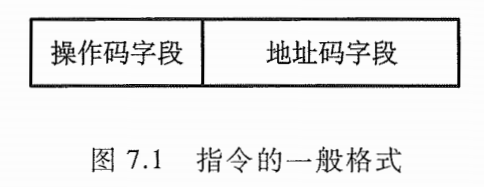

1、操作码

操作码用来指明该指令所要完成的操作，如加法、减法、传送、移位、转移等。通常，其位数反映了机器的操作种类，也即机器允许的指令条数，如操作码占 7 位，则该机器最多包含 $2^7$ = 128 条指令。

操作码的长度可以是固定的，也可以是变化的。前者将操作码集中放在指令字的一个字段内，如图 7.1 所示。这种格式便于硬件设计，指令译码时间短，广泛用于字长较长的、大中型计算机和超级小型计算机以及 RISC (Reduced Instruction Set Computer) 中。例如， IBM 370 和 VAX-11系列机，操作码长度均为 8 位。

对于操作码长度不固定的指令，其操作码分散在指令字的不同字段中。这种格式可有效地压缩操作码的平均长度，在字长较短的微型计算机中被广泛采用。例如 PDP-11 、 Intel 8086/80386 等操作码的长度是可变的。

操作码长度不固定会增加指令译码和分析的难度，使控制器的设计复杂。通常采用扩展操作码技术，使操作码的长度随地址数的减少而增加，不同地址数的指令可以具有不同长度的操作码，从而在满足需要的前提下，有效地缩短指令字长。图 7.2 是一种扩展操作码的安排示意图。

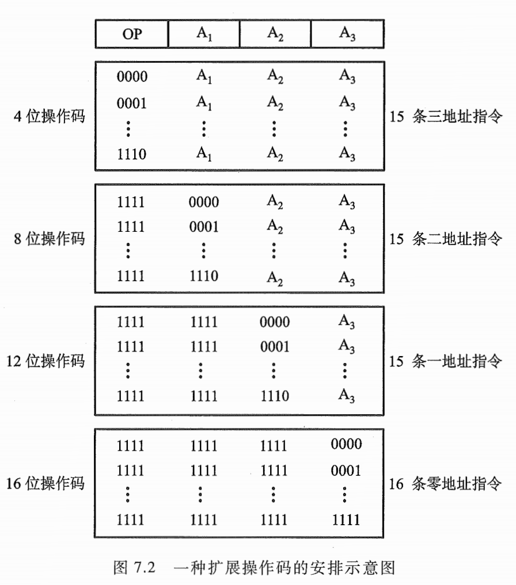

图 7.2 中指令字长为 16 位，其中 4 位为基本操作码字段 OP ，另有 3 个 4 位长的地址字段为 $A_1$、$A_2$ 和 $A_3$。 4 位基本操作码若全部用于三地址指令，则有 16 条。若采用扩展操作码技术，如图 7.2 所示，当操作码取 4 位时，三地址指令最多为 15 条；操作码取 8 位时，二地址指令最多为 15 条；操作码取 12 位时，一地址指令最多为 15 条；操作码取 16 位时，零地址指令为 16 条。共 61条。可见操作码的位数随地址数的减少而增加。

除了这种安排以外，还有其他多种扩展方法，例如，形成 15 条三地址指令、 12 条二地址指令、 31 条一地址指令和 16 条零地址指令，共 74 条指令，读者可自行安排。  

2、地址码

地址码用来指出该指令的源操作数的地址（一个或两个）、结果的地址以及下一条指令的地址。这里的“地址”可以是主存的地址，也可以是寄存器的地址，甚至可以是 I/O 设备的地址。

下面以主存地址为例，分析指令的地址码字段。  

(1) 四地址指令

这种指令的地址字段有 4 个，其格式如下：

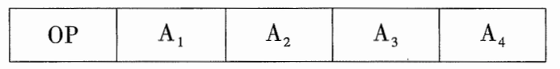

其中， OP 为操作码；$A_1$ 为第一操作数地址；$A_2$ 为第二操作数地址；$A_3$ 为结果地址；$A_4$ 为下一条指令的地址。

该指令完成 ($A_1$) OP ($A_2$) → $A_3$ 的操作。这种指令直观易懂，后续指令地址可以任意填写，可直接寻址的地址范围与地址字段的位数有关。如果指令字长为 32 位，操作码占 8 位， 4 个地址字段各占 6 位，则指令操作数的直接寻址范围为 $2^6$ = 64 。**如果地址字段均指示主存的地址，则完成一条四地址指令，共需访问 4 次存储器（取指令一次，取两个操作数两次，存放结果一次）。**

因为程序中大多数指令是按顺序执行的，而程序计数器 PC 既能存放当前欲执行指令的地址，又有计数功能，因此它能自动形成下一条指令的地址。这样，指令字中的第四地址字段 $A_4$ 便可省去，即得三地址指令格式。

(2) 三地址指令

三地址指令中只有 3 个地址，其格式如下：

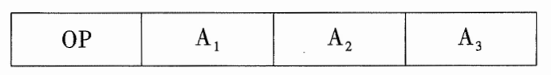

它可完成 ($A_1$) OP ($A_2$) → $A_3$ 的操作，后续指令的地址隐含在程序计数器 PC 之中。如果指令字长不变，设 OP 仍为 8 位，则 3 个地址字段各占 8 位，故三地址指令操作数的直接寻址范围可达 $2^8$ = 256 。同理，若地址字段均为主存地址，则完成一条三地址指令也需访问 4 次存储器。

机器在运行过程中，没有必要将每次运算结果都存入主存，中间结果可以暂时存放在 CPU 的寄存器 (如 ACC) 中，这样又可省去一个地址字段 $A_3$ ，从而得出二地址指令。

(3) 二地址指令

二地址指令中只含两个地址字段，其格式如下：

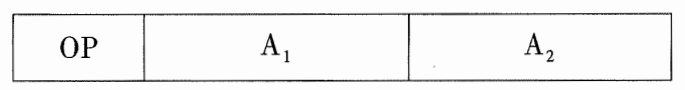

它可完成 ($A_1$) OP ($A_2$) → $A_1$ 的操作，即 $A_1$ 字段既代表源操作数的地址，又代表存放本次运算结果的地址。有的机器也可以表示 ($A_1$) OP ($A_2$) → $A_2$ 的操作，此时 $A_2$ 除了代表源操作数的地址外，还代表中间结果的存放地址。这两种情况完成一条指令仍需访问 4 次存储器。如果使其完成 ($A_1$) OP ($A_2$) → $ACC$ ，此时，它完成一条指令只需 3 次访存，它的含义是中间结果暂存累加器 ACC 中。在不改变指令字长和操作码的位数前提下，二地址指令操作数的直接寻址范围为 $2^{12}$ = 4 K 。

如果将一个操作数的地址隐含在运算器的 ACC 中，则指令字中只需给出一个地址码，构成一地址指令。

(4) 一地址指令

一地址指令的地址码字段只有一个，其格式如下：

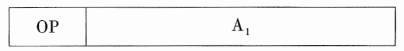

它可完成 ($ACC$) OP ($A_1$) → $ACC$ 的操作， ACC 既存放参与运算的操作数，又存放运算的中间结果这样，完成一条一地址指令只需两次访存。在指令字长仍为 32 位、操作码位数仍固定为 8 位时，一地址指令操作数的直接寻址范围达 $2^{24}$ 即 16 M 。

在指令系统中，还有一种指令可以不设地址字段，即所谓零地址指令。

(5) 零地址指令

零地址指令在指令字中无地址码，例如，空操作 (NOP) 、停机 (HLT) 这类指令只有操作码。而子程序返回 (RET) 、中断返回 (IRET) 这类指令没有地址码，其操作数的地址隐含在堆栈指针 SP 中（有关堆栈的概念详见 7.3.2 节）。

通过上述介绍可见，用一些硬件资源（如 PC 、 ACC）承担指令字中需指明的地址码，可在不改变指令字长的前提下，扩大指令操作数的直接寻址范围。此外，用 PC、ACC 等硬件代替指令字中的某些地址字段，还可缩短指令字长，并可减少访存次数。因此，究竟采用什么样的地址格式，必须从机器性能出发综合考虑。

以上讨论的地址格式均以主存地址为例，实际上地址字段也可用来表示寄存器。当 CPU 中含有多个通用寄存器时，对每一个寄存器赋予一个编号，便可指明源操作数和结果存放在哪个寄存器中。地址字段表示寄存器时，也可有三地址、二地址、一地址之分。**它们的共同点是，在指令的执行阶段都不必访问存储器，直接访问寄存器，使机器运行速度得到提高（因为寄存器类型的指令只需在取指阶段访问一次存储器）。**

### 指令字长

指令字长取决于操作码的长度、操作数地址的长度和操作数地址的个数。不同机器的指令字长是不相同的。

**早期的计算机指令字长、机器字长和存储字长均相等，因此访问某个存储单元，便可取出一条完整的指令或一个完整的数据。**这种机器的指令字长是固定的，控制方式比较简单。随着计算机的发展，存储容量的增大，要求处理的数据类型增多，计算机的指令字长也发生了很大的变化。一台机器的指令系统可以采用位数不相同的指令，即指令字长是可变的，如单字长指令、多字长指令。控制这类指令的电路比较复杂，而且多字长指令要多次访问存储器才能取出一条完整的指令，因此使 CPU 速度下降。为了提高指令的运行速度和节省存储空间，通常尽可能把常用的指令（如数据传送指令、算逻运算指令等）设计成单字长或短字长格式的指令。

例如， PDP-8 指令字长固定取 12 位； NOVA 指令字长固定取 16 位； IBM 370 指令字长可变，可以是 16 位（半个字）、32 位（一个字）、48 位（一字半）；Intel 8086 的指令字长可以为 8 、 16 、 24 、32 、 40 和 48 位六种。通常指令字长取 8 的整数倍。

## 7.2 操作数类型和操作类型

### 操作数类型

机器中常见的操作数类型有地址、数字、字符、逻辑数据等。

(1) 地址
地址实际上也可看作是一种数据，在许多情况下要计算操作数的地址。这时，地址可被认为是一个无符号的整数，有关地址的计算问题将在 7.3 节讨论。

(2) 数字
计算机中常见的数字有定点数、浮点数和十进制数。前两种数字在第 6 章中已进行了介绍，十进制数已在第 5 章附录中说明，读者可自行复习。

(3) 字符
在应用计算机时，文本或者字符串也是一种常见的数据类型。由于计算机在处理信息过程中不能以简单的字符形式存储和传送，因此普遍采用 ASCII 码，它是很重要的一种字符编码。当然还有其他一些字符编码，如 8 位 EBCDIC 码 (Extended Binary Coded Decimal Interchange Code) ，又称扩展 BCD 交换码，在此不做详述。

(4) 逻辑数据
计算机除了做算术运算外，有时还需做逻辑运算，此时 n 个 0 和 1 的组合不是被看作算术数字，而是被看作逻辑数。例如，在 ASCII 码中的 0110101 ，它表示十进制数 5 ，若要将它转换为 NBCD 短十进制码，只需通过它与逻辑数 0001111 完成逻辑与运算，抽取低 4 位，即可获得 0101 。此外，有时希望存储一个布尔类型的数据，它们的每一位都代表着真 (1) 和假 (0) ，这时 n 个 0 和 1 组合的数就都被看作逻辑数。

### 数据在存储器中的存放方式

通常计算机中的数据存放在存储器或寄存器中，**而寄存器的位数便可反映机器字长。**一般机器字长可取字节的 1、 2、4、8 倍，这样便于字符处理。在大、中型机器中字长为 32 位和 64 位，在微型计算机中字长从 4 位、 8 位逐渐发展到目前的 16 位、 32 位和 64 位。

图 7.3 中所示的存储器存储字长为 32 位，可按字节、半字、字、双字访问。在对准边界的 32 位字长的计算机中（如图 7.3 (a) 所示），半字地址是 2 的整数倍，字地址是 4 的整数倍，双字地址是 8 的整数倍。当所存数据不能满足此要求时，可填充一个至多个空白字节。而字节的次序有两种，如图 7.4 所示，其中 7.4(a) 表示低字节为低地址，图 7.4(b) 表示高字节为低地址。

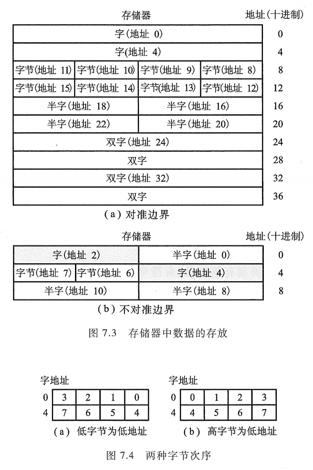

字节编址，数据在存储器中的存放方式

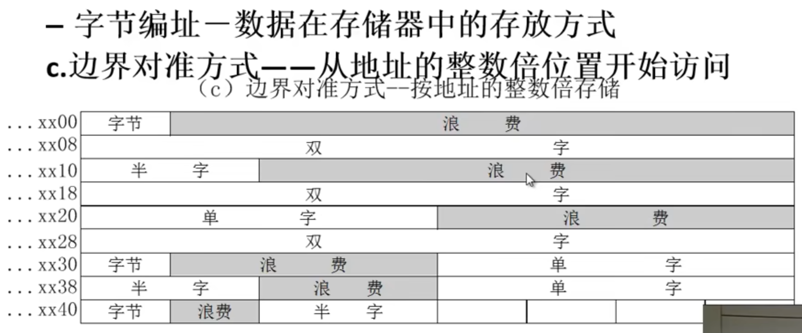

### 操作类型

不同的机器，操作类型也是不同的，但几乎所有的机器都有以下几类通用的操作。

1、数据传送

数据传送包括寄存器与寄存器、寄存器与存储单元、存储单元与存储单元之间的传送。如从源到目的之间的传送、对存储器读 (LOAD) 和写 (STORE) 、交换源和目的的内容、置 1 、清零、进栈、出栈等。

2、算术逻辑操作

这类操作可实现算术运算（加、减、乘、除、增 1 、减 1 、取负数即求补）和逻辑运算（与、或、非、  异或）。对于低档机而言，一般算术运算只支持最基本的二进制加减、比较、求补等，高档机还能支持浮点运算和十进制运算。

有些机器还具有位操作功能，如位测试（测试指定位的值）、位清除（清除指定位）、位求反（对指定位求反）等。

3、移位

移位可分为算术移位、逻辑移位和循环移位三种。算术移位和逻辑移位可分别实现对有符号数和无符号数乘以 $2^n$（左移）或整除以 $2^n$（右移）的运算，并且移位操作所需时间远比乘除操作执行时间短，因此，移位操作经常被用来代替简单的乘法和除法运算。

4、转移

在多数情况下，计算机是按顺序执行程序的每条指令的，但有时需要改变这种顺序，此刻可采用转移类指令来完成。转移指令按其转移特征又可分为无条件转移、条件转移、跳转、过程调用与返回、陷阱 (Trap) 等几种。

(1) 无条件转移

无条件转移不受任何条件约束，可直接把程序转移到下一条需执行指令的地址。例如 “JMP X” ，其功能是将指令地址无条件转至 X 。

(2) 条件转移

条件转移是根据当前指令的执行结果来决定是否需要转移。若条件满足，则转移；若条件不满足，则继续按顺序执行。一般机器都能提供一些条件码，这些条件码是某些操作的结果。例如：零标志位 (Z) ，结果为 0，Z=1 ；负标志位 (N) ，结果为负，N=1 ；溢出标志位 (V) ，结果有溢出，V=1 ；进位标志位 (C) ，最高位有进位， C=1 ；奇偶标志位 (P) ，结果呈偶数， P=1 等。

例如，指令 “BRO X” 表示若结果（有符号数）溢出 (V=1) ，则指令跳转至 X 。例如，指令 “BRC Y” 表示若最高位有进位 (C=1) ，则指令跳转至 Y 。

还有一种条件转移指令，SKP(Skip) ，它暗示其下一条指令将被跳过，从而隐含了转移地址 SKP 后的第二条指令。例如：

```
200
...
205 SKP DZ
206
207
```

这里 “SKP DZ” 表示若设备的完成触发器 D 为零，则执行完 205 条指令后，立即跳至第 207 条指令，再顺序执行。

(3) 调用与返回

在编写程序时，有些具有特定功能的程序段会被反复使用。为避免重复编写，可将这些程序段设定为独立子程序，当需要执行某子程序时，只需用子程序调用指令即可。此外，计算机系统还提供了通用子程序，如申请资源、读写文件、控制外设等。需要时均可由用户直接调用，不必重新编写。

**通常调用指令包括过程调用、系统调用和子程序调用。它可实现从一个程序转移到另一个程序的操作。**

**调用指令 (CALL) 一般与返回指令 (RETURN) 配合使用。 CALL 用于从当前的程序位置转至子程序的入口； RETURN 用于子程序执行完后重新返回到原程序的断点。**图 7.5 示意了调用(CALL) 和返回 (RETURN) 指令在程序执行中的流程。  

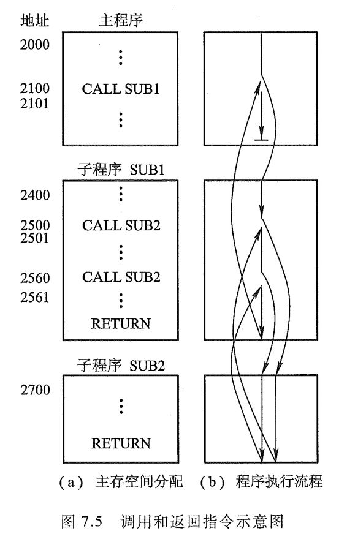

图 7.5 (a) 示意了主程序和子程序在主存所占空间。主程序从 2000 地址单元开始，并在 2100 处有一个调用指令，当执行到 2100 处指令时， CPU 停止下一条顺序号为 2101 的指令，而转2400 执行 SUB1 子程序。在 SUB1 中又有两次 (2500 和 2560 处）调用子程序 SUB2 。每一次都将 SUB1 挂起，而执行 SUB2 。子程序末尾的 RETURN 指令可使 CPU 返回调用点。

图 7.5(b) 示意了主程序 → SUB1 → SUB2 → SUB1 → SUB2 → SUB1 → 主程序的执行流程。需要注意以下几点：

- 子程序可在多处被调用。
- 子程序调用可出现在子程序中，即允许子程序嵌套。
- 每个 CALL 指令都对应一条 RETURN 指令。

由于可以在许多处调用子程序，因此， CPU 必须记住返回地址，使子程序能准确返回。返回地址可存放在以下 3 处：

- 寄存器内。机器内设有专用寄存器，专门用于存放返回地址。
- 子程序的入口地址内。
- 栈顶内。现代计算机都设有堆栈，执行 RETURN 指令后，便可自动从栈顶内取出应返回的地址。  

(4) 陷阱 (Trap) 与陷阱指令

**陷阱其实是一种意外事故的中断。**例如，机器在运行中，可能会出现电源电压不稳定、存储器校验出差错、输入输出设备出现了故障、用户使用未被定义的指令、除数出现为 0 、运算结果溢出以及特权指令等种种意外事件，致使计算机不能正常工作。此刻必须及时采取措施，否则将影响整个系统的正常运行。因此，一旦出现意外故障，计算机就发出陷阱信号，暂停当前程序的执行，转入故障处理程序进行相应的故障处理。

**计算机的陷阱指令一般不提供给用户直接使用，而作为隐指令（即指令系统中不提供的指令），在出现意外故障时，由 CPU 自动产生并执行。也有的机器设置供用户使用的陷阱指令或 “访管” 指令，利用它完成系统调用和程序请求。**例如， IBM PC (Intel 8086) 的软中断 INT TYPE (TYPE 是 8 位常数，表示中断类型) ，其实就是直接提供给用户使用的陷阱指令，用来完成系统调用。  

5、输入输出

对于 I/O 单独编址的计算机而言，通常设有输入输出指令，它完成从外设中的寄存器读入一个数据到 CPU 的寄存器内，或将数据从 CPU 的寄存器输出至某外设的寄存器中。

6、其他

其他包括等待指令、停机指令、空操作指令、开中断指令、关中断指令、置条件码指令等。为了适应计算机的信息管理、数据处理及办公自动化等领域的应用，有的计算机还设有非数值处理指令。如字符串传送、字符串比较、字符串查询及字符串转换等。

在多用户、多任务的计算机系统中，还设有特权指令，这类指令只能用于操作系统或其他系统软件，用户是不能使用的。

在有些大型或巨型机中，还设有向量指令，可对整个向量或矩阵进行求和、求积运算。在多处理器系统中还配有专门的多处理机指令。  


## 7.3 寻址方式

寻址方式是指确定本条指令的数据地址以及下一条将要执行的指令地址的方法，它与硬件结构紧密相关，而且直接影响指令格式和指令功能。

寻址方式分为指令寻址和数据寻址两大类。

### 指令寻址

指令寻址比较简单，它分为顺序寻址和跳跃寻址两种。

顺序寻址可通过程序计数器 PC 加 1 ，自动形成下一条指令的地址；跳跃寻址则通过转移类指令实现。图 7.6 示意了指令寻址过程。

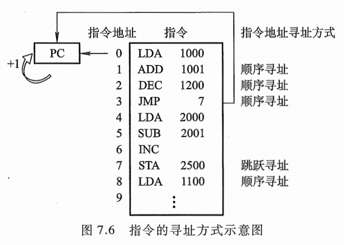

如果程序的首地址为 0 ，只要先将 0 送至程序计数器 PC 中，启动机器运行后，程序便按 0,1,2,3,7,8,9, …顺序执行。其中第 1 、2 、3 号指令地址均由 PC 自动形成。因第 3 号地址指令为 "JMP 7" ，故执行完第 3 号指令后，便无条件将 7 送至 PC ，因此，此刻指令地址跳过 4 、 5 、 6 三条，直接执行第 7 条指令，接着又顺序执行第 8 条、第 9 条等指令。

关于跳跃寻址的转移地址形成方式，将在 7.3.2 节的直接寻址和相对寻址中做介绍。

### 数据寻址

数据寻址方式种类较多，在指令字中必须设一字段来指明属于哪一种寻址方式。指令的地址码字段通常都不代表操作数的真实地址，故把它称为形式地址，记作 A。**操作数的真实地址称为有效地址，记作 EA ，它是由寻址方式和形式地址共同来确定的。**由此可得指令的格式应如图 7.7 所示。

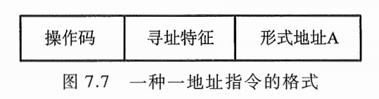

为了便于分析研究各类寻址方式，假设指令字长、存储字长、机器字长均相同。

1、立即寻址

**立即寻址的特点是操作数本身设在指令字内，即形式地址 A 不是操作数的地址，而是操作数本身，又称之为立即数。**数据是采用补码形式存放的，如图 7.8 所示，图中“#”表示立即寻址特征标记。

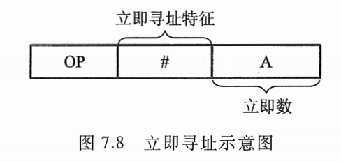

**可见，它的优点在于只要取出指令，便可立即获得操作数，这种指令在执行阶段不必再访问存储器。显然 A 的位数限制了这类指令所能表述的立即数的范围。**

2、直接寻址

直接寻址的特点是，指令字中的形式地址 A 就是操作数的真实地址 EA ，即：EA = A

图 7.9 示意了直接寻址。

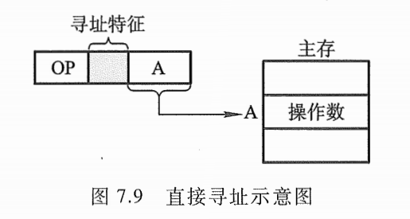

它的优点是寻找操作数比较简单，也不需要专门计算操作数的地址，**在指令执行阶段对主存只访问一次。**它的缺点在于 A 的位数限制了操作数的寻址范围，而且必须修改 A 的值，才能修改操作数的地址。

3、隐含寻址

隐含寻址是指指令字中不明显地给出操作数的地址，其操作数的地址隐含在操作码或某个寄存器中。**例如，一地址格式的加法指令只给出一个操作数的地址，另一个操作数隐含在累加器 ACC 中，这样累加器 ACC 成了另一个数的地址。**图 7.10 示意了隐含寻址。

又如 IBM PC (Intel 8086) 中的乘法指令，被乘数隐含在寄存器 AX(16 位) 或寄存器 AL(8位) 中，可见 AX(或 AL) 就是被乘数的地址。**又如字符串传送指令 MOVS ，其源操作数的地址隐含在 SI 寄存器中（即操作数在 SI 指明的存储单元中），目的操作数的地址隐含在 DI 寄存器中。**

由于隐含寻址在指令字中少了一个地址，因此，这种寻址方式的指令有利于缩短指令字长。

4、间接寻址

倘若指令字中的形式地址不直接指出操作数的地址，而是指出操作数有效地址所在的存储单元地址，也就是说，有效地址是由形式地址间接提供的，即为间接寻址，即 EA = (A) ，如图 7.11 所示。  

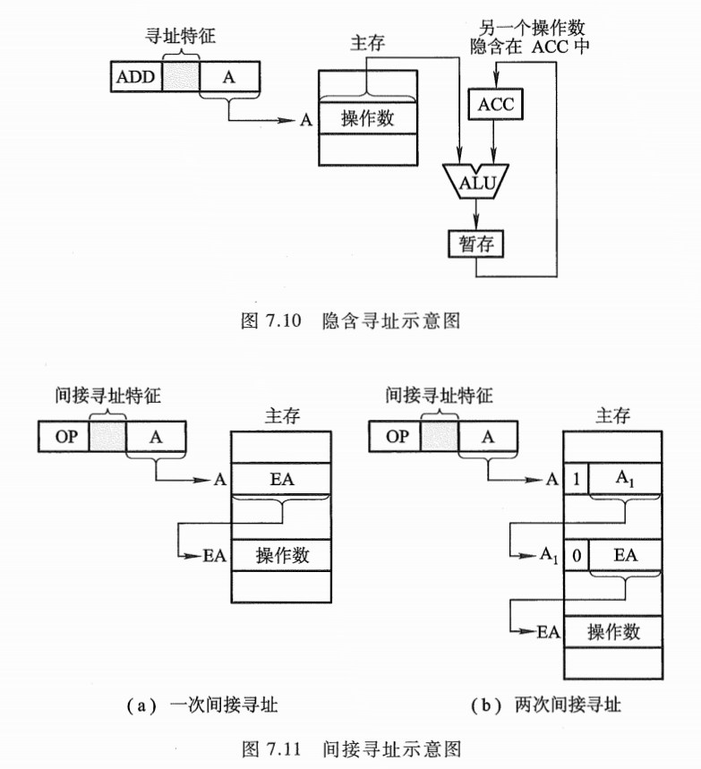

图 7.11(a) 为一次间接寻址，即 A 地址单元的内容 EA 是操作数的有效地址；图 7.11(b) 为两次间接寻址，即 A 地址单元的内容 $A_1$ 还不是有效地址，而由 $A_1$ 所指单元的内容 EA 才是有效地址。

**这种寻址方式与直接寻址相比，它扩大了操作数的寻址范围**，因为 A 的位数通常小于指令字长，而存储字长可与指令字长相等。若设指令字长和存储字长均为 16 位， A 为 8 位，显然直接寻址范围为 $2^8$ ，一次间接寻址的寻址范围可达 $2^{16}$ 。当多次间接寻址时，可用存储字的首位来标志间接寻址是否结束。如图 7.11(b) 中，当存储字首位为 “1” 时，标明还需继续访存寻址；当存储字首位为 “0” 时，标明该存储字即为 EA 。由此可见，存储字首位不能作为 EA 的组成部分，因此，它的寻址范围为 $2^{15}$。

**间接寻址的第二个优点在于它便于编制程序。**例如，用间接寻址可以很方便地完成子程序返回，图 7.12 示意了用于子程序返回的间址过程。

图中表示两次调用子程序，只要在调用前先将返回地址存入子程序最末条指令的形式地址 A 的存储单元内，便可准确返回到原程序断点。例如，第一次调用前，使 [A] = 81 ，第二次调用前，使 [A] = 202 。这样，当第一次子程序执行到最末条指令 “JMP @A” (＠为间址特征位），便可无条件转至 81 号单元。同理，第二次执行完子程序后，便可返回到 202 号单元。

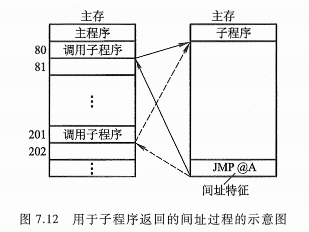

**间接寻址的缺点在于指令的执行阶段需要访存两次（一次间接寻址）或多次（多次间接寻址），致使指令执行时间延长。**

5、寄存器寻址

在寄存器寻址的指令字中，地址码字段直接指出了寄存器的编号，即 EA = $R_i$，如图 7.13 所示。**其操作数在由 $R_i$ 所指的寄存器内。由于操作数不在主存中，故寄存器寻址在指令执行阶段无须访存，减少了执行时间。**由于地址字段只需指明寄存器编号（计算机中寄存器数有限），故指令字较短，节省了存储空间，因此寄存器寻址在计算机中得到广泛应用。

6、寄存器间接寻址

图 7.14 示意了寄存器间接寻址过程：

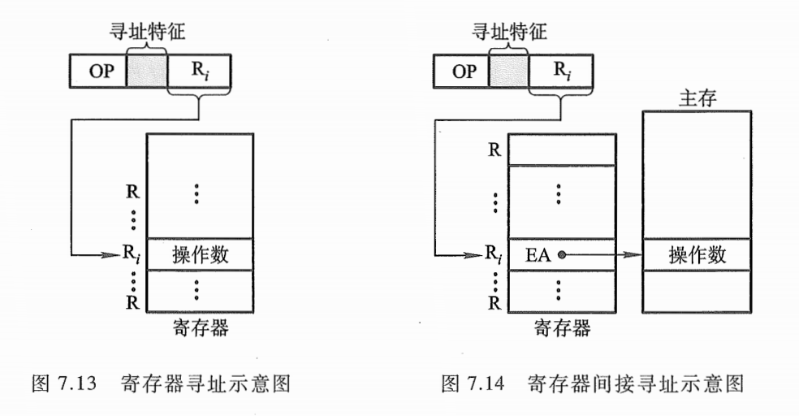

图中 $R_i$ 中的内容不是操作数，而是操作数所在主存单元的地址号，即有效地址 EA = ($R_i$) 。与寄存器寻址相比，指令的执行阶段还需访问主存。与图 7.11(a) 相比，因有效地址不是存放在存储单元中，而是存放在寄存器中，故称其为寄存器间接寻址，它比间接寻址少访存一次。

7、基址寻址

**基址寻址需设有基址寄存器 BR ，其操作数的有效地址 EA 等于指令字中的形式地址与基址寄存器中的内容（称为基地址）相加，即：EA = A + (BR) 。**

图 7.15 示意了基址寻址过程：

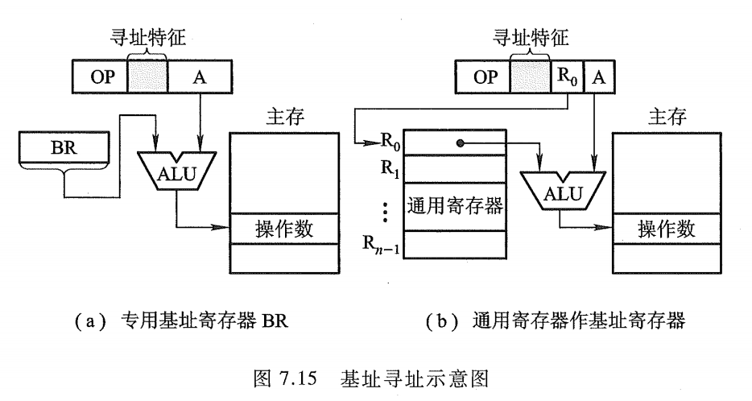

基址寄存器可采用隐式的和显式的两种。所谓隐式，是在计算机内专门设有一个基址寄存器 BR ，使用时用户不必明显指出该基址寄存器，只需由指令的寻址特征位反映出基址寻址即可。显式是在一组通用寄存器里，由用户明确指出哪个寄存器用作基址寄存器，存放基地址。例如，IBM 370 计算机中设有 16 个通用寄存器，用户可任意选中某个寄存器作为基址寄存器。对应图 7.15 (a) 为隐式基址寻址，图 7.15 (b) 为显式基址寻址。

**基址寻址可以扩大操作数的寻址范围，因基址寄存器的位数可以大于形式地址 A 的位数。当主存容量较大时，若采用直接寻址，因受 A 的位数限制，无法对主存所有单元进行访问，但采用基址寻址便可实现对主存空间的更大范围寻访。例如，将主存空间分为若干段，每段首地址存于基址寄存器中，段内的位移量由指令字中形式地址 A 指出，这样操作数的有效地址就等于基址寄存器内容与段内位移量之和，只要对基址寄存器的内容做修改，便可访问主存的任一单元。**

基址寻址在多道程序中极为有用。用户可不必考虑自己的程序存于主存的哪一空间区域，完全可由操作系统或管理程序根据主存的使用状况，赋予基址寄存器内一个初始值（即基地址），便可将用户程序的逻辑地址转化为主存的物理地址（实际地址），把用户程序安置于主存的某一空间区域。例如，**对于一个具有多个寄存器的机器来说，用户只需指出哪一个寄存器作为基址寄存器即可，至于这个基址寄存器应赋予何值，完全由操作系统或管理程序根据主存空间状况来确定。在程序执行过程中，用户不知道自己的程序在主存的哪个空间，用户也不可修改基址寄存器的内容，以确保系统安全可靠地运行。**  

8、变址寻址

变址寻址与基址寻址极为相似。其有效地址 EA 等于指令字中的形式地址 A 与变址寄存器 IX 的内容相加之和，即：EA = A + (IX)

显然只要变址寄存器位数足够，也可扩大操作数的寻址范围，其寻址过程如图 7.16 所示。

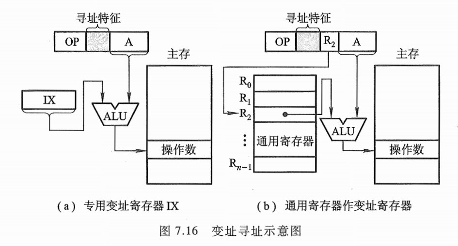

图 7.16(a)、(b) 与图 7.15(a)、(b) 相比，显见变址寻址与基址寻址的有效地址形成过程极为相似。由于两者的应用场合不同，因此从本质来认识，它们还是有较大的区别。

基址寻址主要用于为程序或数据分配存储空间，故基址寄存器的内容通常由操作系统或管理程序确定，在程序的执行过程中其值是不可变的，而指令字中的 A 是可变的。**在变址寻址中，变址寄存器的内容是由用户设定的，在程序执行过程中其值可变，而指令字中的 A 是不可变的。变址寻址主要用于处理数组问题，在数组处理过程中，可设定 A 为数组的首地址，不断改变变址寄存器 IX 的内容，便可很容易形成数组中任一数据的地址，特别适合编制循环程序。**

例如，某数组有 N 个数存放在以 D 为首地址的主存一段空间内。如果求 N 个数的平均值，则用直接寻址方式很容易完成程序的编制。表 7.1 列出了用直接寻址求 N 个数平均值的程序：

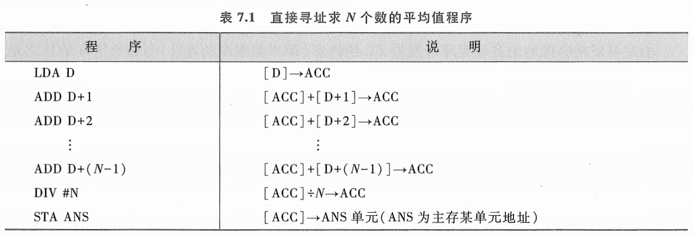

显然，当 N= 100 时，该程序用了 102 条指令，除数据外，共占用 102 个存储单元存放指令。而且随 N 的增加，程序所用的指令数也增加（共 N+2 条）。

若用变址寻址，则只要改变变址寄存器的内容，而保持指令 “ADD X, D”（X 为变址寄存器， D 为形式地址）不变，便可依次完成 N 个数相加。用变址寻址编制的程序如表 7.2 所示：

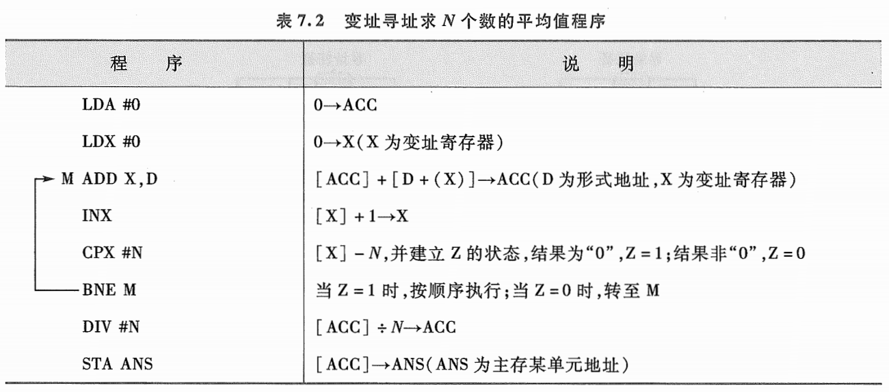

该程序仅用了 8 条指令，而且随 N 的增加，指令数不变，指令所占的存储单元大大减少。

有的机器（如 Intel 8086 、 VAX-11）的变址寻址具有自动变址的功能，即每存取一个数据，根据数据长度（即所占字节数），变址寄存器能自动增量或减量，以便形成下一个数据的地址。

**变址寻址还可以与其他寻址方式结合使用。例如，变址寻址可与基址寻址合用，此时有效地址 EA 等于指令字中的形式地址 A 和变址寄存器 IX 的内容 (IX) 及基址寄存器 BR 中的内容 (BR) 相加之和，即：EA = A + (IX) + (BR) 。**

**变址寻址还可与间接寻址合用，形成先变址后间址或先间址再变址等寻址方式，**读者在使用各类机器时可注意分析。  

9、相对寻址

相对寻址的有效地址是将程序计数器 PC 的内容（即当前指令的地址）与指令字中的形式地址 A 相加而成，即：EA = (PC) + A 。

图 7.17 示意了相对寻址的过程，由图中可见，操作数的位置与当前指令的位置有一段距离 A 。

相对寻址常被用于转移类指令，转移后的目标地址与当前指令有一段距离，称为相对位移量，它由指令字的形式地址 A 给出，故 A 又称位移量。位移量 A 可正可负，通常用补码表示。倘若位移量为 8 位，则指令的寻址范围在 `(PC) + 127` ~ `(PC) - 128` 之间。

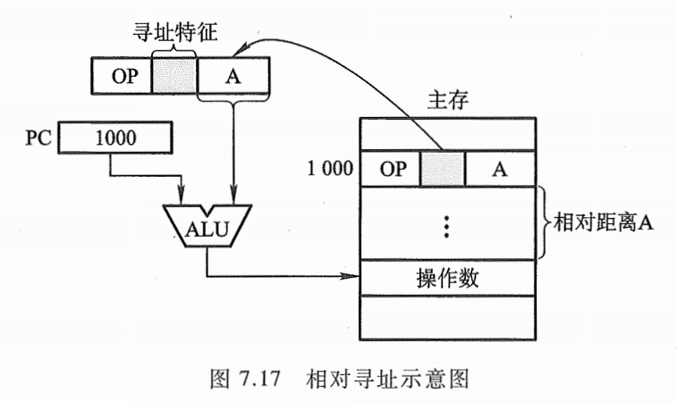

**相对寻址的最大特点是转移地址不固定，它可随 PC 值的变化而变，因此，无论程序在主存的哪段区域，都可正确运行，对于编写浮动程序特别有利。**例如，表 7.2 中有一条转移指令 “BNE M” ，它存于 M+3 单元内，也即

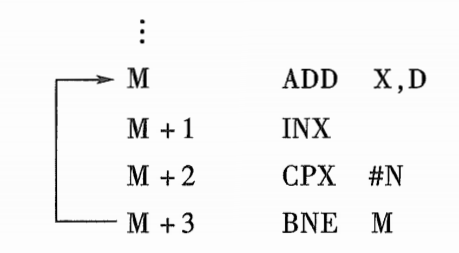

显然，随程序首地址改变， M 也改变。如果采用相对寻址，将 “BNE M” 改写为 “BNE * - 3” (＊为相对寻址特征），就可使该程序浮动至任一地址空间都能正常运行。因为从第 M+3 条指令转至第 M 条指令，其相对位移量为－3 ，故当执行第 M+3 条指令 “BNE * - 3” 时，其有效地址为：EA = (PC) + (-3) = M + 3 - 3 = M ，直接指向了转移后的目标地址。

相对寻址也可与间接寻址配合使用。  

10、堆栈寻址

**堆栈寻址要求计算机中设有堆栈。堆栈既可用寄存器组（称为硬堆栈）来实现，也可利用主存的一部分空间作堆栈（称为软堆栈）**。堆栈的运行方式为先进后出或先进先出两种，先进后出型堆栈的操作数只能从一个口进行读或写。以软堆栈为例，可用堆栈指针 SP (Stack Point) 指出栈顶地址，也可用 CPU 中一个或两个寄存器作为 SP 。**操作数只能从栈顶地址指示的存储单元存或取。可见堆栈寻址也可视为一种隐含寻址，其操作数的地址总被隐含在 SP 中。堆栈寻址就其本质也可视为寄存器间接寻址，因 SP 可视为寄存器，它存放着操作数的有效地址。**图 7.18示意了堆栈寻址过程。  

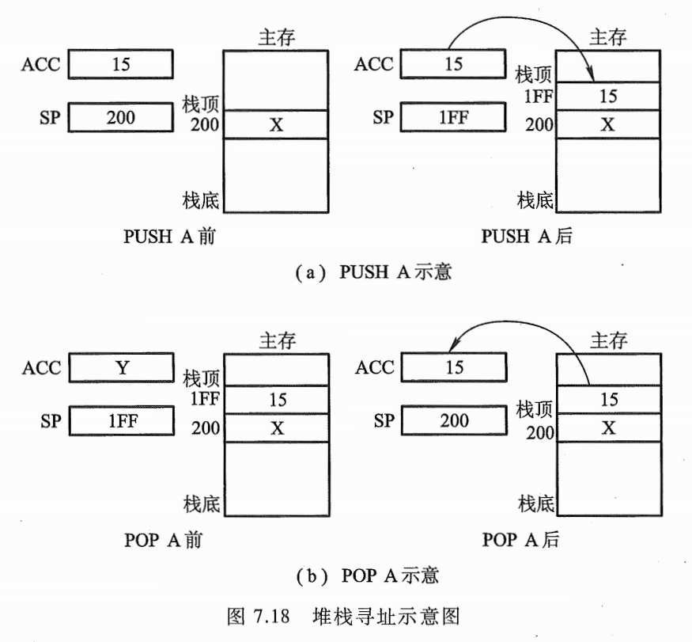

图 7.18 (a) 、(b) 分别表示进栈 “PUSH A” 和出栈 “POP A” 的过程。

由于 SP 始终指示着栈顶地址，因此不论是执行进栈 (PUSH)，还是出栈 (POP)，SP 的内容都需要发生变化。若栈底地址大于栈顶地址，则每次进栈 $(\text{SP}) - \Delta \rightarrow \text{SP}$；每次出栈 $(\text{SP}) + \Delta \rightarrow \text{SP}$ 。 $\Delta$ 取值与主存编址方式有关。若按字编址，则 $\Delta$ 取 1 （如图 7.18 所示） ；若按字节编址，则需根据存储字长是几个字节构成才能确定 $\Delta$ ，例如字长为 16 位，则 $\Delta$ = 2 ，字长为 32 位， $\Delta$ = 4 。

由于当前计算机种类繁多，各类机器的寻址方式均有各自的特点，还有些机器的寻址方式可能本书并未提到，故读者在使用时需自行分析，以利于编程。

从高级语言角度考虑问题，机器指令的寻址方式对用户无关紧要，但一旦采用汇编语言编程，用户只有了解并掌握机器的寻址方式，才能正确编程，否则程序将无法正常运行。如果读者参与机器的指令系统设计，则了解寻址方式对确定机器指令格式是不可缺少的。从另一角度来看，倘若透彻了解了机器指令的寻址方式，将会使读者进一步加深对机器内信息流程及整机工作概念的理解。


## 7.4 指令格式举例

指令格式不仅体现了指令系统的各种功能，而且也突出地反映了机器的硬件结构特点。设计指令格式时必须从诸多方面综合考虑，并经一段模拟运行后，最后确定。

### 设计指令格式应考虑的各种因素

指令系统集中反映了机器的性能，又是程序员编程的依据。用户在编程时既希望指令系统很丰富，便于用户选择，同时还要求机器执行程序时速度快、占用主存空间少，实现高效运行。此外，为了继承已有的软件，必须考虑新机器的指令系统与同一系列机器指令系统的兼容性，即高档机必须能兼容低档机的程序运行，称之为“向上兼容”。

指令格式集中体现了指令系统的功能，为此，在确定指令格式时，必须从以下几个方面综合考虑。

1. 操作类型：包括指令数及操作的难易程度。
2. 数据类型：确定哪些数据类型可以参与操作。
3. 指令格式：包括指令字长、操作码位数、地址码位数、地址个数、寻址方式类型，以及指令字长和操作码位数是否可变等。
4. 寻址方式：包括指令和操作数具体有哪些寻址方式。
5. 寄存器个数：寄存器的多少直接影响指令的执行时间。  


## 7.5 RISC技术

RISC 即精简指令系统计算机 (Reduced Instruction Set Computer) ，与其对应的是 CISC ，即复杂指令系统计算机 (Complex Instruction Set Computer) 。  

### RISC的产生和发展

计算机发展至今，机器的功能越来越强，硬件结构越来越复杂。尤其是随着集成电路技术的发展及计算机应用领域的不断扩大，计算机系统的软件价格相对而言在不断提高。为了节省开销，人们希望已开发的软件能被继承、兼容，这就希望新机种的指令系统和寻址方式一定能包含旧机种所有的指令和寻址方式。通过向上兼容不仅可降低新机种的开发周期和代价，还可吸引更多的新、老用户，于是出现了同类型的系列机。在系列机的发展过程中，致使同一系列计算机指令系统变得越来越复杂，某些机器的指令系统竟可包含几百条指令。例如， DEC 公司的 VAX-11/780 有 16 种寻址方式、9 种数据格式、303 条指令。又如， 32 位的 68020 微型计算机指令种数比 6800 多两倍，寻址方式多 11 种，达 18 种之多，指令长度从一个字 (16 位）发展到 16 个字。这类机器被称为复杂指令系统计算机，简称 CISC 。

通常对指令系统的改进都是围绕着缩小与高级语言语义的差异和有利于操作系统的优化而进行的。**由于编写编译器的人们的任务是为每一条高级语言的语句编制一系列的机器指令，如果机器指令能类似于高级语言的语句，显然编写编译器的任务就变得十分简单了。**于是人们产生了用增加复杂指令的办法来缩短与语义的差距。**后来又发现，倘若编译器过多依赖复杂指令，同样会出现新的矛盾。例如，对减少机器代码、降低指令执行数以及为提高流水性能而优化生成代码等都是非常不利的。**尤其当指令过于复杂时，机器的设计周期会很长，资金耗费会更大。例如， Intel 80386 32 位机器耗资达 1.5 亿美元，开发时间长达三年多，结果正确性还很难保证，维护也很困难。最值得一提的例子是， 1975 年 IBM 公司投资 10 亿美元研制的高速机器 FS 机，最终以“复杂结构不宜构成高速计算机”的结论宣告研制失败。

为了解决这些问题， 20 世纪 70 年代中期，人们开始进一步分析研究 CISC ，发现一个 80-20 规律，即典型程序中 80％ 的语句仅仅使用处理机中 20％ 的指令，而且这些指令都是属于简单指令，如取数、加、转移等。这一点告诫人们，付出再大的代价增添复杂指令，也仅有 20％的使用概率，而且当执行频度高的简单指令时，因复杂指令的存在，致使执行速度也无法提高。表 7.3 是 HP 公司对 IBM 370 高级语言中指令使用频度的分析结果。 Marathe 在 1978 年对 PDP-11 机在五种不同应用领域中的指令进行混合测试，也得出了类似的结论。  

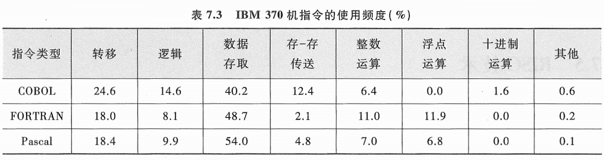

另一方面，**在 20 世纪 70 年代末 80 年代初，计算机的器件已进入 VLSI 时代，复杂的指令系统需要复杂的控制器，这需要占用较多的芯片面积。统计表明，典型的 CISC 计算机中，控制器约占 60％ 的芯片面积，而且使设计、验证和实现都更加困难。**

**人们从 80-20 规律中得到启示：能否仅仅用最常用的 20％ 的简单指令，重新组合不常用的 80％ 的指令功能呢？这便引发出 RISC 技术。**

1975 年 IBM 公司 John Cocke 提出了精简指令系统的设想，1982 年美国加州大学伯克利分校的研究人员专门研究了如何有效利用 VLSIC （Very Large Scale Integrated Circuit 超大规模集成电路）的有效空间。 **RISC 由于设计的指令条数有限，相对而言，它只需用较小的芯片空间便可制作逻辑控制电路，更多的芯片空间可用来增强处理机的性能或使其功能多样化。他们用大部分芯片空间做成寄存器，并且用它们作为暂时数据存储的快速存储区，从而有效地降低了 RISC 机器在调用子程序时所需付出的时间。**他们研制的 RISC I ( 后来又出现 RISC Il ) ，采用 VLSI CPU 芯片上的晶体管数量达 44 000 个，线宽为 3 µm ，字长为 32 位，其中有 128 个寄存器（而用户只能见到 32 个），仅有 31 条指令和两种寻址方式，访存指令只有两条，即取数 (LOAD) 和存数 (STORE) 。显然其指令系统极为简单，但它们的功能已超过 VAX-11/780 和 M68000 ，其速度比 VAX-11/780 快了 1 倍。

与此同时，**美国斯坦福大学 RISC 研究的课题是 MIPS (Micro Processor without Interlocking Pipeline Stages) ，即消除流水线各段互锁的微处理器。**他们把 IBM 公司对优化编译程序的研究与加州大学伯克利分校对 VLSI 有效空间利用的思想结合在一起，最终的研究成果后来转化为 MIPS 公司 RX000 的系列产品。 IBM 公司又继其 IBM801 型机、 IBM RT/PC 后，于 1990 年推出了著名的 IBM RS/6000 系列产品。加州大学伯克利分校的研究成果最后发展成 Sun 微系统公司的 RISC 芯片，称为 SPARC (Scalable Processor ARChitecture) 。

**到目前为止， RISC 体系结构的芯片可以说已经历了 3 代**：第一代以 32 位数据通路为代表，支持 Cache ，软件支持较少，性能与 CISC 体系结构的产品相当，如 RISC I 、 MIPS 、 IBM801 等。第二代产品提高了集成度，增加了对多处理机系统的支持，提高了时钟频率，建立了完善的存储管理体系，软件支持系统也逐渐完善。它们已具有单指令流水线，可同时执行多条指令，每个时钟周期发出一条指令（有关流水线的概念详见 8.3 节）。例如， MIPS 公司的 R3000 处理器，时钟频率为 25 MHz 和 33 MHz ，集成度达 11.5 万个晶体管，字长为 32 位。第三代 RISC 产品为 64 位微处理器，采用了巨型计算机或大型计算机的设计技术——超级流水线 (Superpipelining) 技术和超标量 (Superscalar) 技术，提高了指令级的并行处理能力，每个时钟周期发出 2 条或 3 条指令，使 RISC 处理器的整体性能更好。例如， MIPS 公司的 R4000 处理器采用 50 MHz 和 75 MHz 的外部时钟频率，内部流水时钟达 100 MHz 和 150 MHz ，芯片集成度高达 110 万个晶体管，字长 64 位，并有 16 KB 的片内 Cache 。它有 R4000PC 、 R4000SC 和 R4000MC 三种版本，对应不同的时钟频率，分别提供给台式系统、高性能服务器和多处理器环境下使用。表 7.4 列出了 MIPS 公司 R 系列 RISC 处理器的几项指标。

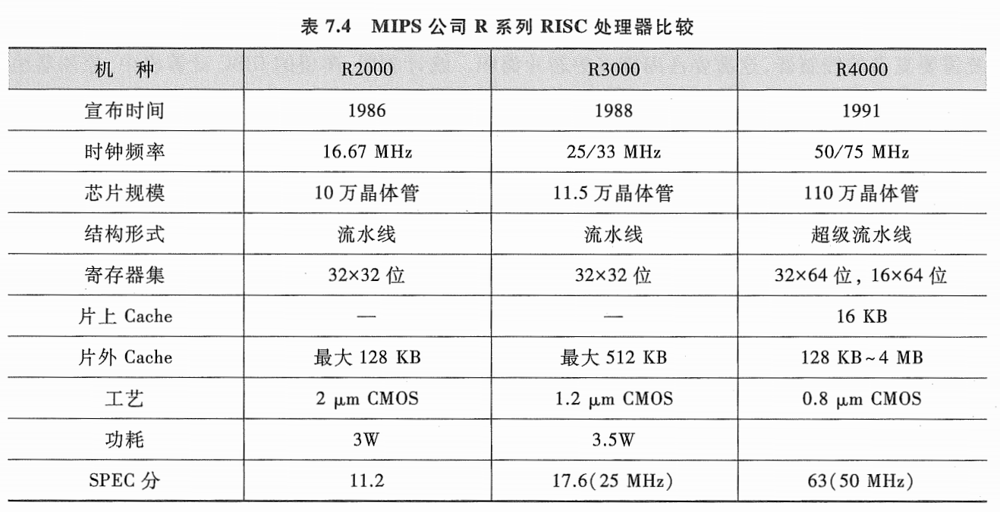

自 1983 年开始出现商品化的 RISC 机以来，比较著名的 RISC 机有 IBM 公司的 IBM RT 系列， HP 公司的精密结构计算机 (HPPA) 、 MIPS R3000 、 Motorola M88000 、 Intel 80960 、 INMOSTransputer 、 AMD AM29000 、 Fairchild Clipper 等。其中， Clipper 兼顾了 RISC 和 CISC 两方面的特点，又称为类 RISC 机。在计算机工作站方面， Sun Microsystems 公司于 1987 年推出 SPARC ，速度达 7 ~ 10 MIPS 。 1988 年 Apollo 公司推出 Series 10000 个人超级计算机，称为并行精简指令系统多处理机 PRISM (Parallel Reduced Instruction Set Multiprocessor) ，单机系统速度达 15 ~ 25 MIPS, 四处理机则可达 60 ~ 100 MIPS ，后来 HP 合并了 Apollo 公司，继续发展工作站。

较为著名的第三代 RISC 机的有关性能指标如表 7.5 所示。

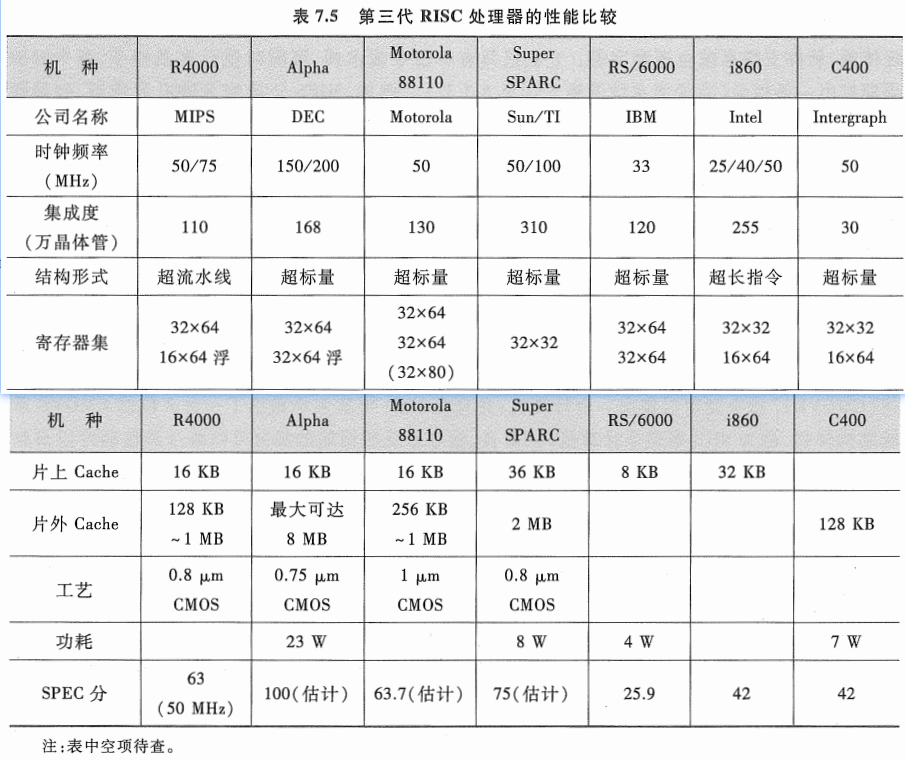


### RISC的主要特征

**由上分析可知， RISC 技术是用 20％的简单指令的组合来实现不常用的 80％的那些指令功能，但这不意味着 RISC 技术就是简单地精简其指令集。**在提高性能方面， RISC 技术还采取了许多有效措施，最有效的方法就是减少指令的执行周期数。

计算机执行程序所需的时间 P 可用下式表述：

```
P = I x C x T
```

其中， I 是高级语言程序编译后在机器上运行的机器指令数； C 为执行每条机器指令所需的平均机器周期； T 是每个机器周期的执行时间。

表 7.6 列出了第二代 RISC 机与 CISC 机的 I 、 C 、 T 统计，其中 I 、 T 为比值， C 为实际周期数。

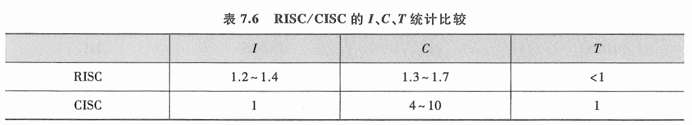

**由于 RISC 指令比较简单，用这些简单指令编制出的子程序来代替 CISC 机中比较复杂的指令，因此 RISC 中的 I 比 CISC 多 20% ~40% 。但 RISC 的大多数指令仅用一个机器周期完成， C 的值比 CISC 小得多。而且 RISC 结构简单，完成一个操作所经过的数据通路较短，使 T 值也大大下降。因此总折算结果， RISC 的性能仍优于 CISC 2 ~ 5 倍。**

由于计算机的硬件和软件在逻辑上的等效性，使得指令系统的精简成为可能。曾有人在1956 年就证明，只要用一条“把主存中指定地址的内容同累加器中的内容求差，把结果留在累加器中并存入主存原来地址中”的指令，就可以编出通用程序。又有人提出，只要用一条”条件传送 (CMOVE)” 指令就可以做出一台计算机；并且在 1982 年某大学做出了一台 8 位的 CMOVE 系统结构样机，称为 SIC （单指令计算机）。而且，指令系统所精简的部分可以通过其他部件以及软件（编译程序）的功能来替代，因此，实现 RISC 技术是完全可能的。

1、RISC 的主要特点

**通过对 RISC 各种产品的分析，可归纳出 RISC 机应具有如下一些特点：**

1. 选取使用频度较高的一些简单指令以及一些很有用但又不复杂的指令，让复杂指令的功能由频度高的简单指令的组合来实现。
2. 指令长度固定，指令格式种类少，寻址方式种类少。
3. 只有取数／存数 (LOAD/STORE) 指令访问存储器，其余指令的操作都在寄存器内完成。
4. CPU 中有多个通用寄存器。
5. 采用流水线技术，大部分指令在一个时钟周期内完成。采用超标量和超流水线技术，可使每条指令的平均执行时间小于一个时钟周期。
6. 控制器采用组合逻辑控制，不用微程序控制。
7. 采用优化的编译程序。

值得注意的是，商品化的 RISC 机通常不会是纯 RISC 机，故上述这些特点不是所有 RISC 机全部具备的。

相比之下， CISC 的指令系统复杂庞大，各种指令使用频度相差很大；指令字长不固定，指令格式多，寻址方式多；可以访存的指令不受限制； CPU 中设有专用寄存器；绝大多数指令需要多个时钟周期方可执行完毕；采用微程序控制器；难以用优化编译生成高效的目标代码。

表 7.7 列出了一些 RISC 机指令系统的指令条数。

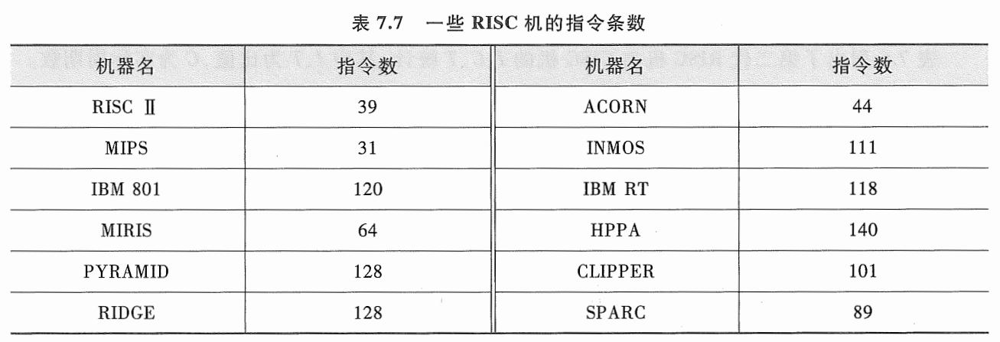

3、RISC 指令系统的扩充

从实用角度出发，商品化的 RISC 机，因用途不同还可扩充一些指令，例如：

1. 浮点指令，用于科学计算的 RISC 机。为了提高机器速度而增设浮点指令。
2. 特权指令，为了便于操作系统管理机器，防止用户破坏机器的运行环境而特设特权指令。
3. 读后置数指令，完成读一修改—写，用于寄存器与存储单元交换数据等。
4. 一些简单的专用指令。例如，某些指令用得较多，实现起来又比较复杂，若用子程序来实现，占用较多的时间，则可考虑设置一条指令来缩短子程序执行时间。有些机器用乘法步指令来加快乘法运算的执行速度。  


### RISC和CISC的比较

与 CISC 机相比， RISC 机的主要优点可归纳如下：

1、充分利用 VLSI 芯片的面积

CISC 机的控制器大多采用微程序控制（详见第 10 章），其控制存储器在 CPU 芯片内所占的面积为 50％以上（如 Motorola 公司的 MC68020 占 68% ）。而 RISC 机控制器采用组合逻辑控制（详见第 10 章），其硬布线逻辑只占 CPU 芯片面积的 10％ 左右。可见它可将空出的面积供其他功能部件用，例如用于增加大量的通用寄存器（如 Sun 微系统公司的 SPARC 有 100 多个通用寄存器），或将存储管理部件也集成到 CPU 芯片内（如 MIPS 公司的 R2000/R3000) 。

随着半导体工艺技术的提高，集成度可达 100 万至几百万个晶体管，此时无论是 CISC 还是 RISC 都将多个功能部件集成在一个芯片内。但此时 RISC 已占领了市场，尤其是在工作站领域占有明显的优势。

2、提高计算机运算速度

RISC 机能提高运算速度，主要反映在以下 5 个方面：

1. RISC 机的指令数、寻址方式和指令格式种类较少，而且指令的编码很有规律，因此 RISC的指令译码比 CISC 的指令译码快。
2. RISC 机内通用寄存器多，减少了访存次数，可加快运行速度。
3. RISC 机采用寄存器窗口重叠技术，程序嵌套时不必将寄存器内容保存到存储器中，故又提高了执行速度。
4. RISC 机采用组合逻辑控制，比采用微程序控制的 CISC 机的延迟小，缩短了 CPU 的周期。
5. RISC 机选用精简指令系统，适合于流水线工作，大多数指令在一个时钟周期内完成。

3、便于设计，可降低成本，提高可靠性

RISC 机指令系统简单，故机器设计周期短，如美国加州大学伯克利分校的 RISC I 机从设计到芯片试制成功只用了十几个月，而 Intel 80386 处理器 (CISC) 的开发花了三年半时间。

RISC 机逻辑简单，设计出错可能性小，有错时也容易发现，可靠性高。

4、有效支持高级语言程序

RISC 机靠优化编译来更有效地支持高级语言程序。由于 RISC 指令少，寻址方式少，使编译程序容易选择更有效的指令和寻址方式，而且由于 RISC 机的通用寄存器多，可尽量安排寄存器的操作，使编译程序的代码优化效率提高。例如， IBM 的研究人员发现， IBM 801（RISC 机）产生的代码大小是 IBM S/370（CISC 机）的 90% 。

有些 RISC 机（如 Sun 公司的 SPARC) 采用寄存器窗口重叠技术，使过程间的参数传送加快，且不必保存与恢复现场，能直接支持调用子程序和过程的高级语言程序。表 7.8 列出了一些 CISC 与 RISC 微处理器的特征。  

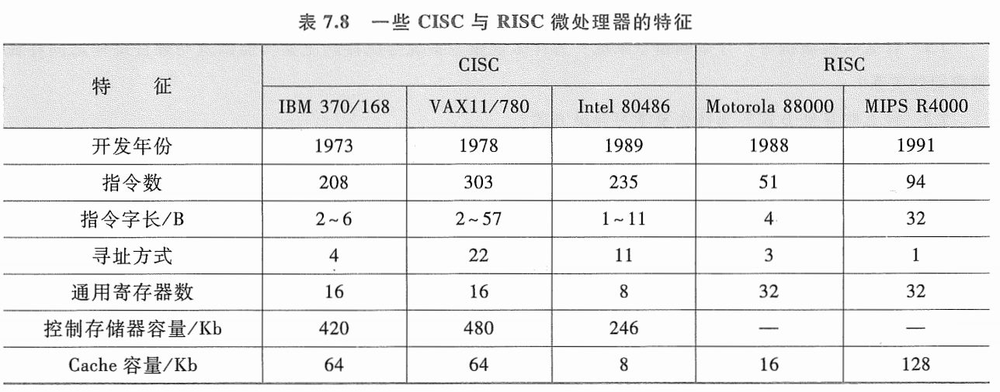

此外，从指令系统兼容性看， CISC 大多能实现软件兼容，即高档机包含了低档机的全部指令，并可加以扩充。但 RISC 机简化了指令系统，指令数量少，格式也不同于老机器，因此大多数 RISC 机不能与老机器兼容。

**PowerPC 是 IBM 、 Apple 、 Motorola 三家公司于 1991 年联合，用 Motorola 的芯片制造经验、Apple 的微型计算机软件支持、 IBM 的体系结构及其世界计算机市场霸主的地位，向长期被 Intel 占据的微处理器市场挑战而开发的 RISC 产品。**

**PowerPC 中的 “PC” 意为 “Powerful Chip” ，其中 “Power” 基于 20 世纪 80 年代后期， IBM 在其 801 小型机的基础上开发的工作站和服务器中的 Power 体系，意为 “Performance Optimization With Enhanced RISC （性能优化的增强型 RISC)”** 。 PowerPC 具有超高的性能、价廉、易仿真 CISC 指令集、可运行大量的现代 CISC 计算机应用软件，即集工作站的卓越性能、 PC 机的低成本及运行众多的软件等优点于一身。此外， PowerPC 扩展性强，可覆盖 PDA （个人数字助理）到多处理、超并行的中大型机，用单芯片提供整个解决方案。

多年来计算机体系结构和组织发展的趋势是增加 CPU 的复杂性，即使用更多的寻址方式及更加专门的寄存器等。 RISC 的出现象征着与这种趋势根本决裂，自然地引起了 RISC 与 CISC 的争端。随着技术不断发展， RISC 与 CISC 还不能说是截然不同的两大体系，很难对它们做出明确的评价。最近几年， RISC 与 CISC 的争端已减少了很多。原因在于这两种技术已逐渐融合。特别是芯片集成度和硬件速度的增加， RISC 系统也越来越复杂。与此同时，在努力挖掘最大性能的过程中， CISC 的设计已集中到和 RISC 相关联的主题上来，例如增加通用寄存器数以及更加强调指令流水线设计，所以更难去评价它们的优越性了。

RISC 技术发展很快，有关 RISC 体系结构、RISC 流水、RISC 编译系统、RISC 、CISC 和 VLIW(Very Long Instruction Word ，超长指令字）技术的融合等方面的资料不少。读者若想深入了解，可以查阅有关文献。  

### 指令集架构

所谓指令集架构，指的是计算机中央处理器所使用指令的集合以及其背后的寄存器体系、总线设计等逻辑框架。

常见的指令集架构大体上可以分为两大类：复杂指令集体系（CISC）和精简指令集体系（RISC）。

复杂指令集最常见的例子是现在绝大多数家用计算机和网络服务器所使用的 AMD64 指令集（也叫 x86-64、x86_64、Intel 64、EM64T 等等，本文以发明人为基准称为 AMD64），除此以外有一定使用量，和有历史意义的复杂指令集还有 IA-32、MC68000、MOS6502、Intel 8051、Intel 8080 等等。复杂指令集其复杂在于指令种类数量大，同时复杂指令集系统每条指令的操作数寻址方式复杂，几乎所有指令都可以直接访问内存；相应的指令的机器码编码方式复杂，普遍使用不定长指令等。同时，处理器内所设置的通用寄存器数量也偏少。

精简指令集最常见的例子则是常见于智能设备和嵌入式平台的 ARM 指令集家族。除此以外有一定使用量，和有历史意义的精简指令集还有龙芯 LoongArch、MIPS、RISC-V、PowerPC、AVR 等等。精简指令集其精简在于只保留最基本最必要的指令，将复杂功能完全交给上层的软件算法和下层的专用外设去解决。同时精简指令集系统指令寻址方式往往非常单一，除了专门的访存指令以外所有指令都只能在寄存器范围内操作，相应的精简指令集系统普遍使用固定长度指令，也会配备相对比较多的通用寄存器。

# 第8章 CPU的结构和功能

## 8.1 CPU的结构

### CPU的功能

由第 1 章可知， CPU 实质包括运算器和控制器两大部分，第 6 章讨论了计算机内各种运算及相应的硬件配置，这里重点介绍控制器的功能。

对于冯·诺依曼结构的计算机而言，一旦程序进入存储器后，就可由计算机自动完成取指令和执行指令的任务，控制器就是专用于完成此项工作的，它负责协调并控制计算机各部件执行程序的指令序列，其基本功能是取指令、分析指令和执行指令。

1、取指令

控制器必须具备能自动地从存储器中取出指令的功能。为此，要求控制器能自动形成指令的地址，并能发出取指令的命令，将对应此地址的指令取到控制器中。第一条指令的地址可以人为指定，也可由系统设定。

2、分析指令

分析指令包括两部分内容：其一，分析此指令要完成什么操作，即控制器需发出什么操作命令；其二，分析参与这次操作的操作数地址，即操作数的有效地址。

3、执行指令

执行指令就是根据分析指令产生的 “操作命令” 和 “操作数地址” 的要求，形成操作控制信号序列（不同的指令有不同的操作控制信号序列），通过对运算器、存储器以及 I/O 设备的操作，执行每条指令。

此外，控制器还必须能控制程序的输入和运算结果的输出（即控制主机与 I/O 设备交换信息）以及对总线的管理，甚至能处理机器运行过程中出现的异常情况（如掉电）和特殊请求（如打印机请求打印一行字符），即处理中断的能力。

总之， CPU 必须具有控制程序的顺序执行（称指令控制）、产生完成每条指令所需的控制命令（称操作控制）、对各种操作加以时间上的控制（称时间控制）、对数据进行算术运算和逻辑运算（数据加工）以及处理中断等功能。  

### CPU结构框图

根据 CPU 的功能不难设想，要取指令，必须有一个寄存器专用于存放当前指令的地址；要分析指令，必须有存放当前指令的寄存器和对指令操作码进行译码的部件；要执行指令，必须有一个能发出各种操作命令序列的控制部件 CU ；要完成算术运算和逻辑运算，必须有存放操作数的寄存器和实现算逻运算的部件 ALU ；为了处理异常情况和特殊请求，还必须有中断系统。可见，CPU 可由四大部分组成，如图 8.1 所示。

将图 8.1 细化，又可得图 8.2 ，图中 ALU 部件实际上只对 CPU 内部寄存器的数据进行操作，有关 ALU 的内容已在第 6 章中有所介绍。

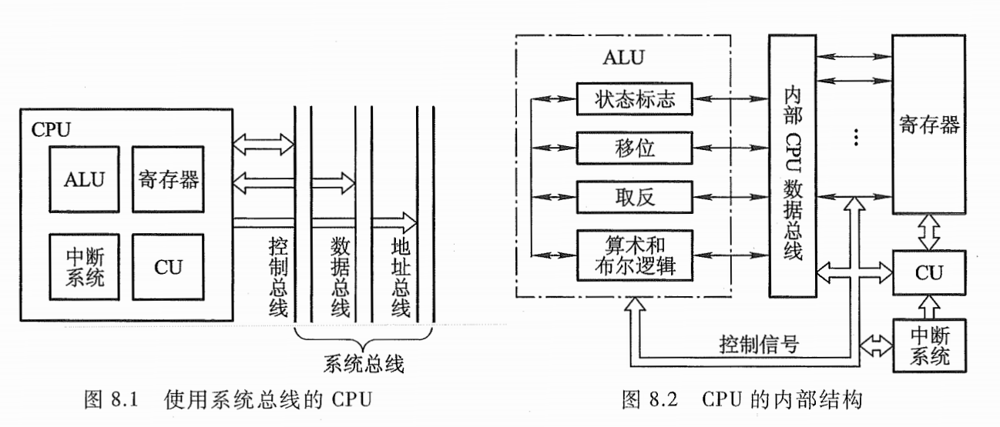


### CPU的寄存器

第 4 章图 4.2 示出了存储器速度、容量和位价的关系，最上层的寄存器速度最快，容量最小，位价最贵，它们通常设在 CPU 内部。 CPU 中的寄存器大致可分两类：一类属于用户可见寄存器，用户可对这类寄存器编程，以及通过优化使 CPU 因使用这类寄存器而减少对主存的访问次数；另一类属于控制和状态寄存器，用户不可对这类寄存器编程，它们被控制部件使用，以控制 CPU 的操作，也可被带有特权的操作系统程序使用，从而控制程序的执行。

1、用户可见寄存器

通常 CPU 执行机器语言访问的寄存器为用户可见寄存器，按其特征又可分为以下几类。  

(1) 通用寄存器

通用寄存器可由程序设计者指定许多功能，可用于存放操作数，也可作为满足某种寻址方式所需的寄存器。例如，基址寻址所需的基址寄存器、变址寻址所需的变址寄存器和堆栈寻址所需的栈指针，都可用通用寄存器代替。寄存器间接寻址时还可用通用寄存器存放操作数的有效地址。

当然，也有一些机器用专用寄存器作为基址寄存器、变址寄存器或栈指针，这样，在设计指令格式时只需将这类专用寄存器隐含在操作码中，而不必占用指令字中的位。图 7.15 (a) 所示的就是用专用寄存器作为基址寄存器，而图 7.15 (b) 是用通用寄存器作为基址寄存器，所以指令字中必须有 R 字段指出寄存器编号。又如图 7.21 所示的 IBM 360/370 指令格式中，由于用通用寄存器作为变址寄存器和基址寄存器，故在指令字中设有 X 和 B 字段，分别指出作为变址寄存器和基址寄存器的通用寄存器编号。

(2) 数据寄存器

数据寄存器用于存放操作数，其位数应满足多数数据类型的数值范围，有些机器允许使用两个连读的寄存器存放双倍字长的值。还有些机器的数据寄存器只能用于保存数据，不能用于操作数地址的计算。

(3) 地址寄存器

地址寄存器用于存放地址，其本身可以具有通用性，也可用于特殊的寻址方式，如用于基址寻址的段指针（存放基地址）、用于变址寻址的变址寄存器和用于堆栈寻址的栈指针。地址寄存器的位数必须足够长，以满足最大的地址范围。

(4) 条件码寄存器

这类寄存器中存放条件码，它们对用户来说是部分透明的。**条件码是 CPU 根据运算结果由硬件设置的位**，例如，算术运算会产生正、负、零或溢出等结果。条件码可被测试，作为分支运算的依据。此外，有些条件码也可被设置，例如，对于最高位进位标志 C ，可用指令对它置位和复位。将条件码放到一个或多个寄存器中，就构成了条件码寄存器。

在调用子程序前，必须将所有的用户可见寄存器的内容保存起来，这种保存可由 CPU 自动完成，也可由程序员编程保存，视不同机器进行不同处理。

2、控制和状态寄存器

CPU 中还有一类寄存器用于控制 CPU 的操作或运算。在一些机器里，大部分这类寄存器对用户是透明的。如以下四种寄存器在指令执行过程中起重要作用：

1. MAR ：存储器地址寄存器，用于存放将被访问的存储单元的地址。
2. MDR ：存储器数据寄存器，用于存放欲存入存储器中的数据或最近从存储器中读出的数据。
3. PC ：程序计数器，存放现行指令的地址，通常具有计数功能。当遇到转移类指令时， PC 的值可被修改。
4. IR ：指令寄存器，存放当前欲执行的指令。

通过这 4 个寄存器， CPU 和主存可交换信息。例如，将现行指令地址从 PC 送至 MAR ，启动存储器做读操作，存储器就可将指定地址单元内的指令读至 MDR ，再由 MDR 送至 IR 。

在 CPU 内部必须给 ALU 提供数据，因此 ALU 必须可直接访问 MDR 和用户可见寄存器，ALU 的外围还可以有另一些寄存器，这些寄存器用于 ALU 的输入输出以及用于和 MDR 及用户可见寄存器交换数据。

**在 CPU 的控制和状态寄存器中，还有用来存放程序状态字 PSW 的寄存器，该寄存器用来存放条件码和其他状态信息。在具有中断系统的机器中还有中断标记寄存器。**

3、举例

不同计算机的 CPU 中，寄存器组织是不一样的。


### 控制单元和中断系统

**控制单元 (CU) 是提供完成计算机全部指令操作的微操作命令序列部件。现代计算机中微操作命令序列的形成方法有两种：一种是组合逻辑设计方法，为硬连线逻辑；另一种是微程序设计方法，为存储逻辑。**具体内容详见第 4 篇。

中断系统主要用于处理计算机的各种中断，详细内容在 8.4 节介绍。


## 8.2 指令周期

### 指令周期的基本概念

**CPU 每取出并执行一条指令所需的全部时间称为指令周期，也即 CPU 完成一条指令的时间**，如图 8.5 所示。图中的取指阶段完成取指令和分析指令的操作，又称取指周期；执行阶段完成执行指令的操作，又称执行周期。在大多数情况下，CPU 就是按“取指—执行—再取指—再执行…” 的顺序自动工作的。

由于各种指令操作功能不同，因此各种指令的指令周期是不相同的。例如，无条件转移指令 “JMP X” ，在执行阶段不需要访问主存，而且操作简单，完全可以在取指阶段的后期将转移地址 X 送至 PC ，以达到转移的目的。这样， “JMP X” 指令的指令周期就是取指周期。又如一地址格式的加法指令 “ADD X” ，在执行阶段首先要从 X 所指示的存储单元中取出操作数，然后和 ACC 的内容相加，结果存于 ACC ，**故这种指令的指令周期在取指和执行阶段各访问一次存储器，其指令周期就包括两个存取周期。**再如乘法指令，其执行阶段所要完成的操作比加法指令多得多，故它的执行周期超过了加法指令，如图 8.6 所示。  

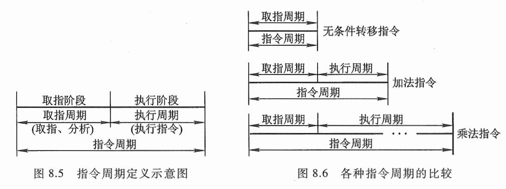

此外，当遇到间接寻址的指令时，由于指令字中只给出操作数有效地址的地址，因此，为了取出操作数，需先访问一次存储器，取出有效地址，然后再访问存储器，取出操作数，如图 7.11(a) 所示。这样，间接寻址的指令周期就包括取指周期、间址周期和执行周期 3 个阶段，其中间址周期用于取操作数的有效地址，因此间址周期介于取指周期和执行周期之间，如图 8.7 所示。

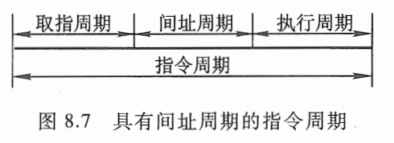

由第 5 章可知，当 CPU 采用中断方式实现主机与 I/O 设备交换信息时， CPU 在每条指令执行阶段结束前，都要发中断查询信号，以检测是否有某个 I/O 设备提出中断请求。如果有请求， CPU 则要进入中断响应阶段，又称中断周期。**在此阶段， CPU 必须将程序断点保存到存储器中。这样，一个完整的指令周期应包括取指、间址、执行和中断 4 个子周期**，如图 8.8 所示。由于间址周期和中断周期不一定包含在每个指令周期内，故图中用菱形框判断。

**总之，上述 4 个周期都有 CPU 访存操作，只是访存的目的不同。取指周期是为了取指令，间址周期是为了取有效地址，执行周期是为了取操作数（当指令为访存指令时），中断周期是为了保存程序断点。这 4 个周期又可称为 CPU 的工作周期**，为了区别它们，在 CPU 内可设置 4 个标志触发器，如图 8.9 所示。

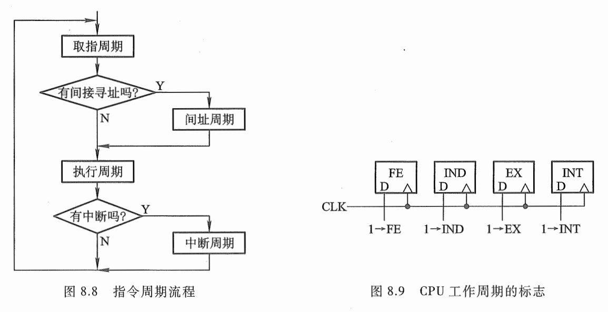

图 8.9 所示的 FE、IND、EX 和 INT 分别对应取指、间址、执行和中断 4 个周期，并以 “1” 状态表示有效，它们分别由 1 → FE 、1 → IND 、1 → EX 和 1 → INT 这 4 个信号控制。

**设置 CPU 工作周期标志触发器对设计控制单元十分有利。**例如，在取指阶段，只要设置取指周期标志触发器 FE 为 1 ，由它控制取指阶段的各个操作，便获得对任何一条指令的取指命令序列。又如，在间接寻址时，间址次数可由间址周期标志触发器 IND 确定，当它为 “0” 状态时，表示间接寻址结束。再如，对于一些执行周期不访存的指令（如转移指令、寄存器类型指令），同样可以用它们的操作码与取指周期标志触发器的状态相“与”，作为相应微操作的控制条件。这些特点读者在控制单元的设计中可进一步体会。  

### 指令周期的数据流

为了便于分析指令周期中的数据流，假设 CPU 中有存储器地址寄存器 MAR 、存储器数据寄存器 MDR 、程序计数器 PC 和指令寄存器 IR 。

1、取指周期的数据流

图 8.10 所示的是取指周期的数据流。 PC 中存放现行指令的地址，该地址送到 MAR 并送至地址总线，然后由控制部件 CU 向存储器发读命令，使对应 MAR 所指单元的内容（指令）经数据总线送至 MDR ，再送至 IR ，并且 CU 控制 PC 内容加 1 ，形成下一条指令的地址。

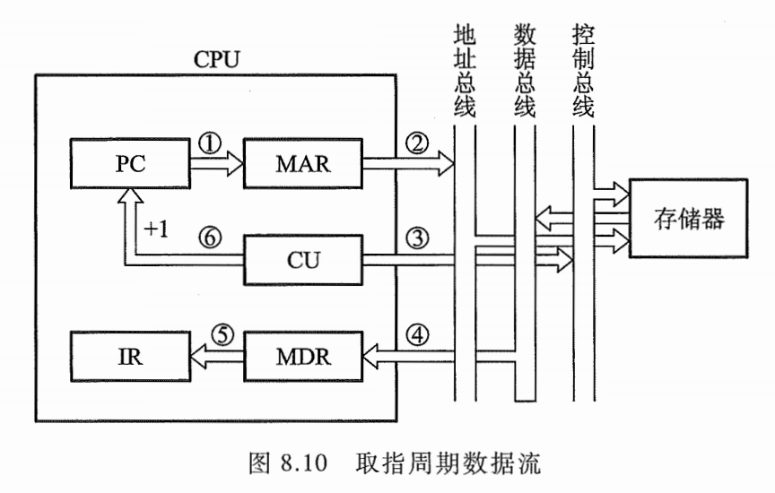

2、间址周期的数据流

间址周期的数据流如图 8.11 所示。**一旦取指周期结束， CU 便检查 IR 中的内容，以确定其是否有间址操作，如果需要间址操作**，则 MDR 中指示形式地址的右 N 位（ 记作 Ad(MDR) ）将被送到 MAR ，又送至地址总线，此后 CU 向存储器发读命令，以获取有效地址并存至 MDR 。

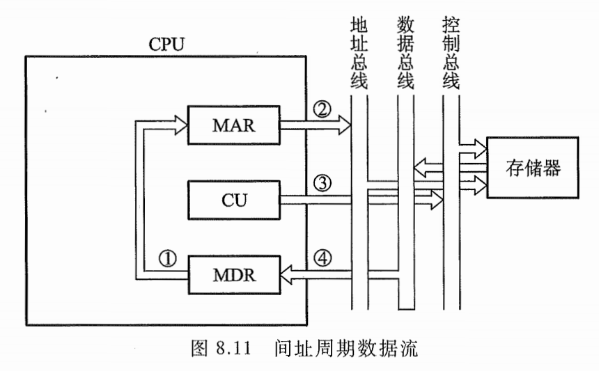

3、执行周期的数据流

由于不同的指令在执行周期的操作不同，因此执行周期的数据流是多种多样的，可能涉及 CPU 内部寄存器间的数据传送、对存储器（或 I/O）进行读写操作或对 ALU 的操作，因此，无法用统一的数据流图表示。

4、中断周期的数据流

CPU 进入中断周期要完成一系列操作（详见 9.1 节），其中 PC 当前的内容必须保存起来，以待执行完中断服务程序后可以准确返回到该程序的间断处，这一操作的数据流如图 8.12 所示。

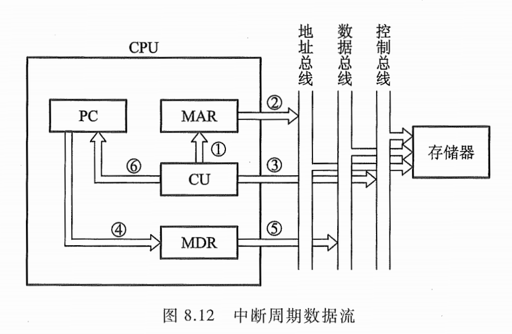

图中由 CU 把用于保存程序断点的存储器特殊地址送往 MAR ，并送到地址总线上，然后由 CU 向存储器发写命令，并将 PC 的内容（程序断点）送到 MDR ，最终使程序断点经数据总线存入存储器。此外， CU 还需将中断服务程序的入口地址送至 PC ，为下一个指令周期的取指周期做好准备。


## 8.3 指令流水

由前面各章的介绍可知，**为了提高访存速度**，一方面要提高存储芯片的性能，另一方面可以从体系结构上，如采用多体、 Cache 等分级存储措施来提高存储器的性能／价格比。**为了提高主机与 I/O 交换信息的速度**，可以采用 DMA 方式，也可以采用多总线结构，将速度不一的 I/O 分别挂到不同带宽的总线上，以解决总线的瓶颈问题。**为了提高运算速度**，可以采用高速芯片和快速进位链，以及改进算法等措施。**为了进一步提高处理机速度，通常可从提高器件的性能和改进系统的结构，开发系统的并行性两方面入手。**  

(1) 提高器件的性能

提高器件的性能一直是提高整机性能的重要途径，计算机的发展史就是按器件把计算机分为电子管、晶体管、集成电路和大规模集成电路 4 代的。器件的每一次更新换代都使计算机的软硬件技术和计算机性能获得突破性进展。特别是大规模集成电路的发展，由于其集成度高、体积小、功耗低、可靠性高、价格便宜等特点，使人们可采用更复杂的系统结构造出性能更高、工作更可靠、价格更低的计算机。但是由于半导体器件的集成度越来越接近物理极限，使器件速度的提高越来越慢。

(2) 改进系统的结构，开发系统的并行性

**所谓并行，包含同时性和并发性两个方面。前者是指两个或多个事件在同一时刻发生，后者是指两个或多个事件在同一时间段发生。**也就是说，在同一时刻或同一时间段内完成两种或两种以上性质相同或不同的功能，只要在时间上互相重叠，就存在并行性。

并行性体现在不同等级上。通常分为 4 个级别：作业级或程序级、任务级或进程级、指令之间级和指令内部级。前两级为粗粒度，又称为过程级；后两级为细粒度，又称为指令级。粗粒度并行性（Coarse-grained Parallelism）一般用算法（软件）实现，细粒度并行性（Fine-grained Parallelism）一般用硬件实现。从计算机体系上看，粗粒度并行性是在多个处理机上分别运行多个进程，由多台处理机合作完成一个程序；细粒度并行性是指在处理机的操作级和指令级的并行性，其中指令的流水作业就是一项重要技术。这里只讨论有关指令流水的一些主要问题，其他有关粗粒度并行和粗粒度并行技术将在 “计算机体系结构” 课程中讲述。


### 8.3.1 指令流水原理

从上面的分析可知，完成一条指令实际上也可分为许多阶段。为简单起见，把指令的处理过程分为取指令和执行指令两个阶段，在不采用流水技术的计算机里，取指令和执行指令是周而复始地重复出现，各条指令按顺序串行执行的，如图 8.13 所示。  

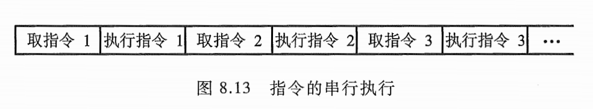

图中取指令的操作可由指令部件完成，执行指令的操作可由执行部件完成。进一步分析发现，这种顺序执行虽然控制简单，但执行中各部件的利用率不高，如指令部件工作时，执行部件基本空闲，而执行部件工作时，指令部件基本空闲。如果指令执行阶段不访问主存，则完全可以利用这段时间取下一条指令，这样就使取下一条指令的操作和执行当前指令的操作同时进行，如图 8.14 所示，这就是两条指令的重叠，即指令的二级流水。

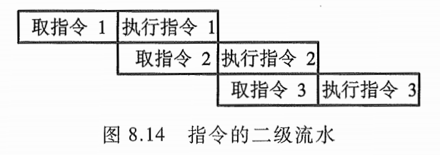

由指令部件取出一条指令，并将它暂存起来，如果执行部件空闲，就将暂存的指令传给执行部件执行。与此同时，指令部件又可取出下一条指令并暂存起来，这称为指令预取。显然，这种工作方式能加速指令的执行。如果取指和执行阶段在时间上完全重叠，相当于将指令周期减半。然而进一步分析流水线，就会发现存在两个原因使得执行效率加倍是不可能的。

1. 指令的执行时间一般大于取指时间，因此，取指阶段可能要等待一段时间，也即存放在指令部件缓冲区的指令还不能立即传给执行部件，缓冲区不能空出。
2. 当遇到条件转移指令时，下一条指令是不可知的，因为必须等到执行阶段结束后，才能获知条件是否成立，从而决定下条指令的地址，造成时间损失。

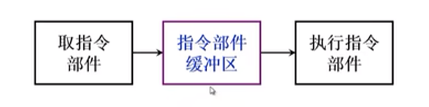

通常为了减少时间损失，采用猜测法，即当条件转移指令从取指阶段进入执行阶段时，指令部件仍按顺序预取下一条指令。这样，如果条件不成立，转移没有发生，则没有时间损失；若条件成立，转移发生，则所取的指令必须丢掉，并再取新的指令。

尽管这些因素降低了两级流水线的潜在效率，但还是可以获得一定程度的加速。为了进一步提高处理速度，可将指令的处理过程分解为更细的几个阶段。

- 取指 (FI) ：从存储器取出一条指令并暂时存入指令部件的缓冲区。
- 指令译码 (DI) ：确定操作性质和操作数地址的形成方式。
- 计算操作数地址 (CO) ：计算操作数的有效地址，涉及寄存器间接寻址、间接寻址、变址寻址、基址寻址、相对寻址等各种地址计算方式。
- 取操作数 (FO) ：从存储器中取操作数（若操作数在寄存器中，则无须此阶段）。
- 执行指令 (EI) ：执行指令所需的操作，并将结果存于目的位置（寄存器中）。
- 写操作数 (WO) ：将结果存入存储器。

为了说明方便起见，假设上述各段的时间都是相等的（即每段都为一个时间单元），于是可得图 8.15 所示的指令六级流水时序。在这个流水线中，处理器有 6 个操作部件，同时对 6 条指令进行加工，加快了程序的执行速度。

图中 9 条指令若不采用流水线技术，最终出结果需要 54 个时间单元，采用六级流水只需要 14 个时间单元就可出最后结果，大大提高了处理器速度。当然，图中假设每条指令都经过流水线的 6 个阶段，但事实并不总是这样。例如，取数指令并不需要 WO 阶段。此外，这里还假设不存在存储器访问冲突，所有阶段均并行执行。如 FI 、FO 和 WO 阶段都涉及存储器访问，如果出现冲突就无法并行执行，图 8.15 示意了所有这些访问都可以同时进行，但多数存储系统做不到这点，从而影响了流水线的性能。

还有一些其他因素也会影响流水线性能，例如， 6 个阶段时间不等或遇到转移指令，都会出现讨论二级流水时出现的问题。

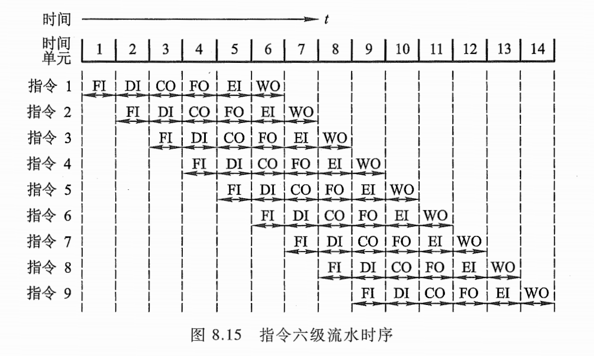


### 8.3.2 影响流水线性能的因素

要使流水线具有良好的性能，必须设法使流水线能畅通流动，即必须做到充分流水，不发生断流。但通常由于在流水过程中会出现三种相关，使流水线不断流实现起来很困难，这三种相关是结构相关、数据相关和控制相关。

**结构相关是当多条指令进入流水线后，硬件资源满足不了指令重叠执行的要求时产生的。数据相关是指令在流水线中重叠执行时，当后继指令需要用到前面指令的执行结果时发生的。控制相关是当流水线遇到分支指令和其他改变 PC 值的指令时引起的。**

为了讨论方便起见，假设流水线由 5 段组成，它们分别是取指令 (IF) 、指令译码／读寄存器 (ID) 、执行／访存有效地址计算 (EX) 、存储器访问 (MEM) 、结果写回寄存器 (WB) 。

不同类型指令在各流水段的操作是不同的，表 8.1 列出了 ALU 类指令、访存类（取数、存数）指令和转移类指令在各流水段中所进行的操作。

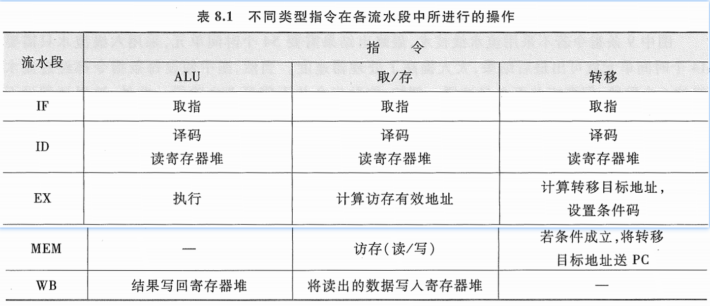

下面分析上述三种相关对流水线工作的影响。  

1、结构相关

结构相关是当指令在重叠执行过程中，不同指令争用同一功能部件产生资源冲突时产生的，故又有资源相关之称。

通常，大多数机器都是将指令和数据保存在同一存储器中，且只有一个访问口，如果在某个时钟周期内，流水线既要完成某条指令对操作数的存储器访问操作，又要完成另一条指令的取指操作，这就会发生访存冲突。如表 8.2 中，在第 4 个时钟周期，第 i 条指令 (LOAD) 的 MEM 段和第 i+3 条指令的 IF 段发生了访存冲突。**解决冲突的方法可以让流水线在完成前一条指令对数据的存储器访问时，暂停（一个时钟周期）取后一条指令的操作**，如表 8.3 所示。当然，如果第 i 条指令不是 LOAD 指令，在 MEM 段不访存，也就不会发生访存冲突。

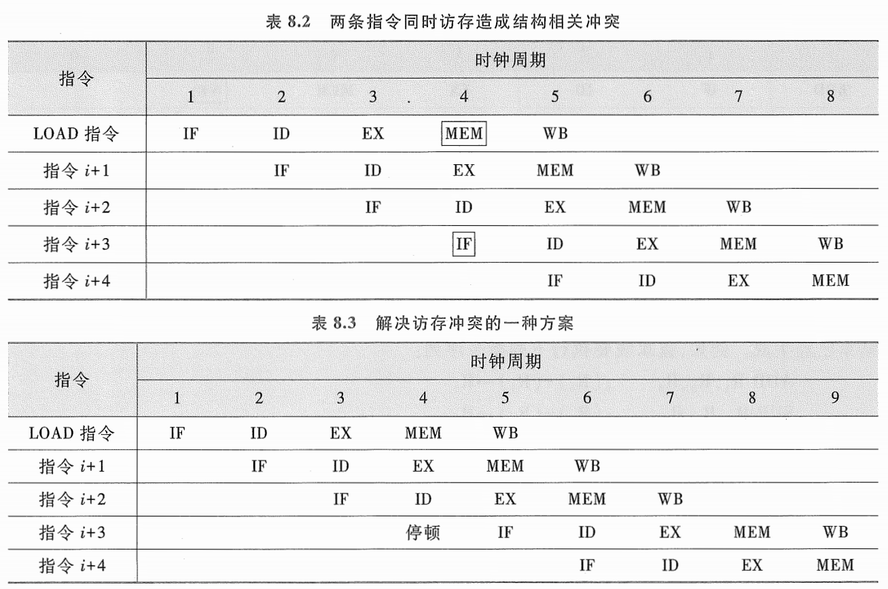

**解决访存冲突的另一种方法是设置两个独立的存储器分别存放操作数和指令，以免取指令和取操作数同时进行时互相冲突，使取某条指令和取另一条指令的操作数实现时间上的重叠。**还可以**采用指令预取技术**，例如，在 CPU(8086) 中设置指令队列，将指令预先取到指令队列中排队。指令预取技术的实现基于访存周期很短的情况，例如，在执行指令阶段，取数时间很短，因此在执行指令时，主存会有空闲，此时，只要指令队列空出，就可取下一条指令，并放至空出的指令队列中，从而保证在执行第 K 条指令的同时对第 K+1 条指令进行译码，实现 “执行 K” 与 “分析K+1” 的重叠。

2、数据相关

数据相关是流水线中的各条指令因重叠操作，可能改变对操作数的读写访问顺序，从而导致了数据相关冲突。例如，流水线要执行以下两条指令：

ADD $R_1$,$R_2$,$R_3$ 	;($R_2$) + ($R_3$) → $R_1$
SUB $R_4$,$R_1$,$R_5$ 	;($R_1$) - ($R_5$) → $R_4$

这里第二条 SUB 指令中 $R_1$ 的内容必须是第一条 ADD 指令的执行结果。可见正常的读写顺序是先由 ADD 指令写入 $R_1$，再由 SUB 指令来读 $R_1$ 。在非流水线时，这种先写后读的顺序是自然维持的。但在流水线时，由于重叠操作，使读写的先后顺序关系发生了变化，如表 8.4 所示。

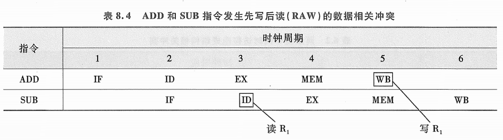

由表 8.4 可见，在第 5 个时钟周期， ADD 指令方可将运算结果写入 $R_1$，但后继 SUB 指令在第 3 个时钟周期就要从 $R_1$中读数，使先写后读的顺序改变为先读后写，发生了先写后读 (RAW) 的数据相关冲突。如果不采取相应的措施，按表 8.4 的读写顺序，就会使操作结果出错。解决这种数据相关的方法可以采用后推法，即遇到数据相关时，就停顿后继指令的运行，直至前面指令的结果已经生成。例如，流水线要执行下列指令序列：  

ADD $R_1$,$R_2$,$R_3$ 	;($R_2$) + ($R_3$) → $R_1$
SUB $R_4$,$R_1$,$R_5$ 	;($R_1$) - ($R_5$) → $R_4$
AND $R_6$, $R_1$, $R_7$ 	;($R_1$) AND ($R_7$) → $R_6$
OR $R_8$,$R_1$,$R_9$ 		;($R_1$) OR ($R_9$) → $R_8$
XOR $R_{10}$,$R_1$,$R_{11}$ 	;($R_1$) XOR ($R_{11}$) → $R_{10}$

其中，第一条 ADD 指令将向 $R_1$寄存器写入操作结果，后继的 4 条指令都要使用 $R_1$中的值作为一个源操作数，显然，这时就出现了前述的 RAW 数据相关。表 8.5 列出了未对数据相关进行特殊处理的流水线，表中 ADD 指令在 WB 段才将计算结果写入寄存器 $R_1$中，但 SUB 指令在其 ID 段就要从寄存器 $R_1$中读取该计算结果。同样， AND 指令、 OR 指令也要受到这种相关关系的影响。对于 XOR 指令，由于其 ID 段（第 6 个时钟周期）在 ADD 指令的 WB 段（第 5 个时钟周期）之后，因此可以正常操作。

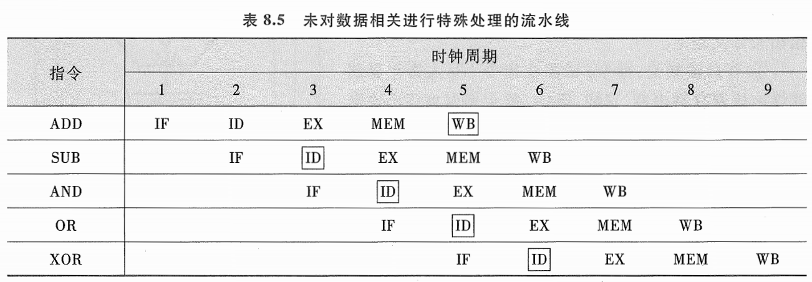

**如果采用后推法，即将相关指令延迟到所需操作数被写回到寄存器后再执行的方式，就可解决这种数据相关冲突**，其流水线如表 8.6 所示。显然这将要使流水线停顿 3 个时钟周期。 

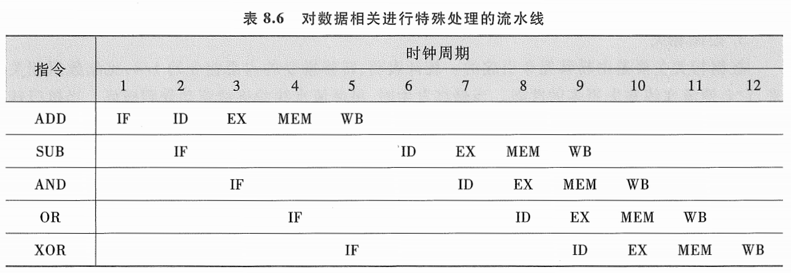

**另一种解决方法是采用定向技术，又称为旁路技术或相关专用通路技术。其主要思想是不必待某条指令的执行结果送回到寄存器后，再从寄存器中取出该结果，作为下一条指令的源操作数，而是直接将执行结果送到其他指令所需要的地方。**上述 5 条指令序列中，实际上要写入 $R_1$ 的 ADD 指令在 EX 段的末尾处已形成，如果设置专用通路技术，将此时产生的结果直接送往需要它的 SUB 、 AND 和 OR 指令的 EX 段，就可以使流水线不发生停顿。显然，此时要对 3 条指令进行定向传送操作。图 8.16 示出了带有旁路技术的 ALU 执行部件。图中有两个暂存器，当 AND 指令将进入 EX 段时， ADD 指令的执行结果已存入暂存器 2，SUB 指令的执行结果已存入暂存器 1 ，而暂存器 2 的内容（存放送往 $R_1$ 的结果）可通过旁路通道，经多路开关送到 ALU 中。这里的定向传送仅发生在 ALU 内部。

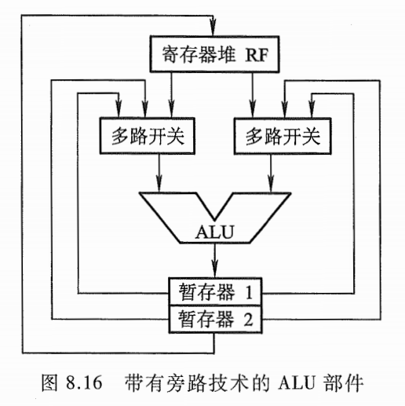

**根据指令间对同一寄存器读和写操作的先后次序关系，数据相关冲突可分为写后读相关 (Read After Write，RAW) 、读后写相关 (Write After Read，WAR) 和写后写相关 (Write After Write，WAW) 。**例如，有 i 和 j 两条指令， i 指令在前， j 指令在后，则三种不同类型的数据相关含义如下：

1. 写后读相关：指令 j 试图在指令 i 写入寄存器前就读出该寄存器内容，这样，指令 j 就会错误地读出该寄存器旧的内容。
2. 读后写相关：指令 j 试图在指令 i 读出寄存器之前就写入该寄存器，这样，指令 i 就错误地读出该寄存器新的内容。  
3. 写后写相关：指令 j 试图在指令 i 写入寄存器之前就写入该寄存器，这样，两次写的先后次序被颠倒，就会错误地使由指令 i 写入的值成为该寄存器的内容。

**上述三种数据相关在按序流动的流水线中，只可能出现 RAW 相关。在非按序流动的流水线中，由于允许后进入流水线的指令超过先进入流水线的指令而先流出流水线，则既可能发生 RAW 相关，还可能发生 WAR 和 WAW 相关。**  

3、控制相关

**控制相关主要是由转移指令引起的。统计表明，转移指令约占总指令的 1/4 ，比起数据相关来，它会使流水线丧失更多的性能。**当转移发生时，将使流水线的连续流动受到破坏。当执行转移指令时，根据是否发生转移，它可能将程序计数器 PC 内容改变成转移目标地址，也可能只是使 PC 加上一个增量，指向下一条指令的地址。

图 8.17 示意了条件转移的效果。这里使用了和图 8.15 相同的程序，并假设指令 3 是一条条件转移指令，即指令 3 必须待指令 2 的结果出现后（第 7 个时间单元）才能决定下一条指令是 4（条件不满足）还是 15（条件满足）。由于结果无法预测，此流水线继续预取指令 4 ，并向前推进。当最后结果满足条件时，发现对第 4 、5 、6 、7 条指令所做的操作全部报废。在第 8 个时间单元，指令 15 进入流水线。在时间单元 9 ~ 12 之间没有指令完成，这就是由于不能预测转移条件而带来的性能损失。而图 8.15 中因转移条件不成立，未发生转移，得到了较好的流水线性能。  

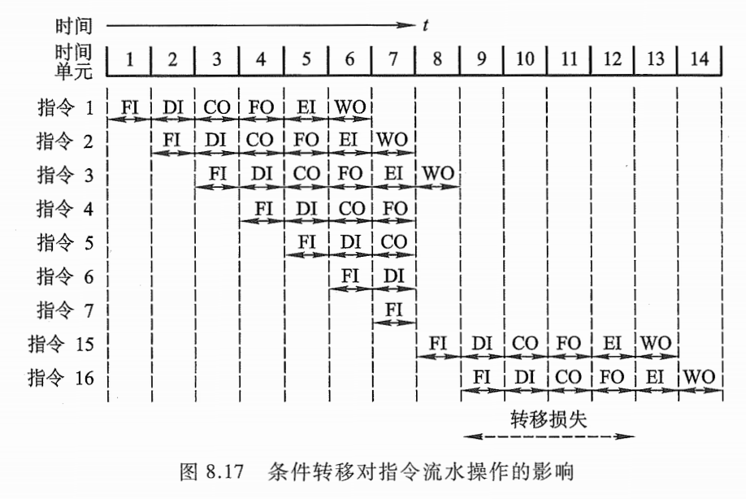

**为了解决控制相关，可以采用尽早判别转移是否发生，尽早生成转移目标地址；预取转移成功或不成功两个控制流方向上的目标指令；加快和提前形成条件码；提高转移方向的猜准率等方法。**有关的详细内容，读者可查阅相关资料进一步了解。


### 8.3.3 流水线性能

流水线性能通常用吞吐率、加速比和效率 3 项指标来衡量。

1、吞吐率（Throughput Rate）

在指令级流水线中，吞吐率是指单位时间内流水线所完成指令或输出结果的数量。吞吐率又有最大吞吐率和实际吞吐率之分。  

2、加速比（Speedup Ratio）

流水线的加速比是指 m 段流水线的速度与等功能的非流水线的速度之比。

3、效率（Efficiency）

效率是指流水线中各功能段的利用率。


### 8.3.4 流水线中的多发技术

流水线技术使计算机系统结构产生重大革新，为了进一步发展，除了采用好的指令调度算法、重新组织指令执行顺序、降低相关带来的干扰以及优化编译外，还可开发流水线中的多发技术，设法在一个时钟周期（机器主频的倒数）内产生更多条指令的结果。**常见的多发技术有超标量技术、超流水线技术和超长指令字技术。**假设处理一条指令分 4 个阶段：取指 (IF) 、译码 (ID) 、执行 (EX) 和 回写 (WR) 。图 8.20 是三种多发技术与普通四级流水线的比较，其中图 8.20(a) 为普通四级流水线，一个时钟周期出一个结果。

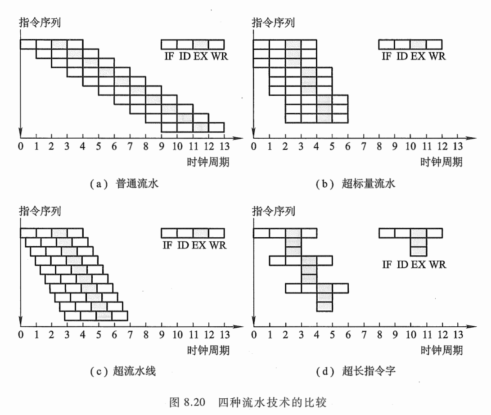

1、超标量技术

超标量 (Superscalar) 技术如图 8.20(b) 所示。**它是指在每个时钟周期内可同时并发多条独立指令，即以并行操作方式将两条或两条以上（图中所示为 3 条）指令编译并执行。**

要实现超标量技术，要求处理机中配置多个功能部件和指令译码电路，以及多个寄存器端口和总线，以便能实现同时执行多个操作，此外还要编译程序决定哪几条相邻指令可并行执行。

例如，下面两个程序段：  

程序段 1										程序段 2
MOV BL,8									 INC AX
ADD AX,1756H						    ADD AX,BX
ADD CL,4EH							    MOV DS,AX 

左边程序段中的 3 条指令是互相独立的，不存在数据相关，可实现指令级并行。右边程序段中的 3 条指令存在数据相关，不能并行执行。**超标量计算机不能重新安排指令的执行顺序，但可以通过编译优化技术，在高级语言翻译成机器语言时精心安排，把能并行执行的指令搭配起来，挖掘更多的指令并行性。**

2、超流水线技术

**超流水线 (Superpipeline) 技术是将一些流水线寄存器插入流水线段中，好比将流水线再分段**，如图 8.20(c) 所示。图中将原来的一个时钟周期又分成 3 段，使超流水线的处理器周期比普通流水线的处理器周期（如图 8.20(a) 所示）短，**这样，在原来的时钟周期内，功能部件被使用 3次，使流水线以 3 倍于原来时钟频率的速度运行**。与超标量计算机一样，硬件不能调整指令的执行顺序，靠编译程序解决优化问题。

3、超长指令字技术

**超长指令字 (VLIW) 技术和超标量技术都是采用多条指令在多个处理部件中并行处理的体系结构，在一个时钟周期内能流出多条指令。**但超标量的指令来自同一标准的指令流， VLIW 则是由编译程序在编译时挖掘出指令间潜在的并行性后，把多条能并行操作的指令组合成一条具有多个操作码字段的超长指令（指令字长可达几百位），由这条超长指令控制 VLIW 机中多个独立工作的功能部件，由每一个操作码字段控制一个功能部件，相当于同时执行多条指令，如图
8.20(d) 所示。 VLIW 较超标量具有更高的并行处理能力，但对优化编译器的要求更高，对 Cache 的容量要求更大。  


### 8.3.5 流水线结构

1、指令流水线结构

指令流水线是将指令的整个执行过程用流水线进行分段处理，典型的指令执行过程分为 “取指令—指令译码—形成地址—取操作数—执行指令—回写结果—修改指令指针” 这几个阶段，与此相对应的指令流水线结构由图 8.21 所示的几个部件组成。

指令流水线对机器性能的改善程度取决于把处理过程分解成多少个相等的时间段数。如上述共分 7 段，若每一段需要一个时钟周期，则当不采用流水技术时，需 7 个时钟周期出一个结果。采用流水线后，假设流水线不出现断流（如遇到转移指令），则除第一条指令需 7 个时钟周期出结果外，以后所有的指令都是一个时钟周期出一个结果。因此，在理想的情况下（流水线不断流），该流水线的速度约提高到 7 倍。

2、运算流水线

**上述讨论的指令流水线是指令级的流水技术，实际上流水技术还可用于部件级。**例如，浮点加法运算，可以分成 “对阶” “尾数加” 及 “结果规格化” 3 段，每一段都有一个专门的逻辑电路完成操作，并将其结果保存在锁存器中，作为下一段的输入。如图 8.22 所示，当对阶完成后，将结果存入锁存器，便又可进入下一条指令的对阶运算。  

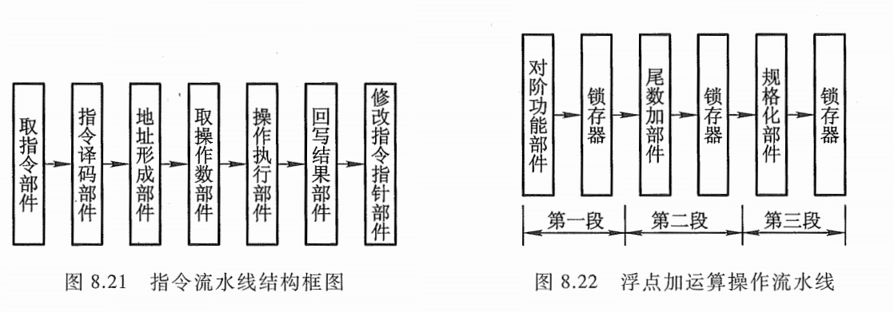

若执行浮点乘运算也按浮点加运算那样分段，即分成阶码运算、尾数乘和结果规格化三级流水线，就不够合理。因为尾数乘所需的时间比阶码运算和规格化操作长得多，而且尾数乘可以和阶码运算同时进行，因此，尾数乘本身就可以用流水线。

由图 8.22 可见，流水线相邻两段在执行不同的操作，因此在相邻两段之间必须设置锁存器或寄存器，以保证在一个时钟周期内流水线的输入信号不变。这一指导思想也适用于指令流水。此外，只有当流水线各段工作饱满时，才能发挥最大作用。上例中如果浮点运算没有足够的数据来源，那么流水线中的某些段甚至全部段都处于空闲状态，使流水线的作用没有充分发挥。因此具体是否采用流水线技术以及在计算机的哪一部分采用流水线技术需根据情况而定。


## 8.4 中断系统

第 5 章已经介绍了有关中断的一些概念，特别对 I/O 中断做了较详细的讨论。实际上 I/O 中断只是 CPU 众多中断中的一种，引起中断的因素很多，为了处理各种中断， CPU 内通常设有处理中断的机构——中断系统，以解决各种中断的共性问题。本节进一步分析中断系统的功能，以便更深入地了解中断系统在 CPU 中的作用和地位。  

### 8.4.1 概述

从前面分析可知，采用中断方式实现主机与 I/O 交换信息可使 CPU 和 I/O 并行工作，提高 CPU 的效率。其实，计算机在运行过程中，除了会遇到 I/O 中断外，还有许多意外事件发生，如电源突然掉电，机器硬件突然出现故障，人们在机器运行过程中想随机抽查计算的中间结果，实现人机联系等。此外，在实时处理系统中，必须及时处理某个事件或现象，例如，在过程控制系统中，当突然出现温度过高、电压过大等情况时，必须及时将这些信息送至计算机，由计算机暂时中断现行程序，转去执行中断服务程序，以解决这种异常情况。再如，计算机实现多道程序运行时，可以通过分配给每道程序一个固定时间片，利用时钟定时发中断进行程序切换。在多处理机系统中，各处理器之间的信息交流和任务切换也可通过中断来实现。总之，为了提高计算机的效率，为了处理一些异常情况以及实时控制、多道程序和多处理机的需要，提出了中断的概念。  

1、引起中断的各种因素

引起中断的因素很多，大致可分为以下几类。  

(1) 人为设置的中断
这种中断一般称为自愿中断，因为它是在程序中人为设置的，故一旦机器执行这种人为中断，便自愿停止现行程序而转入中断处理，如图 8.23 所示。

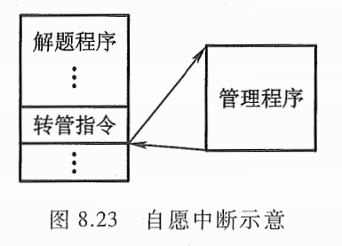

图中的“转管指令”可能是转至从 I/O 设备调入一批信息到主存的管理程序，也可能是转至将一批数据送往打印机打印的管理程序。显然，当用户程序执行了“转管指令”后，便中断现行程序，转入管理程序，这种转移完全是自愿的。

IBM PC (Intel 8086) 的 INT TYPE 指令类似于这种自愿中断，它完成系统调用。 TYPE 决定了系统调用的类型。

(2) 程序性事故
如定点溢出、浮点溢出、操作码不能识别、除法中出现“非法”等，这些都属于由程序设计不周而引起的中断。

(3) 硬件故障
硬件故障类型很多，如插件接触不良、通风不良、磁表面损坏、电源掉电等，这些都属于硬设备故障。

(4) I/O 设备
I/O 设备被启动以后，一旦准备就绪，便向 CPU 发出中断请求。每个 I/O 设备都能发中断请求，因此这种中断与计算机所配置的 I/O 设备多少有关。

(5) 外部事件
用户通过键盘来中断现行程序属于外部事件中断。

上述各种中断因素除自愿中断是人为的以外，大多都是随机的。通常将能引起中断的各个因素称为中断源。中断源可分两大类：一类为不可屏蔽中断，这类中断 CPU 不能禁止响应，如电源掉电；另一类为可屏蔽中断，对可屏蔽中断源的请求， CPU 可根据该中断源是否被屏蔽来确定是否给予响应。若未屏蔽则能响应；若已被屏蔽，则 CPU 不能响应（有关内容详见 8.4.6 节中断屏蔽技术）。

2、中断系统须解决的问题

1. 各中断源如何向 CPU 提出中断请求。
2. 当多个中断源同时提出中断请求时，中断系统如何确定优先响应哪个中断源的请求。
3. CPU 在什么条件、什么时候、以什么方式来响应中断。
4. CPU 响应中断后如何保护现场。
5. CPU 响应中断后，如何停止原程序的执行而转入中断服务程序的入口地址。
6. 中断处理结束后， CPU 如何恢复现场，如何返回到原程序的间断处。
7. 在中断处理过程中又出现了新的中断请求， CPU 该如何处理。

要解决上述 7 个问题，只有在中断系统中配置相应的硬件和软件，才能完成中断处理任务。  


### 8.4.2 中断请求标记和中断判优逻辑

1、中断请求标记

为了判断是哪个中断源提出请求，在中断系统中必须设置中断请求标记触发器，简称中断请求触发器，记作 INTR 。当其状态为 “1” 时，表示中断源有请求。这种触发器可集中设在 CPU内，组成一个中断请求标记寄存器，如图 8.24所示。

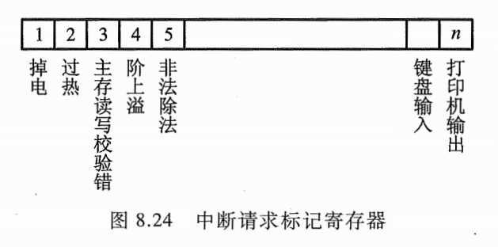

图中 1,2,3,4,5, …， n 分别对应掉电、过热、主存读写校验错、阶上溢、非法除法……打印机输出等中断源的中断请求触发器，其中任意一个触发器为 1 ，即表明对应的中断源提出了中断请求。显然，中断请求触发器越多，说明计算机处理中断的能力越强。

有一点需要说明，尽管中断请求标记寄存器是由各中断请求触发器组成的，但这些触发器既可以集中在 CPU 的中断系统内，也可以分散到各个中断源中。在图 5.41 所示的程序中断方式接口电路中， INTR 就是分散在各个接口电路内的中断请求触发器。

2中断判优逻辑

任何一个中断系统，在任一时刻，只能响应一个中断源的请求。但许多中断源提出请求都是随机的，当某一时刻有多个中断源提出中断请求时，中断系统必须按其优先顺序予以响应，这称为中断判优。各中断源的优先顺序是根据该中断源若得不到及时响应，致使机器工作出错的严重程度而定的。例如，电源掉电对计算机工作影响程度最大，优先等级为最高。又如“定点溢出“对机器正常工作影响也很大，若不及时响应，将使计算机一切运行均无效，故它的优先等级
也较高。对于 I/O 设备，则可按其速度高低安排优先等级，速度高的设备优先级比速度低的设备高。

中断判优可用硬件实现，也可用软件实现。

(1) 硬件排队
硬件排队又分两种。一种为链式排队器，对应中断请求触发器分散在各个接口电路中的情况，如图 5.38 所示，每一个接口电路中都设有一个非门和一个与非门，它们犹如链条一样串接起来。另一种排队器设在 CPU 内，如图 8.25 所示，图中假设其优先顺序按 1 、 2 、趴 4 由高向低排列。这样，当最高优先级的中断源有请求时 INTR1 = 1 ，就可封住比它级别低的中断源的请求。

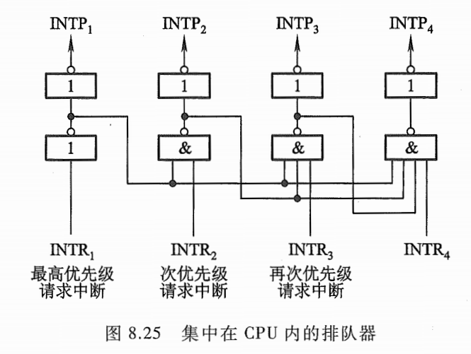

(2) 软件排队
软件排队是通过编写查询程序实现的，其程序框图如图 8.26 所示。程序按中断源的优先等级，从高至低逐级查询各中断源是否有中断请求，这样就可以保证 CPU 首先响应级别高的中断源的请求。

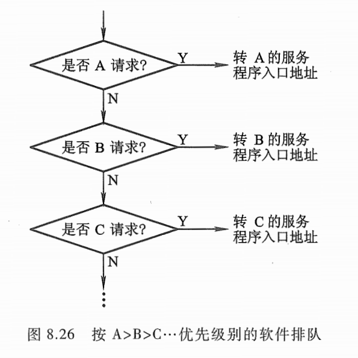


### 8.4.3 中断服务程序入口地址的寻址

由于不同的中断源对应不同的中断服务程序，故准确找到服务程序的入口地址是中断处理的核心问题。通常有两种方法寻找入口地址：硬件向量法和软件查询法。

1、硬件向量法

硬件向量法就是利用硬件产生向量地址，再由向量地址找到中断服务程序的入口地址。向
量地址由中断向量地址形成部件产生，这个电路可分散设置在各个接口电路中（如图 5.41 中的
设备编码器），也可设置在 CPU 内，如图 8.27 所示。

由向量地址寻找中断服务程序的入口地址通常采用两种办法。一种如图 5.40 所示，在向量地址内存放一条无条件转移指令， CPU 响应中断时，只要将向量地址（如 12H) 送至 PC ，执行这条指令，便可无条件转向打印机服务程序的入口地址 200 。另一种是设置向量地址表，如图 8.28所示。该表设在存储器内，存储单元的地址为向量地址，存储单元的内容为入口地址，例如，图8.28 中的 12H 、 13H 、 14H 为向量地址， 200 、 300 、 400 为入口地址，只要访问向量地址所指示的存储单元，便可获得入口地址。

硬件向量法寻找入口地址速度快，在现代计算机中被普遍采用。  

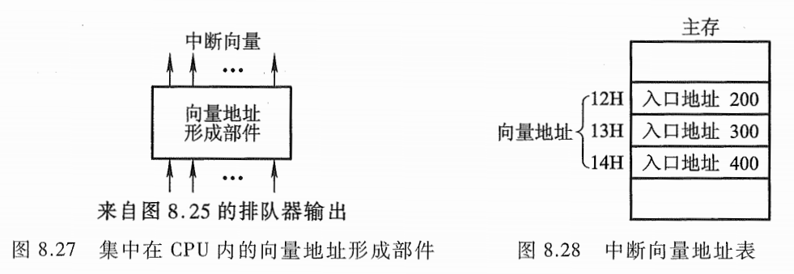

2、软件查询法

用软件寻找中断服务程序入口地址的方法称为软件查询法，其框图同图 8.26 。由图 8.26 中可见，当查到某一中断源有中断请求时，接着安排一条转移指令，直接指向此中断源的中断服务程序入口地址，机器便能自动进入中断处理。至于各中断源对应的入口地址，则由程序员（或系统）事先确定。这种方法不涉及硬件设备，但查询时间较长。计算机可具备软、硬件两种方法寻找入口地址，使用户使用更方便、灵活。  


### 8.4.4 中断响应

1、响应中断的条件

由第 5 章已知， CPU 响应 I/O 中断的条件是允许中断触发器必须为 “1" ，这一结论同样适合于其他中断源。在中断系统中有一个允许中断触发器 EINT ，它可被开中断指令置 ”1" ，也可被关中断指令置 “0” 。当允许中断触发器为 “1” 时，意味着 CPU 允许响应中断源的请求；当其为"O” 时，意味着 CPU 禁止响应中断。故当 EINT= 1 ，且有中断请求（即中断请求标记触发器 INTR=l) 时， CPU 可以响应中断。

2、响应中断的时间

与响应 I/O 中断一样， CPU 总是在指令执行周期结束后，响应任何中断源的请求，如图 8.8所示。在指令执行周期结束后，若有中断， CPU 则进入中断周期；若无中断，则进入下一条指令的取指周期。

之所以 CPU 在指令的执行周期后进入中断周期，是因为 CPU 在执行周期的结束时刻统一向所有中断源发中断查询信号，只有此时， CPU 才能获知哪个中断源有请求。如图 8.29 所示，图中 INTR/ i= 1,2, …）是各个中断源的中断请求触发器，触发器的数据端来自各中断源，当它们有请求时，数据端为 “1" ，而且只有当 CPU 发出的中断查询信号输入触发器的时钟端时，才能将INTRi 置 “1” 。

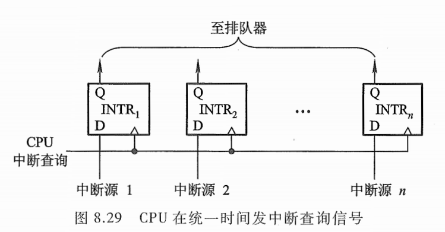

在某些计算机中，有些指令执行时间很长，若 CPU 的查询信号一律安排在执行周期结束时刻，有可能因 CPU 发现中断请求过迟而出差错。为此，可在指令执行过程中设置若干个查询断点， CPU 在每个“查询断点”时刻均发中断查询信号，以便发现有中断请求便可及时响应。

3、中断隐指令

CPU 响应中断后，即进入中断周期。在中断周期内， CPU 要自动完成一系列操作，具体如下：

(1) 保护程序断点
保护程序断点就是要将当前程序计数器 PC 的内容（程序断点）保存到存储器中。它可以存在存储器的特定单元（如 0 号地址）内，也可以存入堆栈。

(2) 寻找中断服务程序的入口地址
由于中断周期结束后进入下条指令（即中断服务程序的第一条指令）的取指周期，因此在中断周期内必须设法找到中断服务程序的入口地址。由于入口地址有两种方法获得，因此在中断周期内也有两种方法寻找入口地址。

其一，在中断周期内，将向量地址送至 PC （对应硬件向量法），使 CPU 执行下一条无条件转移指令，转至中断服务程序的入口地址。

其二，在中断周期内，将如图 8.26 所示的软件查询入口地址的程序（又称中断识别程序）首地址送至 PC ，使 CPU 执行中断识别程序，找到入口地址（对应软件查询法）。  

(3) 关中断
CPU 进入中断周期，意味着 CPU 响应了某个中断源的请求，为了确保 CPU 响应后所需做的一系列操作不至于又受到新的中断请求的干扰，在中断周期内必须自动关中断，以禁止 CPU 再次响应新的中断请求。图 8.30 是 CPU 自动关中断的示意图。图中允许中断触发器 EINT 和中断标记触发器INT 可选用标准的 R-S 触发器。当进入中断周期时， INT 为 “1” 状态，触发器原端输出有一个正跳变，经反相后产生一个负跳变，使 EINT 置 “0"' 即关中断。

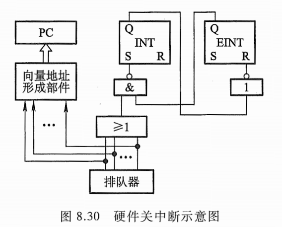

上述保护断点、寻找入口地址和关中断这些操作都是在中断周期内由一条中断隐指令完成的。所谓中断隐指令，即在机器指令系统中没有的指令，它是 CPU 在中断周期内由硬件自动完成的一条指令。  

### 8.4.5 保护现场和恢复现场

保护现场应该包括保护程序断点和保护 CPU 内部各寄存器内容的现场两个方面。程序断点的现场由中断隐指令完成，各寄存器内的现场可在中断服务程序中由用户（或系统）用机器指令编程实现，参见 5.5.5 节及图 5.43 。

恢复现场是指在中断返回前，必须将寄存器的内容恢复到中断处理前的状态，这部分工作也由中断服务程序完成，如图 5.43 所示。  


### 8.4.6 中断屏蔽技术

中断屏蔽技术主要用于多重中断。

1、多重中断的概念  

当 CPU 正在执行某个中断服务程序时，另一个中断源又提出了新的中断请求，而 CPU 又响应了这个新的请求，暂时停止正在运行的服务程序，转去执行新的中断服务程序，这称为多重中断，又称中断嵌套，如图 8.31 所示。如果 CPU 对新的请求不予响应，待执行完当前的服务程序后再响应，即为单重中断。中断系统若要具有处理多重中断的功能，必须具备各项条件。

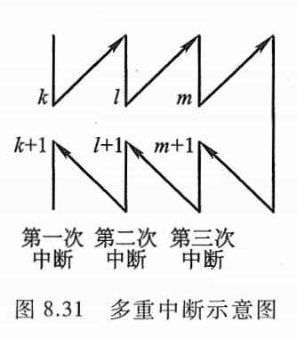

2、实现多重中断的条件  

(1) 提前设置“开中断”指令。  

由上述分析可知， CPU 进入中断周期后，由中断隐指令自动将 EINT 置 “0” ，即关中断，这就意味着 CPU 在执行中断服务程序中禁止响应新的中断请求。 CPU 若想再次响应中断请求，必须开中断，这一任务通常由中断服务程序中的开中断指令实现。由于开中断指令设置的位置不同，决定了 CPU 能否实现多重中断。由图 5.43 可见，多重中断“开中断”指令的位置前于单重中断，从而保证了多重中断允许出现中断嵌套。

(2) 优先级别高的中断源有权中断优先级别低的中断源。

在满足心的前提下，只有优先级别更高的中断源请求才可以中断比其级别低的中断服务程序，反之则不然。例如，有 A 、 B 、 C 、 D4 个中断源，其优先级按 A-+B-+C-+D 由高向低次序排列。在 CPU 执行主程序期间，同时出现了 B 和 C 的中断请求，由于 B 级别高于 C ，故首先执行 B 的服务程序。当 B 级中断服务程序执行完返回主程序后，由于 C 请求未撤销，故 CPU 又再去执行 C级的中断服务程序。若此时又出现了 D 请求，因为 D 级别低于 C ，故 CPU 不响应，当 C 级中断服务程序执行完返回主程序后再去执行 D 级的服务程序。若此时又出现了 A 请求，因 A 级别高于
D ，故 CPU 暂停对 D 级中断服务程序的执行，转去执行 A 级中断服务程序，等 A 级中断服务程序执行完后，再去执行 D 级中断服务程序。上述的中断处理示意图如图 8.32 所示。

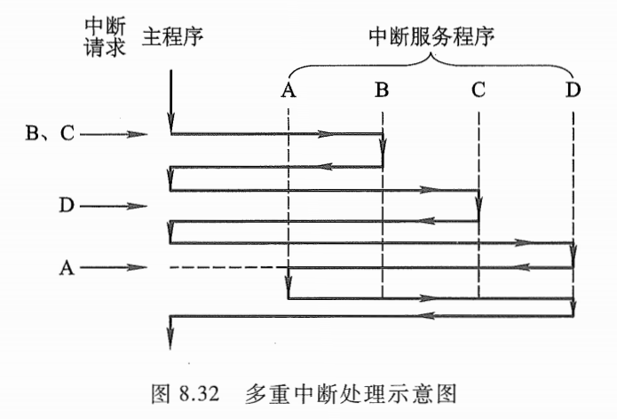

为了保证级别低的中断源不干扰比其级别高的中断源的中断处理过程，保证上述＠的实施，可采用屏蔽技术。  

3、屏蔽技术

(1) 屏蔽触发器与屏蔽字

图 5.37 示出了程序中断接口电路中完成触发器 D 、中断请求触发器 INTR 和屏蔽触发器MASK 三者之间的关系。当该中断源被屏蔽时 (MASK= 1) ，此时即使 D=l ，中断查询信号到来时刻只能将 INTR 置 “O", CPU 接收不到该中断源的中断请求，即它被屏蔽。若该中断源未被屏蔽 (MASK=O) ，当设备工作已完成时 (D=l) ，中断查询信号则将 INTR 置 ”1” ，表示该中断源向CPU 发出中断请求，该信号送至排队器进行优先级判断。

如果排队器集中设在 CPU 内，加上屏蔽条件，就可组成具有屏蔽功能的排队器，如图 8.33所示。  

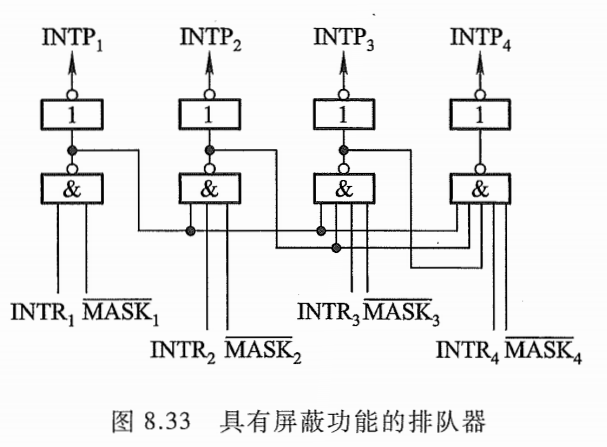

显然，对应每个中断请求触发器就有一个屏蔽触发器，将所有屏蔽触发器组合在一起，便构成一个屏蔽寄存器，屏蔽寄存器的内容称为屏蔽字。屏蔽字与中断源的优先级别是一一对应的，如表 8.7 所示。

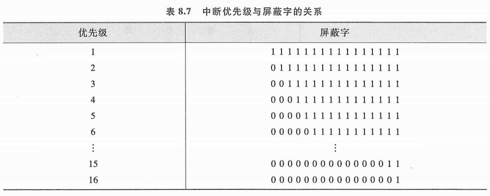

表 8.7 是对应 16 个中断源的屏蔽字，每个屏蔽字由左向右排序为第 1,2, 3 …，共 16 位。不难发现，每个中断源对应的屏蔽字是不同的。 1 级中断源的屏蔽字是 16 个 1 ;2 级中断源的屏蔽字是从第 2 位开始共 15 个 1 ;3 级中断源的屏蔽字是从第 3 位开始共 14 个 1 ……第 16 级中断源的屏蔽字只有第 16 位为 1 ，其余各位为 0 。

在中断服务程序中设置适当的屏蔽字，能起到对优先级别不同的中断源的屏蔽作用。例如，1 级中断源的请求已被 CPU 响应，若在其中断服务程序中（通常在开中断指令前）设置一个全“1" 的屏蔽字，便可保证在执行 1 级中断服务程序过程中， CPU 不再响应任何一个中断源（包括本级在内）的中断请求，即此刻不能实现多重中断。如果在 4 级中断源的服务程序中设置一个屏蔽字 0001111111111111 ，由于第 1~3 位为 0 ，意味着第 1~3 级的中断源未被屏蔽，因此在开中断指令后，比第 4 级中断源级别更高的 1 、 2 、 3 级中断源可以中断 4 级中断源的中断服务程序，实
现多重中断。

(2) 屏蔽技术可改变优先等级

严格地说，优先级包含响应优先级和处理优先级。响应优先级是指 CPU 响应各中断源请求的优先次序，这种次序往往是硬件线路巳设置好的，不便于改动。处理优先级是指 CPU 实际对各中断源请求的处理优先次序。如果不采用屏蔽技术，响应的优先次序就是处理的优先次序。

采用了屏蔽技术后，可以改变 CPU 处理各中断源的优先等级，从而改变 CPU 执行程序的轨迹。例如， A 、 B 、 C 、 D 这 4 个中断源的优先级别按 A-+-B-+-C-+-D 降序排列，根据这一次序，CPU 执行程序的轨迹如图 8.34 所示。当 4 个中断源同时提出请求时，处理次序与响应次序一致。

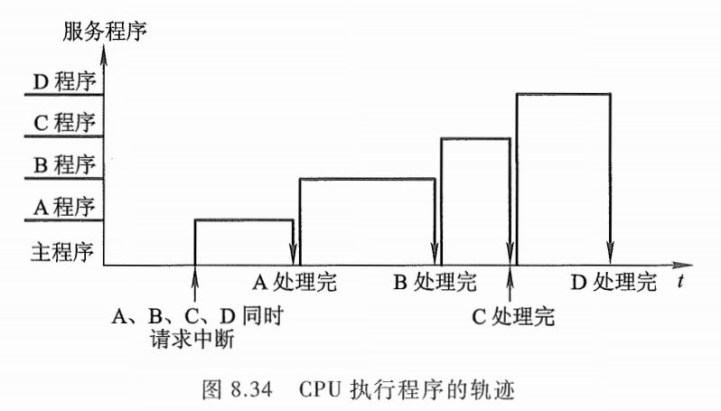

在不改变 CPU 响应中断的次序下，通过改变屏蔽字可以改变 CPU 处理中断的次序。例如，将上述 4 个中断源的处理次序改为 A-+D-+C-+B ，则每个中断源所对应的屏蔽字发生了变化，如表 8.8 所示。表中原屏蔽字对应 A-+B-+C-+D 的响应顺序，新屏蔽字对应 A-+D-+C一 B 的处理顺序。

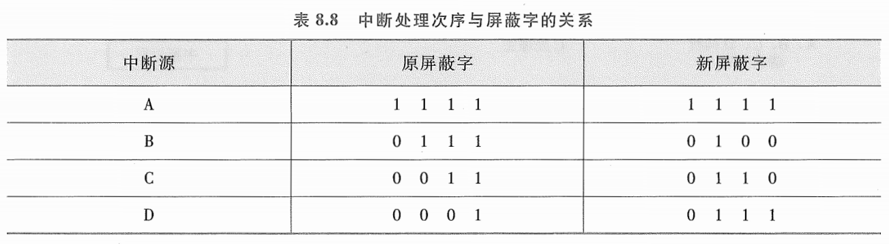

在同样中断请求的情况下， CPU 执行程序的轨迹发生了变化，如图 8.35 所示。 CPU 在运行程序的过程中，若 A 、 B 、 C 、 D4 个中断源同时提出请求，按照中断级别的高低， CPU 首先响应并处理 A 中断源的请求，由于 A 的屏蔽字是 1111 ，屏蔽了所有的中断源，故 A 程序可以全部执行完，然后回到主程序。由于 B 、 C 、 D 的中断请求还未响应，而 B 的响应优先级高于其他，所以 CPU 响应 B 的请求，进入 B 的中断服务程序。在 B 的服务程序中，由于设置了新的屏蔽字 0100 ，即 A 、C 、 D 可打断 B ，而 A 程序已执行完， C 的响应优先级又高于 D ，于是 CPU 响应 C ，进入 C 的服务程序。在 C 的服务程序中，由于设置了新的屏蔽字 0110 ，即 A 、 D 可打断 C ，由于 A 程序已执行完，于是 CPU 响应 D ，执行 D 的服务程序。在 D 的服务程序中，屏蔽字变成 0111 ，即只有 A 可打断D ，但 A 已处理结束，所以 D 可以一直执行完，然后回到 C 程序。 C 程序执行完后，回到 B 程序。B 程序执行完后，回到主程序。至此， A 、 B 、 C 、 D 均处理完毕。

采用了屏蔽技术后，在中断服务程序中需设置新的屏蔽字，流程如图 8.36 所示。与第 5 章图 5.43 (b) 所示的中断服务程序相比，增加了置屏蔽字和恢复屏蔽字两部分内容。而且为了防止在恢复现场过程中又出现新的中断，在恢复现场前又增加了关中断，恢复屏蔽字之后，必须再次开中断。

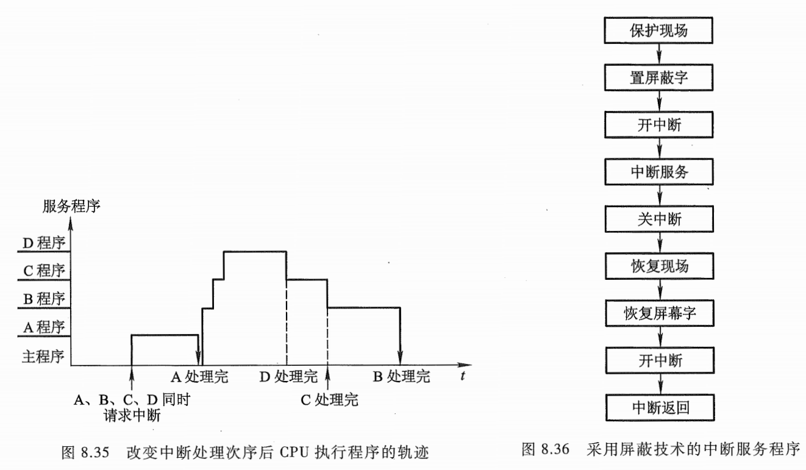

(3) 屏蔽技术的其他作用

屏蔽技术还能给程序控制带来更大的灵活性。例如，在浮点运算中，当程序员估计到执行某段程序时可能出现“阶上溢＂，但又不希望因“阶上溢”而使机器停机，为此可设一屏蔽字，使对应＂阶上溢＂的屏蔽位为 “1” ，这样，即使出现“阶上溢＂，机器也不停机。

4、多重中断的断点保护

多重中断时，每次中断出现的断点都必须保存起来，如图 8.31 中共出现了 3 次中断，有 3 个断点 k+l 、 l+ 1 、 m+l 需保存。中断系统对断点的保存都是在中断周期内由中断隐指令实现的，对用户是透明的。

断点可以保存在堆栈中，由于堆栈先进后出的特点，因此图 8.31 中的 k+l 先进栈，接着是l+ 1 进栈，最后是 m+l 进栈。出栈时，按相反顺序便可准确返回到程序间断处。

断点也可保存在特定的存储单元内，例如约定一律将程序断点存至主存的 0 号地址单元内。由于保存断点是由中断隐指令自动完成的，因此 3 次中断的断点都将存入 0 地址单元，这势必造成前两次存入的断点 k+l 和 l+ 1 被冲掉。为此，在中断服务程序中的开中断指令之前，必须先将0 地址单元的内容转存至其他地址单元中，才能真正保存每一个断点。读者可自行练习，画出将程序断点保存到 0 号地址单元的多重中断服务程序流程。