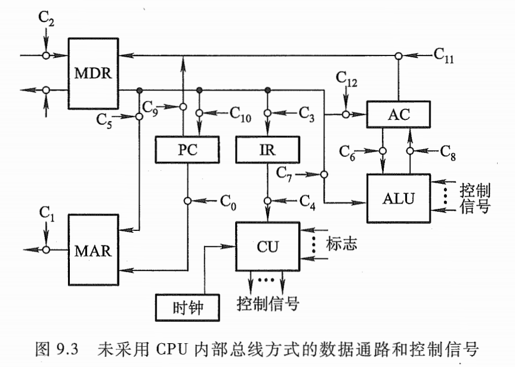

# 第9章 控制单元的功能

本章结合指令周期的 4 个阶段，着重分析控制单元为完成不同指令所发出的各种操作命令—~这些命令（又称控制信号）控制计算机的所有部件有次序地完成相应的操作，以达到执行程序的目的一旨在使读者进一步理解指令周期、机器周期、时钟周期（节拍）和控制信号的关系，进一步体会控制单元在机器运行中所起到的核心作用，为下一章控制单元的设计打好基础。  

## 9.1 微操作命令的分析

控制单元具有发出各种微操作命令（即控制信号）序列的功能。

概括地说，计算机的功能就是执行程序。在执行程序的过程中，控制单元要发出各种微操作命令，而且不同的指令对应不同的命令。进一步分析发现，完成不同指令的过程中，有些操作是相同或相似的，如取指令、取操作数地址（当间接寻址时）以及进入中断周期由中断隐指令完成的一系列操作。为更清晰起见，下面按指令周期的 4 个阶段进一步分析其对应的微操作命令。

### 取指周期

为了便于讨论，假设 CPU 内有 4 个寄存器，如图 8.10 所示。 MAR 与地址总线相连，存放欲访问的存储单元地址； MDR 与数据总线相连，存放欲写入存储器的信息或最近从存储器中读出的信息； PC 存放现行指令的地址，有计数功能； IR 存放现行指令。取指令的过程可归纳为以下几个操作。

1. 现行指令地址送至存储器地址寄存器，记作 PC → MAR 。
2. 向主存发送读命令，启动主存做读操作，记作 1 → R 。
3. 将 MAR（通过地址总线）所指的主存单元中的内容（指令）经数据总线读至 MDR 内，记作M(MAR) → MDR 。
4. 将 MDR 的内容送至 IR ，记作 MDR  → IR 。
5. 指令的操作码送至 CU 译码，记作 OP(IR) → CU 。
6. 形成下一条指令的地址，记作 (PC) + 1 → PC 。  

### 间址周期

间址周期完成取操作数有效地址的任务，具体操作如下。

1. 将指令的地址码部分（形式地址）送至存储器地址寄存器，记作 Ad(IR) → MAR 。
2. 向主存发送读命令，启动主存做读操作，记作 1 → R 。
3. 将 MAR （通过地址总线）所指的主存单元中的内容（有效地址）经数据总线读至 MDR内，记作 M(MAR) → MDR 。
4. 将有效地址送至指令寄存器的地址字段，记作 MDR → Ad(IR) 。此操作在有些机器中可省略。  

### 执行周期

不同指令执行周期的微操作是不同的，下面分别讨论非访存指令、访存指令和转移类指令的微操作。

1、非访存指令
这类指令在执行周期不访问存储器。
(1) 清除累加器指令 CLA
该指令在执行阶段只完成清除累加器操作，记作 0 → ACC 。
(2) 累加器取反指令 COM
该指令在执行阶段只完成累加器内容取反，结果送累加器的操作，记作 $\overline{ACC}$ → ACC 。
(3) 算术右移一位指令 SHR
该指令在执行阶段只完成累加器内容算术右移一位的操作，记作  L(ACC) → R (ACC),
ACC 。 → ACC 。 (ACC 的符号位不变）。
(4) 循环左移一位指令 CSL
该指令在执行阶段只完成累加器内容循环左移一位的操作，记作 R(ACC) → L(ACC)，$ACC_0$ → $ACC_n$（或 $p^{-1}(ACC)$ ）。
(5) 停机指令 STP
计算机中有一个运行标志触发器 G ，当 G=1 时，表示机器运行；当 G=0 时，表示停机。 STP指令在执行阶段只需将运行标志触发器置 “0” ，记作 0 → G 。

2、访存指令
这类指令在执行阶段都需要访问存储器。为简单起见，这里只考虑直接寻址的情况，不考虑其他寻址方式。

(1) 加法指令 ADD X
该指令在执行阶段需要完成累加器内容与对应于主存 X 地址单元的内容相加，结果送累加器的操作，具体如下：

1. 将指令的地址码部分送至存储器地址寄存器，记作 Ad(IR) → MAR 。
2. 向主存发读命令，启动主存做读操作，记作 1 → R 。
3. 将 MAR （通过地址总线）所指的主存单元中的内容（操作数）经数据总线读至 MDR 内，记作 M(MAR)-+MDR 。
4. 给 ALU 发送加命令，将 ACC 的内容和 MDR 的内容相加，结果存于 ACC ，记作 (ACC) +(MDR) → ACC 。

当然，也有的加法指令指定两个寄存器的内容相加，如 “ADD AX,BX" ，该指令在执行阶段无须访存，只需完成 (AX) + (BX) → AX 的操作。

(2) 存数指令 STA X
该指令在执行阶段需将累加器 ACC 的内容存于主存的 X 地址单元中，具体操作如下：

1. 将指令的地址码部分送至存储器地址寄存器，记作 Ad (IR) → MAR 。
2. 向主存发写命令，启动主存做写操作，记作 1 → W 。
3. 将累加器内容送至 MDR ，记作 ACC → MDR 。
4. 将 MDR 的内容（通过数据总线）写入 MAR （通过地址总线）所指的主存单元中，记作MDR → M(MAR) 。

(3) 取数指令 LDA X
该指令在执行阶段需将主存 X 地址单元的内容取至累加器 ACC 中，具体操作如下：

1. 将指令的地址码部分送至存储器地址寄存器，记作 Ad(IR) → MAR 。
2. 向主存发读命令，启动主存作读操作，记作 1 → R 。
3. 将 MAR （通过地址总线）所指的主存单元中的内容（操作数）经数据总线读至 MDR 内，记作 M(MAR)-+MDR 。
4. 将 MDR 的内容送至 ACC ，记作 MDR → ACC 。

3、转移类指令
这类指令在执行阶段也不访问存储器。

(1) 无条件转移指令 JMP X
该指令在执行阶段完成将指令的地址码部分 X 送至 PC 的操作，记作 Ad(IR) → PC 。

(2) 条件转移（负则转）指令 BAN X
该指令根据上一条指令运行的结果决定下一条指令的地址，若结果为负（累加器最高位为
l ，即 A 。＝ l) ，则指令的地址码送至 PC ，否则程序按原顺序执行。由于在取指阶段已完成了 (PC)1 → PC ，所以当累加器结果不为负（即 A。 =0) 时，就按取指阶段形成的 PC 执行，记作A 。 .Ad(IR) ＋＼。.（ PC)-+PC 。

由此可见，不同指令在执行阶段所完成的操作是不同的。如果将访存指令分为直接访存和间接访存两种，则上述三类指令的指令周期如图 9.1 所示。

### 中断周期

在执行周期结束时刻， CPU 要查询是否有请求中断的事件发生，如果有则进入中断周期。由 8.4.4 节可知，在中断周期，由中断隐指令自动完成保护断点、寻找中断服务程序入口地址以及硬件关中断的操作。假设程序断点存至主存的 0 地址单元，且采用硬件向量法寻找入口地址，则在中断周期需完成如下操作：

1. 将特定地址 “0“ 送至存储器地址寄存器，记作 0 → MAR 。
2. 向主存发写命令，启动存储器作写操作，记作 1 → W 。
3. 将 PC 的内容（程序断点）送至 MDR ，记作 PC → MDR 。
4. 将 MDR 的内容（程序断点）通过数据总线写入 MAR （通过地址总线）所指示的主存单元(0 地址单元）中，记作 MDR → M(MAR) 。
5. 将向量地址形成部件的输出送至 PC ，记作向量地址 -+PC ，为下一条指令的取指周期做准备。
6. 关中断，将允许中断触发器清零，记作 0 → EINT （该操作可直接由硬件线路完成，参见图8.30) 。

如果程序断点存入堆栈，而且进栈操作是先修改栈指针，后存入数据（参见图 7.18) ，只需将上述心改为 (SP)-1-+SP ，且 SP → MAR 。

上述所有操作都是在控制单元发出的控制信号（即微操作命令）控制下完成的。  

## 9.2 控制单元的功能

### 控制单元的外特性

图 9.2 是反映控制单元外特性的框图。  

1、输入信号
(1) 时钟
上述各种操作有以下两点应特别注意：

1. 完成每个操作都需占用一定的时间。
2. 各个操作是有先后顺序的。例如，存储器读操作要用到 MAR 中的地址，故 PC-+MAR 应先于 M(MAR)-+MDR 。

为了使控制单元按一定的先后顺序、一定的节奏发出各个控制信号，控制单元必须受时钟控制，即每一个时钟脉冲使控制单元发送一个操作命令，或发送一组需要同时执行的操作命令。

(2) 指令寄存器
现行指令的操作码决定了不同指令在执行周期所需完成的不同操作，故指令的操作码字段是控制单元的输入信号，它与时钟配合可产生不同的控制信号。

(3) 标志
控制单元有时需依赖 CPU 当前所处的状态（如 ALU 操作的结果）产生控制信号，如 BAN 指令，控制单元要根据上条指令的结果是否为负而产生不同的控制信号。因此“标志”也是控制单的输入信号。

(4) 来自系统总线（控制总线）的控制信号
例如，中断请求、 DMA 请求。

2、输出信号
(1) CPU 内的控制信号
主要用于 CPU 内的寄存器之间的传送和控制 ALU 实现不同的操作。

(2) 送至系统总线（控制总线）的信号
例如，命令主存或 I/0 读／写、中断响应等。  

### 控制信号举例

控制单元的主要功能就是能发出各种不同的控制信号。下面以间接寻址的加法指令"ADD @X” 为例，进一步理解控制信号在完成一条指令的过程中所起的作用。

1、不采用 CPU 内部总线的方式

图 9.3 示意了未采用 CPU 内部总线方式的数据通路和控制信号的关系。图中未画出每个寄存器的输入或输出控制门，但标出了控制这些门电路的控制信号 C! ，考虑到从存储器取出的指令或有效地址都先送至 MDR 再送至 IR ，故这里省去了 IR 送至 MAR 的数据通路，凡是需要从IR 送至 MAR 的操作均可由 MDR 送至 MAR 代替。

(1) 取指周期

1. 控制信号$C_0$有效，打开 PC 送往 MAR 的控制门。
2. 控制信号$C_1$有效，打开 MAR 送往地址总线的输出门。
3. 通过控制总线向主存发读命令。
4. $C_2$有效，打开数据总线送至 MDR 的输入门。
5. $C_3$有效，打开 MDR 和 IR 之间的控制门，至此指令送至 IR 。
6. $C_4$有效，打开指令操作码送至 CU 的输出门。 CU 在操作码和时钟的控制下，可产生各种控制信号。
7. 使PC内容加1（图中未标出）。

(2) 间址周期

1. $C_5$有效，打开 MDR 和 MAR 之间的控制门，将指令的形式地址送至 MAR 。
2. $C_1$有效，打开 MAR 送往地址总线的输出门。
3. 通过控制总线向主存发读命令。
4. $C_2$立有效，打开数据总线送至 MDR 的输入门，至此，有效地址存入 MDR 。
5. $C_3$有效，打开 MDR 和 IR 之间的控制门，将有效地址送至 IR 的地址码字段。

(3) 执行周期

1. $C_5$有效，打开 MDR 和 MAR 之间的控制门，将有效地址送至 MAR 。
2. 凡有效，打开 MAR 送往地址总线的输出门。
3. 通过控制总线向主存发读命令。
4. $C_2$有效，打开数据总线送至 MDR 的输入门，至此，操作数存入 MDR 。
5. $C_6$、$C_7$同时有效，打开 AC 和 MDR 通往 ALU 的控制门。
6. 通过 CPU 内部控制总线对 ALU 发 “ADD“ 加控制信号，完成 AC 的内容和 MDR 的内容相加。
7. $C_8$有效，打开 ALU 通往 AC 的控制门，至此将求和结果存入 AC 。

图中亿和 ClO 分别是控制 PC 的输出和输入的控制信号， Cu 和 c12 分别是控制 AC 的输出和输入的控制信号。

### 多级时序系统

1、机器周期

机器周期可看作所有指令执行过程中的一个基准时间，机器周期取决于指令的功能及器件的速度。确定机器周期时，通常要分析机器指令的执行步骤及每一步骤所需的时间。例如，取数、存数指令能反映存储器的速度及其与 CPU 的配合情况；加法指令能反映 ALU 的速度；条件转移指令因为要根据上一条指令的执行结果，经测试后才能决定是否转移，所需的时间较长。总之，通过对机器指令执行步骤的分析，会找到一个基准时间，在这个基准时间内，所有指令的操作都能结束。若以这个基准时间定为机器周期，显然不是最合理的。因为只有以完成复杂指令功
能所需的时间（最长时间）作为基准，才能保证所有指令在此时间内完成全部操作，这对简单指令来说，显然是一种浪费。

进一步分析发现，机器内的各种操作大致可归属为对 CPU 内部的操作和对主存的操作两大类，由于 CPU 内部的操作速度较快， CPU 访存的操作时间较长，因此通常以访问一次存储器的时间定为基准时间较为合理，这个基准时间就是机器周期。又由于不论执行什么指令，都需要访问存储器取出指令，因此在存储字长等于指令字长的前提下，取指周期也可看作机器周期。

2、时钟周期（节拍、状态）

在一个机器周期里可完成若干个微操作，每个微操作都需要一定的时间，可用时钟信号来控制产生每一个微操作命令（如图 9.3 中的 Ci) 。时钟就好比计算机的心脏，只要接通电源，计算机内就会产生时钟信号。时钟信号可由机器主振电路（如晶体振荡器）发出的脉冲信号经整形（或倍频、分频）后产生，时钟信号的频率即为 CPU 主频。用时钟信号控制节拍发生器，就可产生节拍。每个节拍的宽度正好对应一个时钟周期。在每个节拍内机器可完成一个或几个需同时执行的操作，它是控制计算机操作的最小时间单位。图 9.8 反映了机器周期、时钟周期和节拍的关
系，图中一个机器周期内有 4 个节拍 $T_0$、$T_1$、 $T_2$、 $T_3$。

3、多级时序系统

图 9.9 反映了指令周期、机器周期、节拍（状态）和时钟周期的关系。可见，一个指令周期包含若干个机器周期，一个机器周期又包含若干个时钟周期（节拍），每个指令周期内的机器周期数可以不等，每个机器周期内的节拍数也可以不等。其中，图 9.9 (a) 为定长的机器周期，每个机器周期包含 4 个节拍 (4 个 T) ；图 9.9(b) 为不定长的机器周期，每个机器周期包含的节拍数可以为 4 个，也可以为 3 个，后者适合千操作比较简单的指令，它可跳过某些时钟周期（如兀），从而缩短指令周期。

机器周期、节拍（状态）组成了多级时序系统。

一般来说， CPU 的主频越快，机器的运行速度也越快。在机器周期所含时钟周期数相同的前提下，两机平均指令执行速度之比等于两机主频之比。例如， CPU 的主频为 8 MHz ，其平均指令执行速度为 0.8 MIPS 。若想得到平均指令执行速度为 0.4 MIPS 的机器，则只需要用主频为(8 MHzx0.4 MIPS) /0.8 MIPS= 4 MHz 的 CPU 即可。

实际上机器的速度不仅与主频有关，还与机器周期中所含的时钟周期数以及指令周期中所含的机器周期数有关。同样主频的机器，由于机器周期所含时钟周期数不同，运行速度也不同。机器周期所含时钟周期数少的机器，速度更快。  

### 控制方式

控制单元控制一条指令执行的过程实质上是依次执行一个确定的微操作序列的过程。由千
不同指令所对应的微操作数及其复杂程度不同，因此每条指令和每个微操作所需的执行时间也
不同。通常将如何形成控制不同微操作序列所采用的时序控制方式称为 CU 的控制方式。常见
的控制方式有同步控制、异步控制、联合控制和人工控制四种。

1、同步控制方式

同步控制方式是指，任何一条指令或指令中任何一个微操作的执行都是事先确定的，并且都是受统一基准时标的时序信号所控制的方式。

图 9.9(a) 就是一种典型的同步控制方式，每个机器周期都包含 4 个节拍。如果机器内的存储器存取周期不统一，那么只有把最长的存取周期作为机器周期，才能采用同步控制，否则取指令和取数时间不同，无法用统一的基准。又如有些不访存的指令，执行周期的微操作较少，无须4 个节拍。因此，为了提高 CPU 的效率，在同步控制中又有三种方案。

(1) 采用定长的机器周期
这种方案的特点是：不论指令所对应的微操作序列有多长，也不管微操作的简繁，一律以最长的微操作序列和最繁的微操作作为标准，采取完全统一的、具有相同时间间隔和相同数目的节拍作为机器周期来运行各种不同的指令，如图 9.9(a) 所示。显然，这种方案对千微操作序列较短的指令来说，会造成时间上的浪费。

(2) 采用不定长的机器周期
采用这种方案时，每个机器周期内的节拍数可以不等，如图 9.9(b) 所示。这种控制方式可解决微操作执行时间不统一的问题。通常把大多数微操作安排在一个较短的机器周期内完成，而对某些复杂的微操作，采用延长机器周期或增加节拍的办法来解决，如图 9.10 所示。

(3) 采用中央控制和局部控制相结合的方法
这种方案将机器的大部分指令安排在统一的、较短的机器周期内完成，称为中央控制，而将少数操作复杂的指令中的某些操作（如乘除法和浮点运算等）采用局部控制方式来完成，图 9.11所示为中央控制和局部控制的时序关系。  

在设计局部控制线路时需要注意两点：其一，使局部控制的每一个节拍广的宽度与中央控
制的节拍宽度相同；其二，将局部控制节拍作为中央控制中机器节拍的延续，插入中央控制的执
行周期内，使机器以同样的节奏工作，保证局部控制和中央控制的同步。广的多少可根据情况而定，对千乘法，当操作数位数固定后，广的个数也就确定了。而对于浮点运算的对阶操作，由
千移位次数不是一个固定值，因此广的个数不能事先确定。
以乘法指令为例，第一个机器周期采用中央控制的节拍控制取指令操作，接着仍用中央控制
的 T。、 Tl 、兀节拍去完成将操作数从存储器中取出并送至寄存器的操作，然后转局部控制，用局
部控制节拍 T＊完成重复加和移位的操作。

2、异步控制方式
异步控制方式不存在基准时标信号，没有固定的周期节拍和严格的时钟同步，执行每条指令
和每个操作需要多少时间就占用多少时间。这种方式微操作的时序由专门的应答线路控制，即
当 CU 发出执行某一微操作的控制信号后，等待执行部件完成该操作后发回“回答＂（或“结束”)
信号，再开始新的微操作，使 CPU 没有空闲状态，但因需要采用各种应答电路，故其结构比同步
控制方式复杂。

3、联合控制方式
同步控制和异步控制相结合就是联合控制方式。这种方式对各种不同指令的微操作实行大
部分统一、小部分区别对待的办法。例如，对每条指令都有的取指令操作，采用同步方式控制；对
那些时间难以确定的微操作，如 I/0 操作，则采用异步控制，以执行部件送回的“回答“信号作为
本次微操作的结束。

4、人工控制方式
人工控制是为了调机和软件开发的需要，在机器面板或内部设置一些开关或按键，来达到人工控制的目的。

(1) Reset （复位）键
按下 Reset 键，使计算机处于初始状态。当机器出现死锁状态或无法继续运行时，可按此键。若在机器运行时按此键，将会破坏机器内某些状态而引起错误，因此要慎用。有些微型计算机未设此键，当机器死锁时，可采用停电后再加电的办法重新启动计算机。

(2) 连续或单条执行转换开关
由于调机的需要，有时需要观察执行完一条指令后的机器状态，有时又需要观察连续运行程序后的结果，设置连续或单条执行转换开关，能为用户提供这两种选择。

(3) 符合停机开关
有些计算机还配有符合停机开关，这组开关指示存储器的位置，当程序运行到与开关指示的地址相符时，机器便停止运行，称为符合停机。  

### 多级时序系统实例分析

# 第10章 控制单元的设计

## 10.1 组合逻辑设计

## 10.2 微程序设计

