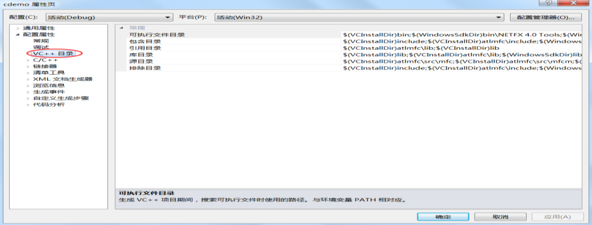

多文件编程就是把多个头文件（ .h 文件）和源文件（.c 文件）组合在一起构成一个程序，这是 C 语言的重点，也是
C 语言的难点。 C 语言头文件的编写是其中的重点内容，有很多细节需要注意，有的甚至会让你感觉奇怪。  

# 从 extern 关键字开始谈 C 语言多文件编程

在前面的教程中，我们都是将所有的代码写到一个源文件里面，对于小程序，代码不过几百行，这或许无可厚非，但当程序膨胀代码到几千行甚至上万行后，就应该考虑将代码分散到多个文件中，否则代码的阅读和维护将成为一件痛苦的事情。  

本节我们就来演示一下多文件编程。在下面的例子中，我们创建了两个源文件 main.c 和 module.c：

- module.c 是整个程序的一个模块，我们在其中定义了一个全局变量和一个函数；
- main.c 是程序的主模块（主文件），它使用到了 module.c 中的变量和函数  

module.c 源码：

```c
#include <stdio.h>

int m = 100;

void func()
{
    printf("Multiple file programming!\n");
}
```

main.c 源码：

```c
#include <stdio.h>

extern void func();
extern int m;

int n = 200;

int main()
{
    func();
    printf("m = %d, n = %d\n", m, n);
    return 0;
}
```

在 Linux GCC 中，可以使用下面的命令来编译和运行程序：

```shell
$gcc main.c module.c
$./a.out
```

程序最终的运行结果为：

```shell
Multiple file programming!
m = 100, n = 200
```

m 和 n 是在所有函数之外定义的全局变量（ Global Variable） ，它的作用域默认是整个程序，也就是所有的代码文件，包括.c 和.h 文件。  

这里需要重点理解的是 extern 关键字，它用来声明一个变量或函数。  

## extern 关键字

我们知道， C 语言代码是由上到下依次执行的，不管是变量还是函数，原则上都要先定义再使用，否则就会报错。但在实际开发中，经常会在函数或变量定义之前就使用它们，这个时候就需要提前声明。

所谓声明（ Declaration），就是告诉编译器我要使用这个变量或函数，你现在没有找到它的定义不要紧，请不要报错，稍后我会把定义补上。

例如，我们知道使用 printf()、 puts()、 scanf()、 getchar() 等函数要引入 stdio.h 这个头文件，很多初学者认为 stdio.h 中包含了函数定义（也就是函数体），只要有了头文件程序就能运行。其实不然，头文件中包含的都是函数声明，而不是函数定义，函数定义都在系统库中，只有头文件没有系统库在链接时就会报错，程序根本不能运行。  

### 函数的声明

在《C 语言函数声明以及函数原型》一节中我们讲到了函数声明，那时并没有使用 extern 关键字，这是因为，函数的定义有函数体，函数的声明没有函数体，编译器很容易区分定义和声明，所以对于函数声明来说，有没有 extern 都是一样的。

总结起来，函数声明有四种形式：

```c
//不使用 extern
datatype function( datatype1 name1, datatype2 name2, ... );
datatype function( datatype1, datatype2, ... );
//使用 extern
extern datatype function( datatype1 name1, datatype2 name2, ... );
extern datatype function( datatype1, datatype2, ... );
```

### 变量的声明

变量和函数不同，编译器只能根据 extern 来区分，有 extern 才是声明，没有 extern 就是定义。

变量的定义有两种形式，你可以在定义的同时初始化，也可以不初始化：  

```c
datatype name = value;
datatype name;
```

而变量的声明只有一种形式，就是使用 extern 关键字：  

```c
extern datatype name;
```

另外，变量也可以在声明的同时初始化，格式为：

```c
extern datatype name = value;
```

这种似是而非的方式是不被推荐的，有的编译器也会给出警告，我们不再深入讨论，也建议各位读者把定义和声明分开，尽量不要这样写。  

extern 是“外部”的意思，很多教材讲到， extern 用来声明一个外部（其他文件中）的变量或函数，也就是说，变量或函数的定义在其他文件中。

不过我认为这样讲不妥，因为除了定义在外部，定义在当前文件中也是正确的。例如，将 module.c 中的 int m = 100;移动到 main.c 中的任意位置都是可以的。所以我认为， extern 是用来声明的，不管具体的定义是在当前文件内部还是外部，都是正确的。  

# C 语言模块化编程中的头文件

前面我们在演示多文件编程时创建了 main.c 和 module.c 两个源文件，并在 module.c 中定义了一个函数和一个全局变量，然后在 main.c 中进行了声明。

不过实际开发中很少这样做，一般是将函数和变量的声明放到头文件，再在当前源文件中 #include 进来。如果变量的值是固定的，最好使用宏来代替。下面的例子是改进后的代码

main.c 源码：

```c
#include <stdio.h>
#include "module.h"

int main()
{
    printf("a = %d\n", a);
    func();
    printf("OS: %s\n", OS);
    return 0;
}
```

module.c 源码：

```c
#include <stdio.h>

int a = 100;

void func()
{
    printf("c.biancheng.net\n");
}
```

module.h 源码：

```c
#define OS "Windows 7"

extern int a;
extern void func();
```

在 GCC 中，使用下面的命令来编译和运行：

```shell
$gcc main.c module.c
$./a.out
```

程序最终的输出结果为：

```shell
a = 100
c.biancheng.net
OS: Windows 7
```

.c 和.h 文件都是源文件，除了后缀不一样便于区分外和管理外，其他的都是相同的，在.c 中编写的代码同样也可以写在.h 中，包括函数定义、变量定义、预处理等。

但是， .h 和 .c 在项目中承担的角色不一样： .c 文件主要负责实现，也就是定义函数和变量； .h 文件主要负责声明（包括变量声明和函数声明）、宏定义、类型定义等。这些不是 C 语法规定的内容，而是约定成俗的规范，或者说是长期形成的事实标准。  

根据这份规范，头文件可以包含如下的内容：

- 可以声明函数，但不可以定义函数。
- 可以声明变量，但不可以定义变量。
- 可以定义宏，包括带参的宏和不带参的宏。
- 结构体的定义、自定义数据类型一般也放在头文件中。  

在项目开发中，我们可以将一组相关的变量和函数定义在一个 .c 文件中，并用一个同名的 .h 文件（头文件）进行声明，其他模块如果需要使用某个变量或函数，那么引入这个头文件就可以。

这样做的另外一个好处是可以保护版权，我们在发布相关模块之前，可以将它们都编译成目标文件，或者打包成静态库，只要向用户提供头文件，用户就可以将这些模块链接到自己的程序中。  

# C 语言标准库以及标准头文件

源文件通过编译可以生成目标文件（例如 GCC 下的 .o 和 Visual Studio 下的 .obj），并提供一个头文件向外暴露接口，除了保护版权，还可以将散乱的文件打包，便于发布和使用。

实际上我们一般不直接向用户提供目标文件，而是将多个相关的目标文件打包成一个静态链接库（ Static Link Library） ，例如 Linux 下的 .a 和 Windows 下的 .lib。

打包静态库的过程很容易理解，就是将多个目标文件捆绑在一起形成一个新的文件，然后再加上一些索引，方便链接器找到，这和压缩文件的过程非常类似。

C 语言在发布的时候已经将标准库打包到了静态库，并提供了相应的头文件，例如 stdio.h、 stdlib.h、 string.h等。

Linux 一般将静态库和头文件放在 `/lib` 和 `/user/lib` 目录下， C 语言标准库的名字是 `libc.a`，大家可以通过`locate` 命令来查找它的路径：

```shell
$ locate libc.a
/usr/lib/x86_64-redhat-linux6E/lib64/libc.a

$ locate stdio.h
/usr/include/stdio.h
/usr/include/bits/stdio.h
/usr/include/c++/4.8.2/tr1/stdio.h
/usr/lib/x86_64-redhat-linux6E/include/stdio.h
/usr/lib/x86_64-redhat-linux6E/include/bits/stdio.h
```

在 Windows 下，标准库由 IDE 携带，如果你使用的是 Visual Studio，那么在安装目录下的 `\VC\include` 文件夹中会看到很多头文件，包括我们常用的 `stdio.h`、 `stdlib.h` 等；在 `\VC\lib` 文件夹中有很多 `.lib` 文件，这就是链接器要用到的静态库。

大家也可以在当前工程的属性面板（在工程名处单击鼠标右键选择“属性”）中查看路径：  



ANSI C 标准共定义了 15 个头文件，称为“C 标准库”，所有的编译器都必须支持，如何正确并熟练的使用这些标准库，可以反映出一个程序员的水平：  

- 合格程序员： <stdio.h>、 <ctype.h>、 <stdlib.h>、 <string.h>
- 熟练程序员： <assert.h>、 <limits.h>、 <stddef.h>、 <time.h>
- 优秀程序员： <float.h>、 <math.h>、 <error.h>、 <locale.h>、 <setjmp.h>、 <signal.h>、 <stdarg.h>  

C 语言共有两套标准，也就是 ANSI C 和 C99。 ANSI C 是较早的标准，各种编译器都能很好的支持， C99 是后来的标准，编译器对它的支持不尽相同。

除了 C 标准库，编译器一般也会附带自己的库，以增加功能，方便用户开发，争夺市场份额。这些库中的每一个函数都在对应的头文件中声明，可以通过 #include 预处理命令导入，编译时会被合并到当前文件。  

# 细说 C 语言头文件的路径

我们常说，引入编译器自带的头文件（包括标准头文件）用尖括号，引入程序自定义的头文件用双引号，例如：

```c
#include <stdio.h> //引入标准头文件
#include "myFile.h" //引入自定义的头文件
```

使用尖括号< >，编译器会到系统路径下查找头文件；而使用双引号" "，编译器首先在当前目录下查找头文件，如果没有找到，再到系统路径下查找。也就是说，使用双引号比使用尖括号多了一个查找路径，它的功能更为强大，我们完全可以使用双引号来包含标准头文件，例如：  

```c
#include "stdio.h"
#include "stdlib.h"
```

那么，这里所说的“系统路径”和“当前路径”是什么意思呢？  

## 绝对路径和相对路径

理论上讲，我们可以将头文件放在磁盘上的任意位置，只要带路径包含进来就可以。以 Windows 为例，在 D盘下创建一个自定义的文件夹，名字为 abc，它里面有一个头文件叫做 xyz.h，那么在程序开头使用 #include "D:\\abc\xyz.h" 就能够引入该头文件。  

现在不妨假设 xyz.h 中有一个宏定义和一个变量：

```c
#define NAME "C 语言中文网"
// 我们不鼓励在头文件中定义变量，否则多次引入后会出现重复定义错误，这里仅是一个演示案例，并不规范。
int age = 5;
```

下面的代码会输出头文件中的宏和变量：

```c
#include <stdio.h>
#include "D:\\abc\xyz.h"

int main()
{
    printf("%s 已经 %d 岁了！ \n", NAME, age);
    return 0;
}
```

运行结果：

```
C 语言中文网已经 5 岁了！
```

像 D:\\abc\xyz.h 这种从盘符开始、完整地描述文件位置的路径就是绝对路径（ Absolute Path） 。  


相对路径（ relative path） 是从当前目录（文件夹）开始查找文件；当前目录是指需要引入头文件的源文件所在的目录，这也是本文开头提到的“当前路径”。  

以 Windows 为例，假设在 `E:/cDemo/` 中有源文件 `main.c` 和头文件 `xyz.h`，那么在 `main.c` 中使用 `#include "./xyz.h"` 语句就可以引入 `xyz.h`，其中`./`表示当前目录，也即 `E:/cDemo/`。

如果将 `xyz.h` 移动到 `E:/cDemo/include/`（ `main.c` 所在目录的下级目录），那么包含语句就应该修改为
`#include "./include/xyz.h"`；对于 `main.c` 来说，此时的“当前目录”依然是 `E:/cDemo/`。

如果将 `xyz.h` 移动到 `E:/`（ `main.c` 所在目录的上级目录），那么包含语句就应该修改为 `#include "./../xyz.h"`，其中`../`表示上级目录。 `./../xyz.h` 的意思是，在当前目录的上级目录中查找 `xyz.h` 文件。

如果将 `xyz.h` 移动到 `E:/include` 目录，那么包含语句就应该修改为`#include "./../include/xyz.h"`。

需要注意的是，我们可以将`./`省略，此时默认从当前目录开始查找，例如`#include "xyz.h"`、 `#include "include/xyz.h"`、 `#include "../xyz.h"`、 `#include "../include/xyz.h"`。

在实际开发中，我们都是将头文件放在当前工程目录下，非常建议大家使用相对路径，这样即使后来改变了工程所在目录，也无需修改包含语句，因为源文件的相对位置没有改变。  

## 系统路径

在上节《C 语言标准库以及标准头文件》中讲到， Windows 下的 C 语言标准库由 IDE 自己携带， Linux 下的 C语言标准库一般在固定的路径下，总起来说，标准库不在工程目录下，要使用绝对路径才能引入头文件，这样每次切换平台或者 IDE 都要修改包含路径，非常不方便。  

为了让头文件更加具有实践意义， Windows 下的 IDE 都可以为静态库和头文件设置默认目录。以 Visual Studio 为例，在当前工程名处单击鼠标右键，选择“属性”，在弹出的对话框中就可以看到已经设置好的路径，如下图所示：  


这些已经设置好的路径就是本文开头提到的“系统路径”。

当使用相对路径的方式引入头文件时，如果使用< >，那么“相对”的就是系统路径，也就是说，编译器会直接在这些系统路径下查找头文件；如果使用" "，那么首先“相对”的是当前路径，然后“相对”的才是系统路径，也就是说，编译器首先在当前路径下查找头文件，找不到的话才会继续在系统路径下查找。

而使用绝对路径的方式引入头文件时， < >和" "没有任何区别，因为头文件路径已经写死了（从根部开始查找），不需要“相对”任何路径。

总起来说，相对路径要有“相对”的目标，这个目标可以是当前路径，也可以是系统路径， < >和" "决定了到底相对哪个目标。  

# 防止 C 语言头文件被重复包含

头文件包含命令 #include 的效果与直接复制粘贴头文件内容的效果是一样的，预处理器实际上也是这样做的，它会读取头文件的内容，然后输出到 #include 命令所在的位置。

头文件包含是一个递归（循环）的过程，如果被包含的头文件中还包含了其他的头文件，预处理器会继续将它们也包含进来；这个过程会一直持续下去，直到不再包含任何头文件，这与递归的过程颇为相似。

递归包含会导致一个问题，就是重复引入同一个源文件。例如在某个自定义头文件 xyz.h 中声明了一个 FILE 类型的指针，以使得所有的模块都能使用它，如下所示：

```c
extern FILE *fp;
```

FILE 是在 stdio.h 中自定义的一个类型（本质上是一个结构体），要想使用它，必须包含 stdio.h，因此 xyz.h中完整的代码应该是这样的：  

```c
#include <stdio.h>
extern FILE *fp;
```

现在假设程序的主模块 main.c 中需要使用 `fp` 变量和 `printf()` 函数，那么就需要同时引入 `xyz.h` 和 `stdio.h`：

```c
#include <stdio.h>
#include "xyz.h"

int main()
{
    if ((fp = fopen("demo.txt", "r")) == NULL)
    {
        printf("File open failed!\n");
    }
    // TODO:
    return 0;
}
```

这样一来，对于 main.c 这个模块， stdio.h 就被包含了两次。 stdio.h 中除了有函数声明，还有宏定义、类型定义、结构体定义等，它们都会出现两次，如果不做任何处理，不仅会出现重复定义错误，而且不符合编程规范。

有人说，既然已经知道 xyz.h 中包含了 stdio.h，那么在 main.c 中不再包含 stdio.h 不就可以了吗？是的，确实如此，这样做就不会出现任何问题！

现在我们不妨换一种场景，假设 xyz1.h 中定义了类型 RYPE1， xyz2.h 中定义了类型 TYPE2，并且它们都包含了 stdio.h，如果主模块需要同时使用 TYPE1 和 TYPE2，就必须将 xyz1.h 和 xyz2.h 都包含进来，这样也会导致 stdio.h 被重复包含，并且无法回避，上面的方案解决不了问题。  

实际上，头文件的交叉包含是非常普遍的现象，不仅我们自己创建的头文件是这样，标准头文件也是如此。例如，标准头文件 limits.h 中定义了一些与数据类型相关的宏（最大值、最小值、一个字节所包含的比特位等），stdlib.h 就包含了它。

我们必须找到一种行之有效的方案，使得头文件可以被包含多次，但效果与只包含一次相同。

在实际开发中，我们往往使用宏保护来解决这个问题。例如，在 `xyz.h` 中可以添加如下的宏定义：  

```c
#ifndef _XYZ_H
#define _XYZ_H
/* 头文件内容 */
#endif
```

第一次包含头文件，会定义宏 `_XYZ_H`，并执行“头文件内容”部分的代码；第二次包含时因为已经定义了宏`_XYZ_H`，不会重复执行“头文件内容”部分的代码。也就是说，头文件只在第一次包含时起作用，再次包含无效。

标准头文件也是这样做的，例如在 Visual Studio 2010 中， stdio.h 就有如下的宏定义：  

```c
#ifndef _INC_STDIO
#define _INC_STDIO
/* 头文件内容 */
#endif
```

这种宏保护方案使得程序员可以“任性”地引入当前模块需要的所有头文件，不用操心这些头文件中是否包含了其他的头文件  


