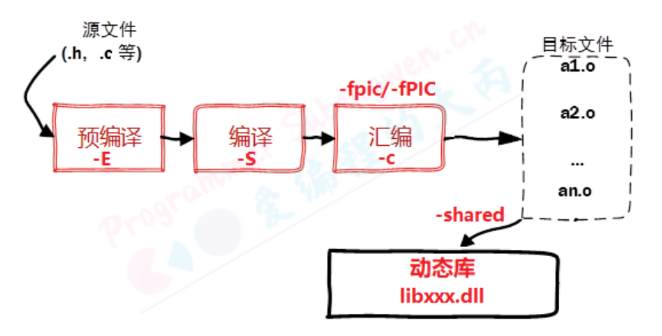

参考资料

> https://subingwen.cn/linux/library/
>
> 

# 编译过程

```shell
1、预处理-Pre-Processing //.i文件
# -E 选项指示编译器仅对输入文件进行预处理
g++ -E test.cpp -o test.i //.i文件

2、编译-Compiling // .s文件
# -S 编译选项告诉 g++ 在为 C++ 代码产生了汇编语言文件后停止编译
# g++ 产生的汇编语言文件的缺省扩展名是 .s
g++ -S test.i -o test.s

3、汇编-Assembling // .o文件
# -c 选项告诉 g++ 仅把源代码编译为机器语言的目标代码
# 缺省时 g++ 建立的目标代码文件有一个 .o 的扩展名。
g++ -c test.s -o test.o

4、链接-Linking // bin文件
# -o 编译选项来为将产生的可执行文件用指定的文件名
g++ test.o -o test

```


## g++重要编译参数

1、-g 编译带调试信息的可执行文件  

```shell
# -g 选项告诉 GCC 产生能被 GNU 调试器GDB使用的调试信息，以调试程序。
# 产生带调试信息的可执行文件test
g++ -g test.cpp
```

2、-O[n] 优化源代码

```shell
## 所谓优化，例如省略掉代码中从未使用过的变量、直接将常量表达式用结果值代替等等，这些操作会缩减目标文件所包含的代码量，提高最终生成的可执行文件的运行效率。

# -O 选项告诉 g++ 对源代码进行基本优化。这些优化在大多数情况下都会使程序执行的更快。 -O2选项告诉 g++ 产生尽可能小和尽可能快的代码。 如-O2，-O3，-On（n 常为0–3）
# -O 同时减小代码的长度和执行时间，其效果等价于-O1
# -O0 表示不做优化
# -O1 为默认优化
# -O2 除了完成-O1的优化之外，还进行一些额外的调整工作，如指令调整等。
# -O3 则包括循环展开和其他一些与处理特性相关的优化工作。
# 选项将使编译的速度比使用 -O 时慢， 但通常产生的代码执行速度会更快。

# 使用 -O2优化源代码，并输出可执行文件
g++ -O2 test.cpp
```

3、-l 和 -L 指定库文件 | 指定库文件路径

```shell
# -l参数(小写)就是用来指定程序要链接的库，-l参数紧接着就是库名
# 在/lib和/usr/lib和/usr/local/lib里的库直接用-l参数就能链接

# 链接glog库
g++ -lglog test.cpp
# 通常不需要显式指定 -l 标志来链接标准库，比如 C 标准库 libc，-lc 通常不是必需的。

# 如果库文件没放在上面三个目录里，需要使用-L参数(大写)指定库文件所在目录
# -L参数跟着的是库文件所在的目录名

# 链接mytest库，libmytest.so在/home/bing/mytestlibfolder目录下
g++ -L/home/bing/mytestlibfolder -lmytest test.cpp
```

当你的程序需要链接多个库时，库的链接顺序可能会对最终生成的可执行文件产生影响。链接器按照指定的顺序处理库，这意味着如果一个库依赖于另一个库中定义的符号（函数或变量），那么被依赖的库必须先于依赖它的库被链接。

假设你有一个程序 `test.cpp`，它需要链接两个库 `libA.so` 和 `libB.so`。其中 `libB.so` 依赖于 `libA.so` 中定义的一些函数。在这种情况下，正确的链接命令应该是：

```sh
g++ -L/path/to/libA -L/path/to/libB -lA -lB test.cpp -o test
```

在这个命令中：
- `-L/path/to/libA` 指定了 `libA.so` 的位置。
- `-L/path/to/libB` 指定了 `libB.so` 的位置。
- `-lA` 表示链接 `libA.so`。
- `-lB` 表示链接 `libB.so`。
- `test.cpp` 是源代码文件。
- `-o test` 指定输出可执行文件名为 `test`。

因为 `libB.so` 依赖于 `libA.so`，所以 `-lA` 必须在 `-lB` 之前出现，以确保链接器能够先处理 `libA.so`，从而让 `libB.so` 能够正确地找到它所需的符号。

如果我们反向指定库的顺序，即先指定 `-lB` 后指定 `-lA`，则可能会遇到未定义符号的错误，因为 `libB.so` 尝试引用 `libA.so` 中的符号时，链接器尚未处理 `libA.so`：

```sh
g++ -L/path/to/libA -L/path/to/libB -lB -lA test.cpp -o test
```

这通常会导致类似这样的链接错误：
```shell
undefined reference to `function_in_libA'
```

如果多个库位于不同的目录，并且这些目录也需要按照一定的顺序指定，则可以使用多个 `-L` 参数来指定路径。例如：

```sh
g++ -L/path/to/libA -L/path/to/libB -L/path/to/libC -lA -lB -lC test.cpp -o test
```

在这个例子中，`/path/to/libA`、`/path/to/libB` 和 `/path/to/libC` 分别是 `libA.so`、`libB.so` 和 `libC.so` 的路径。如果 `libB.so` 依赖于 `libA.so`，而 `libC.so` 又依赖于 `libB.so`，那么库的链接顺序 `-lA -lB -lC` 是正确的。

总之，确保依赖关系正确的库先被链接是非常重要的，这样可以避免链接期间出现未定义符号的错误。

4、I 指定头文件搜索目录

```shell
# -I
# /usr/include目录一般是不用指定的，gcc知道去那里找，但是如果头文件不在/usr/icnclude
# 里我们就要用-I参数指定了，比如头文件放在/myinclude目录里，那编译命令行就要加上-
# I/myinclude 参数了，如果不加你会得到一个”xxxx.h: No such file or directory”的错
# 误。-I参数可以用相对路径，比如头文件在当前目录，可以用-I.来指定。上面我们提到的–cflags参
# 数就是用来生成-I参数的。

g++ -I/myinclude test.cpp
```

5、-Wall 打印警告信息  

```shell
# 打印出gcc提供的警告信息
g++ -Wall test.cpp
```

6、-w 关闭警告信息

```shell
# 关闭所有警告信息
g++ -w test.cpp
```

7、-std=c++11 设置编译标准

```shell
# 使用 c++11 标准编译 test.cpp
g++ -std=c++11 test.cpp
```

8、-o 指定输出文件名

```shell
# 指定即将产生的文件名

# 指定输出可执行文件名为test
g++ test.cpp -o test
```

9、-D 定义宏

```shell
# 在使用gcc/g++编译的时候定义宏

# 常用场景：
# -DDEBUG 定义DEBUG宏，可能文件中有DEBUG宏部分的相关信息，用个DDEBUG来选择开启或关闭DEBUG

示例代码
#include <stdio.h>
int main()
{
    #ifdef DEBUG
    	printf("DEBUG LOG\n");
    #endif
    	printf("in\n");
}
// 1. 在编译的时候，使用gcc -DDEBUG main.cpp
// DEBUG 被简单地定义为存在，而不是被赋予一个具体的值。
// -D 选项后面跟随的是宏名，如果想要给宏赋值，可以在宏名后加上 = 并跟随一个值。

// 2. printf("DEBUG LOG\n"); 代码可以被执行
```


# 库的本质

不管是Linux还是Windows中的库文件其本质和工作模式都是相同的，只不过在不同的平台上库对应的文件格式和文件后缀不同。程序中调用的库有两种 静态库和动态库，不管是哪种库文件本质是还是源文件，只不过是二进制格式只有计算机能够识别，作为一个普通人就无能为力了。

在项目中使用库一般有两个目的，一个是为了使程序更加简洁不需要在项目中维护太多的源文件，另一方面是为了源代码保密，毕竟不是所有人都想把自己编写的程序开源出来。

当我们拿到了库文件（动态库、静态库）之后要想使用还必须有这些库中提供的API函数的声明，也就是头文件，把这些都添加到项目中，就可以快乐的写代码了。

# 静态库

在Linux中静态库由程序 ar 生成，现在静态库已经不像之前那么普遍了，这主要是由于程序都在使用动态库。关于静态库的命名规则如下：

- 在Linux中静态库以lib作为前缀, 以.a作为后缀, 中间是库的名字自己指定即可, 即: libxxx.a
- 在Windows中静态库一般以lib作为前缀, 以lib作为后缀, 中间是库的名字需要自己指定, 即: libxxx.lib

## 生成静态链接库

生成静态库，需要先对源文件进行汇编操作 (使用参数 -c) 得到二进制格式的目标文件 (.o 格式), 然后在通过 ar工具将目标文件打包就可以得到静态库文件了 (libxxx.a)。

使用ar工具创建静态库的时候需要三个参数：

- 参数c：创建一个库，不管库是否存在，都将创建。
- 参数s：创建目标文件索引，这在创建较大的库时能加快时间。
- 参数r：在库中插入模块(替换)。默认新的成员添加在库的结尾处，如果模块名已经在库中存在，则替换同名的模块。


生成静态链接库的具体步骤如下:

1、需要将源文件进行汇编, 得到 .o 文件, 需要使用参数 -c

```shell
# 执行如下操作, 默认生成二进制的 .o 文件
# -c 参数位置没有要求
$ gcc 源文件(*.c) -c	
```

2、将得到的 .o 进行打包, 得到静态库

```shell
$ ar rcs 静态库的名字(libxxx.a) 原材料(*.o)
```

3、发布静态库

```shell
# 发布静态库
1. 提供头文件 **.h
2. 提供制作出来的静态库 libxxx.a
```


## 静态库制作举例

### 准备测试程序

在某个目录中有如下的源文件，用来实现一个简单的计算器：

```shell
# 目录结构 add.c div.c mult.c sub.c -> 算法的源文件, 函数声明在头文件 head.h
# main.c中是对接口的测试程序, 制作库的时候不需要将 main.c 算进去
.
├── add.c
├── div.c
├── include
│   └── head.h
├── main.c
├── mult.c
└── sub.c
```

加法计算源文件 add.c：

```c
#include <stdio.h>
#include "head.h"

int add(int a, int b)
{
    return a+b;
}
```

减法计算源文件 sub.c：

```c
#include <stdio.h>
#include "head.h"

int subtract(int a, int b)
{
    return a-b;
}
```

乘法计算源文件 mult.c：

```c
#include <stdio.h>
#include "head.h"

int multiply(int a, int b)
{
    return a*b;
}
```

减法计算的源文件 div.c：

```c
#include <stdio.h>
#include "head.h"

double divide(int a, int b)
{
    return (double)a/b;
}
```

头文件 head.h：

```c
#ifndef _HEAD_H
#define _HEAD_H
// 加法
int add(int a, int b);
// 减法
int subtract(int a, int b);
// 乘法
int multiply(int a, int b);
// 除法
double divide(int a, int b);
#endif
```

测试文件main.c：

```c
#include <stdio.h>
#include "head.h"

int main()
{
    int a = 20;
    int b = 12;
    printf("a = %d, b = %d\n", a, b);
    printf("a + b = %d\n", add(a, b));
    printf("a - b = %d\n", subtract(a, b));
    printf("a * b = %d\n", multiply(a, b));
    printf("a / b = %f\n", divide(a, b));
    return 0;
}
```


### 生成静态库

第一步: 将源文件add.c, div.c, mult.c, sub.c 进行汇编, 得到二进制目标文件 add.o, div.o, mult.o, sub.o

```shell
# 1. 生成.o
$ gcc add.c div.c mult.c sub.c -c
sub.c:2:18: fatal error: head.h: No such file or directory
compilation terminated.

# 提示头文件找不到, 添加参数 -I 重新头文件路径即可
$ gcc add.c div.c mult.c sub.c -c -I ./include/

# 查看目标文件是否已经生成
$ tree
.
├── add.c
├── add.o            # 目标文件
├── div.c
├── div.o            # 目标文件
├── include
│   └── head.h
├── main.c
├── mult.c
├── mult.o           # 目标文件
├── sub.c
└── sub.o            # 目标文件
```

第二步: 将生成的目标文件通过 ar工具打包生成静态库

```shell
# 2. 将生成的目标文件 .o 打包成静态库
$ ar rcs libcalc.a a.o b.o c.o    # a.o b.o c.o在同一个目录中可以写成 *.o

# 查看目录中的文件
$ tree
.
├── add.c
├── add.o
├── div.c
├── div.o
├── include
│   └── `head.h  ===> 和静态库一并发布
├── `libcalc.a   ===> 生成的静态库
├── main.c
├── mult.c
├── mult.o
├── sub.c
└── sub.o
```

第三步: 将生成的的静态库 `libcalc.a`和库对应的头文件`head.h`一并发布给使用者就可以了。

```shell
# 3. 发布静态库
	1. head.h    => 函数声明
	2. libcalc.a => 函数定义(二进制格式)
```


## 静态库的使用

当我们得到了一个可用的静态库之后，需要将其放到一个目录中，然后根据得到的头文件编写测试代码，对静态库中的函数进行调用。

```shell
# 1. 首先拿到了发布的静态库
	`head.h` 和 `libcalc.a`
	
# 2. 将静态库, 头文件, 测试程序放到一个目录中准备进行测试
.
├── head.h          # 函数声明
├── libcalc.a       # 函数定义（二进制格式）
└── main.c          # 函数测试
```

编译测试程序，得到可执行文件。

```shell
# 3. 编译测试程序 main.c
$ gcc main.c -o app
/tmp/ccR7Fk49.o: In function `main':
main.c:(.text+0x38): undefined reference to `add'
main.c:(.text+0x58): undefined reference to `subtract'
main.c:(.text+0x78): undefined reference to `multiply'
main.c:(.text+0x98): undefined reference to `divide'
collect2: error: ld returned 1 exit status
```

上述错误分析:

编译的源文件中包含了头文件 head.h，这个头文件中声明的函数对应的定义（也就是函数体实现）在静态库中，程序在编译的时候没有找到函数实现，因此提示 `undefined reference to xxxx`。

解决方案：在编译的时将静态库的路径和名字都指定出来

- -L: 指定库所在的目录(相对或者绝对路径)
- -l: 指定库的名字, 需要掐头(lib)去尾(.a) 剩下的才是需要的静态库的名字

```shell
# 4. 编译的时候指定库信息
	-L: 指定库所在的目录(相对或者绝对路径)
	-l: 指定库的名字, 掐头(lib)去尾(.a) ==> calc
# -L -l, 参数和参数值之间可以有空格, 也可以没有  -L./ -lcalc
$ gcc main.c -o app -L ./ -l calc

# 查看目录信息, 发现可执行程序已经生成了
$ tree
.
├── app   		# 生成的可执行程序
├── head.h
├── libcalc.a
└── main.c
```

# 动态库

动态链接库是程序运行时加载的库，当动态链接库正确部署之后，运行的多个程序可以使用同一个加载到内存中的动态库，因此在Linux中动态链接库也可称之为共享库。

动态链接库是目标文件的集合，目标文件在动态链接库中的组织方式是按照特殊方式形成的。库中函数和变量的地址使用的是相对地址（静态库中使用的是绝对地址），其真实地址是在应用程序加载动态库时形成的。

关于动态库的命名规则如下:

- 在Linux中动态库以lib作为前缀, 以.so作为后缀, 中间是库的名字自己指定即可, 即: libxxx.so
- 在Windows中动态库一般以lib作为前缀, 以dll作为后缀, 中间是库的名字需要自己指定, 即: libxxx.dll


## 生成动态链接库

生成动态链接库是直接使用 gcc 命令并且需要添加 -fPIC（-fpic） 以及 -shared 参数。

- -fPIC 或 -fpic 参数的作用是使得 gcc 生成的代码是与位置无关的，也就是使用相对位置。
- -shared 参数的作用是告诉编译器生成一个动态链接库。



生成动态链接库的具体步骤如下:

1、将源文件进行汇编操作, 需要使用参数 -c, 还需要添加额外参数 `-fpic` / `-fPIC`

```shell
# 得到若干个 .o文件
$ gcc 源文件(*.c) -c -fpic
```

2、将得到的 .o文件打包成动态库, 还是使用 gcc, 使用参数 -shared 指定生成动态库(位置没有要求)

```shell
$ gcc -shared 与位置无关的目标文件(*.o) -o 动态库(libxxx.so)
```

3、发布动态库和头文件

```shell
# 发布
 	1. 提供头文件: xxx.h
 	2. 提供动态库: libxxx.so
```


## 动态库制作举例

在此还是以上面制作静态库使用的实例代码为例来制作动态库，代码目录如下：

```shell
# 举例, 示例目录如下:
# 目录结构 add.c div.c mult.c sub.c -> 算法的源文件, 函数声明在头文件 head.h
# main.c中是对接口的测试程序, 制作库的时候不需要将 main.c 算进去
.
├── add.c
├── div.c
├── include
│   └── head.h
├── main.c
├── mult.c
└── sub.c
```

第一步: 使用 gcc 将源文件进行汇编(参数 -c ), 生成与位置无关的目标文件, 需要使用参数 -fpic 或者 -fPIC

```shell
# 1. 将.c汇编得到.o, 需要额外的参数 -fpic/-fPIC
$ gcc add.c div.c mult.c sub.c -c -fpic -I ./include/

# 查看目录文件信息, 检查是否生成了目标文件
$ tree
.
├── add.c
├── add.o                # 生成的目标文件
├── div.c
├── div.o                # 生成的目标文件
├── include
│   └── head.h
├── main.c
├── mult.c
├── mult.o               # 生成的目标文件
├── sub.c
└── sub.o                # 生成的目标文件
```

第二步: 使用 gcc 将得到的目标文件打包生成动态库, 需要使用参数 -shared

```shell
# 2. 将得到 .o 打包成动态库, 使用gcc , 参数 -shared
$ gcc -shared add.o div.o mult.o sub.o -o libcalc.so  

# 检查目录中是否生成了动态库
$ tree
.
├── add.c
├── add.o
├── div.c
├── div.o
├── include
│   └── `head.h   ===> 和动态库一起发布
├── `libcalc.so   ===> 生成的动态库
├── main.c
├── mult.c
├── mult.o
├── sub.c
└── sub.o
```

第三步: 发布生成的动态库和相关的头文件

```shell
# 3. 发布库文件和头文件
	1. head.h
	2. libcalc.so
```

## 动态库的使用

当我们得到了一个可用的动态库之后, 需要将其放到一个目录中, 然后根据得到的头文件编写测试代码, 对动态库中的函数进行调用。

```shell
# 1. 拿到发布的动态库
	`head.h   libcalc.so
# 2. 基于头文件编写测试程序, 测试动态库中提供的接口是否可用
	`main.c`
# 示例目录:
.
├── head.h          ==> 函数声明
├── libcalc.so      ==> 函数定义
└── main.c          ==> 函数测试
```

编译测试程序

```shell
# 3. 编译测试程序
$ gcc main.c -o app
/tmp/ccwlUpVy.o: In function `main':
main.c:(.text+0x38): undefined reference to `add'
main.c:(.text+0x58): undefined reference to `subtract'
main.c:(.text+0x78): undefined reference to `multiply'
main.c:(.text+0x98): undefined reference to `divide'
collect2: error: ld returned 1 exit status
```

错误原因：和使用静态库一样，在编译的时候需要指定库相关的信息：库的路径 -L和 库的名字 -l

添加库信息相关参数，重新编译测试代码：

```shell
# 在编译的时候指定动态库相关的信息: 库的路径 -L, 库的名字 -l
$ gcc main.c -o app -L./ -lcalc

# 查看是否生成了可执行程序
$ tree
.
├── app 			# 生成的可执行程序
├── head.h
├── libcalc.so
└── main.c

# 执行生成的可执行程序, 错误提示 ==> 可执行程序执行的时候找不到动态库
$ ./app 
./app: error while loading shared libraries: libcalc.so: cannot open shared object file: No such file or directory
```

关于整个操作过程的报告：

 gcc 通过指定的动态库信息生成了可执行程序，但是可执行程序运行却提示无法加载到动态库。


## 解决动态库无法加载问题

### 库的工作原理

- 静态库如何被加载

	在程序编译的最后一个阶段也就是链接阶段，提供的静态库会被打包到可执行程序中。当可执行程序被执行，静态库中的代码也会一并被加载到内存中，因此不会出现静态库找不到无法被加载的问题。

- 动态库如何被加载

	- 在程序编译的最后一个阶段也就是链接阶段：

		- 在gcc命令中虽然指定了库路径(使用参数 -L )，但是这个路径并没有记录到可执行程序中，只是检查了这个路径下的库文件是否存在。

		- 同样对应的动态库文件也没有被打包到可执行程序中，只是在可执行程序中记录了库的名字。

	- 可执行程序被执行起来之后:

		- 程序执行的时候会先检测需要的动态库是否可以被加载，加载不到就会提示上边的错误信息
		- 当动态库中的函数在程序中被调用了，这个时候动态库才加载到内存，如果不被调用就不加载
		- 动态库的检测和内存加载操作都是由动态链接器来完成的

### 动态链接器

动态链接器是一个独立于应用程序的进程，属于操作系统，当用户的程序需要加载动态库的时候动态链接器就开始工作了，很显然动态链接器根本就不知道用户通过 gcc 编译程序的时候通过参数 -L 指定的路径。

那么动态链接器是如何搜索某一个动态库的呢，在它内部有一个默认的搜索顺序，按照优先级从高到低的顺序分别是：

1. 可执行文件内部的 DT_RPATH 段

2. 系统的环境变量 LD_LIBRARY_PATH

3. 系统动态库的缓存文件 /etc/ld.so.cache

4. 存储动态库/静态库的系统目录 /lib/, /usr/lib等


按照以上四个顺序依次搜索，找到之后结束遍历，最终还是没找到，动态链接器就会提示动态库找不到的错误信息。


### 解决方案

可执行程序生成之后，根据动态链接器的搜索路径，我们可以提供三种解决方案，我们只需要将动态库的路径放到对应的环境变量或者系统配置文件中，同样也可以将动态库拷贝到系统库目录（或者是将动态库的软链接文件放到这些系统库目录中）。

方案1: 将库路径添加到环境变量 LD_LIBRARY_PATH 中

1、找到相关的配置文件

- 用户级别: ~/.bashrc —> 设置对当前用户有效
- 系统级别: /etc/profile —> 设置对所有用户有效

2、使用 vim 打开配置文件，在文件最后添加这样一句话

```shell
# 自己把路径写进去就行了
export LD_LIBRARY_PATH=$LD_LIBRARY_PATH:动态库目录的绝对路径

# 假设你有一个动态库 libmylib.so 位于 /home/bing/mylib 目录下，可以这样设置 LD_LIBRARY_PATH：
export LD_LIBRARY_PATH=$LD_LIBRARY_PATH:/home/bing/mylib

```

3、让修改的配置文件生效

- 修改了用户级别的配置文件，关闭当前终端，打开一个新的终端配置就生效了

- 修改了系统级别的配置文件，注销或关闭系统，再开机配置就生效了

- 不想执行上边的操作，可以执行一个命令让配置重新被加载


```shell
# 修改的是哪一个就执行对应的那个命令
# source 可以简写为一个 . , 作用是让文件内容被重新加载
$ source ~/.bashrc          (. ~/.bashrc)
$ source /etc/profile       (. /etc/profile)
```


方案2: 更新 `/etc/ld.so.cache` 文件

- 找到动态库所在的绝对路径（不包括库的名字）比如：`/home/robin/Library/`

- 使用 vim 修改 `/etc/ld.so.conf` 这个文件，将上边的路径添加到文件中(独自占一行)


方案3: 拷贝动态库文件到系统库目录 /lib/ 或者 /usr/lib 中 (或者将库的软链接文件放进去)


### 验证


# 优缺点

## 静态库


## 动态库