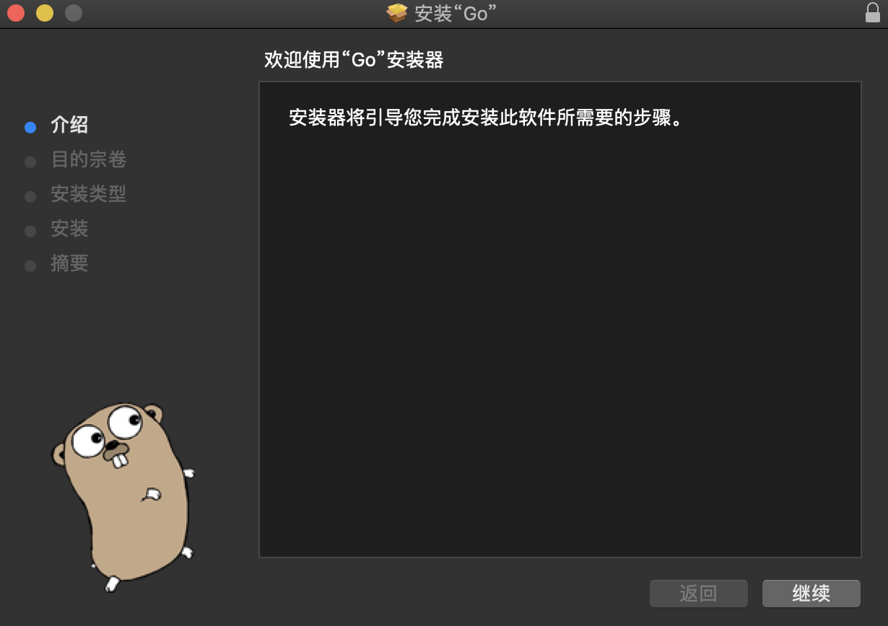

# 03｜配好环境：选择一种最适合你的Go安装方法
你好，我是Tony Bai。

经过上一节的对Go设计哲学的探讨后，如果你依然决定继续Go语言编程学习之旅，那么欢迎你和我一起正式走进Go语言学习和实践的课堂。

编程不是“纸上谈兵”，它是一门实践的艺术。编程语言的学习离不开动手实践，因此学习任何一门编程语言的第一步都是要拥有一个这门编程语言的开发环境，这样我们才可以动手编码，理论与实践结合，不仅加速学习效率，还能取得更好的学习效果。

在这一讲中我们就先来学习下如何安装和配置Go语言开发环境。如果你的机器上还没有Go，那么就请跟我一起选择一种适合你的Go安装方法吧。第一步，先来挑一个合适的Go版本。

### 选择Go版本

挑版本之前，我们先来看看Go语言的 **版本发布策略**。

如今，Go团队已经将版本发布节奏稳定在每年发布两次大版本上，一般是在二月份和八月份发布。Go团队承诺对最新的两个Go稳定大版本提供支持，比如目前最新的大版本是Go 1.17，那么Go团队就会为Go 1.17和Go 1.16版本提供支持。如果Go 1.18版本发布，那支持的版本将变成Go 1.18和Go 1.17。支持的范围主要包括修复版本中存在的重大问题、文档变更以及安全问题更新等。

基于这样的版本发布策略，在你选择版本时可以参考这几种思路：

一般情况下，我建议你采用最新版本。因为Go团队发布的Go语言稳定版本的平均质量一直是很高的，少有影响使用的重大bug。你也不用太担心新版本的支持问题，Google的自有产品，比如Google App Engine（以下简称为GAE）支持都会很快，一般在Go新版本发布不久后，GAE便会宣布支持最新版本的Go。

你还可以根据不同实际项目需要或开源社区的情况使用不同的版本。

有的开源项目采纳了Go团队的建议，在Go最新版本发布不久就将当前项目的Go编译器版本升级到最新版，比如Kubernetes项目；而有的开源项目（比如：docker项目）则比较谨慎，在Go团队发布Go 1.17版本之后，这些项目可能还在使用两个发布周期之前的版本，比如Go 1.15。

但多数项目处于两者之间，也就是使用 **次新版**，即最新版本之前的那个版本。比如，当前最新版本为Go 1.17，那么这些项目会使用Go 1.16版本的最新补丁版本（Go 1.16.x），直到发布Go 1.18后，这些项目才会切换到Go 1.17的最新补丁版本（Go 1.17.x）。如果你不是那么“激进”，也可以采用这种版本选择策略。

**因为我们这门课是Go语言学习的课，所以我这里建议你直接使用Go最新发布版**，这样我们可以体验到Go的最新语言特性，应用到标准库的最新API以及Go工具链的最新功能。在这一节课里我们以 **Go 1.16.5版本** 为例讲述一下其安装、配置和使用方法。

选定Go版本后，接下来我们就来看看几种常见的Go安装方法。

### 安装Go

Go从2009年开源并演化到今天，它的安装方法其实都已经很成熟了，接下来呢，我们就逐一介绍在Linux、macOS、Windows这三大主流操作系统上安装Go的方法，我们假设这些操作系统都安装在X86-64的平台上，首先我们来看Linux。

#### 在Linux上安装Go

Go几乎支持Linux所有的主流发行版操作系统，常见的包括Ubuntu、CentOS（Redhat企业版Linux的社区开源版）、Fedora、SUSE等等，Go在这些主流的Linux发行版操作系统上的安装方法都是一样的（当然某个发行版也可能会利用其软件安装管理器提供仅属于其自己的安装方法）。你可以参考下面这样的安装步骤。

首先，我们需要下载并解压Go Linux安装包：

```plain
$wget -c https://golang.google.cn/dl/go1.16.5.linux-amd64.tar.gz

```

这里有个小提醒：虽然Go官方下载站点是golang.org/dl，但我们可以用针对中国大陆的镜像站点golang.google.cn/dl来下载，在中国大陆地区使用大陆镜像站点可以大幅缩短下载时间。

第二步，将下载完毕的Go安装包解压到安装目录中：

```plain
$tar -C /usr/local -xzf go1.16.5.linux-amd64.tar.gz

```

执行完上面解压缩命令后，我们将在/usr/local下面看到名为go的目录，这个目录就是Go的安装目录，也是Go官方推荐的Go安装目录。我们执行下面命令可以查看该安装目录下的组成：

```plain
$ls -F /usr/local/go
AUTHORS          CONTRIBUTORS  PATENTS    SECURITY.md  api/  doc/         lib/   pkg/        src/
CONTRIBUTING.md  LICENSE       README.md  VERSION      bin/  favicon.ico  misc/  robots.txt  test/

```

不过呢，为了可以在任意路径下使用go命令，我们需要将Go二进制文件所在路径加入到用户环境变量PATH中（以用户使用bash为例），具体操作是将下面这行环境变量设置语句添加到$HOME/.profile文件的末尾：

```plain
export PATH=$PATH:/usr/local/go/bin

```

然后执行下面命令使上述环境变量的设置立即生效：

```plain
$source ~/.profile

```

最后，我们可以通过下面命令验证此次安装是否成功：

```plain
$go version

```

**如果这个命令输出了“go version go1.16.5 linux/amd64”，那么说明我们这次的Go安装是成功的。**

#### 在Mac上安装Go

在Mac上我们可以在图形界面的引导下进行Go的安装。不过，我们先要下载适用于Mac的Go安装包：

```plain
$wget -c https://golang.google.cn/dl/go1.16.5.darwin-amd64.pkg

```

安装包下载完毕后，我们可以双击安装包，打开标准的Mac软件安装界面，如下图所示：



按软件安装向导提示，一路点击“继续”，我们便可以完成Go在Mac上的安装。

和Linux一样，Mac上的Go安装包默认也会将Go安装到/usr/local/go路径下面。因此，如果要在任意路径下使用Go，我们也需将这个路径加入到用户的环境变量PATH中。具体操作方法与上面Linux中的步骤一样，也是将下面环境变量设置语句加入到$HOME/.profile中，然后执行source命令让它生效就可以了：

```plain
export PATH=$PATH:/usr/local/go/bin

```

最后，我们同样可以通过go version命令验证一下这次安装是否成功。

当然了，在Mac上，我们也可以采用像Linux那样的通过命令行安装Go的方法，如果采用这种方法，我们就要下载下面的Mac Go安装包：

```plain
$wget -c https://golang.google.cn/dl/go1.16.5.darwin-amd64.tar.gz

```

后续的步骤与Linux上安装Go几乎没有差别，你直接参考我上面讲的就好了。

#### 在Windows上安装Go

在Windows上，我们最好的安装方式就是采用图形界面引导下的Go安装方法。

我们打开 [Go包的下载页面](https://golang.google.cn/dl)，在页面上找到Go 1.16.5版本的Windows msi安装包（AMD64架构下的）：go1.16.5.windows-amd64.msi，通过浏览器自带的下载工具它下载到本地任意目录下。

双击打开已下载的go1.16.5.windows-amd64.msi文件，我们就能看到下面这个安装引导界面：


和所有使用图形界面方式安装的Windows应用程序一样，我们只需一路点击“继续（next）”就可完成Go程序的安装了，安装程序默认会把Go安装在 **C:\\Program Files\\Go** 下面，当然你也可以自己定制你的安装目录。

除了会将Go安装到你的系统中之外，Go安装程序还会自动为你设置好Go使用所需的环境变量，包括在用户环境变量中增加GOPATH，它的值默认为C:\\Users\[用户名\]\\go，在系统变量中也会为Path变量增加一个值：C:\\Program Files\\Go\\bin，这样我们就可以在任意路径下使用Go了。

```plain
安装完成后，我们可以打开Windows的“命令提示符”窗口（也就是CMD命令）来验证一下Go有没有安装成功。在命令行中输入go version，如果看到下面这个输出结果，那证明你这次安装就成功了：

C:\Users\tonybai>go version
go version go1.16.5 windows/amd64

```

到这里，我们已经把Go语言在主流操作系统上的安装讲完了，但这里其实我讲的都是安装一个版本的Go的方法，有些时候我们会有安装多个Go版本的需求，这点我们接着往下看。

### 安装多个Go版本

一般来说，Go初学者安装一个最新的Go版本就足够了，但随着Go编程的深入，我们通常会有使用多个Go版本的需求，比如一个版本用于学习或本地开发，另外一个版本用于生产构建等等。

安装多个Go版本其实也很简单，这里我给你介绍三种方法。

#### 方法一：重新设置PATH环境变量

你只需要将不同版本的Go安装在不同路径下，然后将它们的Go二进制文件的所在路径加入到PATH环境变量中就可以了。

我们以Linux环境为例，在前面介绍Go标准安装方法的时候，我们已经将Go 1.16.5版本安装到了/usr/local/go下面，也将/usr/local/go/bin这个路径加入到了PATH路径下了，当前状态我们在任意路径下敲入go，执行的都是Go 1.16.5版本对应的Go二进制文件。

那这个时候，如果我们想再安装一个Go 1.15.13版本要怎么办呢？

首先，你需要按照标准步骤将Go 1.15.13安装到事先建好的/usr/local/go1.15.13路径下：

```plain
$mkdir /usr/local/go1.15.13
$wget -c https://golang.google.cn/dl/go1.15.13.linux-amd64.tar.gz
$tar -C /usr/local/go1.15.13 -xzf go1.15.13.linux-amd64.tar.gz

```

接下来，我们来设置PATH环境变量，将原先$HOME/.profile中的PATH变量的值由：

```plain
export PATH=$PATH:/usr/local/go/bin

```

改为：

```plain
export PATH=$PATH:/usr/local/go1.15.13/go/bin

```

这样通过执行source命令重新使PATH环境变量生效后，我们再执行go version命令，会得到下面这样的结果：

```plain
$go version
go version go1.15.13 linux/amd64

```

这样，我们已经安装好两个Go版本了。这之后，我们如果要在Go 1.16.5和Go 1.15.13两个版本之间切换，只需要重新设置PATH环境变量并生效即可。

不过，你可能依然会觉得通过重新设置PATH环境变量的方法有些麻烦。没关系，Go官方也提供了一种在系统中安装多个Go版本的方法，下面我们就来看一下第二种方法。

#### 方法二：go get命令

**这种方法有一个前提，那就是当前系统中已经通过标准方法安装过某个版本的Go了。**

我们还以Linux环境为例，假设目前环境中已经存在了采用标准方法安装的Go 1.16.5版本，我们接下来想再安装一个Go 1.15.13版本。按照Go官方方法，我们可以这样来做：

首先，将 $ HOME/go/bin加入到PATH环境变量中并生效，即便这个目录当前不存在也没关系：

```plain
export PATH=$PATH:/usr/local/go/bin:~/go/bin

```

然后，我们要执行下面这个命令安装Go 1.15.13版本的下载器：

```plain
$go get golang.org/dl/go1.15.13

```

这个命令会将名为Go 1.15.13的可执行文件安装到$HOME/go/bin这个目录下，它是Go 1.15.13版本的专用下载器，下面我们再来执行Go 1.15.13的下载安装命令：

```plain
$go1.15.13 download

Downloaded   0.0% (    16384 / 121120420 bytes) ...
Downloaded   1.8% (  2129904 / 121120420 bytes) ...
Downloaded  84.9% (102792432 / 121120420 bytes) ...
Downloaded 100.0% (121120420 / 121120420 bytes)
Unpacking /root/sdk/go1.15.13/go1.15.13.linux-amd64.tar.gz ...
Success. You may now run 'go1.15.13'

```

现在，我们看到这个命令下载了go1.15.13.linux-amd64.tar.gz安装包，也将它安装到$HOME/sdk/go1.15.13下面了。下载安装结束后，我们就可以利用 **带有版本号的go命令** 来使用特定版本的Go了：

```plain
$go1.15.13 version
go version go1.15.13 linux/amd64

```

同样的，我们也可以通过下面这个命令查看特定Go版本的安装位置：

```plain
$go1.15.13 env GOROOT
/root/sdk/go1.15.13

```

#### 方法三：go get命令安装非稳定版本

其实，除了Go团队正式发布的稳定版本（stable version），像前面安装的Go 1.16.5或Go 1.15.13，我们还可以通过 **go get** 的方法安装Go团队正在开发的非稳定版本（Unstable Version），包括每个稳定版发布前的beta版本或当前最新的tip版本，这些非稳定版本可以让Go开发人员提前体验到即将加入到稳定版本中的新特性。

但是，通过go get安装不同Go版本的方法在中国大陆地区会因网络问题而失败。如果你已经克服了网络问题，那安装非稳定版本的步骤其实和上面的步骤一样。现在，我们以Go 1.17beta1和Go Tip版本为例，带你体验一下它们的安装步骤和验证方法。

首先我们来看Go 1.17beta1：

```plain
$go get golang.org/dl/go1.17beta1
$go1.17beta1 download
Downloaded   0.0% (     3272 / 134470397 bytes) ...
Downloaded  21.4% ( 28819248 / 134470397 bytes) ...
Downloaded  58.1% ( 78069168 / 134470397 bytes) ...
Downloaded 100.0% (134470397 / 134470397 bytes)
Unpacking /root/sdk/go1.17beta1/go1.17beta1.linux-amd64.tar.gz ...
Success. You may now run 'go1.17beta1'
$go1.17beta1 version
go version go1.17beta1 linux/amd64

```

接着来看Go Tip版本：

```plain
$go get golang.org/dl/gotip
$gotip download

```

go get为我们安装tip版本提供了极大方便，要知道在以前，如果我们要安装tip版本，需要手工下载Go源码并自行编译。但你要注意的是： **不是每次gotip安装都会成功**，因为这毕竟是正在积极开发的版本，一次代码的提交就可能会导致gotip版本构建失败！

安装好Go之后，我们就该讲讲怎么配置了。

### 配置Go

其实Go在安装后是开箱即用的，这也意味着我们在使用Go之前无需做任何配置。但为了更好地了解和学习Go，我们还是要认识一些Go自带的常用配置项。Go的配置项是以环境变量的形式存在的，我们可以通过下面这个命令查看Go的这些配置项：

```plain
$go env

```

这里我也给你总结了一些常用配置项：


如果你还要了解更多关于Go配置项的说明，你可以通过go help environment命令查看。

### 小结

好了，到这里我们的Go安装配置方法就讲解完毕了，选好你要使用的Go安装方法了吗？

在这一节课中我们首先讲解了三种Go版本的选择策略：

- 第一种，也是我们推荐的一种，那就是使用Go最新的版本，这样你可以体验到Go的最新语言特性，应用到标准库的最新API以及Go工具链的最新功能，并且很多老版本中的bug在最新版本中都会得到及时修复；
- 如果你还是对最新版本的稳定性有一丝担忧，你也可以选择使用次新版；
- 最后，如果你要考虑现存生产项目或开源项目，那你按照需要选择，与项目策略保持一致就好了。

确定完Go版本后，我们就可以来安装这个Go版本了。这一节课我们也详细介绍了在三个主流操作系统上安装Go稳定版本的方法。

对于使用Windows或macOS操作系统的开发者，使用基于图形界面的安装方式显然是最方便、最简洁的；对于使用Linux操作系统的开发者，使用自解压的安装包，或者是通过操作系统自带安装工具来进行Go安装比较普遍。

如果你是要在本地开发环境安装多个Go版本，或者是要抢先体验新版Go，我们还讲解了两种在本地安装多个Go版本的方法。这里再强调一下，通过go get方式安装最新的Go tip版本存在失败的可能性哦！

最后，我们讲解了Go的一些常用配置项的功用，对于中国地区的Go开发者而言，你在真正使用Go构建应用之前，唯一要做的就是配置GOPROXY这个Go环境变量。

有了Go开发环境，我们就有了编写和构建Go代码的基础，在下一讲中我们就将开始学习如何编写Go代码。

### 思考题

今天的课后思考题，我想请你在安装好的Go开发环境中，使用go help命令查看和总结一下Go命令的使用方法。

感谢你和我一起学习，也欢迎你把这节课分享给更多对Go语言学习感兴趣的朋友。我是Tony Bai，我们下节课见。