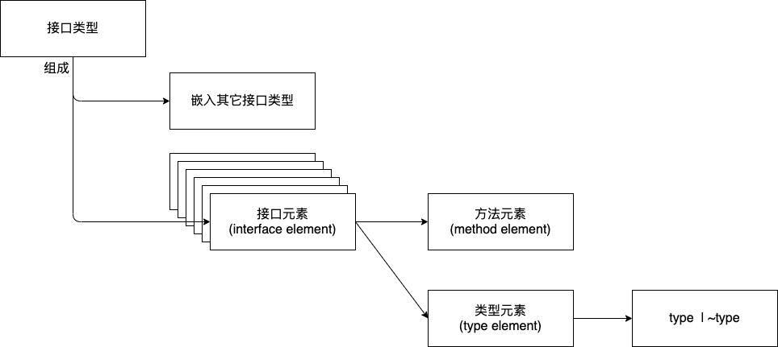
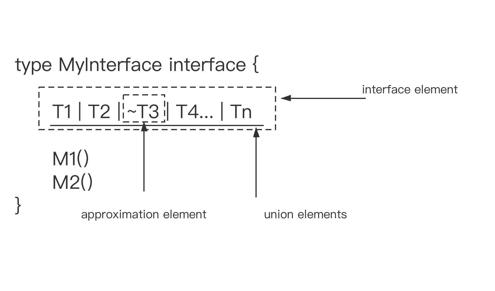
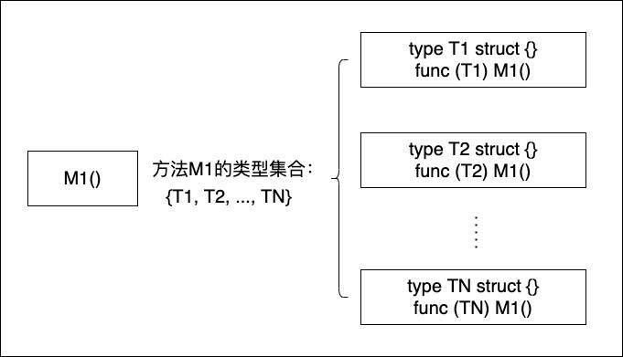

# 40｜驯服泛型：定义泛型约束
你好，我是Tony Bai。

在上一讲中我们对Go泛型的实现方案 **“类型参数语法”** 做了较为全面的学习，我们掌握了泛型函数、泛型类型和泛型方法的定义和使用方法。不过还有一处语法点我们并没有重点说明，它就是用于声明类型参数的 **约束**（constraint）。

虽然泛型是开发人员表达“通用代码”的一种重要方式，但这并不意味着所有泛型代码对所有类型都适用。更多的时候，我们需要对泛型函数的类型参数以及泛型函数中的实现代码 **设置限制**。泛型函数调用者只能传递满足限制条件的类型实参，泛型函数内部也只能以类型参数允许的方式使用这些类型实参值。在Go泛型语法中，我们使用 **类型参数约束**（type parameter constraint）（以下简称 **约束**）来表达这种限制条件。

就像上一讲提到的，约束之于类型参数就好比函数参数列表中的类型之于参数：


函数普通参数在函数实现代码中可以表现出来的性质与可以参与的运算由参数类型限制，而泛型函数的类型参数就由约束（constraint）来限制。

2018年8月由伊恩·泰勒和罗伯特·格瑞史莫主写的Go泛型第一版设计方案中，Go引入了contract关键字来定义泛型类型参数的约束。但经过约两年的Go社区公示和讨论，在2020年6月末发布的泛型新设计方案中，Go团队又放弃了新引入的contract关键字，转而采用已有的interface类型来替代contract定义约束。这一改变得到了Go社区的大力支持。使用interface类型作为约束的定义方法能够最大程度地复用已有语法，并抑制语言引入泛型后的复杂度。

但原有的interface语法尚不能满足定义约束的要求。所以，在Go泛型版本中，interface语法也得到了一些扩展，也正是这些扩展给那些刚刚入门Go泛型的Go开发者带去了一丝困惑，这也是约束被认为是Go泛型的一个难点的原因。

在这一讲中，我们就聚焦于Go类型参数的约束，学习一下Go原生内置的约束、如何定义自己的约束、新引入的类型集合概念等。我们先来看一下Go语言的内置约束，从Go泛型中最宽松的约束： **any** 开始。

### 最宽松的约束：any

无论是泛型函数还是泛型类型，其所有类型参数声明中都必须显式包含约束，即便你允许类型形参接受所有类型作为类型实参传入也是一样。那么我们如何表达“所有类型”这种约束呢？我们可以使用 **空接口类型**（interface{}）来作为类型参数的约束：

```plain
func Print[T interface{}](sl []T) {
    // ... ...
}

func doSomething[T1 interface{}, T2 interface{}, T3 interface{}](t1 T1, t2 T2, t3 T3) {
    // ... ...
}

```

不过使用 interface{} 作为约束至少有以下几点“不足”：

- 如果存在多个这类约束时，泛型函数声明部分会显得很冗长，比如上面示例中的doSomething的声明部分；
- interface{} 包含 {} 这样的符号，会让本已经很复杂的类型参数声明部分显得更加复杂；
- 和comparable、Sortable、ordered这样的约束命名相比，interface{} 作为约束的表意不那么直接。

为此，Go团队在Go 1.18泛型落地的同时又引入了一个预定义标识符： **any**。any本质上是 interface{} 的一个类型别名：

```plain
// $GOROOT/src/builtin/buildin.go
// any is an alias for interface{} and is equivalent to interface{} in all ways.
type any = interface{}

```

这样，我们在泛型类型参数声明中就可以使用any替代 interface{}，而上述 interface{} 作为类型参数约束的几点“不足”也随之被消除掉了。

any约束的类型参数意味着可以接受所有类型作为类型实参。在函数体内，使用any约束的形参T可以用来做如下操作：

- 声明变量
- 同类型赋值
- 将变量传给其他函数或从函数返回
- 取变量地址
- 转换或赋值给 interface{} 类型变量
- 用在类型断言或 type switch 中
- 作为复合类型中的元素类型
- 传递给预定义的函数，比如 new

下面是any约束的类型参数执行这些操作的一个示例：

```plain
// any.go
func doSomething[T1, T2 any](t1 T1, t2 T2) T1 {
    var a T1        // 声明变量
    var b T2
    a, b = t1, t2   // 同类型赋值
    _ = b

    f := func(t T1) {
    }
    f(a)            // 传给其他函数

    p := &a         // 取变量地址
    _ = p

    var i interface{} = a  // 转换或赋值给interface{}类型变量
    _ = i

    c := new(T1)    // 传递给预定义函数
    _ = c

    f(a)            // 将变量传给其他函数

    sl := make([]T1, 0, 10) // 作为复合类型中的元素类型
    _ = sl

    j, ok := i.(T1) // 用在类型断言中
    _ = ok
    _ = j

    switch i.(type) { // 作为type switch中的case类型
    case T1:
    case T2:
    }
    return a        // 从函数返回
}

```

但如果对any约束的类型参数进行了非上述允许的操作，比如相等性或不等性比较，那么Go编译器就会报错：

```plain
// any.go

func doSomething[T1, T2 any](t1 T1, t2 T2) T1 {
    var a T1
    if a == t1 { // 编译器报错：invalid operation: a == t1 (incomparable types in type set)
    }

    if a != t1 { // 编译器报错：invalid operation: a != t1 (incomparable types in type set)
    }
    ... ...
}

```

所以说，如果我们想在泛型函数体内部对类型参数声明的变量实施相等性（==）或不等性比较（!=）操作，我们就需要更换约束，这就引出了Go内置的另外一个预定义约束： **comparable**。

### 支持比较操作的内置约束：comparable

Go泛型提供了预定义的约束：comparable，其定义如下：

```plain
// $GOROOT/src/builtin/buildin.go

// comparable is an interface that is implemented by all comparable types
// (booleans, numbers, strings, pointers, channels, arrays of comparable types,
// structs whose fields are all comparable types).
// The comparable interface may only be used as a type parameter constraint,
// not as the type of a variable.
type comparable interface{ comparable }

```

不过从上述这行源码我们仍然无法直观看到comparable的实现细节，Go编译器会在编译期间判断某个类型是否实现了comparable接口。

根据其注释说明，所有可比较的类型都实现了comparable这个接口，包括：布尔类型、数值类型、字符串类型、指针类型、channel类型、元素类型实现了comparable的数组和成员类型均实现了comparable接口的结构体类型。下面的例子可以让我们直观地看到这一点：

```plain
// comparable.go

type foo struct {
    a int
    s string
}

type bar struct {
    a  int
    sl []string
}

func doSomething[T comparable](t T) T {
    var a T
    if a == t {
    }

    if a != t {
    }
    return a
}

func main() {
    doSomething(true)
    doSomething(3)
    doSomething(3.14)
    doSomething(3 + 4i)
    doSomething("hello")
    var p *int
    doSomething(p)
    doSomething(make(chan int))
    doSomething([3]int{1, 2, 3})
    doSomething(foo{})
    doSomething(bar{}) //  bar does not implement comparable
}

```

我们看到，最后一行bar结构体类型因为内含不支持比较的切片类型，被Go编译器认为未实现comparable接口，但除此之外的其他类型作为类型实参都满足comparable约束的要求。

此外还要注意，comparable虽然也是一个interface，但它不能像普通interface类型那样来用，比如下面代码会导致编译器报错：

```plain
var i comparable = 5 // 编译器错误：cannot use type comparable outside a type constraint: interface is (or embeds) comparable

```

从编译器的错误提示，我们看到： **comparable只能用作修饰类型参数的约束**。

好了，学了两个内置约束了，下面我们再来看看如何自定义约束。

### 自定义约束

前面说过，Go泛型最终决定使用interface语法来定义约束。这样一来， **凡是接口类型均可作为类型参数的约束**。下面是一个使用普通接口类型作为类型参数约束的示例：

```plain
// stringify.go

func Stringify[T fmt.Stringer](s []T) (ret []string) {
    for _, v := range s {
        ret = append(ret, v.String())
    }
    return ret
}

type MyString string

func (s MyString) String() string {
    return string(s)
}

func main() {
    sl := Stringify([]MyString{"I", "love", "golang"})
    fmt.Println(sl) // 输出：[I love golang]
}

```

这个例子中，我们使用的是fmt.Stringer接口作为约束。一方面，这要求类型参数T的实参必须实现fmt.Stringer接口的所有方法；另一方面，泛型函数Stringify的实现代码中，声明的T类型实例（比如v）也仅被允许调用fmt.Stringer的String方法。

这类 **基于行为（方法集合）定义的约束** 对于习惯了Go接口类型的开发者来说，是相对好理解的，定义和使用起来，与下面这样的以接口类型作为形参的普通Go函数相比，区别似乎不大：

```plain
func Stringify(s []fmt.Stringer) (ret []string) {
    for _, v := range s {
        ret = append(ret, v.String())
    }
    return ret
}

```

但现在我想扩展一下上面stringify.go这个示例，将Stringify的语义改为只处理非零值的元素：

```plain
// stringify_without_zero.go

func StringifyWithoutZero[T fmt.Stringer](s []T) (ret []string) {
    var zero T
    for _, v := range s {
        if v == zero { // 编译器报错：invalid operation: v == zero (incomparable types in type set)
            continue
        }
        ret = append(ret, v.String())
    }
    return ret
}

```

我们看到，针对v的相等性判断导致了编译器报错，我们需要为类型参数赋予更多的能力，比如支持相等性和不等性比较。这让我们想起了我们刚刚学过的Go内置约束comparable，实现comparable的类型，便可以支持相等性和不等性判断操作了。

我们知道，comparable虽然不能像普通接口类型那样声明变量，但它却可以作为类型嵌入到其他接口类型中，下面我们就扩展一下上面示例：

```plain
// stringify_new_without_zero.go
type Stringer interface {
    comparable
    String() string
}

func StringifyWithoutZero[T Stringer](s []T) (ret []string) {
    var zero T
    for _, v := range s {
        if v == zero {
            continue
        }
        ret = append(ret, v.String())
    }
    return ret
}

type MyString string

func (s MyString) String() string {
    return string(s)
}

func main() {
    sl := StringifyWithoutZero([]MyString{"I", "", "love", "", "golang"}) // 输出：[I love golang]
    fmt.Println(sl)
}

```

在这个示例里，我们自定义了一个Stringer接口类型作为约束。在该类型中，我们不仅定义了String方法，还嵌入了comparable，这样在泛型函数中，我们用Stringer约束的类型参数就具备了进行相等性和不等性比较的能力了！

但我们的示例演进还没有完，现在相等性和不等性比较已经不能满足我们需求了，我们还要为之 **加上对排序行为的支持，** 并基于排序能力实现下面的StringifyLessThan泛型函数：

```plain
func StringifyLessThan[T Stringer](s []T, max T) (ret []string) {
    var zero T
    for _, v := range s {
        if v == zero || v >= max {
            continue
        }
        ret = append(ret, v.String())
    }
    return ret
}

```

但现在当我们编译上面StringifyLessThan函数时，我们会得到编译器的报错信息 `invalid operation: v >= max (type parameter T is not comparable with >=)`。Go编译器认为Stringer约束的类型参数T不具备排序比较能力。

如果连排序比较性都无法支持，这将大大 **限制我们泛型函数的表达能力**。但是Go又不支持运算符重载（operator overloading），不允许我们定义出下面这样的接口类型作为类型参数的约束：

```plain
type Stringer[T any] interface {
    String() string
    comparable
	>(t T) bool
	>=(t T) bool
	<(t T) bool
	<=(t T) bool
}

```

那我们又该如何做呢？别担心，Go核心团队显然也想到了这一点，于是对Go接口类型声明语法做了扩展， **支持在接口类型中放入类型元素（type element）信息**，比如下面的ordered接口类型：

```plain
type ordered interface {
	~int | ~int8 | ~int16 | ~int32 | ~int64 |
	~uint | ~uint8 | ~uint16 | ~uint32 | ~uint64 | ~uintptr |
	~float32 | ~float64 | ~string
}

```

在这个接口类型的声明中，我们没有看到任何方法，取而代之的是一组由竖线 “\|” 分隔的、带着小尾巴 “~” 的类型列表。这个列表表示的是，以它们为底层类型（underlying type）的类型都满足ordered约束，都可以作为以ordered为约束的类型参数的类型实参，传入泛型函数。

我们将其组合到我们声明的Stringer接口中，然后应用一下我们的StringifyLessThan函数：

```plain
type Stringer interface {
    ordered
    comparable
    String() string
}

func main() {
    sl := StringifyLessThan([]MyString{"I", "", "love", "", "golang"}, MyString("cpp")) // 输出：[I]
    fmt.Println(sl)
}

```

这回编译器没有报错，并且程序输出了预期的结果。

好了，看了那么多例子，是时候正式对Go接口类型语法的扩展做一个说明了。下面是扩展后的接口类型定义的组成示意图：



我们看到，新的接口类型依然可以嵌入其他接口类型，满足组合的设计哲学；除了嵌入的其他接口类型外，其余的组成元素被称为接口元素（interface element）。

接口元素也有两类，一类就是常规的方法元素（method element），每个方法元素对应一个方法原型；另一类则是此次扩展新增的类型元素（type element），即在接口类型中，我们可以放入一些类型信息，就像前面的ordered接口那样。

类型元素可以是单个类型，也可以是一组由竖线 “\|” 连接的类型，竖线 “\|” 的含义是“并”，这样的一组类型被称为union element。无论是单个类型，还是union element中由 “\|” 分隔的类型，如果类型中不带有 “~” 符号的类型就代表其自身；而带有 “~” 符号的类型则代表以该类型为底层类型（underlying type）的所有类型，这类带有 “~” 的类型也被称为approximation element，如下面示例：

```plain
type Ia interface {
	int | string  // 仅代表int和string
}

type Ib interface {
	~int | ~string  // 代表以int和string为底层类型的所有类型
}

```

下图是类型元素的分解说明，供你参考：



不过要注意的是： **union element中不能包含带有方法元素的接口类型，也不能包含预定义的约束类型，如comparable**。

扩展后，Go将接口类型分成了两类，一类是基本接口类型（basic interface type），即其自身和其嵌入的接口类型都只包含方法元素，而不包含类型元素。基本接口类型不仅可以当做常规接口类型来用，即声明接口类型变量、接口类型变量赋值等，还可以作为泛型类型参数的约束。

除此之外的非空接口类型都属于非基本接口类型，即直接或间接（通过嵌入其他接口类型）包含了类型元素的接口类型。这类接口类型仅可以用作泛型类型参数的约束，或被嵌入到其他仅作为约束的接口类型中，下面的代码就很直观地展示了这两种接口类型的特征：

```plain
type BasicInterface interface { // 基本接口类型
    M1()
}

type NonBasicInterface interface { // 非基本接口类型
    BasicInterface
    ~int | ~string // 包含类型元素
}

type MyString string

func (MyString) M1() {
}

func foo[T NonBasicInterface](a T) { // 非基本接口类型作为约束
}

func bar[T BasicInterface](a T) { // 基本接口类型作为约束
}

func main() {
    var s = MyString("hello")
    var bi BasicInterface = s // 基本接口类型支持常规用法
    var nbi NonBasicInterface = s // 非基本接口不支持常规用法，导致编译器错误：cannot use type NonBasicInterface outside a type constraint: interface contains type constraints
    bi.M1()
    nbi.M1()
    foo(s)
    bar(s)
}

```

看到这里，你可能会觉得有问题了：基本接口类型，由于其仅包含方法元素，我们依旧可以基于之前讲过的 **方法集合，** 来确定一个类型是否实现了接口，以及是否可以作为类型实参传递给约束下的类型形参。但对于只能作为约束的非基本接口类型，既有方法元素，也有类型元素，我们如何判断一个类型是否满足约束，并作为类型实参传给类型形参呢？

这时我们就要介绍Go泛型落地时引入的新概念： **类型集合（type set）**，类型集合将作为后续判断类型是否满足约束的基本手段。

### 类型集合（type set）

类型集合（type set）的概念是Go核心团队在2021年4月更新 [Go泛型设计方案](https://github.com/golang/go/issues/45346) 时引入的。在那一次方案变更中，原方案中用于接口类型中定义类型元素的type关键字被去除了，泛型相关语法得到了进一步的简化。

一旦确定了一个接口类型的类型集合，类型集合中的元素就可以满足以该接口类型作为的类型约束，也就是可以将该集合中的元素作为类型实参传递给该接口类型约束的类型参数。

那么类型集合究竟是怎么定义的呢？下面我们来看一下。

结合Go泛型设计方案以及 [Go语法规范](https://go.dev/ref/spec)，我们可以这么来理解类型集合：

- 每个类型都有一个类型集合；
- 非接口类型的类型的类型集合中仅包含其自身，比如非接口类型T，它的类型集合为 {T}，即集合中仅有一个元素且这唯一的元素就是它自身。

但我们最终要搞懂的是用于定义约束的接口类型的类型集合，所以以上这两点都是在为下面接口类型的类型集合定义做铺垫，定义如下：

- 空接口类型（any或interface{}）的类型集合是一个无限集合，该集合中的元素为所有非接口类型。这个与我们之前的认知也是一致的，所有非接口类型都实现了空接口类型；
- 非空接口类型的类型集合则是其定义中 **接口元素的类型集合的交集**（如下图）。


由此可见，要想确定一个接口类型的类型集合，我们需要知道其中每个接口元素的类型集合。

上面我们说过，接口元素可以是其他嵌入接口类型，可以是常规方法元素，也可以是类型元素。当接口元素为其他嵌入接口类型时，该接口元素的类型集合就为该嵌入接口类型的类型集合；而当接口元素为常规方法元素时，接口元素的类型集合就为该方法的类型集合。

到这里你可能会很疑惑： **一个方法也有自己的类型集合**？

是的。Go规定一个方法的类型集合为所有实现了该方法的非接口类型的集合，这显然也是一个无限集合，如下图所示：



通过方法元素的类型集合，我们也可以合理解释仅包含多个方法的常规接口类型的类型集合，那就是这些方法元素的类型集合的交集，即所有实现了这三个方法的类型所组成的集合。

最后我们再来看看类型元素。类型元素的类型集合相对来说是最好理解的，每个类型元素的类型集合就是其表示的所有类型组成的集合。如果是 ~T 形式，则集合中不仅包含T本身，还包含所有以T为底层类型的类型。如果使用Union element，则类型集合是所有竖线 “\|” 连接的类型的类型集合的并集。

讲了这么多，我们来做个稍复杂些的实例分析，我们来分析一下下面接口类型I的类型集合：

```plain
type Intf1 interface {
    ~int | string
	F1()
	F2()
}

type Intf2 interface {
	~int | ~float64
}

type I interface {
    Intf1
    M1()
    M2()
    int | ~string | Intf2
}

```

我们看到，接口类型 I 由四个接口元素组成，分别是Intf1、M1、M2和Union element “int \| ~string \| Intf2”，我们只要分别求出这四个元素的类型集合，再取一个交集即可。

- **Intf1的类型集合**

Intf1是接口类型I的一个嵌入接口，它自身也是由三个接口元素组成，它的类型集合为这三个接口元素的交集，即 {以int为底层类型的所有类型、string、实现了F1和F2方法的所有类型}。

- **M1和M2的类型集合**

就像前面所说的，方法的类型集合是由所有实现该方法的类型组成的，因此M1的方法集合为 {实现了M1的所有类型}，M2的方法集合为 {实现了M2的所有类型}。

- **int \| ~string \| Intf2 的类型集合**

这是一个类型元素，它的类型集合为int、~string和Intf2类型集合的并集。int类型集合就是 {int}，~string 的类型集合为 {以string为底层类型的所有类型}，而Intf2的类型集合为 {以int为底层类型的所有类型，以float64为底层类型的所有类型}。

为了更好地说明最终类型集合是如何取得的，我们在下面再列一下各个接口元素的类型集合：

- Intf1的类型集合：{以int为底层类型的所有类型、string、实现了F1和F2方法的所有类型}；
- M1的类型集合：{实现了M1的所有类型}；
- M2的类型集合：{实现了M2的所有类型}；
- int \| ~string \| Intf2 的类型集合：{以 int 为底层类型的所有类型，以 float64 为底层类型的所有类型，以string为底层类型的所有类型}。

接下来我们取一下上面集合的交集，也就是 {以int为底层类型的且实现了F1、F2、M1、M2这个四个方法的所有类型}。

现在我们用代码来验证一下：

```plain
// typeset.go

func doSomething[T I](t T) {
}

type MyInt int

func (MyInt) F1() {
}
func (MyInt) F2() {
}
func (MyInt) M1() {
}
func (MyInt) M2() {
}

func main() {
    var a int = 11
    //doSomething(a) //int does not implement I (missing F1 method)

    var b = MyInt(a)
    doSomething(b) // ok
}

```

如上代码，我们定义了一个以int为底层类型的自定义类型MyInt并实现了四个方法，这样MyInt就满足了泛型函数doSomething中约束I的要求，可以作为类型实参传递。

### 简化版的约束形式

在前面的讲解和示例中，泛型参数的约束都是一个完整的接口类型，要么是独立定义在泛型函数外面（比如下面代码中的I接口），要么以接口字面值的形式，直接放在类型参数列表中对类型参数进行约束，比如下面示例中doSomething2类型参数列表中的接口类型字面值：

```plain
type I interface { // 独立于泛型函数外面定义
    ~int | ~string
}

func doSomething1[T I](t T)
func doSomething2[T interface{~int | ~string}](t T) // 以接口类型字面值作为约束

```

但在 **约束对应的接口类型中仅有一个接口元素，且该元素为类型元素** 时，Go提供了简化版的约束形式，我们不必将约束独立定义为一个接口类型，比如上面的doSomething2可以简写为下面简化形式：

```plain
func doSomething2[T ~int | ~string](t T) // 简化版的约束形式

```

你看，这个简化版的约束形式就是去掉了interface关键字和外围的大括号，如果用一个一般形式来表述，那就是：

```plain
func doSomething[T interface {T1 | T2 | ... | Tn}](t T)

等价于下面简化版的约束形式：

func doSomething[T T1 | T2 | ... | Tn](t T)

```

这种简化形式也可以理解为一种类型约束的语法糖。不过有一种情况要注意，那就是定义仅包含一个类型参数的泛型类型时，如果 **约束中仅有一个\*int型类型元素**，我们使用上述简化版形式就会有问题，比如：

```plain
type MyStruct [T * int]struct{} // 编译错误：undefined: T
                                // 编译错误：int (type) is not an expression

```

当遇到这种情况时，Go编译器会将该语句理解为一个类型声明：MyStruct为新类型的名字，而其底层类型为 \[T \* int\]struct{}，即一个元素为空结构体类型的数组。

那么怎么解决这个问题呢？目前有两种方案，一种是用完整形式的约束：

```plain
type MyStruct[T interface{*int}] struct{}

```

另外一种则是在简化版约束的 \*int 类型后面加上一个逗号：

```plain
type MyStruct[T *int,] struct{}

```

最后我们再来说说与约束有关的类型推断。

### 约束的类型推断

在上一讲中，我们提到了在大多数情况下，我们都可以使用类型推断避免在调用泛型函数时显式传入类型实参，Go泛型可以根据泛型函数的实参推断出类型实参。但当我们遇到下面示例中的泛型函数时，光依靠函数类型实参的推断是无法完全推断出所有类型实参的：

```plain
func DoubleDefined[S ~[]E, E constraints.Integer](s S) S {

```

因为像DoubleDefined这样的泛型函数，其类型参数E在其常规参数列表中并未被用来声明输入参数，函数类型实参推断仅能根据传入的S的类型，推断出类型参数S的类型实参，E是无法推断出来的。

所以为了进一步避免开发者显式传入类型实参，Go泛型支持了约束类型推断（constraint type inference），即基于一个已知的类型实参（已经由函数类型实参推断判断出来了），来推断其他类型参数的类型。

我们还以上面DoubleDefined这个泛型函数为例，当通过实参推断得到类型S后，Go会尝试启动约束类型推断来推断类型参数E的类型。但你可能也看出来了，约束类型推断可成功应用的前提是 **S是由E所表示的**。

### 小结

好了，今天的课讲到这里就结束了，现在我们一起来回顾一下吧。

这一讲我们聚焦在Go泛型的一个难点，约束上面。我们先从Go泛型内置的约束any和comparable入手，充分了解了约束对于泛型函数的类型参数以及泛型函数中的实现代码的限制与影响。然后，我们学习如何自定义约束，知道了因为Go不支持操作符重载，单纯依赖基于行为的接口类型(仅包含方法元素)作约束是无法满足泛型函数的要求的。这样我们进一步学习了Go接口类型的扩展语法：支持类型元素。

既有方法元素，也有类型元素，对于作为约束的非基本接口类型，我们就不能像以前那样仅凭是否实现方法集合来判断是否实现了该接口，新的判定手段为 **类型集合**。

类型集合并没有改变什么，只是对哪些类型实现了某接口类型进行了重新解释。并且，类型集合不是一个运行时概念，我们目前还无法通过运行时反射直观看到一个接口类型的类型集合是什么！

Go内置了像any、comparable的约束，后续随着Go核心团队在Go泛型使用上的经验的逐渐丰富，Go标准库中会增加更多可直接使用的约束。原计划在Go 1.18版本加入Go标准库的一些泛型约束的定义暂放在了 [Go实验仓库](https://github.com/golang/exp/blob/master/constraints/constraints.go) 中，你可以自行参考。

### 思考题

在typeset.go那个示例中，如果将Intf1由：

```plain
type Intf1 interface {
    ~int | string
	F1()
	F2()
}

```

改为：

```plain
type Intf1 interface {
    int | string
	F1()
	F2()
}

```

那么接口类型I的类型集合变成了什么呢？请你思考一下。