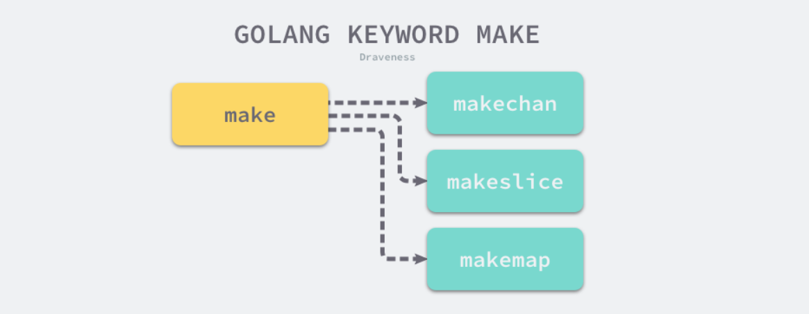

# 编译原理

## 编译过程

Go 语言是一门需要编译才能运行的编程语言，也就是说代码在运行之前需要通过编译器生成二进制机器码，包含二进制机器码的文件才能在目标机器上运行，如果我们想要了解 Go 语言的实现原理，理解它的编译过程就是一个没有办法绕过的事情。

这一节会先对 Go 语言编译的过程进行概述，从顶层介绍编译器执行的几个步骤，随后的几节会分别剖析各个步骤完成的工作和实现原理，同时也会对一些需要预先掌握的知识进行介绍，确保后面的章节能够被更好的理解。

### 预备知识

想要深入了解 Go 语言的编译过程，需要提前了解一下编译过程中涉及的一些术语和专业知识。这些知识其实在我们的日常工作和学习中比较难用到，但是对于理解编译的过程和原理还是非常重要的。这一小节会简单挑选几个重要的概念提前进行介绍，减少后面章节的理解压力。

#### 抽象语法树

[抽象语法树](https://en.wikipedia.org/wiki/Abstract_syntax_tree)（Abstract Syntax Tree、AST），是源代码语法的结构的一种抽象表示，它用树状的方式表示编程语言的语法结构[1](https://draveness.me/golang/docs/part1-prerequisite/ch02-compile/golang-compile-intro/#fn:1)。抽象语法树中的每一个节点都表示源代码中的一个元素，每一棵子树都表示一个语法元素，以表达式 `2 * 3 + 7` 为例，编译器的语法分析阶段会生成如下图所示的抽象语法树。


作为编译器常用的数据结构，抽象语法树抹去了源代码中不重要的一些字符 - 空格、分号或者括号等等。编译器在执行完语法分析之后会输出一个抽象语法树，这个抽象语法树会辅助编译器进行语义分析，我们可以用它来确定语法正确的程序是否存在一些类型不匹配的问题。

#### 静态单赋值

[静态单赋值](https://en.wikipedia.org/wiki/Static_single_assignment_form)（Static Single Assignment、SSA）是中间代码的特性，如果中间代码具有静态单赋值的特性，那么每个变量就只会被赋值一次[2](https://draveness.me/golang/docs/part1-prerequisite/ch02-compile/golang-compile-intro/#fn:2)。在实践中，我们通常会用下标实现静态单赋值，这里以下面的代码举个例子：

```go
x := 1
x := 2
y := x
```

经过简单的分析，我们就能够发现上述的代码第一行的赋值语句 `x := 1` 不会起到任何作用。下面是具有 SSA 特性的中间代码，我们可以清晰地发现变量 `y_1` 和 `x_1` 是没有任何关系的，所以在机器码生成时就可以省去 `x := 1` 的赋值，通过减少需要执行的指令优化这段代码。

```go
x_1 := 1
x_2 := 2
y_1 := x_2
```

因为 SSA 的主要作用是对代码进行优化，所以它是编译器后端[3](https://draveness.me/golang/docs/part1-prerequisite/ch02-compile/golang-compile-intro/#fn:3)的一部分；当然代码编译领域除了 SSA 还有很多中间代码的优化方法，编译器生成代码的优化也是一个古老并且复杂的领域，这里就不会展开介绍了。

#### 指令集

最后要介绍的一个预备知识就是[指令集](https://en.wikipedia.org/wiki/Instruction_set_architecture)[4](https://draveness.me/golang/docs/part1-prerequisite/ch02-compile/golang-compile-intro/#fn:4)了，很多开发者在都会遇到在本地开发环境编译和运行正常的代码，在生产环境却无法正常工作，这种问题背后会有多种原因，而不同机器使用的不同指令集可能是原因之一。

我们大多数开发者都会使用 x86_64 的 Macbook 作为工作上主要使用的设备，在命令行中输入 `uname -m` 就能获得当前机器的硬件信息：

```bash
$ uname -m
x86_64
```

x86 是目前比较常见的指令集，除了 x86 之外，还有 arm 等指令集，苹果最新 Macbook 的自研芯片就使用了 arm 指令集，不同的处理器使用了不同的架构和机器语言，所以很多编程语言为了在不同的机器上运行需要将源代码根据架构翻译成不同的机器代码。

复杂指令集计算机（CISC）和精简指令集计算机（RISC）是两种遵循不同设计理念的指令集，从名字我们就可以推测出这两种指令集的区别：

- 复杂指令集：通过增加指令的类型减少需要执行的指令数；
- 精简指令集：使用更少的指令类型完成目标的计算任务；

早期的 CPU 为了减少机器语言指令的数量一般使用复杂指令集完成计算任务，这两者并没有绝对的优劣，它们只是在一些设计上的选择不同以达到不同的目的，我们会在后面的[机器码生成](https://draveness.me/golang/docs/part1-prerequisite/ch02-compile/golang-machinecode/)一节中详细介绍指令集架构，不过各位读者也可以主动了解相关的内容。

### 编译原理

Go 语言编译器的源代码在 [`src/cmd/compile`](https://github.com/golang/go/tree/master/src/cmd/compile) 目录中，目录下的文件共同组成了 Go 语言的编译器，学过编译原理的人可能听说过编译器的前端和后端，编译器的前端一般承担着词法分析（lexical analysis）、语法分析（syntax analysis）、语义分析（semantic analysis）、类型检查和中间代码生成（intermediate code generator）几部分工作，而编译器后端主要负责目标代码的生成（code generator）和优化，也就是将中间代码翻译成目标机器能够运行的二进制机器码。


Go 的编译器在逻辑上可以被分成四个阶段：词法与语法分析、类型检查和 AST 转换、通用 SSA 生成和最后的机器代码生成，在这一节我们会使用比较少的篇幅分别介绍这四个阶段做的工作，后面的章节会具体介绍每一个阶段的具体内容。

#### 词法与语法分析

所有的编译过程其实都是从解析代码的源文件开始的，词法分析的作用就是解析源代码文件，它将文件中的字符串序列转换成 Token 序列，方便后面的处理和解析，我们一般会把执行词法分析的程序称为词法解析器（lexer）。

而语法分析的输入是词法分析器输出的 Token 序列，语法分析器会按照顺序解析 Token 序列，该过程会将词法分析生成的 Token 按照编程语言定义好的文法（Grammar）自下而上或者自上而下的规约，每一个 Go 的源代码文件最终会被归纳成一个 [SourceFile](https://golang.org/ref/spec#Source_file_organization) 结构[5](https://draveness.me/golang/docs/part1-prerequisite/ch02-compile/golang-compile-intro/#fn:5)：

```go
SourceFile = PackageClause ";" { ImportDecl ";" } { TopLevelDecl ";" } .
```

Go

词法分析会返回一个不包含空格、换行等字符的 Token 序列，例如：`package`, `json`, `import`, `(`, `io`, `)`, …，而语法分析会把 Token 序列转换成有意义的结构体，即语法树：

```go
"json.go": SourceFile {
    PackageName: "json",
    ImportDecl: []Import{
        "io",
    },
    TopLevelDecl: ...
}
```

Token 到上述抽象语法树（AST）的转换过程会用到语法解析器，每一个 AST 都对应着一个单独的 Go 语言文件，这个抽象语法树中包括当前文件属于的包名、定义的常量、结构体和函数等。


语法解析的过程中发生的任何语法错误都会被语法解析器发现并将消息打印到标准输出上，整个编译过程也会随着错误的出现而被中止。[词法与语法分析](https://draveness.me/golang/docs/part1-prerequisite/ch02-compile/golang-lexer-and-parser/)一节会详细介绍 Go 语言的文法、词法解析和语法解析过程。

#### 类型检查

当拿到一组文件的抽象语法树之后，Go 语言的编译器会对语法树中定义和使用的类型进行检查，类型检查会按照以下的顺序分别验证和处理不同类型的节点：

1. 常量、类型和函数名及类型；
2. 变量的赋值和初始化；
3. 函数和闭包的主体；
4. 哈希键值对的类型；
5. 导入函数体；
6. 外部的声明；

通过对整棵抽象语法树的遍历，我们在每个节点上都会对当前子树的类型进行验证，以保证节点不存在类型错误，所有的类型错误和不匹配都会在这一个阶段被暴露出来，其中包括：结构体对接口的实现。

类型检查阶段不止会对节点的类型进行验证，还会展开和改写一些内建的函数，例如 make 关键字在这个阶段会根据子树的结构被替换成 [`runtime.makeslice`](https://draveness.me/golang/tree/runtime.makeslice) 或者 [`runtime.makechan`](https://draveness.me/golang/tree/runtime.makechan) 等函数。



类型检查这一过程在整个编译流程中还是非常重要的，Go 语言的很多关键字都依赖类型检查期间的展开和改写，我们在[类型检查](https://draveness.me/golang/docs/part1-prerequisite/ch02-compile/golang-typecheck/)中会详细介绍这一步骤。

#### 中间代码生成


#### 机器码生成


### 编译器入口


### 小结


## 词法分析和语法分析


## 类型检查


## 中间代码生成


## 机器码生成