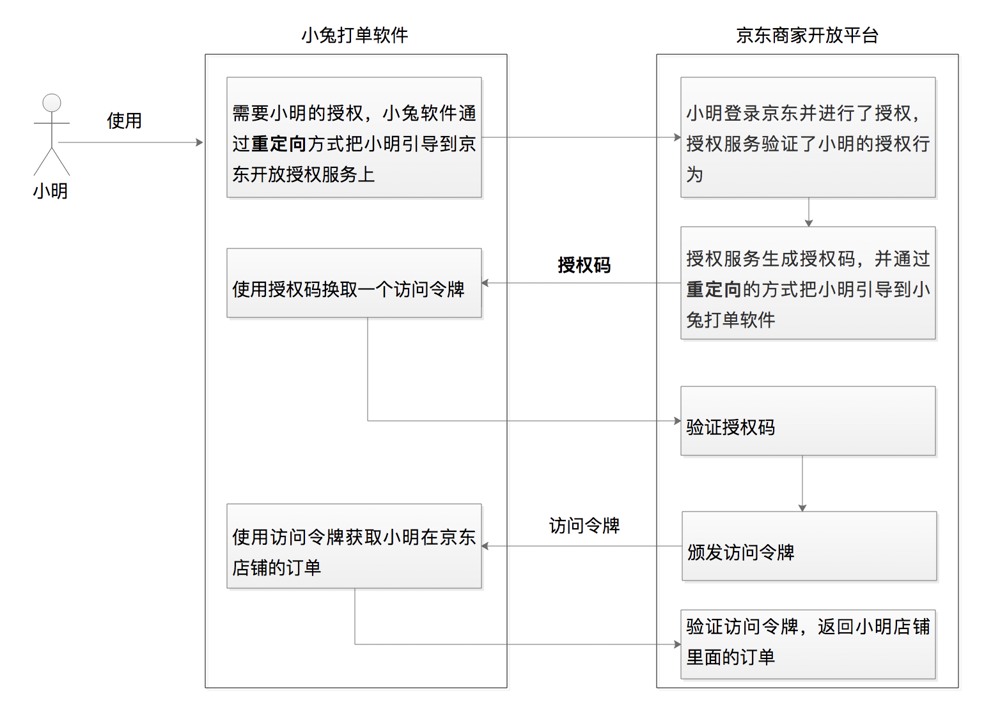

# 01 | OAuth 2.0是要通过什么方式解决什么问题？
在课程正式开始之前，我想先问你个问题。第一次使用极客时间App的时候，你是直接使用了第三方帐号（比如微信、微博）登录，还是选择了重新注册新用户？如果你选择了重新注册用户，那你还得上传头像、输入用户名等信息。但如果你选择了使用第三方帐号微信来登录，那极客时间会直接使用你微信的这些信息作为基础信息，你就能省心很多。

到这里，我估计你会问，这是怎么实现的？微信把我的个人信息给了极客时间，它又是怎么保证我的数据安全的呢？

其实，微信这一系列授权背后的原理都可以归到一个词上，那就是OAuth 2.0。今天这节课，我们就来看看OAuth 2.0到底是什么、能干什么以及它是怎么干的。

## OAuth 2.0是什么？

用一句话总结来说，OAuth 2.0就是一种授权协议。那如何理解这里的“授权”呢？

我举一个电商的场景。假如你是一个卖家，在京东商城开了一个店铺，日常运营中你要将订单打印出来以便给用户发货。但打印这事儿也挺繁琐的，之前你总是手工操作，后来发现有个叫“小兔”的第三方软件，它可以帮你高效率地处理这事。

但你想想，小兔是怎么访问到这些订单数据的呢？其实是这样，京东商城提供了开放平台，小兔通过京东商家开放平台的API就能访问到用户的订单数据。

只要你在软件里点击同意，小兔就可以拿到一个访问令牌，通过访问令牌来获取到你的订单数据帮你干活儿了。你看，这里也是有一次授权。你要是不同意，平台肯定不敢把这些数据给到第三方软件。

关于授权我们最容易想到的方案就是提供钥匙。比如，小兔要获取你的订单信息，那你就把你的用户名和密码给它。但稍微有些安全意识，我们都不会这样做。

小兔软件请求访问你的订单数据的过程，会涉及一套授权机制，那就是OAuth 2.0。它通过给小兔软件一个访问令牌，而不是让小兔软件拿着你的用户名和密码，去获取你的订单数据帮你干活儿。

那总结来说， **OAuth 2.0这种授权协议，就是保证第三方（软件）只有在获得授权之后，才可以进一步访问授权者的数据**。

## OAuth 2.0是怎样运转的？

现在，我相信你已经对OAuth 2.0有了一个整体印象，接下来咱们再看看它是怎么运转的。

我们还是来看上面提到的小兔打单软件的例子吧。假如小明在京东上面开了一个店铺，小明要管理他的店铺里面的订单，于是选择了使用小兔软件。

现在，让我们把“小明”“小兔软件”“京东商家开放平台”放到一个对话里面，看看“他们”是怎么沟通的吧。

**小明**：“你好，小兔软件。我正在Google浏览器上面，需要访问你来帮我处理我在京东商城店铺的订单。”

**小兔软件**：“好的，小明，我需要你给我授权。现在我把你引导到京东商家开放平台上，你在那里给我授权吧。”

**京东商家开放平台**：“你好，小明。我收到了小兔软件跳转过来的请求，现在已经准备好了一个授权页面。你登录并确认后，点击授权页面上面的授权按钮即可。”

**小明**：“好的，京东商家开放平台。我看到了这个授权页面，已经点授权按钮啦”

**京东商家开放平台**：“你好，小兔打单软件。我收到了小明的授权，现在要给你生成一个授权码code值，我通过浏览器重定向到你的回调URL地址上面了。”

**小兔软件**：“好的，京东商家开放平台。我现在从浏览器上拿到了授权码，现在就用这个授权码来请求你，请给我一个访问令牌access\_token吧。”

**京东商家开放平台**：“好的，小兔打单软件，访问令牌已经发送给你了。”

**小兔软件**：“太好了，我现在就可以使用访问令牌来获取小明店铺的订单了。”

**小明**：“我已经能够看到我的订单了，现在就开始打单操作了。”

下面，为了帮助你理解，我再用一张图来描述整个过程：

再分析下这个流程，我们不难发现小兔软件最终的目的，是要获取一个叫做“访问令牌”的东西。

那么，小兔软件是怎么获取访问令牌的值的呢？我们会发现还有一个叫做“授权码”的东西，也就是说小兔软件是拿 **授权码换取的访问令牌**。

小兔软件又是怎么拿到 **授权码** 的呢？从图中流程刚开始的那一步，我们就会发现，是在小明授权之后，才产生的授权码，上面流程中后续的一切动作，实际上都是在小明对小兔软件授权发生以后才产生的。其中主要的动作，就是生成授权码–>生成访问令牌–>使用访问令牌。

到这里，我们不难发现， **OAuth 2.0 授权的核心就是颁发访问令牌、使用访问令牌，** 而且不管是哪种类型的授权流程都是这样。你一定要理解，或者记住这句话，它是整个流程的核心。

在小兔软件这个例子中呢，我们使用的就是授权码许可（Authorization Code）类型。它是OAuth 2.0中最经典、最完备、最安全、应用最广泛的许可类型。除了授权码许可类型外，OAuth 2.0针对不同的使用场景，还有3种基础的许可类型，分别是隐式许可（Implicit）、客户端凭据许可（Client Credentials）、资源拥有者凭据许可（Resource Owner Password Credentials）。相对而言，这3种授权许可类型的流程，在流程复杂度和安全性上都有所减弱（我会在第6讲，与你详细分析）。

因此，在这个课程中，我会频繁用授权码许可类型来举例。至于为什么称它为授权码许可，为什么有两次重定向，以及这种许可类型更详细的通信流程又是怎样的，我会在第2讲给你深入分析，你可以先不用关注。
