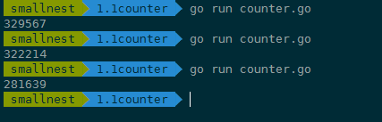
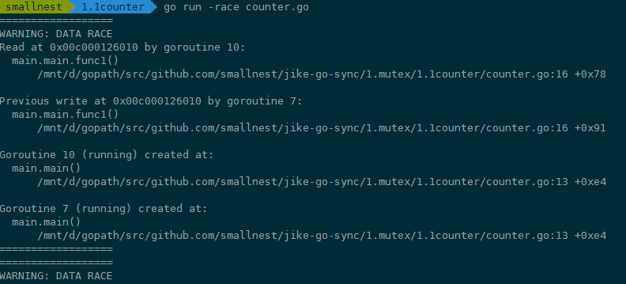
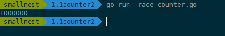

# 01 | Mutex：如何解决资源并发访问问题？


## Mutex的基本使用方法

在正式看Mutex用法之前呢，我想先给你交代一件事：Locker接口。

在Go的标准库中，package sync提供了锁相关的一系列同步原语，这个package还定义了一个Locker的接口，Mutex就实现了这个接口。

Locker的接口定义了锁同步原语的方法集：

```go
type Locker interface {
    Lock()
    Unlock()
}
```

可以看到，Go定义的锁接口的方法集很简单，就是请求锁（Lock）和释放锁（Unlock）这两个方法，秉承了Go语言一贯的简洁风格。

但是，这个接口在实际项目应用得不多，因为我们一般会直接使用具体的同步原语，而不是通过接口。

我们这一讲介绍的Mutex以及后面会介绍的读写锁RWMutex都实现了Locker接口，所以首先我把这个接口介绍了，让你做到心中有数。

下面我们直接看Mutex。

简单来说， **互斥锁Mutex就提供两个方法Lock和Unlock：进入临界区之前调用Lock方法，退出临界区的时候调用Unlock方法**：

```
  func(m *Mutex)Lock()
  func(m *Mutex)Unlock()
```

**当一个goroutine通过调用Lock方法获得了这个锁的拥有权后， 其它请求锁的goroutine就会阻塞在Lock方法的调用上，直到锁被释放并且自己获取到了这个锁的拥有权。**

看到这儿，你可能会问，为啥一定要加锁呢？别急，我带你来看一个并发访问场景中不使用锁的例子，看看实现起来会出现什么状况。

在这个例子中，我们创建了10个goroutine，同时不断地对一个变量（count）进行加1操作，每个goroutine负责执行10万次的加1操作，我们期望的最后计数的结果是10 \* 100000 = 1000000 (一百万)。

```go
 import (
        "fmt"
        "sync"
    )

    func main() {
        var count = 0
        // 使用WaitGroup等待10个goroutine完成
        var wg sync.WaitGroup
        wg.Add(10)
        for i := 0; i < 10; i++ {
            go func() {
                defer wg.Done()
                // 对变量count执行10次加1
                for j := 0; j < 100000; j++ {
                    count++
                }
            }()
        }
        // 等待10个goroutine完成
        wg.Wait()
        fmt.Println(count)
    }
```

在这段代码中，我们使用sync.WaitGroup来等待所有的goroutine执行完毕后，再输出最终的结果。sync.WaitGroup这个同步原语我会在后面的课程中具体介绍，现在你只需要知道，我们使用它来控制等待一组goroutine全部做完任务。

但是，每次运行，你都可能得到不同的结果，基本上不会得到理想中的一百万的结果。



这是为什么呢？

其实，这是因为， **count++** 不是一个原子操作，它至少包含几个步骤，比如读取变量count的当前值，对这个值加1，把结果再保存到count中。因为不是原子操作，就可能有并发的问题。

比如，10个goroutine同时读取到count的值为9527，接着各自按照自己的逻辑加1，值变成了9528，然后把这个结果再写回到count变量。但是，实际上，此时我们增加的总数应该是10才对，这里却只增加了1，好多计数都被“吞”掉了。这是并发访问共享数据的常见错误。

```
 // count++操作的汇编代码
    MOVQ    "".count(SB), AX
    LEAQ    1(AX), CX
    MOVQ    CX, "".count(SB)
```

这个问题，有经验的开发人员还是比较容易发现的，但是，很多时候，并发问题隐藏得非常深，即使是有经验的人，也不太容易发现或者Debug出来。

针对这个问题，Go提供了一个检测并发访问共享资源是否有问题的工具： [race detector](https://blog.golang.org/race-detector)，它可以帮助我们自动发现程序有没有data race的问题。

**Go race detector** 是基于Google的 C/C++ [sanitizers](https://github.com/google/sanitizers) 技术实现的，编译器通过探测所有的内存访问，加入代码能监视对这些内存地址的访问（读还是写）。在代码运行的时候，race detector就能监控到对共享变量的非同步访问，出现race的时候，就会打印出警告信息。

这个技术在Google内部帮了大忙，探测出了Chromium等代码的大量并发问题。Go 1.1中就引入了这种技术，并且一下子就发现了标准库中的42个并发问题。现在，race detector已经成了Go持续集成过程中的一部分。

我们来看看这个工具怎么用。

在编译（compile）、测试（test）或者运行（run）Go代码的时候，加上 **race** 参数，就有可能发现并发问题。比如在上面的例子中，我们可以加上race参数运行，检测一下是不是有并发问题。如果你go run -race counter.go，就会输出警告信息。



这个警告不但会告诉你有并发问题，而且还会告诉你哪个goroutine在哪一行对哪个变量有写操作，同时，哪个goroutine在哪一行对哪个变量有读操作，就是这些并发的读写访问，引起了data race。

例子中的goroutine 10对内存地址0x00c000126010有读的操作（counter.go文件第16行），同时，goroutine 7对内存地址0x00c000126010有写的操作（counter.go文件第16行）。而且还可能有多个goroutine在同时进行读写，所以，警告信息可能会很长。

虽然这个工具使用起来很方便，但是，因为它的实现方式，只能通过真正对实际地址进行读写访问的时候才能探测，所以它并不能在编译的时候发现data race的问题。而且，在运行的时候，只有在触发了data race之后，才能检测到，如果碰巧没有触发（比如一个data race问题只能在2月14号零点或者11月11号零点才出现），是检测不出来的。

而且，把开启了race的程序部署在线上，还是比较影响性能的。运行 go tool compile -race -S counter.go，可以查看计数器例子的代码，重点关注一下count++前后的编译后的代码：

```assembly
0x002a 00042 (counter.go:13)    CALL    runtime.racefuncenter(SB)
       ......
        0x0061 00097 (counter.go:14)    JMP     173
        0x0063 00099 (counter.go:15)    MOVQ    AX, "".j+8(SP)
        0x0068 00104 (counter.go:16)    PCDATA  $0, $1
        0x0068 00104 (counter.go:16)    MOVQ    "".&count+128(SP), AX
        0x0070 00112 (counter.go:16)    PCDATA  $0, $0
        0x0070 00112 (counter.go:16)    MOVQ    AX, (SP)
        0x0074 00116 (counter.go:16)    CALL    runtime.raceread(SB)
        0x0079 00121 (counter.go:16)    PCDATA  $0, $1
        0x0079 00121 (counter.go:16)    MOVQ    "".&count+128(SP), AX
        0x0081 00129 (counter.go:16)    MOVQ    (AX), CX
        0x0084 00132 (counter.go:16)    MOVQ    CX, ""..autotmp_8+16(SP)
        0x0089 00137 (counter.go:16)    PCDATA  $0, $0
        0x0089 00137 (counter.go:16)    MOVQ    AX, (SP)
        0x008d 00141 (counter.go:16)    CALL    runtime.racewrite(SB)
        0x0092 00146 (counter.go:16)    MOVQ    ""..autotmp_8+16(SP), AX
       ......
        0x00b6 00182 (counter.go:18)    CALL    runtime.deferreturn(SB)
        0x00bb 00187 (counter.go:18)    CALL    runtime.racefuncexit(SB)
        0x00c0 00192 (counter.go:18)    MOVQ    104(SP), BP
        0x00c5 00197 (counter.go:18)    ADDQ    $112, SP
```

在编译的代码中，增加了runtime.racefuncenter、runtime.raceread、runtime.racewrite、runtime.racefuncexit等检测data race的方法。通过这些插入的指令，Go race detector工具就能够成功地检测出data race问题了。

总结一下，通过在编译的时候插入一些指令，在运行时通过这些插入的指令检测并发读写从而发现data race问题，就是这个工具的实现机制。

既然这个例子存在data race问题，我们就要想办法来解决它。这个时候，我们这节课的主角Mutex就要登场了，它可以轻松地消除掉data race。

具体怎么做呢？下面，我就结合这个例子，来具体给你讲一讲Mutex的基本用法。

我们知道，这里的共享资源是count变量，临界区是count++，只要在临界区前面获取锁，在离开临界区的时候释放锁，就能完美地解决data race的问题了。

```go
package main

    import (
        "fmt"
        "sync"
    )

    func main() {
        // 互斥锁保护计数器
        var mu sync.Mutex
        // 计数器的值
        var count = 0

        // 辅助变量，用来确认所有的goroutine都完成
        var wg sync.WaitGroup
        wg.Add(10)

        // 启动10个gourontine
        for i := 0; i < 10; i++ {
            go func() {
                defer wg.Done()
                // 累加10万次
                for j := 0; j < 100000; j++ {
                    mu.Lock()
                    count++
                    mu.Unlock()
                }
            }()
        }
        wg.Wait()
        fmt.Println(count)
    }
```

如果你再运行一下程序，就会发现，data race警告没有了，系统干脆地输出了1000000：



怎么样，使用Mutex是不是非常高效？效果很惊喜。

这里有一点需要注意：Mutex的零值是还没有goroutine等待的未加锁的状态，所以你不需要额外的初始化，直接声明变量（如 var mu sync.Mutex）即可。

那Mutex还有哪些用法呢？

很多情况下， **Mutex会嵌入到其它struct中使用**，比如下面的方式：

```go
type Counter struct {
    mu    sync.Mutex
    Count uint64
}
```

在初始化嵌入的struct时，也不必初始化这个Mutex字段，不会因为没有初始化出现空指针或者是无法获取到锁的情况。

有时候，我们还可以 **采用嵌入字段的方式**。通过嵌入字段，你可以在这个struct上直接调用Lock/Unlock方法。

```go
func main() {
    var counter Counter
    var wg sync.WaitGroup
    wg.Add(10)
    for i := 0; i < 10; i++ {
        go func() {
            defer wg.Done()
            for j := 0; j < 100000; j++ {
                counter.Lock()
                counter.Count++
                counter.Unlock()
            }
        }()
    }
    wg.Wait()
    fmt.Println(counter.Count)
}

type Counter struct {
    sync.Mutex
    Count uint64
}
```

**如果嵌入的struct有多个字段，我们一般会把Mutex放在要控制的字段上面，然后使用空格把字段分隔开来。** 即使你不这样做，代码也可以正常编译，只不过，用这种风格去写的话，逻辑会更清晰，也更易于维护。

甚至，你还可以 **把获取锁、释放锁、计数加一的逻辑封装成一个方法**，对外不需要暴露锁等逻辑：

```go
func main() {
    // 封装好的计数器
    var counter Counter

    var wg sync.WaitGroup
    wg.Add(10)

    // 启动10个goroutine
    for i := 0; i < 10; i++ {
        go func() {
            defer wg.Done()
            // 执行10万次累加
            for j := 0; j < 100000; j++ {
                counter.Incr() // 受到锁保护的方法
            }
        }()
    }
    wg.Wait()
    fmt.Println(counter.Count())
}

// 线程安全的计数器类型
type Counter struct {
    CounterType int
    Name        string

    mu    sync.Mutex
    count uint64
}

// 加1的方法，内部使用互斥锁保护
func (c *Counter) Incr() {
    c.mu.Lock()
    c.count++
    c.mu.Unlock()
}

// 得到计数器的值，也需要锁保护
func (c *Counter) Count() uint64 {
    c.mu.Lock()
    defer c.mu.Unlock()
    return c.count
}
/*
为什么需要对读取操作也加锁呢？ 因为写操作并不是原子的，一条普通的赋值语句其实并不是一个原子操作。
比如在 32位机器上，写 int64 类型的变量就会有中间状态，
因为它会被拆成两次 MOV 操作 -- 写低 32 位 和高 32 位。 
如果一个线程刚写完低 32 位，还没来得及写 高 32 位时，另一个线程读取了这个变量，
那么就会得到一个毫无意义的中间变量，这可能使我们的程序出现诡异的 Bug。 
所以 sync/atomic 提供了对基础类型的一些原子操作，比如 LoadX, StoreX, SwapX, AddX，CompareAndSwapX 等。
这些操作在不同平台有不同的实现，比如 LoadInt64 在 amd64 下就是一条简单的加载，但是在 386 平台下就需要更复杂的实现。

在daydayup项目中有示例
*/
```

## 总结

这节课，我介绍了并发问题的背景知识、标准库中Mutex的使用和最佳实践、通过race detector工具发现计数器程序的问题以及修复方法。相信你已经大致了解了Mutex这个同步原语。

在项目开发的初始阶段，我们可能并没有仔细地考虑资源的并发问题，因为在初始阶段，我们还不确定这个资源是否被共享。经过更加深入的设计，或者新功能的增加、代码的完善，这个时候，我们就需要考虑共享资源的并发问题了。当然，如果你能在初始阶段预见到资源会被共享并发访问就更好了。

意识到共享资源的并发访问的早晚不重要，重要的是，一旦你意识到这个问题，你就要及时通过互斥锁等手段去解决。

比如Docker issue [37583](https://github.com/moby/moby/pull/37583)、 [35517](https://github.com/moby/moby/pull/35517)、 [32826](https://github.com/moby/moby/pull/32826)、 [30696](https://github.com/moby/moby/pull/30696) 等、kubernetes issue [72361](https://github.com/kubernetes/kubernetes/pull/72361)、 [71617](https://github.com/kubernetes/kubernetes/pull/71617) 等，都是后来发现的data race而采用互斥锁Mutex进行修复的。

## 思考题

读也要加锁呢？

> 1.mutex保护的临界区如果读的时候不加锁，可能会造成不一致的后果，比如部分变量被修改了。 
>
> 2.如果临界区比较简单，比如一个int64读写，也可能在一些cpu架构下有可见性问题，导致别的goroutine对变量的写读goroutine看不到