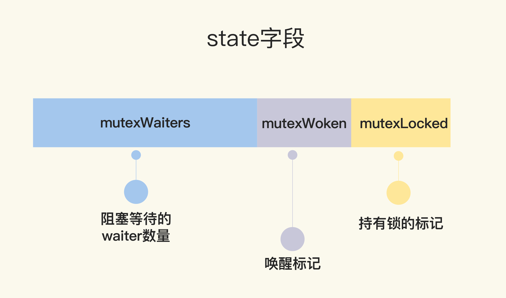

# 02 | Mutex：庖丁解牛看实现
你好，我是鸟窝。

上一讲我们一起体验了Mutex的使用，竟是那么简单，只有简简单单两个方法，Lock和Unlock，进入临界区之前调用Lock方法，退出临界区的时候调用Unlock方法。这个时候，你一定会有一丝好奇：“它的实现是不是也很简单呢？”

其实不是的。如果你阅读Go标准库里Mutex的源代码，并且追溯Mutex的演进历史，你会发现，从一个简单易于理解的互斥锁的实现，到一个非常复杂的数据结构，这是一个逐步完善的过程。Go开发者们做了种种努力，精心设计。我自己每次看，都会被这种匠心和精益求精的精神打动。

所以，今天我就想带着你一起去探索Mutex的实现及演进之路，希望你能和我一样体验到这种技术追求的美妙。我们从Mutex的一个简单实现开始，看看它是怎样逐步提升性能和公平性的。在这个过程中，我们可以学习如何逐步设计一个完善的同步原语，并能对复杂度、性能、结构设计的权衡考量有新的认识。经过这样一个学习，我们不仅能通透掌握Mutex，更好地使用这个工具，同时，对我们自己设计并发数据接口也非常有帮助。

那具体怎么来讲呢？我把Mutex的架构演进分成了四个阶段，下面给你画了一张图来说明。

“ **初版**”的Mutex使用一个flag来表示锁是否被持有，实现比较简单；后来照顾到新来的goroutine，所以会让新的goroutine也尽可能地先获取到锁，这是第二个阶段，我把它叫作“ **给新人机会**”；那么，接下来就是第三阶段“ **多给些机会**”，照顾新来的和被唤醒的goroutine；但是这样会带来饥饿问题，所以目前又加入了饥饿的解决方案，也就是第四阶段“ **解决饥饿**”。


有了这四个阶段，我们学习的路径就清晰了，那接下来我会从代码层面带你领略Go开发者这些大牛们是如何逐步解决这些问题的。

# 初版的互斥锁

Mutex的整体设计非常简洁，学习起来一点也没有障碍。但是，注意，我要划重点了。

**Unlock方法可以被任意的goroutine调用释放锁，即使是没持有这个互斥锁的goroutine，也可以进行这个操作。这是因为，Mutex本身并没有包含持有这把锁的goroutine的信息，所以，Unlock也不会对此进行检查。Mutex的这个设计一直保持至今。**

这就带来了一个有趣而危险的功能。为什么这么说呢？

你看，其它goroutine可以强制释放锁，这是一个非常危险的操作，因为在临界区的goroutine可能不知道锁已经被释放了，还会继续执行临界区的业务操作，这可能会带来意想不到的结果，因为这个goroutine还以为自己持有锁呢，有可能导致data race问题。

所以，我们在使用Mutex的时候，必须要保证goroutine尽可能不去释放自己未持有的锁，一定要遵循“ **谁申请，谁释放**”的原则。在真实的实践中，我们使用互斥锁的时候，很少在一个方法中单独申请锁，而在另外一个方法中单独释放锁，一般都会在同一个方法中获取锁和释放锁。

如果你接触过其它语言（比如Java语言）的互斥锁的实现，就会发现这一点和其它语言的互斥锁不同，所以，如果是从其它语言转到Go语言开发的同学，一定要注意。

# 给新人机会

Go开发者在2011年6月30日的commit中对Mutex做了一次大的调整，调整后的Mutex实现如下：

```go
   type Mutex struct {
        state int32
        sema  uint32
    }

    const (
        mutexLocked = 1 << iota // mutex is locked
        mutexWoken
        mutexWaiterShift = iota
    )
```

虽然Mutex结构体还是包含两个字段，但是第一个字段已经改成了state，它的含义也不一样了。



state是一个复合型的字段，一个字段包含多个意义，这样可以通过尽可能少的内存来实现互斥锁。这个字段的第一位（最小的一位）来表示这个锁是否被持有，第二位代表是否有唤醒的goroutine，剩余的位数代表的是等待此锁的goroutine数。所以，state这一个字段被分成了三部分，代表三个数据。

请求锁的方法Lock也变得复杂了。复杂之处不仅仅在于对字段state的操作难以理解，而且代码逻辑也变得相当复杂。

```go
   func (m *Mutex) Lock() {
        // Fast path: 幸运case，能够直接获取到锁
        if atomic.CompareAndSwapInt32(&m.state, 0, mutexLocked) {
            return
        }

        awoke := false
        for {
            old := m.state
            new := old | mutexLocked // 新状态加锁
            if old&mutexLocked != 0 {
                new = old + 1<<mutexWaiterShift //等待者数量加一
            }
            if awoke {
                // goroutine是被唤醒的，
                // 新状态清除唤醒标志
                new &^= mutexWoken
            }
            if atomic.CompareAndSwapInt32(&m.state, old, new) {//设置新状态
                if old&mutexLocked == 0 { // 锁原状态未加锁
                    break
                }
                runtime.Semacquire(&m.sema) // 请求信号量
                awoke = true
            }
        }
    }
```

首先是通过CAS检测state字段中的标志（第3行），如果没有goroutine持有锁，也没有等待持有锁的gorutine，那么，当前的goroutine就很幸运，可以直接获得锁，这也是注释中的Fast path的意思。

如果不够幸运，state不是零值，那么就通过一个循环进行检查。接下来的第7行到第26行这段代码虽然只有几行，但是理解起来却要费一番功夫，因为涉及到对state不同标志位的操作。这里的位操作以及操作后的结果和数值比较，并没有明确的解释，有时候你需要根据后续的处理进行推断。所以说，如果你充分理解了这段代码，那么对最新版的Mutex也会比较容易掌握了，因为你已经清楚了这些位操作的含义。

我们先前知道，如果想要获取锁的goroutine没有机会获取到锁，就会进行休眠，但是在锁释放唤醒之后，它并不能像先前一样直接获取到锁，还是要和正在请求锁的goroutine进行竞争。这会给后来请求锁的goroutine一个机会，也让CPU中正在执行的goroutine有更多的机会获取到锁，在一定程度上提高了程序的性能。

for循环是不断尝试获取锁，如果获取不到，就通过runtime.Semacquire(&m.sema)休眠，休眠醒来之后awoke置为true，尝试争抢锁。

代码中的第10行将当前的flag设置为加锁状态，如果能成功地通过CAS把这个新值赋予state（第19行和第20行），就代表抢夺锁的操作成功了。

不过，需要注意的是，如果成功地设置了state的值，但是之前的state是有锁的状态，那么，state只是清除mutexWoken标志或者增加一个waiter而已。

请求锁的goroutine有两类，一类是新来请求锁的goroutine，另一类是被唤醒的等待请求锁的goroutine。锁的状态也有两种：加锁和未加锁。我用一张表格，来说明一下goroutine不同来源不同状态下的处理逻辑。


刚刚说的都是获取锁，接下来，我们再来看看释放锁。释放锁的Unlock方法也有些复杂，我们来看一下。

```go
   func (m *Mutex) Unlock() {
        // Fast path: drop lock bit.
        new := atomic.AddInt32(&m.state, -mutexLocked) //去掉锁标志
        if (new+mutexLocked)&mutexLocked == 0 { //本来就没有加锁
            panic("sync: unlock of unlocked mutex")
        }

        old := new
        for {
            if old>>mutexWaiterShift == 0 || old&(mutexLocked|mutexWoken) != 0 { // 没有等待者，或者有唤醒的waiter，或者锁原来已加锁
                return
            }
            new = (old - 1<<mutexWaiterShift) | mutexWoken // 新状态，准备唤醒goroutine，并设置唤醒标志
            if atomic.CompareAndSwapInt32(&m.state, old, new) {
                runtime.Semrelease(&m.sema)
                return
            }
            old = m.state
        }
    }

```

`old&(mutexLocked|mutexWoken) != 0`

这个条件检查的是 state 中 `mutexLocked`位 或 `mutexWoken`位是否有任何一个被设置为 1。只要有一个是 1，条件就成立，函数就返回。

我们分别看：

- Case A: `old & mutexLocked != 0` (锁标志位为1)
  - 含义：在我（解锁者）刚刚减去一个锁标志位之后，state 的锁标志位居然还是 1？这意味着在我完成`AddInt32`操作之后、执行这行检查代码之前，极短的时间内，已经有另一个 goroutine 成功地抢占了这把锁（通过 `Lock`函数中的 `CAS`操作）。
  - 为什么直接返回？锁已经被别人拿走了，我（当前的解锁者）当然不需要再唤醒任何等待者。那个刚刚抢到锁的 goroutine 会成为新的“锁持有者”，它将来在 `Unlock`时，会负责处理唤醒等待者的工作。如果我现在再去唤醒一个，就多此一举了。
- Case B: `old & mutexWoken != 0` (唤醒标志位为1)
  - 含义：`mutexWoken`标志位被设置。
  - 为什么直接返回？ `mutexWoken`标志被设置表示已经有一个 goroutine 被唤醒并正在积极抢锁。解锁者看到这个标志后，就知道不需要再额外唤醒其他等待者了，因为已经有一个活跃的 goroutine 在处理抢锁。如果解锁者此时再唤醒一个等待者，会导致多个 goroutine 同时竞争锁，增加不必要的调度开销（类似“惊群效应”）。

虽然这一版的Mutex已经给新来请求锁的goroutine一些机会，让它参与竞争，没有空闲的锁或者竞争失败才加入到等待队列中。但是其实还可以进一步优化。我们接着往下看。

# 多给些机会

在2015年2月的改动中，如果新来的goroutine或者是被唤醒的goroutine首次获取不到锁，它们就会通过自旋（spin，通过循环不断尝试，spin的逻辑是在 [runtime实现](https://github.com/golang/go/blob/846dce9d05f19a1f53465e62a304dea21b99f910/src/runtime/proc.go#L5580) 的）的方式，尝试检查锁是否被释放。在尝试一定的自旋次数后，再执行原来的逻辑。

```go
   func (m *Mutex) Lock() {
        // Fast path: 幸运之路，正好获取到锁
        if atomic.CompareAndSwapInt32(&m.state, 0, mutexLocked) {
            return
        }

        awoke := false
        iter := 0
        for { // 不管是新来的请求锁的goroutine, 还是被唤醒的goroutine，都不断尝试请求锁
            old := m.state // 先保存当前锁的状态
            new := old | mutexLocked // 新状态设置加锁标志
            if old&mutexLocked != 0 { // 锁还没被释放
                if runtime_canSpin(iter) { // 还可以自旋
                    if !awoke && old&mutexWoken == 0 && old>>mutexWaiterShift != 0 &&
                        atomic.CompareAndSwapInt32(&m.state, old, old|mutexWoken) {
                        awoke = true
                    }
                    runtime_doSpin()
                    iter++
                    continue // 自旋，再次尝试请求锁
                }
                new = old + 1<<mutexWaiterShift
            }
            if awoke { // 唤醒状态
                if new&mutexWoken == 0 {
                    panic("sync: inconsistent mutex state")
                }
                new &^= mutexWoken // 新状态清除唤醒标记
            }
            if atomic.CompareAndSwapInt32(&m.state, old, new) {
                if old&mutexLocked == 0 { // 旧状态锁已释放，新状态成功持有了锁，直接返回
                    break
                }
                runtime_Semacquire(&m.sema) // 阻塞等待
                awoke = true // 被唤醒
                iter = 0
            }
        }
    }
```

如果可以spin的话，for循环会重新检查锁是否释放。对于临界区代码执行非常短的场景来说，这是一个非常好的优化。因为临界区的代码耗时很短，锁很快就能释放，而抢夺锁的goroutine不用通过休眠唤醒方式等待调度，直接spin几次，可能就获得了锁。

# 解决饥饿

经过几次优化，Mutex 的代码越来越复杂，应对高并发争抢锁的场景也更加公平。但是你有没有想过，因为新来的goroutine 也参与竞争，有可能每次都会被新来的 goroutine 抢到获取锁的机会，在极端情况下，等待中的 goroutine 可能会一直获取不到锁，这就是 **饥饿问题**。

所以，2016年Go 1.9中 Mutex 增加了饥饿模式，让锁变得更公平，不公平的等待时间限制在1毫秒，并且修复了一个大Bug：总是把唤醒的 goroutine 放在等待队列的尾部，会导致更加不公平的等待时间。

之后，2018年，Go开发者将 fast path 和 slow path 拆成独立的方法，以便内联，提高性能。2019年也有一个 Mutex 的优化，虽然没有对 Mutex 做修改，但是，对于 Mutex 唤醒后持有锁的那个 waiter，调度器可以有更高的优先级去执行，这已经是很细致的性能优化了。


当然，你也可以暂时略过这一段，以后慢慢品， **只需要记住，Mutex绝不容忍一个goroutine被落下，永远没有机会获取锁。不抛弃不放弃是它的宗旨，而且它也尽可能地让等待较长的goroutine更有机会获取到锁**。

```go
   type Mutex struct {
        state int32
        sema  uint32
    }

    const (
        mutexLocked = 1 << iota // mutex is locked
        mutexWoken
        mutexStarving // 从state字段中分出一个饥饿标记
        mutexWaiterShift = iota

        starvationThresholdNs = 1e6
    )

    func (m *Mutex) Lock() {
        // Fast path: 幸运之路，一下就获取到了锁
        if atomic.CompareAndSwapInt32(&m.state, 0, mutexLocked) {
            return
        }
        // Slow path：缓慢之路，尝试自旋竞争或饥饿状态下饥饿goroutine竞争
        m.lockSlow()
    }

    func (m *Mutex) lockSlow() {
        var waitStartTime int64
        starving := false // 此goroutine的饥饿标记
        awoke := false // 唤醒标记
        iter := 0 // 自旋次数
        old := m.state // 当前的锁的状态
        for {
            // 锁是非饥饿状态，锁还没被释放，尝试自旋
            if old&(mutexLocked|mutexStarving) == mutexLocked && runtime_canSpin(iter) {
                if !awoke && old&mutexWoken == 0 && old>>mutexWaiterShift != 0 &&
                    atomic.CompareAndSwapInt32(&m.state, old, old|mutexWoken) {
                    awoke = true
                }
                runtime_doSpin()
                iter++
                old = m.state // 再次获取锁的状态，之后会检查是否锁被释放了
                continue
            }
            new := old
            if old&mutexStarving == 0 {
                new |= mutexLocked // 非饥饿状态，加锁
            }
            if old&(mutexLocked|mutexStarving) != 0 {
                new += 1 << mutexWaiterShift // waiter数量加1
            }
            if starving && old&mutexLocked != 0 {
                new |= mutexStarving // 设置饥饿状态
            }
            if awoke {
                if new&mutexWoken == 0 {
                    throw("sync: inconsistent mutex state")
                }
                new &^= mutexWoken // 新状态清除唤醒标记
            }
            // 成功设置新状态
            if atomic.CompareAndSwapInt32(&m.state, old, new) {
                // 原来锁的状态已释放，并且不是饥饿状态，正常请求到了锁，返回
                if old&(mutexLocked|mutexStarving) == 0 {
                    break // locked the mutex with CAS
                }
                // 处理饥饿状态

                // 如果以前就在队列里面，加入到队列头
                queueLifo := waitStartTime != 0
                if waitStartTime == 0 {
                    waitStartTime = runtime_nanotime()
                }
                // 阻塞等待
                runtime_SemacquireMutex(&m.sema, queueLifo, 1)
                // 唤醒之后检查锁是否应该处于饥饿状态
                starving = starving || runtime_nanotime()-waitStartTime > starvationThresholdNs
                old = m.state
                // 如果锁已经处于饥饿状态，直接抢到锁，返回
                if old&mutexStarving != 0 {
                    if old&(mutexLocked|mutexWoken) != 0 || old>>mutexWaiterShift == 0 {
                        throw("sync: inconsistent mutex state")
                    }
                    // 有点绕，加锁并且将waiter数减1
                    delta := int32(mutexLocked - 1<<mutexWaiterShift)
                    if !starving || old>>mutexWaiterShift == 1 {
                        delta -= mutexStarving // 最后一个waiter或者已经不饥饿了，清除饥饿标记
                    }
                    atomic.AddInt32(&m.state, delta)
                    break
                }
                awoke = true
                iter = 0
            } else {
                old = m.state
            }
        }
    }

    func (m *Mutex) Unlock() {
        // Fast path: drop lock bit.
        new := atomic.AddInt32(&m.state, -mutexLocked)
        if new != 0 {
            m.unlockSlow(new)
        }
    }

    func (m *Mutex) unlockSlow(new int32) {
        if (new+mutexLocked)&mutexLocked == 0 {
            throw("sync: unlock of unlocked mutex")
        }
        if new&mutexStarving == 0 {
            old := new
            for {
                if old>>mutexWaiterShift == 0 || old&(mutexLocked|mutexWoken|mutexStarving) != 0 {
                    return
                }
                new = (old - 1<<mutexWaiterShift) | mutexWoken
                if atomic.CompareAndSwapInt32(&m.state, old, new) {
                    runtime_Semrelease(&m.sema, false, 1)
                    return
                }
                old = m.state
            }
        } else {
// handoff模式会让当前goroutine主动让出处理器（通过类似goyield的操作），使被唤醒的waiter能立即获得CPU时间片，而不需要等待调度器重新调度。
// 在解锁操作中，没有设置mutexLocked标志。被唤醒的waiter会在自己的lockSlow方法中，通过原子操作设置mutexLocked标志。
// 在饥饿模式下，新来的goroutine在Lock方法中会检测到mutexStarving标志，它们会直接进入等待队列末尾，而不会尝试竞争锁。
            runtime_Semrelease(&m.sema, true, 1)
        }
    }
```

跟之前的实现相比，当前的 Mutex 最重要的变化，就是增加饥饿模式。将饥饿模式的最大等待时间阈值设置成了1毫秒，这就意味着，一旦等待者等待的时间超过了这个阈值，Mutex的处理就有可能进入饥饿模式，优先让等待者先获取到锁，新来的同学主动谦让一下，给老同志一些机会。

通过加入饥饿模式，可以避免把机会全都留给新来的 goroutine，保证了请求锁的 goroutine 获取锁的公平性，对于我们使用锁的业务代码来说，不会有业务一直等待锁不被处理。

那么，接下来的部分就是选学内容了。如果你还有精力，并且对饥饿模式很感兴趣，那就跟着我一起继续来挑战吧。如果你现在理解起来觉得有困难，也没关系，后面可以随时回来复习。

## 饥饿模式和正常模式

Mutex 可能处于两种操作模式下： **正常模式** 和 **饥饿模式**。

接下来我们分析一下 Mutex 对饥饿模式和正常模式的处理。

请求锁时调用的 Lock 方法中一开始是 fast path，这是一个幸运的场景，当前的 goroutine 幸运地获得了锁，没有竞争，直接返回，否则就进入了 lockSlow 方法。这样的设计，方便编译器对 Lock 方法进行内联，你也可以在程序开发中应用这个技巧。

正常模式下，waiter 都是进入先入先出队列，被唤醒的 waiter 并不会直接持有锁，而是要和新来的 goroutine 进行竞争。新来的 goroutine 有先天的优势，它们正在 CPU 中运行，可能它们的数量还不少，所以，在高并发情况下，被唤醒的 waiter 可能比较悲剧地获取不到锁，这时，它会被插入到队列的前面。如果 waiter 获取不到锁的时间超过阈值1毫秒，那么，这个 Mutex 就进入到了饥饿模式。

在饥饿模式下，Mutex 的拥有者将直接把锁交给队列最前面的 waiter。新来的 goroutine 不会尝试获取锁，即使看起来锁没有被持有，它也不会去抢，也不会 spin，它会乖乖地加入到等待队列的尾部。

如果拥有 Mutex 的 waiter 发现下面两种情况的其中之一，它就会把这个 Mutex 转换成正常模式:

- 此 waiter 已经是队列中的最后一个 waiter 了，没有其它的等待锁的 goroutine 了；
- 此 waiter 的等待时间小于1毫秒。

正常模式拥有更好的性能，因为即使有等待抢锁的 waiter，goroutine 也可以连续多次获取到锁。

饥饿模式是对公平性和性能的一种平衡，它避免了某些 goroutine 长时间的等待锁。在饥饿模式下，优先对待的是那些一直在等待的 waiter。

## 模式对比

锁被释放时，等待队列里已经有几个 goroutine 在休眠等待（waiter）。同时，可能正好有新的 goroutine（刚执行到 `Lock()`）试图获取锁。

- 在正常模式下，所有 goroutine（无论是新来的还是被唤醒的等待者）都会一起参与竞争。
- 新来的 goroutine 有一个巨大优势：它正在 CPU 上运行，状态是活跃的。而被唤醒的 waiter 需要经过调度器唤醒、放入运行队列、最后才被 CPU 执行，这个过程中有显著的调度延迟。
- 因此，新来的 goroutine **极有可能**在刚被唤醒、还没完全调度的 waiter 之前，成功通过 `CAS`操作抢到锁。

**为什么说这样“拥有更好的性能”？**

因为避免了昂贵的 **goroutine 切换开销**。如果每次都必须把锁交给队列中的第一个等待者，那么：

1. 解锁者必须执行唤醒操作 (`Semrelease`)。
2. 被唤醒的 waiter 需要从休眠状态被调度器加载、上下文切换、最终开始执行。

这个过程比让一个已经在 CPU 上运行的 goroutine 直接获取锁要慢得多。正常模式通过允许“插队”，减少了这种切换次数，从而提高了程序的**整体吞吐量**。这对于锁竞争不激烈、持有时间短的场景性能提升非常明显。


**在正常模式下，刚刚释放锁的 goroutine（我们称它为 G1）确实有极高的概率立刻再次成功获取到同一个锁。** 但这并不是因为它有特殊的“优先级”，而是由它的**运行状态**和 Mutex 的**设计机制**共同决定的。

下面我们来分解一下为什么会出现这种“连庄”的情况：

1、核心原因：G1 始终处于“正在执行”的状态

这是最根本的原因。想象一下这个时间线：

1. G1 持有锁：它在 CPU 上执行临界区代码。
2. G1 调用 `Unlock()`：它还在 CPU 上执行解锁逻辑。
3. 锁被释放：`Unlock`操作完成，锁的状态变为自由。
4. G1 立即再次调用 `Lock()`：这是关键！G1 的代码逻辑可能是在一个循环中，释放锁后立刻又需要获取锁。因为 G1 从未停止运行，它执行 `Lock()`函数时，依然是那个在 CPU 上活跃的 goroutine。

2、与新来的和被唤醒的 Goroutine 对比

现在我们来对比一下其他竞争者的情况：

- **新来的 Goroutine (G2)**：G2 也可能正好在此时尝试获取锁。G2 和 G1 处于同等竞争地位——它们都在 CPU 上运行。谁能抢到锁，完全取决于谁的 `CompareAndSwap`操作先执行成功。这是一场公平的竞赛，G1 并不比 G2 有优势。但因为 G1 是紧接着 `Unlock`之后立即调用 `Lock`，它的时机可能把握得最好。
- **被唤醒的等待者 (G3)**：G3 是之前竞争失败并在信号量上休眠的 goroutine。它的处境最不利：
  1. G1 执行 `Unlock`时会释放信号量，尝试唤醒 G3。
  2. 然而，“唤醒”是一个异步且昂贵的操作。它需要调度器介入，将 G3 的状态从休眠改为可运行，并将其放入某个 P 的运行队列中。
  3. 最终，G3 需要等待调度器将其调度到某个 CPU 核心上，才能开始执行并尝试获取锁。


## 代码分析

接下来， **我们逐步分析下Mutex代码的关键行，彻底搞清楚饥饿模式的细节**。

我们从请求锁（lockSlow）的逻辑看起。

state字段又分出了一位，用来标记锁是否处于饥饿状态。现在一个state的字段被划分成了阻塞等待的waiter数量、饥饿标记、唤醒标记和持有锁的标记四个部分。

第32行到第41行和以前的逻辑类似，只不过加了一个不能是饥饿状态的逻辑。它会对正常状态抢夺锁的goroutine尝试spin。

```go
        for {
            // 锁是非饥饿状态，锁还没被释放，尝试自旋
            if old&(mutexLocked|mutexStarving) == mutexLocked && runtime_canSpin(iter) {
// 下面if代码的意义是什么呢？
// 它的作用是向即将执行 Unlock()的 goroutine 发送一个信号：
// “我正在CPU上自旋等着抢锁呢，你不用再费力地通过信号量去唤醒一个休眠的waiter了，我很快就能拿到”。
// 这避免了不必要的、昂贵的 goroutine 唤醒操作，提升了性能。
                if !awoke && old&mutexWoken == 0 && old>>mutexWaiterShift != 0 &&
                    atomic.CompareAndSwapInt32(&m.state, old, old|mutexWoken) {
                    awoke = true
                }
                runtime_doSpin()
                iter++
                old = m.state // 重新获取锁的最新状态！这是关键，因为自旋期间锁可能已被释放。
                continue
            }
// 设计体现了 Go 在性能优化上的哲学：用少量的 CPU 空转来换取避免更昂贵的调度开销。在高并发且锁持有时间很短的场景下，这种优化可以显著提升性能。
```

第42行到第44行，非饥饿状态下抢锁。怎么抢？就是要把state的锁的那一位，置为加锁状态，后续CAS如果成功就可能获取到了锁。

第46行到第48行，如果锁已经被持有或者锁处于饥饿状态，我们最好的归宿就是等待，所以waiter的数量加1。

第49行到第51行，如果此goroutine已经处在饥饿状态，并且锁还被持有，那么，我们需要把此Mutex设置为饥饿状态。

第52行到第57行，是清除mutexWoken标记，因为不管是获得了锁还是进入休眠，我们都需要清除mutexWoken标记。

第59行就是尝试使用CAS设置state。如果成功，第61行到第63行是检查原来的锁的状态是未加锁状态，并且也不是饥饿状态的话就成功获取了锁，返回。

第67行判断是否第一次加入到waiter队列。到这里，你应该就能明白第25行为什么不对waitStartTime进行初始化了，我们需要利用它在这里进行条件判断。

第72行将此waiter加入到队列，如果是首次，加入到队尾，先进先出。如果不是首次，那么加入到队首，这样等待最久的goroutine优先能够获取到锁。此goroutine会进行休眠。

第74行判断此goroutine是否处于饥饿状态。注意，执行这一句的时候，它已经被唤醒了。

第77行到第88行是对锁处于饥饿状态下的一些处理。

第82行设置一个标志，这个标志稍后会用来加锁，而且还会将waiter数减1。

第84行，设置标志，在没有其它的waiter或者此goroutine等待还没超过1毫秒，则会将Mutex转为正常状态。

第86行则是将这个标识应用到state字段上。

释放锁（Unlock）时调用的Unlock的fast path没有多少，所以我们主要看unlockSlow方法就行。

如果Mutex处于饥饿状态，第123行直接唤醒等待队列中的waiter。

如果Mutex处于正常状态，如果没有waiter，或者已经有在处理的情况了，那么释放就好，不做额外的处理（第112行到第114行）。

否则，waiter数减1，mutexWoken标志设置上，通过CAS更新state的值（第115行到第119行）。

# TryLock

```go
// TryLock tries to lock m and reports whether it succeeded.
//
// Note that while correct uses of TryLock do exist, they are rare,
// and use of TryLock is often a sign of a deeper problem
// in a particular use of mutexes.

// TryLock的正确使用场景非常罕见
func (m *Mutex) TryLock() bool {
	old := m.state
	if old&(mutexLocked|mutexStarving) != 0 {
		return false
	}

	// There may be a goroutine waiting for the mutex, but we are
	// running now and can try to grab the mutex before that
	// goroutine wakes up.
	if !atomic.CompareAndSwapInt32(&m.state, old, old|mutexLocked) {
		return false
	}

	if race.Enabled {
		race.Acquire(unsafe.Pointer(m))
	}
	return true
}
```

它与普通的 `Lock`方法最根本的区别。普通的 `Lock`方法在获取不到锁时，会一直等待（阻塞），直到锁被释放。而 `TryLock`则会立即返回一个结果，告诉你是否成功获取到了锁。

`TryLock`确实通过先检查状态再CAS来避免无效操作。但这并不能弥补它作为一个“一次性”操作与 `Lock`作为一个“完整状态机”之间的根本差距。

1. **它破坏了公平性**：即使检查通过且CAS成功，这个操作也可能发生在饥饿模式刚被解除的瞬间，从而抢走了本应分配给等待队列中下一个 goroutine 的锁。(其实唤醒的goroutine也不一定能够抢到锁，它需要和新来的goroutine一起竞争)
2. **它放弃了性能优化**：`Lock`的自旋优化旨在减少短锁场景下的上下文切换开销。`TryLock`的一次性尝试使其无法享受这种优化。
3. **它迫使调用方处理重试**：`TryLock`失败后，调用方必须自己实现重试逻辑（例如循环 `for { if TryLock() { break } }`），而这很容易导致低效的忙等待。`Lock`则将重试逻辑内置并优化，在等待时优雅地挂起goroutine。

因此，`TryLock`的“检查后CAS”模式是其正确性的基础，但它只是一个“快照”式的决策。而 `Lock`的威力在于它是一个“持续决策”的过程，能够适应锁状态的变化，并维护一套完整的、旨在保证公平和性能的并发协议。这才是两者最本质的区别。

## 使用场景

**场景一：任务冲突避免 (Conflict Avoidance)**

核心思想：一个低优先级的后台任务尝试执行，但如果会干扰到高优先级的主业务，它宁愿放弃也不愿造成阻塞。

典型例子：缓存清理或状态统计

假设你有一个内存中的缓存，由一个互斥锁 `cacheMu`保护。主业务线程会频繁地持有这个锁进行读写操作。同时，你有一个后台的清理协程，定时运行（例如每秒一次），负责淘汰过期的缓存条目。这个清理操作不是紧急任务，它的存在是为了优化内存使用，绝不能影响主业务的性能和响应速度。

```go
func cleanupCache() {
    // 非阻塞地尝试获取锁
    if cacheMu.TryLock() {
        defer cacheMu.Unlock()
        // 成功获取锁，执行清理操作
        doCleanup()
    } else {
        // 获取锁失败，说明主业务正在繁忙操作缓存
        // 本次清理跳过，下次定时触发再尝试
        log.Println("Cleanup skipped: cache is busy")
    }
}
```

为什么这是合理的？

1. 有清晰的备用方案：失败路径非常明确且合理——直接放弃，`else`分支的逻辑是“什么都不做”。
2. 优先级明确：后台任务的优先级低于主业务任务，放弃执行不会影响系统核心功能。
3. 避免了不必要的阻塞。


# 总结

“罗马不是一天建成的”，Mutex的设计也是从简单设计到复杂处理逐渐演变的。初版的Mutex设计非常简洁，充分展示了Go创始者的简单、简洁的设计哲学。但是，随着大家的使用，逐渐暴露出一些缺陷，为了弥补这些缺陷，Mutex不得不越来越复杂。

有一点值得我们学习的，同时也体现了Go创始者的哲学，就是他们强调Go语言和标准库的稳定性，新版本要向下兼容，用新的版本总能编译老的代码。Go语言从出生到现在已经10多年了，这个Mutex对外的接口却没有变化，依然向下兼容，即使现在Go出了两个版本，每个版本也会向下兼容，保持Go语言的稳定性，你也能领悟他们软件开发和设计的思想。

还有一点，你也可以观察到，为了一个程序20%的特性，你可能需要添加80%的代码，这也是程序越来越复杂的原因。所以，最开始的时候，如果能够有一个清晰而且易于扩展的设计，未来增加新特性时，也会更加方便。


# 位操作

```shell
# 此时 aibility 应该是 111，而 Like 是 001，我的目标是把 ability 变成 110 （这样就去掉了 Like 对应的标志位）
111
001
---
110
# 发现了么？这不就是【异或】嘛。若位相同则为0，若不同则为 1。 此时我们只需要执行一次
ability = ability ^ Like
或者用简洁的写法： ability ^= Like

#这里有一个问题，如果原来的aibility为110，也就是本身不具有Like这种能力，那执行上面的操作就不对了
#我们得使用下面的方式：
new &^= mutexWoken 等价于 new = new & (^mutexWoken)

位置：    3 2 1 0
new： 	1 1 0 1
mutexW：  0 0 1 0  ← 需要清除第1位
         ↑ ↑ ↑ ↑
先计算 ^mutexWoken（按位取反）：0010 → 取反 → 1101
再与 new做按位与操作：
new：    1 1 0 1
 & 
~mutexW：1 1 0 1
   -----------------
   结果：  1 1 0 1
```


# runtime函数

```go
func runtime_Semacquire(s *uint32)
func runtime_SemacquireMutex(s *uint32, lifo bool, skipframes int)
func runtime_SemacquireRWMutexR(s *uint32, lifo bool, skipframes int)
func runtime_SemacquireRWMutex(s *uint32, lifo bool, skipframes int)

func runtime_Semrelease(s *uint32, handoff bool, skipframes int)

func runtime_canSpin(i int) bool
func runtime_doSpin()

func runtime_nanotime() int64
```

## runtime_Semacquire

- **作用**：阻塞当前Goroutine，直到信号量`*s > 0`，随后原子递减`*s`
- **行为**：
  - 若 `*s == 0`→ 当前Goroutine加入等待队列休眠
  - 若 `*s > 0`→ 立即减1并继续执行
- **适用场景**：基础锁实现（如`sync.Cond`）

**增强版信号量获取**

```go
func runtime_SemacquireMutex(s *uint32, lifo bool, skipframes int)
func runtime_SemacquireRWMutexR(s *uint32, lifo bool, skipframes int)
func runtime_SemacquireRWMutex(s *uint32, lifo bool, skipframes int)
```

这些函数类似于更基础的 `runtime_Semacquire`函数，但这些函数是专门提供给标准库中的 `sync.Mutex`和 `sync.RWMutex`使用的。其特别之处在于，它们启用了当这些锁发生争用时的性能分析功能。当多个 goroutine 试图同时获取同一个锁时，就会发生争用（contention）。

它们内部会记录调用栈、阻塞时间等关键信息，这些信息可以被 Go 的性能剖析工具（如 `pprof`）捕获，帮助你分析程序中哪些锁是瓶颈。

参数 `lifo`：这个布尔参数决定了等待同一个锁的 goroutine 如何排队。

- `lifo bool`：等待队列排序策略
  - `true`：插入队列头部（后进先出）
  - `false`：插入队列尾部（先进先出）

参数 `skipframes int`：堆栈跟踪跳过层数（用于隐藏runtime调用，显示用户代码位置）

## runtime_Semrelease

作用：原子递增`*s`，并唤醒队列中的第一个等待的Goroutine。`handoff` 的取值仅影响唤醒后的调度行为，而非唤醒对象：

- `handoff=true`：立即调度被唤醒的 goroutine
  - 当前 goroutine 通过 `goyield` 主动让出处理器（P），被唤醒的队首 goroutine 直接继承剩余时间片，无需等待调度器分配。
  - 在 `sync.Mutex` 饥饿模式下，此行为确保等待最久的 goroutine 优先获得锁，避免其因新 goroutine 竞争而再次阻塞。
- `handoff=false`：仅通知唤醒，不立即调度
  - 被唤醒的 goroutine 被加入可运行队列，由调度器按常规策略分配执行时间。

## runtime_canSpin

`runtime_canSpin(i int) bool`：判断当前 goroutine 是否满足自旋条件，以避免不必要的 CPU 资源浪费。


## runtime_doSpin()

执行主动自旋，占用 CPU 时间片等待锁释放。

- 在满足自旋条件时，**短暂占用 CPU** 等待锁释放，避免立即进入阻塞状态 。
- 自旋时间极短（约数十纳秒），对性能影响可控。


## runtime_nanotime()

`runtime_nanotime() int64`：返回当前时间的**纳秒级时间戳**（单调递增，不受系统时钟调整影响）。

