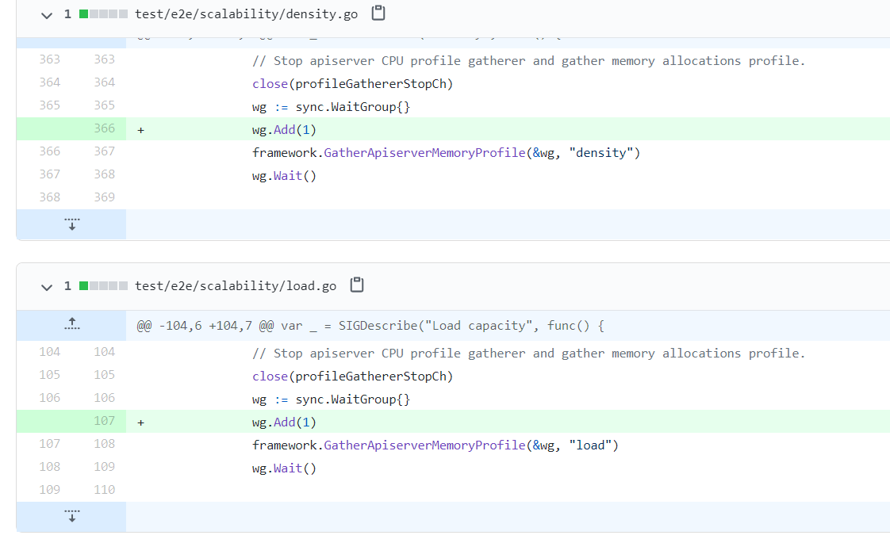
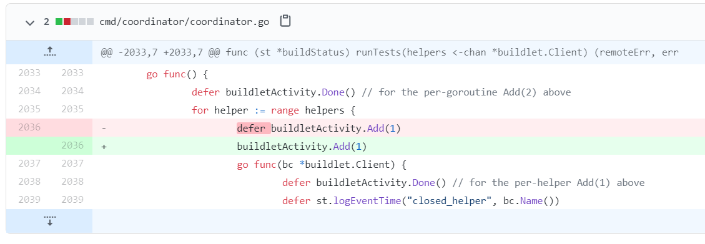

# 06 | WaitGroup：协同等待，任务编排利器
其实，WaitGroup很简单，就是package sync用来做任务编排的一个并发原语。它要解决的就是并发-等待的问题：现在有一个goroutine A 在检查点（checkpoint）等待一组goroutine全部完成，如果在执行任务的这些goroutine还没全部完成，那么goroutine A就会阻塞在检查点，直到这些goroutine都完成后才能继续执行。

## WaitGroup的基本用法

Go标准库中的WaitGroup提供了三个方法，保持了Go简洁的风格。

```go
    func (wg *WaitGroup) Add(delta int)
    func (wg *WaitGroup) Done()
    func (wg *WaitGroup) Wait()
```

我们分别看下这三个方法：

- Add，用来设置WaitGroup的计数值；
- Done，用来将WaitGroup的计数值减1，其实就是调用了Add(-1)；
- Wait，调用这个方法的goroutine会一直阻塞，直到WaitGroup的计数值变为0。

接下来，我们通过一个使用WaitGroup的例子，来看下Add、Done、Wait方法的基本用法。

在这个例子中，我们使用了以前实现的计数器struct。我们启动了10个worker，分别对计数值加一，10个worker都完成后，我们期望输出计数器的值。

```go
// 线程安全的计数器
type Counter struct {
    mu    sync.Mutex
    count uint64
}
// 对计数值加一
func (c *Counter) Incr() {
    c.mu.Lock()
    c.count++
    c.mu.Unlock()
}
// 获取当前的计数值
func (c *Counter) Count() uint64 {
    c.mu.Lock()
    defer c.mu.Unlock()
    return c.count
}
// sleep 1秒，然后计数值加1
func worker(c *Counter, wg *sync.WaitGroup) {
    defer wg.Done()
    time.Sleep(time.Second)
    c.Incr()
}

func main() {
    var counter Counter

    var wg sync.WaitGroup
    wg.Add(10) // WaitGroup的值设置为10

    for i := 0; i < 10; i++ { // 启动10个goroutine执行加1任务
        go worker(&counter, &wg)
    }
    // 检查点，等待goroutine都完成任务
    wg.Wait()
    // 输出当前计数器的值
    fmt.Println(counter.Count())
}
```

我们一起来分析下这段代码。

- 第28行，声明了一个WaitGroup变量，初始值为零。
- 第29行，把WaitGroup变量的计数值设置为10。因为我们需要编排10个goroutine(worker)去执行任务，并且等待goroutine完成。
- 第35行，调用Wait方法阻塞等待。
- 第32行，启动了goroutine，并把我们定义的WaitGroup指针当作参数传递进去。goroutine完成后，需要调用Done方法，把WaitGroup的计数值减1。等10个goroutine都调用了Done方法后，WaitGroup的计数值降为0，这时，第35行的主goroutine就不再阻塞，会继续执行，在第37行输出计数值。

这就是我们使用WaitGroup编排这类任务的常用方式。而“这类任务”指的就是，需要启动多个goroutine执行任务，主goroutine需要等待子goroutine都完成后才继续执行。

熟悉了WaitGroup的基本用法后，我们再看看它具体是如何实现的吧。

## WaitGroup的实现

首先，我们看看WaitGroup的数据结构。它包括了一个 noCopy 的辅助字段。noCopy 的辅助字段，主要就是辅助 vet 工具检查是否通过 copy 赋值这个 WaitGroup 实例。我会在后面和你详细分析这个字段；

WaitGroup 的数据结构定义如下：

```go
type WaitGroup struct {
	noCopy noCopy

	state atomic.Uint64 // high 32 bits are counter, low 32 bits are waiter count.
	sema  uint32
}
```

然后，我们继续深入源码，看一下 Add、Done 和Wait 这三个方法的实现。

在查看这部分源码实现时，我们会发现，除了这些方法本身的实现外，还会有一些额外的代码，主要是 race 检查和异常检查的代码。其中，有几个检查非常关键，如果检查不通过，会出现 panic，这部分内容我会在下一小节分析WaitGroup 的错误使用场景时介绍。现在，我们先专注在 Add、Wait 和 Done 本身的实现代码上。

```go
func (wg *WaitGroup) Add(delta int) {
	state := wg.state.Add(uint64(delta) << 32)
	v := int32(state >> 32)
	w := uint32(state)

	if v < 0 {
		panic("sync: negative WaitGroup counter")
	}
    // w != 0：存在等待者（Wait 已被调用）
    // delta > 0：当前 Add 是增加计数（正值）
    // v == int32(delta)：操作后的计数器值正好等于 delta（说明原始计数为0）
    //	核心规则：计数器从0变正值必须在任何Wait调用之前完成
	if w != 0 && delta > 0 && v == int32(delta) {
		panic("sync: WaitGroup misuse: Add called concurrently with Wait")
	}
    // 判断是否需要唤醒等待者
    // v > 0：计数器仍大于0（还有未完成的任务）
    // w == 0：没有等待者（无人阻塞）
    // 只有当 v == 0 && w > 0（任务完成且有等待者）时才继续执行唤醒流程
	if v > 0 || w == 0 {
		return
	}
	// 确认状态未被并发修改
    // 在决定唤醒前再加载一次状态，比较当前状态与之前决策时状态
	if wg.state.Load() != state {
		panic("sync: WaitGroup misuse: Add called concurrently with Wait")
	}
	// 将两部分同时置为0，确保被唤醒的协程能看到清零的状态
	wg.state.Store(0)
	for ; w != 0; w-- {
		runtime_Semrelease(&wg.sema, false, 0)
	}
}

func (wg *WaitGroup) Done() {
	wg.Add(-1)
}
```

Wait 方法的主干代码如下：

```go
func (wg *WaitGroup) Wait() {
	for {
		state := wg.state.Load()
		v := int32(state >> 32)
		w := uint32(state)
        // 计数器已归零，直接返回，无需等待
		if v == 0 {
			return
		}
		// 尝试将自己注册为等待者
		if wg.state.CompareAndSwap(state, state+1) {
			runtime_Semacquire(&wg.sema)
            // 当被唤醒时，状态必须为0，确保WaitGroup没有被提前重用
            // 因为计数器归零时，Add方法会将状态置为0；如果唤醒后状态不为0，说明在此之间调用了Add方法，违反了WaitGroup使用规则
			if wg.state.Load() != 0 {
				panic("sync: WaitGroup is reused before previous Wait has returned")
			}
			return
		}
	}
}
```

## 使用WaitGroup时的常见错误

在分析 WaitGroup 的 Add、Done 和 Wait 方法的实现的时候，为避免干扰，我删除了异常检查的代码。但是，这些异常检查非常有用。

我们在开发的时候，经常会遇见或看到误用WaitGroup的场景，究其原因就是没有弄明白这些检查的逻辑。所以接下来，我们就通过几个小例子，一起学习下在开发时绝对要避免的3个问题。

### 常见问题一：计数器设置为负值

WaitGroup的计数器的值必须大于等于0。如果计数值为负数，就会导致panic。一般情况下，有两种方法会导致计数器设置为负数。

第一种方法是： **调用Add的时候传递一个负数**。如果你能保证当前的计数器加上这个负数后还是大于等于0的话，也没有问题，否则就会导致panic。

比如下面这段代码，计数器的初始值为10，当第一次传入-10的时候，计数值被设置为0，不会有啥问题。但是，再紧接着传入-1以后，计数值就被设置为负数了，程序就会出现panic。

```go
func main() {
    var wg sync.WaitGroup
    wg.Add(10)

    wg.Add(-10)//将-10作为参数调用Add，计数值被设置为0

    wg.Add(-1)//将-1作为参数调用Add，如果加上-1计数值就会变为负数。这是不对的，所以会触发panic
}
```

第二个方法是： **调用Done方法的次数过多，超过了WaitGroup的计数值**。

**使用WaitGroup的正确姿势是，预先确定好WaitGroup的计数值，然后调用相同次数的Done完成相应的任务**。比如，在WaitGroup变量声明之后，就立即设置它的计数值，或者在goroutine启动之前增加1，然后在goroutine中调用Done。

如果你没有遵循这些规则，就很可能会导致Done方法调用的次数和计数值不一致，进而造成死锁（Done调用次数比计数值少）或者panic（Done调用次数比计数值多）。

比如下面这个例子中，多调用了一次Done方法后，会导致计数值为负，所以程序运行到这一行会出现panic。

```go
func main() {
    var wg sync.WaitGroup
    wg.Add(1)

    wg.Done()

    wg.Done()
}
```

### 常见问题二：不期望的Add时机

在使用WaitGroup的时候，你一定要遵循的原则就是， **等所有的Add方法调用之后再调用Wait**，否则就可能导致panic或者不期望的结果。

我们构造这样一个场景：只有部分的Add/Done执行完后，Wait就返回。我们看一个例子：启动四个goroutine，每个goroutine内部调用Add(1)然后调用Done()，主goroutine调用Wait等待任务完成。

```go
func main() {
    var wg sync.WaitGroup
    go dosomething(100, &wg) // 启动第一个goroutine
    go dosomething(110, &wg) // 启动第二个goroutine
    go dosomething(120, &wg) // 启动第三个goroutine
    go dosomething(130, &wg) // 启动第四个goroutine

    wg.Wait() // 主goroutine等待完成
    fmt.Println("Done")
}

func dosomething(millisecs time.Duration, wg *sync.WaitGroup) {
    duration := millisecs * time.Millisecond
    time.Sleep(duration) // 故意sleep一段时间

    wg.Add(1)
    fmt.Println("后台执行, duration:", duration)
    wg.Done()
}
```

在这个例子中，我们原本设想的是，等四个goroutine都执行完毕后输出Done的信息，但是它的错误之处在于，将WaitGroup.Add方法的调用放在了子gorotuine中。等主goorutine调用Wait的时候，因为四个任务goroutine一开始都休眠，所以可能WaitGroup的Add方法还没有被调用，WaitGroup的计数还是0，所以它并没有等待四个子goroutine执行完毕才继续执行，而是立刻执行了下一步。

导致这个错误的原因是，没有遵循先完成所有的Add之后才Wait。要解决这个问题，一个方法是，预先设置计数值：

```go
func main() {
    var wg sync.WaitGroup
    wg.Add(4) // 预先设定WaitGroup的计数值

    go dosomething(100, &wg) // 启动第一个goroutine
    go dosomething(110, &wg) // 启动第二个goroutine
    go dosomething(120, &wg) // 启动第三个goroutine
    go dosomething(130, &wg) // 启动第四个goroutine

    wg.Wait() // 主goroutine等待
    fmt.Println("Done")
}

func dosomething(millisecs time.Duration, wg *sync.WaitGroup) {
    duration := millisecs * time.Millisecond
    time.Sleep(duration)

    fmt.Println("后台执行, duration:", duration)
    wg.Done()
}
```

另一种方法是在启动子goroutine之前才调用Add：

```go
func main() {
    var wg sync.WaitGroup

    dosomething(100, &wg) // 调用方法，把计数值加1，并启动任务goroutine
    dosomething(110, &wg) // 调用方法，把计数值加1，并启动任务goroutine
    dosomething(120, &wg) // 调用方法，把计数值加1，并启动任务goroutine
    dosomething(130, &wg) // 调用方法，把计数值加1，并启动任务goroutine

    wg.Wait() // 主goroutine等待，代码逻辑保证了四次Add(1)都已经执行完了
    fmt.Println("Done")
}

func dosomething(millisecs time.Duration, wg *sync.WaitGroup) {
    wg.Add(1) // 计数值加1，再启动goroutine

    go func() {
        duration := millisecs * time.Millisecond
        time.Sleep(duration)
        fmt.Println("后台执行, duration:", duration)
        wg.Done()
    }()
}
```

可见，无论是怎么修复，都要保证所有的Add方法是在Wait方法之前被调用的。

### 常见问题三：前一个Wait还没结束就重用WaitGroup

“前一个 Wait 还没结束就重用 WaitGroup ”这一点似乎不太好理解，我们看一个例子，初始设置 WaitGroup 的计数值为1，启动一个 goroutine 先调用 Done 方法，接着就调用 Add 方法，Add 方法有可能和主 goroutine 并发执行。

```go
func main() {
    var wg sync.WaitGroup
    wg.Add(1)
    go func() {
        time.Sleep(time.Millisecond)
        wg.Done() // 计数器减1
        wg.Add(1) // 计数值加1
    }()
    wg.Wait() // 主goroutine等待，有可能和第7行并发执行
}
// 运行报错如下：
// panic: sync: WaitGroup is reused before previous Wait has returned
//
// goroutine 1 [running]:
// sync.(*WaitGroup).Wait(0x6ca3f8?)
//	C:/Users/zhuqiqi/sdk/go1.21.0/src/sync/waitgroup.go:118 +0x74
```

在这个例子中，第6行虽然让 WaitGroup 的计数恢复到 0，但是因为第9行有个 waiter 在等待，如果等待 Wait 的goroutine，刚被唤醒就和 Add 调用（第7行）有并发执行的冲突，所以就会出现 panic。

总结一下：WaitGroup 虽然可以重用，但是是有一个前提的，那就是必须等到上一轮的 Wait 完成之后，才能重用WaitGroup 执行下一轮的 Add/Wait，如果你在 Wait 还没执行完的时候就调用下一轮 Add 方法，就有可能出现panic。

## noCopy：辅助vet检查

我们刚刚在学习 WaitGroup 的数据结构时，提到了里面有一个 noCopy 字段。你还记得它的作用吗？其实，它就是指示 vet 工具在做检查的时候，这个数据结构不能做值复制使用。更严谨地说，是不能在第一次使用之后复制使用( must not be copied after first use)。

你可能会说了，为什么要把 noCopy 字段单独拿出来讲呢？一方面，把 noCopy 字段穿插到 waitgroup 代码中讲解，容易干扰我们对 WaitGroup 整体的理解。另一方面，也是非常重要的原因，noCopy 是一个通用的计数技术，其他并发原语中也会用到，所以单独介绍有助于你以后在实践中使用这个技术。

`go vet` 不仅检查类型本身是否实现 Lock/Unlock，还会递归分析其所有字段。`sync.WaitGroup` 通过一种巧妙的"标记字段"设计：

1. 不直接实现 Lock/Unlock：保持核心逻辑纯净
2. 包含 noCopy 字段：提供静态检测能力
3. 递归传播机制：`go vet` 分析字段链
4. 组合优于继承：符合 Go 语言哲学

noCopy 字段的类型是 noCopy，它只是一个辅助的、用来帮助 vet 检查用的类型:

```go
type noCopy struct{}

// Lock is a no-op used by -copylocks checker from `go vet`.
func (*noCopy) Lock()   {}
func (*noCopy) Unlock() {}
```

如果你想要自己定义的数据结构不被复制使用，或者说，不能通过 vet 工具检查出复制使用的报警，就可以通过嵌入noCopy这个数据类型来实现。

## 流行的Go开发项目中的坑

接下来又到了喝枸杞红枣茶的时间了。你可以稍微休息一下，心态放轻松地跟我一起围观下知名项目犯过的错，比如copy Waitgroup、Add/Wait并发执行问题、遗漏Add等Bug。

有网友在Go的 [issue 28123](https://github.com/golang/go/issues/28123) 中提了以下的例子，你能发现这段代码有什么问题吗？

```go
type TestStruct struct {
	Wait sync.WaitGroup
}

func main() {
	w := sync.WaitGroup{}
	w.Add(1)
	t := &TestStruct{
		Wait: w,
	}

	t.Wait.Done()
	fmt.Println("Finished")
}
```

这段代码最大的一个问题，就是第9行 copy 了 WaitGroup 的实例 w。虽然这段代码能执行成功，但确实是违反了WaitGroup使用之后不要复制的规则。在项目中，我们可以通过vet工具检查出这样的错误。

Docker [issue 28161](https://github.com/moby/moby/issues/28161) 和 [issue 27011](https://github.com/moby/moby/issues/27011) ，都是因为在重用WaitGroup的时候，没等前一次的Wait结束就Add导致的错误。Etcd [issue 6534](https://github.com/etcd-io/etcd/issues/6534) 也是重用WaitGroup的Bug，没有等前一个Wait结束就Add。

Kubernetes [issue 59574](https://github.com/kubernetes/kubernetes/pull/59574) 的Bug是忘记Wait之前增加计数了，这就属于我们通常认为几乎不可能出现的Bug。



即使是开发Go语言的开发者自己，在使用WaitGroup的时候，也可能会犯错。比如 [issue 12813](https://github.com/golang/go/issues/12813)，因为defer的使用，Add方法可能在Done之后才执行，导致计数负值的panic。



## 总结

学完这一讲，我们知道了使用WaitGroup容易犯的错，是不是有些手脚被束缚的感觉呢？其实大可不必，只要我们不是特别复杂地使用WaitGroup，就不用有啥心理负担。

而关于如何避免错误使用WaitGroup的情况，我们只需要尽量保证下面5点就可以了：

- 不重用WaitGroup。新建一个WaitGroup不会带来多大的资源开销，重用反而更容易出错。
- 保证所有的Add方法调用都在Wait之前。
- 不传递负数给Add方法，只通过Done来给计数值减1。
- 不做多余的Done方法调用，保证Add的计数值和Done方法调用的数量是一样的。
- 不遗漏Done方法的调用，否则会导致Wait hang住无法返回。

这一讲我们详细学习了WaitGroup的相关知识，这里我整理了一份关于WaitGroup的知识地图，方便你复习。


