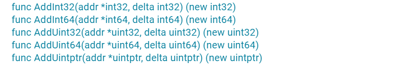
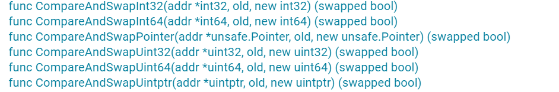
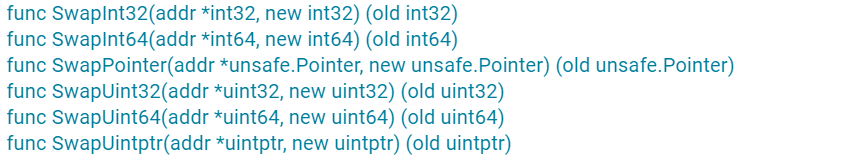
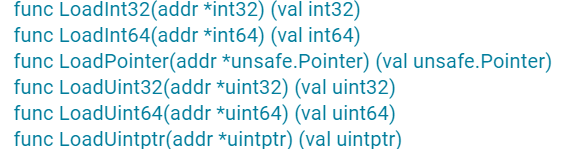
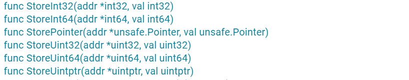
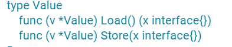

# 12 | atomic
前面在学习Mutex、RWMutex等并发原语的实现时，最底层是通过atomic包中的一些原子操作来实现的。这些并发原语已经可以应对大多数的并发场景了，为啥还要学习原子操作呢？其实，这是因为，在很多场景中，使用并发原语实现起来比较复杂，而原子操作可以帮助我们更轻松地实现底层的优化。

所以，现在带你仔细地了解一下什么是原子操作。

# 原子操作的基础知识

CPU提供了基础的原子操作，不过，不同架构的原子操作是不一样的。

对于单处理器单核系统来说，如果一个操作是由一个CPU指令来实现的，那么它就是原子操作，比如XCHG和INC等指令。

在多处理器多核系统中，原子操作的实现就比较复杂了。

由于cache的存在，单个核上的单个指令进行原子操作的时候，你要确保其它处理器或者核不访问此原子操作的地址，或者是确保其它处理器或者核总是访问原子操作之后的最新的值。x86架构中提供了指令前缀LOCK，LOCK保证了指令不会受其它处理器或CPU核的影响，有些指令（比如XCHG）本身就提供Lock的机制。不同的CPU架构提供的原子操作指令的方式也是不同的，比如对于多核的MIPS和ARM，提供了LL/SC（Load Link/Store Conditional）指令，可以帮助实现原子操作。

**因为不同的CPU架构甚至不同的版本提供的原子操作的指令是不同的，所以，要用一种编程语言实现支持不同架构的原子操作是相当有难度的**。不过，还好这些都不需要你操心，因为Go提供了一个通用的原子操作API，将更底层的不同架构下的实现封装成 atomic 包。

# atomic原子操作的应用场景

举个例子：假设你想在程序中使用一个标志（flag，一个bool类型的变量），来标识一个定时任务是否已经启动执行了，你会怎么做呢？

我们先来看看加锁的函数。如果使用Mutex和RWMutex，在读取和设置这个标志的时候加锁，是可以做到互斥的、保证同一时刻只有一个定时任务在执行的，所以使用Mutex或者RWMutex是一种解决方案。

其实，这个场景中的问题不涉及到对资源复杂的竞争逻辑，只是会并发地读写这个标志，这类场景就适合使用atomic。具体怎么做呢？你可以使用一个uint32类型的变量，如果这个变量的值是0，就标识没有任务在执行，如果它的值是1，就标识已经有任务在完成了。你看，是不是很简单呢？

atomic原子操作还是实现 lock-free 数据结构的基石。

在实现 lock-free 的数据结构时，我们可以不使用互斥锁，这样就不会让协程因为等待互斥锁而阻塞休眠，而是让协程保持继续处理的状态。另外，不使用互斥锁的话，lock-free 的数据结构还具有更高的并发性能。

# atomic提供的函数

atomic为了支持int32、int64、uint32、uint64、uintptr、Pointer（Add函数不支持）类型，分别提供了AddXXX、CompareAndSwapXXX、SwapXXX、LoadXXX、StoreXXX等函数。不过，你也不要担心，你只要记住了一种数据类型的函数的意义，其它数据类型的函数也是一样的。

关于atomic，还有一个地方你一定要记住， **atomic操作的对象是一个地址，你需要把可寻址的变量的地址作为参数传递给函数，而不是把变量的值传递给函数**。

好了，下面我就来给你介绍一下atomic提供的函数。

## Add

首先，我们来看Add函数的签名：



其实，Add函数就是给第一个参数地址中的值增加一个delta值。

对于有符号的整数来说，delta可以是一个负数，相当于减去一个值。对于无符号的整数和uinptr类型来说，怎么实现减去一个值呢？毕竟，atomic并没有提供单独的减法操作。

我来跟你说一种函数。你可以利用计算机补码的规则，把减法变成加法。以uint32类型为例：

```
AddUint32(&x, ^uint32(c-1))
```

如果是对uint64的值进行操作，那么，就把上面的代码中的uint32替换成uint64。

尤其是减1这种特殊的操作，我们可以简化为：

```
AddUint32(&x, ^uint32(0))
```


## CAS （CompareAndSwap）

以 int32 为例，我们学习一下CAS提供的功能。在CAS的函数签名中，需要提供要操作的地址、原数据值、新值，如下所示：

```go
func CompareAndSwapInt32(addr *int32, old, new int32) (swapped bool)
```

这个函数会比较当前 addr 地址里的值是不是 old，如果不等于 old，就返回 false；如果等于 old，就把此地址的值替换成 new 值，返回 true。这就相当于“判断相等才替换”。

它支持的类型和函数如图所示：



## Swap

如果不需要比较旧值，只是比较粗暴地替换的话，就可以使用Swap函数，它替换后还可以返回旧值。

它支持的数据类型和函数如图所示：



## Load

Load 函数会取出 addr 地址中的值，即使在多处理器、多核、有CPU cache的情况下，这个操作也能保证 Load 是一个原子操作。

它支持的数据类型和函数如图所示：



## Store

Store 函数会把一个值存入到指定的 addr 地址中，即使在多处理器、多核、有CPU cache的情况下，这个操作也能保证Store 是一个原子操作。别的 goroutine 通过 Load 读取出来，不会看到存取了一半的值。

它支持的数据类型和函数如图所示：



## Value

刚刚说的都是一些比较常见的类型，其实，atomic 还提供了一个特殊的类型：Value。它可以原子地存取对象类型，但也只能存取，不能 CAS 和 Swap（Go1.21版本中增加了CAS与Swap），常常用在配置变更等场景中。



# Value原理

`Mutex`由**操作系统**实现，而`atomic`包中的原子操作则由**底层硬件**直接提供支持。在 CPU 实现的指令集里，有一些指令被封装进了`atomic`包，这些指令在执行的过程中是不允许中断（interrupt）的，因此原子操作可以在`lock-free`的情况下保证并发安全。

## 源码剖析

```go
package atomic

import (
	"unsafe"
)

// A Value provides an atomic load and store of a consistently typed value.
// The zero value for a Value returns nil from Load.
// Once Store has been called, a Value must not be copied.
//
// A Value must not be copied after first use.
type Value struct {
	v any
}

// efaceWords is interface{} internal representation.
type efaceWords struct {
	typ  unsafe.Pointer
	data unsafe.Pointer
}

// Load returns the value set by the most recent Store.
// It returns nil if there has been no call to Store for this Value.
func (v *Value) Load() (val any) {
	vp := (*efaceWords)(unsafe.Pointer(v))
	typ := LoadPointer(&vp.typ)
	if typ == nil || typ == unsafe.Pointer(&firstStoreInProgress) {
		// First store not yet completed.
		return nil
	}
	data := LoadPointer(&vp.data)
	vlp := (*efaceWords)(unsafe.Pointer(&val))
	vlp.typ = typ
	vlp.data = data
	return
}

// 使用firstStoreInProgress是为了在第一次存储过程中提供一个中间状态
var firstStoreInProgress byte

// Swap stores new into Value and returns the previous value. It returns nil if
// the Value is empty.
//
// All calls to Swap for a given Value must use values of the same concrete
// type. Swap of an inconsistent type panics, as does Swap(nil).
func (v *Value) Swap(new any) (old any) {
	if new == nil {
		panic("sync/atomic: swap of nil value into Value")
	}
	vp := (*efaceWords)(unsafe.Pointer(v))
	np := (*efaceWords)(unsafe.Pointer(&new))
	for {
		typ := LoadPointer(&vp.typ)
		if typ == nil {
			// Attempt to start first store.
			// Disable preemption so that other goroutines can use
			// active spin wait to wait for completion; and so that
			// GC does not see the fake type accidentally.
			runtime_procPin()
			if !CompareAndSwapPointer(&vp.typ, nil, unsafe.Pointer(&firstStoreInProgress)) {
				runtime_procUnpin()
				continue
			}
			// Complete first store.
			StorePointer(&vp.data, np.data)
			StorePointer(&vp.typ, np.typ)
			runtime_procUnpin()
			return nil
		}
		if typ == unsafe.Pointer(&firstStoreInProgress) {
			// First store in progress. Wait.
			// Since we disable preemption around the first store,
			// we can wait with active spinning.
			continue
		}
		// First store completed. Check type and overwrite data.
		if typ != np.typ {
			panic("sync/atomic: swap of inconsistently typed value into Value")
		}
		op := (*efaceWords)(unsafe.Pointer(&old))
		op.typ, op.data = np.typ, SwapPointer(&vp.data, np.data)
		return old
	}
}

// CompareAndSwap executes the compare-and-swap operation for the Value.
//
// All calls to CompareAndSwap for a given Value must use values of the same
// concrete type. CompareAndSwap of an inconsistent type panics, as does
// CompareAndSwap(old, nil).
func (v *Value) CompareAndSwap(old, new any) (swapped bool) {
	if new == nil {
		panic("sync/atomic: compare and swap of nil value into Value")
	}
	vp := (*efaceWords)(unsafe.Pointer(v))
	np := (*efaceWords)(unsafe.Pointer(&new))
	op := (*efaceWords)(unsafe.Pointer(&old))
	if op.typ != nil && np.typ != op.typ {
		panic("sync/atomic: compare and swap of inconsistently typed values")
	}
	for {
		typ := LoadPointer(&vp.typ)
		if typ == nil {
			if old != nil {
				return false
			}
			// Attempt to start first store.
			// Disable preemption so that other goroutines can use
			// active spin wait to wait for completion; and so that
			// GC does not see the fake type accidentally.
			runtime_procPin()
			if !CompareAndSwapPointer(&vp.typ, nil, unsafe.Pointer(&firstStoreInProgress)) {
				runtime_procUnpin()
				continue
			}
			// Complete first store.
			StorePointer(&vp.data, np.data)
			StorePointer(&vp.typ, np.typ)
			runtime_procUnpin()
			return true
		}
		if typ == unsafe.Pointer(&firstStoreInProgress) {
			// First store in progress. Wait.
			// Since we disable preemption around the first store,
			// we can wait with active spinning.
			continue
		}
		// First store completed. Check type and overwrite data.
		if typ != np.typ {
			panic("sync/atomic: compare and swap of inconsistently typed value into Value")
		}
		// Compare old and current via runtime equality check.
		// This allows value types to be compared, something
		// not offered by the package functions.
		// CompareAndSwapPointer below only ensures vp.data
		// has not changed since LoadPointer.
		data := LoadPointer(&vp.data)
		var i any
		(*efaceWords)(unsafe.Pointer(&i)).typ = typ
		(*efaceWords)(unsafe.Pointer(&i)).data = data
		if i != old {
			return false
		}
		return CompareAndSwapPointer(&vp.data, data, np.data)
	}
}

// 在Go的运行时中，runtime_procPin()和runtime_procUnpin()这两个函数分别用于“禁止”和“恢复”当前Goroutine的抢占调度（preemption）。
// Disable/enable preemption, implemented in runtime.
func runtime_procPin() int
func runtime_procUnpin()

```


### Store方法详解

```go
// Store sets the value of the Value v to val.
// All calls to Store for a given Value must use values of the same concrete type.
// Store of an inconsistent type panics, as does Store(nil).
// 如果两次Store的类型不同将会 panic
// 如果写入nil，也会 panic
func (v *Value) Store(val any) {
	if val == nil {
		panic("sync/atomic: store of nil value into Value")
	}
	vp := (*efaceWords)(unsafe.Pointer(v)) // Old value
	vlp := (*efaceWords)(unsafe.Pointer(&val)) // New value
	for {
        // 通过LoadPointer这个原子操作拿到当前Value中存储的类型。下面根据这个类型的不同，分3种情况处理。
		typ := LoadPointer(&vp.typ)
        // 一个Value实例被初始化后，它的typ字段会被设置为指针的零值nil，所以先判断如果typ是nil 那就证明这个Value还未被写入过数据。
		if typ == nil {
			// Attempt to start first store.
			// Disable preemption so that other goroutines can use
			// active spin wait to wait for completion.
            // 禁止抢占当前 Goroutine
			runtime_procPin()
			if !CompareAndSwapPointer(&vp.typ, nil, unsafe.Pointer(&firstStoreInProgress)) {
				runtime_procUnpin()
				continue
			}
			// Complete first store.
			StorePointer(&vp.data, vlp.data)
			StorePointer(&vp.typ, vlp.typ)
			runtime_procUnpin()
			return
		}
		if typ == unsafe.Pointer(&firstStoreInProgress) {
			// First store in progress. Wait.
			// Since we disable preemption around the first store,
			// we can wait with active spinning.
			continue
		}
		// First store completed. Check type and overwrite data.
        // 第一次存储完成，检查上传写入的类型与这次要写入的类型是否一致，如果不一致则抛出异常
		if typ != vlp.typ {
			panic("sync/atomic: store of inconsistently typed value into Value")
		}
        // 如果类型一致，则直接把这次要写入的值赋值到data字段
		StorePointer(&vp.data, vlp.data)
		return
	} // for
}
```

第一次存储时，需要同时设置类型指针（`typ`）和数据指针（`data`），这是一个两步操作，而这两个操作必须是原子性的。为了保证第一次存储的原子性，代码使用了一个标志：`firstStoreInProgress`。它是一个全局变量，类型为`byte`（占用1个字节，所以它的地址可以作为一个唯一的标识）。

在`Store`方法中：

1. 首先检查如果`typ`为 nil，意味着还没有任何存储操作完成（可能是第一次存储，也可能其他 goroutine 正在第一次存储）。
2. 如果 `typ` 为 nil，当前 goroutine 会尝试通过 CAS（CompareAndSwap）操作将 `typ` 从 nil 设置为`unsafe.Pointer(&firstStoreInProgress)`。这个标志表示第一次存储正在进行中。
   - 在 CAS 之前，调用了`runtime_procPin()`，这个函数的作用是禁止当前 goroutine 被抢占（preemption）。这样做的目的是为了确保在第一次存储的过程中，当前 goroutine 不会被挂起，从而避免其他 goroutine 长时间等待（因为第一次存储的完成需要当前 goroutine 来完成）。
   - 如果 CAS 成功，那么当前 goroutine 就获得了完成第一次存储的权利，然后会设置`vp.data`和`vp.typ`（注意顺序：先设置 data，然后设置 typ）。最后解除抢占禁止（`runtime_procUnpin()`）。
   - 如果 CAS 失败（意味着有别的 goroutine 已经抢先进入了第一次存储），那么当前 goroutine 会解除抢占禁止，然后重新循环（等待）。
3. 在循环中，如果检测到`typ`等于`unsafe.Pointer(&firstStoreInProgress)`，说明当前有另一个 goroutine 正在进行第一次存储，因此当前 goroutine 需要等待（通过 `continue` 重新循环）。由于持有第一次存储的 goroutine 禁用了抢占，所以它不会被挂起，可以很快完成第一次存储。因此，等待是通过 active spinning（主动循环）进行的。

那么为什么使用一个全局变量`firstStoreInProgress`的地址呢？

- 我们需要一个非 nil 的唯一标识，用来表示第一次存储正在进行中。使用一个全局变量的地址可以保证这个标识的唯一性（在整个程序运行期间，这个变量的地址是唯一的）。
- 这个标识的作用是临时占用`typ`字段，告诉其他 goroutine：第一次存储正在进行，请等待。当第一次存储完成时，`typ`会被替换成实际存储值的类型指针。


通过禁止抢占，我们可以让这个存储过程尽快完成，从而减少其他等待的Goroutine自旋的时间。

注意：虽然禁止抢占可以减少第一次存储操作期间的延迟，但它也会增加当前Goroutine长时间占用M（Machine，系统线程）的风险。因此，这两个函数之间的代码必须尽可能快地执行，不能有任何阻塞调用，也不能执行耗时操作。

在Go语言中，一般只有在非常关键的短时间操作中才会使用`runtime_procPin()`，以避免影响调度和GC。

## 抢占调度

在Go语言中，调度器负责将多个Goroutine调度到系统线程（由调度器管理的线程，通常称为M）上运行。Go 语言的并发模型建立在轻量级线程 Goroutine 之上。高效的 Goroutine 调度是 Go 高性能并发的关键。其中，**抢占机制**（Preemption）允许调度器强制中断正在运行的 Goroutine，将 CPU 时间片让给其他 Goroutine 或执行关键系统任务（如 GC），这对于保证公平性、响应性和系统稳定性至关重要。Go 的抢占机制经历了三个显著的演进阶段。

### Go 调度机制的演进

1、非抢占式阶段（Go 1.2 之前）

- 核心机制： 调度器完全依赖 Goroutine 的主动协作。一个 Goroutine 只有在以下情况发生时才会让出 CPU：
  - 执行了一个函数调用（因为函数调用会检查栈增长，有机会进入调度逻辑）。
  - 显式调用了 `runtime.Gosched()`。
  - 遇到了阻塞操作（如 Channel 操作、系统调用、锁等待）。
- 核心问题：
  - CPU 时间片垄断： 如果一个 Goroutine 在执行一个不包含函数调用、阻塞操作且不调用 `Gosched()`的紧密循环（例如 `for {}`），它将永久占据当前线程（M），导致绑定在同一线程上的其他 Goroutine 完全得不到执行机会（饥饿）。这破坏了调度的公平性。
  - 垃圾回收 (GC) 延迟高： GC 需要在一个 Stop-The-World (STW) 的阶段暂停所有用户 Goroutine 的执行。在非抢占式调度下，调度器必须等待每个 Goroutine 主动让出 CPU 或进入安全点才能暂停它。如果一个 Goroutine 卡在了一个长循环中，整个 GC STW 阶段会被严重延迟，导致应用停顿时间（Latency）显著增加，影响用户体验和系统实时性。


2、协作式抢占（Go 1.2–1.13）

- 核心机制：
  - 抢占请求标记： Go 运行时（runtime）引入了一个关键的机制。调度器（特别是 `sysmon`监控线程）会检测运行时间过长的 Goroutine（约 10ms）。当发现这样的 G 时，它会设置该 Goroutine 的 `stackguard0`字段为一个特殊的抢占请求值（例如 `stackPreempt`）。
  - 抢占检查点： Go 编译器在函数调用的入口处自动插入代码（主要是调用 `runtime.morestack`或其变种）。这段代码的一个重要职责就是检查 `stackguard0`的值。
  - 协作式响应： 当插入的检查代码发现 `stackguard0`被设置为抢占请求值时，它不会执行常规的栈增长操作，而是主动让出 CPU。它会把当前 Goroutine 的状态保存好，然后调用调度器 (`runtime.schedule`)，让调度器有机会选择另一个 Goroutine 在当前线程上运行。
- 优势：
  - 解决了部分长循环问题： 只要循环体内包含函数调用，就有机会在函数入口处检查到抢占请求并让出 CPU。
  - 降低了 GC STW 延迟： GC 在发起 STW 时，可以给所有 Goroutine 设置抢占标记。那些很快会进入函数调用的 Goroutine 能相对及时地响应暂停请求，使得 STW 的等待时间比纯非抢占式调度短得多。
- 局限性：
  - 依赖函数调用： 这是最根本的局限。如果一段代码执行时间很长，但内部没有任何函数调用（例如一个包含大量内联操作或纯算术的紧密循环），编译器插入的检查点就没有机会被执行。抢占请求虽然被设置了，但依然会持续占用 CPU。
  - 非即时性： 即使有函数调用，抢占也发生在函数入口处，从设置抢占标记到 Goroutine 实际让出 CPU 之间仍然存在延迟（需要等到下一次函数调用）。
- 总结： 协作式抢占是 Go 调度器演进的重要一步，通过编译器与运行时的配合，在函数调用点引入抢占检查，有效解决了大部分长循环导致的调度问题，并显著改善了 GC 性能。但它无法根治无函数调用长循环这一顽疾。


3、非协作式抢占 / 基于信号的异步抢占 (Go 1.14+)

- 核心机制：

  - 监控与触发： `sysmon`监控线程依然负责检测运行时间过长的 Goroutine（通常 >10ms）。
  - 信号发送： 当发现需要抢占一个 G 时，`sysmon`会向承载该 G 的线程 (M) 发送一个特殊的 POSIX 信号：`SIGURG`。选择 `SIGURG`是因为它在 Go 运行时之外很少被使用。
  - 信号处理： 每个运行 Go 代码的线程（M）在初始化时都注册了同一个信号处理函数（`sighandler`）。当线程收到 `SIGURG`信号时，无论它当前正在执行什么用户代码（即使在那个无函数调用的循环内部），操作系统都会立即中断其执行，并将控制权强制交给这个信号处理函数。
  - 异步上下文切换： 信号处理函数并非直接进行调度。它的关键作用是：
    1. 判断目标： 确认信号是运行时发送的抢占请求（而非其他来源）。
    2. 保存现场： 将当前 Goroutine 的寄存器状态（PC, SP等）安全地保存到其栈上或一个特殊结构中。
    3. 注入调用： 篡改被中断 Goroutine 保存的上下文（特别是程序计数器 PC），使其看起来像是“即将”调用一个特殊的运行时函数 `runtime.asyncPreempt`。
  - 执行抢占： 当信号处理函数返回，操作系统恢复被中断线程的执行时，由于上下文被篡改，线程不会回到原来的循环代码，而是开始执行 `runtime.asyncPreempt`函数。这个函数负责完成抢占的后续工作：
    - 保存 Goroutine 更完整的执行状态。
    - 调用调度器 (`runtime.schedule`)，让出当前线程。
    - 被抢占的 G 会被放回运行队列，等待下次被调度。

- 优势：

  - 根治无函数调用循环饥饿： 这是最显著的突破。即使 Goroutine 在执行一个没有任何函数调用的 `for {}`循环，`sysmon`也能通过发送信号强制中断它，让其他 Goroutine 获得执行机会。
  - 更低的 GC STW 延迟： GC 在 STW 阶段可以更可靠、更快速地暂停所有用户 Goroutine，因为不再依赖它们执行到函数调用点。这直接降低了 GC 的最大停顿时间 (P99 Latency)，提升了应用的响应性，尤其对延迟敏感型应用（如游戏、实时系统）至关重要。
  - 提升调度公平性： 确保没有 Goroutine 能长时间独占 CPU，系统整体响应更及时。

- 关键实现细节与保障：

  - 安全点检查： 抢占不能发生在任意时刻。信号处理函数在执行关键的篡改上下文操作前，必须检查当前被中断的代码位置是否位于一个安全点。例如：

    - 原子操作执行中： 如果线程正在执行一个原子操作的中间指令，强制中断可能导致数据不一致或破坏原子性。

    - 运行时关键非抢占区域： 运行时自身的一些关键代码路径（如内存分配器、GC 自身的某些阶段）会短暂禁用抢占。

    - 信号处理本身： 避免重入。

  - 最小抢占间隔： 为了避免过于频繁的抢占（例如，一个 G 刚被抢占后很快又被调度到，然后很快又被抢占）导致的性能开销甚至“活锁”（Goroutine 不断被抢占而无法完成有效工作），运行时设置了最小抢占间隔。`sysmon`不会在短时间内对同一个 G 重复发送抢占信号。

  - 寄存器状态保存： 需要精确保存和恢复被中断点的所有寄存器状态，确保抢占操作对用户代码透明，就像在某个点发生了函数调用一样（虽然实际是异步插入的）。

- 总结： 基于信号的异步抢占是 Go 调度器的一次革命性升级。它突破了协作式抢占对函数调用的依赖，利用操作系统信号机制实现了真正的强制中断能力。这极大地提高了 Go 调度器在应对复杂、任意用户代码时的鲁棒性、公平性和响应能力，特别是显著降低了 GC 的最大暂停时间，是 Go 成为高性能、低延迟系统开发语言的重要基石。


## runtime_procPin与runtime_procUnpin

在Go的运行时中，`runtime_procPin()`和`runtime_procUnpin()`这两个函数分别用于“禁止”和“恢复”当前Goroutine的抢占调度（preemption）。

`runtime_procPin()`：

- 这个函数会将当前Goroutine“钉”在当前的P（Processor，Go调度器中的一个概念）上，从而禁止被抢占（preemption）。
- 调用这个函数后，当前Goroutine会一直运行，不会被调度器挂起，除非它主动让出（比如调用某个阻塞函数）或者已经完成。
- 在这个状态下，GC也会被延迟执行（因为GC需要STW（stop the world）），所以需要谨慎使用，避免长时间占用。

`runtime_procUnpin()`：这个函数与`runtime_procPin()`相反，它会释放之前设置的“钉住”状态，允许当前Goroutine被抢占。

# 第三方库的扩展

其实，atomic的API已经算是很简单的了，它提供了包一级的函数，可以对几种类型的数据执行原子操作。

不过有一点让人觉得不爽的是，或者是让熟悉面向对象编程的程序员不爽的是，函数调用有一点点麻烦。所以，有些人就对这些函数做了进一步的包装，跟atomic中的Value类型类似，这些类型也提供了面向对象的使用方式，比如关注度比较高的 [uber-go/atomic](https://github.com/uber-go/atomic)，它定义和封装了几种与常见类型相对应的原子操作类型，这些类型提供了原子操作的函数。这些类型包括Bool、Duration、Error、Float64、Int32、Int64、String、Uint32、Uint64等。

比如Bool类型，提供了CAS、Store、Swap、Toggle等原子函数，还提供String、MarshalJSON、UnmarshalJSON等辅助函数，确实是一个精心设计的atomic扩展库。关于这些函数，你一看名字就能猜出来它们的功能，我就不多说了。

其它的数据类型也和Bool类型相似，使用起来就像面向对象的编程一样，你可以看下下面的这段代码。

```go
    var running atomic.Bool
    running.Store(true)
    running.Toggle()
    fmt.Println(running.Load()) // false
```

# 使用atomic实现Lock-Free queue

atomic常常用来实现Lock-Free的数据结构，这次我会给你展示一个Lock-Free queue的实现。

Lock-Free queue最出名的就是 Maged M. Michael 和 Michael L. Scott 1996年发表的 [论文](https://www.cs.rochester.edu/u/scott/papers/1996_PODC_queues.pdf) 中的算法，算法比较简单，容易实现，伪代码的每一行都提供了注释，我就不在这里贴出伪代码了，因为我们使用Go实现这个数据结构的代码几乎和伪代码一样：

```go
package queue
import (
	"sync/atomic"
	"unsafe"
)
// lock-free的queue
type LKQueue struct {
	head unsafe.Pointer
	tail unsafe.Pointer
}
// 通过链表实现，这个数据结构代表链表中的节点
type node struct {
	value interface{}
	next  unsafe.Pointer
}
func NewLKQueue() *LKQueue {
	n := unsafe.Pointer(&node{})
	return &LKQueue{head: n, tail: n}
}
// 入队
func (q *LKQueue) Enqueue(v interface{}) {
	n := &node{value: v}
	for {
		tail := load(&q.tail)
		next := load(&tail.next)
		if tail == load(&q.tail) { // 尾还是尾
			if next == nil { // 还没有新数据入队
				if cas(&tail.next, next, n) { //增加到队尾
					cas(&q.tail, tail, n) //入队成功，移动尾巴指针
					return
				}
			} else { // 已有新数据加到队列后面，需要移动尾指针
				cas(&q.tail, tail, next)
			}
		}
	}
}
// 出队，没有元素则返回nil
func (q *LKQueue) Dequeue() interface{} {
	for {
		head := load(&q.head)
		tail := load(&q.tail)
		next := load(&head.next)
		if head == load(&q.head) { // head还是那个head
			if head == tail { // head和tail一样
				if next == nil { // 说明是空队列
					return nil
				}
				// 只是尾指针还没有调整，尝试调整它指向下一个
				cas(&q.tail, tail, next)
			} else {
				// 读取出队的数据
				v := next.value
                // 既然要出队了，头指针移动到下一个
				if cas(&q.head, head, next) {
					return v // Dequeue is done.  return
				}
			}
		}
	}
}

// 将unsafe.Pointer原子加载转换成node
func load(p *unsafe.Pointer) (n *node) {
	return (*node)(atomic.LoadPointer(p))
}

// 封装CAS,避免直接将*node转换成unsafe.Pointer
func cas(p *unsafe.Pointer, old, new *node) (ok bool) {
	return atomic.CompareAndSwapPointer(
		p, unsafe.Pointer(old), unsafe.Pointer(new))
}
```

我来给你介绍下这里的主要逻辑。

这个lock-free的实现使用了一个辅助头指针（head），头指针不包含有意义的数据，只是一个辅助的节点，这样的话，出队入队中的节点会更简单。

入队的时候，通过CAS操作将一个元素添加到队尾，并且移动尾指针。

出队的时候移除一个节点，并通过CAS操作移动head指针，同时在必要的时候移动尾指针。
