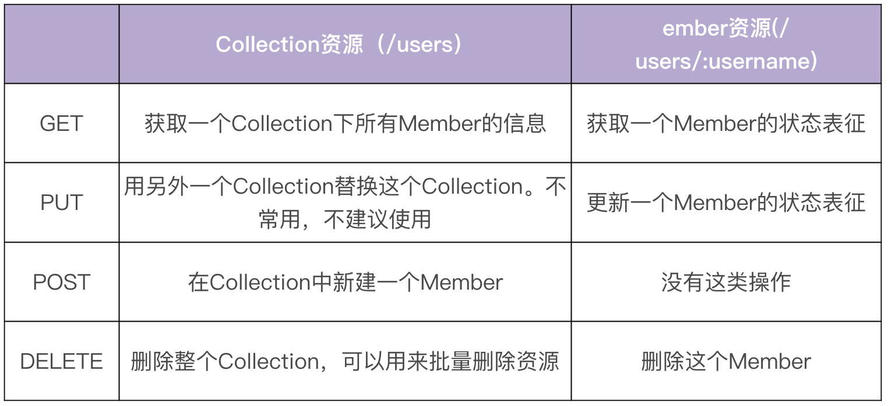

# 12 | API 风格（上）：如何设计RESTful API？

你好，我是孔令飞。从今天开始，我们就要进入实战第二站，开始学习如何设计和开发Go项目开发中的基础功能了。接下来两讲，我们一起来看下如何设计应用的API风格。

绝大部分的Go后端服务需要编写API接口，对外提供服务。所以在开发之前，我们需要确定一种API风格。API风格也可以理解为API类型，目前业界常用的API风格有三种：REST、RPC和GraphQL。我们需要根据项目需求，并结合API风格的特点，确定使用哪种API风格，这对以后的编码实现、通信方式和通信效率都有很大的影响。

在Go项目开发中，用得最多的是REST和RPC，我们在IAM实战项目中也使用了REST和RPC来构建示例项目。接下来的两讲，我会详细介绍下REST和RPC这两种风格，如果你对GraphQL感兴趣， [GraphQL中文官网](https://graphql.cn/) 有很多文档和代码示例，你可以自行学习。

这一讲，我们先来看下RESTful API风格设计，下一讲再介绍下RPC API风格。

## RESTful API介绍

在回答“RESTful API是什么”之前，我们先来看下REST是什么意思：REST代表的是表现层状态转移（REpresentational State Transfer），由Roy Fielding在他的论文 [《Architectural Styles and the Design of Network-based Software Architectures》](https://www.ics.uci.edu/~fielding/pubs/dissertation/top.htm) 里提出。REST本身并没有创造新的技术、组件或服务，它只是一种软件架构风格，是一组架构约束条件和原则，而不是技术框架。

**REST有一系列规范，满足这些规范的API均可称为RESTful API**。REST规范把所有内容都视为资源，也就是说网络上一切皆资源。REST架构对资源的操作包括获取、创建、修改和删除，这些操作正好对应HTTP协议提供的GET、POST、PUT和DELETE方法。HTTP动词与 REST风格CRUD的对应关系见下表：


REST风格虽然适用于很多传输协议，但在实际开发中，由于REST天生和HTTP协议相辅相成，因此HTTP协议已经成了实现RESTful API事实上的标准。所以，REST具有以下核心特点：

- 以资源(resource)为中心，所有的东西都抽象成资源，所有的行为都应该是在资源上的CRUD操作。

  - 资源对应着面向对象范式里的对象，面向对象范式以对象为中心。
  - 资源使用URI标识，每个资源实例都有一个唯一的URI标识。例如，如果我们有一个用户，用户名是admin，那么它的URI标识就可以是/users/admin。
- 资源是有状态的，使用JSON/XML等在HTTP Body里表征资源的状态。
- 客户端通过四个HTTP动词，对服务器端资源进行操作，实现“表现层状态转化”。
- 无状态，这里的无状态是指每个RESTful API请求都包含了所有足够完成本次操作的信息，服务器端无须保持session。无状态对于服务端的弹性扩容是很重要的。

因为怕你弄混概念，这里强调下REST和RESTful API的区别： **REST是一种规范，而RESTful API则是满足这种规范的API接口。**

## RESTful API设计原则

上面我们说了，RESTful API就是满足REST规范的API，由此看来，RESTful API的核心是规范，那么具体有哪些规范呢？

接下来，我就从URI设计、API版本管理等七个方面，给你详细介绍下RESTful API的设计原则，然后再通过一个示例来帮助你快速启动一个RESTful API服务。希望你学完这一讲之后，对如何设计RESTful API有一个清楚的认知。

### URI设计

资源都是使用URI标识的，我们应该按照一定的规范来设计URI，通过规范化可以使我们的API接口更加易读、易用。以下是URI设计时，应该遵循的一些规范：

- 资源名使用名词而不是动词，并且用名词复数表示。资源分为Collection和Member两种。

  - Collection：一堆资源的集合。例如我们系统里有很多用户（User）,这些用户的集合就是Collection。Collection的URI标识应该是 `域名/资源名复数`, 例如 `https:// iam.api.marmotedu.com/users`。
  - Member：单个特定资源。例如系统中特定名字的用户，就是Collection里的一个Member。Member的URI标识应该是 `域名/资源名复数/资源名称`, 例如 `https:// iam.api.marmotedu/users/admin`。
- URI结尾不应包含 `/`。
- URI中不能出现下划线 `_`，必须用中杠线 `-` 代替（有些人推荐用 `_`，有些人推荐用 `-`，统一使用一种格式即可，我比较推荐用 `-`）。
- URI路径用小写，不要用大写。
- 避免层级过深的URI。超过2层的资源嵌套会很乱，建议将其他资源转化为 `?` 参数，比如：

```shell
/schools/tsinghua/classes/rooma/students/zhang # 不推荐
/students?school=qinghua&class=rooma # 推荐
```

这里有个地方需要注意：在实际的API开发中，可能你会发现有些操作不能很好地映射为一个REST资源，这时候，你可以参考下面的做法。

- 将一个操作变成资源的一个属性，比如想在系统中暂时禁用某个用户，可以这么设计URI： `/users/zhangsan?active=false`。
- 将操作当作是一个资源的嵌套资源，比如一个GitHub的加星操作：

```shell
PUT /gists/:id/star # github star action
DELETE /gists/:id/star # github unstar action
```

- 如果以上都不能解决问题，有时可以打破这类规范。比如登录操作，登录不属于任何一个资源，URI可以设计为：/login。

在设计URI时，如果你遇到一些不确定的地方，推荐你参考 [GitHub标准RESTful API](https://developer.github.com/v3/)。

### REST资源操作映射为HTTP方法

基本上RESTful API都是使用HTTP协议原生的GET、PUT、POST、DELETE来标识对资源的CRUD操作的，形成的规范如下表所示：



对资源的操作应该满足安全性和幂等性：

- 安全性：不会改变资源状态，可以理解为只读的。
- 幂等性：执行1次和执行N次，对资源状态改变的效果是等价的。

使用不同HTTP方法时，资源操作的安全性和幂等性对照见下表：


在使用HTTP方法的时候，有以下两点需要你注意：

- GET返回的结果，要尽量可用于PUT、POST操作中。例如，用GET方法获得了一个user的信息，调用者修改user的邮件，然后将此结果再用PUT方法更新。这要求GET、PUT、POST操作的资源属性是一致的。
- 如果对资源进行状态/属性变更，要用PUT方法，POST方法仅用来创建或者批量删除这两种场景。

在设计API时，经常会有批量删除的需求，需要在请求中携带多个需要删除的资源名，但是HTTP的DELETE方法不能携带多个资源名，这时候可以通过下面三种方式来解决：

- 发起多个DELETE请求。
- 操作路径中带多个id，id之间用分隔符分隔, 例如： `DELETE /users?ids=1,2,3` 。
- 直接使用POST方式来批量删除，body中传入需要删除的资源列表。

其中，第二种是我最推荐的方式，因为使用了匹配的DELETE动词，并且不需要发送多次DELETE请求。

你需要注意的是，这三种方式都有各自的使用场景，你可以根据需要自行选择。如果选择了某一种方式，那么整个项目都需要统一用这种方式。

### 统一的返回格式

一般来说，一个系统的RESTful API会向外界开放多个资源的接口，每个接口的返回格式要保持一致。另外，每个接口都会返回成功和失败两种消息，这两种消息的格式也要保持一致。不然，客户端代码要适配不同接口的返回格式，每个返回格式又要适配成功和失败两种消息格式，会大大增加用户的学习和使用成本。

返回的格式没有强制的标准，你可以根据实际的业务需要返回不同的格式。本专栏 **第19讲** 中会推荐一种返回格式，它也是业界最常用和推荐的返回格式。

### API 版本管理

随着时间的推移、需求的变更，一个API往往满足不了现有的需求，这时候就需要对API进行修改。对API进行修改时，不能影响其他调用系统的正常使用，这就要求API变更做到向下兼容，也就是新老版本共存。

但在实际场景中，很可能会出现同一个API无法向下兼容的情况。这时候最好的解决办法是从一开始就引入API版本机制，当不能向下兼容时，就引入一个新的版本，老的版本则保留原样。这样既能保证服务的可用性和安全性，同时也能满足新需求。

API版本有不同的标识方法，在RESTful API开发中，通常将版本标识放在如下3个位置：

- URL中，比如 `/v1/users`。
- HTTP Header中，比如 `Accept: vnd.example-com.foo+json; version=1.0`。
- Form参数中，比如 `/users?version=v1`。

我们这门课中的版本标识是放在URL中的，比如 `/v1/users`，这样做的好处是很直观，GitHub、Kubernetes、Etcd等很多优秀的API均采用这种方式。

这里要注意，有些开发人员不建议将版本放在URL中，因为他们觉得不同的版本可以理解成同一种资源的不同表现形式，所以应该采用同一个URI。对于这一点，没有严格的标准，根据项目实际需要选择一种方式即可。

### API命名

API通常的命名方式有三种，分别是驼峰命名法(serverAddress)、蛇形命名法(server\_address)和脊柱命名法(server-address)。

驼峰命名法和蛇形命名法都需要切换输入法，会增加操作的复杂性，也容易出错，所以这里建议用脊柱命名法。GitHub API用的就是脊柱命名法，例如 [selected-actions](https://docs.github.com/en/rest/reference/actions#get-allowed-actions-for-an-organization)。

### 统一分页/过滤/排序/搜索功能

REST资源的查询接口，通常情况下都需要实现分页、过滤、排序、搜索功能，因为这些功能是每个REST资源都能用到的，所以可以实现为一个公共的API组件。下面来介绍下这些功能。

- 分页：在列出一个Collection下所有的Member时，应该提供分页功能，例如 `/users?offset=0&limit=20`（limit，指定返回记录的数量；offset，指定返回记录的开始位置）。引入分页功能可以减少API响应的延时，同时可以避免返回太多条目，导致服务器/客户端响应特别慢，甚至导致服务器/客户端crash的情况。
- 过滤：如果用户不需要一个资源的全部状态属性，可以在URI参数里指定返回哪些属性，例如 `/users?fields=email,username,address`。
- 排序：用户很多时候会根据创建时间或者其他因素，列出一个Collection中前100个Member，这时可以在URI参数中指明排序参数，例如 `/users?sort=age,desc`。
- 搜索：当一个资源的Member太多时，用户可能想通过搜索，快速找到所需要的Member，或着想搜下有没有名字为xxx的某类资源，这时候就需要提供搜索功能。搜索建议按模糊匹配来搜索。

### 域名

API的域名设置主要有两种方式：

- `https://marmotedu.com/api`，这种方式适合API将来不会有进一步扩展的情况，比如刚开始marmotedu.com域名下只有一套API系统，未来也只有这一套API系统。
- `https://iam.api.marmotedu.com`，如果marmotedu.com域名下未来会新增另一个系统API，这时候最好的方式是每个系统的API拥有专有的API域名，比如： `storage.api.marmotedu.com`， `network.api.marmotedu.com`。腾讯云的域名就是采用这种方式。

到这里，我们就将REST设计原则中的核心原则讲完了，这里有个需要注意的点：不同公司、不同团队、不同项目可能采取不同的REST设计原则，以上所列的基本上都是大家公认的原则。

REST设计原则中，还有一些原则因为内容比较多，并且可以独立成模块，所以放在后面来讲。比如 RESTful API安全性、状态返回码和认证等。

## REST示例

上面介绍了一些概念和原则，这里我们通过一个“Hello World”程序，来教你用Go快速启动一个RESTful API服务，示例代码存放在 [gopractise-demo/apistyle/ping/main.go](https://github.com/marmotedu/gopractise-demo/blob/main/apistyle/ping/main.go)。

```go
package main

import (
	"log"
	"net/http"
)

func main() {
	http.HandleFunc("/ping", pong)
	log.Println("Starting http server ...")
	log.Fatal(http.ListenAndServe(":50052", nil))
}

func pong(w http.ResponseWriter, r *http.Request) {
	w.Write([]byte("pong"))
}
```

在上面的代码中，我们通过http.HandleFunc，向HTTP服务注册了一个pong handler，在pong handler中，我们编写了真实的业务代码：返回pong字符串。

创建完main.go文件后，在当前目录下执行go run main.go启动HTTP服务，在一个新的Linux终端下发送HTTP请求，进行使用curl命令测试：

```shell
$ curl http://127.0.0.1:50052/ping
pong
```

## 总结

这一讲，我介绍了两种常用API风格中的一种，RESTful API。REST是一种API规范，而RESTful API则是满足这种规范的API接口，RESTful API的核心是规范。

在REST规范中，资源通过URI来标识，资源名使用名词而不是动词，并且用名词复数表示，资源都是分为Collection和Member两种。RESTful API中，分别使用POST、DELETE、PUT、GET来表示REST资源的增删改查，HTTP方法、Collection、Member不同组合会产生不同的操作，具体的映射你可以看下 **REST资源操作映射为HTTP方法** 部分的表格。

为了方便用户使用和理解，每个RESTful API的返回格式、错误和正确消息的返回格式，都应该保持一致。RESTful API需要支持API版本，并且版本应该能够向前兼容，我们可以将版本号放在URL中、HTTP Header中、Form参数中，但这里我建议将版本号放在URL中，例如 `/v1/users`，这种形式比较直观。

另外，我们可以通过脊柱命名法来命名API接口名。对于一个REST资源，其查询接口还应该支持分页/过滤/排序/搜索功能，这些功能可以用同一套机制来实现。 API的域名可以采用 `https://marmotedu.com/api` 和 `https://iam.api.marmotedu.com` 两种格式。

最后，在Go中我们可以使用net/http包来快速启动一个RESTful API服务。

## 课后练习

1. 使用net/http包，快速实现一个RESTful API服务，并实现/hello接口，该接口会返回“Hello World”字符串。
2. 思考一下，RESTful API这种API风格是否能够满足你当前的项目需要，如果不满足，原因是什么？

期待在留言区看到你的思考和答案，也欢迎和我一起探讨关于RESTful API相关的问题，我们下一讲见！
