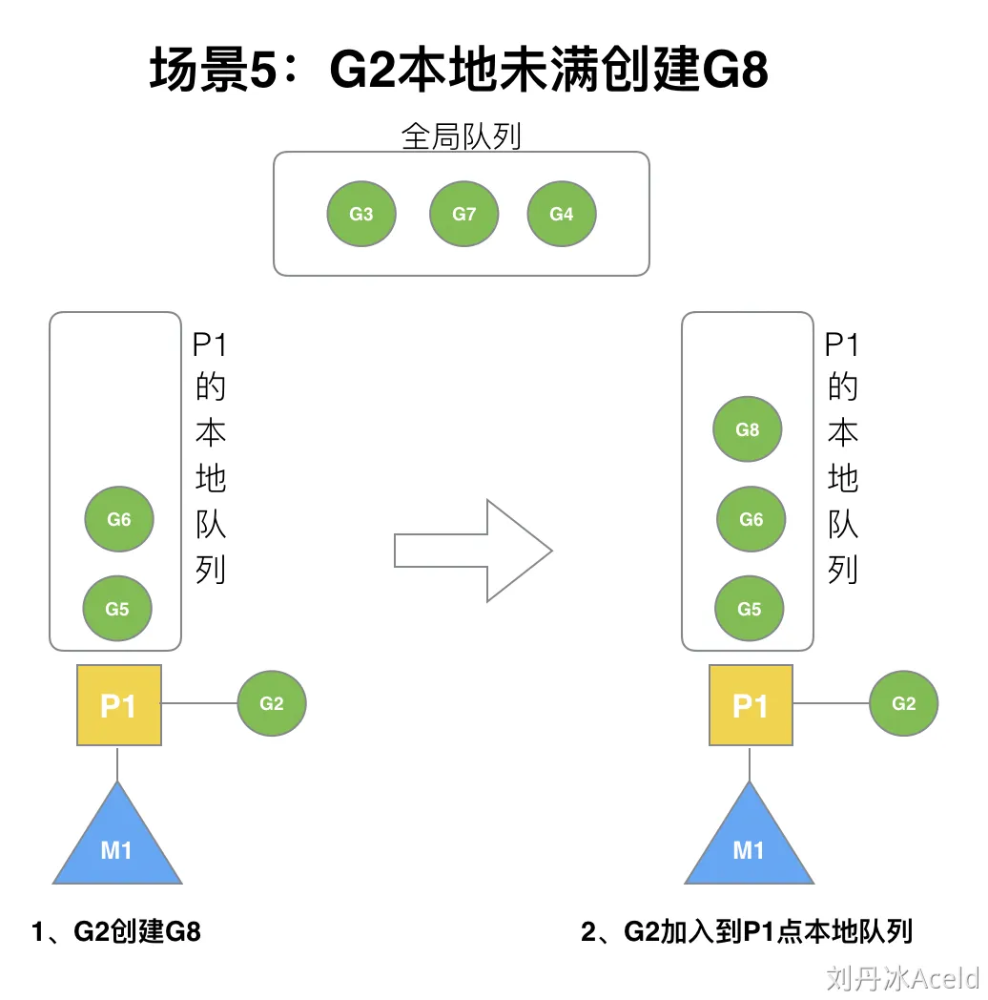
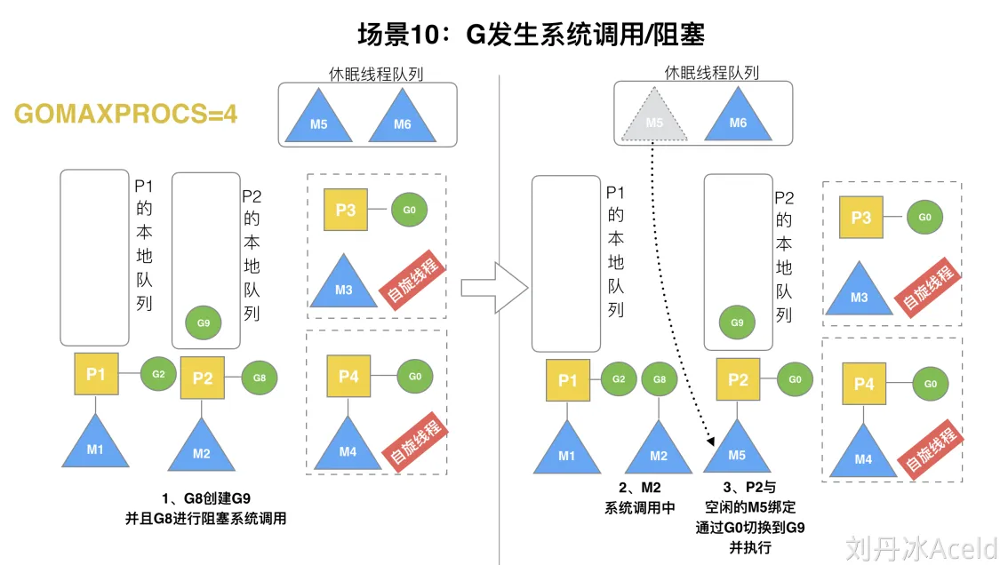
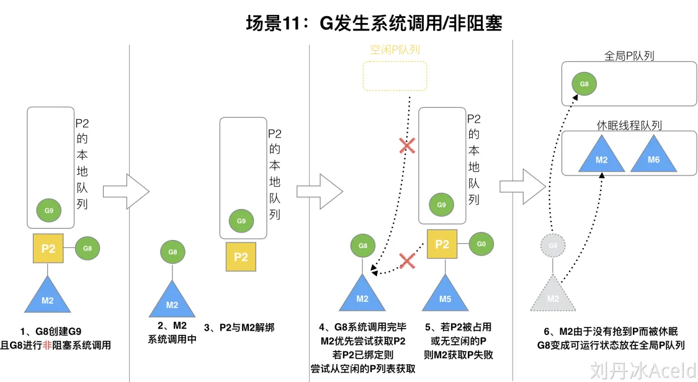

参考资料

> [https://www.cyub.vip/2022/08/20/Golang%E8%B0%83%E5%BA%A6%E6%9C%BA%E5%88%B6%E6%B5%85%E6%9E%90/](https://www.cyub.vip/2022/08/20/Golang调度机制浅析/)
>
> 刘丹冰：https://www.yuque.com/aceld/golang/srxd6d#d8bb8540
>
> 腾讯技术工程：https://zhuanlan.zhihu.com/p/586236582

# 总体概览

GMP模型概览图：


1. Go 调度器的核心思想是：**尽可能复用线程 M**，避免频繁的线程创建和销毁；利用多核并行能力，限制同时运行（不包含阻塞）的 M 线程数等于 CPU 的核数； **Work Stealing 任务窃取机制**，M 可以从其他 M 绑定的 P 的运行队列偷取 G 执行；**Hand Off 交接机制**，为了提高效率，M 阻塞时，会将 M 上 P 的运行队列交给其他 M 执行；**基于协作的抢占机制**，为了保证公平性和防止 Goroutine 饥饿问题，Go 程序会保证每个 G 运行 10ms 就让出 M，交给其他 G 去执行，这个 G 运行 10ms 就让出 M 的机制，是由单独的系统监控线程通过 retake() 函数给当前的 G 发送抢占信号实现的，如果所在的 P ~~没有陷入系统调用且~~没有满，让出的 G 优先进入本地 P 队列，否则进入全局队列；**基于信号的真抢占机制**，Go1.14 引入了基于信号的抢占式调度机制，解决了 GC 垃圾回收和栈扫描时无法被抢占的问题；
2. 由于**数据局部性**，新创建的 G 优先放入本地队列，在本地队列满了时，会将本地队列的一半 G 和新创建的 G 打乱顺序，一起放入全局队列；本地队列如果一直没有满，也不用担心，全局队列的 G 永远会有 1/61 的机会被获取到，调度循环中，优先从本地队列获取 G 执行，不过每隔 61 次，就会直接从全局队列获取，至于为啥是 61 次，Dmitry 的视频讲解了，就是要一个既不大又不小的数，而且不能跟其他常见的 2 的幂次方的数如 64 或 48 重合；
3. M 优先执行其所绑定的 P 的本地运行队列中的 G，如果本地队列没有 G，则会从全局队列获取，为了提高效率和负载均衡，会从全局队列获取多个 G，而不是只取一个，个数是：`globrunqsize / nprocs + 1`；同样，当全局队列没有时，会从其他 M 的 P 上偷取 G 来运行，偷取的个数通常是其他 P 运行队列的一半；
4. G 在运行时中的状态可以简化成三种：等待中\_Gwaiting、可运行\_Grunnable、运行中\_Grunning，运行期间大部分情况是在这三种状态间来回切换；
5. M 的状态可以简化为只有两种：自旋和非自旋；自旋状态，表示 M 绑定了 P 又没有获取 G；非自旋状态，表示正在执行 Go 代码中，或正在进入系统调用，或空闲；
6. P 结构体中最重要的，是持有一个可运行 G 的长度为 256 的本地环形队列，可以通过 CAS 的方式无锁访问，跟需要加锁访问的全局队列 `schedt.runq` 相对应；

# Goroutine调度器的GMP模型的设计思想

## 被废弃的goroutine调度器

Go目前使用的调度器是2012年重新设计的，因为之前的调度器性能存在问题，所以使用4年就被废弃了，那么我们先来分析一下被废弃的调度器是如何运作的？

## GMP模型

Goroutine 调度器和 OS 调度器是通过 M 结合起来的，每个 M 都代表了 1 个内核线程，OS 调度器负责把内核线程分配到 CPU 的核上执行。

## 有关P和M的个数问题

1、P 的数量：

- 由启动时环境变量`$GOMAXPROCS`或者是由`runtime`的方法`GOMAXPROCS()`决定。需要注意的是，这个数量控制的是有多少个操作系统线程（物理线程）可以同时运行Go代码，而不是 goroutine 的数量。goroutine 是轻量级的协程，可以有数以万计的 goroutine 存在，但只有不超过`GOMAXPROCS`数量的 goroutine 能同时被调度到操作系统线程上运行。

2、M 的数量：

- Go语言本身的限制：Go程序启动时，会设置 M 的最大数量，默认10000。但是内核很难支持这么多的线程数，所以这个限制可以忽略。
- `runtime/debug`中的 SetMaxThreads 函数，设置 M 的最大数量。


## 调度器的设计策略

**复用线程(复用M)**：避免频繁的创建、销毁线程，而是对线程的复用。

- work stealing 机制：当本线程无可运行的 G 时，尝试从其他线程绑定的 P 偷取 G，而不是销毁线程。
- hand off 机制：当本线程因为 G 进行系统调用阻塞时，线程释放绑定的 P，把 P 转移给其他空闲的线程执行。

**利用并行**：`GOMAXPROCS`设置 P 的数量，最多有`GOMAXPROCS`个线程分布在多个 CPU 上同时运行。`GOMAXPROCS`也限制了并发的程度，比如`GOMAXPROCS = 核数/2`，则最多利用了一半的 CPU 核进行并行。


## go func() 调度流程


从上图可以分析出几个结论：

1、通过 `go func()` 来创建一个 goroutine；

2、有两种存储 G 的队列，一个是 P 的本地队列、一个是全局队列。新创建的 G 会先保存在 P 的本地队列中，如果 P的本地队列已经满了就会保存在全局的队列中；

3、G 只能运行在 M 中，一个 M 必须持有一个 P，M 与 P 是 1 : 1 的关系。M 会从 P 的本地队列弹出一个可执行状态的 G 来执行。

4、一个 M 调度 G 执行的过程是一个循环机制；

5、当 M 执行某一个 G 时候如果发生了 syscall 或者其余阻塞操作，M 会阻塞，如果当前有一些 G 在 P 中等待执行，runtime 会把这个线程 M 从 P 中摘除(detach)，然后再创建一个新的操作系统线程(如果有空闲的线程可用就复用空闲线程)来服务于这个 P；

6、当 M 系统调用结束时候，这个 G 会尝试获取一个空闲的 P 执行，并放入到这个 P 的本地队列。如果获取不到 P，那么这个线程 M 变成休眠状态， 加入到空闲线程中，然后这个 G 会被放入全局队列中。


## M0 与 G0

`G0`(调度 Goroutine)：

- 定义与作用：`G0`是每个 M（操作系统线程）专属的 goroutine。它不代表用户代码，而是专供调度器本身使用的。
- 创建时机：每当一个 M 被创建时（包括 M0），运行时都会同时为这个 M 创建并绑定一个专属的 `G0`。这个 `G0`与 M 是共生关系，存在于该 M 的整个生命周期。
- 栈：`G0`使用自己的栈空间（大小固定，比普通 Goroutine 栈大得多，如 8KB/64KB vs 2KB，具体实现不同版本有差异）。关键操作运行在 `G0`栈上，包括：
  - 调度工作本身：查找下一个要运行的 G ，执行调度决策。
  - 执行垃圾回收相关的标记、终止等任务 (通过 `systemstack`切换到 `G0`执行)。
  - 处理内存分配 (大对象分配或栈扩容时可能用到 `G0`栈)。
  - 执行 defer 函数。
  - 执行 CGO 调用前的准备和切换栈。
- 全局的 `g0`：`runtime.m0`的 `g0`字段指向它自己的 `G0`。这个 `G0`也是第一个被创建的 `G0`。通常说“全局 `g0`” 就是指 `m0.g0`。

`M0`(初始 M，主线程)：

- 定义与作用：`M0`是Go 程序启动的第一个（也是最初的）操作系统线程。它是程序执行的起点。
- 创建时机：`M0`不是通过标准调度机制创建的，而是由程序启动过程（通常在汇编代码中 `rt0_xxx.s`）直接建立的。
- 存储位置：`M0`的实例确实存储在全局变量 `runtime.m0` 中（程序的数据段）。与后续动态创建的 M 不同，`M0`本身及其 `g0`栈都是在编译/初始化时就分配好的，不在堆上。普通 M 通常通过 `runtime.newm`创建，并在堆上分配。
- 职责：
  - 初始化：负责在运行时环境完全建立起来之前执行最初始的配置工作（例如设置 `GOMAXPROCS`初始值，初始化内存管理等）。
  - 启动第一个 G：在运行时环境准备好之后，`M0`（使用它的 `G0`）会创建并调度第一个真正的用户 Goroutine，这个 G 就是运行 `runtime.main`函数的 G，它是整个程序的入口（它会调用用户的 `main.main`）。可以说，程序进入 `main()`之前的所有工作（从 main 函数角度来看）都是在 `M0`上或者由其协调完成的。
  - 后续行为：一旦第一个用户 G (`runtime.main`) 开始运行，`M0`在调度行为上就与其他动态创建的工作线程 M 没有本质区别了。它会进入自己的调度循环（使用其 `G0`），寻找可运行的 G 来执行。它也会参与 work stealing（工作窃取），也可能会被阻塞在系统调用上（然后解绑其 P）。

需要强调的是：

- `G0`最重要的作用是提供了一个独占的、安全的、大栈的上下文给 Go 运行时调度器和系统任务在对应的 M 上执行，避免与用户 G 的栈冲突。不仅仅是“负责调度”那么简单，GC 等关键操作也依赖它。
- `M0`的 `G0`栈也是预先静态分配的，符合其作为“启动设施”的角色。
- 虽然 `M0`启动了第一个用户 G (`runtime.main`)，但它很快就成为了一个普通的工作线程。程序运行过程中，所有 M（包括 M0）上的用户代码（`main.main`或任何其他的 `go func()`）最终都是在普通 G 上运行的，而不是在 `G0`上运行。普通的 G 运行在操作系统线程（M）提供的用户栈空间上（这个栈开始时通常很小，如 2KB，可增长）。

**M 的状态**

M 并没有像 G 和 P 一样的状态标记，但可以认为一个 M 有以下的状态:

- 自旋中(spinning): M 正在从运行队列获取 G，这时候 M 会拥有一个 P；

- 执行go代码中: M 正在执行go代码，这时候 M 会拥有一个 P；

- 执行原生代码中: M 正在执行原生代码或者 syscall，这时 M 并不拥有 P；

- 休眠中: M 发现无待运行的 G 时会进入休眠，并添加到空闲 M 链表中，这时 M 并不拥有 P。


# Go调度器调度场景过程全解析

## (1)场景1：G1创建G2

P 拥有 G1，M1 获取 P 后开始运行 G1，G1 使用`go func()`创建了 G2，为了局部性 G2 优先加入到 P1 的本地队列。


## (2)场景2：G1执行完毕

G1 运行完成后(函数：`goexit`)，M 上运行的 goroutine 切换为 G0，G0 负责调度时协程的切换（函数：`schedule`）。从 P 的本地队列取 G2，从 G0 切换到 G2，并开始运行 G2 (函数：`execute`)。实现了线程 M1 的复用。


## (3)场景3：G2开辟过多的G

假设每个 P 的本地队列只能存 4 个 G。G2 要创建了 6 个 G，前 4 个 G（G3, G4, G5, G6）已经加入 P1 的本地队列，P1本地队列满了。


## (4)场景4：G2本地满再创建G7

G2 在创建 G7 的时候，发现 P1 的本地队列已满，需要执行负载均衡（把 P1 中本地队列中前一半的 G，还有新创建G转移到全局队列）

> 实现中并不一定是新创建的 G 被转移，如果 G 是 G2 之后就执行的，会被保存在本地队列，将某些老的G替换新G加入全局队列


## (5)场景5：G2本地未满创建G8

G2 创建 G8 时，P1 的本地队列未满，所以 G8 会被加入到 P1 的本地队列。



G8 加入到 P1 点本地队列的原因还是因为 P1 此时在与 M1 绑定，而 G2 此时是 M1 在执行。所以 G2 创建的新的 G 会优先放置到自己的 M 绑定的 P 上。

## (6)场景6：唤醒正在休眠的M

规定：在创建 G 时，运行的 G 会尝试唤醒其他空闲的 P 和 M 组合去执行。


假定 G2 唤醒了 M2，M2 绑定了 P2，并运行 G0，但 P2 本地队列没有 G，M2 此时为自旋线程。

## (7)场景7：被唤醒的M2从全局队列取批量G

M2 尝试从全局队列(简称“GQ”)取一批 G 放到 P2 的本地队列（函数：`findrunnable()`）。M2 从全局队列取的 G 数量符合下面的公式：

```go
n =  min(len(GQ) / GOMAXPROCS +  1,  cap(LQ) / 2 )
```

至少从全局队列取 1 个 G，但每次不要从全局队列移动太多的 G 到 P 本地队列，给其他 P 留点。这是从全局队列到 P本地队列的负载均衡。


假定我们场景中一共有 4 个 P（GOMAXPROCS 设置为 4，那么我们允许最多就能用 4 个 P 来供 M 使用）。所以 M2只从能从全局队列取 1 个 G（即G3）移动 P2 本地队列，然后完成从 G0 到 G3 的切换，运行 G3。（因为其他两个 P可以各自从全局 G 队列中获得一个 G，这样可以同时执行 4 个 G）

## (8)场景8：M2从M1中偷取G

假设 G2 一直在 M1 上运行，经过 2 轮后，M2 已经把 G7、G4 从全局队列获取到了 P2 的本地队列并完成运行（这里假设是 M2 把全局队列中的 G 执行完了），全局队列和 P2 的本地队列都空了，如场景8图的左半部分。


全局队列已经没有 G，那 m 就要执行 work stealing(偷取)：从其他有 G 的 P 偷取一半 G 过来，放到自己的 P 本地队列。P2 从 P1 的本地队列尾部取一半的 G，本例中一半则只有 1 个 G8，放到 P2 的本地队列并执行。

## (9)场景9：自旋线程的最大限制

G1 本地队列 G5、G6 已经被其他 M 偷走并运行完成，当前 M1 和 M2 分别在运行 G2 和 G8，M3 和 M4 没有goroutine 可以运行，M3 和 M4 处于自旋状态，它们不断寻找 goroutine。


为什么要让 m3 和 m4 自旋，自旋本质是在运行，线程在运行却没有执行 G，就变成了浪费 CPU，为什么不销毁现场，来节约 CPU 资源。因为创建和销毁 CPU 也会浪费时间，我们希望当有新 goroutine 创建时，立刻能有 M 运行它，如果销毁再新建就增加了时延，降低了效率。当然也考虑了过多的自旋线程是浪费 CPU，所以系统中最多有`GOMAXPROCS`个自旋的线程(当前例子中的`GOMAXPROCS`=4，所以一共 4 个 P)，多余的没事做线程会让他们休眠。

## (10)场景10：G发生系统调用/阻塞

假定当前除了 M3 和 M4 为自旋线程，还有 M5 和 M6 为空闲的线程(没有得到 P 的绑定，注意我们这里最多就只能够存在 4 个 P，所以 P 的数量应该永远是 M>=P，大部分都是 M 在抢占需要运行的 P )，G8 创建了 G9，G8 进行了阻塞的系统调用，M2 和 P2 立即解绑，P2 会执行以下判断：如果 P2 本地队列有 G、全局队列有 G 或有空闲的 M，P2 都会立马唤醒 1 个 M 和它绑定，否则 P2 则会加入到空闲 P 列表，等待 M 来获取可用的 P。本场景中，P2 本地队列有G9，可以和其他空闲的线程 M5 绑定。




## (11)场景11：G发生系统调用/非阻塞

G8 创建了 G9，假如 G8 进行了非阻塞系统调用。



M2 和 P2 会解绑，但 M2 会记住 P2，然后 G8 和 M2 进入系统调用状态。当 G8 和 M2 退出系统调用时，会尝试获取P2，如果无法获取，则获取空闲的 P，如果依然没有，G8 会被记为可运行状态，并加入到全局队列，M2 因为没有 P 的绑定而变成休眠状态(长时间休眠等待 GC 回收销毁)。