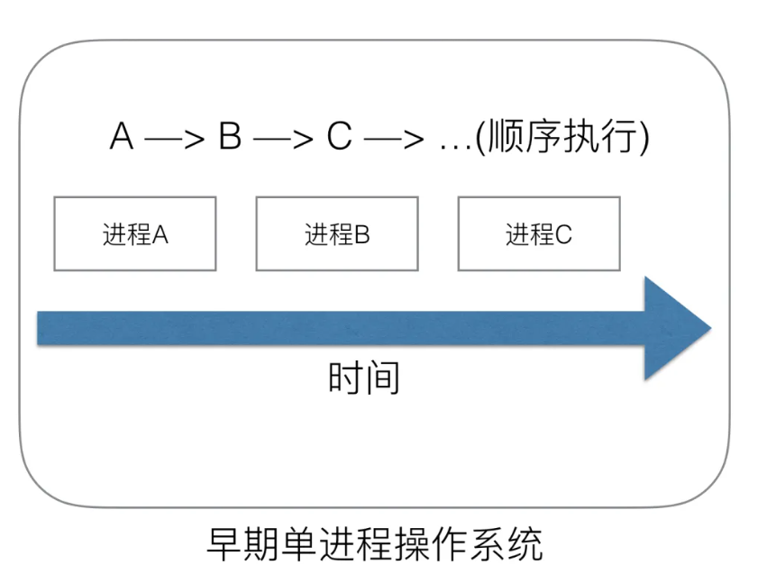
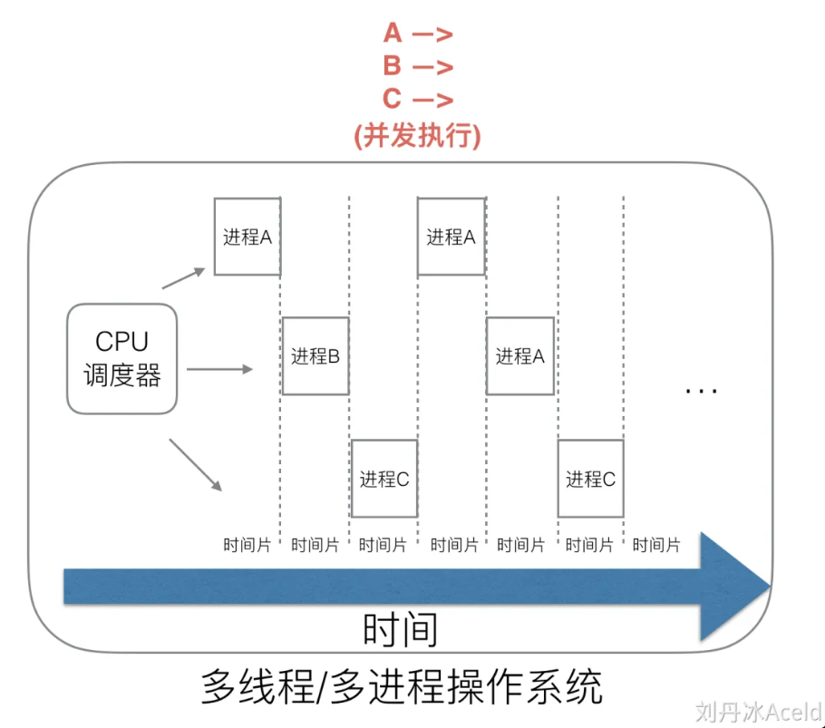

参考资料

> [https://www.cyub.vip/2022/08/20/Golang%E8%B0%83%E5%BA%A6%E6%9C%BA%E5%88%B6%E6%B5%85%E6%9E%90/](https://www.cyub.vip/2022/08/20/Golang调度机制浅析/)
>
> https://www.yuque.com/aceld/golang/srxd6d#d8bb8540

# 进程 vs 线程 vs 协程

## 进程

在仅支持进程的操作系统中，进程是拥有资源和独立调度的基本单位（这样的进程可以考虑是只有一个线程的进程）。在支持线程的操作系统中，线程是独立调度的基本单位，而进程是资源拥有的基本单位。

进程是应用程序运行时的抽象。一个进程包含两部分：

- 静态部分：程序运行需要的代码和数据
- 动态部分：程序运行期间的状态（程序计数器、堆、栈…）

**进程具有独立的虚拟地址空间**。当应用程序运行起来时候，系统会将该应用加载到内存中，应用程序会独立的、完全的占用所有内存，这里的内存指的是虚拟内存，对于32位系统，该虚拟内存大小是2^32 = 4G，也就是说每个进程都具有“独占全部内存”的假象。

下面是进程的运行时的内存布局：

进程的创建是通过fork系统调用实现的，创建时候会将父进程的上面内存布局COPY 一份，所以说进程的创建是非常耗CPU资源操作（尽管fork系统调用支持了写时拷贝，建立映射关系也是耗时操作）。

## 线程

线程是更加轻量级的运行时抽象。线程只包含运行时的状态：

- 静态部分由进程提供
- 包括了执行所需的最小状态（主要是寄存器和栈）

一个进程可以包含多个线程。一个进程的多线程可以在不同处理器上同时执行，调度的基本单元由进程变为了线程，上下问的切换单位是线程。每个线程都拥有自己的栈，内核也有为线程准备的内核栈。

根据线程是否受内核直接管理，可以把线程分为两类：用户级线程和内核级线程。

- 在用户级线程中，线程的创建、管理等所有工作都由应用程序基于线程库完成，内核意识不到线程的存在。
- 在内核级线程中，线程管理的所有工作都由内核完成。

## 协程

协程是用户态下的轻量级线程，在不同的场景下中有不同的叫法，由Linux实现的叫做纤程(Fiber)，由开发语言实现的一般叫协程(Coroutine)。**协程的实现采用模型一般是用户级线程模型或者两级线程模型**。Go语言的协程叫做Goroutine(是由Go 和 Coroutine拼接出来的词）。Goroutine具有以下特点：

- 启动成本小，初始的栈空间大小仅2Kb，并且栈空间可以自动伸缩
- 工作在用户态，切换成很小
- 采用两级线程模型，可以在n个系统级线程上多工调度m个Goroutine。

# 线程模型

# Golang“调度器”的由来？

## 单进程时代不需要调度器

我们知道，一切的软件都是跑在操作系统上，真正用来干活(计算)的是CPU。早期的操作系统每个程序就是一个进程，直到一个程序运行完，才能进行下一个进程，就是“单进程时代”，一切的程序只能串行发生。

早期的单进程操作系统，面临2个问题：

1. 单一的执行流程，计算机只能一个任务一个任务处理。
2. 进程阻塞所带来的CPU时间浪费。

那么能不能有多个进程来宏观一起来执行多个任务呢？

后来操作系统就具有了**最早的并发能力：多进程并发**，当一个进程阻塞的时候，切换到另外等待执行的进程，这样就能尽量把CPU利用起来，CPU就不浪费了。

## 多进程/线程时代有了调度器需求

在多进程/多线程的操作系统中，就解决了阻塞的问题，因为一个进程阻塞CPU可以立刻切换到其他进程中去执行，而且调度CPU的算法可以保证在运行的进程都可以被分配到CPU的运行时间片。这样从宏观来看，似乎多个进程是在同时被运行。

但新的问题就又出现了，进程拥有太多的资源，进程的创建、切换、销毁，都会占用很长的时间，CPU虽然利用起来了，但如果进程过多，CPU有很大的一部分都被用来进行进程调度了。

怎么才能提高CPU的利用率呢？

## 协程来提高CPU利用率

多进程、多线程已经提高了系统的并发能力，但是在当今互联网高并发场景下，为每个任务都创建一个线程是不现实的，因为会消耗大量的内存(进程虚拟内存会占用4GB[32位操作系统], 而线程也要大约4MB)。

大量的进程/线程出现了新的问题

- 高内存占用
- 调度的高消耗CPU

好了，然后工程师们就发现，其实一个线程分为“内核态“线程和”用户态“线程。

一个“用户态线程”必须要绑定一个“内核态线程”，但是CPU并不知道有“用户态线程”的存在，它只知道它运行的是一个“内核态线程”(Linux的PCB进程控制块)。

# Goroutine调度器的GMP模型的设计思想

# Go调度器调度场景过程全解析

