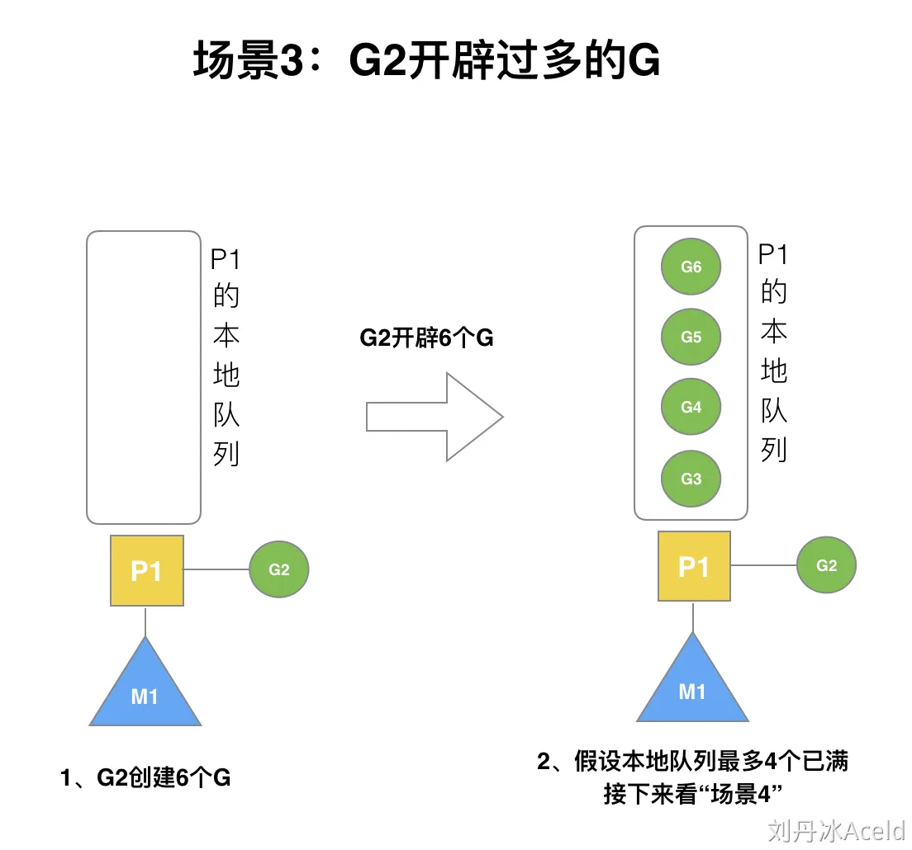
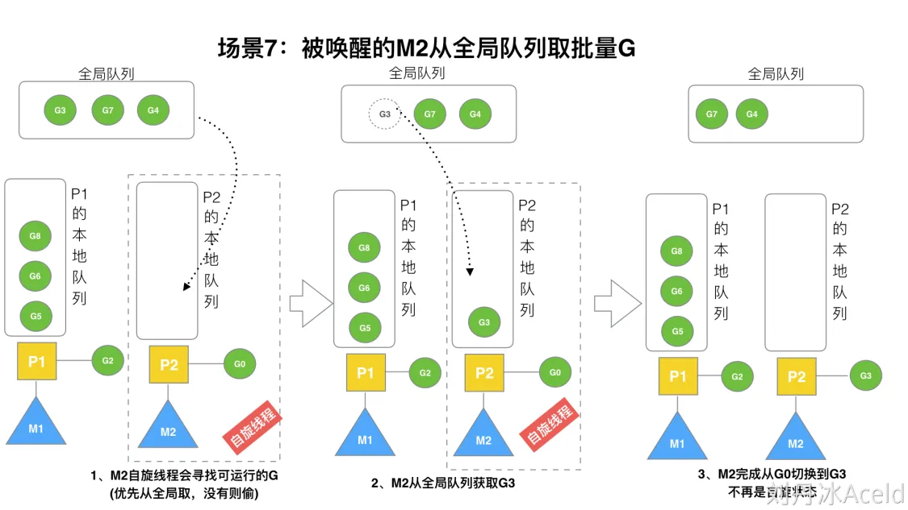
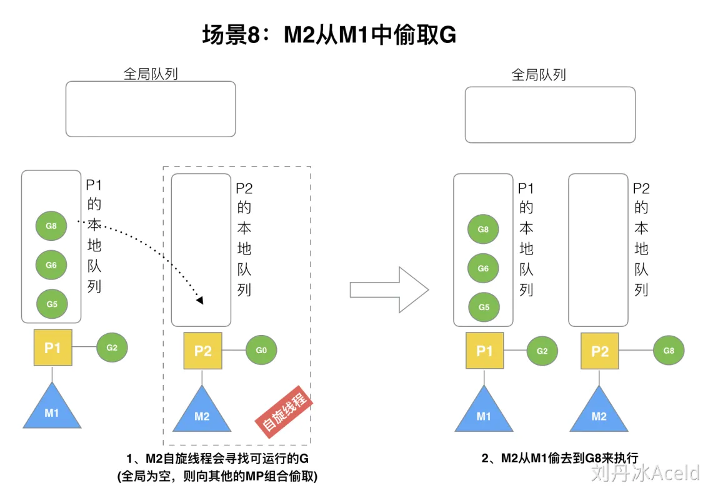

参考资料

> [https://www.cyub.vip/2022/08/20/Golang%E8%B0%83%E5%BA%A6%E6%9C%BA%E5%88%B6%E6%B5%85%E6%9E%90/](https://www.cyub.vip/2022/08/20/Golang调度机制浅析/)
>
> https://www.yuque.com/aceld/golang/srxd6d#d8bb8540
>
> https://xiaolincoding.com/os/4_process/process_base.html


# 进程 vs 线程 vs 协程

## 进程

在仅支持进程的操作系统中，进程是拥有资源和独立调度的基本单位（这样的进程可以考虑是只有一个线程的进程）。在支持线程的操作系统中，线程是独立调度的基本单位，而进程是资源拥有的基本单位。

进程是应用程序运行时的抽象。一个进程包含两部分：

- 静态部分：程序运行需要的代码和数据
- 动态部分：程序运行期间的状态（程序计数器、堆、栈…）

**进程具有独立的虚拟地址空间**。当应用程序运行起来时候，系统会将该应用加载到内存中，应用程序会独立的、完全的占用所有内存，这里的内存指的是虚拟内存，对于32位系统，该虚拟内存大小是2^32 = 4G，也就是说每个进程都具有“独占全部内存”的假象。

下面是进程的运行时的内存布局：


进程的创建是通过fork系统调用实现的，创建时候会将父进程的上面内存布局COPY 一份，所以说进程的创建是非常耗CPU资源操作（尽管fork系统调用支持了写时拷贝，建立映射关系也是耗时操作）。


## 线程

线程是更加轻量级的运行时抽象。线程只包含运行时的状态：

- 静态部分由进程提供
- 包括了执行所需的最小状态（主要是寄存器和栈）

一个进程可以包含多个线程。一个进程的多线程可以在不同处理器上同时执行，调度的基本单元由进程变为了线程，上下问的切换单位是线程。每个线程都拥有自己的栈，内核也有为线程准备的内核栈。


根据线程是否受内核直接管理，可以把线程分为两类：用户级线程和内核级线程。

- 在用户级线程中，线程的创建、管理等所有工作都由应用程序基于线程库完成，内核意识不到线程的存在。
- 在内核级线程中，线程管理的所有工作都由内核完成。

# 线程的实现

主要有三种线程的实现方式：

- **用户线程（User Thread）**：在用户空间实现的线程，不是由内核管理的线程，是由用户态的线程库来完成线程的管理；
- **内核线程（Kernel Thread）**：在内核中实现的线程，是由内核管理的线程；
- **轻量级进程（LightWeight Process）**：在内核中来支持用户线程；

那么，这还需要考虑一个问题，用户线程和内核线程的对应关系。

首先，第一种关系是**多对一**的关系，也就是多个用户线程对应同一个内核线程：


第二种是**一对一**的关系，也就是一个用户线程对应一个内核线程：


第三种是**多对多**的关系，也就是多个用户线程对应到多个内核线程：


## 用户线程

用户线程是基于用户态的线程管理库来实现的，那么**线程控制块（Thread Control Block, TCB）** 也是在库里面来实现的，对于操作系统而言是看不到这个 TCB 的，它只能看到整个进程的 PCB。

所以，**用户线程的整个线程管理和调度，操作系统是不直接参与的，而是由用户级线程库函数来完成线程的管理，包括线程的创建、终止、同步和调度等。**

用户级线程的模型，也就类似前面提到的**多对一**的关系，即多个用户线程对应同一个内核线程，如下图所示：


用户线程的**优点**：

- 每个进程都需要有它私有的线程控制块（TCB）列表，用来跟踪记录它各个线程状态信息（PC、栈指针、寄存器），TCB 由用户级线程库函数来维护，可用于不支持线程技术的操作系统；
- 用户线程的切换也是由线程库函数来完成的，无需用户态与内核态的切换，所以速度特别快；

用户线程的**缺点**：

- 由于操作系统不参与线程的调度，如果一个线程发起了系统调用而阻塞，那进程所包含的用户线程都不能执行了。
- 当一个线程开始运行后，除非它主动地交出 CPU 的使用权，否则它所在的进程当中的其他线程无法运行，因为用户态的线程没法打断当前运行中的线程，它没有这个特权，只有操作系统才有，但是用户线程不是由操作系统管理的。
- 由于时间片分配给进程，故与其他进程比，在多线程执行时，每个线程得到的时间片较少，执行会比较慢；

以上，就是用户线程的优缺点了。

## 内核线程

**内核线程是由操作系统管理的，线程对应的 TCB 自然是放在操作系统里的，这样线程的创建、终止和管理都是由操作系统负责。**

内核线程的模型，也就类似前面提到的**一对一**的关系，即一个用户线程对应一个内核线程，如下图所示：


内核线程的**优点**：

- 在一个进程当中，如果某个内核线程发起系统调用而被阻塞，并不会影响其他内核线程的运行；
- 分配给线程，多线程的进程获得更多的 CPU 运行时间；

内核线程的**缺点**：

- 在支持内核线程的操作系统中，由内核来维护进程和线程的上下文信息，如 PCB 和 TCB；
- 线程的创建、终止和切换都是通过系统调用的方式来进行，因此对于系统来说，系统开销比较大；

以上，就是内核线程的优缺点了。

## 轻量级进程

**轻量级进程（Light-weight process，LWP）是内核支持的用户线程，一个进程可有一个或多个 LWP，每个 LWP 是跟内核线程一对一映射的，也就是 LWP 都是由一个内核线程支持，而且 LWP 是由内核管理并像普通进程一样被调度**。

在大多数系统中，**LWP与普通进程的区别也在于它只有一个最小的执行上下文和调度程序所需的统计信息**。一般来说，一个进程代表程序的一个实例，而 LWP 代表程序的执行线程，因为一个执行线程不像进程那样需要那么多状态信息，所以 LWP 也不带有这样的信息。

在 LWP 之上也是可以使用用户线程的，那么 LWP 与用户线程的对应关系就有三种：

- `1 : 1`，即一个 LWP 对应 一个用户线程；
- `N : 1`，即一个 LWP 对应多个用户线程；
- `M : N`，即多个 LWP 对应多个用户线程；

接下来针对上面这三种对应关系说明它们优缺点。先看下图的 LWP 模型：


**1 : 1 模式**

一个线程对应到一个 LWP 再对应到一个内核线程，如上图的进程 4，属于此模型。

- 优点：实现并行，当一个 LWP 阻塞，不会影响其他 LWP；
- 缺点：每一个用户线程，就产生一个内核线程，创建线程的开销较大。

**N : 1 模式**

多个用户线程对应一个 LWP 再对应一个内核线程，如上图的进程 2，线程管理是在用户空间完成的，此模式中用户的线程对操作系统不可见。

- 优点：用户线程要开几个都没问题，且上下文切换发生用户空间，切换的效率较高；
- 缺点：一个用户线程如果阻塞了，则整个进程都将会阻塞，另外在多核 CPU 中，是没办法充分利用 CPU 的。

**M : N 模式**

根据前面的两个模型混搭一起，就形成 `M:N` 模型，该模型提供了两级控制，首先多个用户线程对应到多个 LWP，LWP 再一一对应到内核线程，如上图的进程 3。

- 优点：综合了前两种优点，大部分的线程上下文发生在用户空间，且多个线程又可以充分利用多核 CPU 的资源。

**组合模式**

如上图的进程 5，此进程结合 `1:1` 模型和 `M:N` 模型。开发人员可以针对不同的应用特点调节内核线程的数目来达到物理并行性和逻辑并行性的最佳方案。


# 线程模型

线程创建、管理、调度等采用的方式称为**线程模型**。线程模型一般可分为以下三种：

- 内核级线程模型
- 用户级线程模型
- 两级线程模型，也称混合型线程模型

三大线程模型最大差异就在于用户级线程与内核调度实体KSE（KSE，Kernel Scheduling Entity）之间的对应关系。KSE是Kernel Scheduling Entity的缩写，其是可被操作系统内核调度器调度的对象实体，是操作系统内核的最小调度单元，可以简单理解为内核级线程。

## 内核级线程模型

**内核级线程模型中用户线程与内核线程是一对一关系（1 : 1）**。线程的创建、销毁、切换工作都是有内核完成的。应用程序不参与线程的管理工作，只能调用内核级线程编程接口。每个用户线程都会被绑定到一个内核线程。用户线程在其生命期内都会绑定到该内核线程。一旦用户线程终止，两个线程都将离开系统。


操作系统调度器管理、调度并分派这些线程。运行时库为每个用户级线程请求一个内核级线程。内核级线程模型有如下优缺点：

**优点：**

- 在多处理器系统中，内核能够并行执行同一进程内的多个线程
- 如果进程中的一个线程被阻塞，不会阻塞其他线程，是能够切换同一进程内的其他线程继续执行

**缺点：**

- 线程的创建与删除，调度等都需要系统内核参与，成本大。

## 用户级线程模型

**用户级线程模型中的用户态线程与内核态线程KSE是多对一关系（N : 1）**。线程的创建、销毁以及线程之间的协调、同步等工作都是在用户态完成，具体来说就是由应用程序的线程库来完成。从宏观上来看，任意时刻每个进程只能够有一个线程在运行，且只有一个处理器内核会被分配给该进程。


从上图中可以看出来：库调度器从进程的多个线程中选择一个线程，然后该线程和该进程允许的一个内核线程关联起来。内核线程将被操作系统调度器指派到处理器内核。用户级线程是一种”多对一”的线程映射。

用户级线程模型有如下优缺点：

**优点：**

- 创建和销毁线程、线程切换代价等线程管理的代价比内核线程少得多, 因为保存线程状态的过程和调用程序都只是本地过程
- 线程能够利用的表空间和堆栈空间比内核级线程多

**缺点：**

- 线程发生I/O或页面故障引起的阻塞时，如果调用阻塞系统调用则内核由于不知道有多线程的存在，而会阻塞整个进程从而阻塞所有线程, 因此同一进程中只能同时有一个线程在运行
- 资源调度按照进程进行，多个处理机下，同一个进程中的线程只能在同一个处理机下分时复用

## 两级线程模型


两级线程模型中用户态线程与内核态线程是多对多关系（N : M）。两级线程模型充分吸收上面两种模型的优点，尽量规避缺点。其线程创建在用户空间中完成，线程的调度和同步也在应用程序中进行。一个应用程序中的多个用户级线程被绑定到一些（小于或等于用户级线程的数目）内核级线程上。


## Golang的线程模型

Golang在底层实现了混合型线程模型。下图中M代表着系统线程，一个M关联一个KSE，即两级线程模型中的系统线程。G为Groutine，即两级线程模型的的应用级线程。M与G的关系是N:M。


## GMP模型

**G**，**M**，**P** 分别是Go runtime调度的核心底层数据结构，所以Golang中调度模型也称为GMP模型。GMP分别代表的含义如下：

- **G** - Goroutine，为Go协程，是参与调度与执行的最小单位，是并发的关键。
- **M** - Machine，指的是系统级线程，负责执行G。
- **P** - Processor，指的是逻辑处理器，数量等于CPU核数，代表了并行。每个P都拥有一个本地可运行G的队列(Local ruanble queue，简称为LRQ)，该队列最多可存放256个G。

**GMP模型概览图：**


Golang最开始的调度模型只有G和M，G放在全局队列中，M都是从全局队列中获取可运行的G，这需要全局的锁保证并发安全，性能比较差。**后续追加P数据结构，对应每一个CPU核心，M执行G之前都需关联一个P，后续M获取G只需从其关联的P的本地队列获取，这个获取过程是无锁。**

当M关联的P的LRQ没有可以执行的G时候，其可以从Gloable runable queue(GRQ)或者其他P上窃取(work stealing)可以执行的G。

# Goroutine调度器的GMP模型的设计思想

> 大部分文章都是会用G来表示Goroutine，用M来表示线程，那么我们也会用这种表达的对应关系。

## 被废弃的goroutine调度器

Go目前使用的调度器是2012年重新设计的，因为之前的调度器性能存在问题，所以使用4年就被废弃了，那么我们先来分析一下被废弃的调度器是如何运作的？

下面来看看被废弃的golang调度器是如何实现的？


M想要执行、放回G都必须访问全局G队列，并且M有多个，即多线程访问同一资源需要加锁进行保证互斥/同步，所以全局G队列是有互斥锁进行保护的。

老调度器有几个缺点：

1. 创建、销毁、调度G都需要每个M获取锁，这就形成了**激烈的锁竞争**。
2. M转移G会造成**延迟和额外的系统负载**。比如当G中包含创建新协程的时候，M创建了G’，为了继续执行G，需要把G’交给M’执行，也造成了**很差的局部性**，因为G’和G是相关的，最好放在M上执行，而不是其他M'。

## GMP模型

面对之前调度器的问题，Go设计了新的调度器。在新调度器中引进了P(Processor)。

**Processor，它包含了运行goroutine的资源**，如M想运行goroutine，必须先获取P，P中包含了可运行的G队列。

1. **全局队列**（Global Queue）：存放等待运行的G。
2. **P的本地队列**：同全局队列类似，存放的也是等待运行的G，存的数量有限，不超过256个。新建G'时，G'优先加入到P的本地队列，如果队列满了，则会把本地队列中一半的G移动到全局队列。
3. **P列表**：所有的P都在程序启动时创建，并保存在数组中，最多有`GOMAXPROCS`(可配置)个。
4. **M**：线程想运行任务就得获取P，从P的本地队列获取G，P队列为空时，M也会尝试从全局队列**拿**一批G放到P的本地队列，或从其他P的本地队列**偷**一半放到自己P的本地队列。M运行G，G执行之后，M会从P获取下一个G，不断重复下去。

**Goroutine调度器和OS调度器是通过M结合起来的，每个M都代表了1个内核线程，OS调度器负责把内核线程分配到CPU的核上执行**。

## 有关P和M的个数问题

1、P的数量：

- 由启动时环境变量`$GOMAXPROCS`或者是由`runtime`的方法`GOMAXPROCS()`决定。需要注意的是，这个数量控制的是有多少个操作系统线程（物理线程）可以同时运行Go代码，而不是goroutine的数量。goroutine是轻量级的协程，可以有数以万计的goroutine存在，但只有不超过`GOMAXPROCS`数量的goroutine能同时被调度到操作系统线程上运行。

2、M的数量:

- Go语言本身的限制：Go程序启动时，会设置M的最大数量，默认10000。但是内核很难支持这么多的线程数，所以这个限制可以忽略。
- `runtime/debug`中的SetMaxThreads函数，设置M的最大数量
- 一个M阻塞了，会创建新的M。

M与P的数量没有绝对关系，一个M阻塞，P就会去创建或者切换另一个M，所以，即使P的默认数量是1，也有可能会创建很多个M出来。

> P和M何时会被创建

1、P何时创建：在确定了P的最大数量n后，运行时系统会根据这个数量创建n个P。

2、M何时创建：没有足够的M来关联P并运行其中的可运行的G。比如所有的M此时都阻塞住了，而P中还有很多就绪任务，就会去寻找空闲的M，而没有空闲的，就会去创建新的M。


## 调度器的设计策略

**复用线程(复用M)**：避免频繁的创建、销毁线程，而是对线程的复用。

1）work stealing机制：当本线程无可运行的G时，尝试从其他线程绑定的P偷取G，而不是销毁线程。

2）hand off机制：当本线程因为G进行系统调用阻塞时，线程释放绑定的P，把P转移给其他空闲的线程执行。

**利用并行**：`GOMAXPROCS`设置P的数量，最多有`GOMAXPROCS`个线程分布在多个CPU上同时运行。`GOMAXPROCS`也限制了并发的程度，比如`GOMAXPROCS = 核数/2`，则最多利用了一半的CPU核进行并行。

**抢占**：在coroutine中要等待一个协程主动让出CPU才执行下一个协程，在Go中，一个goroutine最多占用CPU 10ms，防止其他goroutine被饿死，这就是goroutine不同于coroutine的一个地方。

**全局G队列**：在新的调度器中依然有全局G队列，但功能已经被弱化了，当M执行work stealing从其他P偷不到G时，它可以从全局G队列获取G。（这里有一个疑问，是先从其他P偷G，还是先从全局G队列中获取G？？？）


## go func() 调度流程


从上图我们可以分析出几个结论：

1、我们通过 go func()来创建一个goroutine；

2、有两个存储G的队列，一个是局部调度器P的本地队列、一个是全局G队列。新创建的G会先保存在P的本地队列中，如果P的本地队列已经满了就会保存在全局的队列中；

3、G只能运行在M中，一个M必须持有一个P，M与P是1：1的关系。M会从P的本地队列弹出一个可执行状态的G来执行，如果P的本地队列为空，就会想其他的MP组合偷取一个可执行的G来执行；

4、一个M调度G执行的过程是一个循环机制；

5、当M执行某一个G时候如果发生了syscall或则其余阻塞操作，M会阻塞，如果当前有一些G在P中等待执行，runtime会把这个线程M从P中摘除(detach)，然后再创建一个新的操作系统线程(如果有空闲的线程可用就复用空闲线程)来服务于这个P；

6、当M系统调用结束时候，这个G会尝试获取一个空闲的P执行，并放入到这个P的本地队列。如果获取不到P，那么这个线程M变成休眠状态， 加入到空闲线程中，然后这个G会被放入全局队列中。


## 调度器的生命周期


特殊的M0和G0

**M0**

`M0`是启动程序后的编号为0的主线程，这个M对应的实例会在全局变量runtime.m0中，不需要在heap上分配，M0负责执行初始化操作和启动第一个G， 在之后M0就和其他的M一样了。

**G0**

`G0`是每次启动一个M都会第一个创建的gourtine，G0仅用于负责调度的G，G0不指向任何可执行的函数, 每个M都会有一个自己的G0。在调度或系统调用时会使用G0的栈空间, 全局变量的G0是M0的G0。

我们来跟踪一段代码

```go
package main

import "fmt"

func main() {
    fmt.Println("Hello world")
}
```

接下来我们来针对上面的代码对调度器里面的结构做一个分析。

也会经历如上图所示的过程：

1. runtime创建最初的线程m0和goroutine g0，并把2者关联。
2. 调度器初始化：初始化m0、栈、垃圾回收，以及创建和初始化由GOMAXPROCS个P构成的P列表。
3. 示例代码中的main函数是`main.main`，`runtime`中也有1个main函数——`runtime.main`，代码经过编译后，`runtime.main`会调用`main.main`，程序启动时会为`runtime.main`创建goroutine，称它为main goroutine吧，然后把main goroutine加入到P的本地队列。
4. 启动m0，m0已经绑定了P，会从P的本地队列获取G，获取到main goroutine。
5. G拥有栈，M根据G中的栈信息和调度信息设置运行环境
6. M运行G
7. G退出，再次回到M获取可运行的G，这样重复下去，直到`main.main`退出，`runtime.main`执行Defer和Panic处理，或调用`runtime.exit`退出程序。

调度器的生命周期几乎占满了一个Go程序的一生，`runtime.main`的goroutine执行之前都是为调度器做准备工作，`runtime.main`的goroutine运行，才是调度器的真正开始，直到`runtime.main`结束而结束。

# Go调度器调度场景过程全解析

## (1)场景1：G1创建G2

P拥有G1，M1获取P后开始运行G1，G1使用`go func()`创建了G2，为了局部性G2优先加入到P1的本地队列。


## (2)场景2：G1执行完毕

G1运行完成后(函数：`goexit`)，M上运行的goroutine切换为G0，G0负责调度时协程的切换（函数：`schedule`）。从P的本地队列取G2，从G0切换到G2，并开始运行G2(函数：`execute`)。实现了线程M1的复用。


## (3)场景3：G2开辟过多的G

假设每个P的本地队列只能存4个G。G2要创建了6个G，前4个G（G3, G4, G5, G6）已经加入p1的本地队列，p1本地队列满了。



## (4)场景4：G2本地满再创建G7

G2在创建G7的时候，发现P1的本地队列已满，需要执行**负载均衡**（把P1中本地队列中前一半的G，还有新创建G**转移**到全局队列）

> 实现中并不一定是新创建的G被转移，如果G是G2之后就执行的，会被保存在本地队列，将某些老的G替换新G加入全局队列


## (5)场景5：G2本地未满创建G8

G2创建G8时，P1的本地队列未满，所以G8会被加入到P1的本地队列。


G8加入到P1点本地队列的原因还是因为P1此时在与M1绑定，而G2此时是M1在执行。所以G2创建的新的G会优先放置到自己的M绑定的P上。

## (6)场景6：唤醒正在休眠的M

规定：**在创建G时，运行的G会尝试唤醒其他空闲的P和M组合去执行**。


假定G2唤醒了M2，M2绑定了P2，并运行G0，但P2本地队列没有G，M2此时为自旋线程**（没有G但为运行状态的线程，不断寻找G）**。

## (7)场景7：被唤醒的M2从全局队列取批量G

M2尝试从全局队列(简称“GQ”)取一批G放到P2的本地队列（函数：`findrunnable()`）。M2从全局队列取的G数量符合下面的公式：

```go
n =  min(len(GQ) / GOMAXPROCS +  1,  cap(LQ) / 2 )
```

相关源码参考:

```go
// 从全局队列中偷取，调用时必须锁住调度器
func globrunqget(_p_ *p, max int32) *g {
	// 如果全局队列中没有 g 直接返回
	if sched.runqsize == 0 {
		return nil
	}

	// per-P 的部分，如果只有一个 P 的全部取
	n := sched.runqsize/gomaxprocs + 1
	if n > sched.runqsize {
		n = sched.runqsize
	}

	// 不能超过取的最大个数
	if max > 0 && n > max {
		n = max
	}

	// 计算能不能在本地队列中放下 n 个
	if n > int32(len(_p_.runq))/2 {
		n = int32(len(_p_.runq)) / 2
	}

	// 修改本地队列的剩余空间
	sched.runqsize -= n
	// 拿到全局队列队头 g
	gp := sched.runq.pop()
	// 计数
	n--

	// 继续取剩下的 n-1 个全局队列放入本地队列
	for ; n > 0; n-- {
		gp1 := sched.runq.pop()
		runqput(_p_, gp1, false)
	}
	return gp
}
```

至少从全局队列取1个G，但每次不要从全局队列移动太多的G到P本地队列，给其他P留点。这是**从全局队列到P本地队列的负载均衡**。



假定我们场景中一共有4个P（GOMAXPROCS设置为4，那么我们允许最多就能用4个P来供M使用）。所以M2只从能从全局队列取1个G（即G3）移动P2本地队列，然后完成从G0到G3的切换，运行G3。（因为其他两个P可以各自从全局G队列中获得一个G，这样可以同时执行4个G）

## (8)场景8：M2从M1中偷取G

假设G2一直在M1上运行，经过2轮后，M2已经把G7、G4从全局队列获取到了P2的本地队列并完成运行（这里假设是M2把全局队列中的G执行完了），全局队列和P2的本地队列都空了，如场景8图的左半部分。



**全局队列已经没有G，那m就要执行work stealing(偷取)：从其他有G的P哪里偷取一半G过来，放到自己的P本地队列**。P2从P1的本地队列尾部取一半的G，本例中一半则只有1个G8，放到P2的本地队列并执行。

## (9)场景9：自旋线程的最大限制

G1本地队列G5、G6已经被其他M偷走并运行完成，当前M1和M2分别在运行G2和G8，M3和M4没有goroutine可以运行，M3和M4处于**自旋状态**，它们不断寻找goroutine。


为什么要让m3和m4自旋，自旋本质是在运行，线程在运行却没有执行G，就变成了浪费CPU.  为什么不销毁现场，来节约CPU资源。因为创建和销毁CPU也会浪费时间，我们**希望当有新goroutine创建时，立刻能有M运行它**，如果销毁再新建就增加了时延，降低了效率。当然也考虑了过多的自旋线程是浪费CPU，所以系统中最多有`GOMAXPROCS`个自旋的线程(当前例子中的`GOMAXPROCS`=4，所以一共4个P)，多余的没事做线程会让他们休眠。

## (10)场景10：G发生系统调用/阻塞

假定当前除了M3和M4为自旋线程，还有M5和M6为空闲的线程(没有得到P的绑定，注意我们这里最多就只能够存在4个P，所以P的数量应该永远是M>=P, 大部分都是M在抢占需要运行的P)，G8创建了G9，G8进行了**阻塞的系统调用**，M2和P2立即解绑，P2会执行以下判断：如果P2本地队列有G、全局队列有G或有空闲的M，P2都会立马唤醒1个M和它绑定，否则P2则会加入到空闲P列表，等待M来获取可用的p。本场景中，P2本地队列有G9，可以和其他空闲的线程M5绑定。


## (11)场景11：G发生系统调用/非阻塞

G8创建了G9，假如G8进行了**非阻塞系统调用**。


M2和P2会解绑，但M2会记住P2，然后G8和M2进入**系统调用**状态。当G8和M2退出系统调用时，会尝试获取P2，如果无法获取，则获取空闲的P，如果依然没有，G8会被记为可运行状态，并加入到全局队列，M2因为没有P的绑定而变成休眠状态(长时间休眠等待GC回收销毁)。