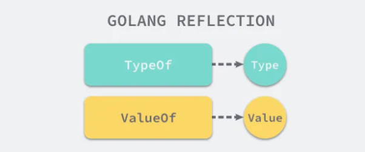

# 概述

`reflect` 实现了运行时的反射能力，我们可以使用包中的函数 `TypeOf` 从静态类型 `interface{}` 中获取动态类型信息并通过 `ValueOf` 获取数据的运行时表示，通过这两个函数和包中的其他工具我们就可以得到更强大的表达能力。

在具体介绍反射包的实现原理之前，我们先要对 Go 语言的反射有一些比较简单的理解，首先 `reflect` 中有两对非常重要的函数和类型，我们在上面已经介绍过其中的两个函数 `TypeOf` 和 `ValueOf`，另外两个类型是 `Type` 和 `Value`，它们与函数是一一对应的关系：




# 反射法则

运行时反射是程序在运行期间检查其自身结构的一种方式，它是 元编程 的一种，但是它带来的灵活性也是一把双刃剑，过量的使用反射会使我们的程序逻辑变得难以理解并且运行缓慢，我们在这一节中就会介绍 Go 语言反射的三大法则，这能够帮助我们更好地理解反射的作用。

1. 从接口值可反射出反射对象；
2. 从反射对象可反射出接口值；
3. 要修改反射对象，其值必须可设置；

## 第一法则


## 第二法则


## 第三法则


# Type接口

## Elem方法

`Type` 接口的 `Elem()` 方法是一个非常重要的方法，用于获取复合类型的元素类型。

```go
	// Elem returns a type's element type.
	// It panics if the type's Kind is not Array, Chan, Map, Pointer, or Slice.
	Elem() Type
```

核心概念

1. **作用对象**：`Elem()` 只适用于以下 5 种类型（通过 `Kind()` 判断）：
   - `Array`（数组）
   - `Chan`（通道）
   - `Map`（映射）
   - `Pointer`（指针）
   - `Slice`（切片）
2. **返回值**：
   - 返回这些类型所包含的元素类型
   - 返回值本身也是一个 `Type` 接口，可以继续用于反射操作
3. **非法调用**：如果对不支持的类型调用 `Elem()`，会直接触发 panic

具体类型的行为

| 类型（Kind） | `Elem()` 返回的内容                | 示例                     |
| :----------- | :--------------------------------- | :----------------------- |
| `Array`      | 数组元素的类型                     | `[5]int` → `int`         |
| `Chan`       | 通道传输元素的类型                 | `chan string` → `string` |
| `Map`        | 映射的值的类型（键类型用 `Key()`） | `map[int]bool` → `bool`  |
| `Pointer`    | 指针指向的类型                     | `*float64` → `float64`   |
| `Slice`      | 切片元素的类型                     | `[]byte` → `byte`        |

重要说明

1. **映射类型特殊处理**：对于 `Map` 类型：
   
- `Elem()` 返回**值类型**
   - 需要用 `Key()` 方法单独获取**键类型**
   
```go
   m := map[string]int{}
   t := reflect.TypeOf(m)
   keyType := t.Key()    // string
   valueType := t.Elem() // int
   ```
   
2. **嵌套类型**：可以链式调用 `Elem()` 处理多层嵌套：
   
```go
   var pp **int
   t := reflect.TypeOf(pp) // **int
   t.Elem()                // *int (第一层解引用)
   t.Elem().Elem()         // int  (第二层解引用)
   ```
   
3. **类型验证**：安全的使用方式应该先检查 `Kind()`：
   
```go
   if t.Kind() == reflect.Ptr {
       elemType := t.Elem()
       // 处理元素类型...
   }
   ```

**实际应用场景**

```go
func printSliceElementType(s interface{}) {
    t := reflect.TypeOf(s)
    if t.Kind() != reflect.Slice {
        panic("Not a slice!")
    }
    elemType := t.Elem()
    fmt.Println("Slice element type:", elemType)
}
```

理解 `Elem()` 是掌握 Go 反射的关键，它让开发者能深入到复合类型的内部结构中。