# 垃圾回收

垃圾回收(Garbage Collection，GC)是编程语言中提供的自动内存管理机制，GC能够自动释放不需要的内存对象，让出存储器资源，其释放过程中无须程序员手动执行。GC机制在现代很多编程语言得到支持，针对GC性能的优劣程度，也是不同语言之间的对比指标之一。

Go语言在GC的演进过程中也经历了很多次变革，具体的几次重大改变如下：

(1) Go V1.3 及之前的标记清除(Mark and Sweep)法。

(2) Go V1.5 的并发三色标记法。“强-弱”三色不变式、插入屏障、删除屏障。

(3) Go V1.8 混合写屏障机制。

本章节将介绍每种GC的算法模型和各自的优缺点，以及Go语言的GC如何一步步演进到混合写屏障的模式。

## Go V1.3 标记-清除算法

(1) 第一步，暂停程序业务逻辑，对可达和不可达的对象进行分类，然后做上标记。图2.1中表示的是程序与对象的可达关系，目前程序的可达对象有对象1→2→3，对象4→7等5个对象。

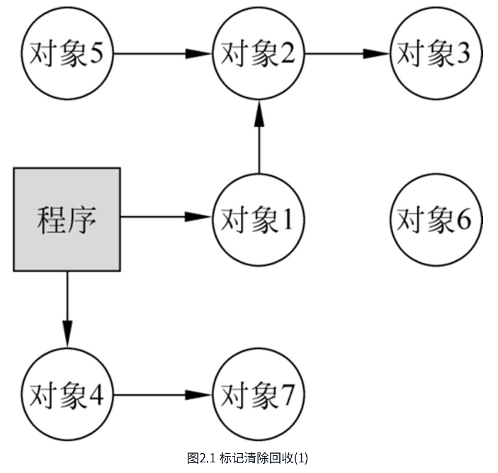

(2) 第二步，开始标记。程序找出它所有可达的对象，并做上标记，如图2.2所示。对象1→2→3、对象4→7等5个对象被做上标记。

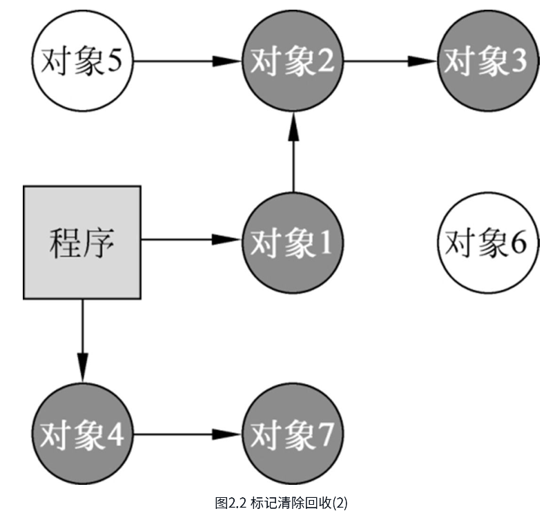

(3) 第三步，标记完了之后，开始清除未标记的对象，如图2.3所示。

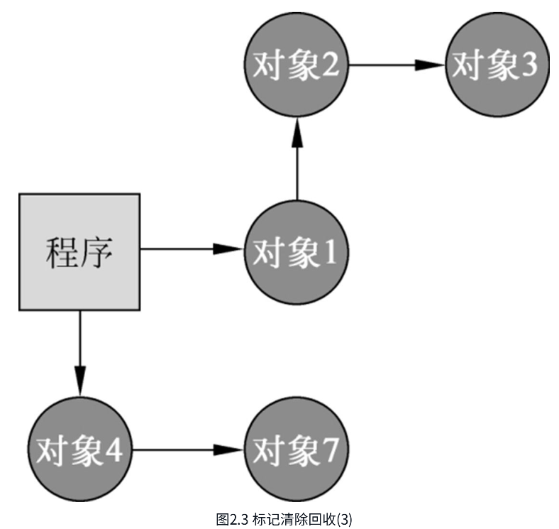

操作非常简单，但是有一点需要特别注意，Mark and Sweep算法在执行的时候，需要程序暂停，即STW(Stop The World)。在STW的过程中，CPU不执行用户代码，全部用于垃圾回收，这个过程影响很大，所以STW也是回收机制最大的难题和希望优化的点，所以在执行第三步的这段时间，程序会暂时停止工作，卡在那等待回收执行完毕。

(4) 第四步，停止暂停，让程序继续运行，然后重复这个过程，直到程序生命周期结束。

以上便是标记清除回收的算法。

### 标记清除算法的缺点

标记清除算法简单明了，过程鲜明干脆，但是也有非常严重的问题：第一是STW让程序暂停，所以程序会出现卡顿，这是一个重要的问题；第二是标记需要扫描整个Heap；第三是清除数据会产生Heap碎片。

Go V1.3版本之前就是采用以上方式来实施的，执行GC的基本流程就是首先启动STW，使程序暂停，然后执行标记，再执行数据回收，最后停止STW，如图2.4所示。

从图2.4来看，全部的GC时间都是包裹在STW范围之内的，这样程序暂停的时间会很长，影响程序的运行性能，所以Go V1.3做了简单的优化，将STW的步骤提前，缩小STW暂停的时间范围，如图2.5所示。

图2.5主要是将STW的步骤提前了一步，因为在Sweep清除的时候，可以不需要STW，因为这些对象已经是不可达对象了。

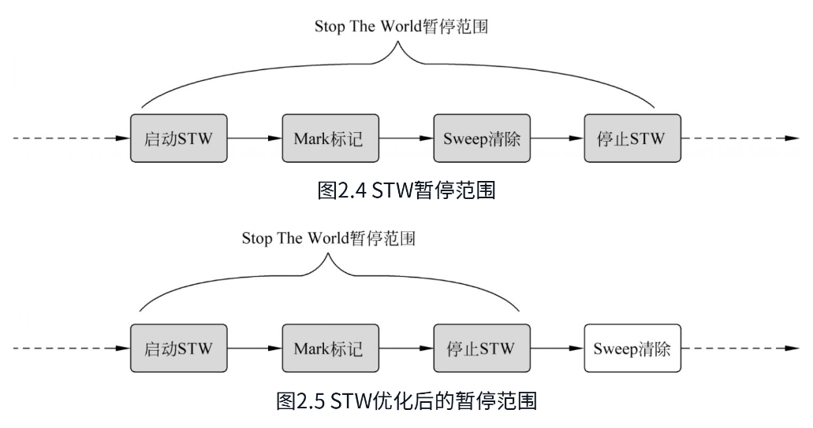

如果堆内存很大或者对象非常多，STW可能会持续几百毫秒甚至更长，对于需要高并发的服务来说这是无法接受的。

## Go V1.5 的三色标记法

这是 Go GC 的一次里程碑式的飞跃，目标是实现并发垃圾回收，即 GC 的大部分工作与用户 Goroutine 同时运行，从而极大地缩短 STW 时间。

GC 期间，将对象分为三类：

- **白色**：初始状态，表示尚未被扫描到的对象（可能是垃圾）。
- **灰色**：中间状态，表示对象本身已被标记，但其引用的子对象还未被扫描。
- **黑色**：最终状态，表示对象及其引用的所有子对象都已被标记，是存活对象。

标记过程就是从根对象开始，将灰色对象不断染黑的过程。标记结束后，剩余的白色对象就是需要被回收的垃圾。

### 三色标记法的过程

第一步，每次新创建的对象，默认的颜色都被标记为“白色”，如图2.6所示。

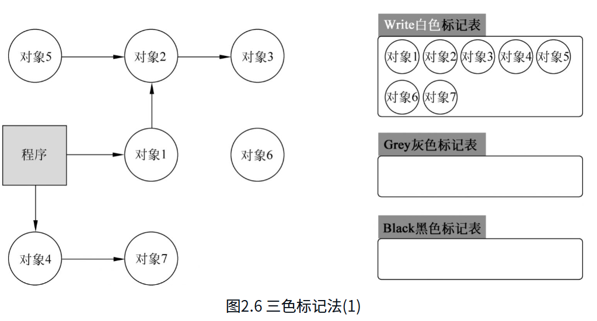

如图2.6所示，左边为程序可抵达的对象关系，右边的标记表用来记录目前每个对象的标记颜色分类。这里需要注意的是，所谓“程序”，则是一些对象的根节点集合，所以如果将“程序”展开，则会得到类似如下的表现形式，如图2.7所示。

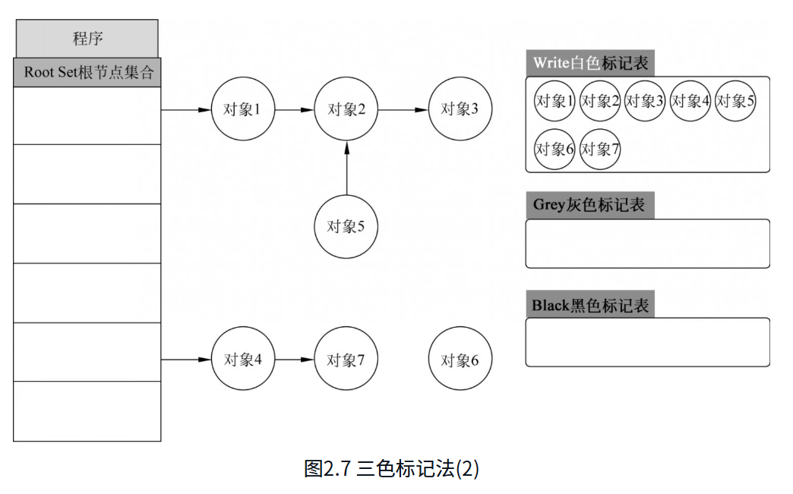

第二步，每次执行GC回收，都会从根节点开始遍历所有对象，把遍历到的对象从白色集合放入“灰色”集合，如图2.8所示。

这里需要注意的是，本次遍历是一次遍历，非递归形式，是从程序抽出可抵达的对象遍历一层，如图2.8所示，当前可抵达的对象是对象1和对象4，表示本轮遍历结束，对象1和对象4会被标记为灰色，灰色标记表就会多出这两个对象。

第三步，遍历灰色集合，将灰色对象引用的对象从白色集合放入灰色集合，之后将此灰色对象放入黑色集合，如图2.9所示。

这一次遍历只扫描灰色对象，将灰色对象的第一层遍历可抵达的对象由白色变为灰色，如对象2、对象7，而之前的灰色对象1和对象4则会被标记为黑色，同时由灰色标记表移动到黑色标记表中。

第四步，重复第三步，直到灰色中无任何对象，如图2.10和图2.11所示。

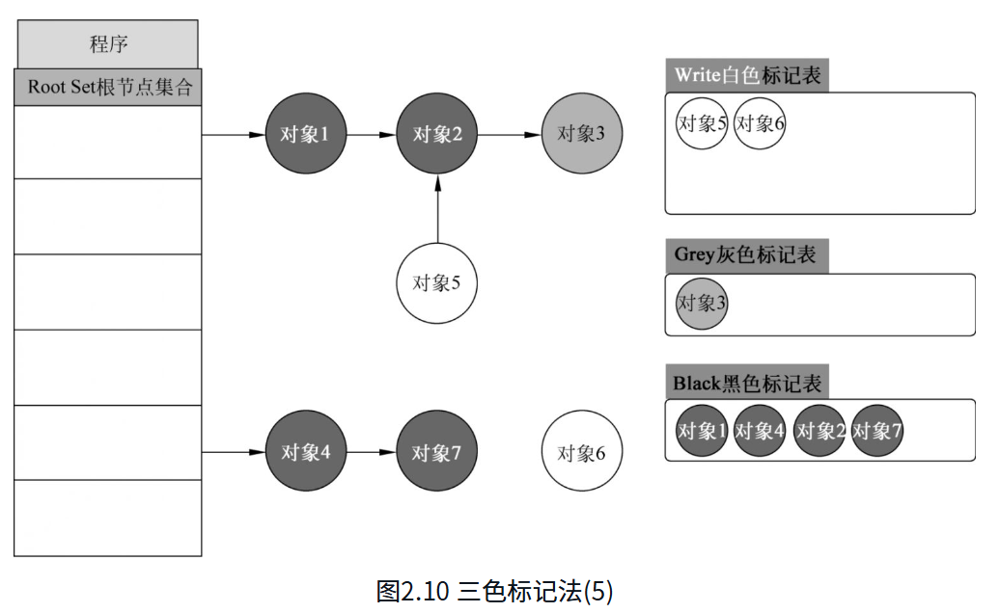

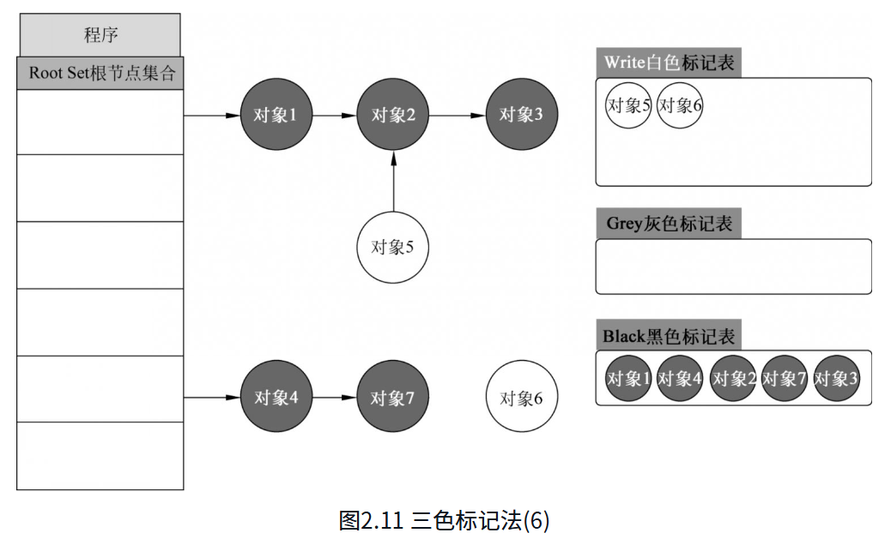

当全部的可达对象都遍历完后，灰色标记表将不再存在灰色对象，目前全部内存的数据只有两种颜色，即黑色和白色。黑色对象就是程序逻辑可达（需要的）对象，这些数据目前支撑程序正常业务运行，是合法的有用数据，不可删除，白色的对象是全部不可达对象，目前程序逻辑并不依赖它们，所以白色对象就是内存中目前的垃圾数据，需要被清除。

第五步，回收所有的白色标记表的对象，也就是回收垃圾，如图2.12所示。将全部的白色对象进行删除回收，剩下的就是全部依赖的黑色对象。

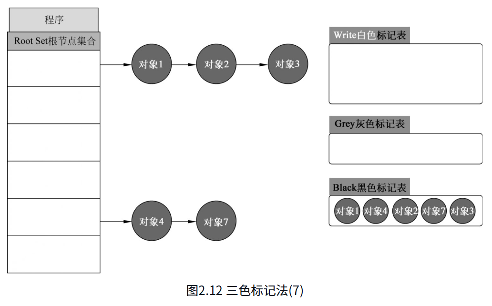

以上便是三色并发标记法，不难看出，上面已经清楚地体现了三色的特性，但是为了在GC过程中保证数据的安全，在开始三色标记之前会加上STW，在扫描确定黑白对象之后再放开STW，但是很明显这样的GC扫描的性能实在是太低了。

### 没有STW的三色标记法

先抛砖引玉，假如没有STW，那么也就不会再存在性能上的问题了，三色标记法如果不加入STW会发生什么事情呢？接下来具体推演一下此过程。

把初始状态设置为已经经历了第一轮扫描，目前黑色的对象有对象1和对象4，灰色的对象有对象2和对象7，其他的对象为白色对象，并且对象2是通过指针p指向对象3的，如图2.13所示。

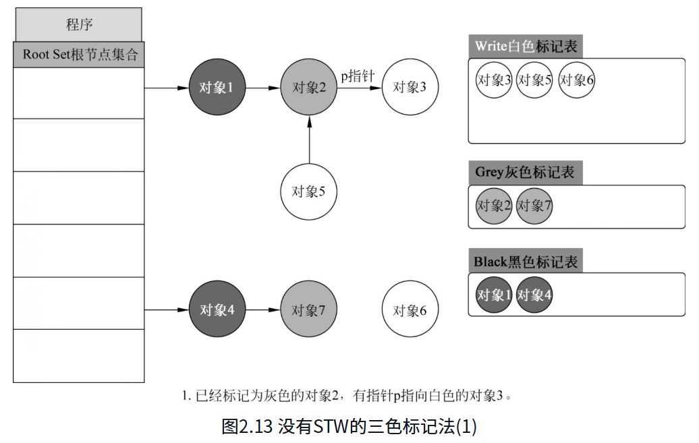

现在如果在三色标记过程中不启动STW，则在GC扫描过程中，任意的对象均可能发生读写操作，如图2.14所示，在还没有扫描到对象2的时候，已经将对象4标记为黑色，此时创建指针q，并且指向白色的对象3。

与此同时灰色的对象2将指针p移除，此时白色的对象3被挂在已经扫描完成的黑色对象4下，如图2.15所示。

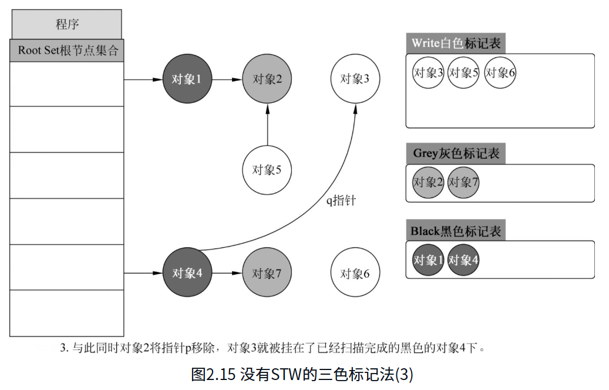

然后按照正常三色标记的算法逻辑，将所有灰色的对象标记为黑色，这样对象2和对象7就被标记成了黑色，如图2.16所示。

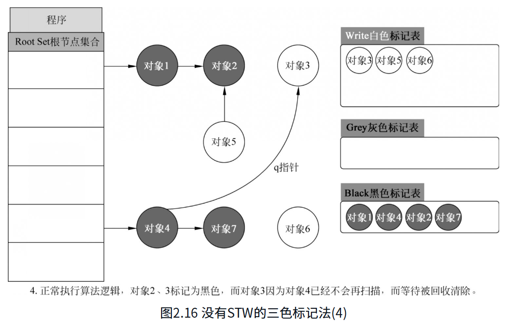

接下来就执行到了三色标记的最后一步，将所有白色对象当作垃圾进行回收，如图2.17所示。

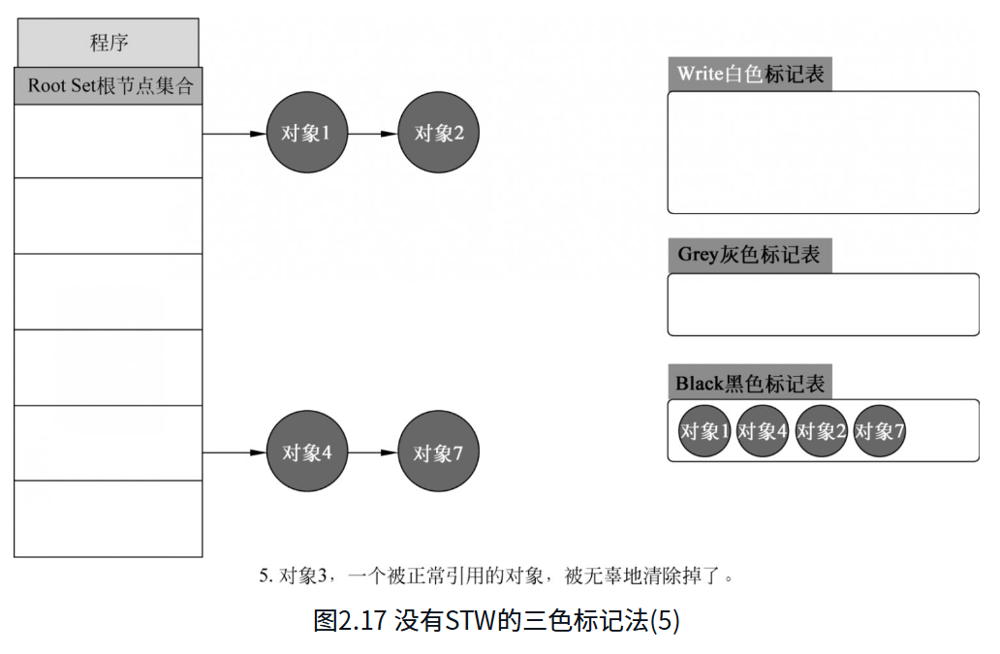

但是最后得到的结果却是，本来是对象4合法引用的对象3，最后被GC给“误杀”回收掉了，这并不是Go语言回收和开发者希望看到的。

### 触发三色标记法不安全的必要条件

可以看出，有两种情况在三色标记法中是不希望发生的。

(1) 条件1：一个白色对象被黑色对象引用（白色被挂在黑色下）。

(2) 条件2：灰色对象与它之间的可达关系的白色对象遭到破坏（灰色同时丢了该白色）。

如果当以上两个条件同时满足，就会出现对象丢失现象。并且，在如图2.17所示的场景中，如果示例中的白色对象3还有很多下游对象，也会一并都被清理掉。

为了防止这种现象的发生，最简单的方式就是STW，直接禁止其他用户程序对对象引用关系的干扰，但是STW的过程有明显的资源浪费，对所有的用户程序都有很大影响。那么是否可以在保证对象不丢失的情况下合理地尽可能地提高GC效率，减少STW时间呢？答案是可以的，只要使用一种机制，尝试去破坏上面的两个必要条件就可以了。

## Go V1.5 的屏障机制

GC回收器在满足下面两种情况之一时，即可确保对象不丢失。这两种情况就是强三色不变式和弱三色不变式。

### “强-弱”三色不变式

1.强三色不变式

不存在黑色对象引用到白色对象的指针，如图2.18所示。

强三色不变色实际上是强制性地不允许黑色对象引用白色对象，这样就不会出现白色对象被误删的情况。

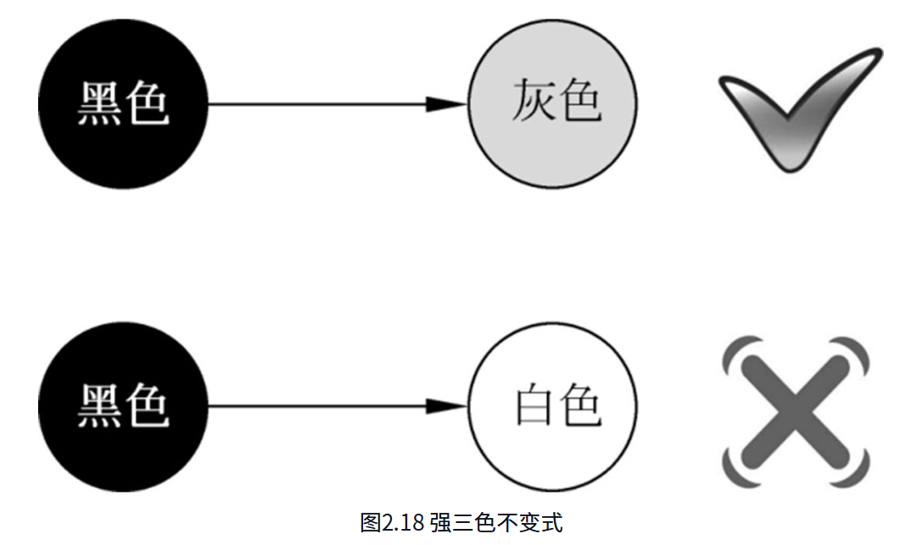

2.弱三色不变式

所有被黑色对象引用的白色对象都处于灰色保护状态，如图2.19所示。

弱三色不变式强调，黑色对象可以引用白色对象，但是这个白色对象必须存在其他灰色对象对它的引用，或者可达它的链路上游存在灰色对象。这样实则是黑色对象引用白色对象，白色对象处于一个危险被删除的状态，但是上游灰色对象的引用，可以保护该白色对象，使其安全。

为了遵循上述两种方式，GC算法演进到两种屏障方式，它们是插入屏障和删除屏障。

### 插入屏障

插入屏障的具体操作是，在A对象引用B对象的时候，B对象被标记为灰色（将B挂在A下游，B必须被标记为灰色）。

插入屏障实际上是满足强三色不变式（不存在黑色对象引用白色对象的情况，因为白色会强制变成灰色）。插入屏障的伪码如下：

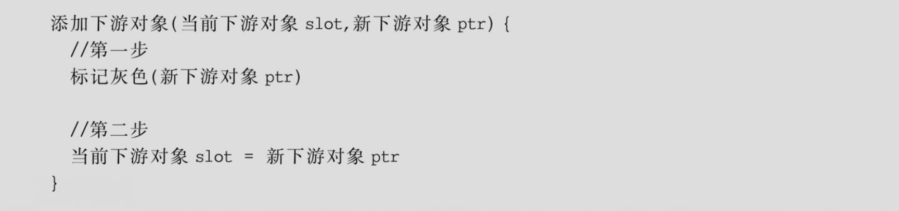

插入写屏障的伪代码的场景如下：

这段伪码逻辑就是写屏障。黑色对象的内存槽有两种位置：栈和堆。栈空间的特点是容量小，但是要求相应速度快，因为函数调用弹出会被频繁地使用，所以插入屏障机制在栈空间的对象操作中不使用，而仅仅使用在堆空间对象的操作中。接下来，通过几张过程图来模拟一个详细的过程，希望读者能够更清晰地看清整体流程。

目前还是假设程序初创建，其中栈空间的对象有对象1、对象2、对象3和对象5，其中对象1引用对象2，对象2引用对象3，对象3没有下游对象，而对象5引用对象2。堆空间有对象4引用对象7，对象7没有下游对象，对象6没有引用任何对象，也没有被任何对象引用。这些内存对象全部标记为白色，在白色标记表中将全部的对象装入其中，如图2.20所示。

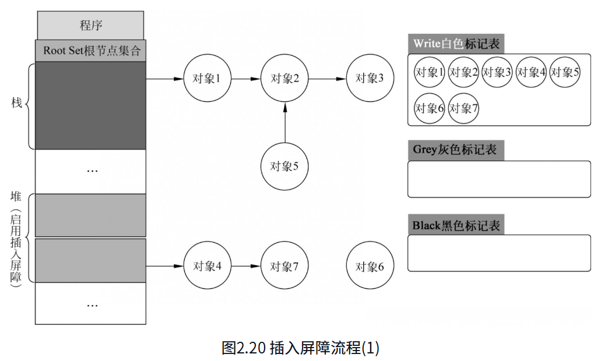

依然依据三色标记的流程，遍历Root Set根节点集合，非递归形式，只遍历一次，能够标记出第一层的灰色节点对象1和对象4，同时这些灰色节点也被添加至灰色标记表中，如图2.21所示。

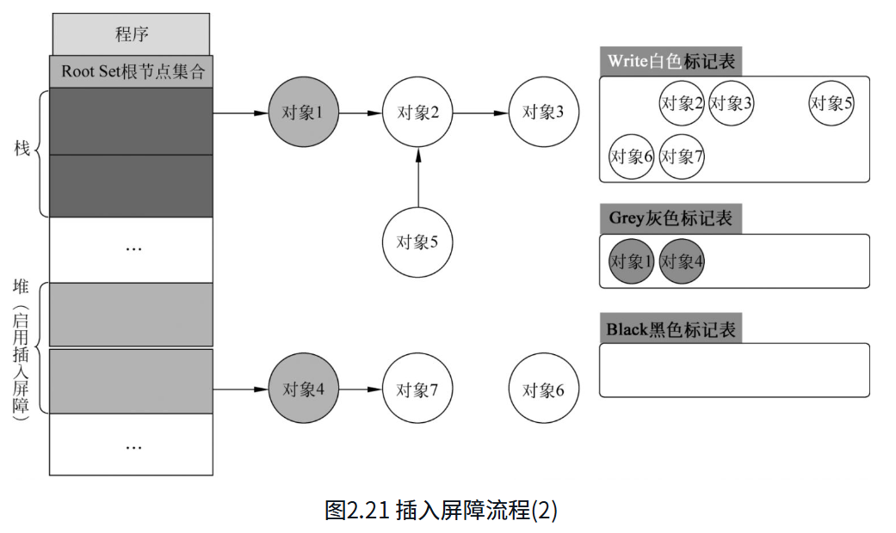

按照三色标记法的顺序来讲解，接下来就遍历灰色标记表中的对象1和对象4，将可达的对象从白色标记为灰色。同时被遍历的灰色对象被标记为黑色，如图2.22所示。

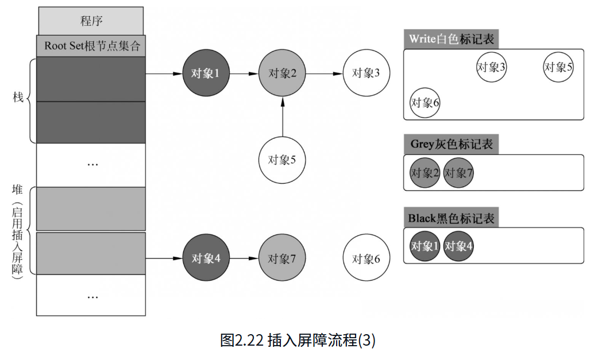

由于并发的特性，此刻外界向已经标记为黑色的对象4添加白色的对象8，向已经标记为黑色的对象1添加下游白色的对象9，如图2.23所示。对象1是栈空间，根据插入屏障的特点，为了保证性能，栈空间创建对象不触发插入屏障，但是对象4在堆空间，此时对象4即将触发插入屏障机制。

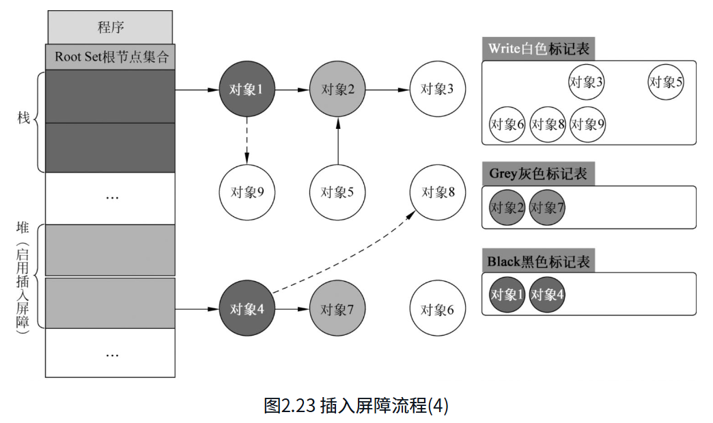

由于插入写屏障的机制（黑色对象添加白色对象，所以将白色对象改为灰色），所以当堆上的对象4添加对象8的时候，对象8将被标记为灰色，而对象9依然是白色，如图2.24所示。

之后就是正常的三色标记流程，继续循环上述的流程，直到没有灰色节点，目前得到的对象状态如图2.25所示，栈空间的对象1、对象2、对象3被标记为黑色，堆空间上的对象4、对象7、对象8被标记为黑色，而其他的对象9、对象5、对象6依然是白色对象。

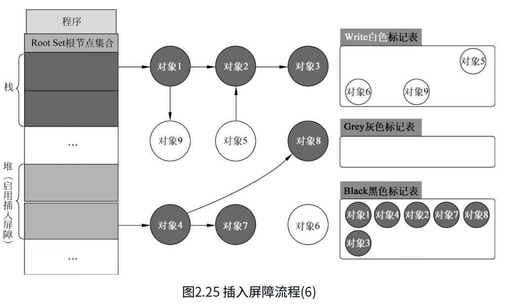

这个时候插入屏障并不会立刻执行垃圾回收动作，而是会做一个额外的扫描，但是如果栈不添加，当全部三色标记扫描之后，栈上有可能依然存在白色对象被引用的情况（如图2.25中的对象9），所以要对栈重新进行三色标记扫描，但这次为了对象不丢失，这次扫描要启动STW暂停，直到栈空间的三色标记结束。

栈空间的全部内存对象均被重新标记为白色（对象1、对象2、对象3、对象9、对象5），而且会对这些白色对象启动STW，使程序暂停，以便将这些白色对象保护起来，所以对以上被保护的对象进行任何读写操作均会被拦截且阻塞，防止外界干扰（如有新的白色对象被黑色对象添加）。

与此同时，对于其他堆空间的对象将不会触发STW，这样也是为了保证堆空间的GC回收性能，如图2.26所示。

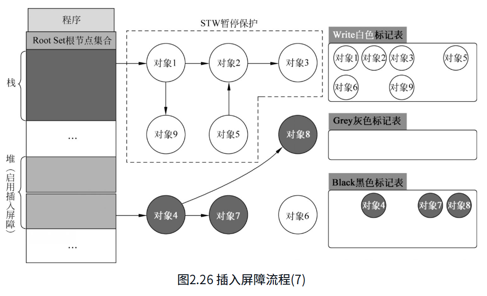

接下来就是在STW所保护的区域内，继续执行三色标记流程，直到全部可达白色对象都被扫描到，即没有灰色节点。最后得到一个最终的状态，对象1、对象2、对象3和对象9均被标记为黑色，由于对象5依然没有被扫描到，所以对象5依然是白色，如图2.27所示。

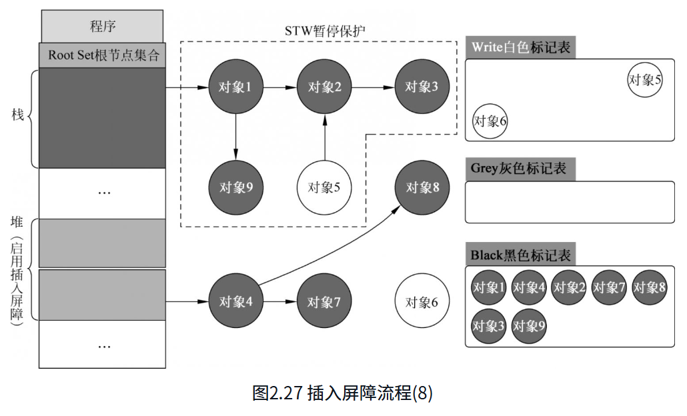

当全部内存对象的颜色只有白色和黑色的时候，就会停止STW，释放保护层，如图2.28所示。

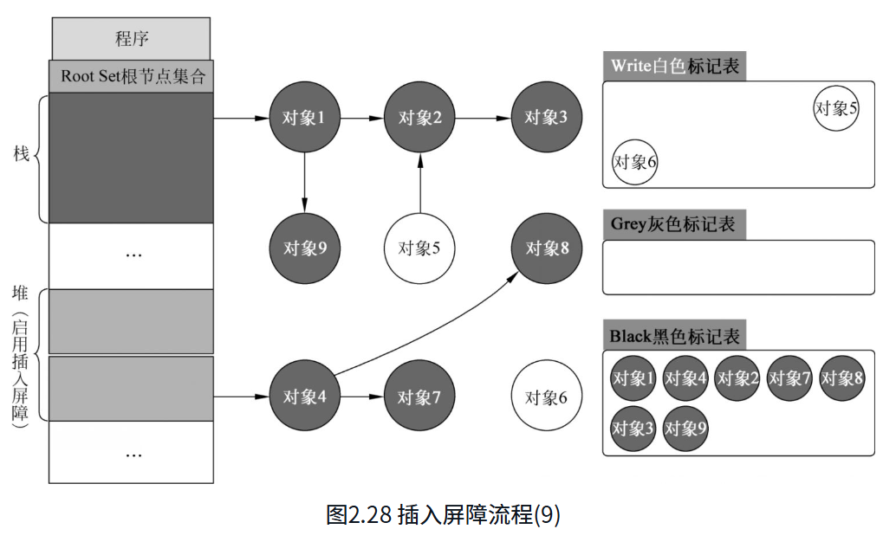

最后将栈和堆空间中扫描后剩余的全部白色节点（对象5和对象6）回收清除。一般在栈空间的这次STW的时间大约为10~100ms。

在最后的扫描之后内存中将全部为黑色对象，如图2.29所示。这样整体的基于插入屏障的三色标记回收机制的流程就介绍完了。

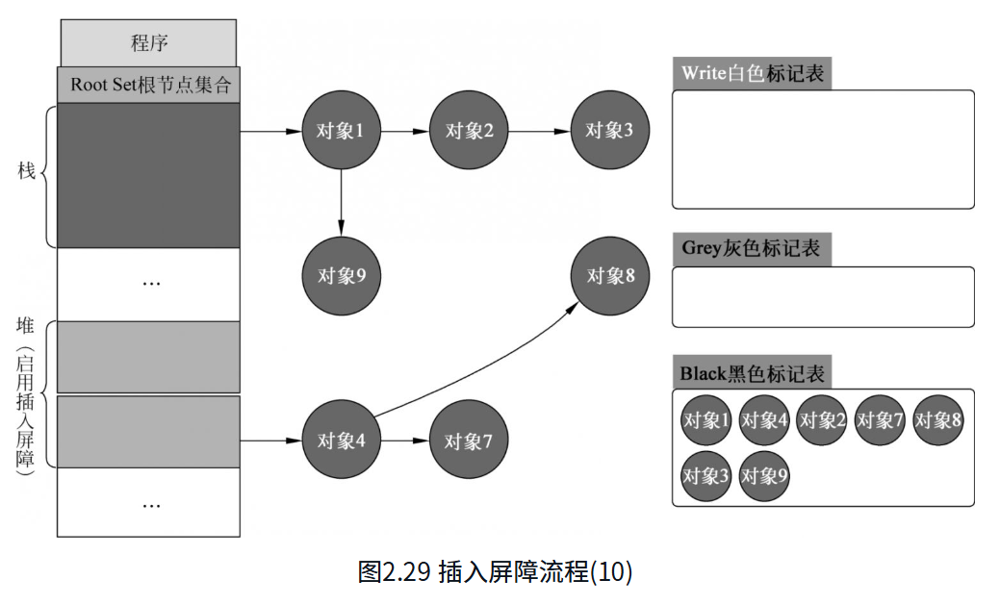

插入屏障的目的是保证黑色对象插入的时候有灰色对象对其保护，或者将被插入的对象变为灰色，插入屏障实则是满足强三色不变式的一种表现，这样就不会出现被误删的白色对象了。

### 删除屏障

删除屏障的具体操作是，被删除的对象，如果自身为灰色或者白色，则被标记为灰色。

删除屏障实际上是满足弱三色不变式，目的是保护灰色对象到白色对象的路径不会断，删除屏障的伪代码如下：

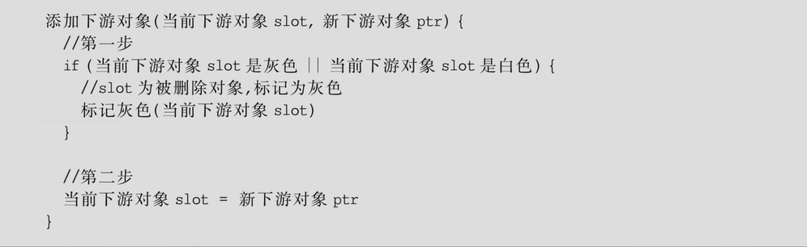

删除屏障的伪代码场景如下：

删除屏障是当一个对象的引用被摘掉的时候，或者当一个对象引用被上游替换的时候，该对象被标记为灰色。标记为灰色的目的：被删除的白色对象，如果又被其他的黑色对象引用，则被删除对象应被回收掉。接下来用几张图来模拟一个详细的过程，这样更容易看清楚整体流程。

如图2.30所示，在开始执行删除屏障的三色标记之前，目前的内存情况如下：在栈空间有对象1引用对象5、对象5引用对象2、对象2引用对象3，对象3没有下游对象。在堆空间有对象4引用对象7，对象7没有下游对象。没有对象引用对象6，对象6也没有下游对象。以上对象全部被标记为白色，并且加入白色标记表中。

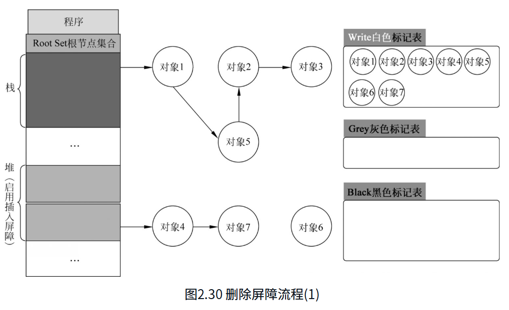

依然依据三色标记的流程，遍历Root Set根节点集合，非递归形式，只遍历一次，能够标记出第一层的灰色节点对象1和对象4，同时这些灰色节点也被添加至灰色标记表中，如图2.31所示。

如果此时灰色对象1删除白色对象5，并且不触发删除屏障机制，则白色对象5连同下游对象2和对象3将与主链路断开，最终也会被清除，如图2.32所示。

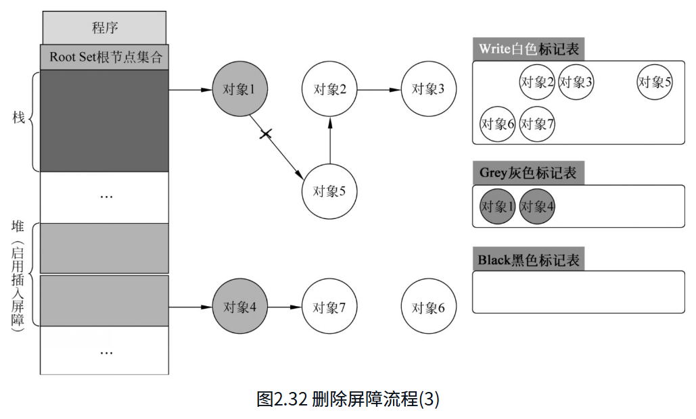

但是目前的三色标记法是删除屏障机制，依照算法，被删除的对象将被标记为灰色，目的是保护对象5和下游对象（思考为什么需要保护，如果不将对象5标记为灰色会出现哪些意外问题？其中有一种情况如图2.31所示，假如对象1已经删除了对象5，对象5依旧是白色，那么由于整体流程没有加STW保护，极有可能在删除的过程中，同一时刻有一个已经被标记为黑色的对象引用了这个对象5，对象5依然是程序流程中需要依赖的合法内存对象，但是最终会按照白色对象被GC回收掉，因为黑色的下游对象并不会被保护起来），将对象5标记成了灰色，如图2.33所示。

按照三色标记法的顺序，接下来遍历灰色标记表中的对象1、对象4和对象5，将它们可达的对象从白色标记为灰色。同时被遍历的灰色对象被标记为黑色，如图2.34所示，这轮流程下来后，对象1、对象4和对象5会被标记为黑色，对象2和对象7会被标记为灰色，对象3和对象6依旧是白色。

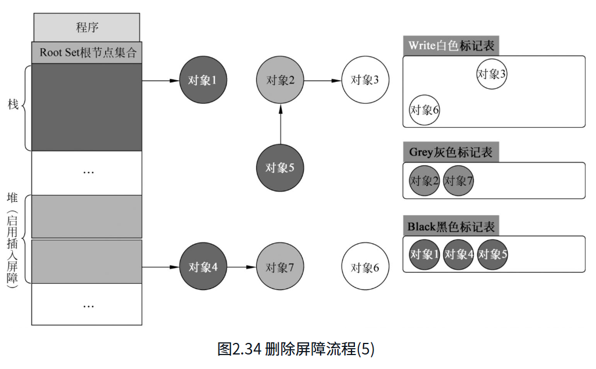

继续循环上述流程进行三色标记，直到没有灰色节点，最终的状态如图2.35所示，除了对象6，全部的节点均被标记成黑色。

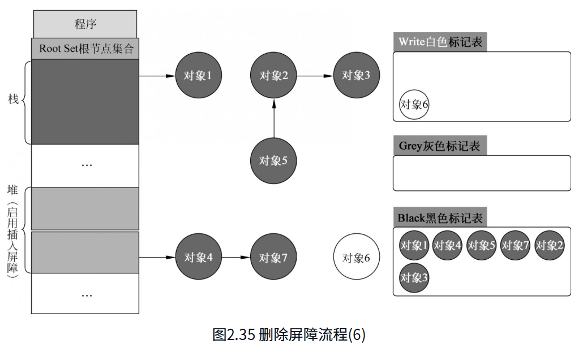

最后，执行回收清除流程，将白色对象全部通过GC回收处理，如图2.36所示。

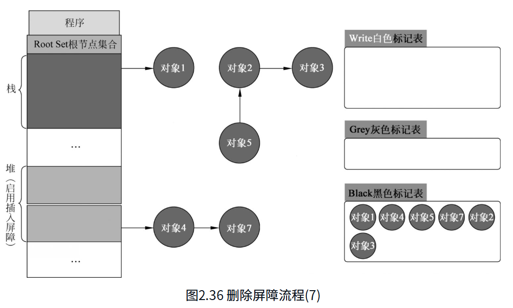

以上便是三色标记利用删除屏障的处理流程，删除屏障依旧可以满足并行状态下的垃圾回收动作，但是这种方式的回收精度较低，因为一个对象即使被删除了，最后一个指向它的指针也依旧可以“活”过这一轮，只有等到下一轮GC才会被清理掉。

### 成就与遗留问题

成就：STW 时间从几百毫秒降到了几十毫秒级别，这是一个巨大的进步。

问题：

1. 栈扫描需要 STW：为了保证栈的性能，写屏障没有应用到栈空间的操作上，导致在标记结束时必须 STW 并重新扫描栈，这会产生一个短暂的停顿。
2. 性能损耗：插入写屏障需要对几乎所有指针写操作进行拦截，有一定的性能开销。

## Go V1.8 的混合写屏障

## GC回收目标

Go GC 的主要目标是回收堆（Heap）上不再使用的内存，但它必须通过扫描栈（Stack）等根对象来确定哪些堆内存是仍然存活的。

**堆（Heap）**：这是用于存储生命周期超出当前函数范围的对象的区域。当你使用 `new`关键字或者进行逃逸分析后分配到堆上的对象，它们的内存就位于堆上。

**为什么堆需要GC**：因为堆上的对象没有固定的所有者，它们的生命周期是动态的、全局的。一个对象可能被多个其他对象引用，很难在编译期确定它何时不再被需要。如果只分配不回收，堆内存最终会被耗尽，导致程序崩溃。因此，必须有一个自动的机制（垃圾回收器）来负责清理这些“垃圾”。

但是，为了知道堆上的哪些内存是垃圾，GC 必须从“根对象”开始遍历。这些根对象包括：

- 各个 Goroutine 的栈（Stack）：栈上存储着局部变量、函数参数、返回值等。这些变量可能直接指向堆上的对象。
- 全局变量区：全局变量同样可能引用着堆上的对象。

栈内存的回收与 GC 无关

- 栈（Stack）：每个 Goroutine 在创建时都会有自己的栈空间，用于存储函数调用时的局部变量。这些变量的生命周期非常明确——随着函数调用结束而结束。
- 回收方式：栈内存的分配和回收是极其高效和廉价的，它直接通过编译器生成的控制指令来完成。当一个函数返回时，将栈指针（SP）移动回调用前的地址即可。这相当于一次性释放了该函数调用所占用的所有栈内存。这个过程不需要垃圾回收器的参与，速度极快。

# 逃逸现象

# new与make

