# 垃圾回收

垃圾回收(Garbage Collection，GC)是编程语言中提供的自动内存管理机制，GC能够自动释放不需要的内存对象，让出存储器资源，其释放过程中无须程序员手动执行。GC机制在现代很多编程语言得到支持，针对GC性能的优劣程度，也是不同语言之间的对比指标之一。

Go语言在GC的演进过程中也经历了很多次变革，具体的几次重大改变如下：

(1) Go V1.3 及之前的标记清除(Mark and Sweep)法。

(2) Go V1.5 的并发三色标记法。“强-弱”三色不变式、插入屏障、删除屏障。

(3) Go V1.8 混合写屏障机制。

本章节将介绍每种GC的算法模型和各自的优缺点，以及Go语言的GC如何一步步演进到混合写屏障的模式。

## Go V1.3 标记-清除算法

(1) 第一步，暂停程序业务逻辑，对可达和不可达的对象进行分类，然后做上标记。图2.1中表示的是程序与对象的可达关系，目前程序的可达对象有对象1→2→3，对象4→7等5个对象。

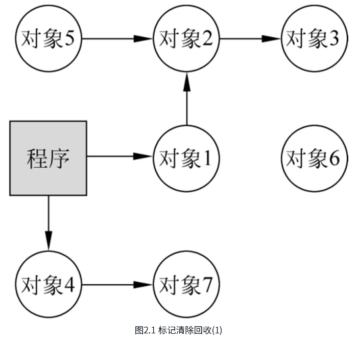

(2) 第二步，开始标记。程序找出它所有可达的对象，并做上标记，如图2.2所示。对象1→2→3、对象4→7等5个对象被做上标记。

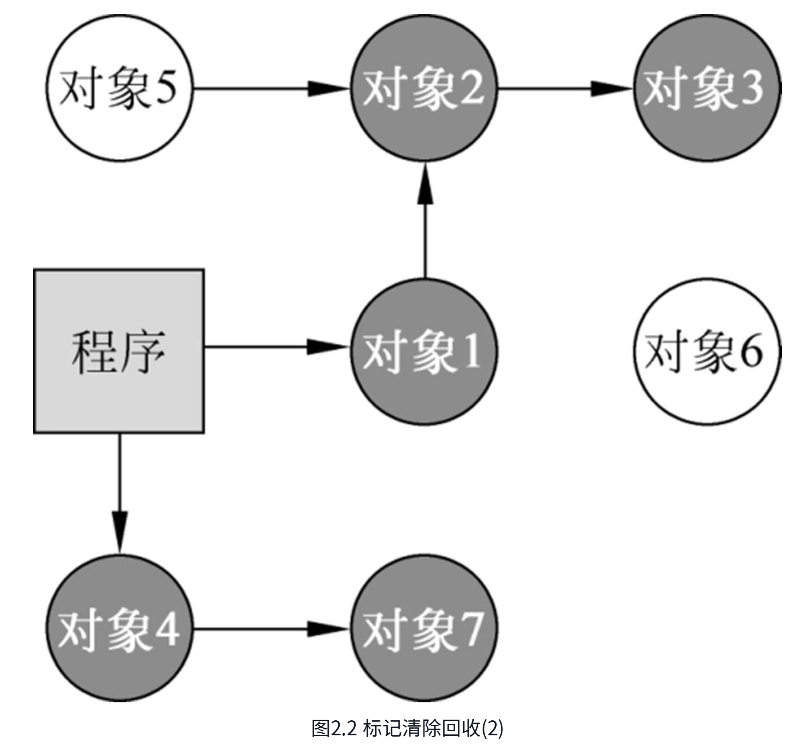

(3) 第三步，标记完了之后，开始清除未标记的对象，如图2.3所示。

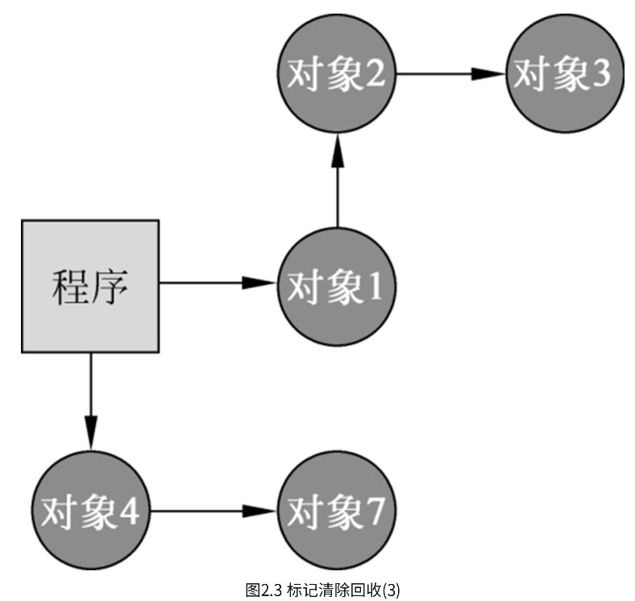

操作非常简单，但是有一点需要特别注意，Mark and Sweep算法在执行的时候，需要暂停程序，即STW(Stop The World)。在STW的过程中，CPU不执行用户代码，全部用于垃圾回收，这个过程影响很大，所以STW也是回收机制最大的难题和希望优化的点，所以在执行第三步的这段时间，程序会暂时停止工作，卡在那等待回收执行完毕。

(4) 第四步，停止暂停，让程序继续运行，然后重复这个过程，直到程序生命周期结束。

以上便是标记清除回收的算法。

### 标记清除算法的缺点

标记清除算法简单明了，过程鲜明干脆，但是也有非常严重的问题：第一是STW让程序暂停，所以程序会出现卡顿，这是一个重要的问题；第二是标记需要扫描整个Heap；第三是清除数据会产生Heap碎片。

Go V1.3版本之前就是采用以上方式来实施的，执行GC的基本流程就是首先启动STW，使程序暂停，然后执行标记，再执行数据回收，最后停止STW，如图2.4所示。

从图2.4来看，全部的GC时间都是包裹在STW范围之内的，这样程序暂停的时间会很长，影响程序的运行性能，所以Go V1.3做了简单的优化，将STW的步骤提前，缩小STW暂停的时间范围，如图2.5所示。

图2.5主要是将STW的步骤提前了一步，因为在Sweep清除的时候，可以不需要STW，因为这些对象已经是不可达对象了。

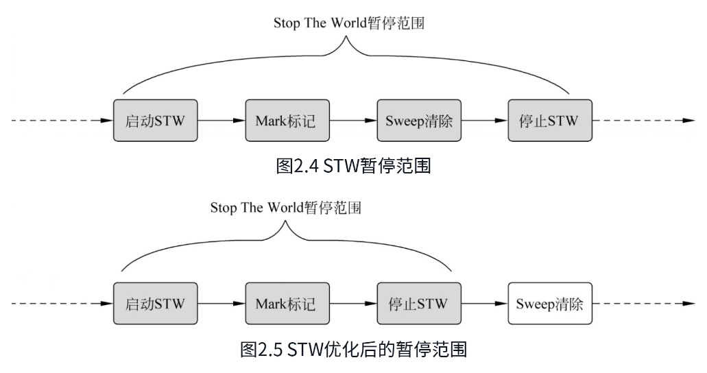

如果堆内存很大或者对象非常多，STW可能会持续几百毫秒甚至更长，对于需要高并发的服务来说这是无法接受的。

## Go V1.5 的三色标记法

这是 Go GC 的一次里程碑式的飞跃，目标是实现并发垃圾回收，即 GC 的大部分工作与用户 Goroutine 同时运行，从而极大地缩短 STW 时间。

GC 期间，将对象分为三类：

- **白色**：初始状态，表示尚未被扫描到的对象（可能是垃圾）。
- **灰色**：中间状态，表示对象本身已被标记，但其引用的子对象还未被扫描。
- **黑色**：最终状态，表示对象及其引用的子对象都已被标记，是存活对象。

标记过程就是从根对象开始，将灰色对象不断染黑的过程。标记结束后，剩余的白色对象就是需要被回收的垃圾。

### 三色标记法的过程

第一步，每次新创建的对象，默认的颜色都被标记为“白色”，如图2.6所示。

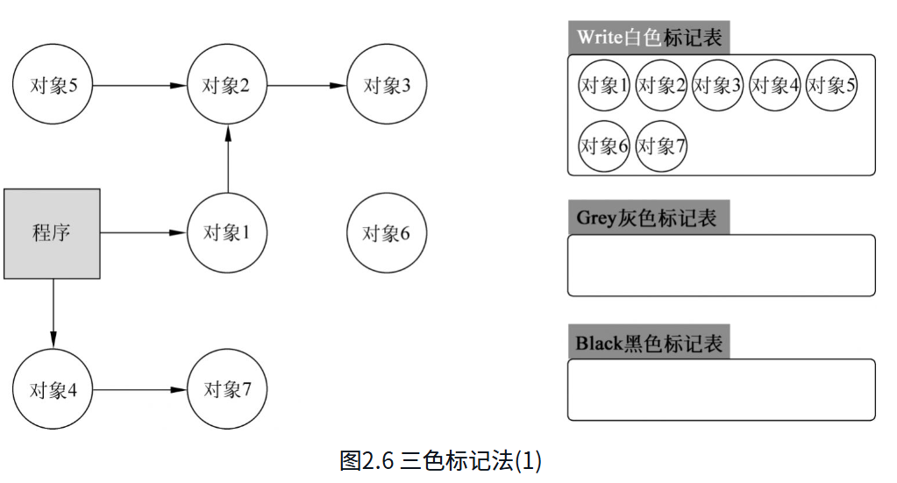

如图2.6所示，左边为程序可抵达的对象关系，右边的标记表用来记录目前每个对象的标记颜色分类。这里需要注意的是，所谓“程序”，则是一些对象的根节点集合，所以如果将“程序”展开，则会得到类似如下的表现形式，如图2.7所示。

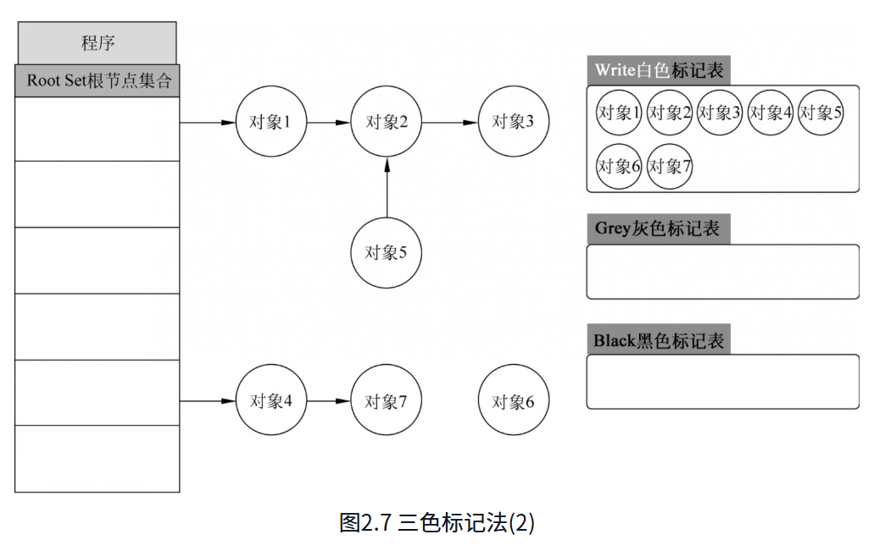

第二步，每次执行GC回收，都会从根节点开始遍历所有对象，把遍历到的对象从白色集合放入“灰色”集合，如图2.8所示。

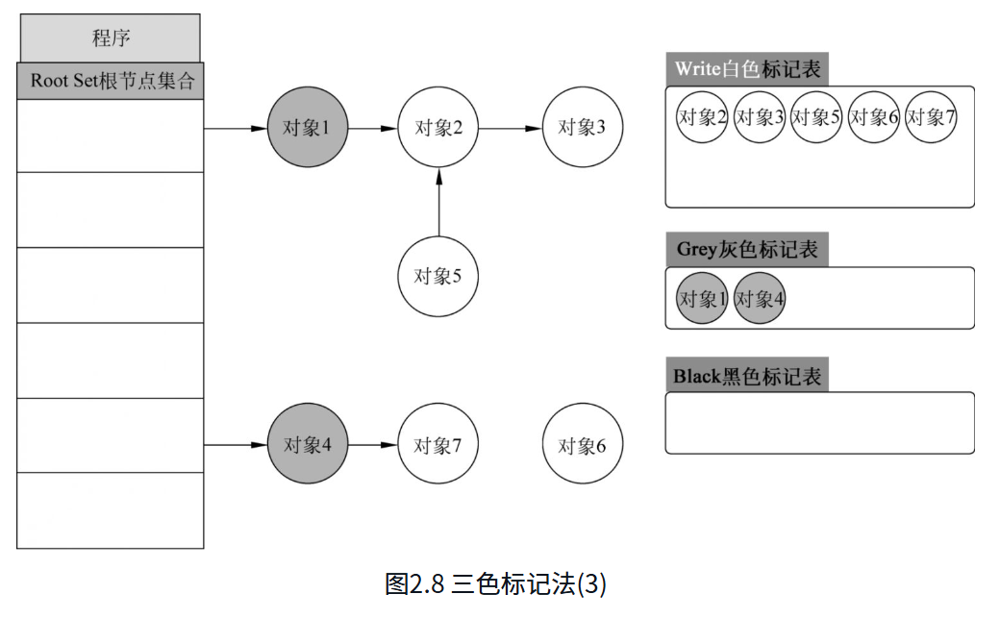

这里需要注意的是，本次遍历是一次遍历，是从程序抽出可抵达的对象遍历一层，如图2.8所示，当前可抵达的对象是对象1和对象4，表示本轮遍历结束，对象1和对象4会被标记为灰色，灰色标记表就会多出这两个对象。

第三步，遍历灰色集合，将灰色对象引用的对象从白色集合放入灰色集合，之后将此灰色对象放入黑色集合，如图2.9所示。

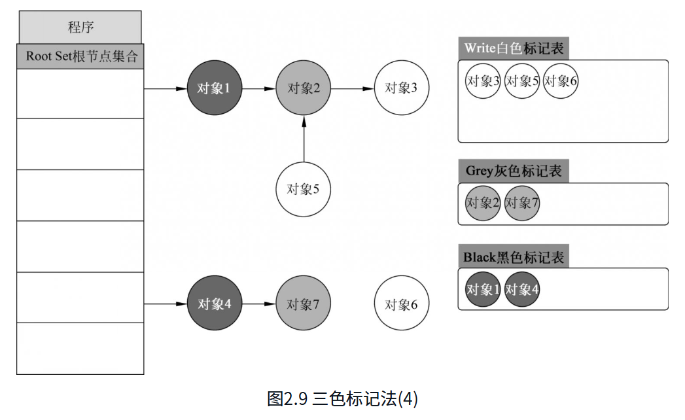

这一次遍历只扫描灰色对象，将灰色对象的第一层遍历可抵达的对象由白色变为灰色，如对象2、对象7，而之前的灰色对象1和对象4则会被标记为黑色，同时由灰色标记表移动到黑色标记表中。

第四步，重复第三步，直到灰色中无任何对象，如图2.10和图2.11所示。

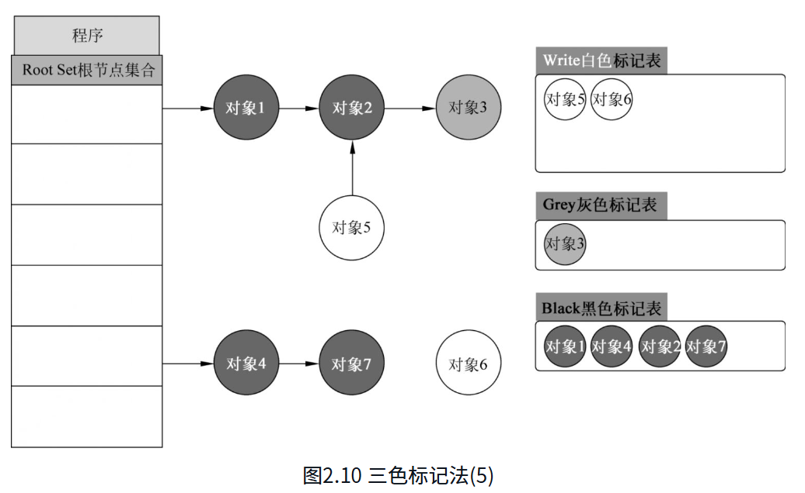

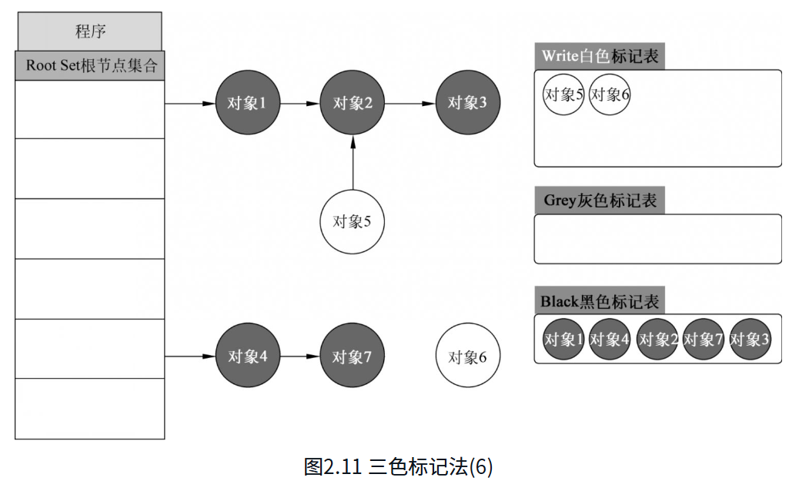

当全部的可达对象都遍历完后，灰色标记表将不再存在灰色对象，目前全部内存的数据只有两种颜色，即黑色和白色。黑色对象就是程序逻辑可达（需要的）对象，这些数据目前支撑程序正常业务运行，是合法的有用数据，不可删除，白色的对象是全部不可达对象，目前程序逻辑并不依赖它们，所以白色对象就是内存中目前的垃圾数据，需要被清除。

第五步，回收所有的白色标记表的对象，也就是回收垃圾，如图2.12所示。将全部的白色对象进行删除回收，剩下的就是全部依赖的黑色对象。

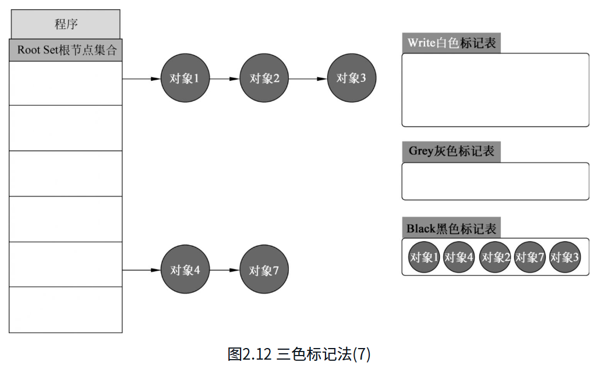

以上便是三色并发标记法，不难看出，上面已经清楚地体现了三色的特性，但是为了在GC过程中保证数据的安全，在开始三色标记之前会加上STW，在扫描确定黑白对象之后再放开STW，但是很明显这样GC的性能实在是太低了。

### 没有STW的三色标记法

先抛砖引玉，假如没有STW，那么也就不会存在性能上的问题了，三色标记法如果不加入STW会发生什么事情呢？接下来具体推演一下此过程。

把初始状态设置为已经经历了第一轮扫描，目前黑色的对象有对象1和对象4，灰色的对象有对象2和对象7，其他的对象为白色对象，并且对象2是通过指针p指向对象3的，如图2.13所示。

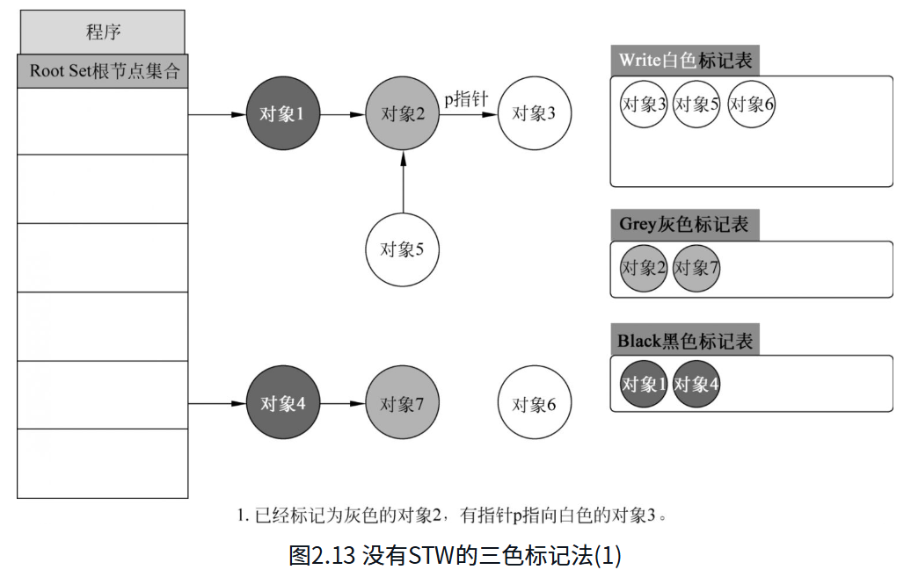

现在如果在三色标记过程中不启动STW，则在GC扫描过程中，任意的对象均可能发生读写操作，如图2.14所示，在还没有扫描到对象2的时候，已经将对象4标记为黑色，此时创建指针q，并且指向白色的对象3。


与此同时灰色的对象2将指针p移除，此时白色的对象3被挂在已经扫描完成的黑色对象4下，如图2.15所示。

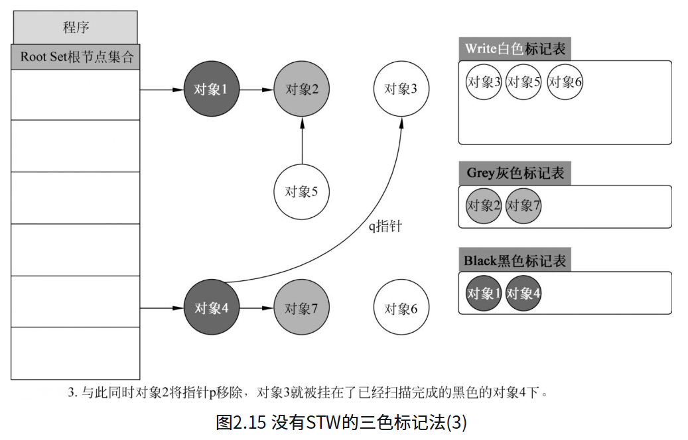

然后按照正常三色标记的算法逻辑，将所有灰色的对象标记为黑色，这样对象2和对象7就被标记成了黑色，如图2.16所示。

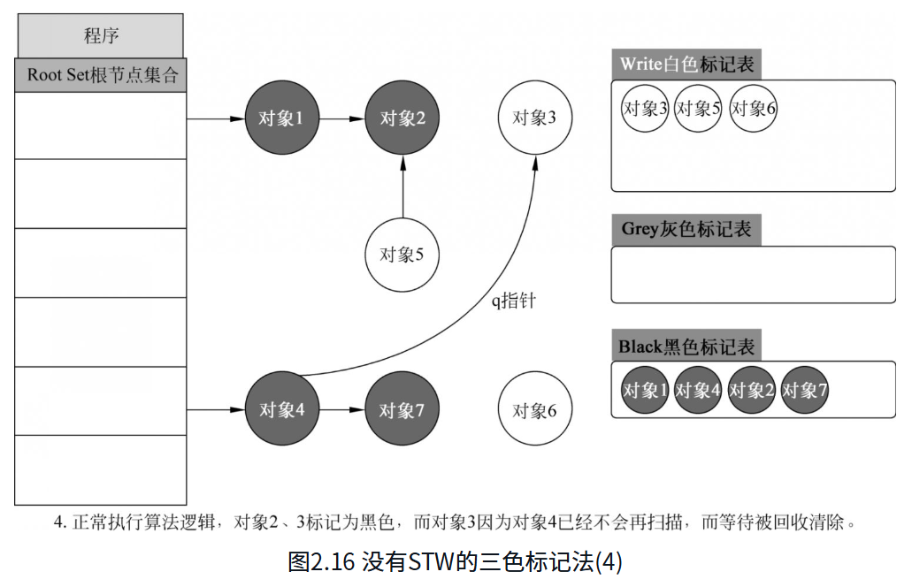

接下来就执行到了三色标记的最后一步，将所有白色对象当作垃圾进行回收，如图2.17所示。

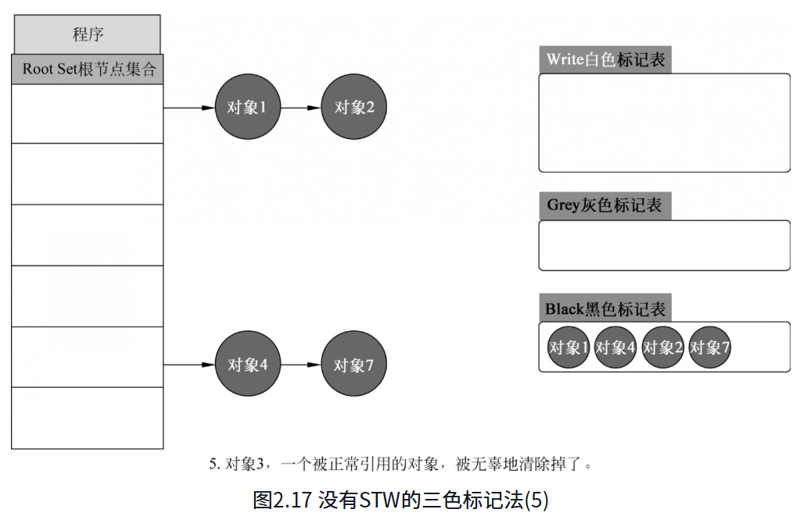

但是最后得到的结果却是，本来是对象4合法引用的对象3，最后被GC给“误杀”回收掉了，这并不是Go语言回收和开发者希望看到的。

### 触发三色标记法不安全的必要条件

可以看出，有两种情况在三色标记法中是不希望发生的。

(1) 条件1：一个白色对象被黑色对象引用（白色被挂在黑色下）。

(2) 条件2：灰色对象与它之间的可达关系的白色对象遭到破坏（灰色丢了该白色）。

**如果当以上两个条件同时满足，就会出现对象丢失现象。**并且，在如图2.17所示的场景中，如果示例中的白色对象3还有很多下游对象，也会一并都被清理掉。

为了防止这种现象的发生，最简单的方式就是STW，直接禁止用户程序对对象引用关系的干扰，但是STW的过程有明显的资源浪费，对用户程序有很大影响。那么是否可以在保证对象不丢失的情况下合理地尽可能地提高GC效率，减少STW时间呢？答案是可以的，只要使用一种机制，尝试去破坏上面的两个必要条件就可以了。


## Go V1.5 的屏障机制

**GC回收器在满足下面两种情况之一时，即可确保对象不丢失。**这两种情况就是强三色不变式和弱三色不变式。

### “强-弱”三色不变式

1、强三色不变式

不存在黑色对象引用到白色对象的指针，如图2.18所示。强三色不变式实际上是强制性地不允许黑色对象引用白色对象，这样就不会出现白色对象被误删的情况。

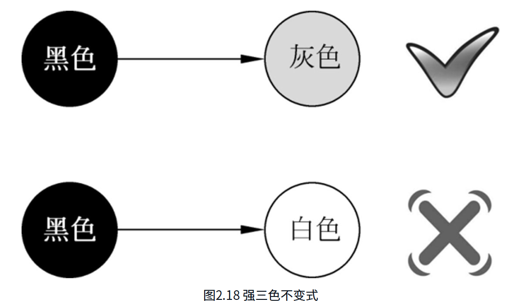

2、弱三色不变式

所有被黑色对象引用的白色对象都处于灰色保护状态，如图2.19所示。

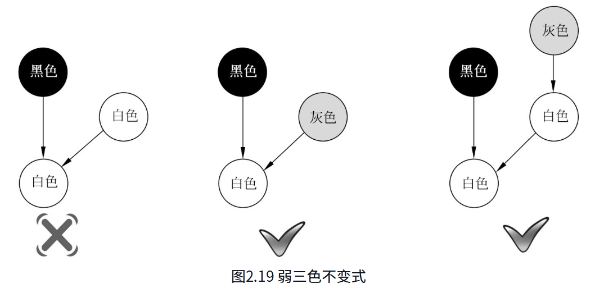

弱三色不变式强调，黑色对象可以引用白色对象，但是这个白色对象必须存在其他灰色对象对它的引用，或者可达它的链路上游存在灰色对象。这样实则是黑色对象引用白色对象，白色对象处于一个危险被删除的状态，但是上游灰色对象的引用，可以保护该白色对象，使其安全。

为了遵循上述两种方式，GC算法演进到两种屏障方式，它们是插入屏障和删除屏障。

### 插入屏障

插入屏障的具体操作是，在A对象引用B对象的时候，B对象被标记为灰色（将B挂在A下游，B必须被标记为灰色）。

插入屏障实际上是满足强三色不变式（不存在黑色对象引用白色对象的情况，因为白色会强制变成灰色）。插入屏障的伪码如下：

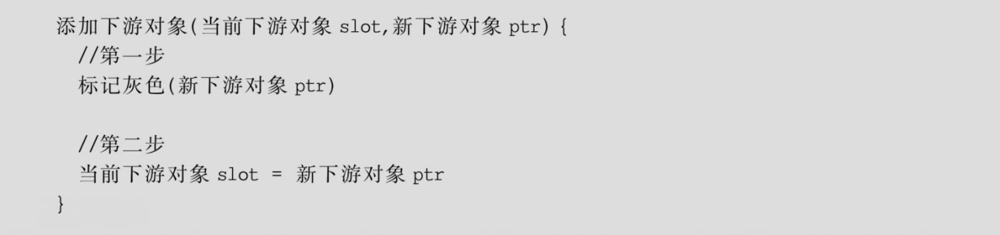

插入写屏障的伪代码的场景如下：


这段伪码逻辑就是写屏障。黑色对象的内存槽有两种位置：栈和堆。栈空间的特点是容量小，但是要求响应速度快，因为函数调用弹出会被频繁地使用，所以插入屏障机制在栈空间的对象操作中不使用，而仅仅使用在堆空间对象的操作中。接下来，通过几张过程图来模拟一个详细的过程，希望读者能够更清晰地看清整体流程。

目前还是假设程序初创建，其中栈空间的对象有对象1、对象2、对象3和对象5，其中对象1引用对象2，对象2引用对象3，对象3没有下游对象，而对象5引用对象2。堆空间有对象4引用对象7，对象7没有下游对象，对象6没有引用任何对象，也没有被任何对象引用。这些内存对象全部标记为白色，在白色标记表中将全部的对象装入其中，如图2.20所示。


依然依据三色标记的流程，遍历Root Set根节点集合，只遍历一次，能够标记出第一层的灰色节点对象1和对象4，同时这些灰色节点也被添加至灰色标记表中，如图2.21所示。

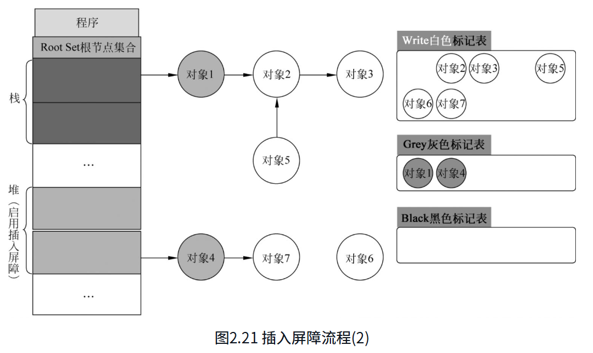

按照三色标记法的顺序来讲解，接下来就遍历灰色标记表中的对象1和对象4，将可达的对象从白色标记为灰色。同时被遍历的灰色对象被标记为黑色，如图2.22所示。

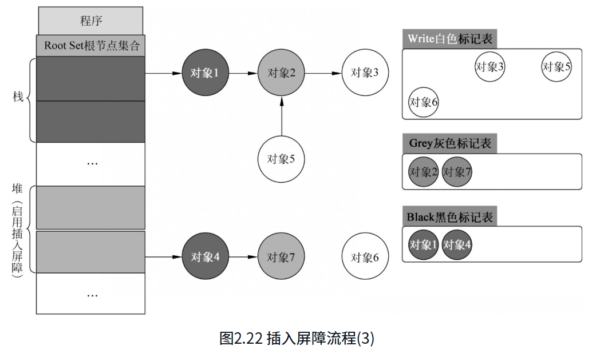

由于并发的特性，此刻外界向已经标记为黑色的对象4添加白色的对象8，向已经标记为黑色的对象1添加下游白色的对象9，如图2.23所示。**对象1是栈空间，根据插入屏障的特点，为了保证性能，栈空间创建对象不触发插入屏障，但是对象4在堆空间，此时对象4即将触发插入屏障机制。**

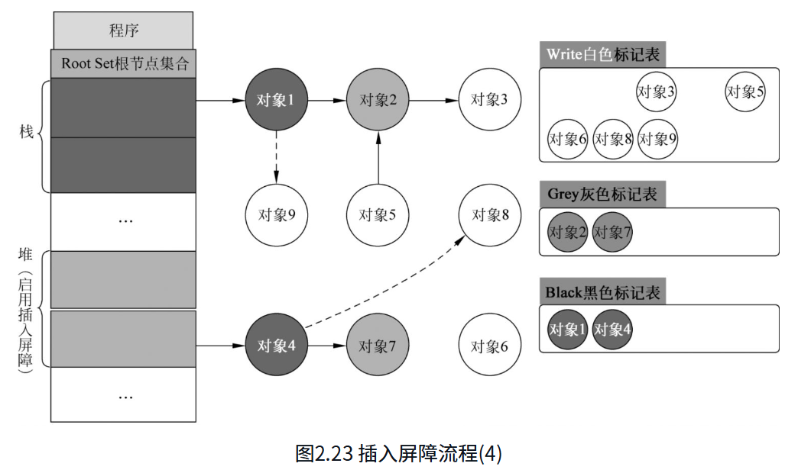

由于插入写屏障的机制（黑色对象添加白色对象，所以将白色对象改为灰色），所以当堆上的对象4添加对象8的时候，对象8将被标记为灰色，而对象9依然是白色，如图2.24所示。


之后就是正常的三色标记流程，继续循环上述的流程，直到没有灰色节点，目前得到的对象状态如图2.25所示，栈空间的对象1、对象2、对象3被标记为黑色，堆空间上的对象4、对象7、对象8被标记为黑色，而其他的对象9、对象5、对象6依然是白色对象。

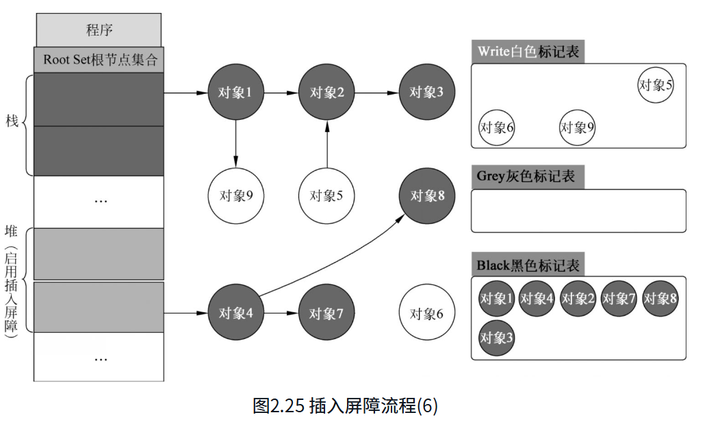

这个时候插入屏障并不会立刻执行垃圾回收动作，而是会做一个额外的扫描；**因为栈不触发插入屏障，当全部三色标记扫描之后，栈上有可能依然存在白色对象被引用的情况（如图2.25中的对象9），所以要对栈重新进行三色标记扫描，但这次为了对象不丢失，这次扫描要启动STW，直到栈空间的三色标记结束。**

栈空间的全部内存对象均被重新标记为白色（对象1、对象2、对象3、对象9、对象5），而且会对这些白色对象启动STW，使程序暂停，以便将这些白色对象保护起来，所以对以上被保护的对象进行任何读写操作均会被拦截且阻塞，防止外界干扰。

与此同时，对于其他堆空间的对象将不会触发STW，这样也是为了保证堆空间的GC回收性能，如图2.26所示。

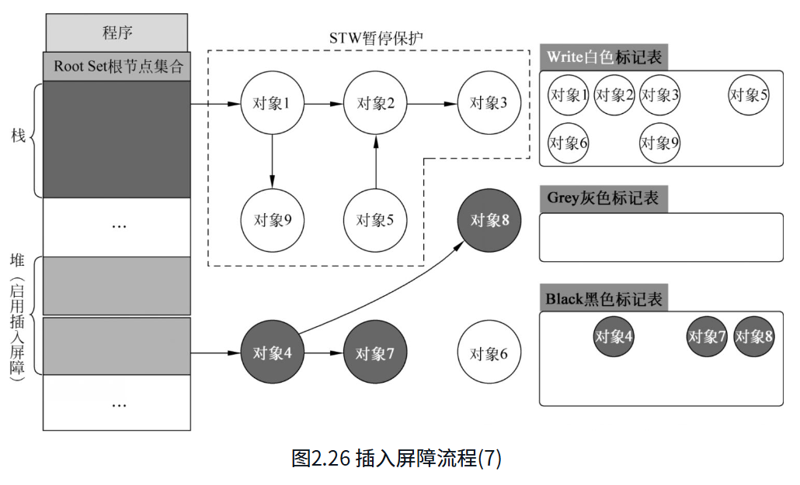

接下来就是在STW所保护的区域内，继续执行三色标记流程，直到全部可达白色对象都被扫描到，即没有灰色节点。最后得到一个最终的状态，对象1、对象2、对象3和对象9均被标记为黑色，由于对象5依然没有被扫描到，所以对象5依然是白色，如图2.27所示。

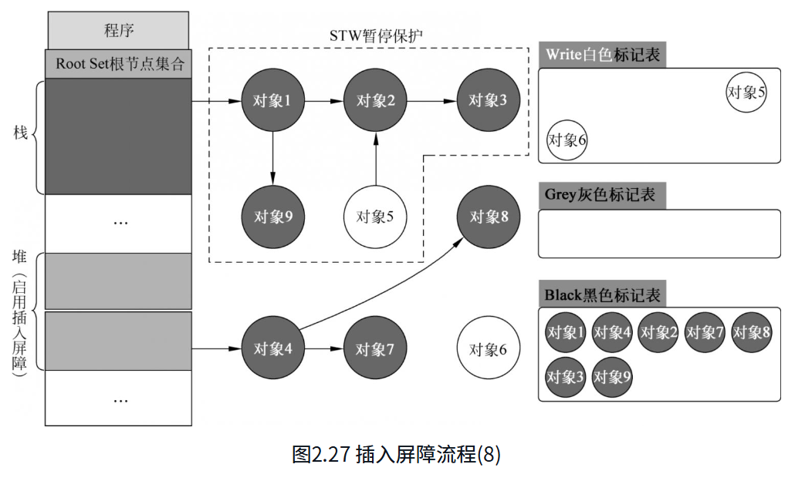

当全部内存对象的颜色只有白色和黑色的时候，就会停止STW，释放保护层，如图2.28所示。

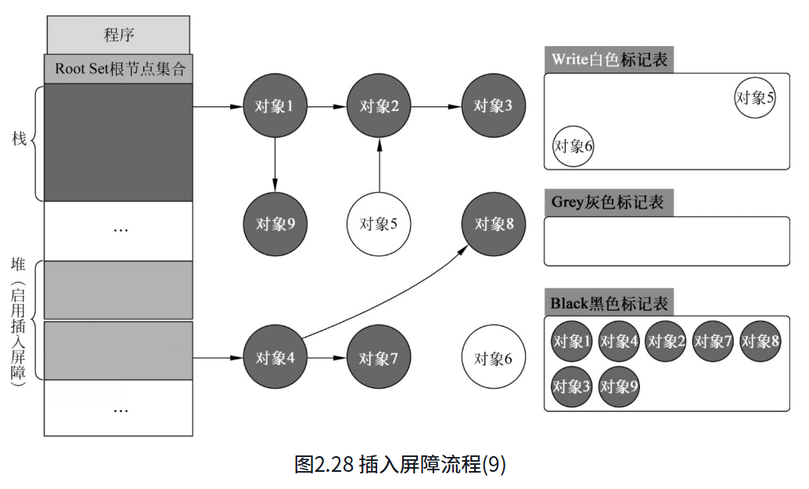

最后将栈和堆空间中扫描后剩余的全部白色节点（对象5和对象6）回收清除。一般在栈空间的这次STW的时间大约为10~100ms。

在最后的扫描之后内存中将全部为黑色对象，如图2.29所示。这样整体的基于插入屏障的三色标记回收机制的流程就介绍完了。

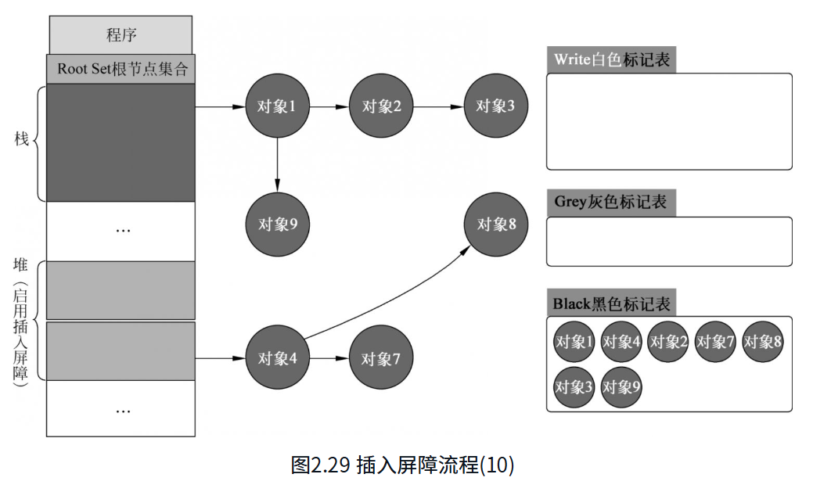

插入屏障的目的是保证黑色对象插入白色对象的时候使用灰色对象的特性对其保护，或者说将被插入的对象变为灰色，插入屏障实则是满足强三色不变式的一种表现，这样就不会出现被误删的白色对象了。（这里的“灰色对象”在插入屏障的策略下，就是被插入的白色对象本身。屏障不需要找一个外部的灰色对象来“保护”它，而是直接将它变成灰色，让它自己保护自己（进入待扫描队列））

### 删除屏障

删除屏障的具体操作是，被删除的对象，如果自身为灰色或者白色，则被标记为灰色。

删除屏障实际上是满足弱三色不变式，删除屏障的伪代码如下：

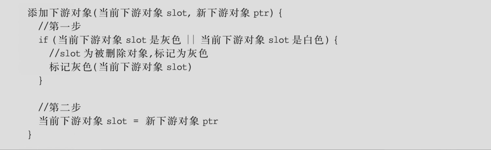

删除屏障的伪代码场景如下：


删除屏障是当一个对象的引用被摘掉的时候，或者当一个对象引用被上游替换的时候，该对象被标记为灰色。标记为灰色的目的：被删除的白色对象，如果又被其他的黑色对象引用，则被删除对象就会被误回收掉。接下来用几张图来模拟一个详细的过程，这样更容易看清楚整体流程。

如图2.30所示，在开始执行删除屏障的三色标记之前，目前的内存情况如下：在栈空间有对象1引用对象5、对象5引用对象2、对象2引用对象3，对象3没有下游对象。在堆空间有对象4引用对象7，对象7没有下游对象。没有对象引用对象6，对象6也没有下游对象。以上对象全部被标记为白色，并且加入白色标记表中。

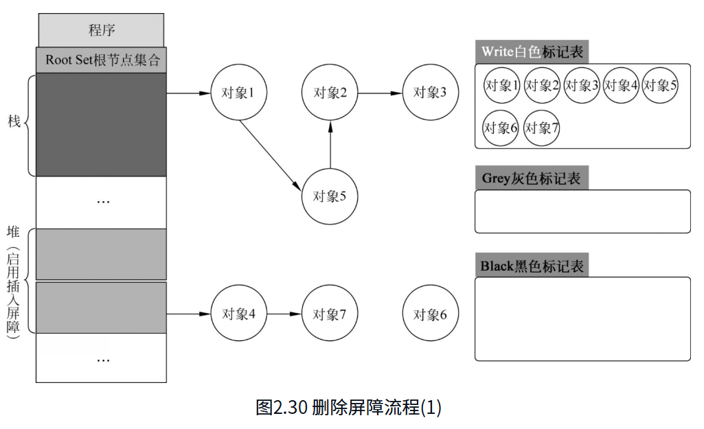

依然依据三色标记的流程，遍历Root Set根节点集合，非递归形式，只遍历一次，能够标记出第一层的灰色节点对象1和对象4，同时这些灰色节点也被添加至灰色标记表中，如图2.31所示。


如果此时灰色对象1删除白色对象5，并且不触发删除屏障机制，则白色对象5连同下游对象2和对象3将与主链路断开，最终也会被清除，如图2.32所示。

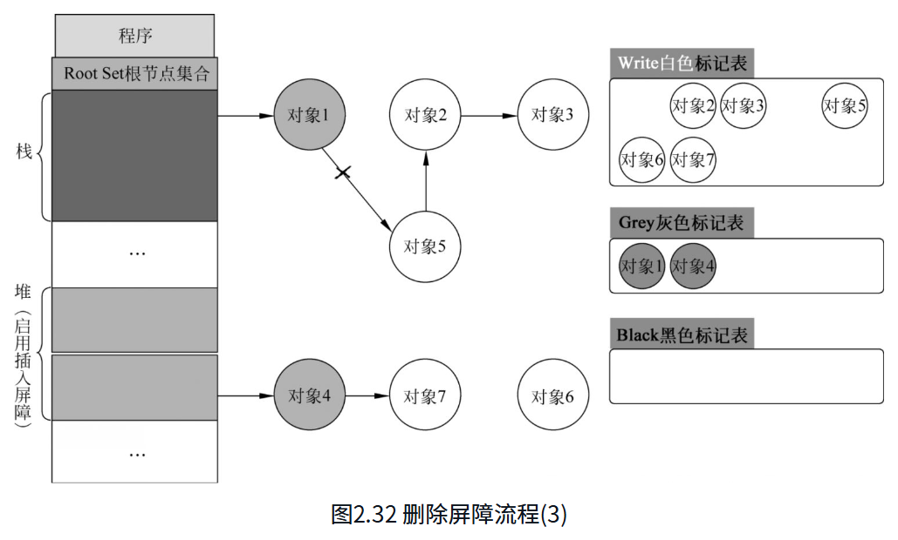

但是目前的三色标记法是删除屏障机制，依照算法，被删除的对象将被标记为灰色，目的是保护对象5和下游对象（思考为什么需要保护，如果不将对象5标记为灰色会出现哪些意外问题？其中有一种情况如图2.31所示，假如对象1已经删除了对象5，对象5依旧是白色，那么由于整体流程没有加STW保护，极有可能在删除的过程中，同一时刻有一个已经被标记为黑色的对象引用了这个对象5，对象5依然是程序流程中需要依赖的合法内存对象，但是最终会按照白色对象被GC回收掉，因为黑色的下游对象并不会被保护起来），将对象5标记成了灰色，如图2.33所示。

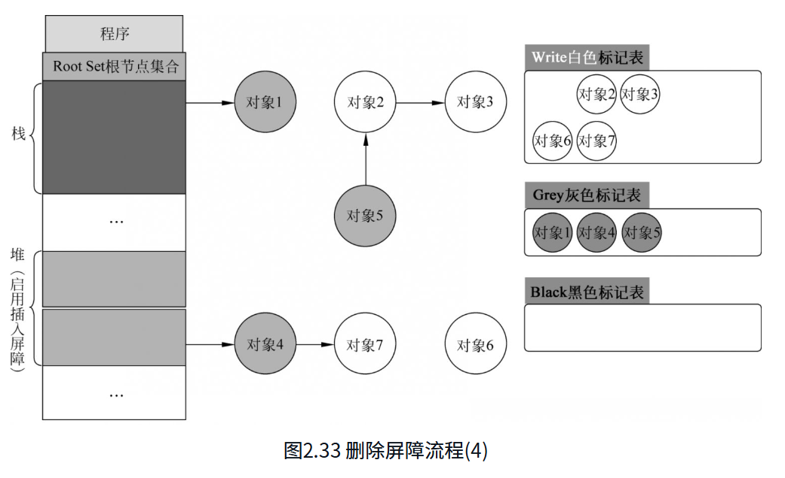

按照三色标记法的顺序，接下来遍历灰色标记表中的对象1、对象4和对象5，将它们可达的对象从白色标记为灰色。同时被遍历的灰色对象被标记为黑色，如图2.34所示，这轮流程下来后，对象1、对象4和对象5会被标记为黑色，对象2和对象7会被标记为灰色，对象3和对象6依旧是白色。

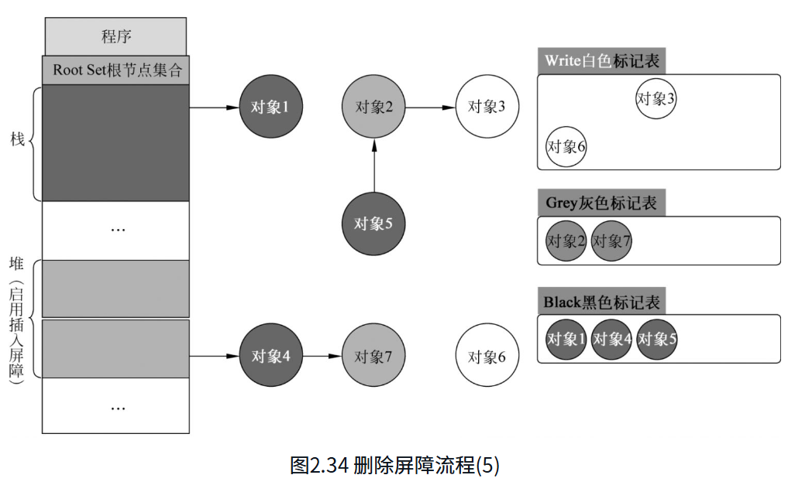

继续循环上述流程进行三色标记，直到没有灰色节点，最终的状态如图2.35所示，除了对象6，全部的节点均被标记成黑色。

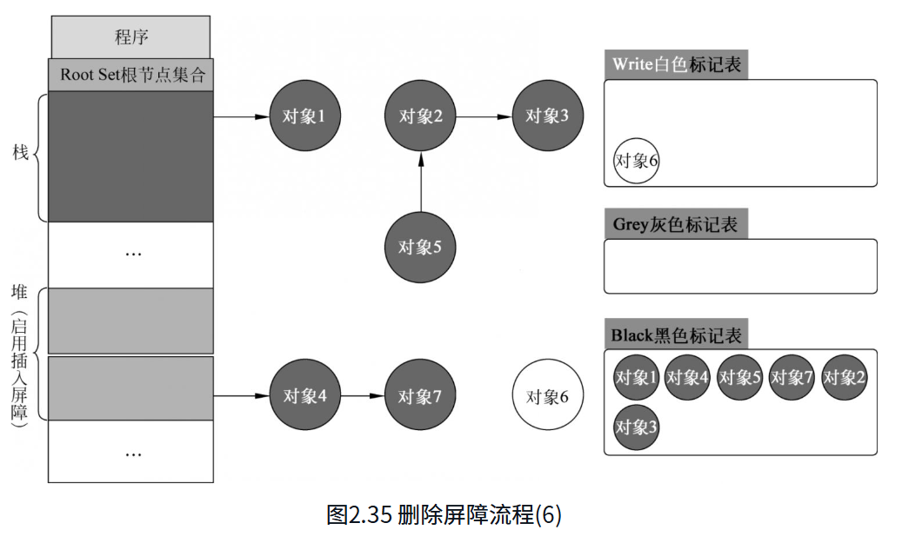

最后，执行回收清除流程，将白色对象全部通过GC回收处理，如图2.36所示。

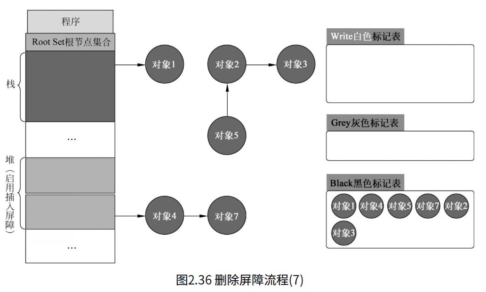

以上便是三色标记利用删除屏障的处理流程，删除屏障依旧可以满足并行状态下的垃圾回收动作，但是这种方式的回收精度较低，因为一个对象即使被删除了，也只有等到下一轮GC才会被清理掉。

删除屏障的核心规则是：**在指针被删除/覆盖前，将被指向的原始对象标记为灰色。**

它的目的是解决这样一种并发场景：

1. 一个灰色对象A，指向一个白色对象B。
2. 用户Goroutine将A指向B的指针删除（例如 `A.field = nil`）或者改为指向另一个白色对象C。
3. 如果没有屏障，B就失去了最后一个来自灰色对象的引用，变成了“无法被扫描到的白色对象”，即使它可能仍然被其他黑色对象引用（只是GC还没看到），它也会在本轮被错误回收。

删除屏障的策略是：**“宁可信其有，不可信其无”**。只要有一个指向B的指针被删除，我就认为B可能是个重要的对象，先把它保护起来（标记为灰色），让GC worker去扫描它。


### 成就与遗留问题

**在 Go 语言 v1.5 版本中，仅使用了插入屏障（插入写屏障），而没有同时使用删除屏障。**删除屏障是在后续版本（如 v1.8）中与插入屏障组合形成混合写屏障时才引入的，旨在进一步减少 STW 时间并提升回收精度。因此，v1.5 仅依赖插入屏障机制。

成就：STW 时间从几百毫秒降到了几十毫秒级别，这是一个巨大的进步。

问题：

1. 栈扫描需要 STW：为了保证栈的性能，写屏障没有应用到栈空间的操作上，导致在标记结束时必须 STW 并重新扫描栈，这会产生一个短暂的停顿。
2. 性能损耗：插入写屏障需要对几乎所有指针写操作进行拦截，有一定的性能开销。


## Go V1.8 的混合写屏障

Go V1.8版本引入了混合写屏障机制(Hybrid Write Barrier)，避免了对栈 Re-scan（重新扫描）的过程，同时结合了插入写屏障和删除写屏障两者的优点，本节将介绍混合写屏障的规则和混合写屏障触发的一些场景流程分析。

### 混合写屏障(Hybrid Write Barrier)规则

混合写屏障的具体操作一般需要遵循以下几个条件限制：

- GC开始将栈上的对象全部扫描并标记为黑色（之后不再进行第二次重复扫描，无须STW）。

- GC期间，任何在栈上创建的新对象均为黑色。

- 被删除的对象标记为灰色。

- 被添加的对象标记为灰色。


混合写屏障实际上满足的是一种变形的弱三色不变式。它的伪代码如下：


注意：屏障技术不在栈上应用，因为要保证栈的运行效率。混合写屏障是GC的一种屏障机制，所以只有当程序执行GC的时候，才会触发这种机制。

接下来模拟混合写屏障的详细过程，希望读者能够更直观地看清楚整体流程。

现在假设当前场景如下所述。当GC开始的时候，初始化的内存对象结构如下：栈空间范围有Root Set根节点集合引用对象1、对象2引用对象2、对象3下游没有被引用对象。对象5没有上游对象，并且对象5引用对象8，对象8下游没有被引用对象。堆空间范围有Root Set根节点集合引用对象4，对象4引用对象7，对象7下游没有被引用对象。对象6没有上游对象，同时对象6下游也没有被引用对象。这些内存对象均被标记为白色，并且全部被放置在白色标记表中，如图2.37所示。

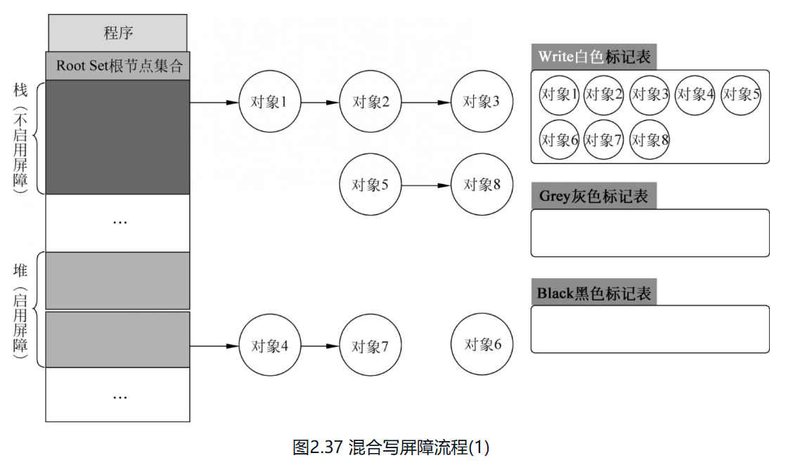

现在GC开始，按照上述混合写屏障的几个步骤，它的第一步就是扫描栈区，将可达对象全部标记为黑色，所以扫描栈区结束的时候，对象1、对象2、对象3均可达，它们被标记成了黑色，同时也被加入黑色标记表中，如图2.38所示。

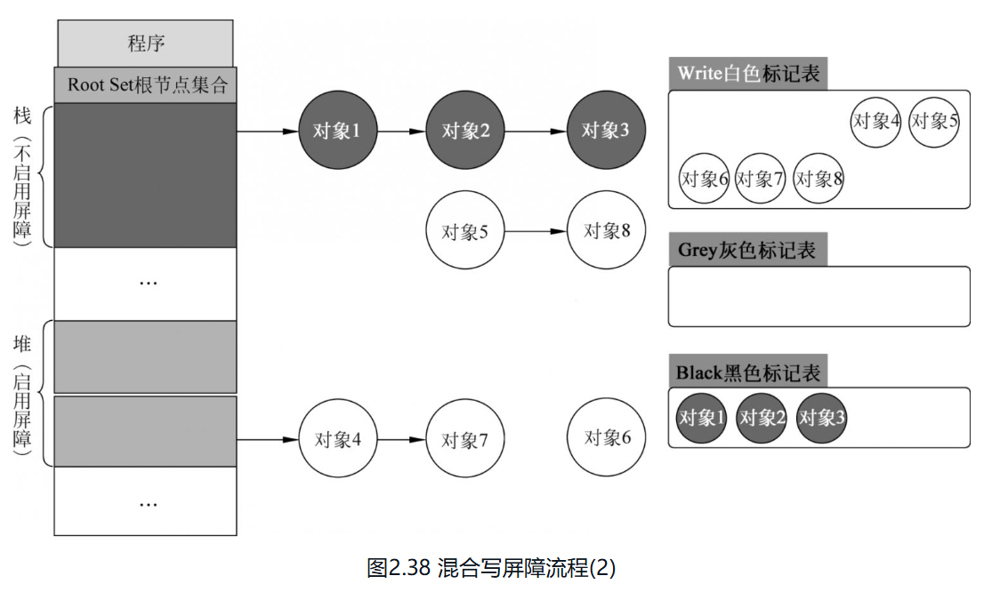

接下来就来分析混合写屏障的一些场景，本节会列出4种场景，这4种场景均是通过如图2.38所示已经扫描完栈空间且可达对象被标记为黑色作为出发点。4种场景分别是“堆删除引用，成为栈下游”“栈删除引用，成为栈下游”“堆删除引用，成为堆下游”“栈删除引用，成为堆下游”。

### 场景1：堆删除引用，成为栈下游

场景1主要描述的是对象被堆对象删除引用，成为栈对象的下游情况，伪代码如下：


现在执行上述场景代码中的第一条代码逻辑：栈对象1->对象7=堆对象7，将白色的对象7添加到黑色的对象1下游，这里需要注意的是，因为栈不启动写屏障机制，所以白色的对象7将直接挂在黑色的对象1下面，并且对象7的颜色依然是白色。现在扫描到对象4，此时对象4被标记成了灰色，如图2.39所示。

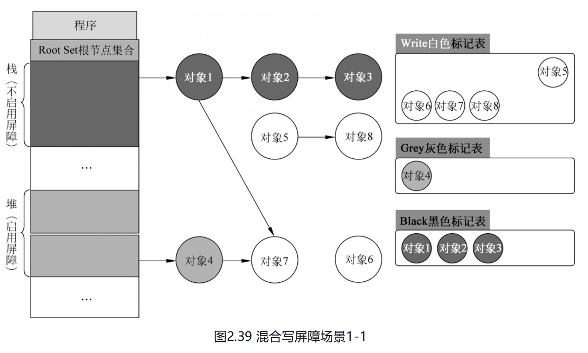

然后执行上述场景代码中的第二条代码逻辑：堆对象4->对象7=null，灰色的对象4删除白色的对象7（删除即新赋值为null）。这里因为对象4处在堆空间范围，所以会触发写屏障，被删除的对象7将被标记为灰色，如图2.40所示。

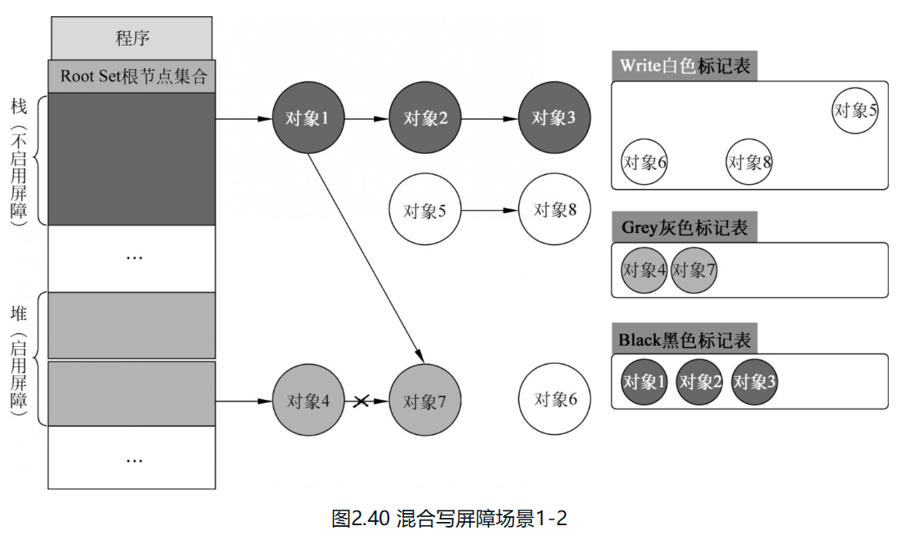

所以通过场景一的情况来看，对象7最终被挂在了对象1的下游。由于对象7是灰色的，所以不会被当作垃圾进行回收，这样就保护了起来。在场景一的混合写屏障中，也不会再次给栈空间的对象启动STW，再重新扫描一遍。接下来的过程就依旧遵循混合写屏障的三色标记法逻辑进行处理，最终对象4和对象7均会被标记为黑色，GC最终会回收对象5、对象8和对象6。

### 场景2：栈删除引用，成为栈下游

场景2主要描述的是对象被一个栈对象删除引用，成为另一个栈对象的下游情况，伪代码如下：


现在执行上述场景代码中的第一条代码逻辑：new栈对象9，根据混合写屏障的限定条件，任何在栈范围上新创建的内存对象均会被标记为黑色。这里继承上述图2.37所描述的内存布局场景，所以对象9目前是被程序根节点集合引用的黑色对象，如图2.41所示。


然后执行上述场景代码中的第二条代码逻辑：对象9->对象3=对象3，对象9添加下游对象3，因为对象9是栈范围空间，所以添加过程并不会触发写屏障，直接将对象3挂在对象9的下面即可，如图2.42所示。

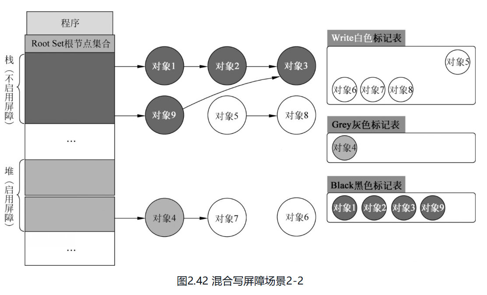

最后执行上述场景代码中的第三条代码逻辑：对象2->对象3=null，对象2将删除下游对象3。由于对象2属于栈范围内，所以依然不触发写屏障机制，对象2将直接将对象3从下游移除，如图2.43所示。

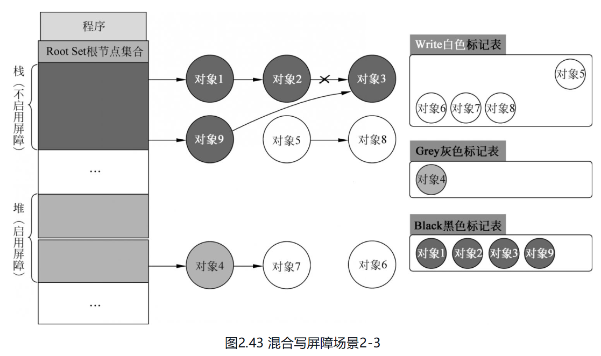

通过上述过程可以看到，在混合写屏障的机制中，一个对象从一个栈对象下游转移到另一个对象的下游，由于栈对象均为黑色，所以不必启动写屏障和STW机制就能够保证对象的安全性，这也是混合写屏障的巧妙设计之处。

### 场景3：堆删除引用，成为堆下游

场景3主要描述的是对象被一个堆对象删除引用，成为另一个堆对象下游的情况，伪代码如下：


现在复原场景三的内存布局为在堆空间范围内有一个黑色对象10（不为黑色也无所谓，因为对象10是堆空间可达对象，最终它会被标记为黑色），这里不考虑对象10可能是其他颜色的情况，因为黑色比较特殊。如果对象10为白色，那对象10的下游最终会被扫描到，是安全的，同理如果对象10为灰色，则对象10的下游也是安全的。只有对象10为黑色的时候，才会有下游内存不安全的情况，所以目前的内存布局如图2.44所示。

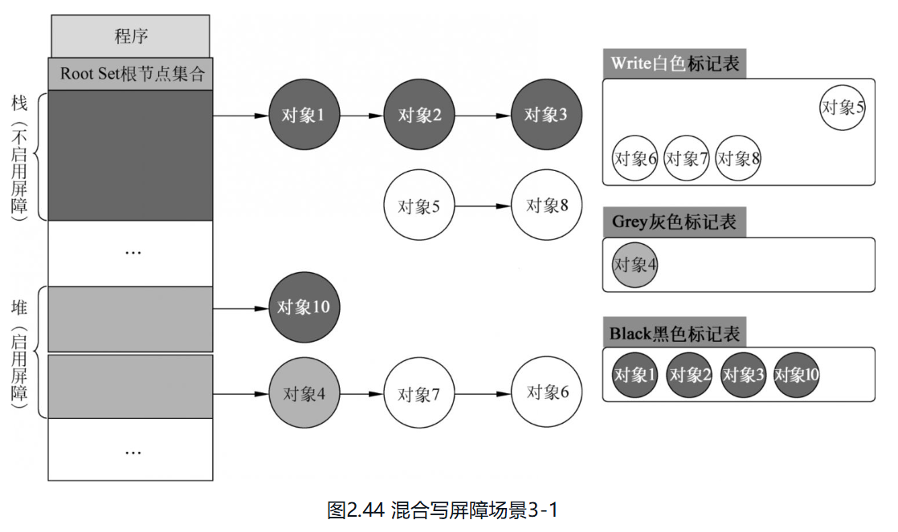

现在执行上述场景代码中的第一条代码逻辑：堆对象10->对象7=堆对象7，堆对象10添加下游引用白色的堆对象7。由于对象10是在堆空间范围内，这里的写操作将触发屏障机制，根据混合写屏障的限定条件，被添加的对象将被标记为灰色，所以白色的对象7将被标记为灰色，这样同时也间接地保护了白色的对象6，如图2.45所示。

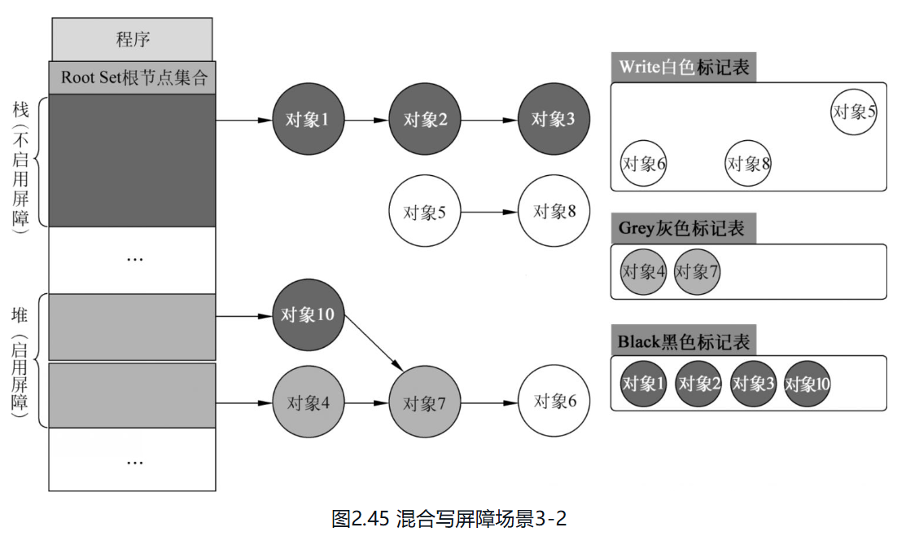

然后执行上述场景代码中的第二条代码逻辑：堆对象4->对象7=null，灰色的堆对象4删除下游引用堆对象7。由于对象4所在堆空间范围内，所以触发屏障机制，根据混合写屏障的限定条件，被删除的对象将被标记为灰色，所以将对象7标记为灰色（虽然对象7已经是灰色），如图2.46所示。

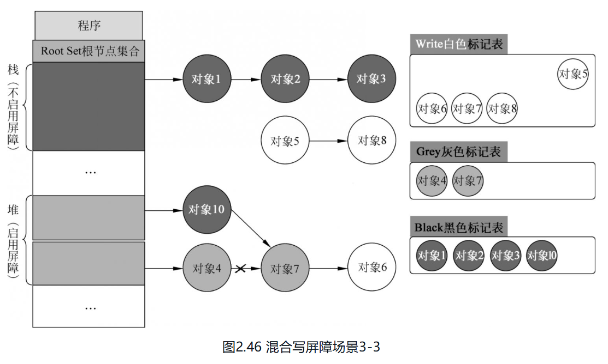

通过上述几个过程，原本白色的对象7已经成功地从一个堆对象4的下面转移到一个黑色的堆对象10下面，并且对象7及它的下游对象（对象6）均被保护起来，而整体过程中也没有用到STW来耽误程序的运行。

### 场景4：栈删除引用，成为堆下游

场景4主要描述的是对象从一个栈对象被删除引用，成为另一个堆对象的下游情况，伪代码如下：


这里依然延续图2.37的内存布局场景。执行上述场景代码中的第一条代码逻辑：栈对象1->对象2=null，栈对象1删除栈对象2的引用。由于对象1属于栈空间范围，所以不触发写屏障机制，此时对象1将直接删除对象2及对象2所关联的全部下游对象，如图2.47所示。

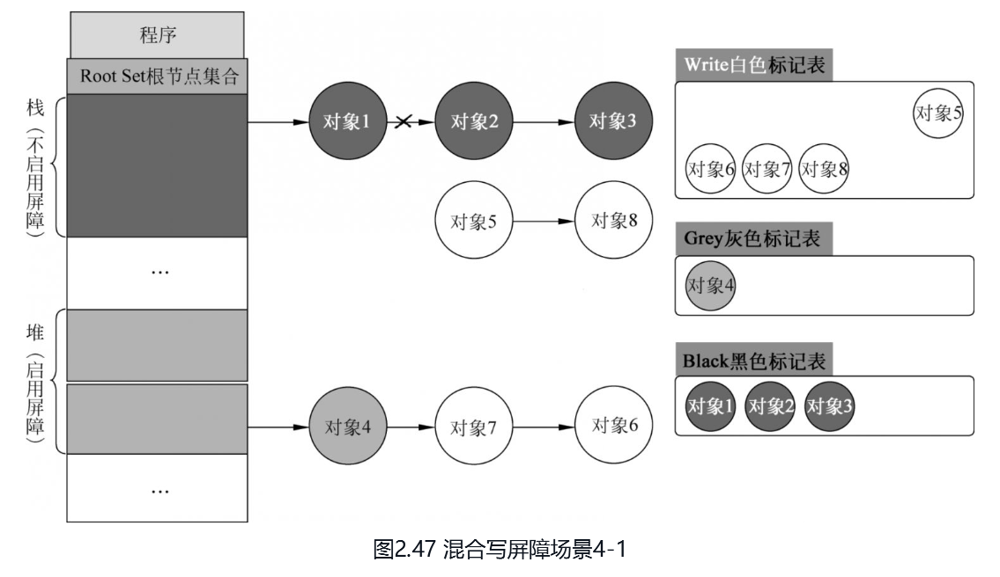

然后执行上述场景代码中的第二条代码逻辑：堆对象4->对象7=栈对象2，这条代码实际上执行了两个动作。

第1个是将堆对象4之前的下游白色对象7删除。

第2个是将堆对象4的新下游对象添加为栈对象2，如图2.48所示。

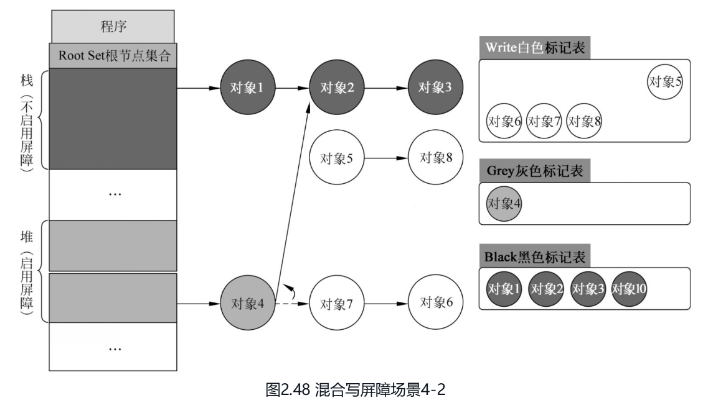

当对象4在执行上述两个动作的时候，由于对象4在堆空间范围内，将触发写屏障机制，根据混合写屏障的限定条件，被删除的对象将被标记为灰色，新添加的对象也会被标记为灰色，所以对象7被标记为灰色对象，这样对象7的下游对象6就得到了保护。对象2是新添加的对象，那么对象2也将执行标记灰色的过程，这里由于对象2已经是黑色，属于安全的对象，所以对象2将继续保持黑色，如图2.49所示。

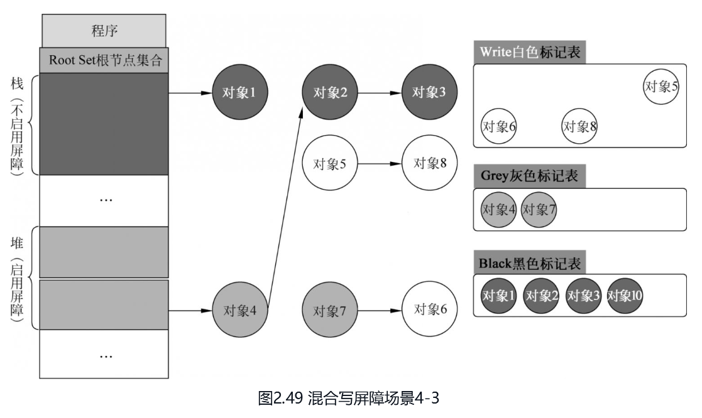

最终成功地改变了一个本来是被栈引用的对象2挂在了堆对象4的下游，而依然保持内存的依赖关系和安全状态。之后会通过几次循环遍历，对象1、对象4、对象2、对象3均会被标记为黑色，而对象7和对象6会在本轮GC中也被标记为黑色。本轮GC最后回收的白色内存是对象5和对象8。

但这里有个疑问，对象7和对象6已经和程序的Root Set断开了，为什么却没有被回收？这就是混合写屏障的延迟问题，在一定概率情况下，为了去掉STW会有一些内存会延迟1个周期被回收。等到第二轮GC，对象7和对象6如果没有外界添加，它们终将会成为白色垃圾内存而被回收。

消除了对栈进行重新扫描的需求，使得 STW 时间稳定地控制在 1 毫秒以下，甚至达到亚毫秒级别。这是 Go GC 迈向高性能、低延迟的关键一步。


## 三个阶段STW对比

**第一阶段：Go V1.3 之前 —— 标记清除（Mark and Sweep）**

这是最传统的 GC 方式，其工作流程非常简单粗暴。

GC 过程与 STW 时机：

1. STW 阶段一（开始）：GC 周期开始时，暂停所有用户 Goroutine。
2. 标记阶段 (Mark)：在 STW 状态下，从根对象（栈、全局变量）开始，单线程遍历并标记所有可达（存活）的对象。
3. 清除阶段 (Sweep)：同样在 STW 状态下，遍历堆内存，将未标记的对象回收，内存放回空闲链表。
4. STW 阶段二（结束）：清除完成后，恢复所有用户 Goroutine。

特点总结：

- STW 总时长：极长。整个 GC 过程（标记+清除）都在 STW 中进行，耗时与堆内存中的对象总数相关。对于大型应用，停顿可达几百毫秒甚至秒级。
- 影响：对延迟敏感的服务（如 Web 服务器）是灾难性的，用户会明显感到请求卡顿。

**第二阶段：Go V1.5 —— 三色并发标记法**

这是革命性的一步，极大缩短 STW 时间。

GC 过程与 STW 时机：

1. STW 阶段一（开启屏障，初始扫描）：
   - 时机：GC 周期开始时。
   - 目的：暂停所有 Goroutine，开启写屏障，并快速扫描所有 Goroutine 的栈，将根对象直接引用的第一层对象标记为灰色。这个过程很快，因为只扫描栈，不遍历整个堆。
   - 时长：短（通常 ~10ms 级别）。
2. 并发标记阶段：
   - 时机：STW 阶段一结束后。
   - 目的：启动专门的 Mark Worker Goroutine，与用户 Goroutine 并发执行。它不断地从灰色对象队列中取出对象，将其标黑，并将其引用的子对象置灰。用户 Goroutine 在堆上执行写操作时会触发插入写屏障，保证并发标记的正确性。
   - 时长：与用户代码并行，无 STW。
3. STW 阶段二（关闭屏障，重新扫描栈）：
   - 时机：并发标记结束后。
   - 目的：再次暂停所有 Goroutine。由于栈上的写操作没有启用写屏障（为了性能），可能在并发标记期间，导致某些存活对象未被扫描到。此阶段需要STW 并重新扫描（Re-scan）所有栈，确保不漏掉任何对象。完成后，关闭写屏障。
   - 时长：较短，但比第一次 STW 要长一些。
4. 并发清除阶段：
   - 时机：STW 阶段二结束后。
   - 目的：回收所有白色垃圾对象。此阶段与用户代码并发执行。
   - 时长：无 STW。

特点总结：

- STW 总时长：大幅缩短。从几百毫秒降至两次短暂 STW 的总和（通常 ~10-50ms 级别）。
- 核心问题：必须进行第二次 STW 来重新扫描栈，这成为了主要的延迟瓶颈。

**第三阶段：Go V1.8 —— 混合写屏障（Hybrid Write Barrier）**

为了消灭第二次 STW，Go 引入了混合写屏障，它结合了插入屏障和删除屏障的思想。

GC 过程与 STW 时机：

1. STW 阶段一（开启屏障，扫描栈）：
   - 时机：GC 周期开始时。
   - 目的：暂停所有 Goroutine，开启写屏障，并将所有栈上的对象全部标记为黑色（这是一个非常快的操作）。
   - 时长：极短（微秒级）。因为只是批量修改栈上对象的颜色，无需遍历对象图。
2. 并发标记阶段：
   - 时机：STW 阶段一结束后。
   - 目的：Mark Worker 与用户 Goroutine 并发执行。用户 Goroutine 的写操作会触发混合写屏障，保证了无论在堆上还是栈上操作，都不会破坏不变式。
   - 时长：无 STW。
3. STW 阶段二（关闭屏障）：
   - 时机：并发标记结束后。
   - 目的：不再需要重新扫描栈！ 此阶段仅用于关闭写屏障和执行一些非常简单的状态切换。
   - 时长：极短（微秒级），与第一次 STW 相当。
4. 并发清除阶段：
   - 时机：STW 阶段二结束后。
   - 目的：回收白色垃圾对象。
   - 时长：无 STW。

特点总结：

- STW 总时长：极致缩短。两次 STW 都变得极短且固定，总停顿时间稳定在 100 微秒（0.1ms）以内。
- 巨大改进：彻底移除了第二次耗时的栈重新扫描 STW，这是实现亚毫秒级停顿的关键。


## GC回收目标

Go GC 的主要目标是回收堆（Heap）上不再使用的内存，但它必须通过扫描栈（Stack）等根对象来确定哪些堆内存是仍然存活的。

**堆（Heap）**：这是用于存储生命周期超出当前函数范围的对象的区域。当你使用 `new`关键字或者进行逃逸分析后分配到堆上的对象，它们的内存就位于堆上。

**为什么堆需要GC**：因为堆上的对象没有固定的所有者，它们的生命周期是动态的、全局的。一个对象可能被多个其他对象引用，很难在编译期确定它何时不再被需要。如果只分配不回收，堆内存最终会被耗尽，导致程序崩溃。因此，必须有一个自动的机制（垃圾回收器）来负责清理这些“垃圾”。

但是，为了知道堆上的哪些内存是垃圾，GC 必须从“根对象”开始遍历。这些根对象包括：

- 各个 Goroutine 的栈（Stack）：栈上存储着局部变量、函数参数、返回值等。这些变量可能直接指向堆上的对象。
- 全局变量区：全局变量同样可能引用着堆上的对象。

栈内存的回收与 GC 无关

- 栈（Stack）：每个 Goroutine 在创建时都会有自己的栈空间，用于存储函数调用时的局部变量。这些变量的生命周期非常明确——随着函数调用结束而结束。
- 回收方式：栈内存的分配和回收是极其高效和廉价的，它直接通过编译器生成的控制指令来完成。当一个函数返回时，将栈指针（SP）移动回调用前的地址即可。这相当于一次性释放了该函数调用所占用的所有栈内存。这个过程不需要垃圾回收器的参与，速度极快。

# 逃逸现象

> https://geektutu.com/post/hpg-escape-analysis.html

在 C 语言中，可以使用 `malloc` 和 `free` 手动在堆上分配和回收内存。Go 语言中，堆内存是通过垃圾回收机制自动管理的，无需开发者指定。那么，Go 编译器怎么知道某个变量需要分配在栈上，还是堆上呢？编译器决定内存分配位置的方式，就称之为逃逸分析(escape analysis)。逃逸分析由编译器完成，作用于编译阶段。

## 指针逃逸

指针逃逸应该是最容易理解的一种情况了，即在函数中创建了一个对象，返回了这个对象的指针。这种情况下，函数虽然退出了，但是因为指针的存在，对象的内存不能随着函数结束而回收，因此只能分配在堆上。

```go
type Demo struct {
	name string
}

func createDemo(name string) *Demo {
	d := new(Demo) // 局部变量 d 逃逸到堆，第10行
	d.name = name
	return d
}

func main() {
	demo := createDemo("demo") // 第16行
	fmt.Println(demo)
}
```

这个例子中，函数 `createDemo` 的局部变量 `d` 发生了逃逸。d 作为返回值，在 main 函数中继续使用，因此 d 指向的内存不能够分配在栈上，随着函数结束而回收，只能分配在堆上。

编译时可以借助选项 `-gcflags=-m`，查看变量逃逸的情况：

```shell
D:\workspace\go_project\study\daydayup\base\gc-escape>go build -gcflags=-m main.go 
# command-line-arguments
./main.go:9:6: can inline createDemo
./main.go:16:20: inlining call to createDemo
./main.go:17:13: inlining call to fmt.Println
./main.go:9:17: leaking param: name
./main.go:10:10: new(Demo) escapes to heap
./main.go:16:20: new(Demo) escapes to heap
./main.go:17:13: ... argument does not escape
```

`new(Demo) escapes to heap` 即表示 `new(Demo)` 逃逸到堆上了。

## interface{} 动态类型逃逸

在 Go 语言中，空接口即 `interface{}` 可以表示任意的类型，如果函数参数为 `interface{}`，编译期间很难确定其参数的具体类型，也会发生逃逸。

例如上面例子中的局部变量 `demo`：

```go
func main() {
	demo := createDemo("demo")
	fmt.Println(demo)
}
```

```
./main.go:16:20: new(Demo) escapes to heap
```

`demo` 是 main 函数中的一个局部变量，该变量作为实参传递给 `fmt.Println()`，但是因为 `fmt.Println()` 的参数类型定义为 `interface{}`，因此也发生了逃逸。

`fmt` 包中的 `Println` 函数的定义如下：

```go
func Println(a ...interface{}) (n int, err error) {
	return Fprintln(os.Stdout, a...)
}
```

如果我们将上面的例子修改为：

```go
func test(demo *Demo) {
	fmt.Println(demo.name) // 第16行
}

func main() {
	demo := createDemo("demo")
	test(demo)
}
```

这种情况下，局部变量 `demo` 不会发生逃逸，但是 `demo.name` 仍旧会逃逸。

```
./main.go:16:18: demo.name escapes to heap
```

## 栈空间不足

操作系统对内核线程使用的栈空间是有大小限制的，64 位系统上通常是 8 MB。可以使用 `ulimit -a` 命令查看机器上栈允许占用的内存的大小。

```shell
$ ulimit -a
-s: stack size (kbytes)             8192
-n: file descriptors                12800
...
```

因为栈空间通常比较小，因此递归函数实现不当时，容易导致栈溢出。

对于 Go 语言来说，运行时(runtime) 尝试在 goroutine 需要的时候动态地分配栈空间，goroutine 的初始栈大小为 2 KB。当 goroutine 被调度时，会绑定内核线程执行，栈空间大小也不会超过操作系统的限制。

对 Go 编译器而言，超过一定大小的局部变量将逃逸到堆上，不同的 Go 版本的大小限制可能不一样。我们来做一个实验：

```go
func generate8191() {
	nums := make([]int, 8191) // < 64KB
	for i := 0; i < 8191; i++ {
		nums[i] = rand.Int()
	}
}

func generate8192() {
	nums := make([]int, 8192) // = 64KB
	for i := 0; i < 8192; i++ {
		nums[i] = rand.Int()
	}
}

func generate(n int) {
	nums := make([]int, n) // 不确定大小
	for i := 0; i < n; i++ {
		nums[i] = rand.Int()
	}
}

func main() {
	generate8191()
    generate8192()
    generate(1)
}
```

- `generate8191()` 创建了大小为 8191 的 int 型切片，小于 64 KB(64位机器上，int 占 8 字节)。
- `generate8192()` 创建了大小为 8192 的 int 型切片，恰好占用 64 KB。
- `generate(n)`，切片大小不确定，调用时传入。

编译结果如下：

```shell
$ go build -gcflags=-m main_stack.go
# command-line-arguments
./main_stack.go:9:14: generate8191 make([]int, 8191) does not escape
./main_stack.go:16:14: make([]int, 8192) escapes to heap
./main_stack.go:23:14: make([]int, n) escapes to heap
```

`make([]int, 8191)` 没有发生逃逸，`make([]int, 8192)` 和`make([]int, n)` 逃逸到堆上，也就是说，当切片占用内存超过一定大小，或无法确定当前切片长度时，对象占用内存将在堆上分配。

## 闭包

例如：

```go
func Increase() func() int {
	n := 0 // 第30行
	return func() int {
		n++
		return n
	}
}

func main() {
	in := Increase()
	fmt.Println(in()) // 1
	fmt.Println(in()) // 2
}
```

`Increase()` 返回值是一个闭包函数，该闭包函数访问了外部变量 n，那变量 n 将会一直存在，直到 `in` 被销毁。很显然，变量 n 占用的内存不能随着函数 `Increase()` 的退出而回收，因此将会逃逸到堆上。

```shell
./main.go:30:2: moved to heap: n
```


# new与make

