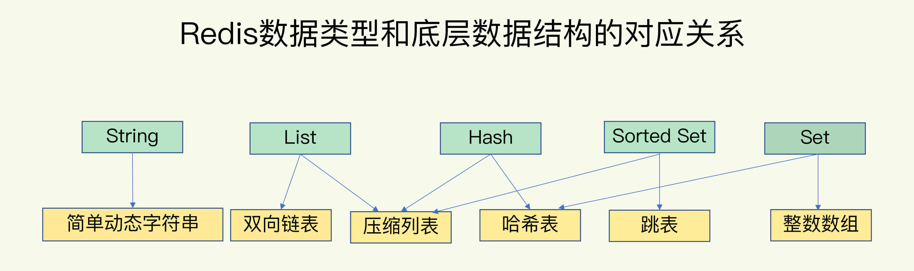

# 02 | 数据结构：快速的Redis有哪些慢操作？
一提到Redis，我们的脑子里马上就会出现一个词：“快。”但是你有没有想过，Redis的快，到底是快在哪里呢？实际上，这里有一个重要的表现：它接收到一个键值对操作后，能以 **微秒级别** 的速度找到数据，并快速完成操作。

数据库这么多，为啥Redis能有这么突出的表现呢？一方面，这是因为它是内存数据库，所有操作都在内存上完成，内存的访问速度本身就很快。另一方面，这要归功于它的数据结构。这是因为，键值对是按一定的数据结构来组织的，操作键值对最终就是对数据结构进行增删改查操作，所以高效的数据结构是Redis快速处理数据的基础。这节课，我就来和你聊聊数据结构。

说到这儿，你肯定会说：“这个我知道，不就是String（字符串）、List（列表）、Hash（哈希）、Set（集合）和Sorted Set（有序集合）吗？”其实，这些只是Redis键值对中值的数据类型，也就是数据的保存形式。而这里，我们说的数据结构，是要去看看它们的底层实现。

简单来说，底层数据结构一共有6种，分别是简单动态字符串、双向链表、压缩列表、哈希表、跳表和整数数组。它们和数据类型的对应关系如下图所示：



可以看到，String类型的底层实现只有一种数据结构，也就是简单动态字符串。而List、Hash、Set和Sorted Set这四种数据类型，都有两种底层实现结构。通常情况下，我们会把这四种类型称为集合类型，它们的特点是 **一个键对应了一个集合的数据**。

看到这里，其实有些问题已经值得我们去考虑了：

- 这些数据结构都是值的底层实现，键和值本身之间用什么结构组织？
- 为什么集合类型有那么多的底层结构，它们都是怎么组织数据的，都很快吗？
- 什么是简单动态字符串，和常用的字符串是一回事吗？

接下来，我就和你聊聊前两个问题。这样，你不仅可以知道Redis“快”的基本原理，还可以借此理解Redis中有哪些潜在的“慢操作”，最大化Redis的性能优势。而关于简单动态字符串，我会在后面的课程中再和你讨论。

我们先来看看键和值之间是用什么结构组织的。

## 键和值用什么结构组织？

为了实现从键到值的快速访问，Redis使用了一个哈希表来保存所有键值对。

一个哈希表，其实就是一个数组，数组的每个元素称为一个哈希桶。所以，我们常说，一个哈希表是由多个哈希桶组成的，每个哈希桶中保存了键值对数据。哈希桶中的元素保存的并不是值本身，而是指向具体值的指针。这也就是说，不管值是String，还是集合类型，哈希桶中的元素都是指向它们的指针。

在下图中，可以看到，哈希桶中的entry元素中保存了 `*key` 和 `*value` 指针，分别指向了实际的键和值，这样一来，即使值是一个集合，也可以通过 `*value` 指针被查找到。


因为这个哈希表保存了所有的键值对，所以，我也把它称为 **全局哈希表**。哈希表的最大好处很明显，就是让我们可以用O(1)的时间复杂度来快速查找到键值对——我们只需要计算键的哈希值，就可以知道它所对应的哈希桶位置，然后就可以访问相应的entry元素。

但是，当你往Redis中写入大量数据后，就可能发现操作有时候会突然变慢了。这其实是因为你忽略了一个潜在的风险点，那就是 **哈希表的冲突问题和rehash可能带来的操作阻塞。**

### 为什么哈希表操作变慢了？

当你往哈希表中写入更多数据时，哈希冲突是不可避免的问题。这里的哈希冲突，也就是指，两个key的哈希值和哈希桶计算对应关系时，正好落在了同一个哈希桶中。

毕竟，哈希桶的个数通常要少于key的数量，这也就是说，难免会有一些key的哈希值对应到了同一个哈希桶中。

Redis解决哈希冲突的方式，就是链式哈希。链式哈希也很容易理解，就是指 **同一个哈希桶中的多个元素用一个链表来保存，它们之间依次用指针连接**。如下图所示：


但是，这里依然存在一个问题，哈希冲突链上的元素只能通过指针逐一查找再操作。如果哈希表里写入的数据越来越多，哈希冲突可能也会越来越多，这就会导致某些哈希冲突链过长，进而导致这个链上的元素查找耗时长，效率降低。对于追求“快”的Redis来说，这是不太能接受的。

所以，Redis会对哈希表做rehash操作。rehash也就是增加现有的哈希桶数量，让逐渐增多的entry元素能在更多的桶之间分散保存，减少单个桶中的元素数量，从而减少单个桶中的冲突。那具体怎么做呢？

其实，为了使rehash操作更高效，Redis默认使用了两个全局哈希表：哈希表1和哈希表2。一开始，当你刚插入数据时，默认使用哈希表1，此时的哈希表2并没有被分配空间。随着数据逐步增多，Redis开始执行rehash，这个过程分为三步：

1. 给哈希表2分配更大的空间，例如是当前哈希表1大小的两倍；
2. 把哈希表1中的数据重新映射并拷贝到哈希表2中；
3. 释放哈希表1的空间。

到此，我们就可以从哈希表1切换到哈希表2，用增大的哈希表2保存更多数据，而原来的哈希表1留作下一次rehash扩容备用。

这个过程看似简单，但是第二步涉及大量的数据拷贝，如果一次性把哈希表1中的数据都迁移完，会造成Redis线程阻塞，无法服务其他请求。此时，Redis就无法快速访问数据了。

为了避免这个问题，Redis采用了 **渐进式rehash**。

简单来说就是在第二步拷贝数据时，Redis仍然正常处理客户端请求，每处理一个请求时，从哈希表1中的第一个索引位置开始，顺带着将这个索引位置上的所有entries拷贝到哈希表2中；等处理下一个请求时，再顺带拷贝哈希表1中的下一个索引位置的entries。如下图所示：


这样就巧妙地把一次性大量拷贝的开销，分摊到了多次处理请求的过程中，避免了耗时操作，保证了数据的快速访问。

渐进式rehash执行时，Redis本身还会有一个定时任务在执行rehash，如果没有键值对操作时，这个定时任务会周期性地（例如每100ms一次）搬移一些数据到新的哈希表中，这样可以缩短整个rehash的过程。

好了，到这里，你应该就能理解，Redis的键和值是怎么通过哈希表组织的了。对于String类型来说，找到哈希桶就能直接增删改查了，所以，哈希表的O(1)操作复杂度也就是它的复杂度了。

但是，对于集合类型来说，即使找到哈希桶了，还要在集合中再进一步操作。接下来，我们来看集合类型的操作效率又是怎样的。

## 集合数据操作效率

和String类型不同，一个集合类型的值，第一步是通过全局哈希表找到对应的哈希桶位置，第二步是在集合中再增删改查。那么，集合的操作效率和哪些因素相关呢？

首先，与集合的底层数据结构有关。例如，使用哈希表实现的集合，要比使用链表实现的集合访问效率更高。其次，操作效率和这些操作本身的执行特点有关，比如读写一个元素的操作要比读写所有元素的效率高。

接下来，我们就分别聊聊集合类型的底层数据结构和操作复杂度。

### 有哪些底层数据结构？

刚才，我也和你介绍过，集合类型的底层数据结构主要有5种：整数数组、双向链表、哈希表、压缩列表和跳表。

其中，哈希表的操作特点我们刚刚已经学过了；整数数组和双向链表也很常见，它们的操作特征都是顺序读写，也就是通过数组下标或者链表的指针逐个元素访问，操作复杂度基本是O(N)，操作效率比较低；压缩列表和跳表我们平时接触得可能不多，但它们也是Redis重要的数据结构，所以我来重点解释一下。

压缩列表实际上类似于一个数组，数组中的每一个元素都对应保存一个数据。和数组不同的是，压缩列表在表头有三个字段zlbytes、zltail和zllen，分别表示列表长度、列表尾的偏移量和列表中的entry个数；压缩列表在表尾还有一个zlend，表示列表结束。


在压缩列表中，如果我们要查找定位第一个元素和最后一个元素，可以通过表头三个字段的长度直接定位，复杂度是O(1)。而查找其他元素时，就没有这么高效了，只能逐个查找，此时的复杂度就是O(N)了。

我们再来看下跳表。

有序链表只能逐一查找元素，导致操作起来非常缓慢，于是就出现了跳表。具体来说，跳表在链表的基础上， **增加了多级索引，通过索引位置的几个跳转，实现数据的快速定位**，如下图所示：


如果我们要在链表中查找33这个元素，只能从头开始遍历链表，查找6次，直到找到33为止。此时，复杂度是O(N)，查找效率很低。

为了提高查找速度，我们来增加一级索引：从第一个元素开始，每两个元素选一个出来作为索引。这些索引再通过指针指向原始的链表。例如，从前两个元素中抽取元素1作为一级索引，从第三、四个元素中抽取元素11作为一级索引。此时，我们只需要4次查找就能定位到元素33了。

如果我们还想再快，可以再增加二级索引：从一级索引中，再抽取部分元素作为二级索引。例如，从一级索引中抽取1、27、100作为二级索引，二级索引指向一级索引。这样，我们只需要3次查找，就能定位到元素33了。

可以看到，这个查找过程就是在多级索引上跳来跳去，最后定位到元素。这也正好符合“跳”表的叫法。当数据量很大时，跳表的查找复杂度就是O(logN)。

好了，我们现在可以按照 **查找** 的时间复杂度给这些数据结构分下类了：


### 不同操作的复杂度

集合类型的操作类型很多，有读写单个集合元素的，例如HGET、HSET，也有操作多个元素的，例如SADD，还有对整个集合进行遍历操作的，例如SMEMBERS。这么多操作，它们的复杂度也各不相同。而复杂度的高低又是我们选择集合类型的重要依据。

我总结了一个“四句口诀”，希望能帮助你快速记住集合常见操作的复杂度。这样你在使用过程中，就可以提前规避高复杂度操作了。

- 单元素操作是基础；
- 范围操作非常耗时；
- 统计操作通常高效；
- 例外情况只有几个。

第一， **单元素操作，是指每一种集合类型对单个数据实现的增删改查操作**。例如，Hash类型的HGET、HSET和HDEL，Set类型的SADD、SREM、SRANDMEMBER等。这些操作的复杂度由集合采用的数据结构决定，例如，HGET、HSET和HDEL是对哈希表做操作，所以它们的复杂度都是O(1)；Set类型用哈希表作为底层数据结构时，它的SADD、SREM、SRANDMEMBER复杂度也是O(1)。

这里，有个地方你需要注意一下，集合类型支持同时对多个元素进行增删改查，例如Hash类型的HMGET和HMSET，Set类型的SADD也支持同时增加多个元素。此时，这些操作的复杂度，就是由单个元素操作复杂度和元素个数决定的。例如，HMSET增加M个元素时，复杂度就从O(1)变成O(M)了。

第二， **范围操作，是指集合类型中的遍历操作，可以返回集合中的所有数据**，比如Hash类型的HGETALL和Set类型的SMEMBERS，或者返回一个范围内的部分数据，比如List类型的LRANGE和ZSet类型的ZRANGE。 **这类操作的复杂度一般是O(N)，比较耗时，我们应该尽量避免**。

不过，Redis从2.8版本开始提供了SCAN系列操作（包括HSCAN，SSCAN和ZSCAN），这类操作实现了渐进式遍历，每次只返回有限数量的数据。这样一来，相比于HGETALL、SMEMBERS这类操作来说，就避免了一次性返回所有元素而导致的Redis阻塞。

第三，统计操作，是指 **集合类型对集合中所有元素个数的记录**，例如LLEN和SCARD。这类操作复杂度只有O(1)，这是因为当集合类型采用压缩列表、双向链表、整数数组这些数据结构时，这些结构中专门记录了元素的个数统计，因此可以高效地完成相关操作。

第四，例外情况，是指某些数据结构的特殊记录，例如 **压缩列表和双向链表都会记录表头和表尾的偏移量**。这样一来，对于List类型的LPOP、RPOP、LPUSH、RPUSH这四个操作来说，它们是在列表的头尾增删元素，这就可以通过偏移量直接定位，所以它们的复杂度也只有O(1)，可以实现快速操作。

## 小结

这节课，我们学习了Redis的底层数据结构，这既包括了Redis中用来保存每个键和值的全局哈希表结构，也包括了支持集合类型实现的双向链表、压缩列表、整数数组、哈希表和跳表这五大底层结构。

Redis之所以能快速操作键值对，一方面是因为O(1)复杂度的哈希表被广泛使用，包括String、Hash和Set，它们的操作复杂度基本由哈希表决定，另一方面，Sorted Set也采用了O(logN)复杂度的跳表。不过，集合类型的范围操作，因为要遍历底层数据结构，复杂度通常是O(N)。这里，我的建议是： **用其他命令来替代**，例如可以用SCAN来代替，避免在Redis内部产生费时的全集合遍历操作。

当然，我们不能忘了复杂度较高的List类型，它的两种底层实现结构：双向链表和压缩列表的操作复杂度都是O(N)。因此，我的建议是： **因地制宜地使用List类型**。例如，既然它的POP/PUSH效率很高，那么就将它主要用于FIFO队列场景，而不是作为一个可以随机读写的集合。

Redis数据类型丰富，每个类型的操作繁多，我们通常无法一下子记住所有操作的复杂度。所以，最好的办法就是 **掌握原理，以不变应万变**。这里，你可以看到，一旦掌握了数据结构基本原理，你可以从原理上推断不同操作的复杂度，即使这个操作你不一定熟悉。这样一来，你不用死记硬背，也能快速合理地做出选择了。

## 每课一问

整数数组和压缩列表在查找时间复杂度方面并没有很大的优势，那为什么Redis还会把它们作为底层数据结构呢？

两方面原因： 

1、内存利用率，数组和压缩列表都是非常紧凑的数据结构，它比链表占用的内存要更少。Redis是内存数据库，大量数据存到内存中，此时需要做尽可能的优化，提高内存的利用率。 

2、数组对CPU高速缓存支持更友好，所以Redis在设计时，集合数据元素较少情况下，默认采用内存紧凑排列的方式存储，同时利用CPU高速缓存不会降低访问速度。当数据元素超过设定阈值后，避免查询时间复杂度太高，转为哈希和跳表数据结构存储，保证查询效率。


# 基本操作

## String(字符串)

基本操作

```shell
# 设置值
SET key value

# 获取值
GET key

# 设置值并指定过期时间（秒）
SETEX key seconds value

# 当键不存在时设置值
SETNX key value

# 批量设置
MSET key1 value1 key2 value2

# 批量获取
MGET key1 key2
```


## List(列表)

基本操作

```shell
# 左侧插入
LPUSH key value [value ...]

# 右侧插入
RPUSH key value [value ...]

# 左侧弹出
LPOP key

# 右侧弹出
RPOP key

# 获取列表长度
LLEN key

# 获取指定范围元素
LRANGE key start stop
```

阻塞操作

```shell
# 非阻塞操作（LPOP/RPOP）：当列表为空时立即返回 nil
# 阻塞操作（BLPOP/BRPOP）：当列表为空时，客户端连接会被挂起，直到：
	# 有元素被添加到列表中
	# 或达到指定的超时时间

# 阻塞式左侧弹出
BLPOP key [key ...] timeout

# 阻塞式右侧弹出
BRPOP key [key ...] timeout

BLPOP list1 list2 list3 10
检查顺序：按参数顺序检查列表
行为：
    检查 list1→ 有元素则弹出
    若 list1为空 → 检查 list2
    若 list2为空 → 检查 list3
    全部为空则阻塞等待
```


## Hash(哈希)

基本操作

```shell
# 设置字段值
HSET key field value

# 获取字段值
HGET key field

# 设置多个字段
HMSET key field1 value1 [field2 value2 ...]

# 获取多个字段
HMGET key field1 [field2 ...]

# 获取所有字段和值
HGETALL key

# 删除字段
HDEL key field [field ...]
```

查询操作

```shell
# 获取所有字段名
HKEYS key

# 获取所有值
HVALS key

# 判断字段是否存在
HEXISTS key field

# 获取字段数量
HLEN key
```


## Set(集合)

基本操作

```shell
# 添加元素
SADD key member [member ...]

# 移除元素
SREM key member [member ...]

# 获取所有元素
SMEMBERS key

# 判断元素是否存在
SISMEMBER key member

# 获取集合大小
SCARD key

# 随机弹出元素，count指定要弹出的元素数量（默认1）
SPOP key [count]
```

集合运算

```shell
# 交集
SINTER key [key ...]

# 并集
SUNION key [key ...]

# 差集
SDIFF key [key ...]

# 交集并存储结果
SINTERSTORE destination key [key ...]

# 并集并存储结果
SUNIONSTORE destination key [key ...]

# 差集并存储结果
SDIFFSTORE destination key [key ...]
```


## Sorted Set(有序集合)

基本操作

```shell
# 添加元素（带分数）
ZADD key [NX|XX] [CH] [INCR] score member [score member ...]
ZADD student_scores 85 "Alice" 92 "Bob" 78 "Charlie" 95 "David" 88 "Eve"

# 获取元素分数
ZSCORE key member
ZSCORE student_scores "Bob"

# 获取排名（升序）
ZRANK key member

# 获取排名（降序）
ZREVRANK key member

# 获取元素数量
ZCARD key

# 按分数范围计数
ZCOUNT key min max
# 统计80-90分的学生数量
ZCOUNT student_scores 80 90
```


# 底层数据结构

## 压缩列表 ziplist

> https://zhuanlan.zhihu.com/p/375414918

Redis使用字节数组表示一个压缩列表，字节数组逻辑划分为多个字段，如图所示：


各字段含义如下：

- **zlbytes**：压缩列表的字节长度，占4个字节，因此压缩列表最长(2^32)-1字节；
- **zltail**：压缩列表尾元素相对于压缩列表起始地址的偏移量，占4个字节；
- **zllen**：压缩列表的元素数目，占两个字节；那么当压缩列表的元素数目超过(2^16)-1怎么处理呢？此时通过zllen字段无法获得压缩列表的元素数目，必须遍历整个压缩列表才能获取到元素数目；
- **entryX**：压缩列表存储的若干个元素，可以为字节数组或者整数；entry的编码结构后面详述；
- **zlend**：压缩列表的结尾，占一个字节，恒为 0xFF。


例如这张图，可以看出当前包含三个节点，总空间为0x50(十进制80），到尾部的偏移量为0x3c(十进制60)，节点数量为0x3(十进制3)


每压缩列表节点由三个属性组成，分别是 previous_entry_length，encoding，content。

1. previous_entry_length (前一个节点的长度)：
   - 作用：用于从后向前遍历列表。通过指针的减法运算，可以定位到上一个节点的起始地址。
   - 长度：1字节或5字节。这个属性与节点存储的内容是整数还是字节数组无关，它只取决于前一个节点的整体长度。
2. encoding (编码)：
   - 作用：这个属性至关重要，它有两个功能：
     - a) 标识 content 的类型：告诉解析器，接下来的 `content`部分是一个整数，还是一个字节数组。
     - b) 标识 content 的长度（如果是字节数组）或整数的具体类型（如果是整数）。
   - 实现：`encoding`的长度通常是 1字节、2字节或5字节。它的前几位（bit）作为标识位，直接决定了如何解析后续的 `content`部分。
3. content (内容)：
   - 作用：保存节点的实际值。
   - 对于字节数组：`content`就是纯粹的字节数组，长度由 `encoding`字段指明。
   - 对于整数：......。

### 连锁更新

当添加或删除节点时，可能就会因为previous_entry_length的变化导致发生连锁的更新操作。


假设e1的 previous_entry_length 只有1个字节，而新插入的节点大小超过了254字节，此时由于e1的previous_entry_length无法表示该长度，就会将 previous_entry_length 的长度更新为5字节。

但是问题来了，假设e1原本的大小为252字节，当 previous_entry_length 更新后它的大小则超过了254，此时又会引发对e2的更新。顺着这个思路，一直更新下去。


同理，删除也会引发连锁的更新。

压缩列表的插入和删除操作在平均情况下的时间复杂度为O(n)，因为需要移动数据。但是，由于压缩列表是连续内存，顺序访问的效率很高，而且对于小规模数据，移动数据的开销相对可控。同时，压缩列表极大地节省了内存，这在内存敏感的场景下（如Redis）是非常有价值的。

因此，压缩列表适合数据量小、修改操作少（尤其是尾部操作）、查询操作多的场景。当数据量变大或修改频繁时，Redis会自动将压缩列表转换为更高效的数据结构（如双向链表或哈希表）。


### 压缩列表 vs 数组 vs 链表

1、与传统数组对比

数组的优点：

- O(1) 随机访问：通过索引直接定位元素
- 内存连续：缓存友好，访问效率高

数组的缺点：

- 固定类型：所有元素必须是相同类型和大小
- 内存浪费：存储小整数时，每个元素仍占用固定大小（如4字节或8字节）

压缩列表的改进：

- 变长存储：小整数用1字节，大整数用8字节，按需分配
- 类型灵活：可在同一列表中混合存储整数和字节数组

2、与链表对比

链表的优点：

- 动态大小：轻松插入删除，无需移动元素
- 类型灵活：每个节点可存储不同类型数据

链表的缺点：

- 内存开销大：每个节点需要额外的指针（双向链表每个节点需要2个指针，在64位系统下就是16字节）
- 内存不连续：缓存不友好
- 访问效率低：需要O(n)时间访问任意元素

压缩列表的改进：

- 消除指针开销：用`previous_entry_length`（通常1字节）替代指针（通常8字节）
- 内存连续：所有数据存储在连续内存块中

### 压缩列表的核心设计思想

1、局部性原则的利用

由于数据存储在连续内存中，遍历时具有良好的缓存局部性，比链表的随机内存访问效率高得多。

2、针对小数据的优化

压缩列表特别适合存储**小整数**和**短字符串**，这是Redis中最常见的数据类型。

**压缩列表的典型应用场景**

Redis中的使用：

- 小规模列表：元素数量少、元素体积小时使用压缩列表
- 哈希表：字段数量少、字段值短时使用压缩列表
- 有序集合：成员数量少时使用压缩列表

性能特点：

- 内存效率极高：相比链表可节省50%-80%内存
- 遍历性能好：顺序遍历接近数组性能
- 随机访问一般：需要顺序遍历，O(n)时间复杂度
- 修改成本较高：插入删除可能触发连锁更新

**压缩列表的价值**：在需要**高内存效率**且**数据规模不大**的场景下，它在数组的连续内存优势和链表的灵活性之间找到了最佳平衡点，特别适合Redis这种对内存敏感的系统。

这就是为什么Redis在存储小规模数据时优先使用压缩列表——用稍微复杂的结构换来了巨大的内存节省，这对于内存数据库来说是至关重要的权衡。

### Hash使用ziplist

使用条件：

```bash
# Redis配置文件中相关配置
hash-max-ziplist-entries 512    # 哈希字段数量阈值
hash-max-ziplist-value 64       # 字段值长度阈值
```

当同时满足以下条件时，Hash使用压缩列表：

- 字段数量 ≤ 512
- 所有字段值的长度 ≤ 64字节

在压缩列表中，Hash的存储格式是：

```
[field1, value1, field2, value2, field3, value3, ...]
```

字段和值交替存储，每个都是一个独立的压缩列表节点。

```shell
# Redis命令
HSET user:1000 name "Alice" age "30" city "Beijing"

# 压缩列表中的实际存储：
+----------+----------+----------+----------+----------+----------+
| "name"   | "Alice"  | "age"    | "30"     | "city"   | "Beijing"|
+----------+----------+----------+----------+----------+----------+
```

操作示例：

```bash
# 初始状态 - 使用压缩列表
> HSET product:1 name "iPhone" price "999" stock "100"
(integer) 3
> OBJECT ENCODING product:1
"ziplist"

# 当字段值超过64字节时，自动转换为哈希表
> HSET product:1 description "This is a very long description that exceeds 64 bytes threshold..."
(integer) 1
> OBJECT ENCODING product:1
"hashtable"

# 或者当字段数量超过512时也会转换
```

### ZSet使用ziplist

使用条件：

```bash
# Redis配置
zset-max-ziplist-entries 128    # 元素数量阈值  
zset-max-ziplist-value 64       # 元素值长度阈值
```

使用条件：

- 元素数量 ≤ 128
- 所有元素值的长度 ≤ 64字节

有序集合在压缩列表中的存储比较特殊：

```
[element1, score1, element2, score2, element3, score3, ...]
```

按分值排序存储，元素和分值交替存储。

```bash
# Redis命令
ZADD leaderboard 1000 "Alice" 2000 "Bob" 1500 "Charlie"

# 压缩列表中的实际存储（按分值排序）：
+----------+-------+-------------+-------+----------+-------+
| "Alice"  | 1000  | "Charlie"   | 1500  | "Bob"    | 2000  |
+----------+-------+-------------+-------+----------+-------+
```

操作特点：

```bash
# 初始使用压缩列表
> ZADD game:scores 150 "player1" 200 "player2"
(integer) 2
> OBJECT ENCODING game:scores  
"ziplist"

# 插入长字符串元素时转换
> ZADD game:scores 180 "This is a very long player name that exceeds the 64 bytes limit"
(integer) 1
> OBJECT ENCODING game:scores
"skiplist"

```

### List使用ziplist

使用条件：

```bash
# Redis配置（在Redis 3.2之前）
list-max-ziplist-entries 512    # 元素数量阈值
list-max-ziplist-value 64       # 元素值长度阈值
```

**注意：Redis 3.2之后，List的默认实现改为quicklist**

Quicklist的内部结构：

Quicklist是压缩列表和双向链表的结合：

```bash
+---------+    +---------+    +---------+
| ziplist |<-->| ziplist |<-->| ziplist |
| (节点1) |    | (节点2) |    | (节点3) |
+---------+    +---------+    +---------+
```

每个Quicklist节点内部是一个压缩列表，节点之间通过指针连接。

```bash
# Redis命令
LPUSH mylist "item1" "item2" "item3" "item4"

# Quicklist内部可能的结构：
+-------------------+    +-------------------+
| ziplist:          |    | ziplist:          |
| ["item4", "item3"]|<=>| ["item2", "item1"]|
+-------------------+    +-------------------+
```
