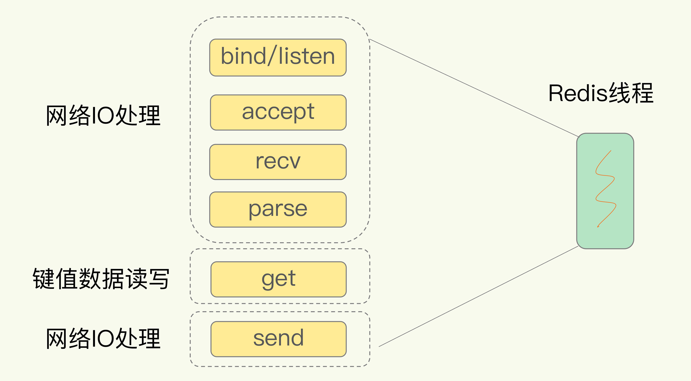
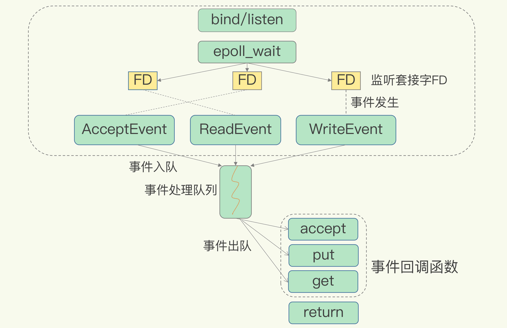

# 03 | 高性能IO模型：为什么单线程Redis能那么快？
今天，我们来探讨一个很多人都很关心的问题：“为什么单线程的Redis能那么快？”

首先，我要和你厘清一个事实，我们通常说，Redis是单线程，主要是指 **Redis的网络IO和键值对读写是由一个线程来完成的，这也是Redis对外提供键值存储服务的主要流程**。但Redis的其他功能，比如持久化、异步删除、集群数据同步等，其实是由额外的线程执行的。

所以，严格来说，Redis并不是单线程，但是我们一般把Redis称为单线程高性能，这样显得“酷”些。接下来，我也会把Redis称为单线程模式。而且，这也会促使你紧接着提问：“为什么用单线程？为什么单线程能这么快？”

要弄明白这个问题，我们就要深入地学习下Redis的单线程设计机制以及多路复用机制。之后你在调优Redis性能时，也能更有针对性地避免会导致Redis单线程阻塞的操作，例如执行复杂度高的命令。

好了，话不多说，接下来，我们就先来学习下Redis采用单线程的原因。

## Redis为什么用单线程？

要更好地理解Redis为什么用单线程，我们就要先了解多线程的开销。

### 多线程的开销

系统中通常会存在被多线程同时访问的共享资源，比如一个共享的数据结构。当有多个线程要修改这个共享资源时，为了保证共享资源的正确性，就需要有额外的机制进行保证，而这个额外的机制，就会带来额外的开销。

而且，采用多线程开发一般会引入同步原语来保护共享资源的并发访问，这也会降低系统代码的易调试性和可维护性。为了避免这些问题，Redis直接采用了单线程模式。

讲到这里，你应该已经明白了“Redis为什么用单线程”，那么，接下来，我们就来看看，为什么单线程Redis能获得高性能。

## 单线程Redis为什么那么快？

通常来说，单线程的处理能力要比多线程差很多，但是Redis却能使用单线程模型达到每秒数十万级别的处理能力，这是为什么呢？其实，这是Redis多方面设计选择的一个综合结果。

一方面，Redis的大部分操作在内存上完成，再加上它采用了高效的数据结构，例如哈希表和跳表，这是它实现高性能的一个重要原因。另一方面，就是Redis采用了 **多路复用机制**，使其在网络IO操作中能并发处理大量的客户端请求，实现高吞吐率。接下来，我们就重点学习下多路复用机制。

### 基本IO模型与阻塞点

以Get请求为例，SimpleKV为了处理一个Get请求，需要监听客户端请求（bind/listen），和客户端建立连接（accept），从socket中读取请求（recv），解析客户端发送请求（parse），根据请求类型读取键值数据（get），最后给客户端返回结果，即向socket中写回数据（send）。

下图显示了这一过程，其中，bind/listen、accept、recv、parse和send属于网络IO处理，而get属于键值数据操作。既然Redis是单线程，那么，最基本的一种实现是在一个线程中依次执行上面说的这些操作。



但是，在这里的网络IO操作中，有潜在的阻塞点，分别是accept()和recv()。当Redis监听到一个客户端有连接请求，但一直未能成功建立起连接时，会阻塞在accept()函数这里，导致其他客户端无法和Redis建立连接。类似的，当Redis通过recv()从一个客户端读取数据时，如果数据一直没有到达，Redis也会一直阻塞在recv()。

这就导致Redis整个线程阻塞，无法处理其他客户端请求，效率很低。不过，幸运的是，socket网络模型本身支持非阻塞模式。

### 非阻塞模式

Socket网络模型的非阻塞模式设置，主要体现在三个关键的函数调用上，如果想要使用socket非阻塞模式，就必须要了解这三个函数的调用返回类型和设置模式。接下来，我们就重点学习下它们。

在socket模型中，不同操作调用后会返回不同的套接字类型。socket()方法会返回主动套接字，然后调用listen()方法，将主动套接字转化为监听套接字，此时，可以监听来自客户端的连接请求。最后，调用accept()方法接收到达的客户端连接，并返回已连接套接字。


针对监听套接字，我们可以设置非阻塞模式：当Redis调用accept()但一直未有连接请求到达时，Redis线程可以返回处理其他操作，而不用一直等待。但是，你要注意的是，调用accept()时，已经存在监听套接字了。

虽然Redis线程可以不用继续等待，但是总得有机制继续在监听套接字上等待后续连接请求，并在有连接请求时通知Redis。

类似的，我们也可以针对已连接套接字设置非阻塞模式：Redis调用recv()后，如果已连接套接字上一直没有数据到达，Redis线程同样可以返回处理其他操作。我们也需要有机制继续监听该已连接套接字，并在有数据达到时通知Redis。

这样才能保证Redis线程，既不会像基本IO模型中一直在阻塞点等待，也不会导致Redis无法处理实际到达的连接请求或数据。

到此，Linux中的IO多路复用机制就要登场了。

### 基于多路复用的高性能I/O模型

Linux中的IO多路复用机制是指一个线程处理多个IO流，就是我们经常听到的select/epoll机制。简单来说，在Redis只运行单线程的情况下， **该机制允许内核中，同时存在多个监听套接字和已连接套接字**。内核会一直监听这些套接字上的连接请求或数据请求。一旦有请求到达，就会交给Redis线程处理，这就实现了一个Redis线程处理多个IO流的效果。

下图就是基于多路复用的Redis IO模型。图中的多个FD就是刚才所说的多个套接字。Redis网络框架调用epoll机制，让内核监听这些套接字。此时，Redis线程不会阻塞在某一个特定的监听或已连接套接字上，也就是说，不会阻塞在某一个特定的客户端请求处理上。正因为此，Redis可以同时和多个客户端连接并处理请求，从而提升并发性。



为了在请求到达时能通知到Redis线程，select/epoll提供了基于事件的回调机制，即针对不同事件的发生，调用相应的处理函数。

那么，回调机制是怎么工作的呢？其实，select/epoll一旦监测到FD上有请求到达时，就会触发相应的事件。

这些事件会被放进一个事件队列，Redis单线程对该事件队列不断进行处理。这样一来，Redis无需一直轮询是否有请求实际发生，这就可以避免造成CPU资源浪费。同时，Redis在对事件队列中的事件进行处理时，会调用相应的处理函数，这就实现了基于事件的回调。因为Redis一直在对事件队列进行处理，所以能及时响应客户端请求，提升Redis的响应性能。

为了方便你理解，我再以连接请求和读数据请求为例，具体解释一下。

这两个请求分别对应Accept事件和Read事件，Redis分别对这两个事件注册accept和get回调函数。当Linux内核监听到有连接请求或读数据请求时，就会触发Accept事件和Read事件，此时，内核就会回调Redis相应的accept和get函数进行处理。

可能你也注意到了，2020年5月，Redis 6.0的稳定版发布了，Redis 6.0中提出了多线程模型。那么，这个多线程模型和这节课所说的IO模型有什么关联？会引入复杂的并发控制问题吗？会给Redis 6.0带来多大提升？关于这些问题，我会在后面的课程中和你具体介绍。

# I/O多路复用

**核心问题：为什么需要 I/O 多路复用？**

在讲解三者之前，必须明确它们共同要解决的核心问题：如何高效地管理多个网络连接（文件描述符 fd）。

- 多线程/多进程模型的瓶颈：为每个连接创建一个线程或进程。当连接数暴涨（如C10K问题），进程/线程的创建、销毁、上下文切换会消耗大量系统资源，导致性能急剧下降。
- 阻塞 I/O 的低效：如果一个线程阻塞在一个连接的 read/write 操作上，其他连接即使有数据可读/可写，也无法被处理。
- 非阻塞 I/O 的忙轮询：将 fd 设为非阻塞，然后线程不断循环遍历所有 fd，询问是否有数据到达（`read`不会阻塞，返回 -1）。这会导致 CPU 空转，效率极低。

I/O 多路复用的解决方案：

它允许一个进程/线程同时监视多个文件描述符，一旦某个描述符就绪（可读、可写或发生异常），内核就通知应用程序进行相应的读写操作。这样，一个服务端进程就能同时处理多个客户端连接，极大地提高了系统的并发能力。

## select

### 工作原理

1. 定义集合：`select`使用三个 fd_set 结构（可视为位图），分别表示需要监视的可读、可写和异常的文件描述符集合。
2. 拷贝与阻塞：应用程序将感兴趣的 fd 设置到这些集合中，然后调用 `select`函数。内核会从用户空间拷贝这些 fd_set 到内核空间。
3. 线性扫描：内核会线性扫描所有被传入的 fd，判断其是否就绪。
4. 返回与修改：如果没有任何 fd 就绪，进程会阻塞。当有 fd 就绪或超时，`select`返回。返回时，内核会修改 fd_set，只保留就绪的 fd。
5. 线性查找：应用程序需要遍历所有之前设置的 fd，通过 `FD_ISSET`宏来判断哪个 fd 就绪了，然后进行处理。

### 函数签名

```c
int select(int nfds, fd_set *readfds, fd_set *writefds, fd_set *exceptfds, struct timeval *timeout);
```

### 优点

- 跨平台支持性好，几乎所有操作系统都支持。

### 缺点（及其解决的问题/未解决的问题）

1. 文件描述符数量限制：`fd_set`的大小是固定的（通常为 1024），由 `FD_SETSIZE`宏定义。这限制了 `select`能同时监视的 fd 最大数量。它无法解决海量连接（如万级以上）的问题。
2. 性能随 fd 数量线性下降：
   - 内核侧：每次调用 `select`，内核都需要线性扫描所有传入的 fd。时间复杂度 O(n)。
   - 用户侧：`select`返回后，应用程序也需要线性扫描所有 fd 来找出就绪的。时间复杂度 O(n)。
   - 当连接数很大但活跃连接很少时，这种线性扫描效率极低。
3. 内存拷贝开销：每次调用 `select`都需要将巨大的 fd_set 从用户空间拷贝到内核空间，返回时又需要拷贝回来。当 fd 很多时，这种拷贝会成为不小的开销。
4. 重新设置集合：`select`返回后，会修改传入的 fd_set，因此每次调用前都必须重新设置（重新添加所有需要监视的 fd）。这很麻烦且容易出错。


## poll

### 工作原理

`poll`的工作原理与 `select`非常相似，但它在数据结构上做了重要改进。

1. 使用 pollfd 数组：`poll`使用一个 `struct pollfd`数组，而不是位图。每个 `pollfd`结构包含了 fd、关心的事件（`events`）、以及实际发生的事件（`revents`）。

   ```c
   struct pollfd {
       int fd;         /* 文件描述符 */
       short events;   /* 需要监视的事件（输入参数） */
       short revents;  /* 实际发生的事件（输出参数） */
   };
   ```

2. 无数量限制：由于使用数组，理论上没有最大文件描述符数量的限制（仅受系统资源限制）。

3. 分离事件字段：`events`和 `revents`是分离的，内核只会修改 `revents`。因此，每次调用 `poll`时，无需像 `select`那样重新设置整个监控集合，只需重用之前的 `pollfd`数组即可。

### 函数签名

```c
int poll(struct pollfd *fds, nfds_t nfds, int timeout);
```

### 优点（相对于 select）

- 解决了数量限制问题。
- 无需在调用前重置监控集合，API 使用更方便。

### 缺点（未解决的问题）

1. 性能问题依旧：和 `select`一样，`poll`返回后，应用程序仍然需要遍历整个 `pollfd`数组来查找就绪的 fd。内核也需要遍历所有 fd 来判断状态。性能仍然随 fd 数量增加而线性下降（O(n)）。
2. 内存拷贝开销依旧：每次调用仍然需要将整个 `pollfd`数组从用户空间拷贝到内核空间。

**总结**：`poll`主要解决了 `select`的 fd 数量限制和使用不便的问题，但最核心的性能瓶颈（线性遍历）和内存拷贝问题仍然存在。


## epoll

`epoll`是 Linux 2.6 引入的，专门为解决 `select`和 `poll`的性能瓶颈而设计。它是三者中性能最高的。

### 核心设计与工作原理

`epoll`通过以下三个系统调用和工作流程，彻底改变了工作模式：

1. `epoll_create`：创建一个 epoll 实例
   内核会创建一个称为“eventpoll”的内核对象，它有一个就绪队列（ready list）和一个红黑树，用于高效管理 fd。
2. `epoll_ctl`：向 epoll 实例中添加、修改或删除要监视的 fd
   这是增量操作。应用程序通过此调用告诉内核关心哪个 fd 的什么事件。内核会将该 fd 添加到 eventpoll 的红黑树中，并为它注册一个回调函数。这个过程只在初始化或连接变化时发生，避免了重复拷贝。
3. `epoll_wait`：等待事件发生
   这是核心的等待调用。它检查 eventpoll 的就绪队列是否为空。如果为空，当前进程阻塞。当 fd 就绪时，内核通过之前注册的回调函数将其放入就绪队列。`epoll_wait`返回时，只将就绪队列中的事件拷贝给用户。应用程序无需遍历所有 fd，直接处理返回的事件数组即可。

### 两种触发模式

这是 `epoll`的一个高级特性：

- 水平触发（LT，默认）：只要 fd 处于就绪状态（比如读缓冲区不为空），每次调用 `epoll_wait`都会通知应用程序。编程更简单，不容易遗漏事件。
- 边缘触发（ET）：只在 fd 状态发生变化时（比如从不可读变为可读）通知一次。要求应用程序必须一次性将缓冲区数据读完/写完，否则可能错过事件。ET 模式效率更高，减少了相同事件的重复通知。

### 优点（解决了 select/poll 的所有问题）

1. 无性能瓶颈：`epoll`不会因为 fd 数量的增加而导致性能显著下降。时间复杂度 O(1)。
2. 无需遍历：`epoll_wait`返回的是就绪的 fd 列表，应用程序直接处理，无需遍历所有监控的 fd。
3. 避免内存拷贝：通过 `epoll_ctl`建立一次性的注册机制，避免了每次调用时重复拷贝整个监控集合。


## 三者的对比总结表

| 特性            | select                                   | poll                    | epoll                                      |
| :-------------- | :--------------------------------------- | :---------------------- | :----------------------------------------- |
| **最大连接数**  | 有限制（通常1024）                       | 无限制（系统资源限制）  | 无限制（系统资源限制）                     |
| **工作效率**    | 线性扫描 O(n)                            | 线性扫描 O(n)           | 回调机制 O(1)，只关心活跃fd                |
| **fd 数据传递** | 每次调用都需要从用户态拷贝fd集合到内核态 | 同select                | 内核红黑树管理，首次注册即可，避免重复拷贝 |
| **触发模式**    | 仅水平触发（LT）                         | 仅水平触发（LT）        | 支持水平触发（LT）和边缘触发（ET）         |
| **编程复杂度**  | 较复杂，需每次重置fd_set                 | 较简单，无需重置        | 简单，接口清晰                             |
| **跨平台**      | 好                                       | 较好（大部分Unix-like） | Linux 特有                                 |

**演进关系与结论**

- **`select`-> `poll`**：这是一个小的演进，主要解决了 fd 数量限制 和 API 使用不便 的问题，属于“量变”。
- **`poll`-> `epoll`**：这是一个质的飞跃，从主动轮询机制变为事件驱动（回调） 机制，彻底解决了 性能随连接数线性下降 的核心瓶颈，属于“质变”。

简单来说，`epoll`是 Linux 下解决 C10K 甚至 C1000K 问题的关键技术，是现代高性能网络编程的基石。