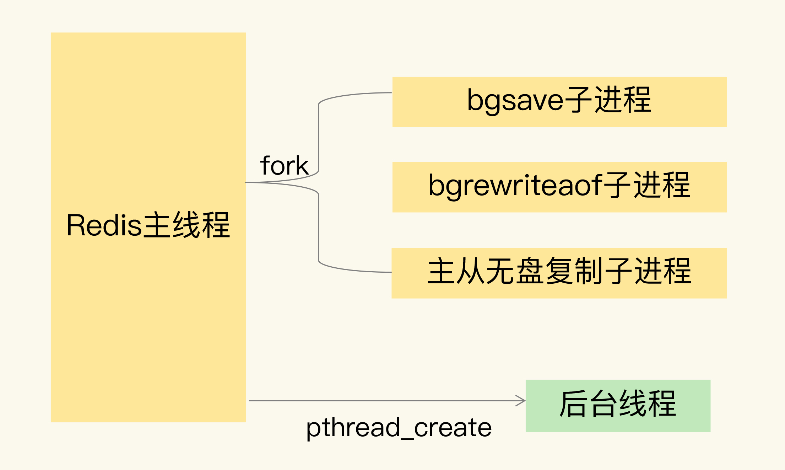
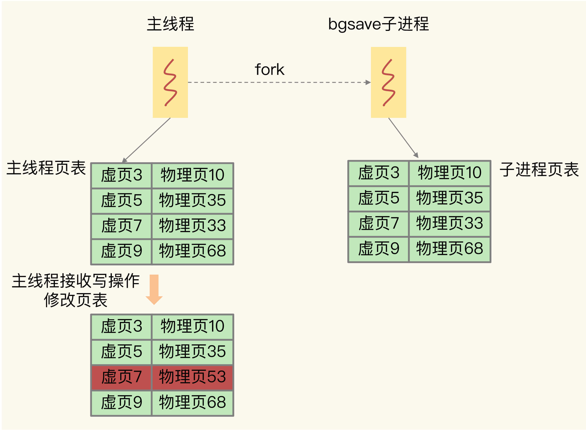
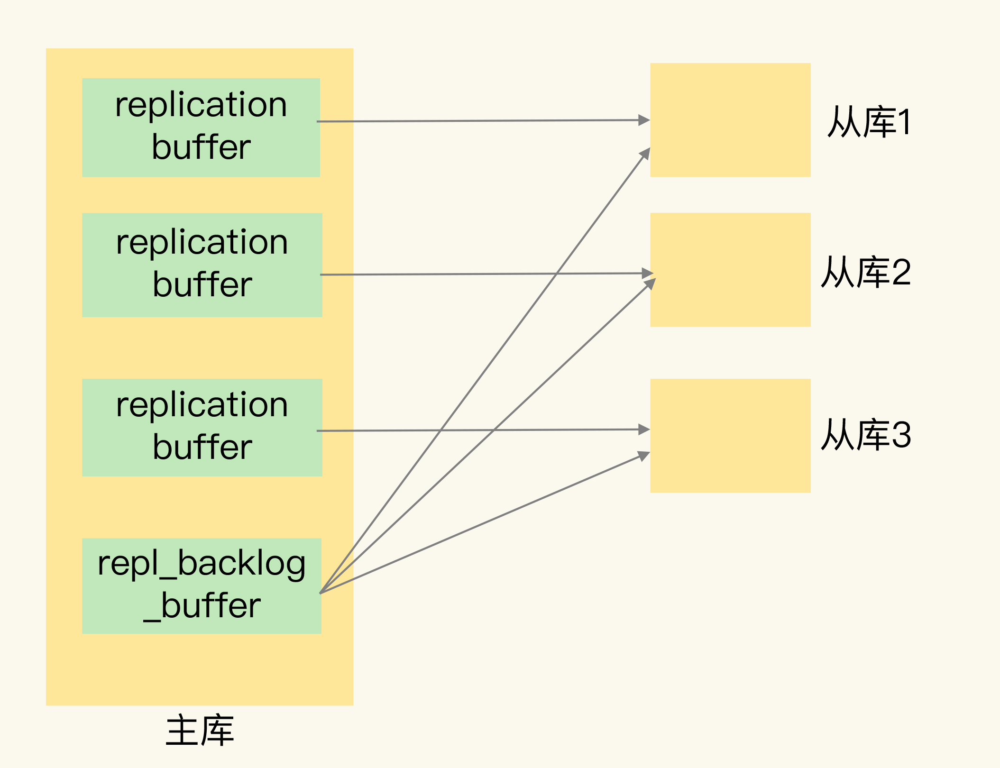

# 10 | 第1～9讲课后思考题答案及常见问题答疑
你好，我是蒋德钧。

咱们的课程已经更新9讲了，这段时间，我收到了很多留言。很多同学都认真地回答了课后思考题，有些回答甚至可以说是标准答案。另外，还有很多同学针对Redis的基本原理和关键机制，提出了非常好的问题，值得好好讨论一下。

今天，我就和你聊一聊课后题答案，并且挑选一些典型问题，集中进行一次讲解，希望可以解决你的困惑。

## 课后思考题答案

### [第1讲](https://time.geekbang.org/column/article/268262)

**问题：和跟Redis相比，SimpleKV还缺少什么？**

@曾轼麟、@Kaito 同学给出的答案都非常棒。他们从数据结构到功能扩展，从内存效率到事务性，从高可用集群再到高可扩展集群，对SimpleKV和Redis进行了详细的对比。而且，他们还从运维使用的角度进行了分析。我先分享一下两位同学的答案。

@曾轼麟同学：

> 1. 数据结构：缺乏广泛的数据结构支持，比如支持范围查询的SkipList和Stream等数据结构。
> 2. 高可用：缺乏哨兵或者master-slave模式的高可用设计；
> 3. 横向扩展：缺乏集群和分片功能；
> 4. 内存安全性：缺乏内存过载时的key淘汰算法的支持；
> 5. 内存利用率：没有充分对数据结构进行优化，提高内存利用率，例如使用压缩性的数据结构；
> 6. 功能扩展：需要具备后续功能的拓展；
> 7. 不具备事务性：无法保证多个操作的原子性。

@Kaito同学：

> SimpleKV所缺少的有：丰富的数据类型、支持数据压缩、过期机制、数据淘汰策略、主从复制、集群化、高可用集群等，另外，还可以增加统计模块、通知模块、调试模块、元数据查询等辅助功能。

我也给个答案总结。还记得我在 [开篇词](https://time.geekbang.org/column/article/268247) 讲过的“两大维度”“三大主线”吗？这里我们也可以借助这个框架进行分析，如下表所示。此外，在表格最后，我还从键值数据库开发和运维的辅助工具上，对SimpleKV和Redis做了对比。


### [第2讲](https://time.geekbang.org/column/article/268253)

**问题：整数数组和压缩列表作为底层数据结构的优势是什么？**

整数数组和压缩列表的设计，充分体现了Redis“又快又省”特点中的“省”，也就是节省内存空间。整数数组和压缩列表都是在内存中分配一块地址连续的空间，然后把集合中的元素一个接一个地放在这块空间内，非常紧凑。因为元素是挨个连续放置的，我们不用再通过额外的指针把元素串接起来，这就避免了额外指针带来的空间开销。

我画一张图，展示下这两个结构的内存布局。整数数组和压缩列表中的entry都是实际的集合元素，它们一个挨一个保存，非常节省内存空间。


Redis之所以采用不同的数据结构，其实是在性能和内存使用效率之间进行的平衡。

### [第3讲](https://time.geekbang.org/column/article/270474)

**问题：Redis基本IO模型中还有哪些潜在的性能瓶颈？**

这个问题是希望你能进一步理解阻塞操作对Redis单线程性能的影响。在Redis基本IO模型中，主要是主线程在执行操作，任何耗时的操作，例如bigkey、全量返回等操作，都是潜在的性能瓶颈。

### [第4讲](https://time.geekbang.org/column/article/271754)

**问题1：AOF重写过程中有没有其他潜在的阻塞风险？**

这里有两个风险。

风险一：Redis主线程fork创建bgrewriteaof子进程时，内核需要创建用于管理子进程的相关数据结构，这些数据结构在操作系统中通常叫作进程控制块（Process Control Block，简称为PCB）。内核要把主线程的PCB内容拷贝给子进程。这个创建和拷贝过程由内核执行，是会阻塞主线程的。而且，在拷贝过程中，子进程要拷贝父进程的页表，这个过程的耗时和Redis实例的内存大小有关。如果Redis实例内存大，页表就会大，fork执行时间就会长，这就会给主线程带来阻塞风险。

风险二：bgrewriteaof子进程会和主线程共享内存。当主线程收到新写或修改的操作时，主线程会申请新的内存空间，用来保存新写或修改的数据，如果操作的是bigkey，也就是数据量大的集合类型数据，那么，主线程会因为申请大空间而面临阻塞风险。因为操作系统在分配内存空间时，有查找和锁的开销，这就会导致阻塞。

**问题2：AOF 重写为什么不共享使用 AOF 本身的日志？**

如果都用AOF日志的话，主线程要写，bgrewriteaof子进程也要写，这两者会竞争文件系统的锁，这就会对Redis主线程的性能造成影响。

### [第5讲](https://time.geekbang.org/column/article/271839)

问题：使用一个 2 核 CPU、4GB 内存、500GB 磁盘的云主机运行 Redis，Redis 数据库的数据量大小差不多是 2GB。当时 Redis主要以修改操作为主，写读比例差不多在 8:2 左右，也就是说，如果有 100 个请求，80 个请求执行的是修改操作。在这个场景下，用 RDB 做持久化有什么风险吗？

@Kaito同学的回答从内存资源和CPU资源两方面分析了风险，非常棒。我稍微做了些完善和精简，你可以参考一下。

**内存不足的风险**：Redis fork一个bgsave子进程进行RDB写入，如果主线程再接收到写操作，就会采用写时复制。写时复制需要给写操作的数据分配新的内存空间。本问题中写的比例为80%，那么，在持久化过程中，为了保存80%写操作涉及的数据，写时复制机制会在实例内存中，为这些数据再分配新内存空间，分配的内存量相当于整个实例数据量的80%，大约是1.6GB，这样一来，整个系统内存的使用量就接近饱和了。此时，如果实例还有大量的新key写入或key修改，云主机内存很快就会被吃光。如果云主机开启了Swap机制，就会有一部分数据被换到磁盘上，当访问磁盘上的这部分数据时，性能会急剧下降。如果云主机没有开启Swap，会直接触发OOM，整个Redis实例会面临被系统kill掉的风险。

**主线程和子进程竞争使用CPU的风险**：生成RDB的子进程需要CPU核运行，主线程本身也需要CPU核运行，而且，如果Redis还启用了后台线程，此时，主线程、子进程和后台线程都会竞争CPU资源。由于云主机只有2核CPU，这就会影响到主线程处理请求的速度。

### [第6讲](https://time.geekbang.org/column/article/272852)

**问题：为什么主从库间的复制不使用 AOF？**

答案：有两个原因。

1. RDB文件是二进制文件，无论是要把RDB写入磁盘，还是要通过网络传输RDB，IO效率都比记录和传输AOF的高。
2. 在从库端进行恢复时，用RDB的恢复效率要高于用AOF。

### [第7讲](https://time.geekbang.org/column/article/274483)

**问题1：在主从切换过程中，客户端能否正常地进行请求操作呢？**

主从集群一般是采用读写分离模式，当主库故障后，客户端仍然可以把读请求发送给从库，让从库服务。但是，对于写请求操作，客户端就无法执行了。

**问题2：如果想要应用程序不感知服务的中断，还需要哨兵或客户端再做些什么吗？**

一方面，客户端需要能缓存应用发送的写请求。只要不是同步写操作（Redis应用场景一般也没有同步写），写请求通常不会在应用程序的关键路径上，所以，客户端缓存写请求后，给应用程序返回一个确认就行。

另一方面，主从切换完成后，客户端要能和新主库重新建立连接，哨兵需要提供订阅频道，让客户端能够订阅到新主库的信息。同时，客户端也需要能主动和哨兵通信，询问新主库的信息。

### [第8讲](https://time.geekbang.org/column/article/275337)

**问题1：5个哨兵实例的集群，quorum值设为2。在运行过程中，如果有3个哨兵实例都发生故障了，此时，Redis主库如果有故障，还能正确地判断主库“客观下线”吗？如果可以的话，还能进行主从库自动切换吗？**

因为判定主库“客观下线”的依据是，认为主库“主观下线”的哨兵个数要大于等于quorum值，现在还剩2个哨兵实例，个数正好等于quorum值，所以还能正常判断主库是否处于“客观下线”状态。如果一个哨兵想要执行主从切换，就要获到半数以上的哨兵投票赞成，也就是至少需要3个哨兵投票赞成。但是，现在只有2个哨兵了，所以就无法进行主从切换了。

**问题2：哨兵实例是不是越多越好呢？如果同时调大down-after-milliseconds值，对减少误判是不是也有好处？**

哨兵实例越多，误判率会越低，但是在判定主库下线和选举Leader时，实例需要拿到的赞成票数也越多，等待所有哨兵投完票的时间可能也会相应增加，主从库切换的时间也会变长，客户端容易堆积较多的请求操作，可能会导致客户端请求溢出，从而造成请求丢失。如果业务层对Redis的操作有响应时间要求，就可能会因为新主库一直没有选定，新操作无法执行而发生超时报警。

调大down-after-milliseconds后，可能会导致这样的情况：主库实际已经发生故障了，但是哨兵过了很长时间才判断出来，这就会影响到Redis对业务的可用性。

### [第9讲](https://time.geekbang.org/column/article/276545)

问题：为什么Redis不直接用一个表，把键值对和实例的对应关系记录下来？

如果使用表记录键值对和实例的对应关系，一旦键值对和实例的对应关系发生了变化（例如实例有增减或者数据重新分布），就要修改表。如果是单线程操作表，那么所有操作都要串行执行，性能慢；如果是多线程操作表，就涉及到加锁开销。此外，如果数据量非常大，使用表记录键值对和实例的对应关系，需要的额外存储空间也会增加。

基于哈希槽计算时，虽然也要记录哈希槽和实例的对应关系，但是哈希槽的个数要比键值对的个数少很多，无论是修改哈希槽和实例的对应关系，还是使用额外空间存储哈希槽和实例的对应关系，都比直接记录键值对和实例的关系的开销小得多。

好了，这些问题你都回答上来了吗？如果你还有其他想法，也欢迎多多留言，跟我和其他同学进行交流讨论。

## 典型问题讲解

接下来，我再讲一些代表性问题，包括Redis rehash的时机和执行机制，主线程、子进程和后台线程的联系和区别，写时复制的底层实现原理，以及replication buffer和repl\_backlog\_buffer的区别。

### 问题1：rehash的触发时机和渐进式执行机制

我发现，很多同学对Redis的哈希表数据结构都很感兴趣，尤其是哈希表的rehash操作，所以，我再集中回答两个问题。

**1.Redis什么时候做rehash？**

Redis会使用装载因子（load factor）来判断是否需要做rehash。装载因子的计算方式是，哈希表中所有entry的个数除以哈希表的哈希桶个数。Redis会根据装载因子的两种情况，来触发rehash操作：

- 装载因子≥1，同时，哈希表被允许进行rehash；
- 装载因子≥5。

在第一种情况下，如果装载因子等于1，同时我们假设，所有键值对是平均分布在哈希表的各个桶中的，那么，此时，哈希表可以不用链式哈希，因为一个哈希桶正好保存了一个键值对。

但是，如果此时再有新的数据写入，哈希表就要使用链式哈希了，这会对查询性能产生影响。在进行RDB生成和AOF重写时，哈希表的rehash是被禁止的，这是为了避免对RDB和AOF重写造成影响。如果此时，Redis没有在生成RDB和重写AOF，那么，就可以进行rehash。否则的话，再有数据写入时，哈希表就要开始使用查询较慢的链式哈希了。

在第二种情况下，也就是装载因子大于等于5时，就表明当前保存的数据量已经远远大于哈希桶的个数，哈希桶里会有大量的链式哈希存在，性能会受到严重影响，此时，就立马开始做rehash。

刚刚说的是触发rehash的情况，如果装载因子小于1，或者装载因子大于1但是小于5，同时哈希表暂时不被允许进行rehash（例如，实例正在生成RDB或者重写AOF），此时，哈希表是不会进行rehash操作的。

**2.采用渐进式hash时，如果实例暂时没有收到新请求，是不是就不做rehash了？**

其实不是的。Redis会执行定时任务，定时任务中就包含了rehash操作。所谓的定时任务，就是按照一定频率（例如每100ms/次）执行的任务。

在rehash被触发后，即使没有收到新请求，Redis也会定时执行一次rehash操作，而且，每次执行时长不会超过1ms，以免对其他任务造成影响。

### 问题2：主线程、子进程和后台线程的联系与区别

我在课程中提到了主线程、主进程、子进程、子线程和后台线程这几个词，有些同学可能会有疑惑，我再帮你总结下它们的区别。

首先，我来解释一下进程和线程的区别。

从操作系统的角度来看，进程一般是指资源分配单元，例如一个进程拥有自己的堆、栈、虚存空间（页表）、文件描述符等；而线程一般是指CPU进行调度和执行的实体。

了解了进程和线程的区别后，我们再来看下什么是主进程和主线程。

如果一个进程启动后，没有再创建额外的线程，那么，这样的进程一般称为主进程或主线程。

举个例子，下面是我写的一个C程序片段，main函数会直接调用一个worker函数，函数worker就是执行一个for循环计算。下面这个程序运行后，它自己就是一个主进程，同时也是个主线程。

```
int counter = 0;
void *worker() {
   for (int i=0;i<10;i++) {
      counter++;
   }
   return NULL;
}

int main(int argc, char *argv[]) {
   worker();
}

```

和这段代码类似，Redis启动以后，本身就是一个进程，它会接收客户端发送的请求，并处理读写操作请求。而且，接收请求和处理请求操作是Redis的主要工作，Redis没有再依赖于其他线程，所以，我一般把完成这个主要工作的Redis进程，称为主进程或主线程。

在主线程中，我们还可以使用fork创建子进程，或是使用pthread\_create创建线程。下面我先介绍下Redis中用fork创建的子进程有哪些。

- 创建RDB的后台子进程，同时由它负责在主从同步时传输RDB给从库；
- 通过无盘复制方式传输RDB的子进程；
- bgrewriteaof子进程。

然后，我们再看下Redis使用的线程。从4.0版本开始，Redis也开始使用pthread\_create创建线程，这些线程在创建后，一般会自行执行一些任务，例如执行异步删除任务。相对于完成主要工作的主线程来说，我们一般可以称这些线程为后台线程。关于Redis后台线程的具体执行机制，我会在第16讲具体介绍。

为了帮助你更好地理解，我画了一张图，展示了它们的区别。



### 问题3：写时复制的底层实现机制

Redis在使用RDB方式进行持久化时，会用到写时复制机制。我在第5节课讲写时复制的时候，着重介绍了写时复制的效果：bgsave子进程相当于复制了原始数据，而主线程仍然可以修改原来的数据。

今天，我再具体讲一讲写时复制的底层实现机制。

对Redis来说，主线程fork出bgsave子进程后，bgsave子进程实际是复制了主线程的页表。这些页表中，就保存了在执行bgsave命令时，主线程的所有数据块在内存中的物理地址。这样一来，bgsave子进程生成RDB时，就可以根据页表读取这些数据，再写入磁盘中。如果此时，主线程接收到了新写或修改操作，那么，主线程会使用写时复制机制。具体来说，写时复制就是指，主线程在有写操作时，才会把这个新写或修改后的数据写入到一个新的物理地址中，并修改自己的页表映射。

我来借助下图中的例子，具体展示一下写时复制的底层机制。

bgsave子进程复制主线程的页表以后，假如主线程需要修改虚页7里的数据，那么，主线程就需要新分配一个物理页（假设是物理页53），然后把修改后的虚页7里的数据写到物理页53上，而虚页7里原来的数据仍然保存在物理页33上。这个时候，虚页7到物理页33的映射关系，仍然保留在bgsave子进程中。所以，bgsave子进程可以无误地把虚页7的原始数据写入RDB文件。



### 问题4：replication buffer和repl\_backlog\_buffer的区别

在进行主从复制时，Redis会使用replication buffer和repl\_backlog\_buffer，有些同学可能不太清楚它们的区别，我再解释下。

总的来说，replication buffer是主从库在进行全量复制时，主库上用于和从库连接的客户端的buffer，而repl\_backlog\_buffer是为了支持从库增量复制，主库上用于持续保存写操作的一块专用buffer。

Redis主从库在进行复制时，当主库要把全量复制期间的写操作命令发给从库时，主库会先创建一个客户端，用来连接从库，然后通过这个客户端，把写操作命令发给从库。在内存中，主库上的客户端就会对应一个buffer，这个buffer就被称为replication buffer。Redis通过client\_buffer配置项来控制这个buffer的大小。主库会给每个从库建立一个客户端，所以replication buffer不是共享的，而是每个从库都有一个对应的客户端。

repl\_backlog\_buffer是一块专用buffer，在Redis服务器启动后，开始一直接收写操作命令，这是所有从库共享的。主库和从库会各自记录自己的复制进度，所以，不同的从库在进行恢复时，会把自己的复制进度（slave\_repl\_offset）发给主库，主库就可以和它独立同步。



好了，这节课就到这里。非常感谢你的仔细思考和提问，每个问题都很精彩，在看留言的过程中，我自己也受益匪浅。另外，我希望我们可以组建起一个Redis学习团，在接下来的课程中，欢迎你继续在留言区畅所欲言，我们一起进步，希望每个人都能成为Redis达人！