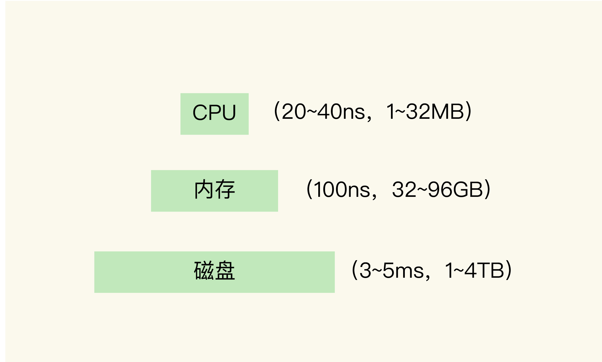
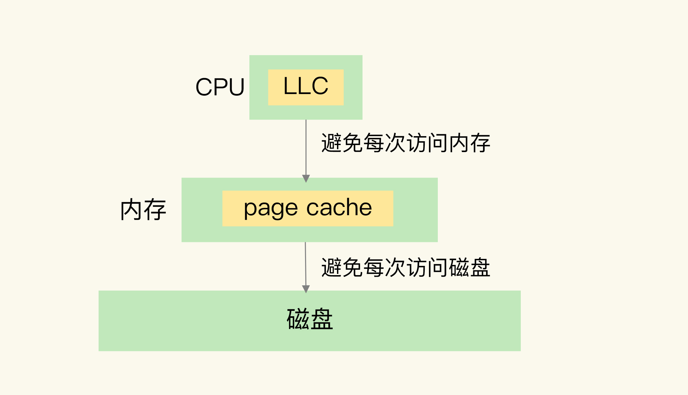
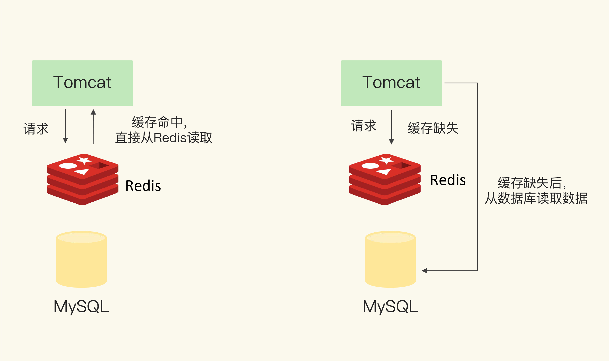
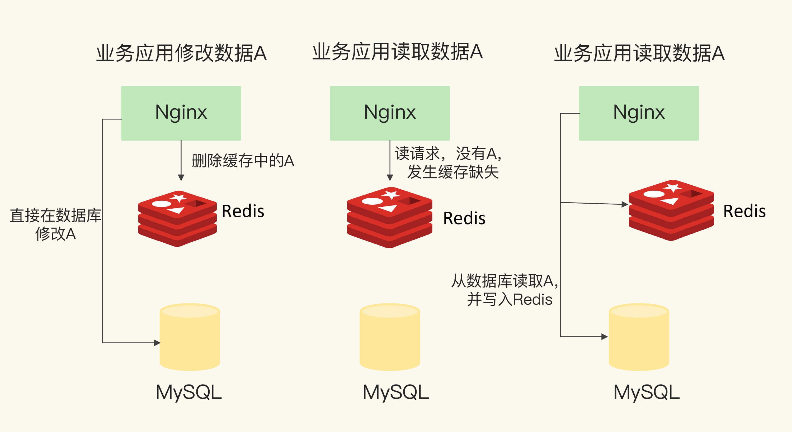
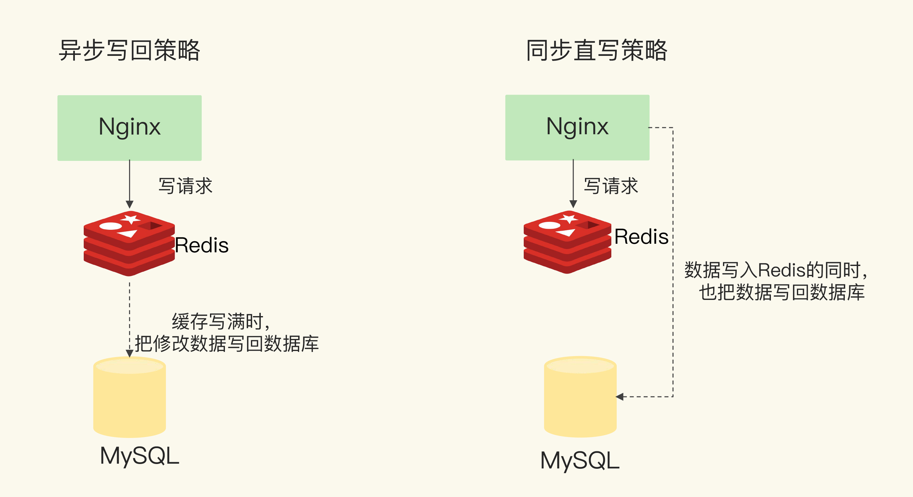

# 23 | 旁路缓存：Redis是如何工作的？
你好，我是蒋德钧。

我们知道，Redis提供了高性能的数据存取功能，所以广泛应用在缓存场景中，既能有效地提升业务应用的响应速度，还可以避免把高并发大压力的请求发送到数据库层。

但是，如果Redis做缓存时出现了问题，比如说缓存失效，那么，大量请求就会直接积压到数据库层，必然会给数据库带来巨大的压力，很可能会导致数据库宕机或是故障，那么，业务应用就没有办法存取数据、响应用户请求了。这种生产事故，肯定不是我们希望看到的。

正因为Redis用作缓存的普遍性以及它在业务应用中的重要作用，所以，我们需要系统地掌握缓存的一系列内容，包括工作原理、替换策略、异常处理和扩展机制。具体来说，我们需要解决四个关键问题：

- Redis缓存具体是怎么工作的？
- Redis缓存如果满了，该怎么办？
- 为什么会有缓存一致性、缓存穿透、缓存雪崩、缓存击穿等异常，该如何应对？
- Redis的内存毕竟有限，如果用快速的固态硬盘来保存数据，可以增加缓存的数据量，那么，Redis缓存可以使用快速固态硬盘吗？

这节课，我们来了解下缓存的特征和Redis适用于缓存的天然优势，以及Redis缓存的具体工作机制。

## 缓存的特征

要想弄明白Redis为什么适合用作缓存，我们得清楚缓存都有什么特征。

首先，你要知道，一个系统中的不同层之间的访问速度不一样，所以我们才需要缓存，这样就可以把一些需要频繁访问的数据放在缓存中，以加快它们的访问速度。

为了让你能更好地理解，我以计算机系统为例，来解释一下。下图是计算机系统中的三层存储结构，以及它们各自的常用容量和访问性能。最上面是处理器，中间是内存，最下面是磁盘。



从图上可以看到，CPU、内存和磁盘这三层的访问速度从几十ns到100ns，再到几ms，性能的差异很大。

想象一下，如果每次CPU处理数据时，都要从ms级别的慢速磁盘中读取数据，然后再进行处理，那么，CPU只能等磁盘的数据传输完成。这样一来，高速的CPU就被慢速的磁盘拖累了，整个计算机系统的运行速度会变得非常慢。

所以，计算机系统中，默认有两种缓存：

- CPU里面的末级缓存，即LLC，用来缓存内存中的数据，避免每次从内存中存取数据；
- 内存中的高速页缓存，即page cache，用来缓存磁盘中的数据，避免每次从磁盘中存取数据。



跟内存相比，LLC的访问速度更快，而跟磁盘相比，内存的访问是更快的。所以，我们可以看出来缓存的 **第一个特征**：在一个层次化的系统中，缓存一定是一个快速子系统，数据存在缓存中时，能避免每次从慢速子系统中存取数据。对应到互联网应用来说，Redis就是快速子系统，而数据库就是慢速子系统了。

知道了这一点，你就能理解，为什么我们必须想尽办法让Redis提供高性能的访问，因为，如果访问速度很慢，Redis作为缓存的价值就不大了。

我们再看一下刚才的计算机分层结构。LLC的大小是MB级别，page cache的大小是GB级别，而磁盘的大小是TB级别。这其实包含了缓存的 **第二个特征：缓存系统的容量大小总是小于后端慢速系统的，我们不可能把所有数据都放在缓存系统中**。

这个很有意思，它表明，缓存的容量终究是有限的，缓存中的数据量也是有限的，肯定是没法时刻都满足访问需求的。所以，缓存和后端慢速系统之间，必然存在数据写回和再读取的交互过程。简单来说，缓存中的数据需要按一定规则淘汰出去，写回后端系统，而新的数据又要从后端系统中读取进来，写入缓存。

说到这儿，你肯定会想到，Redis本身是支持按一定规则淘汰数据的，相当于实现了缓存的数据淘汰，其实，这也是Redis适合用作缓存的一个重要原因。

好了，我们现在了解了缓存的两个重要特征，那么，接下来，我们就来学习下，缓存是怎么处理请求的。实际上，业务应用在访问Redis缓存中的数据时，数据不一定存在，因此，处理的方式也不同。

## Redis缓存处理请求的两种情况

把Redis用作缓存时，我们会把Redis部署在数据库的前端，业务应用在访问数据时，会先查询Redis中是否保存了相应的数据。此时，根据数据是否存在缓存中，会有两种情况。

- **缓存命中**：Redis中有相应数据，就直接读取Redis，性能非常快。
- **缓存缺失**：Redis中没有保存相应数据，就从后端数据库中读取数据，性能就会变慢。而且，一旦发生缓存缺失，为了让后续请求能从缓存中读取到数据，我们需要把缺失的数据写入Redis，这个过程叫作缓存更新。缓存更新操作会涉及到保证缓存和数据库之间的数据一致性问题，关于这一点，我会在第25讲中再具体介绍。

我画了一张图，清晰地展示了发生缓存命中或缺失时，应用读取数据的情况，你可以看下这张图片。



假设我们在一个Web应用中，使用Redis作为缓存。用户请求发送给Tomcat，Tomcat负责处理业务逻辑。如果要访问数据，就需要从MySQL中读写数据。那么，我们可以把Redis部署在MySQL前端。如果访问的数据在Redis中，此时缓存命中，Tomcat可以直接从Redis中读取数据，加速应用的访问。否则，Tomcat就需要从慢速的数据库中读取数据了。

到这里，你可能已经发现了，使用Redis缓存时，我们基本有三个操作：

- 应用读取数据时，需要先读取Redis；
- 发生缓存缺失时，需要从数据库读取数据；
- 发生缓存缺失时，还需要更新缓存。

那么，这些操作具体是由谁来做的呢？这和Redis缓存的使用方式相关。接下来，我就来和你聊聊Redis作为旁路缓存的使用操作方式。

## Redis作为旁路缓存的使用操作

Redis是一个独立的系统软件，和业务应用程序是两个软件，当我们部署了Redis实例后，它只会被动地等待客户端发送请求，然后再进行处理。所以，如果应用程序想要使用Redis缓存，我们就要在程序中增加相应的缓存操作代码。所以，我们也把Redis称为旁路缓存，也就是说，读取缓存、读取数据库和更新缓存的操作都需要在应用程序中来完成。

这和我刚才讲的计算机系统中的LLC和page cache不一样。你可以回想下，平时在开发程序时，我们是没有专门在代码中显式地创建LLC或page cache的实例的，也没有显式调用过它们的GET接口。这是因为，我们在构建计算机硬件系统时，已经把LLC和page cache放在了应用程序的数据访问路径上，应用程序访问数据时直接就能用上缓存。

那么，使用Redis缓存时，具体来说，我们需要在应用程序中增加三方面的代码：

- 当应用程序需要读取数据时，我们需要在代码中显式调用Redis的GET操作接口，进行查询；
- 如果缓存缺失了，应用程序需要再和数据库连接，从数据库中读取数据；
- 当缓存中的数据需要更新时，我们也需要在应用程序中显式地调用SET操作接口，把更新的数据写入缓存。

那么，代码应该怎么加呢？我给你展示一段Web应用中使用Redis缓存的伪代码示例。

```
String cacheKey = “productid_11010003”;
String cacheValue = redisCache.get(cacheKey)；
//缓存命中
if ( cacheValue != NULL)
   return cacheValue;
//缓存缺失
else
   cacheValue = getProductFromDB();
   redisCache.put(cacheValue)  //缓存更新

```

可以看到，为了使用缓存，Web应用程序需要有一个表示缓存系统的实例对象redisCache，还需要主动调用Redis的GET接口，并且要处理缓存命中和缓存缺失时的逻辑，例如在缓存缺失时，需要更新缓存。

了解了这一点，我们在使用Redis缓存时，有一个地方就需要注意了：因为需要新增程序代码来使用缓存，所以，Redis并不适用于那些无法获得源码的应用，例如一些很早之前开发的应用程序，它们的源码已经没有再维护了，或者是第三方供应商开发的应用，没有提供源码，所以，我们就没有办法在这些应用中进行缓存操作。

在使用旁路缓存时，我们需要在应用程序中增加操作代码，增加了使用Redis缓存的额外工作量，但是，也正因为Redis是旁路缓存，是一个独立的系统，我们可以单独对Redis缓存进行扩容或性能优化。而且，只要保持操作接口不变，我们在应用程序中增加的代码就不用再修改了。

好了，到这里，我们知道了，通过在应用程序中加入Redis的操作代码，我们可以让应用程序使用Redis缓存数据了。不过，除了从Redis缓存中查询、读取数据以外，应用程序还可能会对数据进行修改，这时，我们既可以在缓存中修改，也可以在后端数据库中进行修改，我们该怎么选择呢？

其实，这就涉及到了Redis缓存的两种类型：只读缓存和读写缓存。只读缓存能加速读请求，而读写缓存可以同时加速读写请求。而且，读写缓存又有两种数据写回策略，可以让我们根据业务需求，在保证性能和保证数据可靠性之间进行选择。所以，接下来，我们来具体了解下Redis的缓存类型和相应的写回策略。

## 缓存的类型

按照Redis缓存是否接受写请求，我们可以把它分成只读缓存和读写缓存。先来了解下只读缓存。

### 只读缓存

当Redis用作只读缓存时，应用要读取数据的话，会先调用Redis GET接口，查询数据是否存在。而所有的数据写请求，会直接发往后端的数据库，在数据库中增删改。对于删改的数据来说，如果Redis已经缓存了相应的数据，应用需要把这些缓存的数据删除，Redis中就没有这些数据了。

当应用再次读取这些数据时，会发生缓存缺失，应用会把这些数据从数据库中读出来，并写到缓存中。这样一来，这些数据后续再被读取时，就可以直接从缓存中获取了，能起到加速访问的效果。

我给你举个例子。假设业务应用要修改数据A，此时，数据A在Redis中也缓存了，那么，应用会先直接在数据库里修改A，并把Redis中的A删除。等到应用需要读取数据A时，会发生缓存缺失，此时，应用从数据库中读取A，并写入Redis，以便后续请求从缓存中直接读取，如下图所示：



只读缓存直接在数据库中更新数据的好处是，所有最新的数据都在数据库中，而数据库是提供数据可靠性保障的，这些数据不会有丢失的风险。当我们需要缓存图片、短视频这些用户只读的数据时，就可以使用只读缓存这个类型了。

### 读写缓存

知道了只读缓存，读写缓存也就很容易理解了。

对于读写缓存来说，除了读请求会发送到缓存进行处理（直接在缓存中查询数据是否存在)，所有的写请求也会发送到缓存，在缓存中直接对数据进行增删改操作。此时，得益于Redis的高性能访问特性，数据的增删改操作可以在缓存中快速完成，处理结果也会快速返回给业务应用，这就可以提升业务应用的响应速度。

但是，和只读缓存不一样的是，在使用读写缓存时，最新的数据是在Redis中，而Redis是内存数据库，一旦出现掉电或宕机，内存中的数据就会丢失。这也就是说，应用的最新数据可能会丢失，给应用业务带来风险。

所以，根据业务应用对数据可靠性和缓存性能的不同要求，我们会有同步直写和异步写回两种策略。其中，同步直写策略优先保证数据可靠性，而异步写回策略优先提供快速响应。学习了解这两种策略，可以帮助我们根据业务需求，做出正确的设计选择。

接下来，我们来具体看下这两种策略。

同步直写是指，写请求发给缓存的同时，也会发给后端数据库进行处理，等到缓存和数据库都写完数据，才给客户端返回。这样，即使缓存宕机或发生故障，最新的数据仍然保存在数据库中，这就提供了数据可靠性保证。

不过，同步直写会降低缓存的访问性能。这是因为缓存中处理写请求的速度是很快的，而数据库处理写请求的速度较慢。即使缓存很快地处理了写请求，也需要等待数据库处理完所有的写请求，才能给应用返回结果，这就增加了缓存的响应延迟。

而异步写回策略，则是优先考虑了响应延迟。此时，所有写请求都先在缓存中处理。等到这些增改的数据要被从缓存中淘汰出来时，缓存将它们写回后端数据库。这样一来，处理这些数据的操作是在缓存中进行的，很快就能完成。只不过，如果发生了掉电，而它们还没有被写回数据库，就会有丢失的风险了。

为了便于你理解，我也画了下面这张图，你可以看下。



关于是选择只读缓存，还是读写缓存，主要看我们对写请求是否有加速的需求。

- 如果需要对写请求进行加速，我们选择读写缓存；
- 如果写请求很少，或者是只需要提升读请求的响应速度的话，我们选择只读缓存。

举个例子，在商品大促的场景中，商品的库存信息会一直被修改。如果每次修改都需到数据库中处理，就会拖慢整个应用，此时，我们通常会选择读写缓存的模式。而在短视频App的场景中，虽然视频的属性有很多，但是，一般确定后，修改并不频繁，此时，在数据库中进行修改对缓存影响不大，所以只读缓存模式是一个合适的选择。

## 小结

今天，我们学习了缓存的两个特征，分别是在分层系统中，数据暂存在快速子系统中有助于加速访问；缓存容量有限，缓存写满时，数据需要被淘汰。而Redis天然就具有高性能访问和数据淘汰机制，正好符合缓存的这两个特征的要求，所以非常适合用作缓存。

另外，我们还学习了Redis作为旁路缓存的特性，旁路缓存就意味着需要在应用程序中新增缓存逻辑处理的代码。当然，如果是无法修改源码的应用场景，就不能使用Redis做缓存了。

Redis做缓存时，还有两种模式，分别是只读缓存和读写缓存。其中，读写缓存还提供了同步直写和异步写回这两种模式，同步直写模式侧重于保证数据可靠性，而异步写回模式则侧重于提供低延迟访问，我们要根据实际的业务场景需求来进行选择。

这节课，虽然我提到了Redis有数据淘汰机制，但是并没有展开讲具体的淘汰策略。那么，Redis究竟是怎么淘汰数据的呢？我会在下节课给你具体介绍。

## 每课一问

按照惯例，我给你提一个小问题。这节课，我提到了Redis只读缓存和使用直写策略的读写缓存，这两种缓存都会把数据同步写到后端数据库中，你觉得，它们有什么区别吗？

欢迎在留言区写下你的思考和答案，我们一起交流讨论。如果你觉得今天的内容对你有所帮助，也欢迎你分享给你的朋友或同事。我们下节课见。