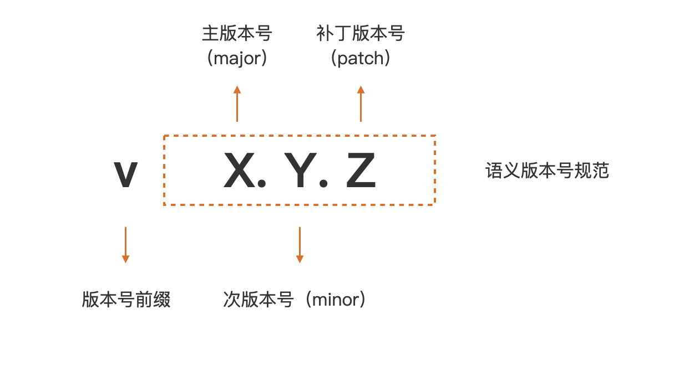
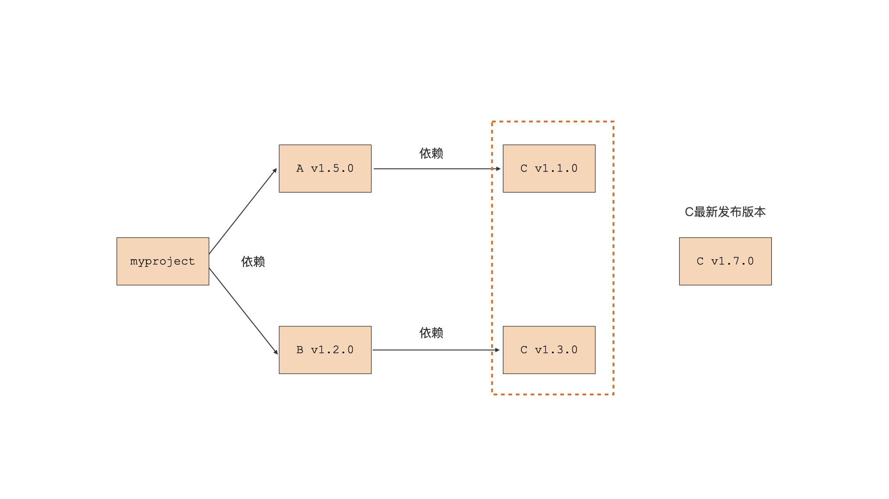
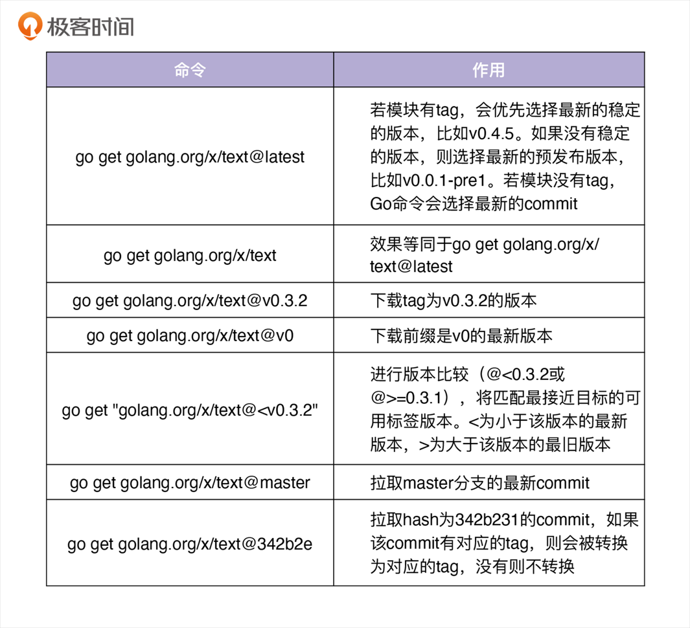
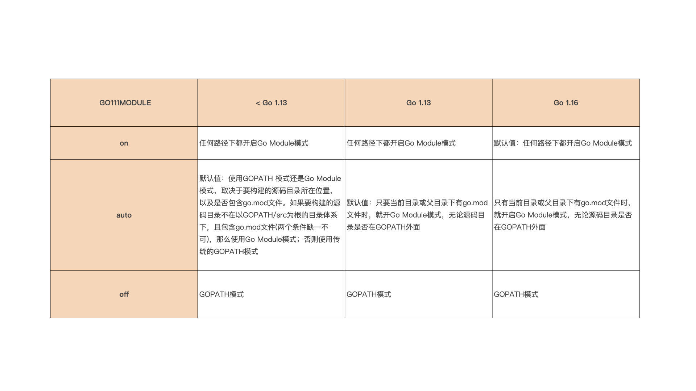

# 06｜构建模式：Go是怎么解决包依赖管理问题的？
## Go构建模式是怎么演化的？

Go程序由Go包组合而成的， **Go程序的构建过程就是确定包版本、编译包以及将编译后得到的目标文件链接在一起的过程**。

Go语言的构建模式历经了三个迭代和演化过程，分别是最初期的GOPATH、1.5版本的Vendor机制，以及现在的Go Module。这里我们就先来介绍一下前面这两个。

### GOPATH

Go语言在首次开源时，就内置了一种名为 **GOPATH** 的构建模式。在这种构建模式下，Go编译器可以在本地GOPATH环境变量配置的路径下，搜寻Go程序依赖的第三方包。如果存在，就使用这个本地包进行编译；如果不存在，就会报编译错误。

我这里给出了一段在GOPATH构建模式下编写的代码，你先来感受一下：

```go
package main

import "github.com/sirupsen/logrus"

func main() {
    logrus.Println("hello, gopath mode")
}
```

你的程序需要按包路径放在 `GOPATH/src` 下。假设你的项目路径是 `myproject/hello`，则文件结构为：

```
GOPATH/
  src/
    myproject/
      hello/
        main.go  // 你的代码文件
```

你可以看到，这段代码依赖了第三方包logrus（logrus是Go社区使用最为广泛的第三方log包）。

接下来，这个构建过程演示了Go编译器（这里使用Go 1.10.8）在GOPATH环境变量所配置的目录下（这里为/Users/tonybai/Go），无法找到程序依赖的logrus包而报错的情况：

```plain
$go build main.go
main.go:3:8: cannot find package "github.com/sirupsen/logrus" in any of:
	/Users/tonybai/.bin/go1.10.8/src/github.com/sirupsen/logrus (from $GOROOT)
	/Users/tonybai/Go/src/github.com/sirupsen/logrus (from $GOPATH)
```

**那么Go编译器在GOPATH构建模式下，究竟怎么在GOPATH配置的路径下搜寻第三方依赖包呢？**

为了给你说清楚搜寻规则，我们先假定Go程序导入了github.com/user/repo这个包，我们也同时假定当前GOPATH环境变量配置的值为：

```plain
export GOPATH=/usr/local/goprojects:/home/tonybai/go
```

那么在GOPATH构建模式下，Go编译器在编译Go程序时，就会在下面两个路径下搜索第三方依赖包是否存在：

```plain
/usr/local/goprojects/src/github.com/user/repo
/home/tonybai/go/src/github.com/user/repo
```

这里注意一下，如果你没有显式设置GOPATH环境变量，Go会将GOPATH设置为默认值，不同操作系统下默认值的路径不同，在macOS或Linux上，它的默认值是$HOME/go。

那么，当遇到像上面例子一样，没有在本地找到程序的第三方依赖包的情况，我们该如何解决这个问题呢？

**这个时候就要让go get登场了**！

我们可以通过 go get 命令将本地缺失的第三方依赖包下载到本地，比如：

```plain
$go get github.com/sirupsen/logrus
```

这里的 go get 命令，不仅能将 logrus 包下载到 GOPATH 环境变量配置的目录下，它还会检查 logrus 的依赖包在本地是否存在，如果不存在，go get 也会一并将它们下载到本地。执行后：

```
GOPATH/
  src/
    github.com/
      sirupsen/
        logrus/  // 下载的 logrus 源码
```

不过，go get 下载的包只是那个时刻各个依赖包的最新主线版本，这样会给后续Go程序的构建带来一些问题。比如，依赖包持续演进，可能会导致不同开发者在不同时间获取和编译同一个Go包时，得到不同的结果，也就是不能保证可重现的构建（Reproduceable Build）。又比如，如果依赖包引入了不兼容代码，程序将无法通过编译。

最后还有一点，如果依赖包因引入新代码而无法正常通过编译，并且该依赖包的作者又没用及时修复这个问题，这种错误也会传导到你的程序，导致你的程序无法通过编译。

也就是说， **在GOPATH构建模式下，Go编译器实质上并没有关注Go项目所依赖的第三方包的版本。** 但Go开发者希望自己的Go项目所依赖的第三方包版本能受到自己的控制，而不是随意变化。于是Go核心开发团队引入了Vendor机制试图解决上面的问题。

进入你的代码目录编译或运行：

```shell
cd GOPATH/src/myproject/hello
go run main.go  # 直接运行，会自动编译依赖
# 或编译成可执行文件
go build -o hello.exe
```

编译后的可执行文件会默认生成在当前目录，若用 `go install`，则会放到 `GOPATH/bin` 中。

### Vendor

**现在我们就来看看vendor机制是怎么解决这个问题的。**

Go在1.5版本中引入 **vendor机制**。vendor 机制本质上就是在Go项目的某个特定目录下，将项目的所有依赖包缓存起来，这个特定目录名就是 vendor。

Go编译器会优先感知和使用 vendor 目录下缓存的第三方包版本，而不是GOPATH环境变量所配置的路径下的第三方包版本。这样，无论第三方依赖包自己如何变化，无论GOPATH环境变量所配置的路径下的第三方包是否存在、版本是什么，都不会影响到Go程序的构建。

```
编译时，Go 编译器会优先从项目的 vendor 目录中查找依赖，其次才是 GOPATH 和 GOROOT。
依赖查找顺序：vendor 目录 → GOPATH → GOROOT
```

如果你将 vendor 目录和项目源码一样提交到代码仓库，那么其他开发者下载你的项目后，就可以实现可重现的构建。因此，如果使用 vendor 机制管理第三方依赖包，最佳实践就是将 vendor 一并提交到代码仓库中。

下面这个目录结构就是为上面的代码示例添加 vendor 目录后的结果：

```shell
.
├── main.go
└── vendor/
    ├── github.com/
    │   └── sirupsen/
    │       └── logrus/
    └── golang.org/
        └── x/
            └── sys/
                └── unix/
```

在添加完 vendor 后，我们重新编译 main.go，这个时候Go编译器就会在 vendor 目录下搜索程序依赖的 logrus 包以及后者依赖的golang.org/x/sys/unix包了。

这里你还要注意一点，要想开启 vendor 机制，你的Go项目必须位于GOPATH环境变量配置的某个路径的 src 目录下面。如果不满足这一路径要求，那么Go编译器是不会理会Go项目目录下的 vendor 目录的。

不过 vendor 机制虽然一定程度解决了Go程序可重现构建的问题，但对开发者来说，它的体验却不那么好。一方面，Go项目必须放在GOPATH环境变量配置的路径下，庞大的 vendor 目录需要提交到代码仓库，不仅占用代码仓库空间，减慢仓库下载和更新的速度，而且还会干扰代码评审，对实施代码统计等开发者效能工具也有比较大影响。

另外，你还需要手工管理 vendor 下面的Go依赖包，包括项目依赖包的分析、版本的记录、依赖包获取和存放，等等， **最让开发者头疼的就是这一点。**

为了解决这个问题，Go核心团队与社区 **将Go构建的重点转移到如何解决包依赖管理上**。Go社区先后开发了诸如gb、glide、dep等工具，来帮助Go开发者对 vendor 下的第三方包进行自动依赖分析和管理，但这些工具也都有自身的问题。

就在Go社区为包依赖管理焦虑并抱怨没有官方工具的时候，Go核心团队基于社区实践的经验和教训，推出了Go官方的解决方案： **Go Module**。

## 创建你的第一个Go Module

从Go 1.11版本开始，除了GOPATH构建模式外，Go又增加了一种Go Module构建模式。

在 [04讲](https://time.geekbang.org/column/article/428267) 中，我们曾基于Go Module构建模式编写过一个“hello, world”程序，当时是为了讲解Go程序结构，这里我再带你回顾一下Go Module的基础概念。

一个Go Module是一个Go包的集合。module是有版本的，所以module下的包也就有了版本属性。这个module与这些包会组成一个独立的版本单元，它们一起打版本、发布和分发。

在Go Module模式下，通常一个代码仓库对应一个Go Module。一个Go Module的顶层目录下会放置一个go.mod文件，每个go.mod文件会定义唯一一个module，也就是说Go Module与go.mod是一一对应的。

**go.mod文件所在的顶层目录也被称为module的根目录，module 根目录以及它子目录下的所有Go包均归属于这个Go Module，这个 module 也被称为 main module。**

你可能也意识到了，Go Module的原理和使用方法其实有点复杂，但“千里之行始于足下”，下面我们先从如何创建一个Go Module说起。我们先来将上面的例子改造成为一个基于Go Module构建模式的Go项目。

### 创建一个Go Module

将基于当前项目创建一个Go Module，通常有如下几个步骤：

- 第一步，通过 go mod init 创建 go.mod 文件，将当前项目变为一个Go Module；

- 第二步，通过 go mod tidy 命令自动更新当前 module 的依赖信息；

- 第三步，执行 go build，执行新 module 的构建。


我们一步一步来详细看一下。

我们先建立一个新项目module-mode用来演示Go Module的创建，注意我们可以在任意路径下创建这个项目，不必非要在GOPATH环境变量的配置路径下。

这个项目的 main.go 修改自上面的例子，修改后的 main.go 的代码是这样的，我们依旧依赖外部包 logrus：

```go
package main

import "github.com/sirupsen/logrus"

func main() {
	logrus.Println("hello, go module mode")
}
```

你可以看到，这个项目目录下只有 main.go 一个源文件，现在我们就来为这个项目添加Go Module支持。我们通过 go mod init 命令为这个项目创建一个Go Module（这里我们使用的是Go版本为1.16.5，Go 1.16版本默认采用Go Module构建模式）：

```shell
$go mod init github.com/bigwhite/module-mode
go: creating new go.mod: module github.com/bigwhite/module-mode
go: to add module requirements and sums:
	go mod tidy
```

现在，go mod init 在当前项目目录下创建了一个 go.mod 文件，这个 go.mod 文件将当前项目变为了一个Go Module，项目根目录变成了 module 根目录。go.mod 的内容是这样的：

```plain
module github.com/bigwhite/module-mode

go 1.16
```

这个 go.mod 文件现在处于初始状态，它的第一行内容用于声明 module 路径（module path），最后一行是一个Go版本指示符，用于表示这个 module 是在某个特定的Go版本的 module 语义的基础上编写的。

go mod init 命令还输出了两行日志，提示我们可以使用 go mod tidy 命令，添加 module 依赖以及校验和。go mod tidy命令会扫描Go源码，并自动找出项目依赖的外部Go Module以及版本，下载这些依赖并更新本地的go.mod文件。我们按照这个提示执行一下 go mod tidy 命令：

```shell
$go mod tidy
go: finding module for package github.com/sirupsen/logrus
go: downloading github.com/sirupsen/logrus v1.8.1
go: found github.com/sirupsen/logrus in github.com/sirupsen/logrus v1.8.1
go: downloading golang.org/x/sys v0.0.0-20191026070338-33540a1f6037
go: downloading github.com/stretchr/testify v1.2.2
```

我们看到，对于一个处于初始状态的 module 而言，go mod tidy 分析了当前 main module 的所有源文件，找出了当前main module的所有第三方依赖，确定第三方依赖的版本，还下载了当前 main module 的直接依赖包（比如logrus），以及相关间接依赖包（直接依赖包的依赖，比如上面的golang.org/x/sys等）。

Go Module还支持通过Go Module代理服务加速第三方依赖的下载。在 [03讲](https://time.geekbang.org/column/article/427489) 我们讲解Go环境安装时，就提到过GOPROXY环境变量，这个环境变量的默认值为“ **https: // proxy.golang.org,direct**”，不过我们可以配置更适合于中国大陆地区的Go Module代理服务。

由 go mod tidy 下载的依赖 module 会被放置在本地的 module 缓存路径下，默认值为$GOPATH/pkg/mod，Go 1.15及以后版本可以通过GOMODCACHE环境变量，自定义本地 module 的缓存路径。

执行 go mod tidy 后，我们示例 go.mod 的内容更新如下：

```plain
module github.com/bigwhite/module-mode

go 1.16

require github.com/sirupsen/logrus v1.8.1
```

你可以看到，当前module的直接依赖 logrus，还有它的版本信息都被写到了 go.mod 文件的 require 段中。

而且，执行完go mod tidy后，当前项目除了go.mod文件外，还多了一个新文件 go.sum，内容是这样的：

```plain
github.com/davecgh/go-spew v1.1.1 h1:vj9j/u1bqnvCEfJOwUhtlOARqs3+rkHYY13jYWTU97c=
github.com/davecgh/go-spew v1.1.1/go.mod h1:J7Y8YcW2NihsgmVo/mv3lAwl/skON4iLHjSsI+c5H38=
github.com/pmezard/go-difflib v1.0.0 h1:4DBwDE0NGyQoBHbLQYPwSUPoCMWR5BEzIk/f1lZbAQM=
github.com/pmezard/go-difflib v1.0.0/go.mod h1:iKH77koFhYxTK1pcRnkKkqfTogsbg7gZNVY4sRDYZ/4=
github.com/sirupsen/logrus v1.8.1 h1:dJKuHgqk1NNQlqoA6BTlM1Wf9DOH3NBjQyu0h9+AZZE=
github.com/sirupsen/logrus v1.8.1/go.mod h1:yWOB1SBYBC5VeMP7gHvWumXLIWorT60ONWic61uBYv0=
github.com/stretchr/testify v1.2.2 h1:bSDNvY7ZPG5RlJ8otE/7V6gMiyenm9RtJ7IUVIAoJ1w=
github.com/stretchr/testify v1.2.2/go.mod h1:a8OnRcib4nhh0OaRAV+Yts87kKdq0PP7pXfy6kDkUVs=
golang.org/x/sys v0.0.0-20191026070338-33540a1f6037 h1:YyJpGZS1sBuBCzLAR1VEpK193GlqGZbnPFnPV/5Rsb4=
golang.org/x/sys v0.0.0-20191026070338-33540a1f6037/go.mod h1:h1NjWce9XRLGQEsW7wpKNCjG9DtNlClVuFLEZdDNbEs=
```

这同样是由 go mod 相关命令维护的一个文件，它存放了特定版本 module 内容的哈希值。

这是Go Module的一个安全措施。当将来这里的某个module的特定版本被再次下载的时候，go命令会使用go.sum文件中对应的哈希值，和新下载的内容的哈希值进行比对，只有哈希值比对一致才是合法的，这样可以确保你的项目所依赖的 module 内容，不会被恶意或意外篡改。因此，我推荐你把 go.mod 和 go.sum 两个文件与源码，一并提交到代码版本控制服务器上。

现在，go mod init和go mod tidy已经为我们当前Go Module的构建铺平了道路，接下来， **我们只需在当前module的根路径下，执行go build就可以完成module的构建了**！

go build命令会读取go.mod中的依赖及版本信息，并在本地module缓存路径下找到对应版本的依赖module，执行编译和链接。如果顺利的话，我们会在当前目录下看到一个新生成的可执行文件module-mode，执行这个文件我们就能得到正确结果了。

整个过程的执行步骤是这样的：

```shell
$go build
$$ls
go.mod		go.sum		main.go		module-mode*
$./module-mode
INFO[0000] hello, go module mode
```

好了，到这里，我们已经完成了一个有着多个第三方依赖的项目的构建了。但关于Go Module的操作还远不止这些。随着Go项目的演进，我们会在代码中导入新的第三方包，删除一些旧的依赖包，更新一些依赖包的版本等。关于这些内容，我会在下一节课再给你详细讲解。


### 发布Go Module

当执行 `go get github.com/your-username/hello@v1.0.0` 时，Go 会按照以下步骤拉取依赖：

1、**路径解析**

Go 会直接将模块路径（如 `github.com/your-username/hello`）视为代码仓库地址，并尝试通过以下方式访问：

**默认行为**：将路径转换为 `https://<模块路径>/go.mod`，例如：https://github.com/your-username/hello/go.mod

**验证逻辑**：Go 会检查这个 URL 是否返回有效的 `go.mod` 文件，并且该文件中的 `module` 声明必须与请求路径一致。例如：

```
module github.com/your-username/hello  // 必须与请求路径完全一致
```

2、**版本查找**

如果路径验证通过，Go 会尝试拉取对应版本的代码标签（tag）。

3、**依赖下载**

最终，Go 会将匹配的代码下载到本地 `$GOPATH/pkg/mod` 目录。


那么，在看到我们的Go Module机制会自动分析项目的依赖包，并选出最适合的版本后，不知道你会不会有这样的疑惑： **项目所依赖的包有很多版本，Go Module是如何选出最适合的那个版本的呢？** 要想回答这个问题，我们就需要深入到Go Module构建模式的工作原理中去。

## 深入Go Module构建模式

Go语言设计者在设计Go Module构建模式，来解决“包依赖管理”的问题时，进行了几项创新，这其中就包括 **语义导入版本(Semantic Import Versioning)**，以及和其他主流语言不同的 **最小版本选择(Minimal Version Selection)** 等机制。只要你深入理解了这些机制，你就能真正掌握Go Module构建模式。

**首先我们看一下Go Module的语义导入版本机制。**

你可以看看下面这张图，语义版本号分成3部分：主版本号（major）、次版本号（minor）和补丁版本号（patch）。例如上面的 logrus module 的版本号是v1.8.1，这就表示它的主版本号为1，次版本号为8，补丁版本号为1。



按照语义版本规范，主版本号不同的两个版本是相互不兼容的。在主版本号相同的情况下，次版本号大的都是向后兼容次版本号小的版本。补丁版本号不影响兼容性。

而且，Go Module规定： **如果同一个包的新旧版本是兼容的，那么它们的包导入路径应该是相同的**。怎么理解呢？我们来举个简单示例。我们就以logrus为例，它有很多发布版本，我们从中选出两个版本v1.7.0和v1.8.1.。按照上面的语义版本规则，这两个版本的主版本号相同，新版本v1.8.1是兼容老版本v1.7.0的。那么，我们就可以知道，如果一个项目依赖logrus，无论它使用的是v1.7.0版本还是v1.8.1版本，它都可以使用下面的包导入语句导入logrus包：

```go
import "github.com/sirupsen/logrus"
```

那么问题又来了，假如在未来的某一天，logrus的作者发布了logrus v2.0.0版本。那么根据语义版本规则，该版本的主版本号为2，已经与v1.7.0、v1.8.1的主版本号不同了，那么v2.0.0与v1.7.0、v1.8.1就是不兼容的包版本。然后我们再按照Go Module的规定，如果一个项目依赖logrus v2.0.0版本，那么它的包导入路径就不能再与上面的导入方式相同了。那我们应该使用什么方式导入logrus v2.0.0版本呢？

Go Module创新性地给出了一个方法：将包主版本号引入到包导入路径中，我们可以像下面这样导入logrus v2.0.0版本依赖包：

```go
import "github.com/sirupsen/logrus/v2"
```

这就是Go的“语义导入版本”机制，也就是说通过在包导入路径中引入主版本号的方式，来区别同一个包的不兼容版本，这样一来我们甚至可以同时依赖一个包的两个不兼容版本：

```go
import (
    "github.com/sirupsen/logrus"
    logv2 "github.com/sirupsen/logrus/v2"
)
```

不过到这里，你可能会问，v0.y.z版本应该使用哪种导入路径呢？

按照语义版本规范的说法，v0.y.z这样的版本号是用于项目初始开发阶段的版本号。在这个阶段任何事情都有可能发生，其API也不应该被认为是稳定的。Go Module将这样的版本(v0)与主版本号v1做同等对待，也就是采用不带主版本号的包导入路径，这样一定程度降低了Go开发人员使用这样版本号包时的心智负担。

Go语义导入版本机制是Go Module机制的基础规则，同样它也是Go Module其他规则的基础。

**接下来，我们再来看一下Go Module的最小版本选择原则。**

像下图中展示的这样，Go又是如何确定使用依赖包C的哪个版本的呢？



在这张图中，myproject 有两个直接依赖A和B，A和B有一个共同的依赖包C，但A依赖C的v1.1.0版本，而B依赖的是C的v1.3.0版本，并且此时C包的最新发布版为C v1.7.0。这个时候，Go命令是如何为 myproject 选出间接依赖包C的版本呢？选出的究竟是v1.7.0、v1.1.0还是v1.3.0呢？

这个例子中，C v1.3.0是符合项目整体要求的版本集合中的版本最小的那个，于是Go命令选择了C v1.3.0，而不是最新最大的C v1.7.0。并且，Go团队认为“最小版本选择”为Go程序实现持久的和可重现的构建提供了最佳的方案。

了解了语义导入版本与最小版本选择两种机制后，你就可以说你已经掌握了Go Module的精髓。


### 指定版本号下载




## Go各版本构建模式机制和切换

我们前面说了，在Go 1.11版本中，Go开发团队引入Go Modules构建模式。这个时候，GOPATH构建模式与Go Modules构建模式各自独立工作，我们可以通过设置环境变量GO111MODULE的值在两种构建模式间切换。

然后，随着Go语言的逐步演进，从Go 1.11到Go 1.16版本，不同的Go版本在GO111MODULE为不同值的情况下，开启的构建模式几经变化，直到Go 1.16版本，Go Module构建模式成为了默认模式。

所以，要分析Go各版本的具体构建模式的机制和切换，我们只需要找到这几个代表性的版本就好了。

我这里将Go 1.13版本之前、Go 1.13版本以及Go 1.16版本，在GO111MODULE为不同值的情况下的行为做了一下对比，这样我们可以更好地理解不同版本下、不同构建模式下的行为特性，下面我们就来用表格形式做一下比对：



了解了这些，你就能在工作中游刃有余的在各个Go版本间切换了，不用再担心切换后模式变化，导致构建失败了。

