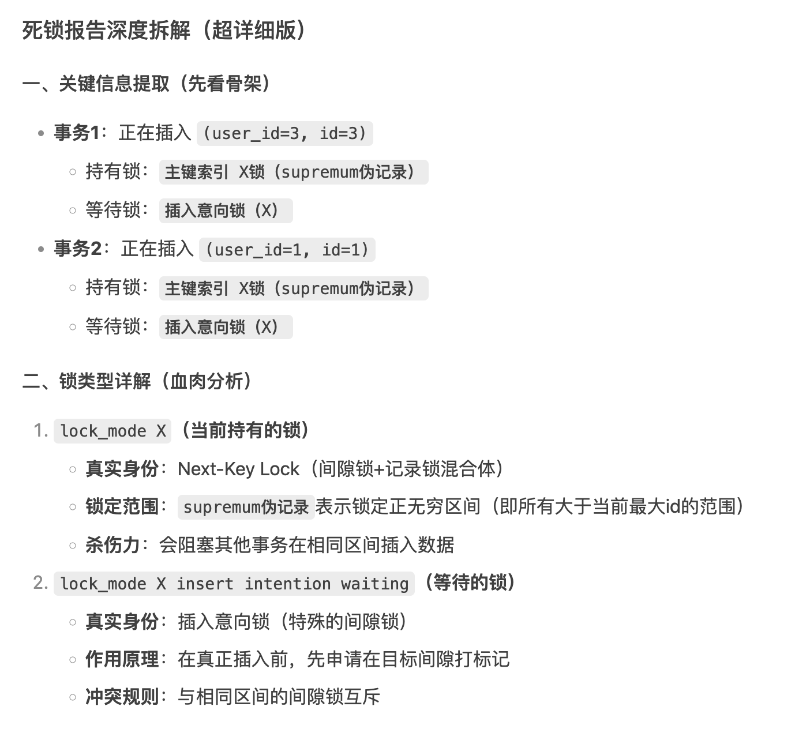

# MySQL问题排查：线上突发故障，怎么办？
你好，我是大明。今天我们来聊一聊 MySQL 问题排查。

在当前的面试环境中，企业越来越注重候选人解决实际问题的能力，而 MySQL 问题排查正是这一能力的直接体现。面试中，能够熟练掌握并展示 MySQL 问题排查技巧，不仅能够彰显你在技术深度上的造诣，还能显著提升你的竞争优势。

在这一背景下， **MySQL 问题排查成为技术面试中最易上手且最具准备价值的环节。** 通过深入学习和掌握 MySQL 问题排查的多种方案，你不仅能够在面试中从容应对相关问题的挑战，还能在实际工作中有效解决数据库运行中的各种问题。

今天，我就来带你系统梳理一下 MySQL 上问题排查的整体思路和工具，并且给出具体的案例，帮助你在面试中赢得竞争优势。

## 前置知识

#### 问题排查思路

简单来说，问题排查就是三个步骤： **发现问题、定位问题和修复问题**。这三句话不仅适用于 MySQL 问题排查，也适用于别的中间件的问题排查。具体来说：

- **发现问题**：通过监控和日志分析，识别数据库运行中的异常现象或性能瓶颈。
- **定位问题**：深入分析相关数据和系统状态，精确确定问题的具体原因和发生位置。
- **修复问题**：根据问题根源，采取相应的优化措施或修复方案，恢复数据库的正常运行。

这三句话你可用于回答任何有关的“XXX 问题怎么排查”。当然了， 在面试中你还要进一步阐述具体的细节。

发现问题和定位问题这两个一般结合很紧密，比如说你用什么工具来监控 MySQL，那么你就要会分析这个监控工具产生的数据。

#### 排查工具

这里我列举一些常见的排查工具，你不需要全部记住，只记住与面试中排查案例有关的工具就可以了。

而在实践中，你甚至都不需要知道，只需要问 AI 怎么排查问题，AI 就会给出具体的命令，甚至于你还可以把这些工具产出的内容如日志等直接喂给 AI，它就能帮助你分析出来问题。

之前我已经描述过了 EXPLAIN 命令，所以这里就不再提及这个命令了。当然，除了我这里提及的，还有很多商业公司也提供了排查工具，你可以根据自己的实际情况准备面试。

1. **SHOW 系列命令**

MySQL 提供了一系列的 SHOW 命令，可以帮助你查看 MySQL 本身的状态，对于问题排查来说非常方便。你可以在 MySQL 的文档里面找到所有的 SHOW 命令，这里我列举一些很好用的命令：

- **SHOW STATUS**：显示 MySQL 服务器的运行状态信息，包括锁、连接、事务等相关信息。可惜这个命令提供的是 MySQL 整体的状态，如果要查看更加具体的信息，则需要使用别的命令。
- **SHOW ENGINE INNODB STATUS**：这个命令里面带了 INNODB，所以它其实针对的是 InnoDB 引擎。或者说你可以认为这是 SHOW STATUS 的 InnoDB 特殊版。
- **SHOW PROCESSLIST**：显式当前 MySQL 服务器中正在运行的所有进程（即正在执行的查询），它可以帮助你监控和诊断数据库的运行状态，识别潜在的性能瓶颈和问题。举个例子来说，如果一个查询执行了很长时间，并且一直处于 WAITING FOR LOCK 的状态，那么大概率就是遇到了死锁的问题。

1. **mysqlxxx 系列工具**

在 MySQL 中，除了 mysql 这个命令以外，还有很多以 mysql 为前缀的工具，这些工具也会有助于你排查和解决问题，在排查问题中比较有用的是这两个：

- **mysqladmin**：顾名思义，这是一个专门管理 MySQL 本身的工具。mysqladmin 提供的功能，有一部分是和 SHOW 重叠的。大多数时候，你会用 SHOW 或者 mysqladmin 其中的一个就可以了。
- **mysqlbinlog**：用于处理 MySQL 的二进制日志文件，可以查看、解析或截取二进制日志。当然很多时候查看二进制文件都是一件逼不得已的事情，因为日志很多，很难找到问题。

1. **PERFORMANCE\_SCHEMA**

PERFORMANCE\_SCHEMA 是 MySQL 提供的一个用于收集数据库服务器性能数据的系统库。它能够监控和记录数据库的各种活动，如查询执行、锁等待、线程状态等，帮助数据库管理员和开发者深入了解系统的运行状况，进行性能分析和问题排查。SHOW 命令中的很多数据就是源自这一张表的。

PERFORMANCE\_SCHEMA 中有表，这里我列举一些有助于问题排查的表。

- data\_locks：查看锁的信息，在排查和锁有关的问题时特别好用，例如通过查询这个表，可以找到你的查询是不是用了表锁。类似的表还有一个 data\_lock\_waits，这个表提供了关于锁等待的详细信息，包括锁等待的原因、持续时间、涉及的表和锁的类型等。这对于诊断和解决锁争用问题非常有用，尤其是在处理死锁或锁等待时间过长的情况时。
- events\_transactions\_\*：这是多个表，你可以通过这个表来查看 MySQL 上的事务执行情况。比如说查询 events\_transactions\_summary\_by\_thread\_by\_event\_name 就可以定位到长事务，而后进一步通过 events\_transactions\_history 分析引起长事务的原因。
- events\_errors\_\*：这也是一系列表，它们提供了关于错误发生时的上下文信息，包括错误的类型、错误码、错误消息以及发生错误的线程和事件等。这对于诊断和解决数据库运行过程中出现的错误非常有用。就实践来说，在排查 MySQL 问题之前可以先看一眼，说不定就直接从这里看出来 MySQL 究竟出了什么事情。

同样的，从实践上来说，你只需要记住有PERFORMANCE\_SCHEMA 这个东西，剩下的就可以在有需要的时候再去了解。而在面试中，你就需要结合自己准备的案例记住相应的表就可以了。

1. **日志**

日志也是排查 MySQL 问题十分好用的东西，主要的有：

- **慢查询日志**：面试中经常问的 MySQL 慢查询，就可以借助慢查询日志来监控和排查。
- **错误日志**：数据库本身就会记录很多错误，或者开启一些特定的参数，那么数据库就会记录更加丰富更加详细的信息。例如说开启了 innodb\_print\_all\_deadlocks 之后，就可以看到死锁的日志，这会有助于我们排查死锁问题。

当然了，应用的日志很多时候也能帮助排查问题，尤其是一些简单的性能问题，你看看应用的日志就能知道问题出现在哪里。

## 面试准备

**你在面试之前，一定要准备至少一个 MySQL 有关的问题排查的案例。**

一方面来说，你可以被动等待面试官提问你是否解决过 MySQL 的线上故障；另外一方面来说，你也可以主动出击，将案例融入到项目经历中，主动提及自己擅长排查线上故障。

在准备面试案例的时候，也不必拘泥于自己亲自解决的。很多公司都会有类似于故障复盘之类的东西，或者说有邮件通报批评之类的东西。那么当你发现复盘或者批评涉及到的是 MySQL 有关的故障，就可以深入学习一下。

此外， **你在准备面试案例的时候，不要准备多个同类型的案例。** 比如说你准备了一个死锁的案例之后，就不要再准备死锁案例了。因为在面试的过程中，同类型的案例一个就够了，面试官不会对你准备的第二个同类型案例感兴趣的。

## 问题排查案例

从实践中来说，最经常遇到的，也是面试中经常问到的问题排查场景主要有以下几个。

- **死锁排查的案例。** 因为当下死锁是一个特别热门的面试点，尤其是在工作年限不长的社招面试中。而如果你是校招，那么可能是侧重于考察死锁的理论，但是你可以进一步提及你在实习的时候解决过死锁，这样一来你就能够赢得极大的竞争优势。

- **慢查询排查的案例。** 慢查询很容易就和性能优化、查询优化这些话题关联在一起，有利于你打造性能优化小能手的人设，这部分你可以参考在《 [11｜SQL优化：如何发现SQL中的问题？](https://time.geekbang.org/column/article/674168)》中的内容。

- **事务有关的案例：最佳的案例就是长事务案例。** 但是这个案例在面试中有一个优点，就是长事务的解决方案一般都是分割成多个短事务，而后在面试中就要详细讨论分割之后， ACID 已经无法满足时应该如何处理。如果你能够在这个过程中讨论清楚各种边缘情况如何处理，那么能给面试官留下很深刻的印象。

- **连接有关的案例：例如说臭名昭著 Too Many Connection 错误。** 这一类的案例有一个极大的优点，就是你可以借此机会聊到连接池和连接池优化。从面试的角度来说，连接池优化是一个很不错的刷亮点的机会。

- **主从延迟的案例**：一般来说在中大厂里面，因为分工日益专业化，所以很少有需要后端研发去处理主从延迟问题的情况，但是如果你处理过类似的问题，那么在面试中还是很有竞争力的。


这里我会展开来着重讲两个案例：一个是典型的死锁排查案例，进一步结合当下流行的 AI，稍微显得有点花里胡哨；其次是一个 Too Many Connections 错误的排查案例，虽然不算特别高级，但是里面渐进式调大数据库最大连接数的思路还是很有特色的。

#### 死锁排查案例

在实践中，死锁是比较容易发现，也比较容易排查的。当然了，如果要是业务代码写得很垃圾，比如说不同业务方都是直连数据库，那么你排查起来就会很麻烦，因为你不知道别的业务方对数据库究竟做了一些什么。

正常来说，都是通过监控来发现死锁的。而监控则是可以考虑下面这些方式：

- 开始了 innodb\_print\_all\_deadlocks，那么死锁信息会打印到日志中，结合日志分析工具就可以实时监控了。
- SHOW ENGINE INNODB STATUS：定期执行，而后发现有关键字 LATEST DETECTED DEADLOCK 就可以认为最近出现了死锁。

在收到告警之后，就需要进一步排查死锁。例如说，下面是一个 SHOW ENGINE INNODB STATUS 的部分输出，它源自一个 SELECT FOR UPDATE 的场景。也就是一个线程在 id = 1 的记录不存在时就插入，存在时则更新；另外一个线程则是在 id = 3 的记录不存在时就插入，存在时则更新。并且表中什么数据都没有。

```
SHOW ENGINE INNODB STATUS

------------------------
LATEST DETECTED DEADLOCK
------------------------
2024-10-31 09:20:18 281472138309760
*** (1) TRANSACTION:
TRANSACTION 1811, ACTIVE 0 sec inserting
mysql tables in use 1, locked 1
LOCK WAIT 3 lock struct(s), heap size 1128, 2 row lock(s)
MySQL thread id 8, OS thread handle 281472434929792, query id 30 192.168.65.1 root update
INSERT INTO `orders` (`user_id`,`amount`,`status`,`id`) VALUES (3,200,'Pending',3)

*** (1) HOLDS THE LOCK(S):
RECORD LOCKS space id 6 page no 4 n bits 72 index PRIMARY of table `interview_cases`.`orders` trx id 1811 lock_mode X
Record lock, heap no 1 PHYSICAL RECORD: n_fields 1; compact format; info bits 0
 0: len 8; hex 73757072656d756d; asc supremum;;

*** (1) WAITING FOR THIS LOCK TO BE GRANTED:
RECORD LOCKS space id 6 page no 4 n bits 72 index PRIMARY of table `interview_cases`.`orders` trx id 1811 lock_mode X insert intention waiting
Record lock, heap no 1 PHYSICAL RECORD: n_fields 1; compact format; info bits 0
 0: len 8; hex 73757072656d756d; asc supremum;;

*** (2) TRANSACTION:
TRANSACTION 1812, ACTIVE 0 sec inserting
mysql tables in use 1, locked 1
LOCK WAIT 3 lock struct(s), heap size 1128, 2 row lock(s)
MySQL thread id 9, OS thread handle 281472432816256, query id 31 192.168.65.1 root update
INSERT INTO `orders` (`user_id`,`amount`,`status`,`id`) VALUES (1,100,'Pending',1)

*** (2) HOLDS THE LOCK(S):
RECORD LOCKS space id 6 page no 4 n bits 72 index PRIMARY of table `interview_cases`.`orders` trx id 1812 lock_mode X
Record lock, heap no 1 PHYSICAL RECORD: n_fields 1; compact format; info bits 0
 0: len 8; hex 73757072656d756d; asc supremum;;

*** (2) WAITING FOR THIS LOCK TO BE GRANTED:
RECORD LOCKS space id 6 page no 4 n bits 72 index PRIMARY of table `interview_cases`.`orders` trx id 1812 lock_mode X insert intention waiting
Record lock, heap no 1 PHYSICAL RECORD: n_fields 1; compact format; info bits 0
 0: len 8; hex 73757072656d756d; asc supremum;

```

如果你仔细看你会觉得这些信息很混乱，但是核心就是事务信息：我拿着什么锁和我等什么锁。

在 AI 出来之前，分析这种日志还是很困难的，而现在你只需要把这个日志贴给 AI，AI 就能帮你分析个八九不离十。下面则是我使用 DeepSeek 帮我分析日志输出的内容：



并且 DeepSeek 还非常贴心的画了一个图，怕你看不懂：


很显然，这边的解决思路可以采用我在《 [12｜数据库锁：明明有行锁，怎么突然就加了表锁？](https://time.geekbang.org/column/article/674789)》这节课中提及的方案。

所以，你的最佳面试策略就是将这两节课的内容糅合在一起，按照“发现问题-定位问题-解决问题”三步曲仔细描述整个过程。

那么你可以综合参考这个话术来回答：

> （如何发现的）我在 XX 公司里面就解决过数据库的死锁问题。当时我们有一个监控，是通过 SHOW ENGINE INNODB STATUS 定期执行来监控数据库是否出现了死锁。

> （如何定位）而后在我们上线了一个新功能之后，突然就开始收到死锁的告警。而在当时我们的数据库是开启了 innodb\_print\_all\_deadlocks 选项的，所以很容易就能找到对应的死锁日志。

> 在这个死锁日志里面，明确输出了导致死锁的是一个 INSERT 语句。

> 我根据这个语句就想到了最近新上线的一个功能，这个功能其实并不复杂，就是查询某个数据，而如果存在用 SELECT FOR UPDATE 查询出来，计算了最新结果之后执行更新；不存在就插入。

> （解释造成死锁的原因）而死锁也就是在这种简单的逻辑之下产生的。在 SELECT FOR UPDATE 的时候，因为数据不存在，那么数据库会使用一个临键锁。此时，如果有两个线程加了临键锁，然后又希望插入计算结果，那么就会造成死锁。
>
> （解决方案同《 [12｜数据库锁：明明有行锁，怎么突然就加了表锁？](https://time.geekbang.org/column/article/674789)》）……

在这个回答里面还有两个注意事项：

1. 如何监控死锁这一个点，你可以根据自己所在公司的实际情况来回答。
2. 有很小的概率面试官会追问具体是什么业务功能引发的死锁，你要提前想好。

因为现在有了 AI，所以你可以考虑在前面这个回答的基础上，改为：

> 我们的监控和告警刚好最近接入了 AI，所以第一时间 AI 就收到了告警信息，并且告警信息里面包含了整个 SHOW ENGINE INNODB STATUS 的输出。

> 而这个 AI 很容易就分析出来这个死锁是一个 SELECT FOR UPDATE 和 INSERT 语句造成的死锁，并且结合最近的代码更新，直接定位到了具体的代码段落。

> 所以我在定位的时候，只需要根据 AI 的提示去找对应的代码就可以。

如果你了解 AI 的运作，那么事实上可以让 AI 在收到告警之后，AI 再去扒日志信息，找到对应的日志，并且进行分析。

之所以建议你结合 AI，其实主要是想让你刷一个时刻关注最新技术趋势的印象，并且万一如果对面公司也在计划搭建这种产品，你能赢得极大的竞争优势。

在实践中，大厂应该是具备上述 AI 这种技术实力的，但是并不清楚他们是否落地了。

我是个人尝试过使用 AI 分析错误信息，并且结合最近代码提交记录来定位问题所在的代码。从效果上来说，错误信息清晰，并且代码有明显特征的，AI 的效果非常卓越。

就这个例子来说，使用 DeepSeek 能够直接定位到执行 INSERT 语句所在的位置，但是它并不能进一步结合 SELECT FOR UPDATE 语句来说明死锁的产生原因。

#### Too many connections 排查案例

这里我提供一个早期我排查过的一个 Too Many Connection 的案例。当时我们的搞了一个促销活动，有非常多人来参与。在促销活动一开始的时候，就爆发出来了大量的 Too many connections 的错误日志，瞬间被我们的监控发现，疯狂告警。

这时候要先看看 MySQL 的连接数量情况：

```
-- 查看最大连接数限制
2SHOW VARIABLES LIKE 'max_connections';  -- 输出：max_connections = 151
3
4-- 查看当前实际连接数
5SHOW STATUS LIKE 'Threads_connected';

```

发现确实是已经达到了最大连接数量。

但是当时已经骑虎难下了，毕竟活动已经开始了，所以在深入排查问题之前，就只能先用临时解决方案。这个临时方案就是直接先调大数据库最大连接数：

```
SET GLOBAL max_connections = N;

```

当然这是一个很危险的操作，因为 MySQL 可能根本撑不住这么大的连接数量。因此我们在调整的过程中并不是一次性调整那么大，而是分步骤来调整。整个过程是这样的：

- 先调整整个应用的限流阈值，直接调小，确保 Too many connection 几乎不出现。当然这样对用户体验影响很大。

- 其次调大 max\_connections，例如说从 151 调整到 200，而后监控 MySQL 的整体情况，在这个过程中，需要调大应用层面上的限流阈值，确认 MySQL 上的连接数量增长到 200 之后，并没有出问题。

- 重复上面这个过程，直到将 max\_connections 调整到了 350，并且同步调大了应用的限流阈值，这之后也没有再出现 Too many connections 的错误。


这只是临时解决方案。当然实际上我们猜测后续没有再出现 Too many connections 错误，有两个原因：

- 调大了 max\_connections。这个应用有 11 个实例，每个实例的连接池最大连接数量是 30 个，所以总共最多会产生 330 个连接。
- 过了促销活动刚开始的那一波最高峰的流量。

后续是需要深入排查根因的。排查的思路也很简单：因为我们用的是成熟的连接池实现，所以先假设连接池没有出现数据库连接没有关闭，或者数据库连接没有复用的情况。因此大概率是两种可能：流量太大了，有慢查询或者长事务。当然，在我们这个案例里面，可能是两者都有。

因此后续我们进一步去排查慢查询，通过慢查询日志发现确实有少量的慢查询出现，而且是同一个 SQL 的偶发性的慢查询。

而经过排查，我们确认是促销活动中有一个资格校验的过程，这个过程会去查询用户过往的一些数据，有些老用户会有很多数据，查询起来就很慢，这就是出现慢查询的根源。

因此复盘整个案例，发现是四个因素共同造成了这个错误：

- 促销的突发流量。
- 少量慢查询。
- 研发没有认真配置连接池的最大连接数量。
- 数据库上一直使用默认连接池设置，但是实际上 MySQL 服务器本身能撑住更多的连接。

后续要做的事情也很简单：

- 优化慢查询。后续在做促销活动之前，如果涉及到复杂资格校验，那么会提前把用户的资格计算出来。
- 做了简单的压测，将最大连接数量设置为 20。当然这是一个保守的数值，因为即便是 30，按照临时处理方案来看，数据库也是撑得住的。
- 将数据库的最大连接数调整到了 230，留了一点冗余。

当你在面试中，使用这个案例的时候，可以参考这个话术：

> 在我们公司的一次大型促销活动中，由于参与人数激增，数据库突然出现了大量的 Too many connections 错误，导致系统告警频发，用户体验受到严重影响。

> 我的任务是迅速定位并解决这个数据库连接问题，确保促销活动能够顺利进行，同时避免对用户体验造成进一步的影响。

> 首先，我通过查看 MySQL 的连接数情况，确认了确实达到了最大连接数限制。而后因为促销活动不能中断，我采取了一个临时解决方案：

> 第一，调整应用限流阈值。先调小限流阈值，减少新的连接请求，暂时缓解问题。

> 第二，逐步调大 max\_connections：从 151 逐步调整到 200、250，最终到 350，并在每一步监控 MySQL 的性能，确保系统稳定。

> 第三，同步调整应用限流阈值：随着 max\_connections 的增加，逐步调大应用的限流阈值，平衡用户体验和系统负载。

> 这是一种比较保守的做法，因为如果要是一次调大到 350，我其实是比较担忧可能直接把 MySQL 打崩，导致 MySQL 完全不可用。

> 在临时解决方案实施后，我进一步深入排查根因，通过慢查询日志，发现有少量的慢查询。进一步结合其它三个因素：最大连接数 30 是项目初始化的时候直接复制过来的数字、数据库本身的最大连接数偏小、促销活动激增的流量，最终导致了这一次故障的发生。

> 因此解决思路也很简单。

> 首先优化慢查询。后续改为提前计算用户资格，避免实时查询。

> 其次是通过压测并调整连接池配置。将连接池最大连接数设置为 20，确保系统稳定。这是一个保守的数值。

> 最后是调整数据库最大连接数：将数据库最大连接数调整到 230，多了一点点就算作是冗余了。

你回顾这个案例，你会觉得其实它并不复杂，排查和解决起来都不复杂。

## 面试思路总结

这里我总结一个三步曲：发现问题、定位问题、解决问题。你在面试中差不多就是按照这个三步曲来回答问题。

- 你是如何发现问题的。这一部分主要谈及你的监控和告警是怎么做的。

- 你是如何定位问题的。这一部分主要谈及你用了什么工具，怎么从工具的输出里面识别出问题的关键点。举个例子来说，你可以说执行了 A 命令，它返回了什么数据，而后你初步猜测是什么问题；为了确定问题，你可能进一步执行了 B 命令，又分析了返回的数据，从而确定了问题根源。在这个过程中，往往就会涉及到从 MySQL 或者 InnoDB 引擎的底层原理的角度上解释为什么会出现这个问题，也就是体现你精通 MySQL 的时候了。

- 你是如何解决问题的。这一部分主要谈及你的解决方案，要注意尽量选用精巧的解决方案。


我再强调一点， **面试官在考察问题排查的时候，排查的过程和你解决问题的过程一样重要，甚至更加重要。**

另外一个注意事项是，排查问题的过程千万别描述得跟无头苍蝇一样。就算你在实践中排查问题就真的是凭借感觉来，但是在面试中你也要改为你是经过思考从而决定从哪里开始排查。

凭借感觉撞大运和深思熟虑步步为营的区别就是体现你对 MySQL 是否真的熟悉，是否真的知道如何排查 MySQL 的问题。

并且，你在面试中准备的案例越复杂、越高端就越好。尤其是当你工作年限比较长的时候，使用一些简单的案例反而有可能让面试官小瞧你。

## 思考题

你在实践中还遇到过什么样的 MySQL 的问题？可以在评论区分享你的案例，可以尝试按照“发现问题-定位问题-解决问题”的三步曲来模拟面试中你对该案例的介绍。