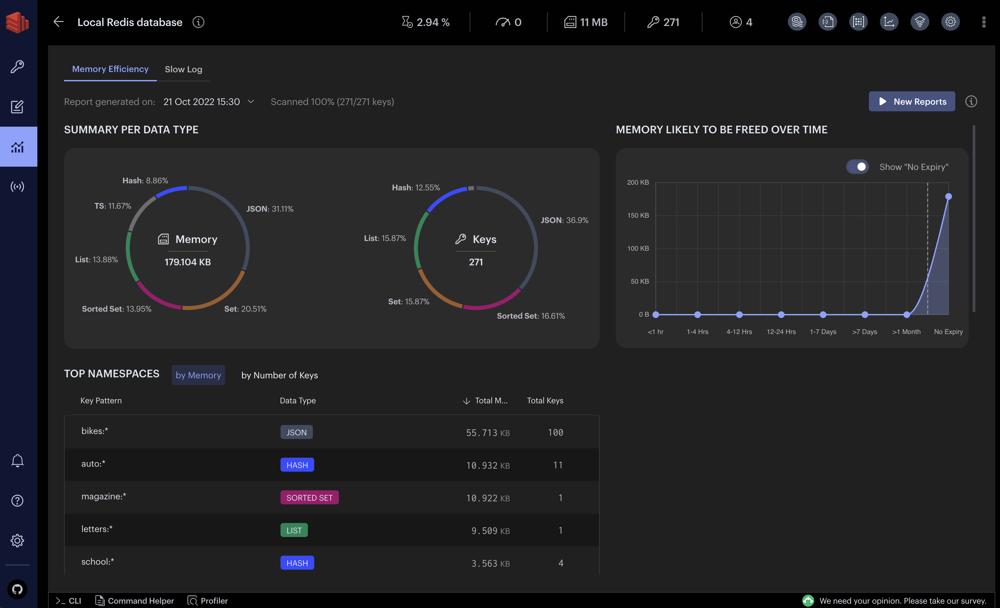

# Redis响应时间太慢了，怎么办？
你好，我是大明，今天我们来讨论一下 Redis 问题排查。

Redis 在大部分系统里面都承担着核心职责，所以掌握 Redis 问题排查技巧至关重要，不仅能确保系统稳定运行，提升业务响应速度，还能在关键时刻快速定位并解决故障，避免数据丢失和性能瓶颈。

你可以结合性能优化的内容，将自己打造一个擅长 Redis 问题排查和性能优化的人设，展现出色的运维能力和问题解决能力。

而你的竞争者普遍会缺乏这种意识，只会将注意力放在 Redis 的简单使用上，这样一来你就能显著拉开差距，赢得面试官青睐，为求职加分。

## 前置知识

#### Redis 线上故障

就我个人经验来说，我认为线上故障最多的就是两类。

**第一类，性能问题**：这也是在实践中最经常遇到的问题，而往往 Redis 都是用作缓存，对响应时间非常敏感，所以一旦出现性能问题，就要快速解决。

- 响应时间长：由于高并发访问、大键值操作、网络延迟等原因，导致 Redis 响应时间变长。
- 慢查询：某些复杂查询或大键操作导致执行时间过长，影响整体性能。这个问题可以看做是响应时间长的一个特例，或者说一个极端例子。
- 吞吐量下降：系统资源瓶颈（如 CPU、内存、磁盘 IO）或配置不当，导致 Redis 处理请求的能力下降。

**第二类，连接问题**：连接问题一般都是和网络、客户端强相关，少数情况是 Redis 负载过高引发的。

- 连接超时：网络不稳定、防火墙设置不当或Redis服务器负载过高，导致客户端连接超时。
- 连接数过多：客户端连接数超过Redis配置的最大连接数（maxclients），导致新连接被拒绝。
- 频繁断连：由于网络波动、客户端异常或Redis服务器不稳定，导致客户端频繁断开连接。

除了性能和连接问题，Redis 还可能遇到数据一致性问题、持久化问题、内存问题、主从复制问题、集群问题、配置问题以及外部因素等。这些问题涉及数据丢失、持久化失败、内存溢出、节点故障、配置错误等多个方面，这些问题一般不太需要业务开发参与解决，都是运维人员来解决的。

**在 Redis 常见问题中有两个比较特殊：热点问题和数据倾斜问题。** 这一节课我不会讨论这两个问题的解决方案，而是在下一节课专门讲，这样能讨论得更加彻底。

## Redis 问题排查

Redis 的问题排查和 MySQL 的问题排查其实都差不多，核心就是知道有哪些工具，以及这些工具怎么用。

具体来说，Redis 的工具要比 MySQL 少一些。

#### Redis 内置命令

内置命令是最为基础的工具，最核心的几个命令有：

- INFO：提供 Redis 服务器的详细信息，包括内存使用、连接数、持久化状态等。
- CLUSTER INFO：在集群模式下，提供集群状态信息。可以看做是 INFO 的集群版本，在排查集群有关的问题时非常好用。
- SLOWLOG：查看慢查询日志，识别执行时间较长的命令。慢查询可以说是 Redis 中被问到最多的问题了，SLOWLOG 就可以用来发现这些慢查询。
- MONITOR：实时监控 Redis 服务器接收到的所有命令，帮助定位问题命令。严格来说，很少在线上环境上使用 Monitor，一般在开发环境 DEBUG 的时候会比较经常使用这个命令。
- PUBSUB：监控发布/订阅模式下的频道和消息。这个类似于 MONITOR，一般在生产环境用得比较少，在开发和测试环境下用得比较多。

一般来说，如果是性能问题，那么首先就是看 SLOWLOG，其次就是检查 INFO 或者 CLUSTER INFO，确认一下 Redis 的状态。而如果是连接有关的问题，那么 SLOWLOG 基本上不能提供什么有效信息，需要直接检测 INFO 或者 CLUSTER INFO。

除了 Redis 内置命令，还有一些第三方的工具。这些工具有相当一部分是建立在 Redis 内置命令的基础上的，可以认为是一个二次封装，而后提供了用户友好的界面。

#### Redis Insight

Redis Insight 是 Redis 团队自己提供的工具，旨在为 Redis 用户提供一个直观、易用的 Web 界面，以便更高效地管理和监控 Redis 实例。

也就是说，一方面可以用 Redis Insight 来做监控，另外一方面，也可以在出现故障的时候利用 Redis Insight 来排查问题。

除了 Redis Insight，还有一些可以考虑的工具。

- Prometheus + Grafana 的组合：强大的监控和可视化组合，支持自定义指标和报警。
- Redis-benchmark：性能测试工具，用于评估 Redis 服务器的性能。
- Redis-stat：实时监控 Redis 性能指标的工具。
- Redis-faina：分析 Redis 慢查询日志的工具。

## 面试准备

你在面试之前，要准备一些 Redis 线上问题排查案例。

**从重要性上来说，你一定要准备慢查询的案例。你可以将慢查询案例融入到你的整个性能优化面试方案中，作为提升系统性能的一个环节。**

但是要注意一点，当你工作年限比较长的时候，你准备的案例就要足够的复杂。

除了慢查询以外，其余的问题排查案例你都可以准备起来，不管是在和面试官讨论 Redis 的时候，还是用这个案例来作为自己项目的难点亮点，都是可以的。

## 问题排查案例

#### 慢查询案例

这里我给出一个非常好用，非常通用的慢查询案例，基本上你的业务只要用了 Redis，稍微改改就能拿出去面试。当然，客观来说，这个慢查询案例不太适合拿出去面试如技术专家之类的高端岗位，竞争力不够。但是面试初中级岗位，或者一般的业务研发岗位，还是绰绰有余的。

在 Redis 中，出现慢查询的一种典型场景就是：查询结果返回了大量的数据。包括但不限于：

- 查询 hash 结构，而且这个 hash 结构含有大量的键值对。
- 查询 list、set、zset 结构，并且这些结构中有很多元素，那么很容易出现慢查询。例如说当你使用 ZRANGEBYSCORE 取了很多元素，那么就容易出现慢查询。

你可以用这个话术来介绍 hash 结构的问题，解决思路就是拆分。例如说原本是 key1 对应 100 个键值对，那么可以拆成 key1…key10，每个 key 放一部分键值对。

> 早期的时候我们有一个全局的配置放在 Redis 中，很多业务都要使用这个配置。而后随着系统的演进，导致这个配置越来越大。

> 这进一步引发了慢查询。我通过慢查询监控发现了这个问题之后，就主导拆分了这个 hash 结构。将 hash 结构中的键值对按照业务进一步划分，拆分为多个 key。而后业务方根据自己的需要访问这些拆分后的 key，从而解决了这个慢查询的问题。

同样地，我也给出一个 zset 的话术，你可以参考：

> 早期我们有一个业务的有序数据是放在 zset 中的。但是有些时候会出现偶发性的慢查询。

> 经过我的排查，我发现有些业务的数据量很多，也就是 zset 里面有上十万的元素。这部分业务在使用 ZRANGEBYSCORE 查询的时候会命中很多的元素，引发了慢查询。

> 我在慢查询监控中发现之后，尝试将使用 ZRANGEBYSCORE 命令的业务改成了分页接口。也就是说，每次前端查询的时候都会带上一个 minScore，即最小的分数。

> 而后执行 ZRANGEBYSCORE 的时候带上 LIMIT 参数，整个查询条件等价于 score >= minScore LIMIT 100。

> 通过控制 minScore 可以保证每次都只需要取前 100 名。

> 这样一改造就彻底解决了慢查询的问题。

#### 大键集中过期引发的周期性延迟

它的背景是某个业务使用的 Redis 会在凌晨 1 点出现周期性慢查询，而且会持续一段时间。

业务在这个期间得到的响应都是 command timeout。

注意到这个只会发生在凌晨，而且是周期性的。可以推测大概率这个错误和什么周期性的内容有关。例如说最典型的场景就是每天定时任务计算一批数据，放到 Redis 里面。

那么慢查询可能是因为这一批数据放到 Redis 中引起的；也可能是这一批数据的过期时间是一天，在那个时间点刚好也过期了，而后 Redis 清理过期 key 的时候引发了性能下降。

整个排查过程步骤比较多。

1. 先检查了那段时间 Redis 上的监控，发现 CPU、内存和磁盘 IO 都非常正常，排除了持久化或者业务影响的可能。
2. 通过 SLOWLOG 命令检查发现当时也没慢查询。说明这个案例并不是因为有什么慢查询影响了别的命令，致使别的命令超时。
3. 而后通过 redis-cli --bigkeys 检查大 key，发现存在大量的超过 1MB 大小的 Hash 结构。此刻已经开始怀疑是这个东西引起的了。
4. 抽样检查这个 Hash 结构的过期时间，就发现它们都是集中在凌晨过期。而且进一步从 key 结构中找到对应的业务，发现这些 key 是新近上线的一个定时任务产生的，并且定时任务运行时间就是在凌晨，过期时间刚好是一天。
5. 检查 Redis 的监控，发现 expired\_time\_cap\_reached\_count 在这段时间也是非常高，所以基本上可以推断就是大量 key 短时间内过期，并且这些 key 都是大 key 而引发的。

到这一步，只是观察到了现象，但是还没有解释为什么短时间大量大 key 过期会引发这种 timeout 的问题。

从 Redis 的原理上来说，出现这种情况的关键点是：Redis 延迟删除之后，触发的释放内存 glibc malloc\_trim 阻塞了主线程。

而要解决这个问题也很简单，可以从两方面入手。

- 在 key 的过期时间上加上一个随机数，避免 key 大量集中过期。这种措施也可用来解决缓存雪崩问题。
- 优化产生这些大 key 的定时任务的逻辑，使用多个 key 来存储原本的一个 Hash 结构。

从理论上来说，还可以考虑优化 malloc\_trim 这个东西，比如说：

- 更换内存分配器：比如从 glibc 切换到 jemalloc 或 tcmalloc，这些分配器在内存碎片管理和释放效率上可能更优。
- 调整 glibc 的 M\_TRIM\_THRESHOLD 参数：通过设置环境变量，调整 glibc 在何时触发内存归还操作，减少频繁的 malloc\_trim 调用。

但是考虑到优化 malloc\_trim 动静比较大，所以并不合适。而且最开始的两个措施实施了之后，确实解决了整个问题。

那么如果你在面试中介绍这个案例，可以用这个话术：

> 在我之前负责的一个项目中，我们遇到了一个有趣的挑战：Redis 在凌晨 1 点会出现周期性的问题，导致业务响应超时。这个问题不仅影响了用户体验，还对我们系统的稳定性构成了威胁。

> 具体来说，每当凌晨 1 点左右，业务系统会频繁收到 Redis 的 command timeout 错误，持续时间较长。这个现象是周期性出现的，只在凌晨发生，其他时间段一切正常。

> 为了找出问题的根源，我进行了以下几步排查。

> 首先，我查看了 Redis 的监控数据，包括 CPU、内存和磁盘IO，但发现这些指标都非常正常，排除了硬件资源瓶颈的可能性。

> 接着，我使用 SLOWLOG 命令检查慢查询日志，但并没有发现明显的慢查询记录，说明问题并非由单个慢查询引起。

> 然后，我使用 redis-cli --bigkeys 命令检查大键，发现存在大量超过 1MB 的 Hash 结构。

> 进一步抽样检查这些大键的过期时间，发现它们都集中在凌晨过期，且这些键是由新上线的定时任务产生的，过期时间刚好是一天。

> 最后，我注意到 expired\_time\_cap\_reached\_count 指标在这段时间内非常高，这表明大量键在短时间内过期，引发了性能问题。

> 通过以上排查，我确定了问题的根源：大量大键在短时间内过期，触发了 Redis 的延迟删除机制，而随后触发的 glibc malloc\_trim 操作阻塞了主线程，导致命令响应超时。

> 针对这个问题，我提出了两个解决方案。

> 第一个措施是随机化过期时间。在键的过期时间上加上随机数，避免大量键集中过期，这不仅解决了当前问题，还能有效防止缓存雪崩。

> 第二个措施是优化定时任务。优化产生大键的定时任务逻辑，将原本存储在一个 Hash 结构中的数据分散到多个键中，减少单个键的大小，减轻过期处理的压力。

> 通过这次排查，我不仅解决了 Redis 的周期性慢查询问题，还加深了对 Redis 内部机制的理解。反思整个过程，我认为在未来的项目中，可以更早地引入对大键和过期策略的监控，防患于未然。这次经历也让我认识到，深入理解底层原理对于高效排查和解决复杂问题至关重要。

整个案例的复杂度还是比较高的，你可以考虑斟酌使用。并且在使用的时候要小心面试官追问你的 malloc\_trim 的知识。

## 总结

前面给出了两个案例。

- 慢查询案例：这是最典型的也是比较简单的案例，你只要找一个合适的业务融入进去就可以在面试中使用了，适用面非常广。
- 大键集中过期与主动淘汰引发的周期性延迟：这个案例比较复杂，你确保自己已经完全掌握了之后再使用。

另外， **当你准备问题排查案例的时候，一定不要忘了解释引发线上故障的深层次原因，因为你需要通过解释底层原因来证明自己对 Redis 的原理理解得非常深刻。**

并且，还是那句话： **你选择案例的难度/技术含量，应该与你的工作年限、求职岗位匹配。** 也就是说，你工作年限越高，你目标薪资越高，你就要使用越复杂的案例。如果你使用了一个不匹配的案例，反而会让面试官看扁你。

## 思考题

你在实践中有没有遇到过有意思的 Redis 问题排查案例，发在评论区跟大家一起交流啊！