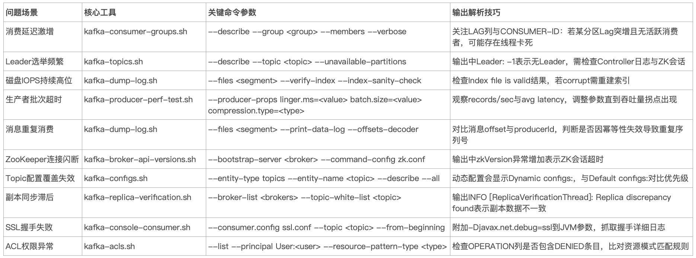
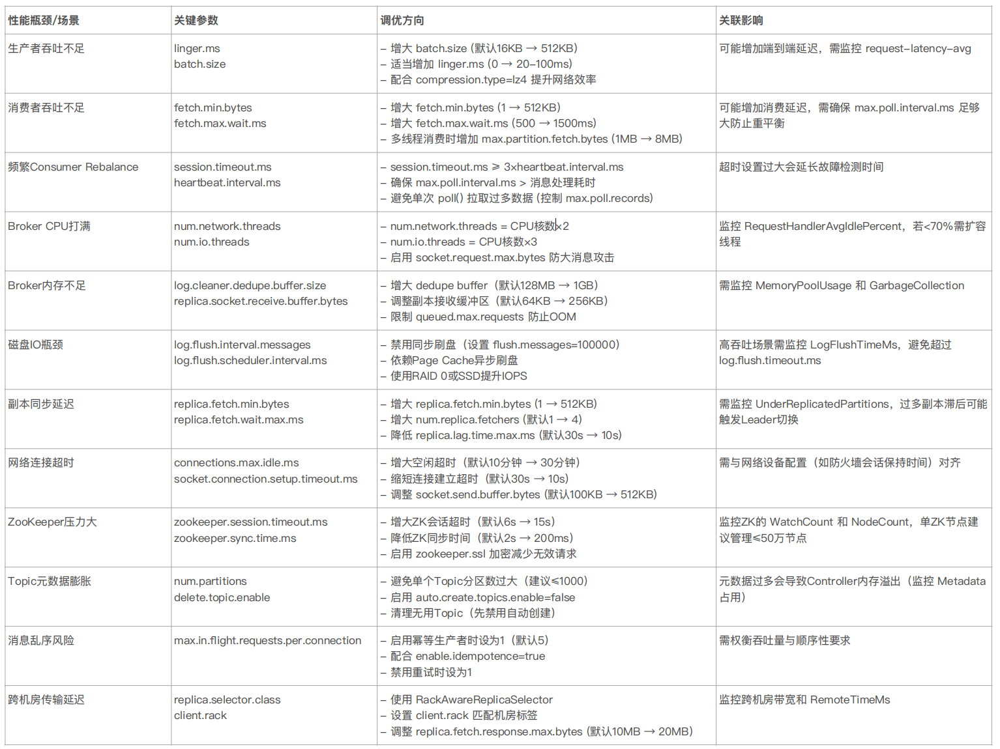

# 如何用系统化思维排查Kafka问题？
你好，我是大明。

在当今分布式架构的浪潮中，Apache Kafka 凭借其高吞吐、低延迟的特性，已成为企业级数据管道的核心枢纽。从实时风控系统每秒百万级的交易日志处理，到电商大促期间跨地域订单流的无缝同步，Kafka 基本上可以说是每一个高吞吐高并发高可用场景下的中流砥柱。

也因此，Kafka 有关的问题排查始终是一个面试热点。大部分情况下，你如果只能简单背诵八股文，但是却无法结合各种监控和问题排查工具等手段综合讲解如何排查 Kafka 的问题，便暴露了你对 Kafka 的了解流于表面，不够深入。

事实上，公司在面试中设计此类问题的深层意图，正是考察你是否具备将 JVM 调优、网络诊断、OS 资源监控等跨领域技能融会贯通的系统化思维。

所以，如果你有一个优秀的 Kafka 问题排查案例，能够为你赢得极大的竞争优势。

## 前置知识

#### 1\. Kafka CLI

Kafka 自身提供了一些命令行工具，这些命令行工具本质上就是一大堆的 shell 脚本，相信你多少已经接触过了。这些脚本可以用于监控 Kafka，以及排查 Kafka 问题。

具体脚本的使用方法你可以参考官方的 [文档](https://docs.confluent.io/kafka/operations-tools/kafka-tools.html#)。这里我列举一些我使用比较多，个人认为比较重要的几个，制作成了一张表：

#### 2\. Kafka 参数

在 “ [Kafka 性能调优](https://time.geekbang.org/column/article/689379)”那篇专栏中，我已经给你介绍过了和性能有关的一些参数。下面我再列举一些和 Kafka 问题排查有关的参数，你可以参考：

具体来说，当你要调整参数的时候，可以考虑遵循这个原则：

- **先监控后调优**：最忌讳的就是不监控，直接调整。这样很容易出现没效果，或者效果不符合预期的问题。
- **小步快跑**：每次只调整 1～2 个参数，而后利用监控观察调整后的情况。举个例子，典型的就是可以使用 `kafka-producer-perf-test` / `kafka-consumer-perf-test ` 来测试调整后的性能，当然在性能测试的过程中，也会暴露更多的 Kafka 的问题。

## 面试准备

你在平时工作中要注意积攒跟 Kafka 有关的问题排查案例。正如在 MySQL 问题排查和 Redis 问题排查案例中我提到的，并不一定要局限在自己亲自处理过的案例。你同事的案例，你公司的案例，都可以深入研究，而后在面试中也同样可以使用。

在 Kafka 或者类似的基于 JVM 的中间件里面，最佳的问题排查案例就是和 JVM 有关的案例。为什么这么说呢？有两个方面的原因：

- JVM 本身是一个高频热点，你可以通过这个案例来证明你在 JVM 上面有很深的理解。
- 通过将 Kafka 和 JVM 关联在一起，组织一个复合案例，有助于展示你在 JVM 方面的深厚积累。

而后你在面试之前，还要针对准备的案例做一些推演。有些时候面试官会针对你的案例排查过程，追问这些问题：

- 你在排查过程中使用的工具的细节。
- 你的案例有没有别的解决思路？如果有，你为什么选择了当前的解决思路？
- 你的解决思路有没有隐患？如果有，你打算怎么解决？

## 面试案例

我这里准备了两个案例，其中有一个案例就是和 JVM 有关的案例，你可以尝试用于面试中，证明自己对 JVM 非常了解。

**案例 1：JVM Full GC 导致 Kafka 生产者阻塞**

当时我负责的某系统的 Kafka 集群在业务高峰时段频繁出现生产者阻塞（>3秒），导致业务延迟告警。而当时业务上的性能要求是保证消息发送延迟稳定在 50ms 内，同时满足 99.99% 可用性的要求。

那么整个分析过程分成几个步骤：

- 首先查看 Kafka 集群的配置，确认是每个 Broker 实例的内存是 8GB，并且进一步查看当时的监控，发现 Broker 节点的 CPU 使用率在 GC 时飙升至 90%。
- 其次是查询 GC 日志，发现每小时发生 2～3 次 Full GC，每次耗时 1.2～1.8 秒，老年代使用率在 Full GC 前达到 98%，也就是老年代满了触发的 Full GC。
- 紧接着分析内存，使用 JMC 发现 `ProducerRequest` 对象在堆外内存频繁分配，但堆内存中 `RecordBatch` 对象因消息压缩导致存活时间过长，提前晋升到老年代。

所以，从这些情报里面分析，可以推测出来最大的问题是触发了 Full GC。在 Full GC 的时候，会暂停所有应用线程，导致生产者请求无法被处理。而之所以会频繁发生 Full GC，则是因为大量对象提前晋升到了老年代。

显然，这就是要求我们解决 Full GC 问题。因此：

- 第一步调整堆内存，当时调整到了 16G。
- 第二步是调整垃圾回收器，改为使用 G1 垃圾回收器，并且并设置 ` -XX:MaxGCPauseMillis=200`

从效果上来说，Full GC 频率降低至每天 1 次（耗时<500ms），生产端 P99 延迟稳定在 40ms 内。优化后通过 jstat -gcutil 验证发现老年代使用率稳定在 70% 以下，且对象晋升模式符合预期。

整个案例其实算不上是非常复杂的案例，也可以看做是一个普通的 Full GC 的案例。你可以考虑采用这个话术来介绍你的案例：

> 我之前解决过一个跟 Full GC 有关的 Kafka 线上故障。当时我负责的某系统的 Kafka 集群在业务高峰时段频繁出现生产者阻塞，阻塞时间超过 3秒，导致业务延迟告警。而当时业务上的性能要求是保证消息发送延迟稳定在 50ms 内。显然这个延迟是过于长了。

> 而后先查看 Kafka 的监控，发现 Kafka 集群的 Broker 堆内存很小，只有 8G，并且在出现阻塞的时候，CPU 飙升，而且是出现了 GC。

> 紧接着就是查看 GC 日志，发现每小时发生两三次 Full GC，每次耗时一两秒，老年代使用率在 Full GC 前达到 98%，也就是老年代满了触发的 Full GC。

> 而后就是要排查是什么原因触发了 Full GC。我使用 JMC 发现 ProducerRequest 对象在堆外内存频繁分配，但堆内存中 RecordBatch 对象因消息压缩导致存活时间过长，提前晋升到老年代。

> 因此整个问题就非常清楚了：RecordBatch 对象提前晋升导致老年代对象耗尽，频繁触发 Full GC，导致了生产者阻塞。

> 那么解决方案也很简单，就是要想办法把这个 Full GC 解决掉。为此我实施了两个改进。

> 第一个改进是调大了堆内存，将堆内存从 8G 调整到了 16G。我个人认为之前 Full GC 频繁出现的很大一个原因就是堆太小了，在高并发的情况下根本撑不住。

> 第二个改进是使用 G1 垃圾回收器。G1 垃圾回收器在大堆下的表现会更好，出现 Full GC 的情况也更少。

这里额外提醒一下，如果你不是 Java 开发，那么你可能不知道 G1 垃圾回收器这种东西，你可以将话术改为自己临时学习了解，或者说你是和 Kafka 的运维团队进行合作的。

**案例 2：ISR 频繁收缩导致数据不可用**

我在某系统上发现 Kafka 集群出现分区 Leader 频繁切换，监控显示 ISR 列表每分钟收缩 3～4 次，导致消费者频繁读到 OFFSET\_OUT\_OF\_RANGE 错误。从业务上来说，我是需要保障分区高可用性（ISR 至少保持 2 个副本），同时也需要消除消费者读取异常，确保消息数据零丢失。

整个排查过程也是分成了好几个步骤：

1. 首先检查监控，最关键的是发现副本的 LEO 始终比 Leader 落后上千条数据。
2. 紧接着是要排查副本 LEO 落后的原因，而导致 LEO 落后的原因有很多，我使用 `iostat -x 1` 发现 Follower 节点磁盘 util 持续 100%，await 值高达 500ms，定位到某机械磁盘 RAID5 阵列的随机写入性能瓶颈。
3. 进一步排查副本的配置，发现副本同步的参数 replica.socket.timeout.ms=30s，所以会触发 FetchRequest 的超时；而 replica.lag.time.max.ms=10s，两者并不匹配。

到这里就可以总结出来出现 ISR 收缩的根因了：本质上是因为磁盘 IO 写入速度太慢，而 replica.socket.timeout.ms=30s 和 replica.lag.time.max.ms=10s 并不匹配，它意味着若副本在 10 秒内未完成同步，会被移出 ISR，但网络层仍允许 30 秒的超时，引发 ISR 频繁收缩-重建循环。

所以从治本上来说，是要解决磁盘写入的问题。很不幸的是，我并不擅长这些硬件方面的事情。所以当时是找了运维申请了一个使用 SSD 并且写入吞吐量更好的 Kafka 集群，将整个业务切换到了新集群上。

但是在当时切换之前，需要治标。所以我就将 replica.lag.time.max.ms 设置为 60s，以保持 ISR 的稳定。当然这个调整并不是非常好的实践，因此在后续切换到了新的集群之后，我还是沿用了原本的默认配置。

你可以在面试中参考这个话术向面试官介绍这个案例：

> 之前我在某系统上发现 Kafka 集群出现分区 Leader 频繁切换，监控显示 ISR 列表每分钟收缩 3-4 次，导致消费者频繁读到 OFFSET\_OUT\_OF\_RANGE 错误。

> 很显然，这个错误一方面会影响系统的可用性，一方面也会影响消费者的消费速率。
>
> 我的排查思路分成三个步骤。

> 第一个步骤是检查监控，查找 ISR 收缩的原因，而后发现副本的 LEO 严重落后于 Leader。

> 第二个步骤则是检查为什么会落后。从原理上来说，大部分情况都是副本本身性能有问题，写不过来。因此我在检查副本的时候，使用 iostat 命令发现磁盘的 util 都 100% 了，也就是说磁盘的写入速率太慢了。

> 第三个步骤是进一步检查了影响 ISR 的参数，发现 replica.socket.timeout.ms 为 30s，而 replica.lag.time.max.ms 是 10s，也就是如果要是出现了超时问题，那么这个副本就会被踢出 ISR。

> 那么解决思路也很清晰，分成治本和治标。

> 治本的话，非常简单，直接换一个更加强大的 Kafka 集群，相比原来的集群，这个集群使用的是 SSD，写入速度更快。

> 但是在切换 Kafka 集群之前，我还紧急上线了一个治标的小修补，就是增大 replica.lag.time.max.ms 参数到 60s。之所以说是治标是因为这个参数真的太大了，它会影响到 Kafka 消息的可用性。

这个案例相比前一个案例来说，技术含量稍微差一点，因为这里最关键的治本之策是换了一个集群。那如果你要是知道磁盘 IO 如何优化，那么可以尝试融合到这个案例中。

## 总结

Kafka 问题排查非常强调系统化思维，它不仅仅是单一技术的应用，更需要将 JVM 调优、网络诊断、OS 资源监控等跨领域技能融会贯通。只有通过系统化思维，才能够从全局角度分析问题，找到根本原因。

因此，你可以从 Kafka 问题排查出发，将话题扩展到 JVM、网络、操作系统等知识点上。只要你提前准备好了完善的面试方案，设想了面试官可能追问的点，你就能够在 Kafka 问题排查中全方面展示你强大的技术实力，从而赢得极大的竞争优势。

## 思考题

当你出去面试的时候，你准备了什么案例来展示你的 Kafka 问题排查技术？欢迎你在评论区留言，我们下节课再见。