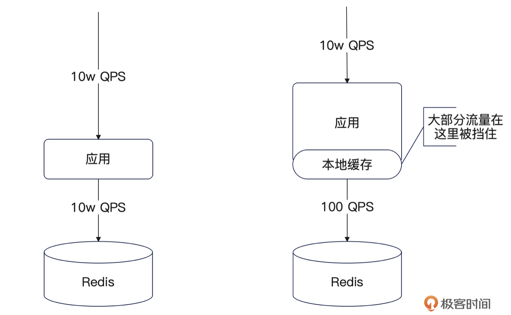
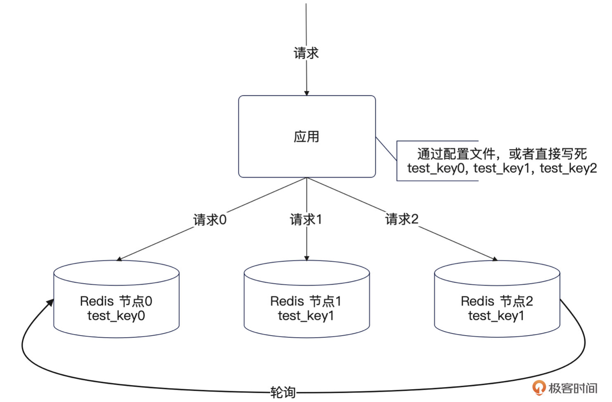
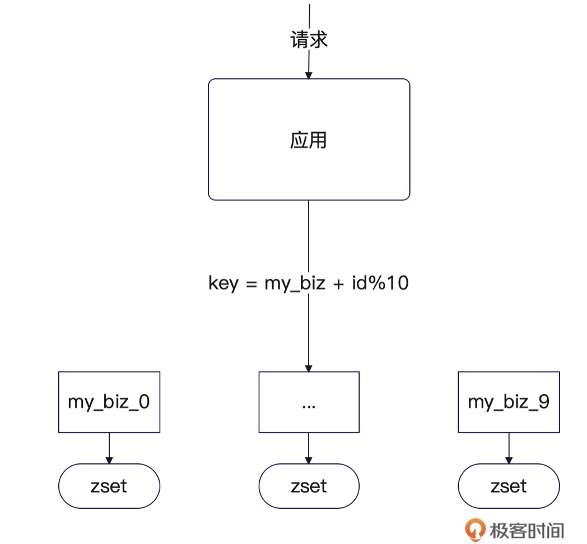
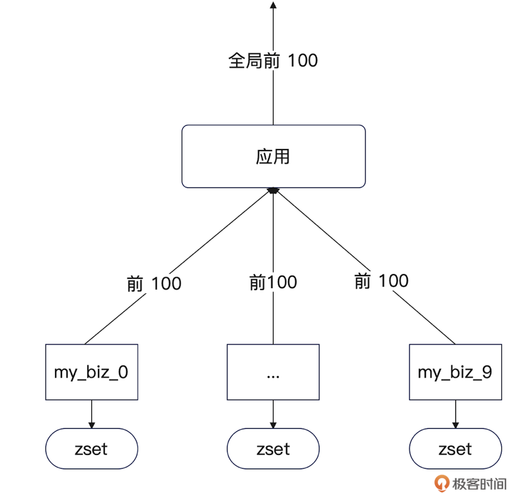
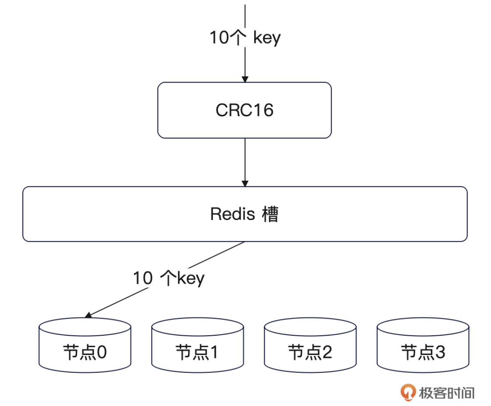

# 如何解决Redis的热点问题？
你好，我是大明，今天我们来讨论一个特别的问题：如何解决 Redis 的热点问题。

Redis 的热点问题是指某个节点的 QPS 过高导致性能瓶颈，常见于以下场景：

1. 电商秒杀场景中商品库存 key 的频繁扣减。
2. 社交平台热点话题的实时点赞/阅读统计。
3. 游戏排行榜单的实时更新查询。
4. 新闻热点事件的缓存数据高频访问。

以前这种热点问题比较少出现在初中级工程师的面试中，但是随着内卷程度加深，现在初中级岗位的面试中也能见到了。

今天我就来跟你一起深入探讨一下 Redis 问题的解决方案，并且给出一个分 key 的刷亮点的方案，叠加分 key 的技巧，让你在面试中能够赢得极大的优势。

## 面试准备

正常来说，如果你在中小型公司是比较难遇到热点问题的。甚至于说，如果你不是在大厂的核心业务工作，都很难遇到热点问题。

但是我还是建议你要尝试准备一个热点问题的案例，而且不必局限在 Redis。而后，在面试官问到 Redis 的时候，或者讨论到你的项目难点时，你都可以使用解决 Redis 热点问题这个案例。

另外一个建议是，如果你很熟悉热点问题的解决方案，你可以在简历撰写 Redis 技能的部分上加上“擅长解决热点问题/数据倾斜”的描述，也可以在自我介绍中进一步强调这一类实战经验。

## 解决方案

从理论上来说，热点问题大体上有两种。

**第一种，节点级别的热点**：也就是某个节点上的 QPS 非常高，通常是因为一组 key 的 QPS 都很高，而且这些 key 偏偏落到了同一个节点上，导致这个节点的 QPS 极高。

这种比较好解决，只需要重新设计 key 结构，或者调整 Redis 集群的槽映射关系，使得这些 key 均匀分散到不同节点上就可以。

**第二种，key 级别的热点**：也就是单一一个 key 的 QPS 就极高。你在面试中遇到的基本上就是这种情况，这也是我接下来要讨论的。这里我给出三个解决方案，分别是：

1. 引入本地缓存方案
2. 缓存多份方案
3. 拆分 key 方案

前两种方案都只能说是治标的方案，并且比较基础，用在面试中，虽然说是回答出来了如何解决 Redis 热点问题，但是可能你的竞争对手也能答出来。

所以你还需要重点掌握拆分 key 的方案，以及如何分 key 可以保证分配之后的 key 能够均匀分配到不同节点上。

#### 方案1：引入本地缓存

第一个方案是引入本地缓存，引入本地缓存之后热点大概率命中本地缓存，就能极大减轻 Redis 的压力。整个过程如下图，可以看到原本所有的 QPS 都落到了 Redis 上，但现在大部分时候都会优先命中本地缓存。

而很显然，使用本地缓存会加剧数据一致性的问题。如果这是一个写频繁的场景，并且对数据的一致性有比较高的要求，那么你并不能使用这个方案。

此外，使用这个解决方案还要提防面试官追问如何解决数据一致性的问题，你要提前准备好。对应的各种思路，我在专栏的《 [34｜缓存一致性问题：高并发服务如何保证缓存一致性？](https://time.geekbang.org/column/article/696599)》 里面已经提到了，你可以去复习一下。

#### 方案2：缓存多份

第二个方案就是缓存多份，比如 test\_key 是一个热点，那么可以将同样的内容写入到 test\_key0，test\_key1……

同时让业务在内存中维护所有这些 key，在有需要的时候，可以使用轮训或者随机访问其中一个 key。本质上就是在缓存多份之后，让应用将 QPS 分散到这些副本上。

整个过程如下图：

这种方式适用于读操作较多的场景，而很显然，这会加剧数据的不一致性，因为你在写入的时候，必须要同步更新所有的 key，这就很容易带来部分失败的问题。

你要注意， **要确保 test\_key0，test\_key1… 这些 key 是分散到不同的节点上的。** 反过来想，要是这些 key 都在同一个节点上，那么这个节点就会成为热点，对解决热点问题毫无帮助。

至于如何设计这些 key，你可以参考下面拆分 key 中提出来的解决方案。

#### 方案3：拆分 key

**场景**

为了跟你深入阐述分 key 的方案，这里我用一个具体的场景来给你解释：假设说在公司里面有一个高并发大数据的榜单服务，而且对实时性也有一定的要求。

例如说公司是搞内容生产的，有一个热点文章的功能，按照阅读数排序。而且这个公司的用户量极大，每天都有几百万的新文章产生。

抽象为一个面试题的话，就是有上千万的元素，超过百万的 QPS，怎么解决排序问题。

在不考虑大数据和超高并发的情况，常规的解决方案就是使用 Redis 的 zset 来排序。但是在前面这个千万级数据量和超百万的 QPS 下，常规方法是不行的，因为常规方案的 zset 是一个 key 存放所有的数据，而这个 key 会落在单一的 Redis 节点上，这个节点根本撑不住这么大的并发。

这跟你的 Redis 集群规模没有关系，就算是一个上百节点的 Redis 集群也没有用，因为你只有一个 key。

因此要解决这个问题，就需要分 key。

**解决思路**

假设原本的 key 是 my\_biz，那么分 key 之后的 key 形式可以是 my\_biz\_%d，进一步假设我们分了 10 个 key，那么分好的 key 就是 my\_biz\_0，my\_biz\_1… my\_biz\_9。

每一个 key 对应一个 zset，上面都存储了一部分文章的阅读数。其中 my\_biz 后缀可以使用文章 id%10 来计算得到。例如说一篇文章的 id 是 1024，那么你可以预期这篇文章的阅读数放在 my\_biz\_4 对应的 zset 上。

整个流程类似于：

例如说原本更新文章的阅读数都是只更新 my\_biz 这个 key，所以它承受着天量的并发。现在被你分成了 10 个 key，那么大体上每个 key 只需要承受住原本 1/10 的流量。当然，如果这时候还撑不住，那么可以考虑使用更加多的 key。

读请求也能享受到这个好处。例如说，如果你将一个巨大的哈希结构分成多个 key 之后，每个业务在读数据的时候，只需要读分 key 之后的某个特定的 key 就可以。

但是有一个例外， **就是如果你的读请求依旧是需要计算全局状态的时候，分 key 的效果就要差一些了。**

例如说在查询阅读量前 100 的文章这个场景的时候，就会有遇到一些问题。比如说你不能只读 my\_biz\_0，因为它的前 100 名不是全局的前 100 名。

其实解决思路也不是很复杂，简单来说就是从这 10 个 key 里面各取前 100，而后借助归并排序计算全局的前 100。

用比喻来说，就好比有 10 个班，我每个班取前 100 名，而后排序再取前 100 名，这 100 名就是全级排名。如下图：

很显然，这个归并排序的思路并没有起到分散读 QPS 的效果。所以正常来说都可以叠加本地缓存或者多份存储来进一步优化。

也就是说，可以考虑启动定时任务每隔一段时间计算一下全局的前 100 名，同步到各个节点的本地缓存上，或者使用多个 key（如 hot0, hot1, …, hot9）都存储这个前 100 名的数据。

因此你要实施分 key 方案的时候，就要仔细考虑怎么分，以及分完之后不同的业务场景如何处理。

常见的分 key 的方式有这些：

- **按照哈希来拆分**，也就是前面你看到的按照除以 10 的余数来拆分。
- **按照值的范围来拆分**，例如说按照日期来拆分。

除了这些通用的拆分方法，还有一些独特的拆分方法。

- **按照业务来拆分**。比如说一个 User 的全部信息存储在一个哈希结构里面，你就可以将基本信息，登录信息拆分成两个 key。
- **按照 QPS 来分**。比如说 list 中有 10w 个元素，你要拆成 10 个 key，你就要保证这 10 个 key 的 QPS 是接近的，而不是直接平均分 10w。

判定拆分的 key 是否合理， **唯一的判定原则就是拆分后的 key 是否依旧存在热点问题。** 并且，在实践中要考虑冗余，也就是多拆分一些 key，这样可以充分应对数据增长和 QPS 增长。

**均匀分散 key**

前面只是讨论了如何拆分 key，但是难免面试官会追问你：拆分后的 key，经过 CRC16 计算得到槽，再经过槽映射之后，不会都落到同一个 Redis 节点上吗？如下图：

这时候你就要考虑仔细设计 key 的结构，确保这些 key 经过 CRC16 和槽映射之后，落到了不同的节点上。

其实做法也很简单：

- 首先利用 Redis 的 CLUSTER INFO命令，获得整个 Redis 集群的槽映射关系。
- 手动计算每个 key 的 CRC16，得到槽，而后结合前一步的结果，算出目标节点。
- 如果发现有 key 会落到同一个节点，那么换一种 key 的结构。
- 重复以上步骤，直到所有的 key 都不在同一个节点上。

并且，你不需要保持一种非常强迫症的的风格，要求分完之后的 key 一定是有规律的。例如说 my\_biz 可以分成 my\_biz\_0，my\_biz\_abc，my\_biz\_b10……在使用这种没有规律的 key 的时候，就只需要额外引入一个映射关系。

例如说在前面的场景里面，应用维护一个数组：\[my\_biz\_0, my\_biz\_abc, my\_biz\_b10…\]。而后将 id%10 的余数作为下标，得到对应的 key。比如说 id = 102 的数据就在 my\_biz\_b10 这个 key 上。

**面试话术**

你在介绍分 key 方案的时候，核心是要说清楚：

- 分 key 的策略。
- 分 key 之后是否有一些业务场景要做特殊处理。
- 怎么保证 key 均匀分散到不同的节点上。

例如说在前面这个文章榜单的场景下，你可以这么介绍：

> 然而，随着业务的迅猛发展，榜单计算所需处理的数据量急剧增加，并发访问量也水涨船高。此时，单个 zset 中需容纳数百万条数据，导致存储该 zset 的 Redis 实例面临极高的并发压力，系统负载巨大。同时，zset 中元素数量的激增也使得更新操作愈发缓慢。

> 针对这一瓶颈，我结合业务实际状况，精心设计了一套全新的榜单优化方案——拆分 key 策略。

> 首先，依据数据规模，我将原本单一的 key 拆分为 10 个子 key，例如 my\_biz:0、my\_biz:1 等。

> 其次，各子 key 的后缀取值为业务 ID 除以 10 的余数，这样在更新热度值时，仅需操作对应的子 key，大幅提升了更新效率。

> 第三，我引入了定时任务机制，该任务会定期从所有子 key 中各提取前 100 名数据，并通过归并排序算法计算出全局 Top 100 榜单。

> 第四，定时任务还将计算结果同步至各节点的本地缓存，确保数据的一致性和时效性。

> 最终，当业务端查询榜单时，可直接命中本地缓存，实现了极致的性能优化。

而后你可以进一步讨论保证 key 的均匀性的问题。

> 在分 key 的方案中，最重要的是要保证这些分好的 key 都是均匀分散的，不会聚集在一两个节点上。

> 所以本身 key 的结构都是我精心选择的。我首先是查询出来了 Redis 集群的槽映射关系，而后设计了 key 的结构，计算出来每个 key 的 CRC16 的值和对应的槽，而后推断出来对应的节点。

> 如果发现有多个 key 聚集到了同一个节点上，那么就重新选择 key 的结构。如此重复，直到发现所有的 key 都分散到了不同的节点上。

再次提醒一次， **尽量保证在分 key 之后，大部分业务都只需要操作单一一个 key。如果要操作多个 key，可能你需要考虑进一步的优化。**

#### 深入讨论数据倾斜

和热点问题有点类似的就是数据倾斜问题。数据倾斜，简单来说就是数据都落到一个节点上，或者落到一个 key 上。

从关系上来说，大部分情况下数据倾斜和热点是一对双生子。也就是数据倾斜很可能造成热点问题，热点问题往往也意味着数据倾斜。

数据倾斜的解决方案和热点问题大同小异，治本之策都是要分 key。因此如果面试官问到的是数据倾斜，你可以参考上面的内容来回答，也可以考虑主动提及这个数据倾斜。

例如说参考这个话术：

> 单一 key 引发的数据倾斜问题，如果要治本的话也是要考虑分 key的。不过对于数据倾斜来说，分 key 效果评判标准就不再是 QPS 了，而是数据均匀性。

> 也就是说，我们希望分 key 之后，每个 key 上的数据量大体是相等的。

> 比如说我之前在 XX 业务就使用类似的手段解决过一个数据倾斜问题（后续补充你的案例细节）。

不仅仅是 Redis 会有热点问题和数据倾斜问题，别的中间件也会有类似的问题。因此在面试中，你可以进一步总结热点问题和数据倾斜问题的治本之道，刷一个见识广博的印象。

> 类似的数据倾斜问题和热点问题，也不是 Redis 独有的，可以说大部分的中间件都有可能遇到。

> 比如说连数据库分库分表都会出现。举个例子，按照时间的分库分表策略就很容易出现热点问题。比如说在按照月来分库分表的情况下，大部分查询都可能是查询当月，或者最多上一个月的数据，那么这两个表就会有非常高的 QPS。而相比一下历史老数据就不会有那么 QPS。

> 而要治本的话，也是要考虑采用类似的分 key 手段。比如说在按月分表的时候有查询瓶颈问题，那么可以考虑按照周来分表。

当然你可以使用别的中间件作为例子，比如说 Kafka、ES 都可以。我的建议是你求职的岗位对什么要求高，你就横向对比到这个中间件上。例如说招聘要求是 ES 精通加分，你就使用 ES 作为例子。这么做还有一个好处，就是起到引导话题的效果。

## 总结

总的来说，Redis 的热点问题通常表现为单一节点或单个 key 的 QPS 过高，导致性能瓶颈，常见于电商秒杀、社交热点话题等高并发场景。

解决这一问题的核心思路在于分散压力，主要方案包括引入本地缓存、缓存多份副本和拆分 key。本地缓存通过优先命中应用层缓存降低 Redis 请求量，但需权衡数据一致性；缓存多份则通过冗余存储分散读请求，需确保副本 key 分布在不同节点以避免新热点。

而治本之策在于分而治之，也就是拆分 key。例如将单一 key 按哈希、范围或业务逻辑拆分为多个子 key。而为了保证拆分 key 的效果最好，那么在拆分时需手动计算 CRC16 槽分布，确保子 key 均匀分散到不同 Redis 节点，同时预留冗余应对数据增长。

同时你也要注意到，热点问题和数据倾斜问题并不是 Redis 独有的问题，你可以认为所有的中间件都可能有类似的问题。因此在面试中你就可以将话题延伸出去，深入讨论“分而治之”这种思想，结合其它的具体的中间件如Kafka等，能为你赢得很大的竞争优势。

## 思考题

除了 Redis，你还有没有遇到过别的中间件上出现的热点问题？你是如何解决的？欢迎在评论区留言交流。