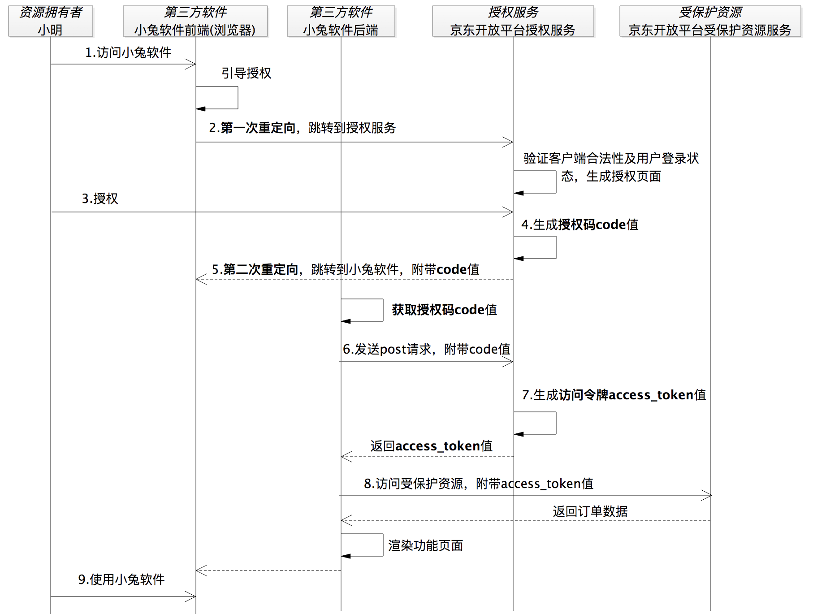
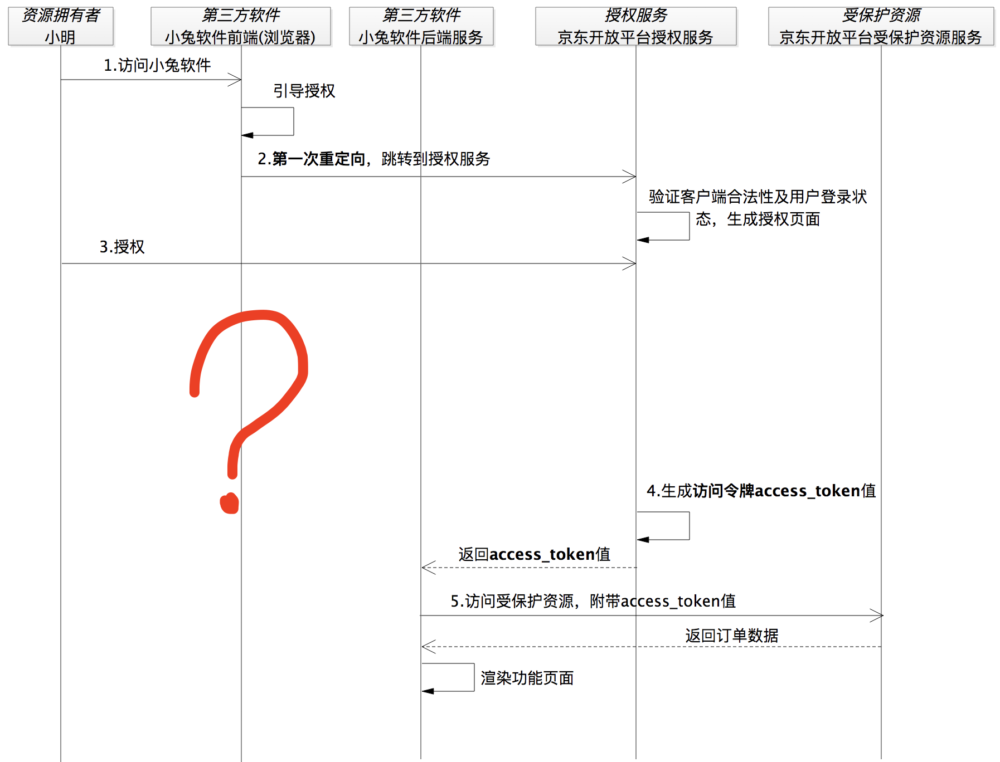

# 02 | 授权码许可类型中，为什么一定要有授权码？
在上一讲，我提到了OAuth 2.0 的授权码许可类型，在小兔打单软件的例子里面，小兔最终是通过 **访问令牌** 请求到小明的店铺里的订单数据。同时呢，我还提到了，这个 **访问令牌是通过授权码换来的**。到这里估计你会问了，为什么要用授权码来换令牌？为什么不能直接颁发访问令牌呢？

## 为什么需要授权码？

在讲这个问题之前，我先要和你同步下，在OAuth 2.0的体系里面有4种角色，按照官方的称呼它们分别是资源拥有者、客户端、授权服务和受保护资源。不过，这里的客户端，我更愿意称其为第三方软件，而且在咱们这个课程中，都是以第三方软件在举例子。所以，在后续的讲解中我统一把它称为第三方软件。

所以，你在看官方资料的时候，可以自己对应下。为了便于你理解，我还是拿小兔软件来举例子，将官方的称呼 “照进现实”，对应关系就是， **资源拥有者->小明，第三方软件->小兔软件，授权服务->京东商家开放平台的授权服务，受保护资源->小明店铺在京东上面的订单**。

在理解了这些概念以后，让我们继续。

你知道， **OAuth诞生之初就是为了解决Web浏览器场景下的授权问题**，所以我基于浏览器的场景，在上一讲的小明使用小兔软件打印订单的整体流程的基础上，画了一个授权码许可类型的序列图。

当然了，这里还是有小兔软件来继续陪伴着我们，不过这次为了能够更好地表述授权码许可流程，我会把小兔软件的前端和后端分开展示，并把京东商家开放平台的系统按照OAuth 2.0的组件拆分成了授权服务和受保护资源服务。如下图所示：



从图中看到，在第4步授权服务生成了授权码 code，按照一开始我们提出来的问题，如果不要授权码，这一步实际上就可以直接返回访问令牌 access\_token 了。

按着这个没有授权码的思路继续想，如果这里直接返回访问令牌，那我们肯定不能使用重定向的方式。因为 **这样会把安全保密性要求极高的访问令牌暴露在浏览器上**，从而将会面临访问令牌失窃的安全风险。显然，这是不能被允许的。

也就是说，如果没有授权码的话，我们就只能把访问令牌发送给第三方软件小兔的后端服务。按照这样的逻辑，上面的流程图就会变成下面这样：



小明访问小兔软件，小兔软件说要打单你得给我授权，不然京东不干，然后小兔软件就引导小明跳转到了京东的授权服务。到授权服务之后，京东商家开放平台验证了小兔的合法性以及小明的登录状态后，生成了授权页面。紧接着，小明赶紧点击同意授权，这时候，京东商家开放平台知道可以把小明的订单数据给小兔软件。

于是，京东商家开放平台没含糊，赶紧生成访问令牌 access\_token，并且通过后端服务的方式返回给了小兔软件。这时候，小兔软件就能正常工作了。

这样，问题就来了，什么问题呢？ 当小明被浏览器重定向到授权服务上之后，小明跟小兔软件之间的 “连接” 就断了，相当于此时此刻小明跟授权服务建立了“连接”后，将一直“停留在授权服务的页面上”。你会看到图2中问号处的时序上，小明再也没有重新“连接”到小兔软件。

OK，为了让小兔软件能很容易地通知到小明， 还必须让小明跟小兔软件重新建立起 “连接”。这就是我们看到的第二次重定向，小明授权之后，又重新重定向回到了小兔软件的地址上，这样小明就跟小兔软件有了新的 “连接”。

到这里，你就能理解在授权码许可的流程中，为什么需要两次重定向了吧。

为了重新建立起这样的一次连接，我们又不能让访问令牌暴露出去，就有了这样一个 **临时的、间接的凭证：授权码**。因为小兔软件最终要拿到的是安全保密性要求极高的访问令牌，并不是授权码，而授权码是可以暴露在浏览器上面的。这样有了授权码的参与，访问令牌可以在后端服务之间传输，同时呢还可以重新建立小明与小兔软件之间的“连接”。这样通过一个授权码，既“照顾”到了小明的体验，又“照顾”了通信的安全。

这下，你就知道为什么要有授权码了吧。


## 一定要有浏览器吗？

OAuth 2.0 是一个授权理念，或者说是一种授权思维。它的授权码模式的思维可以移植到很多场景中，比如微信小程序。在开发微信小程序应用时，我们通过授权码模式获取用户登录信息， [官方文档的地址示例](https://developers.weixin.qq.com/miniprogram/dev/api-backend/open-api/login/auth.code2Session.html) 中给出的 grant\_type=authorization\_code ，就没有用到浏览器。

根据微信官方文档描述，开发者获取用户登录态信息的过程正是一个授权码的许可流程：

- 首先，开发者通过`wx.login(Object object)`方法获取到登录凭证 code 值，这一步的流程是在小程序内部通过调用微信提供的SDK实现；
- 然后，再通过该 code 值换取用户的 session\_key 等信息，也就是官方文档的`auth.code2Session`方法，同时该方法也是被强烈建议通过开发者的后端服务来调用的。

你可以看到，这个过程并没有使用到浏览器，但确实按照授权码许可的思想走了一个完整的授权码许可流程。也就是说，先通过小程序前端获取到 code 值，再通过小程序的后端服务使用 code 值换取 session\_key 等信息，只不过是访问令牌 access\_token 的值被换成了 session\_key。

```
GET https://api.weixin.qq.com/sns/jscode2session?appid=APPID&secret=SECRET&js_code=JSCODE&grant_type=authorization_code
```

你看，这整个过程体现的就是授权码许可流程的思想。
