# 09 | map：如何实现线程安全的map类型？
哈希表（Hash Table）这个数据结构，我们已经非常熟悉了。它实现的就是key-value之间的映射关系，主要提供的方法包括Add、Lookup、Delete等。因为这种数据结构是一个基础的数据结构，每个key都会有一个唯一的索引值，通过索引可以很快地找到对应的值，所以使用哈希表进行数据的插入和读取都是很快的。Go语言本身就内建了这样一个数据结构，也就是 **map数据类型**。

今天呢，我们就先来学习Go语言内建的这个map类型，了解它的基本使用方法和使用陷阱，然后再学习如何实现线程安全的map类型，最后我还会给你介绍Go标准库中线程安全的sync.Map类型。学完了这节课，你可以学会几种可以并发访问的map类型。

## map的基本使用方法

Go内建的map类型如下：

```
map[K]V
```

其中， **key类型的K必须是可比较的**（comparable），也就是可以通过 == 和 !=操作符进行比较；value的值和类型无所谓，可以是任意的类型，或者为nil。

在Go语言中，bool、整数、浮点数、复数、字符串、指针、Channel、接口都是可比较的，包含可比较元素的struct和数组，这俩也是可比较的，而slice、map、函数值都是不可比较的。

那么，上面这些可比较的数据类型都可以作为map的key吗？显然不是。通常情况下，我们会选择内建的基本类型，比如整数、字符串做key的类型，因为这样最方便。

这里有一点需要注意，如果使用struct类型做key其实是有坑的，因为如果struct的某个字段值修改了，查询map时无法获取它add进去的值，如下面的例子：

```
type mapKey struct {
    key int
}

func main() {
    var m = make(map[mapKey]string)
    var key = mapKey{10}

    m[key] = "hello"
    fmt.Printf("m[key]=%s\n", m[key])

    // 修改key的字段的值后再次查询map，无法获取刚才add进去的值
    key.key = 100
    fmt.Printf("再次查询m[key]=%s\n", m[key])
}
```

那该怎么办呢？如果要使用struct作为key，我们要保证struct对象在逻辑上是不可变的，这样才会保证map的逻辑没有问题。

以上就是选取key类型的注意点了。接下来，我们看一下使用map\[key\]函数时需要注意的一个知识点。 **在Go中，map\[key\]函数返回结果可以是一个值，也可以是两个值**，这是容易让人迷惑的地方。原因在于，如果获取一个不存在的key对应的值时，会返回零值。为了区分真正的零值和key不存在这两种情况，可以根据第二个返回值来区分，如下面的代码的第6行、第7行：

```
func main() {
    var m = make(map[string]int)
    m["a"] = 0
    fmt.Printf("a=%d; b=%d\n", m["a"], m["b"])

    av, aexisted := m["a"]
    bv, bexisted := m["b"]
    fmt.Printf("a=%d, existed: %t; b=%d, existed: %t\n", av, aexisted, bv, bexisted)
}

```

map是无序的，所以当遍历一个map对象的时候，迭代的元素的顺序是不确定的，无法保证两次遍历的顺序是一样的，也不能保证和插入的顺序一致。那怎么办呢？如果我们想要按照key的顺序获取map的值，需要先取出所有的key进行排序，然后按照这个排序的key依次获取对应的值。而如果我们想要保证元素有序，比如按照元素插入的顺序进行遍历，可以使用辅助的数据结构，比如 [orderedmap](https://github.com/elliotchance/orderedmap)，来记录插入顺序。

好了，总结下关于map我们需要掌握的内容：map的类型是map\[key\]，key类型的K必须是可比较的，通常情况下，我们会选择内建的基本类型，比如整数、字符串做key的类型。如果要使用struct作为key，我们要保证struct对象在逻辑上是不可变的。在Go中，map\[key\]函数返回结果可以是一个值，也可以是两个值。map是无序的，如果我们想要保证遍历map时元素有序，可以使用辅助的数据结构，比如 [orderedmap](https://github.com/elliotchance/orderedmap)。

## 使用map的2种常见错误

那接下来，我们来看使用map最常犯的两个错误，就是 **未初始化** 和 **并发读写**。

### 常见错误一：未初始化

和slice或者Mutex、RWmutex等struct类型不同，map对象必须在使用之前初始化。如果不初始化就直接赋值的话，会出现panic异常，比如下面的例子，m实例还没有初始化就直接进行操作会导致panic（第3行）:

```
func main() {
    var m map[int]int
    m[100] = 100
}

```

解决办法就是在第2行初始化这个实例（m := make(map\[int\]int)）。

从一个nil的map对象中获取值不会panic，而是会得到零值，所以下面的代码不会报错:

```
func main() {
    var m map[int]int
    fmt.Println(m[100])
}

```

这个例子很简单，我们可以意识到map的初始化问题。但有时候map作为一个struct字段的时候，就很容易忘记初始化了。

```
type Counter struct {
    Website      string
    Start        time.Time
    PageCounters map[string]int
}

func main() {
    var c Counter
    c.Website = "baidu.com"

    c.PageCounters["/"]++
}

```

所以，关于初始化这一点，我再强调一下，目前还没有工具可以检查，我们只能记住“ **别忘记初始化**”这一条规则。

### 常见错误二：并发读写

对于map类型，另一个很容易犯的错误就是并发访问问题。这个易错点，相当令人讨厌，如果没有注意到并发问题，程序在运行的时候就有可能出现并发读写导致的panic。

Go内建的map对象不是线程（goroutine）安全的，并发读写的时候运行时会有检查，遇到并发问题就会导致panic。

我们一起看一个并发访问map实例导致panic的例子：

```
func main() {
    var m = make(map[int]int,10) // 初始化一个map
    go func() {
        for {
            m[1] = 1 //设置key
        }
    }()

    go func() {
        for {
            _ = m[2] //访问这个map
        }
    }()
    select {}
}

```

虽然这段代码看起来是读写goroutine各自操作不同的元素，貌似map也没有扩容的问题，但是运行时检测到同时对map对象有并发访问，就会直接panic。panic信息会告诉我们代码中哪一行有读写问题，根据这个错误信息你就能快速定位出来是哪一个map对象在哪里出的问题了。

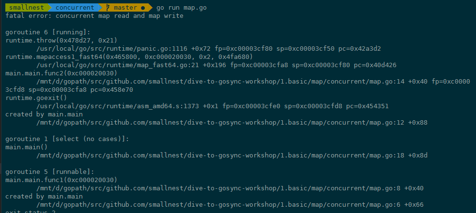

这个错误非常常见，是几乎每个人都会踩到的坑。其实，不只是我们写代码时容易犯这个错，一些知名的项目中也是屡次出现这个问题，比如Docker issue 40772，在删除map对象的元素时忘记了加锁：

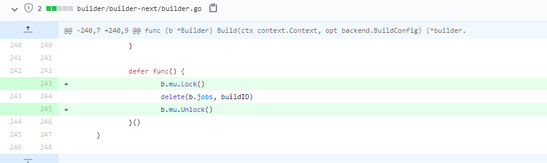

Docker issue 40772，Docker issue 35588、34540、39643等等，也都有并发读写map的问题。

除了Docker中，Kubernetes的issue 84431、72464、68647、64484、48045、45593、37560等，以及TiDB的issue 14960和17494等，也出现了这个错误。

这么多人都会踩的坑，有啥解决方案吗？肯定有，那接下来，我们就继续来看如何解决内建map的并发读写问题。

## 如何实现线程安全的map类型？

避免map并发读写panic的方式之一就是加锁，考虑到读写性能，可以使用读写锁提供性能。

### 加读写锁：扩展map，支持并发读写

比较遗憾的是，目前Go还没有正式发布泛型特性，我们还不能实现一个通用的支持泛型的加锁map。但是，将要发布的泛型方案已经可以验证测试了，离发布也不远了，也许发布之后sync.Map就支持泛型了。

当然了，如果没有泛型支持，我们也能解决这个问题。我们可以通过interface{}来模拟泛型，但还是要涉及接口和具体类型的转换，比较复杂，还不如将要发布的泛型方案更直接、性能更好。

这里我以一个具体的map类型为例，来演示利用读写锁实现线程安全的map\[int\]int类型：

```
type RWMap struct { // 一个读写锁保护的线程安全的map
    sync.RWMutex // 读写锁保护下面的map字段
    m map[int]int
}
// 新建一个RWMap
func NewRWMap(n int) *RWMap {
    return &RWMap{
        m: make(map[int]int, n),
    }
}
func (m *RWMap) Get(k int) (int, bool) { //从map中读取一个值
    m.RLock()
    defer m.RUnlock()
    v, existed := m.m[k] // 在锁的保护下从map中读取
    return v, existed
}

func (m *RWMap) Set(k int, v int) { // 设置一个键值对
    m.Lock()              // 锁保护
    defer m.Unlock()
    m.m[k] = v
}

func (m *RWMap) Delete(k int) { //删除一个键
    m.Lock()                   // 锁保护
    defer m.Unlock()
    delete(m.m, k)
}

func (m *RWMap) Len() int { // map的长度
    m.RLock()   // 锁保护
    defer m.RUnlock()
    return len(m.m)
}

func (m *RWMap) Each(f func(k, v int) bool) { // 遍历map
    m.RLock()             //遍历期间一直持有读锁
    defer m.RUnlock()

    for k, v := range m.m {
        if !f(k, v) {
            return
        }
    }
}

```

正如这段代码所示，对map对象的操作，无非就是增删改查和遍历等几种常见操作。我们可以把这些操作分为读和写两类，其中，查询和遍历可以看做读操作，增加、修改和删除可以看做写操作。如例子所示，我们可以通过读写锁对相应的操作进行保护。

### 分片加锁：更高效的并发map

虽然使用读写锁可以提供线程安全的map，但是在大量并发读写的情况下，锁的竞争会非常激烈。我在 [第4讲](https://time.geekbang.org/column/article/296793) 中提到过，锁是性能下降的万恶之源之一。

在并发编程中，我们的一条原则就是尽量减少锁的使用。一些单线程单进程的应用（比如Redis等），基本上不需要使用锁去解决并发线程访问的问题，所以可以取得很高的性能。但是对于Go开发的应用程序来说，并发是常用的一个特性，在这种情况下，我们能做的就是， **尽量减少锁的粒度和锁的持有时间**。

你可以优化业务处理的代码，以此来减少锁的持有时间，比如将串行的操作变成并行的子任务执行。不过，这就是另外的故事了，今天我们还是主要讲对同步原语的优化，所以这里我重点讲如何减少锁的粒度。

**减少锁的粒度常用的方法就是分片**（Shard），将一把锁分成几把锁，每个锁控制一个分片。Go比较知名的分片并发map的实现是 [orcaman/concurrent-map](https://github.com/orcaman/concurrent-map)。

它默认采用32个分片， **GetShard是一个关键的方法，能够根据key计算出分片索引**。

```

    var SHARD_COUNT = 32

    // 分成SHARD_COUNT个分片的map
	type ConcurrentMap []*ConcurrentMapShared

	// 通过RWMutex保护的线程安全的分片，包含一个map
	type ConcurrentMapShared struct {
		items        map[string]interface{}
		sync.RWMutex // Read Write mutex, guards access to internal map.
	}

	// 创建并发map
	func New() ConcurrentMap {
		m := make(ConcurrentMap, SHARD_COUNT)
		for i := 0; i < SHARD_COUNT; i++ {
			m[i] = &ConcurrentMapShared{items: make(map[string]interface{})}
		}
		return m
	}


	// 根据key计算分片索引
	func (m ConcurrentMap) GetShard(key string) *ConcurrentMapShared {
		return m[uint(fnv32(key))%uint(SHARD_COUNT)]
	}

```

增加或者查询的时候，首先根据分片索引得到分片对象，然后对分片对象加锁进行操作：

```
func (m ConcurrentMap) Set(key string, value interface{}) {
		// 根据key计算出对应的分片
		shard := m.GetShard(key)
		shard.Lock() //对这个分片加锁，执行业务操作
		shard.items[key] = value
		shard.Unlock()
}

func (m ConcurrentMap) Get(key string) (interface{}, bool) {
		// 根据key计算出对应的分片
		shard := m.GetShard(key)
		shard.RLock()
		// 从这个分片读取key的值
		val, ok := shard.items[key]
		shard.RUnlock()
		return val, ok
}

```

当然，除了GetShard方法，ConcurrentMap还提供了很多其他的方法。这些方法都是通过计算相应的分片实现的，目的是保证把锁的粒度限制在分片上。

好了，到这里我们就学会了解决map并发panic的两个方法：加锁和分片。

**在我个人使用并发map的过程中，加锁和分片加锁这两种方案都比较常用，如果是追求更高的性能，显然是分片加锁更好，因为它可以降低锁的粒度，进而提高访问此map对象的吞吐。如果并发性能要求不是那么高的场景，简单加锁方式更简单。**

接下来，我会继续给你介绍sync.Map，这是Go官方线程安全map的标准实现。虽然是官方标准，反而是不常用的，为什么呢？一句话来说就是map要解决的场景很难描述，很多时候在做抉择时根本就不知道该不该用它。但是呢，确实有一些特定的场景，我们需要用到sync.Map来实现，所以还是很有必要学习这个知识点。具体什么场景呢，我慢慢给你道来。

## 应对特殊场景的sync.Map

Go内建的map类型不是线程安全的，所以Go 1.9中增加了一个线程安全的map，也就是sync.Map。但是，我们一定要记住，这个sync.Map并不是用来替换内建的map类型的，它只能被应用在一些特殊的场景里。

那这些特殊的场景是啥呢？ [官方的文档](https://golang.org/pkg/sync/#Map) 中指出，在以下两个场景中使用sync.Map，会比使用map+RWMutex的方式，性能要好得多：

1. 只会增长的缓存系统中，一个key只写入一次而被读很多次；
2. 多个goroutine为不相交的键集读、写和重写键值对。

这两个场景说得都比较笼统，而且，这些场景中还包含了一些特殊的情况。所以，官方建议你针对自己的场景做性能评测，如果确实能够显著提高性能，再使用sync.Map。

这么来看，我们能用到sync.Map的场景确实不多。即使是sync.Map的作者Bryan C. Mills，也很少使用sync.Map，即便是在使用sync.Map的时候，也是需要临时查询它的API，才能清楚记住它的功能。所以，我们可以把sync.Map看成一个生产环境中很少使用的同步原语。

### sync.Map的实现

那sync.Map是怎么实现的呢？它是如何解决并发问题提升性能的呢？其实sync.Map的实现有几个优化点，这里先列出来，我们后面慢慢分析。

- 空间换时间。通过冗余的两个数据结构（只读的read字段、可写的dirty），来减少加锁对性能的影响。对只读字段（read）的操作不需要加锁。
- 优先从read字段读取、更新、删除，因为对read字段的读取不需要锁。
- 动态调整。miss次数多了之后，将dirty数据提升为read，避免总是从dirty中加锁读取。
- double-checking。加锁之后先还要再检查read字段，确定真的不存在才操作dirty字段。
- 延迟删除。删除一个键值只是打标记，只有在提升dirty字段为read字段的时候才清理删除的数据。

要理解sync.Map这些优化点，我们还是得深入到它的设计和实现上，去学习它的处理方式。

我们先看一下map的数据结构：

```
type Map struct {
    mu Mutex
    // 基本上你可以把它看成一个安全的只读的map
    // 它包含的元素其实也是通过原子操作更新的，但是已删除的entry就需要加锁操作了
    read atomic.Value // readOnly

    // 包含需要加锁才能访问的元素
    // 包括所有在read字段中但未被expunged（删除）的元素以及新加的元素
    dirty map[interface{}]*entry

    // 记录从read中读取miss的次数，一旦miss数和dirty长度一样了，就会把dirty提升为read，并把dirty置空
    misses int
}

type readOnly struct {
    m       map[interface{}]*entry
    amended bool // 当dirty中包含read没有的数据时为true，比如新增一条数据
}

// expunged是用来标识此项已经删掉的指针
// 当map中的一个项目被删除了，只是把它的值标记为expunged，以后才有机会真正删除此项
var expunged = unsafe.Pointer(new(interface{}))

// entry代表一个值
type entry struct {
    p unsafe.Pointer // *interface{}
}

```

如果dirty字段非nil的话，map的read字段和dirty字段会包含相同的非expunged的项，所以如果通过read字段更改了这个项的值，从dirty字段中也会读取到这个项的新值，因为本来它们指向的就是同一个地址。

dirty包含重复项目的好处就是，一旦miss数达到阈值需要将dirty提升为read的话，只需简单地把dirty设置为read对象即可。不好的一点就是，当创建新的dirty对象的时候，需要逐条遍历read，把非expunged的项复制到dirty对象中。

接下来，我们就深入到源码去看看sync.map的实现。在看这部分源码的过程中，我们只要重点关注Store、Load和Delete这3个核心的方法就可以了。

Store、Load和Delete这三个核心函数的操作都是先从read字段中处理的，因为读取read字段的时候不用加锁。

#### Store方法

我们先来看Store方法，它是用来设置一个键值对，或者更新一个键值对的。

```
func (m *Map) Store(key, value interface{}) {
    read, _ := m.read.Load().(readOnly)
    // 如果read字段包含这个项，说明是更新，cas更新项目的值即可
    if e, ok := read.m[key]; ok && e.tryStore(&value) {
        return
    }

    // read中不存在，或者cas更新失败，就需要加锁访问dirty了
    m.mu.Lock()
    read, _ = m.read.Load().(readOnly)
    if e, ok := read.m[key]; ok { // 双检查，看看read是否已经存在了
        if e.unexpungeLocked() {
            // 此项目先前已经被删除了，通过将它的值设置为nil，标记为unexpunged
            m.dirty[key] = e
        }
        e.storeLocked(&value) // 更新
    } else if e, ok := m.dirty[key]; ok { // 如果dirty中有此项
        e.storeLocked(&value) // 直接更新
    } else { // 否则就是一个新的key
        if !read.amended { //如果dirty为nil
            // 需要创建dirty对象，并且标记read的amended为true,
            // 说明有元素它不包含而dirty包含
            m.dirtyLocked()
            m.read.Store(readOnly{m: read.m, amended: true})
        }
        m.dirty[key] = newEntry(value) //将新值增加到dirty对象中
    }
    m.mu.Unlock()
}

```

可以看出，Store既可以是新增元素，也可以是更新元素。如果运气好的话，更新的是已存在的未被删除的元素，直接更新即可，不会用到锁。如果运气不好，需要更新（重用）删除的对象、更新还未提升的dirty中的对象，或者新增加元素的时候就会使用到了锁，这个时候，性能就会下降。

所以从这一点来看，sync.Map适合那些只会增长的缓存系统，可以进行更新，但是不要删除，并且不要频繁地增加新元素。

新加的元素需要放入到dirty中，如果dirty为nil，那么需要从read字段中复制出来一个dirty对象：

```
func (m *Map) dirtyLocked() {
    if m.dirty != nil { // 如果dirty字段已经存在，不需要创建了
        return
    }

    read, _ := m.read.Load().(readOnly) // 获取read字段
    m.dirty = make(map[interface{}]*entry, len(read.m))
    for k, e := range read.m { // 遍历read字段
        if !e.tryExpungeLocked() { // 把非punged的键值对复制到dirty中
            m.dirty[k] = e
        }
    }
}

```

#### Load方法

Load方法用来读取一个key对应的值。它也是从read开始处理，一开始并不需要锁。

```
func (m *Map) Load(key interface{}) (value interface{}, ok bool) {
    // 首先从read处理
    read, _ := m.read.Load().(readOnly)
    e, ok := read.m[key]
    if !ok && read.amended { // 如果不存在并且dirty不为nil(有新的元素)
        m.mu.Lock()
        // 双检查，看看read中现在是否存在此key
        read, _ = m.read.Load().(readOnly)
        e, ok = read.m[key]
        if !ok && read.amended {//依然不存在，并且dirty不为nil
            e, ok = m.dirty[key]// 从dirty中读取
            // 不管dirty中存不存在，miss数都加1
            m.missLocked()
        }
        m.mu.Unlock()
    }
    if !ok {
        return nil, false
    }
    return e.load() //返回读取的对象，e既可能是从read中获得的，也可能是从dirty中获得的
}

```

如果幸运的话，我们从read中读取到了这个key对应的值，那么就不需要加锁了，性能会非常好。但是，如果请求的key不存在或者是新加的，就需要加锁从dirty中读取。所以，读取不存在的key会因为加锁而导致性能下降，读取还没有提升的新值的情况下也会因为加锁性能下降。

其中，missLocked增加miss的时候，如果miss数等于dirty长度，会将dirty提升为read，并将dirty置空。

```
func (m *Map) missLocked() {
    m.misses++ // misses计数加一
    if m.misses < len(m.dirty) { // 如果没达到阈值(dirty字段的长度),返回
        return
    }
    m.read.Store(readOnly{m: m.dirty}) //把dirty字段的内存提升为read字段
    m.dirty = nil // 清空dirty
    m.misses = 0  // misses数重置为0
}

```

#### Delete方法

sync.map的第3个核心方法是Delete方法。在Go 1.15中欧长坤提供了一个LoadAndDelete的实现（ [go#issue 33762](https://github.com/golang/go/issues/33762)），所以Delete方法的核心改在了对LoadAndDelete中实现了。

同样地，Delete方法是先从read操作开始，原因我们已经知道了，因为不需要锁。

```
func (m *Map) LoadAndDelete(key interface{}) (value interface{}, loaded bool) {
    read, _ := m.read.Load().(readOnly)
    e, ok := read.m[key]
    if !ok && read.amended {
        m.mu.Lock()
        // 双检查
        read, _ = m.read.Load().(readOnly)
        e, ok = read.m[key]
        if !ok && read.amended {
            e, ok = m.dirty[key]
            // 这一行长坤在1.15中实现的时候忘记加上了，导致在特殊的场景下有些key总是没有被回收
            delete(m.dirty, key)
            // miss数加1
            m.missLocked()
        }
        m.mu.Unlock()
    }
    if ok {
        return e.delete()
    }
    return nil, false
}

func (m *Map) Delete(key interface{}) {
    m.LoadAndDelete(key)
}
func (e *entry) delete() (value interface{}, ok bool) {
    for {
        p := atomic.LoadPointer(&e.p)
        if p == nil || p == expunged {
            return nil, false
        }
        if atomic.CompareAndSwapPointer(&e.p, p, nil) {
            return *(*interface{})(p), true
        }
    }
}

```

如果read中不存在，那么就需要从dirty中寻找这个项目。最终，如果项目存在就删除（将它的值标记为nil）。如果项目不为nil或者没有被标记为expunged，那么还可以把它的值返回。

最后，我补充一点，sync.map还有一些LoadAndDelete、LoadOrStore、Range等辅助方法，但是没有Len这样查询sync.Map的包含项目数量的方法，并且官方也不准备提供。如果你想得到sync.Map的项目数量的话，你可能不得不通过Range逐个计数。

## 总结

Go内置的map类型使用起来很方便，但是它有一个非常致命的缺陷，那就是它存在着并发问题，所以如果有多个goroutine同时并发访问这个map，就会导致程序崩溃。所以Go官方Blog很早就提供了一种加锁的 [方法](https://blog.golang.org/maps#TOC_6.)，还有后来提供了适用特定场景的线程安全的sync.Map，还有第三方实现的分片式的map，这些方法都可以应用于并发访问的场景。

这里我给你的建议，也是Go开发者给的建议，就是通过性能测试，看看某种线程安全的map实现是否满足你的需求。

当然还有一些扩展其它功能的map实现，比如带有过期功能的 [timedmap](https://github.com/zekroTJA/timedmap)、使用红黑树实现的key有序的 [treemap](https://godoc.org/github.com/emirpasic/gods/maps/treemap) 等，因为和并发问题没有关系，就不详细介绍了。这里我给你提供了链接，你可以自己探索。

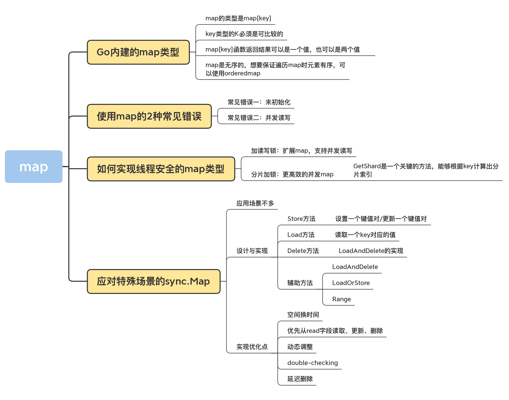

## 思考题

1. 为什么sync.Map中的集合核心方法的实现中，如果read中项目不存在，加锁后还要双检查，再检查一次read？

2. 你看到sync.map元素删除的时候只是把它的值设置为nil，那么什么时候这个key才会真正从map对象中删除？


欢迎在留言区写下你的思考和答案，我们一起交流讨论。如果你觉得有所收获，也欢迎你把今天的内容分享给你的朋友或同事。


# Map核心原理

> https://mp.weixin.qq.com/s/PT1zpv3bvJiIJweN3mvX7g

以一组 key-value 对写入 map 的流程为例进行简述：

（1）通过哈希方法取得 key 的 hash 值；

（2）hash 值对桶数组长度取模，确定其所属的桶；

（3）在桶中插入 key-value 对。

hash 的性质，保证了相同的 key 必然产生相同的 hash 值，因此能映射到相同的桶中，通过桶内遍历的方式锁定对应的 key-value 对。

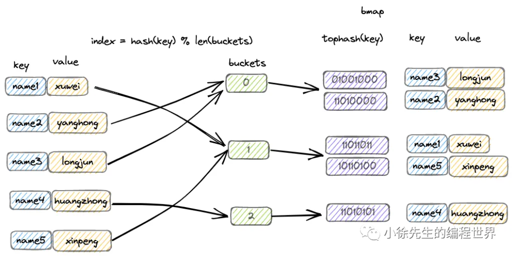

map 中，会通过长度为 2 的整数次幂的桶数组进行 key-value 对的存储：

（1）每个桶固定可以存放 8 个 key-value 对；

（2）倘若超过 8 个 key-value 对打到桶数组的同一个索引当中，此时会通过创建桶链表的方式来化解这一问题.

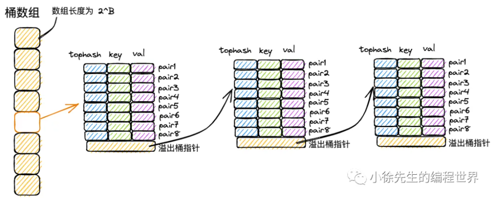

## 解决hash冲突

首先，由于 hash 冲突的存在，不同 key 可能存在相同的 hash 值；再者，hash 值会对桶数组长度取模，因此不同 hash 值可能被打到同一个桶中。

综上，不同的 key-value 可能被映射到 map 的同一个桶当中。

在 map 解决 hash 冲突问题时，实际上结合了拉链法和开放寻址法两种思路。以 map 的插入写流程为例，进行思路阐述：

（1）桶数组中的每个桶，严格意义上是一个单向桶链表，以桶为节点进行串联；

（2）每个桶固定可以存放 8 个 key-value 对；

（3）当 key 命中一个桶时，首先根据开放寻址法，在桶的 8 个位置中寻找空位进行插入；

（4）倘若桶的 8 个位置都已被占满，则基于桶的溢出桶指针，找到下一个桶，重复第（3）步；

（5）倘若遍历到链表尾部，仍未找到空位，则基于拉链法，在桶链表尾部续接新桶，并插入 key-value 对。

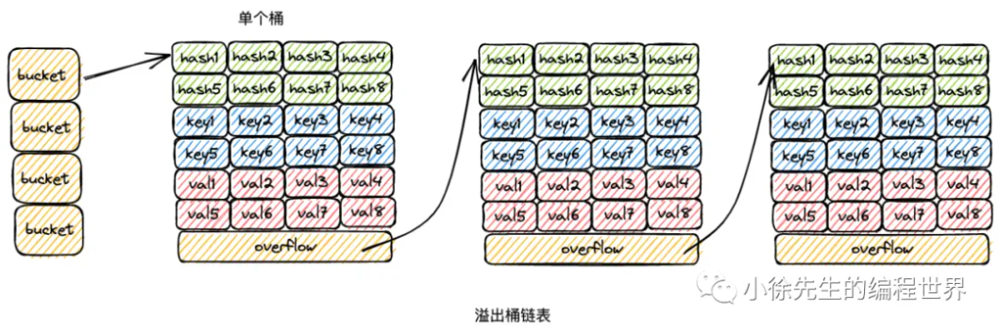

## 数据结构

### hmap

`hmap`是 map 的头结构，它管理着整个哈希表。你可以把它想象成 map 的“大脑”。

```go
// Go 运行时库中的 hmap 结构 (简化版以突出重点)
type hmap struct {
    count     int    // map 中当前存储的键值对数量。len() 函数直接返回这个值。
    flags     uint8  // 状态标志位，可以标识出 map 是否被 goroutine 并发读写。
    B         uint8  // 最重要的字段之一。表示当前桶数组长度的对数：len(buckets) = 2^B。
                     // 例如，B=3 表示桶数组有 8 个桶；B=4 表示有 16 个桶。

    noverflow uint16 // map 中溢出桶的数量
    hash0     uint32 // 哈希种子，在创建 map 时随机生成。用于计算 key 的哈希值，防止哈希碰撞攻击。

    buckets    unsafe.Pointer // 指向桶数组的指针。也就是指向第一个桶的地址。
    oldbuckets unsafe.Pointer // 在扩容迁移时指向旧桶数组的指针。扩容完成后会被置为 nil。

    nevacuate  uintptr        // 扩容时的进度标识，index 小于 nevacuate 的桶都已经由老桶转移到新桶中。

    extra *mapextra // 预分配的的溢出桶
}
```

`bmap`代表一个具体的桶。

```go
// 在运行时中，bmap 的结构并非直接这样定义，但其内存布局如下：
type bmap struct {
    tophash [bucketCnt]uint8 // 长度为 8 的数组，存储哈希值的高 8 位
    // 后面紧跟 bucketCnt 个 key
    // 再后面紧跟 bucketCnt 个 value
    // 最后是一个溢出桶的指针
}
```

一个 bmap 桶的内存布局 (以 map[string]int 为例)

```shell
┌─────────────────────────────────┐
│           bmap 结构              │
├─────────────────────────────────┤
│   tophash [0]   |  uint8        │  <- 第一个键值对的哈希高8位
├─────────────────────────────────┤
│   tophash [1]   |  uint8        │
├─────────────────────────────────┤
│       ...       |    ...        │
├─────────────────────────────────┤
│   tophash [7]   |  uint8        │  <- 第八个键值对的哈希高8位
├─────────────────────────────────┤
│      keys [0]   |  string       │  <- 第一个键值对的 key
├─────────────────────────────────┤
│      keys [1]   |  string       │
├─────────────────────────────────┤
│       ...       |    ...        │
├─────────────────────────────────┤
│      keys [7]   |  string       │  <- 第八个键值对的 key
├─────────────────────────────────┤
│    values [0]   |  int          │  <- 第一个键值对的 value
├─────────────────────────────────┤
│    values [1]   |  int          │
├─────────────────────────────────┤
│       ...       |    ...        │
├─────────────────────────────────┤
│    values [7]   |  int          │  <- 第八个键值对的 value
├─────────────────────────────────┤
│    overflow     |  *bmap        │  -> 指向下一个溢出桶的指针
└─────────────────────────────────┘

整个 Go Map 的结构 (hmap + bmap + 溢出桶)
┌────────────────────────────────────────────────────────────────────────┐
│                                hmap                                    │
├──────────────────────┬─────────────────────┬───────────────────────────┤
│ count = 6            │ B = 1               │ buckets    ──────────────────┤
│ flags = 0            │ hash0 = 0x...       │ oldbuckets = nil          │ 	│
└──────────────────────┴─────────────────────┴───────────────────────────┘ 	│
                                                                           	│
    桶数组 (长度为 2^B = 2)                                                  │
    ┌─────────────────┐                                                    	│
    │   buckets[0]    │ ◄───────────────────────────────────────────────────┘
    │   (bmap)        │
    ├─────────────────┤        ┌─────────┐ 溢出桶机制
    │   buckets[1]    │ ──────►│  bmap   │ ──────► ... (更多溢出桶)
    │   (bmap)        │        └─────────┘
    └─────────────────┘
```

在桶内遍历查找某个 key 时，首先会比较 `tophash`。如果目标的哈希值高 8 位与 `tophash`数组中的条目不匹配，就可以立即跳过键值对的比较，这比直接比较 key 本身要快得多。

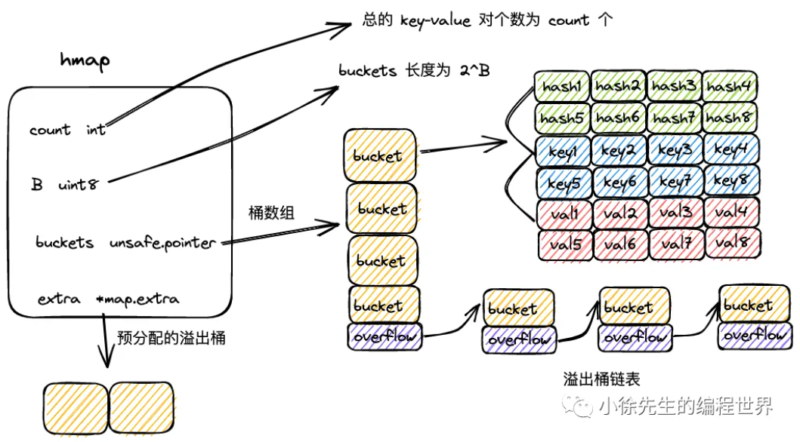

### mapextra

```go
type mapextra struct {
    overflow    *[]*bmap
    oldoverflow *[]*bmap

    nextOverflow *bmap
}
```

在 map 初始化时，倘若容量过大，会提前申请好一批溢出桶，以供后续使用，这部分溢出桶存放在 hmap.mapextra 当中：

（1）mapextra.overflow：供桶数组 buckets 使用的溢出桶；

（2）mapextra.oldoverFlow: 扩容流程中，供老桶数组 oldBuckets 使用的溢出桶；

（3）mapextra.nextOverflow：下一个可用的溢出桶。

## 构造方法

当使用 `make(map[k]v)`或 `make(map[k]v, hint)`创建 map 时，实际上会调用 runtime/map.go 文件中的 makemap 方法，下面对源码展开分析：

```go
func makemap(t *maptype, hint int, h *hmap) *hmap {
	mem, overflow := math.MulUintptr(uintptr(hint), t.Bucket.Size_)
	if overflow || mem > maxAlloc {
		hint = 0
	}

	// initialize Hmap
	if h == nil {
		h = new(hmap)
	}
	h.hash0 = fastrand()

	B := uint8(0)
	for overLoadFactor(hint, B) {
		B++
	}
	h.B = B

	if h.B != 0 {
		var nextOverflow *bmap
		h.buckets, nextOverflow = makeBucketArray(t, h.B, nil)
		if nextOverflow != nil {
			h.extra = new(mapextra)
			h.extra.nextOverflow = nextOverflow
		}
	}

	return h
}
```

（1）hint 为 map 拟分配的容量；在分配前，会提前对拟分配的内存大小进行判断，倘若超限，会将 hint 置为零；

```go
	mem, overflow := math.MulUintptr(uintptr(hint), t.Bucket.Size_)
	if overflow || mem > maxAlloc {
		hint = 0
	}
```

（2）通过 new 方法初始化 hmap；

```go
	if h == nil {
		h = new(hmap)
	}
```

（3）调用 fastrand，构造 hash 因子：hmap.hash0；

```
	h.hash0 = fastrand()
```

（4）计算桶数组的容量 B；

```go
	B := uint8(0)
	for overLoadFactor(hint, B) {
		B++
	}
	h.B = B
```

（5）调用 makeBucketArray 方法，初始化桶数组 hmap.buckets；

```
		var nextOverflow *bmap
		h.buckets, nextOverflow = makeBucketArray(t, h.B, nil)
```

（6）倘若 map 容量较大，会提前申请一批溢出桶 hmap.extra。

```go
		if nextOverflow != nil {
			h.extra = new(mapextra)
			h.extra.nextOverflow = nextOverflow
		}
```

### overLoadFactor

通过 overLoadFactor 方法，决定是否继续增长 B 的数值：

```go
// 调用
B := uint8(0)
for overLoadFactor(hint, B) {
    B++
}
h.B = B
// 函数定义
const loadFactorNum = 13
const loadFactorDen = 2
const goarch.PtrSize = 8
const bucketCnt = 8

func overLoadFactor(count int, B uint8) bool {
	return count > bucketCnt && uintptr(count) > loadFactorNum*(bucketShift(B)/loadFactorDen)
}
func bucketShift(b uint8) uintptr {
	return uintptr(1) << (b & (goarch.PtrSize*8 - 1))
}
```

（1）倘若 map 预分配容量小于等于 8，B 取 0，桶的个数为 1；

（2）保证 map 预分配容量小于等于桶数组长度 * 6.5。

map 预分配容量、桶数组长度指数、桶数组长度之间的关系如下表：

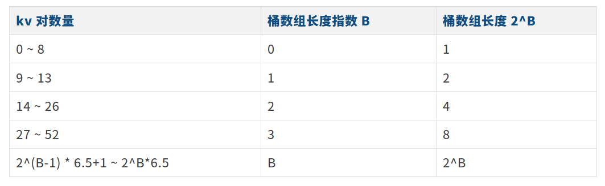


## 读流程

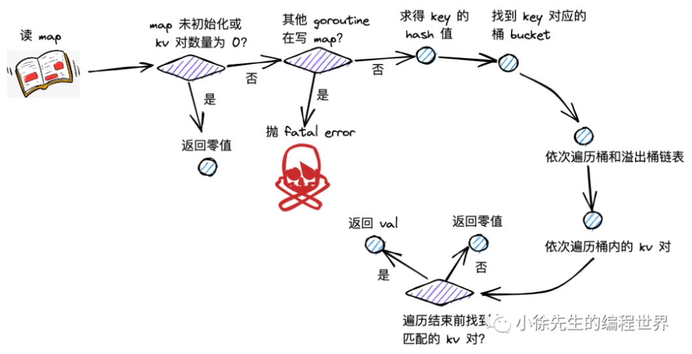

map 读流程主要分为以下几步：

（1）根据 key 取 hash 值；

（2）根据 hash 值对桶数组取模，确定所在的桶；

（3）沿着桶链表依次遍历各个桶内的 key-value 对；

（4）命中相同的 key，则返回 value；倘若 key 不存在，则返回零值。


## 写流程

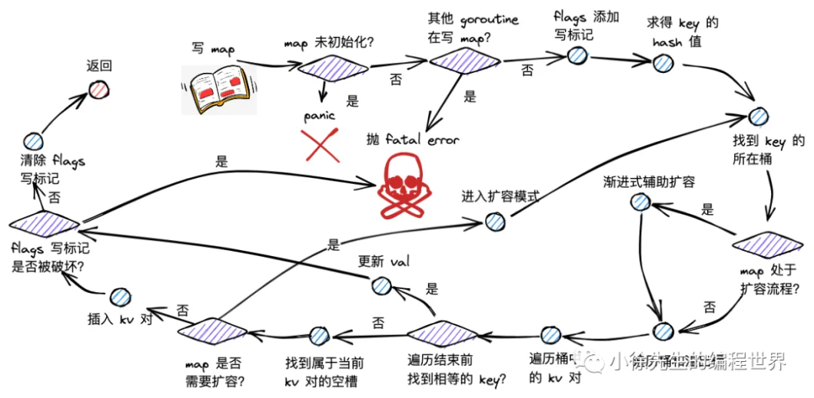

map 写流程主要分为以下几步：

（1）根据 key 取 hash 值；

（2）根据 hash 值对桶数组取模，确定所在的桶；

（3）倘若 map 处于扩容，则迁移命中的桶，帮助推进渐进式扩容；

（4）沿着桶链表依次遍历各个桶内的 key-value 对；

（5）倘若命中相同的 key，则对 value 中进行更新；

（6）倘若 key 不存在，则插入 key-value 对；

（7）倘若发现 map 达成扩容条件，则会开启扩容模式，并重新返回第（2）步。

有关渐进式扩容和扩容模式在后面扩容流程部分讲解。


## 删流程

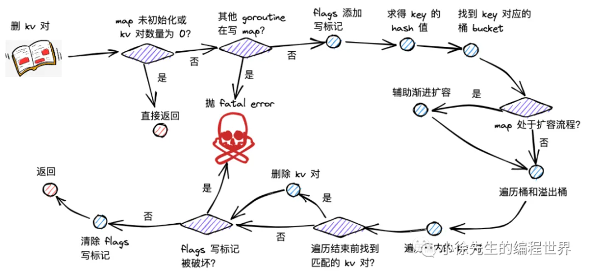

map 删楚 kv 对流程主要分为以下几步：

（1）根据 key 取 hash 值；

（2）根据 hash 值对桶数组取模，确定所在的桶；

（3）倘若 map 处于扩容，则迁移命中的桶，帮助推进渐进式扩容；

（4）沿着桶链表依次遍历各个桶内的 key-value 对；

（5）倘若命中相同的 key，删除对应的 key-value 对；并将当前位置的 tophash 置为 emptyOne，表示为空；

（6）倘若当前位置为末位，或者下一个位置的 tophash 为 emptyRest，则沿当前位置向前遍历，将毗邻的 emptyOne 统一更新为 emptyRest。

`tophash`数组中的两种特殊标记：

- `emptyOne`(值为 1)：表示当前这个单元格是空的。但这个空位可能是“夹在”两个有效单元格之间的。
- `emptyRest`(值为 0)：表示从当前这个单元格开始，一直到桶的末尾，所有单元格都是空的。


## 遍历流程

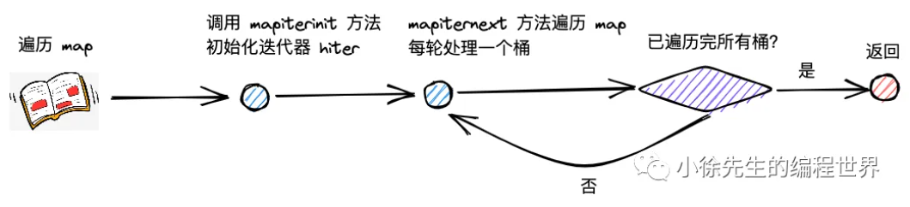


## 扩容流程

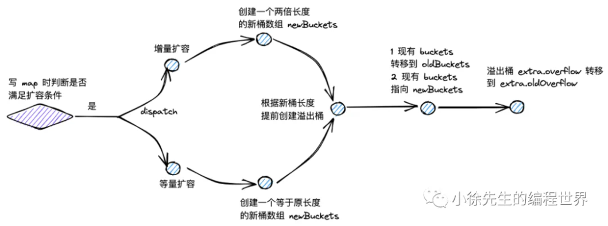

map 的扩容类型分为两类，一类叫做增量扩容，一类叫做等量扩容.

（1）增量扩容

表现：扩容后，桶数组的长度增长为原长度的 2 倍；

倘若此前未进入扩容模式，且 map 中 key-value 对的数量超过 8 个，且大于桶数组长度的 6.5 倍，则进入增量扩容

```go
const(
   loadFactorNum = 13
   loadFactorDen = 2
   bucketCnt = 8
)


func overLoadFactor(count int, B uint8) bool {
    return count > bucketCnt && uintptr(count) > loadFactorNum*(bucketShift(B)/loadFactorDen)
}
```

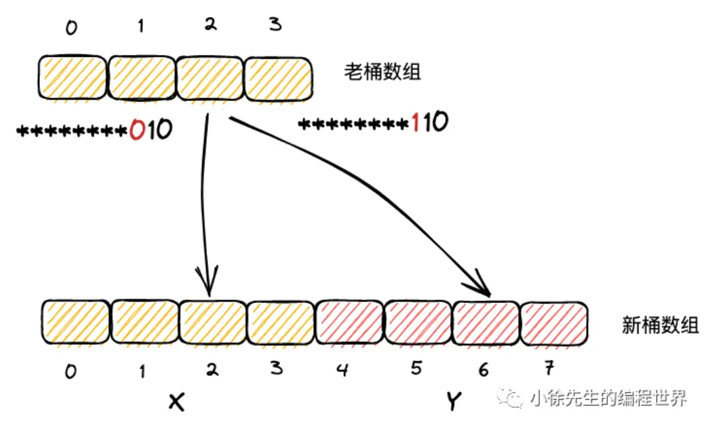

（1）在等量扩容中，新桶数组长度与原桶数组相同；

（2）key-value 对在新桶数组和老桶数组的中的索引号保持一致；

（3）在增量扩容中，新桶数组长度为原桶数组的两倍；

（4）把新桶数组中桶号对应于老桶数组的区域称为 x 区域，新扩展的区域称为 y 区域.

（5）实际上，一个 key 属于哪个桶，取决于其 hash 值对桶数组长度取模得到的结果，最终依赖于其低位的 hash 值结果.；

（6）在增量扩容流程中，新桶数组的长度会扩展一位，假定 key 原本从属的桶号为 i，则在新桶数组中从属的桶号只可能是 i （x 区域）或者 i + 老桶数组长度（y 区域）；

（7）当 key 低位 hash 值向左扩展一位的 bit 位为 0，则应该迁往 x 区域的 i 位置；倘若该 bit 位为 1，应该迁往 y 区域对应的 i + 老桶数组长度的位置；

（8）从旧桶 `i`的主桶开始，依次遍历其所有溢出桶，收集链上的所有键值对；对每个键值对，用其哈希值的新增高位（即第 `B+1`位）决定去向。

**假设：**

- 旧桶数组长度 `oldLen = 8`(`2^3`, 即 `oldB = 3`)。
- 新桶数组长度 `newLen = 16`(`2^4`, 即 `newB = 4`)。
- 有一个 key，它的哈希值是 `... 1011 1101`（我们只关心最后几位）。

**原理：定位桶的算法**

- 定位公式：`bucket_index = hash & (bucket_len - 1)` （在 Go 的 map 实现中，`hash & (bucket_len - 1)`这个位运算本质上就是 `hash % bucket_len`（取模运算），但它是通过位运算实现的，效率更高。）
- 为什么是这个公式？因为桶长度永远是 2 的幂次，`bucket_len - 1`的二进制就是一串连续的 `1`。这个位运算 `&`的效果就是取哈希值的低位作为索引。
  - 旧桶长度是 8 (`1000`)，`8-1=7`(`0111`)。`hash & 0111`就是取 hash 的最低 3 位。
  - 新桶长度是 16 (`10000`)，`16-1=15`(`01111`)。`hash & 01111`就是取 hash 的最低 4 位。

**迁移的确定性**

现在，关键点来了：key 的新位置完全由它的哈希值的第 4 位（从低位开始数）决定。

- 旧索引 `i`：由低 3 位决定，假设是 `101`（二进制）= 5（十进制）。
- 新索引：由低 4 位决定。低 4 位只可能是 `0101`或 `1101`。如果第 4 位是 `0`，新索引是 `0101`（二进制）= 5（十进制）。这个位置正好对应图中描述的 x 区域，即和旧索引 `i`相同的位置。如果第 4 位是 `1`，新索引是 `1101`（二进制）= 13（十进制）。这个位置正好是 `i + oldLen = 5 + 8 = 13`。这个位置对应图中描述的 y 区域。


（2）等量扩容

表现：扩容后，桶数组的长度和之前保持一致；但是溢出桶的数量会下降。

倘若溢出桶的数量大于 2^B 个（即桶数组的长度；B 大于 15 时取15），则进入等量扩容：

```go
func tooManyOverflowBuckets(noverflow uint16, B uint8) bool {
    if B > 15 {
        B = 15
    }
    return noverflow >= uint16(1)<<(B&15)
}
```

等量扩容中，`newLen = oldLen`。因此，`hash & (newLen - 1)`和 `hash & (oldLen - 1)`这个计算过程是完全一样的，因为取模运算（位与操作）截取的位数相同。

虽然索引号不变，但“重新哈希”的过程会遍历这个桶链表上的所有 key-value 对，并将它们重新紧凑地排列到新桶的主桶中。那些因为删除操作而产生的 `emptyOne`空隙会被抹除，过长的溢出链会被缩短甚至消除。最终，数据变得更紧凑，内存使用率更高，查询性能也得到恢复。


- 等量扩容（`B`不变）：是一次 **“整理”**。在索引不变的情况下，对桶内部进行碎片整理和内存压缩，目标是提升空间利用率和查询速度。
- 增量扩容（`B+1`）：是一次 **“扩张”**。它利用哈希值的特性，通过检查新增的高位，将旧桶中的数据一分为二，均匀地分散到扩大了一倍的新数组中，目标是降低负载，保证时间复杂度。


### 渐进的增量扩容

在扩容未完成时，map 中同时存在新旧两套桶数组，这影响了数据的读写逻辑：

查找（读）‍：检查对应的桶是否迁移完成，如果未迁移完则从old桶遍历，如果迁移完了则从new桶遍历

当每次触发写、删操作时，会为处于扩容流程中的 map 完成两组桶的数据迁移：

（1）一组桶是当前写、删操作所命中的桶；

（2）另一组桶是，当前未迁移的桶中，索引最小的那个桶。


# SyncMap核心原理

