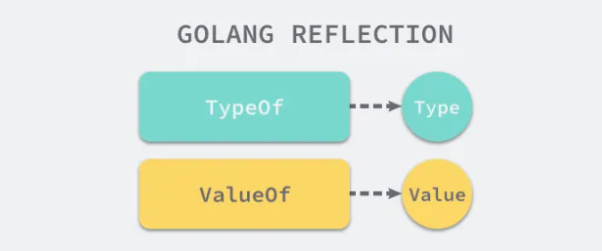

# 概述

`reflect` 实现了运行时的反射能力，我们可以使用包中的函数 `TypeOf` 从静态类型 `interface{}` 中获取动态类型信息并通过 `ValueOf` 获取数据的运行时表示，通过这两个函数和包中的其他工具我们就可以得到更强大的表达能力。

在具体介绍反射包的实现原理之前，我们先要对 Go 语言的反射有一些比较简单的理解，首先 `reflect` 中有两对非常重要的函数和类型，我们在上面已经介绍过其中的两个函数 `TypeOf` 和 `ValueOf`，另外两个类型是 `Type` 和 `Value`，它们与函数是一一对应的关系：




# 反射法则

运行时反射是程序在运行期间检查其自身结构的一种方式，它是 元编程 的一种，但是它带来的灵活性也是一把双刃剑，过量的使用反射会使我们的程序逻辑变得难以理解并且运行缓慢，我们在这一节中就会介绍 Go 语言反射的三大法则，这能够帮助我们更好地理解反射的作用。

1. 从接口值可反射出反射对象；
2. 从反射对象可反射出接口值；
3. 要修改反射对象，其值必须可设置；

## 第一法则


## 第二法则


## 第三法则


# Type接口

## Elem方法

`Type` 接口的 `Elem()` 方法是一个非常重要的方法，用于获取复合类型的元素类型。

```go
	// Elem returns a type's element type.
	// It panics if the type's Kind is not Array, Chan, Map, Pointer, or Slice.
	Elem() Type
```

核心概念

1. **作用对象**：`Elem()` 只适用于以下 5 种类型（通过 `Kind()` 判断）：
   - `Array`（数组）
   - `Chan`（通道）
   - `Map`（映射）
   - `Pointer`（指针）
   - `Slice`（切片）
2. **返回值**：
   - 返回这些类型所包含的元素类型
   - 返回值本身也是一个 `Type` 接口，可以继续用于反射操作
3. **非法调用**：如果对不支持的类型调用 `Elem()`，会直接触发 panic

具体类型的行为

| 类型（Kind） | `Elem()` 返回的内容                | 示例                     |
| :----------- | :--------------------------------- | :----------------------- |
| `Array`      | 数组元素的类型                     | `[5]int` → `int`         |
| `Chan`       | 通道传输元素的类型                 | `chan string` → `string` |
| `Map`        | 映射的值的类型（键类型用 `Key()`） | `map[int]bool` → `bool`  |
| `Pointer`    | 指针指向的类型                     | `*float64` → `float64`   |
| `Slice`      | 切片元素的类型                     | `[]byte` → `byte`        |

重要说明

1. **映射类型特殊处理**：

   对于 `Map` 类型，`Elem()` 返回**值类型**，需要用 `Key()` 方法单独获取**键类型**

```go
   m := map[string]int{}
   t := reflect.TypeOf(m)
   keyType := t.Key()    // string
   valueType := t.Elem() // int
```

2. **嵌套类型**：可以链式调用 `Elem()` 处理多层嵌套：
```go
   var pp **int
   t := reflect.TypeOf(pp) // **int
   t.Elem()                // *int (第一层解引用)
   t.Elem().Elem()         // int  (第二层解引用)
```

3. **类型验证**：安全的使用方式应该先检查 `Kind()`：
```go
   if t.Kind() == reflect.Ptr {
       elemType := t.Elem()
       // 处理元素类型...
   }
```

**实际应用场景**

```go
func printSliceElementType(s interface{}) {
    t := reflect.TypeOf(s)
    if t.Kind() != reflect.Slice {
        panic("Not a slice!")
    }
    elemType := t.Elem()
    fmt.Println("Slice element type:", elemType)
}
```

理解 `Elem()` 是掌握 Go 反射的关键，它让开发者能深入到复合类型的内部结构中。

## Method

`Method`结构体字段详解

```go
type Method struct {
	// Name is the method name.
	Name string

	// PkgPath is the package path that qualifies a lower case (unexported)
	// method name. It is empty for upper case (exported) method names.
	// The combination of PkgPath and Name uniquely identifies a method
	// in a method set.
	// See https://golang.org/ref/spec#Uniqueness_of_identifiers
	PkgPath string

	Type  Type  // method type
	Func  Value // func with receiver as first argument
	Index int   // index for Type.Method
}
```


# Value

## 可设置性

在 Go 反射中，值的可设置性（Settability）是一个关键概念。

```go
a := 42
va := reflect.ValueOf(a)
```

当直接传递 `a` 时：

- Go 会创建一个 `a` 的副本
- `reflect.ValueOf` 接收的是这个副本的值
- 这个副本是不可寻址的（unaddressable）
- 因此无法修改原始变量 `a`

```go
i := 42
v := reflect.ValueOf(&i).Elem()
```

当传递指针时：

- Go 创建指针的副本（指针本身可复制）
- `reflect.ValueOf` 获取指针的 Value
- `.Elem()` 解引用指针，获取指向的值
- 这个值可寻址，因为它指向原始变量

检查可设置性：

```go
func checkSettability(v reflect.Value) {
    fmt.Printf("CanAddr: %v, CanSet: %v\n", v.CanAddr(), v.CanSet())
}

func main() {
    // 不可设置
    a := 42
    va := reflect.ValueOf(a)
    checkSettability(va) // CanAddr: false, CanSet: false
    
    // 可设置
    i := 42
    vi := reflect.ValueOf(&i).Elem()
    checkSettability(vi) // CanAddr: true, CanSet: true
    
    // 结构体字段
    type S struct{ N int }
    s := S{N: 100}
    
    // 不可设置（值传递）
    vs := reflect.ValueOf(s)
    checkSettability(vs.Field(0)) // CanAddr: false, CanSet: false
    
    // 可设置（指针传递）
    vsp := reflect.ValueOf(&s).Elem()
    checkSettability(vsp.Field(0)) // CanAddr: true, CanSet: true
}
```

**特殊情况处理**

1、切片和映射元素

切片和映射的元素总是可设置的：

```go
	s := []int{1, 2, 3}
	v := reflect.ValueOf(s)
	v.Index(0).SetInt(10)    // 直接修改元素，不需要指针
	fmt.Printf("s: %v\n", s) // s: [10 2 3]

	m := map[string]int{"a": 1}
	vm := reflect.ValueOf(m)
	vm.SetMapIndex(reflect.ValueOf("a"), reflect.ValueOf(2))
	fmt.Printf("m: %v\n", m) // m: map[a:2]
```

2、接口值

```go
	var i interface{} = 42
	iv := reflect.ValueOf(&i).Elem()
	iv.Set(reflect.ValueOf(100)) // 修改接口持有的值
	fmt.Printf("i: %v\n", i)     // i: 100
```

3、非导出字段

即使使用指针，也不能设置非导出字段：

```go
type S struct{ n int } // 小写 n 未导出
s := &S{n: 1}
v := reflect.ValueOf(s).Elem()
field := v.Field(0)
fmt.Println(field.CanSet()) // false
```

**通用模式：**

```go
func modifyValue(ptr interface{}) {
    v := reflect.ValueOf(ptr).Elem()
    if v.CanSet() {
        // 根据类型设置值
        switch v.Kind() {
        case reflect.Int:
            v.SetInt(100)
        case reflect.String:
            v.SetString("new")
        // 其他类型处理...
        }
    }
}

func main() {
    var i int = 42
    modifyValue(&i)
    fmt.Println(i) // 100
    
    var s string = "old"
    modifyValue(&s)
    fmt.Println(s) // "new"
}
```

## Elem方法

```go
// Elem returns the value that the interface v contains
// or that the pointer v points to.
// It panics if v's Kind is not Interface or Pointer.
// It returns the zero Value if v is nil.
func (v Value) Elem() Value
```

功能说明：

1. 如果 `v` 是接口类型：返回接口包含的具体值
2. 如果 `v` 是指针类型：返回指针指向的值
3. 如果 `v` 是 nil 指针：返回零值 Value
4. 其他情况：panic

1、接口类型示例

```go
var i interface{} = 42
// i 是一个接口变量，但 reflect.ValueOf(i) 返回的是接口包含的具体值（int 42）的反射值
v := reflect.ValueOf(i)
fmt.Printf("kind: %v\n", v.Kind()) // kind: int

var i interface{} = 42
v := reflect.ValueOf(&i)
fmt.Printf("kind: %v\n", v.Kind()) // kind: ptr
elem := v.Elem()
fmt.Printf("elem kind: %v\n", elem.Kind()) // elem kind: interface

// 要操作接口本身：reflect.ValueOf(&i).Elem()
// 要操作接口包含的值：直接使用 reflect.ValueOf(i)
```


## 结构体操作

```go
type Person struct {
    Name string
    Age  int
}

func main() {
    p := Person{"Alice", 30}
    v := reflect.ValueOf(&p).Elem()
    
    // 获取字段值
    nameField := v.FieldByName("Name")
    fmt.Println(nameField.String()) // Alice
    
    // 设置字段值
    ageField := v.FieldByName("Age")
    if ageField.CanSet() {
        ageField.SetInt(31)
    }
    fmt.Println(p.Age) // 31
}
```

## 切片操作

```go
func main() {
    slice := []int{1, 2, 3}
    v := reflect.ValueOf(&slice).Elem()
    
    // 追加元素
    newSlice := reflect.Append(v, reflect.ValueOf(4))
    v.Set(newSlice)
    fmt.Println(slice) // [1 2 3 4]
    
    // 修改元素
    if v.Len() > 0 {
        v.Index(0).SetInt(10)
    }
    fmt.Println(slice) // [10 2 3 4]
}
```

## 映射操作

```go
func main() {
    m := map[string]int{"a": 1, "b": 2}
    v := reflect.ValueOf(&m).Elem()
    
    // 添加新键值对
    key := reflect.ValueOf("c")
    value := reflect.ValueOf(3)
    v.SetMapIndex(key, value)
    fmt.Println(m) // map[a:1 b:2 c:3]
    
    // 删除键
    v.SetMapIndex(key, reflect.Value{})
    fmt.Println(m) // map[a:1 b:2]
}
```

## 函数调用

```go
func Add(a, b int) int {
    return a + b
}

func main() {
    // 获取函数值
    funcValue := reflect.ValueOf(Add)
    
    // 准备参数
    args := []reflect.Value{
        reflect.ValueOf(3),
        reflect.ValueOf(4),
    }
    
    // 调用函数
    results := funcValue.Call(args)
    fmt.Println(results[0].Int()) // 7
}
```

## 方法调用

```go
type Calculator struct{}

func (c Calculator) Multiply(x, y int) int {
    return x * y
}

func main() {
    calc := Calculator{}
    v := reflect.ValueOf(calc)
    
    // 获取方法
    method := v.MethodByName("Multiply")
    
    // 调用方法
    result := method.Call([]reflect.Value{
        reflect.ValueOf(5),
        reflect.ValueOf(6),
    })
    fmt.Println(result[0].Int()) // 30
}
```

