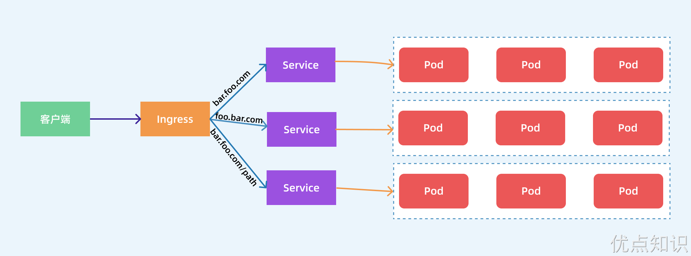
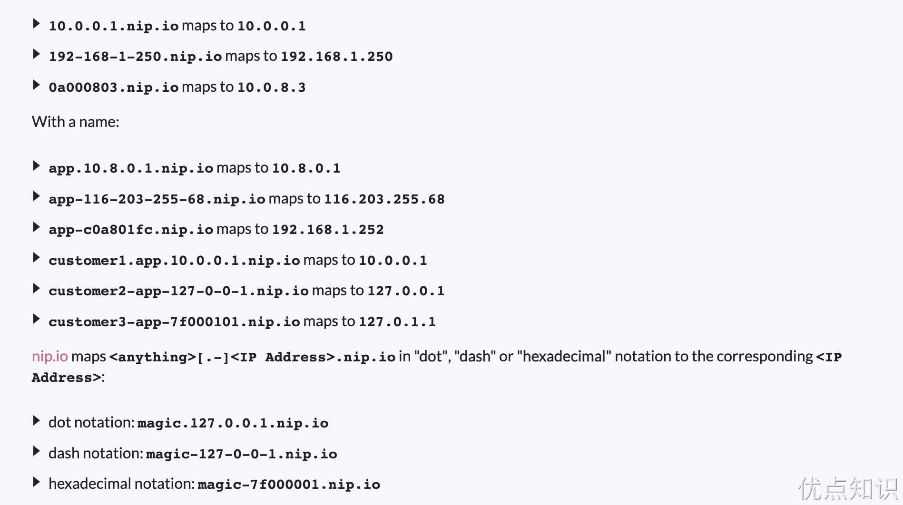

# Ingress
前面学习了在 Kubernetes 集群内部使用 kube-dns 实现服务发现的功能，那么部署在 Kubernetes 集群中的应用如何暴露给外部的用户使用呢？我们知道可以使用 NodePort 和 LoadBlancer 类型的 Service 可以把应用暴露给外部用户使用，除此之外，Kubernetes 还为我们提供了一个非常重要的资源对象可以用来暴露服务给外部用户，那就是 Ingress。对于小规模的应用我们使用 NodePort 或许能够满足我们的需求，但是当你的应用越来越多的时候，你就会发现对于 NodePort 的管理就非常麻烦了，这个时候使用 Ingress 就非常方便了，可以避免管理大量的端口。

# 资源对象
Ingress 资源对象是 Kubernetes 内置定义的一个对象，是从 Kubernetes 集群外部访问集群的一个入口，将外部的请求转发到集群内不同的 Service 上，其实就相当于 nginx、haproxy 等负载均衡代理服务器，可能你会觉得我们直接使用 nginx 就实现了，但是只使用 nginx 这种方式有很大缺陷，每次有新服务加入的时候怎么改 Nginx 配置？不可能让我们去手动更改吧？那我们再加上一个服务发现的工具比如 consul 如何？貌似是可以，对吧？Ingress 实际上就是这样实现的，只是服务发现的功能自己实现了，不需要使用第三方的服务了，然后再加上一个域名规则定义，路由信息的刷新依靠 Ingress Controller 来提供。


Ingress Controller 可以理解为一个监听器，通过不断地监听 kube-apiserver，实时的感知后端 Service、Pod 的变化，当得到这些信息变化后，Ingress Controller 再结合 Ingress 的配置，更新反向代理负载均衡器，达到服务发现的作用。其实这点和服务发现工具 consul、 consul-template 非常类似。

# 定义
一个常见的 Ingress 资源清单如下所示：
```yaml
apiVersion: networking.k8s.io/v1
kind: Ingress
metadata:
  name: demo-ingress
  annotations:
    nginx.ingress.kubernetes.io/rewrite-target: /
spec:
  rules:
    - http:
        paths:
          - path: /testpath
            pathType: Prefix
            backend:
              service:
                name: test
                port:
                  number: 80
```
上面这个 Ingress 资源的定义，配置了一个路径为 /testpath 的路由，所有 /testpath/** 的入站请求，会被 Ingress 转发至名为 test 的服务的 80 端口的 / 路径下。可以将 Ingress 狭义的理解为 Nginx 中的配置文件 nginx.conf。

此外 Ingress 经常使用注解 annotations 来配置一些选项，当然这具体取决于 Ingress 控制器的实现方式，不同的 Ingress 控制器支持不同的注解。

另外需要注意的是当前集群版本是 v1.25，这里使用的 apiVersion 是 networking.k8s.io/v1，所以如果是之前版本的 Ingress 资源对象需要进行迁移。 Ingress 资源清单的描述我们可以使用 kubectl explain 命令来了解：
```sh
[root@master ingress]# kubectl explain ingress.spec
KIND:     Ingress
VERSION:  networking.k8s.io/v1

RESOURCE: spec <Object>

DESCRIPTION:
     Spec is the desired state of the Ingress. More info:
     https://git.k8s.io/community/contributors/devel/sig-architecture/api-conventions.md#spec-and-status

     IngressSpec describes the Ingress the user wishes to exist.

FIELDS:
   defaultBackend       <Object>
     DefaultBackend is the backend that should handle requests that don't match
     any rule. If Rules are not specified, DefaultBackend must be specified. If
     DefaultBackend is not set, the handling of requests that do not match any
     of the rules will be up to the Ingress controller.

   ingressClassName     <string>
     IngressClassName is the name of an IngressClass cluster resource. Ingress
     controller implementations use this field to know whether they should be
     serving this Ingress resource, by a transitive connection (controller ->
     IngressClass -> Ingress resource). Although the
     `kubernetes.io/ingress.class` annotation (simple constant name) was never
     formally defined, it was widely supported by Ingress controllers to create
     a direct binding between Ingress controller and Ingress resources. Newly
     created Ingress resources should prefer using the field. However, even
     though the annotation is officially deprecated, for backwards compatibility
     reasons, ingress controllers should still honor that annotation if present.

   rules        <[]Object>
     A list of host rules used to configure the Ingress. If unspecified, or no
     rule matches, all traffic is sent to the default backend.

   tls  <[]Object>
     TLS configuration. Currently the Ingress only supports a single TLS port,
     443. If multiple members of this list specify different hosts, they will be
     multiplexed on the same port according to the hostname specified through
     the SNI TLS extension, if the ingress controller fulfilling the ingress
     supports SNI.
```
从上面描述可以看出 Ingress 资源对象中有几个重要的属性：defaultBackend、ingressClassName、rules、tls。

## rules
其中核心部分是 rules 属性的配置，每个路由规则都在下面进行配置：
- host：可选字段，上面我们没有指定 host 属性，所以该规则适用于通过指定 IP 地址的所有入站 HTTP 通信，如果提供了 host 域名，则 rules 则会匹配该域名的相关请求，此外 host 可以是精确匹配（例如 foo.bar.com）或者使用通配符来匹配（例如 *.foo.com）。
- http.paths：定义访问的路径列表，比如上面定义的 /testpath，每个路径都有一个由 backend.service.name 和 backend.service.port.number 定义关联的 Service 后端，在控制器将流量路由到引用的服务之前，host 和 path 都必须匹配传入的请求才行。
- backend：该字段其实就是用来定义后端的 Service 服务，与路由规则中 host 和 path 匹配的流量会将发送到对应的 backend 后端去。

> 此外一般情况下在 Ingress 控制器中会配置一个 defaultBackend 默认后端，当请求不匹配任何 Ingress 中的路由规则时会使用该后端。defaultBackend 通常是 Ingress 控制器的配置选项，而非在 Ingress 资源中指定。

## Resource
backend 后端除了可以引用一个 Service 服务之外，还可以通过一个 resource 资源进行关联。
```sh
[root@master ingress]# kubectl explain ingress.spec.rules.http.paths.backend.resource
KIND:     Ingress
VERSION:  networking.k8s.io/v1

RESOURCE: resource <Object>

DESCRIPTION:
     Resource is an ObjectRef to another Kubernetes resource in the namespace of
     the Ingress object. If resource is specified, a service.Name and
     service.Port must not be specified. This is a mutually exclusive setting
     with "Service".

     TypedLocalObjectReference contains enough information to let you locate the
     typed referenced object inside the same namespace.

FIELDS:
   apiGroup     <string>
     APIGroup is the group for the resource being referenced. If APIGroup is not
     specified, the specified Kind must be in the core API group. For any other
     third-party types, APIGroup is required.

   kind <string> -required-
     Kind is the type of resource being referenced

   name <string> -required-
     Name is the name of resource being referenced
```
Resource 是当前 Ingress 对象命名空间下引用的另外一个 Kubernetes 资源对象，但是需要注意的是 Resource 与 Service 配置是互斥的，只能配置一个。resource 使用 TypedLocalObjectReference 类型来包含足够的信息，以便于定位同一命名空间中的引用对象。
- apiGroup（可选）: 是被引用资源的 API 组。如果未指定 apiGroup，则默认引用的资源必须属于核心 API 组。对于第三方资源类型，必须指定 API 组。
- kind（必需）: 是被引用资源的类型。这告诉 Kubernetes 要寻找哪种类型的资源。
- name（必需）: 是被引用资源的名称。这指定了具体的资源实例。

使用 resource 字段，你可以将流量路由到命名空间中的不同类型的资源，这为更灵活的流量管理提供了可能。例如，你可以引用一个 Kubernetes API 对象，而不是传统的服务。

## pathType
`pathType` 是 Kubernetes Ingress 资源定义中 `ingress.spec.rules.http.paths` 部分的一个字段，用来确定如何解释和匹配 URL 路径。`pathType` 可以有以下几种值：
- **Exact**: 表示必须完全匹配 URL 路径，且区分大小写。这意味着，只有当请求的路径完全等于 Ingress 中定义的路径时，请求才会被路由到相应的后端服务。例如，如果设置为 `/foo`，则只有对 `/foo` 的请求才会匹配；对 `/foo/` 或 `/foo/bar` 的请求则不会匹配。
- **Prefix**: 基于 URL 路径前缀进行匹配，其中前缀是以 `/` 分割的，匹配区分大小写。匹配是基于路径元素逐一进行的。路径元素是指以 `/` 分隔符分割的路径中的标签列表。请注意，如果路径的最后一个元素是请求路径最后一个元素的子串，那么它不会匹配。例如 `/foo/bar` 会匹配 `/foo/bar/baz`，但不会匹配 `/foo/barbaz`。
- **ImplementationSpecific**: `ImplementationSpecific` 的解释由 `IngressClass` 决定。不同的 Ingress 控制器实现可以将其视为独立的 `PathType`，或者将其视为与 `Prefix` 或 `Exact` 类型相同。Ingress 控制器的实现必须支持所有路径类型。

实际上，`pathType` 字段允许 Ingress 控制器正确地理解并匹配进入集群的请求路径。例如，如果开发者希望某个服务处理所有以 `/images` 开头的请求，他们可以使用 `Prefix` 类型，而如果仅希望精确匹配 `/images` 这个特定路径，则使用 `Exact` 类型。`ImplementationSpecific` 类型则留给了 Ingress 控制器的实现者来决定如何进行路径匹配，它提供了更大的灵活性，以适应特定的需求或使用场景。

可以查看下表了解更多的匹配场景（来自官网）：


> 在某些情况下，Ingress 中的多条路径会匹配同一个请求，这种情况下最长的匹配路径优先，如果仍然有两条同等的匹配路径，则精确路径类型优先于前缀路径类型。

## IngressClass
ingressClassName 是 Kubernetes Ingress 资源的一个属性，它用于指定与 Ingress 关联的 IngressClass 资源的名称。Ingress 控制器使用这个字段来判断它们是否应该服务于特定的 Ingress 资源。这种关联是通过一个传递的连接建立的：Ingress 控制器 -> IngressClass -> Ingress 资源。

管理员可以定义一个或多个 IngressClass，每个都有一个与之关联的 Ingress 控制器。这样，Ingress 资源就能够声明它们想要使用的特定 IngressClass（通过 ingressClassName 字段），从而允许多个 Ingress 控制器互不干扰地在同一个 Kubernetes 集群中运行。例如：
```yaml
apiVersion: networking.k8s.io/v1
kind: IngressClass
metadata:
  name: external-lb
spec:
  controller: nginx-ingress-internal-controller
  parameters:
    apiGroup: k8s.example.com
    kind: IngressParameters
    name: external-lb
```
Ingress 中的 spec.ingressClassName 属性就可以用来指定对应的 IngressClass，并进而由 IngressClass 关联到对应的 Ingress 控制器，如：
```yaml
apiVersion: networking.k8s.io/v1
kind: Ingress
metadata:
  name: myapp
spec:
  ingressClassName: external-lb # 上面定义的 IngressClass 对象名称
  defaultBackend:
    service:
      name: myapp
      port:
        number: 80
```
这种关联方式使得管理员可以在同一个集群中部署多个 Ingress 控制器，并且可以针对每个 Ingress 资源选择最合适的管理者。例如，你可能为不同的应用或不同类型的流量选择不同的 Ingress 控制器。

在早期版本的 Kubernetes 中，ingressClassName 字段还不存在，因此，用户通常会使用 kubernetes.io/ingress.class 注解来为 Ingress 资源和 Ingress 控制器之间建立直接关联。这个注解虽然没有被正式定义，但被广泛支持，并且在实践中起到了类似 ingressClassName 字段的作用。

然而，随着 Kubernetes 的发展，官方推荐使用 ingressClassName 字段来替代 kubernetes.io/ingress.class 注解。新创建的 Ingress 资源应该更倾向于使用这个字段。尽管如此，出于向后兼容的考虑，即使 kubernetes.io/ingress.class 注解已被官方废弃，Ingress 控制器仍然应该兼容这个注解（如果它存在）。

不过需要注意的是 spec.ingressClassName 与老版本的 kubernetes.io/ingress.class 注解的作用并不完全相同，因为 ingressClassName 字段引用的是 IngressClass 资源的名称，IngressClass 资源中除了指定了 Ingress 控制器的名称之外，还可能会通过 spec.parameters 属性定义一些额外的配置。

在 Kubernetes Ingress 中的 parameters 字段可以对应于一个特定的 API 对象，该对象包含了对 IngressClass 进行配置的参数。parameters 字段的作用是为 IngressClass 提供额外的配置信息，这些信息将被相关的 Ingress 控制器用来正确地处理与该类关联的 Ingress 资源。

通过这种方式，你可以为特定的 IngressClass 提供定制化的配置。在这个例子中，只有位于 external-configuration 命名空间中的 IngressParameters 类型的资源 external-lb 才会被用来配置与 external-lb IngressClass 关联的 Ingress 资源。
```yaml
apiVersion: networking.k8s.io/v1
kind: IngressClass
metadata:
  name: external-lb
spec:
  controller: nginx-ingress-internal-controller
  parameters:
    apiGroup: k8s.example.com
    kind: IngressParameters
    name: external-lb
    namespace: external-configuration
    scope: Namespace
```

由于一个集群中可能有多个 Ingress 控制器，所以我们还可以将一个特定的 IngressClass 对象标记为集群默认是 Ingress 类。只需要将一个 IngressClass 资源的 ingressclass.kubernetes.io/is-default-class 注解设置为 true 即可，这样未指定 ingressClassName 字段的 Ingress 就会使用这个默认的 IngressClass。

> 如果集群中有多个 IngressClass 被标记为默认，准入控制器将阻止创建新的未指定 ingressClassName 的 Ingress 对象。最好的方式还是确保集群中最多只能有一个 IngressClass 被标记为默认。

## TLS
Ingress 资源对象还可以用来配置 Https 的服务，可以通过设定包含 TLS 私钥和证书的 Secret 来保护 Ingress。 Ingress 只支持单个 TLS 端口 443，如果 Ingress 中的 TLS 配置部分指定了不同的主机，那么它们将根据通过 SNI TLS 扩展指定的主机名 （如果 Ingress 控制器支持 SNI）在同一端口上进行复用。需要注意 TLS Secret 必须包含名为 tls.crt 和 tls.key 的键名，例如：
```yaml
apiVersion: v1
kind: Secret
metadata:
  name: testsecret-tls
  namespace: default
data:
  tls.crt: base64 编码的 cert
  tls.key: base64 编码的 key
type: kubernetes.io/tls
```
在 Ingress 中引用此 Secret 将会告诉 Ingress 控制器使用 TLS 加密从客户端到负载均衡器的通道，我们需要确保创建的 TLS Secret 创建自包含 https-example.foo.com 的公用名称的证书，如下所示：
```yaml
apiVersion: networking.k8s.io/v1
kind: Ingress
metadata:
  name: tls-example-ingress
spec:
  tls:
    - hosts:
        - https-example.foo.com
      secretName: testsecret-tls
  rules:
    - host: https-example.foo.com
      http:
        paths:
          - path: /
            pathType: Prefix
            backend:
              service:
                name: service1
                port:
                  number: 80
```
现在我们了解了如何定义 Ingress 资源对象了，但是仅创建 Ingress 资源本身没有任何效果。还需要部署 Ingress 控制器，例如 ingress-nginx，现在可以供大家使用的 Ingress 控制器有很多，比如 traefik、nginx-controller、Kubernetes Ingress Controller for Kong、HAProxy Ingress controller，当然你也可以自己实现一个 Ingress Controller，现在普遍用得较多的是 ingress-nginx、apisix 以及 traefik，traefik 的性能比 ingress-nginx 差，但是配置使用要简单许多。

> 实际上社区目前还在开发一组高配置能力的 API，被称为 Gateway API，新 API 会提供一种 Ingress 的替代方案，它的存在目的不是替代 Ingress，而是提供一种更具配置能力的新方案。

# ingress-nginx
我们已经了解了 Ingress 资源对象只是一个路由请求描述配置文件，要让其真正生效还需要对应的 Ingress 控制器才行，Ingress 控制器有很多，这里我们先介绍使用最多的 ingress-nginx，它是基于 Nginx 的 Ingress 控制器。

## 运行原理
ingress-nginx 控制器主要是用来组装一个 nginx.conf 的配置文件，当配置文件发生任何变动的时候就需要重新加载 Nginx 来生效，但是并不会只在影响 upstream 配置的变更后就重新加载 Nginx，控制器内部会使用一个 lua-nginx-module 来实现该功能。

我们知道 Kubernetes 控制器使用控制循环模式来检查控制器中所需的状态是否已更新或是否需要变更，所以 ingress-nginx 需要使用集群中的不同对象来构建模型，比如 Ingress、Service、Endpoints、Secret、ConfigMap 等可以生成反映集群状态的配置文件的对象，控制器需要一直 Watch 这些资源对象的变化，但是并没有办法知道特定的更改是否会影响到最终生成的 nginx.conf 配置文件，所以一旦 Watch 到了任何变化控制器都必须根据集群的状态重建一个新的模型，并将其与当前的模型进行比较，如果模型相同则就可以避免生成新的 Nginx 配置并触发重新加载，否则还需要检查模型的差异是否只和端点有关，如果是这样，则然后需要使用 HTTP POST 请求将新的端点列表发送到在 Nginx 内运行的 Lua 处理程序，并再次避免生成新的 Nginx 配置并触发重新加载，如果运行和新模型之间的差异不仅仅是端点，那么就会基于新模型创建一个新的 Nginx 配置了，这样构建模型最大的一个好处就是在状态没有变化时避免不必要的重新加载，可以节省大量 Nginx 重新加载。

下面简单描述了需要重新加载的一些场景：
- 创建了新的 Ingress 资源
- TLS 添加到现有 Ingress
- 从 Ingress 中添加或删除 path 路径
- Ingress、Service、Secret 被删除了
- Ingress 的一些缺失引用对象变可用了，例如 Service 或 Secret
- 更新了一个 Secret

对于集群规模较大的场景下频繁的对 Nginx 进行重新加载显然会造成大量的性能消耗，所以要尽可能减少出现重新加载的场景。

## 安装
由于 ingress-nginx 所在的节点需要能够访问外网，这样域名可以解析到这些节点上直接使用，所以可以让 ingress-nginx 绑定节点的 80 和 443 端口，所以可以使用 hostPort 或者 hostNetwork 模式，当然对于线上环境来说为了保证高可用，一般是需要运行多个 ingress-nginx 实例，然后可以用一个 nginx/haproxy 作为入口，通过 keepalived 来访问边缘节点的 vip 地址。

> 所谓边缘节点即集群内部用来向集群外暴露服务能力的节点，集群外部的服务通过该节点来调用集群内部的服务，边缘节点是集群内外交流的一个 Endpoint。

安装 ingress-nginx 有多种方式，我们这里直接使用下面的命令进行一键安装：
```sh

```
上面的命令执行后会自动创建一个名为 ingress-nginx 的命名空间，会生成如下几个 Pod：
```sh

```
此外还会创建如下两个 Service 对象：
```sh

```
其中 ingress-nginx-controller-admission 是为准入控制器提供服务的，我们也是强烈推荐开启该准入控制器，这样当我们创建不合要求的 Ingress 对象后就会直接被拒绝了，另外一个 ingress-nginx-controller 就是 ingress 控制器对外暴露的服务，我们可以看到默认是一个 LoadBalancer 类型的 Service，我们知道该类型是用于云服务商的，我们这里在本地环境，暂时不能使用，但是可以通过他的 NodePort 来对外暴露，后面我们会提供在本地测试环境提供 LoadBalancer 的方式。

到这里 ingress-nginx 就部署成功了，安装完成后还会创建一个名为 nginx 的 IngressClass 对象：
```sh

```
这里我们只提供了一个 controller 属性，对应的值和 ingress-nginx 的启动参数中的 controller-class 一致的。
```sh

```

# 第一个示例
安装成功后，现在我们来为一个 nginx 应用创建一个 Ingress 资源，如下所示：
```yaml

```
注意我们这里配置的域名是 first-ingress.172.18.0.2.nip.io，该地址其实会直接映射到 172.18.0.2 上面，该 IP 地址就是我的 Node 节点地址，因为我们这里 ingress 控制器是通过 NodePort 对外进行暴露的，所以可以通过 域名:nodePort 来访问服务。nip.io 是由 PowerDNS 提供支持的开源服务，允许我们可以直接通过使用以下格式将任何 IP 地址映射到主机名，这样我们就不需要在 etc/hosts 文件中配置映射了，对于 Ingress 测试非常方便。


这里直接创建上面的资源对象即可：
```sh

```
在上面的 Ingress 资源对象中我们使用配置 ingressClassName: nginx 指定让我们安装的 ingress-nginx 这个控制器来处理我们的 Ingress 资源，配置的匹配路径类型为前缀的方式去匹配 /，将来自域名 first-ingress.172.18.0.2.nip.io 的所有请求转发到 my-nginx 服务的后端 Endpoints 中去，注意访问的时候需要带上 NodePort 端口。
```sh

```
前面我们也提到了 ingress-nginx 控制器的核心原理就是将我们的 Ingress 这些资源对象映射翻译成 Nginx 配置文件 nginx.conf，我们可以通过查看控制器中的配置文件来验证这点：
```sh

```
我们可以在 nginx.conf 配置文件中看到上面我们新增的 Ingress 资源对象的相关配置信息，不过需要注意的是现在并不会为每个 backend 后端都创建一个 upstream 配置块，现在是使用 Lua 程序进行动态处理的，所以我们没有直接看到后端的 Endpoints 相关配置数据。

此外我们也可以安装一个 kubectl 插件 https://kubernetes.github.io/ingress-nginx/kubectl-plugin 来辅助使用 ingress-nginx，要安装该插件的前提需要先安装 krew，然后执行下面的命令即可：
```sh

```