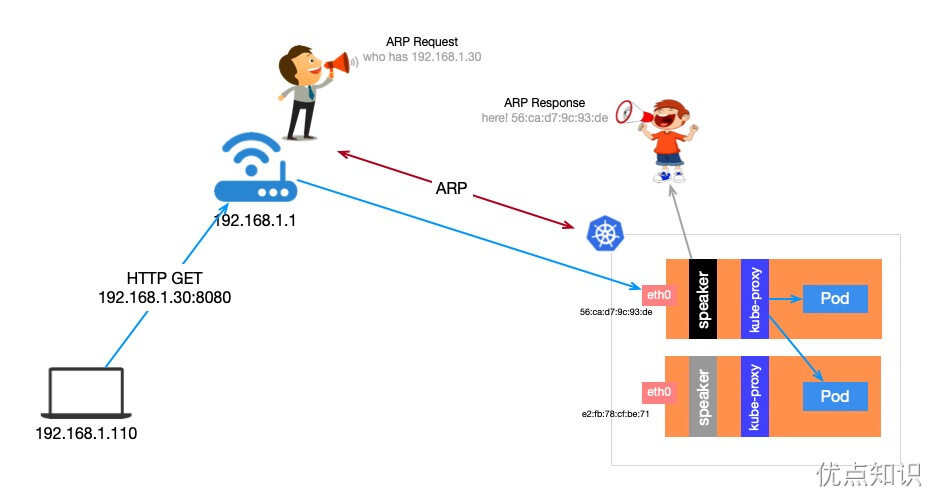
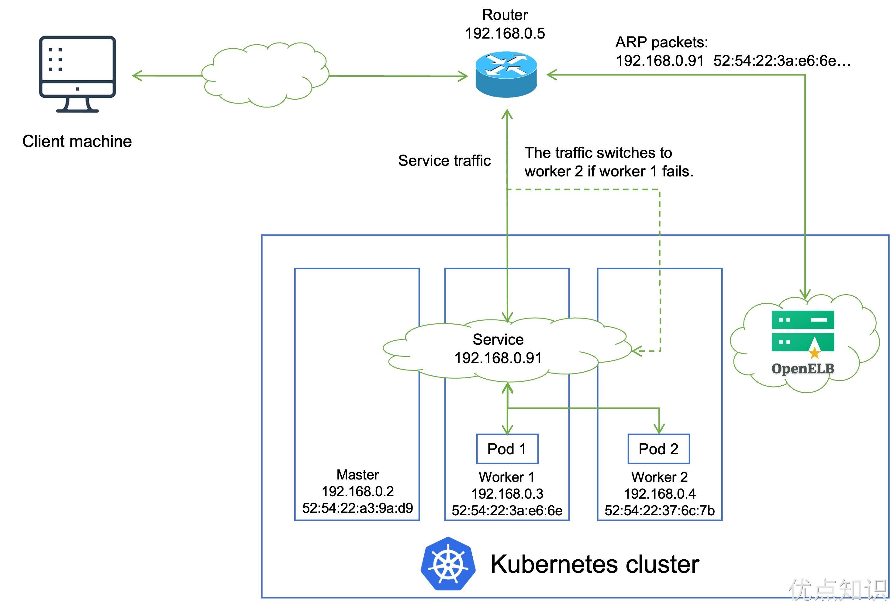

# LoadBalancer
前面我们学习了在云环境下面可以创建一个 LoadBalancer 类型的 Service 来对外暴露服务，但是对于本地私有环境想就没办法了，这个时候其实我们可以在环境中部署一个支持该服务类型的负载均衡器就可以了，在社区中目前比较流行的应该是 MetalLB 和 OpenELB 这两个项目。

# MetalLB
MetalLB 是裸机 Kubernetes 集群的负载均衡器实现，使用标准路由协议，主要用于暴露 K8s 集群的服务到集群外部访问，MetalLB 可以让我们在 K8s 集群中创建服务类型为 LoadBalancer 的服务，并且无需依赖云厂商提供的 LoadBalancer。

它具有两个共同提供此服务的工作负载：地址分配（address allocation）和外部公告（external announcement），对应在 K8s 中部署的 controller 和 speaker。
- address allocation：地址分配这个功能比较好理解，首先我们需要给 MetalLB 分配一个 IP 段，接着它会根据 K8s 的 Service 中的相关配置来给 LoadBalancer 的服务分配 IP。LoadBalancer 的 IP 可以手动指定，也可以让 MetalLB 自动分配。地址分配主要就是由作为 Deployment 部署的 controller 来实现，它负责监听集群中的 Service 状态并且分配 IP。通常只有一个副本，因为它不需要与每个节点直接通讯。它负责维护哪些 IP 地址已经被分配，并确保 IP 地址不会被多个服务共用。
- external announcement：外部公告的主要功能就是要把服务类型为 LoadBalancer 的服务的 EXTERNAL-IP 公布到网络中去，确保客户端能够正常访问到这个 IP。MetalLB 对此的实现方式主要有三种：ARP/NDP 和 BGP，其中 ARP/NDP 分别对应 IPv4/IPv6 协议的 Layer2 模式，BGP 路由协议则是对应 BGP 模式。在 Layer2 模式下，Speaker 监听 Kubernetes API 的事件，并对外通过 ARP（地址解析协议）或 NDP（邻居发现协议）对于 IPv4 或 IPv6 地址广播。这确保了当外部设备查询负载均衡器 IP 地址时，网络流量被导向到托管该 IP 的节点。在 BGP 模式下，每个 Speaker 实例与配置的 BGP 对等体（通常是网络中的路由器）建立 BGP 会话。Speaker 会宣告自己拥有服务 IP 的路由，让整个 AS（自治系统）内部的路由器知道如何将流量路由到 Kubernetes 集群。

MetalLB 的 Layer2 或 BGP 模式确保流量可以到达 Kubernetes 集群中的某个节点，然后由 kube-proxy 接管，根据服务的定义将流量路由到正确的 Pod。如果集群中使用 IPVS 模式运行 kube-proxy，那么 kube-ipvs0 接口就会起到作用，作为虚拟接口存在于每个节点上，用于支持 IPVS 的路由和负载均衡决策。

Layer 2 中的 Speaker 工作负载是 DaemonSet 类型，在每台节点上都调度一个 Pod。首先，几个 Pod 会先进行选举，选举出 Leader，Leader 获取所有 LoadBalancer 类型的 Service，将已分配的 IP 地址绑定到当前主机的网卡上。也就是说，所有 LoadBalancer 类型的 Service 的 IP 同一时间都是绑定在同一台节点的网卡上。


当外部主机有请求要发往集群内的某个 Service，需要先确定目标主机网卡的 mac 地址，这是通过发送 ARP 请求，Leader 节点会以其 mac 地址作为响应，外部主机会在本地 ARP 表中缓存下来，下次会直接从 ARP 表中获取。请求到达节点后，节点再通过 kube-proxy 将请求负载均衡目标 Pod。

## 准备工作
在开始部署 MetalLB 之前，我们需要确定部署环境能够满足最低要求：
- 一个 K8s 集群，要求版本不低于 1.13.0，且没有负载均衡器相关插件
- K8s 集群上的 CNI 组件和 MetalLB 兼容
- 预留一段 IPv4 地址给 MetalLB 作为 LoadBalance 的 VIP 使用(在MetalLB的情况下，VIP用作集群外部可以访问的、代表Kubernetes服务的稳定IP地址。)
- 如果使用的是 MetalLB 的 BGP 模式，还需要路由器支持 BGP 协议
- 如果使用的是 MetalLB 的 Layer2 模式，因为使用了 memberlist 算法来实现选主，因此需要确保各个 K8s 节点之间的 7946 端口可达（包括 TCP 和 UDP 协议），当然也可以根据自己的需求配置为其他端口

MetalLB 官方给出了对主流的一些 CNI 的兼容情况，MetalLB 主要还是利用了 K8s 自带的 kube-proxy 组件做流量转发，因此对大多数的 CNI 兼容情况都相当不错。
| 网络插件   | 兼容性                                      |
|------------|---------------------------------------------|
| Antrea     | Yes (Tested on version 1.4 and 1.5)         |
| Calico     | Mostly (see known issues)                   |
| Canal      | Yes                                         |
| Cilium     | Yes                                         |
| Flannel    | Yes                                         |
| Kube-ovn   | Yes                                         |
| Kube-router| Mostly (see known issues)                   |
| Weave Net  | Mostly (see known issues)                   |

## 安装
部署 Layer2 模式需要把 K8s 集群中的 ipvs 配置打开 strictARP，开启之后 K8s 集群中的 kube-proxy 会停止响应 kube-ipvs0 网卡之外的其他网卡的 arp 请求，而由 MetalLB 接手处理。我们只需要在 K8s 集群中编辑 kube-proxy 配置即可：
```sh
$ kubectl edit configmap -n kube-system kube-proxy
# ......
apiVersion: kubeproxy.config.k8s.io/v1alpha1
kind: KubeProxyConfiguration
mode: "ipvs"
ipvs:
  strictARP: true
```
我们这里使用 Layer2 模式，直接使用下面的命令一键安装即可：
```sh
[root@master yamlDir]# kubectl apply -f https://raw.githubusercontent.com/metallb/metallb/v0.13.7/config/manifests/metallb-native.yaml
namespace/metallb-system created
customresourcedefinition.apiextensions.k8s.io/addresspools.metallb.io created
customresourcedefinition.apiextensions.k8s.io/bfdprofiles.metallb.io created
customresourcedefinition.apiextensions.k8s.io/bgpadvertisements.metallb.io created
customresourcedefinition.apiextensions.k8s.io/bgppeers.metallb.io created
customresourcedefinition.apiextensions.k8s.io/communities.metallb.io created
customresourcedefinition.apiextensions.k8s.io/ipaddresspools.metallb.io created
customresourcedefinition.apiextensions.k8s.io/l2advertisements.metallb.io created
serviceaccount/controller created
serviceaccount/speaker created
role.rbac.authorization.k8s.io/controller created
role.rbac.authorization.k8s.io/pod-lister created
clusterrole.rbac.authorization.k8s.io/metallb-system:controller created
clusterrole.rbac.authorization.k8s.io/metallb-system:speaker created
rolebinding.rbac.authorization.k8s.io/controller created
rolebinding.rbac.authorization.k8s.io/pod-lister created
clusterrolebinding.rbac.authorization.k8s.io/metallb-system:controller created
clusterrolebinding.rbac.authorization.k8s.io/metallb-system:speaker created
secret/webhook-server-cert created
service/webhook-service created
deployment.apps/controller created
daemonset.apps/speaker created
validatingwebhookconfiguration.admissionregistration.k8s.io/metallb-webhook-configuration created
```
上面的命令会创建一个 metallb-system 的命名空间，并会安装多个 CRD 资源（后续讲解）:
```sh
[root@master yamlDir]# kubectl get pods -n metallb-system
NAME                          READY   STATUS    RESTARTS   AGE
controller-84d6d4db45-gldw2   1/1     Running   0          102s
speaker-d6s82                 1/1     Running   0          102s
speaker-gg6xs                 1/1     Running   0          102s
speaker-v6bw5                 1/1     Running   0          102s
```
到这里就部署成功了。对于 2 层模式的配置使用是最简单的，因为不需要什么特定的协议配置，只需要 IP 地址即可。L2 模式不需要将 IP 与你的工作节点的网络接口绑定，它的工作方式是直接响应你本地网络上的 ARP 请求，把机器的 MAC 地址给客户端。

## 使用
先看看安装MetalLb之后给我们生成的crd
```sh
[root@master yamlDir]# kubectl get crd |grep metallb
addresspools.metallb.io        2024-03-07T15:43:27Z
bfdprofiles.metallb.io         2024-03-07T15:43:27Z
bgpadvertisements.metallb.io   2024-03-07T15:43:27Z
bgppeers.metallb.io            2024-03-07T15:43:27Z
communities.metallb.io         2024-03-07T15:43:27Z
ipaddresspools.metallb.io      2024-03-07T15:43:27Z
l2advertisements.metallb.io    2024-03-07T15:43:27Z
```
要 Layer2 模式进行配置，需要创建一个 IPAddressPool 资源对象，用来指定用于分配的 IP 池，比如我们这里创建如下所示的一个分配给 LB 的 IP 池对象：
```yaml
# ip-pool.yaml
apiVersion: metallb.io/v1beta1
kind: IPAddressPool
metadata:
  name: ip-pool
  namespace: metallb-system
spec:
  addresses:
    - 192.168.58.10-192.168.58.30 # 分配给LB的IP池，与节点处于同一网段
```
然后需要创建一个广播声明，可以关联上面的 IP 池对象，这样会使用关联的 IP 池地址。为了通告来自 IPAddressPool 的 IP，L2Advertisement 实例必须关联到 IPAddressPool。
```yaml
# advertise.yaml
apiVersion: metallb.io/v1beta1
kind: L2Advertisement
metadata:
  name: l2adver
  namespace: metallb-system
spec:
  ipAddressPools:
    - ip-pool # 如果不配置则会通告所有的IP池地址
```
比如上面的配置可以让 MetalLB 控制从 192.168.58.10 到 192.168.58.30 的 IP 地址。

直接创建上面的两个资源对象：
```sh
[root@master yamlDir]# kubectl apply -f ip-pool.yaml
ipaddresspool.metallb.io/ip-pool created
[root@master yamlDir]# kubectl get ipaddresspool -n metallb-system
NAME      AUTO ASSIGN   AVOID BUGGY IPS   ADDRESSES
ip-pool   true          false             ["192.168.58.10-192.168.58.30"]
[root@master yamlDir]#
[root@master yamlDir]# kubectl apply -f advertise.yaml
l2advertisement.metallb.io/l2adver created
[root@master yamlDir]# kubectl get l2Advertisement -n metallb-system
NAME      IPADDRESSPOOLS   IPADDRESSPOOL SELECTORS   INTERFACES
l2adver   ["ip-pool"]
```
这样我们就可以创建使用 LoadBalancer 类型的 Service 了。这个时候看一下之前安装ingress-nginx时创建的LoadBalancer、ingress：
```sh
[root@master yamlDir]# kubectl get svc -n ingress-nginx
NAME                                 TYPE           CLUSTER-IP       EXTERNAL-IP     PORT(S)                      AGE
ingress-nginx-controller             LoadBalancer   10.110.188.242   192.168.58.10   80:31138/TCP,443:30807/TCP   96s
ingress-nginx-controller-admission   ClusterIP      10.98.151.85     <none>          443/TCP                      96s
[root@master yamlDir]# kubectl get ingress
NAME       CLASS   HOSTS                                 ADDRESS         PORTS   AGE
my-nginx   nginx   first-ingress.192.168.58.176.nip.io   192.168.58.10   80      9h
```
发现已经为我们分配了EXTERNAL-IP。那我们来测试一下，复制一份my-nginx.yaml重命名为ingress-lb-demo.yaml，修改为下面内容：
```yaml
# ingress-lb-demo.yaml
apiVersion: apps/v1
kind: Deployment
metadata:
  name: ingress-lb-demo-my-nginx
spec:
  selector:
    matchLabels:
      app: ingress-lb-demo-my-nginx
  template:
    metadata:
      labels:
        app: ingress-lb-demo-my-nginx
    spec:
      containers:
        - name: ingress-lb-demo-my-nginx
          image: nginx
          ports:
            - containerPort: 80
---
apiVersion: v1
kind: Service
metadata:
  name: ingress-lb-demo-my-nginx
  labels:
    app: ingress-lb-demo-my-nginx
spec:
  ports:
    - port: 80
      protocol: TCP
      name: http
  selector:
    app: ingress-lb-demo-my-nginx
---
apiVersion: networking.k8s.io/v1
kind: Ingress
metadata:
  name: ingress-lb-demo-my-nginx
  namespace: default
spec:
  ingressClassName: nginx # 使用 nginx 的 IngressClass（关联的 ingress-nginx 控制器）
  rules:
    - host: first-ingress.192.168.58.10.nip.io
      http:
        paths:
          - path: /
            pathType: Prefix
            backend:
              service: # 将所有请求发送到 ingress-lb-demo-my-nginx 服务的 80 端口
                name: ingress-lb-demo-my-nginx
                port:
                  number: 80
# 不过需要注意大部分Ingress控制器都不是直接转发到Service
# 而是只是通过Service来获取后端的Endpoints列表，直接转发到Pod，这样可以减少网络跳转，提高性能
```
测试一下, 发现在k8s任意节点均可以，在宿主机也可以访问：
```sh
[root@master yamlDir]# curl first-ingress.192.168.58.10.nip.io
<!DOCTYPE html>
<html>
<head>
<title>Welcome to nginx!</title>
...

C:\Users\eden>curl first-ingress.192.168.58.10.nip.io
<!DOCTYPE html>
<html>
<head>
<title>Welcome to nginx!</title>
<style>
html { color-scheme: light dark; }
body { width: 35em; margin: 0 auto;
font-family: Tahoma, Verdana, Arial, sans-serif; }
...
```
这是因为在k8s任意节点上面都增加了一个如下的网卡：
```sh
[root@master yamlDir]# ip a
1: lo: <LOOPBACK,UP,LOWER_UP> mtu 65536 qdisc noqueue state UNKNOWN group default qlen 1000
    link/loopback 00:00:00:00:00:00 brd 00:00:00:00:00:00
    inet 127.0.0.1/8 scope host lo
       valid_lft forever preferred_lft forever
    inet6 ::1/128 scope host
       valid_lft forever preferred_lft forever
2: ens33: <BROADCAST,MULTICAST,UP,LOWER_UP> mtu 1500 qdisc pfifo_fast state UP group default qlen 1000
    link/ether 00:0c:29:d2:e4:1f brd ff:ff:ff:ff:ff:ff
    inet 192.168.58.176/24 brd 192.168.58.255 scope global noprefixroute ens33
       valid_lft forever preferred_lft forever
    ...
3: dummy0: <BROADCAST,NOARP> mtu 1500 qdisc noop state DOWN group default qlen 1000
    link/ether 1a:af:bd:4e:01:94 brd ff:ff:ff:ff:ff:ff
4: kube-ipvs0: <BROADCAST,NOARP> mtu 1500 qdisc noop state DOWN group default
    link/ether 06:03:53:d8:8f:78 brd ff:ff:ff:ff:ff:ff
    inet 10.96.0.10/32 scope global kube-ipvs0
    ...
    inet 192.168.58.10/32 scope global kube-ipvs0
       valid_lft forever preferred_lft forever

[root@node1 ~]# ip a
1: lo: <LOOPBACK,UP,LOWER_UP> mtu 65536 qdisc noqueue state UNKNOWN group default qlen 1000
    link/loopback 00:00:00:00:00:00 brd 00:00:00:00:00:00
    inet 127.0.0.1/8 scope host lo
       valid_lft forever preferred_lft forever
    inet6 ::1/128 scope host
       valid_lft forever preferred_lft forever
2: ens33: <BROADCAST,MULTICAST,UP,LOWER_UP> mtu 1500 qdisc pfifo_fast state UP group default qlen 1000
    link/ether 00:0c:29:cc:5d:bb brd ff:ff:ff:ff:ff:ff
    inet 192.168.58.177/24 brd 192.168.58.255 scope global noprefixroute ens33
       valid_lft forever preferred_lft forever
    ...
3: dummy0: <BROADCAST,NOARP> mtu 1500 qdisc noop state DOWN group default qlen 1000
    link/ether ba:a6:60:a7:ea:27 brd ff:ff:ff:ff:ff:ff
4: kube-ipvs0: <BROADCAST,NOARP> mtu 1500 qdisc noop state DOWN group default
    link/ether 1a:17:f4:1d:f2:cc brd ff:ff:ff:ff:ff:ff
    inet 10.96.0.10/32 scope global kube-ipvs0
       valid_lft forever preferred_lft forever
    ...
    inet 192.168.58.10/32 scope global kube-ipvs0
       valid_lft forever preferred_lft forever
```

接下来我们使用下面的资源对象来测试下：
```yaml
# test-lb.yaml
apiVersion: apps/v1
kind: Deployment
metadata:
  name: nginx
spec:
  selector:
    matchLabels:
      app: nginx
  template:
    metadata:
      labels:
        app: nginx
    spec:
      containers:
        - name: nginx
          image: nginx:1.7.9
          ports:
            - name: http
              containerPort: 80
---
apiVersion: v1
kind: Service
metadata:
  name: nginx
spec:
  ports:
    - name: http
      port: 80
      protocol: TCP
      targetPort: 80
  selector:
    app: nginx
  type: LoadBalancer
```
直接应用上面的资源清单：
```sh

```
仔细观察上面的 Service 对象，其中的 EXTERNAL-IP 就是 MetalLB 为我们分配的 IP 地址，我们可以直接通过该 IP 地址来访问该服务：
```sh

```
在每台 K8s 节点机器上面的 kube-ipvs0 网卡上面都能看到这个 LoadBalancer 的 VIP：
```sh

```
上面我们创建的 Service 是自动从地址池中为我们分配的一个 IP 地址，此外我们也可以在 Service 对象中明确配置使用哪个 IP:
```sh

```
比如上面的对象我们可以通过 spec.loadBalancerIP 来明确指定需要使用的 IP 地址：
```sh

```
前面我们安装的 ingress-nginx 默认创建的 Service 就是 LoadBalancer 类型的，现在我们再去看下该对象应该已经自动分配了一个 LB 地址：
```sh

```
这样以后我们就可以通过将 Ingress 中的域名解析到 172.18.0.10 来对外暴露服务了，而且不需要带上 NodePort 端口。

如下所示：
```yaml

```
我们创建了一个 Ingress 对象，使用了 nginx 这个 IngressClass，配置的域名是 lb-demo.172.18.0.10.nip.io（相当于直接映射到了 172.18.0.10 地址），所以当我们访问该域名的时候，请求就会到 172.18.0.10 这个 VIP 地址，其实就是 ingress-nginx 控制器的 Service，最后到后面的控制器 Pod 进行处理。
```sh

```
我们可以看出 MetalLB 的二层模式是非常简单的（另一种 BGP 模式需要路由器支持），只要保证 IP 地址池与集群是同一个网段即可。当然缺点也很明显。
- 所有的流量都会在同一个节点上，该节点的容易成为流量的瓶颈
- 当 VIP 所在节点宕机之后，需要较长时间进行故障转移（一般在 10s），这主要是因为 MetalLB 使用了 memberlist 来进行选主，当 VIP 所在节点宕机之后重新选主的时间要比传统的 keepalived 使用的 vrrp 协议要更长
- 难以定位 VIP 所在节点，MetalLB 并没有提供一个简单直观的方式让我们查看到底哪一个节点是 VIP 所属节点，基本只能通过抓包或者查看 pod 日志来确定，当集群规模变大的时候这会变得非常的麻烦

所以有条件的可以考虑使用 BGP 模式。

> MetalLB 项目目前处于 beta 阶段，但已被多个人员和公司用于生产和非生产集群中。根据错误报告的频率，暂时未发现有较大的 BUG 出现。意思就是现在还没发布稳定版本，但是目前使用来看还是非常稳定的。

# OpenELB
除了比较流行的 MetalLB 之外，最近国内青云开源的另外一个负载均衡器 OpenELB 也有不少热度。OpenELB 之前叫 PorterLB，是为物理机（Bare-metal）、边缘（Edge）和私有化环境设计的负载均衡器插件，可作为 Kubernetes、K3s、KubeSphere 的 LB 插件对集群外暴露 LoadBalancer 类型的服务，现阶段是 CNCF 沙箱项目，核心功能包括：
- 基于 BGP 与 Layer2 和 VIP 模式的负载均衡
- 基于路由器 ECMP 的负载均衡
- IP 地址池管理
- 使用 CRD 进行 BGP 配置



## 与 MetalLB 对比
OpenELB 作为后起之秀，采用了更加 Kubernetes-native 的实现方式，可以直接通过 CRD 进行配置管理（现在 MetalLB 也采用 CRD 方式进行配置），下面是关于 OpenELB 与 MetaLB 的简单对比。

- **云原生架构**：在 OpenELB 中，不管是地址管理，还是 BGP 配置管理，你都可以使用 CRD 来配置。对于习惯了 Kubectl 的用户而言， OpenELB 十分友好，在 MetalLB 中，需通过 ConfigMap 来配置，感知它们的状态需要通过查看监控或者日志。
- **灵活的地址管理**：OpenELB 通过 EIP 这个自定义资源对象来管理地址，它定义子资源 Status 来存储地址分配状态，这样就不会存在分配地址时各副本发生冲突的情况。
- **使用 gobgp 发布路由**：不同于 MetalLB 自己实现 BGP 协议， OpenELB 采用标准的 gobgp 来发布路由，这样做的好处如下：
  - 开发成本低，且有 gobgp 社区支持
  - 可以利用 gobgp 丰富特性
  - 通过 BgpConf/BgpPeer CRD 动态配置 gobgp，用户无需重启 OpenELB 即可动态加载最新的配置信息
  - gobgp 作为 lib 使用时， 社区提供了基于 protobuf 的 API，OpenELB 在实现 BgpConf/BgpPeer CRD 时也是参照该 API，并保持兼容
  - OpenELB 也提供 status 用于查看 BGP neighbor 配置，状态信息丰富
- **架构简单，资源占用少**：OpenELB 目前只用部署 Deployment 即可，通过多副本实现高可用，部分副本崩溃后并不会影响已建立的正常连接。BGP 模式下， Deployment 不同副本都会与路由器建立连接用于发布等价路由，所以正常情况下我们部署两个副本即可。在 Layer 2 模式下，不同副本之间通过 Kubernetes 提供的 Leader Election 机制选举 Leader，进而应答 ARP/NDP。

## 安装
在 Kubernetes 集群中，安装 OpenELB 后，会安装一个 openelb-manager Pod，openelb-manager Pod 为整个 Kubernetes 集群实现了 OpenELB 的功能。我们也可以扩展 openelb-manager 副本，将多个 OpenELB 副本分配给多个集群节点，保证高可用。

要安装使用 OpenELB 非常简单，直接使用下面的命令即可一键安装：
```sh

```
上面的资源清单会部署一个名为 openelb-manager 的 Deployment 资源对象，openelb-manager 的 Pod 为整个 Kubernetes 集群实现了 OpenELB 的功能，为保证高可用，可以将该控制器扩展为两个副本。第一次安装的时候还会为 admission webhook 配置 https 证书，安装完成后查看 Pod 的状态是否正常：
```sh

```
此外还会安装几个相关的 CRD 用户 OpenELB 配置：
```sh

```

## 配置
接下来同样来演示下如何使用 layer2 模式的 OpenELB，首先需要保证所有 Kubernetes 集群节点必须在同一个二层网络（在同一个路由器下）。

同样首先需要为 kube-proxy 启用 strictARP，以便 Kubernetes 集群中的所有网卡停止响应其他网卡的 ARP 请求，而由 OpenELB 处理 ARP 请求。
```sh

```
接下来就可以创建一个 Eip 对象来充当 OpenELB 的 IP 地址池了，创建一个如下所示的资源对象：
```sh

```
这里我们通过 address 属性指定了 IP 地址池，可以填写一个或多个 IP 地址（要注意不同 Eip 对象中的 IP 段不能重叠），将被 OpenELB 使用。值格式可以是：
- IP 地址，例如 192.168.0.100
- IP 地址/子网掩码，例如 192.168.0.0/24
- IP 地址 1-IP 地址 2，例如 192.168.0.91-192.168.0.100

protocol 属性用来指定 Eip 对象用于哪种 OpenELB 模式，可以配置为 layer2、bgp 或 vip，默认为 bgp 模式，我们这里使用 layer2 模式，所以需要显示指定。interface 是用来指定 OpenELB 监听 ARP 或 NDP 请求的网卡，该字段仅在协议设置为 layer2 时有效，我这里的环境是 eth0 网卡。disable 表示是否禁用 Eip 对象。

创建完成 Eip 对象后可以通过 Status 来查看该 IP 池的具体状态：
```sh

```
Eip 对象创建完成后，会自动填充 status 属性，我们创建 Eip 对象的时候，不需要配置这些字段，但是对于我们排查问题比较有帮助：
- occupied：Eip 对象中的 IP 地址是否已用完。
- usage：指定 Eip 对象中有多少个 IP 地址已经分配给 Services。
- used：指定使用的 IP 地址和使用 IP 地址的服务。服务以命名空间/服务名称格式显示（例如，default/test-svc）。
- poolSize：Eip 对象中的 IP 地址总数。
- firstIP：Eip 对象中的第一个 IP 地址。
- lastIP：Eip 对象中的最后一个 IP 地址。
- v4：地址族是否为 IPv4，目前，OpenELB 仅支持 IPv4，该值只能为 true。
- ready：用于 BGP/ARP/NDP 路由发布的 Eip 关联程序是否已经初始化。

到这里 LB 的地址池就准备好了，接下来我们创建一个简单的服务，通过 LB 来进行暴露，如下所示：
```yaml

```
这里同样我们部署一个简单的 nginx 服务，然后创建一个 LoadBalancer 类型的 Service 来暴露我们的 nginx 服务，注意这里我们为 Service 添加了几个 annotations 注解：
- lb.kubesphere.io/v1alpha1: openelb 用来指定该 Service 使用 OpenELB
- protocol.openelb.kubesphere.io/v1alpha1: layer2 表示指定 OpenELB 用于 Layer2 模式
- eip.openelb.kubesphere.io/v1alpha2: eip-pool 用来指定了 OpenELB 使用的 Eip 对象，如果未配置此注解，OpenELB 会自动使用与协议匹配的第一个可用 Eip 对象，此外也可以删除此注解并添加 spec:loadBalancerIP 字段来将特定 IP 地址分配给 Service。

同样直接应用上面的资源对象即可：
```sh

```
创建完成后可以看到 Service 服务被分配了一个 EXTERNAL-IP，然后我们就可以通过该地址来访问上面的 nginx 服务了：
```sh

```
此外 OpenElB 还支持 BGP 和 VIP 模式以及集群多路由的场景，更新使用方法可以查看官方文档 https://openelb.io/docs/overview/ 了解更多相关信息。