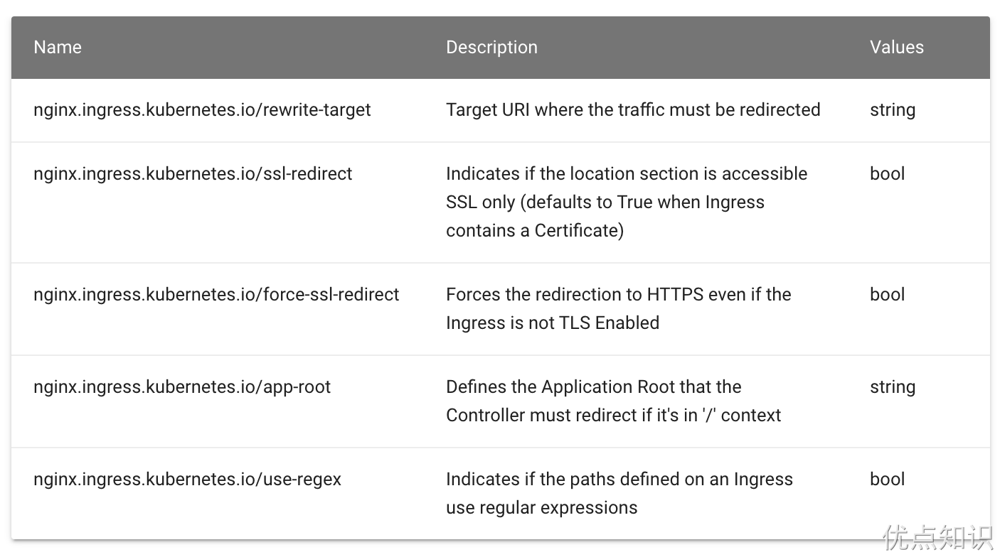
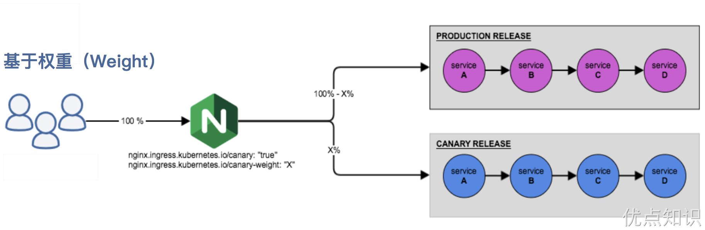
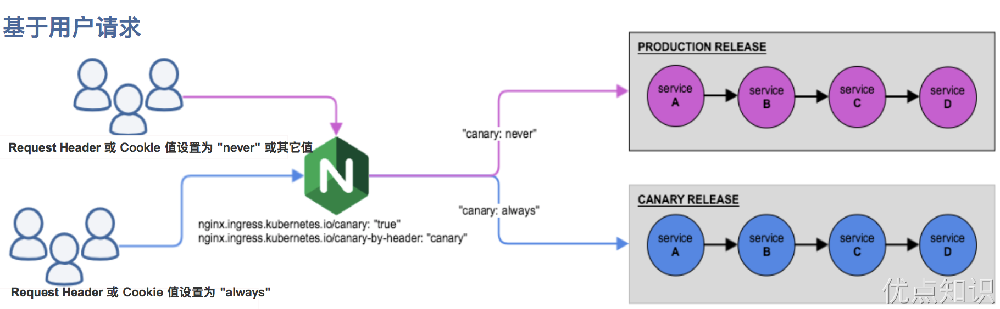

# ingress-nginx


现在我们已经安装了 ingress-nginx，并可以通过 LoadBalancer 负载均衡器来暴露其服务了，那么接下来我们就来了解下 ingress-nginx 的一些具体配置使用，要进行一些自定义配置，有几种方式可以实现：使用 Configmap 在 Nginx 中设置全局配置、通过 Ingress 的 Annotations 设置特定 Ingress 的规则、自定义模板。
```sh
[root@master ingress-nginx]# kubectl get svc ingress-nginx-controller -n ingress-nginx
NAME                       TYPE           CLUSTER-IP       EXTERNAL-IP      PORT(S)                      AGE
ingress-nginx-controller   LoadBalancer   10.101.202.226   192.168.220.10   80:31209/TCP,443:31672/TCP   46s
```
接下来我们用于测试的应用都使用下面的 nginx 应用：
```yaml
apiVersion: apps/v1
kind: Deployment
metadata:
  name: nginx
spec:
  selector:
    matchLabels:
      app: nginx
  template:
    # pod 模板
    metadata:
      labels:
        app: nginx
    spec:
      containers:
        - name: app
          image: nginx
          # 该应用进程暴露的是80端口
          ports:
            - containerPort: 80
---
apiVersion: v1
kind: Service
metadata:
  name: nginx
spec:
  selector:
    app: nginx
  ports:
    - name: http
      port: 80 # 这个是Service的端口
```

# Basic Auth
我们可以在 Ingress 对象上配置一些基本的 Auth 认证，比如 Basic Auth，可以用 htpasswd 生成一个密码文件来验证身份验证。
```sh
[root@master ingress-nginx]# htpasswd -c auth foo
New password:
Re-type new password:
Adding password for user foo
[root@master ingress-nginx]# ll
total 8
-rw-r--r-- 1 root root  42 Mar  8 05:12 auth
[root@master ingress-nginx]# cat auth
foo:$apr1$/xHCKjZO$1WqG6uLiBRJ7daZmLpSsi0
```
然后根据上面的 auth 文件创建一个 secret 对象：
```sh
[root@master ingress-nginx]# kubectl create secret generic basic-auth --from-file=auth
secret/basic-auth created
[root@master ingress-nginx]# kubectl get secret basic-auth -oyaml
apiVersion: v1
data:
  auth: Zm9vOiRhcHIxJC94SENLalpPJDFXcUc2dUxpQlJKN2RhWm1McFNzaTAK
kind: Secret
metadata:
  creationTimestamp: "2024-03-08T10:13:35Z"
  name: basic-auth
  namespace: default
  resourceVersion: "2225715"
  uid: daed36e9-2362-4096-aabf-b0aa628b3890
type: Opaque
[root@master ingress-nginx]# echo "Zm9vOiRhcHIxJC94SENLalpPJDFXcUc2dUxpQlJKN2RhWm1McFNzaTAK" | base64 -d
foo:$apr1$/xHCKjZO$1WqG6uLiBRJ7daZmLpSsi0
```
然后对上面的 my-nginx 应用创建一个具有 Basic Auth 的 Ingress 对象：
```yaml
# ingress-basic-auth.yaml
apiVersion: networking.k8s.io/v1
kind: Ingress
metadata:
  name: ingress-with-auth
  namespace: default
  annotations:
    # 认证类型
    nginx.ingress.kubernetes.io/auth-type: basic
    # 包含 user/password 定义的 secret 对象名
    nginx.ingress.kubernetes.io/auth-secret: basic-auth
    # 要显示的带有适当上下文的消息，说明需要身份验证的原因
    nginx.ingress.kubernetes.io/auth-realm: "Authentication Required - foo"
spec:
  ingressClassName: nginx # 使用 nginx 的 IngressClass（关联的 ingress-nginx 控制器）
  rules:
    - host: bauth.192.168.220.10.nip.io
      http:
        paths:
          - path: /
            pathType: Prefix
            backend:
              service:
                # 将所有请求发送到 nginx 服务的 80 端口
                name: nginx
                port:
                  number: 80
```
直接创建上面的资源对象，然后通过下面的命令或者在浏览器中直接打开配置的域名：
```sh
[root@node1 ~]# kubectl get ingress ingress-with-auth
NAME                CLASS   HOSTS                         ADDRESS          PORTS   AGE
ingress-with-auth   nginx   bauth.192.168.220.10.nip.io   192.168.220.10   80      6m53s
[root@node1 ~]# curl -v http://bauth.192.168.220.10.nip.io
* About to connect() to bauth.192.168.220.10.nip.io port 80 (#0)
*   Trying 192.168.220.10...
* Connected to bauth.192.168.220.10.nip.io (192.168.220.10) port 80 (#0)
> GET / HTTP/1.1
> User-Agent: curl/7.29.0
> Host: bauth.192.168.220.10.nip.io
> Accept: */*
>
< HTTP/1.1 401 Unauthorized
< Date: Sat, 09 Mar 2024 01:51:13 GMT
< Content-Type: text/html
< Content-Length: 172
< Connection: keep-alive
< WWW-Authenticate: Basic realm="Authentication Required - foo"
<
<html>
<head><title>401 Authorization Required</title></head>
<body>
<center><h1>401 Authorization Required</h1></center>
<hr><center>nginx</center>
</body>
</html>
* Connection #0 to host bauth.192.168.220.10.nip.io left intact
```
我们可以看到出现了 401 认证失败错误，然后带上我们配置的用户名和密码进行认证：
```sh
[root@node1 ~]# curl -v http://bauth.192.168.220.10.nip.io -u 'foo:123456'
* About to connect() to bauth.192.168.220.10.nip.io port 80 (#0)
*   Trying 192.168.220.10...
* Connected to bauth.192.168.220.10.nip.io (192.168.220.10) port 80 (#0)
* Server auth using Basic with user 'foo'
> GET / HTTP/1.1
> Authorization: Basic Zm9vOjEyMzQ1Ng==
> User-Agent: curl/7.29.0
> Host: bauth.192.168.220.10.nip.io
> Accept: */*
>
< HTTP/1.1 200 OK
< Date: Sat, 09 Mar 2024 01:54:20 GMT
< Content-Type: text/html
< Content-Length: 615
< Connection: keep-alive
< Last-Modified: Tue, 28 Dec 2021 15:28:38 GMT
< ETag: "61cb2d26-267"
< Accept-Ranges: bytes
<
<!DOCTYPE html>
<html>
<head>
<title>Welcome to nginx!</title>
<style>
html { color-scheme: light dark; }
body { width: 35em; margin: 0 auto;
font-family: Tahoma, Verdana, Arial, sans-serif; }
</style>
</head>
<body>
<h1>Welcome to nginx!</h1>
<p>If you see this page, the nginx web server is successfully installed and
working. Further configuration is required.</p>

<p>For online documentation and support please refer to
<a href="http://nginx.org/">nginx.org</a>.<br/>
Commercial support is available at
<a href="http://nginx.com/">nginx.com</a>.</p>

<p><em>Thank you for using nginx.</em></p>
</body>
</html>
* Connection #0 to host bauth.192.168.220.10.nip.io left intact
```
可以看到已经认证成功了。除了可以使用我们自己在本地集群创建的 Auth 信息之外，还可以使用外部的 Basic Auth 认证信息，比如我们使用 https://httpbin.org 的外部 Basic Auth 认证，创建如下所示的 Ingress 资源对象：
```yaml
# ingress-basic-auth-external.yaml
apiVersion: networking.k8s.io/v1
kind: Ingress
metadata:
  name: external-auth
  namespace: default
  annotations:
    # 配置外部认证服务地址
    nginx.ingress.kubernetes.io/auth-url: https://httpbin.org/basic-auth/user/passwd
spec:
  ingressClassName: nginx
  rules:
  - host: external-bauth.192.168.220.10.nip.io
    http:
      paths:
      - path: /
        pathType: Prefix
        backend:
          service:
            name: nginx
            port:
              number: 80
```
上面的资源对象创建完成后，再进行简单的测试：
```sh
[root@master ingress-nginx]# kubectl get ingress external-auth
NAME            CLASS   HOSTS                                  ADDRESS          PORTS   AGE
external-auth   nginx   external-bauth.192.168.220.10.nip.io   192.168.220.10   80      21s
[root@master ingress-nginx]# curl -k http://external-bauth.192.168.220.10.nip.io
<html>
<head><title>401 Authorization Required</title></head>
<body>
<center><h1>401 Authorization Required</h1></center>
<hr><center>nginx</center>
</body>
</html>
```
然后使用正确的用户名和密码测试：
```sh
[root@master ingress-nginx]# curl -k http://external-bauth.192.168.220.10.nip.io -u 'user:passwd'
<!DOCTYPE html>
<html>
<head>
<title>Welcome to nginx!</title>
<style>
html { color-scheme: light dark; }
body { width: 35em; margin: 0 auto;
font-family: Tahoma, Verdana, Arial, sans-serif; }
</style>
</head>
<body>
<h1>Welcome to nginx!</h1>
<p>If you see this page, the nginx web server is successfully installed and
working. Further configuration is required.</p>

<p>For online documentation and support please refer to
<a href="http://nginx.org/">nginx.org</a>.<br/>
Commercial support is available at
<a href="http://nginx.com/">nginx.com</a>.</p>

<p><em>Thank you for using nginx.</em></p>
</body>
</html>
```
当然除了 Basic Auth 这一种简单的认证方式之外，ingress-nginx 还支持一些其他高级的认证，比如我们可以使用 GitHub OAuth 来认证 Kubernetes 的 Dashboard。

# URL Rewrite
ingress-nginx 很多高级的用法可以通过 Ingress 对象的 annotation 进行配置，比如常用的 URL Rewrite 功能。很多时候我们会将 ingress-nginx 当成网关使用，比如对访问的服务加上 /app 这样的前缀，在 nginx 的配置里面我们知道有一个 proxy_pass 指令可以实现：
```nginx
location /app/ {
  proxy_pass http://127.0.0.1/remote/;
}
```
proxy_pass 后面加了 /remote 这个路径，此时会将匹配到该规则路径中的 /app 用 /remote 替换掉，相当于截掉路径中的 /app。同样的在 Kubernetes 中使用 ingress-nginx 又该如何来实现呢？我们可以使用 rewrite-target 的注解来实现这个需求，比如现在我们想要通过 rewrite.172.18.0.10.nip.io/gateway/ 来访问到 Nginx 服务，则我们需要对访问的 URL 路径做一个 Rewrite，在 PATH 中添加一个 gateway 的前缀，关于 Rewrite 的操作在 ingress-nginx 官方文档中也给出对应的说明:


按照要求我们需要在 path 中匹配前缀 gateway，然后通过 rewrite-target 指定目标，Ingress 对象如下所示：
```yaml
# ingress-rewrite.yaml
apiVersion: networking.k8s.io/v1
kind: Ingress
metadata:
  name: rewrite
  annotations:
    nginx.ingress.kubernetes.io/rewrite-target: /$2
spec:
  ingressClassName: nginx
  rules:
    - host: rewrite.192.168.220.10.nip.io
      http:
        paths:
          - path: /gateway(/|$)(.*)
            pathType: Prefix
            backend:
              service:
                name: nginx
                port:
                  number: 80
```
更新后，我们可以预见到直接访问域名肯定是不行了，因为我们没有匹配 / 的 path 路径：
```sh
[root@master ingress-nginx]# curl rewrite.192.168.220.10.nip.io
<html>
<head><title>404 Not Found</title></head>
<body>
...
```
但是我们带上 gateway 的前缀再去访问就正常了：
```sh
[root@master ingress-nginx]# curl rewrite.192.168.220.10.nip.io/gateway
<!DOCTYPE html>
<html>
<head>
<title>Welcome to nginx!</title>
...
[root@master ingress-nginx]# curl rewrite.192.168.220.10.nip.io/gateway/
<!DOCTYPE html>
<html>
<head>
<title>Welcome to nginx!</title>
...
[root@master ingress-nginx]# curl rewrite.192.168.220.10.nip.io/gateway/index.html
<!DOCTYPE html>
<html>
<head>
<title>Welcome to nginx!</title>
...
[root@master ingress-nginx]# curl rewrite.192.168.220.10.nip.io/gateway/inde.html
<html>
<head><title>404 Not Found</title></head>
...
```
我们可以看到已经可以访问到了，这是因为我们在 path 中通过正则表达式 /gateway(/|$)(.*) 将匹配的路径设置成了 rewrite-target 的目标路径了，所以我们访问 rewrite.192.168.220.10.nip.io/gateway 的时候实际上相当于访问的就是后端服务的 / 路径。

要解决我们访问主域名出现 404 的问题，我们可以给应用设置一个 app-root 的注解，这样当我们访问主域名的时候会自动跳转到我们指定的 app-root 目录下面，如下所示：
```yaml
# ingress-rewrite2.yaml
apiVersion: networking.k8s.io/v1
kind: Ingress
metadata:
  name: rewrite
  annotations:
    nginx.ingress.kubernetes.io/app-root: /gateway/
    nginx.ingress.kubernetes.io/rewrite-target: /$2
spec:
  ingressClassName: nginx
  rules:
    - host: rewrite.192.168.220.10.nip.io
      http:
        paths:
          - path: /gateway(/|$)(.*)
            pathType: Prefix
            backend:
              service:
                name: nginx
                port:
                  number: 80
```
这个时候我们更新应用后访问主域名 rewrite.192.168.220.10.nip.io 就会自动跳转到 rewrite.192.168.220.10.nip.io/gateway/ 路径下面去了。
```sh
[root@master ingress-nginx]# curl -v  rewrite.192.168.220.10.nip.io
* About to connect() to rewrite.192.168.220.10.nip.io port 80 (#0)
*   Trying 192.168.220.10...
* Connected to rewrite.192.168.220.10.nip.io (192.168.220.10) port 80 (#0)
> GET / HTTP/1.1
> User-Agent: curl/7.29.0
> Host: rewrite.192.168.220.10.nip.io
> Accept: */*
>
< HTTP/1.1 302 Moved Temporarily
< Date: Sat, 09 Mar 2024 03:29:57 GMT
< Content-Type: text/html
< Content-Length: 138
< Connection: keep-alive
< Location: http://rewrite.192.168.220.10.nip.io/gateway/
<
<html>
<head><title>302 Found</title></head>
<body>
<center><h1>302 Found</h1></center>
<hr><center>nginx</center>
</body>
</html>
* Connection #0 to host rewrite.192.168.220.10.nip.io left intact
```
但是还有一个问题是我们的 path 路径其实也匹配了 /gateway 这样的路径，可能我们更加希望我们的应用在最后添加一个 / 这样的 slash，同样我们可以通过 configuration-snippet 配置来完成，如下 Ingress 对象：
```yaml
# ingress-rewrite3.yaml
apiVersion: networking.k8s.io/v1
kind: Ingress
metadata:
  name: rewrite
  annotations:
    nginx.ingress.kubernetes.io/app-root: /gateway/
    nginx.ingress.kubernetes.io/rewrite-target: /$2
    nginx.ingress.kubernetes.io/configuration-snippet: |
      rewrite ^(/gateway)$ $1/ redirect;
spec:
  ingressClassName: nginx
  rules:
    - host: rewrite.192.168.220.10.nip.io
      http:
        paths:
          - path: /gateway(/|$)(.*)
            pathType: Prefix
            backend:
              service:
                name: nginx
                port:
                  number: 80
```
更新后我们的应用就都会以 / 这样的 slash 结尾了，这样就完成了我们的需求，如果你原本对 nginx 的配置就非常熟悉的话应该可以很快就能理解这种配置方式了。
```sh
[root@master ingress-nginx]# curl -v  rewrite.192.168.220.10.nip.io
* About to connect() to rewrite.192.168.220.10.nip.io port 80 (#0)
*   Trying 192.168.220.10...
* Connected to rewrite.192.168.220.10.nip.io (192.168.220.10) port 80 (#0)
> GET / HTTP/1.1
> User-Agent: curl/7.29.0
> Host: rewrite.192.168.220.10.nip.io
> Accept: */*
>
< HTTP/1.1 302 Moved Temporarily
< Date: Sat, 09 Mar 2024 05:45:19 GMT
< Content-Type: text/html
< Content-Length: 138
< Connection: keep-alive
< Location: http://rewrite.192.168.220.10.nip.io/gateway/
<
<html>
<head><title>302 Found</title></head>
...
[root@master ingress-nginx]# curl -v  rewrite.192.168.220.10.nip.io/gateway
* About to connect() to rewrite.192.168.220.10.nip.io port 80 (#0)
*   Trying 192.168.220.10...
* Connected to rewrite.192.168.220.10.nip.io (192.168.220.10) port 80 (#0)
> GET /gateway HTTP/1.1
> User-Agent: curl/7.29.0
> Host: rewrite.192.168.220.10.nip.io
> Accept: */*
>
< HTTP/1.1 302 Moved Temporarily
< Date: Sat, 09 Mar 2024 05:46:09 GMT
< Content-Type: text/html
< Content-Length: 138
< Location: http://rewrite.192.168.220.10.nip.io/gateway/
< Connection: keep-alive
<
<html>
<head><title>302 Found</title></head>
<body>
<center><h1>302 Found</h1></center>
<hr><center>nginx</center>
</body>
...
[root@master ingress-nginx]# curl -v  rewrite.192.168.220.10.nip.io/gateway/
* About to connect() to rewrite.192.168.220.10.nip.io port 80 (#0)
*   Trying 192.168.220.10...
* Connected to rewrite.192.168.220.10.nip.io (192.168.220.10) port 80 (#0)
> GET /gateway/ HTTP/1.1
> User-Agent: curl/7.29.0
> Host: rewrite.192.168.220.10.nip.io
> Accept: */*
>
< HTTP/1.1 200 OK
< Date: Sat, 09 Mar 2024 05:46:29 GMT
< Content-Type: text/html
< Content-Length: 615
< Connection: keep-alive
< Last-Modified: Tue, 28 Dec 2021 15:28:38 GMT
< ETag: "61cb2d26-267"
< Accept-Ranges: bytes
<
<!DOCTYPE html>
<html>
<head>
<title>Welcome to nginx!</title>
...
```

# 灰度发布
在日常工作中我们经常需要对服务进行版本更新升级，所以我们经常会使用到滚动升级、蓝绿发布、灰度发布等不同的发布操作。而 ingress-nginx 支持通过 Annotations 配置来实现不同场景下的灰度发布和测试，可以满足金丝雀发布、蓝绿部署与 A/B 测试等业务场景。首先需要添加 `nginx.ingress.kubernetes.io/canary：true` 注解来启用 canary 功能，然后可以启用以下配置金丝雀的注解：
- `nginx.ingress.kubernetes.io/canary-by-header`：基于 Request Header 的流量切分，适用于灰度发布以及 A/B 测试。当 Request Header 设置为 always 时，请求将会被一直发送到 Canary 版本；当 Request Header 设置为 never 时，请求不会被发送到 Canary 入口；对于任何其他 Header 值，将忽略 Header，并通过优先级将请求与其他金丝雀规则进行优先级的比较。
- `nginx.ingress.kubernetes.io/canary-by-header-value`：要匹配的 Request Header 的值，用于通知 Ingress 将请求路由到 Canary Ingress 中指定的服务。当 Request Header 设置为此值时，它将被路由到 Canary 入口。该规则允许用户自定义 Request Header 的值，必须与上一个 annotation (canary-by-header) 一起使用。
- `nginx.ingress.kubernetes.io/canary-by-header-pattern`：这与 canary-by-header-value 的工作方式相同，只是它进行 PCRE 正则匹配。请注意，当设置 canary-by-header-value 时，此注解将被忽略，当给定的 Regex 在请求处理过程中导致错误时，该请求将被视为不匹配。
- `nginx.ingress.kubernetes.io/canary-weight`：基于服务权重的流量切分，适用于蓝绿部署，权重范围 0 - 100 按百分比将请求路由到 Canary Ingress 中指定的服务。权重为 0 意味着该金丝雀规则不会向 Canary 入口的服务发送任何请求，权重为 100 意味着所有请求都将被发送到 Canary 入口。
- `nginx.ingress.kubernetes.io/canary-by-cookie`：基于 cookie 的流量切分，适用于灰度发布与 A/B 测试。用于通知 Ingress 将请求路由到 Canary Ingress 中指定的服务的 cookie。当 cookie 值设置为 always 时，它将被路由到 Canary 入口；当 cookie 值设置为 never 时，请求不会被发送到 Canary 入口；对于任何其他值，将忽略 cookie 并将请求与其他金丝雀规则进行优先级的比较。
- `nginx.ingress.kubernetes.io/canary-weight-total`：流量总权重，如果未指定，则默认为 100。

> 需要注意的是金丝雀规则按优先顺序进行排序：`canary-by-header - > canary-by-cookie - > canary-weight`

总的来说可以把以上的几个 annotation 规则划分为以下两类：
- 基于权重的 Canary 规则


- 基于用户请求的 Canary 规则


下面我们通过一个示例应用来对灰度发布功能进行说明。
## 第一步 部署 Production 应用
首先创建一个 production 环境的应用资源清单：
```yaml
# production.yaml
apiVersion: apps/v1
kind: Deployment
metadata:
  name: production
  labels:
    app: production
spec:
  selector:
    matchLabels:
      app: production
  template:
    metadata:
      labels:
        app: production
    spec:
      containers:
        - name: production
          # arm架构使用该镜像：mirrorgooglecontainers/echoserver-arm:1.8
          image: mirrorgooglecontainers/echoserver:1.10
          ports:
            - containerPort: 8080
          env:
            - name: NODE_NAME
              valueFrom:
                fieldRef:
                  fieldPath: spec.nodeName
            - name: POD_NAME
              valueFrom:
                fieldRef:
                  fieldPath: metadata.name
            - name: POD_NAMESPACE
              valueFrom:
                fieldRef:
                  fieldPath: metadata.namespace
            - name: POD_IP
              valueFrom:
                fieldRef:
                  fieldPath: status.podIP
---
apiVersion: v1
kind: Service
metadata:
  name: production
  labels:
    app: production
spec:
  ports:
    - port: 80
      targetPort: 8080
      name: http
  selector:
    app: production
```
然后创建一个用于 production 环境访问的 Ingress 资源对象：
```yaml
# production-ingress.yaml
apiVersion: networking.k8s.io/v1
kind: Ingress
metadata:
  name: production
spec:
  ingressClassName: nginx
  rules:
    - host: echo.192.168.220.10.nip.io
      http:
        paths:
          - path: /
            pathType: Prefix
            backend:
              service:
                name: production
                port:
                  number: 80
```
直接创建上面的几个资源对象：
```sh
[root@master ingress-nginx]# kubectl apply -f production.yaml
deployment.apps/production created
service/production created
[root@master ingress-nginx]# kubectl apply -f production-ingress.yaml
ingress.networking.k8s.io/production created
[root@master ingress-nginx]# kubectl get pod -l app=production
NAME                          READY   STATUS    RESTARTS   AGE
production-846769889f-zdn67   1/1     Running   0          2m41s
[root@master ingress-nginx]# kubectl get ingress production
NAME         CLASS   HOSTS                        ADDRESS          PORTS   AGE
production   nginx   echo.192.168.220.10.nip.io   192.168.220.10   80      2m47s
```
应用部署成功后即可正常访问应用：
```sh
[root@master ingress-nginx]# curl http://echo.192.168.220.10.nip.io

Hostname: production-846769889f-zdn67

Pod Information:
        node name:      node2
        pod name:       production-846769889f-zdn67
        pod namespace:  default
        pod IP: 10.244.2.71

Server values:
        server_version=nginx: 1.13.3 - lua: 10008

Request Information:
        client_address=10.244.1.122
        method=GET
        real path=/
        query=
        request_version=1.1
        request_scheme=http
        request_uri=http://echo.192.168.220.10.nip.io:8080/

Request Headers:
        accept=*/*
        host=echo.192.168.220.10.nip.io
        user-agent=curl/7.29.0
        x-forwarded-for=10.244.0.0
        x-forwarded-host=echo.192.168.220.10.nip.io
        x-forwarded-port=80
        x-forwarded-proto=http
        x-forwarded-scheme=http
        x-real-ip=10.244.0.0
        x-request-id=496d83ffdfa7276577f8aa9a03372c2e
        x-scheme=http

Request Body:
        -no body in request-
```

## 第二步 创建 Canary 版本
参考将上述 Production 版本的 production.yaml 文件，再创建一个 Canary 版本的应用。
```yaml
# canary.yaml
apiVersion: apps/v1
kind: Deployment
metadata:
  name: canary
  labels:
    app: canary
spec:
  selector:
    matchLabels:
      app: canary
  template:
    metadata:
      labels:
        app: canary
    spec:
      containers:
        - name: canary
          image: mirrorgooglecontainers/echoserver:1.10
          ports:
            - containerPort: 8080
          env:
            - name: NODE_NAME
              valueFrom:
                fieldRef:
                  fieldPath: spec.nodeName
            - name: POD_NAME
              valueFrom:
                fieldRef:
                  fieldPath: metadata.name
            - name: POD_NAMESPACE
              valueFrom:
                fieldRef:
                  fieldPath: metadata.namespace
            - name: POD_IP
              valueFrom:
                fieldRef:
                  fieldPath: status.podIP
---
apiVersion: v1
kind: Service
metadata:
  name: canary
  labels:
    app: canary
spec:
  ports:
    - port: 80
      targetPort: 8080
      name: http
  selector:
    app: canary
```
接下来就可以通过配置 Annotation 规则进行流量切分了。

## 第三步 Annotation 规则配置
1. **基于权重**：基于权重的流量切分的典型应用场景就是蓝绿部署，可通过将权重设置为 0 或 100 来实现。例如，可将 Green 版本设置为主要部分，并将 Blue 版本的入口配置为 Canary。最初，将权重设置为 0，因此不会将流量代理到 Blue 版本。一旦新版本测试和验证都成功后，即可将 Blue 版本的权重设置为 100，即所有流量从 Green 版本转向 Blue。

创建一个基于权重的 Canary 版本的应用路由 Ingress 对象。
```yaml
# canary-ingress.yaml
apiVersion: networking.k8s.io/v1
kind: Ingress
metadata:
  name: canary
  annotations:
    nginx.ingress.kubernetes.io/canary: "true" # 要开启灰度发布机制，首先需要启用 Canary
    nginx.ingress.kubernetes.io/canary-weight: "30" # 分配30%流量到当前Canary版本
spec:
  ingressClassName: nginx
  rules:
    - host: echo.192.168.220.10.nip.io
      http:
        paths:
          - path: /
            pathType: Prefix
            backend:
              service:
                name: canary
                port:
                  number: 80
```
直接创建上面的资源对象即可：
```sh
[root@master ingress-nginx]# kubectl apply -f canary.yaml
deployment.apps/canary created
service/canary created
[root@master ingress-nginx]# kubectl apply -f canary-ingress.yaml
ingress.networking.k8s.io/canary created
[root@master ingress-nginx]# kubectl get pods -owide
NAME                          READY   STATUS    RESTARTS   AGE   IP             NODE    NOMINATED NODE   READINESS 
canary-58dc8b498f-572wl       1/1     Running   0          34s   10.244.1.124   node1   <none>           <none>
production-846769889f-zdn67   1/1     Running   0          21m   10.244.2.71    node2   <none>           <none>
[root@master ingress-nginx]# kubectl get svc -owide
NAME         TYPE        CLUSTER-IP    EXTERNAL-IP   PORT(S)   AGE   SELECTOR
canary       ClusterIP   10.109.58.9   <none>        80/TCP    41s   app=canary
kubernetes   ClusterIP   10.96.0.1     <none>        443/TCP   18d   <none>
production   ClusterIP   10.98.188.9   <none>        80/TCP    22m   app=production
[root@master ingress-nginx]# kubectl get ingress
NAME         CLASS   HOSTS                        ADDRESS          PORTS   AGE
canary       nginx   echo.192.168.220.10.nip.io   192.168.220.10   80      79s
production   nginx   echo.192.168.220.10.nip.io   192.168.220.10   80      22m
```
Canary 版本应用创建成功后，接下来我们在命令行终端中来不断访问这个应用，观察 Hostname 变化：
```sh
[root@master ingress-nginx]# for i in $(seq 1 10); do curl -s echo.192.168.220.10.nip.io | grep "Hostname"; done
Hostname: production-846769889f-zdn67
Hostname: production-846769889f-zdn67
Hostname: production-846769889f-zdn67
Hostname: canary-58dc8b498f-572wl
Hostname: production-846769889f-zdn67
Hostname: canary-58dc8b498f-572wl
Hostname: production-846769889f-zdn67
Hostname: production-846769889f-zdn67
Hostname: production-846769889f-zdn67
Hostname: production-846769889f-zdn67
```
由于我们给 Canary 版本应用分配了 30% 左右权重的流量，所以上面我们访问 10 次有 3 次（不是一定）访问到了 Canary 版本的应用，符合我们的预期。
2. **基于 Request Header**: 基于 Request Header 进行流量切分的典型应用场景即灰度发布或 A/B 测试场景。

在上面的 Canary 版本的 Ingress 对象中新增一条 annotation 配置 `nginx.ingress.kubernetes.io/canary-by-header: canary`（这里的 value 可以是任意值），使当前的 Ingress 实现基于 Request Header 进行流量切分，由于 canary-by-header 的优先级大于 canary-weight，所以会忽略原有的 canary-weight 的规则。
```yaml
annotations:
  nginx.ingress.kubernetes.io/canary: "true"  # 要开启灰度发布机制，首先需要启用 Canary
  nginx.ingress.kubernetes.io/canary-by-header: canary  # 基于header的流量切分
  nginx.ingress.kubernetes.io/canary-weight: "30" # 会被忽略，因为配置了 canary-by-header
# headerCanary版本
```
更新上面的 Ingress 资源对象后，我们在请求中加入不同的 Header 值，再次访问应用的域名。

> 注意：当 Request Header 设置为 never 或 always 时，请求将 不会 或者 一直 被发送到 Canary 版本，对于任何其他 Header 值，将忽略 Header，并通过优先级将请求与其他 Canary 规则进行优先级的比较。

```sh
[root@master ingress-nginx]# for i in $(seq 1 10); do curl -s -H "canary: never" echo.192.168.220.10.nip.io | grep "Hostname"; done
Hostname: production-846769889f-zdn67
Hostname: production-846769889f-zdn67
Hostname: production-846769889f-zdn67
Hostname: production-846769889f-zdn67
Hostname: production-846769889f-zdn67
Hostname: production-846769889f-zdn67
Hostname: production-846769889f-zdn67
Hostname: production-846769889f-zdn67
Hostname: production-846769889f-zdn67
Hostname: production-846769889f-zdn67
```
这里我们在请求的时候设置了 canary: never 这个 Header 值，所以请求没有发送到 Canary 应用中去。如果设置为其他值呢：
```sh
[root@master ingress-nginx]# for i in $(seq 1 10); do curl -s -H "canary: other-value" echo.192.168.220.10.nip.io | grep "Hostname"; done
Hostname: production-846769889f-zdn67
Hostname: production-846769889f-zdn67
Hostname: production-846769889f-zdn67
Hostname: production-846769889f-zdn67
Hostname: canary-58dc8b498f-572wl
Hostname: canary-58dc8b498f-572wl
Hostname: production-846769889f-zdn67
Hostname: production-846769889f-zdn67
Hostname: canary-58dc8b498f-572wl
Hostname: production-846769889f-zdn67
```
由于我们请求设置的 Header 值为 `canary: other-value`，所以 ingress-nginx 会通过优先级将请求与其他 Canary 规则进行优先级的比较，我们这里也就会进入 `canary-weight: "30"` 这个规则去。

这个时候我们可以在上一个 annotation (即 canary-by-header）的基础上添加一条 `nginx.ingress.kubernetes.io/canary-by-header-value: user-value` 这样的规则，就可以将请求路由到 Canary Ingress 中指定的服务了。
```yaml
  annotations:
    nginx.ingress.kubernetes.io/canary: "true" # 要开启灰度发布机制，首先需要启用 Canary
    nginx.ingress.kubernetes.io/canary-weight: "30" # 分配30%流量到当前Canary版本
    nginx.ingress.kubernetes.io/canary-by-header: canary  # 基于header的流量切分
    nginx.ingress.kubernetes.io/canary-by-header-value: user-value
```
同样更新 Ingress 对象后，重新访问应用，当 Request Header 满足 canary: user-value时，所有请求就会被路由到 Canary 版本：
```sh
[root@master ingress-nginx]# for i in $(seq 1 10); do curl -s -H "canary: user-value" echo.192.168.220.10.nip.io | grep "Hostname"; done
Hostname: canary-58dc8b498f-572wl
Hostname: canary-58dc8b498f-572wl
Hostname: canary-58dc8b498f-572wl
Hostname: canary-58dc8b498f-572wl
Hostname: canary-58dc8b498f-572wl
Hostname: canary-58dc8b498f-572wl
Hostname: canary-58dc8b498f-572wl
Hostname: canary-58dc8b498f-572wl
Hostname: canary-58dc8b498f-572wl
Hostname: canary-58dc8b498f-572wl
```
3. **基于 Cookie**：与基于 Request Header 的 annotation 用法规则类似。例如在 A/B 测试场景下，需要让地域为北京的用户访问 Canary 版本。那么当 cookie 的 annotation 设置为 `nginx.ingress.kubernetes.io/canary-by-cookie: "users_from_Beijing"`，此时后台可对登录的用户请求进行检查，如果该用户访问源来自北京则设置 cookie users_from_Beijing 的值为 always，这样就可以确保北京的用户仅访问 Canary 版本。

同样我们更新 Canary 版本的 Ingress 资源对象，采用基于 Cookie 来进行流量切分，
```yaml
  annotations:
    nginx.ingress.kubernetes.io/canary: "true" # 要开启灰度发布机制，首先需要启用 Canary
    nginx.ingress.kubernetes.io/canary-weight: "30" # 分配30%流量到当前Canary版本
    nginx.ingress.kubernetes.io/canary-by-cookie: "users_from_Beijing" # 基于 cookie
```
更新上面的 Ingress 资源对象后，我们在请求中设置一个 `users_from_Beijing=always` 的 Cookie 值，再次访问应用的域名。
```sh
[root@master ingress-nginx]# for i in $(seq 1 10); do curl -s -b "users_from_Beijing=always" echo.192.168.220.10.nip.io | grep "Hostname"; done
Hostname: canary-58dc8b498f-572wl
Hostname: canary-58dc8b498f-572wl
Hostname: canary-58dc8b498f-572wl
Hostname: canary-58dc8b498f-572wl
Hostname: canary-58dc8b498f-572wl
Hostname: canary-58dc8b498f-572wl
Hostname: canary-58dc8b498f-572wl
Hostname: canary-58dc8b498f-572wl
Hostname: canary-58dc8b498f-572wl
Hostname: canary-58dc8b498f-572wl
```
我们可以看到应用都被路由到了 Canary 版本的应用中去了，如果我们将这个 Cookie 值设置为 never，则不会路由到 Canary 应用中。

# HTTPS
如果我们需要用 HTTPS 来访问我们这个应用的话，就需要监听 443 端口了，同样用 HTTPS 访问应用必然就需要证书，这里我们用 openssl 来创建一个自签名的证书：
```sh
openssl req -x509 -nodes -days 365 -newkey rsa:2048 -keyout tls.key -out tls.crt -subj "/CN=foo.bar.com"
```
然后通过 Secret 对象来引用证书文件：
```sh
# 要注意证书文件名称必须是 tls.crt 和 tls.key
☸ ➜ kubectl create secret tls foo-tls --cert=tls.crt --key=tls.key
secret/who-tls created
```
这个时候我们就可以创建一个 HTTPS 访问应用的：
```yaml
apiVersion: networking.k8s.io/v1
kind: Ingress
metadata:
  name: ingress-with-auth
  annotations:
    # 认证类型
    nginx.ingress.kubernetes.io/auth-type: basic
    # 包含 user/password 定义的 secret 对象名
    nginx.ingress.kubernetes.io/auth-secret: basic-auth
    # 要显示的带有适当上下文的消息，说明需要身份验证的原因
    nginx.ingress.kubernetes.io/auth-realm: "Authentication Required - foo"
spec:
  ingressClassName: nginx
  tls:
    # 配置 tls 证书
    - hosts:
        - foo.bar.com
      secretName: foo-tls
  rules:
    - host: foo.bar.com
      http:
        paths:
          - path: /
            pathType: Prefix
            backend:
              service:
                name: nginx
                port:
                  number: 80
```
测试
```sh
# 1. 部署ingress： kubectl apply -f ingress-with-auth.yaml

# 2. curl -v -k --user username:password https://foo.bar.com
# -v 开启了详细模式，它会显示发送和接收到的所有消息，包括 TLS 握手。
# -k 允许 curl 连接不受信任的 SSL 证书，适用于自签名证书情况。在生产环境中，应该使用有效的证书并省略 -k 参数。
# --user 指定了 HTTP 基本认证的用户名和密码。
# 选项 -k 或 --insecure 仅告诉 curl 跳过证书的信任链验证，这意味着 curl 不会检查证书是否由受信任的证书颁发机构签发。但是，TLS 握手仍然会发生，数据传输仍然是通过加密通道进行的。
```

除了自签名证书或者购买正规机构的 CA 证书之外，我们还可以通过一些工具来自动生成合法的证书，cert-manager 是一个云原生证书管理开源项目，可以用于在 Kubernetes 集群中提供 HTTPS 证书并自动续期，支持 `Let's Encrypt/HashiCorp/Vault` 这些免费证书的签发。在 Kubernetes 中，可以通过 Kubernetes Ingress 和 Let's Encrypt 实现外部服务的自动化 HTTPS。