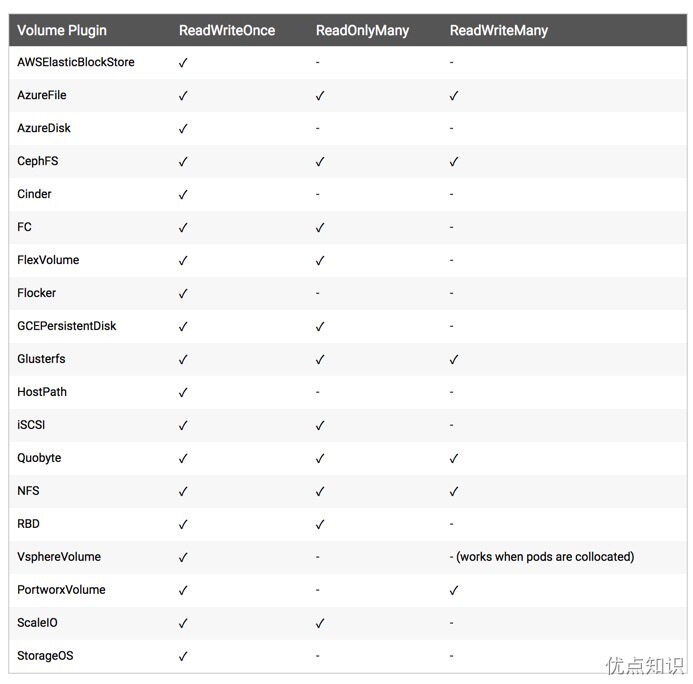

# 本地存储
前面我们有通过 hostPath 或者 emptyDir 的方式来持久化我们的数据，但是显然我们还需要更加可靠的存储来保存应用的持久化数据，这样容器在重建后，依然可以使用之前的数据。但是存储资源和 CPU 资源以及内存资源有很大不同，为了屏蔽底层的技术实现细节，让用户更加方便的使用，Kubernetes 便引入了 PV 和 PVC 两个重要的资源对象来实现对存储的管理。

# 概念
PV 的全称是：PersistentVolume（持久化卷），是对底层共享存储的一种抽象，PV 由管理员进行创建和配置，它和具体的底层共享存储技术的实现方式有关，比如 Ceph、GlusterFS、NFS、hostPath 等，都是通过插件机制完成与共享存储的对接。

PVC 的全称是：PersistentVolumeClaim（持久化卷声明），PVC 是用户存储的一种声明。对于真正使用存储的用户不需要关心底层的存储实现细节，只需要直接使用 PVC 即可。

但是通过 PVC 请求到一定的存储空间也很有可能不足以满足应用对于存储设备的各种需求，因为不同的应用程序对于存储性能的要求可能也不尽相同，比如读写速度、并发性能等，为了解决这一问题，Kubernetes 又为我们引入了一个新的资源对象：StorageClass，通过 StorageClass 的定义，管理员可以将存储资源定义为某种类型的资源，比如快速存储、慢速存储等，用户根据 StorageClass 的描述就可以非常直观的知道各种存储资源的具体特性了，这样就可以根据应用的特性去申请合适的存储资源了，此外 StorageClass 还可以为我们自动生成 PV，免去了每次手动创建的麻烦。

## PV与PVC绑定关系
在 Kubernetes 中，PersistentVolume (PV) 和 PersistentVolumeClaim (PVC) 之间的绑定关系是一对一的。这意味着每个 PV 只能被一个 PVC 绑定，而每个 PVC 只能绑定到一个 PV。

这个绑定过程如下：

1. 管理员创建一个 PV，声明存储资源的大小、访问模式、存储类型等属性。
2. 用户创建一个 PVC，声明所需存储资源的要求，包括大小、访问模式等。
3. Kubernetes 控制器会自动匹配并绑定一个满足 PVC 要求的 PV。
4. 一旦一个 PV 和 PVC 绑定，这个 PV 就被认为是 "被声明" 的，并且不会再被其他 PVC 使用。

如果 PVC 的请求无法被当前可用的 PV 满足，PVC 将会处于一个等待绑定的状态，直到有合适的 PV 可用。同样的，如果没有 PVC 请求与某个 PV 匹配，那么该 PV 将保持一个可用（未绑定）状态，直到有合适的 PVC 创建出来。

当 PVC 被删除时，根据 PV 的回收策略，PV 可能会被删除、保留或回收（清除数据后变为可用状态以供其他 PVC 使用）。这个回收策略是在 PV 定义中指定的，可以是 `Retain`、`Delete` 或 `Recycle`。

这种一对一的绑定机制保证了存储资源的独占性和隔离性，不同的应用可以安全地使用各自的存储空间，而不必担心由于共享存储导致的潜在数据冲突。

## PV回收策略
当一个 PersistentVolumeClaim (PVC) 被删除时，与之关联的 PersistentVolume (PV) 将根据其在定义中的回收策略 (reclaim policy) 被处理。Kubernetes 中的 PV 回收策略决定了在 PVC 被删除后 PV 的命运。以下是 PV 回收策略的三种类型：

1. `Retain`:
    - 保留策略意味着当 PVC 被删除时，PV 不会自动删除。相反，PV 会保持释放状态，但其数据会保留，并且不会被 Kubernetes 自动清理或回收。管理员必须手动处理这些释放的 PV —— 可以手动删除 PV 的数据并对其进行回收，或者可以重新将其绑定到新的 PVC。

2. `Delete`:
    - 删除策略表示当 PVC 被删除时，与之关联的 PV 也会自动删除。对于像 AWS EBS、Azure Disk 或 GCE PD 这样的云存储，这意味着底层存储卷也会被删除。这项策略通常用于动态供应的存储，其中存储的生命周期严格跟随 PV/PVC。

3. `Recycle`:
    - **注意**: `Recycle` 策略已经在 Kubernetes 1.5 以后的版本中弃用，不建议使用，并且在未来版本中可能会被移除。
    - 回收策略会在 PVC 被删除后清除 PV 中的数据，使得 PV 可以被其他 PVC 重新使用。这个过程涉及到执行一个删除操作，例如运行 `rm -rf /thevolume/*`，确保 PV 中的数据被清理。在清理完成之后，PV 会变回到 `Available` 状态，以便被新的 PVC 绑定和使用。
    
在 Kubernetes 中，推荐使用 `Retain` 或 `Delete` 策略，因为 `Recycle` 是一个较老的、不建议使用的选项。

这个回收策略属性是在 PV 对象的 `persistentVolumeReclaimPolicy` 字段中设置的。管理员在创建 PV 时需要选择合适的策略，以便在 PVC 被删除时能够按照预期处理 PV。

例如，如果你希望在 PVC 被删除后能够保留数据进一步分析或备份，你应该选择 `Retain` 策略。如果你希望自动清理资源并且不担心数据的持久性，那么 `Delete` 策略可能是更合适的选择。

## PV状态
Kubernetes 中的 PersistentVolume (PV) 在其生命周期中可能会处于不同的状态。以下是 PV 的主要状态及其含义：

1. **Available (可用)**:
    - 这个状态表示 PV 已经创建并可用，但尚未被任何 PVC 绑定。换句话说，它是未被声明的空闲资源。在这个状态下，PV 等待与兼容的 PVC 绑定。

2. **Bound (已绑定)**:
    - 当 PV 被 PVC 绑定后，它的状态会变为 Bound。这意味着 PV 已经被一个特定的 PVC 占用，并且已经在使用中或准备好被 Pod 使用。

3. **Released (已释放)**:
    - 当绑定到 PV 的 PVC 被删除，但 PV 本身尚未被清理或回收时，PV 的状态会变为 Released。在这个状态下，PV 的数据仍然存在，但它不再被一个 PVC 绑定。管理员可以根据 PV 的回收策略对其进行回收、保留或删除操作。

4. **Failed (失败)**:
    - 如果回收或删除操作失败，PV 的状态可能会变为 Failed。这表示尝试回收或删除 PV 时出现了问题。PV 处于此状态时需要管理员手动干预，检查问题并解决。一旦问题被解决，PV 可能需要手动更改状态，使其重新变为可用或其他状态。

通常情况下，PV 的状态流转如下：
- 当 PV 被创建时，它首先处于 Available 状态。
- 当有兼容的 PVC 请求时，PV 与之绑定，状态变为 Bound。
- 当绑定的 PVC 被删除时，PV 根据其回收策略处理。如果策略是 Retain，则 PV 变为 Released 状态，并等待管理员的进一步操作。如果策略是 Delete，则 Kubernetes 会尝试删除 PV，如果成功，则 PV 资源不再存在；如果失败，则 PV 可能处于 Failed 状态。

管理 PV 和 PVC 的整个过程需要管理员对 Kubernetes 中的存储配置有清晰的理解，以确保资源能够根据预期被正确地分配、使用和释放。

## PV的Released状态
当一个 PersistentVolume (PV) 处于 `Released` 状态时，意味着之前绑定的 PersistentVolumeClaim (PVC) 已经被删除，但是 PV 没有进一步的清理，因此它不会自动地重新绑定到新的 PVC。这是因为 PV 中可能仍包含先前 PVC 留下的敏感数据，直接重新使用可能会导致数据泄露或其他安全问题。

在 `Released` 状态下，管理员需要根据 PV 的 `persistentVolumeReclaimPolicy` 决定如何处理这个 PV。有几种处理方式：

- 如果回收策略是 `Retain`，那么 PV 保持 `Released` 状态，管理员需要手动介入，清理数据并决定何时让这个 PV 可用于新的 PVC。
- 如果回收策略是 `Delete`，Kubernetes 会尝试自动删除 PV 和底层的存储资源。如果删除成功，PV 会从 Kubernetes 集群中消失。
- 如果回收策略是 `Recycle`（在新版本的 Kubernetes 中，这个选项已被弃用），Kubernetes 将尝试清除 PV 上的数据并将其置为 `Available` 状态，此时 PV 可以被新的 PVC 绑定。

如果管理员希望让 `Released` 状态的 PV 重新可用，需要手动介入进行数据清理和资源回收。一种方法是直接删除 PV，然后根据需要创建新的 PV。另一种方法是将 PV 的状态手动更改为 `Available`，但在此之前，应确保数据已被清除，以避免潜在的数据泄露问题。自动数据清理通常不会在 `Retain` 策略下执行，需要管理员手动进行。

因此，在 `Released` 状态下，PV 需要额外的处理步骤才能重新绑定到 PVC。管理员的处理方式取决于组织的政策、安全标准以及对数据的清理和保护要求。

## StorageClass


# hostPath
我们上面提到了 PV 是对底层存储技术的一种抽象，PV 一般都是由管理员来创建和配置的，我们首先来创建一个 hostPath 类型的 PersistentVolume。Kubernetes 支持 hostPath 类型的 PersistentVolume 使用节点上的文件或目录来模拟网络存储资源，但是需要注意在生产集群中，我们不会使用 hostPath，集群管理员会提供网络存储资源，比如 NFS 共享卷或 Ceph 存储卷，集群管理员还可以使用 StorageClasses 来设置动态提供存储。因为 Pod 并不是始终固定在某个节点上面的，所以要使用 hostPath 的话我们就需要将 Pod 固定在某个节点上，这样显然就大大降低了应用的容错性。

比如我们这里将测试的应用固定在节点 node1 上面，首先在该节点上面创建一个 `/data/k8s/test/hostpath` 目录，然后在该目录中创建一个 `index.html` 的文件：
```sh
[root@node1 ~]# mkdir -p /data/k8s/test/hostpath
[root@node1 ~]# echo 'Hello from Kubernetes hostpath storage' > /data/k8s/test/hostpath/index.html
```
然后接下来创建一个 hostPath 类型的 PV 资源对象：
```yaml
# pv-hostpath.yaml
apiVersion: v1
kind: PersistentVolume
metadata:
  name: pv-hostpath
  labels:
    type: local
spec:
  storageClassName: manual
  capacity:
    storage: 10Gi
  accessModes:
    - ReadWriteOnce
  hostPath:
    path: "/data/k8s/test/hostpath"
```
配置文件中指定了该卷位于集群节点上的 `/data/k8s/test/hostpath` 目录，还指定了 10G 大小的空间和 ReadWriteOnce 的访问模式，这意味着该卷可以在单个节点上以读写方式挂载，另外还定义了名称为 manual 的 StorageClass，该名称用来将 PersistentVolumeClaim 请求绑定到该 PersistentVolum。下面是关于 PV 的这些配置属性的一些说明：
- Capacity（存储能力）：一般来说，一个 PV 对象都要指定一个存储能力，通过 PV 的 capacity 属性来设置的，目前只支持存储空间的设置，就是我们这里的 storage=10Gi，不过未来可能会加入 IOPS、吞吐量等指标的配置。

## AccessModes
不是所有类型的 PersistentVolume (PV) 都支持所有的 accessModes。accessModes 的支持由底层存储系统决定，因此不同的存储解决方案可能会支持不同的访问模式。

例如，本地磁盘存储（如 hostPath 或 local 卷）可能只支持 ReadWriteOnce 模式，因为它们通常只能由单个节点访问。另一方面，像 NFS 或者某些云提供商的存储解决方案（如 AWS Elastic File System 或 Google Cloud Filestore），可以支持 ReadWriteMany 或 ReadOnlyMany，允许多个节点同时访问同一个卷。

为了确定特定类型的 PV 支持哪些 accessModes，您需要查看该存储系统的文档或者 Kubernetes 存储类的描述。在确定存储需求时，了解您的存储后端支持的 accessModes 是很重要的，因为这将影响您的应用架构和 Pod 可以如何使用存储资源。

### ReadWriteOnce（RWO）
通过一个具体的例子来说明 `ReadWriteOnce`（RWO）访问模式的含义。

假设你有一个 Kubernetes 集群，它由三个节点组成：Node1、Node2 和 Node3。你按照提供的 `pv-hostpath.yaml` 创建了一个 `ReadWriteOnce` 访问模式的 PersistentVolume（PV）。这个 PV 对应的宿主机路径是 `/data/k8s/test/hostpath`。

现在，假设你创建了两个 PersistentVolumeClaim（PVC），它们都需要和此 PV 绑定。并且，你有两个不同的 Pod，每个 Pod 都想通过自己的 PVC 来使用这个 PV：
- Pod1 在 Node1 上运行，并通过 PVC1 请求存储。
- Pod2 在 Node2 上运行，并通过 PVC2 请求存储。

由于 PV 的访问模式是 `ReadWriteOnce`，这意味着这个 PV 在任何时候只能被**一个节点**上的**一个 Pod**以读写方式挂载。因此，以下是可能发生的情况：
1. PVC1 成功和 PV 绑定，并且 Pod1 在 Node1 上挂载了这个 PV 来读写数据。此时，PV 正在被 Node1 使用。
2. 然后，PVC2 也尝试和这个 PV 绑定。但是，因为 PV 已经被 Node1 上的 Pod1 以读写方式挂载，所以 PVC2 无法成功绑定，Pod2 不能挂载这个 PV。Pod2 需要等待直到 Pod1 不再使用这个 PV，PV 才能被 Node2 上的 Pod2 使用。

这就是 `ReadWriteOnce` 访问模式的限制：一个 PV 只能被一个节点上的一个 Pod 以读写方式使用，直到它被释放，此后它才能被其他节点上的 Pod 使用。

在实践中，通常会为每个需要持久存储的 Pod 单独创建一个 PVC，这样每个 Pod 都有自己的 PV，以避免不同 Pod 之间的存储访问冲突。如果需要多个 Pod 同时读写同一个存储卷，就需要使用 `ReadWriteMany`（RWX）或者其他支持共享访问的存储解决方案。

在 ReadWriteOnce 模式下，限制的是 PV 不能同时被多个 Node 上的 Pod 挂载。但如果这些 Pod 都位于同一个 Node 上，那么它们实际上是在同一个物理主机上进行操作，因此不会违反 ReadWriteOnce 模式的限制。这允许一个 Node 上的多个 Pod 共享同一个 PV。

以下是一个简单的例子，用于说明在同一个 Node 上的不同 Pod 使用同一个 PVC：
1. 创建一个 ReadWriteOnce 访问模式的 PVC。
2. 创建多个 Pod，这些 Pod 在其定义中指定了对上述 PVC 的挂载需求。
3. 确保这些 Pod 都被调度到同一个 Node 上（这可以通过节点亲和性规则或其他调度约束来实现）。
4. 这些 Pod 将能够共享 PVC 提供的存储资源，进行读取和写入操作。

### ReadOnlyMany（ROX）
这种模式允许一个 PV 被集群中的多个节点上的多个 Pod 同时以只读方式挂载。ReadOnlyMany 模式适用于共享数据，但不需要写入权限的场景。

并非所有存储解决方案都支持 ReadOnlyMany 访问模式。支持 ReadOnlyMany 的存储通常包括分布式文件系统（如 NFS）和某些云存储服务（如 AWS EBS、Google Persistent Disk，在特定配置下可以支持多个节点的只读挂载）。

使用 ReadOnlyMany 模式时，数据一致性通常不是一个问题，因为没有 Pod 能够写入 PV，这就消除了并发写入导致的一致性问题。这对于分布式应用程序提供静态资产和配置文件特别有用。

在 Pod 配置中引用 ReadOnlyMany 类型的 PVC 时，也需要确保 readOnly 属性被设置为 true，这样 Pod 就只能以只读方式挂载卷。使用 ReadOnlyMany 时的一个注意点是，虽然 PV 本身设置为只读，但 Pod 内的文件系统挂载点权限仍由 Pod 的配置决定。因此，要确保 Pod 定义中的 readOnly 选项正确设置，以防止 Pod 尝试写入 PV。

### ReadWriteMany
在 Kubernetes 中，要实现多个节点上的 Pod 同时挂载同一个 PersistentVolume (PV) 需要使用支持 `ReadWriteMany` (RWX) 访问模式的存储系统。下面是实现这一目标的步骤：

1. **选择合适的存储系统**:
   - 确保你的存储系统支持跨多个节点的共享访问。常见的支持 `ReadWriteMany` 的解决方案包括 NFS、CephFS、GlusterFS 以及某些云提供商的存储选项，如 AWS Elastic File System (EFS) 或 Google Cloud Filestore。

2. **创建或配置存储系统**:
   - 如果你使用的是外部存储系统，比如云服务，你需要在该服务中创建一个新的存储卷，并确保其配置为支持多节点访问。
   - 对于如 NFS 这样的自托管解决方案，你需要在集群外部设置 NFS 服务器，并确保它可以被集群内的所有节点访问。

3. **创建 PersistentVolume**:
   - 在 Kubernetes 中创建一个 PV 对象，并在其配置中指定 `accessModes` 字段为 `ReadWriteMany`。此外，还需要提供存储系统特定的配置，比如 NFS 服务器的地址和路径。
   
   ```yaml
   apiVersion: v1
   kind: PersistentVolume
   metadata:
     name: pv-nfs
   spec:
     capacity:
       storage: 5Gi
     accessModes:
       - ReadWriteMany
     nfs:  # 例子中使用 NFS 存储
       path: /nfs/path
       server: nfs-server.example.com
   ```

4. **创建 PersistentVolumeClaim**:
   - 创建一个 PVC，请求存储资源并指定 `accessModes` 为 `ReadWriteMany`。Kubernetes 的控制平面将会尝试将这个 PVC 绑定到一个兼容的 PV 上。
   
   ```yaml
   apiVersion: v1
   kind: PersistentVolumeClaim
   metadata:
     name: pvc-nfs
   spec:
     accessModes:
       - ReadWriteMany
     resources:
       requests:
         storage: 5Gi
   ```

5. **在 Pod 中挂载 PVC**:
   - 创建或更新多个 Pod 的定义，使它们都包括对上述 PVC 的引用。当这些 Pod 被调度到不同的节点时，它们都能够挂载并访问同一个 PV。
   
   ```yaml
   apiVersion: v1
   kind: Pod
   metadata:
     name: pod-example
   spec:
     volumes:
       - name: nfs-storage
         persistentVolumeClaim:
           claimName: pvc-nfs
     containers:
       - name: app-container
         image: my-app:latest
         volumeMounts:
           - mountPath: "/data"
             name: nfs-storage
   ```

6. **部署和验证**:
   - 部署你的 Pod 和 PVC，并确保所有 Pod 都正确地挂载了存储卷。你可以通过查看 Pod 的日志或进入 Pod 容器内部来检查挂载点和文件系统的状态。

通过上述步骤，你可以在 Kubernetes 集群中设置多个节点上的 Pod 共享同一个 PV。需要注意的是，由于多个 Pod 可能会同时写入该存储卷，所以应用程序应该能够处理并发写入的情况，以防止数据一致性问题。ReadWriteMany 理想的用例包括需要共享资源的分布式应用，比如协同编辑、团队协作工具、共享缓存、或者是需要跨多个 Pod 运行的大数据分析工具。

总的来说，ReadWriteMany 是一个灵活的访问模式，它可以满足多个 Pod 对存储资源共享读写访问的需求。然而，它也带来了数据一致性和协调访问的挑战，因此在设计使用 ReadWriteMany 的系统时，必须仔细考虑应用程序的架构和存储后端的选择。

> 一些 PV 可能支持多种访问模式，但是在挂载的时候只能使用一种访问模式，多种访问模式是不会生效的。

## 继续hostPath测试
下图是一些常用的 Volume 插件支持的访问模式：


直接创建上面的资源对象：
```sh
[root@master storage]# kubectl apply -f pv-hostpath.yaml
persistentvolume/pv-hostpath created
```
创建完成后查看 PersistentVolume 的信息，输出结果显示该 PersistentVolume 的状态（`STATUS`） 为 `Available`。 这意味着它还没有被绑定给 PersistentVolumeClaim：
```sh
[root@master storage]# kubectl get pv pv-hostpath
NAME          CAPACITY   ACCESS MODES   RECLAIM POLICY   STATUS      CLAIM   STORAGECLASS   REASON   AGE
pv-hostpath   10Gi       RWO            Retain           Available           manual                  44s
```
现在创建完成 PV，如果需要使用这个 PV ，就需要创建一个对应的 PVC 来和它进行绑定。

现在创建 PersistentVolumeClaim，Pod 使用 PVC 来请求物理存储，这里创建的 PVC 请求至少 3G 容量的卷，下面是 PVC 的配置文件：
```yaml
# pvc-hostpath.yaml
apiVersion: v1
kind: PersistentVolumeClaim
metadata:
  name: pvc-hostpath
spec:
  storageClassName: manual
  accessModes:
    - ReadWriteOnce
  resources:
    requests:
      storage: 3Gi
```
同样我们可以直接创建这个 PVC 对象：
```sh
[root@master storage]# kubectl apply -f pvc-hostpath.yaml
persistentvolumeclaim/pvc-hostpath created
```
创建 PVC 之后，Kubernetes 就会去查找满足声明要求的 PV，比如 storageClassName、accessModes 以及容量这些是否满足要求，如果满足要求就会将 PV 和 PVC 绑定在一起。

> 需要注意的是目前 PV 和 PVC 之间是一对一绑定的关系，也就是说一个 PV 只能被一个 PVC 绑定。

我们现在再次查看 PV 的信息：
```sh
[root@master storage]# kubectl get pv -l type=local
NAME          CAPACITY   ACCESS MODES   RECLAIM POLICY   STATUS   CLAIM                  STORAGECLASS   REASON   AGE
pv-hostpath   10Gi       RWO            Retain           Bound    default/pvc-hostpath   manual                  11m
```
现在输出的 STATUS 为 Bound，查看 PVC 的信息：
```sh
[root@master storage]# kubectl get pvc pvc-hostpath
NAME           STATUS   VOLUME        CAPACITY   ACCESS MODES   STORAGECLASS   AGE
pvc-hostpath   Bound    pv-hostpath   10Gi       RWO            manual         2m1s
```
输出结果表明该 PVC 绑定到上面创建的 pv-hostpath 这个 PV 上面，这里虽然声明的 3G 的容量，但是由于 PV 里面是 10G，所以显然也是满足要求的。

PVC 准备好过后，接下来就可以来创建 Pod ，该 Pod 使用上面声明的 PVC 作为存储卷：
```yaml
# pv-hostpath-pod.yaml
apiVersion: v1
kind: Pod
metadata:
  name: pv-hostpath-pod
spec:
  volumes:
  - name: pv-hostpath
    persistentVolumeClaim:
      claimName: pvc-hostpath
  nodeSelector:
    kubernetes.io/hostname: node1
  containers:
  - name: task-pv-container
    image: nginx
    ports:
    - containerPort: 80
    volumeMounts:
    - mountPath: "/usr/share/nginx/html"
      name: pv-hostpath
```
这里需要注意的是，由于创建的 PV 真正的存储在节点 node1 上面，所以这里必须把 Pod 固定在这个节点下面，另外可以注意到 Pod 的配置文件指定了 PersistentVolumeClaim，但没有指定 PersistentVolume，对 Pod 而言，PVC 就是一个存储卷。直接创建这个 Pod 对象即可：
```sh
[root@master storage]# kubectl apply -f pv-hostpath-pod.yaml
pod/pv-hostpath-pod created
[root@master storage]# kubectl get pod pv-hostpath-pod -owide
NAME              READY   STATUS    RESTARTS   AGE     IP             NODE    NOMINATED NODE   READINESS GATES
pv-hostpath-pod   1/1     Running   0          3m21s   10.244.1.133   node1   <none>           <none>
```
运行成功后，可以打开 shell 访问 Pod 中的容器，在 shell 中，可以验证 nginx 的数据是否从 hostPath 卷提供 index.html 文件：
```sh
[root@master storage]# kubectl exec -it pv-hostpath-pod -- /bin/bash
root@pv-hostpath-pod:/# curl localhost
Hello from Kubernetes hostpath storage
```
可以看到输出结果是前面写到 hostPath 卷中的 index.html 文件中的内容，同样可以把 Pod 删除，然后再次重建再测试一次，可以发现内容还是在 hostPath 中设置的内容。

在持久化容器数据的时候使用 PV/PVC 有什么好处呢？比如之前直接在 Pod 下面也可以使用 hostPath 来持久化数据，为什么还要费劲去创建 PV、PVC 对象来引用呢？PVC 和 PV 的设计，其实跟面向对象的思想完全一致，PVC 可以理解为持久化存储的接口，它提供了对某种持久化存储的描述，但不提供具体的实现；而这个持久化存储的实现部分则由 PV 负责完成。这样做的好处是，作为应用开发者，只需要跟 PVC 这个接口打交道，而不必关心具体的实现是 hostPath、NFS 还是 Ceph。毕竟这些存储相关的知识太专业了，应该交给专业的人去做，这样对于 Pod 来说就不用管具体的细节了，只需要给我一个可用的 PVC 即可了，这样是不是就完全屏蔽了细节和解耦了啊，所以我们更应该使用 PV、PVC 这种方式。

# Local PV
上面创建的后端是 hostPath 类型的 PV 资源对象，使用 hostPath 有一个局限性就是 Pod 不能随便漂移，需要固定到一个节点上，因为一旦漂移到其他节点上去了宿主机上面就没有对应的数据了，所以在使用 hostPath 的时候都会搭配 nodeSelector 来进行使用。但是使用 hostPath 明显也有一些好处的，因为 PV 直接使用的是本地磁盘，尤其是 SSD 盘，它的读写性能相比于大多数远程存储来说，要好得多，所以对于一些对磁盘 IO 要求比较高的应用比如 etcd 就非常实用了。不过呢，相比于正常的 PV 来说，使用了 hostPath 的这些节点一旦宕机数据就可能丢失，所以这就要求使用 hostPath 的应用必须具备数据备份和恢复的能力，允许把这些数据定时备份在其他位置。

所以在 hostPath 的基础上，Kubernetes 依靠 PV、PVC 实现了一个新的特性，这个特性的名字叫作：Local Persistent Volume，也就是我们说的 Local PV。

其实 Local PV 实现的功能就非常类似于 hostPath 加上 nodeAffinity。但是事实上，绝不应该把一个宿主机上的目录当作 PV 来使用，因为本地目录的存储行为是完全不可控，它所在的磁盘随时都可能被应用写满，甚至造成整个宿主机宕机。所以，一般来说 Local PV 对应的存储介质是一块额外挂载在宿主机的磁盘或者块设备，可以认为就是一个 PV 一块盘。
## nodeAffinity
在 Kubernetes 中，`nodeAffinity` 是 PersistentVolume (PV) 的一个属性，它使得 PV 可以指定绑定到特定的节点或者一组节点。这个属性对于 Local PV 尤为重要，因为 Local PV 是直接绑定到节点上的物理存储。

`nodeAffinity` 用于定义 PV 绑定节点的规则，这些规则确保只有在具有 Local PV 的节点上运行的 Pod 才能访问该 Local PV。Kubernetes 调度器在调度 Pod 时会考虑这些规则，以确保 Pod 和其所依赖的 Local PV 在同一个节点上。

以下是如何在 Local PV 中使用 `nodeAffinity` 的一个例子：
```yaml
apiVersion: v1
kind: PersistentVolume
metadata:
  name: local-pv
spec:
  capacity:
    storage: 100Gi
  # 注意这里的 volumeMode 为 "Filesystem" 或者 "Block"，取决于你的需求
  volumeMode: Filesystem
  accessModes:
    - ReadWriteOnce
  persistentVolumeReclaimPolicy: Retain
  storageClassName: local-storage
  local:
    path: /mnt/disks/ssd1
  nodeAffinity:
    required:
      nodeSelectorTerms:
        - matchExpressions:
            - key: kubernetes.io/hostname
              operator: In
              values:
                - node-01
```
在这个例子中，Local PV 指定了一个 `nodeAffinity` 规则，该规则要求 PV 只能绑定到名为 `node-01` 的节点。这是通过一个 `nodeSelectorTerms` 条款来实现的，其中 `matchExpressions` 指定了一个匹配表达式。匹配表达式使用了 `In` 操作符和节点标签 `kubernetes.io/hostname` 来指定节点的名称。

当一个 Pod 创建了一个 PersistentVolumeClaim (PVC) 并请求这个 Local PV 时，Kubernetes 调度器会检查 `nodeAffinity` 规则，以确定能够满足 PVC 请求的节点。只有节点标签与 `nodeAffinity` 中定义的规则相匹配的节点才会被考虑进行 Pod 调度。

这样，`nodeAffinity` 确保 Local PV 不会被错误地绑定到没有物理存储设备的节点，同时也防止了 Pod 被调度到无法访问其必需的 Local PV 的节点。通过这种方式，`nodeAffinity` 对于管理 Local PV 来说是非常关键的，它提供了一种确保数据亲和性和 Pod 正确调度的机制。

### 所有类型的pv都可以设置nodeAffinity属性吗
是的，所有类型的 PersistentVolumes (PVs) 在 Kubernetes 中都可以设置 `nodeAffinity` 属性，不仅限于 Local PVs。`nodeAffinity` 允许管理员指定 PV 应当绑定到的节点的约束条件，从而控制 PV 可以在哪些节点上被访问。

在大多数情况下，非本地类型的 PV（比如网络存储：NFS、云存储：AWS EBS、Azure Disk、GCP Persistent Disk 等）通常不需要 `nodeAffinity`，因为它们可以从集群中的任何节点访问。然而，`nodeAffinity` 在某些特定场景下可能仍然有用，比如：

1. **性能优化**:
   - 即使是网络存储，管理员可能还是希望通过 `nodeAffinity` 来限制某个 PV 只在特定节点或节点组上可用，以优化性能或降低延迟。这可能与网络拓扑或特定节点上的负载特性有关。

2. **许可和合规性**:
   - 在某些安全或合规性要求下，可能需要确保数据只在特定的物理位置或安全区域内处理。通过使用 `nodeAffinity`，管理员可以确保 PV 只在符合这些要求的节点上被挂载。

3. **特殊硬件要求**:
   - 某些 PV 可能必须与配备特殊硬件（如 GPU、高性能计算卡或 FPGA）的节点结合使用。通过 `nodeAffinity`，管理员可以将这些 PV 与具备相应硬件的节点关联起来。

在大多数日常使用场景中，普通（非本地）PV 不需要设置 `nodeAffinity`，因为它们设计为可以跨节点访问。`nodeAffinity` 对于 Local PV 来说更为重要，因为它们的物理存储局限于单个节点。使用 `nodeAffinity` 对 Local PV 进行约束，可以确保只有在相应存储设备所在节点上运行的 Pod 才可以访问它们。

## 继续测试
接下来测试下 Local PV 的使用，按照上面的分析应该给宿主机挂载并格式化一个可用的磁盘，我们这里就暂时将 node1 节点上的 /data/k8s/localpv 这个目录看成是挂载的一个独立的磁盘。现在来声明一个 Local PV 类型的 PV，如下所示：
```yaml
# pv-local.yaml
apiVersion: v1
kind: PersistentVolume
metadata:
  name: pv-local
spec:
  capacity:
    storage: 5Gi
  volumeMode: Filesystem
  accessModes:
    - ReadWriteOnce
  persistentVolumeReclaimPolicy: Delete
  storageClassName: local-storage
  local:
    path: /data/k8s/localpv # node1节点上的目录
  nodeAffinity:
    required:
      nodeSelectorTerms:
        - matchExpressions:
            - key: kubernetes.io/hostname
              operator: In
              values:
                - node1
```
和前面定义的 PV 不同，这里定义了一个 local 字段，表明它是一个 Local PV，而 path 字段，指定的正是这个 PV 对应的本地磁盘的路径，即：/data/k8s/localpv，这也就意味着如果 Pod 要想使用这个 PV，那它就必须运行在 node1 节点上。所以，在这个 PV 的定义里，添加了一个节点亲和性 nodeAffinity 字段指定 node1 这个节点。这样，调度器在调度 Pod 的时候，就能够知道一个 PV 与节点的对应关系，从而做出正确的选择。

直接创建上面的资源对象：
```sh
[root@master storage]# kubectl apply -f pv-local.yaml
persistentvolume/pv-local created
[root@master storage]# kubectl get pv pv-local
NAME       CAPACITY   ACCESS MODES   RECLAIM POLICY   STATUS      CLAIM   STORAGECLASS    REASON   AGE
pv-local   5Gi        RWO            Delete           Available           local-storage            10s
```
可以看到，这个 PV 创建后，进入了 Available（可用）状态。这个时候如果要使用这个 Local PV 就需要去创建一个 PVC 和它进行绑定：
```yaml
# pvc-local.yaml
kind: PersistentVolumeClaim
apiVersion: v1
metadata:
  name: pvc-local
spec:
  accessModes:
    - ReadWriteOnce
  resources:
    requests:
      storage: 5Gi
  storageClassName: local-storage
```
同样要注意声明的这些属性需要和上面的 PV 对应，直接创建这个资源对象：
```sh
[root@master storage]# kubectl apply -f pvc-local.yaml
persistentvolumeclaim/pvc-local created
[root@master storage]# kubectl get pvc pvc-local
NAME        STATUS   VOLUME     CAPACITY   ACCESS MODES   STORAGECLASS    AGE
pvc-local   Bound    pv-local   5Gi        RWO            local-storage   6s
```
可以看到现在 PVC 和 PV 已经处于 Bound 绑定状态了，但实际上这是不符合我们需求的。比如现在 Pod 声明使用这个 pvc-local，并且也明确规定这个 Pod 只能运行在 node2 这个节点上，如果按照上面的操作，这个 pvc-local 就和这里的 pv-local 绑定在一起了，但是这个 PV 的存储卷又在 node1 这个节点上，显然就会出现冲突了，那么这个 Pod 的调度肯定就会失败了，所以在使用 Local PV 的时候，必须想办法延迟这个绑定操作。

要怎么来实现这个延迟绑定呢？我们可以通过创建 StorageClass 来指定这个动作，在 StorageClass 中有一个 `volumeBindingMode=WaitForFirstConsumer` 的属性，就是告诉 Kubernetes 在发现这个 StorageClass 关联的 PVC 与 PV 可以绑定在一起时，不要立刻执行绑定操作（即：设置 PVC 的 VolumeName 字段），而是要等到第一个声明使用该 PVC 的 Pod 出现在调度器之后，调度器再综合考虑所有的调度规则，当然也包括每个 PV 所在的节点位置，来统一决定这个 Pod 声明的 PVC，到底应该跟哪个 PV 进行绑定。通过这个延迟绑定机制，原本实时发生的 PVC 和 PV 的绑定过程，就被延迟到了 Pod 第一次调度的时候在调度器中进行，从而保证了这个绑定结果不会影响 Pod 的正常调度。

所以我们需要创建对应的 StorageClass 对象：
```yaml
# local-storageclass.yaml
apiVersion: storage.k8s.io/v1
kind: StorageClass
metadata:
  name: local-storage
provisioner: kubernetes.io/no-provisioner
volumeBindingMode: WaitForFirstConsumer
```
这个 StorageClass 的名字，叫作 `local-storage`，也就是在 PV 中声明的，需要注意的是，在它的 `provisioner` 字段，我们指定的是 no-provisioner。这是因为这里是手动创建的 PV，所以不需要动态来生成 PV，另外这个 StorageClass 还定义了一个 `volumeBindingMode=WaitForFirstConsumer` 的属性，它是 Local PV 里一个非常重要的特性，即：延迟绑定。通过这个延迟绑定机制，原本实时发生的 PVC 和 PV 的绑定过程，就被延迟到了 Pod 第一次调度的时候在调度器中进行，从而保证了这个绑定结果不会影响 Pod 的正常调度。

现在我们来创建这个 StorageClass 资源对象：
```sh
[root@master storage]# kubectl apply -f local-storageclass.yaml
storageclass.storage.k8s.io/local-storage created
```
现在我们重新删除上面声明的 PVC 对象，重新创建：
```sh
[root@master storage]# kubectl apply -f local-storageclass.yaml
storageclass.storage.k8s.io/local-storage created
[root@master storage]# kubectl delete -f pvc-local.yaml
persistentvolumeclaim "pvc-local" deleted
[root@master storage]# kubectl apply -f pvc-local.yaml
persistentvolumeclaim/pvc-local created
[root@master storage]# kubectl get pvc pvc-local
NAME        STATUS    VOLUME   CAPACITY   ACCESS MODES   STORAGECLASS    AGE
pvc-local   Pending                                      local-storage   6s
```
可以发现这个时候，集群中即使已经存在了一个可以与 PVC 匹配的 PV ，但这个 PVC 依然处于 Pending 状态，也就是等待绑定的状态，这就是因为上面配置的是延迟绑定，需要在真正的 Pod 使用的时候才会来做绑定。

同样我们声明一个 Pod 来使用这里的 pvc-local 这个 PVC，资源对象如下所示：
```yaml
# local-pod.yaml
apiVersion: v1
kind: Pod
metadata:
  name: local-pod
spec:
  volumes:
    - name: example-pv-local
      persistentVolumeClaim:
        claimName: pvc-local
  containers:
    - name: example-pv-local
      image: nginx
      ports:
        - containerPort: 80
      volumeMounts:
        - mountPath: /usr/share/nginx/html
          name: example-pv-local
```
直接创建这个 Pod：
```sh
[root@master storage]# kubectl apply -f local-pod.yaml
pod/local-pod created
```
创建完成后我们这个时候去查看前面我们声明的 PVC，会立刻变成 Bound 状态，与前面定义的 PV 绑定在了一起：
```sh
[root@master storage]# kubectl get pvc pvc-local
NAME        STATUS   VOLUME     CAPACITY   ACCESS MODES   STORAGECLASS    AGE
pvc-local   Bound    pv-local   1Mi        RWO            local-storage   2m46s
```
这时候，我们可以尝试在这个 Pod 的 Volume 目录里，创建一个测试文件，比如：
```sh
[root@master storage]# kubectl exec -it local-pod /bin/sh
kubectl exec [POD] [COMMAND] is DEPRECATED and will be removed in a future version. Use kubectl exec [POD] -- [COMMAND] instead.
# cd /usr/share/nginx/html
# echo "Hello from Kubernetes local pv storage" > test.txt
```
然后，登录到 node1 这台机器上，查看一下 /data/k8s/localpv 目录下的内容，就可以看到刚刚创建的这个文件：
```sh
# 在node1节点上
[root@node1 localpv]# ls /data/k8s/localpv
test.txt
[root@node1 localpv]# cat /data/k8s/localpv/test.txt
Hello from Kubernetes local pv storage
```
如果重新创建这个 Pod 的话，就会发现之前创建的测试文件，依然被保存在这个持久化 Volume 当中：
```sh
[root@master storage]# kubectl delete -f local-pod.yaml
pod "local-pod" deleted
[root@master storage]# kubectl apply -f local-pod.yaml
pod/local-pod created
[root@master storage]# kubectl exec -it local-pod --  /bin/sh
# ls /usr/share/nginx/html
test.txt
# cat /usr/share/nginx/html/test.txt
Hello from Kubernetes local pv storage
```
到这里就说明基于本地存储的 Volume 是完全可以提供容器持久化存储功能的，对于 StatefulSet 这样有状态的资源对象，也完全可以通过声明 Local 类型的 PV 和 PVC，来管理应用的存储状态。

需要注意的是，上面手动创建 PV 的方式，即静态的 PV 管理方式，在删除 PV 时需要按如下流程执行操作：
- 删除使用这个 PV 的 Pod
- 从宿主机移除本地磁盘
- 删除 PVC
- 删除 PV

如果不按照这个流程的话，这个 PV 的删除就会失败。
