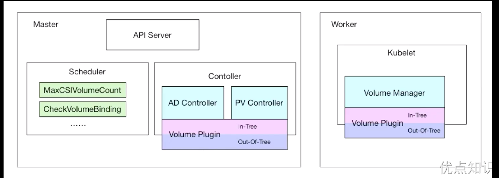

# NFS 共享存储
对于无状态的服务（stateless services），它们的一大特点是可以在不同的节点上水平扩展，并且这些节点之间不需要共享状态。对于这类服务，本地存储（如 hostPath 或 Local PV）通常不是最佳选择，因为这些存储类型将数据固定在了特定节点的本地磁盘上。当Pod需要在集群中的不同节点之间迁移时，本地存储就会成为限制。

# 安装
这里为了演示方便，先使用相对简单的 NFS 这种存储资源。首先需要安装 NFS 服务，如果使用的是正常集群，则直接找一个节点安装即可，使用数据目录 /var/lib/k8s/data/，进入到 node1 节点，在 Terminal 中执行下面的命令来安装 NFS 服务：
```sh
➜ yum -y install nfs-utils rpcbind
```
然后为共享目录设置权限：
```sh
➜ mkdir -p /var/lib/k8s/data
➜ chmod 755 /var/lib/k8s/data/
```
配置 nfs，nfs 的默认配置文件在 /etc/exports 文件下，在该文件中添加下面的配置信息：
```sh
➜ vi /etc/exports
/var/lib/k8s/data  *(rw,sync,no_root_squash)
```
配置说明：
- /var/lib/k8s/data：是共享的数据目录
- *：表示任何人都有权限连接，当然也可以是一个网段，一个 IP，也可以是域名
- rw：授予对目录的读写权限
- sync：确保主机使上传到共享目录的所有更改保持同步
- async：忽略同步检查以提供速度
- no_root_squash：当登录 NFS 主机使用共享目录的使用者是 root 时，其权限将被转换成为匿名使用者，通常它的 UID 与 GID，都会变成 nobody 身份，所以这是一个非常危险的选项
- subtree_check：指定在导出目录而不是整个文件系统的情况下，主机应验证主机文件系统上文件和目录的位置
- no_subtree_check：指定主机不应检查通过主机文件系统访问的文件的位置

当然 nfs 的配置还有很多，感兴趣的同学可以在网上去查找一下。启动服务 nfs 需要向 rpc 注册，rpc 一旦重启了，注册的文件都会丢失，向它注册的服务都需要重启 注意启动顺序，先启动 rpcbind
```sh
[root@node1 localpv]# systemctl start rpcbind.service
[root@node1 localpv]# systemctl status rpcbind
● rpcbind.service - RPC bind service
   Loaded: loaded (/usr/lib/systemd/system/rpcbind.service; enabled; vendor preset: enabled)
   Active: active (running) since Tue 2024-03-19 05:07:51 EDT; 33s ago
  Process: 5741 ExecStart=/sbin/rpcbind -w $RPCBIND_ARGS (code=exited, status=0/SUCCESS)
 Main PID: 5742 (rpcbind)
    Tasks: 1
   Memory: 560.0K
   CGroup: /system.slice/rpcbind.service
           └─5742 /sbin/rpcbind -w

Mar 19 05:07:51 node1 systemd[1]: Starting RPC bind service...
Mar 19 05:07:51 node1 systemd[1]: Started RPC bind service.
```
看到上面的 Started 证明启动成功了。然后启动 nfs 服务：
```sh
[root@node1 localpv]#  systemctl start nfs.service
[root@node1 localpv]# systemctl status nfs
● nfs-server.service - NFS server and services
   Loaded: loaded (/usr/lib/systemd/system/nfs-server.service; disabled; vendor preset: disabled)
   Active: active (exited) since Tue 2024-03-19 05:11:28 EDT; 5s ago
  Process: 8734 ExecStartPost=/bin/sh -c if systemctl -q is-active gssproxy; then systemctl reload gssproxy ; fi (code=exited, status=0/SUCCESS)
  Process: 8718 ExecStart=/usr/sbin/rpc.nfsd $RPCNFSDARGS (code=exited, status=0/SUCCESS)
  Process: 8714 ExecStartPre=/usr/sbin/exportfs -r (code=exited, status=0/SUCCESS)
 Main PID: 8718 (code=exited, status=0/SUCCESS)
    Tasks: 0
   Memory: 0B
   CGroup: /system.slice/nfs-server.service

Mar 19 05:11:27 node1 systemd[1]: Starting NFS server and services...
Mar 19 05:11:28 node1 systemd[1]: Started NFS server and services.
```
同样看到 Started 则证明 NFS Server 启动成功了。

另外还可以通过下面的命令确认下：
```sh
[root@node1 localpv]# rpcinfo -p|grep nfs
    100003    3   tcp   2049  nfs
    100003    4   tcp   2049  nfs
    100227    3   tcp   2049  nfs_acl
    100003    3   udp   2049  nfs
    100003    4   udp   2049  nfs
    100227    3   udp   2049  nfs_acl
```
查看具体目录挂载权限：
```sh
[root@node1 localpv]#  cat /var/lib/nfs/etab
/var/lib/k8s/data       *(rw,sync,wdelay,hide,nocrossmnt,secure,no_root_squash,no_all_squash,no_subtree_check,secure_locks,acl,no_pnfs,anonuid=65534,anongid=65534,sec=sys,rw,secure,no_root_squash,no_all_squash)
```
到这里就把 nfs server 给安装成功了，然后就是前往 node2 节点安装 nfs 的客户端来验证。
```sh
➜ yum -y install nfs-utils rpcbind
```
安装完成后，和上面的方法一样，先启动 rpc、然后启动 nfs：
```sh
➜ systemctl start rpcbind.service
➜ systemctl enable rpcbind.service
➜ systemctl start nfs.service
➜ systemctl enable nfs.service
```
客户端启动完成后，在客户端来挂载下 nfs 测试下，首先检查下 nfs 是否有共享目录：
```sh
[root@node2 ~]#  showmount -e 192.168.220.147
Export list for 192.168.220.147:
/var/lib/k8s/data *
[root@node2 ~]#  showmount -e node1
Export list for node1:
/var/lib/k8s/data *
```
然后在客户端上新建目录：
```sh
[root@node2 ~]# mkdir -p /mnt/data
```
将 nfs 共享目录挂载到上面的目录：
```sh
[root@node2 ~]# mount -t nfs node1:/var/lib/k8s/data /mnt/data
```
挂载成功后，在客户端上面的目录中新建一个文件，然后观察下 nfs 服务端的共享目录下面是否也会出现该文件：
```sh
[root@node2 ~]# touch /mnt/data/test.txt
```
然后在 nfs 服务端查看：
```sh
[root@node1 localpv]# ls -ls /var/lib/k8s/data/
total 0
0 -rw-r--r-- 1 root root 0 Mar 19 05:20 test.txt
```
如果上面出现了 test.txt 的文件，那么证明我们的 nfs 挂载成功了。

# 使用
前面已经了解了 PV、PVC、StorgeClass 的使用，那么 NFS 又应该如何在 Kubernetes 中使用呢？

同样创建一个如下所示 nfs 类型的 PV 资源对象：
```yaml
# nfs-volume.yaml
apiVersion: v1
kind: PersistentVolume
metadata:
  name: nfs-pv
spec:
  storageClassName: manual
  capacity:
    storage: 1Mi
  accessModes:
    - ReadWriteOnce
  persistentVolumeReclaimPolicy: Retain
  nfs:
    path: /var/lib/k8s/data/ # 指定nfs的挂载点
    server: 192.168.220.147 # 指定nfs服务地址
---
apiVersion: v1
kind: PersistentVolumeClaim
metadata:
  name: nfs-pvc
spec:
  storageClassName: manual
  accessModes:
    - ReadWriteOnce
  resources:
    requests:
      storage: 1Mi
```
用户真正使用的是 PVC，而要使用 PVC 的前提就是必须要先和某个符合条件的 PV 进行绑定，比如存储容量、访问模式，以及 PV 和 PVC 的 storageClassName 字段必须一样，这样才能够进行绑定，当 PVC 和 PV 绑定成功后就可以直接使用这个 PVC 对象了：
```yaml
# nfs-pod.yaml
apiVersion: v1
kind: Pod
metadata:
  name: test-volumes
spec:
  volumes:
    - name: nfs
      persistentVolumeClaim:
        claimName: nfs-pvc
  containers:
    - name: web
      image: nginx
      ports:
        - name: web
          containerPort: 80
      volumeMounts:
        - name: nfs
          subPath: test-volumes
          mountPath: /usr/share/nginx/html
```
直接创建上面的资源对象即可：
```sh
[root@master storage]# kubectl apply -f nfs-volume.yaml
persistentvolume/nfs-pv created
persistentvolumeclaim/nfs-pvc created
[root@master storage]# kubectl apply -f nfs-pod.yaml
pod/test-volumes created
[root@master storage]# kubectl get pv nfs-pv
NAME     CAPACITY   ACCESS MODES   RECLAIM POLICY   STATUS   CLAIM             STORAGECLASS   REASON   AGE
nfs-pv   1Mi        RWO            Retain           Bound    default/nfs-pvc   manual                  16s
[root@master storage]# kubectl get pvc nfs-pvc
NAME      STATUS   VOLUME   CAPACITY   ACCESS MODES   STORAGECLASS   AGE
nfs-pvc   Bound    nfs-pv   1Mi        RWO            manual         28s
```
由于这里 PV 中的数据为空，所以挂载后会将 nginx 容器中的 `/usr/share/nginx/html` 目录覆盖，那么访问应用的时候就没有内容了：
```sh
[root@master storage]# kubectl get pod -owide
NAME           READY   STATUS    RESTARTS   AGE    IP             NODE    NOMINATED NODE   READINESS GATES
test-volumes   1/1     Running   0          111s   10.244.1.136   node1   <none>           <none>
[root@master storage]# curl 10.244.1.136
<html>
<head><title>403 Forbidden</title></head>
<body>
<center><h1>403 Forbidden</h1></center>
<hr><center>nginx/1.21.5</center>
</body>
</html>
```
可以在 PV 目录中添加一些内容：
```sh
# 在nfs服务器上面执行
[root@node1 localpv]# echo "nfs pv content" > /var/lib/k8s/data/test-volumes/index.html
[root@node1 localpv]# curl 10.244.1.136
nfs pv content
```
然后重新访问就有数据了，而且当 Pod 应用挂掉或者被删掉重新启动后数据还是存在的，因为数据已经持久化。

上面的示例中需要手动去创建 PV 来和 PVC 进行绑定，有的场景下面需要自动创建 PV，这个时候就需要使用到 StorageClass，并且需要一个对应的 provisioner 来自动创建 PV，比如这里使用的 NFS 存储，则可以使用 nfs-subdir-external-provisioner 这个 Provisioner，它使用现有的和已配置的 NFS 服务器来支持通过 PVC 动态配置 PV，持久卷配置为 ${namespace}-${pvcName}-${pvName}。

可以直接将该项目代码 Clone 下来：
```sh
git clone https://github.com/kubernetes-sigs/nfs-subdir-external-provisioner.git
```
项目根目录 deploy 目录下面就包含部署应用的资源清单文件，需要将 deploy/deployment.yaml 文件中的 NFS_SERVER 环境变量更改为自己的 NFS 服务地址，将 NFS_PATH 环境变量更改为自己的共享目录：
```yaml
# deployment.yaml
apiVersion: apps/v1
kind: Deployment
metadata:
  name: nfs-client-provisioner
  labels:
    app: nfs-client-provisioner
  # replace with namespace where provisioner is deployed
  namespace: default
spec:
  replicas: 1
  strategy:
    type: Recreate
  selector:
    matchLabels:
      app: nfs-client-provisioner
  template:
    metadata:
      labels:
        app: nfs-client-provisioner
    spec:
      serviceAccountName: nfs-client-provisioner
      containers:
        - name: nfs-client-provisioner
          image: registry.k8s.io/sig-storage/nfs-subdir-external-provisioner:v4.0.2
          volumeMounts:
            - name: nfs-client-root
              mountPath: /persistentvolumes
          env:
            - name: PROVISIONER_NAME
              value: k8s-sigs.io/nfs-subdir-external-provisioner
            - name: NFS_SERVER
              value: 192.168.220.147  # nfs server 地址
            - name: NFS_PATH
              value: /var/lib/k8s/data  # nfs的共享目录
      volumes:
        - name: nfs-client-root
          nfs:
            server: 192.168.220.147   # nfs server 地址
            path: /var/lib/k8s/data  # nfs的共享目录
```
然后直接执行下面的命令安装即可：
```sh
[root@master nfs-subdir-external-provisioner]# kubectl apply -k deploy/
storageclass.storage.k8s.io/nfs-client created
serviceaccount/nfs-client-provisioner created
role.rbac.authorization.k8s.io/leader-locking-nfs-client-provisioner created
clusterrole.rbac.authorization.k8s.io/nfs-client-provisioner-runner created
rolebinding.rbac.authorization.k8s.io/leader-locking-nfs-client-provisioner created
clusterrolebinding.rbac.authorization.k8s.io/run-nfs-client-provisioner created
deployment.apps/nfs-client-provisioner created
```
上面的命令会在 default 命名空间下安装 `nfs-subdir-external-provisioner`，并且会创建一个名为 `nfs-client` 的 StorageClass：
```sh
[root@master nfs-subdir-external-provisioner]# kubectl get sc
NAME            PROVISIONER                                   RECLAIMPOLICY   
nfs-client      k8s-sigs.io/nfs-subdir-external-provisioner   Delete          Immediate              false                  47s
[root@master nfs-subdir-external-provisioner]# kubectl get sc nfs-client -o yaml
apiVersion: storage.k8s.io/v1
kind: StorageClass
metadata:
  annotations:
    kubectl.kubernetes.io/last-applied-configuration: |
      {"apiVersion":"storage.k8s.io/v1","kind":"StorageClass","metadata":{"annotations":{},"name":"nfs-client"},"parameters":{"archiveOnDelete":"false"},"provisioner":"k8s-sigs.io/nfs-subdir-external-provisioner"}
  creationTimestamp: "2024-03-19T10:22:40Z"
  name: nfs-client
  resourceVersion: "3398588"
  uid: 8dd2cd06-b9f2-4b62-abd3-e326d87aeee4
parameters:
  archiveOnDelete: "false"
provisioner: k8s-sigs.io/nfs-subdir-external-provisioner
reclaimPolicy: Delete
volumeBindingMode: Immediate
```
这样当以后创建的 PVC 中如果指定 nfs-client 这个 StorageClass 的时候，则会使用上面的 SC 自动创建一个 PV。比如创建一个如下所示的 PVC：
```yaml
# nfs-sc-pvc
apiVersion: v1
kind: PersistentVolumeClaim
metadata:
  name: nfs-sc-pvc
spec:
  storageClassName: nfs-client  # 不指定则使用默认的 SC
  accessModes:
    - ReadWriteOnce
  resources:
    requests:
      storage: 1Mi
```
直接创建上面的 PVC 资源对象后就会自动创建一个 PV 与其进行绑定：
```sh

```
对应自动创建的 PV 如下所示：
```sh

```
挂载的 nfs 目录为 /var/lib/k8s/data/default-nfs-sc-pvc-pvc-032b97d5-629f-4471-a3b8-203bd6816e39，和上面的 ${namespace}-${pvcName}-${pvName} 规范一致的。

# 原理
我们只是在 volumes 中指定了我们上面创建的 PVC 对象，当这个 Pod 被创建之后， kubelet 就会把这个 PVC 对应的这个 NFS 类型的 Volume（PV）挂载到这个 Pod 容器中的目录中去。前面我们也提到了这样的话对于普通用户来说完全就不用关心后面的具体存储在 NFS 还是 Ceph 或者其他了，只需要直接使用 PVC 就可以了，因为真正的存储是需要很多相关的专业知识的，这样就完全职责分离解耦了。

普通用户直接使用 PVC 没有问题，但是也会出现一个问题，那就是当普通用户创建一个 PVC 对象的时候，这个时候系统里面并没有合适的 PV 来和它进行绑定，因为 PV 大多数情况下是管理员给我们创建的，这个时候启动 Pod 肯定就会失败了，如果现在管理员如果去创建一个对应的 PV 的话，PVC 和 PV 当然就可以绑定了，然后 Pod 也会自动的启动成功，这是因为在 Kubernetes 中有一个专门处理持久化存储的控制器 Volume Controller，这个控制器下面有很多个控制循环，其中一个就是用于 PV 和 PVC 绑定的 PersistentVolumeController。

PersistentVolumeController 会不断地循环去查看每一个 PVC，是不是已经处于 Bound（已绑定）状态。如果不是，那它就会遍历所有的、可用的 PV，并尝试将其与未绑定的 PVC 进行绑定，这样，Kubernetes 就可以保证用户提交的每一个 PVC，只要有合适的 PV 出现，它就能够很快进入绑定状态。而所谓将一个 PV 与 PVC 进行绑定，其实就是将这个 PV 对象的名字，填在了 PVC 对象的 spec.volumeName 字段上。

PV 和 PVC 绑定上了，那么又是如何将容器里面的数据进行持久化的呢，我们知道 Docker 的 Volume 挂载其实就是将一个宿主机上的目录和一个容器里的目录绑定挂载在了一起，具有持久化功能当然就是指的宿主机上面的这个目录了，当容器被删除或者在其他节点上重建出来以后，这个目录里面的内容依然存在，所以一般情况下实现持久化是需要一个远程存储的，比如 NFS、Ceph 或者云厂商提供的磁盘等等。所以接下来需要做的就是持久化宿主机目录这个过程。

当 Pod 被调度到一个节点上后，节点上的 kubelet 组件就会为这个 Pod 创建它的 Volume 目录，默认情况下 kubelet 为 Volume 创建的目录在 kubelet 工作目录下面：
```sh

```
比如上面我们创建的 Pod 对应的 Volume 目录完整路径为：
```sh

```

> 要获取 Pod 的唯一标识 uid，可通过命令 kubectl get pod pod名 -o jsonpath={.metadata.uid} 获取。

然后就需要根据我们的 Volume 类型来决定需要做什么操作了，假如后端存储使用的 Ceph RBD，那么 kubelet 就需要先将 Ceph 提供的 RBD 挂载到 Pod 所在的宿主机上面，这个阶段在 Kubernetes 中被称为 Attach 阶段。Attach 阶段完成后，为了能够使用这个块设备，kubelet 还要进行第二个操作，即：格式化这个块设备，然后将它挂载到宿主机指定的挂载点上。这个挂载点，也就是上面我们提到的 Volume 的宿主机的目录。将块设备格式化并挂载到 Volume 宿主机目录的操作，在 Kubernetes 中被称为 Mount 阶段。但是对于我们这里使用的 NFS 就更加简单了，因为 NFS 存储并没有一个设备需要挂载到宿主机上面，所以这个时候 kubelet 就会直接进入第二个 Mount 阶段，相当于直接在宿主机上面执行如下的命令：
```sh

```
同样可以在测试的 Pod 所在节点查看 Volume 的挂载信息：
```sh

```
我们可以看到这个 Volume 被挂载到了 NFS（172.18.0.2:/var/lib/k8s/data/）下面，以后我们在这个目录里写入的所有文件，都会被保存在远程 NFS 服务器上。

这样在经过了上面的阶段过后，我们就得到了一个持久化的宿主机上面的 Volume 目录了，接下来 kubelet 只需要把这个 Volume 目录挂载到容器中对应的目录即可，这样就可以为 Pod 里的容器挂载这个持久化的 Volume 了，这一步其实也就相当于执行了如下所示的命令：
```sh

```
整个存储的架构可以用下图来说明：


- PV Controller：负责 PV/PVC 的绑定，并根据需求进行数据卷的 Provision/Delete 操作
- AD Controller：负责存储设备的 Attach/Detach 操作，将设备挂载到目标节点
- Volume Manager：管理卷的 Mount/Unmount 操作、卷设备的格式化等操作
- Volume Plugin：扩展各种存储类型的卷管理能力，实现第三方存储的各种操作能力和 Kubernetes 存储系统结合

我们上面使用的 NFS 就属于 In-Tree 这种方式，In-Tree 就是在 Kubernetes 源码内部实现的，和 Kubernetes 一起发布、管理的，但是更新迭代慢、灵活性比较差，另外一种方式 Out-Of-Tree 是独立于 Kubernetes 的，目前主要有 CSI 和 FlexVolume 两种机制，开发者可以根据自己的存储类型实现不同的存储插件接入到 Kubernetes 中去，其中 CSI 是现在也是以后主流的方式，接下来我们会主要介绍 CSI 这种存储插件的使用。