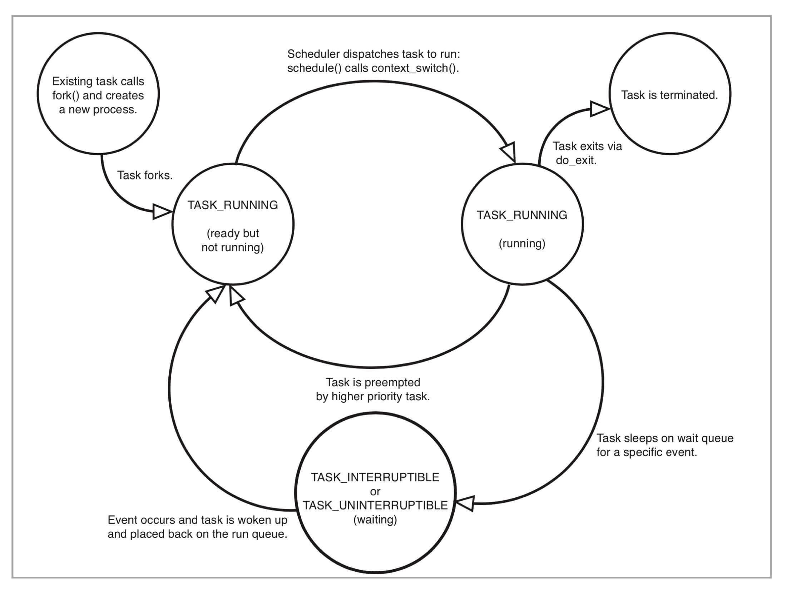

# 03｜理解进程（2）：为什么我的容器里有这么多僵尸进程？
你好，我是程远。今天我们来聊一聊容器里僵尸进程这个问题。

说起僵尸进程，相信你并不陌生。很多面试官经常会问到这个知识点，用来考察候选人的操作系统背景。通过这个问题，可以了解候选人对Linux进程管理和信号处理这些基础知识的理解程度，他的基本功扎不扎实。

所以，今天我们就一起来看看容器里为什么会产生僵尸进程，然后去分析如何怎么解决。通过这一讲，你就会对僵尸进程的产生原理有一个清晰的认识，也会更深入地理解容器init进程的特性。

## 问题再现

平时用容器的时候，有的同学会发现，自己的容器运行久了之后，运行ps命令会看到一些进程，进程名后面加了`<defunct>`标识。那么你自然会有这样的疑问，这些是什么进程呢？

你可以自己做个容器镜像来模拟一下，我们先下载这个 [例子](https://github.com/chengyli/training/tree/master/init_proc/zombie_proc)，运行 `make image` 之后，再启动容器。在容器里我们可以看到，1号进程fork出1000个子进程。当这些子进程运行结束后，它们的进程名字后面都加了标识。

从它们的Z stat（进程状态）中我们可以知道，这些都是僵尸进程（Zombie Process）。运行top命令，我们也可以看到输出的内容显示有 `1000 zombie` 进程。

```shell
# docker run --name zombie-proc -d registry/zombie-proc:v1
02dec161a9e8b18922bd3599b922dbd087a2ad60c9b34afccde7c91a463bde8a
# docker exec -it zombie-proc bash
# ps aux
USER       PID %CPU %MEM    VSZ   RSS TTY      STAT START   TIME COMMAND
root         1  0.0  0.0   4324  1436 ?        Ss   01:23   0:00 /app-test 1000
root         6  0.0  0.0      0     0 ?        Z    01:23   0:00 [app-test] <defunct>
root         7  0.0  0.0      0     0 ?        Z    01:23   0:00 [app-test] <defunct>
root         8  0.0  0.0      0     0 ?        Z    01:23   0:00 [app-test] <defunct>
root         9  0.0  0.0      0     0 ?        Z    01:23   0:00 [app-test] <defunct>
root        10  0.0  0.0      0     0 ?        Z    01:23   0:00 [app-test] <defunct>

…

root       999  0.0  0.0      0     0 ?        Z    01:23   0:00 [app-test] <defunct>
root      1000  0.0  0.0      0     0 ?        Z    01:23   0:00 [app-test] <defunct>
root      1001  0.0  0.0      0     0 ?        Z    01:23   0:00 [app-test] <defunct>
root      1002  0.0  0.0      0     0 ?        Z    01:23   0:00 [app-test] <defunct>
root      1003  0.0  0.0      0     0 ?        Z    01:23   0:00 [app-test] <defunct>
root      1004  0.0  0.0      0     0 ?        Z    01:23   0:00 [app-test] <defunct>
root      1005  0.0  0.0      0     0 ?        Z    01:23   0:00 [app-test] <defunct>
root      1023  0.0  0.0  12020  3392 pts/0    Ss   01:39   0:00 bash

# top
top - 02:18:57 up 31 days, 15:17,  0 users,  load average: 0.00, 0.01, 0.00
Tasks: 1003 total,   1 running,   2 sleeping,   0 stopped, 1000 zombie
…
```

那么问题来了，什么是僵尸进程？它们是怎么产生的？僵尸进程太多会导致什么问题？想要回答这些问题，我们就要从进程状态的源头学习，看看僵尸进程到底处于进程整个生命周期里的哪一环。

## 知识详解

### Linux的进程状态

无论进程还是线程，在Linux内核里其实都是用 **task\_struct{}这个结构** 来表示的。它其实就是任务（task），也就是Linux里基本的调度单位。为了方便讲解，我们在这里暂且称它为进程。

那一个进程从创建（fork）到退出（exit），这个过程中的状态转化还是很简单的。下面这个图是 《Linux Kernel Development》这本书里的Linux进程状态转化图。

我们从这张图中可以看出来，在进程“活着”的时候就只有两个状态：运行态（TASK\_RUNNING）和睡眠态（TASK\_INTERRUPTIBLE，TASK\_UNINTERRUPTIBLE）。



那运行态和睡眠态这两种状态分别是什么意思呢？

运行态的意思是，无论进程是正在运行中（也就是获得了CPU资源），还是进程在run queue队列里随时可以运行，都处于这个状态。想要查看进程是不是处于运行态，其实也很简单，比如使用ps命令，可以看到处于这个状态的进程显示的是R stat。

睡眠态是指，进程需要等待某个资源而进入的状态，要等待的资源可以是一个信号量（Semaphore）, 或者是磁盘I/O，这个状态的进程会被放入到wait queue队列里。

这个睡眠态具体还包括两个子状态：一个是可以被打断的（TASK\_INTERRUPTIBLE），我们用ps查看到的进程，显示为S stat。还有一个是不可被打断的（TASK\_UNINTERRUPTIBLE），用ps查看进程，就显示为D stat。

这两个子状态，我们在后面的课程里碰到新的问题时，会再做详细介绍，这里你只要知道这些就行了。

除了上面进程在活的时候的两个状态，进程在调用`do_exit()`退出的时候，还有两个状态。

一个是 EXIT\_DEAD，也就是进程在真正结束退出的那一瞬间的状态；第二个是 **EXIT\_ZOMBIE状态，这是进程在EXIT\_DEAD前的一个状态，而我们今天讨论的僵尸进程，也就是处于这个状态中。**

### 限制容器中进程数目

理解了Linux进程状态之后，我们还需要知道在Linux系统中怎么限制进程数目。因为弄清楚这个问题，我们才能更深入地去理解僵尸进程的危害。

一台Linux机器上的进程总数目是有限制的。如果超过这个最大值，那么系统就无法创建出新的进程了，比如你想SSH登录到这台机器上就不行了。这个最大值可以我们在 `/proc/sys/kernel/pid_max`这个参数中看到。

Linux内核在初始化系统的时候，会根据机器CPU的数目来设置pid\_max的值。比如说，如果机器中CPU数目小于等于32，那么pid\_max就会被设置为32768（32K）；如果机器中的CPU数目大于32，那么pid\_max就被设置为 N\*1024 （N就是CPU数目）。

对于Linux系统而言，容器就是一组进程的集合。如果容器中的应用创建过多的进程或者出现bug，就会产生类似fork bomb的行为。这个fork bomb就是指在计算机中，通过不断建立新进程来消耗系统中的进程资源，它是一种黑客攻击方式。这样，容器中的进程数就会把整个节点的可用进程总数给消耗完。

这样，不但会使同一个节点上的其他容器无法工作，还会让宿主机本身也无法工作。所以对于每个容器来说，我们都需要限制它的最大进程数目，而这个功能由pids Cgroup这个子系统来完成。

而这个功能的实现方法是这样的：pids Cgroup通过Cgroup文件系统的方式向用户提供操作接口，一般它的Cgroup文件系统挂载点在 `/sys/fs/cgroup/pids`。

在一个容器建立之后，创建容器的服务(也就是容器运行时)会在`/sys/fs/cgroup/pids`下建立一个子目录，就是一个控制组，控制组里 **最关键的一个文件就是pids.max**。我们可以向这个文件写入数值，而这个值就是这个容器中允许的最大进程数目。

我们对这个值做好限制，容器就不会因为创建出过多进程而影响到其他容器和宿主机了。思路讲完了，接下来我们就实际上手试一试。

下面是对一个Docker容器的pids Cgroup的操作，你可以跟着操作一下。

```shell
# pwd
/sys/fs/cgroup/pids
# df ./
Filesystem     1K-blocks  Used Available Use% Mounted on
cgroup                 0     0         0    - /sys/fs/cgroup/pids
[root@localhost ~]# docker ps
CONTAINER ID   IMAGE     COMMAND                  CREATED              STATUS              PORTS     NAMES
78f6c68cbde2   nginx     "/docker-entrypoint.…"   About a minute ago   Up About a minute   80/tcp    charming_borg

[root@localhost 78f6c68cbde2f95e52ac205f68a43fd6828fbf540281e3a6983f7b5e1f7f3a0c]# pwd
/sys/fs/cgroup/pids/docker/78f6c68cbde2f95e52ac205f68a43fd6828fbf540281e3a6983f7b5e1f7f3a0c

[root@localhost 78f6c68cbde2f95e52ac205f68a43fd6828fbf540281e3a6983f7b5e1f7f3a0c]# ls
cgroup.clone_children  cgroup.event_control  cgroup.procs  notify_on_release  pids.current  pids.max  tasks
# echo 1002 > pids.max
# cat pids.max
1002
```

## 解决问题

刚才我给你解释了两个基本概念，进程状态和进程数目限制，那现在就可以解决容器中的僵尸进程问题了。在前面Linux进程状态的介绍里，我们知道了，僵尸进程是Linux进程退出状态的一种。

从内核进程的`do_exit()`函数也可以看到，这时候进程 task\_struct 里的 mm/shm/sem/files 等文件资源都已经释放了，只留下了一个 stask\_struct instance 空壳。就像下面这段代码显示的一样，从进程对应的`/proc/<pid>`文件目录下，我们也可以看出来，对应的资源都已经没有了。

```shell
# cat /proc/6/cmdline
# cat /proc/6/smaps
# cat /proc/6/maps
# ls /proc/6/fd

```

并且，这个进程也已经不响应任何的信号了，无论SIGTERM(15)还是SIGKILL(9)。

当多个容器运行在同一个宿主机上的时候，为了避免一个容器消耗完我们整个宿主机进程号资源，我们会配置pids Cgroup来限制每个容器的最大进程数目。也就是说，进程数目在每个容器中也是有限的，是一种很宝贵的资源。

既然进程号资源在宿主机上是有限的，显然残留的僵尸进程多了以后，给系统带来最大问题就是它占用了进程号。 **这就意味着，残留的僵尸进程，在容器里仍然占据着进程号资源，很有可能会导致新的进程不能运转。**

这里借用开头的那个例子，也就是一个产生了1000个僵尸进程的容器，带你理解一下进程数的上限。开头例子中有1个init进程+1000个僵尸进程+1个bash进程 ，总共就是1002个进程。如果pids Cgroup限制这个容器的最大进程号的数量为1002的话，在pids Cgroup里可以看到pids.current == pids.max，也就是已经达到了容器进程号数的上限。这时候，如果在容器里想再启动一个进程，例如运行一下ls命令，就会看到 `Resource temporarily unavailable` 的错误消息。已经退出的无用进程，却阻碍了有用进程的启动，显然这样是不合理的。

具体代码如下：

```shell
### On host
# docker ps
CONTAINER ID        IMAGE                      COMMAND             CREATED             STATUS              PORTS               NAMES
09e6e8e16346        registry/zombie-proc:v1   "/app-test 1000"    29 minutes ago      Up 29 minutes                           peaceful_ritchie

# pwd
/sys/fs/cgroup/pids/system.slice/docker-09e6e8e1634612580a03dd3496d2efed2cf2a510b9688160b414ce1d1ea3e4ae.scope

# cat pids.max
1002
# cat pids.current
1002

### On Container
[root@09e6e8e16346 /]# ls
bash: fork: retry: Resource temporarily unavailable
bash: fork: retry: Resource temporarily unavailable
```

所以，接下来还要看看这些僵尸进程到底是怎么产生的。因为只有理解它的产生机制，才能想明白怎么避免僵尸进程的出现。

先看一下刚才模拟僵尸进程的那段小程序。这段程序里， **父进程在创建完子进程之后就不管了，这就是造成子进程变成僵尸进程的原因。**

```c
#include <stdio.h>
#include <stdlib.h>
#include <sys/types.h>
#include <sys/wait.h>
#include <unistd.h>

int main(int argc, char *argv[])
{
       int i;
       int total;

       if (argc < 2) {
              total = 1;
       } else {
              total = atoi(argv[1]);
       }

       printf("To create %d processes\n", total);

       for (i = 0; i < total; i++) {
              pid_t pid = fork();

              if (pid == 0) {
                      printf("Child => PPID: %d PID: %d\n", getppid(),
                             getpid());
                      sleep(60);
                      printf("Child process exits\n");
                      exit(EXIT_SUCCESS);
              } else if (pid > 0) {
                      printf("Parent created child %d\n", i);
              } else {
                      printf("Unable to create child process. %d\n", i);
                      break;
              }
       }
       printf("Paraent is sleeping\n");
       while (1) {
              sleep(100);
       }
       return EXIT_SUCCESS;
}
```

前面通过分析，发现子进程变成僵尸进程的原因在于父进程“不负责”，那找到原因后，我们再想想，如何来解决。

其实解决思路很好理解，就好像熊孩子犯了事儿，你要去找他家长来管教，那子进程在容器里“赖着不走”，我们就需要让父进程出面处理了。

所以，在Linux中的进程退出之后，如果进入僵尸状态，我们就需要父进程调用wait()这个系统调用，去回收僵尸进程的最后的那些系统资源，比如进程号资源。

那么，我们在刚才那段代码里，主进程进入sleep(100)之前，加上一段wait()函数调用，就不会出现僵尸进程的残留了。

```c
      for (i = 0; i < total; i++) {
            int status;
            wait(&status);
      }
```

而容器中所有进程的最终父进程，就是我们所说的init进程，由它负责生成容器中的所有其他进程。因此，容器的init进程有责任回收容器中的所有僵尸进程。

前面我们知道了wait()系统调用可以回收僵尸进程，但是wait()系统调用有一个问题，需要你注意。wait()系统调用是一个阻塞的调用，也就是说，如果没有子进程是僵尸进程的话，这个调用就一直不会返回，那么整个进程就会被阻塞住，而不能去做别的事了。

不过这也没有关系，我们还有另一个方法处理。Linux还提供了一个类似的系统调用waitpid()，这个调用的参数更多。其中就有一个参数WNOHANG，它的含义就是，如果在调用的时候没有僵尸进程，那么函数就马上返回了，而不会像wait()调用那样一直等待在那里。

比如社区的一个 [容器init项目tini](https://github.com/krallin/tini)。在这个例子中，它的主进程里，就是不断在调用带WNOHANG参数的waitpid()，通过这个方式清理容器中所有的僵尸进程。

```c
int reap_zombies(const pid_t child_pid, int* const child_exitcode_ptr) {
        pid_t current_pid;
        int current_status;

        while (1) {
                current_pid = waitpid(-1, &current_status, WNOHANG);
                switch (current_pid) {
                        case -1:
                                if (errno == ECHILD) {
                                        PRINT_TRACE("No child to wait");
                                        break;
                                }
…
```

## 重点总结

今天我们讨论的问题是容器中的僵尸进程。

首先，我们先用代码来模拟了这个情况，还原了在一个容器中大量的僵尸进程是如何产生的。为了理解它的产生原理和危害，我们先要掌握两个知识点：

- Linux进程状态中，僵尸进程处于EXIT\_ZOMBIE这个状态；
- 容器需要对最大进程数做限制。具体方法是这样的，我们可以向Cgroup中 **pids.max** 这个文件写入数值（这个值就是这个容器中允许的最大进程数目）。

掌握了基本概念之后，我们找到了僵尸进程的产生原因。父进程在创建完子进程之后就不管了。所以，我们需要父进程调用wait()或者waitpid()系统调用来避免僵尸进程产生。

关于本节内容，你只要记住下面三个主要的知识点就可以了：

1. 每一个Linux进程在退出的时候都会进入一个僵尸状态（EXIT\_ZOMBIE）；
2. 僵尸进程如果不清理，就会消耗系统中的进程数资源，最坏的情况是导致新的进程无法启动；
3. 僵尸进程一定需要父进程调用`wait()`或者`waitpid()`系统调用来清理，这也是容器中 init 进程必须具备的一个功能。

## 思考题

1、如果容器的init进程创建了子进程B，B又创建了自己的子进程C。如果C运行完之后，退出成了僵尸进程，B进程还在运行，而容器的init进程还在不断地调用waitpid()，那C这个僵尸进程可以被回收吗？

C 应该不会被回收，waitpid 仅等待直接 children 的状态变化。 为什么先进入僵尸状态而不是直接消失？觉得是留给父进程一次机会，查看子进程的 PID、终止状态（退出码、终止原因，比如是信号终止还是正常退出等）、资源使用信息。如果子进程直接消失，那么父进程没有机会掌握子进程的具体终止情况。一般情况下，程序逻辑可能会依据子进程的终止情况做出进一步处理：比如 Nginx Master 进程获知 Worker 进程异常退出，则重新拉起来一个 Worker 进程。

2、如果容器中init进程是一个go程序，那这个go程序一般怎么处理僵尸进程的呢？

在 Go 程序中，处理僵尸进程通常涉及到监听 SIGCHLD 信号和调用 wait 系列的函数。以下是一个简单的例子，展示了如何在 Go 程序中作为 init 进程来处理僵尸进程：

```go
package main

import (
	"os"
	"os/signal"
	"syscall"
)

func main() {
	// 创建一个信号处理通道
	sigs := make(chan os.Signal, 1)
	// 通知我们的程序这个通道要检测 SIGCHLD 信号
	signal.Notify(sigs, syscall.SIGCHLD)

	for {
		// 等待信号
		sig := <-sigs
		if sig == syscall.SIGCHLD {
			// 有子进程状态发生了变化
			for {
				// 调用 wait 来清理僵尸进程
				pid, err := syscall.Wait4(-1, nil, syscall.WNOHANG, nil)
				if pid == 0 || err == syscall.ECHILD {
					// 如果没有更多的僵尸进程，跳出循环
					break
				}
			}
		}
		// 其他逻辑 ...
	}
}
```

在这个程序中，我们首先创建了一个用于接收信号的通道，并注册了我们感兴趣的信号类型，这里是 SIGCHLD。信号通道可以用来在 Go 程序中监听操作系统信号。

然后，程序进入一个无限循环中，等待信号的到来。当检测到 SIGCHLD 信号时，即表明有子进程已经结束，我们就调用 `syscall.Wait4` 函数来等待并清理已经终止的子进程，防止它们变成僵尸进程。这里我们使用了 `WNOHANG` 选项，它的作用是使 `Wait4` 在没有已经终止的子进程时不会阻塞，这就允许程序继续运行。

注意，这个例子仅做演示，Go 程序作为容器中的 `init` 进程可能需要更多的逻辑来处理各种信号和系统事件。如果你的容器中确实存在多个子进程，确保 `init` 进程始终在线，并且能够正确处理僵尸进程，是非常重要的。

3、我们知道go一般都是创建大量协程，而不是进程，go协程在内核中如何被处理的呢？

Go 协程（goroutines）是 Go 语言的并发体，它们不是操作系统级别的线程或进程，而是由 Go 运行时（runtime）调度和管理的，Go 的运行时是一个用户空间的调度器。Go 协程在用户空间中被创建和管理，不是直接对应为内核线程。Go 运行时包含一个 M:N 的调度器，这意味着它将 M 个协程映射到 N 个操作系统线程上（通常，N 会对应于 CPU 核心数），运行时调度器负责协程的创建、执行、暂停和销毁。

Go 调度器使用的是工作窃取算法。每个线程都有自己的运行队列，当一个线程完成了自己队列中的所有协程时，它可以去尝试从其他线程的队列中偷取协程来执行。当协程进行系统调用或者其他会阻塞的操作时，Go 调度器可以将该协程从当前线程分离出来，让线程去执行其他协程。

从操作系统内核的角度来看，它只是在调度 Go 运行时使用的线程。内核不直接参与协程的调度，所有的协程管理工作都在用户空间由 Go 运行时完成。

总结起来，Go 协程是 Go 运行时在用户空间管理的，并不直接映射到内核线程或进程上。内核线程是更重的执行单元，而 Go 运行时会在这些线程之上高效地调度成千上万的协程，以实现并发和并行执行，同时尽量减少对内核的依赖和上下文切换的开销。

4、问题一：在Kubernetes 的情况下，是不是该节点上所有的容器都是kubelet 的子进程？不然kubelet 怎么来清理这些容器产生的僵尸进程呢？  

在 Kubernetes 集群中，kubelet 是在节点（Node）上负责管理 Pod 和其中容器生命周期的组件。确实，kubelet 通常与容器运行时接口（Container Runtime Interface，CRI）兼容的容器运行时（例如 containerd 或 CRI-O）通信来实际启动和管理容器。而 runc 是一个符合 OCI（开放容器标准）的容器运行时，它是 containerd 使用的底层技术之一，用来运行容器。

containerd、CRI-O 和其他 CRI 兼容的容器运行时通常使用了一个 shim 进程来管理容器的生命周期，这个 shim 进程会为每个容器实例化一个。这种设计的目的是为了 decouple（解耦）容器的生命周期管理和容器运行时本身的生命周期。

在kuberenetes下，kubelet还是调用 containerd/runc去启动容器的，每个容器的父进程是containerd-shim, 最终shim可以回收僵尸进程。

问题二：在Docker 的场景下，容器第一个进程是用户自己写的进程，而该进程是不能保证在回收子进程资源上的质量的，所以才有Tinit 等工具，那为什么docker runtime 不默认把这样的回收功能做了呢？ 

docker倒是也做了这件事。 用docker启动容器的时候 加--init参数，起来的容器就强制使用tini作为init进程了。

容器的 `init` 进程通常是由容器运行时（如 `runc`）创建的，这个过程大致如下：

1. `containerd` 通过 `containerd-shim` 与容器运行时进行交互。
2. 当要启动一个新容器时，`containerd` 会指示 `containerd-shim` 启动容器。
3. `containerd-shim` 会调用容器运行时（例如 `runc`）来创建和启动容器。
4. 容器运行时会根据提供的配置在一个新的命名空间（namespace）和控制组（cgroup）环境中创建 `init` 进程，这个 `init` 进程是容器内部的第一个进程，拥有 PID 1。
5. 一旦 `init` 进程启动成功，容器运行时就会将控制权返回给 `containerd-shim`。至此，容器内部的进程生命周期由容器自己管理。
6. `containerd-shim` 会保持运行状态，以便它可以监控容器进程，处理日志，以及为 `containerd` 提供容器的退出状态。

因此，`containerd-shim` 本身不是产生 `init` 进程的，但它协调了容器运行时的调用，后者才是实际负责创建容器 `init` 进程的组件。

那`containerd-shim`是如何回收容器的僵尸进程的呢，僵尸进程不是只能被自己的直接父进程回收吗？

在 UNIX 和类 UNIX 系统中，确实是这样的：当一个进程结束后，它会成为一个僵尸（zombie）进程，直到该进程的父进程通过调用 `wait()` 系列函数来回收（reap）该进程释放的资源。如果父进程没有回收这个僵尸进程，它将一直存在于系统中。

对于容器来说，容器的 `init` 进程是所有容器内进程的父进程，因此它负责回收任何僵尸进程。在大多数现代容器中，`init` 进程被设计为自动地进行这个工作，所以通常不需要容器外部的进程来干涉。

然而，在容器外部，`containerd-shim` 进程作为容器的监护进程，也有其角色。它在容器运行时（例如 `runc`）启动容器后保持运行状态，用于从外部管理容器和与 `containerd` 进行交互。如果容器的 `init` 进程结束，那么 `containerd-shim` 进程将成为所有剩余孤儿进程的父进程。这种情况下，`containerd-shim` 需要负责回收这些孤儿进程，防止它们变成僵尸进程。

一般来说，`containerd-shim` 会注册一个等待（`wait`）子进程的回调，并且当它检测到子进程结束时，就会调用 `wait()` 函数来处理这些结束的进程。这样可以保证即使容器的 `init` 进程已经退出，容器内产生的僵尸进程也能被及时清理。这个机制确保了容器在退出后不会留下任何僵尸进程占用系统资源。

问题三：Linux 为什么不设计成可以kill -9 杀死僵尸进程呢？现在把希望都寄托在父亲进程的代码质量上，而要init 回收，就得把init 到 僵尸进程之间的血缘进程全部杀死。为什么要做这样的设计呢？

Linux进程要响应SIGKILL并且执行signal handler，只有在被进程调度到的时候才可以做。对于zombie进程，它已经是不可被调度的进程了。

## 扩展

### 使用tinit或dumb-init作为init进程

如果你自己构建镜像并且自定义了容器的 `init` 进程（容器中第一个启动的进程），那么这个自定义 `init` 进程需要负责处理容器内部的僵尸进程。这通常意味着你的 `init` 进程需要周期性地或者通过某种事件触发的方式调用 `wait()` 或者 `waitpid()` 函数来回收已经结束的子进程的资源。

在自定义容器 `init` 进程时需要注意的一些重要事项包括：

1. **子进程管理**：自定义 `init` 进程必须能够正确地管理子进程，这包括合适地处理 `SIGCHLD` 信号并且回收子进程。这是确保僵尸进程不会累积的关键。
   
2. **信号处理**：容器 `init` 进程通常需要能够处理来自外部的信号，如 `SIGTERM`，以便在容器被要求停止时能够优雅地关闭和清理资源。

3. **容器生命周期事件**：`init` 进程可能还需要处理其他容器生命周期事件，如启动、停止和重启子服务。

如果不想要自己处理这些细节，可以考虑使用现有的 `init` 系统，如 `tini` 或者 `dumb-init`。这些工具设计用来作为容器的 `init` 进程，它们能够处理僵尸进程，并将信号传递给容器内的应用程序。

例如，你可以在 Dockerfile 中使用 `tini`：

```Dockerfile
FROM alpine:3.9
# 添加 Tini
ADD https://github.com/krallin/tini/releases/download/v0.18.0/tini /tini
RUN chmod +x /tini
# Tini 是容器的 ENTRYPOINT
ENTRYPOINT ["/tini", "--"]
# 运行你的程序作为命令
CMD ["your_program"]
```

这样，`tini` 会作为 `init` 进程启动，并负责管理容器内的进程，包括僵尸进程的回收。