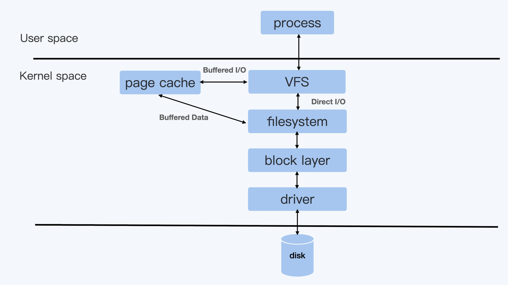
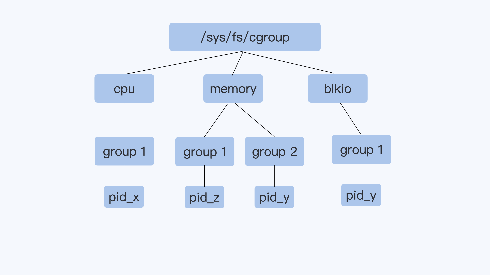
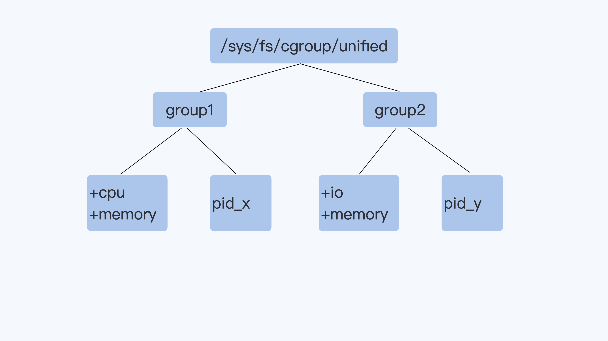
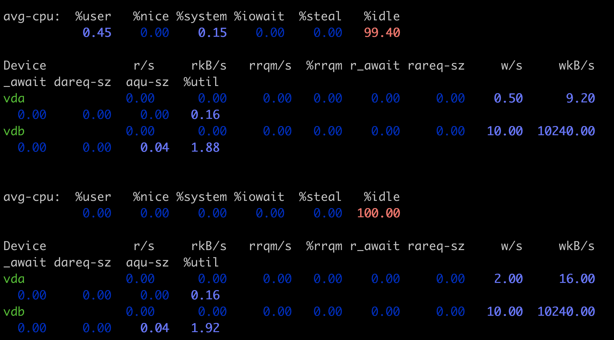

# 13 | 容器磁盘限速：我的容器里磁盘读写为什么不稳定?
你好，我是程远。今天我们聊一聊磁盘读写不稳定的问题。

上一讲，我给你讲了如何通过XFS Quota来限制容器文件系统的大小，这是静态容量大小的一个限制。

你也许会马上想到，磁盘除了容量的划分，还有一个读写性能的问题。

具体来说，就是如果多个容器同时读写节点上的同一块磁盘，那么它们的磁盘读写相互之间影响吗？如果容器之间读写磁盘相互影响，我们有什么办法解决呢？

接下来，我们就带着问题一起学习今天的内容。

## 场景再现

我们先用这里的 [代码](https://github.com/chengyli/training/tree/master/filesystem/blkio)，运行一下 `make image` 来做一个带fio的容器镜像，fio在我们之前的课程里提到过，它是用来测试磁盘文件系统读写性能的工具。

有了这个带fio的镜像，我们可以用它启动一个容器，在容器中运行fio，就可以得到只有一个容器读写磁盘时的性能数据。

```shell
mkdir -p /tmp/test1
docker stop fio_test1;docker rm fio_test1
docker run --name fio_test1 --volume /tmp/test1:/tmp  registery/fio:v1 fio -direct=1 -rw=write -ioengine=libaio -bs=4k -size=1G -numjobs=1  -name=/tmp/fio_test1.log

```

上面的这个Docker命令，我给你简单地解释一下：在这里我们第一次用到了"--volume"这个参数。之前我们讲过容器文件系统，比如OverlayFS。

不过容器文件系统并不适合频繁地读写。对于频繁读写的数据，容器需要把他们到放到"volume"中。这里的volume可以是一个本地的磁盘，也可以是一个网络磁盘。

在这个例子里我们就使用了宿主机本地磁盘，把磁盘上的/tmp/test1目录作为volume挂载到容器的/tmp目录下。

然后在启动容器之后，我们直接运行fio的命令，这里的参数和我们 [第11讲](https://time.geekbang.org/column/article/318173) 最开始的例子差不多，只是这次我们运行的是write，也就是写磁盘的操作，而写的目标盘就是挂载到/tmp目录的volume。

可以看到，fio的运行结果如下图所示，IOPS是18K，带宽(BW)是70MB/s左右。


好了，刚才我们模拟了一个容器写磁盘的性能。那么如果这时候有两个容器，都在往同一个磁盘上写数据又是什么情况呢？我们可以再用下面的这个脚本试一下：

```shell
mkdir -p /tmp/test1
mkdir -p /tmp/test2

docker stop fio_test1;docker rm fio_test1
docker stop fio_test2;docker rm fio_test2

docker run --name fio_test1 --volume /tmp/test1:/tmp  registery/fio:v1 fio -direct=1 -rw=write -ioengine=libaio -bs=4k -size=1G -numjobs=1  -name=/tmp/fio_test1.log &

docker run --name fio_test2 --volume /tmp/test2:/tmp  registery/fio:v1 fio -direct=1 -rw=write -ioengine=libaio -bs=4k -size=1G -numjobs=1  -name=/tmp/fio_test2.log &

```

这时候，我们看到的结果，在容器fio\_test1里，IOPS是15K左右，带宽是59MB/s了，比之前单独运行的时候性能下降了不少。


显然从这个例子中，我们可以看到多个容器同时写一块磁盘的时候，它的性能受到了干扰。那么有什么办法可以保证每个容器的磁盘读写性能呢？

之前，我们讨论过用Cgroups来保证容器的CPU使用率，以及控制Memroy的可用大小。那么你肯定想到了，我们是不是也可以用Cgroups来保证每个容器的磁盘读写性能？

没错，在Cgroup v1中有blkio子系统，它可以来限制磁盘的I/O。不过blkio子系统对于磁盘I/O的限制，并不像CPU，Memory那么直接，下面我会详细讲解。

## 知识详解

### Blkio Cgroup

在讲解blkio Cgroup 前，我们先简单了解一下衡量磁盘性能的 **两个常见的指标IOPS和吞吐量（Throughput）** 是什么意思，后面讲Blkio Cgroup的参数配置时会用到。

IOPS是Input/Output Operations Per Second的简称，也就是每秒钟磁盘读写的次数，这个数值越大，当然也就表示性能越好。

吞吐量（Throughput）是指每秒钟磁盘中数据的读取量，一般以MB/s为单位。这个读取量可以叫作吞吐量，有时候也被称为带宽（Bandwidth）。刚才我们用到的fio显示结果就体现了带宽。

IOPS和吞吐量之间是有关联的，在IOPS固定的情况下，如果读写的每一个数据块越大，那么吞吐量也越大，它们的关系大概是这样的：吞吐量=数据块大小\*IOPS。

好，那么我们再回到blkio Cgroup这个概念上，blkio Cgroup也是Cgroups里的一个子系统。 在Cgroups v1里，blkio Cgroup的虚拟文件系统挂载点一般在"/sys/fs/cgroup/blkio/"。

和我之前讲过的CPU，memory Cgroup一样，我们在这个"/sys/fs/cgroup/blkio/"目录下创建子目录作为控制组，再把需要做I/O限制的进程pid写到控制组的cgroup.procs参数中就可以了。

在blkio Cgroup中，有四个最主要的参数，它们可以用来限制磁盘I/O性能，我列在了下面。

```
blkio.throttle.read_iops_device
blkio.throttle.read_bps_device
blkio.throttle.write_iops_device
blkio.throttle.write_bps_device

```

前面我们刚说了磁盘I/O的两个主要性能指标IOPS和吞吐量，在这里，根据这四个参数的名字，估计你已经大概猜到它们的意思了。

没错，它们分别表示：磁盘读取IOPS限制，磁盘读取吞吐量限制，磁盘写入IOPS限制，磁盘写入吞吐量限制。

对于每个参数写入值的格式，你可以参考内核 [blkio的文档](https://www.kernel.org/doc/Documentation/cgroup-v1/blkio-controller.txt)。为了让你更好地理解，在这里我给你举个例子。

如果我们要对一个控制组做限制，限制它对磁盘/dev/vdb的写入吞吐量不超过10MB/s，那么我们对blkio.throttle.write\_bps\_device参数的配置就是下面这个命令。

```shell
echo "252:16 10485760" > $CGROUP_CONTAINER_PATH/blkio.throttle.write_bps_device

```

在这个命令中，"252:16"是 /dev/vdb的主次设备号，你可以通过 `ls -l /dev/vdb` 看到这两个值，而后面的"10485760"就是10MB的每秒钟带宽限制。

```shell
# ls -l /dev/vdb -l
brw-rw---- 1 root disk 252, 16 Nov  2 08:02 /dev/vdb

```

了解了blkio Cgroup的参数配置，我们再运行下面的这个例子，限制一个容器blkio的读写磁盘吞吐量，然后在这个容器里运行一下fio，看看结果是什么。

```shell
mkdir -p /tmp/test1
rm -f /tmp/test1/*

docker stop fio_test1;docker rm fio_test1

docker run -d --name fio_test1 --volume /tmp/test1:/tmp  registery/fio:v1 sleep 3600

sleep 2

CONTAINER_ID=$(sudo docker ps --format "{{.ID}}\t{{.Names}}" | grep -i fio_test1 | awk '{print $1}')

echo $CONTAINER_ID

CGROUP_CONTAINER_PATH=$(find /sys/fs/cgroup/blkio/ -name "*$CONTAINER_ID*")

echo $CGROUP_CONTAINER_PATH

# To get the device major and minor id from /dev for the device that /tmp/test1 is on.

echo "253:0 10485760" > $CGROUP_CONTAINER_PATH/blkio.throttle.read_bps_device

echo "253:0 10485760" > $CGROUP_CONTAINER_PATH/blkio.throttle.write_bps_device

docker exec fio_test1 fio -direct=1 -rw=write -ioengine=libaio -bs=4k -size=100MB -numjobs=1  -name=/tmp/fio_test1.log

docker exec fio_test1 fio -direct=1 -rw=read -ioengine=libaio -bs=4k -size=100MB -numjobs=1  -name=/tmp/fio_test1.log

```

在这里，我的机器上/tmp/test1所在磁盘主次设备号是”253:0”，你在自己运行这组命令的时候，需要把主次设备号改成你自己磁盘的对应值。

还有一点我要提醒一下，不同数据块大小，在性能测试中可以适用于不同的测试目的。但因为这里不是我们要讲的重点，所以为了方便你理解概念，这里就用固定值。

在我们后面的例子里，fio读写的数据块都固定在4KB。所以对于磁盘的性能限制，我们在blkio Cgroup里就只设置吞吐量限制了。

在加了blkio Cgroup限制10MB/s后，从fio运行后的输出结果里，我们可以看到这个容器对磁盘无论是读还是写，它的最大值就不会再超过10MB/s了。


在给每个容器都加了blkio Cgroup限制，限制为10MB/s后，即使两个容器同时在一个磁盘上写入文件，那么每个容器的写入磁盘的最大吞吐量，也不会互相干扰了。

我们可以用下面的这个脚本来验证一下。

```shell
#!/bin/bash

mkdir -p /tmp/test1
rm -f /tmp/test1/*
docker stop fio_test1;docker rm fio_test1

mkdir -p /tmp/test2
rm -f /tmp/test2/*
docker stop fio_test2;docker rm fio_test2

docker run -d --name fio_test1 --volume /tmp/test1:/tmp  registery/fio:v1 sleep 3600
docker run -d --name fio_test2 --volume /tmp/test2:/tmp  registery/fio:v1 sleep 3600

sleep 2

CONTAINER_ID1=$(sudo docker ps --format "{{.ID}}\t{{.Names}}" | grep -i fio_test1 | awk '{print $1}')
echo $CONTAINER_ID1

CGROUP_CONTAINER_PATH1=$(find /sys/fs/cgroup/blkio/ -name "*$CONTAINER_ID1*")
echo $CGROUP_CONTAINER_PATH1

# To get the device major and minor id from /dev for the device that /tmp/test1 is on.

echo "253:0 10485760" > $CGROUP_CONTAINER_PATH1/blkio.throttle.read_bps_device

echo "253:0 10485760" > $CGROUP_CONTAINER_PATH1/blkio.throttle.write_bps_device

CONTAINER_ID2=$(sudo docker ps --format "{{.ID}}\t{{.Names}}" | grep -i fio_test2 | awk '{print $1}')
echo $CONTAINER_ID2

CGROUP_CONTAINER_PATH2=$(find /sys/fs/cgroup/blkio/ -name "*$CONTAINER_ID2*")
echo $CGROUP_CONTAINER_PATH2

# To get the device major and minor id from /dev for the device that /tmp/test1 is on.
echo "253:0 10485760" > $CGROUP_CONTAINER_PATH2/blkio.throttle.read_bps_device

echo "253:0 10485760" > $CGROUP_CONTAINER_PATH2/blkio.throttle.write_bps_device

docker exec fio_test1 fio -direct=1 -rw=write -ioengine=libaio -bs=4k -size=100MB -numjobs=1  -name=/tmp/fio_test1.log &

docker exec fio_test2 fio -direct=1 -rw=write -ioengine=libaio -bs=4k -size=100MB -numjobs=1  -name=/tmp/fio_test2.log &

```

我们还是看看fio运行输出的结果，这时候，fio\_test1和fio\_test2两个容器里执行的结果都是10MB/s了。


那么做到了这一步，我们是不是就可以认为，blkio Cgroup可以完美地对磁盘I/O做限制了呢？

你先别急，我们可以再做个试验，把前面脚本里fio命令中的 “-direct=1” 给去掉，也就是不让fio运行在Direct I/O模式了，而是用Buffered I/O模式再运行一次，看看fio执行的输出。

同时我们也可以运行iostat命令，查看实际的磁盘写入速度。

这时候你会发现，即使我们设置了blkio Cgroup，也根本不能限制磁盘的吞吐量了。

### Direct I/O 和 Buffered I/O

为什么会这样的呢？这就要提到Linux的两种文件I/O模式了：Direct I/O和Buffered I/O。

Direct I/O 模式，用户进程如果要写磁盘文件，就会通过Linux内核的文件系统层(filesystem) -> 块设备层(block layer) -> 磁盘驱动 -> 磁盘硬件，这样一路下去写入磁盘。

而如果是Buffered I/O模式，那么用户进程只是把文件数据写到内存中（Page Cache）就返回了，而Linux内核自己有线程会把内存中的数据再写入到磁盘中。 **在Linux里，由于考虑到性能问题，绝大多数的应用都会使用Buffered I/O模式。**



我们通过前面的测试，发现Direct I/O可以通过blkio Cgroup来限制磁盘I/O，但是Buffered I/O不能被限制。

那通过上面的两种I/O模式的解释，你是不是可以想到原因呢？是的，原因就是被Cgroups v1的架构限制了。

我们已经学习过了v1 的CPU Cgroup，memory Cgroup和blkio Cgroup，那么Cgroup v1的一个整体结构，你应该已经很熟悉了。它的每一个子系统都是独立的，资源的限制只能在子系统中发生。

就像下面图里的进程pid\_y，它可以分别属于memory Cgroup和blkio Cgroup。但是在blkio Cgroup对进程pid\_y做磁盘I/O做限制的时候，blkio子系统是不会去关心pid\_y用了哪些内存，哪些内存是不是属于Page Cache，而这些Page Cache的页面在刷入磁盘的时候，产生的I/O也不会被计算到进程pid\_y上面。

就是这个原因，导致了blkio 在Cgroups v1里不能限制Buffered I/O。



这个Buffered I/O限速的问题，在Cgroup V2里得到了解决，其实这个问题也是促使Linux开发者重新设计Cgroup V2的原因之一。

## Cgroup V2

Cgroup v2相比Cgroup v1做的最大的变动就是一个进程属于一个控制组，而每个控制组里可以定义自己需要的多个子系统。

比如下面的Cgroup V2示意图里，进程pid\_y属于控制组group2，而在group2里同时打开了io和memory子系统 （Cgroup V2里的io子系统就等同于Cgroup v1里的blkio子系统）。

那么，Cgroup对进程pid\_y的磁盘 I/O做限制的时候，就可以考虑到进程pid\_y写入到Page Cache内存的页面了，这样buffered I/O的磁盘限速就实现了。



下面我们在Cgroup v2里，尝试一下设置了blkio Cgroup+Memory Cgroup之后，是否可以对Buffered I/O进行磁盘限速。

我们要做的第一步，就是在Linux系统里打开Cgroup v2的功能。因为目前即使最新版本的Ubuntu Linux或者Centos Linux，仍然在使用Cgroup v1作为缺省的Cgroup。

打开方法就是配置一个kernel参数"cgroup\_no\_v1=blkio,memory"，这表示把Cgroup v1的blkio和Memory两个子系统给禁止，这样Cgroup v2的io和Memory这两个子系统就打开了。

我们可以把这个参数配置到grub中，然后我们重启Linux机器，这时Cgroup v2的 io还有Memory这两个子系统，它们的功能就打开了。

系统重启后，我们会看到Cgroup v2的虚拟文件系统被挂载到了 /sys/fs/cgroup/unified目录下。

然后，我们用下面的这个脚本做Cgroup v2 io的限速配置，并且运行fio，看看buffered I/O是否可以被限速。

```shell
# Create a new control group
mkdir -p /sys/fs/cgroup/unified/iotest

# enable the io and memory controller subsystem
echo "+io +memory" > /sys/fs/cgroup/unified/cgroup.subtree_control

# Add current bash pid in iotest control group.
# Then all child processes of the bash will be in iotest group too,
# including the fio
echo $$ >/sys/fs/cgroup/unified/iotest/cgroup.procs

# 256:16 are device major and minor ids, /mnt is on the device.
echo "252:16 wbps=10485760" > /sys/fs/cgroup/unified/iotest/io.max
cd /mnt
#Run the fio in non direct I/O mode
fio -iodepth=1 -rw=write -ioengine=libaio -bs=4k -size=1G -numjobs=1  -name=./fio.test

```

在这个例子里，我们建立了一个名叫iotest的控制组，并且在这个控制组里加入了io和Memory两个控制子系统，对磁盘最大吞吐量的设置为10MB。运行fio的时候不加"-direct=1"，也就是让fio运行在buffered I/O模式下。

运行fio写入1GB的数据后，你会发现fio马上就执行完了，因为系统上有足够的内存，fio把数据写入内存就返回了，不过只要你再运行”iostat -xz 10” 这个命令，你就可以看到磁盘vdb上稳定的写入速率是10240wkB/s，也就是我们在io Cgroup里限制的10MB/s。



看到这个结果，我们证实了Cgoupv2 io+Memory两个子系统一起使用，就可以对buffered I/O控制磁盘写入速率。

## 重点总结

这一讲，我们主要想解决的问题是如何保证容器读写磁盘速率的稳定，特别是当多个容器同时读写同一个磁盘的时候，需要减少相互的干扰。

Cgroup V1的blkiio控制子系统，可以用来限制容器中进程的读写的IOPS和吞吐量（Throughput），但是它只能对于Direct I/O的读写文件做磁盘限速，对Buffered I/O的文件读写，它无法进行磁盘限速。

**这是因为Buffered I/O会把数据先写入到内存Page Cache中，然后由内核线程把数据写入磁盘，而Cgroup v1 blkio的子系统独立于memory 子系统，无法统计到由Page Cache刷入到磁盘的数据量。**

这个Buffered I/O无法被限速的问题，在Cgroup v2里被解决了。Cgroup v2从架构上允许一个控制组里有多个子系统协同运行，这样在一个控制组里只要同时有io和Memory子系统，就可以对Buffered I/O 作磁盘读写的限速。

虽然Cgroup v2 解决了Buffered I/O 磁盘读写限速的问题，但是在现实的容器平台上也不是能够立刻使用的，还需要等待一段时间。目前从runC、containerd到Kubernetes都是刚刚开始支持Cgroup v2，而对生产环境中原有运行Cgroup v1的节点要迁移转化成Cgroup v2需要一个过程。

## 思考题

最后呢，我给你留一道思考题。 其实这是一道操作题，通过这个操作你可以再理解一下 blkio Cgroup与 Buffered I/O的关系。

在Cgroup v1的环境里，我们在blkio Cgroup v1的例子基础上，把 fio 中"direct=1"参数去除之后，再运行fio，同时运行iostat查看实际写入磁盘的速率，确认Cgroup v1 blkio无法对Buffered I/O限速。

欢迎你在留言区分享你的收获和疑问。如果这篇文章给你带来了启发，也欢迎转发给你的朋友，一起学习和交流。